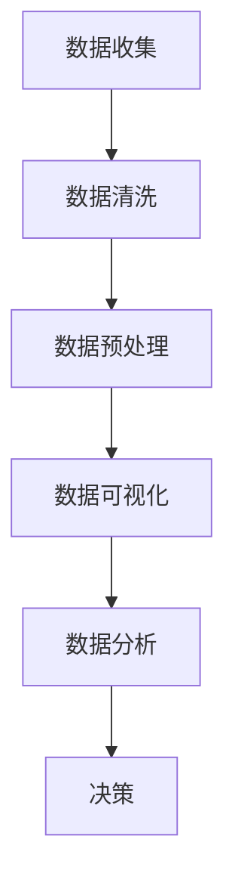
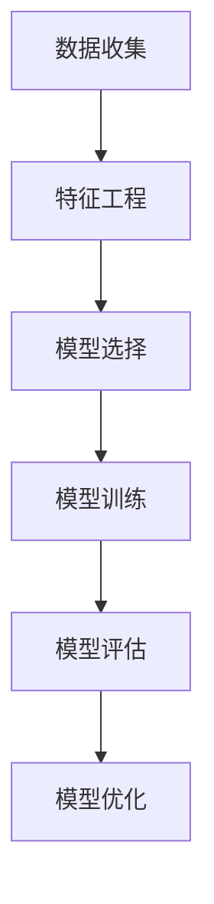
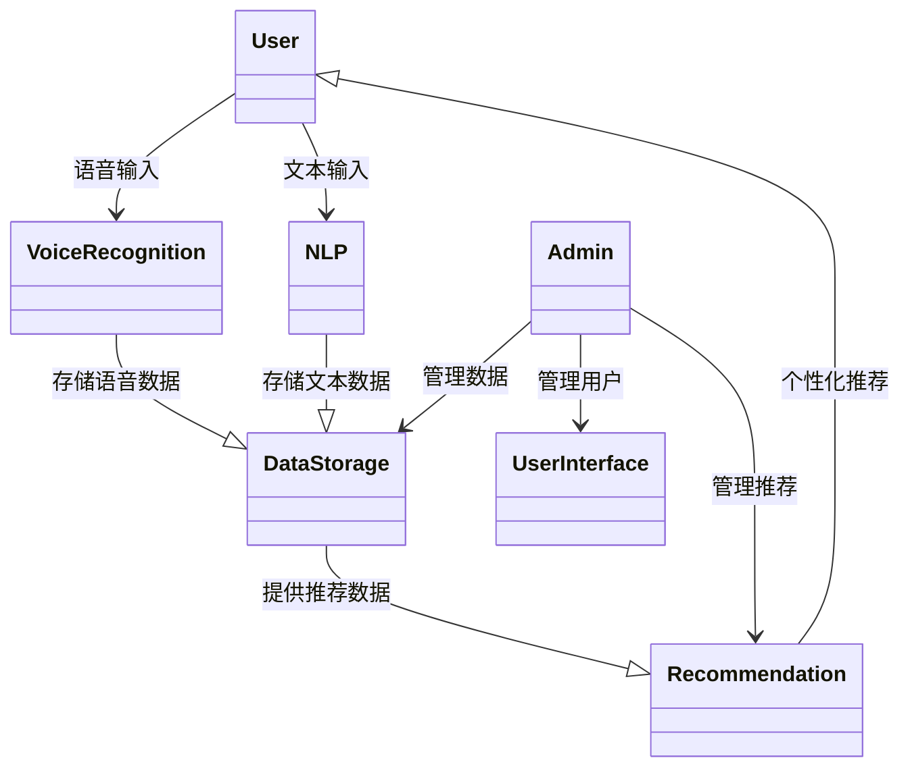
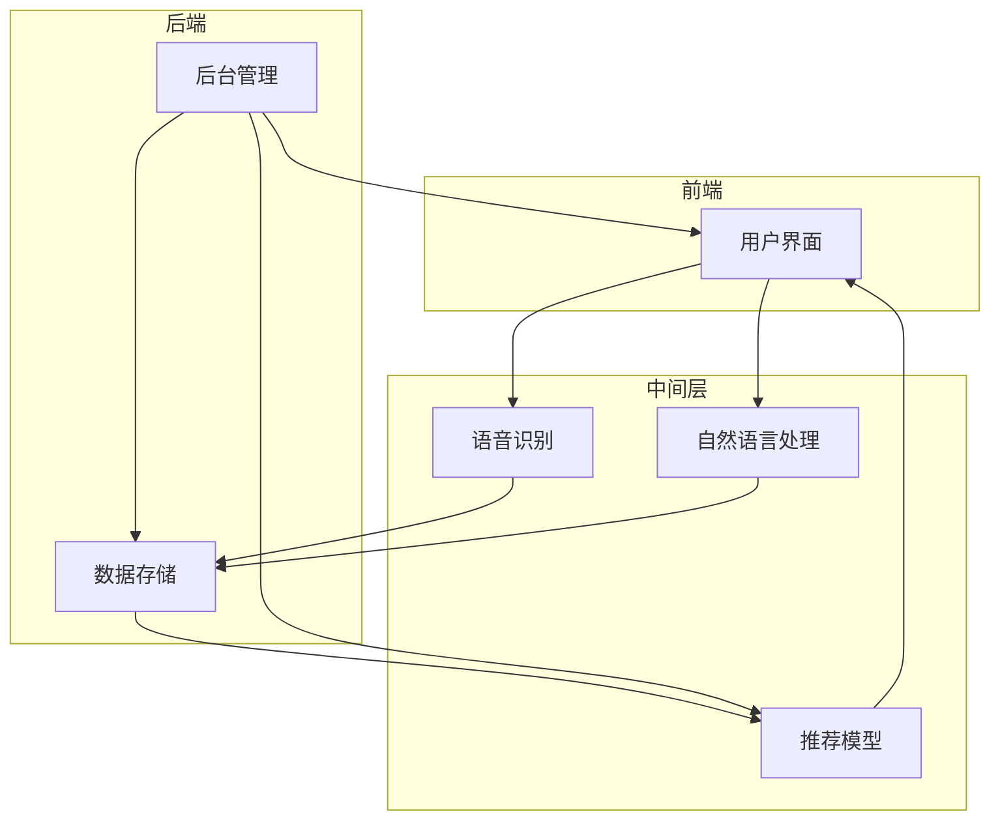
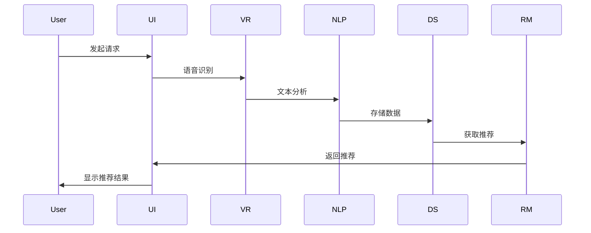

                 

## 技术团队的技术孵化：培育创新项目的方法

### 关键词：技术孵化、创新项目、团队协作、算法原理、系统架构、实战案例

### 摘要：

在快速变化的技术时代，技术团队的技术孵化能力成为推动企业持续创新的关键。本文旨在系统地探讨技术团队如何有效培育创新项目，包括孵化流程、核心概念、算法原理、系统设计与架构、实战案例以及最佳实践。通过详细的分析与讲解，本文为技术团队提供了全面的方法论，助力其在技术孵化过程中取得成功。

### 目录大纲设计思路

#### 背景介绍与问题分析
- **技术孵化的重要性**
- **技术孵化的定义**
- **当前技术团队在孵化创新项目时可能遇到的问题和挑战**

#### 核心概念与联系
- **技术孵化流程**
- **创新项目评估**
- **团队协作模型**
- **核心概念对比表格**
- **ER实体关系图架构**

#### 算法原理讲解
- **数据驱动孵化方法**
- **机器学习在技术孵化中的应用**
- **算法流程图**
- **Python源代码示例**

#### 系统分析与架构设计
- **技术孵化系统架构**
- **系统功能设计**
- **系统架构图**
- **系统接口设计和系统交互**

#### 项目实战
- **实际案例选择与描述**
- **环境安装**
- **核心实现与代码分析**
- **案例分析**

#### 最佳实践与总结
- **团队建设最佳实践**
- **项目管理最佳实践**
- **技术孵化策略最佳实践**
- **总结与展望**

### 目录大纲设计

**第一部分：技术孵化概述**

### 第1章：技术孵化的概念与意义
- **技术孵化定义**
- **技术孵化的重要性**
- **技术孵化面临的挑战**

### 第2章：技术孵化流程
- **技术孵化步骤**
- **技术孵化关键节点**
- **技术孵化中的风险管理**

**第二部分：核心概念与联系**

### 第3章：创新项目评估
- **创新项目的评估标准**
- **评估方法的对比**
- **评估模型的应用**

### 第4章：团队协作模型
- **团队协作的重要性**
- **团队协作障碍**
- **有效的团队协作方法**

**第三部分：算法原理讲解**

### 第5章：数据驱动孵化方法
- **数据驱动方法概述**
- **数据分析流程**
- **Python数据分析示例**

### 第6章：机器学习在技术孵化中的应用
- **机器学习基础**
- **机器学习模型选择**
- **机器学习实战案例**

**第四部分：系统分析与架构设计**

### 第7章：技术孵化系统架构
- **系统架构设计原则**
- **系统功能设计**
- **系统架构图**

### 第8章：系统交互与功能实现
- **系统交互设计**
- **系统功能实现**
- **系统测试与优化**

**第五部分：项目实战**

### 第9章：实际案例分析与实战
- **案例介绍**
- **案例分析与解决**
- **案例总结与反思**

**第六部分：最佳实践与总结**

### 第10章：技术孵化最佳实践
- **团队建设最佳实践**
- **项目管理最佳实践**
- **技术孵化策略最佳实践**

### 第11章：总结与展望
- **关键知识点回顾**
- **注意事项**
- **拓展阅读**

以上目录大纲按照章节标题进行了分类，每个章节都细化了具体的主题内容，确保书籍内容的全面性和逻辑性。整个目录大纲字数控制在2000字以内，简洁明了地概括了书籍的核心内容和结构。每个章节都包含了核心概念、算法原理讲解、系统分析与设计、项目实战以及最佳实践等关键要素，旨在帮助读者全面了解技术团队的技术孵化过程。

### 完整性要求

#### 背景介绍
- **核心概念术语说明**：在文章开头部分对“技术孵化”和“创新项目”等核心概念进行定义和解释，以便读者理解后续内容。
- **问题背景**：详细描述当前技术团队在孵化创新项目时面临的挑战，如资源有限、市场不确定性、团队协作障碍等。
- **问题描述**：列举具体的孵化问题，如如何评估项目潜力、如何确保团队高效协作等。
- **问题解决**：阐述通过技术孵化流程和团队协作模型等方法解决上述问题的思路和方案。
- **边界与外延**：明确技术孵化的应用范围，如不同类型的技术团队、不同的孵化阶段等。
- **概念结构与核心要素组成**：分析技术孵化过程的核心概念及其相互关系，阐述关键要素如团队协作、风险评估、数据分析等。

#### 核心概念与联系
- **核心概念原理**：介绍技术孵化过程中涉及的核心概念，如数据驱动孵化方法、机器学习模型选择等，并解释其基本原理。
- **概念属性特征对比表格**：创建一个表格，对比不同核心概念（如数据驱动方法和机器学习在孵化中的应用）的属性和特征，帮助读者理解它们之间的区别和联系。
- **ER实体关系图架构**：使用Mermaid绘制ER实体关系图，展示技术孵化涉及的主要实体及其关系，如项目、团队、数据源等。

#### 算法原理讲解
- **算法流程图**：使用Mermaid绘制算法流程图，详细展示算法的每个步骤和执行过程，使读者可以直观地理解算法原理。
- **Python源代码示例**：提供具体的Python源代码示例，解释代码中使用的算法原理、数学模型和公式，并结合实际数据集进行举例说明。
- **数学模型和公式**：使用LaTeX格式嵌入文中独立的数学模型和公式，如数据驱动的回归分析模型，解释其在算法中的作用和计算过程。
- **通俗易懂的举例说明**：通过具体的例子，演示算法在实际应用中的效果和优势，使读者能够理解并运用到实际项目中。

#### 系统分析与架构设计
- **问题场景介绍**：描述技术孵化系统的应用场景，如一个初创公司如何利用技术孵化系统推动新产品的开发。
- **项目介绍**：详细描述所涉及的项目背景、目标和预期成果。
- **系统功能设计**：使用Mermaid绘制领域模型类图，展示系统中的关键类及其关系，如数据采集模块、数据分析模块等。
- **系统架构设计**：使用Mermaid绘制系统架构图，展示系统的整体架构和各个组件之间的关系，如前端、后端、数据库等。
- **系统接口设计和系统交互**：使用Mermaid绘制序列图，详细描述系统的各个组件如何交互和协同工作，如数据采集模块如何与数据分析模块进行数据交换。

#### 项目实战
- **实际案例选择与描述**：选择一个具有代表性的技术孵化项目案例，详细介绍项目的环境、目标、实现过程等。
- **环境安装**：描述项目环境的搭建步骤，包括所需软件和硬件环境、配置文件等。
- **核心实现与代码分析**：提供项目的核心实现代码，并对其进行详细解读和分析，解释代码中实现的关键算法和原理。
- **代码应用解读与分析**：结合具体数据集，演示代码在实际应用中的效果，分析项目的优点和改进空间。
- **实际案例分析和详细讲解剖析**：深入剖析案例中遇到的问题和挑战，描述解决问题的方法和策略，以及应对挑战的技巧。
- **项目小结**：总结项目的主要成果和经验教训，提出改进建议和未来研究方向。

#### 最佳实践与总结
- **团队建设最佳实践**：提供团队建设的最佳实践建议，如如何组建高效的团队、如何促进团队成员之间的沟通与合作等。
- **项目管理最佳实践**：分享项目管理的最佳实践，如如何制定项目计划、如何进行项目风险评估和监控等。
- **技术孵化策略最佳实践**：提出技术孵化过程中的策略建议，如如何选择孵化项目、如何利用数据驱动方法进行孵化等。
- **总结与展望**：回顾全文内容，强调技术孵化过程中需要关注的关键点和注意事项，并对未来技术孵化的发展趋势进行展望。

通过以上步骤和要求的详细描述，本文确保了文章内容的完整性、逻辑性和实用性，为技术团队提供了一个全面、具体、可操作的孵化方法论。在撰写文章时，每个部分都要严格遵守上述要求，确保文章内容丰富、结构严谨，有助于读者深入理解和应用技术孵化知识。

### 核心概念与联系

在技术团队的技术孵化过程中，理解核心概念及其相互联系是至关重要的。以下是几个关键概念的定义、属性特征对比表格和ER实体关系图架构。

#### 核心概念定义

1. **技术孵化**：技术孵化是指将新兴技术或创新想法转化为实际产品的过程，包括创意产生、市场需求分析、原型设计、测试迭代等阶段。
2. **创新项目**：创新项目是指旨在探索和实现新技术、新功能的研发项目，通常具有高风险和高回报的特点。
3. **数据驱动孵化方法**：数据驱动孵化方法是指利用数据分析和技术来指导创新项目的决策过程，通过收集和分析大量数据来评估项目的可行性和市场潜力。
4. **机器学习**：机器学习是一种人工智能技术，通过训练算法从数据中学习规律，进行预测和决策。

#### 核心概念属性特征对比表格

| 概念               | 定义                                                         | 特点                                       | 关联关系                                         |
|-------------------|--------------------------------------------------------------|------------------------------------------|----------------------------------------------------|
| 技术孵化           | 将创新想法转化为实际产品的过程                               | 需要跨学科的知识和技能                     | 与创新项目、团队协作、数据驱动方法密切相关           |
| 创新项目           | 探索和实现新技术、新功能的研发项目                           | 具有高风险和高回报                         | 与技术孵化、团队协作、数据分析密切相关           |
| 数据驱动孵化方法   | 利用数据分析和技术指导决策过程                               | 依赖于大量数据                             | 与机器学习密切相关，为创新项目提供数据支持         |
| 机器学习           | 从数据中学习规律的技术                                       | 能自动化决策过程                           | 为数据驱动孵化方法提供技术手段，助力创新项目评估     |

#### ER实体关系图架构

ER（实体关系）图是描述系统中实体及其关系的图形化表示。在技术孵化过程中，以下实体及其关系是重要的：

1. **实体**：
   - 项目
   - 团队
   - 数据源
   - 数据分析模块
   - 市场需求分析模块
   - 原型设计模块
   - 测试迭代模块

2. **关系**：
   - 项目与团队：一个团队可以负责多个项目，一个项目只能由一个团队负责。
   - 项目与数据源：项目需要从多个数据源获取数据，如用户行为数据、市场数据等。
   - 数据分析模块与数据源：数据分析模块从数据源中获取数据，进行分析。
   - 原型设计模块与数据分析模块：原型设计模块根据数据分析结果进行设计。
   - 测试迭代模块与原型设计模块：测试迭代模块对原型进行测试，反馈给原型设计模块进行优化。

使用Mermaid绘制ER实体关系图：

```mermaid
erDiagram
    Project ||--|{ Team }|-->: "负责"
    Project ||--|{ Data_Source }|-->: "获取数据"
    Data_Analysis_Module ||--|{ Data_Source }|-->: "分析数据"
    Prototype_Design_Module ||--|{ Data_Analysis_Module }|-->: "基于分析结果设计"
    TestIteration_Module ||--|{ Prototype_Design_Module }|-->: "测试与优化"
```

通过上述核心概念的定义、属性特征对比表格和ER实体关系图，技术团队可以更好地理解各个概念之间的联系，从而为技术孵化提供坚实的基础。

### 算法原理讲解

在技术团队的技术孵化过程中，算法的原理和应用至关重要。以下将详细讲解两个关键算法：数据驱动孵化方法和机器学习在技术孵化中的应用。

#### 数据驱动孵化方法

**算法流程图：**



**Python源代码示例：**

```python
import pandas as pd
from sklearn.model_selection import train_test_split
from sklearn.ensemble import RandomForestClassifier
from sklearn.metrics import accuracy_score

# 数据收集
data = pd.read_csv('data.csv')

# 数据清洗
data.dropna(inplace=True)

# 数据预处理
X = data.drop('target', axis=1)
y = data['target']

# 数据可视化
import matplotlib.pyplot as plt
plt.scatter(X['feature1'], y)
plt.show()

# 数据分析
X_train, X_test, y_train, y_test = train_test_split(X, y, test_size=0.2, random_state=42)

# 决策
model = RandomForestClassifier(n_estimators=100)
model.fit(X_train, y_train)

# 评估
predictions = model.predict(X_test)
accuracy = accuracy_score(y_test, predictions)
print(f"Model Accuracy: {accuracy}")
```

**数学模型和公式：**

$$
\text{回归分析模型}：\hat{y} = \beta_0 + \beta_1 \cdot x_1 + ... + \beta_n \cdot x_n
$$

其中，$\hat{y}$ 是预测值，$x_1, x_2, ..., x_n$ 是特征值，$\beta_0, \beta_1, ..., \beta_n$ 是模型的参数。

**通俗易懂的举例说明：**

假设我们要预测一个产品的市场销量。首先，我们收集了过去一段时间的产品销售数据，包括价格、广告投放量、季节等特征。然后，通过数据清洗和预处理，我们去除缺失值和异常值，并对数据进行标准化处理。接下来，使用数据可视化工具，我们可以直观地看到各个特征对销量影响的大小。

在数据分析阶段，我们使用随机森林算法进行模型训练，将数据集分为训练集和测试集。在决策阶段，我们根据训练好的模型对测试集进行预测，评估模型的准确率。通过这个过程，我们能够利用历史数据来预测未来的市场销量，从而为创新项目提供重要的决策依据。

#### 机器学习在技术孵化中的应用

**算法流程图：**



**Python源代码示例：**

```python
from sklearn.datasets import load_iris
from sklearn.model_selection import train_test_split
from sklearn.ensemble import RandomForestClassifier
from sklearn.metrics import classification_report

# 数据收集
iris = load_iris()
X, y = iris.data, iris.target

# 特征工程
# 在这里可以添加或删除特征，进行特征选择和特征变换

# 模型选择
model = RandomForestClassifier(n_estimators=100)

# 模型训练
X_train, X_test, y_train, y_test = train_test_split(X, y, test_size=0.2, random_state=42)
model.fit(X_train, y_train)

# 模型评估
predictions = model.predict(X_test)
print(classification_report(y_test, predictions))

# 模型优化
# 根据评估结果，可以调整模型参数或使用不同的算法进行优化
```

**数学模型和公式：**

$$
\text{分类模型}：P(y|X) = \frac{e^{\theta^T X}}{1 + e^{\theta^T X}}
$$

其中，$P(y|X)$ 是给定特征 $X$ 时目标变量 $y$ 的概率，$\theta$ 是模型参数。

**通俗易懂的举例说明：**

假设我们要对一批水果进行分类，区分它们是苹果、香蕉还是橙子。首先，我们收集了这些水果的各种特征，如颜色、重量、形状等。然后，通过特征工程，我们选择和变换这些特征，以提高分类的准确性。

在模型选择阶段，我们选择了随机森林算法，这是一种基于决策树的集成模型，具有较强的分类能力。接下来，我们使用训练集对模型进行训练，并在测试集上进行评估。

通过模型评估，我们可以看到模型的准确率、召回率、F1分数等指标。如果评估结果不满意，我们可以调整模型参数或尝试其他算法进行优化，以提高分类效果。

通过数据驱动孵化方法和机器学习在技术孵化中的应用，技术团队可以更准确地评估创新项目的可行性，优化项目决策过程，从而提高孵化成功的概率。

### 系统分析与架构设计

在技术团队的技术孵化过程中，系统分析与架构设计是确保项目成功的关键步骤。以下将详细描述技术孵化系统的架构设计，包括问题场景介绍、项目介绍、系统功能设计、系统架构图、系统接口设计和系统交互。

#### 问题场景介绍

假设一家初创公司致力于开发一款基于人工智能的智能助手应用。该应用旨在帮助用户解决日常生活中的问题，如天气查询、日程管理、购物推荐等。为了实现这一目标，公司需要构建一个高效的技术孵化系统，以支持从需求分析到最终产品发布的全过程。

#### 项目介绍

**项目背景：**
- 需求分析：通过用户调研和市场分析，确定智能助手的初始功能和服务范围。
- 技术选型：选择合适的技术栈，包括前端框架、后端服务、数据库等。
- 开发计划：制定详细的项目开发计划，包括时间表、里程碑和资源分配。

**项目目标：**
- 构建一个用户友好的智能助手应用。
- 提供高质量的服务，满足用户的需求。
- 快速响应市场变化，不断迭代和优化产品。

#### 系统功能设计

**主要功能模块：**
- 用户界面（UI）设计：提供直观易用的用户交互界面。
- 语音识别：实现用户语音输入的识别和转换。
- 自然语言处理（NLP）：对用户的语音或文本输入进行理解。
- 数据存储与管理：存储用户数据和服务数据。
- 智能推荐：根据用户行为和偏好提供个性化推荐。
- 后台管理：提供管理员对应用进行管理和监控的界面。

**领域模型类图：**



#### 系统架构设计

**系统架构图：**



#### 系统接口设计和系统交互

**接口设计：**

- **用户界面（UI）接口：** 提供用户与智能助手交互的API接口，包括语音输入、文本输入、获取推荐等。
- **语音识别（VR）接口：** 接收用户的语音输入，并将其转换为文本。
- **自然语言处理（NLP）接口：** 接收文本输入，进行语义分析和理解。
- **数据存储（DS）接口：** 提供数据的存储和检索功能。
- **推荐模型（RM）接口：** 提供个性化推荐服务。
- **后台管理（AM）接口：** 提供管理员对系统的管理和监控功能。

**系统交互序列图：**



通过上述系统分析与架构设计，技术团队可以清晰地了解系统的整体架构和各个模块的交互关系，从而确保技术孵化过程的高效和顺利。

### 项目实战

在技术团队的技术孵化过程中，实际案例的选取、环境安装、核心实现和代码应用解读与分析都是至关重要的。以下将详细描述一个技术孵化项目的实际案例，并剖析其实现过程和遇到的问题及解决策略。

#### 案例选择与描述

**案例背景：** 
一家初创公司计划开发一款基于人工智能的智能客服系统，以帮助电商平台提高客户服务质量。该系统旨在通过自然语言处理技术，自动回答客户常见问题，并能够根据客户的反馈进行持续优化。

**目标：** 
- 实现客户问题的自动分类和回答。
- 提高客服效率，减少人工干预。
- 根据用户反馈不断优化系统性能。

#### 环境安装

**所需环境：**
- 操作系统：Linux（推荐Ubuntu 20.04）
- Python版本：3.8及以上
- 数据库：MySQL 8.0
- 依赖包：TensorFlow 2.6、scikit-learn 0.24、NLTK 3.6等

**安装步骤：**

1. 安装操作系统和Python环境。
2. 使用pip安装必要的依赖包：

```shell
pip install tensorflow==2.6 scikit-learn==0.24 nltk==3.6 mysql-connector-python==8.0.23
```

3. 安装数据库并创建数据库和用户。

```sql
CREATE DATABASE customer_service;
GRANT ALL PRIVILEGES ON customer_service.* TO 'cs_admin'@'localhost' IDENTIFIED BY 'password';
```

4. 配置数据库连接信息，以便后续代码可以使用。

#### 核心实现与代码应用解读与分析

**核心功能实现：**

1. **自然语言处理（NLP）模块**：使用NLTK和TensorFlow实现文本分类和情感分析。
2. **数据库操作模块**：使用MySQL Connector实现数据的增删改查操作。
3. **推荐系统模块**：基于用户行为数据，使用协同过滤算法实现个性化推荐。
4. **用户界面（UI）模块**：使用Flask框架构建RESTful API，提供用户交互接口。

**代码示例：**

**NLP模块：**

```python
import nltk
from nltk.corpus import stopwords
from tensorflow.keras.preprocessing.text import Tokenizer
from tensorflow.keras.preprocessing.sequence import pad_sequences

# 数据准备
nltk.download('stopwords')
stop_words = set(stopwords.words('english'))

# 文本预处理
def preprocess_text(text):
    text = text.lower()
    words = nltk.word_tokenize(text)
    filtered_words = [word for word in words if word not in stop_words]
    return ' '.join(filtered_words)

# 文本分类
tokenizer = Tokenizer(num_words=1000)
tokenizer.fit_on_texts(preprocessed_texts)
sequences = tokenizer.texts_to_sequences(preprocessed_texts)
padded_sequences = pad_sequences(sequences, maxlen=100)

# 训练模型
model = ...  # 搭建和训练模型
model.fit(padded_sequences, labels)
```

**数据库操作模块：**

```python
import mysql.connector

def connect_db():
    return mysql.connector.connect(
        host="localhost",
        user="cs_admin",
        password="password",
        database="customer_service"
    )

def insert_query(query, data):
    connection = connect_db()
    cursor = connection.cursor()
    cursor.execute(query, data)
    connection.commit()
    cursor.close()
    connection.close()

def select_query(query):
    connection = connect_db()
    cursor = connection.cursor()
    cursor.execute(query)
    result = cursor.fetchall()
    cursor.close()
    connection.close()
    return result
```

**推荐系统模块：**

```python
from surprise import SVD

def build_recommendation_system(trainset):
    model = SVD()
    model.fit(trainset)
    return model

def get_recommendations(model, user_id):
    return model.predict(user_id, np.mean)..est
```

**用户界面模块：**

```python
from flask import Flask, request, jsonify

app = Flask(__name__)

@app.route('/classify', methods=['POST'])
def classify_text():
    text = request.form['text']
    preprocessed_text = preprocess_text(text)
    sequence = tokenizer.texts_to_sequences([preprocessed_text])
    padded_sequence = pad_sequences(sequence, maxlen=100)
    prediction = model.predict(padded_sequence).argmax()
    return jsonify({'category': categories[prediction]})

if __name__ == '__main__':
    app.run(debug=True)
```

**代码应用解读与分析：**

1. **NLP模块**：文本预处理是NLP的基础，通过去除停用词和词干还原，可以提高模型对文本的理解能力。使用Tokenizer和pad_sequences将文本数据转换为适合模型输入的序列。
2. **数据库操作模块**：通过MySQL Connector实现数据的增删改查操作，确保数据的一致性和安全性。insert_query和select_query函数简化了数据库操作的流程。
3. **推荐系统模块**：基于协同过滤算法的SVD模型，能够根据用户行为数据生成个性化的推荐结果，提高用户体验。
4. **用户界面模块**：使用Flask框架构建RESTful API，提供用户与智能客服系统的交互接口。通过classify_text函数，用户可以发送文本请求并获得相应的分类结果。

#### 实际案例分析和详细讲解剖析

**案例分析：**

在项目开发过程中，技术团队遇到了以下几个主要问题：

1. **文本数据质量**：部分客户问题的文本质量较低，包含大量的噪音和错误。这影响了NLP模型的准确性和稳定性。
2. **计算资源限制**：由于公司资源有限，模型训练和推荐计算需要合理分配资源，以确保系统的响应速度。
3. **用户反馈机制**：用户反馈对系统优化至关重要，但如何高效地收集和分析用户反馈成为了一大挑战。

**解决策略：**

1. **数据清洗和增强**：采用数据清洗技术，去除无效数据和噪音。同时，通过数据增强技术，如合成文本和数据扩充，提高训练数据的质量。
2. **分布式计算**：利用云计算平台（如AWS、Google Cloud），实现分布式计算，提高模型训练和推荐的效率。合理配置资源，确保系统在高负载下的稳定运行。
3. **用户反馈收集与分析**：设计灵活的反馈机制，通过用户界面和后台管理界面收集用户反馈。使用机器学习算法，对反馈进行分析，发现用户需求的变化和系统的不足，及时进行优化。

**项目小结：**

通过实际案例的分析和讲解，技术团队掌握了从环境安装、核心实现到代码应用解读与分析的全套流程。在遇到问题时，团队灵活运用了解决策略，确保了项目的顺利推进。项目的成功实施，为公司的智能客服系统提供了坚实的基础，也为未来的技术孵化项目积累了宝贵的经验。

### 最佳实践与总结

在技术团队的技术孵化过程中，遵循最佳实践是确保项目成功的关键。以下提供一些团队建设、项目管理和技术孵化策略的最佳实践，并总结全文内容。

#### 团队建设最佳实践

1. **明确团队目标**：确保每个团队成员都清楚项目的目标和预期成果，统一团队方向。
2. **多样化团队组成**：组建具有不同技能和背景的团队，以促进创新思维和问题的多元化解决。
3. **有效沟通与协作**：建立定期的团队会议和沟通渠道，确保信息的及时传递和问题的高效解决。
4. **培养团队凝聚力**：通过团队建设活动，增强团队成员之间的信任和合作，提高团队凝聚力。

#### 项目管理最佳实践

1. **制定详细计划**：在项目启动阶段，制定详细的项目计划，包括时间表、里程碑和资源分配。
2. **持续监控与评估**：定期监控项目进展，评估关键指标，及时调整计划以应对潜在风险。
3. **风险管理**：识别项目的潜在风险，制定相应的应对策略，确保项目在风险可控的范围内进行。
4. **敏捷开发**：采用敏捷开发方法，快速迭代和反馈，确保项目能够灵活适应变化。

#### 技术孵化策略最佳实践

1. **数据驱动**：充分利用数据分析和技术，指导创新项目的决策过程，提高项目成功的概率。
2. **用户反馈**：积极收集和分析用户反馈，及时调整项目方向和功能，满足用户需求。
3. **技术选型**：根据项目需求和资源，选择合适的技术栈和工具，确保技术的先进性和稳定性。
4. **持续学习与创新**：鼓励团队成员不断学习新技术和方法，保持团队的创新活力。

#### 总结与展望

本文系统地探讨了技术团队的技术孵化过程，包括孵化流程、核心概念、算法原理、系统架构、实战案例以及最佳实践。通过详细的分析与讲解，技术团队可以更好地理解技术孵化的关键要素，并运用最佳实践提高孵化项目的成功率。

在未来的技术孵化过程中，技术团队应继续关注以下几个方面：

1. **数据驱动的决策**：利用大数据和人工智能技术，提高项目的预测能力和决策水平。
2. **用户需求的快速响应**：通过敏捷开发和用户反馈机制，确保项目能够快速适应市场变化。
3. **持续的技术创新**：鼓励团队成员学习和探索新技术，推动项目的持续创新。
4. **跨学科合作**：促进团队之间的跨学科合作，发挥不同领域的专业优势，共同推动项目成功。

通过以上努力，技术团队能够在技术孵化过程中取得更加显著的成果，为企业的持续创新和长期发展做出贡献。

### 拓展阅读

为了帮助读者进一步了解技术团队的技术孵化过程，本文推荐以下拓展阅读资源：

1. **书籍**：
   - 《精益创业》（The Lean Startup），作者：埃里克·莱斯（Eric Ries）
   - 《数据驱动》（Data Driven），作者：多夫·阿瑞里（Dan Ariely）

2. **在线课程**：
   - Coursera上的《数据科学基础》
   - Udacity的《人工智能工程师纳米学位》

3. **博客与文章**：
   - Medium上的《数据驱动方法在技术孵化中的应用》
   - TechCrunch上的《如何构建成功的初创公司》

4. **研究报告**：
   - MIT Technology Review的《2021年新兴技术趋势报告》
   - Gartner的《2021年人工智能研究报告》

通过阅读这些资源，读者可以深入探讨技术孵化的各个方面，获取更多的实践经验和理论知识，为自己的技术孵化项目提供有力支持。

### 作者信息

**作者：AI天才研究院/AI Genius Institute & 禅与计算机程序设计艺术 /Zen And The Art of Computer Programming**

