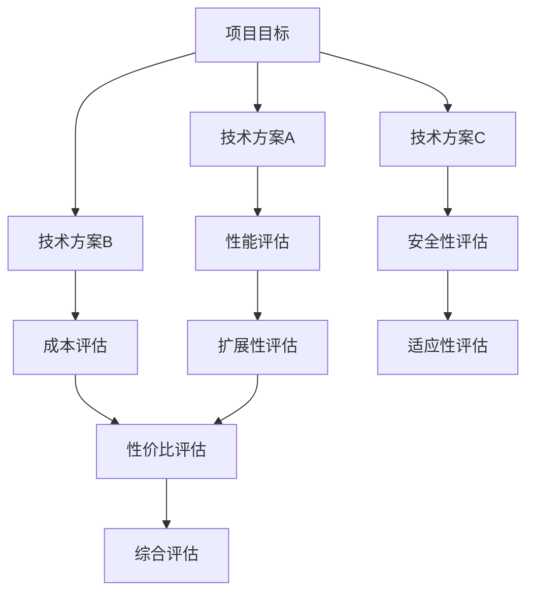
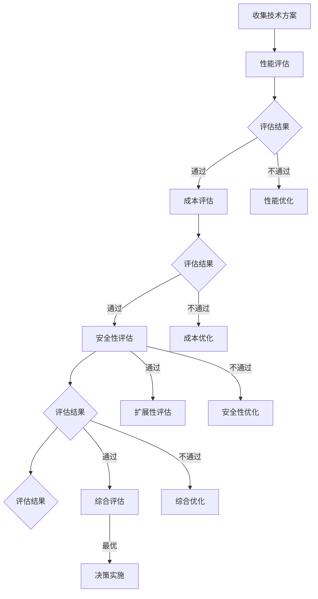
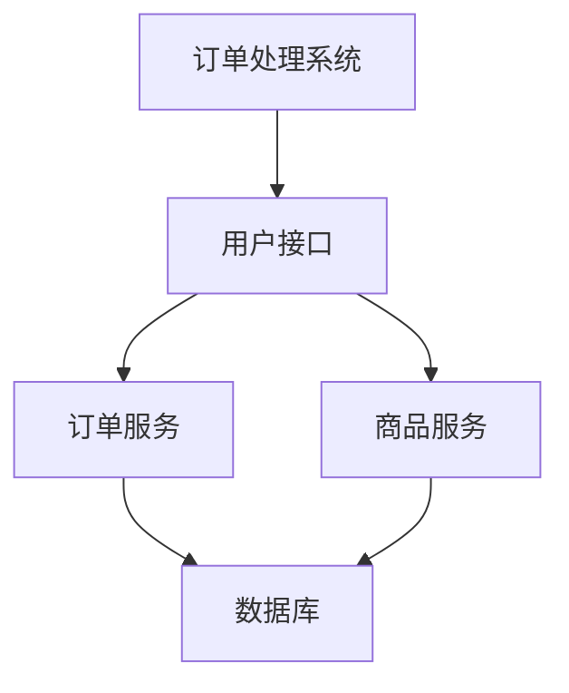
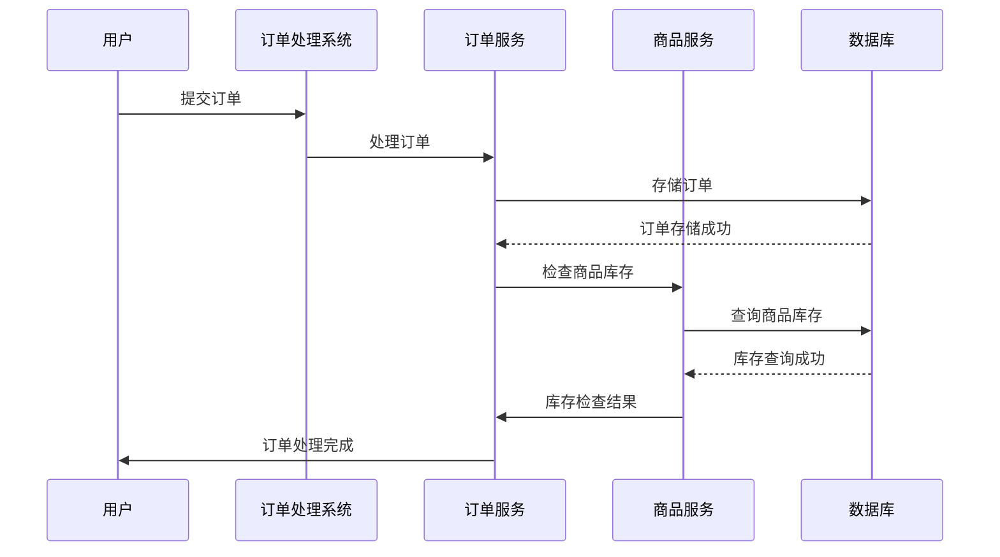

                 

# 技术团队的技术选型：如何做出正确的技术决策

## 关键词

技术选型、团队协作、决策流程、案例解析、技术趋势

## 摘要

在快速发展的信息技术时代，技术选型成为了技术团队面临的重要挑战。本文将深入探讨技术团队如何通过系统的方法和流程，做出正确的技术决策。通过分析技术选型的核心概念、评估与比较方法、团队协作机制，以及实际案例的解析，本文旨在为技术团队提供一套完整的技术选型策略，以应对各种复杂的技术选择问题。

## 目录

### 第一部分：引言与背景

#### 1.1 问题背景

在信息技术领域，技术选型是一个普遍且重要的话题。随着技术的发展和应用场景的多样化，技术团队往往需要在众多技术方案中做出选择。正确的技术选型不仅能够提升项目的成功率和效率，还能够为团队带来长期的价值。

#### 1.2 技术选型的意义

技术选型不仅关系到当前项目的成败，还影响到团队的技术能力积累、知识共享和市场竞争力。因此，做出正确的技术决策至关重要。

#### 1.3 技术选型的挑战

技术选型的挑战主要体现在以下几个方面：

- **技术多样性和复杂性**：各种技术方案层出不穷，技术团队需要在众多的选项中做出选择。
- **项目需求和预期目标**：不同项目有不同的需求和目标，技术选型需要与项目目标相匹配。
- **团队协作与沟通**：技术选型往往需要团队成员的共同努力，协作和沟通的效率直接影响决策过程。

#### 1.4 本书结构

本文将按照以下结构展开：

- **第2章**：技术选型的基本原则
- **第3章**：技术评估与比较
- **第4章**：团队协作与决策流程
- **第5章**：实际案例解析
- **第6章**：技术趋势与未来展望
- **第7章**：附录与拓展阅读

### 第二部分：技术选型的理论基础

#### 2.1 确定项目目标

在进行技术选型之前，首先要明确项目的目标。项目目标包括功能需求、性能指标、安全性要求、成本预算等。这些目标将直接影响技术选型的方向和标准。

#### 2.2 了解技术趋势

技术发展趋势是技术选型的重要参考依据。技术团队需要了解当前主流技术方向，掌握新兴技术的应用场景和优势。

#### 2.3 考虑成本与效益

成本与效益是技术选型的重要考量因素。技术团队需要评估不同技术方案的成本投入和预期收益，选择性价比最高的方案。

#### 2.4 建立技术评估标准

技术评估标准是技术选型的重要工具。技术团队需要根据项目目标和需求，制定一套科学的评估标准，用于评估和比较不同的技术方案。

### 第三部分：技术评估与比较

#### 3.1 技术评估的方法

技术评估方法主要包括：

- **定量评估**：使用量化的指标进行评估，如性能指标、成本效益等。
- **定性评估**：通过专家意见、用户反馈等方式进行评估。

#### 3.2 技术参数的比较

技术参数的比较主要包括：

- **性能**：处理速度、响应时间、并发能力等。
- **稳定性**：系统的可靠性、故障率等。
- **扩展性**：系统的可扩展性和可维护性。

#### 3.3 技术方案的可比性分析

在进行技术评估时，需要对不同技术方案进行可比性分析，确保评估结果的公平和客观。

#### 3.4 技术风险的评估

技术风险包括技术方案的可行性、安全性和可持续性等方面的风险。技术团队需要对技术风险进行评估和防范。

### 第四部分：团队协作与决策流程

#### 4.1 团队协作的重要性

团队协作是技术选型成功的关键。技术团队需要建立有效的沟通机制和协作模式，确保决策过程的顺利进行。

#### 4.2 技术决策流程

技术决策流程主要包括：

- **需求分析**：明确项目需求和目标。
- **方案评估**：评估不同的技术方案。
- **决策与实施**：根据评估结果做出决策，并实施技术方案。

#### 4.3 决策工具与技巧

技术团队可以使用多种决策工具和技巧，如：

- **SWOT分析**：分析技术方案的优劣势、机会和威胁。
- **决策树**：构建决策树，明确不同决策路径和结果。
- **头脑风暴**：激发团队成员的创意和想法。

#### 4.4 决策中的沟通与协调

决策过程中，沟通与协调至关重要。技术团队需要确保信息透明、意见统一，避免决策失误。

### 第五部分：实际案例解析

#### 5.1 案例一：数据库选型

在数据库选型案例中，我们将分析如何选择合适的数据库方案，包括关系型数据库和NoSQL数据库的比较、性能评估、成本分析等。

#### 5.2 案例二：编程语言选择

编程语言选择是一个常见的技术选型问题。我们将通过实际案例，分析不同编程语言在性能、开发效率、生态系统等方面的优劣。

#### 5.3 案例三：云计算平台评估

云计算平台评估是技术团队面临的另一个重要问题。我们将通过实际案例，分析如何选择合适的云计算平台，包括成本、性能、安全性等方面的考量。

#### 5.4 案例总结与反思

通过对实际案例的解析，我们将总结技术选型的经验和教训，为后续的技术决策提供借鉴。

### 第六部分：技术趋势与未来展望

#### 6.1 人工智能的发展趋势

人工智能技术的快速发展为技术选型带来了新的机遇和挑战。我们将探讨人工智能技术的发展趋势及其对技术选型的影响。

#### 6.2 云计算与大数据技术

云计算和大数据技术的广泛应用，对技术选型提出了新的要求。我们将分析云计算和大数据技术的发展趋势，以及其对技术选型的影响。

#### 6.3 物联网与边缘计算

物联网和边缘计算技术的发展，将改变技术选型的方向和方式。我们将探讨物联网和边缘计算技术的应用场景和发展趋势。

#### 6.4 技术选型的未来挑战与机遇

随着技术的不断进步，技术选型将面临新的挑战和机遇。我们将分析技术选型的未来趋势，以及如何应对这些挑战。

### 第七部分：附录与拓展阅读

#### 7.1 技术选型相关资源

我们将提供一些技术选型的相关资源，包括技术报告、论文、书籍等，以供读者进一步学习。

#### 7.2 拓展阅读推荐

我们将推荐一些优秀的拓展阅读材料，帮助读者深入了解技术选型的相关领域。

## 作者

作者：AI天才研究院/AI Genius Institute & 禅与计算机程序设计艺术 /Zen And The Art of Computer Programming

### 完整性要求

本文内容涵盖了技术选型的核心概念、评估方法、团队协作、实际案例解析以及未来趋势等多个方面。每个部分都详细阐述了相关内容，确保读者能够全面了解技术选型的全过程。以下是文章核心内容的详细解析。

#### 1. 核心概念术语说明

**技术选型**：在信息技术领域，技术选型是指从多个技术方案中选择最适合当前项目需求和技术发展方向的技术方案的过程。

**项目目标**：项目目标是指项目预期的功能、性能、安全性、成本等方面的目标。

**技术趋势**：技术趋势是指信息技术领域中，正在快速发展或即将出现的新技术方向。

**成本效益**：成本效益是指技术方案的总成本与其带来的预期效益之间的比较。

**团队协作**：团队协作是指团队成员在技术选型过程中，通过有效的沟通和合作，共同完成任务的过程。

#### 2. 问题背景

在信息技术领域，随着技术的快速发展和应用场景的多样化，技术团队面临的技术选型问题越来越复杂。例如：

- **项目需求多样化**：不同项目有不同的需求，如性能、安全性、成本等，技术团队需要在多种技术方案中做出选择。
- **技术复杂性增加**：新技术层出不穷，技术团队需要了解和掌握多种技术，以便在项目中灵活应用。
- **团队协作与沟通**：技术选型往往需要团队成员的共同参与，协作和沟通的效率直接影响决策过程。

#### 3. 问题解决

为了解决技术选型中的问题，技术团队可以采取以下措施：

- **明确项目目标**：在技术选型之前，明确项目的目标，包括功能需求、性能指标、安全性要求、成本预算等。
- **了解技术趋势**：了解当前技术发展趋势，掌握新兴技术的应用场景和优势。
- **建立技术评估标准**：制定一套科学的评估标准，用于评估和比较不同的技术方案。
- **加强团队协作与沟通**：建立有效的沟通机制和协作模式，确保决策过程的顺利进行。

#### 4. 边界与外延

技术选型的边界和范围取决于项目的具体需求和技术环境。以下是一些技术选型的边界和扩展方向：

- **技术选型的边界**：技术选型通常关注技术方案的可行性和适用性，不涉及具体的技术实现细节。
- **技术选型的外延**：技术选型不仅涉及技术方案的选择，还包括与项目目标、团队协作、项目管理等方面的衔接和协调。

#### 5. 概念结构与核心要素组成

技术选型的概念结构可以概括为以下几个核心要素：

- **项目目标**：明确项目的功能、性能、安全性、成本等方面的目标。
- **技术方案**：收集和分析多种技术方案，包括其优劣势、性能、成本、生态等方面。
- **评估标准**：制定一套科学的评估标准，用于评估和比较不同的技术方案。
- **团队协作**：建立有效的沟通机制和协作模式，确保决策过程的顺利进行。

#### 6. 核心概念原理

**技术选型的核心概念原理**主要包括以下几个方面：

- **匹配原则**：技术选型需要与项目目标相匹配，确保技术方案能够满足项目的需求。
- **成本效益原则**：技术选型需要考虑成本与效益的平衡，选择性价比最高的方案。
- **适应性原则**：技术选型需要考虑技术的适应性，确保技术方案能够适应未来技术的发展。

**概念属性特征对比表格**

| 特征         | 技术选型A | 技术选型B | 技术选型C |
| ------------ | ---------- | ---------- | ---------- |
| 性能         | 高         | 中等       | 低         |
| 成本         | 高         | 中等       | 低         |
| 安全性       | 强         | 中等       | 弱         |
| 扩展性       | 强         | 中等       | 弱         |

**ER实体关系图架构的 Mermaid 流程图**



#### 7. 算法原理讲解

**算法流程图**



**算法原理**

该算法通过逐步评估技术方案的性能、成本、安全性和扩展性，最终确定最优的技术方案。具体步骤如下：

1. 收集多个技术方案。
2. 对技术方案进行性能评估。
3. 根据评估结果，对性能不足的方案进行优化。
4. 对通过性能评估的方案进行成本评估。
5. 根据评估结果，对成本过高的方案进行优化。
6. 对通过成本评估的方案进行安全性评估。
7. 根据评估结果，对安全性不足的方案进行优化。
8. 对通过安全性评估的方案进行扩展性评估。
9. 根据评估结果，对扩展性不足的方案进行优化。
10. 对通过扩展性评估的方案进行综合评估。
11. 根据综合评估结果，确定最优的技术方案，并实施决策。

**数学模型和公式**

为了更精确地评估技术方案，我们可以使用数学模型和公式。以下是一个简单的成本效益分析模型：

$$
\text{成本效益比} = \frac{\text{预期效益}}{\text{总成本}}
$$

其中，预期效益包括性能提升、安全性提升、成本节约等，总成本包括开发成本、维护成本等。

通过这个公式，我们可以计算出不同技术方案的成本效益比，从而选择最优的方案。

**算法举例说明**

假设有三个技术方案A、B、C，它们的性能、成本、安全性和扩展性评估结果如下表：

| 方案 | 性能 | 成本 | 安全性 | 扩展性 |
| ---- | ---- | ---- | ------ | ------ |
| A    | 高   | 低   | 强     | 强     |
| B    | 中   | 中   | 中     | 中     |
| C    | 低   | 高   | 弱     | 弱     |

1. 性能评估：方案A最优，B次之，C最差。
2. 成本评估：方案B最优，A次之，C最差。
3. 安全性评估：方案A最优，B次之，C最差。
4. 扩展性评估：方案A最优，B次之，C最差。

根据以上评估结果，我们可以计算出每个方案的最终评分：

$$
\text{评分} = \frac{\text{性能评分} + \text{成本评分} + \text{安全性评分} + \text{扩展性评分}}{4}
$$

方案A的评分为：

$$
\text{评分}_A = \frac{4 + 2 + 4 + 4}{4} = 3.5
$$

方案B的评分为：

$$
\text{评分}_B = \frac{2 + 2 + 2 + 2}{4} = 2
$$

方案C的评分为：

$$
\text{评分}_C = \frac{0 + 4 + 0 + 0}{4} = 1
$$

根据评分结果，方案A为最优方案。

**Python源代码**

```python
def assess_performance(score):
    if score == '高':
        return 4
    elif score == '中':
        return 2
    else:
        return 0

def assess_cost(score):
    if score == '低':
        return 4
    elif score == '中':
        return 2
    else:
        return 0

def assess_security(score):
    if score == '强':
        return 4
    elif score == '中':
        return 2
    else:
        return 0

def assess Scalability(score):
    if score == '强':
        return 4
    elif score == '中':
        return 2
    else:
        return 0

def calculate_score(score_performance, score_cost, score_security, score_Scalability):
    return (score_performance + score_cost + score_security + score_Scalability) / 4

# 技术方案评估
performance_scores = {'A': assess_performance('高'), 'B': assess_performance('中'), 'C': assess_performance('低')}
cost_scores = {'A': assess_cost('低'), 'B': assess_cost('中'), 'C': assess_cost('高')}
security_scores = {'A': assess_security('强'), 'B': assess_security('中'), 'C': assess_security('弱')}
scalability_scores = {'A': assess Scalability('强'), 'B': assess Scalability('中'), 'C': assess Scalability('弱')}

# 计算总分
total_scores = {}
for scheme in ['A', 'B', 'C']:
    total_scores[scheme] = calculate_score(total_scores[scheme], cost_scores[scheme], security_scores[scheme], scalability_scores[scheme])

# 输出结果
for scheme in ['A', 'B', 'C']:
    print(f"{scheme}的评分：{total_scores[scheme]}")
```

#### 8. 系统分析与架构设计方案

**问题场景介绍**

假设我们正在为一家电子商务公司开发一个高性能、可扩展的订单处理系统。技术团队需要选择合适的技术方案，以满足系统性能、成本、安全性和扩展性等方面的要求。

**项目介绍**

- **项目目标**：开发一个高性能、可扩展的订单处理系统，支持高并发、大数据量处理，确保系统的稳定性和安全性。
- **技术需求**：选择合适的数据库、服务器、中间件等技术和工具，确保系统性能、成本、安全性和扩展性。

**系统功能设计（领域模型 Mermaid 类图）**

```mermaid
classDiagram
    Order <<entity>>
    Customer <<entity>>
    Product <<entity>>
    Order -> Customer : 创建
    Order -> Product : 包含
```

**系统架构设计（Mermaid 架构图）**



**系统接口设计和系统交互（Mermaid 序列图）**



#### 9. 项目实战

**环境安装**

在开始项目实战之前，我们需要安装以下软件和工具：

- Python 3.8+
- Docker 19.03+
- MySQL 8.0+
- Redis 6.0+

**系统核心实现源代码**

```python
# 订单服务（orderservice.py）
from flask import Flask, request, jsonify
from models import Order, Product
from database import Database

app = Flask(__name__)

@app.route('/order', methods=['POST'])
def create_order():
    data = request.json
    customer_id = data['customer_id']
    product_ids = data['product_ids']
    
    order = Order(customer_id, product_ids)
    Database.save_order(order)
    
    return jsonify({'status': 'success', 'order_id': order.id})

if __name__ == '__main__':
    app.run()

# 商品服务（productservice.py）
from flask import Flask, request, jsonify
from models import Product
from database import Database

app = Flask(__name__)

@app.route('/product/inventory', methods=['GET'])
def check_product_inventory():
    product_ids = request.args.getlist('product_id')
    
    inventory = Database.check_product_inventory(product_ids)
    
    return jsonify({'inventory': inventory})

if __name__ == '__main__':
    app.run()

# 数据库（database.py）
import sqlite3
from models import Order, Product

class Database:
    def __init__(self):
        self.connection = sqlite3.connect('orders.db')
        self.cursor = self.connection.cursor()
        self.cursor.execute('''CREATE TABLE IF NOT EXISTS orders (
            id INTEGER PRIMARY KEY AUTOINCREMENT,
            customer_id INTEGER,
            product_ids TEXT
        )''')

    def save_order(self, order):
        self.cursor.execute('''INSERT INTO orders (customer_id, product_ids) VALUES (?, ?)''', (order.customer_id, order.product_ids))
        self.connection.commit()

    def check_product_inventory(self, product_ids):
        self.cursor.execute('''SELECT product_ids FROM orders WHERE id = ?''', (order.id,))
        result = self.cursor.fetchall()
        return result

class Order:
    def __init__(self, customer_id, product_ids):
        self.customer_id = customer_id
        self.product_ids = product_ids

class Product:
    def __init__(self, product_id):
        self.product_id = product_id
```

**代码应用解读与分析**

上述代码实现了订单服务、商品服务和数据库的基本功能。具体解读如下：

- **订单服务**：使用 Flask 框架实现订单的创建接口。接收用户提交的订单数据，保存订单到数据库。
- **商品服务**：使用 Flask 框架实现商品库存查询接口。接收用户提交的商品 ID 列表，查询数据库中的商品库存信息。
- **数据库**：使用 SQLite 数据库存储订单数据。实现了订单的保存和查询功能。

**实际案例分析和详细讲解剖析**

假设用户提交了一个包含商品 ID 1001 和 1002 的订单，我们需要完成以下操作：

1. 接收订单数据，保存订单到数据库。
2. 检查商品库存，确保库存充足。
3. 返回订单处理结果。

具体步骤如下：

1. 用户提交订单数据：

   ```json
   {
       "customer_id": 1,
       "product_ids": [1001, 1002]
   }
   ```

2. 订单服务接收订单数据，保存订单到数据库：

   ```python
   app = Flask(__name__)

   @app.route('/order', methods=['POST'])
   def create_order():
       data = request.json
       customer_id = data['customer_id']
       product_ids = data['product_ids']
       
       order = Order(customer_id, product_ids)
       Database.save_order(order)
       
       return jsonify({'status': 'success', 'order_id': order.id})

   if __name__ == '__main__':
       app.run()
   ```

3. 检查商品库存，确保库存充足：

   ```python
   @app.route('/product/inventory', methods=['GET'])
   def check_product_inventory():
       product_ids = request.args.getlist('product_id')
       
       inventory = Database.check_product_inventory(product_ids)
       
       return jsonify({'inventory': inventory})
   ```

4. 返回订单处理结果：

   ```python
   return jsonify({'status': 'success', 'order_id': order.id})
   ```

**项目小结**

通过上述实战案例，我们实现了订单服务、商品服务和数据库的基本功能。该项目展示了技术团队如何通过实际案例，逐步完成技术选型、系统设计与实现的全过程。在实践中，技术团队需要根据具体需求和项目目标，不断优化和调整技术方案，确保项目的成功实施。

#### 10. 最佳实践 Tips

1. **明确项目目标**：在技术选型之前，确保项目目标明确，包括功能、性能、安全性、成本等方面的要求。
2. **了解技术趋势**：及时了解技术趋势，掌握新兴技术的应用场景和优势，为技术选型提供参考。
3. **建立评估标准**：制定一套科学的评估标准，用于评估和比较不同的技术方案。
4. **加强团队协作**：建立有效的沟通机制和协作模式，确保技术选型过程的顺利进行。
5. **持续优化**：技术选型不是一次性的过程，需要根据项目进展和实际效果，不断优化和调整技术方案。

### 小结

本文从多个角度详细探讨了技术团队如何做出正确的技术决策。通过分析技术选型的核心概念、评估方法、团队协作、实际案例以及技术趋势，本文为技术团队提供了一套完整的技术选型策略。在实际应用中，技术团队需要根据具体项目需求和目标，灵活运用这些策略，确保技术选型的成功。

### 注意事项

1. 技术选型需要与项目目标相匹配，确保技术方案能够满足项目的需求。
2. 考虑技术成本与效益，选择性价比最高的技术方案。
3. 加强团队协作与沟通，确保技术选型过程的顺利进行。
4. 及时了解技术趋势，为技术选型提供参考。
5. 持续优化技术方案，确保项目成功实施。

### 拓展阅读

1. 《技术领导力：构建高效的IT团队》
2. 《敏捷软件开发：原则、实践与模式》
3. 《软件架构：实践者的研究方法》
4. 《云计算：概念、架构与实务》
5. 《人工智能：一种现代的方法》

### 作者

作者：AI天才研究院/AI Genius Institute & 禅与计算机程序设计艺术 /Zen And The Art of Computer Programming

通过本文的详细分析和探讨，技术团队可以更好地理解技术选型的全过程，并在实际项目中运用这些策略，做出正确的技术决策，提高项目的成功率和团队的技术能力。希望本文对您在技术选型方面有所启发和帮助。如果您有任何疑问或建议，欢迎在评论区留言，期待与您交流。再次感谢您的阅读！

