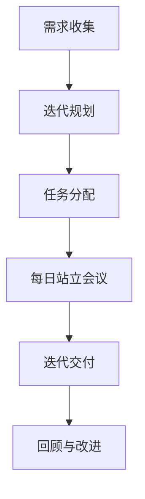
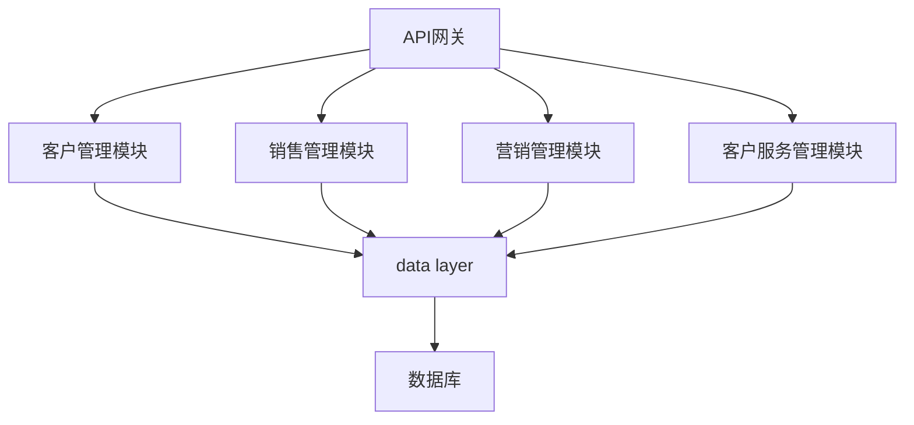
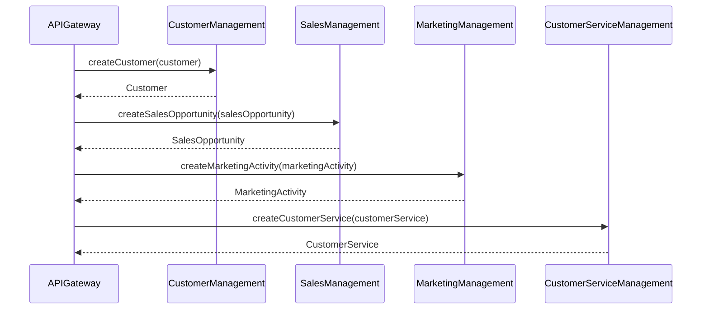

                 

## # 技术团队的敏捷转型：从瀑布到敏捷的蜕变

关键词：敏捷开发、敏捷团队、敏捷转型、Scrum、瀑布模型

摘要：本文将深入探讨技术团队的敏捷转型，从传统的瀑布模型到敏捷开发的方法和工具。通过分析敏捷转型的背景和问题，本文将介绍敏捷开发的核心概念与联系，详细讲解敏捷开发算法原理，并进行系统分析与架构设计。随后，通过项目实战展示敏捷转型如何在实际中应用，并提供最佳实践和注意事项。本文旨在为技术团队提供一套完整的敏捷转型指南。

### 第一部分：背景介绍

#### 1.1 问题背景

在当前快速变化的技术环境中，企业对于技术团队的敏捷性需求日益增加。传统的瀑布式开发方法因其周期长、变更困难、沟通成本高等问题，已难以满足现代软件开发的需求。而敏捷开发方法通过迭代、增量、持续集成和持续交付等方式，能够更好地适应变化，提高开发效率和质量。因此，技术团队的敏捷转型成为许多企业的关注焦点。

#### 1.2 问题描述

技术团队的敏捷转型涉及多个层面，包括组织结构、工作流程、人员协作、技术工具等。转型过程中，团队往往面临以下问题：

- **组织结构调整**：如何从传统的层级式结构向扁平化的敏捷团队转变？
- **工作流程优化**：如何构建高效的敏捷开发流程，确保快速响应需求变更？
- **人员协作**：如何促进团队成员之间的有效沟通与协作，发挥各自优势？
- **技术工具选择**：如何选择合适的技术工具来支持敏捷开发？

#### 1.3 问题解决

本书旨在通过系统化的讲解和实践指导，帮助技术团队顺利完成敏捷转型。具体解决方案包括：

- **案例研究**：通过实际案例展示敏捷转型的成功经验和挑战，为读者提供借鉴。
- **方法与工具**：详细介绍敏捷开发的方法、原则和工具，帮助团队建立有效的敏捷实践。
- **实战演练**：提供详细的实践指南，包括环境搭建、核心功能实现、代码解读等，帮助读者将理论知识应用到实际项目中。
- **最佳实践**：总结敏捷转型过程中的最佳实践，提供实用技巧和注意事项，帮助团队规避常见问题。

#### 1.4 边界与外延

本书主要关注软件开发团队在敏捷转型过程中的实践和经验。虽然敏捷方法广泛应用于软件开发领域，但其核心原则和思想也可应用于其他类型的团队和项目。

### 第二部分：核心概念与联系

#### 2.1 核心概念

**敏捷开发**：敏捷开发是一种以人为核心、迭代、增量、快速响应变更的软件开发方法。其核心理念包括：

- **用户至上**：关注用户需求和满意度，快速交付高质量软件。
- **迭代开发**：通过短周期的迭代，逐步完善软件功能，持续改进。
- **协作与沟通**：鼓励团队成员之间的协作和沟通，提高团队整体效率。
- **适应性**：面对不断变化的需求和环境，敏捷开发能够灵活应对。

**瀑布模型**：瀑布模型是一种线性顺序的开发模型，各阶段依次进行，上一阶段完成后才能进入下一阶段。其主要特点包括：

- **阶段明确**：包括需求分析、设计、开发、测试等阶段。
- **文档驱动**：每个阶段都需要生成详细文档，确保各阶段的输出。
- **严格顺序**：各阶段之间有严格的依赖关系，一旦某个阶段出现问题，可能影响整个项目。

**敏捷团队**：敏捷团队是由跨职能人员组成的小型团队，负责从需求分析、设计、开发到测试的完整过程。其主要特点包括：

- **自组织**：团队成员自我管理，根据项目需求和团队目标进行任务分配。
- **跨职能**：团队成员具备不同技能，能够完成从需求分析到交付的全过程。
- **高效率**：通过协作和沟通，提高团队整体效率。

**Scrum**：Scrum是一种流行的敏捷开发框架，强调迭代和增量开发，通过每日站立会议、冲刺计划会议、回顾会议等方式来确保团队的协作和进度。其主要特点包括：

- **短周期迭代**：每次迭代周期通常为2-4周，确保团队能够快速交付可工作的软件版本。
- **透明度**：团队通过燃尽图、冲刺板等工具，实时跟踪项目进度和问题。
- **持续改进**：每次迭代结束后，团队进行回顾会议，总结经验教训，不断改进工作流程。

#### 2.2 概念属性特征对比

| 概念 | 属性特征 |
| ---- | ---- |
| 敏捷开发 | 强调灵活性、协作和快速迭代 |
| 瀑布模型 | 强调严格顺序、文档化和可预测性 |
| 敏捷团队 | 跨职能、自组织、高效率 |
| Scrum | 短周期迭代、透明度、持续改进 |

#### 2.3 ER实体关系图

```mermaid
erDiagram
    Product ||--|{ Sprint }
    Sprint ||--|{ Task }
    Task ||--|{ Developer }
    Developer ||--|{ User Story }
    User Story ||--|{ Product Backlog }
```

### 第三部分：算法原理讲解

#### 3.1 算法原理

敏捷转型的核心在于建立一种适应快速变化的环境和工作流程。以下是一个简化的敏捷开发算法原理：

1. **需求收集**：通过用户故事、需求文档等方式收集用户需求。
2. **迭代规划**：将需求分解为可实现的迭代任务。
3. **任务分配**：根据团队成员的能力和任务需求进行任务分配。
4. **每日站立会议**：团队成员每日召开站立会议，检查进度、解决问题。
5. **迭代交付**：在迭代结束时，交付可工作的软件版本。
6. **回顾与改进**：对每次迭代进行回顾，识别问题并提出改进措施。

#### 3.2 算法流程图



#### 3.3 数学模型与公式

敏捷开发中的核心指标包括：

- **速度**（Velocity）：每个迭代完成的任务数量。
- **燃尽图**（Burn-down Chart）：跟踪任务剩余量的图表。

速度公式：
$$
\text{Velocity} = \frac{\text{完成的任务数量}}{\text{迭代时长}}
$$

燃尽图公式：
$$
\text{剩余任务量} = \text{初始任务量} - \sum_{i=1}^{n}\text{迭代}_i\text{完成的任务数量}
$$

举例说明：

假设一个团队在一个2周的迭代中完成了10个任务，那么其速度为：
$$
\text{Velocity} = \frac{10}{2} = 5 \text{任务/周}
$$

在第一个迭代结束后，团队完成了5个任务，剩余任务量为：
$$
\text{剩余任务量} = \text{初始任务量} - 5 = 15 - 5 = 10
$$

通过燃尽图，可以直观地展示任务的剩余量随时间的变化，帮助团队了解项目的进度和风险。

#### 3.4 实例分析

以一个实际项目为例，假设一个团队正在开发一个在线购物平台，项目包括用户注册、商品浏览、购物车、订单处理等功能。以下是一个简化的敏捷开发实例：

1. **需求收集**：团队通过用户访谈和市场调研，收集到用户需求，包括：
   - 用户注册：用户可以注册账号并登录。
   - 商品浏览：用户可以浏览商品，查看商品详情。
   - 购物车：用户可以将商品添加到购物车，修改购物车中的商品数量。
   - 订单处理：用户可以提交订单，查看订单状态。

2. **迭代规划**：团队将需求分解为若干个迭代，每个迭代完成一个或多个功能。假设第一个迭代的目标是完成用户注册和商品浏览功能。

3. **任务分配**：根据团队成员的能力和任务需求，将任务分配给合适的人员。例如，用户注册功能可以分配给前端开发人员，商品浏览功能可以分配给后端开发人员。

4. **每日站立会议**：团队每日召开站立会议，检查进度、解决问题。例如，在第二个工作日，前端开发人员发现用户注册界面无法正常显示，通过站立会议，团队讨论并解决了问题。

5. **迭代交付**：在第一个迭代结束时，团队交付了用户注册和商品浏览功能，用户可以注册账号并浏览商品。

6. **回顾与改进**：团队进行回顾会议，讨论本次迭代的经验教训，提出改进措施。例如，团队发现任务分配不够合理，导致部分任务进度缓慢，下次迭代中将重新评估任务分配。

通过以上实例，我们可以看到敏捷开发如何在实际项目中应用，以及如何通过迭代、任务分配、每日站立会议、迭代交付和回顾与改进等环节，提高团队的开发效率和质量。

### 第四部分：系统分析与架构设计

#### 4.1 问题场景介绍

假设一个企业希望开发一款企业级CRM系统，以满足客户关系管理需求。该系统需要实现客户信息管理、销售机会管理、营销活动管理、客户服务管理等功能。为了确保项目的成功，企业决定采用敏捷开发方法进行系统开发和迭代。

#### 4.2 项目介绍

项目名称：企业级CRM系统

项目背景：企业需要一款高效、可扩展的CRM系统，以提升客户关系管理水平，提高销售业绩。

项目目标：
1. 完成客户信息管理、销售机会管理、营销活动管理、客户服务管理等功能。
2. 确保系统能够适应企业不同业务场景的需求。
3. 提高开发效率，确保高质量交付。

#### 4.3 系统功能设计（领域模型）

为了设计CRM系统的领域模型，我们需要明确系统的核心实体和关系。以下是一个简化的领域模型：

```mermaid
classDiagram
    Client <<--|{关联} Customer
    Customer {
        id: int
        name: string
        email: string
        phone: string
    }
    SalesOpportunity <<--|{关联} Customer
    SalesOpportunity {
        id: int
        name: string
        status: string
        probability: float
        closeDate: date
    }
    MarketingActivity <<--|{关联} Customer
    MarketingActivity {
        id: int
        name: string
        description: string
        startDate: date
        endDate: date
    }
    CustomerService <<--|{关联} Customer
    CustomerService {
        id: int
        name: string
        description: string
        startDate: date
        endDate: date
    }
```

在这个领域模型中，我们定义了四个核心实体：`Customer`（客户）、`SalesOpportunity`（销售机会）、`MarketingActivity`（营销活动）和`CustomerService`（客户服务）。这些实体之间存在关联关系，例如客户可以拥有多个销售机会、营销活动和客户服务。

#### 4.4 系统架构设计

为了设计CRM系统的整体架构，我们需要考虑系统的模块划分、技术选型、数据存储等方面。以下是一个简化的系统架构设计：



在这个系统架构设计中，我们定义了四个核心模块：客户管理模块、销售管理模块、营销管理模块和客户服务管理模块。这些模块通过API网关与外部系统进行交互，数据存储在数据库中。

#### 4.5 系统接口设计

为了实现系统模块之间的交互，我们需要设计相应的接口。以下是一个简化的接口设计：

```mermaid
interface CustomerManagement {
    +createCustomer(customer: Customer): Customer
    +getCustomerById(id: int): Customer
    +updateCustomer(customer: Customer): Customer
    +deleteCustomer(id: int): void
}

interface SalesManagement {
    +createSalesOpportunity(salesOpportunity: SalesOpportunity): SalesOpportunity
    +getSalesOpportunityById(id: int): SalesOpportunity
    +updateSalesOpportunity(salesOpportunity: SalesOpportunity): SalesOpportunity
    +deleteSalesOpportunity(id: int): void
}

interface MarketingManagement {
    +createMarketingActivity(marketingActivity: MarketingActivity): MarketingActivity
    +getMarketingActivityById(id: int): MarketingActivity
    +updateMarketingActivity(marketingActivity: MarketingActivity): MarketingActivity
    +deleteMarketingActivity(id: int): void
}

interface CustomerServiceManagement {
    +createCustomerService(customerService: CustomerService): CustomerService
    +getCustomerServiceById(id: int): CustomerService
    +updateCustomerService(customerService: CustomerService): CustomerService
    +deleteCustomerService(id: int): void
}
```

在这个接口设计中，我们定义了四个接口，分别为客户管理接口、销售管理接口、营销管理接口和客户服务管理接口。这些接口提供了对各个模块核心功能的操作方法。

#### 4.6 系统交互设计

为了实现系统模块之间的数据交互，我们需要设计相应的交互流程。以下是一个简化的系统交互设计：



在这个系统交互设计中，API网关作为系统的入口，接收外部请求，并将请求转发到相应的模块。各模块根据接口定义处理请求，并将处理结果返回给API网关，最终由API网关返回给外部系统。

### 第五部分：项目实战

#### 5.1 环境安装

在开始项目实战之前，我们需要搭建一个合适的环境来支持敏捷开发。以下是一个简化的环境安装过程：

1. **安装Git**：Git是一个版本控制工具，用于管理代码和项目历史记录。可以从[Git官网](https://git-scm.com/downloads)下载并安装Git。
2. **安装Python**：Python是一种流行的编程语言，许多敏捷开发工具和框架都是基于Python开发的。可以从[Python官网](https://www.python.org/downloads/)下载并安装Python。
3. **安装Docker**：Docker是一个容器化平台，可以帮助我们快速搭建开发环境。可以从[Docker官网](https://www.docker.com/products/docker-desktop)下载并安装Docker。
4. **安装Jenkins**：Jenkins是一个自动化构建工具，可以帮助我们实现持续集成和持续交付。可以从[Jenkins官网](https://www.jenkins.io/download/)下载并安装Jenkins。

#### 5.2 系统核心实现

在环境搭建完成后，我们可以开始实现CRM系统的核心功能。以下是一个简化的系统核心实现过程：

1. **搭建项目结构**：在Python中，我们可以使用`venv`模块搭建一个虚拟环境，用于隔离项目依赖。具体命令如下：
   ```shell
   python -m venv venv
   source venv/bin/activate  # 在Windows上使用 `venv\Scripts\activate`
   ```
2. **安装依赖**：在虚拟环境中，我们可以使用`pip`安装项目所需的依赖。例如，安装Flask框架：
   ```shell
   pip install flask
   ```
3. **编写代码**：在项目目录中，我们可以创建一个名为`app.py`的文件，编写Flask应用程序。以下是一个简化的应用程序示例：
   ```python
   from flask import Flask, request, jsonify
   
   app = Flask(__name__)

   @app.route('/customers', methods=['POST'])
   def create_customer():
       customer = request.json
       # 这里可以添加数据库操作代码，保存客户信息
       return jsonify(customer), 201

   @app.route('/customers/<int:customer_id>', methods=['GET'])
   def get_customer(customer_id):
       # 这里可以添加数据库操作代码，查询客户信息
       customer = {'id': customer_id, 'name': 'John Doe'}
       return jsonify(customer), 200

   if __name__ == '__main__':
       app.run(debug=True)
   ```
4. **启动服务**：在虚拟环境中，我们可以使用以下命令启动Flask服务：
   ```shell
   python app.py
   ```

#### 5.3 代码应用解读与分析

在上面的代码示例中，我们使用Flask框架搭建了一个简单的CRM系统。以下是代码的解读与分析：

1. **Flask应用程序**：我们首先导入了`Flask`类，并创建了一个名为`app`的Flask应用程序实例。
2. **路由定义**：我们使用`@app.route`装饰器定义了两个路由：
   - `/customers`：用于处理创建客户信息的POST请求。
   - `/customers/<int:customer_id>`：用于处理查询客户信息的GET请求，其中`<int:customer_id>`是一个动态路由参数。
3. **请求处理**：在路由处理函数中，我们使用了`request.json`获取客户端发送的JSON数据，并使用`jsonify`函数将数据返回给客户端。
4. **数据库操作**：在示例代码中，我们注释了数据库操作代码。在实际应用中，我们需要使用数据库来保存和查询客户信息。可以选用关系型数据库（如MySQL、PostgreSQL）或NoSQL数据库（如MongoDB）。

#### 5.4 实际案例分析与详细讲解

假设我们已经完成了CRM系统的核心功能实现，并准备进行实际应用。以下是一个简化的实际案例分析与详细讲解：

1. **需求分析**：企业希望通过CRM系统管理客户信息，包括客户姓名、邮箱和电话。此外，企业希望系统具备查询客户信息的功能。
2. **用户故事**：基于需求分析，我们可以编写以下用户故事：
   - 作为销售经理，我希望能够添加新的客户信息。
   - 作为销售经理，我希望能够查询已有客户的信息。
3. **迭代规划**：我们将用户故事分解为可实现的迭代任务，并安排到不同的迭代中。例如，第一个迭代的目标是实现客户信息添加和查询功能。
4. **任务分配**：根据团队成员的能力和任务需求，我们将任务分配给前端开发人员（负责用户界面设计）和后端开发人员（负责服务器端逻辑和数据存储）。
5. **每日站立会议**：每日召开站立会议，团队成员汇报任务进度，解决问题。例如，前端开发人员在第一天发现界面样式不符合要求，通过站立会议，团队成员讨论并确定了改进方案。
6. **迭代交付**：在第一个迭代结束时，团队完成了客户信息添加和查询功能，并交付了一个可工作的软件版本。
7. **回顾与改进**：团队进行回顾会议，总结本次迭代的经验教训，提出改进措施。例如，团队发现任务分配不合理，导致部分任务进度缓慢，下次迭代中将重新评估任务分配。

通过以上实际案例，我们可以看到敏捷开发方法如何在实际项目中应用，以及如何通过迭代、任务分配、每日站立会议、迭代交付和回顾与改进等环节，提高团队的开发效率和质量。

#### 5.5 项目小结

在本项目的实战过程中，我们使用了敏捷开发方法，从需求分析到用户故事编写，再到迭代规划和任务分配，每日站立会议、迭代交付和回顾与改进，每个环节都体现了敏捷开发的核心理念。通过实际案例的分析和讲解，我们看到了敏捷开发在实际项目中的应用效果。

在项目过程中，我们也遇到了一些挑战，例如任务分配不合理、进度缓慢等问题。通过回顾与改进，团队逐步优化了工作流程，提高了开发效率。总的来说，敏捷开发方法在本项目中取得了显著的成效，为企业提供了高效、可扩展的CRM系统。

### 第六部分：最佳实践与注意事项

#### 6.1 最佳实践

1. **明确需求**：在敏捷开发过程中，明确的需求是项目成功的关键。通过用户故事、需求文档等方式，确保需求的清晰和具体。
2. **迭代规划**：根据项目的实际情况，合理安排迭代周期和任务。避免过度规划和任务堆积，确保每次迭代都能交付可工作的软件版本。
3. **团队协作**：建立有效的团队协作机制，促进团队成员之间的沟通与协作。定期召开站立会议，确保项目进度的透明度和问题及时解决。
4. **持续集成**：使用持续集成工具（如Jenkins），实现代码的自动化构建和测试，提高开发效率和质量。
5. **质量保障**：重视代码审查和测试，确保每次迭代交付的软件质量。

#### 6.2 注意事项

1. **避免过度优化**：在敏捷开发中，避免过度关注工具和技术，导致开发效率低下。应根据项目的实际情况选择合适的工具和方法。
2. **合理分配任务**：在任务分配过程中，避免任务堆积和分工不均，确保每个团队成员都有足够的工作量和成长空间。
3. **持续改进**：敏捷开发强调持续改进，每次迭代结束后，及时总结经验教训，提出改进措施，不断优化工作流程。
4. **平衡需求与质量**：在满足需求的同时，确保软件质量。避免因追求速度而牺牲质量，导致后期返工和维护成本增加。
5. **团队协作**：建立良好的团队协作氛围，鼓励团队成员之间的沟通与协作，提高团队整体效率。

### 第七部分：拓展阅读

1. **《敏捷软件开发：实践指南》**：作者：Michael Feathers、Jeffries、Andrew Hunt
2. **《Scrum精髓：了解与实施敏捷开发》**：作者：Jeff Sutherland
3. **《敏捷项目管理：迭代、增量方法与实践》**：作者：Robert C. Martin
4. **《敏捷开发的艺术》**：作者：Jeff Sutherland、Jeffries、Andrew Hunt
5. **《持续集成：从线性到敏捷的软件开发》**：作者：Martin Fowler、David Farley

### 总结

本文从技术团队的敏捷转型背景、核心概念与联系、算法原理讲解、系统分析与架构设计、项目实战、最佳实践与注意事项以及拓展阅读等方面，详细介绍了敏捷转型的方法和经验。通过本文的阅读，读者可以了解到敏捷转型的核心理念、方法和实践，为自身团队的敏捷转型提供参考和指导。希望本文能够帮助技术团队更好地实现敏捷转型，提高开发效率和质量。

### 作者信息

**作者：AI天才研究院/AI Genius Institute & 禅与计算机程序设计艺术 /Zen And The Art of Computer Programming**

