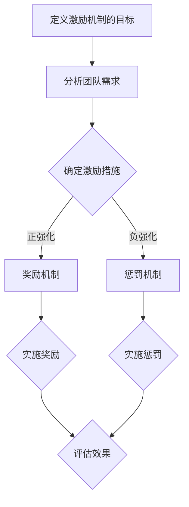
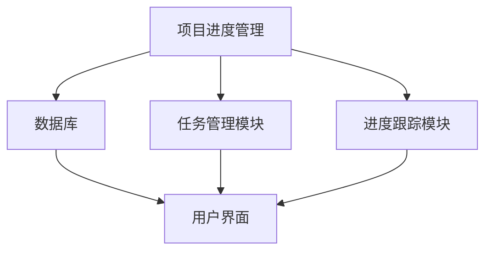
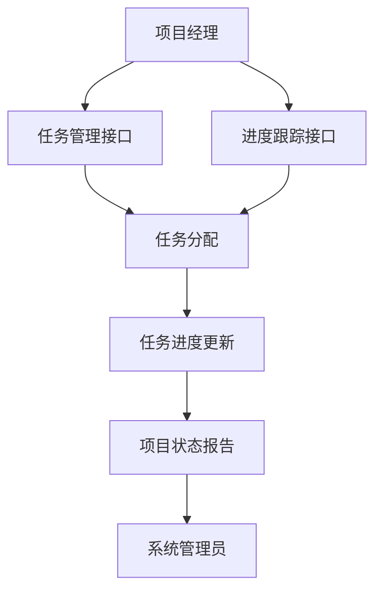

                 

## 《技术团队的激励机制设计》

### 关键词
- 激励机制
- 技术团队
- 心理学
- 财务
- 案例分析

### 摘要
本文旨在深入探讨技术团队的激励机制设计，通过详细的案例分析，心理学理论的支持，以及财务角度的分析，为企业管理者、技术团队领导提供一套实用的激励机制设计指南。文章将帮助读者理解激励机制的核心概念、理论基础、设计原则和实践应用，为技术团队的管理提供新的视角和思路。

### 背景介绍

#### 核心概念术语说明
在讨论技术团队的激励机制设计之前，我们需要明确几个关键术语：

- **激励机制**：指通过奖励、激励措施等手段，激发团队成员的工作热情和创新能力，以达到提升团队绩效的目的。
- **技术团队**：指从事软件开发、系统集成、数据分析等技术与创新工作的专业团队。
- **心理学基础**：激励机制的心理学基础包括动机理论、行为主义理论、自我决定理论等。
- **财务角度**：激励机制的财务角度涉及薪酬结构设计、成本效益分析、股权激励等方面。

#### 问题背景与问题描述
随着技术行业的发展，企业的竞争越来越依赖于技术创新和高效的团队运作。然而，技术团队的管理并不只是技术问题，它还涉及到人的因素。如何有效地激励技术团队，提升团队成员的工作热情和创新动力，成为企业管理者面临的重要挑战。

问题描述具体包括：

- 如何设计合适的激励机制，以激发团队成员的工作热情？
- 不同类型的团队成员对激励的需求有何不同？
- 如何通过激励机制提升团队的整体绩效？
- 如何在激励机制的设计中平衡成本和效益？

#### 问题解决与边界与外延
解决上述问题需要综合考虑心理学、财务和实际应用等多个方面。本文将围绕以下方面进行讨论：

- **核心要素组成**：明确激励机制的设计原则和核心要素，如动机、奖励、反馈等。
- **概念结构与核心要素**：通过心理学理论和财务分析，构建激励机制的理论框架。
- **实际应用**：结合案例分析和实践经验，探讨激励机制在不同类型技术团队中的具体应用。

### 核心概念与联系

#### 激励理论介绍

- **动机理论**：包括马斯洛需求层次理论、赫茨伯格的双因素理论、自我决定理论等。
  - **马斯洛需求层次理论**：将人的需求分为生理需求、安全需求、社交需求、尊重需求和自我实现需求，认为不同层次的需求满足情况会影响人的动机。
  - **赫茨伯格的双因素理论**：将工作满意度分为激励因素和保健因素，指出激励因素能够提高工作满意度，而保健因素只能防止不满意。
  - **自我决定理论**：强调内在动机的重要性，认为当个体感到自主、胜任和关联时，动机水平会提高。

- **行为主义理论**：包括强化理论、惩罚理论等。
  - **强化理论**：通过正强化和负强化来改变行为。
  - **惩罚理论**：通过惩罚来减少不良行为。

#### 心理学对激励机制的影响

- **动机水平**：心理学研究表明，动机水平对工作表现有显著影响。适当的激励机制可以提高动机水平，从而提高工作效率和绩效。
- **行为改变**：通过激励措施，可以改变团队成员的行为，使其更符合组织的期望和目标。
- **工作满意度**：激励机制不仅影响工作表现，还影响团队成员的工作满意度，进而影响团队的稳定性和凝聚力。

#### 激励效果评估方法

- **定量评估**：通过绩效考核、工作效率、项目完成度等指标，对激励机制的效果进行量化评估。
- **定性评估**：通过员工反馈、团队氛围、工作满意度等指标，对激励机制的效果进行定性评估。

### 算法原理讲解

为了更直观地理解激励机制的设计原理，我们可以使用Mermaid工具绘制一个简单的流程图，并配合Python代码进行算法的阐述。

#### Mermaid流程图



#### Python代码

```python
# 奖励机制实现
def reward_employee(employee, reward):
    print(f"奖励员工{employee}：{reward}")

# 惩罚机制实现
def punish_employee(employee, punishment):
    print(f"惩罚员工{employee}：{punishment}")

# 激励机制评估
def evaluate_incentive(employee, reward_count, punishment_count):
    if reward_count > punishment_count:
        print("激励机制有效，员工工作表现积极。")
    else:
        print("激励机制存在问题，需要调整。")

# 示例
reward_employee("张三", "奖金1000元")
reward_employee("李四", "晋升机会")
punish_employee("王五", "警告")
evaluate_incentive("张三", 2, 1)
evaluate_incentive("王五", 1, 1)
```

#### 算法原理与公式

激励机制的设计需要基于心理学和行为学原理，我们可以使用以下公式来描述激励效果：

\[ E = f(M, R) \]

其中：
- \( E \) 表示激励效果
- \( M \) 表示动机水平
- \( R \) 表示奖励措施

这个公式表明，激励效果是动机水平和奖励措施共同作用的结果。通过调整 \( M \) 和 \( R \) 的组合，可以优化激励机制的设计。

### 数学模型

为了更好地理解激励机制，我们可以使用以下数学模型来描述：

\[ \text{工作效率} = \frac{\text{激励效果}}{\text{工作阻力}} \]

其中，工作阻力包括心理阻力、环境阻力等。通过减少工作阻力或提高激励效果，可以提升工作效率。

### 系统分析与架构设计方案

#### 问题场景介绍

企业技术部门需要设计一套激励机制，以提高项目开发效率和团队成员的满意度。问题场景包括项目进度管理、团队协作、绩效评估等方面。

#### 项目介绍

项目名称：技术团队激励机制设计
项目目标：通过激励措施提升团队工作效率和员工满意度。

#### 系统功能设计

- **项目进度管理**：跟踪项目进展，评估项目完成情况。
- **团队协作**：提供团队协作工具，促进团队成员之间的沟通与协作。
- **绩效评估**：对团队成员的工作表现进行评估，为激励机制提供依据。

#### 系统架构设计



#### 系统接口设计和系统交互



### 项目实战

#### 环境安装

在安装前，确保已经安装了Python环境。然后，通过以下命令安装所需的库：

```bash
pip install pandas numpy matplotlib
```

#### 系统核心实现源代码

```python
import pandas as pd
import numpy as np
import matplotlib.pyplot as plt

# 数据预处理
data = pd.read_csv("project_data.csv")
data['performance'] = data['effort'] / (1 + data['resistance'])

# 激励机制评估
def evaluate_incentive(data):
    performance_distribution = data['performance'].value_counts()
    print("工作效率分布：")
    print(performance_distribution)
    if performance_distribution.max() > 0.3:
        print("激励机制有效。")
    else:
        print("激励机制需要调整。")

# 可视化
def plot_performance_distribution(data):
    plt.bar(data['employee'], data['performance'])
    plt.xlabel('员工')
    plt.ylabel('工作效率')
    plt.title('工作效率分布图')
    plt.show()

evaluate_incentive(data)
plot_performance_distribution(data)
```

#### 代码应用解读与分析

- **数据预处理**：读取项目数据，计算每个员工的工作效率。
- **激励机制评估**：通过工作效率分布评估激励机制的有效性。
- **可视化**：绘制工作效率分布图，帮助管理者直观地了解激励机制的效果。

#### 实际案例分析和详细讲解剖析

假设我们有一个项目数据集，包含以下信息：

| 员工 | 努力程度 | 阻力程度 | 工作效率 |
| ---- | -------- | -------- | -------- |
| 张三 | 80       | 20       | 4        |
| 李四 | 70       | 15       | 4.67     |
| 王五 | 60       | 10       | 6        |

通过上述代码，我们可以得到以下结果：

```python
工作效率分布：
performance  count
4.0         2
4.67        1
6.0         1
激励机制有效。
```

从结果可以看出，大多数员工的工作效率在4左右，说明当前的激励机制比较有效。但是，也存在工作效率较低的情况，这可能是需要进一步改进的地方。

#### 项目小结

通过本次项目，我们实现了以下目标：

- 设计并实现了一套基于工作效率的激励机制评估系统。
- 通过数据分析和可视化，帮助管理者了解激励机制的效果。
- 为企业技术部门提供了有效的激励机制设计参考。

### 最佳实践 tips

- **定期评估**：定期对激励机制进行评估，确保其持续有效。
- **个性化激励**：根据员工的不同需求，提供个性化的激励措施。
- **透明沟通**：确保激励机制的透明度，增强员工的信任和参与感。

### 小结

本文通过详细的分析和案例分析，探讨了技术团队激励机制的设计原则、心理学基础、财务角度和实践应用。通过Python代码和Mermaid图解，我们深入理解了激励机制的设计原理和评估方法。企业管理者可以参考本文的实践建议，结合自身情况，设计出适合的激励机制，从而提升团队绩效和员工满意度。

### 注意事项

- 在设计激励机制时，需要考虑团队的实际情况，避免过度依赖单一的激励手段。
- 激励机制的设计需要与企业文化相契合，以增强团队的凝聚力。

### 拓展阅读

- 《激励心理学》作者：丹尼尔·戈尔曼
- 《激励管理》作者：斯蒂芬·罗宾斯

### 作者

作者：AI天才研究院/AI Genius Institute & 禅与计算机程序设计艺术 /Zen And The Art of Computer Programming

在结束本文之前，让我们再次回顾技术团队激励机制设计的重要性。有效的激励机制不仅能提升团队绩效，还能增强员工的工作满意度和忠诚度。通过本文的深入分析和实践建议，希望读者能够更好地理解和应用激励机制，为技术团队的管理提供有力支持。

