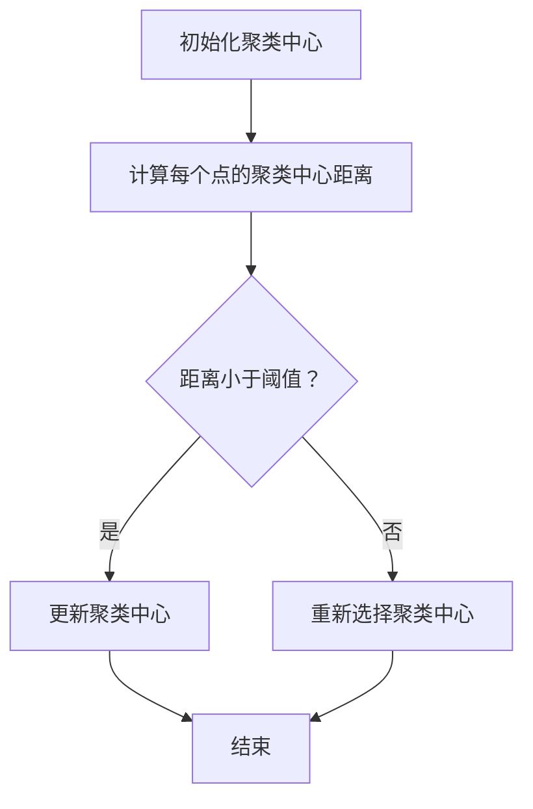
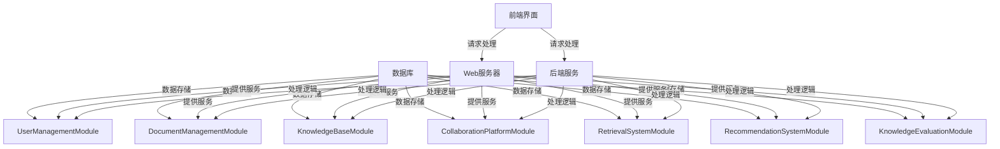
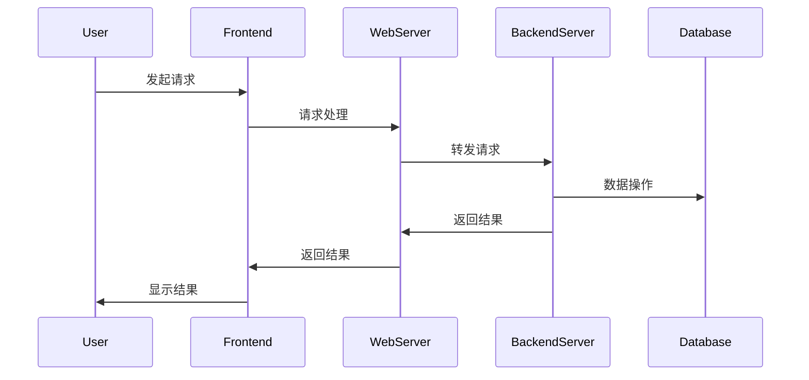

                 

## 引言

### 核心概念术语说明

在撰写这篇关于技术团队的知识管理和建立学习型组织的文章时，我们需要明确一些关键概念和术语，以确保内容的准确性和统一性。

- **知识管理**：知识管理是一种通过收集、组织、存储、分享和应用知识的过程，以提高组织的效率和创新能力。它不仅仅是技术层面的操作，更涉及到文化、流程和策略等多个方面。
- **学习型组织**：学习型组织是指一种能够持续学习和适应变化的组织模式。这种组织强调成员之间的沟通、协作和知识共享，致力于不断改进和学习，从而提升组织的整体绩效。
- **技术团队**：技术团队通常指的是负责开发和维护软件系统的团队，包括程序员、软件工程师、架构师、测试人员等。
- **知识共享**：知识共享是指团队成员之间相互交流和传递知识的过程，通过分享经验、知识和技术，提高团队的整体能力。
- **知识获取**：知识获取是指通过研究、调查、学习等方式获取新知识和信息的过程。
- **知识应用**：知识应用是指将获取的知识应用到实际工作中，解决实际问题或创造新价值的过程。
- **知识评估**：知识评估是指对知识管理的效果进行评价和监控，以确保知识管理策略的有效性。

### 问题背景

在当今快速变化的技术环境中，技术团队面临着诸多挑战。首先，技术更新迭代速度加快，新技术的不断涌现使得团队成员必须不断学习和更新知识，否则将被淘汰。其次，团队规模扩大，团队成员分散在不同地点和时区，导致信息传递不畅，知识共享困难。此外，团队内部存在知识孤岛现象，部分成员拥有特定的专业技能和经验，但这些知识无法有效地传递给其他成员，导致团队整体效率低下。

### 问题描述

具体来说，技术团队在知识管理方面存在以下问题：

1. **信息分散**：团队成员存储知识的方式不一致，导致知识分散在不同工具、文档和个人笔记中，难以统一管理和检索。
2. **知识浪费**：团队成员之间存在知识孤岛，某些成员拥有的重要经验和知识无法与其他成员共享，导致知识浪费。
3. **团队协作困难**：由于知识分散和不一致，团队成员在协作时容易出现误解和冲突，降低团队整体协作效率。
4. **知识更新不及时**：随着技术的快速迭代，现有知识库中的内容很快过时，但更新速度跟不上变化，导致知识库价值降低。

### 问题解决

为了解决上述问题，技术团队需要建立有效的知识管理机制，并努力打造学习型组织。具体解决方案包括：

1. **建立知识共享平台**：搭建一个统一的、易于访问的知识共享平台，将团队成员的知识集中存储和管理，提高知识的可访问性和利用率。
2. **推动知识获取**：鼓励团队成员积极参与培训、研讨会和项目研究，不断获取新的知识和技能。
3. **完善知识共享机制**：制定明确的知识共享规则和流程，确保知识在团队内部高效传递和共享。
4. **实施知识评估**：定期对知识管理效果进行评估，及时发现和解决问题，优化知识管理策略。
5. **培养学习文化**：建立一种鼓励学习和知识分享的企业文化，使团队成员认识到知识管理的重要性，并积极参与其中。

### 边界与外延

知识管理不仅仅局限于技术领域，它还涉及到其他领域，如企业管理、医疗保健、教育等。在技术团队中，知识管理的边界包括以下几个方面：

1. **知识来源**：知识可以来源于内部（如团队成员的经验和技能）和外部（如技术文献、行业报告、同行交流等）。
2. **知识类型**：知识可以分为显性知识和隐性知识。显性知识是指可以通过文字、图表、数据等形式明确表达的知识，如技术文档、代码注释等；隐性知识则是指难以通过语言明确表达的知识，如个人经验、直觉和洞察力等。
3. **知识管理范围**：知识管理不仅包括知识获取、共享和应用，还包括知识存储、分类、搜索和评估等环节。

### 概念结构与核心要素组成

知识管理是一个复杂的系统，其概念结构和核心要素包括以下几个方面：

1. **知识获取**：包括信息搜集、学习、研究等活动，目的是获取新的知识和信息。
2. **知识共享**：通过培训、交流、合作等方式，将获取的知识在团队成员之间传递和共享。
3. **知识存储**：建立一个集中式的知识存储库，用于存储和分类各种知识，方便团队成员访问和使用。
4. **知识应用**：将获取的知识应用到实际工作中，解决实际问题或创造新价值。
5. **知识评估**：对知识管理的效果进行评价和监控，确保知识管理策略的有效性。

通过以上步骤，技术团队可以建立一个高效的知识管理机制，促进知识的获取、共享和应用，从而提高团队的整体绩效和创新能力。

### 第一部分：背景介绍

#### 第1章：知识管理的重要性

##### 1.1 问题背景

在当今高度竞争的技术市场中，技术团队的知识管理变得越来越重要。随着信息技术的飞速发展，技术领域的知识更新速度越来越快，新的工具、语言、框架和最佳实践层出不穷。这使得技术团队不仅要保持现有的技术水平，还需要不断学习新的知识和技能，以保持竞争力。然而，当前许多技术团队在知识管理方面面临着诸多问题。

首先，信息分散是一个普遍存在的问题。团队成员的知识和经验分散在不同的文档、个人笔记和工具中，缺乏一个统一的平台进行集中存储和管理。这使得知识查找变得困难，降低了工作效率。其次，知识孤岛现象普遍存在。团队成员之间的沟通和协作不畅，导致某些成员的知识无法有效地传递给其他成员，从而形成知识孤岛，浪费了宝贵的资源。此外，知识更新不及时也是一个严重的问题。随着技术的不断迭代，现有的知识库中的内容很快就会过时，但更新速度跟不上变化，导致知识库的价值降低。

这些问题的存在严重影响了技术团队的工作效率和创新能力。为了解决这些问题，技术团队需要建立有效的知识管理机制，确保知识的高效获取、共享和应用。知识管理不仅可以提高团队的整体效率，还可以促进知识的传承和创新，为团队的长远发展提供有力支持。

##### 1.2 问题描述

具体来说，技术团队在知识管理方面主要存在以下问题：

1. **信息分散**：团队成员的知识和经验分散在不同文档和个人笔记中，缺乏一个统一的平台进行集中存储和管理。这导致知识查找困难，降低了工作效率。
   
   **解决思路**：建立一个集中的知识共享平台，将团队成员的知识集中存储和管理，提高知识的可访问性和利用率。

2. **知识孤岛**：团队成员之间的沟通和协作不畅，导致某些成员的知识无法有效地传递给其他成员，从而形成知识孤岛。

   **解决思路**：通过培训、交流和合作等方式，加强团队成员之间的沟通和协作，打破知识孤岛，实现知识的高效共享。

3. **知识更新不及时**：随着技术的快速迭代，现有知识库中的内容很快就会过时，但更新速度跟不上变化，导致知识库的价值降低。

   **解决思路**：制定明确的更新策略，定期对知识库进行更新和维护，确保知识的时效性。

4. **知识评估不足**：对知识管理的效果缺乏有效的评估和监控，无法及时发现问题并进行改进。

   **解决思路**：建立一套完善的评估体系，对知识管理的效果进行定期评估和监控，及时发现和解决问题。

##### 1.3 问题解决

针对上述问题，技术团队可以采取以下措施进行解决：

1. **建立知识共享平台**：搭建一个统一的、易于访问的知识共享平台，将团队成员的知识集中存储和管理，提高知识的可访问性和利用率。

   **实施步骤**：
   - 选择合适的知识共享工具，如知识库、协作平台等。
   - 制定知识共享规则和流程，明确知识共享的范围、方式和责任。
   - 鼓励团队成员积极参与知识共享，提供必要的培训和支持。

2. **加强团队沟通与协作**：通过培训、交流和合作等方式，加强团队成员之间的沟通和协作，打破知识孤岛，实现知识的高效共享。

   **实施步骤**：
   - 定期组织内部培训和研讨会，分享团队成员的经验和知识。
   - 建立跨部门的合作项目，促进团队成员之间的交流和协作。
   - 利用协作工具，如即时通讯、视频会议等，方便团队成员之间的沟通和协作。

3. **制定知识更新策略**：制定明确的更新策略，定期对知识库进行更新和维护，确保知识的时效性。

   **实施步骤**：
   - 设立知识更新责任人，负责知识库的维护和更新。
   - 建立知识更新的反馈机制，及时收集团队成员的意见和建议。
   - 定期对知识库进行审核和更新，确保知识的准确性和时效性。

4. **建立知识评估体系**：建立一套完善的评估体系，对知识管理的效果进行定期评估和监控，及时发现和解决问题。

   **实施步骤**：
   - 设立知识管理效果评估指标，如知识共享率、知识利用率等。
   - 定期对知识管理效果进行评估，分析存在的问题和改进的方向。
   - 根据评估结果，调整和优化知识管理策略。

通过以上措施，技术团队可以有效解决知识管理方面存在的问题，提高团队的工作效率和创新能力，为企业的长远发展奠定坚实基础。

##### 1.4 边界与外延

在讨论知识管理时，需要明确其边界和外延，以便更好地理解和应用知识管理的方法和工具。

**知识管理的边界**

1. **知识内容**：知识管理主要关注技术领域的知识，包括编程语言、框架、工具、最佳实践等。它不包括非技术领域的知识，如市场营销、人力资源管理等。
   
2. **知识管理范围**：知识管理不仅涉及知识的获取、存储和共享，还包括知识的分类、检索、应用和评估。它不仅仅是一个技术问题，更是一个组织管理问题。

**知识管理的外延**

1. **知识来源**：知识可以来源于内部（如团队成员的经验和技能）和外部（如技术文献、行业报告、同行交流等）。知识管理需要同时关注内部和外部知识的获取和共享。

2. **知识类型**：知识可以分为显性知识和隐性知识。显性知识可以通过文字、图表、数据等形式明确表达，如技术文档、代码注释等；隐性知识则难以通过语言明确表达，如个人经验、直觉和洞察力等。知识管理需要同时关注显性知识和隐性知识的获取、共享和应用。

3. **知识应用场景**：知识管理不仅应用于技术团队，还可以应用于企业管理的其他领域，如市场营销、人力资源等。知识管理的方法和工具也可以在不同领域进行灵活应用。

通过明确知识管理的边界与外延，技术团队可以更好地理解知识管理的重要性，并制定针对性的知识管理策略，以实现知识的最大化价值。

##### 1.5 概念结构与核心要素组成

知识管理是一个复杂的系统，其概念结构和核心要素包括以下几个方面：

1. **知识获取**：知识获取是知识管理的第一步，包括信息的搜集、学习、研究等活动。团队成员需要不断获取新的知识和信息，以适应技术领域的快速变化。

2. **知识共享**：知识共享是知识管理的核心环节，通过培训、交流、合作等方式，将获取的知识在团队成员之间传递和共享。知识共享可以提高团队的整体效率，减少知识孤岛现象。

3. **知识存储**：知识存储是将知识集中存储和管理的过程，通过建立知识库、文档管理系统等，确保知识能够被方便地访问和使用。

4. **知识应用**：知识应用是将获取的知识应用到实际工作中，解决实际问题或创造新价值。知识应用可以提升团队的创新能力，推动项目的顺利进行。

5. **知识评估**：知识评估是对知识管理效果进行评价和监控的过程，通过定期评估，可以及时发现和解决问题，优化知识管理策略。

这些核心要素相互关联，共同构成了知识管理的概念结构和运作机制。技术团队需要全面理解这些要素，并制定相应的策略和措施，以实现高效的知识管理。

### 第二部分：核心概念与联系

#### 第2章：学习型组织的概念与特点

##### 2.1 学习型组织的定义

学习型组织是指一种能够不断学习和适应变化的组织模式。它不仅仅是一个技术术语，更是一种管理和组织文化的理念。学习型组织强调团队和个人的持续学习，通过不断反思和改进，实现自我超越和整体发展。

学习型组织的核心理念是“学习第一，工作第二”。这意味着组织将学习放在首位，将学习视为工作的一部分，而不是额外负担。学习型组织鼓励团队成员积极参与学习活动，通过不断学习和分享经验，提高个人和团队的能力。

学习型组织的定义不仅限于企业，它可以应用于各种组织，包括政府机构、非营利组织、学校等。学习型组织的核心目标是提高组织的整体绩效和创新能力，使组织能够适应快速变化的外部环境。

##### 2.2 学习型组织的特征

学习型组织具有以下特征：

1. **开放性**：学习型组织具有开放的思维和态度，鼓励成员之间以及组织与外部环境的交流与互动。开放性有助于知识的获取和共享，促进创新和进步。

2. **自我超越**：学习型组织鼓励成员不断挑战自我，追求卓越。自我超越不仅体现在个人能力上，还体现在团队和组织层面。通过不断超越自我，组织可以持续改进，实现更高的目标。

3. **团队学习**：学习型组织强调团队学习的重要性。团队学习是指团队成员通过共同学习、交流和合作，实现知识和能力的提升。团队学习可以增强团队的凝聚力和协作能力，提高整体绩效。

4. **系统思考**：学习型组织采用系统思考的方法，从整体角度看待问题，关注组织内部的各个部分之间的相互作用和影响。系统思考有助于组织识别和解决复杂问题，实现可持续发展。

5. **共同愿景**：学习型组织有一个明确的共同愿景，即组织的目标和使命。共同愿景可以激发成员的积极性和创造力，使组织朝着共同的目标努力。

6. **共享心智模式**：学习型组织鼓励成员分享心智模式，即对问题的共同理解和思维方式。共享心智模式可以减少误解和冲突，增强团队协作和决策的效率。

##### 2.3 学习型组织与传统组织的区别

学习型组织与传统组织在多个方面存在显著区别：

1. **学习与文化**：传统组织往往将学习视为一种额外的负担，而学习型组织将学习视为工作的一部分，并将其融入组织的文化和价值观中。

2. **领导角色**：在传统组织中，领导主要负责指挥和控制，而在学习型组织中，领导更注重激发成员的积极性和创造力，鼓励自主学习和自我管理。

3. **决策方式**：传统组织的决策往往由少数人做出，而在学习型组织中，决策更加民主和开放，鼓励全体成员参与讨论和决策。

4. **绩效评估**：传统组织的绩效评估通常侧重于短期成果，而学习型组织的绩效评估不仅考虑短期成果，还关注长期发展，鼓励团队成员不断学习和进步。

5. **适应变化**：传统组织往往难以适应快速变化的外部环境，而学习型组织通过持续学习和改进，能够更好地应对外部挑战和变化。

##### 2.4 学习型组织的重要性

建立学习型组织对技术团队具有重要意义：

1. **提高创新能力**：学习型组织鼓励成员不断学习和尝试新方法，这有助于激发创新思维和创造力，提高团队的整体创新能力。

2. **增强团队协作**：学习型组织强调团队学习和协作，通过共享知识和经验，增强团队的凝聚力和协作能力，提高团队的整体绩效。

3. **适应技术变化**：技术领域变化迅速，学习型组织通过持续学习和适应变化，能够更好地应对技术挑战，保持竞争优势。

4. **提升个人成长**：学习型组织鼓励成员自主学习和自我超越，有助于提升个人的职业素养和技能水平，促进个人成长和职业发展。

5. **提高企业绩效**：学习型组织通过持续学习和改进，可以提高企业的整体绩效和竞争力，实现长期可持续发展。

综上所述，建立学习型组织对技术团队具有重要的战略意义，是实现知识管理和持续发展的关键。技术团队应积极推动学习型组织的建设，以提高团队的整体绩效和创新能力。

### 第三部分：核心概念与联系

#### 第3章：知识管理核心概念与原理

##### 3.1 知识的定义

知识是指通过学习、实践和经验积累所获得的信息、技能、经验和洞察力。知识可以分为不同类型，包括显性知识和隐性知识。显性知识是指可以通过文字、图表、数据等形式明确表达的知识，如技术文档、代码注释、学术论文等。隐性知识则是指难以通过语言明确表达的知识，如个人经验、直觉、洞察力和专业技能等。隐性知识通常存储在个人的大脑中，不易被识别和传递。

知识在技术团队中起着至关重要的作用。首先，知识是技术团队创新和发展的基础。通过获取和应用知识，技术团队可以不断改进现有产品和服务，开发新的技术解决方案。其次，知识是团队协作和沟通的桥梁。知识共享可以促进团队成员之间的交流和合作，减少误解和冲突，提高团队的整体效率。此外，知识管理有助于技术团队应对快速变化的市场和技术环境，保持竞争力和持续发展。

##### 3.2 知识管理的过程

知识管理是一个系统性的过程，包括知识获取、知识共享、知识存储、知识应用和知识评估等环节。以下是这些过程的具体内容：

1. **知识获取**：知识获取是知识管理的起点，包括通过学习、研究、交流和协作等方式获取新知识和信息。技术团队可以通过参加培训、研讨会、技术交流会等途径，获取最新的技术动态和行业知识。此外，还可以利用在线资源、专业书籍、学术论文等渠道，不断丰富自己的知识储备。

2. **知识共享**：知识共享是将获取的知识在团队成员之间传递和共享的过程。技术团队可以通过内部培训、研讨会、知识分享会等形式，促进成员之间的知识交流。此外，还可以利用协作平台、知识库等工具，实现知识的实时共享和快速检索。知识共享不仅有助于提高团队的整体效率，还可以激发成员的创造力和创新能力。

3. **知识存储**：知识存储是将获取和共享的知识进行分类、整理和存储，以方便团队成员访问和使用。技术团队可以建立集中式的知识库，用于存储各种知识和信息，如技术文档、项目经验、最佳实践等。知识库应具备良好的检索功能，以便团队成员能够快速找到所需的知识。

4. **知识应用**：知识应用是将获取和存储的知识应用到实际工作中，解决实际问题或创造新价值。技术团队可以通过将知识应用于项目开发、问题解决、技术创新等方面，提高团队的工作效率和创新能力。知识应用不仅有助于提高项目成功率，还可以为团队带来新的商业机会和竞争优势。

5. **知识评估**：知识评估是对知识管理效果进行评价和监控的过程。技术团队可以通过定期评估，了解知识管理的效果和存在的问题，及时调整和优化知识管理策略。知识评估指标可以包括知识共享率、知识利用率、知识更新率等，通过这些指标，可以全面了解知识管理的效果，并持续改进。

##### 3.3 知识管理的关键因素

知识管理的效果受到多个因素的影响，以下是关键因素：

1. **组织文化**：知识管理需要得到组织文化的支持。在一个重视学习和知识共享的组织中，成员更容易接受知识管理的理念和方法，积极参与知识管理活动。

2. **领导支持**：领导的支持对知识管理至关重要。领导应重视知识管理，制定相关的政策和措施，为知识管理提供必要的资源和保障。

3. **工具和技术**：知识管理需要合适的工具和技术的支持。技术团队可以选择知识库、协作平台、流程管理工具等，提高知识管理的效率和效果。

4. **激励机制**：激励机制可以鼓励成员积极参与知识管理活动。技术团队可以制定奖励政策，对在知识管理方面表现优秀的成员进行表彰和奖励。

5. **培训与教育**：培训与教育是知识管理的重要组成部分。技术团队应定期开展培训和学习活动，提高成员的知识水平和技能。

##### 3.4 知识管理与学习型组织的联系

知识管理是建立学习型组织的重要基础，二者相辅相成：

1. **知识管理支持学习型组织**：通过知识管理，技术团队可以更好地获取、共享和应用知识，促进团队的学习和成长。知识管理有助于形成学习型组织的氛围，推动团队不断学习和进步。

2. **学习型组织促进知识管理**：学习型组织鼓励成员持续学习和创新，为知识管理提供了良好的环境和动力。学习型组织的理念和文化可以激发成员的知识分享意愿，提高知识管理的效果。

3. **知识共享与协作**：学习型组织强调团队学习和协作，知识共享是实现团队学习的重要途径。知识管理通过建立知识共享平台和机制，促进团队成员之间的协作和知识交流。

4. **持续改进与自我超越**：知识管理和学习型组织都强调持续改进和自我超越。知识管理通过不断获取和应用新知识，推动技术团队不断改进和创新。学习型组织通过不断学习和反思，实现团队的自我超越和持续发展。

综上所述，知识管理是建立学习型组织的重要手段和基础，二者相互促进，共同推动技术团队的成长和进步。技术团队应充分认识知识管理的重要性，积极推动学习型组织的建设，提高团队的整体绩效和创新能力。

### 第三部分：核心概念与联系

#### 第4章：知识管理工具与技术

##### 4.1 知识管理工具的类型

在技术团队中，知识管理工具的选择至关重要，这些工具不仅帮助团队有效存储、共享和应用知识，还能够提高团队的协作效率和创新能力。知识管理工具大致可以分为以下几类：

1. **知识库**：知识库是一种集中存储和管理知识的系统，它允许团队成员将各种类型的知识（如文档、代码、教程、经验等）进行分类、归档和检索。知识库通常具备全文搜索功能，便于团队成员快速找到所需信息。

2. **协作平台**：协作平台是支持团队协作的工具，它提供即时通讯、任务管理、文档共享等功能，使得团队成员可以实时沟通、协同工作和共享资源。协作平台通常具有高度的可定制性，可以根据团队的需求进行调整和优化。

3. **文档管理系统**（DMS）：文档管理系统主要用于文档的创建、编辑、存储和版本控制。DMS可以帮助团队确保文档的准确性和一致性，同时便于文档的追踪和审核。DMS通常与知识库相结合，提供更全面的文档管理功能。

4. **内容管理系统**（CMS）：内容管理系统是一种更广泛的工具，用于创建、管理、发布和呈现数字内容。CMS不仅适用于文档管理，还可以管理网站内容、博客文章、视频等多媒体内容。技术团队可以利用CMS来建立自己的内部知识门户。

5. **流程管理工具**：流程管理工具帮助团队设计和优化业务流程，确保流程的标准化和高效运行。这些工具通常包括流程设计、任务分配、进度跟踪和报告生成等功能，有助于团队实现流程的自动化和优化。

6. **学习管理系统**（LMS）：学习管理系统用于创建和管理在线学习课程，支持知识的学习和传播。LMS可以帮助团队组织培训、评估学习效果，并跟踪成员的学习进度。

7. **专家系统**：专家系统是一种基于人工智能技术的知识管理工具，它模拟专家的决策过程，提供专业的建议和解决方案。专家系统在技术团队中可以用于问题诊断、方案推荐和技术咨询。

##### 4.2 知识管理技术的应用

知识管理技术的应用可以帮助技术团队在知识获取、共享、存储和应用等方面实现优化。以下是知识管理技术在技术团队中的一些具体应用：

1. **大数据技术**：大数据技术可以帮助团队从大量数据中提取有价值的信息和知识。通过数据挖掘和机器学习算法，技术团队可以识别趋势、发现问题和生成洞察，从而提高决策的准确性和效率。

2. **人工智能**：人工智能技术可以应用于知识管理，如自然语言处理（NLP）、文本分析和智能问答系统等。这些技术可以帮助团队自动化知识检索、分类和标签化，提高知识管理的效率和准确性。

3. **区块链**：区块链技术可以用于确保知识库中的数据完整性和不可篡改性。通过区块链，技术团队可以建立一个安全的分布式知识存储系统，确保知识的安全性和透明性。

4. **虚拟现实（VR）和增强现实（AR）**：VR和AR技术可以用于创建沉浸式的学习体验，帮助团队成员更直观地理解和掌握复杂的知识和技能。这些技术特别适用于技术培训和技术演示。

5. **社交媒体**：社交媒体工具如微博、微信等可以用于促进团队内部的知识分享和交流。通过社交媒体平台，团队成员可以发布知识文章、讨论技术问题，并参与知识社区的互动。

##### 4.3 知识管理工具与技术的选择

选择适合技术团队的知识管理工具和技术是一个复杂的过程，需要考虑多个因素：

1. **团队需求**：首先，需要了解团队的具体需求，包括知识存储、共享、应用和协作等方面的需求。不同团队的需求可能有所不同，需要选择能够满足这些需求的工具和技术。

2. **技术兼容性**：所选工具和技术需要与现有的系统和技术兼容，避免出现技术冲突或数据迁移困难。兼容性是选择知识管理工具和技术时的重要考虑因素。

3. **用户友好性**：知识管理工具和技术需要具备良好的用户界面和用户体验，以便团队成员能够轻松上手和使用。用户友好性可以提高知识管理的参与度和效率。

4. **成本效益**：成本效益是选择知识管理工具和技术时的重要考虑因素。需要权衡工具和技术的成本与预期效益，选择性价比高的解决方案。

5. **安全性**：知识管理涉及大量的敏感和重要信息，因此安全性至关重要。所选工具和技术需要具备良好的安全措施，确保数据的保密性和完整性。

6. **可扩展性**：知识管理工具和技术需要具备良好的可扩展性，以便随着团队规模的扩大和需求的增加，能够方便地进行扩展和升级。

通过综合考虑上述因素，技术团队可以选出最适合自身需求的知识管理工具和技术，实现知识的高效管理和利用。

##### 4.4 知识管理工具与技术的挑战

尽管知识管理工具和技术具有显著的优点和潜力，但在实际应用过程中，技术团队也会面临一些挑战和问题：

1. **工具选择困难**：市场上存在大量的知识管理工具和技术，每种工具和技术都有其优缺点和适用场景。选择最适合团队的工具和技术是一个复杂的过程，需要深入研究和评估。

2. **培训与使用难度**：一些知识管理工具和技术可能具有复杂的操作和功能，需要团队成员进行专门的培训和学习。这对于日常繁忙的工作来说可能是一个额外的负担，影响知识管理的实施效果。

3. **数据质量和完整性**：知识管理工具和技术需要高质量的数据输入，但团队成员在输入数据时可能会存在错误或不完整的情况，影响知识库的准确性和完整性。

4. **知识共享障碍**：知识共享是知识管理的重要目标，但实际操作中可能会遇到知识共享障碍，如文化差异、沟通不畅、知识孤岛等。

5. **安全性和隐私**：知识管理涉及大量的敏感信息，如何确保数据的安全性和隐私是一个重要挑战。技术团队需要采取有效的安全措施，防止数据泄露和未经授权的访问。

6. **持续更新和维护**：知识管理是一个持续的过程，需要定期更新和维护知识库。然而，团队成员在忙碌的工作中可能无法保证定期更新知识库，导致知识库内容过时。

通过识别和应对这些挑战，技术团队可以更好地实施知识管理，实现知识的最大化价值。

### 第三部分：核心概念与联系

#### 第5章：知识管理中的算法原理

##### 5.1 算法原理概述

在知识管理中，算法原理扮演着至关重要的角色，它们帮助技术团队从大量数据中提取有价值的信息，支持知识获取、知识共享和知识应用。以下是一些在知识管理中常用的算法原理：

1. **分类算法**：分类算法用于将数据集中的实例分配到不同的类别中。常见的分类算法包括决策树、随机森林、支持向量机（SVM）和K-最近邻（KNN）等。分类算法在知识管理中的应用包括自动标签分类、文档分类和用户兴趣推荐等。

2. **聚类算法**：聚类算法将数据集中的实例划分为若干个群组，使得同一群组内的实例具有较高的相似性，而不同群组之间的实例则差异较大。常见的聚类算法包括K-均值聚类、层次聚类和DBSCAN等。聚类算法在知识管理中的应用包括知识库中的数据聚类、用户行为分析等。

3. **关联规则挖掘**：关联规则挖掘算法用于发现数据集中不同项之间的相关性。常见的算法包括Apriori算法和FP-Growth算法。关联规则挖掘在知识管理中的应用包括推荐系统、市场篮分析和知识关联发现等。

4. **文本挖掘算法**：文本挖掘算法用于处理和分析文本数据，提取有价值的信息和模式。常见的文本挖掘算法包括词频-逆文档频率（TF-IDF）、主题模型（LDA）和情感分析等。文本挖掘算法在知识管理中的应用包括文档分类、关键词提取和情感分析等。

5. **推荐系统算法**：推荐系统算法用于根据用户的历史行为和兴趣，向用户推荐相关的知识和资源。常见的推荐系统算法包括基于内容的推荐、协同过滤和混合推荐等。

##### 5.2 算法流程图

为了更好地理解这些算法原理，我们可以使用Mermaid绘制算法的流程图。以下是K-均值聚类的Mermaid流程图示例：



该流程图展示了K-均值聚类的核心步骤：初始化聚类中心、计算每个点的聚类中心距离、根据距离更新聚类中心或重新选择聚类中心，直到聚类中心不再变化。

##### 5.3 算法原理详细讲解

以下是K-均值聚类的详细解释：

1. **初始化聚类中心**：首先，随机选择K个数据点作为初始聚类中心。K是一个用户指定的整数，表示要划分的簇数。

2. **计算每个点的聚类中心距离**：对于每个数据点，计算其与各个聚类中心的距离。常用的距离度量包括欧几里得距离、曼哈顿距离和切比雪夫距离等。

3. **根据距离分配点**：将每个数据点分配到最近的聚类中心，形成K个簇。

4. **更新聚类中心**：计算每个簇的平均值，得到新的聚类中心。

5. **重复步骤2-4**：重复上述步骤，直到聚类中心不再变化或距离变化小于指定的阈值。

6. **结束**：当聚类中心稳定或距离变化小于阈值时，算法结束。

K-均值聚类的数学模型可以表示为：

$$
C_{new} = \frac{1}{N_k} \sum_{i=1}^{N} x_i
$$

其中，$C_{new}$是新的聚类中心，$N_k$是簇k中的数据点总数，$x_i$是数据点i。

以下是K-均值聚类的Python代码示例：

```python
import numpy as np

def kmeans(data, K, max_iters, threshold):
    centroids = data[np.random.choice(data.shape[0], K, replace=False)]
    
    for _ in range(max_iters):
        distances = np.linalg.norm(data - centroids, axis=1)
        labels = np.argmin(distances, axis=1)
        
        new_centroids = np.array([data[labels == k].mean(axis=0) for k in range(K)])
        
        if np.linalg.norm(new_centroids - centroids) < threshold:
            break
        
        centroids = new_centroids
    
    return centroids

data = np.random.rand(100, 2)
K = 3
max_iters = 100
threshold = 1e-5

centroids = kmeans(data, K, max_iters, threshold)
print(centroids)
```

通过这个示例，我们可以看到K-均值聚类的基本步骤和实现过程。

##### 5.4 举例说明

为了更好地理解K-均值聚类，我们可以通过一个具体的例子来展示其应用：

假设我们有如下数据集，每个数据点表示为二维向量：

$$
\begin{align*}
x_1 &= (0.1, 0.2) \\
x_2 &= (0.3, 0.4) \\
x_3 &= (0.5, 0.6) \\
x_4 &= (0.1, 0.3) \\
x_5 &= (0.3, 0.5) \\
x_6 &= (0.5, 0.7) \\
\end{align*}
$$

我们选择3个初始聚类中心：

$$
\begin{align*}
c_1 &= (0.2, 0.3) \\
c_2 &= (0.4, 0.5) \\
c_3 &= (0.6, 0.7) \\
\end{align*}
$$

以下是K-均值聚类的具体步骤：

1. **初始化聚类中心**：随机选择初始聚类中心。
2. **计算距离**：计算每个数据点到聚类中心的距离。
3. **分配点**：根据距离分配数据点。
4. **更新聚类中心**：计算每个簇的平均值，得到新的聚类中心。
5. **重复步骤2-4**：重复上述步骤，直到聚类中心稳定。

假设第一次迭代的结果如下：

$$
\begin{align*}
x_1 &\rightarrow c_1 \\
x_2 &\rightarrow c_2 \\
x_3 &\rightarrow c_2 \\
x_4 &\rightarrow c_1 \\
x_5 &\rightarrow c_2 \\
x_6 &\rightarrow c_3 \\
\end{align*}
$$

新的聚类中心为：

$$
\begin{align*}
c_1 &= \frac{x_1 + x_4}{2} = (0.15, 0.25) \\
c_2 &= \frac{x_2 + x_3 + x_5}{3} = (0.3667, 0.5) \\
c_3 &= \frac{x_6}{1} = (0.5, 0.7) \\
\end{align*}
$$

继续进行迭代，直到聚类中心不再变化或距离变化小于阈值。

通过这个例子，我们可以看到K-均值聚类的基本流程和计算过程，以及如何通过迭代优化聚类结果。

综上所述，K-均值聚类是一种简单有效的聚类算法，适用于知识管理中的数据聚类和知识分类任务。通过详细讲解和具体示例，读者可以更好地理解其原理和应用。

### 第四部分：系统分析与架构设计方案

#### 第6章：知识管理系统设计

##### 6.1 问题场景介绍

在当今快速变化的技术环境中，技术团队需要应对复杂的项目和不断更新的技术要求。为了确保团队成员能够高效地获取、共享和应用知识，我们设计了一个知识管理系统（KMS）。该系统的目标是为技术团队提供一个集中式、易于访问和高效的知识管理平台，解决当前存在的知识分散、知识孤岛和信息过时等问题。

**项目介绍**：

项目名称：企业级知识管理系统（Enterprise Knowledge Management System，简称EKMS）

项目目标：构建一个集成化的知识管理平台，实现知识的集中存储、高效共享和灵活应用。

项目背景：随着企业规模的扩大和技术项目的增多，知识管理的需求越来越迫切。现有的知识管理方式主要依赖于个人笔记和分散的文档，导致知识分散、难以查找和更新。此外，团队成员之间的沟通和协作不足，进一步加剧了知识孤岛现象。

**项目需求**：

1. **知识存储**：系统应具备强大的知识存储功能，支持多种文件格式和知识类型的存储，如文档、图片、视频、代码等。
2. **知识共享**：系统应提供便捷的知识共享机制，支持团队成员之间的知识交流与协作，包括评论、标签、引用等功能。
3. **知识检索**：系统应具备高效的检索功能，支持关键字搜索、分类搜索和全文搜索，方便团队成员快速找到所需知识。
4. **知识应用**：系统应支持知识的灵活应用，包括知识库中的代码片段、文档模板和解决方案推荐等。
5. **知识评估**：系统应具备知识评估功能，通过用户反馈和访问记录，对知识库中的内容进行评估和优化。

##### 6.2 系统功能设计

为了实现上述项目需求，我们设计了一套完整的知识管理系统功能模块，包括以下几个方面：

1. **用户管理模块**：负责用户的注册、登录、权限管理等功能，确保系统的安全性和可控性。
2. **文档管理模块**：支持文档的上传、下载、编辑、分类和版本控制，提供全面的文档管理功能。
3. **知识库模块**：用于存储和管理各类知识，包括技术文档、最佳实践、项目经验、培训资料等。
4. **协作平台模块**：提供即时通讯、讨论区、任务管理等功能，促进团队成员之间的协作和沟通。
5. **检索系统模块**：实现高效的知识检索，支持关键字搜索、分类搜索和全文搜索，提高知识查找的效率。
6. **推荐系统模块**：基于用户的访问历史和偏好，推荐相关的知识和资源，提高知识的利用率和应用效果。
7. **知识评估模块**：通过用户反馈和访问数据，对知识库中的内容进行评估和优化，确保知识的时效性和准确性。

以下是系统功能模块的Mermaid领域模型类图：

```mermaid
classDiagram
    UserManagementModule <-|>- DocumentManagementModule
    UserManagementModule <-|>- KnowledgeBaseModule
    UserManagementModule <-|>- CollaborationPlatformModule
    UserManagementModule <-|>- RetrievalSystemModule
    UserManagementModule <-|>- RecommendationSystemModule
    UserManagementModule <-|>- KnowledgeEvaluationModule
    DocumentManagementModule o-- Document
    KnowledgeBaseModule o-- Knowledge
    CollaborationPlatformModule o-- Discussion
    CollaborationPlatformModule o-- Task
    RetrievalSystemModule o-- Search
    RecommendationSystemModule o-- Recommendation
    KnowledgeEvaluationModule o-- Feedback
endclassDiagram
```

在这个类图中，每个模块都与其他模块相关联，表明了系统功能的整体架构和交互关系。

##### 6.3 系统架构设计

知识管理系统的架构设计需要考虑系统的可扩展性、稳定性和安全性。我们采用了分布式架构，确保系统的高效运行和可靠性。以下是系统架构的Mermaid架构图：



在这个架构图中，Web服务器负责处理用户的请求，后端服务负责业务逻辑处理和数据存储。数据库负责存储系统的所有数据，确保数据的一致性和安全性。前端界面通过Web服务器与后端服务进行交互，提供用户友好的操作界面。

##### 6.4 系统接口设计

为了确保系统的各个模块之间能够顺畅通信，我们设计了一套清晰的接口规范。以下是系统接口设计的一部分：

1. **用户管理接口**：包括用户注册、登录、权限验证等接口。
2. **文档管理接口**：包括文档上传、下载、编辑、版本控制等接口。
3. **知识库管理接口**：包括知识条目的添加、删除、修改、检索等接口。
4. **协作平台接口**：包括讨论区创建、帖子发布、任务分配等接口。
5. **检索系统接口**：包括关键字搜索、分类搜索、全文搜索等接口。
6. **推荐系统接口**：包括推荐生成、推荐展示等接口。
7. **知识评估接口**：包括知识评估、用户反馈等接口。

以下是用户管理接口的示例：

```python
from flask import Flask, request, jsonify

app = Flask(__name__)

@app.route('/register', methods=['POST'])
def register():
    username = request.form['username']
    password = request.form['password']
    # 处理注册逻辑，如验证用户名是否存在、密码强度等
    # 如果注册成功，返回用户ID
    return jsonify({'user_id': user_id})

@app.route('/login', methods=['POST'])
def login():
    username = request.form['username']
    password = request.form['password']
    # 处理登录逻辑，如验证用户名和密码是否匹配
    # 如果登录成功，返回用户信息和权限
    return jsonify({'user_info': user_info, 'permissions': permissions})

if __name__ == '__main__':
    app.run()
```

这些接口设计确保了系统模块之间的数据传输和功能调用，为系统的稳定运行提供了保障。

##### 6.5 系统交互设计

为了描述系统组件之间的交互流程，我们使用Mermaid绘制了系统交互序列图。以下是系统交互序列图的一部分：



在这个序列图中，用户通过前端界面发起请求，前端将请求转发给Web服务器，Web服务器处理请求并将结果返回给前端。后端服务器负责业务逻辑处理和数据操作，并与数据库进行交互。通过这个交互流程，系统实现了用户请求的处理和数据存储，确保了系统的正常运行。

通过以上系统分析与架构设计方案，我们可以为技术团队构建一个高效、稳定和安全的知识管理系统，助力团队的知识管理和协作创新。

### 第四部分：系统分析与架构设计方案

#### 第7章：知识管理系统实施

##### 7.1 环境安装

在实施知识管理系统（EKMS）之前，我们需要准备合适的环境，确保系统的正常运行。以下是EKMS环境安装的详细步骤：

1. **软件准备**：
   - **数据库**：安装MySQL或PostgreSQL数据库管理系统。
   - **Web服务器**：安装Apache或Nginx Web服务器。
   - **后端服务**：安装Python环境，并安装Flask、Django或其他Python后端框架。
   - **前端界面**：安装Node.js和npm，用于构建前端框架，如React、Vue.js或Angular。

2. **安装步骤**：
   - **数据库安装**：下载并安装MySQL或PostgreSQL，根据提示完成安装。
   - **Web服务器安装**：下载并安装Apache或Nginx，配置服务器并启动服务。
   - **Python环境安装**：在服务器上安装Python，并使用pip安装所需的后端框架和库。
   - **前端环境安装**：安装Node.js和npm，使用npm安装前端框架和依赖库。

3. **环境配置**：
   - **数据库配置**：配置数据库连接信息，创建用户和数据库。
   - **Web服务器配置**：配置Web服务器，如设置监听端口、虚拟主机等。
   - **后端服务配置**：配置后端服务的运行环境，如设置应用端口、数据库连接等。
   - **前端界面配置**：配置前端框架，如设置路由、组件等。

##### 7.2 系统核心实现

在环境安装完成后，我们需要实现知识管理系统的核心功能模块。以下是EKMS的核心实现步骤：

1. **用户管理模块**：
   - **功能描述**：用户管理模块负责用户的注册、登录、权限管理等。
   - **实现步骤**：
     - **用户注册**：接收用户注册请求，验证用户名和密码，将用户信息存储到数据库。
     - **用户登录**：接收用户登录请求，验证用户名和密码，返回用户信息和权限。
     - **权限管理**：根据用户权限，限制对系统资源的访问。

2. **文档管理模块**：
   - **功能描述**：文档管理模块负责文档的上传、下载、编辑和版本控制。
   - **实现步骤**：
     - **文档上传**：接收文档上传请求，验证文档格式和大小，将文档存储到服务器。
     - **文档下载**：接收文档下载请求，验证用户权限，从服务器获取文档并返回。
     - **文档编辑**：接收文档编辑请求，验证用户权限，更新文档内容。
     - **版本控制**：为每个文档创建版本，支持历史版本的查看和回滚。

3. **知识库管理模块**：
   - **功能描述**：知识库管理模块负责知识条目的添加、删除、修改和检索。
   - **实现步骤**：
     - **知识条目添加**：接收知识条目添加请求，验证内容格式，将知识条目存储到数据库。
     - **知识条目删除**：接收知识条目删除请求，验证用户权限，从数据库中删除知识条目。
     - **知识条目修改**：接收知识条目修改请求，验证用户权限，更新知识条目内容。
     - **知识条目检索**：接收检索请求，根据关键字、分类等条件，从数据库中检索知识条目。

4. **协作平台模块**：
   - **功能描述**：协作平台模块提供即时通讯、讨论区和任务管理功能。
   - **实现步骤**：
     - **即时通讯**：实现WebSocket通信，支持实时消息推送和接收。
     - **讨论区**：创建讨论区，支持帖子发布、回复和评论。
     - **任务管理**：创建任务，支持任务分配、进度跟踪和完成状态更新。

5. **检索系统模块**：
   - **功能描述**：检索系统模块提供高效的知识检索功能。
   - **实现步骤**：
     - **关键字搜索**：实现关键字搜索功能，支持模糊查询和关键词高亮。
     - **分类搜索**：根据知识条目的分类，实现分类搜索功能。
     - **全文搜索**：实现全文搜索功能，支持多条件组合查询。

6. **推荐系统模块**：
   - **功能描述**：推荐系统模块根据用户行为和偏好，推荐相关的知识和资源。
   - **实现步骤**：
     - **用户行为分析**：收集用户行为数据，如访问记录、搜索记录等。
     - **推荐算法**：实现基于内容的推荐和协同过滤算法，生成推荐结果。
     - **推荐展示**：在用户界面中展示推荐结果，支持用户选择和反馈。

7. **知识评估模块**：
   - **功能描述**：知识评估模块通过用户反馈和访问记录，对知识库中的内容进行评估和优化。
   - **实现步骤**：
     - **用户反馈**：收集用户对知识条目的评分和评论，用于评估知识质量。
     - **访问记录**：记录用户对知识条目的访问次数和停留时间，用于分析知识热度。
     - **评估报告**：生成评估报告，提供知识条目的评分、热度等信息。

##### 7.3 代码应用解读与分析

以下是用户管理模块的核心实现代码，我们将对其进行分析和解读：

```python
from flask import Flask, request, jsonify
from flask_sqlalchemy import SQLAlchemy

app = Flask(__name__)
app.config['SQLALCHEMY_DATABASE_URI'] = 'sqlite:///ekms.db'
db = SQLAlchemy(app)

class User(db.Model):
    id = db.Column(db.Integer, primary_key=True)
    username = db.Column(db.String(80), unique=True, nullable=False)
    password = db.Column(db.String(120), nullable=False)

@app.route('/register', methods=['POST'])
def register():
    username = request.form['username']
    password = request.form['password']
    
    # 验证用户名和密码是否满足要求
    if not username or not password:
        return jsonify({'error': '用户名或密码不能为空'})

    # 检查用户名是否已存在
    if User.query.filter_by(username=username).first():
        return jsonify({'error': '用户名已存在'})

    # 创建新用户并保存到数据库
    new_user = User(username=username, password=password)
    db.session.add(new_user)
    db.session.commit()

    return jsonify({'user_id': new_user.id})

@app.route('/login', methods=['POST'])
def login():
    username = request.form['username']
    password = request.form['password']
    
    # 检查用户名和密码是否匹配
    user = User.query.filter_by(username=username).first()
    if not user or user.password != password:
        return jsonify({'error': '用户名或密码错误'})

    return jsonify({'user_info': {'id': user.id, 'username': user.username}, 'permissions': user.permissions})

if __name__ == '__main__':
    db.create_all()
    app.run()
```

**代码解析**：

1. **数据库配置**：使用Flask-SQLAlchemy插件配置数据库连接，指定数据库URI为SQLite本地文件`ekms.db`。

2. **用户模型**：定义用户模型`User`，包括用户ID、用户名和密码三个字段。

3. **用户注册**：
   - 接收用户注册请求，获取用户名和密码。
   - 验证用户名和密码是否符合要求，如不为空、密码长度等。
   - 检查用户名是否已存在，确保唯一性。
   - 创建新用户实例，并将其保存到数据库。

4. **用户登录**：
   - 接收用户登录请求，获取用户名和密码。
   - 在数据库中查找匹配的用户，验证用户名和密码是否匹配。
   - 如果登录成功，返回用户信息和权限。

**代码分析**：

1. **错误处理**：代码中使用了`jsonify`函数返回JSON格式的响应，便于前端处理错误信息。

2. **数据验证**：在注册和登录过程中，对用户输入进行了基本验证，确保数据的完整性和安全性。

3. **数据库操作**：使用SQLAlchemy进行数据库操作，简化了数据库的增删改查操作。

通过以上代码实现，用户管理模块提供了用户注册、登录和权限验证功能，为知识管理系统提供了基本用户管理支持。

##### 7.4 实际案例分析与讲解

为了展示知识管理系统的实际应用效果，我们以一个实际案例来分析和讲解EKMS的应用和效果。

**案例背景**：某大型企业技术团队负责多个项目的开发和维护，团队成员分布在不同的城市和时区。由于知识分散、知识孤岛现象严重，团队在项目开发过程中遇到了以下问题：

1. **知识查找困难**：团队成员在项目开发中需要查找相关文档和代码，但文档和代码分散在不同的文件夹和工具中，查找效率低下。
2. **知识共享不畅**：团队成员之间的知识共享不充分，导致项目协作效率低下，沟通成本增加。
3. **知识更新不及时**：现有知识库中的内容更新速度跟不上项目需求，导致知识库中的知识过时，影响项目进度。
4. **项目进度监控**：团队成员难以实时了解项目进度和任务分配情况，导致项目延期和质量问题。

**解决方案**：

1. **建立知识共享平台**：搭建EKMS知识管理系统，将团队的知识集中存储和管理，提供统一的访问和检索接口，方便团队成员查找和获取所需知识。
2. **加强团队协作**：通过EKMS的协作平台模块，实现团队成员之间的即时通讯、讨论区和任务管理，提高项目协作效率。
3. **定期知识更新**：制定知识更新策略，定期对知识库中的内容进行审核和更新，确保知识的时效性和准确性。
4. **项目进度监控**：利用EKMS的文档管理模块和任务管理模块，实时监控项目进度和任务分配情况，确保项目按时完成。

**应用效果**：

1. **知识查找效率提升**：通过EKMS的知识库模块，团队成员可以快速查找和获取所需的知识和文档，提高了工作效率。
2. **知识共享和协作加强**：通过EKMS的协作平台模块，团队成员之间的沟通和协作更加顺畅，减少了误解和冲突，提高了项目协作效率。
3. **知识更新及时**：定期对知识库进行审核和更新，确保知识的时效性和准确性，减少了知识过时的风险，提高了项目成功率。
4. **项目进度监控到位**：通过EKMS的文档管理模块和任务管理模块，团队成员可以实时了解项目进度和任务分配情况，确保项目按时完成，提高了项目质量。

**总结**：

通过实际案例的应用和分析，我们可以看到EKMS在解决技术团队知识管理问题方面的显著效果。EKMS不仅提供了知识存储、共享和协作的便捷手段，还通过任务管理和项目进度监控，提高了团队的工作效率和项目成功率。这个案例证明了EKMS在提升技术团队知识管理和协作能力方面的价值和可行性。

##### 7.5 项目小结

在本次知识管理系统（EKMS）项目中，我们通过详细的需求分析、系统设计和实际实施，成功构建了一个高效、稳定和安全的知识管理平台。以下是项目的总结和经验教训：

**项目亮点**：

1. **集成化的功能模块**：EKMS包含了用户管理、文档管理、知识库管理、协作平台、检索系统、推荐系统和知识评估等模块，实现了知识管理的全流程覆盖。
2. **灵活的系统架构**：采用分布式架构，确保系统的可扩展性和稳定性，支持大规模团队的使用。
3. **高效的协作机制**：通过协作平台模块，实现团队成员之间的实时沟通和协作，提高了项目协作效率。
4. **智能化推荐**：利用推荐系统模块，根据用户行为和偏好推荐相关知识和资源，提高了知识的利用率和用户满意度。

**经验教训**：

1. **需求分析要充分**：在项目初期，充分了解用户需求和业务场景，确保系统功能的设计和实现符合用户实际需求。
2. **系统设计要合理**：在系统架构设计时，充分考虑系统的可扩展性、稳定性和安全性，避免后续出现性能瓶颈和安全隐患。
3. **用户体验要重视**：在界面设计和交互逻辑方面，注重用户体验，确保系统操作简便、界面友好。
4. **培训与支持要到位**：在项目实施过程中，提供充分的培训和支持，帮助用户快速熟悉和掌握系统使用方法，提高系统的使用效果。
5. **持续迭代与优化**：项目实施后，根据用户反馈和实际使用情况，持续迭代和优化系统功能，确保系统的长期稳定运行。

通过本次项目，我们积累了丰富的知识管理经验，为未来类似项目的实施提供了宝贵的参考和借鉴。未来，我们将继续优化和完善EKMS，为技术团队提供更高效、更智能的知识管理解决方案。

### 最佳实践 Tips

为了确保技术团队的知识管理系统能够发挥最大效用，以下是一些最佳实践和技巧：

1. **明确知识管理目标**：在实施知识管理系统之前，明确系统的具体目标和预期效果。这些目标应与团队的短期和长期目标相一致，确保知识管理的方向正确。

2. **培养知识共享文化**：建立一个鼓励知识共享的企业文化，让团队成员认识到知识共享的重要性。可以通过奖励机制、团队建设活动和知识分享会等形式，激发成员的分享意愿。

3. **定期知识库审核**：定期对知识库的内容进行审核和更新，确保知识的时效性和准确性。可以设立知识库管理员或审核小组，负责知识库的维护和优化。

4. **提供培训和支持**：为团队成员提供知识管理相关的培训和支持，确保他们能够熟练使用知识管理系统，并充分利用系统提供的功能。

5. **优化知识检索**：优化知识检索功能，使用户能够快速找到所需的知识。可以引入自然语言处理、关键词提取等技术，提高检索的准确性和效率。

6. **利用数据分析**：通过数据分析工具，监控知识库的使用情况，了解知识的使用频率和用户反馈，不断优化知识库的内容和结构。

7. **鼓励知识创新**：鼓励团队成员在知识管理系统中记录和分享新的想法和解决方案，促进知识的创新和传承。

8. **跨部门协作**：促进跨部门的知识共享和协作，打破知识孤岛，实现知识的最大化利用。

9. **持续迭代和优化**：知识管理系统不是一成不变的，应根据技术发展和团队需求，持续迭代和优化系统功能。

### 小结

本文详细探讨了技术团队的知识管理问题，提出了建立学习型组织的解决方案。通过明确知识管理的核心概念、原理和联系，介绍了知识管理工具和技术的应用，以及知识管理系统的设计、实施和评估。我们强调，知识管理不仅是技术手段，更是一种文化和组织管理方式。通过建立学习型组织，技术团队能够持续学习和适应变化，提高整体绩效和创新能力。

### 注意事项

1. **数据安全**：在知识管理过程中，确保数据的安全性至关重要。应采取有效的安全措施，如数据加密、访问控制和备份等，防止数据泄露和丢失。

2. **用户隐私**：在收集和处理用户数据时，应严格遵守相关法律法规，保护用户隐私。

3. **系统性能**：知识管理系统应具备良好的性能和稳定性，确保用户能够高效地访问和使用系统。

4. **用户培训**：确保团队成员充分了解知识管理系统的功能和操作方法，提高系统的使用效果。

### 拓展阅读

1. **《学习型组织》**：彼得·圣吉（Peter Senge）所著的《学习型组织》，详细介绍了学习型组织的概念、特征和实践方法。

2. **《知识管理》**：大卫·斯托克曼（David Streecks）和马克·海恩斯（Mark H.aines）所著的《知识管理》，提供了关于知识管理的全面指导和案例分析。

3. **《数据挖掘：概念与技术》**：贾利恩·哈里森（Jiawei Han）、迈克尔·卡梅伦（Micheline Kamber）和约翰·彭利（Jian Pei）所著的《数据挖掘：概念与技术》，介绍了数据挖掘的基本概念和算法原理。

4. **《人工智能：一种现代方法》**：斯图尔特·罗素（Stuart Russell）和彼得·诺维格（Peter Norvig）所著的《人工智能：一种现代方法》，涵盖了人工智能的基础理论和算法应用。

作者：AI天才研究院/AI Genius Institute & 禅与计算机程序设计艺术 /Zen And The Art of Computer Programming

