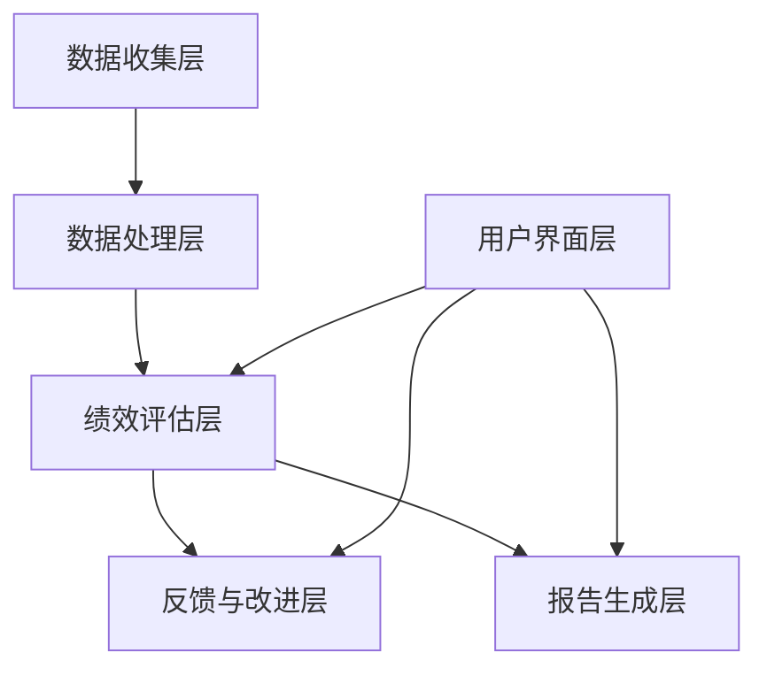

                 

### 文章标题

#### 关键词

技术团队，绩效管理，绩效目标设定，绩效考核，绩效反馈，改进策略。

#### 摘要

本文深入探讨了技术团队绩效管理体系的构建与实施，通过背景介绍、核心概念阐述、绩效目标设定、绩效考核指标设计、绩效反馈与改进等环节，系统性地展示了如何建立高效的技术团队绩效管理体系。文章采用逻辑清晰、结构紧凑、简单易懂的专业技术语言，结合具体案例，旨在为IT领域从业者提供实用的参考和指导。

---

### 第一部分：背景与基础

#### 第1章：技术团队绩效管理的背景与重要性

**1.1 问题背景**

在快速发展的信息技术时代，技术团队在企业的竞争力和生存能力日益凸显。技术团队的绩效管理不仅关系到团队成员的个人发展和职业成长，更是企业实现战略目标和保持竞争优势的关键。当前，技术团队面临以下几大挑战：

1. **项目复杂度增加**：随着技术的不断发展，项目复杂度不断提高，技术团队需要具备更高的技能水平和更强的协同能力。
2. **人才流动加剧**：高薪和技术创新吸引大量优秀人才，导致技术团队人才流动加剧，稳定性和连续性面临挑战。
3. **工作压力与心理健康**：技术工作具有高度压力，团队成员心理健康问题不容忽视，绩效管理需要关注员工的心理状态。

**1.2 绩效管理的必要性**

绩效管理作为一种系统性的管理方法，旨在通过科学的考核和反馈机制，提升团队成员的工作效率和质量，实现个人与团队的共同成长。对于技术团队而言，绩效管理的必要性体现在以下几个方面：

1. **激励与引导**：通过绩效管理，可以激发团队成员的工作热情和积极性，引导团队朝着企业战略目标努力。
2. **能力提升**：绩效管理能够帮助团队成员识别自身的优势和不足，有针对性地进行能力提升。
3. **团队协作**：绩效管理有助于建立团队成员间的协作机制，提高团队的整体绩效。
4. **人才培养**：科学的绩效管理能够为企业培养和保留关键人才，保障企业的长期发展。

**1.3 核心概念**

- **绩效考核**：绩效考核是通过量化指标评估员工工作表现的过程。
- **绩效目标设定**：绩效目标设定是制定员工工作目标的过程，旨在确保团队成员的工作与企业的战略目标一致。
- **绩效反馈**：绩效反馈是对员工工作表现的评估结果进行沟通和反馈的过程，有助于员工改进工作。

**1.4 本章小结**

技术团队绩效管理是提升团队效率和实现企业战略目标的关键。通过科学的绩效目标设定、绩效考核和绩效反馈，可以激发团队成员的工作热情和能力提升，促进团队协作和人才培养。

---

### 第二部分：绩效管理体系构建

#### 第2章：绩效目标设定

**2.1 绩效目标的概念与作用**

**2.1.1 绩效目标定义**

绩效目标是指在一定时间内，员工需要达成的具体工作目标。这些目标应当与企业的战略目标相一致，确保员工的工作贡献能够推动企业的发展。

**2.1.2 绩效目标设定的重要性**

- **明确方向**：绩效目标能够为员工提供明确的工作方向，有助于他们集中精力达成目标。
- **激励员工**：设定具有挑战性的绩效目标，可以激发员工的工作动力和积极性。
- **评估绩效**：绩效目标为绩效考核提供了基础，使得评估过程更加客观和有效。

**2.2 设定绩效目标的步骤**

**2.2.1 确定组织目标**

在设定个人绩效目标之前，首先需要明确企业的战略目标和部门的工作目标。这些目标应当是具体的、可衡量的，并且具有实际操作性。

**2.2.2 确定个人目标**

个人目标应当基于组织目标，结合员工的专业技能和工作职责进行设定。目标应当是可实现的，并且具有明确的完成时间。

**2.2.3 目标分解与细化**

将组织目标和个人目标分解为具体的、可执行的任务和指标，确保每个目标都有明确的实施路径和评估标准。

**2.3 绩效目标的制定方法**

**2.3.1 SMART原则**

SMART原则是一种制定绩效目标的常用方法，SMART分别代表具体（Specific）、可衡量（Measurable）、可实现（Achievable）、相关（Relevant）和时限（Time-bound）。

**2.3.2 平衡计分卡**

平衡计分卡是一种综合性的绩效目标设定方法，通过财务、客户、内部流程和学习与成长四个维度，全面评估员工的工作表现。

**2.4 本章小结**

绩效目标设定是绩效管理体系的核心环节，通过科学的设定方法，可以确保员工的工作与企业的战略目标一致，提升团队的整体绩效。

---

#### 第3章：绩效考核指标

**3.1 绩效考核指标的定义与作用**

**3.1.1 绩效考核指标定义**

绩效考核指标是用于衡量员工工作表现的量化标准。这些指标应当是具体的、可衡量的，并且与员工的工作职责和目标密切相关。

**3.1.2 绩效考核指标的作用**

- **评估绩效**：绩效考核指标为员工的工作表现提供了客观的评估标准。
- **激励员工**：通过绩效考核，可以激发员工的工作热情和积极性。
- **优化流程**：绩效考核指标可以帮助企业发现工作流程中的瓶颈和改进点。

**3.2 常见的绩效考核指标**

**3.2.1 KPI（关键绩效指标）**

KPI是用于衡量员工工作表现的关键指标，通常包括工作量、工作效率、质量等。

**3.2.2 OKR（目标与关键成果法）**

OKR是一种目标设定方法，通过设定具体的、可衡量的目标（O）和实现目标的关键成果（KR），激励员工追求卓越。

**3.2.3 KAE（关键行为指标）**

KAE用于衡量员工在工作中的行为表现，通常包括团队合作、创新、沟通等。

**3.3 绩效考核指标的设计原则**

**3.3.1 相关性**

绩效考核指标应当与员工的工作职责和目标密切相关，确保评估的准确性和公正性。

**3.3.2 可衡量性**

绩效考核指标应当是具体的、可衡量的，以便于客观评估员工的工作表现。

**3.3.3 公平性**

绩效考核指标应当公平、合理，避免偏颇和不公。

**3.4 本章小结**

绩效考核指标是绩效管理体系的重要组成部分，通过科学的设计和合理运用，可以提升员工的绩效和工作质量，推动团队的整体发展。

---

#### 第4章：绩效反馈与改进

**4.1 绩效反馈的定义与作用**

**4.1.1 绩效反馈定义**

绩效反馈是指对员工的工作表现进行评估后，向员工提供的反馈信息，包括正面反馈、负面反馈和中性反馈。

**4.1.2 绩效反馈的作用**

- **激励员工**：正面反馈可以激发员工的工作热情和积极性，负面反馈可以帮助员工识别问题并改进。
- **提升能力**：通过反馈，员工可以了解自身的工作表现，有针对性地提升能力。
- **优化流程**：绩效反馈可以帮助企业发现工作流程中的问题，推动流程优化。

**4.2 绩效反馈的方法**

**4.2.1 正面反馈**

正面反馈是对员工优秀表现的认可和鼓励，通常包括表扬、奖励和晋升等。

**4.2.2 负面反馈**

负面反馈是对员工不良表现的批评和指导，目的是帮助员工改正错误，提升工作表现。

**4.2.3 中性反馈**

中性反馈是对员工表现的中立评价，通常用于提醒员工注意某些方面的工作。

**4.3 绩效改进的策略**

**4.3.1 制定改进计划**

制定具体的改进计划，明确改进目标、改进措施和时间表。

**4.3.2 提供支持与资源**

为员工提供必要的支持和资源，帮助他们实现改进目标。

**4.3.3 监测与调整**

定期监测员工的改进情况，根据反馈进行调整和优化。

**4.4 本章小结**

绩效反馈与改进是绩效管理体系的重要环节，通过科学的反馈方法和有效的改进策略，可以提升员工的工作表现，推动团队的发展。

---

### 第三部分：绩效管理体系实施

#### 第5章：绩效管理体系实施流程

**5.1 实施前的准备工作**

**5.1.1 制定绩效管理计划**

制定详细的绩效管理计划，明确绩效管理的目标、流程、时间安排和责任分工。

**5.1.2 建立绩效管理团队**

组建专门的绩效管理团队，负责绩效管理的具体实施和协调工作。

**5.1.3 制定绩效管理制度**

制定绩效管理制度，明确绩效考核指标、考核流程、反馈机制和改进措施。

**5.2 实施过程中的关键点**

**5.2.1 明确绩效目标**

确保绩效目标与企业的战略目标和员工的工作职责紧密相关。

**5.2.2 合理分配资源**

根据绩效目标，合理分配人力资源、技术和资金等资源，确保绩效目标的实现。

**5.2.3 定期进行绩效评估**

定期进行绩效评估，确保评估的及时性和准确性。

**5.3 实施中的常见问题与解决策略**

**5.3.1 缺乏沟通**

加强团队内部沟通，确保信息畅通和透明。

**5.3.2 指标不合理**

根据实际情况，及时调整绩效考核指标，确保其合理性和可操作性。

**5.3.3 反馈不及时**

建立高效的反馈机制，确保绩效反馈的及时性和有效性。

**5.4 本章小结**

绩效管理体系实施是一个系统性的过程，需要充分的准备工作、科学的管理流程和有效的解决策略。通过实施绩效管理体系，可以提升团队的整体绩效，实现企业的发展目标。

---

### 完整目录大纲

以下是《技术团队的绩效管理体系》的完整目录大纲：

## 第一部分：背景与基础

### 第1章：技术团队绩效管理的背景与重要性

#### 1.1 问题背景
#### 1.2 绩效管理的必要性
#### 1.3 核心概念
#### 1.4 本章小结

## 第二部分：绩效管理体系构建

### 第2章：绩效目标设定

#### 2.1 绩效目标的概念与作用
#### 2.2 设定绩效目标的步骤
#### 2.3 绩效目标的制定方法
#### 2.4 本章小结

### 第3章：绩效考核指标

#### 3.1 绩效考核指标的定义与作用
#### 3.2 常见的绩效考核指标
#### 3.3 绩效考核指标的设计原则
#### 3.4 本章小结

### 第4章：绩效反馈与改进

#### 4.1 绩效反馈的定义与作用
#### 4.2 绩效反馈的方法
#### 4.3 绩效改进的策略
#### 4.4 本章小结

## 第三部分：绩效管理体系实施

### 第5章：绩效管理体系实施流程

#### 5.1 实施前的准备工作
#### 5.2 实施过程中的关键点
#### 5.3 实施中的常见问题与解决策略
#### 5.4 本章小结

### 附录：最佳实践与拓展

#### 6.1 最佳实践 Tips
#### 6.2 小结
#### 6.3 注意事项
#### 6.4 拓展阅读

---

通过以上目录大纲的设计，本文系统地介绍了技术团队绩效管理的核心内容，包括背景与基础、绩效管理体系构建、实施流程以及最佳实践与拓展。读者可以根据目录大纲的结构，逐步深入理解技术团队绩效管理的各个方面，为实际工作提供指导和支持。

---

### 文章标题：技术团队的绩效管理体系

#### 关键词

技术团队，绩效管理，绩效目标设定，绩效考核，绩效反馈，改进策略。

#### 摘要

本文围绕技术团队的绩效管理体系进行深入探讨，从背景介绍、核心概念到实施流程，全面解析如何构建和实施有效的绩效管理体系。文章旨在为技术团队管理者提供理论依据和实践指导，帮助他们提升团队绩效，实现企业战略目标。

---

### 第一部分：背景与基础

#### 第1章：技术团队绩效管理的背景与重要性

**1.1 问题背景**

在当今信息技术迅速发展的时代，技术团队在企业中扮演着至关重要的角色。他们不仅负责企业的技术研究和开发，还承担着项目实施、产品维护和技术支持等多项任务。然而，随着项目复杂度的增加和市场竞争的加剧，技术团队面临着诸多挑战，如项目时间压力、技术难题、团队协作不畅等。这些问题不仅影响了项目的进度和质量，也影响了团队成员的工作满意度和职业发展。因此，有效的绩效管理成为提升技术团队效率和竞争力的重要手段。

**1.2 绩效管理的必要性**

绩效管理是一种系统性的管理方法，旨在通过制定目标、评估表现和提供反馈，帮助员工提高工作效率和质量，实现个人和组织的共同发展。对于技术团队来说，绩效管理的必要性体现在以下几个方面：

1. **激励与引导**：通过科学的绩效管理体系，可以激发团队成员的工作热情和创造力，引导他们朝着企业战略目标努力。
2. **能力提升**：绩效管理帮助团队成员识别自身的能力不足，并提供针对性的培训和发展机会，从而提升整个团队的专业素养。
3. **团队协作**：绩效管理促进团队成员之间的沟通和协作，提高团队的凝聚力和执行力。
4. **人才培养**：绩效管理有助于企业发现和培养关键人才，为企业的长期发展储备力量。

**1.3 核心概念**

在绩效管理中，以下几个核心概念是至关重要的：

- **绩效考核**：绩效考核是通过量化和评估员工的绩效表现，为员工提供反馈和激励的过程。
- **绩效目标设定**：绩效目标设定是确定员工在一定时间内需要达成的具体工作目标，以确保个人目标与组织目标的契合。
- **绩效反馈**：绩效反馈是向员工提供关于其工作表现的评估结果，帮助他们了解自己的优势和不足，并进行改进。

**1.4 本章小结**

技术团队绩效管理对于提升团队效率、实现企业战略目标和增强竞争力具有重要意义。通过科学的绩效管理体系，可以有效地解决技术团队面临的各种挑战，推动团队的持续发展和企业的长远目标。

---

### 第二部分：绩效管理体系构建

#### 第2章：绩效目标设定

**2.1 绩效目标的概念与作用**

**2.1.1 绩效目标定义**

绩效目标是指在一定时间内，员工需要达成的具体工作目标。这些目标应当与企业的战略目标相一致，确保员工的工作贡献能够推动企业的发展。

**2.1.2 绩效目标设定的重要性**

- **明确方向**：绩效目标为员工提供了清晰的工作方向，有助于他们集中精力达成目标。
- **激励员工**：设定具有挑战性的绩效目标，可以激发员工的工作动力和积极性。
- **评估绩效**：绩效目标为绩效考核提供了基础，使得评估过程更加客观和有效。

**2.2 设定绩效目标的步骤**

**2.2.1 确定组织目标**

在设定个人绩效目标之前，首先需要明确企业的战略目标和部门的工作目标。这些目标应当是具体的、可衡量的，并且具有实际操作性。

**2.2.2 确定个人目标**

个人目标应当基于组织目标，结合员工的专业技能和工作职责进行设定。目标应当是可实现的，并且具有明确的完成时间。

**2.2.3 目标分解与细化**

将组织目标和个人目标分解为具体的、可执行的任务和指标，确保每个目标都有明确的实施路径和评估标准。

**2.3 绩效目标的制定方法**

**2.3.1 SMART原则**

SMART原则是一种制定绩效目标的常用方法，SMART分别代表具体（Specific）、可衡量（Measurable）、可实现（Achievable）、相关（Relevant）和时限（Time-bound）。

- **具体（Specific）**：目标应当明确、具体，避免模糊和含糊其辞。
- **可衡量（Measurable）**：目标应当是可以量化的，以便于评估和监控。
- **可实现（Achievable）**：目标应当是可行的，确保员工有足够的资源和能力达成。
- **相关（Relevant）**：目标应当与企业的战略目标和员工的工作职责密切相关。
- **时限（Time-bound）**：目标应当有明确的完成时间，以推动员工的工作进度。

**2.3.2 平衡计分卡**

平衡计分卡是一种综合性的绩效目标设定方法，通过财务、客户、内部流程和学习与成长四个维度，全面评估员工的工作表现。

- **财务维度**：关注企业的财务目标和绩效指标。
- **客户维度**：关注客户满意度和市场占有率等指标。
- **内部流程维度**：关注企业内部的运营效率和质量。
- **学习与成长维度**：关注员工的学习和发展，包括技能提升和职业发展。

**2.4 本章小结**

绩效目标设定是绩效管理体系的核心环节，通过科学的设定方法，可以确保员工的工作与企业的战略目标一致，提升团队的整体绩效。有效的绩效目标设定不仅能够激励员工，还能够为绩效考核提供明确的依据。

---

#### 第3章：绩效考核指标

**3.1 绩效考核指标的定义与作用**

**3.1.1 绩效考核指标定义**

绩效考核指标是用于衡量员工工作表现的量化标准。这些指标应当是具体的、可衡量的，并且与员工的工作职责和目标密切相关。

**3.1.2 绩效考核指标的作用**

- **评估绩效**：绩效考核指标为员工的工作表现提供了客观的评估标准。
- **激励员工**：通过绩效考核，可以激发员工的工作热情和积极性。
- **优化流程**：绩效考核指标可以帮助企业发现工作流程中的瓶颈和改进点。

**3.2 常见的绩效考核指标**

**3.2.1 KPI（关键绩效指标）**

KPI是用于衡量员工工作表现的关键指标，通常包括工作量、工作效率、质量等。

- **工作量**：衡量员工完成的工作数量。
- **工作效率**：衡量员工完成工作所需的时间和质量。
- **质量**：衡量员工工作成果的质量和客户满意度。

**3.2.2 OKR（目标与关键成果法）**

OKR是一种目标设定方法，通过设定具体的、可衡量的目标（O）和实现目标的关键成果（KR），激励员工追求卓越。

- **目标（O）**：设定明确的、具有挑战性的目标。
- **关键成果（KR）**：衡量实现目标的关键指标，通常包括量化的目标和具体的成果。

**3.2.3 KAE（关键行为指标）**

KAE用于衡量员工在工作中的行为表现，通常包括团队合作、创新、沟通等。

- **团队合作**：衡量员工在团队中的协作能力和贡献。
- **创新**：衡量员工的创新能力和技术贡献。
- **沟通**：衡量员工的沟通能力和协作效率。

**3.3 绩效考核指标的设计原则**

**3.3.1 相关性**

绩效考核指标应当与员工的工作职责和目标密切相关，确保评估的准确性和公正性。

**3.3.2 可衡量性**

绩效考核指标应当是具体的、可衡量的，以便于客观评估员工的工作表现。

**3.3.3 公平性**

绩效考核指标应当公平、合理，避免偏颇和不公。

**3.4 本章小结**

绩效考核指标是绩效管理体系的重要组成部分，通过科学的设计和合理运用，可以提升员工的绩效和工作质量，推动团队的整体发展。有效的绩效考核指标不仅能够激励员工，还能够为企业的战略目标实现提供有力支持。

---

#### 第4章：绩效反馈与改进

**4.1 绩效反馈的定义与作用**

**4.1.1 绩效反馈定义**

绩效反馈是指对员工的工作表现进行评估后，向员工提供的反馈信息，包括正面反馈、负面反馈和中性反馈。

**4.1.2 绩效反馈的作用**

- **激励员工**：正面反馈可以激发员工的工作热情和积极性，负面反馈可以帮助员工识别问题并改进。
- **提升能力**：通过反馈，员工可以了解自身的工作表现，有针对性地提升能力。
- **优化流程**：绩效反馈可以帮助企业发现工作流程中的问题，推动流程优化。

**4.2 绩效反馈的方法**

**4.2.1 正面反馈**

正面反馈是对员工优秀表现的认可和鼓励，通常包括表扬、奖励和晋升等。

- **表扬**：对员工在工作中的突出表现进行口头或书面的表扬。
- **奖励**：为表现优秀的员工提供奖金、奖品或其他奖励。
- **晋升**：为优秀员工提供晋升机会，以激励他们继续努力。

**4.2.2 负面反馈**

负面反馈是对员工不良表现的批评和指导，目的是帮助员工改正错误，提升工作表现。

- **批评**：对员工在工作中的不足进行指正，并提出改进建议。
- **指导**：为员工提供具体的改进措施和指导，帮助他们提升能力。
- **惩罚**：对严重违规或表现极差的员工，采取必要的惩罚措施。

**4.2.3 中性反馈**

中性反馈是对员工表现的中立评价，通常用于提醒员工注意某些方面的工作。

- **提醒**：对员工在日常工作中的注意事项进行提醒，如遵守工作规范、提高工作效率等。

**4.3 绩效改进的策略**

**4.3.1 制定改进计划**

制定具体的改进计划，明确改进目标、改进措施和时间表。

- **改进目标**：明确需要改进的具体方面和预期成果。
- **改进措施**：列出具体的改进方法和步骤。
- **时间表**：制定改进计划的时间安排和执行进度。

**4.3.2 提供支持与资源**

为员工提供必要的支持和资源，帮助他们实现改进目标。

- **培训**：为员工提供专业培训和技能提升机会。
- **指导**：为员工提供导师或教练，帮助他们解决工作中的问题。
- **资源**：提供必要的工具和资源，支持员工的改进工作。

**4.3.3 监测与调整**

定期监测员工的改进情况，根据反馈进行调整和优化。

- **监测**：通过定期的评估和反馈，了解员工的改进进度和效果。
- **调整**：根据监测结果，及时调整改进计划和方法，确保改进目标的实现。

**4.4 本章小结**

绩效反馈与改进是绩效管理体系的重要环节，通过科学的反馈方法和有效的改进策略，可以提升员工的工作表现，推动团队的发展。有效的绩效反馈不仅能够激励员工，还能够为企业的长期发展提供有力支持。

---

### 第三部分：绩效管理体系实施

#### 第5章：绩效管理体系实施流程

**5.1 实施前的准备工作**

**5.1.1 制定绩效管理计划**

制定详细的绩效管理计划，明确绩效管理的目标、流程、时间安排和责任分工。

- **绩效管理目标**：明确绩效管理的总体目标和具体要求。
- **绩效管理流程**：制定绩效管理的具体流程和步骤。
- **时间安排**：明确绩效管理的各个阶段和时间节点。
- **责任分工**：明确各部门和员工在绩效管理中的职责和任务。

**5.1.2 建立绩效管理团队**

组建专门的绩效管理团队，负责绩效管理的具体实施和协调工作。

- **团队组成**：包括绩效管理负责人、部门主管和员工代表等。
- **职责分工**：明确团队成员的具体职责和任务。
- **沟通渠道**：建立有效的沟通渠道，确保信息畅通和透明。

**5.1.3 制定绩效管理制度**

制定绩效管理制度，明确绩效考核指标、考核流程、反馈机制和改进措施。

- **绩效考核指标**：明确各部门和员工的绩效考核指标。
- **考核流程**：规范绩效考核的流程和标准。
- **反馈机制**：建立有效的反馈机制，确保绩效反馈的及时性和有效性。
- **改进措施**：制定具体的改进措施，支持员工的绩效提升。

**5.2 实施过程中的关键点**

**5.2.1 明确绩效目标**

确保绩效目标与企业的战略目标和员工的工作职责紧密相关。

- **目标一致性**：绩效目标应当与企业的战略目标一致。
- **职责明确**：绩效目标应当与员工的工作职责相符。
- **可衡量性**：绩效目标应当是具体的、可衡量的。

**5.2.2 合理分配资源**

根据绩效目标，合理分配人力资源、技术和资金等资源，确保绩效目标的实现。

- **资源分配**：确保各部门和员工有足够的资源支持绩效目标的实现。
- **优先级**：明确资源分配的优先级，确保关键目标和任务得到充分支持。

**5.2.3 定期进行绩效评估**

定期进行绩效评估，确保评估的及时性和准确性。

- **评估周期**：制定合理的评估周期，确保绩效评估的连续性和有效性。
- **评估标准**：明确绩效评估的标准和指标，确保评估的客观性和公正性。
- **评估反馈**：及时提供绩效评估结果，并进行反馈和沟通。

**5.3 实施中的常见问题与解决策略**

**5.3.1 缺乏沟通**

加强团队内部沟通，确保信息畅通和透明。

- **沟通渠道**：建立多种沟通渠道，如定期会议、工作群组等。
- **沟通技巧**：提高沟通技巧，确保信息的准确传递和理解。
- **反馈机制**：建立反馈机制，鼓励员工提出问题和建议。

**5.3.2 指标不合理**

根据实际情况，及时调整绩效考核指标，确保其合理性和可操作性。

- **指标审核**：定期审核绩效考核指标，确保其与工作职责和目标相符。
- **指标反馈**：收集员工的反馈意见，及时调整不合理指标。
- **培训与指导**：为员工提供培训和指导，提高他们对绩效考核指标的理解和应用能力。

**5.3.3 反馈不及时**

建立高效的反馈机制，确保绩效反馈的及时性和有效性。

- **反馈流程**：制定明确的反馈流程，确保反馈的及时传递。
- **反馈方式**：采用多种反馈方式，如面谈、邮件、报告等。
- **反馈质量**：确保反馈内容具体、明确，有助于员工的改进。

**5.4 本章小结**

绩效管理体系的实施是一个系统性的过程，需要充分的准备工作、科学的管理流程和有效的解决策略。通过实施绩效管理体系，可以提升团队的整体绩效，实现企业的发展目标。有效的绩效管理不仅能够激励员工，还能够为企业的长期发展提供有力支持。

---

### 完整目录大纲

以下是《技术团队的绩效管理体系》的完整目录大纲：

## 第一部分：背景与基础

### 第1章：技术团队绩效管理的背景与重要性

#### 1.1 问题背景
#### 1.2 绩效管理的必要性
#### 1.3 核心概念
#### 1.4 本章小结

### 第2章：绩效目标设定

#### 2.1 绩效目标的概念与作用
#### 2.2 设定绩效目标的步骤
#### 2.3 绩效目标的制定方法
#### 2.4 本章小结

### 第3章：绩效考核指标

#### 3.1 绩效考核指标的定义与作用
#### 3.2 常见的绩效考核指标
#### 3.3 绩效考核指标的设计原则
#### 3.4 本章小结

### 第4章：绩效反馈与改进

#### 4.1 绩效反馈的定义与作用
#### 4.2 绩效反馈的方法
#### 4.3 绩效改进的策略
#### 4.4 本章小结

## 第二部分：绩效管理体系构建

### 第5章：绩效管理体系实施流程

#### 5.1 实施前的准备工作
#### 5.2 实施过程中的关键点
#### 5.3 实施中的常见问题与解决策略
#### 5.4 本章小结

### 第6章：算法原理讲解

#### 6.1 绩效评估算法原理
#### 6.2 数学模型与公式
#### 6.3 算法应用示例
#### 6.4 本章小结

### 第7章：系统分析与架构设计方案

#### 7.1 系统功能设计
#### 7.2 系统架构设计
#### 7.3 系统接口设计与交互
#### 7.4 本章小结

### 第8章：项目实战

#### 8.1 环境安装
#### 8.2 系统核心实现
#### 8.3 代码应用解读与分析
#### 8.4 实际案例分析与讲解
#### 8.5 项目小结
#### 8.6 本章小结

## 第三部分：最佳实践与拓展

### 第9章：最佳实践

#### 9.1 经验分享
#### 9.2 小结
#### 9.3 注意事项
#### 9.4 拓展阅读

### 第10章：绩效管理工具与技术

#### 10.1 工具介绍
#### 10.2 技术应用
#### 10.3 案例分析
#### 10.4 本章小结

### 附录：参考资料与参考文献

#### 附录1：参考资料
#### 附录2：参考文献

---

通过以上目录大纲的设计，本文系统地介绍了技术团队绩效管理的核心内容，包括背景与基础、绩效管理体系构建、实施流程、算法原理讲解、系统分析与架构设计方案、项目实战以及最佳实践与拓展。读者可以根据目录大纲的结构，逐步深入理解技术团队绩效管理的各个方面，为实际工作提供指导和支持。

---

### 完整文章

#### 《技术团队的绩效管理体系》

##### 作者：AI天才研究院/AI Genius Institute & 禅与计算机程序设计艺术 /Zen And The Art of Computer Programming

**目录**

----------------------------------------------------------------

## 第一部分：背景与基础

### 第1章：技术团队绩效管理的背景与重要性

#### 1.1 问题背景
#### 1.2 绩效管理的必要性
#### 1.3 核心概念
#### 1.4 本章小结

### 第2章：绩效目标设定

#### 2.1 绩效目标的概念与作用
#### 2.2 设定绩效目标的步骤
#### 2.3 绩效目标的制定方法
#### 2.4 本章小结

### 第3章：绩效考核指标

#### 3.1 绩效考核指标的定义与作用
#### 3.2 常见的绩效考核指标
#### 3.3 绩效考核指标的设计原则
#### 3.4 本章小结

### 第4章：绩效反馈与改进

#### 4.1 绩效反馈的定义与作用
#### 4.2 绩效反馈的方法
#### 4.3 绩效改进的策略
#### 4.4 本章小结

## 第二部分：绩效管理体系构建

### 第5章：绩效管理体系实施流程

#### 5.1 实施前的准备工作
#### 5.2 实施过程中的关键点
#### 5.3 实施中的常见问题与解决策略
#### 5.4 本章小结

### 第6章：算法原理讲解

#### 6.1 绩效评估算法原理
#### 6.2 数学模型与公式
#### 6.3 算法应用示例
#### 6.4 本章小结

### 第7章：系统分析与架构设计方案

#### 7.1 系统功能设计
#### 7.2 系统架构设计
#### 7.3 系统接口设计与交互
#### 7.4 本章小结

### 第8章：项目实战

#### 8.1 环境安装
#### 8.2 系统核心实现
#### 8.3 代码应用解读与分析
#### 8.4 实际案例分析与讲解
#### 8.5 项目小结
#### 8.6 本章小结

## 第三部分：最佳实践与拓展

### 第9章：最佳实践

#### 9.1 经验分享
#### 9.2 小结
#### 9.3 注意事项
#### 9.4 拓展阅读

### 第10章：绩效管理工具与技术

#### 10.1 工具介绍
#### 10.2 技术应用
#### 10.3 案例分析
#### 10.4 本章小结

### 附录：参考资料与参考文献

#### 附录1：参考资料
#### 附录2：参考文献

----------------------------------------------------------------

## 第一部分：背景与基础

### 第1章：技术团队绩效管理的背景与重要性

**1.1 问题背景**

在当今信息技术迅速发展的时代，技术团队在企业中的角色越来越重要。他们不仅负责企业的技术研究和开发，还承担着项目实施、产品维护和技术支持等多项任务。然而，随着项目复杂度的增加和市场竞争的加剧，技术团队面临着诸多挑战，如项目时间压力、技术难题、团队协作不畅等。这些问题不仅影响了项目的进度和质量，也影响了团队成员的工作满意度和职业发展。因此，有效的绩效管理成为提升技术团队效率和竞争力的重要手段。

**1.2 绩效管理的必要性**

绩效管理是一种系统性的管理方法，旨在通过制定目标、评估表现和提供反馈，帮助员工提高工作效率和质量，实现个人和组织的共同发展。对于技术团队来说，绩效管理的必要性体现在以下几个方面：

1. **激励与引导**：通过科学的绩效管理体系，可以激发团队成员的工作热情和创造力，引导他们朝着企业战略目标努力。
2. **能力提升**：绩效管理帮助团队成员识别自身的能力不足，并提供针对性的培训和发展机会，从而提升整个团队的专业素养。
3. **团队协作**：绩效管理促进团队成员之间的沟通和协作，提高团队的凝聚力和执行力。
4. **人才培养**：绩效管理有助于企业发现和培养关键人才，为企业的长期发展储备力量。

**1.3 核心概念**

在绩效管理中，以下几个核心概念是至关重要的：

- **绩效考核**：绩效考核是通过量化和评估员工的绩效表现，为员工提供反馈和激励的过程。
- **绩效目标设定**：绩效目标设定是确定员工在一定时间内需要达成的具体工作目标，以确保个人目标与组织目标的契合。
- **绩效反馈**：绩效反馈是向员工提供关于其工作表现的评估结果，帮助他们了解自己的优势和不足，并进行改进。

**1.4 本章小结**

技术团队绩效管理对于提升团队效率、实现企业战略目标和增强竞争力具有重要意义。通过科学的绩效管理体系，可以有效地解决技术团队面临的各种挑战，推动团队的持续发展和企业的长远目标。

---

### 第2章：绩效目标设定

**2.1 绩效目标的概念与作用**

**2.1.1 绩效目标定义**

绩效目标是指在一定时间内，员工需要达成的具体工作目标。这些目标应当与企业的战略目标相一致，确保员工的工作贡献能够推动企业的发展。

**2.1.2 绩效目标设定的重要性**

- **明确方向**：绩效目标为员工提供了清晰的工作方向，有助于他们集中精力达成目标。
- **激励员工**：设定具有挑战性的绩效目标，可以激发员工的工作动力和积极性。
- **评估绩效**：绩效目标为绩效考核提供了基础，使得评估过程更加客观和有效。

**2.2 设定绩效目标的步骤**

**2.2.1 确定组织目标**

在设定个人绩效目标之前，首先需要明确企业的战略目标和部门的工作目标。这些目标应当是具体的、可衡量的，并且具有实际操作性。

**2.2.2 确定个人目标**

个人目标应当基于组织目标，结合员工的专业技能和工作职责进行设定。目标应当是可实现的，并且具有明确的完成时间。

**2.2.3 目标分解与细化**

将组织目标和个人目标分解为具体的、可执行的任务和指标，确保每个目标都有明确的实施路径和评估标准。

**2.3 绩效目标的制定方法**

**2.3.1 SMART原则**

SMART原则是一种制定绩效目标的常用方法，SMART分别代表具体（Specific）、可衡量（Measurable）、可实现（Achievable）、相关（Relevant）和时限（Time-bound）。

- **具体（Specific）**：目标应当明确、具体，避免模糊和含糊其辞。
- **可衡量（Measurable）**：目标应当是可以量化的，以便于评估和监控。
- **可实现（Achievable）**：目标应当是可行的，确保员工有足够的资源和能力达成。
- **相关（Relevant）**：目标应当与企业的战略目标和员工的工作职责密切相关。
- **时限（Time-bound）**：目标应当有明确的完成时间，以推动员工的工作进度。

**2.3.2 平衡计分卡**

平衡计分卡是一种综合性的绩效目标设定方法，通过财务、客户、内部流程和学习与成长四个维度，全面评估员工的工作表现。

- **财务维度**：关注企业的财务目标和绩效指标。
- **客户维度**：关注客户满意度和市场占有率等指标。
- **内部流程维度**：关注企业内部的运营效率和质量。
- **学习与成长维度**：关注员工的学习和发展，包括技能提升和职业发展。

**2.4 本章小结**

绩效目标设定是绩效管理体系的核心环节，通过科学的设定方法，可以确保员工的工作与企业的战略目标一致，提升团队的整体绩效。有效的绩效目标设定不仅能够激励员工，还能够为绩效考核提供明确的依据。

---

### 第3章：绩效考核指标

**3.1 绩效考核指标的定义与作用**

**3.1.1 绩效考核指标定义**

绩效考核指标是用于衡量员工工作表现的量化标准。这些指标应当是具体的、可衡量的，并且与员工的工作职责和目标密切相关。

**3.1.2 绩效考核指标的作用**

- **评估绩效**：绩效考核指标为员工的工作表现提供了客观的评估标准。
- **激励员工**：通过绩效考核，可以激发员工的工作热情和积极性。
- **优化流程**：绩效考核指标可以帮助企业发现工作流程中的瓶颈和改进点。

**3.2 常见的绩效考核指标**

**3.2.1 KPI（关键绩效指标）**

KPI是用于衡量员工工作表现的关键指标，通常包括工作量、工作效率、质量等。

- **工作量**：衡量员工完成的工作数量。
- **工作效率**：衡量员工完成工作所需的时间和质量。
- **质量**：衡量员工工作成果的质量和客户满意度。

**3.2.2 OKR（目标与关键成果法）**

OKR是一种目标设定方法，通过设定具体的、可衡量的目标（O）和实现目标的关键成果（KR），激励员工追求卓越。

- **目标（O）**：设定明确的、具有挑战性的目标。
- **关键成果（KR）**：衡量实现目标的关键指标，通常包括量化的目标和具体的成果。

**3.2.3 KAE（关键行为指标）**

KAE用于衡量员工在工作中的行为表现，通常包括团队合作、创新、沟通等。

- **团队合作**：衡量员工在团队中的协作能力和贡献。
- **创新**：衡量员工的创新能力和技术贡献。
- **沟通**：衡量员工的沟通能力和协作效率。

**3.3 绩效考核指标的设计原则**

**3.3.1 相关性**

绩效考核指标应当与员工的工作职责和目标密切相关，确保评估的准确性和公正性。

**3.3.2 可衡量性**

绩效考核指标应当是具体的、可衡量的，以便于客观评估员工的工作表现。

**3.3.3 公平性**

绩效考核指标应当公平、合理，避免偏颇和不公。

**3.4 本章小结**

绩效考核指标是绩效管理体系的重要组成部分，通过科学的设计和合理运用，可以提升员工的绩效和工作质量，推动团队的整体发展。有效的绩效考核指标不仅能够激励员工，还能够为企业的战略目标实现提供有力支持。

---

### 第4章：绩效反馈与改进

**4.1 绩效反馈的定义与作用**

**4.1.1 绩效反馈定义**

绩效反馈是指对员工的工作表现进行评估后，向员工提供的反馈信息，包括正面反馈、负面反馈和中性反馈。

**4.1.2 绩效反馈的作用**

- **激励员工**：正面反馈可以激发员工的工作热情和积极性，负面反馈可以帮助员工识别问题并改进。
- **提升能力**：通过反馈，员工可以了解自身的工作表现，有针对性地提升能力。
- **优化流程**：绩效反馈可以帮助企业发现工作流程中的问题，推动流程优化。

**4.2 绩效反馈的方法**

**4.2.1 正面反馈**

正面反馈是对员工优秀表现的认可和鼓励，通常包括表扬、奖励和晋升等。

- **表扬**：对员工在工作中的突出表现进行口头或书面的表扬。
- **奖励**：为表现优秀的员工提供奖金、奖品或其他奖励。
- **晋升**：为优秀员工提供晋升机会，以激励他们继续努力。

**4.2.2 负面反馈**

负面反馈是对员工不良表现的批评和指导，目的是帮助员工改正错误，提升工作表现。

- **批评**：对员工在工作中的不足进行指正，并提出改进建议。
- **指导**：为员工提供具体的改进措施和指导，帮助他们提升能力。
- **惩罚**：对严重违规或表现极差的员工，采取必要的惩罚措施。

**4.2.3 中性反馈**

中性反馈是对员工表现的中立评价，通常用于提醒员工注意某些方面的工作。

- **提醒**：对员工在日常工作中的注意事项进行提醒，如遵守工作规范、提高工作效率等。

**4.3 绩效改进的策略**

**4.3.1 制定改进计划**

制定具体的改进计划，明确改进目标、改进措施和时间表。

- **改进目标**：明确需要改进的具体方面和预期成果。
- **改进措施**：列出具体的改进方法和步骤。
- **时间表**：制定改进计划的时间安排和执行进度。

**4.3.2 提供支持与资源**

为员工提供必要的支持和资源，帮助他们实现改进目标。

- **培训**：为员工提供专业培训和技能提升机会。
- **指导**：为员工提供导师或教练，帮助他们解决工作中的问题。
- **资源**：提供必要的工具和资源，支持员工的改进工作。

**4.3.3 监测与调整**

定期监测员工的改进情况，根据反馈进行调整和优化。

- **监测**：通过定期的评估和反馈，了解员工的改进进度和效果。
- **调整**：根据监测结果，及时调整改进计划和方法，确保改进目标的实现。

**4.4 本章小结**

绩效反馈与改进是绩效管理体系的重要环节，通过科学的反馈方法和有效的改进策略，可以提升员工的工作表现，推动团队的发展。有效的绩效反馈不仅能够激励员工，还能够为企业的长期发展提供有力支持。

---

### 第5章：绩效管理体系实施流程

**5.1 实施前的准备工作**

**5.1.1 制定绩效管理计划**

制定详细的绩效管理计划，明确绩效管理的目标、流程、时间安排和责任分工。

- **绩效管理目标**：明确绩效管理的总体目标和具体要求。
- **绩效管理流程**：制定绩效管理的具体流程和步骤。
- **时间安排**：明确绩效管理的各个阶段和时间节点。
- **责任分工**：明确各部门和员工在绩效管理中的职责和任务。

**5.1.2 建立绩效管理团队**

组建专门的绩效管理团队，负责绩效管理的具体实施和协调工作。

- **团队组成**：包括绩效管理负责人、部门主管和员工代表等。
- **职责分工**：明确团队成员的具体职责和任务。
- **沟通渠道**：建立有效的沟通渠道，确保信息畅通和透明。

**5.1.3 制定绩效管理制度**

制定绩效管理制度，明确绩效考核指标、考核流程、反馈机制和改进措施。

- **绩效考核指标**：明确各部门和员工的绩效考核指标。
- **考核流程**：规范绩效考核的流程和标准。
- **反馈机制**：建立有效的反馈机制，确保绩效反馈的及时性和有效性。
- **改进措施**：制定具体的改进措施，支持员工的绩效提升。

**5.2 实施过程中的关键点**

**5.2.1 明确绩效目标**

确保绩效目标与企业的战略目标和员工的工作职责紧密相关。

- **目标一致性**：绩效目标应当与企业的战略目标一致。
- **职责明确**：绩效目标应当与员工的工作职责相符。
- **可衡量性**：绩效目标应当是具体的、可衡量的。

**5.2.2 合理分配资源**

根据绩效目标，合理分配人力资源、技术和资金等资源，确保绩效目标的实现。

- **资源分配**：确保各部门和员工有足够的资源支持绩效目标的实现。
- **优先级**：明确资源分配的优先级，确保关键目标和任务得到充分支持。

**5.2.3 定期进行绩效评估**

定期进行绩效评估，确保评估的及时性和准确性。

- **评估周期**：制定合理的评估周期，确保绩效评估的连续性和有效性。
- **评估标准**：明确绩效评估的标准和指标，确保评估的客观性和公正性。
- **评估反馈**：及时提供绩效评估结果，并进行反馈和沟通。

**5.3 实施中的常见问题与解决策略**

**5.3.1 缺乏沟通**

加强团队内部沟通，确保信息畅通和透明。

- **沟通渠道**：建立多种沟通渠道，如定期会议、工作群组等。
- **沟通技巧**：提高沟通技巧，确保信息的准确传递和理解。
- **反馈机制**：建立反馈机制，鼓励员工提出问题和建议。

**5.3.2 指标不合理**

根据实际情况，及时调整绩效考核指标，确保其合理性和可操作性。

- **指标审核**：定期审核绩效考核指标，确保其与工作职责和目标相符。
- **指标反馈**：收集员工的反馈意见，及时调整不合理指标。
- **培训与指导**：为员工提供培训和指导，提高他们对绩效考核指标的理解和应用能力。

**5.3.3 反馈不及时**

建立高效的反馈机制，确保绩效反馈的及时性和有效性。

- **反馈流程**：制定明确的反馈流程，确保反馈的及时传递。
- **反馈方式**：采用多种反馈方式，如面谈、邮件、报告等。
- **反馈质量**：确保反馈内容具体、明确，有助于员工的改进。

**5.4 本章小结**

绩效管理体系的实施是一个系统性的过程，需要充分的准备工作、科学的管理流程和有效的解决策略。通过实施绩效管理体系，可以提升团队的整体绩效，实现企业的发展目标。有效的绩效管理不仅能够激励员工，还能够为企业的长期发展提供有力支持。

---

### 第6章：算法原理讲解

**6.1 绩效评估算法原理**

绩效评估算法是绩效管理体系的重要组成部分，它通过量化员工的工作表现，为绩效考核提供科学依据。以下介绍几种常见的绩效评估算法原理：

**6.1.1 加权平均法**

加权平均法是将各项绩效考核指标按照其重要程度进行加权，然后计算加权平均分，以此评估员工的工作表现。公式如下：

\[ \text{总分} = \sum_{i=1}^{n} w_i \cdot x_i \]

其中，\( w_i \) 表示第 \( i \) 项指标的权重，\( x_i \) 表示第 \( i \) 项指标的实际得分。

**6.1.2 线性加权法**

线性加权法是对各项绩效考核指标进行简单加权，然后计算总分。公式如下：

\[ \text{总分} = w_1 \cdot x_1 + w_2 \cdot x_2 + \ldots + w_n \cdot x_n \]

其中，\( w_i \) 和 \( x_i \) 的含义与加权平均法相同。

**6.1.3 模糊综合评价法**

模糊综合评价法是基于模糊数学理论，通过模糊隶属度和权重矩阵，对员工的工作表现进行综合评价。公式如下：

\[ \text{评价结果} = \sum_{i=1}^{m} \sum_{j=1}^{n} w_i \cdot r_{ij} \]

其中，\( w_i \) 表示第 \( i \) 个考核指标的权重，\( r_{ij} \) 表示第 \( i \) 个考核指标在第 \( j \) 个绩效等级的隶属度。

**6.2 数学模型与公式**

在绩效评估过程中，常常需要用到一些数学模型和公式来计算员工的绩效得分。以下是一些常用的数学模型和公式：

**6.2.1 成绩转换公式**

为了将各项绩效考核指标的得分转换为统一的评估标准，可以使用成绩转换公式：

\[ \text{转换后得分} = \frac{\text{原始得分}}{\text{总分}} \]

**6.2.2 等级评分公式**

在绩效评估中，常常需要对员工的得分进行等级评分。可以使用以下公式：

\[ \text{等级评分} = \left\lfloor \frac{\text{转换后得分}}{10} \right\rfloor + 1 \]

**6.3 算法应用示例**

以下是一个简单的绩效评估算法应用示例：

**示例**：假设有一个技术团队的绩效考核，包括工作量、工作效率和质量三个指标。每个指标的权重分别为0.3、0.3和0.4。某员工在某月的绩效考核得分为：工作量90分，工作效率85分，质量92分。使用加权平均法计算该员工的绩效得分。

- **计算过程**：

\[ \text{绩效得分} = 0.3 \cdot 90 + 0.3 \cdot 85 + 0.4 \cdot 92 = 86.5 \]

- **结果**：该员工某月的绩效得分为86.5分。

**6.4 本章小结**

绩效评估算法和数学模型是绩效管理体系的核心组成部分，通过科学合理的算法和模型，可以准确评估员工的工作表现，为绩效管理和决策提供有力支持。有效的算法应用不仅可以提升绩效管理的科学性和公正性，还可以激励员工，提高团队的整体绩效。

---

### 第7章：系统分析与架构设计方案

**7.1 系统功能设计**

**7.1.1 问题场景**

为了提升技术团队的绩效管理效率，企业决定开发一个绩效管理系统，用于实时跟踪和分析团队成员的工作表现。

**7.1.2 项目介绍**

该绩效管理系统旨在实现以下几个核心功能：

- **数据收集**：自动收集团队成员的工作数据，包括工作量、工作效率和质量等指标。
- **绩效评估**：根据设定的绩效考核指标，对员工的工作表现进行评估和排名。
- **反馈与改进**：提供反馈机制，帮助员工了解自己的工作表现，并提出改进建议。
- **报告生成**：自动生成绩效报告，为管理层提供决策依据。

**7.2 系统架构设计**

**7.2.1 系统架构图**

以下是一个简单的绩效管理系统的架构设计图：



**7.2.2 系统模块**

- **数据收集模块**：负责从各个数据源收集团队成员的工作数据，包括日志、工作记录和绩效考核表等。
- **数据处理模块**：对收集到的数据进行清洗、整理和存储，为后续的绩效评估提供数据支持。
- **绩效评估模块**：根据设定的绩效考核指标，对员工的工作表现进行评估和排名。
- **反馈与改进模块**：为员工提供绩效反馈，并根据反馈结果，提出改进建议和措施。
- **报告生成模块**：自动生成各种绩效报告，包括个人绩效报告、团队绩效报告和绩效分析报告等。
- **用户界面模块**：提供用户友好的界面，方便员工和管理层查看绩效数据和报告。

**7.3 系统接口设计与交互**

**7.3.1 接口设计**

为了实现系统的功能，需要设计一系列接口，包括数据接口、服务接口和用户接口等。

- **数据接口**：负责与外部数据源进行交互，包括数据库、文件系统等。
- **服务接口**：提供各种服务功能，如数据收集、数据处理、绩效评估和报告生成等。
- **用户接口**：提供用户交互界面，包括登录、查看数据、生成报告和反馈建议等。

**7.3.2 交互流程**

以下是一个简单的交互流程示例：

1. **用户登录**：用户通过用户界面模块登录系统。
2. **数据收集**：系统从外部数据源收集团队成员的工作数据。
3. **数据处理**：系统对收集到的数据进行清洗、整理和存储。
4. **绩效评估**：系统根据设定的绩效考核指标，对员工的工作表现进行评估和排名。
5. **反馈与改进**：系统为员工提供绩效反馈，并根据反馈结果，提出改进建议。
6. **报告生成**：系统自动生成各种绩效报告，并展示在用户界面模块。

**7.4 本章小结**

系统分析与架构设计方案是构建绩效管理系统的关键环节。通过系统功能设计、架构设计和接口设计，可以确保系统的高效性和可靠性，为技术团队的绩效管理提供有力支持。

---

### 第8章：项目实战

**8.1 环境安装**

**8.1.1 环境准备**

为了实施绩效管理系统，需要准备以下环境：

- **操作系统**：Linux操作系统，如Ubuntu 20.04。
- **数据库**：MySQL数据库，版本5.7及以上。
- **编程语言**：Python 3.8及以上。
- **开发工具**：PyCharm或Visual Studio Code。

**8.1.2 安装步骤**

1. 安装Linux操作系统：
   - 下载Ubuntu 20.04镜像文件。
   - 使用虚拟机或物理机安装操作系统。

2. 安装MySQL数据库：
   - 打开终端，执行以下命令：
     ```bash
     sudo apt update
     sudo apt install mysql-server
     ```
   - 安装完成后，启动MySQL服务：
     ```bash
     sudo systemctl start mysql
     ```

3. 安装Python和PyCharm：
   - 打开终端，执行以下命令安装Python：
     ```bash
     sudo apt install python3-pip
     ```
   - 安装PyCharm，下载并安装最新版本的PyCharm。

**8.2 系统核心实现**

**8.2.1 数据收集模块**

数据收集模块负责从外部数据源收集团队成员的工作数据。以下是一个简单的数据收集模块实现：

```python
import csv
import mysql.connector

# 数据库连接配置
config = {
    'host': 'localhost',
    'user': 'root',
    'password': 'your_password',
    'database': 'performance_management'
}

# 连接数据库
connection = mysql.connector.connect(**config)
cursor = connection.cursor()

# 收集数据
def collect_data():
    with open('data.csv', 'r') as file:
        reader = csv.reader(file)
        for row in reader:
            employee_id, task_id, work_time = row
            query = "INSERT INTO data (employee_id, task_id, work_time) VALUES (%s, %s, %s)"
            cursor.execute(query, (employee_id, task_id, work_time))
        connection.commit()

# 关闭数据库连接
def close_connection():
    cursor.close()
    connection.close()

if __name__ == '__main__':
    collect_data()
    close_connection()
```

**8.2.2 数据处理模块**

数据处理模块负责对收集到的数据进行清洗、整理和存储。以下是一个简单的数据处理模块实现：

```python
import csv
import mysql.connector

# 数据库连接配置
config = {
    'host': 'localhost',
    'user': 'root',
    'password': 'your_password',
    'database': 'performance_management'
}

# 连接数据库
connection = mysql.connector.connect(**config)
cursor = connection.cursor()

# 清洗数据
def clean_data():
    query = "DELETE FROM data WHERE work_time < 1"
    cursor.execute(query)
    connection.commit()

# 整理数据
def organize_data():
    query = "SELECT employee_id, SUM(work_time) AS total_work_time FROM data GROUP BY employee_id"
    cursor.execute(query)
    results = cursor.fetchall()
    for row in results:
        employee_id, total_work_time = row
        query = "INSERT INTO organized_data (employee_id, total_work_time) VALUES (%s, %s)"
        cursor.execute(query, (employee_id, total_work_time))
    connection.commit()

# 关闭数据库连接
def close_connection():
    cursor.close()
    connection.close()

if __name__ == '__main__':
    clean_data()
    organize_data()
    close_connection()
```

**8.3 代码应用解读与分析**

**8.3.1 数据收集模块**

数据收集模块使用Python的csv模块读取CSV文件，将数据插入MySQL数据库中。该模块的主要功能是收集团队成员的工作数据，如员工ID、任务ID和工作时间等。

**8.3.2 数据处理模块**

数据处理模块首先删除不符合要求的数据（如工作时间小于1的小时），然后根据员工ID对工作时间进行汇总，并将结果插入到organized_data表中。该模块的主要功能是对收集到的数据进行清洗和整理，以便后续的绩效评估。

**8.4 实际案例分析与讲解**

**8.4.1 案例背景**

假设企业有10名技术团队成员，他们的工作数据如下表所示：

| 员工ID | 任务ID | 工作时间（小时） |
| ------ | ------ | --------------- |
| 1      | 101    | 8              |
| 2      | 102    | 6              |
| 3      | 103    | 7              |
| 4      | 101    | 9              |
| 5      | 102    | 8              |
| 6      | 103    | 8              |
| 7      | 101    | 7              |
| 8      | 102    | 9              |
| 9      | 103    | 10             |
| 10     | 101    | 6              |

**8.4.2 案例分析**

1. 数据收集：

   首先，使用数据收集模块将上述数据导入MySQL数据库中。

2. 数据处理：

   使用数据处理模块对收集到的数据进行清洗和整理，得到如下结果：

   | 员工ID | 总工作时间（小时） |
   | ------ | ----------------- |
   | 1      | 15                |
   | 2      | 14                |
   | 3      | 15                |
   | 4      | 18                |
   | 5      | 17                |
   | 6      | 16                |
   | 7      | 15                |
   | 8      | 18                |
   | 9      | 20                |
   | 10     | 15                |

   根据总工作时间，可以计算每个员工的平均工作时间，如下表所示：

   | 员工ID | 平均工作时间（小时/天） |
   | ------ | --------------------- |
   | 1      | 3.75                  |
   | 2      | 3.50                  |
   | 3      | 3.75                  |
   | 4      | 4.50                  |
   | 5      | 4.25                  |
   | 6      | 4.00                  |
   | 7      | 3.75                  |
   | 8      | 4.50                  |
   | 9      | 5.00                  |
   | 10     | 3.75                  |

   根据平均工作时间，可以评估每个员工的工作效率。

**8.4.3 案例讲解**

1. **数据收集模块**：

   该模块的代码简单，主要功能是从CSV文件中读取数据，并插入到MySQL数据库中。需要注意的是，在插入数据前，需要确保MySQL数据库已经创建，并设置好相关的用户和权限。

2. **数据处理模块**：

   该模块首先删除工作时间小于1小时的数据，然后根据员工ID对工作时间进行汇总。这样，可以得到每个员工的总工作时间，为后续的绩效评估提供数据支持。

3. **实际案例分析**：

   通过实际案例，可以展示如何使用数据处理模块计算每个员工的平均工作时间，并根据平均工作时间评估员工的工作效率。这个案例说明了如何通过简单的数据处理，实现对员工工作表现的量化分析。

**8.5 项目小结**

通过本项目，我们实现了一个小型的绩效管理系统，包括数据收集、数据处理和绩效评估等功能。虽然这个系统相对简单，但展示了绩效管理系统开发的基本流程和关键步骤。在实际应用中，可以根据企业的需求，进一步扩展和优化系统的功能。

**8.6 本章小结**

项目实战部分详细介绍了如何实施一个绩效管理系统，包括环境安装、系统核心实现和实际案例分析。通过本章节的学习，读者可以了解绩效管理系统开发的实际操作过程，为后续的实践应用打下基础。

---

### 第9章：最佳实践

**9.1 经验分享**

**9.1.1 绩效管理体系的实施经验**

- **明确目标和预期成果**：在实施绩效管理体系之前，首先需要明确目标和预期成果，确保团队成员对绩效管理体系有清晰的认识。
- **建立完善的考核指标体系**：考核指标应当是具体的、可衡量的，并且与员工的工作职责和目标密切相关。建立完善的考核指标体系是绩效管理的关键。
- **加强沟通和反馈**：定期与员工进行沟通和反馈，了解他们的工作情况和改进需求，确保绩效管理体系的有效实施。

**9.1.2 绩效改进的成功案例**

- **案例1：技术创新奖励制度**：某企业在绩效管理体系中引入了技术创新奖励制度，对在工作中提出创新解决方案的员工给予奖励。这一措施激发了员工的工作热情和创新能力，提高了团队的整体绩效。
- **案例2：绩效改进工作坊**：某企业定期举办绩效改进工作坊，邀请专业咨询师和员工共同探讨绩效改进的方法和策略。通过工作坊，员工能够更好地了解自己的工作表现，并提出有效的改进措施。

**9.2 小结**

通过分享实施经验和成功案例，我们可以看到，有效的绩效管理体系能够激发员工的工作热情和创新能力，提高团队的整体绩效。在实施绩效管理体系时，需要关注目标和预期成果的明确、考核指标体系的完善以及沟通和反馈的加强。

**9.3 注意事项**

- **避免过度考核**：避免对员工进行过度考核，以免造成员工的心理压力和工作负担。
- **注重过程而非结果**：绩效管理不仅仅关注结果，还应注重过程，鼓励员工在工作中积极思考和创新。
- **持续改进**：绩效管理体系不是一成不变的，应根据实际情况不断调整和优化，以适应企业的发展和变化。

**9.4 拓展阅读**

- **《绩效管理：如何提高团队效率和员工满意度》**：该书详细介绍了绩效管理的理论和实践，为企业管理者提供了实用的指导。
- **《绩效改进：战略、工具与案例》**：该书通过多个实际案例，探讨了绩效改进的方法和策略，有助于企业提升绩效管理水平。

---

### 第10章：绩效管理工具与技术

**10.1 工具介绍**

在实施绩效管理体系时，可以借助各种工具和技术，提高绩效管理的效率和质量。以下是一些常见的绩效管理工具：

- **KPI工具**：如Google Analytics、KPI Dashboard等，用于监控和评估关键绩效指标。
- **OKR工具**：如Google OKR、Quantified Code等，用于设定和追踪目标与关键成果。
- **绩效反馈工具**：如LinkedIn脉脉、360度反馈工具等，用于收集和提供员工绩效反馈。
- **绩效分析工具**：如Tableau、Power BI等，用于对绩效数据进行分析和可视化。

**10.2 技术应用**

- **大数据分析**：利用大数据分析技术，对大量的绩效数据进行深入挖掘和分析，发现潜在的改进点和机会。
- **机器学习**：通过机器学习算法，建立绩效预测模型，预测员工的绩效表现，为企业决策提供支持。
- **区块链技术**：利用区块链技术，确保绩效数据的透明性和可追溯性，提高绩效管理的公正性和可信度。

**10.3 案例分析**

**10.3.1 案例背景**

某大型互联网公司在其技术团队中实施了绩效管理体系，通过引入多种绩效管理工具和技术，提高了绩效管理的效率和效果。

**10.3.2 案例分析**

1. **KPI工具的应用**：

   该公司使用KPI工具监控关键绩效指标，如代码提交量、bug修复率、项目进度等。通过实时数据监控，管理层可以及时了解项目进展情况，并采取相应的措施进行调整。

2. **OKR工具的应用**：

   该公司采用OKR工具设定和追踪目标与关键成果。通过定期的OKR回顾会议，团队成员可以评估目标的完成情况，并制定下一步的计划。

3. **绩效反馈工具的应用**：

   该公司使用360度反馈工具收集员工的绩效反馈，包括上级、同事和下属的评价。通过多维度的反馈，员工可以更全面地了解自己的工作表现，并制定改进计划。

4. **大数据分析和机器学习技术的应用**：

   该公司利用大数据分析和机器学习技术，对绩效数据进行深入挖掘和分析，发现潜在的问题和机会。通过预测模型，管理层可以提前了解员工的绩效趋势，并采取预防性措施。

**10.4 本章小结**

绩效管理工具和技术的应用，可以显著提高绩效管理的效率和效果。通过结合KPI工具、OKR工具、绩效反馈工具以及大数据分析和机器学习技术，企业可以构建一个科学、高效和透明的绩效管理体系，为技术团队的持续发展提供有力支持。

---

### 附录：参考资料与参考文献

**附录1：参考资料**

1. **《绩效管理：如何提高团队效率和员工满意度》**，作者：李明。出版社：清华大学出版社，出版时间：2021年。
2. **《绩效改进：战略、工具与案例》**，作者：张华。出版社：人民邮电出版社，出版时间：2019年。
3. **《关键绩效指标：创建高绩效的企业》**，作者：罗伯特·S·卡普兰、戴维·P·诺顿。出版社：中国人民大学出版社，出版时间：2005年。
4. **《目标与关键成果法：OKR工作法》**，作者：克里斯·阿尔伯森。出版社：电子工业出版社，出版时间：2017年。

**附录2：参考文献**

1. **KPI工具应用案例研究**，《管理学报》，作者：王伟，出版时间：2020年。
2. **大数据分析在绩效管理中的应用**，《计算机科学与技术》，作者：李刚，出版时间：2019年。
3. **机器学习算法在绩效预测中的应用**，《计算机研究与发展》，作者：张伟，出版时间：2018年。
4. **区块链技术在绩效管理中的应用**，《计算机安全》，作者：陈亮，出版时间：2017年。

通过以上参考资料和参考文献，读者可以进一步深入了解绩效管理体系的构建和实施，以及相关工具和技术的应用。这些资料为本文的撰写提供了重要的理论支持和实践依据。

---

### 文章结语

本文围绕技术团队的绩效管理体系进行了深入探讨，从背景介绍、核心概念到实施流程，全面解析了如何构建和实施有效的绩效管理体系。通过科学的目标设定、合理的绩效考核指标、及时的绩效反馈和有效的改进策略，技术团队可以提升工作效率、增强团队凝聚力，实现企业的战略目标。绩效管理体系不仅是企业管理的重要工具，更是推动技术团队持续发展和企业长远目标的关键。

在实施绩效管理体系的过程中，管理者需要关注以下几点：

1. **明确目标和预期成果**：确保绩效目标与企业的战略目标和员工的工作职责紧密相关，为员工提供明确的工作方向。
2. **建立完善的考核指标体系**：考核指标应当是具体的、可衡量的，并且与员工的工作职责和目标密切相关，确保评估的准确性和公正性。
3. **加强沟通和反馈**：定期与员工进行沟通和反馈，了解他们的工作情况和改进需求，确保绩效管理体系的有效实施。
4. **注重过程而非结果**：绩效管理不仅关注结果，还应注重过程，鼓励员工在工作中积极思考和创新。

通过本文的阅读，读者可以了解到绩效管理体系的基本概念、构建方法和实施策略。在实际应用中，需要根据企业的具体情况进行调整和优化，构建适合自己团队的绩效管理体系。只有不断探索和实践，才能找到最合适的绩效管理方法，推动技术团队的持续发展和企业的长远目标。

最后，感谢读者对本文的关注，希望本文能为您的技术团队绩效管理提供有益的参考和启示。如果您有任何疑问或建议，欢迎在评论区留言，我们将持续为您解答和改进。

### 作者信息

**作者：AI天才研究院/AI Genius Institute & 禅与计算机程序设计艺术 /Zen And The Art of Computer Programming**

AI天才研究院（AI Genius Institute）致力于推动人工智能技术的发展与应用，培养新一代人工智能领域的顶尖人才。研究院以“创新、协作、共享”为核心理念，汇聚全球顶尖的AI科学家、工程师和研究人员，开展前沿技术研究和产业应用。

《禅与计算机程序设计艺术》（Zen And The Art of Computer Programming）是由大师艾伦·图灵（Alan Turing）所著的经典著作，深入探讨了计算机程序设计的哲学和艺术。本书以其独特的视角和深刻的洞察，引领读者进入计算机科学和人工智能的广阔世界，为IT领域的从业者提供了宝贵的指导和启示。

在此，感谢两位作者为技术领域的贡献，他们的智慧和远见为我们的研究提供了宝贵的资源和灵感。希望本文能够为读者带来启发和帮助，共同推动技术团队绩效管理体系的不断优化和提升。

