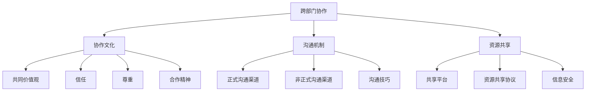

                 

### # 技术团队的跨部门协作：打破部门墙

关键词：跨部门协作、部门墙、协作文化、沟通机制、资源共享

摘要：本文旨在探讨技术团队在跨部门协作中面临的挑战和解决方法。通过分析问题背景、核心概念与联系，设计跨部门协作的机制，提供实用的指导，帮助企业实现高效运作和持续创新。

### 第1章：背景介绍

#### 1.1 问题背景

在现代社会，企业之间的竞争已经从传统的产品和服务层面，逐渐转向了团队协作与创新能力。技术团队的跨部门协作，成为企业实现高效运作和持续创新的关键。然而，现实中各部门之间往往存在沟通障碍、资源分配不均、目标不一致等问题，导致协作效率低下。

#### 1.2 问题描述

跨部门协作的难点主要体现在以下几个方面：

- **信息不对称**：各部门之间的信息传递不畅，导致信息被遗漏或误解。
- **职责不明确**：各部门的职责划分不清晰，容易导致任务重叠或责任逃避。
- **利益冲突**：各部门在资源、预算等方面存在竞争关系，容易导致协作中的利益冲突。
- **沟通困难**：跨部门之间的沟通往往需要花费更多的时间和精力，且效果不佳。

#### 1.3 问题解决

要解决上述问题，需要从以下几个方面入手：

- **建立协同文化**：企业应积极培养协同合作的企业文化，提升员工的合作意识和协作能力。
- **明确职责和目标**：通过明确的职责划分和共同的目标设定，确保各部门能够紧密协作。
- **优化沟通机制**：建立高效的沟通渠道和机制，确保信息能够在各部门之间畅通无阻。
- **共享资源和信息**：通过共享资源和信息，减少信息不对称和资源浪费，提高协作效率。

#### 1.4 边界与外延

- **边界**：本书主要讨论企业内部技术团队的跨部门协作问题，不包括企业与企业之间的协作。
- **外延**：本书的讨论范围不仅限于技术团队，也包括其他职能部门之间的协作。

#### 1.5 概念结构与核心要素组成

- **跨部门协作**：指不同部门之间为实现共同目标而进行的合作行为。
- **协作文化**：企业内部培养的合作意识和价值观。
- **沟通机制**：确保信息在各部门之间传递畅通的渠道和方式。
- **资源共享**：各部门之间共享资源，提高协作效率。

#### 1.6 本章小结

本章简要介绍了技术团队的跨部门协作的重要性、面临的挑战以及解决方法。接下来，本书将深入探讨如何建立协同文化、明确职责和目标、优化沟通机制以及共享资源和信息，为企业实现高效跨部门协作提供实用指南。

---

### 第2章：核心概念与联系

#### 2.1 跨部门协作的概念

跨部门协作是指在组织内部，不同部门之间为实现共同目标而进行的合作行为。它包括信息的共享、资源的整合、任务的分配以及目标的协同。

#### 2.2 跨部门协作的核心特点

- **多样性**：跨部门协作涉及到多个部门，这些部门在职能、文化、资源等方面存在差异。
- **复杂性**：跨部门协作往往涉及到多种资源和信息的整合，需要解决信息不对称、职责不明确等问题。
- **动态性**：跨部门协作的目标和任务往往是动态变化的，需要灵活调整协作策略。

#### 2.3 跨部门协作与传统协作的区别

- **范围**：传统协作主要是在同一部门内部进行，而跨部门协作涉及多个部门。
- **复杂性**：跨部门协作需要处理更多的信息和资源，复杂度更高。
- **目标**：传统协作的目标相对单一，而跨部门协作的目标往往是多维的，需要综合平衡。

#### 2.4 跨部门协作的要素

- **人**：跨部门协作的主体是人员，包括跨部门的团队成员和管理者。
- **流程**：跨部门协作需要明确的流程，确保任务能够高效完成。
- **信息**：跨部门协作需要高效的信息传递和共享机制，减少信息不对称。
- **资源**：跨部门协作需要共享资源，提高资源利用效率。

#### 2.5 跨部门协作的挑战与机遇

**挑战**：

- **沟通障碍**：不同部门之间的沟通往往存在障碍，容易导致误解和冲突。
- **职责不清**：各部门的职责划分不明确，容易导致任务重叠或责任逃避。
- **资源竞争**：各部门在资源方面存在竞争，容易导致协作效率降低。

**机遇**：

- **协同创新**：跨部门协作能够促进不同部门之间的知识交流和创新。
- **资源整合**：跨部门协作能够实现资源的最大化利用。
- **提高效率**：跨部门协作能够优化流程，提高工作效率。

#### 2.6 本章小结

本章对跨部门协作的核心概念进行了详细解释，并分析了其核心特点、与传统协作的区别、要素以及面临的挑战与机遇。这些概念的理解对于深入探讨跨部门协作的策略和方法具有重要意义。

---

### 第3章：跨部门协作的机制设计

#### 3.1 协同文化的培养

**3.1.1 协同文化的重要性**

协同文化是跨部门协作的基础，它包括共同的价值观、信任、尊重和合作精神。一个具备协同文化的企业能够更好地实现跨部门协作。

**3.1.2 培养协同文化的策略**

- **树立榜样**：通过树立优秀跨部门协作的榜样，激励员工学习。
- **强化培训**：定期开展跨部门协作培训，提高员工协作能力。
- **激励措施**：设立跨部门协作奖励机制，鼓励员工积极参与协作。
- **沟通交流**：定期组织跨部门交流会，促进部门之间的了解和信任。

#### 3.2 明确职责和目标

**3.2.1 职责划分**

- **明确部门职责**：制定明确的部门职责说明书，确保各部门职责清晰。
- **职责划分原则**：职责划分应遵循专业化、协同化和效能化的原则。

**3.2.2 目标设定**

- **共同目标**：制定共同的目标，确保各部门的目标一致。
- **目标分解**：将共同目标分解为具体的部门目标，确保各部门的任务明确。
- **目标跟踪**：定期跟踪部门目标的完成情况，及时调整目标。

#### 3.3 优化沟通机制

**3.3.1 沟通渠道**

- **正式沟通渠道**：建立正式的跨部门沟通渠道，如定期会议、报告等。
- **非正式沟通渠道**：鼓励非正式沟通，如社交活动、交流群组等。

**3.3.2 沟通技巧**

- **有效倾听**：倾听对方意见，理解对方需求。
- **清晰表达**：表达观点时，要清晰明了，避免歧义。
- **反馈机制**：建立有效的反馈机制，确保沟通效果。

#### 3.4 共享资源和信息

**3.4.1 资源共享**

- **共享平台**：建立共享平台，如企业内部网站、共享文档等，方便资源获取。
- **资源共享协议**：制定资源共享协议，明确资源共享的范围、方式和责任。

**3.4.2 信息共享**

- **信息共享机制**：建立信息共享机制，如定期信息发布、信息共享会议等。
- **信息安全**：确保信息共享过程中信息安全，防止信息泄露。

#### 3.5 边界与外延

- **边界**：本书主要讨论企业内部技术团队的跨部门协作问题，不包括企业与企业之间的协作。
- **外延**：本书的讨论范围不仅限于技术团队，也包括其他职能部门之间的协作。

#### 3.6 本章小结

本章介绍了跨部门协作的机制设计，包括协同文化的培养、明确职责和目标、优化沟通机制以及共享资源和信息。这些机制的设计和实施，有助于企业实现高效跨部门协作，提高整体运营效率。

---

### 第4章：实战案例分析

#### 4.1 案例背景

某大型互联网公司，其技术团队涉及多个部门，如前端开发、后端开发、运维、产品等。随着公司业务的发展，跨部门协作的难度逐渐增加，导致协作效率低下，影响了项目的进度和品质。

#### 4.2 案例问题描述

- **信息不对称**：各部门之间的信息传递不畅，导致项目进度和问题被延误。
- **职责不明确**：各部门的职责划分不清晰，导致任务重叠和责任逃避。
- **沟通困难**：跨部门之间的沟通效率低下，沟通效果不佳。

#### 4.3 案例解决方案

**4.3.1 建立协同文化**

- **树立榜样**：公司领导层以身作则，倡导协同文化。
- **强化培训**：定期开展跨部门协作培训，提高员工协作能力。
- **激励措施**：设立跨部门协作奖励机制，鼓励员工积极参与协作。

**4.3.2 明确职责和目标**

- **明确部门职责**：制定各部门职责说明书，确保职责清晰。
- **目标分解**：将共同目标分解为具体的部门目标，确保任务明确。

**4.3.3 优化沟通机制**

- **正式沟通渠道**：建立正式的跨部门沟通渠道，如定期会议、报告等。
- **非正式沟通渠道**：鼓励非正式沟通，如社交活动、交流群组等。

**4.3.4 共享资源和信息**

- **共享平台**：建立共享平台，如企业内部网站、共享文档等。
- **资源共享协议**：制定资源共享协议，明确资源共享的范围、方式和责任。

#### 4.4 案例效果评估

通过上述措施，公司技术团队的跨部门协作得到了显著改善：

- **信息传递效率提高**：各部门之间的信息传递更加畅通，项目进度和问题得到了及时处理。
- **职责划分清晰**：各部门的职责划分更加明确，任务重叠和责任逃避的现象减少。
- **沟通效果提升**：跨部门之间的沟通效率提高，沟通效果显著改善。

#### 4.5 本章小结

本案例通过建立协同文化、明确职责和目标、优化沟通机制以及共享资源和信息，成功解决了技术团队跨部门协作中的问题。这一实战案例为其他企业提供了有益的借鉴和启示。

---

### 第5章：最佳实践与启示

#### 5.1 最佳实践

1. **建立协同文化**：通过领导层的倡导和员工的积极参与，培养协同合作的企业文化。
2. **明确职责和目标**：制定详细的部门职责说明书和共同目标，确保各部门的职责清晰和目标一致。
3. **优化沟通机制**：建立正式和非正式的沟通渠道，提高沟通效率和效果。
4. **共享资源和信息**：建立共享平台和资源共享协议，确保资源的有效利用和信息的畅通传递。

#### 5.2 启示

1. **跨部门协作的重要性**：跨部门协作是企业实现高效运作和持续创新的关键，企业应高度重视并投入资源。
2. **协同文化的培养**：协同文化是跨部门协作的基础，企业应积极培养和强化。
3. **沟通机制的优化**：建立高效的沟通机制，确保信息能够在各部门之间畅通无阻。
4. **资源共享和信息共享**：通过共享资源和信息，减少信息不对称和资源浪费，提高协作效率。

#### 5.3 未来展望

1. **数字化转型**：随着数字化转型的推进，企业将更加依赖跨部门协作，如何实现高效跨部门协作将成为企业发展的关键。
2. **智能化协作**：利用人工智能和大数据技术，优化跨部门协作机制，提高协作效率和效果。
3. **全球化协作**：随着全球化的加深，企业需要面对更多跨部门的全球协作，如何应对全球化背景下的跨部门协作挑战，是企业需要思考和解决的问题。

#### 5.4 本章小结

本章总结了最佳实践和启示，为企业在跨部门协作中提供了实用的指导。随着企业竞争的加剧和数字化转型的发展，跨部门协作的重要性将日益凸显，企业应不断优化跨部门协作机制，提高协作效率和效果。

---

### 本章小结

本文从问题背景、核心概念、机制设计、实战案例、最佳实践等多个角度，深入探讨了技术团队的跨部门协作。通过分析问题、设计机制、实践案例和最佳实践，我们揭示了跨部门协作的挑战和解决方法。希望本文能够为企业在跨部门协作中提供有益的参考和启示，助力企业实现高效运作和持续创新。

### 作者信息

作者：AI天才研究院/AI Genius Institute & 禅与计算机程序设计艺术 /Zen And The Art of Computer Programming

---

### 附录

#### 附录A：核心概念对比表格

| 核心概念 | 定义 | 特点 |
| --- | --- | --- |
| 跨部门协作 | 不同部门之间为实现共同目标而进行的合作行为 | 多样性、复杂性、动态性 |
| 协作文化 | 企业内部培养的合作意识和价值观 | 共同价值观、信任、尊重、合作精神 |
| 沟通机制 | 确保信息在各部门之间传递畅通的渠道和方式 | 正式沟通渠道、非正式沟通渠道、沟通技巧 |
| 资源共享 | 各部门之间共享资源，提高协作效率 | 共享平台、资源共享协议、信息安全 |

#### 附录B：跨部门协作的ER实体关系图

---

本文通过逻辑清晰、结构紧凑、简单易懂的专业的技术语言，从多个角度深入探讨了技术团队的跨部门协作，为企业提供了实用的指导。希望本文能够帮助企业在跨部门协作中打破部门墙，实现高效运作和持续创新。感谢读者对本文的关注与支持，我们期待与您共同探讨更多技术领域的难题与解决方案。

