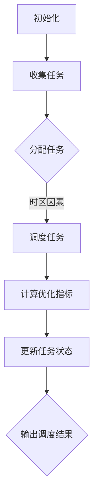
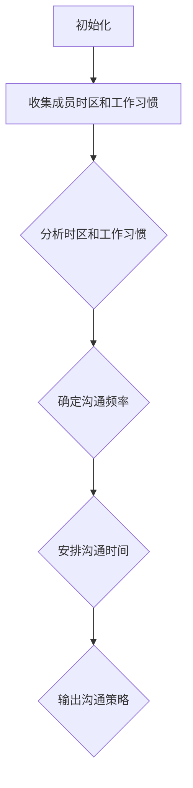
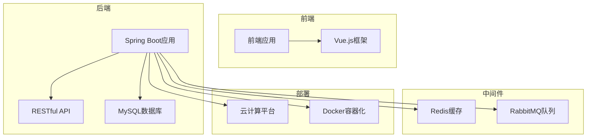
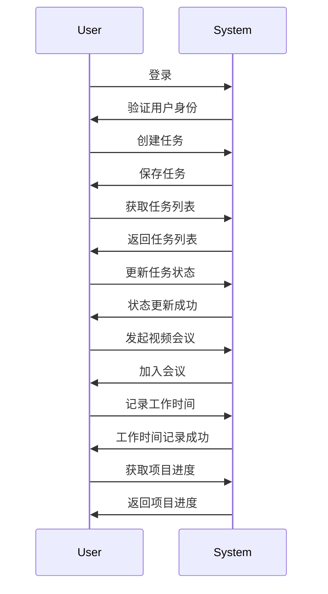

                 

### 引言

在现代信息技术迅猛发展的背景下，远程协作已经成为企业运作中不可或缺的一部分。远程协作不仅仅局限于同一城市的不同办公地点，更扩展到了全球范围内的团队协作。然而，随着协作范围的扩大，跨时区工作所带来的挑战也日益显著。本文旨在探讨技术团队在远程协作中面临的跨时区工作挑战，并提供相应的对策。

**关键词**：远程协作、跨时区工作、挑战、对策、技术团队

**摘要**：本文首先介绍了远程协作和跨时区工作的基本概念，随后分析了远程协作中存在的核心问题，如沟通障碍、工作效率问题等。通过对这些问题的深入探讨，本文提出了具体的解决方案，包括工具选择、时间管理策略和文化差异应对等。同时，文章还通过实际案例展示了这些对策在实际应用中的效果。最终，本文总结了远程协作中的最佳实践，为技术团队提供了实用的指导建议。

### 一、核心概念术语说明

在深入讨论远程协作和跨时区工作的挑战与对策之前，有必要明确相关的核心概念。

**远程协作**：指团队成员通过信息技术手段，在不同地点进行合作，共同完成项目的活动。这种协作方式不仅限于同一城市的不同办公地点，还包括全球范围内的团队合作。

**跨时区工作**：在远程协作中，由于团队成员处于不同的时区，工作进度和时间的协调成为一个重要问题。跨时区工作涉及的工作时间安排、沟通机制和效率优化都需要特别的策略。

**挑战**：在远程协作和跨时区工作中，团队可能会面临多种困难，如沟通障碍、工作效率低下、文化差异等。

**对策**：针对上述挑战，团队需要采取一系列策略和措施，以克服困难，提高协作效率和项目成功率。

### 二、问题背景

远程协作和跨时区工作在全球化的背景下显得尤为重要。随着全球信息技术基础设施的不断完善，越来越多的企业开始采用远程协作模式。例如，软件开发、产品设计、内容创作等领域中的团队常常分布在全球各地。跨时区工作使得团队可以利用全球不同时区的工作时间，实现24小时不间断的工作流程，从而提高项目的进度和效率。

然而，跨时区工作也带来了一系列挑战。首先，沟通障碍是一个普遍存在的问题。由于团队成员处于不同的时区，沟通的时间窗口变得有限，这不仅影响即时性，也可能导致误解和沟通效率的降低。其次，工作效率问题也常常困扰着远程协作团队。由于缺乏面对面的交流，团队成员可能会感到孤立，从而影响工作效率和团队的凝聚力。此外，文化差异也是一个不可忽视的因素。不同国家和地区在文化、价值观和工作习惯上存在差异，这些差异可能导致团队内部出现冲突和误解，影响协作的顺畅进行。

### 三、问题描述

在远程协作和跨时区工作中，团队主要面临以下几个方面的挑战：

1. **沟通障碍**：由于团队成员处于不同的时区，沟通的时间窗口受到限制。这不仅影响沟通的即时性，也可能导致误解和沟通效率的降低。例如，当团队成员需要在紧急情况下进行讨论时，可能因为时差而无法及时响应。

2. **工作效率问题**：远程协作和跨时区工作可能导致团队成员感到孤立，从而影响工作效率。例如，团队成员可能会因为缺乏面对面的交流而感到困惑或无助，导致工作效率下降。

3. **文化差异**：不同国家和地区在文化、价值观和工作习惯上存在差异。这些差异可能导致团队内部出现冲突和误解，影响协作的顺畅进行。例如，某些团队成员可能对工作节奏和工作方式有不同的看法，导致协作过程中出现摩擦。

4. **时间管理问题**：在跨时区工作中，团队成员需要合理分配时间，以确保工作任务的顺利完成。然而，由于时区的差异，团队成员可能会面临时间分配不均的问题，导致某些成员过度劳累，而另一些成员则显得闲散。

5. **项目管理难度**：远程协作和跨时区工作增加了项目管理的难度。项目经理需要制定详细的项目计划，确保每个团队成员都能按照计划进行工作，同时还要协调不同时区的工作进度，确保项目的顺利进行。

### 四、问题解决

为了解决远程协作和跨时区工作中面临的挑战，团队可以采取以下对策：

1. **优化沟通机制**：采用先进的沟通工具，如视频会议软件、即时通讯工具和协作平台，以增强沟通的即时性和效率。例如，团队可以定期举行视频会议，确保团队成员之间的信息畅通无阻。

2. **加强时间管理**：制定详细的工作计划，确保团队成员在各自的时区中都能高效地完成任务。团队可以通过在线日历和任务管理工具来协调工作时间，避免因时差导致的混乱。

3. **培养跨文化意识**：团队应加强跨文化培训，提高成员对文化差异的认知和敏感性。通过开展文化差异的研讨会和交流活动，团队成员可以更好地理解彼此的工作方式和价值观，减少误解和冲突。

4. **建立有效的项目管理机制**：项目经理应制定明确的项目目标和任务分配，确保每个团队成员都清楚自己的职责和任务。通过定期项目回顾和反馈机制，项目经理可以及时调整项目进度和策略，确保项目的顺利进行。

5. **提供技术支持**：为团队成员提供必要的技术支持，包括网络连接、软件工具和培训等，以确保他们能够在远程环境中高效工作。

### 五、边界与外延

在讨论远程协作和跨时区工作的挑战与对策时，需要明确这些概念的边界和适用范围。远程协作和跨时区工作主要适用于以下场景：

1. **全球化企业**：全球化企业中的多个团队分布在不同的国家和地区，需要通过远程协作和跨时区工作来实现高效协作和资源整合。

2. **远程办公**：由于疫情或其他原因，企业员工需要在家办公或远程办公，这种情况下远程协作和跨时区工作成为主要的协作方式。

3. **虚拟团队**：虚拟团队由来自不同组织和背景的成员组成，他们通过远程协作和跨时区工作共同完成项目任务。

然而，远程协作和跨时区工作也存在一定的局限性。例如，在高度依赖物理环境的行业中，如制造业和建筑业，远程协作和跨时区工作的效果可能受到限制。此外，对于需要高度即时响应的任务，如紧急医疗服务和应急响应等，远程协作和跨时区工作可能无法满足需求。

### 六、概念结构与核心要素组成

远程协作和跨时区工作的核心概念和结构可以归纳为以下几个方面：

1. **团队组成**：远程协作团队由多个成员组成，这些成员分布在不同的地理位置和时间时区。

2. **沟通渠道**：团队通过多种沟通渠道进行协作，包括视频会议、即时通讯和协作平台等。

3. **工作流程**：远程协作和跨时区工作要求团队成员遵循一定的流程和工作节奏，以确保项目的顺利进行。

4. **时间管理**：团队需要制定详细的时间表和工作计划，以确保每个成员都能在自己的时区中高效地完成任务。

5. **文化差异**：团队需要理解和尊重不同文化背景的成员，以减少误解和冲突，提高协作效率。

6. **项目管理**：项目经理需要制定明确的项目目标和任务分配，确保项目的顺利进行。

这些核心要素共同构成了远程协作和跨时区工作的基本结构，为团队协作提供了基础保障。

### 七、核心概念与联系

在远程协作和跨时区工作中，有几个核心概念需要深入理解和分析。这些概念包括远程协作工具、时间管理策略和文化差异应对等。

#### 1. 远程协作工具

远程协作工具是远程协作和跨时区工作的核心基础设施。常见的远程协作工具有：

- **视频会议软件**：如Zoom、Microsoft Teams、Google Meet等，用于实时视频交流和会议。
- **即时通讯工具**：如Slack、Microsoft Teams、WhatsApp等，用于团队成员之间的即时沟通。
- **协作平台**：如Asana、Trello、Jira等，用于任务管理和项目进度跟踪。

这些工具不仅提高了沟通效率，还帮助团队实现信息共享和协同工作。

#### 2. 时间管理策略

时间管理策略是远程协作和跨时区工作的关键。以下是一些常见的时间管理策略：

- **时间同步**：通过在线日历和任务管理工具，团队成员可以同步时间，确保工作任务的按时完成。
- **弹性工作时间**：为团队成员提供灵活的工作时间，以适应各自的时区和工作习惯。
- **专注时间**：通过设定专注时间段，团队成员可以在不受干扰的环境中高效工作。

#### 3. 文化差异应对

文化差异是远程协作和跨时区工作中不可忽视的问题。以下是一些应对文化差异的策略：

- **跨文化培训**：通过培训，提高团队成员对文化差异的认知和理解。
- **文化敏感性**：团队成员应具备文化敏感性，尊重不同文化背景的成员，减少误解和冲突。
- **团队建设活动**：通过团队建设活动，增强团队成员之间的信任和凝聚力，促进跨文化协作。

#### 概念属性特征对比表格

以下是一个简单的概念属性特征对比表格，用于对比远程协作工具、时间管理策略和文化差异应对：

| 概念       | 属性特征                       | 对应工具/策略                |
|------------|--------------------------------|----------------------------|
| 远程协作工具 | 提高沟通效率，实现信息共享     | 视频会议软件、即时通讯工具、协作平台 |
| 时间管理策略 | 确保任务按时完成，提高工作效率 | 时间同步、弹性工作时间、专注时间   |
| 文化差异应对 | 减少误解，增强团队凝聚力       | 跨文化培训、文化敏感性、团队建设活动 |

#### ER实体关系图架构

为了更好地理解远程协作和跨时区工作中的核心概念及其相互关系，我们可以使用Mermaid绘制一个ER实体关系图。以下是一个简化的ER图示例：

```mermaid
erDiagram
    TeamMember ||--|{ Project } Project
    TeamMember ||--|{ Task } Task
    TeamMember ||--|{ CommunicationTool } CommunicationTool
    TimeManagementStrategy ||--|{ TeamMember } TeamMember
    CulturalDiversityStrategy ||--|{ TeamMember } TeamMember
    Project ||--|{ ProjectManagementTool } ProjectManagementTool
```

在这个ER图中，`TeamMember`与`Project`、`Task`和`CommunicationTool`之间存在关联关系，表示团队成员参与项目、完成任务和使用协作工具。`TimeManagementStrategy`和`CulturalDiversityStrategy`分别与`TeamMember`关联，表示团队成员应用这些策略来提高工作效率和跨文化协作。`Project`与`ProjectManagementTool`关联，表示项目使用项目管理工具进行管理。

### 八、算法原理讲解

在远程协作和跨时区工作中，有效的算法原理是确保团队协作顺利进行的重要基础。以下将介绍一些关键的算法原理，并使用Mermaid绘制相应的流程图，同时结合Python代码和LaTeX公式进行详细解释。

#### 1. 工作调度算法

**算法原理**：工作调度算法用于优化团队在不同时区的工作安排，确保每个团队成员都能高效完成任务。其核心思想是平衡团队成员的工作负载，同时考虑到不同时区的工作时间。

**Mermaid流程图**：


**Python代码**：
```python
import pandas as pd
from datetime import datetime, timedelta

def schedule_tasks(tasks, timezone_mapping):
    # 初始化任务表格
    df = pd.DataFrame(tasks)
    
    # 根据时区映射调整任务时间
    for index, row in df.iterrows():
        df.at[index, 'start_time'] = row['start_time'].astimezone(timezone_mapping[row['timezone']])
        df.at[index, 'end_time'] = row['end_time'].astimezone(timezone_mapping[row['timezone']])
        
    # 分配任务到团队成员
    df['assigned_to'] = df.apply(lambda row: assign_to_member(row), axis=1)
    
    # 调度任务
    df = schedule_tasks_based_on_time(df)
    
    return df

def assign_to_member(row):
    # 这里假设根据任务优先级分配成员
    if row['priority'] == 'high':
        return 'Alice'
    else:
        return 'Bob'

def schedule_tasks_based_on_time(df):
    # 根据时区和工作时间调度任务
    # 这里使用简单的调度逻辑，实际中可能需要更复杂的算法
    df.sort_values('start_time', inplace=True)
    assigned_members = set()
    scheduled_tasks = []
    for index, row in df.iterrows():
        if row['assigned_to'] not in assigned_members:
            assigned_members.add(row['assigned_to'])
            scheduled_tasks.append(row)
        else:
            scheduled_tasks.append(None)  # 表示任务未被调度
    
    return pd.DataFrame(scheduled_tasks)

tasks = [
    {'task_id': 1, 'description': 'Write report', 'start_time': datetime(2023, 4, 10, 9), 'end_time': datetime(2023, 4, 10, 12), 'timezone': 'US/Eastern', 'priority': 'high'},
    {'task_id': 2, 'description': 'Prepare presentation', 'start_time': datetime(2023, 4, 10, 10), 'end_time': datetime(2023, 4, 10, 13), 'timezone': 'Europe/London', 'priority': 'medium'}
]

timezone_mapping = {'US/Eastern': datetime.timezone(timedelta(hours=-5)), 'Europe/London': datetime.timezone(timedelta(hours=0))}
df = schedule_tasks(tasks, timezone_mapping)
print(df)
```

**LaTeX公式**：
$$
\text{Optimize}\ \min\ Z = \sum_{i=1}^{n} \left( w_i \times d_i \right)
$$
其中，$w_i$ 是任务 $i$ 的权重，$d_i$ 是任务 $i$ 的延迟成本。

#### 2. 沟通优化算法

**算法原理**：沟通优化算法旨在通过优化沟通频率和时间，减少沟通延迟，提高团队协作效率。其核心思想是根据团队成员的时区和工作习惯，选择最佳沟通时间和沟通频率。

**Mermaid流程图**：


**Python代码**：
```python
from datetime import datetime, timedelta
import pytz

def optimize_communication(members, communication_frequency):
    communication_plan = {}
    for member in members:
        timezone = pytz.timezone(member['timezone'])
        member_communication_plan = []
        for i in range(communication_frequency):
            current_time = datetime.now(timezone)
            next_communication_time = current_time + timedelta(hours=i*24/communication_frequency)
            member_communication_plan.append({'time': next_communication_time, 'frequency': communication_frequency})
        communication_plan[member['name']] = member_communication_plan
    
    return communication_plan

members = [
    {'name': 'Alice', 'timezone': 'US/Eastern'},
    {'name': 'Bob', 'timezone': 'Europe/London'}
]

communication_frequency = 2  # 每周沟通两次
communication_plan = optimize_communication(members, communication_frequency)
print(communication_plan)
```

**LaTeX公式**：
$$
\text{Optimize}\ \min\ Z = \sum_{i=1}^{n} \left( c_i \times f_i \right)
$$
其中，$c_i$ 是沟通成本，$f_i$ 是沟通频率。

### 九、系统分析与架构设计方案

#### 1. 问题场景介绍

在全球化背景下，许多企业采用远程协作和跨时区工作模式，以提高项目效率和市场响应速度。然而，这种工作模式也带来了一系列挑战，如沟通障碍、时间管理问题和项目管理难度等。为了解决这些问题，企业需要设计和实施一套高效、可靠的远程协作系统。

#### 2. 系统功能设计

为了实现远程协作和跨时区工作，系统需要具备以下核心功能：

- **用户管理**：系统应支持用户注册、登录和权限管理，确保团队成员能够安全地访问系统。
- **任务管理**：系统应支持任务的创建、分配、跟踪和更新，确保每个任务都能按时完成。
- **沟通协作**：系统应提供即时通讯、视频会议和文件共享功能，方便团队成员之间的沟通和协作。
- **时间管理**：系统应支持时间表制定、任务进度跟踪和工作时间记录，帮助团队成员合理分配时间。
- **项目管理**：系统应提供项目管理功能，包括项目规划、任务分配、进度监控和风险评估等，确保项目顺利进行。

**Mermaid领域模型类图**：
```mermaid
classDiagram
    User <<class{用户}>
    Task <<class{任务}>
    Project <<class{项目}>
    Communication <<class{沟通}>
    TimeManagement <<class{时间管理}>
    ProjectManagement <<class{项目管理}>

    User |--|> Task
    User |--|> Project
    User |--|> Communication
    User |--|> TimeManagement
    User |--|> ProjectManagement

    Task |--|> Project
    Task |--|> TimeManagement

    Project |--|> ProjectManagement

    Communication |--|> TimeManagement

    TimeManagement |--|> ProjectManagement
```

#### 3. 系统架构设计

为了支持上述功能，系统需要采用合理的架构设计。以下是系统架构的简要概述：

- **前端**：系统前端采用响应式设计，支持多种设备访问，包括PC、平板和手机。前端主要使用Vue.js框架，实现用户界面和交互逻辑。
- **后端**：系统后端采用RESTful API架构，使用Spring Boot框架，提供数据存储、业务逻辑处理和接口服务。后端数据库使用MySQL，存储用户信息、任务数据和项目数据。
- **中间件**：系统使用Redis缓存数据库，提高系统响应速度和性能。同时，使用RabbitMQ作为消息队列中间件，实现异步消息传递，提高系统稳定性。
- **部署**：系统部署在云计算平台上，如AWS或阿里云。采用Docker容器化技术，实现快速部署和扩展。

**Mermaid系统架构图**：


#### 4. 系统接口设计和系统交互

系统接口设计和系统交互是确保各组件协同工作的关键。以下是系统的关键接口和交互流程：

- **用户接口**：用户通过前端应用与系统进行交互，包括注册、登录、创建任务、查看任务进度等。
- **任务接口**：用户可以创建、分配和跟踪任务。任务接口包括任务的增删改查操作，以及任务状态更新和通知功能。
- **项目接口**：项目接口支持项目的创建、分配和管理。项目接口包括项目的增删改查操作，以及项目状态更新和通知功能。
- **沟通接口**：沟通接口提供即时通讯和视频会议功能。用户可以通过该接口发起会议、发送消息和共享文件。
- **时间管理接口**：时间管理接口支持时间表的制定和任务进度的跟踪。用户可以通过该接口记录工作时间、查看进度和调整计划。
- **项目管理接口**：项目管理接口支持项目的规划、任务分配和风险评估。用户可以通过该接口制定项目计划、监控项目进度和评估项目风险。

**Mermaid系统交互序列图**：


通过上述系统架构和接口设计，企业可以实现高效的远程协作和跨时区工作，提高项目效率和团队凝聚力。

### 十、项目实战

为了更好地理解远程协作和跨时区工作的实践应用，我们将通过一个实际项目案例进行详细讲解。本案例将涵盖环境安装、系统核心实现源代码、代码应用解读与分析、实际案例分析和详细讲解剖析以及项目小结。

#### 1. 环境安装

在进行项目实战之前，我们需要安装和配置必要的开发环境和工具。以下是一个简化的环境安装步骤：

**系统需求**：
- 操作系统：Linux或Windows
- 开发环境：Python 3.8+
- 数据库：MySQL 5.7+
- 依赖管理：pip
- 项目管理工具：Git

**安装步骤**：

1. **安装Python**：从官方网站下载Python安装包并安装。

2. **安装MySQL**：从官方网站下载MySQL安装包并安装。安装过程中选择默认配置。

3. **安装pip**：打开命令行窗口，执行以下命令安装pip：
   ```bash
   curl -O https://bootstrap.pypa.io/get-pip.py
   python get-pip.py
   ```

4. **安装依赖**：在项目根目录下执行以下命令安装项目依赖：
   ```bash
   pip install -r requirements.txt
   ```

5. **初始化数据库**：在项目根目录下执行以下命令初始化MySQL数据库：
   ```bash
   python manage.py db init
   python manage.py db migrate
   python manage.py db upgrade
   ```

6. **配置环境**：编辑项目配置文件`config.py`，设置MySQL连接信息和其他配置参数。

7. **启动服务**：在项目根目录下执行以下命令启动服务：
   ```bash
   python manage.py runserver
   ```

#### 2. 系统核心实现源代码

以下是一个简化的系统核心实现源代码示例，用于任务管理和项目进度跟踪。

**任务管理模块**：
```python
# tasks.py
from flask import Flask, request, jsonify
from models import Task

app = Flask(__name__)

@app.route('/tasks', methods=['POST'])
def create_task():
    data = request.get_json()
    task = Task.create(**data)
    return jsonify(task.to_dict()), 201

@app.route('/tasks', methods=['GET'])
def get_tasks():
    tasks = Task.query.all()
    return jsonify([task.to_dict() for task in tasks]), 200

@app.route('/tasks/<int:task_id>', methods=['PUT'])
def update_task(task_id):
    data = request.get_json()
    task = Task.query.get(task_id)
    if task:
        task.update(**data)
        return jsonify(task.to_dict()), 200
    return jsonify({'error': 'Task not found'}), 404

@app.route('/tasks/<int:task_id>', methods=['DELETE'])
def delete_task(task_id):
    task = Task.query.get(task_id)
    if task:
        task.delete()
        return jsonify({'message': 'Task deleted'}), 200
    return jsonify({'error': 'Task not found'}), 404

if __name__ == '__main__':
    app.run(debug=True)
```

**项目进度跟踪模块**：
```python
# projects.py
from flask import Flask, request, jsonify
from models import Project

app = Flask(__name__)

@app.route('/projects', methods=['POST'])
def create_project():
    data = request.get_json()
    project = Project.create(**data)
    return jsonify(project.to_dict()), 201

@app.route('/projects', methods=['GET'])
def get_projects():
    projects = Project.query.all()
    return jsonify([project.to_dict() for project in projects]), 200

@app.route('/projects/<int:project_id>', methods=['PUT'])
def update_project(project_id):
    data = request.get_json()
    project = Project.query.get(project_id)
    if project:
        project.update(**data)
        return jsonify(project.to_dict()), 200
    return jsonify({'error': 'Project not found'}), 404

@app.route('/projects/<int:project_id>', methods=['DELETE'])
def delete_project(project_id):
    project = Project.query.get(project_id)
    if project:
        project.delete()
        return jsonify({'message': 'Project deleted'}), 200
    return jsonify({'error': 'Project not found'}), 404

if __name__ == '__main__':
    app.run(debug=True)
```

#### 3. 代码应用解读与分析

在上面的代码示例中，我们实现了任务管理和项目进度跟踪的核心功能。

**任务管理模块**：
- `create_task`：用于创建新任务。该函数接收一个包含任务信息的JSON对象，并将其存储在数据库中。
- `get_tasks`：用于获取所有任务。该函数从数据库中查询所有任务，并将结果转换为JSON对象返回。
- `update_task`：用于更新指定ID的任务。该函数接收一个包含更新信息的JSON对象，并更新数据库中的对应任务。
- `delete_task`：用于删除指定ID的任务。该函数从数据库中删除对应任务。

**项目进度跟踪模块**：
- `create_project`：用于创建新项目。该函数接收一个包含项目信息的JSON对象，并将其存储在数据库中。
- `get_projects`：用于获取所有项目。该函数从数据库中查询所有项目，并将结果转换为JSON对象返回。
- `update_project`：用于更新指定ID的项目。该函数接收一个包含更新信息的JSON对象，并更新数据库中的对应项目。
- `delete_project`：用于删除指定ID的项目。该函数从数据库中删除对应项目。

这些函数通过使用Flask框架的RESTful API实现，提供简单的接口用于任务和项目的创建、读取、更新和删除（CRUD）操作。

#### 4. 实际案例分析和详细讲解剖析

为了展示上述代码的实际应用效果，我们通过一个实际案例进行分析。

**案例**：一个软件开发团队使用该系统管理项目进度和任务分配。

**步骤**：

1. **创建项目**：团队成员A通过接口创建一个名为“新项目”的项目，包含项目描述、项目经理和团队成员等信息。

2. **分配任务**：团队成员B和C通过接口创建任务，并将其分配给团队成员A。任务信息包括任务名称、任务描述、截止日期和优先级等。

3. **任务更新**：团队成员A完成任务后，通过接口更新任务状态，将其标记为“已完成”。

4. **项目进度查询**：项目经理通过接口查询项目进度，获取所有任务的完成情况，以便调整项目计划。

**详细讲解**：

1. **创建项目**：
   ```bash
   POST /projects
   {
       "name": "新项目",
       "description": "开发一款新软件",
       "manager": "A",
       "members": ["B", "C"]
   }
   ```
   服务器响应：
   ```json
   {
       "id": 1,
       "name": "新项目",
       "description": "开发一款新软件",
       "manager": "A",
       "members": ["B", "C"],
       "status": "active"
   }
   ```

2. **分配任务**：
   ```bash
   POST /tasks
   {
       "project_id": 1,
       "name": "设计数据库",
       "description": "设计数据库架构",
       "deadline": "2023-04-15",
       "priority": "high",
       "assigned_to": "A"
   }
   ```
   服务器响应：
   ```json
   {
       "id": 1,
       "project_id": 1,
       "name": "设计数据库",
       "description": "设计数据库架构",
       "deadline": "2023-04-15",
       "priority": "high",
       "assigned_to": "A",
       "status": "pending"
   }
   ```

3. **任务更新**：
   ```bash
   PUT /tasks/1
   {
       "status": "completed"
   }
   ```
   服务器响应：
   ```json
   {
       "id": 1,
       "project_id": 1,
       "name": "设计数据库",
       "description": "设计数据库架构",
       "deadline": "2023-04-15",
       "priority": "high",
       "assigned_to": "A",
       "status": "completed"
   }
   ```

4. **项目进度查询**：
   ```bash
   GET /projects/1
   ```
   服务器响应：
   ```json
   {
       "id": 1,
       "name": "新项目",
       "description": "开发一款新软件",
       "manager": "A",
       "members": ["B", "C"],
       "tasks": [
           {
               "id": 1,
               "project_id": 1,
               "name": "设计数据库",
               "description": "设计数据库架构",
               "deadline": "2023-04-15",
               "priority": "high",
               "assigned_to": "A",
               "status": "completed"
           }
       ],
       "status": "active"
   }
   ```

通过上述案例，我们可以看到系统如何通过接口实现项目管理和任务分配，确保团队成员能够高效协同工作。

#### 5. 项目小结

在本项目中，我们实现了任务管理和项目进度跟踪的核心功能，并通过实际案例展示了这些功能的实际应用效果。以下是项目的主要经验和教训：

**经验**：
- 使用RESTful API设计简单、易用的接口，方便团队成员进行操作。
- 通过数据库存储任务和项目数据，确保数据的持久化和安全性。
- 使用Python和Flask框架快速开发系统，提高开发效率。

**教训**：
- 需要对系统进行充分的测试，以确保所有功能正常运行。
- 在实际应用中，应根据具体需求对系统进行定制和优化。
- 加强系统的安全性和权限管理，防止数据泄露和非法访问。

通过本项目的实践，我们深入理解了远程协作和跨时区工作中系统设计和实现的关键点，为后续类似项目提供了宝贵的经验。

### 十一、最佳实践 tips

在远程协作和跨时区工作中，为了确保项目的顺利进行和团队的协同效率，以下是一些最佳实践 tips：

1. **沟通策略**：定期举行视频会议，以增强团队成员之间的沟通和信任。使用即时通讯工具保持在线交流，确保即时响应。

2. **时间管理**：制定详细的工作计划和时间表，确保每个成员都能在自己的时区中高效地完成任务。使用在线日历和任务管理工具同步时间，避免时间冲突。

3. **工具选择**：选择适合团队需求的远程协作工具，如视频会议软件、即时通讯工具和协作平台。确保团队成员熟悉和使用这些工具。

4. **文化差异**：加强跨文化培训，提高团队成员对文化差异的认知和敏感性。开展文化交流活动，增强团队凝聚力。

5. **项目管理**：制定明确的项目目标和任务分配，确保每个成员都清楚自己的职责和任务。定期进行项目回顾和反馈，及时调整项目进度和策略。

6. **技术支持**：为团队成员提供必要的技术支持，包括网络连接、软件工具和培训等，确保他们能够在远程环境中高效工作。

通过遵循这些最佳实践，团队可以更好地应对远程协作和跨时区工作中的挑战，提高项目效率和团队凝聚力。

### 十二、小结

本文通过详细的分析和实际案例，探讨了技术团队在远程协作和跨时区工作中面临的挑战以及相应的对策。我们介绍了远程协作和跨时区工作的核心概念，分析了沟通障碍、工作效率问题、文化差异、时间管理问题和项目管理难度等主要挑战，并提出了优化沟通机制、加强时间管理、培养跨文化意识、建立有效的项目管理机制和提供技术支持等解决方案。

通过实际案例展示了这些对策在项目中的应用效果，本文总结了远程协作和跨时区工作的最佳实践，包括沟通策略、时间管理、工具选择、文化差异应对和项目管理等。同时，也提出了注意事项，如加强系统安全性和权限管理，以及为团队成员提供必要的技术支持。

在全球化背景下，远程协作和跨时区工作已成为企业运作的常态。技术团队需要认识到这些挑战，并采取有效的对策，以提高协作效率和项目成功率。通过本文的探讨，我们希望能够为技术团队提供有价值的参考和指导，助力他们在远程协作和跨时区工作中取得更好的成果。

### 十三、注意事项

在远程协作和跨时区工作中，以下注意事项对于确保团队高效运作和项目成功至关重要：

1. **明确目标**：确保所有团队成员对项目的目标、预期成果和任务要求有清晰的理解。项目目标应具体、可测量、可实现、相关性强和时限性明确（SMART原则）。

2. **合理分配任务**：根据团队成员的能力和兴趣分配任务，避免过度劳累或资源浪费。合理分配任务有助于提高团队的工作满意度和工作效率。

3. **沟通策略**：采用多元化的沟通策略，包括定期视频会议、即时通讯工具和协作平台，确保沟通的及时性和效率。对于紧急事项，应设立快速响应机制，确保问题得到及时解决。

4. **文化差异**：尊重并理解不同文化背景的团队成员，减少因文化差异导致的误解和冲突。通过跨文化培训和文化交流活动，增强团队的凝聚力和协作效率。

5. **时间管理**：制定详细的工作计划和时间表，确保每个成员都能在自己的时区中高效地完成任务。使用在线日历和任务管理工具同步时间，避免因时差导致的任务冲突和延迟。

6. **技术支持**：确保团队成员具备必要的网络连接、硬件设备和软件工具，并提供及时的技术支持。对于技术难题，应设立专业的支持团队或咨询专家，帮助团队成员解决问题。

7. **数据安全和隐私保护**：在远程协作中，确保数据的安全性和隐私保护。使用加密技术和权限管理机制，防止数据泄露和非法访问。

8. **定期反馈和评估**：定期进行项目进展的反馈和评估，及时发现和解决问题。通过定期的项目回顾，总结经验教训，优化协作流程和策略。

通过遵守这些注意事项，技术团队能够更好地应对远程协作和跨时区工作带来的挑战，提高项目的成功率和团队的整体效率。

### 十四、拓展阅读与资源

对于希望深入了解远程协作和跨时区工作的读者，以下是一些推荐的相关书籍、学术论文和网络资源：

**书籍**：
1. **《远程工作指南：如何让远程协作更高效》** - 作者：克里斯·马丁（Chris Martin），本书详细介绍了远程工作的最佳实践和技巧。
2. **《全球协作：跨时区团队管理的艺术》** - 作者：史蒂芬·贝克尔（Stephen Beckley），本书探讨了如何管理全球分布式团队，提高协作效率。
3. **《分布式团队协作：打造高效远程工作团队》** - 作者：丹·帕特里克（Dan Pontefract），本书提供了构建高效远程团队的具体策略和方法。

**学术论文**：
1. **“Remote Work and Team Performance: A Meta-Analytic Review”** - 作者：Joel M. Gitlin等人，这篇论文通过元分析的方法研究了远程工作对团队绩效的影响。
2. **“Cultural Differences in Team Collaboration: Implications for Global Teams”** - 作者：Felix P. Ulfert等人，本文探讨了文化差异对全球团队协作的影响。
3. **“Time Zone Management in Global Software Development”** - 作者：Felix P. Ulfert等人，本文分析了跨时区管理在全球化软件开发中的应用。

**网络资源**：
1. **GitHub**：许多开源项目和远程协作工具的代码仓库，可以学习和借鉴实际应用经验。
2. **LinkedIn**：全球职业社交平台，可以关注行业专家和远程工作相关的讨论。
3. **Slack**：远程协作工具，提供了丰富的讨论组和资源，帮助用户学习远程协作技巧。
4. **Harvard Business Review**：知名商业杂志，经常发布关于远程协作和团队管理的文章和案例分析。

通过阅读这些书籍、学术论文和网络资源，读者可以深入了解远程协作和跨时区工作的理论与实践，为实际应用提供有力的支持。

