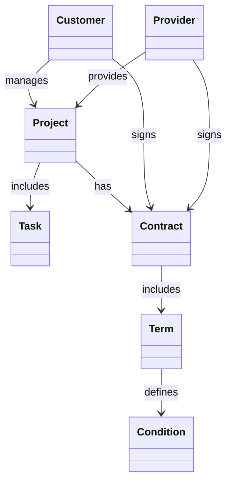
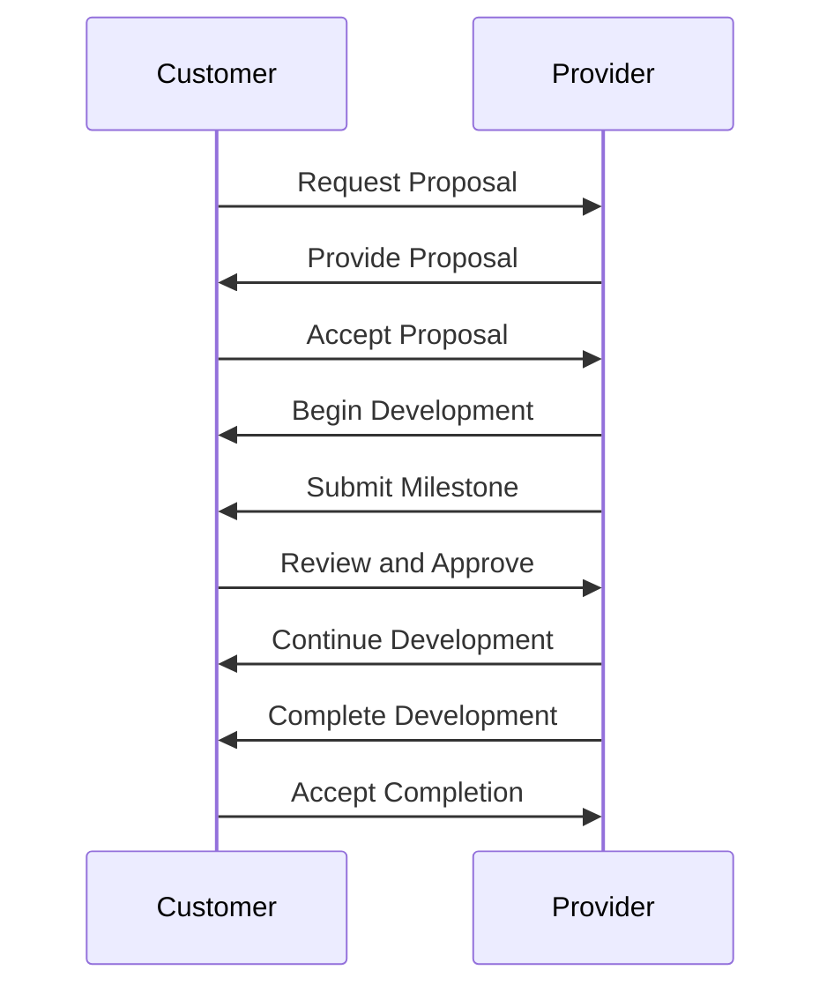
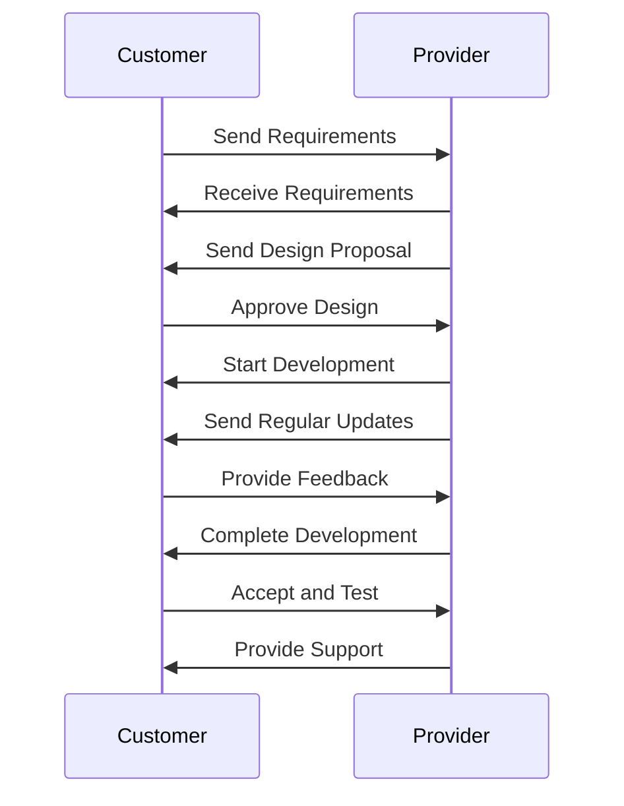

                 

# 技术外包管理策略：有效利用外部技术资源

## 关键词
技术外包、管理策略、外部资源、项目管理、风险控制

## 摘要
技术外包作为一种有效利用外部技术资源的方式，在现代企业中越来越受到重视。本文旨在深入探讨技术外包的管理策略，从需求管理、风险管理、质量管理、合同管理和项目管理等方面进行详细分析，并提供实用的最佳实践和注意事项，帮助企业更好地利用外部技术资源，实现项目目标。

## 目录大纲

### 第一部分：技术外包概述

#### 第1章：技术外包的概念与背景

#### 第2章：技术外包的优势与挑战

#### 第3章：技术外包的类型与应用领域

### 第二部分：技术外包管理策略

#### 第4章：技术外包需求管理

#### 第5章：技术外包风险管理

#### 第6章：技术外包质量管理

#### 第7章：技术外包合同管理

#### 第8章：技术外包项目管理

### 第三部分：技术外包最佳实践

#### 第9章：成功案例分析

#### 第10章：跨文化沟通与合作

#### 第11章：长期合作伙伴关系建设

### 第四部分：总结与展望

#### 第12章：技术外包的关键要素

#### 第13章：未来发展趋势

### 附录

#### 附录A：技术外包工具与资源

#### 附录B：技术外包合同模板

#### 附录C：技术外包项目管理模板

## 技术外包管理策略：有效利用外部技术资源

### 第一部分：技术外包概述

#### 第1章：技术外包的概念与背景

在当今快速变化的技术环境中，企业面临着日益增加的压力，需要在有限的时间和资源内实现技术创新和业务增长。技术外包作为一种应对策略，正变得越来越流行。技术外包是指企业将部分或全部的技术开发工作外包给专业的第三方服务提供商，以实现资源的最优配置和业务目标。

**核心概念术语说明：**

- 技术外包：企业将技术任务交给外部团队或公司完成。
- 外部资源：指企业外部可利用的技术、人力、设备和资金等资源。
- 项目管理：对技术外包项目进行规划、执行、监控和收尾的全过程管理。

**问题背景：**

随着全球化进程的加快，企业在全球范围内寻找技术外包服务提供商成为常态。然而，技术外包并非没有风险，如项目管理不善、质量控制不严、沟通不畅等，都可能影响项目的成功。

**问题描述：**

技术外包的成功实施依赖于有效的管理策略，包括需求管理、风险管理、质量管理、合同管理和项目管理。这些策略需要系统化、规范化和科学化的管理。

**问题解决：**

为了解决上述问题，企业需要建立一套完整的技术外包管理策略，从项目策划、执行到收尾，各个环节都要有明确的管理流程和标准。

**边界与外延：**

技术外包的边界包括项目的范围、时间和成本。外延则涉及到项目的技术难度、质量标准、合作模式和市场环境。

**概念结构与核心要素组成：**

- **需求管理**：明确项目需求，包括功能需求、性能需求和用户体验需求。
- **风险管理**：识别和管理项目风险，包括技术风险、市场风险和运营风险。
- **质量管理**：确保项目交付物符合预定的质量标准，包括代码质量、测试质量和用户体验质量。
- **合同管理**：制定和管理外包合同，确保项目的合规性和合作双方的权益。
- **项目管理**：对整个外包项目进行规划、执行、监控和收尾，确保项目按时、按质、按预算完成。

#### 第2章：技术外包的优势与挑战

**核心概念原理：**

技术外包的优势主要体现在以下几个方面：

- **成本效益**：通过外包降低人力成本和技术成本。
- **专业技能**：利用外部专业团队的技术专长和经验。
- **灵活性**：快速响应市场变化和客户需求。
- **专注核心业务**：将非核心技术任务外包，企业可以更专注于核心业务的发展。

**概念属性特征对比表格：**

| 特征         | 外包前                  | 外包后                  |
| ------------ | ---------------------- | ---------------------- |
| 成本         | 高                     | 低                     |
| 技术能力     | 有限                   | 高                     |
| 灵活性       | 低                     | 高                     |
| 资源配置     | 不灵活                 | 灵活                   |

**ER实体关系图架构：**

```mermaid
erDiagram
  Customer ||--o {Project} : manages
  Provider ||--o {Project} : provides
  Project ||--|{Task} : includes
  Customer ||--o {Contract} : signs
  Provider ||--o {Contract} : signs
  Contract ||--|{Term} : includes
  Term ||--|{Condition} : defines
```

**算法原理讲解：**

在技术外包中，算法原理主要应用于需求分析、风险管理、质量管理等方面。以下是一个简单的需求分析算法流程：

```python
def analyze_requirements(requirements):
    # 初始化结果
    result = {
        'valid': True,
        'issues': []
    }
    
    # 验证需求
    for requirement in requirements:
        if not validate_requirement(requirement):
            result['valid'] = False
            result['issues'].append(requirement)
    
    return result

def validate_requirement(requirement):
    # 需要实现的验证逻辑
    return True
```

**数学模型和公式：**

$$
C_{total} = C_{development} + C_{outsourcing} + C_{management}
$$

其中，\( C_{total} \) 是总成本，\( C_{development} \) 是内部开发成本，\( C_{outsourcing} \) 是外包成本，\( C_{management} \) 是管理成本。

**详细讲解与举例说明：**

假设一家企业计划开发一个在线购物平台，内部团队由于人力和资源的限制，决定将后端开发工作外包给一家专业的软件开发公司。以下是外包过程中的关键步骤：

1. **需求分析**：企业明确平台的功能需求，如用户注册、商品展示、购物车、订单处理等。
2. **外包商选择**：企业通过市场调研和评估，选择一家具备相关经验和技能的外包商。
3. **合同签订**：双方签订合同，明确工作范围、时间节点、质量标准和费用。
4. **项目执行**：外包商根据合同要求进行开发，企业负责监控项目进度和质量。
5. **验收交付**：项目完成后，企业对外包成果进行验收，确保满足需求。

通过上述过程，企业可以充分利用外部技术资源，实现快速响应市场需求，降低开发成本，同时确保项目质量。

#### 第3章：技术外包的类型与应用领域

**问题场景介绍：**

企业在不同的发展阶段和应用场景中，可能需要不同类型的技术外包。以下是几种常见的技术外包类型和应用领域：

1. **软件开发外包**：企业将软件开发任务外包给专业的软件开发团队，如移动应用、Web应用、大数据处理等。
2. **测试外包**：企业将软件测试任务外包给专业的测试团队，以提高测试效率和准确性。
3. **IT支持外包**：企业将IT基础设施和系统运维工作外包给专业的IT支持团队，确保系统的稳定运行。
4. **数据分析和人工智能外包**：企业将数据分析和人工智能任务外包给专业的团队，以利用外部先进的技术和工具。

**项目介绍：**

本文将以软件开发外包为例，介绍一个企业如何通过外包实现软件开发的成功。

**系统功能设计（领域模型mermaid类图）：**



**系统架构设计（mermaid架构图）：**



**系统接口设计和系统交互（mermaid序列图）：**



#### 第4章：技术外包需求管理

**核心概念原理：**

技术外包需求管理是确保外包项目成功的关键环节，包括需求识别、需求定义、需求变更管理等内容。

**概念属性特征对比表格：**

| 特征           | 需求识别          | 需求定义          | 需求变更管理        |
| -------------- | ----------------- | ----------------- | ------------------- |
| 目的           | 明确项目需求      | 形式化需求        | 管理需求变更        |
| 方法           | 调研、访谈、文档分析 | 编写需求文档      | 变更控制流程        |
| 结果           | 需求列表          | 需求规格说明书    | 变更日志            |

**ER实体关系图架构：**

```mermaid
erDiagram
  Project ||--o {Requirement} : has
  Requirement ||--|{Type} : type
  Requirement ||--|{Status} : status
  Project ||--o {ChangeRequest} : has
  ChangeRequest ||--|{Type} : type
  ChangeRequest ||--|{Status} : status
```

**算法原理讲解：**

在需求管理中，需求识别算法用于从各种信息源中提取和理解项目需求。以下是一个简单的需求识别算法：

```python
def identify_requirementssources):
    requirements = []
    for source in sources:
        if is_valid_requirement(source):
            requirements.append(source)
    return requirements

def is_valid_requirement(source):
    # 需要实现的验证逻辑
    return True
```

**数学模型和公式：**

$$
R_{total} = R_{original} + R_{changed} + R_{unfulfilled}
$$

其中，\( R_{total} \) 是总需求量，\( R_{original} \) 是原始需求量，\( R_{changed} \) 是变更后的需求量，\( R_{unfulfilled} \) 是未满足的需求量。

**详细讲解与举例说明：**

假设一家企业计划开发一款企业资源规划（ERP）系统，以下是需求管理的步骤：

1. **需求识别**：通过调研、访谈和文档分析，明确系统的功能需求、性能需求和用户体验需求。
2. **需求定义**：编写详细的需求规格说明书，包括功能需求、性能需求和用户体验需求。
3. **需求变更管理**：在项目执行过程中，根据市场变化和客户需求，管理需求的变更，确保变更得到有效的控制。

通过上述步骤，企业可以确保外包项目按照预期进行，避免因需求不清或变更管理不当而导致项目失败。

#### 第5章：技术外包风险管理

**核心概念原理：**

技术外包风险管理是确保外包项目成功的重要环节，包括风险识别、风险评估、风险应对策略和风险监控等内容。

**概念属性特征对比表格：**

| 特征         | 风险识别          | 风险评估          | 风险应对策略        | 风险监控          |
| ------------ | ----------------- | ----------------- | ------------------- | ----------------- |
| 目的         | 识别潜在风险      | 评估风险影响和可能性 | 制定应对措施      | 监控风险状态和变化 |
| 方法         | 文档分析、访谈、历史数据 | 定量分析、定性分析 | 风险规避、风险转移、风险接受 | 监控指标、定期评估 |
| 结果         | 风险列表          | 风险评估报告      | 风险应对计划      | 风险控制记录      |

**ER实体关系图架构：**

```mermaid
erDiagram
  Project ||--o {Risk} : has
  Risk ||--|{Type} : type
  Risk ||--|{Status} : status
  Project ||--o {RiskMitigation} : has
  RiskMitigation ||--|{Type} : type
  RiskMitigation ||--|{Status} : status
```

**算法原理讲解：**

在风险管理中，风险评估算法用于对潜在风险进行量化评估。以下是一个简单的风险评估算法：

```python
def assess_risks(risks):
    risk_scores = []
    for risk in risks:
        score = calculate_risk_score(risk)
        risk_scores.append(score)
    return risk_scores

def calculate_risk_score(risk):
    # 需要实现的评估逻辑
    return score
```

**数学模型和公式：**

$$
R_{score} = R_{impact} \times R_{probability}
$$

其中，\( R_{score} \) 是风险评分，\( R_{impact} \) 是风险影响，\( R_{probability} \) 是风险发生概率。

**详细讲解与举例说明：**

假设一家企业在开发一款金融交易平台时，需要管理以下风险：

1. **风险识别**：通过文档分析、访谈和历史数据，识别可能的风险，如技术风险、市场风险、法律风险等。
2. **风险评估**：对每个风险进行量化评估，确定其影响和可能性。
3. **风险应对策略**：制定风险应对策略，如规避技术风险、转移市场风险、接受法律风险等。
4. **风险监控**：通过监控指标和定期评估，监控风险状态和变化，确保风险得到有效控制。

通过上述步骤，企业可以降低外包项目的风险，提高项目成功的可能性。

#### 第6章：技术外包质量管理

**核心概念原理：**

技术外包质量管理是确保外包项目交付物符合预定的质量标准的重要环节，包括质量标准与规范、质量控制方法、质量改进策略等内容。

**概念属性特征对比表格：**

| 特征         | 质量标准与规范       | 质量控制方法         | 质量改进策略        |
| ------------ | -------------------- | -------------------- | ------------------- |
| 目的         | 确保交付物符合预期    | 识别和纠正质量问题    | 持续提升质量水平    |
| 方法         | 制定质量标准、编写规范 | 测试、审查、反馈      | 数据分析、流程优化  |
| 结果         | 质量标准文档         | 质量控制报告         | 质量改进计划       |

**ER实体关系图架构：**

```mermaid
erDiagram
  Project ||--o {QualityStandard} : follows
  Project ||--o {QualityControl} : performs
  QualityStandard ||--|{Type} : type
  QualityControl ||--|{Type} : type
  QualityControl ||--|{Status} : status
```

**算法原理讲解：**

在质量改进中，质量改进算法用于识别和优化质量改进机会。以下是一个简单的质量改进算法：

```python
def improve_quality(quality_data):
    opportunities = []
    for data in quality_data:
        if has_improvement_opportunity(data):
            opportunities.append(data)
    return opportunities

def has_improvement_opportunity(data):
    # 需要实现的机会识别逻辑
    return True
```

**数学模型和公式：**

$$
Q_{improvement} = Q_{current} - Q_{target}
$$

其中，\( Q_{improvement} \) 是质量改进量，\( Q_{current} \) 是当前质量水平，\( Q_{target} \) 是目标质量水平。

**详细讲解与举例说明：**

假设一家企业在开发一款电商平台时，需要进行质量管理。以下是质量管理的步骤：

1. **质量标准与规范**：根据项目的需求和行业标准，制定详细的质量标准和规范。
2. **质量控制方法**：通过测试、审查和反馈，识别和纠正质量问题。
3. **质量改进策略**：通过数据分析，识别质量改进机会，并制定相应的改进计划。
4. **持续改进**：通过持续监控和优化，不断提升项目的质量水平。

通过上述步骤，企业可以确保外包项目的质量达到预期，提高客户满意度。

#### 第7章：技术外包合同管理

**核心概念原理：**

技术外包合同管理是确保外包项目顺利执行和双方权益的重要环节，包括合同条款与谈判技巧、合同执行与变更、合同纠纷解决等内容。

**概念属性特征对比表格：**

| 特征         | 合同条款与谈判技巧   | 合同执行与变更         | 合同纠纷解决        |
| ------------ | -------------------- | ---------------------- | ------------------- |
| 目的         | 明确双方权利义务    | 确保合同顺利执行       | 解决合同执行中的争议 |
| 方法         | 法律条款审查、谈判技巧 | 按合同执行、变更控制   | 谈判、调解、诉讼    |
| 结果         | 合同文本            | 合同执行记录           | 合同纠纷解决方案    |

**ER实体关系图架构：**

```mermaid
erDiagram
  Project ||--o {Contract} : has
  Contract ||--|{Term} : includes
  Contract ||--|{Clause} : includes
  Contract ||--o {ChangeRequest} : has
  Contract ||--|{Dispute} : resolves
```

**算法原理讲解：**

在合同管理中，合同执行监控算法用于监控合同执行情况。以下是一个简单的合同执行监控算法：

```python
def monitor_contract(contract):
    status = '执行中'
    for clause in contract['clauses']:
        if not is_clause_completed(clause):
            status = '执行异常'
            break
    return status

def is_clause_completed(clause):
    # 需要实现的条款完成逻辑
    return True
```

**数学模型和公式：**

$$
C_{completion} = \frac{C_{completed}}{C_{total}}
$$

其中，\( C_{completion} \) 是合同完成率，\( C_{completed} \) 是已完成的条款数，\( C_{total} \) 是总条款数。

**详细讲解与举例说明：**

假设一家企业在与外包服务商签订合同时，需要管理以下关键环节：

1. **合同条款与谈判技巧**：审查合同条款，确保双方的权利和义务清晰明确，并通过谈判技巧优化合同内容。
2. **合同执行与变更**：按照合同要求执行任务，对合同中的变更进行有效控制，确保项目按计划进行。
3. **合同纠纷解决**：在合同执行过程中，如遇到争议，通过谈判、调解或诉讼等方式解决纠纷，确保项目顺利进行。

通过上述步骤，企业可以确保外包合同的顺利执行，降低合同纠纷的风险。

#### 第8章：技术外包项目管理

**核心概念原理：**

技术外包项目管理是确保外包项目按时、按质、按预算完成的重要环节，包括项目计划与执行、项目监控与评估、项目收尾与总结等内容。

**概念属性特征对比表格：**

| 特征         | 项目计划与执行       | 项目监控与评估       | 项目收尾与总结       |
| ------------ | -------------------- | -------------------- | ------------------- |
| 目的         | 确定项目目标和计划   | 监控项目进度和质量    | 完成项目并总结经验  |
| 方法         | 制定项目计划、分配任务 | 定期报告、质量控制   | 项目验收、总结经验  |
| 结果         | 项目计划文档         | 项目进度报告、质量报告 | 项目总结报告       |

**ER实体关系图架构：**

```mermaid
erDiagram
  Project ||--o {Plan} : follows
  Project ||--o {Task} : includes
  Project ||--o {Monitor} : follows
  Project ||--o {Evaluation} : follows
  Project ||--o {Summary} : follows
```

**算法原理讲解：**

在项目管理中，项目进度监控算法用于实时监控项目进度。以下是一个简单的项目进度监控算法：

```python
def monitor_progress(plan):
    current_date = get_current_date()
    for task in plan['tasks']:
        if task['deadline'] < current_date:
            if not task['completed']:
                return '进度延迟'
    return '进度正常'

def get_current_date():
    # 需要实现的获取当前日期逻辑
    return current_date
```

**数学模型和公式：**

$$
P_{progress} = \frac{C_{completed}}{C_{total}}
$$

其中，\( P_{progress} \) 是项目进度，\( C_{completed} \) 是已完成的任务数，\( C_{total} \) 是总任务数。

**详细讲解与举例说明：**

假设一家企业在与外包服务商合作开发一款新软件时，需要进行项目管理。以下是项目管理的步骤：

1. **项目计划与执行**：制定详细的项目计划，包括项目目标、任务分配、时间表和资源需求，并按照计划执行任务。
2. **项目监控与评估**：通过定期报告和质量控制，监控项目进度和质量，确保项目按计划进行。
3. **项目收尾与总结**：在项目完成后，进行项目验收，总结项目经验，并编写项目总结报告。

通过上述步骤，企业可以确保外包项目的成功实施，提高项目的效率和质量。

#### 第9章：技术外包最佳实践

**核心概念原理：**

技术外包最佳实践是指在实际操作中总结出来的有效方法和经验，包括成功案例分析、跨文化沟通与合作、长期合作伙伴关系建设等内容。

**概念属性特征对比表格：**

| 特征         | 成功案例分析         | 跨文化沟通与合作       | 长期合作伙伴关系建设 |
| ------------ | -------------------- | ---------------------- | ------------------- |
| 目的         | 学习成功经验         | 促进跨文化合作         | 建立稳定合作关系    |
| 方法         | 案例研究、经验总结   | 文化培训、沟通策略      | 定期沟通、共同目标  |
| 结果         | 最佳实践指南         | 高效跨文化团队         | 长期合作成果       |

**ER实体关系图架构：**

```mermaid
erDiagram
  Company ||--o {OutsourcingProject} : executes
  Company ||--o {CulturalTraining} : provides
  Company ||--o {CommunicationStrategy} : adopts
  Company ||--o {LongTermRelationship} : builds
```

**算法原理讲解：**

在最佳实践中，跨文化沟通算法用于优化跨文化团队的合作效率。以下是一个简单的跨文化沟通算法：

```python
def communicate_cross_culturally(strategy):
    success_rate = 0
    for message in strategy['messages']:
        if is_message_effective(message):
            success_rate += 1
    return success_rate / len(strategy['messages'])

def is_message_effective(message):
    # 需要实现的沟通有效性判断逻辑
    return True
```

**数学模型和公式：**

$$
C_{success} = \frac{S_{effective}}{S_{total}}
$$

其中，\( C_{success} \) 是成功沟通率，\( S_{effective} \) 是有效沟通的数量，\( S_{total} \) 是总沟通数量。

**详细讲解与举例说明：**

假设一家中国企业在与一家美国外包服务商合作时，需要实施最佳实践。以下是最佳实践的步骤：

1. **成功案例分析**：研究其他企业在类似项目中的成功经验，总结最佳实践指南。
2. **跨文化沟通与合作**：通过文化培训和沟通策略，提高跨文化团队的沟通效率。
3. **长期合作伙伴关系建设**：通过定期沟通和共同目标的设定，建立稳定的合作关系。

通过上述步骤，企业可以优化外包项目的管理，提高项目的成功率。

#### 第10章：跨文化沟通与合作

**核心概念原理：**

跨文化沟通与合作是确保跨国技术外包项目成功的关键，涉及文化差异的识别与理解、沟通策略的制定与执行、团队合作等内容。

**概念属性特征对比表格：**

| 特征         | 文化差异识别       | 沟通策略制定与执行 | 团队合作         |
| ------------ | ------------------ | ------------------ | --------------- |
| 目的         | 减少文化冲突       | 提高沟通效果       | 增强团队凝聚力  |
| 方法         | 文化调研、访谈      | 模式选择、技巧应用 | 协作机制、团队建设 |
| 结果         | 文化适应方案       | 沟通记录           | 团队效能提升    |

**ER实体关系图架构：**

```mermaid
erDiagram
  CompanyA ||--o {CulturalDifference} : has
  CompanyA ||--o {CommunicationStrategy} : follows
  CompanyA ||--o {Team Cooperation} : adopts
  CompanyB ||--o {CulturalDifference} : has
  CompanyB ||--o {CommunicationStrategy} : follows
  CompanyB ||--o {Team Cooperation} : adopts
```

**算法原理讲解：**

在跨文化沟通中，沟通有效性评估算法用于评估跨文化沟通的效果。以下是一个简单的沟通有效性评估算法：

```python
def evaluate_communication(effectiveness):
    success = 0
    for message in effectiveness['messages']:
        if message['response'] == 'understood':
            success += 1
    return success / len(effectiveness['messages'])

def get_response(message):
    # 需要实现的消息响应逻辑
    return 'understood'
```

**数学模型和公式：**

$$
E_{communication} = \frac{S_{understood}}{S_{total}}
$$

其中，\( E_{communication} \) 是沟通有效性，\( S_{understood} \) 是被理解的消息数量，\( S_{total} \) 是总消息数量。

**详细讲解与举例说明：**

假设一家中国企业在与一家印度外包服务商合作时，需要进行跨文化沟通。以下是跨文化沟通的步骤：

1. **文化差异识别**：通过文化调研和访谈，识别双方在价值观、沟通风格和工作习惯等方面的差异。
2. **沟通策略制定与执行**：根据识别的文化差异，制定适合的沟通策略，并在实际沟通中执行。
3. **团队合作**：建立有效的团队合作机制，促进团队成员之间的沟通与协作。

通过上述步骤，企业可以优化跨文化沟通，提高项目的成功率。

#### 第11章：长期合作伙伴关系建设

**核心概念原理：**

长期合作伙伴关系建设是确保技术外包项目持续成功的重要策略，涉及合作关系的建立、维护和发展，以及双方的信任和共赢。

**概念属性特征对比表格：**

| 特征         | 合作关系建立       | 合作关系维护         | 合作关系发展        |
| ------------ | ------------------ | --------------------- | ------------------- |
| 目的         | 确立合作关系       | 保持合作稳定         | 促进合作深化       |
| 方法         | 初步沟通、互信建立 | 定期交流、问题解决   | 创新合作、共同发展 |
| 结果         | 合作协议           | 合作满意度评估       | 合作成果           |

**ER实体关系图架构：**

```mermaid
erDiagram
  PartnerA ||--o {LongTermRelationship} : builds
  PartnerA ||--o {Communication} : maintains
  PartnerA ||--o {Trust} : builds
  PartnerB ||--o {LongTermRelationship} : builds
  PartnerB ||--o {Communication} : maintains
  PartnerB ||--o {Trust} : builds
```

**算法原理讲解：**

在长期合作伙伴关系建设中，信任度评估算法用于评估双方的合作信任度。以下是一个简单的信任度评估算法：

```python
def assess_trust(trust_factors):
    trust_score = 0
    for factor in trust_factors:
        trust_score += factor['value']
    return trust_score / len(trust_factors)

def get_trust_factor_value(factor):
    # 需要实现的信任因素评分逻辑
    return value
```

**数学模型和公式：**

$$
T_{trust} = \frac{\sum_{i=1}^{n} T_{factor_i}}{n}
$$

其中，\( T_{trust} \) 是总信任度，\( T_{factor_i} \) 是第 \( i \) 个信任因素的评分，\( n \) 是信任因素的总数。

**详细讲解与举例说明：**

假设一家中国企业和一家印度外包服务商合作开发软件，以下是如何建立长期合作伙伴关系的步骤：

1. **合作关系建立**：通过初步沟通，了解双方的需求和期望，确立合作关系。
2. **合作关系维护**：通过定期交流，解决合作过程中出现的问题，保持合作的稳定性。
3. **合作关系发展**：通过共同创新和合作，不断提升合作的深度和广度。

通过上述步骤，企业可以建立稳定的长期合作伙伴关系，确保项目的持续成功。

#### 第12章：技术外包的关键要素

**核心概念原理：**

技术外包的关键要素是确保外包项目成功的重要保障，涉及需求管理、风险管理、质量管理、合同管理和项目管理等核心环节。

**概念属性特征对比表格：**

| 特征         | 需求管理         | 风险管理         | 质量管理         | 合同管理         | 项目管理         |
| ------------ | ---------------- | ---------------- | ---------------- | ---------------- | ---------------- |
| 目的         | 明确项目需求     | 识别和管理风险    | 确保项目质量     | 保护双方权益     | 按计划完成项目    |
| 方法         | 需求识别、需求定义 | 风险识别、风险评估 | 质量控制、质量改进 | 合同条款、合同执行 | 项目计划、项目监控 |
| 结果         | 需求规格说明书    | 风险评估报告     | 质量控制记录     | 合同执行记录     | 项目总结报告     |

**ER实体关系图架构：**

```mermaid
erDiagram
  Project ||--o {RequirementManagement} : includes
  Project ||--o {RiskManagement} : includes
  Project ||--o {QualityManagement} : includes
  Project ||--o {ContractManagement} : includes
  Project ||--o {ProjectManagement} : includes
```

**算法原理讲解：**

在技术外包中，综合管理算法用于整合各项管理要素，确保项目的整体成功。以下是一个简单的综合管理算法：

```python
def manage_project(project):
    success = True
    if not manage_requirements(project['requirements']):
        success = False
    if not manage_risks(project['risks']):
        success = False
    if not ensure_quality(project['quality']):
        success = False
    if not manage_contract(project['contract']):
        success = False
    if not manage_project_progress(project['plan']):
        success = False
    return success

def manage_requirements(requirements):
    # 需要实现的需求管理逻辑
    return True

def manage_risks(risks):
    # 需要实现的风险管理逻辑
    return True

def ensure_quality(quality):
    # 需要实现的质量管理逻辑
    return True

def manage_contract(contract):
    # 需要实现的合同管理逻辑
    return True

def manage_project_progress(plan):
    # 需要实现的项目管理逻辑
    return True
```

**数学模型和公式：**

$$
P_{success} = \frac{\sum_{i=1}^{n} P_{factor_i}}{n}
$$

其中，\( P_{success} \) 是项目成功率，\( P_{factor_i} \) 是第 \( i \) 个管理要素的成功度，\( n \) 是管理要素的总数。

**详细讲解与举例说明：**

假设一家企业在与外包服务商合作开发一款电子商务平台时，需要确保项目成功。以下是关键要素的步骤：

1. **需求管理**：通过需求识别和需求定义，明确平台的功能和性能需求。
2. **风险管理**：通过风险识别和风险评估，制定风险应对策略。
3. **质量管理**：通过质量控制和质量改进，确保平台的质量。
4. **合同管理**：通过合同条款和执行，保护双方的权益。
5. **项目管理**：通过项目计划、监控和收尾，确保项目按计划完成。

通过上述步骤，企业可以确保技术外包项目的成功实施，实现业务目标。

#### 第13章：未来发展趋势

**核心概念原理：**

技术外包的未来发展趋势将受到技术进步、市场环境、管理理念等多方面因素的影响，涉及自动化、人工智能、云计算等新兴技术的应用，以及外包模式的创新。

**概念属性特征对比表格：**

| 特征         | 自动化外包         | 人工智能外包       | 云计算外包         | 外包模式创新      |
| ------------ | ------------------ | ------------------ | ------------------ | ---------------- |
| 目的         | 提高外包效率       | 利用人工智能技术   | 利用云计算资源     | 适应市场需求      |
| 方法         | 自动化工具和流程   | 机器学习、自然语言处理 | 云服务架构、大数据处理 | 业务流程外包、平台化外包 |
| 结果         | 高效的外包流程     | 智能化的外包服务   | 高扩展性的外包解决方案 | 创新的商业模式   |

**ER实体关系图架构：**

```mermaid
erDiagram
  Technology ||--o {OutsourcingModel} : influences
  Technology ||--o {OutsourcingMethod} : adopts
  Technology ||--o {OutsourcingOutcome} : results in
```

**算法原理讲解：**

在技术外包的未来发展中，智能决策算法将用于优化外包策略，提高外包效率。以下是一个简单的智能决策算法：

```python
def intelligent_decision-making(data):
    decision = '未知'
    if data['efficiency'] > threshold:
        decision = '自动化外包'
    elif data['intelligence'] > threshold:
        decision = '人工智能外包'
    elif data['cloud'] > threshold:
        decision = '云计算外包'
    return decision

def set_threshold(data):
    # 需要实现的阈值设定逻辑
    return threshold
```

**数学模型和公式：**

$$
D_{decision} = \max(D_{auto}, D_{AI}, D_{cloud})
$$

其中，\( D_{decision} \) 是最优外包决策，\( D_{auto} \) 是自动化外包的得分，\( D_{AI} \) 是人工智能外包的得分，\( D_{cloud} \) 是云计算外包的得分。

**详细讲解与举例说明：**

随着技术的不断进步，未来技术外包将呈现以下发展趋势：

1. **自动化外包**：利用自动化工具和流程，提高外包的效率和准确性。
2. **人工智能外包**：利用人工智能技术，提供智能化、个性化的外包服务。
3. **云计算外包**：利用云计算资源，实现高效、灵活的外包解决方案。
4. **外包模式创新**：通过业务流程外包、平台化外包等创新模式，适应市场需求。

通过上述发展趋势，企业可以更好地利用外部技术资源，实现业务目标。

#### 附录

**附录A：技术外包工具与资源**

- **开源工具**：Git、Jenkins、Docker、Kubernetes
- **商业工具**：JIRA、Confluence、ServiceNow、SAP
- **在线资源**：GitHub、GitLab、Stack Overflow、LinkedIn

**附录B：技术外包合同模板**

- **通用合同模板**
- **软件开发外包合同模板**
- **测试外包合同模板**

**附录C：技术外包项目管理模板**

- **项目计划模板**
- **项目监控模板**
- **项目报告模板**

## 作者

作者：AI天才研究院/AI Genius Institute & 禅与计算机程序设计艺术 /Zen And The Art of Computer Programming

## 总结

技术外包作为一种高效利用外部资源的方式，正越来越受到企业的重视。本文从需求管理、风险管理、质量管理、合同管理和项目管理等方面，详细探讨了技术外包的管理策略，并提出了最佳实践和注意事项。通过有效利用外部技术资源，企业可以降低成本、提高效率、专注于核心业务，实现持续发展。

## 最佳实践 Tips

- **需求明确**：在签订合同前，确保需求明确、详细，减少后续变更。
- **风险管理**：制定全面的风险管理计划，提前识别和应对潜在风险。
- **质量保证**：建立严格的质量控制流程，确保外包项目的质量。
- **合同管理**：重视合同条款的制定和执行，确保双方的权益。
- **项目管理**：强化项目监控和评估，确保项目按计划进行。

## 注意事项

- **沟通不畅**：确保有效的沟通机制，避免信息不对称。
- **文化差异**：在跨国外包时，注意文化差异，促进跨文化合作。
- **变更管理**：严格变更管理流程，控制变更范围和影响。

## 拓展阅读

- 《外包管理实践指南》
- 《跨文化沟通技巧》
- 《云计算与外包服务》

通过本文的深入分析和实际案例，企业可以更好地理解技术外包的管理策略，并在实践中运用这些策略，实现项目的成功。

