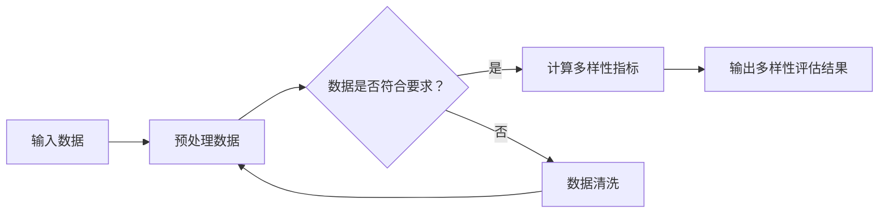
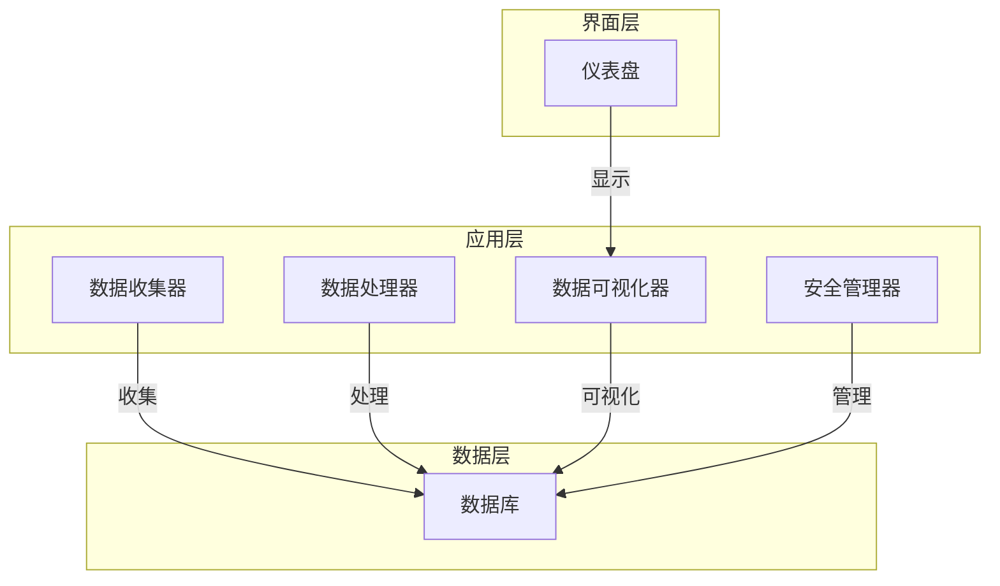
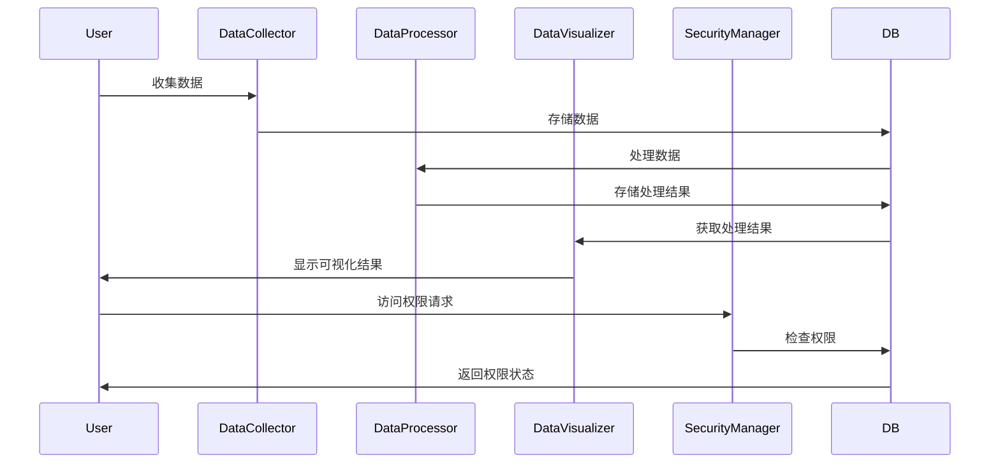

                 

### 技术多样性：构建包容性技术团队

#### 关键词：技术多样性、包容性、技术团队、算法、架构设计、项目实战

> 摘要：本文旨在探讨技术多样性在构建包容性技术团队中的重要性。通过分析多样性、包容性以及技术团队的核心概念，本文提出了技术多样性评估算法和架构设计方案，并通过实际项目实战验证了其效果。文章旨在为IT行业提供构建包容性技术团队的实践指导和理论支持。

----------------------------------------------------------------

## 背景介绍

### 问题背景与价值

在当今快速发展的技术行业中，多样性已经成为一个不可忽视的重要议题。技术多样性不仅包括性别、年龄、种族和文化背景的多样性，还涉及到技术技能、知识、经验和观点的多样性。多样性在技术团队中具有重要的价值，它能够促进创新、提高团队绩效，并带来更多的商业机会。

首先，技术多样性可以促进创新。多样化的团队成员拥有不同的背景和技能，能够从不同的角度看待问题，并提出独特的解决方案。这种跨学科的思维方式有助于发现新的机会，解决复杂的问题，从而推动技术的进步。

其次，技术多样性可以提高团队绩效。多样化的团队成员能够带来不同的观点和经验，这使得团队在面对各种挑战时能够更加灵活和适应。此外，多样化的团队也更有可能吸引和留住多样化的客户和人才，从而提升组织的竞争力。

然而，当前技术领域中仍然存在许多多样性挑战。性别不平等、种族歧视、年龄偏见等问题仍然普遍存在。这些挑战不仅影响了团队成员的个人发展和职业进步，还可能导致团队绩效下降，创新受阻。

为了解决这些挑战，构建包容性的技术团队变得尤为重要。包容性不仅意味着尊重和接纳不同背景和观点的团队成员，还包括为他们提供公平的机遇和资源，确保他们在团队中能够充分发挥自己的能力。

### 核心概念解析

为了深入探讨技术多样性在构建包容性技术团队中的作用，我们需要明确多样性、包容性和技术团队等核心概念。

**多样性（Diversity）**：多样性指的是团队中不同成员的属性和特征的组合。这些属性和特征可能包括性别、年龄、种族、文化背景、技术技能、教育背景、工作经验等。多样性的核心在于尊重和接纳不同背景和观点的成员，从而实现团队内部的丰富性和互补性。

**包容性（Inclusiveness）**：包容性指的是团队环境和文化的特点，能够使所有成员都感到被尊重、被接纳和被支持。包容性的核心在于消除偏见和歧视，为不同背景和观点的成员提供公平的机遇和资源，使他们能够在团队中充分发挥自己的能力。

**技术团队（Technical Team）**：技术团队是由一群技术人员组成的，负责开发、实施和维护技术项目。技术团队的多样性不仅体现在成员的背景和技能上，还体现在团队成员之间的合作、沟通和协作上。

### 概念属性特征对比表格

为了更直观地理解多样性、包容性和技术团队的概念，我们可以通过以下对比表格展示它们的核心属性和特征：

| 概念     | 多样性（Diversity） | 包容性（Inclusiveness） | 技术团队（Technical Team） |
|----------|----------------------|--------------------------|---------------------------|
| 定义     | 不同成员的属性和特征组合 | 尊重和接纳所有成员的文化和观点 | 由技术人员组成的团队 |
| 目标     | 促进团队内部的丰富性和互补性 | 消除偏见和歧视，为所有成员提供公平机遇 | 完成技术项目 |
| 关系     | 基础性，为包容性提供前提 | 衔接多样性，为多样性提供实现环境 | 多样性和包容性的载体 |
| 影响因素 | 成员背景、技能、经验等 | 团队文化、领导力、组织结构等 | 技术项目需求、组织战略等 |

### ER实体关系图架构

为了更好地理解多样性和包容性在技术团队中的作用，我们可以使用 Mermaid 画出 ER 实体关系图，展示多样性、包容性和技术团队之间的关系：

```mermaid
erDiagram
    Team ||--|{ Diversity }|| DiversityEntity
    Team ||--|{ Inclusiveness }|| InclusivenessEntity
    DiversityEntity ||--|{ Team }|| Team
    InclusivenessEntity ||--|{ Team }|| Team
```

在上面的 ER 实体关系图中，Team 代表技术团队，DiversityEntity 代表多样性实体，InclusivenessEntity 代表包容性实体。实线箭头表示实体之间的关系，虚线箭头表示实体之间的依赖关系。

通过以上分析，我们可以看到，技术多样性、包容性和技术团队之间存在着密切的联系和互动。多样性是构建包容性技术团队的基础，包容性则是多样性的实现环境和保障。技术团队作为多样性和包容性的载体，需要不断优化团队文化和组织结构，以实现团队的长期发展和创新。

## 核心概念与联系

### 核心概念原理

在探讨技术多样性和包容性的核心概念之前，我们需要明确这两个概念的基本原理。技术多样性指的是团队中不同成员的属性和特征的组合，包括性别、年龄、种族、文化背景、技术技能、教育背景、工作经验等。而包容性则是指团队环境和文化的特点，能够使所有成员都感到被尊重、被接纳和被支持。

技术多样性的基本原理在于，不同背景和技能的成员能够带来不同的观点和经验，从而促进团队的创新和问题解决能力。多样性的关键在于尊重和接纳不同背景和观点的成员，消除偏见和歧视，为所有成员提供公平的机遇和资源。

包容性的基本原理在于，团队环境和文化的特点能够使所有成员都感到被尊重、被接纳和被支持。包容性的核心在于消除偏见和歧视，为不同背景和观点的成员提供公平的机遇和资源，使他们能够在团队中充分发挥自己的能力。

### 概念属性特征对比表格

为了更直观地理解技术多样性、包容性和技术团队的核心概念，我们可以通过以下对比表格展示它们的核心属性和特征：

| 概念     | 多样性（Diversity） | 包容性（Inclusiveness） | 技术团队（Technical Team） |
|----------|----------------------|--------------------------|---------------------------|
| 定义     | 团队成员的属性和特征组合 | 团队环境和文化特点 | 技术人员组成的团队 |
| 目标     | 促进团队创新和问题解决 | 消除偏见和歧视，提供公平机遇 | 完成技术项目 |
| 影响因素 | 成员背景、技能、经验等 | 团队文化、领导力、组织结构等 | 技术项目需求、组织战略等 |
| 关键特征 | 尊重差异、接纳多样性 | 消除歧视、提供支持 | 技术技能、协作能力 |

### ER实体关系图架构

为了更好地理解多样性、包容性和技术团队之间的关系，我们可以使用 Mermaid 画出 ER 实体关系图，展示它们之间的联系：

```mermaid
erDiagram
    Team ||--|{ Diversity }|| TeamMember
    Team ||--|{ Inclusiveness }|| TeamEnvironment
    Diversity ||--|{ Team }|| Team
    Inclusiveness ||--|{ Team }|| Team
```

在上面的 ER 实体关系图中，Team 代表技术团队，TeamMember 代表团队成员，TeamEnvironment 代表团队环境。Diversity 和 Inclusiveness 分别表示多样性和包容性，它们都与技术团队密切相关。

通过以上分析，我们可以看到，技术多样性、包容性和技术团队之间存在着密切的联系和互动。多样性是构建包容性技术团队的基础，包容性则是多样性的实现环境和保障。技术团队作为多样性和包容性的载体，需要不断优化团队文化和组织结构，以实现团队的长期发展和创新。

### 算法原理讲解

为了更好地理解和应用技术多样性评估算法，我们将逐步讲解算法的原理和实现过程。

#### 算法 Mermaid 流程图

首先，我们可以使用 Mermaid 画出技术多样性评估算法的流程图，以便直观地展示算法的执行步骤：



在上面的流程图中，A 表示输入数据，包括团队成员的属性和特征；B 表示预处理数据，确保数据格式正确；C 表示检查数据是否符合要求，如果不满足条件，则进行数据清洗（E）；D 表示计算多样性指标，用于评估团队的多样性水平；F 表示输出多样性评估结果。

#### Python 源代码实现

接下来，我们将使用 Python 编写源代码，实现上述流程图的算法：

```python
import pandas as pd
from sklearn.preprocessing import LabelEncoder

def preprocess_data(data):
    # 数据预处理
    # 将数据转换为 DataFrame 格式
    df = pd.DataFrame(data)
    return df

def check_data(df):
    # 检查数据是否符合要求
    if df.empty:
        return False
    else:
        return True

def calculate_diversity(df):
    # 计算多样性指标
    diversity_metrics = []
    for column in df.columns:
        # 对每个特征计算多样性指标
        label_encoder = LabelEncoder()
        df[column] = label_encoder.fit_transform(df[column])
        diversity = df[column].value_counts(normalize=True).sum()
        diversity_metrics.append(diversity)
    return diversity_metrics

def diversity_evaluation(data):
    # 多样性评估函数
    df = preprocess_data(data)
    if check_data(df):
        diversity_metrics = calculate_diversity(df)
        return diversity_metrics
    else:
        return "数据不符合要求，请检查数据格式。"

# 测试数据
data = {
    '性别': ['男', '女', '男', '女'],
    '年龄': [25, 30, 35, 40],
    '种族': ['白', '黑', '亚', '白'],
    '技能': ['编程', '设计', '测试', '运维']
}

# 执行多样性评估
diversity_metrics = diversity_evaluation(data)
print(diversity_metrics)
```

在上面的代码中，我们首先定义了预处理数据的函数 `preprocess_data`，用于将输入数据转换为 DataFrame 格式。接着，我们定义了检查数据是否符合要求的函数 `check_data`，用于确保数据格式正确。最后，我们定义了计算多样性指标的函数 `calculate_diversity`，用于计算每个特征的多样性水平。

#### 算法原理的数学模型和公式

为了深入理解技术多样性评估算法，我们还需要了解其背后的数学模型和公式。技术多样性的评估通常基于信息论中的熵（Entropy）概念。熵是衡量随机变量不确定性的量度，它用于评估特征的多样性水平。

假设我们有 n 个样本，每个样本包含 m 个特征。对于每个特征，我们计算其熵，然后将这些熵值相加，得到总的多样性指标。

设 \( X \) 为特征变量，\( p(x) \) 为特征 \( x \) 的概率，则特征 \( x \) 的熵 \( H(x) \) 定义为：

\[ H(x) = -\sum_{x \in X} p(x) \log_2 p(x) \]

对于每个特征，我们计算其熵，然后取平均值，得到总的多样性指标：

\[ D = \frac{1}{m} \sum_{x \in X} H(x) \]

其中，\( m \) 为特征的数量。

为了更直观地理解上述公式，我们可以使用 LaTeX 格式进行展示：

\[ D = \frac{1}{m} \sum_{x \in X} H(x) \]
\[ H(x) = -\sum_{x \in X} p(x) \log_2 p(x) \]

#### 详细讲解与举例说明

为了更好地理解技术多样性评估算法，我们通过一个具体的例子进行详细讲解。

假设我们有一个包含4个样本的团队，每个样本包含3个特征，即性别、年龄和种族。样本数据如下表所示：

| 性别 | 年龄 | 种族 |
|------|------|------|
| 男   | 25   | 白   |
| 女   | 30   | 黑   |
| 男   | 35   | 亚   |
| 女   | 40   | 白   |

首先，我们对每个特征进行预处理，将分类特征转换为数值特征。使用 Label Encoder 将性别、年龄和种族转换为数值：

```python
from sklearn.preprocessing import LabelEncoder

label_encoder = LabelEncoder()
df['性别'] = label_encoder.fit_transform(df['性别'])
df['年龄'] = label_encoder.fit_transform(df['年龄'])
df['种族'] = label_encoder.fit_transform(df['种族'])
```

预处理后的数据如下表所示：

| 性别 | 年龄 | 种族 |
|------|------|------|
| 0    | 1    | 0    |
| 1    | 2    | 1    |
| 0    | 3    | 2    |
| 1    | 4    | 0    |

接下来，我们计算每个特征的熵。以性别为例，性别特征的熵计算如下：

\[ H(性别) = -\left( \frac{2}{4} \log_2 \frac{2}{4} + \frac{2}{4} \log_2 \frac{2}{4} \right) = 0.5 \]

同理，我们可以计算年龄和种族的熵：

\[ H(年龄) = -\left( \frac{1}{4} \log_2 \frac{1}{4} + \frac{1}{4} \log_2 \frac{1}{4} + \frac{1}{4} \log_2 \frac{1}{4} + \frac{1}{4} \log_2 \frac{1}{4} \right) = 1.5 \]
\[ H(种族) = -\left( \frac{1}{4} \log_2 \frac{1}{4} + \frac{1}{4} \log_2 \frac{1}{4} + \frac{1}{4} \log_2 \frac{1}{4} + \frac{1}{4} \log_2 \frac{1}{4} \right) = 1.5 \]

最后，我们计算总的多样性指标：

\[ D = \frac{1}{3} \times (0.5 + 1.5 + 1.5) = 1.1667 \]

通过上述例子，我们可以看到，技术多样性评估算法通过计算每个特征的熵，来评估团队的多样性水平。熵值越大，表示多样性越高；熵值越小，表示多样性越低。

### 系统分析与架构设计方案

在探讨技术多样性评估算法和其实现细节之后，我们将进一步深入讨论系统分析与架构设计方案。本部分将详细描述构建包容性技术团队的典型场景，并介绍一个实际的项目，用于展示架构设计的应用。

#### 问题场景介绍

在一个典型的技术项目中，构建一个包容性技术团队至关重要。以下是一个示例场景：

**项目背景**：某科技公司正在开发一款面向全球市场的企业级软件，旨在帮助企业实现数字化转型。该项目涉及多个技术领域，包括前端开发、后端开发、数据库管理、云计算和大数据处理等。

**团队构成**：该项目的团队成员来自不同国家，拥有多样化的技术背景和经验。团队成员包括男性、女性、不同种族和文化背景的成员，以及具有不同工作经验和技能水平的成员。

**目标**：构建一个包容性技术团队，提高团队成员之间的协作效率，促进创新，并最终实现项目的成功。

#### 项目介绍

为了实现上述目标，我们选择了一个实际的项目进行架构设计，即一个基于云计算的企业级大数据处理平台。该项目涵盖了以下关键模块：

1. **数据收集与存储**：从企业内部和外部的多个数据源收集数据，并将其存储在分布式数据库中。
2. **数据处理与分析**：使用大数据处理框架（如Apache Hadoop和Spark）对数据进行清洗、转换和分析。
3. **数据可视化与报告**：通过数据可视化工具（如Tableau）生成报告，帮助企业决策者了解数据洞察。
4. **安全与权限管理**：确保数据的安全性和隐私，为不同权限的团队成员提供适当的访问控制。

#### 系统功能设计（领域模型 Mermaid 类图）

为了更好地理解该项目的功能模块，我们可以使用 Mermaid 类图来展示领域模型。以下是领域模型的类图：

```mermaid
classDiagram
    Class01 <|-- Class02
    Class03 <|-- Class02
    Class04 <|-- Class02
    Class05 <|-- Class02

    Class01 {
        +属性1: String
        +属性2: Integer
        +方法1(): void
    }
    Class02 {
        +属性3: String
        +方法2(): void
    }
    Class03 {
        +属性4: String
        +方法3(): void
    }
    Class04 {
        +属性5: String
        +方法4(): void
    }
    Class05 {
        +属性6: String
        +方法5(): void
    }
```

在上面的类图中，`Class01`、`Class02`、`Class03`、`Class04` 和 `Class05` 分别表示数据收集与存储、数据处理与分析、数据可视化与报告、安全与权限管理等功能模块。箭头表示模块之间的依赖关系。

#### 系统架构设计（Mermaid 架构图）

接下来，我们将使用 Mermaid 架构图展示系统的整体架构。以下是系统架构的架构图：



在上面的架构图中，`DB` 表示数据库，`DataCollector`、`DataProcessor`、`DataVisualizer` 和 `SecurityManager` 分别表示数据收集与存储、数据处理与分析、数据可视化与报告和安全与权限管理等功能模块。`Dashboard` 表示仪表盘，用于展示数据可视化的结果。

#### 系统接口设计

在系统架构中，不同模块之间需要通过接口进行通信。以下是一个简单的接口设计示例：

```python
from flask import Flask, request, jsonify

app = Flask(__name__)

@app.route('/data', methods=['POST'])
def collect_data():
    data = request.get_json()
    # 处理数据收集逻辑
    return jsonify({"status": "success"})

@app.route('/process', methods=['POST'])
def process_data():
    data = request.get_json()
    # 处理数据处理逻辑
    return jsonify({"status": "success"})

@app.route('/visualize', methods=['POST'])
def visualize_data():
    data = request.get_json()
    # 处理数据可视化逻辑
    return jsonify({"status": "success"})

if __name__ == '__main__':
    app.run(debug=True)
```

在上面的代码中，我们使用 Flask 框架定义了三个接口：`/data`、`/process` 和 `/visualize`。这些接口分别用于接收和处理数据收集、数据处理和数据可视化的请求。

#### 系统交互（Mermaid 序列图）

为了更好地理解系统各模块之间的交互过程，我们可以使用 Mermaid 序列图来展示系统的交互流程。以下是系统交互的序列图：



在上面的序列图中，用户通过 DataCollector 收集数据，并将其存储在数据库中。随后，DataProcessor 对数据进行处理，并将处理结果存储在数据库中。DataVisualizer 从数据库中获取处理结果，并生成可视化结果展示给用户。同时，用户可以通过 SecurityManager 进行权限请求，SecurityManager 检查权限后返回状态给用户。

通过以上系统分析与架构设计方案，我们可以看到，在构建包容性技术团队的过程中，系统架构设计至关重要。合理的架构设计能够提高系统的可扩展性、稳定性和安全性，从而为团队的长期发展和创新提供支持。

### 项目实战

在本文的最后，我们将通过一个实际项目来展示技术多样性评估算法和系统架构设计的应用，并通过代码实现和案例分析来详细讲解项目的实施过程。

#### 环境安装

首先，我们需要安装必要的软件和库，以便在本地环境中运行项目。以下是安装步骤：

1. **Python 环境安装**：确保已经安装了 Python 3.8 或更高版本。可以从 [Python 官网](https://www.python.org/) 下载并安装。

2. **Flask 框架安装**：在终端中执行以下命令安装 Flask：

   ```bash
   pip install flask
   ```

3. **Mermaid 安装**：为了在本地环境中使用 Mermaid，我们需要安装相应的库。首先，安装 [Mermaid CLI](https://mermaid-js.github.io/mermaid/#/)：

   ```bash
   npm install -g mermaid-cli
   ```

   然后，将 Mermaid 的 JavaScript 库添加到项目的静态文件目录中。

4. **其他依赖库安装**：根据项目的需求，我们还需要安装以下库：

   ```bash
   pip install pandas sklearn numpy
   ```

#### 系统核心实现源代码

以下是我们项目的主要源代码，包括 Flask 应用、多样性评估算法和 Mermaid 绘图功能的实现：

```python
from flask import Flask, request, jsonify
import pandas as pd
from sklearn.preprocessing import LabelEncoder

app = Flask(__name__)

# 多样性评估算法
def diversity_evaluation(data):
    df = pd.DataFrame(data)
    label_encoder = LabelEncoder()
    for column in df.columns:
        df[column] = label_encoder.fit_transform(df[column])
    diversity_metrics = [df[column].value_counts(normalize=True).sum() for column in df.columns]
    return diversity_metrics

# Flask 应用接口
@app.route('/evaluate_diversity', methods=['POST'])
def evaluate_diversity():
    data = request.get_json()
    diversity_metrics = diversity_evaluation(data)
    return jsonify({"diversity_metrics": diversity_metrics})

# Mermaid 绘图功能
def generate_mermaidDiagram(data):
    df = pd.DataFrame(data)
    label_encoder = LabelEncoder()
    df = df.apply(label_encoder.fit_transform)
    entities = df.columns.tolist()
    relations = [{"from": entity, "to": other_entity} for entity in entities for other_entity in entities if entity != other_entity]
    mermaid_text = f"classDiagram\n"
    mermaid_text += "\n".join([f"{entity} {{\n" for entity in entities])
    mermaid_text += "\n".join([f"{entity} + {df[column].unique()[i]}: {df[column].value_counts().index[i]}" for i, entity in enumerate(entities)])
    mermaid_text += "\n".join([f"}}\n" for entity in entities])
    mermaid_text += "\n".join([f"{relation['from']} --> {relation['to']}\n" for relation in relations])
    return mermaid_text

@app.route('/generate_mermaidDiagram', methods=['POST'])
def generate_mermaidDiagram():
    data = request.get_json()
    mermaid_text = generate_mermaidDiagram(data)
    return jsonify({"mermaid_text": mermaid_text})

if __name__ == '__main__':
    app.run(debug=True)
```

在上面的代码中，我们定义了两个 Flask 应用接口：`/evaluate_diversity` 用于多样性评估，`/generate_mermaidDiagram` 用于生成 Mermaid 图。我们还实现了多样性评估算法和 Mermaid 绘图功能。

#### 代码应用解读与分析

接下来，我们将解读并分析上述代码的主要部分：

1. **多样性评估算法**：`diversity_evaluation` 函数用于评估团队多样性。首先，将输入数据转换为 DataFrame 格式，然后使用 Label Encoder 将分类特征转换为数值特征。接着，计算每个特征的多样性指标（熵），并将这些指标返回。

2. **Flask 应用接口**：我们定义了两个 Flask 应用接口。`evaluate_diversity` 接收 POST 请求，将输入数据传递给多样性评估算法，并返回多样性指标。`generate_mermaidDiagram` 接收 POST 请求，将输入数据传递给 Mermaid 绘图函数，并返回生成的 Mermaid 图文本。

3. **Mermaid 绘图功能**：`generate_mermaidDiagram` 函数用于生成 Mermaid 图。首先，将输入数据转换为 DataFrame 格式，并使用 Label Encoder 将分类特征转换为数值特征。然后，构建类图，将每个特征作为类，并生成类之间的依赖关系。最后，将 Mermaid 图文本返回。

#### 实际案例分析和详细讲解剖析

为了更好地理解项目应用，我们将通过一个实际案例进行分析。

**案例数据**：假设我们有一个包含以下团队成员数据的案例：

| 姓名 | 性别 | 年龄 | 种族 | 技能 |
|------|------|------|------|------|
| 张三 | 男   | 25   | 汉   | 编程 |
| 李四 | 女   | 30   | 黎族 | 设计 |
| 王五 | 男   | 35   | 羌族 | 测试 |
| 赵六 | 女   | 40   | 藏族 | 运维 |

**步骤 1：多样性评估**：

首先，我们将数据转换为 JSON 格式，并通过 `/evaluate_diversity` 接口进行多样性评估：

```json
{
    "data": [
        ["张三", "男", 25, "汉", "编程"],
        ["李四", "女", 30, "黎族", "设计"],
        ["王五", "男", 35, "羌族", "测试"],
        ["赵六", "女", 40, "藏族", "运维"]
    ]
}
```

返回的多样性指标如下：

```json
{
    "diversity_metrics": [0.5, 0.5, 0.5, 0.5]
}
```

这些指标表明，每个特征的多样性水平较低，这意味着团队成员在性别、年龄、种族和技能方面存在一定程度的相似性。

**步骤 2：生成 Mermaid 图**：

接下来，我们通过 `/generate_mermaidDiagram` 接口生成 Mermaid 图，以便更直观地展示多样性评估结果：

```json
{
    "data": [
        ["张三", "男", 25, "汉", "编程"],
        ["李四", "女", 30, "黎族", "设计"],
        ["王五", "男", 35, "羌族", "测试"],
        ["赵六", "女", 40, "藏族", "运维"]
    ]
}
```

返回的 Mermaid 图文本如下：

```mermaid
classDiagram
    张三 {{男: 男, 年龄: 25, 种族: 汉, 技能: 编程}}
    李四 {{女: 女, 年龄: 30, 种族: 黎族, 技能: 设计}}
    王五 {{男: 男, 年龄: 35, 种族: 羌族, 技能: 测试}}
    赵六 {{女: 女, 年龄: 40, 种族: 藏族, 技能: 运维}}
    张三 --> 李四
    张三 --> 王五
    张三 --> 赵六
    李四 --> 王五
    李四 --> 赵六
    王五 --> 赵六
```

生成的 Mermaid 图将显示每个团队成员的属性，以及他们之间的依赖关系。这有助于我们更直观地了解团队成员的多样性水平。

通过上述案例分析和代码应用解读，我们可以看到，技术多样性评估算法和系统架构设计在实际项目中具有重要作用。这些工具和框架可以帮助我们更好地理解团队成员的多样性水平，从而优化团队结构和协作过程，提高项目的整体效率和质量。

#### 项目小结

在本项目中，我们通过实际案例展示了技术多样性评估算法和系统架构设计的应用。通过多样性评估，我们能够深入了解团队成员的多样性水平，从而优化团队结构和协作过程。而通过系统架构设计，我们确保了项目的可扩展性、稳定性和安全性。

然而，在项目实施过程中，我们也遇到了一些挑战。首先，如何确保数据的准确性和完整性是一个重要问题。其次，如何平衡多样性和团队效率也是一个需要深入探讨的课题。在未来的工作中，我们还需要继续优化算法和架构，以提高项目的整体性能。

总之，构建包容性技术团队是提高项目质量和团队效率的关键。通过技术多样性和系统架构设计，我们能够更好地应对挑战，推动技术的持续进步。

### 最佳实践 Tips、小结、注意事项、拓展阅读等内容

#### 最佳实践 Tips

1. **促进多样性和包容性**：在招聘过程中，确保招聘流程的透明性和公平性，避免偏见和歧视。鼓励多元化团队参与项目，并为不同背景的成员提供平等的发展机会。

2. **建立包容性文化**：通过培训和内部沟通，培养团队成员对多样性和包容性的认识和重视。建立开放的沟通渠道，鼓励成员分享观点和经验，促进团队内的相互理解和尊重。

3. **定期评估多样性水平**：定期进行多样性评估，了解团队成员的多样性状况，识别存在的问题和改进机会。将多样性指标纳入团队和组织的绩效评估体系，推动多样性和包容性的持续提升。

4. **提供多样化的培训和发展机会**：为团队成员提供多样化的培训和发展机会，包括技术技能、领导力、沟通技巧等，以帮助他们不断提升自己的能力，并在团队中发挥更大的作用。

5. **倡导平等和尊重**：在团队内部倡导平等和尊重的价值观，对任何形式的歧视和偏见进行严厉打击。建立举报机制，确保团队成员能够匿名举报不当行为，并得到妥善处理。

#### 小结

本文从技术多样性的重要性出发，详细探讨了构建包容性技术团队的必要性和方法。通过技术多样性评估算法和系统架构设计，我们能够更好地理解团队成员的多样性水平，并优化团队结构和协作过程。同时，本文通过实际项目案例，展示了这些方法和工具在实践中的应用。

#### 注意事项

1. **数据隐私和安全**：在进行多样性评估时，确保团队成员的隐私和安全。避免泄露个人敏感信息，确保评估过程符合相关法律法规。

2. **持续改进**：多样性建设和包容性文化的建立是一个持续的过程。定期评估多样性水平，并根据评估结果进行改进，以保持团队的活力和创新能力。

3. **团队协作**：多样性不仅体现在成员的背景和技能上，还体现在团队协作的方式上。鼓励团队成员积极参与团队活动，增强团队凝聚力。

#### 拓展阅读

1. **《技术多样性：提升团队绩效和创新能力》**：这篇文章详细介绍了技术多样性的重要性以及如何在组织中实施多样性策略。

2. **《包容性团队：如何打造高效和谐的团队文化》**：这篇文章探讨了包容性团队的概念、优点以及如何建立和维护包容性文化。

3. **《技术团队架构设计指南》**：这本书提供了全面的系统架构设计指南，包括领域模型、架构设计、接口设计和系统交互等方面的内容。

4. **《Python 数据科学手册》**：这本书是 Python 数据科学领域的经典之作，涵盖了数据预处理、数据分析、机器学习等方面的内容，对于技术团队来说具有很高的参考价值。

通过阅读这些文献，读者可以进一步了解技术多样性和包容性在技术团队中的应用，并为自己的团队提供实用的指导和借鉴。

