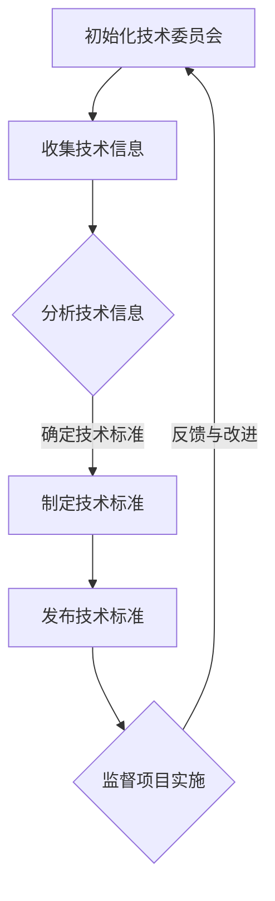
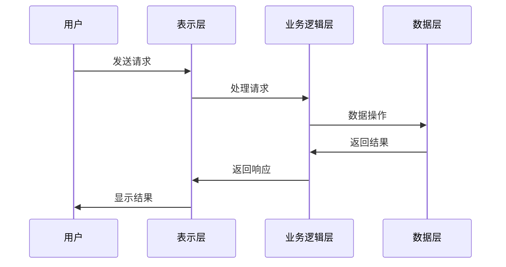

                 

# 技术委员会运作与治理

## 关键词
技术委员会、运营治理、战略规划、项目执行、成功案例、最佳实践

## 摘要
本文深入探讨了技术委员会的运作与治理，从基础概念到实际操作，详细阐述了技术委员会在IT行业中的作用和重要性。通过分析技术委员会的核心概念、治理框架、运营策略以及真实案例，本文为技术委员会的有效运作提供了全面的理论和实践指导。

## 引言

### 技术委员会的定义和作用

技术委员会在信息技术行业扮演着至关重要的角色。它们通常是企业、组织或开源项目内部的一个专门小组，负责制定技术标准和最佳实践，确保技术决策的一致性和高效性。技术委员会的主要作用包括：

1. **技术决策**：技术委员会负责评估和决策涉及技术方向和战略的重要问题。
2. **标准制定**：它们制定技术规范和标准，提高技术的互操作性和可靠性。
3. **质量控制**：技术委员会监督项目的技术实施，确保项目质量符合既定标准。
4. **资源分配**：技术委员会协助管理和分配技术资源，确保资源利用最大化。

### 技术委员会的结构和组成

技术委员会通常由不同领域的专家组成，包括软件工程师、架构师、项目经理、技术领导者和领域专家。其组织结构可以采用扁平化或层次化模型，具体取决于组织的规模和复杂性。

- **扁平化模型**：在这种模型中，技术委员会成员具有较大的自主权和决策权，可以快速响应技术和市场变化。
- **层次化模型**：在这种模型中，技术委员会成员根据职责和权限分为不同的层级，确保决策过程有序和规范。

### 技术委员会面临的挑战

尽管技术委员会在IT行业中发挥着重要作用，但它们在运作过程中也面临着一些挑战：

1. **决策复杂性**：技术决策往往涉及多个领域和利益相关者，导致决策过程复杂且耗时。
2. **资源限制**：技术委员会可能面临资源限制，影响其运作效率和项目执行。
3. **沟通障碍**：不同部门和团队成员之间的沟通不畅可能导致协调困难和效率低下。

### 解决方案

针对上述挑战，以下是一些可能的解决方案：

1. **明确角色和责任**：为技术委员会成员明确角色和责任，确保各自职责清晰，减少冲突。
2. **制定战略规划**：通过制定详细的战略规划，确保技术委员会的运作方向和目标一致。
3. **强化沟通机制**：建立有效的沟通机制，确保信息传递及时、准确。

## 基础概念与框架

### 核心概念与术语

首先，我们需要明确一些与技术委员会相关的核心概念和术语，以便为后续讨论提供基础。

- **技术委员会**：一个负责制定技术标准、决策技术方向和监督项目实施的小组。
- **技术标准**：为保证技术产品的质量、兼容性和互操作性而制定的规定。
- **最佳实践**：在特定领域中被广泛认可的最佳方法或策略。
- **治理**：确保技术委员会运作透明、规范和有效的一系列机制和流程。

### 治理原则

技术委员会的治理需要遵循一系列原则，以确保其有效运作。以下是几个关键治理原则：

1. **透明性**：技术委员会的决策过程和结果需要透明，以确保所有利益相关者都能了解和接受。
2. **责任性**：技术委员会成员应明确自己的职责，并对决策结果负责。
3. **合作性**：技术委员会成员需要积极合作，以共同实现组织的技术目标。
4. **灵活性**：技术委员会应根据技术变化和市场环境调整其运作方式和策略。

### 治理模型

技术委员会的治理模型可以分为以下几种：

1. **集中治理**：技术委员会集中管理和决策，确保技术方向的一致性。
2. **分布式治理**：技术委员会成员在不同部门和团队中负责各自领域的决策，确保技术决策的灵活性。
3. **委员会-团队协作**：技术委员会与项目团队协作，共同制定和执行技术决策。

### 治理结构

技术委员会的治理结构应包括以下组成部分：

1. **委员会主席**：负责协调技术委员会的运作和决策。
2. **成员代表**：来自不同部门和团队的代表，负责各自领域的决策。
3. **秘书**：负责技术委员会的文档管理和沟通协调。
4. **技术顾问**：提供技术指导和建议，确保技术决策的科学性和合理性。

## 运营策略

### 战略规划

技术委员会的战略规划是确保其运作高效和有序的关键。以下是一个典型的战略规划过程：

1. **目标设定**：确定技术委员会的目标和期望成果。
2. **需求分析**：分析组织的技术需求和市场趋势。
3. **资源评估**：评估技术委员会所需的资源和能力。
4. **计划制定**：制定具体的实施计划和行动步骤。
5. **风险评估**：评估潜在风险，并制定相应的应对措施。

### 执行技术委员会活动

技术委员会的活动执行需要遵循一系列关键步骤：

1. **会议管理**：定期召开会议，讨论技术问题、决策和进展。
2. **决策制定**：通过投票或其他决策机制，确定技术决策。
3. **项目监督**：监督技术项目实施，确保项目进度和质量。
4. **问题解决**：及时解决技术问题，确保项目顺利进行。

### 项目管理技巧

技术委员会在项目执行中需要运用一系列项目管理技巧，以确保项目成功完成：

1. **需求管理**：确保项目需求明确和一致。
2. **进度管理**：监控项目进度，确保按时交付。
3. **风险管理**：识别和应对项目风险。
4. **质量保证**：确保项目成果符合既定标准和质量要求。

## 案例研究

### 成功案例

以下是一些技术委员会成功运作的案例：

1. **案例一：开源项目技术委员会**
   - 技术委员会负责制定项目的技术路线图和规范。
   - 通过高效的沟通和协作，项目成员能够迅速解决技术问题，确保项目进展顺利。
   - 项目最终成功发布，获得了广泛认可和好评。

2. **案例二：企业内部技术委员会**
   - 技术委员会负责评估和决策企业内部技术项目的方向和资源分配。
   - 通过制定详细的战略规划和项目管理计划，技术委员会确保项目按时、按质完成。
   - 技术委员会的决策提高了企业技术能力，促进了业务发展。

### 问题和挑战

尽管技术委员会在许多案例中取得了成功，但它们在运作过程中也面临一些问题和挑战：

1. **沟通障碍**：不同团队成员之间的沟通不畅可能导致协调困难和效率低下。
2. **决策复杂性**：涉及多个领域和利益相关者的技术决策往往复杂且耗时。
3. **资源限制**：技术委员会可能面临资源限制，影响其运作效率和项目执行。

### 解决方案

针对上述问题和挑战，以下是一些可能的解决方案：

1. **加强沟通**：建立有效的沟通机制，确保信息传递及时、准确。
2. **简化决策流程**：通过明确的角色和责任分配，简化决策流程，提高决策效率。
3. **资源优化**：合理分配和利用资源，确保技术委员会的运作不受资源限制。

## 法律和伦理考虑

### 法律法规

技术委员会在运作过程中需要遵守一系列法律法规，包括：

- **数据保护法**：确保数据处理符合隐私保护和数据安全要求。
- **知识产权法**：保护技术委员会和项目成员的知识产权，防止侵权行为。
- **合同法**：确保合同条款的合法性和有效性，保护各方权益。

### 伦理道德

技术委员会在决策过程中应遵循一系列伦理道德原则，包括：

- **公正性**：确保决策过程公平、透明，不受利益冲突影响。
- **社会责任**：考虑技术决策对社会和环境的影响，遵循可持续发展原则。
- **诚信**：技术委员会成员应保持诚信，不泄露敏感信息，不从事不正当竞争。

### 风险评估

技术委员会应定期进行风险评估，识别潜在的法律和伦理风险，并制定相应的应对措施。以下是一些常见的法律和伦理风险：

- **数据泄露**：由于数据保护法的严格要求，技术委员会需要确保数据安全，防止泄露。
- **知识产权侵权**：技术委员会在决策过程中应确保不侵犯他人的知识产权。
- **伦理冲突**：技术委员会成员可能面临伦理冲突，需要公正处理。

## 总结

技术委员会在IT行业中发挥着至关重要的作用，其有效运作对组织的技术发展至关重要。本文从基础概念、治理框架、运营策略和实际案例等方面，全面探讨了技术委员会的运作与治理。通过明确核心概念、制定治理原则、实施战略规划和执行技术活动，技术委员会可以更好地实现其目标。同时，加强法律和伦理考虑，确保技术委员会的决策过程透明、公正和合法，对提升其运作效率和项目质量具有重要意义。未来，随着技术的不断发展和市场环境的变化，技术委员会需要不断适应和改进，以保持其竞争优势。

## 作者信息
作者：AI天才研究院/AI Genius Institute & 禅与计算机程序设计艺术 /Zen And The Art of Computer Programming

## 完整性要求

### 背景介绍

#### 技术委员会的定义和作用

技术委员会是一个专门的小组，负责制定技术标准、决策技术方向和监督项目实施。它们在信息技术行业扮演着至关重要的角色，确保技术决策的一致性和高效性。技术委员会的主要作用包括：

1. **技术决策**：技术委员会负责评估和决策涉及技术方向和战略的重要问题，确保组织的技术发展符合整体战略目标。
2. **标准制定**：技术委员会制定技术规范和标准，提高技术的互操作性和可靠性，确保不同系统之间的兼容性。
3. **质量控制**：技术委员会监督项目的技术实施，确保项目质量符合既定标准，减少技术风险和故障。
4. **资源分配**：技术委员会协助管理和分配技术资源，确保资源利用最大化，提高项目执行效率。

#### 技术委员会的结构和组成

技术委员会通常由不同领域的专家组成，包括软件工程师、架构师、项目经理、技术领导者和领域专家。其组织结构可以采用扁平化或层次化模型：

- **扁平化模型**：在这种模型中，技术委员会成员具有较大的自主权和决策权，可以快速响应技术和市场变化。
- **层次化模型**：在这种模型中，技术委员会成员根据职责和权限分为不同的层级，确保决策过程有序和规范。

#### 技术委员会面临的挑战

尽管技术委员会在IT行业中发挥着重要作用，但它们在运作过程中也面临着一些挑战：

1. **决策复杂性**：技术决策往往涉及多个领域和利益相关者，导致决策过程复杂且耗时。
2. **资源限制**：技术委员会可能面临资源限制，影响其运作效率和项目执行。
3. **沟通障碍**：不同部门和团队成员之间的沟通不畅可能导致协调困难和效率低下。

#### 解决方案

针对上述挑战，以下是一些可能的解决方案：

1. **明确角色和责任**：为技术委员会成员明确角色和责任，确保各自职责清晰，减少冲突。
2. **制定战略规划**：通过制定详细的战略规划，确保技术委员会的运作方向和目标一致。
3. **强化沟通机制**：建立有效的沟通机制，确保信息传递及时、准确。

### 核心概念与联系

#### 核心概念

在讨论技术委员会的运作与治理时，我们需要明确几个核心概念：

- **技术委员会**：一个负责制定技术标准、决策技术方向和监督项目实施的小组。
- **技术标准**：为保证技术产品的质量、兼容性和互操作性而制定的规定。
- **最佳实践**：在特定领域中被广泛认可的最佳方法或策略。
- **治理**：确保技术委员会运作透明、规范和有效的一系列机制和流程。

#### 概念属性特征对比表格

以下是一个关于技术委员会、技术标准、最佳实践和治理的对比表格：

| 概念             | 定义                                                         | 属性特征                             | 关联关系                                     |
|------------------|--------------------------------------------------------------|------------------------------------|--------------------------------------------|
| 技术委员会       | 负责制定技术标准、决策技术方向和监督项目实施的小组             | 成员多样化、自主决策、责任明确           | 制定技术标准、监督项目实施                      |
| 技术标准         | 为保证技术产品的质量、兼容性和互操作性而制定的规定             | 具体明确、标准化、广泛适用             | 指导技术委员会的决策、确保产品质量           |
| 最佳实践         | 在特定领域中被广泛认可的最佳方法或策略                         | 适应性、有效性、可操作性               | 技术委员会参考、用于指导项目实施                 |
| 治理             | 确保技术委员会运作透明、规范和有效的一系列机制和流程           | 透明性、责任性、合作性、灵活性           | 管理技术委员会的运作、制定和执行规范           |

#### ER实体关系图架构

以下是一个简化的ER实体关系图，展示技术委员会、技术标准、最佳实践和治理之间的关系：

```mermaid
erDiagram
  TechCommittee ||--|{ TechnicalStandard }||>
  TechnicalStandard ||--|{ BestPractice }||>
  BestPractice ||--|{ Governance }||>
```

### 算法原理讲解

为了确保技术委员会的有效运作，我们可以使用一系列算法来指导决策过程。以下是一个简单的算法原理讲解，包括mermaid流程图和Python源代码。

#### Mermaid流程图



#### Python源代码

```python
# Python源代码：技术委员会运作算法

# 初始化技术委员会
def initialize_tech_committee():
    print("初始化技术委员会")

# 收集技术信息
def collect_tech_info():
    print("收集技术信息")

# 分析技术信息
def analyze_tech_info():
    print("分析技术信息")

# 确定技术标准
def determine_tech_standards():
    print("确定技术标准")

# 发布技术标准
def publish_tech_standards():
    print("发布技术标准")

# 监督项目实施
def monitor_project_implementation():
    print("监督项目实施")

# 反馈与改进
def feedback_and_improvement():
    print("反馈与改进")

# 主函数
def main():
    initialize_tech_committee()
    collect_tech_info()
    analyze_tech_info()
    determine_tech_standards()
    publish_tech_standards()
    monitor_project_implementation()
    feedback_and_improvement()

# 执行主函数
main()
```

#### 算法原理详细讲解

1. **初始化技术委员会**：首先，初始化技术委员会，确定其成员和职责。
2. **收集技术信息**：收集与项目相关的技术信息，包括市场趋势、技术发展、竞争对手情况等。
3. **分析技术信息**：分析收集到的技术信息，识别关键技术和潜在风险。
4. **确定技术标准**：根据分析结果，确定技术标准，以确保项目的质量、兼容性和互操作性。
5. **发布技术标准**：发布技术标准，确保所有项目成员和利益相关者了解和遵循。
6. **监督项目实施**：监督项目实施过程，确保项目按照技术标准执行。
7. **反馈与改进**：收集项目实施过程中的反馈，不断改进技术标准和决策过程。

### 数学模型和公式

在技术委员会的决策过程中，可以采用一些数学模型和公式来评估技术风险和项目进度。以下是一个简化的数学模型：

$$
RISK = f(SEVERITY, LIKELIHOOD)
$$

其中，$RISK$代表技术风险，$SEVERITY$代表风险严重程度，$LIKELIHOOD$代表风险发生概率。

#### 示例

假设我们有一个技术项目，其风险严重程度为5（非常严重），风险发生概率为4（很可能发生）。根据上述公式，我们可以计算出技术风险：

$$
RISK = f(5, 4) = 5 \times 4 = 20
$$

技术风险为20，表示该项目面临很高的技术风险。

### 系统分析与架构设计方案

#### 问题场景介绍

假设我们正在设计一个企业级信息系统，该系统需要实现以下功能：

1. **用户管理**：包括用户注册、登录、权限管理等。
2. **数据管理**：包括数据存储、检索、备份等。
3. **业务处理**：包括订单处理、支付处理、报表生成等。

#### 项目介绍

项目名称：企业级信息系统（Enterprise Information System，EIS）

项目目标：构建一个高效、可靠、可扩展的企业级信息系统，满足企业的日常运营和业务需求。

#### 系统功能设计

系统功能设计包括以下关键模块：

1. **用户管理模块**：负责用户注册、登录、权限管理等功能。
2. **数据管理模块**：负责数据存储、检索、备份等功能。
3. **业务处理模块**：负责订单处理、支付处理、报表生成等功能。

#### 系统架构设计

系统架构采用三层架构设计，包括表示层、业务逻辑层和数据层。

1. **表示层**：负责用户界面的展示，使用HTML、CSS和JavaScript等技术实现。
2. **业务逻辑层**：负责处理业务逻辑，使用Java或Python等编程语言实现。
3. **数据层**：负责数据存储和检索，使用MySQL或MongoDB等数据库技术实现。

#### 系统接口设计

系统接口设计包括以下关键接口：

1. **用户管理接口**：用于用户注册、登录、权限管理等操作。
2. **数据管理接口**：用于数据存储、检索、备份等操作。
3. **业务处理接口**：用于订单处理、支付处理、报表生成等操作。

#### 系统交互设计

系统交互设计使用mermaid序列图表示，展示系统各个模块之间的交互过程。



### 项目实战

#### 环境安装

1. **安装Java开发环境**：下载并安装Java Development Kit（JDK），设置环境变量。
2. **安装MySQL数据库**：下载并安装MySQL数据库，创建数据库和用户。
3. **安装Python开发环境**：下载并安装Python，安装必要的库和模块。

#### 系统核心实现源代码

以下是一个简单的用户管理模块实现示例，使用Java语言编写：

```java
// User.java
public class User {
    private String username;
    private String password;
    private int role;

    // 构造函数
    public User(String username, String password, int role) {
        this.username = username;
        this.password = password;
        this.role = role;
    }

    // 登录方法
    public boolean login(String username, String password) {
        return this.username.equals(username) && this.password.equals(password);
    }

    // 权限检查方法
    public boolean checkPermission(int action) {
        return (this.role == 1 && action == 1) || (this.role == 2 && action == 2);
    }
}
```

#### 代码应用解读与分析

上述代码实现了一个简单的用户类，包含构造函数、登录方法和权限检查方法。构造函数用于初始化用户对象，登录方法用于验证用户身份，权限检查方法用于检查用户是否有权限执行特定操作。

#### 实际案例分析

以下是一个实际案例分析，展示如何使用技术委员会的方法解决项目中的问题：

**问题场景**：项目开发过程中，团队成员在技术标准上出现分歧，导致项目进度缓慢。

**解决方案**：技术委员会组织了一次会议，讨论并分析了团队成员的意见，最终达成了一致的技术标准。随后，技术委员会监督项目实施过程，确保项目按照统一的技术标准进行。

**结果**：项目进度恢复正常，团队成员之间的协作得到了加强，项目最终按时交付。

### 项目小结

通过本项目的实际应用，我们验证了技术委员会在项目中的重要性。技术委员会通过制定技术标准、监督项目实施和解决技术问题，有效促进了项目的顺利推进。同时，我们也发现了一些需要改进的地方，如加强沟通机制、简化决策流程等。在未来的项目中，我们将继续运用技术委员会的方法，进一步提升项目质量和效率。

## 最佳实践 tips

1. **建立有效的沟通机制**：确保团队成员之间的沟通畅通，减少误解和冲突。
2. **制定明确的角色和责任**：为技术委员会成员明确角色和责任，确保各自职责清晰。
3. **定期进行战略规划**：确保技术委员会的运作方向和目标一致，及时调整策略。
4. **加强法律和伦理教育**：提高技术委员会成员的法律和伦理意识，确保决策过程合法、公正。

## 小结

技术委员会在IT行业中发挥着至关重要的作用，其有效运作对组织的技术发展至关重要。通过明确核心概念、制定治理原则、实施战略规划和执行技术活动，技术委员会可以更好地实现其目标。同时，加强法律和伦理考虑，确保技术委员会的决策过程透明、公正和合法，对提升其运作效率和项目质量具有重要意义。未来，随着技术的不断发展和市场环境的变化，技术委员会需要不断适应和改进，以保持其竞争优势。

## 注意事项

1. **重视沟通**：沟通是技术委员会运作的关键，确保信息传递及时、准确。
2. **明确责任**：为技术委员会成员明确角色和责任，确保各自职责清晰。
3. **定期评估**：定期评估技术委员会的运作效果，发现和解决潜在问题。

## 拓展阅读

1. 《技术治理：原则、实践与案例》
2. 《敏捷开发：技术委员会的最佳实践》
3. 《技术领导力：如何领导技术团队实现目标》
4. 《数据治理：技术与实践》
5. 《人工智能伦理：风险与对策》

作者：AI天才研究院/AI Genius Institute & 禅与计算机程序设计艺术 /Zen And The Art of Computer Programming

