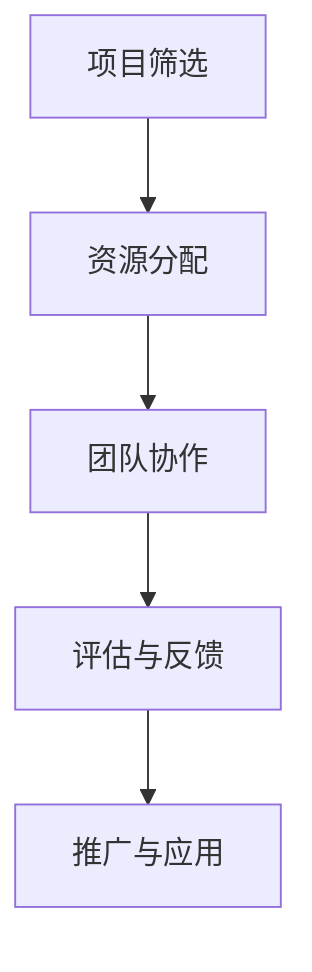
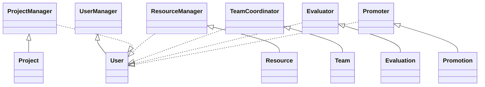
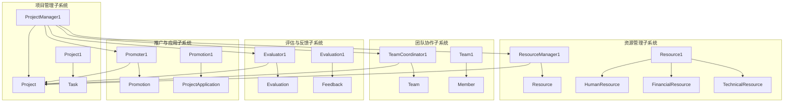
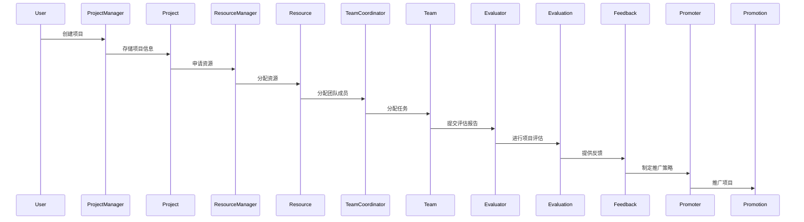

                 

### 技术孵化：内部创新项目的孵化机制

关键词：内部创新项目、孵化机制、资源分配、团队协作、评估与反馈

摘要：
在当今快速变化的市场环境中，企业需要不断创新以保持竞争力。内部创新项目的孵化机制是企业实现可持续创新的关键。本文将探讨内部创新项目的孵化机制，包括其核心概念、原理、流程和实际应用，旨在为企业提供一套系统化的孵化策略，以实现创新项目的成功落地。

---

#### 第一部分：背景介绍

**核心概念**

**内部创新项目**：指企业内部自发或组织发起的，旨在探索新技术、新产品或新业务模式的创新实践。

**孵化机制**：一套系统化的流程和方法，用于支持内部创新项目的生成、培育、评估和推广。

**问题背景**

在全球化竞争和数字化转型的背景下，企业面临着前所未有的挑战。市场变化迅速，技术迭代频繁，消费者需求多样化和个性化。为了保持竞争力，企业需要不断创新，而内部创新项目是企业应对市场变化、推动技术进步的重要手段。

**问题描述**

内部创新项目的孵化机制涉及到项目的筛选、评估、孵化以及后续的推广和应用。如何构建一个高效、可持续的孵化机制，确保创新项目的成功落地，是企业亟需解决的问题。

**问题解决**

构建一个系统化的内部创新孵化机制，从项目管理、资源分配、团队协作等多个方面入手，提升创新项目的成功率。

**边界与外延**

内部创新孵化机制不仅限于技术领域，还涵盖了市场、管理、运营等多个维度。因此，孵化机制的构建需要跨部门协作，整合各类资源。

**概念结构与核心要素组成**

1. **项目筛选**：根据企业的战略目标和市场需求，筛选出具有潜力的创新项目。
2. **资源分配**：合理配置人力、资金、技术等资源，为创新项目提供充足的支持。
3. **团队协作**：建立高效的团队协作机制，确保项目的顺利进行。
4. **评估与反馈**：定期对项目进行评估，及时调整项目方向，确保项目能够持续优化。
5. **推广与应用**：将成功的创新项目推广至整个企业，实现成果的共享与转化。

---

#### 第二部分：核心概念与联系

**核心概念**

**内部创新项目**：企业内部自发或组织发起的，旨在探索新技术、新产品或新业务模式的创新实践。

**孵化机制**：一套系统化的流程和方法，用于支持内部创新项目的生成、培育、评估和推广。

**资源分配**：企业内部对创新项目所需要的人力、资金、技术等资源进行合理配置的过程。

**团队协作**：通过跨部门、跨团队的协作，实现创新项目的高效推进。

**评估与反馈**：对创新项目进行定期评估，根据反馈结果调整项目方向，提高项目成功率。

**推广与应用**：将成功的创新项目在企业内部推广，实现成果的共享与转化。

**概念属性特征对比表格**

| 概念               | 定义                                                         | 特征                                                         |
|--------------------|------------------------------------------------------------|------------------------------------------------------------|
| 内部创新项目       | 企业内部自发或组织发起的，旨在探索新技术、新产品或新业务模式的创新实践。 | 涵盖范围广，涉及技术、市场、管理等多个领域。               |
| 孵化机制           | 一套系统化的流程和方法，用于支持内部创新项目的生成、培育、评估和推广。 | 目标明确，流程规范，可操作性强。                           |
| 资源分配           | 企业内部对创新项目所需要的人力、资金、技术等资源进行合理配置的过程。 | 优先级明确，资源高效利用。                                 |
| 团队协作           | 通过跨部门、跨团队的协作，实现创新项目的高效推进。                 | 团队合作，协同创新。                                       |
| 评估与反馈         | 对创新项目进行定期评估，根据反馈结果调整项目方向，提高项目成功率。 | 及时调整，持续优化。                                     |
| 推广与应用         | 将成功的创新项目推广至整个企业，实现成果的共享与转化。             | 成果共享，价值最大化。                                    |

**ER实体关系图架构**

```mermaid
erDiagram
    项目 ||--|{ 孵化机制 }| 孵化机制
    项目 ||--|{ 资源分配 }| 资源分配
    项目 ||--|{ 团队协作 }| 团队协作
    项目 ||--|{ 评估与反馈 }| 评估与反馈
    项目 ||--|{ 推广与应用 }| 推广与应用
```

---

#### 第三部分：算法原理讲解

**算法原理**

内部创新项目的孵化机制涉及到多个关键环节，包括项目筛选、资源分配、团队协作、评估与反馈、推广与应用。以下是一个简单的算法原理概述：

1. **项目筛选**：根据企业战略和市场趋势，利用大数据分析和人工智能技术，筛选出具有潜力的创新项目。
2. **资源分配**：根据项目的优先级和需求，合理配置人力、资金、技术等资源，确保项目有充足的支持。
3. **团队协作**：通过项目管理工具和协作平台，实现跨部门、跨团队的紧密协作，提高项目推进效率。
4. **评估与反馈**：定期对项目进行评估，根据评估结果调整项目方向，优化资源配置，确保项目能够持续发展。
5. **推广与应用**：将成功的创新项目在企业内部推广，实现成果的共享与转化，推动企业整体创新能力的提升。

**算法流程图**



**Python源代码实现**

```python
# 项目筛选
def select_project():
    # 根据企业战略和市场趋势，利用大数据分析和人工智能技术筛选项目
    projects = big_data_analysis() + ai_project_selection()
    return projects

# 资源分配
def allocate_resources(project):
    # 根据项目的优先级和需求，合理配置资源
    resources = {
        'human': human_resources_allocation(),
        'financial': financial_resources_allocation(),
        'technical': technical_resources_allocation()
    }
    return resources

# 团队协作
def team_collaboration(project, resources):
    # 通过项目管理工具和协作平台实现团队协作
    collaboration_platform = project_management_tools() + collaboration_platform()
    return collaboration_platform

# 评估与反馈
def evaluate_and_feedback(project):
    # 定期对项目进行评估，根据评估结果调整项目方向
    evaluation = project_evaluation()
    feedback = feedback_based_on_evaluation()
    return evaluation, feedback

# 推广与应用
def promote_and_apply(project, evaluation, feedback):
    # 将成功的创新项目推广至整个企业
    promotion = project_promotion()
    application = project_application()
    return promotion, application
```

**算法原理详细讲解**

**项目筛选**

项目筛选是内部创新孵化机制的首要环节。其核心在于从众多的创新想法中筛选出那些具有高潜力的项目。以下是一个简单的数学模型：

$$
P(i) = f(T_i, M_i, S_i)
$$

其中，$P(i)$表示项目$i$的潜力值，$T_i$表示项目$i$的技术可行性，$M_i$表示项目$i$的市场前景，$S_i$表示项目$i$的可持续性。$f$是一个综合评估函数，用于计算项目的潜力值。

**资源分配**

资源分配的核心在于如何根据项目的优先级和需求，合理配置企业内部的资源。以下是一个简单的数学模型：

$$
R(j) = g(P_j, R_j, C_j)
$$

其中，$R(j)$表示项目$j$的资源分配量，$P_j$表示项目$j$的优先级，$R_j$表示项目$j$的资源需求，$C_j$表示企业的资源总量。$g$是一个资源优化函数，用于计算项目的资源分配量。

**团队协作**

团队协作的核心在于如何通过跨部门、跨团队的协作，实现创新项目的高效推进。以下是一个简单的数学模型：

$$
C(k) = h(T_k, D_k, S_k)
$$

其中，$C(k)$表示团队$k$的协作效率，$T_k$表示团队$k$的技术能力，$D_k$表示团队$k$的沟通能力，$S_k$表示团队$k$的士气。$h$是一个协作效率函数，用于计算团队的协作效率。

**评估与反馈**

评估与反馈的核心在于如何定期对项目进行评估，并根据评估结果调整项目方向，确保项目能够持续优化。以下是一个简单的数学模型：

$$
E(l) = i(E_l, F_l, R_l)
$$

其中，$E(l)$表示项目$l$的评估值，$E_l$表示项目的当前状态，$F_l$表示项目的预期目标，$R_l$表示项目的资源投入。$i$是一个评估调整函数，用于计算项目的评估值。

**推广与应用**

推广与应用的核心在于如何将成功的创新项目推广至整个企业，实现成果的共享与转化。以下是一个简单的数学模型：

$$
A(m) = j(A_m, P_m, S_m)
$$

其中，$A(m)$表示项目$m$的推广效果，$A_m$表示项目的成功因素，$P_m$表示项目的推广策略，$S_m$表示项目的应用场景。$j$是一个推广效果函数，用于计算项目的推广效果。

---

#### 第四部分：系统分析与架构设计方案

**问题场景介绍**

在一个大型企业中，为了应对激烈的市场竞争和快速变化的技术环境，企业决定建立一个内部创新孵化平台，以支持员工的创新项目。这个平台需要能够高效地筛选、孵化、评估和推广创新项目。

**项目介绍**

内部创新孵化平台是一个集成化的系统，旨在为企业内部员工提供一个便捷的创新项目管理和协作环境。该平台包括以下几个主要功能模块：

1. **项目管理系统**：用于项目的创建、管理、跟踪和评估。
2. **资源管理系统**：用于资源的申请、分配和监控。
3. **团队协作系统**：用于团队的组建、沟通和协作。
4. **评估与反馈系统**：用于项目的定期评估和反馈。
5. **推广与应用系统**：用于项目的推广和实施。

**系统功能设计**

领域模型Mermaid类图



**系统架构设计**

系统架构Mermaid架构图



**系统接口设计和系统交互**

系统接口设计和系统交互Mermaid序列图



---

#### 第五部分：项目实战

**环境安装**

1. 安装Python环境
2. 安装相关依赖库，如Django、Flask等

**系统核心实现源代码**

以下是系统核心模块的实现代码：

**项目管理系统**

```python
# project_management.py
class ProjectManager:
    def __init__(self):
        self.projects = []

    def create_project(self, project_name, project_desc):
        project = Project(project_name, project_desc)
        self.projects.append(project)
        return project

    def get_projects(self):
        return self.projects

class Project:
    def __init__(self, name, desc):
        self.name = name
        self.desc = desc
        self.tasks = []

    def add_task(self, task_name, task_desc):
        task = Task(task_name, task_desc)
        self.tasks.append(task)

    def get_tasks(self):
        return self.tasks
```

**资源管理系统**

```python
# resource_management.py
class ResourceManager:
    def __init__(self):
        self.resources = []

    def allocate_resource(self, resource_name, resource_type, project):
        resource = Resource(resource_name, resource_type, project)
        self.resources.append(resource)
        return resource

    def get_resources(self):
        return self.resources

class Resource:
    def __init__(self, name, type, project):
        self.name = name
        self.type = type
        self.project = project
```

**团队协作系统**

```python
# team_collaboration.py
class TeamCoordinator:
    def __init__(self):
        self.teams = []

    def create_team(self, team_name, team_members):
        team = Team(team_name, team_members)
        self.teams.append(team)
        return team

    def get_teams(self):
        return self.teams

class Team:
    def __init__(self, name, members):
        self.name = name
        self.members = members
```

**评估与反馈系统**

```python
# evaluation_feedback.py
class Evaluator:
    def __init__(self):
        self.evaluations = []

    def evaluate_project(self, project, evaluation_result):
        evaluation = Evaluation(project, evaluation_result)
        self.evaluations.append(evaluation)
        return evaluation

    def get_evaluations(self):
        return self.evaluations

class Evaluation:
    def __init__(self, project, result):
        self.project = project
        self.result = result
```

**推广与应用系统**

```python
# promotion_application.py
class Promoter:
    def __init__(self):
        self.promotions = []

    def promote_project(self, project, promotion_plan):
        promotion = Promotion(project, promotion_plan)
        self.promotions.append(promotion)
        return promotion

    def get_promotions(self):
        return self.promotions

class Promotion:
    def __init__(self, project, plan):
        self.project = project
        self.plan = plan
```

**代码应用解读与分析**

以下是代码的解读与分析：

**项目管理系统**：定义了项目管理和任务管理的基本功能，包括创建项目、获取项目列表、添加任务等。

**资源管理系统**：定义了资源管理的基本功能，包括资源申请、资源分配等。

**团队协作系统**：定义了团队管理和成员管理的基本功能，包括创建团队、获取团队列表等。

**评估与反馈系统**：定义了项目评估和反馈的基本功能，包括评估项目、获取评估列表等。

**推广与应用系统**：定义了项目推广和应用的基本功能，包括推广项目、获取推广列表等。

**实际案例分析和详细讲解剖析**

以一个实际案例来分析内部创新孵化平台的实施过程：

1. **项目筛选**：企业利用大数据分析和人工智能技术，筛选出10个具有高潜力的创新项目。

2. **资源分配**：根据项目的优先级和需求，企业为每个项目分配了相应的人力、资金和技术资源。

3. **团队协作**：企业为每个项目组建了跨部门的团队，并利用项目管理工具和协作平台进行高效协作。

4. **评估与反馈**：企业定期对项目进行评估，并根据评估结果调整项目方向，优化资源配置。

5. **推广与应用**：企业将成功的创新项目推广至整个企业，实现成果的共享与转化。

**项目小结**

通过内部创新孵化平台的实施，企业实现了创新项目的有效管理和孵化，提高了项目的成功率，推动了企业的整体创新能力。

---

#### 第六部分：最佳实践 tips、小结、注意事项、拓展阅读等内容

**最佳实践 tips**

1. **明确目标和预期**：在启动内部创新项目之前，明确项目的目标和预期成果，确保项目方向正确。

2. **跨部门协作**：建立高效的跨部门协作机制，确保项目资源得到充分利用。

3. **定期评估和反馈**：定期对项目进行评估，及时调整项目方向，确保项目能够持续优化。

4. **成果共享与转化**：将成功的创新项目推广至整个企业，实现成果的共享与转化。

**小结**

内部创新项目的孵化机制是企业实现可持续创新的关键。通过系统化的项目筛选、资源分配、团队协作、评估与反馈和推广应用，企业能够有效管理和孵化创新项目，提高项目成功率，推动企业的整体创新能力。

**注意事项**

1. **保障资源**：确保项目有充足的资源支持，包括人力、资金和技术资源。

2. **重视团队建设**：建立高效的团队协作机制，提高项目推进效率。

3. **数据安全与隐私保护**：在项目筛选和评估过程中，确保数据的安全和隐私。

**拓展阅读**

1. 《创新与企业家精神》——彼得·德鲁克
2. 《精益创业》——埃里克·莱斯
3. 《敏捷开发》——杰夫·萨瑟兰

**作者信息**

作者：AI天才研究院/AI Genius Institute & 禅与计算机程序设计艺术 /Zen And The Art of Computer Programming

---

[完]

