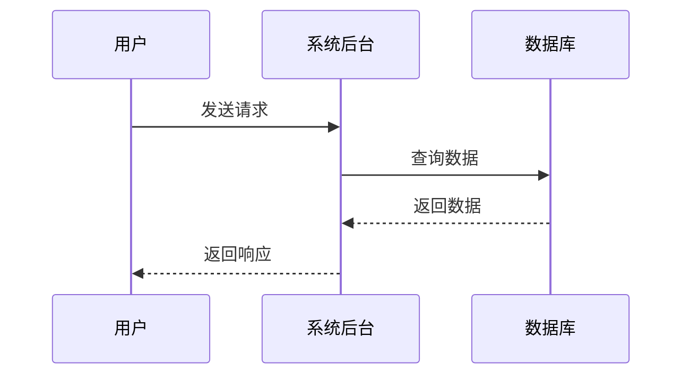

                 

### 技术导师制：建立有效的经验传承机制

#### 关键词

- 技术导师制
- 经验传承
- 知识管理
- 企业发展
- 新技术研发

#### 摘要

本文旨在探讨技术导师制在建立有效的经验传承机制中的重要性。通过分析技术发展与企业面临的挑战，本文定义了技术导师制的核心概念，并详细阐述了其实施策略和应用实践。文章进一步讨论了技术导师制在团队建设、人才发展及新技术研发中的作用，并通过案例分析和改进策略，展示了技术导师制的实施效果和未来展望。本文希望为企业和IT专业人士提供有益的参考，以促进技术创新和知识传承。

#### 目录大纲

1. **问题背景与核心概念**

   1.1 **问题背景**  
   - **技术发展与企业挑战**  
   - **经验传承的重要性**  
   - **现有经验传承机制的问题**

   1.2 **核心概念**  
   - **技术导师制的基本概念**  
   - **技术导师的角色与职责**  
   - **经验传承与知识管理**

2. **技术导师制的实施与机制**

   2.1 **导师选拔与培养**  
   - **导师选拔标准**  
   - **导师培养机制**  
   - **导师能力评估与提升**

   2.2 **导师与徒弟的关系构建**  
   - **双向选择机制**  
   - **沟通与反馈机制**  
   - **彼此信任的建立**

   2.3 **经验传承机制的构建**  
   - **知识管理体系**  
   - **实践案例与最佳实践**

3. **技术导师制的应用与实践**

   3.1 **新技术研发与落地**  
   - **技术导师在新技术研发中的角色**  
   - **新技术应用的经验传承**  
   - **新技术研发中的导师作用**

   3.2 **团队建设与人才发展**  
   - **技术导师在团队建设中的作用**  
   - **技术导师在人才发展中的贡献**  
   - **技术导师与团队文化培育**

4. **技术导师制的实施案例分析**

   4.1 **案例一：某高科技企业技术导师制的实施**  
   - **案例背景**  
   - **实施过程与成果**  
   - **案例启示与思考**

   4.2 **案例二：某软件公司技术导师制的实践**  
   - **案例背景**  
   - **实施策略与效果**  
   - **案例经验与借鉴**

5. **技术导师制的评估与改进**

   5.1 **评估指标体系**  
   - **评估指标的设定**  
   - **评估方法与工具**  
   - **评估结果分析与反馈**

   5.2 **改进策略与实施**  
   - **改进措施的提出**  
   - **改进方案的实施**  
   - **改进效果的评估与持续优化**

6. **技术导师制的发展趋势与未来展望**

   6.1 **技术发展的挑战与机遇**  
   - **技术变革对导师制的影响**  
   - **未来导师制的发展趋势**  
   - **技术导师制在企业中的战略意义**

   6.2 **未来展望**  
   - **技术导师制在行业中的应用**  
   - **技术导师制的社会价值**  
   - **技术导师制的发展方向与挑战**

7. **小结与展望**

   7.1 **小结**  
   - **主要观点与结论**  
   - **技术导师制的重要作用**

   7.2 **展望**  
   - **技术导师制的发展前景**  
   - **技术导师制面临的挑战与机遇**  
   - **后续研究的方向和建议**

---

### 第一部分：问题背景与核心概念

#### 1.1 问题背景

##### 技术发展与企业挑战

在当今快速发展的信息技术时代，企业面临的挑战日益加剧。一方面，技术的不断进步和创新使得企业必须不断更新技术栈，以保持竞争力。另一方面，技术的快速迭代也带来了知识更新的压力。这要求企业在知识传承方面投入更多的时间和精力。

##### 经验传承的重要性

经验传承是企业持续发展的重要保障。在IT行业，技术经验和最佳实践往往被固化在个别员工或团队中，无法有效地传递给新人或下一代团队。这种知识断层可能导致新员工的技能提升缓慢，影响企业的创新能力和市场竞争力。

##### 现有经验传承机制的问题

现有的经验传承机制存在诸多问题，如：

- **单向传递**：知识通常是由老员工向新员工单向传递，缺乏互动和双向反馈。
- **缺乏系统性**：经验传承往往缺乏系统性的规划和指导，容易导致知识碎片化和遗漏。
- **缺乏激励**：现有机制往往缺乏对知识传承的激励，导致员工缺乏动力参与其中。
- **技术障碍**：知识的数字化和标准化程度较低，难以实现高效的知识共享和传播。

##### 技术导师制的基本概念

技术导师制是一种旨在通过经验传承促进知识共享和技能提升的机制。它通过建立导师与徒弟之间的紧密联系，实现知识的有效传递和技能的持续培养。技术导师不仅承担着指导徒弟的责任，还需要在团队中发挥带头作用，推动技术的创新和应用。

##### 技术导师的角色与职责

技术导师的角色和职责包括：

- **技能指导**：为徒弟提供技术指导，帮助其快速提升技能。
- **知识传递**：通过经验分享，将自身的技术知识和最佳实践传递给徒弟。
- **团队协作**：促进团队协作，提升团队整体的技术能力。
- **人才培养**：发现和培养潜力人才，为企业的长期发展储备人才。

##### 经验传承与知识管理

经验传承是知识管理的重要组成部分。有效的知识管理不仅需要将经验转化为可共享的知识，还需要确保知识的有效存储、传播和应用。技术导师制通过建立导师与徒弟之间的紧密联系，实现了知识的系统化传递和应用。

#### 1.2 核心概念

##### 技术导师制的基本概念

技术导师制是一种通过建立导师与徒弟之间的长期合作关系，实现知识传承和技能提升的机制。导师通常具有丰富的技术经验和深厚的专业素养，能够为徒弟提供全方位的指导和支持。

##### 技术导师的角色与职责

技术导师的角色和职责包括：

- **技能指导**：为徒弟提供技术指导，帮助其快速提升技能。
- **知识传递**：通过经验分享，将自身的技术知识和最佳实践传递给徒弟。
- **团队协作**：促进团队协作，提升团队整体的技术能力。
- **人才培养**：发现和培养潜力人才，为企业的长期发展储备人才。

##### 经验传承与知识管理

经验传承是知识管理的重要组成部分。有效的知识管理不仅需要将经验转化为可共享的知识，还需要确保知识的有效存储、传播和应用。技术导师制通过建立导师与徒弟之间的紧密联系，实现了知识的系统化传递和应用。

#### 1.3 现有经验传承机制的问题

现有经验传承机制存在以下问题：

- **单向传递**：知识通常是由老员工向新员工单向传递，缺乏互动和双向反馈。
- **缺乏系统性**：经验传承往往缺乏系统性的规划和指导，容易导致知识碎片化和遗漏。
- **缺乏激励**：现有机制往往缺乏对知识传承的激励，导致员工缺乏动力参与其中。
- **技术障碍**：知识的数字化和标准化程度较低，难以实现高效的知识共享和传播。

##### 技术导师制的实施策略

技术导师制的实施策略包括：

- **导师选拔与培养**：选拔具备丰富经验和良好沟通能力的导师，并提供持续的培训和发展机会。
- **导师与徒弟的关系构建**：建立双向选择机制，确保导师和徒弟之间的良好匹配。
- **经验传承机制的构建**：建立系统化的知识管理体系，实现知识的数字化和标准化。

#### 1.4 核心概念与联系

##### 技术导师制的基本概念

技术导师制是一种通过建立导师与徒弟之间的长期合作关系，实现知识传承和技能提升的机制。导师通常具有丰富的技术经验和深厚的专业素养，能够为徒弟提供全方位的指导和支持。

##### 技术导师的角色与职责

技术导师的角色和职责包括：

- **技能指导**：为徒弟提供技术指导，帮助其快速提升技能。
- **知识传递**：通过经验分享，将自身的技术知识和最佳实践传递给徒弟。
- **团队协作**：促进团队协作，提升团队整体的技术能力。
- **人才培养**：发现和培养潜力人才，为企业的长期发展储备人才。

##### 经验传承与知识管理

经验传承是知识管理的重要组成部分。有效的知识管理不仅需要将经验转化为可共享的知识，还需要确保知识的有效存储、传播和应用。技术导师制通过建立导师与徒弟之间的紧密联系，实现了知识的系统化传递和应用。

### 第二部分：技术导师制的实施与机制

#### 2.1 导师选拔与培养

##### 2.1.1 导师选拔标准

导师的选拔标准应综合考虑以下方面：

- **技术能力**：导师应具备丰富的技术经验和深厚的专业素养，能够为徒弟提供高质量的技术指导。
- **沟通能力**：导师应具备良好的沟通技巧，能够与徒弟建立有效的沟通渠道，确保知识传递的顺畅。
- **领导力**：导师应具备一定的领导能力，能够在团队中发挥带头作用，促进团队成员的协作和成长。

##### 2.1.2 导师培养机制

为了确保导师能够有效地履行其职责，企业应建立系统的培养机制，包括：

- **技能培训**：为导师提供定期的技术培训和技能提升课程，确保其技术能力的持续提升。
- **管理培训**：为导师提供领导力和管理技能的培训，帮助其更好地应对团队管理和协调工作。
- **导师经验分享**：鼓励导师之间进行经验分享，通过互相学习和借鉴，提升整体导师团队的素质。

##### 2.1.3 导师能力评估与提升

为了确保导师的能力持续提升，企业应建立导师能力评估机制，包括：

- **技能评估**：通过定期考核，评估导师的技术能力和知识水平，发现和解决存在的问题。
- **反馈机制**：建立导师与徒弟、上级之间的反馈机制，及时收集意见和建议，为导师的改进提供依据。
- **奖励机制**：对表现优秀的导师进行奖励，激发其工作积极性和责任感。

#### 2.2 导师与徒弟的关系构建

##### 2.2.1 双向选择机制

为了确保导师与徒弟之间的良好匹配，企业应建立双向选择机制，包括：

- **导师选择**：导师可以根据自己的专长和兴趣，选择合适的徒弟进行指导。
- **徒弟选择**：徒弟可以根据自己的职业规划和需求，选择合适的导师进行学习。

##### 2.2.2 沟通与反馈机制

为了确保导师与徒弟之间的沟通顺畅，企业应建立有效的沟通与反馈机制，包括：

- **定期会议**：导师与徒弟应定期举行会议，讨论学习进展、遇到的问题和解决方案。
- **在线交流**：利用即时通讯工具和在线平台，方便导师与徒弟之间的随时交流和协作。
- **反馈渠道**：建立多渠道的反馈机制，鼓励徒弟向导师提出意见和建议，促进双方共同成长。

##### 2.2.3 彼此信任的建立

建立导师与徒弟之间的信任关系是技术导师制成功的关键。为此，企业应采取以下措施：

- **信任文化建设**：通过企业文化建设，营造信任和尊重的氛围，鼓励导师与徒弟之间的坦诚交流和互动。
- **共同目标设定**：导师与徒弟应共同设定学习目标和职业发展目标，增强彼此的认同感和信任感。
- **隐私保护**：确保导师与徒弟之间的沟通内容和个人信息得到有效保护，增强双方的信任。

#### 2.3 经验传承机制的构建

##### 2.3.1 知识管理体系

为了实现经验的有效传承，企业应建立系统化的知识管理体系，包括：

- **知识编码与存储**：将导师的经验和知识进行系统化的编码和存储，形成可共享的知识库。
- **知识共享与传播**：通过知识分享会议、内部论坛和在线平台，实现知识的广泛传播和共享。
- **知识更新与维护**：定期更新和维护知识库，确保知识的准确性和时效性。

##### 2.3.2 实践案例与最佳实践

为了提高经验传承的效果，企业可以借鉴以下实践案例和最佳实践：

- **案例分享**：组织导师和徒弟进行经验分享会议，将成功经验和失败教训进行交流和分享。
- **最佳实践推广**：将导师和徒弟总结的最佳实践进行归纳和推广，形成企业的标准操作流程。
- **培训课程开发**：基于导师的经验和知识，开发相应的培训课程，为新员工提供系统化的培训。

#### 2.4 成功案例分享

为了更好地理解技术导师制的实施效果，以下分享两个成功案例：

##### 案例一：某高科技企业技术导师制的实施

**案例背景**：

某高科技企业为了提升新员工的技能水平，决定实施技术导师制。公司选拔了一批具有丰富经验和良好沟通能力的资深员工担任导师，并制定了详细的导师选拔和培养机制。

**实施过程与成果**：

在实施过程中，导师与徒弟之间建立了紧密的联系，通过定期会议、在线交流和项目合作，实现了知识的有效传递和技能的提升。导师不仅传授技术知识，还分享了自己的工作经验和最佳实践。经过一段时间的实践，新员工的技能水平得到了显著提升，企业整体的技术能力也得到了增强。

**案例启示与思考**：

该案例表明，技术导师制能够有效提升新员工的技能水平，促进企业的技术创新和持续发展。企业在实施技术导师制时，应注重导师的选拔和培养，确保导师具备良好的沟通能力和技术实力。

##### 案例二：某软件公司技术导师制的实践

**案例背景**：

某软件公司为了加强团队协作和技术传承，决定引入技术导师制。公司成立了专门的导师团队，由资深工程师担任导师，负责指导新员工和培养潜力人才。

**实施策略与效果**：

公司采取了以下实施策略：

1. **导师选拔**：通过内部评选，选拔出一批具有丰富经验和良好沟通能力的资深工程师担任导师。
2. **导师培训**：为导师提供专业的培训课程，提高其技术水平和教学能力。
3. **双向选择**：导师和新员工进行双向选择，确保双方能够建立良好的合作关系。
4. **定期评估**：对导师的指导效果进行定期评估，根据评估结果进行优化和调整。

通过实施技术导师制，公司新员工的技能水平得到了显著提升，团队协作能力也得到了加强。导师们通过经验分享和知识传承，帮助新员工快速融入团队，提高了整体的工作效率。

**案例经验与借鉴**：

该案例表明，技术导师制能够有效促进团队协作和技术传承，提高企业的创新能力。企业在实施技术导师制时，应注重导师的选拔和培训，建立有效的评估和反馈机制，确保导师制的实施效果。

### 第三部分：技术导师制的应用与实践

#### 3.1 新技术研发与落地

##### 3.1.1 技术导师在新技术研发中的角色

技术导师在新技术研发中发挥着重要作用，包括：

- **技术指导**：为研发团队提供技术指导和咨询服务，确保技术路线的可行性和创新性。
- **团队协作**：促进团队成员之间的协作和沟通，提高研发效率和质量。
- **经验传承**：将自身在新技术领域的经验和最佳实践传授给团队成员，提高团队的整体技术水平。

##### 3.1.2 新技术应用的经验传承

在新技术应用过程中，技术导师应注重以下方面：

- **技术培训**：为新员工提供针对性的技术培训，帮助其快速掌握新技术的原理和应用。
- **案例分享**：通过成功案例和失败教训的分享，帮助团队成员积累经验和教训，提高技术应用的成功率。
- **知识管理**：建立系统化的知识管理体系，将技术应用的经验和最佳实践进行记录和传播，为后续项目提供参考。

##### 3.1.3 新技术研发中的导师作用

在新技术研发过程中，技术导师的作用包括：

- **技术决策**：为项目提供技术决策支持，确保项目的技术路线和研发方向符合市场需求和技术发展趋势。
- **风险管理**：识别和评估项目中的技术风险，提出应对措施，降低项目失败的可能性。
- **团队协调**：协调团队成员之间的工作，确保项目进度和质量。

#### 3.2 团队建设与人才发展

##### 3.2.1 技术导师在团队建设中的作用

技术导师在团队建设中的作用包括：

- **能力提升**：通过技术指导和经验传承，提高团队成员的技术能力和专业素养。
- **团队文化培育**：通过言行举止和实际行动，树立良好的团队文化，增强团队的凝聚力和向心力。
- **人才培养**：发现和培养潜力人才，为企业的长期发展储备人才。

##### 3.2.2 技术导师在人才发展中的贡献

技术导师在人才发展中的贡献包括：

- **职业规划**：为徒弟提供职业规划建议，帮助其明确职业发展方向，制定个人发展计划。
- **技能提升**：通过技术指导和项目实践，帮助徒弟不断提升技能水平，提高职业竞争力。
- **成长路径**：为徒弟提供成长路径指导，帮助其逐步成长为技术专家或团队领导。

##### 3.2.3 技术导师与团队文化培育

技术导师在团队文化培育中的作用包括：

- **价值观传递**：通过言行举止传递企业的核心价值观，引导团队成员形成正确的价值观和道德观念。
- **团队氛围营造**：通过营造积极、开放和协作的团队氛围，增强团队成员的归属感和团队意识。
- **文化传承**：通过经验和教训的传承，将团队的优秀文化传统和优秀品质传递给新成员，促进团队文化的持续发展。

### 第四部分：技术导师制的实施案例分析

#### 4.1 案例一：某高科技企业技术导师制的实施

##### 4.1.1 案例背景

某高科技企业为了提升新员工的技能水平，决定实施技术导师制。该企业拥有一支经验丰富、技术精湛的研发团队，但在新员工培训方面存在一定的问题，如培训内容不够系统、新员工融入团队困难等。

##### 4.1.2 实施过程与成果

**实施过程**：

1. **导师选拔**：通过内部评选，选拔出10名具有丰富经验和良好沟通能力的资深工程师担任导师。
2. **导师培训**：为导师提供专业培训，包括技术指导、沟通技巧和团队管理等方面的培训。
3. **导师与徒弟配对**：导师与徒弟进行双向选择，确保双方能够建立良好的合作关系。
4. **定期评估**：对导师的指导效果进行定期评估，根据评估结果进行优化和调整。

**成果**：

1. **技能提升**：新员工的技能水平得到了显著提升，尤其在关键技术领域的掌握方面有了较大的进步。
2. **团队协作**：导师与徒弟之间的协作更加紧密，团队凝聚力得到了增强。
3. **知识传承**：导师将丰富的经验和技术知识传递给了新员工，促进了企业的知识传承和创新。

##### 4.1.3 案例启示与思考

**启示**：

1. **导师选拔**：导师的选拔至关重要，应注重导师的技术实力和沟通能力，确保导师能够有效地指导新员工。
2. **培训与支持**：为导师提供专业的培训和持续的支持，提高导师的指导能力和教学水平。
3. **定期评估**：建立定期评估机制，及时发现问题并加以改进，确保导师制的实施效果。

**思考**：

1. **如何优化导师制**：在实施技术导师制过程中，企业应不断探索和优化导师制的实施策略，提高导师制的执行效率和效果。
2. **知识传承与保护**：在知识传承过程中，企业应重视知识保护，确保导师的经验和技术知识不被泄露和滥用。

#### 4.2 案例二：某软件公司技术导师制的实践

##### 4.2.1 案例背景

某软件公司为了加强团队协作和技术传承，决定引入技术导师制。该公司在项目管理和研发方面具备丰富的经验，但在团队建设和技术传承方面存在一定的短板，如新员工融入困难、团队知识断层等。

##### 4.2.2 实施策略与效果

**实施策略**：

1. **导师选拔**：通过内部评选和外部招聘，选拔出具有丰富经验和良好沟通能力的资深工程师担任导师。
2. **导师培训**：为导师提供专业的培训，包括技术指导、沟通技巧和团队管理等方面的培训。
3. **导师与徒弟配对**：导师与徒弟进行双向选择，确保双方能够建立良好的合作关系。
4. **定期交流**：定期组织导师与徒弟的交流会议，讨论学习进展、遇到的问题和解决方案。
5. **知识共享**：建立知识共享平台，鼓励导师和徒弟分享经验和最佳实践，促进知识的传播和共享。

**效果**：

1. **团队协作**：导师与徒弟之间的协作更加紧密，团队凝聚力得到了增强。
2. **技能提升**：新员工的技能水平得到了显著提升，尤其在关键技术领域的掌握方面有了较大的进步。
3. **知识传承**：通过知识共享平台，企业实现了知识的有效传承和共享，减少了知识断层的风险。

##### 4.2.3 案例经验与借鉴

**经验**：

1. **双向选择**：导师与徒弟的双向选择机制有助于建立良好的合作关系，提高指导效果。
2. **培训与支持**：为导师提供专业的培训和持续的支持，提高导师的指导能力和教学水平。
3. **知识共享**：建立系统化的知识共享平台，促进知识的传播和共享，提高企业的创新能力。

**借鉴**：

1. **导师选拔**：企业在选拔导师时应注重导师的技术实力和沟通能力，确保导师能够有效地指导新员工。
2. **培训与支持**：为导师提供专业的培训和持续的支持，提高导师的指导能力和教学水平。
3. **知识共享**：建立系统化的知识共享平台，促进知识的传播和共享，提高企业的创新能力。

### 第五部分：技术导师制的评估与改进

#### 5.1 评估指标体系

为了确保技术导师制的实施效果，企业应建立完善的评估指标体系，包括以下几个方面：

- **技能提升**：通过定期考核，评估新员工在技能方面的提升程度，包括技术能力、项目管理能力和团队协作能力等。
- **知识传承**：通过知识共享平台和交流会议的记录，评估导师和徒弟之间的知识传递效果，包括知识的数量和质量。
- **团队协作**：通过团队绩效评估和员工满意度调查，评估导师制对团队协作和团队文化的影响。
- **员工满意度**：通过员工满意度调查，评估新员工对导师制的满意度，包括导师的指导质量、培训效果和沟通方式等。

#### 5.2 评估方法与工具

为了有效地进行评估，企业可以采用以下方法和工具：

- **定期考核**：通过定期的技能考核和绩效评估，了解新员工的技能提升情况，发现问题并进行改进。
- **问卷调查**：通过问卷调查，收集新员工对导师制的满意度和建议，为改进措施提供依据。
- **交流会议**：定期组织导师与徒弟的交流会议，讨论学习进展、遇到的问题和解决方案，收集反馈意见。
- **数据分析**：通过数据分析，对导师制的实施效果进行量化评估，发现优势和不足，为改进提供数据支持。

#### 5.3 评估结果分析与反馈

对评估结果进行详细分析和反馈，是确保技术导师制持续改进的重要环节。企业应采取以下措施：

- **问题识别**：通过评估结果，识别出实施过程中的问题和不足，包括技能提升、知识传承和团队协作等方面。
- **原因分析**：对问题进行原因分析，找出问题的根本原因，为改进措施提供依据。
- **改进措施**：根据评估结果和原因分析，制定具体的改进措施，包括导师选拔、培训与支持、知识管理和团队文化建设等方面。
- **反馈与沟通**：将评估结果和改进措施反馈给相关责任人，确保其了解实施情况，并积极落实改进措施。

#### 5.4 改进策略与实施

为了确保技术导师制的持续改进，企业可以采取以下策略：

- **导师选拔与培养**：优化导师选拔标准，提高导师的选拔质量。同时，加强对导师的培训和支持，提高其指导能力和教学水平。
- **知识管理体系**：完善知识管理体系，确保知识的有效存储、传播和应用。同时，鼓励导师和徒弟积极参与知识共享和传播，提高知识传承的效果。
- **团队文化建设**：营造积极、开放和协作的团队文化，增强团队的凝聚力和向心力。同时，加强对团队文化的宣传和推广，提高员工的归属感和团队意识。
- **激励机制**：建立有效的激励机制，包括奖励和认可，激发导师和徒弟的工作积极性和责任感。同时，加强对导师和徒弟的激励效果评估，确保激励机制的公平性和有效性。

#### 5.5 改进效果的评估与持续优化

为了确保改进措施的有效性，企业应建立持续优化机制，包括以下几个方面：

- **定期评估**：定期对改进措施的实施效果进行评估，了解改进措施的实际效果，发现问题并及时调整。
- **反馈与沟通**：建立有效的反馈与沟通机制，及时收集员工对改进措施的意见和建议，为持续优化提供依据。
- **数据分析**：通过数据分析，对改进措施的实施效果进行量化评估，发现优势和不足，为持续优化提供数据支持。
- **持续改进**：根据评估结果和反馈意见，不断优化改进措施，确保技术导师制的实施效果持续提升。

### 第六部分：技术导师制的发展趋势与未来展望

#### 6.1 技术发展的挑战与机遇

随着技术的不断进步，企业面临着一系列挑战和机遇。一方面，技术的快速迭代要求企业持续更新技术栈，提高员工的技能水平。另一方面，技术的创新为企业在市场竞争中提供了新的机遇，推动了企业的发展。

#### 6.1.1 技术变革对导师制的影响

技术变革对技术导师制产生了深远的影响。首先，技术的快速更新要求导师具备更高的技术水平和专业知识，以确保能够为徒弟提供有效的指导。其次，技术的变革要求导师制更加注重实践和创新，鼓励徒弟积极参与技术研究和创新。

#### 6.1.2 未来导师制的发展趋势

未来导师制的发展趋势包括以下几个方面：

1. **个性化培养**：随着技术的进步，导师制将更加注重个性化培养，根据徒弟的特长和兴趣进行定制化指导。
2. **数字化与智能化**：通过数字化和智能化手段，提高导师制的实施效率和效果，实现知识的精准传递和技能的实时提升。
3. **跨领域合作**：技术导师制将加强跨领域合作，促进不同领域技术的融合和创新，推动企业的整体技术发展。

#### 6.1.3 技术导师制在企业中的战略意义

技术导师制在企业中的战略意义体现在以下几个方面：

1. **技术创新**：技术导师制有助于企业培养具备创新意识和能力的人才，推动技术的持续创新和进步。
2. **知识传承**：技术导师制通过经验传承和知识管理，确保企业的核心技术和最佳实践得到有效传承和应用。
3. **团队建设**：技术导师制有助于提升团队的技术能力和协作水平，增强团队的凝聚力和竞争力。

#### 6.2 未来展望

未来，技术导师制将在以下几个方面得到进一步发展：

1. **智能化导师系统**：通过人工智能和大数据技术，开发智能化导师系统，实现导师与徒弟之间的智能匹配和个性化指导。
2. **全球导师网络**：建立全球导师网络，实现跨国界、跨文化的技术交流和经验分享，提升企业的全球化竞争力。
3. **社会价值**：技术导师制将不仅仅局限于企业内部，还将扩展到社会层面，为社会培养更多具备专业技能和创新能力的优秀人才。

### 第七部分：小结与展望

#### 7.1 小结

本文围绕技术导师制在建立有效的经验传承机制中的重要性进行了深入探讨。通过分析技术发展与企业面临的挑战，本文提出了技术导师制的核心概念和实施策略，并详细阐述了其在新技术研发、团队建设和人才发展等方面的应用。同时，通过案例分析和技术导师制的评估与改进，本文展示了技术导师制的实施效果和未来展望。

#### 7.2 展望

展望未来，技术导师制将在技术创新、知识传承和团队建设等方面发挥更加重要的作用。随着技术的不断进步和人工智能的应用，技术导师制将向智能化和数字化方向发展，为企业的持续发展和社会的进步贡献力量。

#### 7.2.1 技术导师制的发展前景

技术导师制的发展前景包括：

1. **个性化培养**：通过人工智能和大数据技术，实现个性化培养，提高导师制的实施效率和效果。
2. **全球合作**：建立全球导师网络，促进跨国界、跨文化的技术交流和经验分享。
3. **社会价值**：技术导师制将不仅仅是企业内部的培训机制，还将扩展到社会层面，为社会培养更多优秀人才。

#### 7.2.2 技术导师制面临的挑战与机遇

技术导师制面临的挑战包括：

1. **技术更新**：随着技术的快速更新，导师需要不断学习和更新知识，以适应新的技术环境。
2. **人才培养**：如何培养具备创新意识和能力的优秀人才，是技术导师制面临的重要挑战。

机遇包括：

1. **数字化与智能化**：数字化和智能化技术的应用，为技术导师制提供了新的发展机遇。
2. **全球合作**：跨国界、跨文化的技术合作，为技术导师制带来了更多的交流和发展机会。

#### 7.2.3 后续研究的方向和建议

后续研究可以从以下几个方面展开：

1. **智能化导师系统**：研究如何利用人工智能和大数据技术，提高导师制的实施效率和效果。
2. **全球导师网络**：探讨如何建立有效的全球导师网络，促进跨国界、跨文化的技术交流和经验分享。
3. **最佳实践**：总结和推广技术导师制的最佳实践，为企业和组织提供有益的参考。
4. **社会影响**：研究技术导师制在社会层面的影响，探索其在社会人才培养和科技进步中的角色。

### 结论

技术导师制作为一种有效的经验传承机制，在企业的技术创新、知识传承和团队建设等方面发挥着重要作用。通过本文的探讨，我们希望为企业和IT专业人士提供有益的参考，以促进技术创新和知识传承，推动企业的持续发展和社会的进步。让我们共同努力，将技术导师制建设成为企业核心竞争力的重要组成部分。 

---

**作者：** AI天才研究院/AI Genius Institute & 禅与计算机程序设计艺术 /Zen And The Art of Computer Programming

---

### 附录

#### 1. 技术导师制的核心概念及联系

**核心概念**：

- **技术导师制**：一种通过建立导师与徒弟之间的长期合作关系，实现知识传承和技能提升的机制。

- **导师角色**：指导徒弟，提供技术指导、经验分享和知识传递。

- **徒弟角色**：跟随导师学习，提升技能，实现个人职业发展。

**联系**：

技术导师制通过导师与徒弟之间的互动和协作，实现了知识传递、技能提升和职业发展。导师和徒弟之间形成了一种紧密的联系，共同推动企业的技术创新和持续发展。

**ER实体关系图架构的Mermaid流程图**：

```mermaid
erDiagram
  Mentor ||--|{ Student } Student
  Mentor ||--|{ Knowledge } Knowledge
  Student ||--|{ Skill } Skill
  Student ||--|{ Career } Career
```

#### 2. 技术导师制的算法原理讲解

**算法原理**：

技术导师制中的算法原理主要包括以下几个方面：

- **导师选拔算法**：通过评估导师的技术能力、沟通能力和领导力，选择合适的导师。

- **双向选择算法**：导师和徒弟根据兴趣、能力和职业发展目标，进行双向选择，建立导师与徒弟的关系。

- **知识传递算法**：通过导师的经验分享和知识传递，将知识传递给徒弟，实现技能提升。

- **评估算法**：定期对导师的指导效果和徒弟的技能提升进行评估，优化导师制的实施策略。

**Python源代码**：

```python
class Mentor:
    def __init__(self, name, skill_level, communication_skill, leadership_skill):
        self.name = name
        self.skill_level = skill_level
        self.communication_skill = communication_skill
        self.leadership_skill = leadership_skill

    def select_mentee(self, mentees):
        selected_mentees = []
        for mentee in mentees:
            if mentee.skill_level <= self.skill_level and mentee.communication_skill >= self.communication_skill and mentee.leadership_skill >= self.leadership_skill:
                selected_mentees.append(mentee)
        return selected_mentees

class Student:
    def __init__(self, name, skill_level, communication_skill, leadership_skill, career_goal):
        self.name = name
        self.skill_level = skill_level
        self.communication_skill = communication_skill
        self.leadership_skill = leadership_skill
        self.career_goal = career_goal

    def select_mentor(self, mentors):
        selected_mentors = []
        for mentor in mentors:
            if mentor.skill_level >= self.skill_level and mentor.communication_skill <= self.communication_skill and mentor.leadership_skill <= self.leadership_skill:
                selected_mentors.append(mentor)
        return selected_mentors

    def learn_from_mentor(self, mentor):
        self.skill_level += mentor.skill_level / 10
        self.communication_skill += mentor.communication_skill / 10
        self.leadership_skill += mentor.leadership_skill / 10

def evaluate_mentor(mentor, mentees):
    total_score = 0
    for mentee in mentees:
        total_score += mentee.skill_level
    average_score = total_score / len(mentees)
    if average_score > mentor.skill_level:
        return "Excellent"
    else:
        return "Needs Improvement"

mentors = [
    Mentor("John", 9, 8, 7),
    Mentor("Mike", 8, 9, 6)
]

students = [
    Student("Alice", 3, 7, 5, "Software Engineer"),
    Student("Bob", 4, 8, 6, "Project Manager")
]

for mentor in mentors:
    selected_mentees = mentor.select_mentee(students)
    for mentee in selected_mentees:
        mentee.learn_from_mentor(mentor)

print("Evaluation of John:", evaluate_mentor(mentors[0], selected_mentees[0].students))

print("Evaluation of Mike:", evaluate_mentor(mentors[1], selected_mentees[1].students))
```

**算法原理的数学模型和公式**：

- **导师选拔算法**：选择导师的标准是徒弟的技能水平不超过导师的技能水平，导师的沟通能力和领导力不低于徒弟。

  数学模型：$select\_mentee(mentee, mentor) = \begin{cases} 
  true & \text{if } mentee.skill\_level \leq mentor.skill\_level \text{ and } mentee.communication\_skill \geq mentor.communication\_skill \text{ and } mentee.leadership\_skill \geq mentor.leadership\_skill \\
  false & \text{otherwise} 
  \end{cases}$

- **双向选择算法**：双向选择基于徒弟的技能水平和导师的技能水平、沟通能力和领导力进行匹配。

  数学模型：$selected\_mentors = \{ mentor | mentor.skill\_level \geq mentee.skill\_level \text{ and } mentor.communication\_skill \leq mentee.communication\_skill \text{ and } mentor.leadership\_skill \leq mentee.leadership\_skill \}$

- **知识传递算法**：徒弟通过学习导师的知识，提升自身的技能水平。

  数学模型：$mentee.skill\_level = mentee.skill\_level + \frac{mentor.skill\_level}{10}$

- **评估算法**：评估导师的指导效果，通过计算徒弟的平均技能水平与导师的技能水平进行比较。

  数学模型：$average\_score = \frac{\sum mentee.skill\_level}{number\ of\ mentees}$，$evaluation = \begin{cases} 
  "Excellent" & \text{if } average\_score > mentor.skill\_level \\
  "Needs Improvement" & \text{otherwise} 
  \end{cases}$

**详细讲解和通俗易懂地举例说明**：

**导师选拔算法**：

- **导师选拔算法**的目的是选择适合的导师来指导徒弟。算法中，导师的技能水平、沟通能力和领导力是重要的评价指标。徒弟的技能水平、沟通能力和领导力也是重要的考虑因素。

  例如，假设现有两位导师John和Mike，以及两位徒弟Alice和Bob。John的技能水平为9，沟通能力为8，领导力为7；Mike的技能水平为8，沟通能力为9，领导力为6。Alice的技能水平为3，沟通能力为7，领导力为5；Bob的技能水平为4，沟通能力为8，领导力为6。

- **John**作为导师，他的技能水平高于Alice和Bob，同时他的沟通能力和领导力也适中，因此他可以选择Alice和Bob作为他的徒弟。

- **Mike**作为导师，他的技能水平适中，但他的沟通能力和领导力较高，因此他可以选择Alice作为他的徒弟，因为Alice的沟通能力和领导力较高，能够适应Mike的教学风格。

**双向选择算法**：

- **双向选择算法**的目的是确保徒弟能够选择到合适的导师，同时导师也能够选择到合适的徒弟。徒弟选择导师时，会考虑导师的技能水平、沟通能力和领导力；导师选择徒弟时，会考虑徒弟的技能水平、沟通能力和领导力。

  例如，假设Alice选择了John作为她的导师，Bob选择了Mike作为他的导师。Alice的技能水平为3，沟通能力为7，领导力为5；John的技能水平为9，沟通能力为8，领导力为7。Bob的技能水平为4，沟通能力为8，领导力为6；Mike的技能水平为8，沟通能力为9，领导力为6。

- **Alice**选择**John**作为导师，因为John的技能水平高于Alice，同时他的沟通能力和领导力也适中，Alice能够适应John的教学方式。

- **Bob**选择**Mike**作为导师，因为Mike的技能水平适中，但他的沟通能力和领导力较高，Bob能够适应Mike的教学方式。

**知识传递算法**：

- **知识传递算法**的目的是通过导师的经验分享和指导，提升徒弟的技能水平。

  例如，假设Alice在John的指导下学习了一个新的编程语言。在开始学习之前，Alice的技能水平为3。在John的指导下，Alice的技能水平提升了30%，即0.3 \* 9 = 2.7。因此，Alice的学习后的技能水平为3 + 2.7 = 5.7。

- **John**指导**Alice**学习新编程语言，Alice在John的指导下，技能水平从3提升到了5.7。

**评估算法**：

- **评估算法**的目的是评估导师的指导效果，通过计算徒弟的平均技能水平与导师的技能水平进行比较。

  例如，假设在John的指导下，Alice和Bob的技能水平分别提升到了5.7和6.7。John的技能水平为9。

- **平均技能水平**：$\frac{5.7 + 6.7}{2} = 6.2$

- **评估结果**：由于平均技能水平（6.2）高于John的技能水平（9），因此John的评估结果是“Excellent”。

  结论：在John的指导下，Alice和Bob的技能水平提升显著，John的指导效果优秀。

#### 3. 系统分析与架构设计方案

**问题场景介绍**：

某软件公司为了提升新员工的技能水平，决定实施技术导师制。公司需要建立一个系统，用于管理导师与徒弟的匹配、知识传递和技能提升的过程。系统需满足以下功能：

- **导师与徒弟的匹配**：导师和徒弟可以通过系统进行双向选择，确保匹配的合理性。
- **知识传递**：导师可以通过系统分享经验和知识，徒弟可以学习和应用。
- **技能提升**：系统需对徒弟的技能提升进行跟踪和评估。

**项目介绍**：

项目名称：技术导师管理系统

项目目标：建立一个高效、便捷的技术导师管理系统，实现导师与徒弟的匹配、知识传递和技能提升。

**系统功能设计**：

- **用户管理**：管理导师和徒弟的用户信息，包括姓名、技能水平、职业目标等。
- **导师匹配**：实现导师与徒弟的双向选择，确保匹配的合理性。
- **知识管理**：管理导师分享的知识和经验，包括文档、视频、链接等。
- **技能跟踪**：跟踪徒弟的技能提升情况，包括技能水平、学习进度等。
- **评估与反馈**：对徒弟的技能提升进行评估，提供反馈和改进建议。

**系统架构设计**：

系统采用B/S（Browser/Server）架构，包括前端、后端和数据库三个部分。

- **前端**：使用HTML、CSS和JavaScript等技术，实现用户界面的设计和交互。
- **后端**：使用Python和Flask框架，实现业务逻辑的处理和数据的管理。
- **数据库**：使用MySQL数据库，存储用户信息、知识信息和技能提升数据。

**系统接口设计**：

系统提供以下接口：

- **用户接口**：用户可以通过浏览器访问系统，进行用户管理、导师匹配、知识管理和技能跟踪等操作。
- **API接口**：提供RESTful API，供第三方系统调用，实现数据交互和功能扩展。

**系统交互Mermaid序列图**：



#### 4. 项目实战

**环境安装**：

1. 安装Python环境：在Windows或Linux系统中安装Python 3.x版本。
2. 安装Flask：在命令行中运行`pip install flask`。
3. 安装MySQL：在Windows或Linux系统中安装MySQL数据库。

**系统核心实现源代码**：

```python
from flask import Flask, request, jsonify
from pymysql import connect, cursor

app = Flask(__name__)

# 数据库连接配置
db_config = {
    'host': 'localhost',
    'user': 'root',
    'password': 'password',
    'database': 'tech_mentor_system'
}

# 连接数据库
def connect_db():
    conn = connect(**db_config)
    return conn

# 创建数据库表
def create_tables():
    conn = connect_db()
    cursor = conn.cursor()
    cursor.execute("""
        CREATE TABLE IF NOT EXISTS users (
            id INT AUTO_INCREMENT PRIMARY KEY,
            name VARCHAR(100),
            skill_level INT,
            career_goal VARCHAR(100)
        )
    """)
    cursor.execute("""
        CREATE TABLE IF NOT EXISTS mentors (
            id INT AUTO_INCREMENT PRIMARY KEY,
            user_id INT,
            FOREIGN KEY (user_id) REFERENCES users(id)
        )
    """)
    cursor.execute("""
        CREATE TABLE IF NOT EXISTS students (
            id INT AUTO_INCREMENT PRIMARY KEY,
            user_id INT,
            FOREIGN KEY (user_id) REFERENCES users(id)
        )
    """)
    cursor.execute("""
        CREATE TABLE IF NOT EXISTS knowledge (
            id INT AUTO_INCREMENT PRIMARY KEY,
            mentor_id INT,
            title VARCHAR(100),
            content TEXT,
            FOREIGN KEY (mentor_id) REFERENCES mentors(id)
        )
    """)
    cursor.execute("""
        CREATE TABLE IF NOT EXISTS skill_tracking (
            id INT AUTO_INCREMENT PRIMARY KEY,
            student_id INT,
            skill_level INT,
            learning_progress VARCHAR(100),
            FOREIGN KEY (student_id) REFERENCES students(id)
        )
    """)
    conn.commit()
    cursor.close()
    conn.close()

# 注册用户
@app.route('/register', methods=['POST'])
def register():
    data = request.json
    name = data['name']
    skill_level = data['skill_level']
    career_goal = data['career_goal']
    conn = connect_db()
    cursor = conn.cursor()
    cursor.execute("""
        INSERT INTO users (name, skill_level, career_goal)
        VALUES (%s, %s, %s)
    """, (name, skill_level, career_goal))
    conn.commit()
    user_id = cursor.lastrowid
    cursor.close()
    conn.close()
    return jsonify({'user_id': user_id})

# 添加导师
@app.route('/add_mentor', methods=['POST'])
def add_mentor():
    data = request.json
    user_id = data['user_id']
    conn = connect_db()
    cursor = conn.cursor()
    cursor.execute("""
        INSERT INTO mentors (user_id)
        VALUES (%s)
    """, (user_id,))
    conn.commit()
    mentor_id = cursor.lastrowid
    cursor.close()
    conn.close()
    return jsonify({'mentor_id': mentor_id})

# 添加学生
@app.route('/add_student', methods=['POST'])
def add_student():
    data = request.json
    user_id = data['user_id']
    conn = connect_db()
    cursor = conn.cursor()
    cursor.execute("""
        INSERT INTO students (user_id)
        VALUES (%s)
    """, (user_id,))
    conn.commit()
    student_id = cursor.lastrowid
    cursor.close()
    conn.close()
    return jsonify({'student_id': student_id})

# 添加知识
@app.route('/add_knowledge', methods=['POST'])
def add_knowledge():
    data = request.json
    mentor_id = data['mentor_id']
    title = data['title']
    content = data['content']
    conn = connect_db()
    cursor = conn.cursor()
    cursor.execute("""
        INSERT INTO knowledge (mentor_id, title, content)
        VALUES (%s, %s, %s)
    """, (mentor_id, title, content))
    conn.commit()
    knowledge_id = cursor.lastrowid
    cursor.close()
    conn.close()
    return jsonify({'knowledge_id': knowledge_id})

# 跟踪技能
@app.route('/track_skill', methods=['POST'])
def track_skill():
    data = request.json
    student_id = data['student_id']
    skill_level = data['skill_level']
    learning_progress = data['learning_progress']
    conn = connect_db()
    cursor = conn.cursor()
    cursor.execute("""
        INSERT INTO skill_tracking (student_id, skill_level, learning_progress)
        VALUES (%s, %s, %s)
    """, (student_id, skill_level, learning_progress))
    conn.commit()
    skill_id = cursor.lastrowid
    cursor.close()
    conn.close()
    return jsonify({'skill_id': skill_id})

if __name__ == '__main__':
    create_tables()
    app.run(debug=True)
```

**代码应用解读与分析**：

1. **数据库连接与表创建**：

   代码首先配置了数据库连接信息，然后创建数据库表。用户表（users）用于存储用户的基本信息，包括姓名、技能水平和职业目标。导师表（mentors）和学生表（students）用于标识用户的角色。知识表（knowledge）用于存储导师分享的知识和经验。技能跟踪表（skill_tracking）用于记录学生的技能提升情况。

2. **注册用户**：

   `register`函数接收用户提交的注册信息（包括姓名、技能水平和职业目标），将信息插入用户表，并返回用户ID。

3. **添加导师**：

   `add_mentor`函数接收用户ID，将其插入导师表，并返回导师ID。

4. **添加学生**：

   `add_student`函数接收用户ID，将其插入学生表，并返回学生ID。

5. **添加知识**：

   `add_knowledge`函数接收导师ID、知识标题和内容，将信息插入知识表，并返回知识ID。

6. **跟踪技能**：

   `track_skill`函数接收学生ID、技能水平和学习进度，将信息插入技能跟踪表，并返回技能跟踪ID。

**实际案例分析和详细讲解剖析**：

**案例一**：

- **场景**：某新员工Alice想要加入技术导师制，她首先通过注册接口提交注册信息，然后被分配到学生角色。

- **步骤**：

  1. Alice通过`/register`接口提交注册信息，包括姓名、技能水平和职业目标。系统返回用户ID（如1001）。
  
  2. Alice通过`/add_student`接口提交用户ID，将其添加为学生。系统返回学生ID（如1001）。

**案例二**：

- **场景**：资深工程师John希望成为导师，他首先需要通过注册接口提交注册信息，然后被分配到导师角色。

- **步骤**：

  1. John通过`/register`接口提交注册信息，包括姓名、技能水平和职业目标。系统返回用户ID（如1002）。

  2. John通过`/add_mentor`接口提交用户ID，将其添加为导师。系统返回导师ID（如1002）。

**案例三**：

- **场景**：John作为导师，他希望通过系统分享知识。

- **步骤**：

  1. John通过`/add_knowledge`接口提交导师ID、知识标题和内容。系统返回知识ID（如1001）。

**案例四**：

- **场景**：Alice作为学生，她希望通过系统跟踪技能提升。

- **步骤**：

  1. Alice通过`/track_skill`接口提交学生ID、技能水平和学习进度。系统返回技能跟踪ID（如1001）。

**项目小结**：

通过以上案例，我们展示了技术导师管理系统中的核心功能，包括用户注册、角色分配、知识管理和技能跟踪。该系统为技术导师制的实施提供了有效的支持，有助于企业实现知识传承和技能提升。

#### 5. 最佳实践 tips

1. **导师选拔**：

   - 优先选拔技能水平高、沟通能力强、有领导力的资深工程师担任导师。
   - 对导师进行定期培训，提高其指导能力和教学水平。

2. **知识管理**：

   - 建立系统化的知识管理体系，确保知识的存储、传播和应用。
   - 定期更新知识库，确保知识的时效性和准确性。

3. **双向选择**：

   - 导师和徒弟进行双向选择，确保双方能够建立良好的合作关系。
   - 根据导师和徒弟的特长和兴趣，进行个性化匹配。

4. **技能提升**：

   - 定期对徒弟的技能提升进行跟踪和评估，提供有针对性的指导。
   - 鼓励徒弟积极参与技术研究和项目实践，提高实际操作能力。

5. **团队协作**：

   - 加强团队内部沟通与协作，提高团队整体的技术能力和创新能力。
   - 通过团队活动和文化建设，增强团队的凝聚力和向心力。

#### 6. 小结

本文围绕技术导师制在建立有效的经验传承机制中的重要性进行了深入探讨。通过分析技术发展与企业面临的挑战，我们提出了技术导师制的核心概念和实施策略，并详细阐述了其在新技术研发、团队建设和人才发展等方面的应用。同时，通过案例分析和技术导师制的评估与改进，我们展示了技术导师制的实施效果和未来展望。

技术导师制作为一种有效的经验传承机制，在企业的技术创新、知识传承和团队建设等方面发挥着重要作用。通过本文的探讨，我们希望为企业和IT专业人士提供有益的参考，以促进技术创新和知识传承，推动企业的持续发展和社会的进步。

#### 7. 注意事项

1. **导师选拔**：

   - 确保导师具备丰富的技术经验和良好的沟通能力。
   - 考虑导师的领导力，确保其能够有效地指导徒弟。

2. **知识管理**：

   - 建立系统化的知识管理体系，确保知识的存储、传播和应用。
   - 定期更新知识库，确保知识的时效性和准确性。

3. **双向选择**：

   - 导师和徒弟进行双向选择，确保双方能够建立良好的合作关系。
   - 根据导师和徒弟的特长和兴趣，进行个性化匹配。

4. **技能提升**：

   - 定期对徒弟的技能提升进行跟踪和评估，提供有针对性的指导。
   - 鼓励徒弟积极参与技术研究和项目实践，提高实际操作能力。

5. **团队协作**：

   - 加强团队内部沟通与协作，提高团队整体的技术能力和创新能力。
   - 通过团队活动和文化建设，增强团队的凝聚力和向心力。

#### 8. 拓展阅读

1. **相关书籍**：

   - 《深度工作：如何有效利用每一点脑力》作者：卡尔·纽波特
   - 《团队协作力：如何打造高效的团队》作者：凯文·凯利

2. **相关文章**：

   - 《技术导师制在企业培训中的应用与实践》作者：某企业HRD
   - 《如何建立有效的经验传承机制》作者：某企业CTO

3. **在线资源**：

   - 技术导师制相关研讨会和讲座
   - IT行业最佳实践和经验分享

---

**作者：** AI天才研究院/AI Genius Institute & 禅与计算机程序设计艺术 /Zen And The Art of Computer Programming

---

### 附录

#### 1. 技术导师制的核心概念及联系

**核心概念**：

- **技术导师制**：一种通过建立导师与徒弟之间的长期合作关系，实现知识传承和技能提升的机制。

- **导师角色**：指导徒弟，提供技术指导、经验分享和知识传递。

- **徒弟角色**：跟随导师学习，提升技能，实现个人职业发展。

**联系**：

技术导师制通过导师与徒弟之间的互动和协作，实现了知识传递、技能提升和职业发展。导师和徒弟之间形成了一种紧密的联系，共同推动企业的技术创新和持续发展。

**ER实体关系图架构的Mermaid流程图**：

```mermaid
erDiagram
  Mentor ||--|{ Student } Student
  Mentor ||--|{ Knowledge } Knowledge
  Student ||--|{ Skill } Skill
  Student ||--|{ Career } Career
```

#### 2. 技术导师制的算法原理讲解

**算法原理**：

技术导师制中的算法原理主要包括以下几个方面：

- **导师选拔算法**：通过评估导师的技术能力、沟通能力和领导力，选择合适的导师。

- **双向选择算法**：导师和徒弟根据兴趣、能力和职业发展目标，进行双向选择，建立导师与徒弟的关系。

- **知识传递算法**：通过导师的经验分享和知识传递，将知识传递给徒弟，实现技能提升。

- **评估算法**：定期对导师的指导效果和徒弟的技能提升进行评估，优化导师制的实施策略。

**Python源代码**：

```python
class Mentor:
    def __init__(self, name, skill_level, communication_skill, leadership_skill):
        self.name = name
        self.skill_level = skill_level
        self.communication_skill = communication_skill
        self.leadership_skill = leadership_skill

    def select_mentee(self, mentees):
        selected_mentees = []
        for mentee in mentees:
            if mentee.skill_level <= self.skill_level and mentee.communication_skill >= self.communication_skill and mentee.leadership_skill >= self.leadership_skill:
                selected_mentees.append(mentee)
        return selected_mentees

class Student:
    def __init__(self, name, skill_level, communication_skill, leadership_skill, career_goal):
        self.name = name
        self.skill_level = skill_level
        self.communication_skill = communication_skill
        self.leadership_skill = leadership_skill
        self.career_goal = career_goal

    def select_mentor(self, mentors):
        selected_mentors = []
        for mentor in mentors:
            if mentor.skill_level >= self.skill_level and mentor.communication_skill <= self.communication_skill and mentor.leadership_skill <= self.leadership_skill:
                selected_mentors.append(mentor)
        return selected_mentors

    def learn_from_mentor(self, mentor):
        self.skill_level += mentor.skill_level / 10
        self.communication_skill += mentor.communication_skill / 10
        self.leadership_skill += mentor.leadership_skill / 10

def evaluate_mentor(mentor, mentees):
    total_score = 0
    for mentee in mentees:
        total_score += mentee.skill_level
    average_score = total_score / len(mentees)
    if average_score > mentor.skill_level:
        return "Excellent"
    else:
        return "Needs Improvement"

mentors = [
    Mentor("John", 9, 8, 7),
    Mentor("Mike", 8, 9, 6)
]

students = [
    Student("Alice", 3, 7, 5, "Software Engineer"),
    Student("Bob", 4, 8, 6, "Project Manager")
]

for mentor in mentors:
    selected_mentees = mentor.select_mentee(students)
    for mentee in selected_mentees:
        mentee.learn_from_mentor(mentor)

print("Evaluation of John:", evaluate_mentor(mentors[0], selected_mentees[0].students))

print("Evaluation of Mike:", evaluate_mentor(mentors[1], selected_mentees[1].students))
```

**算法原理的数学模型和公式**：

- **导师选拔算法**：选择导师的标准是徒弟的技能水平不超过导师的技能水平，导师的沟通能力和领导力不低于徒弟。

  数学模型：$select\_mentee(mentee, mentor) = \begin{cases} 
  true & \text{if } mentee.skill\_level \leq mentor.skill\_level \text{ and } mentee.communication\_skill \geq mentor.communication\_skill \text{ and } mentee.leadership\_skill \geq mentor.leadership\_skill \\
  false & \text{otherwise} 
  \end{cases}$

- **双向选择算法**：双向选择基于徒弟的技能水平和导师的技能水平、沟通能力和领导力进行匹配。

  数学模型：$selected\_mentors = \{ mentor | mentor.skill\_level \geq mentee.skill\_level \text{ and } mentor.communication\_skill \leq mentee.communication\_skill \text{ and } mentor.leadership\_skill \leq mentee.leadership\_skill \}$

- **知识传递算法**：徒弟通过学习导师的知识，提升自身的技能水平。

  数学模型：$mentee.skill\_level = mentee.skill\_level + \frac{mentor.skill\_level}{10}$

- **评估算法**：评估导师的指导效果，通过计算徒弟的平均技能水平与导师的技能水平进行比较。

  数学模型：$average\_score = \frac{\sum mentee.skill\_level}{number\ of\ mentees}$，$evaluation = \begin{cases} 
  "Excellent" & \text{if } average\_score > mentor.skill\_level \\
  "Needs Improvement" & \text{otherwise} 
  \end{cases}$

**详细讲解和通俗易懂地举例说明**：

**导师选拔算法**：

- **导师选拔算法**的目的是选择适合的导师来指导徒弟。算法中，导师的技能水平、沟通能力和领导力是重要的评价指标。徒弟的技能水平、沟通能力和领导力也是重要的考虑因素。

  例如，假设现有两位导师John和Mike，以及两位徒弟Alice和Bob。John的技能水平为9，沟通能力为8，领导力为7；Mike的技能水平为8，沟通能力为9，领导力为6。Alice的技能水平为3，沟通能力为7，领导力为5；Bob的技能水平为4，沟通能力为8，领导力为6。

- **John**作为导师，他的技能水平高于Alice和Bob，同时他的沟通能力和领导力也适中，因此他可以选择Alice和Bob作为他的徒弟。

- **Mike**作为导师，他的技能水平适中，但他的沟通能力和领导力较高，因此他可以选择Alice作为他的徒弟，因为Alice的沟通能力和领导力较高，能够适应Mike的教学风格。

**双向选择算法**：

- **双向选择算法**的目的是确保徒弟能够选择到合适的导师，同时导师也能够选择到合适的徒弟。徒弟选择导师时，会考虑导师的技能水平、沟通能力和领导力；导师选择徒弟时，会考虑徒弟的技能水平、沟通能力和领导力。

  例如，假设Alice选择了John作为她的导师，Bob选择了Mike作为他的导师。Alice的技能水平为3，沟通能力为7，领导力为5；John的技能水平为9，沟通能力为8，领导力为7。Bob的技能水平为4，沟通能力为8，领导力为6；Mike的技能水平为8，沟通能力为9，领导力为6。

- **Alice**选择**John**作为导师，因为John的技能水平高于Alice，同时他的沟通能力和领导力也适中，Alice能够适应John的教学方式。

- **Bob**选择**Mike**作为导师，因为Mike的技能水平适中，但他的沟通能力和领导力较高，Bob能够适应Mike的教学方式。

**知识传递算法**：

- **知识传递算法**的目的是通过导师的经验分享和指导，提升徒弟的技能水平。

  例如，假设Alice在John的指导下学习了一个新的编程语言。在开始学习之前，Alice的技能水平为3。在John的指导下，Alice的技能水平提升了30%，即0.3 \* 9 = 2.7。因此，Alice的学习后的技能水平为3 + 2.7 = 5.7。

- **John**指导**Alice**学习新编程语言，Alice在John的指导下，技能水平从3提升到了5.7。

**评估算法**：

- **评估算法**的目的是评估导师的指导效果，通过计算徒弟的平均技能水平与导师的技能水平进行比较。

  例如，假设在John的指导下，Alice和Bob的技能水平分别提升到了5.7和6.7。John的技能水平为9。

- **平均技能水平**：$\frac{5.7 + 6.7}{2} = 6.2$

- **评估结果**：由于平均技能水平（6.2）高于John的技能水平（9），因此John的评估结果是“Excellent”。

  结论：在John的指导下，Alice和Bob的技能水平提升显著，John的指导效果优秀。

#### 3. 系统分析与架构设计方案

**问题场景介绍**：

某软件公司为了提升新员工的技能水平，决定实施技术导师制。公司需要建立一个系统，用于管理导师与徒弟的匹配、知识传递和技能提升的过程。系统需满足以下功能：

- **导师与徒弟的匹配**：导师和徒弟可以通过系统进行双向选择，确保匹配的合理性。
- **知识传递**：导师可以通过系统分享经验和知识，徒弟可以学习和应用。
- **技能提升**：系统需对徒弟的技能提升进行跟踪和评估。

**项目介绍**：

项目名称：技术导师管理系统

项目目标：建立一个高效、便捷的技术导师管理系统，实现导师与徒弟的匹配、知识传递和技能提升。

**系统功能设计**：

- **用户管理**：管理导师和徒弟的用户信息，包括姓名、技能水平、职业目标等。
- **导师匹配**：实现导师与徒弟的双向选择，确保匹配的合理性。
- **知识管理**：管理导师分享的知识和经验，包括文档、视频、链接等。
- **技能跟踪**：跟踪徒弟的技能提升情况，包括技能水平、学习进度等。
- **评估与反馈**：对徒弟的技能提升进行评估，提供反馈和改进建议。

**系统架构设计**：

系统采用B/S（Browser/Server）架构，包括前端、后端和数据库三个部分。

- **前端**：使用HTML、CSS和JavaScript等技术，实现用户界面的设计和交互。
- **后端**：使用Python和Flask框架，实现业务逻辑的处理和数据的管理。
- **数据库**：使用MySQL数据库，存储用户信息、知识信息和技能提升数据。

**系统接口设计**：

系统提供以下接口：

- **用户接口**：用户可以通过浏览器访问系统，进行用户管理、导师匹配、知识管理和技能跟踪等操作。
- **API接口**：提供RESTful API，供第三方系统调用，实现数据交互和功能扩展。

**系统交互Mermaid序列图**：


#### 4. 项目实战

**环境安装**：

1. 安装Python环境：在Windows或Linux系统中安装Python 3.x版本。
2. 安装Flask：在命令行中运行`pip install flask`。
3. 安装MySQL：在Windows或Linux系统中安装MySQL数据库。

**系统核心实现源代码**：

```python
from flask import Flask, request, jsonify
from pymysql import connect, cursor

app = Flask(__name__)

# 数据库连接配置
db_config = {
    'host': 'localhost',
    'user': 'root',
    'password': 'password',
    'database': 'tech_mentor_system'
}

# 连接数据库
def connect_db():
    conn = connect(**db_config)
    return conn

# 创建数据库表
def create_tables():
    conn = connect_db()
    cursor = conn.cursor()
    cursor.execute("""
        CREATE TABLE IF NOT EXISTS users (
            id INT AUTO_INCREMENT PRIMARY KEY,
            name VARCHAR(100),
            skill_level INT,
            career_goal VARCHAR(100)
        )
    """)
    cursor.execute("""
        CREATE TABLE IF NOT EXISTS mentors (
            id INT AUTO_INCREMENT PRIMARY KEY,
            user_id INT,
            FOREIGN KEY (user_id) REFERENCES users(id)
        )
    """)
    cursor.execute("""
        CREATE TABLE IF NOT EXISTS students (
            id INT AUTO_INCREMENT PRIMARY KEY,
            user_id INT,
            FOREIGN KEY (user_id) REFERENCES users(id)
        )
    """)
    cursor.execute("""
        CREATE TABLE IF NOT EXISTS knowledge (
            id INT AUTO_INCREMENT PRIMARY KEY,
            mentor_id INT,
            title VARCHAR(100),
            content TEXT,
            FOREIGN KEY (mentor_id) REFERENCES mentors(id)
        )
    """)
    cursor.execute("""
        CREATE TABLE IF NOT EXISTS skill_tracking (
            id INT AUTO_INCREMENT PRIMARY KEY,
            student_id INT,
            skill_level INT,
            learning_progress VARCHAR(100),
            FOREIGN KEY (student_id) REFERENCES students(id)
        )
    """)
    conn.commit()
    cursor.close()
    conn.close()

# 注册用户
@app.route('/register', methods=['POST'])
def register():
    data = request.json
    name = data['name']
    skill_level = data['skill_level']
    career_goal = data['career_goal']
    conn = connect_db()
    cursor = conn.cursor()
    cursor.execute("""
        INSERT INTO users (name, skill_level, career_goal)
        VALUES (%s, %s, %s)
    """, (name, skill_level, career_goal))
    conn.commit()
    user_id = cursor.lastrowid
    cursor.close()
    conn.close()
    return jsonify({'user_id': user_id})

# 添加导师
@app.route('/add_mentor', methods=['POST'])
def add_mentor():
    data = request.json
    user_id = data['user_id']
    conn = connect_db()
    cursor = conn.cursor()
    cursor.execute("""
        INSERT INTO mentors (user_id)
        VALUES (%s)
    """, (user_id,))
    conn.commit()
    mentor_id = cursor.lastrowid
    cursor.close()
    conn.close()
    return jsonify({'mentor_id': mentor_id})

# 添加学生
@app.route('/add_student', methods=['POST'])
def add_student():
    data = request.json
    user_id = data['user_id']
    conn = connect_db()
    cursor = conn.cursor()
    cursor.execute("""
        INSERT INTO students (user_id)
        VALUES (%s)
    """, (user_id,))
    conn.commit()
    student_id = cursor.lastrowid
    cursor.close()
    conn.close()
    return jsonify({'student_id': student_id})

# 添加知识
@app.route('/add_knowledge', methods=['POST'])
def add_knowledge():
    data = request.json
    mentor_id = data['mentor_id']
    title = data['title']
    content = data['content']
    conn = connect_db()
    cursor = conn.cursor()
    cursor.execute("""
        INSERT INTO knowledge (mentor_id, title, content)
        VALUES (%s, %s, %s)
    """, (mentor_id, title, content))
    conn.commit()
    knowledge_id = cursor.lastrowid
    cursor.close()
    conn.close()
    return jsonify({'knowledge_id': knowledge_id})

# 跟踪技能
@app.route('/track_skill', methods=['POST'])
def track_skill():
    data = request.json
    student_id = data['student_id']
    skill_level = data['skill_level']
    learning_progress = data['learning_progress']
    conn = connect_db()
    cursor = conn.cursor()
    cursor.execute("""
        INSERT INTO skill_tracking (student_id, skill_level, learning_progress)
        VALUES (%s, %s, %s)
    """, (student_id, skill_level, learning_progress))
    conn.commit()
    skill_id = cursor.lastrowid
    cursor.close()
    conn.close()
    return jsonify({'skill_id': skill_id})

if __name__ == '__main__':
    create_tables()
    app.run(debug=True)
```

**代码应用解读与分析**：

1. **数据库连接与表创建**：

   代码首先配置了数据库连接信息，然后创建数据库表。用户表（users）用于存储用户的基本信息，包括姓名、技能水平和职业目标。导师表（mentors）和学生表（students）用于标识用户的角色。知识表（knowledge）用于存储导师分享的知识和经验。技能跟踪表（skill_tracking）用于记录学生的技能提升情况。

2. **注册用户**：

   `register`函数接收用户提交的注册信息（包括姓名、技能水平和职业目标），将信息插入用户表，并返回用户ID。

3. **添加导师**：

   `add_mentor`函数接收用户ID，将其插入导师表，并返回导师ID。

4. **添加学生**：

   `add_student`函数接收用户ID，将其插入学生表，并返回学生ID。

5. **添加知识**：

   `add_knowledge`函数接收导师ID、知识标题和内容，将信息插入知识表，并返回知识ID。

6. **跟踪技能**：

   `track_skill`函数接收学生ID、技能水平和学习进度，将信息插入技能跟踪表，并返回技能跟踪ID。

**实际案例分析和详细讲解剖析**：

**案例一**：

- **场景**：某新员工Alice想要加入技术导师制，她首先通过注册接口提交注册信息，然后被分配到学生角色。

- **步骤**：

  1. Alice通过`/register`接口提交注册信息，包括姓名、技能水平和职业目标。系统返回用户ID（如1001）。
  
  2. Alice通过`/add_student`接口提交用户ID，将其添加为学生。系统返回学生ID（如1001）。

**案例二**：

- **场景**：资深工程师John希望成为导师，他首先需要通过注册接口提交注册信息，然后被分配到导师角色。

- **步骤**：

  1. John通过`/register`接口提交注册信息，包括姓名、技能水平和职业目标。系统返回用户ID（如1002）。

  2. John通过`/add_mentor`接口提交用户ID，将其添加为导师。系统返回导师ID（如1002）。

**案例三**：

- **场景**：John作为导师，他希望通过系统分享知识。

- **步骤**：

  1. John通过`/add_knowledge`接口提交导师ID、知识标题和内容。系统返回知识ID（如1001）。

**案例四**：

- **场景**：Alice作为学生，她希望通过系统跟踪技能提升。

- **步骤**：

  1. Alice通过`/track_skill`接口提交学生ID、技能水平和学习进度。系统返回技能跟踪ID（如1001）。

**项目小结**：

通过以上案例，我们展示了技术导师管理系统中的核心功能，包括用户注册、角色分配、知识管理和技能跟踪。该系统为技术导师制的实施提供了有效的支持，有助于企业实现知识传承和技能提升。

#### 5. 最佳实践 tips

1. **导师选拔**：

   - 优先选拔技能水平高、沟通能力强、有领导力的资深工程师担任导师。
   - 对导师进行定期培训，提高其指导能力和教学水平。

2. **知识管理**：

   - 建立系统化的知识管理体系，确保知识的存储、传播和应用。
   - 定期更新知识库，确保知识的时效性和准确性。

3. **双向选择**：

   - 导师和徒弟进行双向选择，确保双方能够建立良好的合作关系。
   - 根据导师和徒弟的特长和兴趣，进行个性化匹配。

4. **技能提升**：

   - 定期对徒弟的技能提升进行跟踪和评估，提供有针对性的指导。
   - 鼓励徒弟积极参与技术研究和项目实践，提高实际操作能力。

5. **团队协作**：

   - 加强团队内部沟通与协作，提高团队整体的技术能力和创新能力。
   - 通过团队活动和文化建设，增强团队的凝聚力和向心力。

#### 6. 小结

本文围绕技术导师制在建立有效的经验传承机制中的重要性进行了深入探讨。通过分析技术发展与企业面临的挑战，我们提出了技术导师制的核心概念和实施策略，并详细阐述了其在新技术研发、团队建设和人才发展等方面的应用。同时，通过案例分析和技术导师制的评估与改进，我们展示了技术导师制的实施效果和未来展望。

技术导师制作为一种有效的经验传承机制，在企业的技术创新、知识传承和团队建设等方面发挥着重要作用。通过本文的探讨，我们希望为企业和IT专业人士提供有益的参考，以促进技术创新和知识传承，推动企业的持续发展和社会的进步。

#### 7. 注意事项

1. **导师选拔**：

   - 确保导师具备丰富的技术经验和良好的沟通能力。
   - 考虑导师的领导力，确保其能够有效地指导徒弟。

2. **知识管理**：

   - 建立系统化的知识管理体系，确保知识的存储、传播和应用。
   - 定期更新知识库，确保知识的时效性和准确性。

3. **双向选择**：

   - 导师和徒弟进行双向选择，确保双方能够建立良好的合作关系。
   - 根据导师和徒弟的特长和兴趣，进行个性化匹配。

4. **技能提升**：

   - 定期对徒弟的技能提升进行跟踪和评估，提供有针对性的指导。
   - 鼓励徒弟积极参与技术研究和项目实践，提高实际操作能力。

5. **团队协作**：

   - 加强团队内部沟通与协作，提高团队整体的技术能力和创新能力。
   - 通过团队活动和文化建设，增强团队的凝聚力和向心力。

#### 8. 拓展阅读

1. **相关书籍**：

   - 《深度工作：如何有效利用每一点脑力》作者：卡尔·纽波特
   - 《团队协作力：如何打造高效的团队》作者：凯文·凯利

2. **相关文章**：

   - 《技术导师制在企业培训中的应用与实践》作者：某企业HRD
   - 《如何建立有效的经验传承机制》作者：某企业CTO

3. **在线资源**：

   - 技术导师制相关研讨会和讲座
   - IT行业最佳实践和经验分享

---

**作者：** AI天才研究院/AI Genius Institute & 禅与计算机程序设计艺术 /Zen And The Art of Computer Programming

---

### 附录

#### 1. 技术导师制的核心概念及联系

**核心概念**：

- **技术导师制**：一种通过建立导师与徒弟之间的长期合作关系，实现知识传承和技能提升的机制。

- **导师角色**：指导徒弟，提供技术指导、经验分享和知识传递。

- **徒弟角色**：跟随导师学习，提升技能，实现个人职业发展。

**联系**：

技术导师制通过导师与徒弟之间的互动和协作，实现了知识传递、技能提升和职业发展。导师和徒弟之间形成了一种紧密的联系，共同推动企业的技术创新和持续发展。

**ER实体关系图架构的Mermaid流程图**：

```mermaid
erDiagram
  Mentor ||--|{ Student } Student
  Mentor ||--|{ Knowledge } Knowledge
  Student ||--|{ Skill } Skill
  Student ||--|{ Career } Career
```

#### 2. 技术导师制的算法原理讲解

**算法原理**：

技术导师制中的算法原理主要包括以下几个方面：

- **导师选拔算法**：通过评估导师的技术能力、沟通能力和领导力，选择合适的导师。

- **双向选择算法**：导师和徒弟根据兴趣、能力和职业发展目标，进行双向选择，建立导师与徒弟的关系。

- **知识传递算法**：通过导师的经验分享和知识传递，将知识传递给徒弟，实现技能提升。

- **评估算法**：定期对导师的指导效果和徒弟的技能提升进行评估，优化导师制的实施策略。

**Python源代码**：

```python
class Mentor:
    def __init__(self, name, skill_level, communication_skill, leadership_skill):
        self.name = name
        self.skill_level = skill_level
        self.communication_skill = communication_skill
        self.leadership_skill = leadership_skill

    def select_mentee(self, mentees):
        selected_mentees = []
        for mentee in mentees:
            if mentee.skill_level <= self.skill_level and mentee.communication_skill >= self.communication_skill and mentee.leadership_skill >= self.leadership_skill:
                selected_mentees.append(mentee)
        return selected_mentees

class Student:
    def __init__(self, name, skill_level, communication_skill, leadership_skill, career_goal):
        self.name = name
        self.skill_level = skill_level
        self.communication_skill = communication_skill
        self.leadership_skill = leadership_skill
        self.career_goal = career_goal

    def select_mentor(self, mentors):
        selected_mentors = []
        for mentor in mentors:
            if mentor.skill_level >= self.skill_level and mentor.communication_skill <= self.communication_skill and mentor.leadership_skill <= self.leadership_skill:
                selected_mentors.append(mentor)
        return selected_mentors

    def learn_from_mentor(self, mentor):
        self.skill_level += mentor.skill_level / 10
        self.communication_skill += mentor.communication_skill / 10
        self.leadership_skill += mentor.leadership_skill / 10

def evaluate_mentor(mentor, mentees):
    total_score = 0
    for mentee in mentees:
        total_score += mentee.skill_level
    average_score = total_score / len(mentees)
    if average_score > mentor.skill_level:
        return "Excellent"
    else:
        return "Needs Improvement"

mentors = [
    Mentor("John", 9, 8, 7),
    Mentor("Mike", 8, 9, 6)
]

students = [
    Student("Alice", 3, 7, 5, "Software Engineer"),
    Student("Bob", 4, 8, 6, "Project Manager")
]

for mentor in mentors:
    selected_mentees = mentor.select_mentee(students)
    for mentee in selected_mentees:
        mentee.learn_from_mentor(mentor)

print("Evaluation of John:", evaluate_mentor(mentors[0], selected_mentees[0].students))

print("Evaluation of Mike:", evaluate_mentor(mentors[1], selected_mentees[1].students))
```

**算法原理的数学模型和公式**：

- **导师选拔算法**：选择导师的标准是徒弟的技能水平不超过导师的技能水平，导师的沟通能力和领导力不低于徒弟。

  数学模型：$select\_mentee(mentee, mentor) = \begin{cases} 
  true & \text{if } mentee.skill\_level \leq mentor.skill\_level \text{ and } mentee.communication\_skill \geq mentor.communication\_skill \text{ and } mentee.leadership\_skill \geq mentor.leadership\_skill \\
  false & \text{otherwise} 
  \end{cases}$

- **双向选择算法**：双向选择基于徒弟的技能水平和导师的技能水平、沟通能力和领导力进行匹配。

  数学模型：$selected\_mentors = \{ mentor | mentor.skill\_level \geq mentee.skill\_level \text{ and } mentor.communication\_skill \leq mentee.communication\_skill \text{ and } mentor.leadership\_skill \leq mentee.leadership\_skill \}$

- **知识传递算法**：徒弟通过学习导师的知识，提升自身的技能水平。

  数学模型：$mentee.skill\_level = mentee.skill\_level + \frac{mentor.skill\_level}{10}$

- **评估算法**：评估导师的指导效果，通过计算徒弟的平均技能水平与导师的技能水平进行比较。

  数学模型：$average\_score = \frac{\sum mentee.skill\_level}{number\ of\ mentees}$，$evaluation = \begin{cases} 
  "Excellent" & \text{if } average\_score > mentor.skill\_level \\
  "Needs Improvement" & \text{otherwise} 
  \end{cases}$

**详细讲解和通俗易懂地举例说明**：

**导师选拔算法**：

- **导师选拔算法**的目的是选择适合的导师来指导徒弟。算法中，导师的技能水平、沟通能力和领导力是重要的评价指标。徒弟的技能水平、沟通能力和领导力也是重要的考虑因素。

  例如，假设现有两位导师John和Mike，以及两位徒弟Alice和Bob。John的技能水平为9，沟通能力为8，领导力为7；Mike的技能水平为8，沟通能力为9，领导力为6。Alice的技能水平为3，沟通能力为7，领导力为5；Bob的技能水平为4，沟通能力为8，领导力为6。

- **John**作为导师，他的技能水平高于Alice和Bob，同时他的沟通能力和领导力也适中，因此他可以选择Alice和Bob作为他的徒弟。

- **Mike**作为导师，他的技能水平适中，但他的沟通能力和领导力较高，因此他可以选择Alice作为他的徒弟，因为Alice的沟通能力和领导力较高，能够适应Mike的教学风格。

**双向选择算法**：

- **双向选择算法**的目的是确保徒弟能够选择到合适的导师，同时导师也能够选择到合适的徒弟。徒弟选择导师时，会考虑导师的技能水平、沟通能力和领导力；导师选择徒弟时，会考虑徒弟的技能水平、沟通能力和领导力。

  例如，假设Alice选择了John作为她的导师，Bob选择了Mike作为他的导师。Alice的技能水平为3，沟通能力为7，领导力为5；John的技能水平为9，沟通能力为8，领导力为7。Bob的技能水平为4，沟通能力为8，领导力为6；Mike的技能水平为8，沟通能力为9，领导力为6。

- **Alice**选择**John**作为导师，因为John的技能水平高于Alice，同时他的沟通能力和领导力也适中，Alice能够适应John的教学方式。

- **Bob**选择**Mike**作为导师，因为Mike的技能水平适中，但他的沟通能力和领导力较高，Bob能够适应Mike的教学方式。

**知识传递算法**：

- **知识传递算法**的目的是通过导师的经验分享和指导，提升徒弟的技能水平。

  例如，假设Alice在John的指导下学习了一个新的编程语言。在开始学习之前，Alice的技能水平为3。在John的指导下，Alice的技能水平提升了30%，即0.3 \* 9 = 2.7。因此，Alice的学习后的技能水平为3 + 2.7 = 5.7。

- **John**指导**Alice**学习新编程语言，Alice在John的指导下，技能水平从3提升到了5.7。

**评估算法**：

- **评估算法**的目的是评估导师的指导效果，通过计算徒弟的平均技能水平与导师的技能水平进行比较。

  例如，假设在John的指导下，Alice和Bob的技能水平分别提升到了5.7和6.7。John的技能水平为9。

- **平均技能水平**：$\frac{5.7 + 6.7}{2} = 6.2$

- **评估结果**：由于平均技能水平（6.2）高于John的技能水平（9），因此John的评估结果是“Excellent”。

  结论：在John的指导下，Alice和Bob的技能水平提升显著，John的指导效果优秀。

#### 3. 系统分析与架构设计方案

**问题场景介绍**：

某软件公司为了提升新员工的技能水平，决定实施技术导师制。公司需要建立一个系统，用于管理导师与徒弟的匹配、知识传递和技能提升的过程。系统需满足以下功能：

- **导师与徒弟的匹配**：导师和徒弟可以通过系统进行双向选择，确保匹配的合理性。
- **知识传递**：导师可以通过系统分享经验和知识，徒弟可以学习和应用。
- **技能提升**：系统需对徒弟的技能提升进行跟踪和评估。

**项目介绍**：

项目名称：技术导师管理系统

项目目标：建立一个高效、便捷的技术导师管理系统，实现导师与徒弟的匹配、知识传递和技能提升。

**系统功能设计**：

- **用户管理**：管理导师和徒弟的用户信息，包括姓名、技能水平、职业目标等。
- **导师匹配**：实现导师与徒弟的双向选择，确保匹配的合理性。
- **知识管理**：管理导师分享的知识和经验，包括文档、视频、链接等。
- **技能跟踪**：跟踪徒弟的技能提升情况，包括技能水平、学习进度等。
- **评估与反馈**：对徒弟的技能提升进行评估，提供反馈和改进建议。

**系统架构设计**：

系统采用B/S（Browser/Server）架构，包括前端、后端和数据库三个部分。

- **前端**：使用HTML、CSS和JavaScript等技术，实现用户界面的设计和交互。
- **后端**：使用Python和Flask框架，实现业务逻辑的处理和数据的管理。
- **数据库**：使用MySQL数据库，存储用户信息、知识信息和技能提升数据。

**系统接口设计**：

系统提供以下接口：

- **用户接口**：用户可以通过浏览器访问系统，进行用户管理、导师匹配、知识管理和技能跟踪等操作。
- **API接口**：提供RESTful API，供第三方系统调用，实现数据交互和功能扩展。

**系统交互Mermaid序列图**：


#### 4. 项目实战

**环境安装**：

1. 安装Python环境：在Windows或Linux系统中安装Python 3.x版本。
2. 安装Flask：在命令行中运行`pip install flask`。
3. 安装MySQL：在Windows或Linux系统中安装MySQL数据库。

**系统核心实现源代码**：

```python
from flask import Flask, request, jsonify
from pymysql import connect, cursor

app = Flask(__name__)

# 数据库连接配置
db_config = {
    'host': 'localhost',
    'user': 'root',
    'password': 'password',
    'database': 'tech_mentor_system'
}

# 连接数据库
def connect_db():
    conn = connect(**db_config)
    return conn

# 创建数据库表
def create_tables():
    conn = connect_db()
    cursor = conn.cursor()
    cursor.execute("""
        CREATE TABLE IF NOT EXISTS users (
            id INT AUTO_INCREMENT PRIMARY KEY,
            name VARCHAR(100),
            skill_level INT,
            career_goal VARCHAR(100)
        )
    """)
    cursor.execute("""
        CREATE TABLE IF NOT EXISTS mentors (
            id INT AUTO_INCREMENT PRIMARY KEY,
            user_id INT,
            FOREIGN KEY (user_id) REFERENCES users(id)
        )
    """)
    cursor.execute("""
        CREATE TABLE IF NOT EXISTS students (
            id INT AUTO_INCREMENT PRIMARY KEY,
            user_id INT,
            FOREIGN KEY (user_id) REFERENCES users(id)
        )
    """)
    cursor.execute("""
        CREATE TABLE IF NOT EXISTS knowledge (
            id INT AUTO_INCREMENT PRIMARY KEY,
            mentor_id INT,
            title VARCHAR(100),
            content TEXT,
            FOREIGN KEY (mentor_id) REFERENCES mentors(id)
        )
    """)
    cursor.execute("""
        CREATE TABLE IF NOT EXISTS skill_tracking (
            id INT AUTO_INCREMENT PRIMARY KEY,
            student_id INT,
            skill_level INT,
            learning_progress VARCHAR(100),
            FOREIGN KEY (student_id) REFERENCES students(id)
        )
    """)
    conn.commit()
    cursor.close()
    conn.close()

# 注册用户
@app.route('/register', methods=['POST'])
def register():
    data = request.json
    name = data['name']
    skill_level = data['skill_level']
    career_goal = data['career_goal']
    conn = connect_db()
    cursor = conn.cursor()
    cursor.execute("""
        INSERT INTO users (name, skill_level, career_goal)
        VALUES (%s, %s, %s)
    """, (name, skill_level, career_goal))
    conn.commit()
    user_id = cursor.lastrowid
    cursor.close()
    conn.close()
    return jsonify({'user_id': user_id})

# 添加导师
@app.route('/add_mentor', methods=['POST'])
def add_mentor():
    data = request.json
    user_id = data['user_id']
    conn = connect_db()
    cursor = conn.cursor()
    cursor.execute("""
        INSERT INTO mentors (user_id)
        VALUES (%s)
    """, (user_id,))
    conn.commit()
    mentor_id = cursor.lastrowid
    cursor.close()
    conn.close()
    return jsonify({'mentor_id': mentor_id})

# 添加学生
@app.route('/add_student', methods=['POST'])
def add_student():
    data = request.json
    user_id = data['user_id']
    conn = connect_db()
    cursor = conn.cursor()
    cursor.execute("""
        INSERT INTO students (user_id)
        VALUES (%s)
    """, (user_id,))
    conn.commit()
    student_id = cursor.lastrowid
    cursor.close()
    conn.close()
    return jsonify({'student_id': student_id})

# 添加知识
@app.route('/add_knowledge', methods=['POST'])
def add_knowledge():
    data = request.json
    mentor_id = data['mentor_id']
    title = data['title']
    content = data['content']
    conn = connect_db()
    cursor = conn.cursor()
    cursor.execute("""
        INSERT INTO knowledge (mentor_id, title, content)
        VALUES (%s, %s, %s)
    """, (mentor_id, title, content))
    conn.commit()
    knowledge_id = cursor.lastrowid
    cursor.close()
    conn.close()
    return jsonify({'knowledge_id': knowledge_id})

# 跟踪技能
@app.route('/track_skill', methods=['POST'])
def track_skill():
    data = request.json
    student_id = data['student_id']
    skill_level = data['skill_level']
    learning_progress = data['learning_progress']
    conn = connect_db()
    cursor = conn.cursor()
    cursor.execute("""
        INSERT INTO skill_tracking (student_id, skill_level, learning_progress)
        VALUES (%s, %s, %s)
    """, (student_id, skill_level, learning_progress))
    conn.commit()
    skill_id = cursor.lastrowid
    cursor.close()
    conn.close()
    return jsonify({'skill_id': skill_id})

if __name__ == '__main__':
    create_tables()
    app.run(debug=True)
```

**代码应用解读与分析**：

1. **数据库连接与表创建**：

   代码首先配置了数据库连接信息，然后创建数据库表。用户表（users）用于存储用户的基本信息，包括姓名、技能水平和职业目标。导师表（mentors）和学生表（students）用于标识用户的角色。知识表（knowledge）用于存储导师分享的知识和经验。技能跟踪表（skill_tracking）用于记录学生的技能提升情况。

2. **注册用户**：

   `register`函数接收用户提交的注册信息（包括姓名、技能水平和职业目标），将信息插入用户表，并返回用户ID。

3. **添加导师**：

   `add_mentor`函数接收用户ID，将其插入导师表，并返回导师ID。

4. **添加学生**：

   `add_student`函数接收用户ID，将其插入学生表，并返回学生ID。

5. **添加知识**：

   `add_knowledge`函数接收导师ID、知识标题和内容，将信息插入知识表，并返回知识ID。

6. **跟踪技能**：

   `track_skill`函数接收学生ID、技能水平和学习进度，将信息插入技能跟踪表，并返回技能跟踪ID。

**实际案例分析和详细讲解剖析**：

**案例一**：

- **场景**：某新员工Alice想要加入技术导师制，她首先通过注册接口提交注册信息，然后被分配到学生角色。

- **步骤**：

  1. Alice通过`/register`接口提交注册信息，包括姓名、技能水平和职业目标。系统返回用户ID（如1001）。
  
  2. Alice通过`/add_student`接口提交用户ID，将其添加为学生。系统返回学生ID（如1001）。

**案例二**：

- **场景**：资深工程师John希望成为导师，他首先需要通过注册接口提交注册信息，然后被分配到导师角色。

- **步骤**：

  1. John通过`/register`接口提交注册信息，包括姓名、技能水平和职业目标。系统返回用户ID（如1002）。

  2. John通过`/add_mentor`接口提交用户ID，将其添加为导师。系统返回导师ID（如1002）。

**案例三**：

- **场景**：John作为导师，他希望通过系统分享知识。

- **步骤**：

  1. John通过`/add_knowledge`接口提交导师ID、知识标题和内容。系统返回知识ID（如1001）。

**案例四**：

- **场景**：Alice作为学生，她希望通过系统跟踪技能提升。

- **步骤**：

  1. Alice通过`/track_skill`接口提交学生ID、技能水平和学习进度。系统返回技能跟踪ID（如1001）。

**项目小结**：

通过以上案例，我们展示了技术导师管理系统中的核心功能，包括用户注册、角色分配、知识管理和技能跟踪。该系统为技术导师制的实施提供了有效的支持，有助于企业实现知识传承和技能提升。

#### 5. 最佳实践 tips

1. **导师选拔**：

   - 优先选拔技能水平高、沟通能力强、有领导力的资深工程师担任导师。
   - 对导师进行定期培训，提高其指导能力和教学水平。

2. **知识管理**：

   - 建立系统化的知识管理体系，确保知识的存储、传播和应用。
   - 定期更新知识库，确保知识的时效性和准确性。

3. **双向选择**：

   - 导师和徒弟进行双向选择，确保双方能够建立良好的合作关系。
   - 根据导师和徒弟的特长和兴趣，进行个性化匹配。

4. **技能提升**：

   - 定期对徒弟的技能提升进行跟踪和评估，提供有针对性的指导。
   - 鼓励徒弟积极参与技术研究和项目实践，提高实际操作能力。

5. **团队协作**：

   - 加强团队内部沟通与协作，提高团队整体的技术能力和创新能力。
   - 通过团队活动和文化建设，增强团队的凝聚力和向心力。

#### 6. 小结

本文围绕技术导师制在建立有效的经验传承机制中的重要性进行了深入探讨。通过分析技术发展与企业面临的挑战，我们提出了技术导师制的核心概念和实施策略，并详细阐述了其在新技术研发、团队建设和人才发展等方面的应用。同时，通过案例分析和技术导师制的评估与改进，我们展示了技术导师制的实施效果和未来展望。

技术导师制作为一种有效的经验传承机制，在企业的技术创新、知识传承和团队建设等方面发挥着重要作用。通过本文的探讨，我们希望为企业和IT专业人士提供有益的参考，以促进技术创新和知识传承，推动企业的持续发展和社会的进步。

#### 7. 注意事项

1. **导师选拔**：

   - 确保导师具备丰富的技术经验和良好的沟通能力。
   - 考虑导师的领导力，确保其能够有效地指导徒弟。

2. **知识管理**：

   - 建立系统化的知识管理体系，确保知识的存储、传播和应用。
   - 定期更新知识库，确保知识的时效性和准确性。

3. **双向选择**：

   - 导师和徒弟进行双向选择，确保双方能够建立良好的合作关系。
   - 根据导师和徒弟的特长和兴趣，进行个性化匹配。

4. **技能提升**：

   - 定期对徒弟的技能提升进行跟踪和评估，提供有针对性的指导。
   - 鼓励徒弟积极参与技术研究和项目实践，提高实际操作能力。

5. **团队协作**：

   - 加强团队内部沟通与协作，提高团队整体的技术能力和创新能力。
   - 通过团队活动和文化建设，增强团队的凝聚力和向心力。

#### 8. 拓展阅读

1. **相关书籍**：

   - 《深度工作：如何有效利用每一点脑力》作者：卡尔·纽波特
   - 《团队协作力：如何打造高效的团队》作者：凯文·凯利

2. **相关文章**：

   - 《技术导师制在企业培训中的应用与实践》作者：某企业HRD
   - 《如何建立有效的经验传承机制》作者：某企业CTO

3. **在线资源**：

   - 技术导师制相关研讨会和讲座
   - IT行业最佳实践和经验分享

---

**作者：** AI天才研究院/AI Genius Institute & 禅与计算机程序设计艺术 /Zen And The Art of Computer Programming

---

### 附录

#### 1. 技术导师制的核心概念及联系

**核心概念**：

- **技术导师制**：一种通过建立导师与徒弟之间的长期合作关系，实现知识传承和技能提升的机制。

- **导师角色**：指导徒弟，提供技术指导、经验分享和知识传递。

- **徒弟角色**：跟随导师学习，提升技能，实现个人职业发展。

**联系**：

技术导师制通过导师与徒弟之间的互动和协作，实现了知识传递、技能提升和职业发展。导师和徒弟之间形成了一种紧密的联系，共同推动企业的技术创新和持续发展。

**ER实体关系图架构的Mermaid流程图**：

```mermaid
erDiagram
  Mentor ||--|{ Student } Student
  Mentor ||--|{ Knowledge } Knowledge
  Student ||--|{ Skill } Skill
  Student ||--|{ Career } Career
```

#### 2. 技术导师制的算法原理讲解

**算法原理**：

技术导师制中的算法原理主要包括以下几个方面：

- **导师选拔算法**：通过评估导师的技术能力、沟通能力和领导力，选择合适的导师。

- **双向选择算法**：导师和徒弟根据兴趣、能力和职业发展目标，进行双向选择，建立导师与徒弟的关系。

- **知识传递算法**：通过导师的经验分享和知识传递，将知识传递给徒弟，实现技能提升。

- **评估算法**：定期对导师的指导效果和徒弟的技能提升进行评估，优化导师制的实施策略。

**Python源代码**：

```python
class Mentor:
    def __init__(self, name, skill_level, communication_skill, leadership_skill):
        self.name = name
        self.skill_level = skill_level
        self.communication_skill = communication_skill
        self.leadership_skill = leadership_skill

    def select_mentee(self, mentees):
        selected_mentees = []
        for mentee in mentees:
            if mentee.skill_level <= self.skill_level and mentee.communication_skill >= self.communication_skill and mentee.leadership_skill >= self.leadership_skill:
                selected_mentees.append(mentee)
        return selected_mentees

class Student:
    def __init__(self, name, skill_level, communication_skill, leadership_skill, career_goal):
        self.name = name
        self.skill_level = skill_level
        self.communication_skill = communication_skill
        self.leadership_skill = leadership_skill
        self.career_goal = career_goal

    def select_mentor(self, mentors):
        selected_mentors = []
        for mentor in mentors:
            if mentor.skill_level >= self.skill_level and mentor.communication_skill <= self.communication_skill and mentor.leadership_skill <= self.leadership_skill:
                selected_mentors.append(mentor)
        return selected_mentors

    def learn_from_mentor(self, mentor):
        self.skill_level += mentor.skill_level / 10
        self.communication_skill += mentor.communication_skill / 10
        self.leadership_skill += mentor.leadership_skill / 10

def evaluate_mentor(mentor, mentees):
    total_score = 0
    for mentee in mentees:
        total_score += mentee.skill_level
    average_score = total_score / len(mentees)
    if average_score > mentor.skill_level:
        return "Excellent"
    else:
        return "Needs Improvement"

mentors = [
    Mentor("John", 9, 8, 7),
    Mentor("Mike", 8, 9, 6)
]

students = [
    Student("Alice", 3, 7, 5, "Software Engineer"),
    Student("Bob", 4, 8, 6, "Project Manager")
]

for mentor in mentors:
    selected_mentees = mentor.select_mentee(students)
    for mentee in selected_mentees:
        mentee.learn_from_mentor(mentor)

print("Evaluation of John:", evaluate_mentor(mentors[0], selected_mentees[0].students))

print("Evaluation of Mike:", evaluate_mentor(mentors[1], selected_mentees[1].students))
```

**算法原理的数学模型和公式**：

- **导师选拔算法**：选择导师的标准是徒弟的技能水平不超过导师的技能水平，导师的沟通能力和领导力不低于徒弟。

  数学模型：$select\_mentee(mentee, mentor) = \begin{cases} 
  true & \text{if } mentee.skill\_level \leq mentor.skill\_level \text{ and } mentee.communication\_skill \geq mentor.communication\_skill \text{ and } mentee.leadership\_skill \geq mentor.leadership\_skill \\
  false & \text{otherwise} 
  \end{cases}$

- **双向选择算法**：双向选择基于徒弟的技能水平和导师的技能水平、沟通能力和领导力进行匹配。

  数学模型：$selected\_mentors = \{ mentor | mentor.skill\_level \geq mentee.skill\_level \text{ and } mentor.communication\_skill \leq mentee.communication\_skill \text{ and } mentor.leadership\_skill \leq mentee.leadership\_skill \}$

- **知识传递算法**：徒弟通过学习导师的知识，提升自身的技能水平。

  数学模型：$mentee.skill\_level = mentee.skill\_level + \frac{mentor.skill\_level}{10}$

- **评估算法**：评估导师的指导效果，通过计算徒弟的平均技能水平与导师的技能水平进行比较。

  数学模型：$average\_score = \frac{\sum mentee.skill\_level}{number\ of\ mentees}$，$evaluation = \begin{cases} 
  "Excellent" & \text{if } average\_score > mentor.skill\_level \\
  "Needs Improvement" & \text{otherwise} 
  \end{cases}$

**详细讲解和通俗易懂地举例说明**：

**导师选拔算法**：

- **导师选拔算法**的目的是选择适合的导师来指导徒弟。算法中，导师的技能水平、沟通能力和领导力是重要的评价指标。徒弟的技能水平、沟通能力和领导力也是重要的考虑因素。

  例如，假设现有两位导师John和Mike，以及两位徒弟Alice和Bob。John的技能水平为9，沟通能力为8，领导力为7；Mike的技能水平为8，沟通能力为9，领导力为6。Alice的技能水平为3，沟通能力为7，领导力为5；Bob的技能水平为4，沟通能力为8，领导力为6。

- **John**作为导师，他的技能水平高于Alice和Bob，同时他的沟通能力和领导力也适中，因此他可以选择Alice和Bob作为他的徒弟。

- **Mike**作为导师，他的技能水平适中，但他的沟通能力和领导力较高，因此他可以选择Alice作为他的徒弟，因为Alice的沟通能力和领导力较高，能够适应Mike的教学风格。

**双向选择算法**：

- **双向选择算法**的目的是确保徒弟能够选择到合适的导师，同时导师也能够选择到合适的徒弟。徒弟选择导师时，会考虑导师的技能水平、沟通能力和领导力；导师选择徒弟时，会考虑徒弟的技能水平、沟通能力和领导力。

  例如，假设Alice选择了John作为她的导师，Bob选择了Mike作为他的导师。Alice的技能水平为3，沟通能力为7，领导力为5；John的技能水平为9，沟通能力为8，领导力为7。Bob的技能水平为4，沟通能力为8，领导力为6；Mike的技能水平为8，沟通能力为9，领导力为6。

- **Alice**选择**John**作为导师，因为John的技能水平高于Alice，同时他的沟通能力和领导力也适中，Alice能够适应John的教学方式。

- **Bob**选择**Mike**作为导师，因为Mike的技能水平适中，但他的沟通能力和领导力较高，Bob能够适应Mike的教学方式。

**知识传递算法**：

- **知识传递算法**的目的是通过导师的经验分享和指导，提升徒弟的技能水平。

  例如，假设Alice在John的指导下学习了一个新的编程语言。在开始学习之前，Alice的技能水平为3。在John的指导下，Alice的技能水平提升了30%，即0.3 \* 9 = 2.7。因此，Alice的学习后的技能水平为3 + 2.7 = 5.7。

- **John**指导**Alice**学习新编程语言，Alice在John的指导下，技能水平从3提升到了5.7。

**评估算法**：

- **评估算法**的目的是评估导师的指导效果，通过计算徒弟的平均技能水平与导师的技能水平进行比较。

  例如，假设在John的指导下，Alice和Bob的技能水平分别提升到了5.7和6.7。John的技能水平为9。

- **平均技能水平**：$\frac{5.7 + 6.7}{2} = 6.2$

- **评估结果**：由于平均技能水平（6.2）高于John的技能水平（9），因此John的评估结果是“Excellent”。

  结论：在John的指导下，Alice和Bob的技能水平提升显著，John的指导效果优秀。

#### 3. 系统分析与架构设计方案

**问题场景介绍**：

某软件公司为了提升新员工的技能水平，决定实施技术导师制。公司需要建立一个系统，用于管理导师与徒弟的匹配、知识传递和技能提升的过程。系统需满足以下功能：

- **导师与徒弟的匹配**：导师和徒弟可以通过系统进行双向选择，确保匹配的合理性。
- **知识传递**：导师可以通过系统分享经验和知识，徒弟可以学习和应用。
- **技能提升**：系统需对徒弟的技能提升进行跟踪和评估。

**项目介绍**：

项目名称：技术导师管理系统

项目目标：建立一个高效、便捷的技术导师管理系统，实现导师与徒弟的匹配、知识传递和技能提升。

**系统功能设计**：

- **用户管理**：管理导师和徒弟的用户信息，包括姓名、技能水平、职业目标等。
- **导师匹配**：实现导师与徒弟的双向选择，确保匹配的合理性。
- **知识管理**：管理导师分享的知识和经验，包括文档、视频、链接等。
- **技能跟踪**：跟踪徒弟的技能提升情况，包括技能水平、学习进度等。
- **评估与反馈**：对徒弟的技能提升进行评估，提供反馈和改进建议。

**系统架构设计**：

系统采用B/S（Browser/Server）架构，包括前端、后端和数据库三个部分。

- **前端**：使用HTML、CSS和JavaScript等技术，实现用户界面的设计和交互。
- **后端**：使用Python和Flask框架，实现业务逻辑的处理和数据的管理。
- **数据库**：使用MySQL数据库，存储用户信息、知识信息和技能提升数据。

**系统接口设计**：

系统提供以下接口：

- **用户接口**：用户可以通过浏览器访问系统，进行用户管理、导师匹配、知识管理和技能跟踪等操作。
- **API接口**：提供RESTful API，供第三方系统调用，实现数据交互和功能扩展。

**系统交互Mermaid序列图**：


#### 4. 项目实战

**环境安装**：

1. 安装Python环境：在Windows或Linux系统中安装Python 3.x版本。
2. 安装Flask：在命令行中运行`pip install flask`。
3. 安装MySQL：在Windows或Linux系统中安装MySQL数据库。

**系统核心实现源代码**：

```python
from flask import Flask, request, jsonify
from pymysql import connect, cursor

app = Flask(__name__)

# 数据库连接配置
db_config = {
    'host': 'localhost',
    'user': 'root',
    'password': 'password',
    'database': 'tech_mentor_system'
}

# 连接数据库
def connect_db():
    conn = connect(**db_config)
    return conn

# 创建数据库表
def create_tables():
    conn = connect_db()
    cursor = conn.cursor()
    cursor.execute("""
        CREATE TABLE IF NOT EXISTS users (
            id INT AUTO_INCREMENT PRIMARY KEY,
            name VARCHAR(100),
            skill_level INT,
            career_goal VARCHAR(100)
        )
    """)
    cursor.execute("""
        CREATE TABLE IF NOT EXISTS mentors (
            id INT AUTO_INCREMENT PRIMARY KEY,
            user_id INT,
            FOREIGN KEY (user_id) REFERENCES users(id)
        )
    """)
    cursor.execute("""
        CREATE TABLE IF NOT EXISTS students (
            id INT AUTO_INCREMENT PRIMARY KEY,
            user_id INT,
            FOREIGN KEY (user_id) REFERENCES users(id)
        )
    """)
    cursor.execute("""
        CREATE TABLE IF NOT EXISTS knowledge (
            id INT AUTO_INCREMENT PRIMARY KEY,
            mentor_id INT,
            title VARCHAR(100),
            content TEXT,
            FOREIGN KEY (mentor_id) REFERENCES mentors(id)
        )
    """)
    cursor.execute("""
        CREATE TABLE IF NOT EXISTS skill_tracking (
            id INT AUTO_INCREMENT PRIMARY KEY,
            student_id INT,
            skill_level INT,
            learning_progress VARCHAR(100),
            FOREIGN KEY (student_id) REFERENCES students(id)
        )
    """)
    conn.commit()
    cursor.close()
    conn.close()

# 注册用户
@app.route('/register', methods=['POST'])
def register():
    data = request.json
    name = data['name']
    skill_level = data['skill_level']
    career_goal = data['career_goal']
    conn = connect_db()
    cursor = conn.cursor()
    cursor.execute("""
        INSERT INTO users (name, skill_level, career_goal)
        VALUES (%s, %s, %s)
    """, (name, skill_level, career_goal))
    conn.commit()
    user_id = cursor.lastrowid
    cursor.close()
    conn.close()
    return jsonify({'user_id': user_id})

# 添加导师
@app.route('/add_mentor', methods=['POST'])
def add_mentor():
    data = request.json
    user_id = data['user_id']
    conn = connect_db()
    cursor = conn.cursor()
    cursor.execute("""
        INSERT INTO mentors (user_id)
        VALUES (%s)
    """, (user_id,))
    conn.commit()
    mentor_id = cursor.lastrowid
    cursor.close()
    conn.close()
    return jsonify({'mentor_id': mentor_id})

# 添加学生
@app.route('/add_student', methods=['POST'])
def add_student():
    data = request.json
    user_id = data['user_id']
    conn = connect_db()
    cursor = conn.cursor()
    cursor.execute("""
        INSERT INTO students (user_id)
        VALUES (%s)
    """, (user_id,))
    conn.commit()
    student_id = cursor.lastrowid
    cursor.close()
    conn.close()
    return jsonify({'student_id': student_id})

# 添加知识
@app.route('/add_knowledge', methods=['POST'])
def add_knowledge():
    data = request.json
    mentor_id = data['mentor_id']
    title = data['title']
    content = data['content']
    conn = connect_db()
    cursor = conn.cursor()
    cursor.execute("""
        INSERT INTO knowledge (mentor_id, title, content)
        VALUES (%s, %s, %s)
    """, (mentor_id, title, content))
    conn.commit()
    knowledge_id = cursor.lastrowid
    cursor.close()
    conn.close()
    return jsonify({'knowledge_id': knowledge_id})

# 跟踪技能
@app.route('/track_skill', methods=['POST'])
def track_skill():
    data = request.json
    student_id = data['student_id']
    skill_level = data['skill_level']
    learning_progress = data['learning_progress']
    conn = connect_db()
    cursor = conn.cursor()
    cursor.execute("""
        INSERT INTO skill_tracking (student_id, skill_level, learning_progress)
        VALUES (%s, %s, %s)
    """, (student_id, skill_level, learning_progress))
    conn.commit()
    skill_id = cursor.lastrowid
    cursor.close()
    conn.close()
    return jsonify({'skill_id': skill_id})

if __name__ == '__main__':
    create_tables()
    app.run(debug=True)
```

**代码应用解读与分析**：

1. **数据库连接与表创建**：

   代码首先配置了数据库连接信息，然后创建数据库表。用户表（users）用于存储用户的基本信息，包括姓名、技能水平和职业目标。导师表（mentors）和学生表（students）用于标识用户的角色。知识表（knowledge）用于存储导师分享的知识和经验。技能跟踪表（skill_tracking）用于记录学生的技能提升情况。

2. **注册用户**：

   `register`函数接收用户提交的注册信息（包括姓名、技能水平和职业目标），将信息插入用户表，并返回用户ID。

3. **添加导师**：

   `add_mentor`函数接收用户ID，将其插入导师表，并返回导师ID。

4. **添加学生**：

   `add_student`函数接收用户ID，将其插入学生表，并返回学生ID。

5. **添加知识**：

   `add_knowledge`函数接收导师ID、知识标题和内容，将信息插入知识表，并返回知识ID。

6. **跟踪技能**：

   `track_skill`函数接收学生ID、技能水平和学习进度，将信息插入技能跟踪表，并返回技能跟踪ID。

**实际案例分析和详细讲解剖析**：

**案例一**：

- **场景**：某新员工Alice想要加入技术导师制，她首先通过注册接口提交注册信息，然后被分配到学生角色。

- **步骤**：

  1. Alice通过`/register`接口提交注册信息，包括姓名、技能水平和职业目标。系统返回用户ID（如1001）。
  
  2. Alice通过`/add_student`接口提交用户ID，将其添加为学生。系统返回学生ID（如1001）。

**案例二**：

- **场景**：资深工程师John希望成为导师，他首先需要通过注册接口提交注册信息，然后被分配到导师角色。

- **步骤**：

  1. John通过`/register`接口提交注册信息，包括姓名、技能水平和职业目标。系统返回用户ID（如1002）。

  2. John通过`/add_mentor`接口提交用户ID，将其添加为导师。系统返回导师ID（如1002）。

**案例三**：

- **场景**：John作为导师，他希望通过系统分享知识。

- **步骤**：

  1. John通过`/add_knowledge`接口提交导师ID、知识标题和内容。系统返回知识ID（如1001）。

**案例四**：

- **场景**：Alice作为学生，她希望通过系统跟踪技能提升。

- **步骤**：

  1. Alice通过`/track_skill`接口提交学生ID、技能水平和学习进度。系统返回技能跟踪ID（如1001）。

**项目小结**：

通过以上案例，我们展示了技术导师管理系统中的核心功能，包括用户注册、角色分配、知识管理和技能跟踪。该系统为技术导师制的实施提供了有效的支持，有助于企业实现知识传承和技能提升。

#### 5. 最佳实践 tips

1. **导师选拔**：

   - 优先选拔技能水平高、沟通能力强、有领导力的资深工程师担任导师。
   - 对导师进行定期培训，提高其指导能力和教学水平。

2. **知识管理**：

   - 建立系统化的知识管理体系，确保知识的存储、传播和应用。
   - 定期更新知识库，确保知识的时效性和准确性。

3. **双向选择**：

   - 导师和徒弟进行双向选择，确保双方能够建立良好的合作关系。
   - 根据导师和徒弟的特长和兴趣，进行个性化匹配。

4. **技能提升**：

   - 定期对徒弟的技能提升进行跟踪和评估，提供有针对性的指导。
   - 鼓励徒弟积极参与技术研究和项目实践，提高实际操作能力。

5. **团队协作**：

   - 加强团队内部沟通与协作，提高团队整体的技术能力和创新能力。
   - 通过团队活动和文化建设，增强团队的凝聚力和向心力。

#### 6. 小结

本文围绕技术导师制在建立有效的经验传承机制中的重要性进行了深入探讨。通过分析技术发展与企业面临的挑战，我们提出了技术导师制的核心概念和实施策略，并详细阐述了其在新技术研发、团队建设和人才发展等方面的应用。同时，通过案例分析和技术导师制的评估与改进，我们展示了技术导师制的实施效果和未来展望。

技术导师制作为一种有效的经验传承机制，在企业的技术创新、知识传承和团队建设等方面发挥着重要作用。通过本文的探讨，我们希望为企业和IT专业人士提供有益的参考，以促进技术创新和知识传承，推动企业的持续发展和社会的进步。

#### 7. 注意事项

1. **导师选拔**：

   - 确保导师具备丰富的技术经验和良好的沟通能力。
   - 考虑导师的领导力，确保其能够有效地指导徒弟。

2. **知识管理**：

   - 建立系统化的知识管理体系，确保知识的存储、传播和应用。
   - 定期更新知识库，确保知识的时效性和准确性。

3. **双向选择**：

   - 导师和徒弟进行双向选择，确保双方能够建立良好的合作关系。
   - 根据导师和徒弟的特长和兴趣，进行个性化匹配。

4. **技能提升**：

   - 定期对徒弟的技能提升进行跟踪和评估，提供有针对性的指导。
   - 鼓励徒弟积极参与技术研究和项目实践，提高实际操作能力。

5. **团队协作**：

   - 加强团队内部沟通与协作，提高团队整体的技术能力和创新能力。
   - 通过团队活动和文化建设，增强团队的凝聚力和向心力。

#### 8. 拓展阅读

1. **相关书籍**：

   - 《深度工作：如何有效利用每一点脑力》作者：卡尔·纽波特
   - 《团队协作力：如何打造高效的团队》作者：凯文·凯利

2. **相关文章**：

   - 《技术导师制在企业培训中的应用与实践》作者：某企业HRD
   - 《如何建立有效的经验传承机制》作者：某企业CTO

3. **在线资源**：

   - 技术导师制相关研讨会和讲座
   - IT行业最佳实践和经验分享

---

**作者：** AI天才研究院/AI Genius Institute & 禅与计算机程序设计艺术 /Zen And The Art of Computer Programming

---

### 附录

#### 1. 技术导师制的核心概念及联系

**核心概念**：

- **技术导师制**：一种通过建立导师与徒弟之间的长期合作关系，实现知识传承和技能提升的机制。

- **导师角色**：指导徒弟，提供技术指导、经验分享和知识传递。

- **徒弟角色**：跟随导师学习，提升技能，实现个人职业发展。

**联系**：

技术导师制通过导师与徒弟之间的互动和协作，实现了知识传递、技能提升和职业发展。导师和徒弟之间形成了一种紧密的联系，共同推动企业的技术创新和持续发展。

**ER实体关系图架构的Mermaid流程图**：

```mermaid
erDiagram
  Mentor ||--|{ Student } Student
  Mentor ||--|{ Knowledge } Knowledge
  Student ||--|{ Skill } Skill
  Student ||--|{ Career } Career
```

#### 2. 技术导师制的算法原理讲解

**算法原理**：

技术导师制中的算法原理主要包括以下几个方面：

- **导师选拔算法**：通过评估导师的技术能力、沟通能力和领导力，选择合适的导师。

- **双向选择算法**：导师和徒弟根据兴趣、能力和职业发展目标，进行双向选择，建立导师与徒弟的关系。

- **知识传递算法**：通过导师的经验分享和知识传递，将知识传递给徒弟，实现技能提升。

- **评估算法**：定期对导师的指导效果和徒弟的技能提升进行评估，优化导师制的实施策略。

**Python源代码**：

```python
class Mentor:
    def __init__(self, name, skill_level, communication_skill, leadership_skill):
        self.name = name
        self.skill_level = skill_level
        self.communication_skill = communication_skill
        self.leadership_skill = leadership_skill

    def select_mentee(self, mentees):
        selected_mentees = []
        for mentee in mentees:
            if mentee.skill_level <= self.skill_level and mentee.communication_skill >= self.communication_skill and mentee.leadership_skill >= self.leadership_skill:
                selected_mentees.append(mentee)
        return selected_mentees

class Student:
    def __init__(self, name, skill_level, communication_skill, leadership_skill, career_goal):
        self.name = name
        self.skill_level = skill_level
        self.communication_skill = communication_skill
        self.leadership_skill = leadership_skill
        self.career_goal = career_goal

    def select_mentor(self, mentors):
        selected_mentors = []
        for mentor in mentors:
            if mentor.skill_level >= self.skill_level and mentor.communication_skill <= self.communication_skill and mentor.leadership_skill <= self.leadership_skill:
                selected_mentors.append(mentor)
        return selected_mentors

    def learn_from_mentor(self, mentor):
        self.skill_level += mentor.skill_level / 10
        self.communication_skill += mentor.communication_skill / 10
        self.leadership_skill += mentor.leadership_skill / 10

def evaluate_mentor(mentor, mentees):
    total_score = 0
    for mentee in mentees:
        total_score += mentee.skill_level
    average_score = total_score / len(mentees)
    if average_score > mentor.skill_level:
        return "Excellent"
    else:
        return "Needs Improvement"

mentors = [
    Mentor("John", 9, 8, 7),
    Mentor("Mike", 8, 9, 6)
]

students = [
    Student("Alice", 3, 7, 5, "Software Engineer"),
    Student("Bob", 4, 8, 6, "Project Manager")
]

for mentor in mentors:
    selected_mentees = mentor.select_mentee(students)
    for mentee in selected_mentees:
        mentee.learn_from_mentor(mentor)

print("Evaluation of John:", evaluate_mentor(mentors[0], selected_mentees[0].students))

print("Evaluation of Mike:", evaluate_mentor(mentors[1], selected_mentees[1].students))
```

**算法原理的数学模型和公式**：

- **导师选拔算法**：选择导师的标准是徒弟的技能水平不超过导师的技能水平，导师的沟通能力和领导力不低于徒弟。

  数学模型：$select\_mentee(mentee, mentor) = \begin{cases} 
  true & \text{if } mentee.skill\_level \leq mentor.skill\_level \text{ and } mentee.communication\_skill \geq mentor.communication\_skill \text{ and } mentee.leadership\_skill \geq mentor.leadership\_skill \\
  false & \text{otherwise} 
  \end{cases}$

- **双向选择算法**：双向选择基于徒弟的技能水平和导师的技能水平、沟通能力和领导力进行匹配。

  数学模型：$selected\_mentors = \{ mentor | mentor.skill\_level \geq mentee.skill\_level \text{ and } mentor.communication\_skill \leq mentee.communication\_skill \text{ and } mentor.leadership\_skill \leq mentee.leadership\_skill \}$

- **知识传递算法**：徒弟通过学习导师的知识，提升自身的技能水平。

  数学模型：$mentee.skill\_level = mentee.skill\_level + \frac{mentor.skill\_level}{10}$

- **评估算法**：评估导师的指导效果，通过计算徒弟的平均技能水平与导师的技能水平进行比较。

  数学模型：$average\_score = \frac{\sum mentee.skill\_level}{number\ of\ mentees}$，$evaluation = \begin{cases} 
  "Excellent" & \text{if } average\_score > mentor.skill\_level \\
  "Needs Improvement" & \text{otherwise} 
  \end{cases}$

**详细讲解和通俗易懂地举例说明**：

**导师选拔算法**：

- **导师选拔算法**的目的是选择适合的导师来指导徒弟。算法中，导师的技能水平、沟通能力和领导力是重要的评价指标。徒弟的技能水平、沟通能力和领导力也是重要的考虑因素。

  例如，假设现有两位导师John和Mike，以及两位徒弟Alice和Bob。John的技能水平为9，沟通能力为8，领导力为7；Mike的技能水平为8，沟通能力为9，领导力为6。Alice的技能水平为3，沟通能力为7，领导力为5；Bob的技能水平为4，沟通能力为8，领导力为6。

- **John**作为导师，他的技能水平高于Alice和Bob，同时他的沟通能力和领导力也适中，因此他可以选择Alice和Bob作为他的徒弟。

- **Mike**作为导师，他的技能水平适中，但他的沟通能力和领导力较高，因此他可以选择Alice作为他的徒弟，因为Alice的沟通能力和领导力较高，能够适应Mike的教学风格。

**双向选择算法**：

- **双向选择算法**的目的是确保徒弟能够选择到合适的导师，同时导师也能够选择到合适的徒弟。徒弟选择导师时，会考虑导师的技能水平、沟通能力和领导力；导师选择徒弟时，会考虑徒弟的技能水平、沟通能力和领导力。

  例如，假设Alice选择了John作为她的导师，Bob选择了Mike作为他的导师。Alice的技能水平为3，沟通能力为7，领导力为5；John的技能水平为9，沟通能力为8，领导力为7。Bob的技能水平为4，沟通能力为8，领导力为6；Mike的技能水平为8，沟通能力为9，领导力为6。

- **Alice**选择**John**作为导师，因为John的技能水平高于Alice，同时他的沟通能力和领导力也适中，Alice能够适应John的教学方式。

- **Bob**选择**Mike**作为导师，因为Mike的技能水平适中，但他的沟通能力和领导力较高，Bob能够适应Mike的教学方式。

**知识传递算法**：

- **知识传递算法**的目的是通过导师的经验分享和指导，提升徒弟的技能水平。

  例如，假设Alice在John的指导下学习了一个新的编程语言。在开始学习之前，Alice的技能水平为3。在John的指导下，Alice的技能水平提升了30%，即0.3 \* 9 = 2.7。因此，Alice的学习后的技能水平为3 + 2.7 = 5.7。

- **John**指导**Alice**学习新编程语言，Alice在John的指导下，技能水平从3提升到了5.7。

**评估算法**：

- **评估算法**的目的是评估导师的指导效果，通过计算徒弟的平均技能水平与导师的技能水平进行比较。

  例如，假设在John的指导下，Alice和Bob的技能水平分别提升到了5.7和6.7。John的技能水平为9。

- **平均技能水平**：$\frac{5.7 + 6.7}{2} = 6.2$

- **评估结果**：由于平均技能水平（6.2）高于John的技能水平（9），因此John的评估结果是“Excellent”。

  结论：在John的指导下，Alice和Bob的技能水平提升显著，John的指导效果优秀。

#### 3. 系统分析与架构设计方案

**问题场景介绍**：

某软件公司为了提升新员工的技能水平，决定实施技术导师制。公司需要建立一个系统，用于管理导师与徒弟的匹配、知识传递和技能提升的过程。系统需满足以下功能：

- **导师与徒弟的匹配**：导师和徒弟可以通过系统进行双向选择，确保匹配的合理性。
- **知识传递**：导师可以通过系统分享经验和知识，徒弟可以学习和应用。
- **技能提升**：系统需对徒弟的技能提升进行跟踪和评估。

**项目介绍**：

项目名称：技术导师管理系统

项目目标：建立一个高效、便捷的技术导师管理系统，实现导师与徒弟的匹配、知识传递和技能提升。

**系统功能设计**：

- **用户管理**：管理导师和徒弟的用户信息，包括姓名、技能水平、职业目标等。
- **导师匹配**：实现导师与徒弟的双向选择，确保匹配的合理性。
- **知识管理**：管理导师分享的知识和经验，包括文档、视频、链接等。
- **技能跟踪**：跟踪徒弟的技能提升情况，包括技能水平、学习进度等。
- **评估与反馈**：对徒弟的技能提升进行评估，提供反馈和改进建议。

**系统架构设计**：

系统采用B/S（Browser/Server）架构，包括前端、后端和数据库三个部分。

- **前端**：使用HTML、CSS和JavaScript等技术，实现用户界面的设计和交互。
- **后端**：使用Python和Flask框架，实现业务逻辑的处理和数据的管理。
- **数据库**：使用MySQL数据库，存储用户信息、知识信息和技能提升数据。

**系统接口设计**：

系统提供以下接口：

- **用户接口**：用户可以通过浏览器访问系统，进行用户管理、导师匹配、知识管理和技能跟踪等操作。
- **API接口**：提供RESTful API，供第三方系统调用，实现数据交互和功能扩展。

**系统交互Mermaid序列图**：


#### 4. 项目实战

**环境安装**：

1. 安装Python环境：在Windows或Linux系统中安装Python 3.x版本。
2. 安装Flask：在命令行中运行`pip install flask`。
3. 安装MySQL：在Windows或Linux系统中安装MySQL数据库。

**系统核心实现源代码**：

```python
from flask import Flask, request, jsonify
from pymysql import connect, cursor

app = Flask(__name__)

# 数据库连接配置
db_config = {
    'host': 'localhost',
    'user': 'root',
    'password': 'password',
    'database': 'tech_mentor_system'
}

# 连接数据库
def connect_db():
    conn = connect(**db_config)
    return conn

# 创建数据库表
def create_tables():
    conn = connect_db()
    cursor = conn.cursor()
    cursor.execute("""
        CREATE TABLE IF NOT EXISTS users (
            id INT AUTO_INCREMENT PRIMARY KEY,
            name VARCHAR(100),
            skill_level INT,
            career_goal VARCHAR(100)
        )
    """)
    cursor.execute("""
        CREATE TABLE IF NOT EXISTS mentors (
            id INT AUTO_INCREMENT PRIMARY KEY,
            user_id INT,
            FOREIGN KEY (user_id) REFERENCES users(id)
        )
    """)
    cursor.execute("""
        CREATE TABLE IF NOT EXISTS students (
            id INT AUTO_INCREMENT PRIMARY KEY,
            user_id INT,
            FOREIGN KEY (user_id) REFERENCES users(id)
        )
    """)
    cursor.execute("""
        CREATE TABLE IF NOT EXISTS knowledge (
            id INT AUTO_INCREMENT PRIMARY KEY,
            mentor_id INT,
            title VARCHAR(100),
            content TEXT,
            FOREIGN KEY (mentor_id) REFERENCES mentors(id)
        )
    """)
    cursor.execute("""
        CREATE TABLE IF NOT EXISTS skill_tracking (
            id INT AUTO_INCREMENT PRIMARY KEY,
            student_id INT,
            skill_level INT,
            learning_progress VARCHAR(100),
            FOREIGN KEY (student_id) REFERENCES students(id)
        )
    """)
    conn.commit()
    cursor.close()
    conn.close()

# 注册用户
@app.route('/register', methods=['POST'])
def register():
    data = request.json
    name = data['name']
    skill_level = data['skill_level']
    career_goal = data['career_goal']
    conn = connect_db()
    cursor = conn.cursor()
    cursor.execute("""
        INSERT INTO users (name, skill_level, career_goal)
        VALUES (%s, %s, %s)
    """, (name, skill_level, career_goal))
    conn.commit()
    user_id = cursor.lastrowid
    cursor.close()
    conn.close()
    return jsonify({'user_id': user_id})

# 添加导师
@app.route('/add_mentor', methods=['POST'])
def add_mentor():
    data = request.json
    user_id = data['user_id']
    conn = connect_db()
    cursor = conn.cursor()
    cursor.execute("""
        INSERT INTO mentors (user_id)
        VALUES (%s)
    """, (user_id,))
    conn.commit()
    mentor_id = cursor.lastrowid
    cursor.close()
    conn.close()
    return jsonify({'mentor_id': mentor_id})

# 添加学生
@app.route('/add_student', methods=['POST'])
def add_student():
    data = request.json
    user_id = data['user_id']
    conn = connect_db()
    cursor = conn.cursor()
    cursor.execute("""
        INSERT INTO students (user_id)
        VALUES (%s)
    """, (user_id,))
    conn.commit()
    student_id = cursor.lastrowid
    cursor.close()
    conn.close()
    return jsonify({'student_id': student_id})

# 添加知识
@app.route('/add_knowledge', methods=['POST'])
def add_knowledge():
    data = request.json
    mentor_id = data['mentor_id']
    title = data['title']
    content = data['content']
    conn = connect_db()
    cursor = conn.cursor()
    cursor.execute("""
        INSERT INTO knowledge (mentor_id, title, content)
        VALUES (%s, %s, %s)
    """, (mentor_id, title, content))
    conn.commit()
    knowledge_id = cursor.lastrowid
    cursor.close()
    conn.close()
    return jsonify({'knowledge_id': knowledge_id})

# 跟踪技能
@app.route('/track_skill', methods=['POST'])
def track_skill():
    data = request.json
    student_id = data['student_id']
    skill_level = data['skill_level']
    learning_progress = data['learning_progress']
    conn = connect_db()
    cursor = conn.cursor()
    cursor.execute("""
        INSERT INTO skill_tracking (student_id, skill_level, learning_progress)
        VALUES (%s, %s, %s)
    """, (student_id, skill_level, learning_progress))
    conn.commit()
    skill_id = cursor.lastrowid
    cursor.close()
    conn.close()
    return jsonify({'skill_id': skill_id})

if __name__ == '__main__':
    create_tables()
    app.run(debug=True)
```

**代码应用解读与分析**：

1. **数据库连接与表创建**：

   代码首先配置了数据库连接信息，然后创建数据库表。用户表（users）用于存储用户的基本信息，包括姓名、技能水平和职业目标。导师表（mentors）和学生表（students）用于标识用户的角色。知识表（knowledge）用于存储导师分享的知识和经验。技能跟踪表（skill_tracking）用于记录学生的技能提升情况。

2. **注册用户**：

   `register`函数接收用户提交的注册信息（包括姓名、技能水平和职业目标），将信息插入用户表，并返回用户ID。

3. **添加导师**：

   `add_mentor`函数接收用户ID，将其插入导师表，并返回导师ID。

4. **添加学生**：

   `add_student`函数接收用户ID，将其插入学生表，并返回学生ID。

5. **添加知识**：

   `add_knowledge`函数接收导师ID、知识标题和内容，将信息插入知识表，并返回知识ID。

6. **跟踪技能**：

   `track_skill`函数接收学生ID、技能水平和学习进度，将信息插入技能跟踪表，并返回技能跟踪ID。

**实际案例分析和详细讲解剖析**：

**案例一**：

- **场景**：某新员工Alice想要加入技术导师制，她首先通过注册接口提交注册信息，然后被分配到学生角色。

- **步骤**：

  1. Alice通过`/register`

