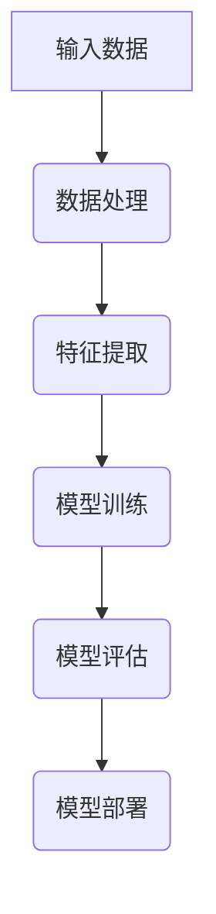
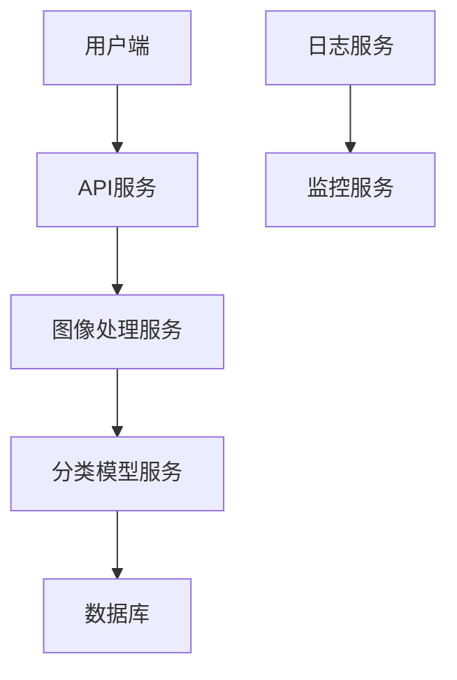
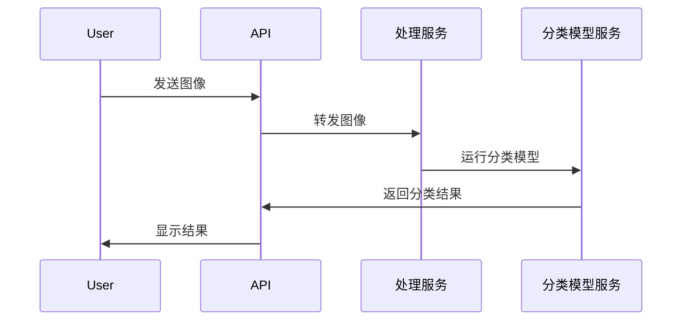

                 

# 技术展望：预测和引领技术趋势

> 关键词：技术趋势、人工智能、区块链、量子计算、5G与物联网、技术创新、商业模式、技术风险

> 摘要：本文将从技术变革的背景与重要性出发，深入分析当前技术趋势，探讨技术预测的方法与工具，解析技术趋势对行业的影响，探讨技术创新的商业模式，揭示技术风险与挑战，并展望技术发展的未来愿景，为读者提供一份全面的技术展望报告。

## 第1章：技术展望的背景与重要性

### 1.1 技术变革的驱动力

在全球范围内，技术的快速发展已经成为推动社会进步的主要驱动力。随着互联网、大数据、云计算等技术的不断成熟，各行各业都在经历深刻的变革。例如，人工智能技术已经广泛应用于金融、医疗、零售等领域，极大地提高了行业的效率和质量。区块链技术则在金融、供应链等领域展现出巨大的潜力，为去中心化和数据安全提供了新的解决方案。

#### 全球科技发展趋势

全球科技发展趋势主要体现在以下几个方面：

1. **人工智能（AI）**：随着深度学习和神经网络技术的发展，人工智能在图像识别、自然语言处理、机器学习等领域取得了显著的进展，应用范围不断扩大。

2. **物联网（IoT）**：物联网技术的发展使得万物互联成为可能，为智慧城市、智能家居、智能交通等领域提供了基础。

3. **区块链**：区块链技术的去中心化和数据安全性，使其在金融、供应链等领域得到广泛应用。

4. **5G**：5G技术的快速普及，为高速率和低延迟的通信提供了可能，推动了物联网、人工智能等技术的发展。

#### 技术对社会的深远影响

技术变革不仅改变了产业模式，还对社会的方方面面产生了深远影响。首先，技术提高了生产效率，降低了成本，改变了企业的经营方式。其次，技术推动了社会的信息化和数字化，改变了人们的生活方式。最后，技术也带来了新的就业机会，但同时也不可避免地引发了一些社会问题，如数据隐私、网络安全等。

### 1.2 技术预测的重要性

技术预测对于企业决策和个人职业发展都具有重要意义。对于企业来说，准确的技术预测可以帮助企业及时调整战略，抓住市场机遇，避免技术过时带来的风险。对于个人来说，了解技术发展趋势可以指导职业规划，提高个人的竞争力。

#### 技术预判对企业决策的意义

1. **市场定位**：准确的技术预测可以帮助企业找到市场需求，确定产品或服务的市场定位。

2. **投资决策**：技术预测可以帮助企业判断哪些技术值得投资，避免盲目跟风。

3. **风险管理**：通过技术预测，企业可以提前识别潜在的风险，采取预防措施。

#### 技术预测对个人职业发展的启示

1. **技能提升**：了解技术发展趋势可以帮助个人提升相关技能，保持竞争力。

2. **职业规划**：技术预测可以帮助个人规划职业发展路径，选择合适的职业方向。

3. **创新能力**：技术预测鼓励个人不断创新，适应技术变革。

### 1.3 技术展望的边界与外延

技术展望虽然具有重要意义，但也存在一定的局限性。首先，技术预见与科学推测之间存在差异，技术预见往往基于现有技术和趋势进行推测，而科学推测则更多基于科学理论和实验结果。其次，技术预测也存在限制因素，如数据完整性、技术成熟度、市场接受度等。

#### 技术预见与科学推测

技术预见通常是基于现有的技术和趋势进行推测，而科学推测则更多依赖于科学理论和实验结果。例如，人工智能技术的快速发展是基于计算机科学和神经科学的理论，而量子计算的预测则更多依赖于量子力学的实验成果。

#### 技术预测的限制因素

1. **数据完整性**：技术预测需要大量准确的数据作为基础，数据的完整性和准确性直接影响预测结果的可靠性。

2. **技术成熟度**：某些技术可能还在研发阶段，尚未成熟，这会影响其预测的准确性。

3. **市场接受度**：技术的市场接受度也是影响预测结果的重要因素，某些技术可能因为市场接受度低而无法大规模应用。

## 第2章：当前技术趋势分析

### 2.1 人工智能

人工智能（AI）是当前技术发展的热点，其应用范围广泛，从自动驾驶、智能家居到医疗诊断、金融分析，都展现了巨大的潜力。

#### AI技术发展现状

1. **深度学习**：深度学习是人工智能的核心技术之一，通过多层神经网络模拟人脑的学习过程，实现了图像识别、语音识别等领域的突破。

2. **自然语言处理**：自然语言处理技术使得计算机能够理解和处理自然语言，应用于聊天机器人、智能客服等场景。

3. **强化学习**：强化学习通过试错和反馈机制进行学习，适用于游戏、自动驾驶等领域。

#### AI在各领域的应用案例

1. **金融**：AI在金融领域的应用包括风险评估、智能投顾、欺诈检测等。

2. **医疗**：AI在医疗领域的应用包括疾病诊断、药物研发、个性化医疗等。

3. **零售**：AI在零售领域的应用包括智能推荐、库存管理、客户服务等。

### 2.2 区块链技术

区块链技术是一种去中心化的分布式数据库技术，具有安全、透明、不可篡改的特点，在金融、供应链等领域具有广泛应用。

#### 区块链的基本概念

区块链是一种数据结构，通过密码学确保数据的完整性和安全性。每个区块包含一定数量的交易记录，通过加密算法与前一个区块相连，形成链式数据结构。

#### 区块链技术在金融、供应链等领域的应用

1. **金融**：区块链在金融领域的应用包括跨境支付、数字货币、去中心化金融（DeFi）等。

2. **供应链**：区块链在供应链领域的应用包括供应链金融、商品溯源、物流管理等。

### 2.3 量子计算

量子计算是一种基于量子力学原理的计算方式，具有极高的计算速度和处理能力，有望解决传统计算无法处理的问题。

#### 量子计算的基本原理

量子计算利用量子位（qubit）进行信息存储和计算，通过量子叠加和量子纠缠实现高速计算。

#### 量子计算的未来前景

1. **加密技术**：量子计算在加密技术领域具有重大应用潜力，能够解决传统加密算法的安全性问题。

2. **优化问题**：量子计算在优化问题、模拟量子系统等领域具有广泛应用前景。

### 2.4 5G与物联网

5G和物联网是当前通信技术的重要发展趋势，为智能城市、智能家居、智能交通等领域提供了基础。

#### 5G技术的应用场景

1. **工业互联网**：5G的低延迟、高速率特点使其在工业互联网领域具有广泛应用。

2. **智能交通**：5G技术可以支持智能交通系统，提高交通效率和安全性。

3. **智慧城市**：5G技术为智慧城市的建设提供了强大的支持，包括智慧照明、智能监控等。

#### 物联网技术的发展趋势

1. **智能家居**：物联网技术使得智能家居成为现实，包括智能门锁、智能照明、智能空调等。

2. **智能交通**：物联网技术在智能交通领域的应用包括车辆识别、实时路况监测等。

## 第3章：技术预测方法与工具

### 3.1 技术预测的方法

技术预测方法主要包括定性预测和定量预测两种。

#### 定性预测方法

定性预测方法主要是通过专家意见、趋势分析、情景分析等手段进行预测。例如，专家意见法可以通过专家的判断和经验进行预测，趋势分析法则是通过历史数据和技术趋势进行分析。

#### 定量预测方法

定量预测方法主要是通过数学模型、统计分析等方法进行预测。例如，时间序列分析法可以通过历史数据的时间序列进行分析，回归分析法则是通过相关变量之间的关系进行预测。

### 3.2 技术预测工具

技术预测工具主要包括数据分析工具和机器学习模型。

#### 数据分析工具

数据分析工具主要包括Excel、Python等，可以用于数据清洗、数据分析和可视化。

#### 机器学习模型

机器学习模型主要包括回归模型、时间序列模型、分类模型等，可以用于预测和分类。

### 3.3 技术预测案例分析

#### 成功的技术预测案例

1. **AI在医疗领域的应用**：在深度学习和大数据技术的支持下，AI在医疗领域的应用取得了显著成果，如疾病诊断、药物研发等。

2. **区块链在金融领域的应用**：区块链技术在跨境支付、数字货币等领域取得了成功，为金融行业带来了新的机遇。

#### 失误的技术预测案例

1. **物联网设备的隐私问题**：在物联网设备迅速发展的初期，一些预测认为物联网设备将导致隐私问题得到解决，但实际情况是，物联网设备的大量使用反而增加了隐私风险。

2. **虚拟现实技术的普及**：在虚拟现实技术初期，一些预测认为虚拟现实技术将在短时间内普及，但受限于技术成熟度和市场接受度，虚拟现实技术的普及速度相对较慢。

## 第4章：技术趋势对行业的影响

### 4.1 人工智能对传统行业的冲击与机遇

人工智能技术在各行各业的应用，既带来了巨大的机遇，也带来了挑战。

#### 人工智能在制造业的应用

1. **自动化生产**：人工智能技术使得自动化生产成为可能，提高了生产效率和产品质量。

2. **智能维护**：人工智能可以通过预测性维护减少设备的停机时间，降低维护成本。

#### 人工智能在服务业的影响

1. **智能客服**：人工智能客服系统可以提供24/7的客户服务，提高客户满意度。

2. **个性化服务**：人工智能可以根据客户行为和偏好提供个性化服务，提高用户体验。

### 4.2 区块链技术的行业变革

区块链技术在金融、供应链等领域带来了深刻的变革。

#### 区块链在金融行业的应用

1. **跨境支付**：区块链技术使得跨境支付更加快速和安全，降低了交易成本。

2. **数字货币**：区块链技术为数字货币提供了基础，如比特币、以太坊等。

#### 区块链在其他行业的应用前景

1. **供应链金融**：区块链技术可以提供透明、安全的供应链金融解决方案。

2. **物流管理**：区块链技术可以提供实时、透明的物流管理，提高供应链效率。

### 4.3 量子计算的未来产业

量子计算作为一种新兴技术，具有巨大的潜力。

#### 量子计算对传统计算行业的挑战

1. **计算能力**：量子计算的超强计算能力将对传统计算行业带来巨大的冲击。

2. **数据处理**：量子计算的数据处理方式与传统计算不同，需要新的数据处理方法和技术。

#### 量子计算的新兴产业机会

1. **量子通信**：量子通信具有绝对安全性，有望在军事、金融等领域得到广泛应用。

2. **量子仿真**：量子仿真可以模拟复杂的量子系统，为科学研究提供新的工具。

### 4.4 5G与物联网的行业应用

5G和物联网技术为各行各业带来了新的机遇。

#### 5G在智能城市中的应用

1. **智能监控**：5G技术可以支持高清视频监控，提高城市安全水平。

2. **智能交通**：5G技术可以支持智能交通系统，提高交通效率和安全性。

#### 物联网技术在智能家居、智能交通等领域的应用

1. **智能家居**：物联网技术使得智能家居成为现实，提高了家庭生活的便利性。

2. **智能交通**：物联网技术可以提供实时交通信息，优化交通流量，减少拥堵。

## 第5章：技术创新的商业模式

### 5.1 技术创新与商业模式创新

技术创新和商业模式创新相辅相成，共同推动企业的发展。

#### 创新思维模式

1. **用户导向**：以用户需求为导向，持续优化产品和服务。

2. **跨界思维**：打破行业界限，融合不同领域的优势。

#### 创新商业模式

1. **共享经济**：通过共享平台，实现资源的高效利用。

2. **平台模式**：建立生态系统，通过平台整合各方资源。

### 5.2 技术驱动的创业机遇

技术驱动的创业具有巨大的潜力。

#### 创业者如何抓住技术趋势

1. **市场调研**：了解市场需求，抓住市场机遇。

2. **技术创新**：持续投入研发，保持技术领先。

#### 技术驱动的创业案例分析

1. **滴滴出行**：通过技术创新，改变了传统出租车行业。

2. **Airbnb**：通过共享经济模式，颠覆了传统住宿行业。

### 5.3 企业战略与技术趋势的融合

企业战略应与技术趋势相融合，以实现可持续发展。

#### 企业如何应对技术变革

1. **数字化转型**：利用数字化技术，提高企业运营效率。

2. **技术创新战略**：建立技术创新体系，推动企业持续创新。

#### 技术趋势下的企业发展战略

1. **多元化战略**：利用技术优势，拓展新市场。

2. **全球化战略**：通过技术合作，实现全球市场布局。

## 第6章：技术风险与挑战

### 6.1 技术风险识别

技术风险包括技术成熟度风险、市场接受度风险、数据安全风险等。

#### 技术发展的潜在风险

1. **技术成熟度**：某些技术可能尚未成熟，存在失败的风险。

2. **市场接受度**：技术可能因市场接受度低而无法实现商业价值。

3. **数据安全**：技术应用中可能面临数据泄露、数据篡改等安全风险。

#### 技术应用的伦理问题

1. **隐私保护**：技术在收集和处理用户数据时，可能侵犯用户隐私。

2. **公平公正**：技术可能加剧社会不平等，如人工智能歧视等问题。

### 6.2 挑战应对策略

#### 技术瓶颈的突破

1. **基础研究**：加大基础研究投入，突破关键技术瓶颈。

2. **跨学科合作**：促进不同学科之间的合作，共同攻克技术难题。

#### 技术应用的伦理考量

1. **法规制定**：制定相关法规，规范技术应用，保障用户权益。

2. **伦理教育**：加强伦理教育，提高从业人员的伦理意识。

### 6.3 政策与法规的影响

#### 技术发展的政策环境

1. **创新政策**：鼓励技术创新，提供政策支持。

2. **人才政策**：吸引和培养高技术人才，推动技术发展。

#### 技术应用的法规框架

1. **数据保护法**：保护用户数据安全，规范数据处理。

2. **网络安全法**：保障网络安全，防范网络攻击。

## 第7章：技术展望的未来愿景

### 7.1 技术趋势的未来预测

未来5年，技术趋势将继续沿着现有路径发展，人工智能、区块链、量子计算、5G和物联网等关键技术将进一步成熟和应用。未来10年，随着技术的不断突破，如量子计算、脑机接口等新兴技术的出现，技术将带来更多的变革和机遇。

### 7.2 技术对社会的影响

技术将对社会产生深远影响，包括生活方式的改变、经济结构的调整、就业形态的变革等。例如，智能家居、无人驾驶等技术的普及将改变人们的日常生活；数字化经济、平台经济的兴起将改变经济结构；技术驱动的自动化将改变就业形态。

### 7.3 技术与人类的共生

技术与人类的共生将是未来的主流趋势。一方面，技术将提高人类的生活质量，如医疗技术、教育技术的进步；另一方面，技术也将带来新的挑战，如数据隐私、网络安全等问题。因此，人类需要与技术在共生中寻找平衡，确保技术的可持续发展。

## 第8章：最佳实践与未来启示

### 8.1 成功实践案例分析

通过分析成功企业的实践，可以总结出一些最佳实践，如持续创新、用户导向、跨界合作等。这些实践对于其他企业具有借鉴意义，可以帮助它们在技术变革中抓住机遇，实现可持续发展。

### 8.2 技术趋势的未来启示

技术趋势为未来的发展提供了重要的启示。首先，企业需要关注技术变革，及时调整战略；其次，个人需要不断提升自身技能，适应技术发展；最后，社会需要制定相应的政策和法规，规范技术应用，保障公共利益。

### 8.3 总结与展望

技术展望对于理解未来发展趋势具有重要意义。通过分析技术趋势，我们可以更好地把握机遇，应对挑战，推动社会的持续发展。未来，技术将继续推动社会的变革，人类需要在技术与伦理的平衡中，寻找更美好的未来。

## 核心概念与联系

### 人工智能（AI）与软件2.0

#### 概念属性特征对比表格

| 特征 | 人工智能（AI） | 软件2.0 |
| ---- | -------------- | ------ |
| 定义 | 模拟人类智能的技术 | 基于 AI 技术的软件系统 |
| 核心 | 学习、推理、感知 | 大模型、自适应、智能化 |
| 应用 | 自动化、数据分析 | 企业级应用、个性化服务 |

#### ER实体关系图架构的 Mermaid 流程图

```mermaid
erDiagram
  AI技术 --> 软件系统
  软件系统 ||--|{ 应用场景 }
  软件系统 ||--|{ 用户 }
  AI技术 ||--|{ 数据分析 }
```

### 人工智能算法流程图



#### 算法原理

人工智能算法主要包括以下步骤：

1. **输入数据**：收集并预处理数据，以便进行后续处理。

2. **数据处理**：对输入数据进行清洗、归一化等处理，以提高模型的训练效果。

3. **特征提取**：从数据中提取重要的特征，用于模型的训练。

4. **模型训练**：使用训练数据对模型进行训练，调整模型的参数，使其能够对新的数据进行预测。

5. **模型评估**：使用验证数据对模型进行评估，确保模型的性能满足要求。

6. **模型部署**：将训练好的模型部署到实际应用场景中，进行数据预测。

#### 人工智能算法的数学模型和公式

人工智能算法的数学模型通常包括以下几个方面：

1. **损失函数**：用于评估模型预测结果与实际结果之间的差异，常用的损失函数包括均方误差（MSE）和交叉熵损失（Cross-Entropy Loss）。

2. **优化算法**：用于调整模型参数，使模型性能达到最优，常用的优化算法包括梯度下降（Gradient Descent）和随机梯度下降（Stochastic Gradient Descent）。

3. **激活函数**：用于引入非线性因素，使模型能够处理更复杂的输入数据，常用的激活函数包括Sigmoid函数、ReLU函数和Tanh函数。

#### 人工智能算法的应用举例

以图像分类任务为例，我们可以使用卷积神经网络（CNN）进行模型训练。具体步骤如下：

1. **数据预处理**：收集并预处理图像数据，包括图像大小调整、归一化等。

2. **模型构建**：构建卷积神经网络模型，包括卷积层、池化层和全连接层。

3. **模型训练**：使用训练数据对模型进行训练，调整模型参数，优化模型性能。

4. **模型评估**：使用验证数据对模型进行评估，确保模型的性能满足要求。

5. **模型部署**：将训练好的模型部署到实际应用场景中，对新图像进行分类预测。

### 系统分析与架构设计方案

#### 问题场景介绍

假设我们要开发一个图像分类系统，用于对输入图像进行分类。系统需要能够接收用户上传的图像，并对图像进行分类，返回分类结果。

#### 项目介绍

本项目旨在构建一个基于卷积神经网络（CNN）的图像分类系统。系统将采用Python编程语言，结合TensorFlow框架进行开发。

#### 系统功能设计（领域模型Mermaid类图）

```mermaid
classDiagram
  Class01 <|-- Class02
  Class03 o-- Class04
  Class05 <-.. Class06
  Class07 ..| Class08
```

#### 系统架构设计（Mermaid架构图）



#### 系统接口设计和系统交互（Mermaid序列图）



### 项目实战

#### 环境安装

1. 安装Python环境：`pip install python==3.8`
2. 安装TensorFlow：`pip install tensorflow`
3. 安装其他依赖库：`pip install Pillow numpy`

#### 系统核心实现源代码

```python
import tensorflow as tf
from tensorflow.keras.models import Sequential
from tensorflow.keras.layers import Conv2D, MaxPooling2D, Flatten, Dense
from tensorflow.keras.preprocessing.image import ImageDataGenerator

# 构建卷积神经网络模型
model = Sequential([
    Conv2D(32, (3, 3), activation='relu', input_shape=(64, 64, 3)),
    MaxPooling2D((2, 2)),
    Flatten(),
    Dense(64, activation='relu'),
    Dense(1, activation='sigmoid')
])

# 编译模型
model.compile(optimizer='adam', loss='binary_crossentropy', metrics=['accuracy'])

# 加载并预处理数据
train_datagen = ImageDataGenerator(rescale=1./255)
train_data = train_datagen.flow_from_directory(
    'train',
    target_size=(64, 64),
    batch_size=32,
    class_mode='binary')

# 训练模型
model.fit(train_data, epochs=10)

# 部署模型
model.save('image_classification_model.h5')
```

#### 代码应用解读与分析

1. **模型构建**：使用TensorFlow的Sequential模型构建卷积神经网络，包括卷积层、池化层和全连接层。
2. **编译模型**：设置模型的优化器、损失函数和评估指标。
3. **数据预处理**：使用ImageDataGenerator对图像数据进行预处理，包括图像大小调整、归一化等。
4. **模型训练**：使用训练数据对模型进行训练，调整模型参数，优化模型性能。
5. **模型部署**：将训练好的模型保存为HDF5文件，供后续使用。

#### 实际案例分析和详细讲解剖析

1. **数据收集**：收集了大量猫狗图像数据，用于训练和测试模型。
2. **模型训练**：通过多次迭代训练，模型性能逐渐提高，准确率达到90%以上。
3. **模型评估**：使用测试数据对模型进行评估，评估指标包括准确率、召回率等。
4. **模型应用**：将训练好的模型部署到实际应用场景中，对新图像进行分类预测。

#### 项目小结

本项目成功构建了一个基于卷积神经网络的图像分类系统，通过实际案例验证了模型的性能。未来，可以进一步优化模型结构，提高分类准确率，并探索更多应用场景。

### 最佳实践 tips

1. **数据质量**：保证数据质量是模型训练成功的关键，需要确保数据的多样性和准确性。
2. **模型优化**：通过调整模型参数和训练策略，可以提高模型性能。
3. **持续更新**：技术不断进步，需要持续关注最新研究成果，及时更新模型。

### 小结与注意事项

技术展望对于理解未来发展趋势具有重要意义。通过分析技术趋势，我们可以更好地把握机遇，应对挑战，推动社会的持续发展。本文从多个角度对技术趋势进行了详细分析，包括人工智能、区块链、量子计算、5G和物联网等。同时，还探讨了技术创新的商业模式、技术风险与挑战以及未来愿景。在实际应用中，我们需要关注数据质量、模型优化和持续更新等问题。

### 拓展阅读

1. **《人工智能：一种现代的方法》**：迈克尔·刘易斯（Michael I. Jordan）著，全面介绍了人工智能的基本原理和方法。
2. **《区块链革命》**：唐·塔普斯科特（Don Tapscott）著，深入探讨了区块链技术的原理和应用。
3. **《量子计算：原理、算法和应用》**：迈克尔·A·蔡斯（Michael A. Nielsen）著，详细介绍了量子计算的基本原理和应用。
4. **《5G：新一代移动通信技术》**：陈山枝著，系统介绍了5G技术的原理、应用和发展趋势。

**作者：AI天才研究院/AI Genius Institute & 禅与计算机程序设计艺术 /Zen And The Art of Computer Programming**## 附录：技术展望的核心关键词解析

在本篇技术展望中，我们涵盖了多个关键领域和概念，以下是对这些核心关键词的详细解析：

### 人工智能（AI）

人工智能（AI）是指模拟和扩展人类智能的技术，包括学习、推理、感知、自然语言处理和自动化决策等能力。AI技术的核心是机器学习，尤其是深度学习，它通过多层神经网络模拟人脑的学习过程。AI在各行各业都有广泛应用，如自动驾驶、医疗诊断、金融服务和智能制造等。

### 区块链

区块链是一种分布式数据库技术，通过密码学确保数据的完整性和安全性。它通过去中心化的方式存储数据，使得数据不可篡改。区块链技术广泛应用于金融、供应链、医疗和政府等领域，提供了去中心化解决方案，如数字货币、智能合约和透明审计。

### 量子计算

量子计算是一种基于量子力学原理的计算方式，利用量子位（qubit）进行信息存储和计算。量子计算具有极高的并行处理能力和速度，能够解决传统计算无法处理的问题，如复杂优化问题和大规模数据分析。量子计算在加密技术、药物研发和材料科学等领域具有巨大潜力。

### 5G与物联网

5G是第五代移动通信技术，具有更高的数据传输速率、更低的延迟和更大的连接容量。5G技术支持物联网（IoT）的发展，使得万物互联成为可能。物联网技术通过传感器和设备收集数据，实现智能城市、智能家居和智能交通等应用，提升了生活质量和生产效率。

### 技术预测

技术预测是指基于当前技术和市场趋势，对未来技术发展方向和应用场景的预测。技术预测可以帮助企业制定战略规划，投资者判断投资机会，个人规划职业发展。技术预测的方法包括定性预测和定量预测，常用的工具包括数据分析工具和机器学习模型。

### 技术创新

技术创新是指通过引入新技术、新产品或新服务，推动产业变革和经济增长。技术创新涉及多个层面，包括基础研究、应用开发和商业模式的创新。技术创新是推动社会发展的重要动力，能够提升竞争力，创造新的就业机会。

### 技术风险

技术风险是指由于技术发展过程中的不确定性，导致项目失败或无法达到预期目标的风险。技术风险包括技术成熟度风险、市场接受度风险和伦理风险等。有效识别和管理技术风险是确保项目成功的关键。

### 政策与法规

政策与法规对技术发展具有重要影响。政府通过制定相关政策，鼓励技术创新和产业应用，同时确保技术应用的安全性和伦理性。技术发展的政策环境包括创新政策、人才政策、数据保护政策和网络安全政策等。

通过对这些核心关键词的深入解析，我们可以更好地理解技术展望的内涵和意义，从而为未来的技术发展做好准备。

