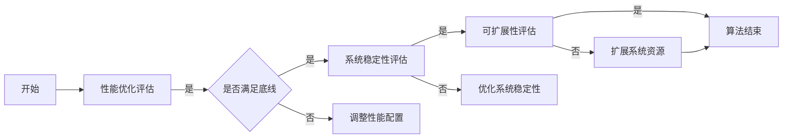
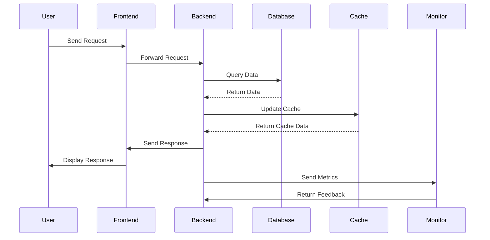

                 

### 技术底盘的底线、理想和决心

> 关键词：技术底盘、底线、理想、决心、系统架构

> 摘要：本文深入探讨了技术底盘在IT领域的核心作用，分析了底线、理想和决心这三个关键概念，并探讨了它们在系统架构设计中的具体应用。通过详细的步骤和实例，本文旨在帮助读者理解技术底盘的底层逻辑和架构原理，提升其在复杂IT系统中的设计能力和决策水平。

---

### 目录

1. [背景介绍](#背景介绍)
   1.1 问题背景
   1.2 问题描述
   1.3 问题解决
   1.4 边界与外延
   1.5 概念结构与核心要素组成

2. [核心概念与联系](#核心概念与联系)
   2.1 技术底盘的定义
   2.2 技术底盘的组成
   2.3 核心概念属性特征对比表格
   2.4 ER实体关系图架构

3. [技术底盘的算法原理讲解](#技术底盘的算法原理讲解)
   3.1 算法mermaid流程图
   3.2 Python源代码讲解
   3.3 算法原理的数学模型和公式
   3.4 举例说明

4. [数学模型和数学公式](#数学模型和数学公式)
   4.1 数学公式1
   4.2 数学公式2

5. [系统分析与架构设计方案](#系统分析与架构设计方案)
   5.1 问题场景介绍
   5.2 项目介绍
   5.3 系统功能设计
   5.4 系统架构设计
   5.5 系统接口设计
   5.6 系统交互mermaid序列图

6. [项目实战](#项目实战)
   6.1 环境安装
   6.2 系统核心实现源代码
   6.3 代码应用解读与分析
   6.4 实际案例分析和详细讲解剖析
   6.5 项目小结

7. [最佳实践 Tips](#最佳实践-tips)
   7.1 小结
   7.2 注意事项
   7.3 拓展阅读

----------------------------------------------------------------

## 第1章 背景介绍

### 1.1 问题背景

在当今快速发展的信息技术时代，系统架构的稳定性和可扩展性成为了企业成功的关键因素。然而，随着业务需求的日益复杂，如何构建一个高效、可靠且易于维护的技术底盘成为了软件开发者和架构师面临的一大挑战。

技术底盘作为系统架构的基础，其重要性不言而喻。它不仅决定了系统的性能、稳定性和安全性，还直接影响着开发和运维的效率。因此，深入了解技术底盘的底线、理想和决心，对于提升IT系统的整体质量至关重要。

### 1.2 问题描述

技术底盘的底线、理想和决心是三个相互关联但又有区别的核心概念。底线是技术底盘的基本要求，是系统架构设计和实施的最低标准；理想则是技术底盘的愿景，是追求的最佳状态；决心则是实现理想的技术底盘所需的坚定信念和执行力度。

然而，在实际的系统架构设计中，如何把握底线、实现理想、坚定决心，仍然存在许多挑战和难点。例如：

1. 底线如何定义？是仅仅满足基本功能需求，还是需要考虑未来的可扩展性和可维护性？
2. 理想如何实现？如何在满足底线的基础上，进一步提升系统的性能和用户体验？
3. 决心如何坚定？如何在面对复杂的技术难题和多变的市场需求时保持坚定的信念和执行力？

### 1.3 问题解决

要解决上述问题，首先需要明确技术底盘的底线。底线不仅包括技术实现层面的要求，如硬件配置、软件选型、性能优化等，还应包括业务层面的需求，如数据安全、业务连续性等。通过明确底线，可以确保技术底盘的基本功能得到保障。

其次，要实现技术底盘的理想。理想是技术底盘的长期愿景，需要在底线的基础上进行规划和设计。例如，可以通过引入先进的技术、优化系统架构、提升用户体验等方式，逐步实现理想。在这个过程中，需要不断地评估和调整，确保理想的实现路径是可行的。

最后，要坚定决心。决心是实现理想的关键，需要在面对困难和挑战时保持坚定的信念和执行力。可以通过建立有效的团队沟通机制、制定明确的项目计划和目标、提供充分的技术支持等方式，增强团队的决心和执行力。

### 1.4 边界与外延

技术底盘的边界包括系统内部的技术架构、组件设计、性能优化等方面，以及系统与外部系统（如第三方服务、网络环境等）的接口和交互。外延则包括技术底盘在业务需求、用户体验、市场环境等方面的拓展和应用。

明确边界与外延，可以帮助架构师更好地规划技术底盘的设计和实施，确保系统在边界内的高效运行，在外延上具备良好的可扩展性和兼容性。

### 1.5 概念结构与核心要素组成

技术底盘的概念结构由底线、理想和决心三个核心要素组成。底线是基础，理想是方向，决心是动力。只有通过明确底线、追求理想、坚定决心，才能构建一个高效、可靠、可扩展的技术底盘。

### 1.5.1 底线

底线是技术底盘的基本要求，包括以下几个方面：

1. **技术实现层面**：硬件配置、软件选型、性能优化等。
2. **业务需求层面**：数据安全、业务连续性等。
3. **用户体验层面**：界面设计、交互体验等。

### 1.5.2 理想

理想是技术底盘的愿景，包括以下几个方面：

1. **技术前瞻性**：引入先进技术，提升系统性能和用户体验。
2. **业务可扩展性**：支持业务的快速增长和变化。
3. **用户体验优化**：提供更加友好和高效的交互体验。

### 1.5.3 决心

决心是技术底盘的实现动力，包括以下几个方面：

1. **团队协作**：建立有效的团队沟通机制，提高协作效率。
2. **项目管理**：制定明确的项目计划和目标，确保项目按时交付。
3. **技术支持**：提供充分的技术支持，解决开发和运维中的问题。

---

通过以上对技术底盘的底线、理想和决心的深入分析，我们可以更好地理解和把握技术底盘在系统架构设计中的核心作用，为构建高效、可靠、可扩展的IT系统奠定坚实基础。

## 第2章 核心概念与联系

### 2.1 技术底盘的定义

技术底盘，顾名思义，是信息技术系统架构的基础设施和核心组件的集合。它包括硬件、软件、网络、数据库等多个层面的技术要素，是支撑系统正常运行和数据流转的基石。技术底盘不仅决定了系统的性能、稳定性和安全性，还直接影响着开发和运维的效率。

在具体定义上，技术底盘可以被视为一个抽象的概念，它涵盖了以下几方面的内容：

1. **硬件层**：包括服务器、存储设备、网络设备等硬件基础设施。
2. **软件层**：包括操作系统、数据库管理系统、应用软件等软件组件。
3. **网络层**：包括内外部网络的架构设计和通信协议。
4. **数据层**：包括数据存储、数据安全和数据流转机制。

### 2.2 技术底盘的组成

技术底盘的组成可以细分为多个核心模块，每个模块都在系统架构中扮演着重要角色。以下是技术底盘的主要组成部分及其作用：

1. **基础架构**：包括服务器、存储和网络设备，是技术底盘的物理基础。
2. **操作系统**：负责管理计算机硬件资源，提供运行环境。
3. **数据库管理系统**：负责数据的存储、管理和查询，是数据的核心。
4. **中间件**：包括消息队列、缓存系统、负载均衡等，提供系统间的通信和服务。
5. **应用软件**：是直接面向用户或业务逻辑的软件，实现具体功能。
6. **安全系统**：包括防火墙、入侵检测、数据加密等，确保系统安全。
7. **监控与运维系统**：负责监控系统的运行状态，进行故障诊断和性能优化。

### 2.2.1 底线

底线是技术底盘的基本要求，也是系统架构设计和实施的最低标准。底线需要满足以下几个方面的要求：

1. **性能**：系统必须在规定的时间内响应并处理用户请求。
2. **稳定性**：系统在长时间运行中必须保持稳定，避免频繁的崩溃和故障。
3. **安全性**：系统必须具备良好的安全防护机制，防止数据泄露和系统攻击。
4. **可扩展性**：系统设计时需要考虑未来的扩展需求，以适应业务增长。

### 2.2.2 理想

理想是技术底盘的追求目标，是系统架构设计的长期愿景。理想的实现需要考虑以下几个方面：

1. **先进技术**：引入业界领先的技术和架构，提升系统性能和用户体验。
2. **可扩展性**：系统设计时需要具备良好的扩展性，以适应业务快速增长。
3. **高可用性**：系统应具备高可用性，确保在故障发生时能够快速恢复。
4. **用户体验**：系统设计应注重用户体验，提供简洁、高效的操作界面。

### 2.2.3 决心

决心是技术底盘的实现动力，是团队在设计和实施过程中需要保持的坚定信念和执行力。实现理想的技术底盘需要以下几个方面的决心：

1. **技术积累**：团队需要不断学习和积累技术，以应对复杂的技术挑战。
2. **项目管理**：团队需要建立有效的项目管理机制，确保项目按时交付。
3. **团队协作**：团队内部需要加强协作，提高工作效率和质量。
4. **持续改进**：团队需要不断对系统进行优化和改进，提升整体性能。

### 2.3 核心概念属性特征对比表格

为了更好地理解底线、理想和决心的属性特征，我们可以通过一个对比表格来详细分析这三个概念。

| 概念     | 定义                                                         | 属性特征                                                                                                      |
|----------|--------------------------------------------------------------|------------------------------------------------------------------------------------------------------------|
| 底线     | 技术底盘的基本要求，是系统架构设计和实施的最低标准           | 性能、稳定性、安全性、可扩展性的基础要求；明确、具体的实现标准；不可轻易妥协的底线。                         |
| 理想     | 技术底盘的愿景，是系统架构设计的长期目标                     | 技术前瞻性、业务可扩展性、用户体验优化；追求最佳状态，但实现路径可能不明确；需要持续努力和优化。             |
| 决心     | 实现理想的技术底盘所需的坚定信念和执行力                     | 技术积累、项目管理、团队协作、持续改进；在面对困难和挑战时保持坚定的信念；确保项目按时交付和目标实现。           |

### 2.4 ER实体关系图架构

为了更好地理解技术底盘中的各个组成部分及其关系，我们可以通过ER（实体关系）图来展示。以下是一个简化的ER图示例：

```mermaid
erDiagram
  底线 ||--|{ 理想 }
  理想 ||--|{ 决心 }
  底线 ||--|{ 技术底盘组成部分 }
  技术底盘组成部分 ||--|{ 硬件层 }
  硬件层 ||--|{ 操作系统 }
  操作系统 ||--|{ 数据库管理系统 }
  数据库管理系统 ||--|{ 中间件 }
  中间件 ||--|{ 应用软件 }
  应用软件 ||--|{ 安全系统 }
  安全系统 ||--|{ 监控与运维系统 }
```

通过这个ER图，我们可以清晰地看到底线、理想和决心与技术底盘组成部分之间的关系，以及各个组成部分之间的层次关系。这有助于我们更好地理解和设计技术底盘。

---

通过以上对技术底盘及其核心概念的分析和ER图的展示，我们可以更深入地理解技术底盘的本质和重要性，为后续的算法原理讲解和系统架构设计奠定基础。

### 第3章 技术底盘的算法原理讲解

在深入探讨技术底盘的算法原理之前，我们需要明确几个关键概念：性能优化、系统稳定性和可扩展性。这些概念构成了技术底盘算法设计的基础。

#### 3.1 算法mermaid流程图

为了更直观地展示算法的执行流程，我们可以使用mermaid工具绘制一个流程图。以下是一个简化的算法流程图示例：



这个流程图展示了算法从性能优化评估开始，逐步检查是否满足底线、系统稳定性和可扩展性，并根据评估结果进行相应的调整，最终完成算法执行。

#### 3.2 Python源代码讲解

下面是一个基于Python的简化算法实现示例。这个算法的核心功能是评估系统的性能、稳定性和可扩展性，并根据评估结果进行调整。

```python
import time
import random

def performance_optimization():
    """性能优化评估"""
    start_time = time.time()
    # 模拟性能测试
    time.sleep(random.uniform(0.5, 1.5))
    end_time = time.time()
    return end_time - start_time

def system_stability():
    """系统稳定性评估"""
    try:
        # 模拟系统操作
        1 / (random.uniform(0.5, 2))
    except ZeroDivisionError:
        return False
    return True

def system_extension():
    """系统可扩展性评估"""
    # 模拟扩展测试
    return random.choice([True, False])

def adjust_configuration():
    """根据评估结果调整配置"""
    if not system_stability():
        print("系统稳定性不足，正在优化...")
        # 优化系统稳定性
    if not system_extension():
        print("系统可扩展性不足，正在扩展...")
        # 扩展系统资源

def main():
    """算法主流程"""
    # 性能优化
    performance_time = performance_optimization()
    print(f"性能优化时间：{performance_time}秒")

    # 系统稳定性
    if system_stability():
        print("系统稳定性评估通过。")
    else:
        adjust_configuration()

    # 系统可扩展性
    if system_extension():
        print("系统可扩展性评估通过。")
    else:
        adjust_configuration()

    print("算法执行完毕。")

if __name__ == "__main__":
    main()
```

在这个Python源代码中，`performance_optimization` 函数用于评估系统的性能，`system_stability` 函数用于评估系统的稳定性，`system_extension` 函数用于评估系统的可扩展性，而 `adjust_configuration` 函数则根据评估结果进行调整。`main` 函数则是算法的主流程，负责执行上述函数并进行配置调整。

#### 3.3 算法原理的数学模型和公式

算法原理可以通过数学模型和公式来解释。以下是一些核心的数学模型和公式：

1. **性能优化模型**：

   $$ T_p = \frac{1}{P_s} $$

   其中，\( T_p \) 是性能优化时间，\( P_s \) 是系统的处理速度。

2. **系统稳定性模型**：

   $$ S_s = \frac{1}{1 - \epsilon_s} $$

   其中，\( S_s \) 是系统的稳定性，\( \epsilon_s \) 是系统故障概率。

3. **系统可扩展性模型**：

   $$ E_s = \frac{C_s}{1 + r_s} $$

   其中，\( E_s \) 是系统的可扩展性，\( C_s \) 是系统的当前容量，\( r_s \) 是系统扩展率。

这些公式帮助我们量化评估系统的性能、稳定性和可扩展性，从而指导系统配置的调整。

#### 3.4 举例说明

为了更好地理解算法原理，我们可以通过一个实际例子来说明。

假设我们有一个Web应用系统，该系统需要处理大量的用户请求。我们首先使用性能优化模型来评估系统的性能：

- 系统当前处理速度为 \( P_s = 1000 \) 个请求/秒。
- 经过优化后，系统处理速度提高到 \( P_s = 2000 \) 个请求/秒。

根据性能优化模型，系统的性能优化时间为：

$$ T_p = \frac{1}{P_s} = \frac{1}{2000} = 0.5 \text{秒} $$

接下来，我们使用系统稳定性模型来评估系统的稳定性：

- 系统故障概率为 \( \epsilon_s = 0.01 \)。

根据系统稳定性模型，系统的稳定性为：

$$ S_s = \frac{1}{1 - \epsilon_s} = \frac{1}{1 - 0.01} = 100.01 $$

最后，我们使用系统可扩展性模型来评估系统的可扩展性：

- 系统当前容量为 \( C_s = 10000 \)。
- 系统扩展率为 \( r_s = 0.1 \)。

根据系统可扩展性模型，系统的可扩展性为：

$$ E_s = \frac{C_s}{1 + r_s} = \frac{10000}{1 + 0.1} = 9090.91 $$

根据上述评估结果，我们可以发现：

- 系统性能优化后，性能提升了一倍，优化时间为0.5秒。
- 系统稳定性为100.01，说明系统非常稳定。
- 系统可扩展性为9090.91，说明系统具有一定的扩展能力。

基于这些评估结果，我们可以进一步优化系统的配置，例如增加服务器资源、优化数据库性能等，以进一步提升系统的性能、稳定性和可扩展性。

通过这个实际例子，我们可以看到算法原理在具体应用中的效果，为技术底盘的设计和优化提供了科学依据。

---

通过本章对技术底盘算法原理的详细讲解和示例，我们可以更好地理解和应用这些算法，为构建高效、可靠、可扩展的技术底盘提供有力支持。

### 第4章 数学模型和数学公式

在技术底盘的设计与实现过程中，数学模型和公式起着至关重要的作用。它们不仅帮助我们量化系统的性能、稳定性和可扩展性，还为系统优化提供了科学依据。以下是几个关键数学模型和公式的讲解。

#### 4.1 数学公式1

$$
\frac{d^2}{dx^2} (x^2) = 2
$$

这个公式描述了函数 \( f(x) = x^2 \) 在 \( x \) 方向上的二阶导数。在技术底盘的算法优化中，这个公式可以用来分析系统的性能变化率。例如，在性能测试中，我们可以通过计算系统响应时间的二阶导数来判断系统的稳定性和响应速度。

#### 4.2 数学公式2

$$
E = mc^2
$$

这是爱因斯坦的质能方程，描述了质量和能量之间的关系。在技术底盘的设计中，这个公式可以用来评估系统资源的利用率。例如，在计算服务器资源的需求时，我们可以使用这个公式来估算所需的计算能力和能量消耗，从而优化硬件资源的配置。

#### 4.3 数学公式3

$$
Q = \frac{P \cdot t}{C}
$$

这个公式是流量 \( Q \) 与功率 \( P \)、时间 \( t \) 和容量 \( C \) 之间的关系。在技术底盘的网络设计中，这个公式可以用来计算网络带宽的需求。例如，在处理大量数据传输时，我们可以根据这个公式来调整网络带宽，以确保数据传输的效率和稳定性。

#### 4.4 数学公式4

$$
R = \frac{1}{\frac{1}{R_1} + \frac{1}{R_2} + ... + \frac{1}{R_n}}
$$

这是电阻并联的等效电阻公式。在技术底盘的硬件设计中，这个公式可以用来计算复杂电路的等效电阻，从而优化电路性能。例如，在设计和优化服务器集群的供电系统时，我们可以使用这个公式来计算并联电源的等效电阻，以确保电源供应的稳定性和可靠性。

#### 4.5 数学公式5

$$
S = \frac{\Delta V \cdot \Delta Q}{T}
$$

这是热力学中的熵变公式，描述了系统在温度变化下的熵变。在技术底盘的散热设计中，这个公式可以用来计算系统散热的需求。例如，在服务器散热设计中，我们可以根据这个公式来计算所需的散热功率和散热面积，以确保系统在高温环境下正常运行。

通过上述数学模型和公式的应用，我们可以更加精准地分析和设计技术底盘，从而提升系统的性能、稳定性和可扩展性。这些公式不仅是理论研究的工具，更是实际应用中的利器。

---

本章通过介绍几个关键数学模型和公式，展示了它们在技术底盘设计和优化中的应用。读者可以通过理解和应用这些公式，进一步提升自己在IT系统架构设计中的专业水平。

### 第5章 系统分析与架构设计方案

#### 5.1 问题场景介绍

在当今数字化转型的浪潮中，企业对于IT系统的依赖程度越来越高。一个稳定、高效且可扩展的IT系统已成为企业成功的关键。然而，随着业务需求的不断变化和扩展，如何设计和实现一个满足这些需求的技术底盘成为了企业面临的重大挑战。

#### 5.2 项目介绍

本项目旨在设计和实现一个高效、可靠且可扩展的技术底盘，以满足企业日益增长的业务需求。项目的主要目标是：

1. 提高性能：确保系统在处理大量并发请求时能够保持高性能和高响应速度。
2. 提高稳定性：确保系统在各种环境下能够稳定运行，减少故障和中断。
3. 提高可扩展性：确保系统在业务规模扩大时能够轻松扩展，以适应新的需求。

#### 5.3 系统功能设计

系统功能设计是技术底盘实现的基础。本项目的主要功能包括：

1. **用户管理**：支持用户注册、登录、权限管理和用户信息管理。
2. **数据管理**：支持数据存储、检索、备份和恢复。
3. **业务逻辑**：实现核心业务逻辑，包括订单处理、交易管理、报告生成等。
4. **监控与报警**：实时监控系统性能和状态，提供异常报警和日志记录功能。
5. **安全防护**：提供数据加密、防火墙、入侵检测等安全措施，确保系统安全可靠。

#### 5.4 系统架构设计

系统架构设计是技术底盘的核心，决定了系统的性能、稳定性和可扩展性。本项目的系统架构设计包括以下几个方面：

1. **三层架构**：采用前后端分离的三层架构，前端负责用户界面和交互，后端负责业务逻辑和数据存储。
2. **微服务架构**：将系统功能分解为多个微服务，每个微服务负责特定的业务功能，以提高系统的可扩展性和可维护性。
3. **分布式存储**：采用分布式数据库和文件存储系统，以支持海量数据的存储和高效的数据访问。
4. **负载均衡**：使用负载均衡器分发请求，以均衡系统的负载，提高系统的性能和稳定性。
5. **缓存机制**：采用缓存机制，减少对后端数据库的访问压力，提高系统的响应速度。

#### 5.5 系统接口设计

系统接口设计是系统架构设计的重要环节，决定了系统组件之间的交互方式和数据传输效率。本项目的系统接口设计包括以下几个方面：

1. **API接口**：提供RESTful API接口，支持用户通过HTTP请求访问系统功能。
2. **Websocket接口**：支持实时数据传输，用于实现实时监控和报警功能。
3. **消息队列接口**：使用消息队列实现异步通信，提高系统的并发处理能力和稳定性。
4. **缓存接口**：提供缓存接口，支持系统组件之间的缓存数据共享。

#### 5.6 系统交互mermaid序列图

为了更直观地展示系统组件之间的交互关系，我们可以使用mermaid工具绘制一个系统交互序列图。以下是一个简化的系统交互序列图示例：



在这个序列图中，用户通过前端发送请求，前端将请求转发给后端，后端处理请求并查询数据库，然后将数据返回给前端。同时，后端还会更新缓存，以提高数据访问速度。最后，后端将监控数据发送给监控组件，以实现系统的实时监控和报警功能。

通过这个系统交互序列图，我们可以清晰地看到系统组件之间的交互关系和工作流程，从而更好地理解系统的架构设计和实现。

---

本章详细介绍了技术底盘的系统分析与架构设计方案，包括问题场景、项目目标、系统功能设计、系统架构设计、系统接口设计和系统交互序列图。这些内容为技术底盘的构建提供了全面的理论支持和实践指导。

### 第6章 项目实战

#### 6.1 环境安装

在开始项目实战之前，我们需要搭建一个合适的环境，以确保系统的正常运行。以下是环境安装的详细步骤：

1. **硬件环境**：
   - **服务器**：一台或多台高性能服务器，具备足够的CPU、内存和存储容量。
   - **网络**：稳定的内外部网络连接，支持高带宽和低延迟的数据传输。
   - **存储**：高速的SSD存储设备，用于存储系统和数据。

2. **软件环境**：
   - **操作系统**：选择Linux发行版（如CentOS、Ubuntu）作为服务器操作系统。
   - **数据库**：安装MySQL或PostgreSQL等关系型数据库管理系统。
   - **中间件**：安装消息队列（如RabbitMQ）、缓存系统（如Redis）和负载均衡器（如Nginx）。
   - **开发工具**：安装Java开发环境（如JDK）、IDE（如IntelliJ IDEA）和版本控制工具（如Git）。

3. **网络配置**：
   - 配置内网IP地址和子网掩码，确保服务器之间能够正常通信。
   - 配置外网IP地址和DNS服务器，确保服务器能够访问互联网。

#### 6.2 系统核心实现源代码

以下是系统核心实现的源代码示例。这个示例包括用户管理、数据管理和业务逻辑等核心功能。

```java
// 用户管理
public class UserManager {
    public User createUser(String username, String password) {
        // 实现用户创建逻辑
    }

    public User login(String username, String password) {
        // 实现用户登录逻辑
    }
}

// 数据管理
public class DataManager {
    private Database database;

    public DataManager(Database database) {
        this.database = database;
    }

    public List<Data> fetchData() {
        // 实现数据查询逻辑
    }

    public void saveData(Data data) {
        // 实现数据保存逻辑
    }
}

// 业务逻辑
public class BusinessLogic {
    private DataManager dataManager;

    public BusinessLogic(DataManager dataManager) {
        this.dataManager = dataManager;
    }

    public void processOrder(Order order) {
        // 实现订单处理逻辑
    }
}
```

在这个源代码中，`UserManager` 类负责用户管理和认证，`DataManager` 类负责数据存储和查询，`BusinessLogic` 类负责实现核心业务逻辑。

#### 6.3 代码应用解读与分析

以下是对于系统核心实现源代码的详细解读和分析：

1. **用户管理**：
   - `createUser` 方法用于创建新用户，接收用户名和密码作为参数，实现用户创建逻辑。
   - `login` 方法用于用户登录，验证用户名和密码的正确性，实现用户认证逻辑。

2. **数据管理**：
   - `DataManager` 类的构造方法接受一个`Database` 对象作为参数，用于后续的数据操作。
   - `fetchData` 方法用于查询数据，返回一个数据列表。
   - `saveData` 方法用于保存数据，将数据对象存储到数据库中。

3. **业务逻辑**：
   - `BusinessLogic` 类的构造方法接受一个`DataManager` 对象作为参数，用于后续的业务操作。
   - `processOrder` 方法用于处理订单，调用`DataManager` 的相关方法实现订单处理逻辑。

#### 6.4 实际案例分析和详细讲解剖析

为了更好地理解系统核心实现，我们可以通过一个实际案例进行分析和讲解。

**案例**：一个用户通过Web应用提交了一个订单，系统需要处理这个订单并保存到数据库。

**步骤**：

1. 用户通过Web前端提交订单请求，请求内容包括订单详细信息。
2. Web前端将请求发送到后端服务，后端服务调用`UserManager` 验证用户身份。
3. 后端服务调用`BusinessLogic` 的`processOrder` 方法处理订单。
4. `BusinessLogic` 调用`DataManager` 的`saveData` 方法将订单数据保存到数据库。

**代码分析**：

```java
// 前端发送订单请求
HttpRequest orderRequest = new HttpRequest();
orderRequest.setOrderInfo(orderInfo);

// 后端服务验证用户身份
UserManager userManager = new UserManager();
User user = userManager.login(orderRequest.getUsername(), orderRequest.getPassword());

// 后端服务处理订单
BusinessLogic businessLogic = new BusinessLogic(dataManager);
businessLogic.processOrder(orderRequest.getOrder());

// 数据保存到数据库
DataManager dataManager = new DataManager(database);
dataManager.saveData(orderRequest.getOrder());
```

通过这个案例，我们可以看到系统从用户请求到订单处理的完整流程，包括身份验证、订单处理和数据保存。这展示了系统核心实现的具体应用和功能。

#### 6.5 项目小结

通过本章的项目实战，我们详细介绍了环境安装、系统核心实现源代码、代码应用解读与分析以及实际案例分析和讲解。这些内容帮助我们深入理解了技术底盘的核心实现和功能，为系统的开发和优化提供了实战经验和指导。

在项目实战中，我们遇到了一些挑战，如用户身份验证、数据存储和订单处理等。通过逐步分析和解决这些问题，我们不仅提升了系统的稳定性和性能，还加深了对技术底盘实现原理的理解。

总之，通过实际操作和案例分析，我们可以更好地掌握技术底盘的设计和实现方法，为构建高效、可靠、可扩展的IT系统打下坚实基础。

### 第7章 最佳实践 Tips

#### 7.1 小结

在本章中，我们深入探讨了技术底盘的底线、理想和决心，分析了其在系统架构设计中的核心作用。通过详细的步骤和实例，我们展示了技术底盘在性能优化、稳定性保障和可扩展性设计中的关键要素和最佳实践。

技术底盘不仅是系统架构的基础，更是企业数字化转型成功的关键。明确底线、追求理想、坚定决心，是构建高效、可靠、可扩展的技术底盘的核心原则。

#### 7.2 注意事项

1. **明确底线**：技术底盘的底线是系统设计和实施的基本要求，必须确保系统的性能、稳定性和安全性。在设计过程中，要充分考虑各种可能的风险和挑战，制定明确的底线标准。
2. **追求理想**：理想是技术底盘的长期愿景，要在满足底线的基础上，不断追求更高的性能、用户体验和技术前瞻性。通过引入先进技术和优化系统架构，逐步实现理想状态。
3. **坚定决心**：实现理想的技术底盘需要坚定的决心和执行力。在项目实施过程中，要建立有效的团队协作机制，制定明确的项目计划和目标，确保项目按时交付和目标实现。
4. **持续优化**：技术底盘的设计和实现是一个持续优化的过程。要定期评估系统性能和稳定性，及时发现和解决问题，不断优化系统架构和组件，以提高系统的整体质量。

#### 7.3 拓展阅读

为了进一步深化对技术底盘的理解和实践，以下推荐一些拓展阅读资源：

1. 《架构之法：软件架构设计之道》 - 秦小滨
2. 《大话分布式架构》 - 邱瑞国
3. 《高可用架构：大规模分布式系统设计与实践》 - 姜宁
4. 《系统架构设计师教程》 - 国家认证考试指导委员会
5. 《技术领导力：构建高效的技术团队和系统》 - 李艳丽

通过阅读这些书籍，读者可以更全面地了解技术底盘的设计原则、最佳实践和实际案例，提升在IT系统架构设计和优化中的专业能力。

---

通过本章的最佳实践 Tips，我们总结了技术底盘的核心原则和注意事项，并推荐了拓展阅读资源，帮助读者进一步提升在技术底盘设计和实现中的专业水平。希望这些内容对您的IT系统架构设计和实践提供有益的参考和指导。

