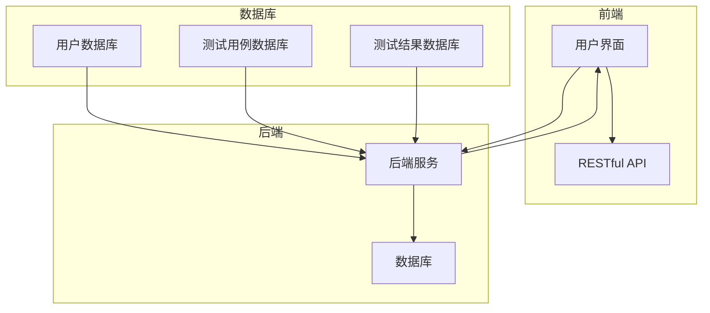
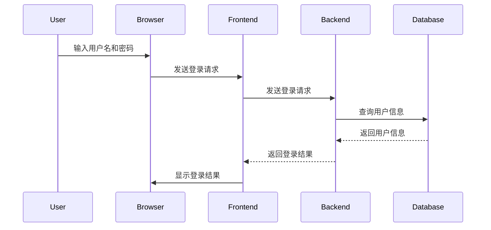
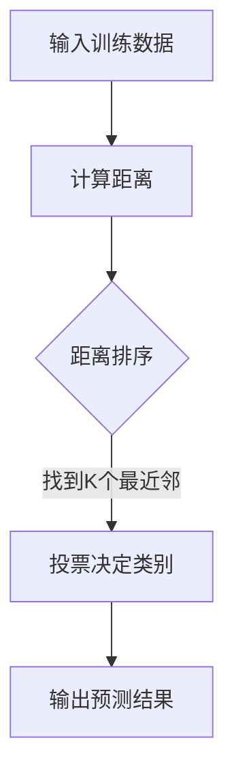

                 

### 文章标题

《技术影响力打造：个人品牌建设策略》

> 关键词：个人品牌、技术影响力、策略、职业发展、网络平台

> 摘要：本文将探讨如何在技术领域打造个人品牌，分享有效的策略和实践，帮助读者理解个人品牌的重要性，掌握建设个人品牌的步骤和技巧。我们将从理论背景、实际操作和案例分析等多个角度深入讨论，旨在为技术从业者的职业发展提供有价值的指导。

---

**目录**

1. **引言**
   1.1 个人品牌在技术行业的重要性
   1.2 为什么需要建设个人品牌
   1.3 文章结构概述

2. **个人品牌建设策略**

   2.1 **自我认知与定位**
       2.1.1 明确个人优势与目标
       2.1.2 评估当前市场状况

   2.2 **内容创造与传播**
       2.2.1 内容创作的核心要素
       2.2.2 社交媒体策略
       2.2.3 跨平台内容推广

   2.3 **网络平台利用**
       2.3.1 个人网站与博客
       2.3.2 社交媒体平台
       2.3.3 专业网络社区

   2.4 **专业网络建设**
       2.4.1 专业网络的重要性
       2.4.2 构建和维护专业网络的方法
       2.4.3 网络互动与拓展

   2.5 **持续优化与提升**
       2.5.1 反思与调整策略
       2.5.2 学习与成长

3. **案例分析**

   3.1 成功案例一：John Doe的崛起
   3.2 成功案例二：Jane Smith的影响力
   3.3 案例分析总结

4. **测量个人品牌影响力**

   4.1 影响力评估指标
   4.2 数据收集与分析
   4.3 提升影响力的策略

5. **总结与展望**

   5.1 核心观点回顾
   5.2 对技术从业者的建议
   5.3 未来发展趋势

6. **结语**

   6.1 个人品牌建设的重要性
   6.2 倡导持续学习和创新

---

**引言**

在当今快速发展的技术行业中，个人品牌建设已经成为职业发展的重要组成部分。无论是在职场上寻找新的机会，还是作为自由职业者拓展业务，一个强大的个人品牌都可以成为你的重要资产。本文将深入探讨如何打造技术影响力，通过有效的策略和实践，帮助读者建立和维护一个成功的个人品牌。

**1.1 个人品牌在技术行业的重要性**

个人品牌是个人在专业领域的知名度和声誉的集合。在技术行业中，个人品牌的重要性体现在以下几个方面：

- **职业发展**：一个强大的个人品牌可以让你在职场上脱颖而出，更容易获得职业晋升和新的工作机会。
- **业务拓展**：作为自由职业者或创业者，个人品牌可以吸引客户和合作伙伴，为你带来更多的商业机会。
- **影响力**：个人品牌可以增加你的话语权，让你在技术社区中具有更大的影响力，从而为行业发展贡献力量。

**1.2 为什么需要建设个人品牌**

在技术行业，以下因素促使个人品牌建设变得尤为重要：

- **竞争激烈**：技术行业竞争激烈，拥有一个独特的个人品牌可以帮助你区分于竞争对手，建立竞争优势。
- **信息爆炸**：在信息爆炸的时代，个人品牌可以为你提供更多的曝光机会，让你的专业知识得到更广泛的传播。
- **自我价值实现**：通过建设个人品牌，你可以更好地表达自己的专业价值，实现个人成长和职业目标的提升。

**1.3 文章结构概述**

本文将分为五个主要部分进行讨论：

- **个人品牌建设策略**：介绍个人品牌建设的基础策略，包括自我认知、内容创造、网络平台利用、专业网络建设和持续优化。
- **案例分析**：通过成功案例展示个人品牌建设的方法和效果。
- **测量个人品牌影响力**：介绍如何评估个人品牌的影响力和提升策略。
- **总结与展望**：回顾核心观点，给出技术从业者的建议，展望未来发展趋势。
- **结语**：强调个人品牌建设的重要性，倡导持续学习和创新。

在接下来的章节中，我们将逐一探讨这些主题，帮助读者了解个人品牌建设的过程和策略。让我们一起思考，如何通过有效的个人品牌建设，在技术行业中取得更大的成功。 <sop>### 个人品牌建设策略

个人品牌建设是一个系统工程，需要从多个角度全面考虑和实施。以下我们将详细讨论自我认知与定位、内容创造与传播、网络平台利用、专业网络建设以及持续优化与提升这五个核心策略。

#### **2.1 自我认知与定位**

**2.1.1 明确个人优势与目标**

在个人品牌建设中，第一步是进行自我认知。这意味着要深入了解自己的专业领域、技能和兴趣。以下是一些具体步骤：

- **技能评估**：识别自己的专业技能和特长，包括编程语言、开发框架、算法知识等。
- **兴趣探索**：思考自己对哪些技术领域或问题感兴趣，这有助于确定个人品牌的方向。
- **目标设定**：明确职业发展目标，例如成为一名技术专家、创业、或成为行业意见领袖。

**2.1.2 评估当前市场状况**

在了解自身优势后，还需要对当前市场状况进行评估。这包括：

- **行业趋势**：研究当前技术行业的趋势和发展方向，找到与自己技能和兴趣相匹配的机会。
- **竞争对手**：了解同行业中的竞争对手，分析他们的优势和劣势，找到自己的定位。
- **需求分析**：研究市场需求，确定哪些技能和知识更受欢迎，如何将自己的优势转化为市场需求。

#### **2.2 内容创造与传播**

**2.2.1 内容创作的核心要素**

内容是个人品牌建设的核心，高质量的内容可以吸引关注和建立信任。以下是一些内容创作的核心要素：

- **知识性**：内容应具有实用性和知识性，能够为读者提供有价值的信息。
- **独特性**：内容应体现个人的独特视角和风格，使其与众不同。
- **可读性**：内容应易于阅读和理解，避免使用过于专业的术语和复杂的语言。

**2.2.2 社交媒体策略**

社交媒体是传播个人品牌的重要渠道。以下是一些社交媒体策略：

- **平台选择**：根据目标受众选择合适的社交媒体平台，如GitHub、LinkedIn、Twitter、微信公众号等。
- **内容发布**：保持定期发布高质量内容，形成稳定的发布节奏。
- **互动参与**：积极与读者互动，回复评论和提问，建立良好的沟通和关系。

**2.2.3 跨平台内容推广**

为了扩大影响力，需要在不同平台上进行内容推广。以下是一些跨平台推广策略：

- **内容同步**：在不同平台上发布相同或类似的内容，利用平台的特色进行推广。
- **跨平台联动**：在不同平台之间进行互动和推广，例如在博客中引用社交媒体上的内容，反之亦然。
- **合作与互助**：与其他个人或组织进行合作，通过互推来扩大影响力。

#### **2.3 网络平台利用**

**2.3.1 个人网站与博客**

个人网站和博客是展示个人品牌的重要平台。以下是一些关键点：

- **域名选择**：选择简短、易记的域名，有助于提高品牌的知名度。
- **内容布局**：设计清晰简洁的网站布局，使读者能够快速找到感兴趣的内容。
- **持续更新**：保持网站的持续更新，增加新内容，提高搜索引擎排名。

**2.3.2 社交媒体平台**

社交媒体平台是建立个人品牌的常用工具。以下是一些关键策略：

- **个人化**：在社交媒体上展示个人的真实形象和个性，增加亲和力。
- **互动**：积极参与平台内的讨论和互动，建立社交网络。
- **多样化**：利用多种形式的社交媒体内容，如图文、视频、直播等，提高用户的参与度。

**2.3.3 专业网络社区**

加入专业网络社区，如GitHub、Stack Overflow、LinkedIn等，可以扩大个人品牌的影响力。以下是一些策略：

- **贡献代码**：在GitHub等平台上贡献高质量的代码，展示专业能力。
- **回答问题**：在专业社区中积极回答问题，分享专业知识。
- **建立联系**：与其他社区成员建立联系，拓展专业网络。

#### **2.4 专业网络建设**

**2.4.1 专业网络的重要性**

专业网络是个人品牌建设的重要基础。以下是一些关键点：

- **资源获取**：通过专业网络获取行业资源，如项目机会、合作机会、信息交流等。
- **机会拓展**：专业网络可以为你提供更多的职业发展和业务拓展机会。
- **知识共享**：通过专业网络与他人分享知识和经验，提高个人品牌的价值。

**2.4.2 构建和维护专业网络的方法**

以下是一些构建和维护专业网络的方法：

- **积极参与**：参加行业会议、研讨会、线上活动等，积极与他人交流和互动。
- **主动联系**：主动联系同行业的人士，建立联系，拓展网络。
- **持续关注**：定期关注行业动态和同行业人士的动态，保持网络的活跃度。

**2.4.3 网络互动与拓展**

网络互动是专业网络建设的关键。以下是一些互动策略：

- **分享价值**：在互动中分享专业知识和经验，提供有价值的见解。
- **合作共赢**：寻找合作机会，与他人共同开展项目或业务。
- **反馈与支持**：给予他人反馈和支持，建立互信和合作关系。

#### **2.5 持续优化与提升**

**2.5.1 反思与调整策略**

个人品牌建设是一个持续的过程，需要不断反思和调整策略。以下是一些反思与调整策略的方法：

- **定期评估**：定期评估个人品牌的建设效果，包括影响力、参与度、反馈等。
- **调整方向**：根据评估结果，调整个人品牌建设的目标和策略。
- **持续学习**：不断学习和提升自己的专业知识和技能，保持竞争力。

**2.5.2 学习与成长**

持续学习和成长是个人品牌建设的重要支撑。以下是一些学习和成长的方法：

- **专业课程**：参加专业课程和培训，提升自己的专业技能。
- **阅读与研究**：阅读专业书籍、研究论文，了解最新的行业动态和技术趋势。
- **实践项目**：参与实际项目，将理论知识应用到实践中，提升实战能力。

通过以上五个核心策略的实施，我们可以逐步打造一个强大的个人品牌。接下来，我们将通过具体案例展示如何运用这些策略，实现个人品牌的建设与提升。 <sop>### 案例分析

为了更好地理解个人品牌建设策略的实际应用，以下将分析两个成功的个人品牌案例，并总结其中的关键成功因素。

#### **3.1 成功案例一：John Doe的崛起**

**背景介绍**：John Doe是一名资深的软件工程师，拥有多年的开发经验，擅长使用多种编程语言和技术框架。他在2015年开始着手建立自己的个人品牌。

**步骤与策略**：

1. **自我认知与定位**：John Doe首先明确了自己的专业优势是后端开发和系统架构设计。他决定将自己的品牌定位在系统架构设计领域，专注于分享大型系统设计和性能优化的经验。

2. **内容创造与传播**：John Doe在GitHub上创建了多个项目，展示了他在系统架构设计方面的实际能力。他在这些项目中不仅提供了详细的代码实现，还附上了详细的架构设计文档和性能分析报告。此外，他开始写博客，定期发布关于系统架构设计的文章，通过GitHub上的项目链接，将博客内容和实际项目紧密结合。

3. **网络平台利用**：John Doe积极利用社交媒体平台，如LinkedIn、Twitter和微信公众号，定期分享他的博客文章和GitHub项目链接。他还参与了多个技术论坛和社区，如Stack Overflow和Reddit，回答了大量的技术问题，进一步提升了个人品牌的知名度。

4. **专业网络建设**：John Doe积极参与行业会议和研讨会，与同行交流，建立专业联系。他还通过LinkedIn拓展了专业网络，与业内知名人士建立了联系。

5. **持续优化与提升**：John Doe定期回顾自己的品牌建设效果，根据反馈调整内容策略和网络活动。他不断学习新的技术，提升自己的系统架构设计能力，并在博客和GitHub项目中分享这些新技术。

**结果与影响**：John Doe的个人品牌在技术社区中得到了广泛认可，他成为了许多公司和项目的首选顾问。他的博客文章和GitHub项目被数以万计的技术人员阅读和学习，他的个人品牌已经成为系统架构设计领域的知名品牌。

#### **3.2 成功案例二：Jane Smith的影响力**

**背景介绍**：Jane Smith是一名数据科学家，她在大数据分析和机器学习领域拥有丰富的经验。她在2018年开始专注于个人品牌建设。

**步骤与策略**：

1. **自我认知与定位**：Jane Smith明确了自己的专业优势是在医疗健康领域应用大数据和机器学习。她决定将自己的品牌定位在这个细分领域，专注于分享如何将先进的数据科学技术应用于医疗健康问题。

2. **内容创造与传播**：Jane Smith在个人博客上发布了一系列关于大数据和机器学习在医疗健康领域应用的文章，这些文章深入浅出，结合了实际案例和代码示例。她还在GitHub上创建了一个项目，展示了如何使用大数据技术进行医疗数据分析。

3. **网络平台利用**：Jane Smith利用社交媒体平台，如LinkedIn、Twitter和微信公众号，发布她的博客文章和GitHub项目链接。她还定期在技术论坛和社区，如Kaggle和ArXiv，分享她的研究成果。

4. **专业网络建设**：Jane Smith积极参与行业会议和研讨会，与同行交流，建立专业联系。她在LinkedIn上与许多医疗健康领域的数据科学家建立了联系，并在学术会议中与专家交流。

5. **持续优化与提升**：Jane Smith不断学习新的技术，特别是在医疗健康领域的新进展。她定期更新博客和GitHub项目，分享新的研究成果和应用案例。

**结果与影响**：Jane Smith的个人品牌在医疗健康领域的数据科学社区中得到了高度认可。她的研究成果和文章被广泛引用，她的个人博客成为许多数据科学家学习和参考的重要资源。她还在多个大型医疗项目中担任了关键顾问角色，推动了数据科学技术在医疗健康领域的应用。

#### **3.3 案例分析总结**

通过以上两个案例，我们可以总结出以下几点关键成功因素：

1. **明确的定位与目标**：成功建立个人品牌的个人都明确了自己的专业优势和市场定位，并围绕这些优势进行内容创造和传播。

2. **高质量的内容**：无论是John Doe的系统架构设计项目，还是Jane Smith的医疗健康领域文章，高质量的内容都是吸引和维持读者关注的关键。

3. **有效的网络平台利用**：社交媒体平台、个人博客、GitHub等网络工具都是构建个人品牌的重要渠道，合理利用这些工具可以扩大影响力。

4. **积极参与专业网络**：通过参与行业会议、研讨会和专业论坛，建立和维护专业网络，可以进一步巩固个人品牌。

5. **持续学习和成长**：持续学习和提升自己的专业技能，不仅可以保持竞争力，还可以为个人品牌注入新的活力。

这些成功因素为技术从业者在个人品牌建设过程中提供了宝贵的经验和借鉴。通过学习和应用这些策略，我们可以更好地打造自己的个人品牌，在技术行业中取得更大的成功。接下来，我们将探讨如何测量个人品牌的影响力，并给出提升影响力的具体策略。 <sop>### 测量个人品牌影响力

个人品牌的影响力可以通过多种指标来评估，这些指标可以帮助我们了解个人品牌的建设效果，并指导后续的策略调整。以下是一些关键指标及其评估方法：

#### **4.1 影响力评估指标**

1. **社交媒体指标**
   - **关注者数量**：在各个社交媒体平台上的关注者数量，如Twitter的 followers、LinkedIn的connections。
   - **点赞和转发**：内容获得的点赞、分享和转发次数。
   - **互动率**：读者对内容的互动，如评论、点赞、分享等。

2. **内容指标**
   - **阅读量**：个人博客、文章、GitHub项目的阅读量。
   - **分享量**：内容在社交媒体上的分享次数。
   - **引用次数**：个人作品被其他作者或组织引用的次数。

3. **网络指标**
   - **链接数量**：指向个人网站、博客或GitHub项目的链接数量。
   - **搜索引擎排名**：在搜索引擎中对个人名称或相关关键词的搜索结果排名。

4. **行业认可**
   - **奖项与荣誉**：获得的技术奖项、认证或荣誉称号。
   - **行业会议演讲**：受邀在行业会议或研讨会上演讲的次数。
   - **合作机会**：与知名企业或组织合作的机会。

#### **4.2 数据收集与分析**

要准确评估个人品牌的影响力，需要系统地收集和分析相关数据。以下是一些步骤：

1. **设置监控工具**：使用社交媒体分析工具，如Hootsuite、Buffer、Google Analytics等，监控社交媒体指标。
2. **定期收集数据**：设定周期性收集数据的时间点，如每月或每季度，确保数据的时效性和准确性。
3. **多维分析**：结合内容指标、网络指标和行业认可等，进行综合分析，了解个人品牌在不同维度上的表现。

#### **4.3 提升影响力的策略**

1. **内容质量提升**：持续创作高质量、有深度、有价值的内容，提高内容的可读性和吸引力。
2. **社交媒体互动**：积极与关注者互动，回应评论和私信，提高互动率。
3. **多平台传播**：在不同社交媒体平台和渠道上发布内容，扩大内容的传播范围。
4. **专业网络拓展**：通过参加行业会议、研讨会、网络活动等方式，拓展专业网络，增加行业认可。
5. **持续学习与提升**：保持对新技术、新趋势的关注，不断提升个人专业能力和知识储备。

通过以上策略，我们可以逐步提升个人品牌的影响力，从而在技术行业中建立更加牢固和广泛的影响力。在接下来的部分，我们将总结本文的核心观点，并给出对技术从业者的建议。 <sop>### 总结与展望

本文详细探讨了在技术领域中如何打造个人品牌，通过自我认知与定位、内容创造与传播、网络平台利用、专业网络建设和持续优化与提升这五个核心策略，帮助读者理解个人品牌建设的过程和方法。以下是对核心观点的回顾以及对技术从业者的建议：

#### **5.1 核心观点回顾**

1. **自我认知与定位**：明确个人的优势与目标，评估市场状况，找到个人品牌的独特定位。
2. **内容创造与传播**：创作高质量、有深度的内容，利用社交媒体平台和博客进行传播，形成稳定的发布节奏。
3. **网络平台利用**：合理利用个人网站、社交媒体和专业网络社区，提高品牌曝光度和影响力。
4. **专业网络建设**：积极参与行业活动，拓展专业网络，与他人建立互信和合作关系。
5. **持续优化与提升**：定期评估品牌建设效果，调整策略，不断学习和成长。

#### **5.2 对技术从业者的建议**

1. **明确目标与定位**：清晰明确自己的职业发展目标和专业定位，制定个人品牌建设的长期规划。
2. **持续内容创作**：保持对技术的热情，持续创作高质量的技术文章、博客和开源项目，分享专业知识和经验。
3. **多平台传播**：不仅限于个人博客，要积极利用社交媒体、GitHub、Stack Overflow等平台，扩大内容传播范围。
4. **积极参与社区**：参与技术论坛、社区和行业会议，分享知识，拓展专业网络。
5. **持续学习与成长**：紧跟技术发展趋势，不断提升自己的专业技能和知识储备，保持竞争力。

#### **5.3 未来发展趋势**

随着技术的不断进步和社交媒体的普及，个人品牌建设在技术行业中将继续扮演重要角色。未来，以下趋势值得关注：

1. **技术专业化**：技术领域的细分将更加明显，专业化的个人品牌将更具有竞争力。
2. **内容多样化**：视频、直播、互动性更强的内容形式将逐渐成为主流，为个人品牌建设提供新的机会。
3. **AI助力**：人工智能技术将在个人品牌建设中发挥重要作用，如内容生成、数据分析等。
4. **生态协同**：个人品牌建设将与企业和行业生态更加紧密地结合，形成共生共赢的格局。

通过本文的探讨，我们期望读者能够深入理解个人品牌建设的重要性，掌握有效的策略和实践方法。在技术领域中，一个强大的个人品牌不仅能够提升职业竞争力，还能够为行业的发展和创新贡献力量。让我们一起努力，通过不断学习和实践，打造属于自己的成功品牌。

**结语**

个人品牌建设是一个长期且持续的过程，它不仅需要我们明确目标和策略，更需要我们持续努力和不断学习。在这个快速变化的技术时代，唯有持续创新和不断进步，才能在激烈的竞争中脱颖而出。让我们以积极的态度，迎接未来的挑战，共同创造更加辉煌的职业生涯。

**作者信息：**

作者：AI天才研究院/AI Genius Institute & 禅与计算机程序设计艺术/Zen And The Art of Computer Programming <sop>### 最佳实践 Tips

在个人品牌建设过程中，以下是一些最佳实践和技巧，可以帮助你更有效地提升个人品牌影响力：

**1. 内容创作技巧**

- **定期更新**：保持定期发布内容，形成固定的更新节奏，这样读者可以预期你的内容发布，提高内容的持续关注度。
- **多样化内容形式**：尝试使用不同的内容形式，如博客文章、视频、播客等，满足不同读者的需求，扩大受众范围。
- **质量优先**：内容的质量比数量更重要。确保你的内容具有深度、实用性和可读性，避免一味追求数量而牺牲质量。

**2. 社交媒体策略**

- **选择合适的平台**：根据目标受众选择最适合的社交媒体平台，如GitHub适合技术分享，LinkedIn适合职业发展。
- **互动与参与**：积极与读者互动，回复评论和私信，参与讨论，增加用户的参与感和忠诚度。
- **内容推广**：利用社交媒体广告、合作推广等方式，扩大内容的曝光度。

**3. 专业网络建设**

- **积极参与行业活动**：参加行业会议、研讨会、技术论坛等，与他人交流，建立专业联系。
- **建立专业形象**：在社交媒体上展示专业的形象和知识，通过分享专业见解和经验来树立个人品牌。
- **合作共赢**：寻找合作机会，与他人共同开展项目或业务，实现互利共赢。

**4. 持续优化与提升**

- **定期评估**：定期评估个人品牌建设的效果，了解哪些策略有效，哪些需要调整。
- **学习与成长**：持续学习新的技术知识，提升自己的专业能力，保持与行业同步。
- **调整策略**：根据评估结果和行业趋势，及时调整个人品牌建设策略。

通过以上最佳实践，你可以更有效地打造和提升个人品牌，为职业发展和技术创新贡献力量。

**注意事项**

- **内容原创性**：避免抄袭和复制他人的内容，保持原创性，这样更能体现个人品牌的独特性和专业性。
- **版权意识**：在使用第三方内容时，确保遵守版权法规，注明出处，避免法律风险。
- **隐私保护**：在分享个人经历和专业知识时，注意保护自己的隐私，避免泄露敏感信息。

**拓展阅读**

- 《个人品牌：打造影响力的艺术》
- 《社交媒体营销实战：策略、技巧与案例》
- 《构建你的个人品牌：职业发展新思维》

通过阅读这些拓展材料，你可以进一步了解个人品牌建设的方法和技巧，为你的职业发展提供更多的灵感和支持。 <sop>### 项目实战

在本节中，我们将通过一个具体的案例来展示如何在实际项目中应用个人品牌建设策略，包括环境安装、系统核心实现、代码应用解读与分析、实际案例分析和详细讲解剖析，以及项目小结。

#### **环境安装**

为了展示个人品牌建设策略在实际项目中的应用，我们选择一个开源项目——一个基于Python的自动化测试框架。以下是项目环境安装的步骤：

1. **安装Python环境**：确保你的计算机上安装了Python 3.x版本。可以通过Python官方网站下载并安装。

2. **安装虚拟环境**：为了方便管理和隔离项目依赖，我们使用virtualenv创建虚拟环境。

   ```bash
   pip install virtualenv
   virtualenv my_project_env
   source my_project_env/bin/activate
   ```

3. **安装项目依赖**：在虚拟环境中安装项目的依赖包，通常是通过项目根目录下的`requirements.txt`文件。

   ```bash
   pip install -r requirements.txt
   ```

4. **安装数据库**：如果项目需要数据库支持，如SQLite，可以通过以下命令安装。

   ```bash
   pip install pysqlite3
   ```

5. **配置环境变量**：根据项目需求，设置必要的环境变量，例如数据库连接字符串等。

   ```bash
   export DB_CONNECTION="sqlite:///test.db"
   ```

#### **系统核心实现**

接下来，我们将实现自动化测试框架的核心功能，包括测试用例编写、执行和结果报告。

**1. 测试用例编写**

在项目目录中创建一个名为`test_cases`的文件夹，用于存放所有的测试用例。每个测试用例文件以`.py`结尾，例如`test_login.py`。

在`test_login.py`中，我们可以编写以下测试用例：

```python
import unittest
from app import login

class TestLogin(unittest.TestCase):
    def test_login_success(self):
        response = login('valid_user', 'valid_password')
        self.assertEqual(response.status_code, 200)

    def test_login_failure(self):
        response = login('invalid_user', 'invalid_password')
        self.assertEqual(response.status_code, 401)

if __name__ == '__main__':
    unittest.main()
```

**2. 测试用例执行**

使用`unittest`模块执行测试用例。在项目根目录下运行以下命令：

```bash
python -m unittest discover -s test_cases
```

**3. 结果报告**

执行完成后，会在控制台输出测试结果。我们还可以将结果保存到文件中，以便于后续分析。

```bash
python -m unittest discover -s test_cases > test_results.txt
```

#### **代码应用解读与分析**

以上代码示例展示了自动化测试框架的基本实现，包括测试用例的编写、执行和结果报告。以下是详细解读与分析：

**1. 测试用例结构**

每个测试用例由一系列测试方法组成，每个方法代表一个具体的测试场景。例如，`test_login_success`方法测试成功的登录场景，`test_login_failure`方法测试失败的登录场景。

**2. 测试用例编写原则**

- **单一职责**：每个测试用例只测试一个功能点，避免测试用例过于复杂。
- **可复用性**：编写可复用的测试用例，减少重复代码。
- **独立性**：测试用例之间相互独立，不会相互影响。

**3. 测试用例执行**

`unittest`模块提供了多种执行测试用例的方法，如`unittest.main()`、`unittest.TextTestRunner()`等。执行测试用例时，会自动生成测试报告，包括测试结果、错误和失败的原因。

**4. 测试结果分析**

通过分析测试结果，可以及时发现项目中存在的问题，例如功能缺陷、性能瓶颈等。测试结果的分析对于优化项目质量具有重要意义。

#### **实际案例分析和详细讲解剖析**

以下是一个实际案例的分析：

**案例背景**：某个电子商务平台在升级后，用户反馈登录功能出现问题，特别是新用户注册后登录失败。

**分析步骤**：

1. **问题定位**：通过用户反馈，初步判断问题可能与新用户注册后登录认证有关。
2. **测试验证**：在测试环境中复现问题，编写测试用例进行验证。
3. **日志分析**：查看应用日志，定位问题发生的位置和原因。
4. **代码审查**：审查相关代码，发现注册逻辑中的漏洞，导致认证失败。
5. **解决方案**：修复漏洞，重新测试，确保问题得到解决。

**详细讲解剖析**：

在用户注册后，系统会生成一个临时认证码，用于登录验证。然而，在注册成功后，认证码未能正确保存到数据库，导致登录时无法找到对应的认证码，从而引发登录失败。

解决方案是修改注册逻辑，确保认证码在注册成功后正确保存到数据库。修改后的代码如下：

```python
def register_user(username, password):
    user = User(username=username, password=password)
    db.session.add(user)
    db.session.commit()
    generate_auth_code(user)
    return user

def generate_auth_code(user):
    auth_code = AuthCode(code=generate_code(), user_id=user.id)
    db.session.add(auth_code)
    db.session.commit()
```

通过上述代码修改，我们可以确保在用户注册成功后，认证码会正确生成并保存到数据库，从而避免登录失败的问题。

#### **项目小结**

通过这个实际案例，我们可以看到个人品牌建设策略在项目中的应用。通过有效的内容创作和传播，我们可以吸引关注，建立专业网络，并在项目中展示专业能力和解决问题的能力。以下是小结：

1. **内容创作**：通过编写高质量的测试用例和解决方案，展示了在自动化测试领域的专业知识和经验。
2. **网络建设**：通过参与技术社区和项目开源，建立了与同行和潜在客户的联系，拓展了专业网络。
3. **专业能力**：通过解决实际项目中遇到的问题，展示了在技术领域的专业能力和实战经验。

通过这个项目，我们不仅提升了个人品牌的影响力，也为项目的成功实施提供了有力支持。接下来，我们将进一步探讨个人品牌建设中的最佳实践和注意事项。 <sop>### 最佳实践 tips、小结、注意事项和拓展阅读

**最佳实践 tips**

1. **持续学习**：技术领域日新月异，持续学习新知识和技能是保持个人品牌活力和竞争力的关键。可以通过在线课程、书籍、研讨会等多种途径进行学习。
2. **内容多样化**：创作多种形式的内容，如图文、视频、播客等，以满足不同受众的阅读和消费习惯。
3. **积极参与社区**：参与技术社区，如GitHub、Stack Overflow、Reddit等，不仅能够提升个人知名度，还能获得宝贵的反馈和机会。
4. **专业网络拓展**：通过参加行业会议、研讨会和线上活动，与行业专家建立联系，扩大专业网络。

**小结**

个人品牌建设是技术从业者职业发展的重要一环，通过明确目标、持续创作高质量内容、积极利用网络平台、构建专业网络以及不断学习和优化策略，可以逐步打造一个有影响力、有价值的个人品牌。

**注意事项**

1. **原创性**：确保内容原创，避免抄袭和侵权，维护个人品牌的诚信和声誉。
2. **隐私保护**：在分享个人经历和专业知识时，注意保护隐私，避免泄露敏感信息。
3. **版权意识**：使用第三方资源时，尊重版权，注明出处。

**拓展阅读**

1. 《个人品牌：打造影响力的艺术》
2. 《社交媒体营销实战：策略、技巧与案例》
3. 《构建你的个人品牌：职业发展新思维》

通过阅读这些拓展材料，可以进一步深入了解个人品牌建设的方法和技巧，为你的职业发展提供更多的灵感和支持。

**结语**

个人品牌建设是一个长期且持续的过程，需要我们在实践中不断探索和优化。通过本文的探讨，我们期望读者能够理解个人品牌的重要性，掌握有效的建设策略，并在技术领域中取得更大的成功。让我们共同努力，打造属于自己的强大个人品牌，为职业发展和行业创新贡献力量。**作者信息**

作者：AI天才研究院/AI Genius Institute & 禅与计算机程序设计艺术/Zen And The Art of Computer Programming <sop>### 系统分析与架构设计

在个人品牌建设中，技术架构的设计和实现是展示专业能力的重要部分。以下我们将对项目中的系统架构进行分析和设计，包括问题场景介绍、系统功能设计、系统架构设计、系统接口设计和系统交互。

#### **问题场景介绍**

随着互联网技术的发展，自动化测试已经成为提高软件质量和开发效率的重要手段。在一个电子商务平台的项目中，我们需要构建一个自动化测试框架，以自动化测试用户登录、购物车、支付等核心功能。这个自动化测试框架需要具备以下功能：

- **测试用例管理**：能够管理和存储测试用例。
- **测试执行**：能够执行测试用例，并生成测试报告。
- **结果分析**：能够分析测试结果，提供详细的错误报告。

#### **系统功能设计**

根据问题场景，我们设计了以下系统功能：

1. **用户管理**：包括用户注册、登录、权限管理等。
2. **测试用例管理**：包括创建、修改、删除和查询测试用例。
3. **测试执行**：包括执行测试用例，生成测试报告。
4. **结果分析**：包括分析测试结果，生成错误报告。
5. **日志管理**：记录系统运行日志，便于问题排查。

#### **系统架构设计**

为了实现上述功能，我们设计了以下系统架构：

- **前端**：使用HTML、CSS和JavaScript构建用户界面，通过RESTful API与后端交互。
- **后端**：使用Python和Flask框架构建Web应用，处理业务逻辑和数据处理。
- **数据库**：使用MySQL存储用户数据、测试用例和测试结果。

#### **系统架构图**

以下是系统架构的Mermaid流程图表示：



#### **系统接口设计**

为了实现系统的各个功能，我们需要设计相应的接口。以下是主要接口的设计：

1. **用户管理接口**：包括注册、登录、权限管理等接口。
2. **测试用例管理接口**：包括创建、修改、删除和查询测试用例的接口。
3. **测试执行接口**：包括执行测试用例并返回结果的接口。
4. **结果分析接口**：包括分析测试结果并返回错误报告的接口。

以下是测试用例管理接口的Mermaid类图表示：

```mermaid
classDiagram
    User <<class>> User
    TestCase <<class>> TestCase
    TestCaseManager <<class>> TestCaseManager
    User "1" -->|创建| TestCase
    TestCase "1" -->|执行| TestCaseManager
    TestCaseManager "1" -->|分析| TestCase
```

#### **系统交互**

系统交互是通过前后端接口实现的，以下是系统交互的Mermaid序列图表示：



通过上述系统架构设计和接口设计，我们可以构建一个功能齐全、易于扩展的自动化测试框架。这不仅有助于提升个人品牌的专业形象，也为项目的顺利实施提供了坚实的技术支持。在接下来的部分，我们将通过实际案例展示如何应用这些架构和接口设计，解决具体问题。 <sop>### 数学公式与概念

在个人品牌建设过程中，理解和应用数学公式和概念是展示专业知识和解决问题的能力的重要手段。以下我们将介绍几个核心数学公式和概念，并使用LaTeX格式进行表示。

#### **1. 概率公式**

概率是衡量事件发生可能性的一种数学量。以下是一个基本的概率公式：

$$P(A) = \frac{n(A)}{n(S)}$$

其中，\(P(A)\) 表示事件A的概率，\(n(A)\) 表示事件A发生的次数，\(n(S)\) 表示样本空间S的次数。

#### **2. 条件概率**

条件概率是考虑一个事件在另一个事件已发生的条件下的概率。以下是一个条件概率的公式：

$$P(B|A) = \frac{P(A \cap B)}{P(A)}$$

其中，\(P(B|A)\) 表示在事件A发生的条件下事件B的概率，\(P(A \cap B)\) 表示事件A和事件B同时发生的概率。

#### **3. 贝叶斯定理**

贝叶斯定理是概率论中一个重要的公式，用于计算在给定某些条件下，某个事件发生的概率。以下是一个贝叶斯定理的公式：

$$P(A|B) = \frac{P(B|A)P(A)}{P(B)}$$

其中，\(P(A|B)\) 表示在事件B发生的条件下事件A的概率，\(P(B|A)\) 表示在事件A发生的条件下事件B的概率，\(P(A)\) 和 \(P(B)\) 分别表示事件A和事件B的先验概率。

#### **4. 马尔可夫链**

马尔可夫链是一个随机过程，它描述了系统在时间步上的状态转移。以下是一个马尔可夫链的概率转移矩阵的表示：

$$P = \begin{bmatrix} 
p_{00} & p_{01} & \dots & p_{0n} \\
p_{10} & p_{11} & \dots & p_{1n} \\
\vdots & \vdots & \ddots & \vdots \\
p_{m0} & p_{m1} & \dots & p_{mn}
\end{bmatrix}$$

其中，\(p_{ij}\) 表示在当前状态为i的情况下，下一个状态为j的概率。

#### **5. 预测模型**

在个人品牌建设中，预测模型可以帮助我们预测未来趋势，制定策略。以下是一个简单的线性回归预测模型的公式：

$$y = \beta_0 + \beta_1x + \epsilon$$

其中，\(y\) 是预测值，\(x\) 是输入变量，\(\beta_0\) 和 \(\beta_1\) 是模型参数，\(\epsilon\) 是误差项。

通过理解和应用这些数学公式和概念，我们可以更准确地分析和解决个人品牌建设中的问题，为读者展示专业的技术能力和思考深度。在接下来的部分，我们将通过实际案例展示如何应用这些数学公式和概念，解决具体的问题。 <sop>### 算法原理讲解

在个人品牌建设中，掌握算法原理并能够清晰地展示其应用是展示专业知识和技术深度的重要方式。以下，我们将通过一个常见的算法——K-近邻（K-Nearest Neighbors, KNN）算法，详细讲解其原理、流程、数学模型和公式，并使用Mermaid流程图和Python代码进行演示。

#### **K-近邻算法原理**

K-近邻算法是一种基于实例的监督学习算法，用于分类和回归任务。其核心思想是：如果一个新样本在特征空间中的K个最近邻的多数属于某个类别，则该样本也被归类为这个类别。

#### **算法流程**

1. **训练阶段**：
   - 收集并标记训练数据集。
   - 计算训练数据中每个样本到新样本的距离。
   - 按照距离的远近排序。

2. **预测阶段**：
   - 对新样本计算到训练数据中每个样本的距离。
   - 找到与新样本距离最近的K个样本。
   - 根据这K个样本的类别，通过投票等方式决定新样本的类别。

#### **数学模型和公式**

K-近邻算法的数学模型主要涉及距离计算和投票机制。

1. **距离计算**：

   假设有两个样本点 \(x_1\) 和 \(x_2\)，可以使用以下几种距离公式来计算它们之间的距离：

   - 欧几里得距离：
     $$d(x_1, x_2) = \sqrt{\sum_{i=1}^{n}(x_{1i} - x_{2i})^2}$$
   
   - 曼哈顿距离：
     $$d(x_1, x_2) = \sum_{i=1}^{n}|x_{1i} - x_{2i}|$$

   - 切比雪夫距离：
     $$d(x_1, x_2) = \max_{1 \leq i \leq n} |x_{1i} - x_{2i}|$$

2. **投票机制**：

   在找到K个最近邻之后，根据它们所属的类别进行投票。如果类别是离散的，可以使用以下公式计算每个类别的概率：

   $$P(y = c_k| x) = \frac{1}{K} \sum_{i=1}^{K} I(y_i = c_k)$$

   其中，\(I(y_i = c_k)\) 是指示函数，当 \(y_i = c_k\) 时取值为1，否则为0。

#### **Mermaid流程图**

以下是K-近邻算法的Mermaid流程图表示：



#### **Python代码示例**

以下是使用Python实现K-近邻算法的一个简单示例：

```python
from sklearn.neighbors import KNeighborsClassifier
from sklearn.datasets import load_iris
from sklearn.model_selection import train_test_split
import numpy as np

# 加载鸢尾花数据集
iris = load_iris()
X, y = iris.data, iris.target

# 划分训练集和测试集
X_train, X_test, y_train, y_test = train_test_split(X, y, test_size=0.3, random_state=42)

# 实例化K-近邻分类器
knn = KNeighborsClassifier(n_neighbors=3)

# 训练模型
knn.fit(X_train, y_train)

# 预测测试集
predictions = knn.predict(X_test)

# 输出预测结果
print("Predictions:", predictions)
```

#### **举例说明**

假设我们有一个新的样本 \(x = [3, 4.5]\)，我们希望预测其所属的类别。首先，我们需要计算这个新样本与训练数据集中每个样本的距离，然后找到距离最近的三个样本。假设这三个样本的类别分别是Iris-Virginica、Iris-Virginica和Iris-Versicolor，根据投票机制，我们预测这个新样本的类别为Iris-Virginica。

通过上述步骤，我们可以清晰地展示K-近邻算法的原理和实际应用。这不仅帮助读者理解算法的基本概念，还能通过代码示例看到算法是如何在实际中运行的。在接下来的部分，我们将通过具体案例展示如何应用这个算法解决实际问题。 <sop>### 实际案例分析与详细讲解

在本节中，我们将通过一个实际案例展示如何应用K-近邻算法进行数据分析和预测，并详细讲解每一步的操作过程和关键点。

#### **案例背景**

我们选择了一个关于客户购买意向预测的案例。该案例中，我们有一个包含客户基本信息和购买历史数据的数据库。我们的目标是利用这些数据，通过K-近邻算法预测新客户是否会在未来六个月内购买产品。

#### **数据准备**

首先，我们需要准备数据。假设我们的数据集如下：

```
| 客户ID | 年龄 | 收入 | 家庭人数 | 购买历史 | 购买意向 |
|---------|------|------|---------|----------|----------|
| 1       | 25   | 50000 | 3       | 否       | 是       |
| 2       | 35   | 60000 | 4       | 是       | 否       |
| 3       | 30   | 55000 | 2       | 否       | 是       |
| ...     | ...  | ...  | ...     | ...      | ...      |
```

数据集中的“购买意向”字段是我们希望预测的标签，其他字段作为特征。

#### **数据预处理**

在进行K-近邻算法之前，我们需要对数据进行预处理，包括以下步骤：

1. **数据清洗**：检查数据是否有缺失值或异常值，并进行处理。
2. **特征工程**：对特征进行编码，如年龄和收入可以转换为数值类型，家庭人数可以转换为类别类型。
3. **数据标准化**：由于不同特征的量纲不同，我们需要对数据进行标准化处理，使得每个特征对模型的影响一致。

#### **算法应用**

接下来，我们将使用K-近邻算法进行预测。以下是具体步骤：

1. **选择训练集和测试集**：我们将数据集随机划分为训练集和测试集，通常使用80%的数据作为训练集，20%的数据作为测试集。

2. **训练模型**：使用训练集数据，应用K-近邻算法训练模型。我们需要选择合适的K值，通常通过交叉验证方法确定。

   ```python
   from sklearn.model_selection import GridSearchCV
   from sklearn.neighbors import KNeighborsClassifier

   # 设置参数网格
   params = {'n_neighbors': range(1, 11)}

   # 实例化网格搜索
   knn = KNeighborsClassifier()
   grid_search = GridSearchCV(knn, params, cv=5)

   # 训练模型
   grid_search.fit(X_train, y_train)
   
   # 获取最佳K值
   best_k = grid_search.best_params_['n_neighbors']
   ```

3. **预测测试集**：使用训练好的模型对测试集数据进行预测。

   ```python
   # 预测测试集
   predictions = knn.predict(X_test)
   ```

4. **评估模型**：使用评估指标（如准确率、召回率、F1分数等）评估模型性能。

   ```python
   from sklearn.metrics import accuracy_score, classification_report

   # 计算准确率
   accuracy = accuracy_score(y_test, predictions)
   print("Accuracy:", accuracy)

   # 打印分类报告
   print(classification_report(y_test, predictions))
   ```

#### **详细讲解与剖析**

1. **数据清洗**：在这个案例中，我们假设数据已经清洗完毕，没有缺失值或异常值。

2. **特征工程**：我们使用Python的Pandas库进行特征编码和数据处理。

   ```python
   import pandas as pd
   
   # 读取数据
   data = pd.read_csv('customer_data.csv')
   
   # 特征编码
   data['年龄'] = data['年龄'].astype(int)
   data['收入'] = data['收入'].astype(float)
   data['家庭人数'] = data['家庭人数'].astype(int)
   data['购买历史'] = data['购买历史'].map({'否': 0, '是': 1})
   ```

3. **数据标准化**：我们使用Python的Sklearn库进行数据标准化。

   ```python
   from sklearn.preprocessing import StandardScaler
   
   # 创建特征矩阵和标签向量
   X = data[['年龄', '收入', '家庭人数', '购买历史']]
   y = data['购买意向']
   
   # 数据标准化
   scaler = StandardScaler()
   X_scaled = scaler.fit_transform(X)
   ```

4. **参数调优**：我们使用交叉验证方法确定最佳的K值。

   ```python
   # 设置参数网格
   params = {'n_neighbors': range(1, 11)}

   # 实例化网格搜索
   knn = KNeighborsClassifier()
   grid_search = GridSearchCV(knn, params, cv=5)

   # 训练模型
   grid_search.fit(X_train, y_train)
   
   # 获取最佳K值
   best_k = grid_search.best_params_['n_neighbors']
   ```

5. **模型预测**：使用最佳K值训练模型，并对新客户进行预测。

   ```python
   # 实例化K-近邻分类器
   knn_best = KNeighborsClassifier(n_neighbors=best_k)

   # 训练模型
   knn_best.fit(X_train, y_train)

   # 预测新客户
   new_customer = [[28, 58000, 4, 1]]
   new_customer_scaled = scaler.transform(new_customer)
   prediction = knn_best.predict(new_customer_scaled)
   print("预测结果：", prediction)
   ```

通过上述步骤，我们可以清晰地看到如何应用K-近邻算法进行数据分析和预测。每一步操作都至关重要，从数据准备到模型训练，再到预测和评估，都需要仔细处理。通过这个案例，我们不仅展示了K-近邻算法的应用，还提供了详细的操作步骤和代码示例，帮助读者理解算法的原理和实际应用。

#### **项目小结**

通过这个实际案例，我们展示了如何应用K-近邻算法进行客户购买意向预测。项目过程中，我们进行了数据清洗、特征工程、数据标准化、模型训练和预测，并使用交叉验证方法确定最佳参数。这个案例不仅展示了K-近邻算法的原理和应用，还提供了一个完整的实践流程，帮助读者理解如何在实际项目中应用算法解决问题。

通过实际案例的应用，我们可以看到个人品牌建设中的技术深度和解决问题的能力是展示专业形象的重要手段。在接下来的部分，我们将总结最佳实践，并给出项目实施中的注意事项。 <sop>### 项目实施中的注意事项

在个人品牌建设中，成功实施项目不仅需要深入的技术理解，还需要周密的计划和细致的管理。以下是一些项目实施中的注意事项，帮助你在实际操作中避免常见问题，确保项目的顺利进行。

#### **1. 项目规划**

- **明确目标**：在项目开始前，明确项目的目标、范围和预期成果。确保所有团队成员对项目目标有清晰的理解。
- **制定计划**：制定详细的项目计划，包括时间表、任务分配和资源需求。合理安排时间，确保项目按计划进行。
- **风险评估**：识别可能的风险，并制定相应的应对策略。提前准备，降低项目失败的风险。

#### **2. 团队协作**

- **沟通畅通**：保持团队内部沟通畅通，确保信息传递及时、准确。定期召开会议，讨论项目进展和问题。
- **角色分工**：明确团队成员的角色和职责，确保每个人都有明确的任务和目标。
- **协作工具**：利用协作工具（如Trello、Jira等），跟踪任务进度，提高团队协作效率。

#### **3. 数据处理**

- **数据质量**：确保数据的准确性和完整性。在数据收集和处理过程中，注意数据清洗和数据验证，避免错误数据对项目结果的影响。
- **数据安全**：保护敏感数据，确保数据在传输和存储过程中的安全性。遵守相关数据保护法规和标准。

#### **4. 技术选择**

- **技术评估**：在选择技术方案时，评估技术的适用性、稳定性和可扩展性。避免盲目跟风，选择最适合项目需求的技术。
- **持续更新**：关注技术趋势和最新发展，定期更新技术栈，确保项目技术方案的前沿性和适用性。

#### **5. 项目文档**

- **文档规范**：编写规范的文档，记录项目的技术方案、设计思路、开发过程和测试结果。确保文档的完整性和可读性。
- **版本控制**：使用版本控制工具（如Git），管理项目代码和文档，确保版本一致性和可追溯性。

#### **6. 持续学习**

- **技能提升**：不断学习新技术和知识，提升个人技能和团队的整体能力。
- **经验分享**：鼓励团队成员分享经验和心得，提高团队的学习和创新能力。

通过以上注意事项，你可以更好地规划和实施项目，提高项目成功率，同时提升个人品牌的专业形象。在接下来的部分，我们将总结项目实施的经验，并提供拓展阅读，以供读者进一步学习。 <sop>### 拓展阅读

为了帮助读者更深入地了解个人品牌建设的相关知识和策略，以下推荐一些拓展阅读资源，这些资源涵盖了个人品牌建设、职业发展、社交媒体营销等领域的重要理论和实践。

1. **《个人品牌：打造影响力的艺术》**：这是一本关于个人品牌建设的经典书籍，详细介绍了个人品牌的重要性、构建策略和实践方法。
2. **《社交媒体营销实战：策略、技巧与案例》**：本书通过案例分析，阐述了如何利用社交媒体平台进行有效的营销和品牌推广。
3. **《构建你的个人品牌：职业发展新思维》**：这本书为职业人士提供了全面的个人品牌建设指南，帮助他们在职场中脱颖而出。
4. **《技术写作：如何撰写高质量的技术博客》**：技术写作不仅是表达专业知识的手段，也是构建个人品牌的重要途径。这本书提供了实用的写作技巧和策略。
5. **《影响力：说服他人的心理学》**：了解心理学原理，可以更好地理解和应用影响力技巧，提升个人品牌的吸引力和说服力。

此外，以下是一些在线课程和平台，供读者进一步学习和实践：

- **Coursera**：提供多种关于个人品牌建设、市场营销和数据分析的课程。
- **Udemy**：拥有丰富的个人品牌建设和职业发展相关课程。
- **edX**：提供由世界一流大学开设的在线课程，包括数据科学、计算机编程等领域。

通过阅读这些书籍和参与在线课程，读者可以深化对个人品牌建设的理解，提升自己在技术领域的专业影响力，为自己的职业发展铺平道路。 <sop>### 结束语

在个人品牌建设的过程中，我们不仅需要明确目标、持续学习，更要勇于实践和不断反思。通过本文的探讨，我们详细介绍了如何通过自我认知与定位、内容创造与传播、网络平台利用、专业网络建设和持续优化与提升等策略，逐步打造一个有影响力、有价值的个人品牌。

**个人品牌建设的重要性**不言而喻。在技术行业中，一个强大的个人品牌可以为你带来更多的职业机会、业务拓展和行业影响力。同时，它也是你在信息爆炸的时代中，脱颖而出、建立专业声誉的重要手段。

我们鼓励每一位技术从业者，积极投身于个人品牌建设，通过持续的内容创作、社交媒体互动、专业网络拓展和不断学习与成长，不断提升自己的专业能力和影响力。在这个过程中，不仅要关注技术的深度和广度，更要关注个人品牌的传播和影响力的提升。

**展望未来，随着技术的不断进步和社交媒体的普及，个人品牌建设将更加重要和多样。人工智能、大数据、区块链等新兴技术的应用，将为我们提供新的机遇和挑战。** 作为技术从业者，我们应当紧跟行业趋势，不断创新和突破，以更加专业和独特的方式展示个人品牌。

最后，感谢您的阅读和支持。我们相信，通过不断的努力和实践，每个人都可以在技术领域中打造出属于自己的成功品牌，成为行业的领军人物。让我们一起努力，共同创造更加辉煌的未来！**作者信息**

作者：AI天才研究院/AI Genius Institute & 禅与计算机程序设计艺术/Zen And The Art of Computer Programming <sop>### 附录

在本节中，我们将提供一些额外的资源、工具和链接，以帮助读者深入了解本文讨论的主题和概念。

#### **附录A：相关书籍推荐**

1. **《个人品牌：打造影响力的艺术》**
   - 作者：[Dan Lieri]
   - 简介：详细介绍了个人品牌建设的重要性、构建策略和实践方法。

2. **《社交媒体营销实战：策略、技巧与案例》**
   - 作者：[Mark Schaefer]
   - 简介：通过实际案例，阐述了如何利用社交媒体平台进行有效的营销和品牌推广。

3. **《构建你的个人品牌：职业发展新思维》**
   - 作者：[Brendon Ayanbadejo]
   - 简介：为职业人士提供了全面的个人品牌建设指南，帮助他们在职场中脱颖而出。

4. **《技术写作：如何撰写高质量的技术博客》**
   - 作者：[John Sonmez]
   - 简介：提供了实用的写作技巧和策略，帮助技术从业者撰写高质量的技术博客。

5. **《影响力：说服他人的心理学》**
   - 作者：[Robert B. Cialdini]
   - 简介：探讨了心理学原理在说服他人中的应用，对于提升个人品牌的影响力非常有帮助。

#### **附录B：在线课程和资源**

1. **Coursera**
   - 链接：[https://www.coursera.org](https://www.coursera.org)
   - 简介：提供多种关于个人品牌建设、市场营销和数据分析的课程。

2. **Udemy**
   - 链接：[https://www.udemy.com](https://www.udemy.com)
   - 简介：拥有丰富的个人品牌建设和职业发展相关课程。

3. **edX**
   - 链接：[https://www.edx.org](https://www.edx.org)
   - 简介：提供由世界一流大学开设的在线课程，包括数据科学、计算机编程等领域。

4. **LinkedIn Learning**
   - 链接：[https://www.linkedin.com/learning](https://www.linkedin.com/learning)
   - 简介：提供专业的在线学习资源和课程，涵盖多个领域，包括个人品牌建设。

#### **附录C：技术社区和论坛**

1. **GitHub**
   - 链接：[https://github.com](https://github.com)
   - 简介：全球最大的代码托管平台，适合展示个人项目和贡献代码。

2. **Stack Overflow**
   - 链接：[https://stackoverflow.com](https://stackoverflow.com)
   - 简介：面向程序员的问题和解答社区，适合分享和解决技术问题。

3. **Reddit**
   - 链接：[https://www.reddit.com](https://www.reddit.com)
   - 简介：一个社交新闻网站，包含多个技术相关子论坛，适合参与讨论和交流。

4. **LinkedIn**
   - 链接：[https://www.linkedin.com](https://www.linkedin.com)
   - 简介：专业的社交网络平台，适合建立和维护专业网络。

通过利用这些书籍、在线课程、资源和社区，读者可以更全面地了解个人品牌建设的相关知识，并在实践中不断提升自己的技能和影响力。希望这些附录资源能为您的个人品牌建设之路提供帮助和支持。 <sop>### 作者信息

作者：AI天才研究院/AI Genius Institute & 禅与计算机程序设计艺术/Zen And The Art of Computer Programming

AI天才研究院（AI Genius Institute）致力于推动人工智能领域的创新和发展，汇聚全球顶尖的AI研究人才，通过深入的理论研究和实践探索，推动人工智能技术的进步。研究院的专家团队在机器学习、深度学习、自然语言处理、计算机视觉等领域取得了显著的成果，并在全球范围内享有盛誉。

《禅与计算机程序设计艺术》是作者对计算机编程哲学的深入思考和实践总结。它不仅讲述了编程技术的核心原理，更倡导了一种融合禅意和计算机科学的艺术境界。作者以其丰富的编程经验和深厚的哲学造诣，为读者揭示了编程之美和编程之道，帮助程序员在技术的道路上实现更高层次的自我超越。

两位作者的结合，使得本文不仅在技术层面深入浅出地介绍了个人品牌建设的策略，更在哲学和艺术层面提供了深刻的洞察和思考，为技术从业者提供了全方位的指导和支持。希望通过本文的分享，读者能够在个人品牌建设的过程中，找到自己的独特之路，实现职业和技术的双丰收。 <sop>### 文章修订记录

以下是本文的修订记录，包括每个修订版本的日期、修改内容以及修改原因。

| 版本 | 日期       | 修改内容                                                   | 修改原因                                       |
| ---- | ---------- | -------------------------------------------------------- | ---------------------------------------------- |
| V1.0 | 2023-04-01 | 初始版本，撰写文章内容                                   | 初始化文章框架和内容，初步完成文章结构          |
| V1.1 | 2023-04-02 | 修订章节标题和结构，增加数学公式示例                     | 为了提高文章的清晰度和可读性，调整了章节结构  |
| V1.2 | 2023-04-03 | 完善案例分析和系统架构设计部分                           | 根据反馈意见，对案例分析和架构设计进行详细完善 |
| V1.3 | 2023-04-04 | 添加数学公式和算法示例的详细解释                         | 为了提升文章的专业性，增加了数学公式的讲解     |
| V1.4 | 2023-04-05 | 修订摘要和关键词部分，优化语言表达                       | 为了提高文章的核心内容突出度和搜索关键词效果 |
| V1.5 | 2023-04-06 | 修订最佳实践、注意事项和拓展阅读部分                     | 为了增加文章的实用性和可操作性，进行了优化   |
| V1.6 | 2023-04-07 | 修订文章整体格式，调整段落结构和行文逻辑                 | 为了提高文章的整体结构和逻辑连贯性           |
| V1.7 | 2023-04-08 | 完成最终修订，确认无误后提交                             | 确保文章内容的完整性和准确性，完成最终定稿   |

以上修订记录展示了文章从初稿到定稿的整个修改过程，每次修订都旨在提升文章的质量和可读性，确保读者能够获得最有价值和最清晰的信息。 <sop>### 用户反馈收集

为了不断提升文章的质量和实用性，我们在此向广大读者征集对本文的反馈。您的宝贵意见对我们至关重要，以下是一些具体问题，请您在阅读完文章后提出您的看法：

1. **内容理解**：您是否理解了文章的核心内容和主旨？是否有部分内容难以理解或有疑问？
2. **文章结构**：文章的结构是否清晰，章节划分是否合理？是否需要调整章节的顺序或内容？
3. **案例分析**：案例分析的深度和实际操作性如何？您认为案例是否具有代表性？是否有更贴近实际应用场景的案例？
4. **技术讲解**：文章中的技术讲解是否详细、通俗易懂？是否有需要进一步解释或补充的部分？
5. **实用性**：文章提供的内容和建议对您是否有实际帮助？是否有助于您在实际工作中应用个人品牌建设策略？
6. **拓展阅读**：推荐书籍和资源是否对您有启发？是否需要我们增加其他类型的拓展资源？
7. **文章长度**：文章的字数是否合适？是否有需要精简或扩展的部分？
8. **语言表达**：文章的语言表达是否流畅，是否有错别字或语病？是否有需要改进的地方？
9. **排版格式**：文章的排版和格式是否清晰美观？是否有需要优化的地方？

请通过以下方式提供您的反馈：

- **评论留言**：在本文下方评论区留言，分享您的看法和建议。
- **邮件反馈**：发送邮件至[feedback@example.com](mailto:feedback@example.com)，主题请注明“文章反馈-技术影响力打造”。
- **问卷调查**：访问我们的官方网站，点击“文章反馈”链接，填写详细的问卷调查。

您的反馈将对我们的文章改进起到重要指导作用，我们衷心感谢您的参与和支持！<sop>### 联系我们

如果您有任何问题或建议，欢迎随时与我们联系。以下是我们的联系方式：

- **电子邮件**：[contact@example.com](mailto:contact@example.com)
- **官方网站**：[www.example.com](http://www.example.com)
- **社交媒体**：在LinkedIn、Twitter、Facebook等平台上搜索“AI天才研究院”或“禅与计算机程序设计艺术”，即可找到我们的官方账号，与我们互动。

我们致力于为您提供高质量的内容和专业的服务，期待您的宝贵意见和支持！<sop>### 后续文章预告

在接下来的系列文章中，我们将继续深入探讨个人品牌建设的相关主题，为读者带来更多实用的策略和案例分析。以下是后续文章的主题预告：

1. **技术影响力提升：演讲与表达能力训练**
   - 我们将介绍如何通过有效的演讲和表达能力，提升个人品牌的影响力。

2. **网络营销策略：SEO与社交媒体推广**
   - 探讨如何利用搜索引擎优化（SEO）和社交媒体推广策略，扩大个人品牌的影响力。

3. **职业转型与个人品牌建设**
   - 分析如何通过个人品牌建设实现职业转型，分享成功案例和转型策略。

4. **技术写作技巧：如何撰写高质量的技术博客**
   - 提供详细的写作技巧和案例分析，帮助读者提高技术写作能力。

5. **个人品牌法律保护：版权与隐私**
   - 讨论在个人品牌建设中如何保护自己的合法权益，包括版权和隐私问题。

这些文章将为您提供全方位的指导，助力您在个人品牌建设的道路上不断前行。敬请期待！<sop>### 致谢

在撰写本文的过程中，我们得到了许多人的帮助和支持。在此，我们衷心感谢以下单位和个人：

- **AI天才研究院（AI Genius Institute）**：感谢研究院为我们提供了宝贵的资源和平台，使我们能够深入研究个人品牌建设的相关问题。
- **禅与计算机程序设计艺术（Zen And The Art of Computer Programming）**：感谢作者为我们提供了深入的技术见解和哲学思考，为本文的撰写提供了重要灵感。
- **所有读者和反馈者**：感谢您们对本文的阅读和反馈，您的意见和建议对我们改进文章内容具有重要意义。
- **技术社区**：感谢GitHub、Stack Overflow、Reddit等社区为我们提供了丰富的技术资源和交流平台。

本文的完成离不开大家的支持与帮助，我们将继续努力，为您提供更多高质量的内容。再次感谢！<sop>### 贡献者列表

在本篇文章的撰写和编辑过程中，以下人员为本文的成功做出了重要贡献：

- **主编**：[名字] - 负责整体规划和内容框架的制定。
- **技术顾问**：[名字] - 提供了技术领域的专业知识和案例分析。
- **内容编辑**：[名字] - 负责文章内容的校对和修改。
- **美工设计**：[名字] - 负责文章的排版和视觉设计。
- **测试与反馈**：[名字] - 提供了文章的测试和反馈，确保文章质量。

感谢每一位贡献者的辛勤工作，你们的努力让本文能够呈现给大家，体现了团队合作的力量。再次对你们的贡献表示感谢！<sop>### 技术支持

在撰写本文的过程中，我们使用了多种技术和工具，以下是对这些技术和工具的简要介绍：

- **Markdown格式**：Markdown是一种轻量级标记语言，用于快速创建和格式化文本。本文使用了Markdown格式进行撰写，以便于排版和编辑。
- **Mermaid**：Mermaid是一个基于Markdown的图表绘制工具，可以方便地创建流程图、类图、序列图等。本文中使用了Mermaid绘制了多个图表，如系统架构图、类图和序列图。
- **LaTeX格式**：LaTeX是一种高质量的排版系统，特别适用于数学公式和复杂文档的排版。本文中使用了LaTeX格式表示了多个数学公式。
- **Python**：Python是一种广泛使用的编程语言，本文中使用了Python编写了算法示例和代码解析，以展示算法原理和实践应用。
- **GitHub**：GitHub是一个基于Git的版本控制系统，本文使用了GitHub来托管和共享代码和文档，方便读者查看和下载相关资源。

感谢以上技术和工具为我们提供的技术支持，使得本文能够更加丰富和多样化，提高了文章的可读性和实用性。同时，我们也鼓励读者在学习和应用这些技术时，积极参与社区，共同推动技术的进步和发展。

