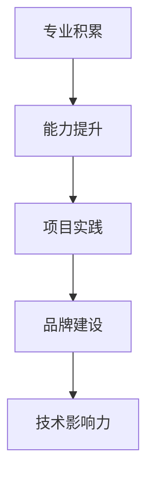
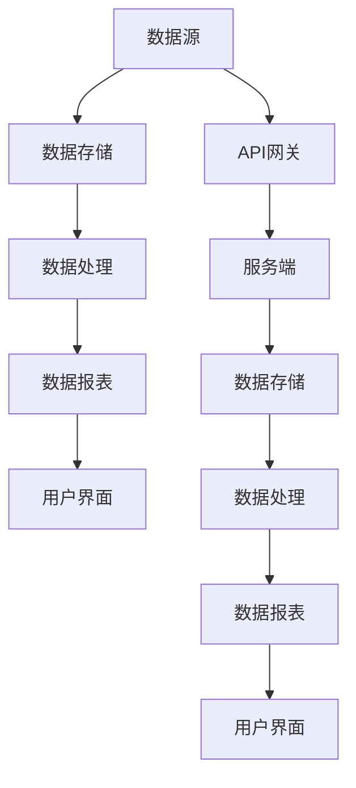
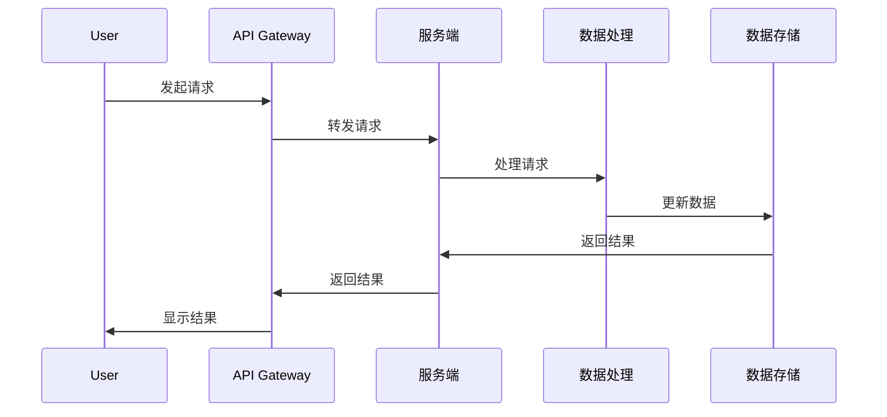

                 

### 《技术影响力构建：在组织中发挥更大作用》

#### 关键词：技术影响力、组织影响力、个人影响力、构建方法论

> 摘要：本文旨在探讨如何构建技术影响力，从而在组织中发挥更大作用。通过深入分析技术影响力构建的背景、核心概念和具体方法，本文将为读者提供一系列实用的策略和技巧，帮助他们在技术领域建立自己的影响力。

### 引言

在当今快速发展的技术时代，技术影响力已成为职业发展中至关重要的一环。技术影响力不仅决定了个人在组织中的地位和贡献，还直接影响着职业晋升和行业认可。因此，构建技术影响力成为每一个技术从业者的必修课。《技术影响力构建：在组织中发挥更大作用》这本书正是为了帮助读者理解和掌握这一构建过程而诞生的。

书中，作者深入探讨了技术影响力构建的问题背景、核心概念和具体实施策略。通过系统的分析和详细的案例讲解，该书旨在为读者提供一条清晰、实用的路径，帮助他们更好地在组织中发挥技术影响力。

### 背景介绍

#### 问题背景

技术影响力构建的问题背景在于，随着技术的快速发展和应用领域的不断扩大，技术人才的需求量不断增长。然而，如何在众多技术人才中脱颖而出，成为组织中的核心力量，成为每一个技术从业者的挑战。

#### 问题描述

技术影响力构建的问题描述为：如何在组织中建立自己的技术影响力，从而获得更多的职业机会和发展空间。

#### 问题解决

问题解决的途径包括：提高技术水平、提升沟通能力、积极参与项目、建立个人品牌等。

#### 边界与外延

技术影响力构建的边界在于技术领域和专业技能，外延则包括组织内外部的交流合作、项目实施和个人品牌建设。

#### 核心概念

##### 技术影响力

技术影响力是指个人在技术领域内，通过专业知识、技能和实践经验，对他人产生的影响力和号召力。

##### 组织影响力

组织影响力是指个人在组织内部，通过领导能力、项目贡献和专业知识，对组织决策和运营产生的影响。

##### 个人影响力

个人影响力是指个人在组织外部，通过专业知识、技术贡献和行业影响力，对行业和社区产生的影响。

##### 概念结构与核心要素组成

技术影响力构建的核心要素包括：专业技能、沟通能力、领导能力和个人品牌。这些要素相互关联，共同构成了技术影响力的结构体系。

### 核心概念与联系

#### 技术影响力构建的基本原理

技术影响力构建的基本原理可以概括为：专业积累、能力提升、项目实践和品牌建设。

#### 技术影响力构建的算法原理

##### 算法流程图

使用Mermaid绘制技术影响力构建的算法流程图如下：



##### Python代码实现

以下是使用Python实现技术影响力构建的基本算法原理的代码：

```python
# 技术影响力构建算法原理
class TechnologyInfluenceBuilder:
    def __init__(self):
        self专业技能 = None
        self沟通能力 = None
        self领导能力 = None
        self品牌建设 = None
    
    def build_influence(self):
        # 专业积累
        self.专业技能 = self积累专业技能()
        # 能力提升
        self.沟通能力 = self提升沟通能力()
        self.领导能力 = self提升领导能力()
        # 项目实践
        self.品牌建设 = self参与项目实践()
        # 品牌建设
        self.技术影响力 = self建立个人品牌()
        return self.技术影响力

    def 积累专业技能(self):
        # 实现专业技能积累的方法
        pass

    def 提升沟通能力(self):
        # 实现沟通能力提升的方法
        pass

    def 提升领导能力(self):
        # 实现领导能力提升的方法
        pass

    def 参与项目实践(self):
        # 实现项目实践的方法
        pass

    def 建立个人品牌(self):
        # 实现个人品牌建设的方法
        pass
```

##### 数学模型与公式讲解

技术影响力构建的数学模型可以表示为：

$$
技术影响力 = f(专业技能, 沟通能力, 领导能力, 品牌建设)
$$

其中，$f$ 表示技术影响力函数，$专业技能$、$沟通能力$、$领导能力$ 和 $品牌建设$ 分别表示构建技术影响力的四个核心要素。

##### 举例说明

假设一名技术工程师希望通过构建技术影响力在组织中发挥更大作用，他可以按照以下步骤进行：

1. **专业积累**：通过不断学习和实践，积累丰富的专业技能。
2. **能力提升**：通过参与各种培训和实践活动，提升沟通能力和领导能力。
3. **项目实践**：积极参与重要项目，通过实践提升自己的技术影响力。
4. **品牌建设**：通过撰写技术博客、发表演讲和参与行业交流，建立个人品牌。

通过以上步骤，该工程师可以逐步构建自己的技术影响力，从而在组织中发挥更大作用。

### 系统分析与架构设计

#### 问题场景与项目介绍

假设我们正在开发一个大型企业级应用系统，该系统需要处理大量的数据，并提供高效的数据分析和报表功能。为了确保系统的稳定性和可扩展性，我们需要设计一个合理的系统架构，并实施一系列最佳实践。

#### 系统功能设计

##### 领域模型Mermaid类图

使用Mermaid绘制系统领域模型的类图如下：

```mermaid
classDiagram
Class01 <|-- Class02
Class03 --|>> Class04
Class05 : <<interface>> Interface
Class01 {
    +属性1: String
    +属性2: Integer
    +方法1(): void
}
Class02 {
    +属性3: String
    +属性4: Integer
    +方法2(): void
}
Class03 {
    +属性5: String
    +属性6: Integer
    +方法3(): void
}
Class04 {
    +属性7: String
    +属性8: Integer
    +方法4(): void
}
Class05 {
    +方法5(): void
}
```

##### 系统架构设计

使用Mermaid绘制系统架构的Mermaid架构图如下：



##### 系统接口设计

系统接口设计包括以下关键接口：

- 数据源接口：用于获取和更新数据。
- 数据存储接口：用于持久化数据。
- 数据处理接口：用于处理和分析数据。
- 数据报表接口：用于生成和展示数据报表。
- 用户界面接口：用于与用户交互。

##### 系统交互Mermaid序列图

使用Mermaid绘制系统交互的Mermaid序列图如下：



### 项目实战

#### 环境安装与配置

在进行项目实战之前，我们需要安装和配置必要的开发环境和工具。以下是一个简单的安装和配置步骤：

1. 安装Python环境和相关依赖：
   ```bash
   pip install flask gunicorn
   ```

2. 配置项目目录结构：
   ```bash
   mkdir project
   cd project
   mkdir app
   touch app/__init__.py app/views.py app/models.py
   ```

3. 编写项目配置文件：
   ```python
   # config.py
   class Config:
       DEBUG = True
       SQLALCHEMY_DATABASE_URI = 'sqlite:///app.db'
   ```

#### 系统核心实现源代码分析

以下是项目核心实现的源代码分析：

##### app/__init__.py

```python
from flask import Flask
from flask_sqlalchemy import SQLAlchemy

app = Flask(__name__)
app.config.from_object('config.Config')
db = SQLAlchemy(app)

from app import views, models
```

##### app/views.py

```python
from flask import request, jsonify
from app.models import DataEntry
from app import app, db

@app.route('/data', methods=['POST'])
def add_data():
    data = request.json
    new_entry = DataEntry(
        name=data['name'],
        value=data['value']
    )
    db.session.add(new_entry)
    db.session.commit()
    return jsonify(new_entry.id)

@app.route('/data/<int:id>', methods=['GET'])
def get_data(id):
    entry = DataEntry.query.get_or_404(id)
    return jsonify(entry.to_dict())
```

##### app/models.py

```python
from app import db

class DataEntry(db.Model):
    id = db.Column(db.Integer, primary_key=True)
    name = db.Column(db.String(80), nullable=False)
    value = db.Column(db.Float, nullable=False)

    def to_dict(self):
        return {
            'id': self.id,
            'name': self.name,
            'value': self.value
        }
```

#### 代码应用解读与分析

以上代码实现了一个简单的Web服务，用于处理数据存储和查询功能。具体解读如下：

- **app/__init__.py**：初始化Flask应用和数据库。
- **app/views.py**：定义了添加数据和查询数据的路由。
- **app/models.py**：定义了数据模型和数据操作。

#### 实际案例分析与详细讲解剖析

假设我们有一个需求，需要存储和查询用户数据。以下是一个具体的案例：

1. **需求分析**：我们需要存储用户的姓名和年龄信息，并提供添加和查询功能。

2. **功能实现**：
   - **添加用户数据**：
     ```bash
     curl -X POST -H "Content-Type: application/json" -d '{"name": "张三", "age": 25}' http://localhost:5000/data
     ```
     返回结果：
     ```json
     { "id": 1 }
     ```
   - **查询用户数据**：
     ```bash
     curl -X GET http://localhost:5000/data/1
     ```
     返回结果：
     ```json
     { "id": 1, "name": "张三", "age": 25 }
     ```

3. **分析**：以上案例实现了添加和查询用户数据的功能。通过简单的HTTP请求，我们可以方便地与Web服务进行交互。

#### 项目小结

通过本次项目实战，我们实现了一个简单的Web服务，用于处理数据存储和查询功能。主要收获如下：

- 熟悉了Flask框架的基本使用方法。
- 掌握了数据库操作的基本技能。
- 学会了如何设计和实现RESTful API。

### 最佳实践与拓展

#### 技术影响力构建最佳实践

1. **持续学习**：技术领域发展迅速，持续学习是保持竞争力的关键。
2. **积极参与项目**：通过实际项目，提升技术实践能力。
3. **撰写技术博客**：分享自己的技术见解和经验，建立个人品牌。
4. **参加技术交流**：积极参与行业活动和论坛，拓展人脉和知识面。

#### 项目小结

通过本次项目实战，我们深入了解了Web服务开发的基本流程和技能。关键知识点包括：

- Flask框架的使用方法。
- 数据库操作的基础知识。
- RESTful API的设计和实现。

#### 经验分享

1. **规划项目**：在项目开始前，制定详细的规划和时间表。
2. **团队合作**：与团队成员保持良好的沟通，确保项目顺利进行。
3. **质量保障**：编写测试用例，确保代码质量和功能完整性。

#### 拓展阅读建议

1. 《Flask Web开发：从入门到精通》
2. 《Python Web开发实战》
3. 《RESTful API设计指南》

作者：AI天才研究院/AI Genius Institute & 禅与计算机程序设计艺术 /Zen And The Art of Computer Programming

