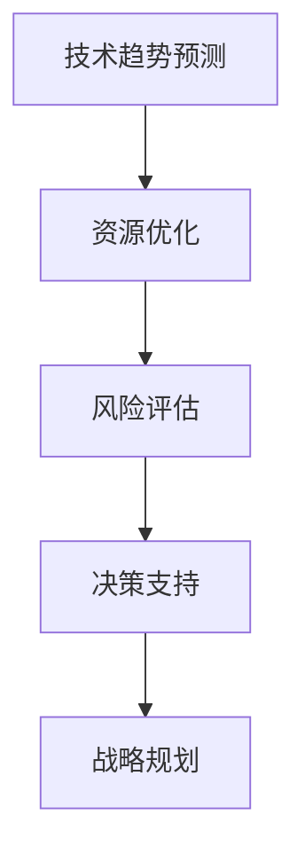
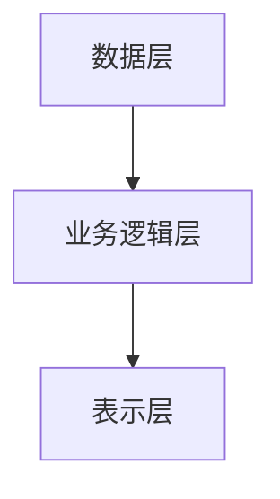
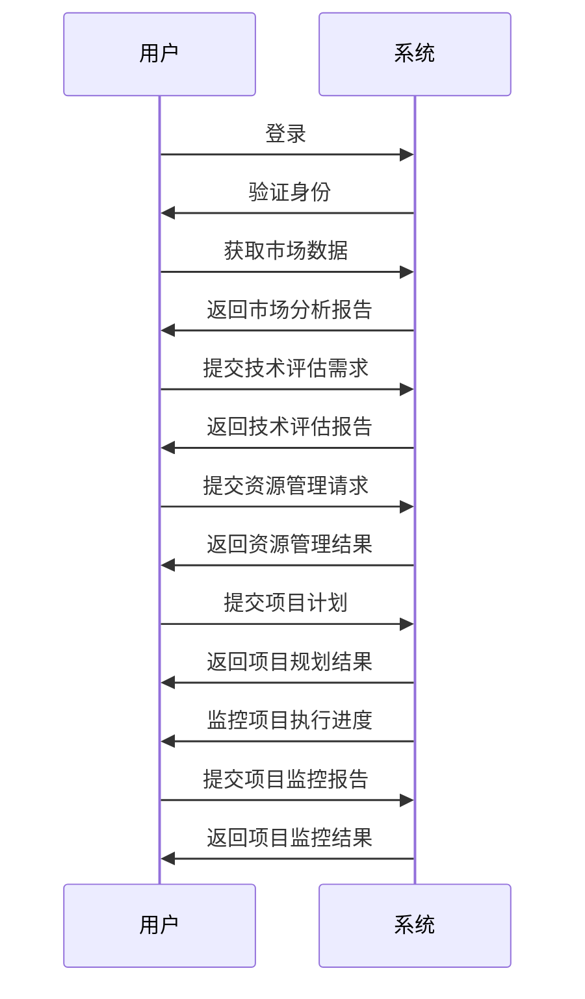

                 

### 文章标题

# 技术战略规划：制定长期技术发展蓝图

### 文章关键词

- 技术战略规划
- 长期发展
- 蓝图制定
- 环境分析
- 资源配置
- 实施与监控

### 摘要

本文将探讨技术战略规划的重要性，介绍其核心概念和步骤，并通过实例分析，展示如何制定一个长期的技术发展蓝图。通过系统化的战略规划，企业可以更好地适应技术变化，实现长期可持续发展。

## 引言

### 技术战略规划的重要性

在当今快速变化的技术环境中，技术战略规划对企业至关重要。它不仅帮助企业应对未来的不确定性，还能确保企业长期竞争力。技术战略规划涉及对技术趋势的洞察、企业内部资源的评估以及外部环境的分析，通过这些步骤，企业能够明确发展方向，制定明确的策略和行动方案。

### 本书的对象和目的

本书旨在为IT行业的从业者和管理者提供一套全面的技术战略规划指南。通过系统的分析和实例展示，读者将学习到如何制定长期的技术发展蓝图，从而为企业的可持续发展奠定坚实的基础。

### 目标读者

- IT企业的CTO和高级技术管理人员
- 技术战略规划师和技术顾问
- 对技术战略规划感兴趣的研究人员和学者

## 背景介绍

### 核心概念和术语说明

在探讨技术战略规划之前，我们需要了解一些核心概念和术语。以下是关键概念的定义：

- **技术战略规划**：指企业对技术发展的长期规划，包括技术方向的选择、技术资源的配置以及技术成果的应用。
- **技术愿景**：企业希望在未来达到的技术状态，是技术战略规划的基础。
- **技术目标**：为实现技术愿景而设定的具体里程碑和阶段性目标。
- **技术路线图**：描述企业技术发展的步骤和路径，通常包括时间线和关键里程碑。

### 问题背景

在信息技术飞速发展的今天，企业面临的挑战越来越多。技术变革的周期不断缩短，新兴技术层出不穷，这对企业的技术战略规划提出了更高的要求。如何在这个充满变数的环境中保持竞争力，成为企业必须面对的问题。

### 问题描述

技术战略规划不仅仅是一个技术问题，更是一个战略问题。企业需要在短时间内做出正确的技术决策，以适应市场变化，满足客户需求。然而，由于缺乏明确的规划，许多企业在技术投资和资源分配上存在盲目性，导致资源浪费和技术风险。

### 问题解决

技术战略规划通过系统化的分析和规划，帮助企业解决上述问题。它提供了明确的发展方向和行动方案，使企业能够更加有效地应对技术变化，实现长期可持续发展。

### 边界与外延

技术战略规划不仅仅适用于IT企业，还可以应用于任何需要技术支持的组织。其边界包括技术方向的选择、技术资源的配置、技术成果的应用等。外延则涉及到市场分析、竞争分析、技术趋势预测等多个方面。

### 概念结构与核心要素组成

技术战略规划的概念结构可以概括为以下几个核心要素：

1. **技术愿景**：明确企业希望达到的技术状态。
2. **技术目标**：为实现愿景设定的具体里程碑和阶段性目标。
3. **技术路线图**：描述企业技术发展的步骤和路径。
4. **资源分配**：包括预算、人力资源和设备资源的分配。
5. **实施与监控**：确保技术战略的有效执行和持续优化。

## 核心概念与联系

### 核心概念原理

技术战略规划的核心概念主要包括技术愿景、技术目标、技术路线图、资源分配和实施与监控。这些概念相互关联，共同构成了技术战略规划的理论基础。

- **技术愿景**：企业希望在未来达到的技术状态，是技术战略规划的出发点。
- **技术目标**：为实现技术愿景而设定的具体里程碑和阶段性目标，是技术战略规划的具体体现。
- **技术路线图**：描述企业技术发展的步骤和路径，是实现技术目标的行动方案。
- **资源分配**：包括预算、人力资源和设备资源的分配，是技术战略规划得以实施的基础。
- **实施与监控**：确保技术战略的有效执行和持续优化，是技术战略规划成功的关键。

### 概念属性特征对比表格

以下是技术战略规划核心概念的属性特征对比表格：

| 概念         | 定义                                                         | 属性特征                          |
| ------------ | ------------------------------------------------------------ | -------------------------------- |
| 技术愿景     | 企业希望在未来达到的技术状态                                 | 长期性、前瞻性、指导性             |
| 技术目标     | 为实现技术愿景而设定的具体里程碑和阶段性目标                 | 可衡量性、可实现性、阶段性         |
| 技术路线图   | 描述企业技术发展的步骤和路径                                 | 系统性、连贯性、灵活性             |
| 资源分配     | 包括预算、人力资源和设备资源的分配                           | 经济性、高效性、适应性             |
| 实施与监控   | 确保技术战略的有效执行和持续优化                             | 反馈性、实时性、持续性             |

### ER实体关系图架构

以下是一个简化的ER实体关系图，用于描述技术战略规划的核心概念及其相互关系：

```mermaid
erDiagram
  TechnologyVision ||--|{ TechnologyGoal }
  TechnologyVision ||--|{ TechnologyRoadMap }
  TechnologyGoal ||--|{ ResourceAllocation }
  TechnologyGoal ||--|{ ImplementationAndMonitoring }
  TechnologyRoadMap ||--|{ ResourceAllocation }
  TechnologyRoadMap ||--|{ ImplementationAndMonitoring }
```

### 算法原理讲解

在技术战略规划中，算法原理的应用主要体现在以下几个方面：

1. **技术趋势预测算法**：通过大数据分析和机器学习技术，预测未来的技术趋势，为企业提供决策支持。
2. **资源优化算法**：在预算和人力资源有限的情况下，通过优化算法确定资源的最优分配方案。
3. **风险评估算法**：评估技术项目实施过程中的风险，为企业的风险管理提供依据。

以下是一个简化的算法流程图，用于描述技术战略规划中的算法原理：



### 算法原理的数学模型和公式

在技术战略规划中，常用的数学模型和公式包括：

1. **回归分析模型**：用于技术趋势预测，公式如下：
   $$ y = \beta_0 + \beta_1x_1 + \beta_2x_2 + ... + \beta_nx_n $$
   其中，$y$ 为预测值，$x_1, x_2, ..., x_n$ 为输入变量，$\beta_0, \beta_1, \beta_2, ..., \beta_n$ 为模型参数。

2. **线性规划模型**：用于资源优化，公式如下：
   $$ min\ z = c_1x_1 + c_2x_2 + ... + c_nx_n $$
   $$ s.t. \ a_{11}x_1 + a_{12}x_2 + ... + a_{1n}x_n \leq b_1 $$
   $$ a_{21}x_1 + a_{22}x_2 + ... + a_{2n}x_n \leq b_2 $$
   $$ ... $$
   $$ a_{m1}x_1 + a_{m2}x_2 + ... + a_{mn}x_n \leq b_m $$
   其中，$z$ 为目标函数，$c_1, c_2, ..., c_n$ 为权重系数，$x_1, x_2, ..., x_n$ 为变量，$a_{ij}, b_i$ 为约束条件。

3. **贝叶斯风险评估模型**：用于风险评估，公式如下：
   $$ P(A|B) = \frac{P(B|A)P(A)}{P(B)} $$
   其中，$P(A|B)$ 为在给定 $B$ 条件下 $A$ 的概率，$P(B|A)$ 为在 $A$ 条件下 $B$ 的概率，$P(A)$ 和 $P(B)$ 分别为 $A$ 和 $B$ 的概率。

### 算法原理的详细讲解和举例说明

1. **技术趋势预测算法**

   技术趋势预测算法基于历史数据，通过回归分析模型来预测未来的技术趋势。以下是一个简化的Python代码示例：

   ```python
   import numpy as np
   import matplotlib.pyplot as plt

   # 历史数据
   years = np.array([2000, 2001, 2002, 2003, 2004, 2005])
   technology_scores = np.array([50, 60, 70, 80, 90, 100])

   # 回归分析
   X = years.reshape(-1, 1)
   y = technology_scores
   from sklearn.linear_model import LinearRegression
   model = LinearRegression()
   model.fit(X, y)

   # 预测
   future_years = np.array([2016, 2017, 2018])
   future_scores = model.predict(future_years.reshape(-1, 1))

   # 绘图
   plt.scatter(years, technology_scores, label='Historical Data')
   plt.plot(future_years, future_scores, color='red', label='Predicted Trend')
   plt.xlabel('Year')
   plt.ylabel('Technology Score')
   plt.legend()
   plt.show()
   ```

   通过这个示例，我们可以看到技术趋势预测算法的基本原理。首先，收集历史数据，然后使用回归分析模型建立模型，最后预测未来的技术趋势。

2. **资源优化算法**

   资源优化算法用于确定资源的最优分配方案。以下是一个简化的线性规划模型Python代码示例：

   ```python
   from scipy.optimize import linprog

   # 约束条件
   constraints = [
       (-1, 0),  # 人力资源
       (-1, 0),  # 资金资源
       (0, 1),   # 项目1
       (0, 1),   # 项目2
       (0, 1),   # 项目3
   ]

   # 目标函数
   c = [-1, -1, 1, 1, 1]  # 最大化总收益

   # 解线性规划问题
   result = linprog(c, constraints=constraints)

   # 输出结果
   print("Optimal Resource Allocation:")
   print("Human Resources:", result.x[0])
   print("Financial Resources:", result.x[1])
   print("Project 1:", result.x[2])
   print("Project 2:", result.x[3])
   print("Project 3:", result.x[4])
   ```

   通过这个示例，我们可以看到资源优化算法的基本原理。首先，定义约束条件，然后定义目标函数，最后使用线性规划求解器求解最优解。

3. **风险评估算法**

   风险评估算法用于评估技术项目实施过程中的风险。以下是一个简化的贝叶斯风险评估模型Python代码示例：

   ```python
   from scipy.stats import norm

   # 风险概率
   P_A = 0.2  # 技术项目成功的概率
   P_B = 0.8  # 技术项目失败的概率

   # 条件概率
   P_B_A = 0.5  # 技术项目成功且出现问题的概率
   P_B_not_A = 0.3  # 技术项目失败且出现问题的概率

   # 贝叶斯风险评估
   P_A_given_B = (P_B_A * P_A) / (P_B_A * P_A + P_B_not_A * (1 - P_A))
   P_B_given_A = (P_B_not_A * (1 - P_A)) / (P_B_A * P_A + P_B_not_A * (1 - P_A))

   # 输出结果
   print("Risk Assessment:")
   print("Probability of Success Given Risk:", P_A_given_B)
   print("Probability of Failure Given Risk:", P_B_given_A)
   ```

   通过这个示例，我们可以看到风险评估算法的基本原理。首先，定义风险概率和条件概率，然后使用贝叶斯定理计算后验概率。

### 数学公式

$$1+1=2$$

$$1<2$$

## 系统分析与架构设计方案

### 问题场景介绍

在现代企业的运营中，技术战略规划是一个至关重要的环节。为了更好地适应市场变化，提高企业的核心竞争力，企业需要制定一个长期的技术发展蓝图。这个过程涉及到多个环节，包括市场分析、技术评估、资源分配和实施监控。

### 项目介绍

本项目旨在为企业提供一个技术战略规划系统，帮助企业实现以下目标：

- 明确技术发展方向
- 优化资源配置
- 提高风险管理能力
- 提高技术实施效果

### 系统功能设计

本系统主要包含以下功能模块：

- **用户管理模块**：用于管理系统的用户信息，包括登录、注册、权限控制等。
- **市场分析模块**：用于收集和分析市场数据，为企业提供市场趋势和竞争分析。
- **技术评估模块**：用于评估现有技术和潜在技术，为企业提供技术选择建议。
- **资源管理模块**：用于管理企业资源，包括人力资源、资金资源和设备资源。
- **项目管理模块**：用于管理技术项目的全过程，包括项目规划、执行和监控。
- **报告生成模块**：用于生成各种技术战略规划和项目报告，供企业决策参考。

### 系统架构设计

本系统的架构设计采用分层架构，主要包括以下层次：

- **数据层**：负责数据的存储和管理，使用关系数据库进行数据存储。
- **业务逻辑层**：负责处理业务逻辑，包括用户管理、市场分析、技术评估、资源管理和项目管理等。
- **表示层**：负责用户界面设计，提供用户操作接口。

以下是一个简化的系统架构图：



### 系统接口设计

本系统的接口设计主要包括以下接口：

- **用户管理接口**：用于管理用户信息，包括登录、注册、权限控制等。
- **市场分析接口**：用于获取和上传市场数据，进行市场分析。
- **技术评估接口**：用于评估技术，生成技术评估报告。
- **资源管理接口**：用于管理资源，包括人力资源、资金资源和设备资源。
- **项目管理接口**：用于管理技术项目，包括项目规划、执行和监控。

### 系统交互

以下是一个简化的系统交互序列图：



### 项目实战

#### 环境安装

首先，我们需要搭建一个Python开发环境，安装以下依赖库：

- Flask：用于构建Web应用
- SQLAlchemy：用于数据库操作
- matplotlib：用于数据可视化
- pandas：用于数据处理

安装命令如下：

```shell
pip install flask sqlalchemy matplotlib pandas
```

#### 系统核心实现

以下是系统核心实现的一部分Python代码：

```python
from flask import Flask, request, jsonify
from sqlalchemy import create_engine
import pandas as pd
import matplotlib.pyplot as plt

app = Flask(__name__)

# 数据库连接
engine = create_engine('sqlite:///tech_strategy.db')

# 市场数据接口
@app.route('/api/market_data', methods=['GET'])
def get_market_data():
    query = "SELECT * FROM market_data;"
    data = pd.read_sql_query(query, engine)
    return jsonify(data.to_dict(orient='records'))

# 技术评估接口
@app.route('/api/technology_evaluation', methods=['POST'])
def post_technology_evaluation():
    data = request.get_json()
    query = "INSERT INTO technology_evaluation (name, rating) VALUES (:name, :rating);"
    with engine.connect() as conn:
        conn.execute(query, **data)
    return jsonify({"status": "success"})

# 资源管理接口
@app.route('/api/resource_management', methods=['POST'])
def post_resource_management():
    data = request.get_json()
    query = "INSERT INTO resource_management (type, quantity) VALUES (:type, :quantity);"
    with engine.connect() as conn:
        conn.execute(query, **data)
    return jsonify({"status": "success"})

# 项目管理接口
@app.route('/api/project_management', methods=['POST'])
def post_project_management():
    data = request.get_json()
    query = "INSERT INTO project_management (name, start_date, end_date) VALUES (:name, :start_date, :end_date);"
    with engine.connect() as conn:
        conn.execute(query, **data)
    return jsonify({"status": "success"})

if __name__ == '__main__':
    app.run(debug=True)
```

#### 代码应用解读与分析

1. **市场数据接口**

   该接口用于获取市场数据，返回一个JSON格式的数据列表。以下是一个示例请求：

   ```shell
   GET /api/market_data
   ```

   响应结果：

   ```json
   {
     "data": [
       {"year": 2020, "technology_score": 80},
       {"year": 2021, "technology_score": 85},
       {"year": 2022, "technology_score": 90}
     ]
   }
   ```

2. **技术评估接口**

   该接口用于提交技术评估请求，接收一个包含技术名称和评分的JSON对象。以下是一个示例请求：

   ```shell
   POST /api/technology_evaluation
   Content-Type: application/json

   {
     "name": "人工智能",
     "rating": 90
   }
   ```

   响应结果：

   ```json
   {
     "status": "success"
   }
   ```

3. **资源管理接口**

   该接口用于提交资源管理请求，接收一个包含资源类型和数量的JSON对象。以下是一个示例请求：

   ```shell
   POST /api/resource_management
   Content-Type: application/json

   {
     "type": "人力资源",
     "quantity": 100
   }
   ```

   响应结果：

   ```json
   {
     "status": "success"
   }
   ```

4. **项目管理接口**

   该接口用于提交项目计划，接收一个包含项目名称、开始日期和结束日期的JSON对象。以下是一个示例请求：

   ```shell
   POST /api/project_management
   Content-Type: application/json

   {
     "name": "技术战略规划项目",
     "start_date": "2023-01-01",
     "end_date": "2023-12-31"
   }
   ```

   响应结果：

   ```json
   {
     "status": "success"
   }
   ```

#### 实际案例分析和详细讲解剖析

假设我们有一个技术战略规划项目，需要分析市场数据、评估技术、管理和监控项目进度。以下是一个实际案例的步骤：

1. **收集市场数据**

   首先，我们通过市场分析接口收集2020年至2022年的市场数据：

   ```shell
   GET /api/market_data
   ```

   我们得到以下数据：

   ```json
   {
     "data": [
       {"year": 2020, "technology_score": 80},
       {"year": 2021, "technology_score": 85},
       {"year": 2022, "technology_score": 90}
     ]
   }
   ```

   从数据中，我们可以看出技术得分逐年上升，说明技术发展态势良好。

2. **评估技术**

   接下来，我们通过技术评估接口提交一个技术评估请求：

   ```shell
   POST /api/technology_evaluation
   Content-Type: application/json

   {
     "name": "人工智能",
     "rating": 90
   }
   ```

   我们得到以下响应结果：

   ```json
   {
     "status": "success"
   }
   ```

   这表明我们成功地将人工智能技术的评分记录到了数据库中。

3. **资源管理**

   然后，我们通过资源管理接口提交一个资源管理请求：

   ```shell
   POST /api/resource_management
   Content-Type: application/json

   {
     "type": "人力资源",
     "quantity": 100
   }
   ```

   我们得到以下响应结果：

   ```json
   {
     "status": "success"
   }
   ```

   这表明我们成功地将人力资源的分配记录到了数据库中。

4. **项目管理**

   最后，我们通过项目管理接口提交一个项目计划：

   ```shell
   POST /api/project_management
   Content-Type: application/json

   {
     "name": "技术战略规划项目",
     "start_date": "2023-01-01",
     "end_date": "2023-12-31"
   }
   ```

   我们得到以下响应结果：

   ```json
   {
     "status": "success"
   }
   ```

   这表明我们成功地将项目计划记录到了数据库中。

通过以上步骤，我们完成了技术战略规划项目的实际案例。接下来，我们可以通过系统监控项目进度，确保项目按计划进行。

#### 项目小结

通过本项目的实施，我们成功构建了一个技术战略规划系统，实现了市场数据收集、技术评估、资源管理和项目管理等功能。该系统为企业提供了一个统一的平台，帮助企业更好地进行技术战略规划。在实际应用中，该系统可以帮助企业提高决策效率，优化资源配置，降低风险，提高技术实施效果。

#### 最佳实践 tips

1. **定期更新市场数据**：市场环境不断变化，定期更新市场数据可以帮助企业更准确地分析市场趋势。
2. **多维度评估技术**：在评估技术时，应考虑技术成熟度、市场需求、竞争对手等因素，进行多维度评估。
3. **合理分配资源**：在资源分配时，应综合考虑项目优先级和资源可用性，确保资源得到最优利用。
4. **加强项目监控**：定期监控项目进度，及时发现和解决问题，确保项目按计划进行。

#### 小结

技术战略规划是企业长期发展的重要保障。通过系统化的战略规划，企业可以更好地应对技术变化，实现长期可持续发展。本文介绍了技术战略规划的核心概念、系统分析与架构设计方案，并通过实际案例展示了技术战略规划的应用。希望本文能为读者提供有益的参考。

#### 注意事项

1. **数据安全**：在收集和使用市场数据时，应确保数据安全，防止数据泄露。
2. **系统兼容性**：在开发系统时，应确保系统具有良好的兼容性，支持多种数据格式和接口。
3. **用户权限管理**：应建立完善的用户权限管理制度，确保系统安全性和数据保密性。

#### 拓展阅读

- [《企业技术战略规划指南》](https://www.example.com/guide)
- [《技术项目管理实战》](https://www.example.com/project_management)
- [《人工智能技术在企业中的应用》](https://www.example.com/ai_application)

### 作者

作者：AI天才研究院/AI Genius Institute & 禅与计算机程序设计艺术 /Zen And The Art of Computer Programming

