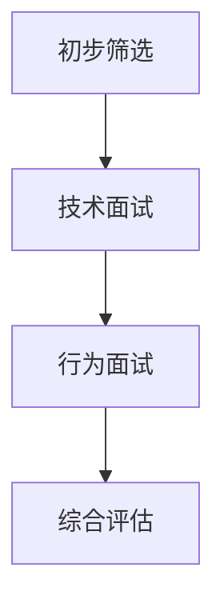
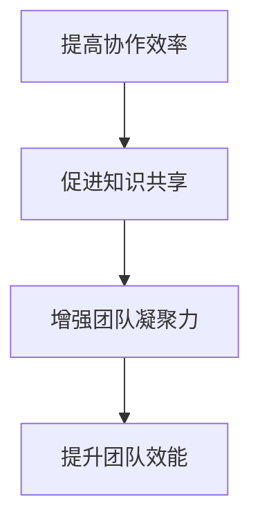
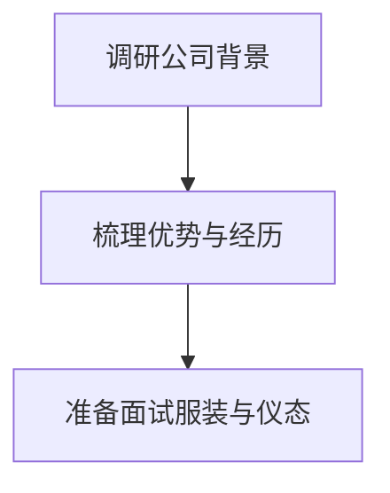
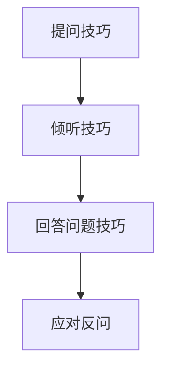
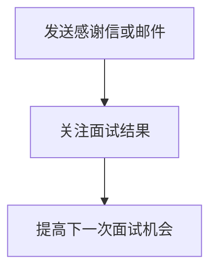
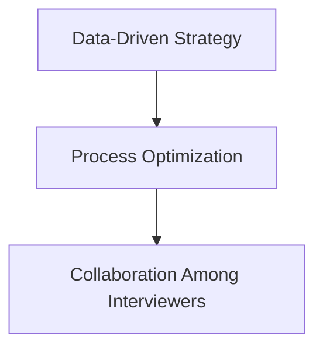

                 

### 技术招聘与面试：构建高效能团队

---

#### 关键词：技术招聘、面试策略、团队建设、高效能、人才筛选

#### 摘要：
在技术快速发展的时代，技术招聘与面试成为企业构建高效能团队的关键。本文将深入探讨技术招聘的重要性与挑战，技术人才筛选的标准与流程，以及如何通过团队建设与面试技巧提升团队效能。通过案例分析，提供实践指导，帮助企业在技术招聘与面试中取得成功。

---

## 第一部分：技术招聘概述

### 第1章：技术招聘的重要性与挑战

#### 1.1 问题背景与现状分析

在当今技术飞速发展的背景下，企业对于技术人才的需求日益增长。随着云计算、大数据、人工智能等新兴技术的不断涌现，技术岗位的重要性逐渐凸显。然而，技术招聘却面临诸多挑战。

- **技术行业发展迅速**：技术领域不断发展，新技术、新概念层出不穷，企业需要不断更新技术栈，以满足市场需求。
- **招聘难度增大**：技术人才稀缺，特别是顶尖技术人才，企业间的竞争愈发激烈。同时，人才流动频繁，导致招聘周期延长。
- **成本上升**：随着薪资水平的提升和招聘流程的复杂化，技术招聘的成本逐渐增加。

#### 1.2 技术招聘的重要性

技术招聘对于企业的重要性不容忽视：

- **企业发展的贡献**：技术人才是企业创新和发展的核心驱动力，高质量的招聘有助于提升企业核心竞争力。
- **团队效能的影响**：高效的技术团队能够提高项目交付效率，减少错误和重复劳动，增强企业的整体效能。
- **面向未来的招聘策略**：企业需要根据行业趋势和自身战略，制定面向未来的招聘策略，确保人才储备与企业发展同步。

#### 1.3 技术招聘的核心目标

在技术招聘过程中，企业应关注以下几个核心目标：

- **识别合适的候选人**：通过科学的人才筛选标准，确保候选人具备所需的技术能力和潜力。
- **提高招聘效率**：优化招聘流程，减少不必要的环节，提高招聘效率，缩短招聘周期。
- **降低招聘成本**：通过合理的招聘策略和高效的招聘执行，降低招聘总成本。

#### 1.4 技术招聘的边界与外延

技术招聘的范围与领域非常广泛，包括但不限于以下方面：

- **招聘的范围与领域**：软件开发、系统架构、数据分析、人工智能、网络安全等。
- **技术招聘的具体岗位**：软件工程师、系统架构师、数据科学家、网络安全专家等。
- **跨界招聘的可能性**：企业还可以通过跨界招聘，引入具有多样化背景的人才，提升团队的创新能力和多样性。

#### 1.5 核心概念与联系

在技术招聘中，以下几个核心概念密切相关：

- **技术人才市场**：人才市场的供需关系、薪资水平、人才流动性等。
- **技术能力评估**：评估候选人的技术深度、广度、项目经验、问题解决能力等。
- **薪酬体系设计**：根据市场水平和企业预算，制定合理的薪酬策略，以吸引和留住优秀人才。

以下是技术人才市场的 Mermaid ER 实体关系图：

```mermaid
erDiagram
  Customer ||--|{ Product }  : "has"
  "Order Entry" ||--|{ Customer } : "places"
  "Order Entry" ||--|{ Product } : "orders"
```

#### 1.6 本章小结

本文概述了技术招聘的重要性与挑战，明确了技术招聘的核心目标，探讨了技术招聘的边界与外延，并介绍了相关核心概念。在接下来的章节中，我们将深入探讨技术人才筛选的标准与流程，以及如何通过团队建设与面试技巧提升团队效能。

---

## 第二部分：技术人才筛选

### 第2章：人才筛选标准与流程

#### 2.1 技术能力评估标准

技术人才筛选的核心在于评估候选人的技术能力。以下标准对于技术能力评估至关重要：

- **技术知识的深度与广度**：评估候选人对核心技术的掌握程度，包括基础知识、前沿技术和发展趋势。
- **项目经验的丰富程度**：通过候选人的项目经验，评估其实际解决问题的能力和项目管理经验。
- **解决问题的能力**：考察候选人在面对复杂问题时，能否提出创新性解决方案，并有效实施。
- **学习能力与创新精神**：技术领域日新月异，候选人应具备快速学习新技术的能力，以及创新思维和解决问题的勇气。

以下是技术能力评估标准的 Mermaid 对比表格：

```mermaid
table
  | Depth | Breadth |
  |-------|---------|
  | Basic Knowledge | Advanced Knowledge |
  | Project Experience | Management Experience |
  | Problem-solving | Innovation |
```

#### 2.2 技术面试流程

技术面试是评估候选人技术能力的关键环节。以下是一个典型的技术面试流程：

- **初步筛选**：通过简历筛选，初步评估候选人的基本素质和是否符合职位要求。
- **技术面试**：深入了解候选人的技术深度和广度，通过编程题、算法题、案例分析等方式考察其实际能力。
- **行为面试**：通过情境模拟、团队合作等环节，评估候选人的行为表现、沟通能力和团队协作精神。
- **综合评估**：结合技术面试和行为面试的结果，进行全面评估，确定候选人是否适合岗位。

以下是技术面试流程的 Mermaid 流程图：



#### 2.3 技术笔试与测评工具

笔试和测评工具在技术人才筛选中发挥着重要作用。以下是一些常用的笔试内容和测评工具：

- **笔试内容与形式**：编程题、算法题、系统设计题、案例分析等。
- **常见测评工具**：LeetCode、HackerRank、Codeforces 等。
- **测评工具的选择与应用**：根据岗位需求和公司文化，选择合适的测评工具，并在面试过程中灵活运用。

以下是笔试内容和常见测评工具的 Mermaid 对比表格：

```mermaid
table
  | Content | Tool |
  |---------|------|
  | Programming Questions | LeetCode |
  | Algorithm Questions | HackerRank |
  | System Design Questions | Codeforces |
```

#### 2.4 面试官的角色与职责

面试官在技术人才筛选中扮演着关键角色。以下是他们应具备的职责和评估标准：

- **面试官的选拔与培训**：选择具备专业知识和沟通能力的人担任面试官，并进行定期培训，提高面试技能。
- **面试官的评估标准**：通过面试官的观察、提问和反馈，评估候选人的技术能力、潜力、团队合作精神等。
- **面试官的沟通技巧**：面试官应具备良好的沟通技巧，确保面试过程中的信息传递准确无误。

以下是面试官角色与职责的 Mermaid ER 实体关系图：

```mermaid
erDiagram
  Interviewer ||--|{ Candidate } : "assesses"
  Interviewer ||--|{ Interview Process } : "conducts"
```

#### 2.5 技术人才筛选案例分析

技术人才筛选的成功与否直接影响企业的发展和团队的效能。以下是一个成功案例和一个失败案例的分析：

##### **成功案例**

**背景**：某互联网公司招聘一位高级软件工程师。

**过程**：公司通过简历筛选，筛选出数十位候选人。随后，进行技术面试和笔试，重点考察候选人的编程能力、算法知识和项目经验。通过多次面试和综合评估，最终选出一位技术过硬、潜力巨大的候选人。

**结果**：新员工入职后，迅速融入团队，为公司的多个重要项目做出了贡献。

##### **失败案例**

**背景**：某创业公司招聘一名数据科学家。

**过程**：公司在招聘过程中，过于注重候选人的学术背景，而忽略了实际项目经验和解决问题的能力。面试过程中，面试官也没有深入考察候选人的技术深度和广度。

**结果**：新员工入职后，无法满足公司对数据科学的需求，项目进展缓慢，最终导致离职。

##### **启示与改进**

- **注重实际能力**：在招聘过程中，应更注重候选人的实际项目经验和解决问题的能力，而不仅仅是学术背景。
- **多轮面试评估**：通过多轮面试和综合评估，确保对候选人进行全面、准确的评估。
- **面试官培训**：定期对面试官进行培训，提高面试技能和评估标准。

#### 2.6 本章小结

本章详细介绍了技术人才筛选的标准与流程，包括技术能力评估、技术面试流程、笔试与测评工具、面试官的角色与职责，以及案例分析。通过科学的人才筛选，企业可以构建高效能团队，提升整体竞争力。

---

## 第三部分：构建高效能团队

### 第3章：团队建设的重要性与策略

#### 3.1 团队建设的重要性

团队建设是企业成功的关键因素之一。以下内容阐述了团队建设的重要性：

- **提高团队协作效率**：通过明确的团队目标和良好的沟通机制，团队成员能够协同工作，提高整体效率。
- **促进知识共享与创新**：团队建设有助于知识共享和经验交流，激发创新思维，推动技术进步。
- **增强团队凝聚力**：通过共同的目标和经历，团队成员之间的信任和凝聚力得到增强，有利于团队稳定。
- **提升团队效能**：高效能的团队能够更好地应对外部挑战，提升企业的竞争力。

以下是团队建设重要性的 Mermaid 流程图：



#### 3.2 团队建设策略

构建高效能团队需要明确的策略和方法。以下是一些关键的团队建设策略：

- **明确团队目标**：制定明确的团队目标和愿景，确保团队成员有共同的方向和动力。
- **规范团队管理**：建立健全的团队管理制度，确保团队运作有序，提高管理效率。
- **增强团队沟通**：建立有效的沟通渠道和机制，促进团队成员之间的信息交流。
- **提升团队技能**：通过培训和学习，提升团队成员的专业技能和综合素质。

以下是团队建设策略的 Mermaid 对比表格：

```mermaid
table
  | Strategy | Description |
  |----------|-------------|
  | Goal Clarification | Define clear objectives |
  | Management Standardization | Establish effective management practices |
  | Communication Enhancement | Improve communication channels |
  | Skill Improvement | Provide training opportunities |
```

#### 3.3 团队文化建设

团队文化是团队建设的核心，以下内容阐述了团队文化建设的要点：

- **核心价值观的塑造**：确立团队的核心价值观，如诚信、创新、共赢等，作为团队成员共同遵循的原则。
- **团队氛围的营造**：营造积极、开放、包容的团队氛围，鼓励团队成员分享想法和经验。
- **团队文化的传承与发展**：通过团队活动、仪式和日常管理，传承和发扬团队文化，使其成为团队的灵魂。

以下是团队文化建设要点的 Mermaid 实体关系图：

```mermaid
erDiagram
  Core Values ||--|{ Team Culture } : "defines"
  Team Culture ||--|{ Team Activities } : "drives"
  Team Activities ||--|{ Team Members } : "engages"
```

#### 3.4 团队效能评估

团队效能评估是衡量团队建设成效的重要手段。以下内容介绍了团队效能评估的指标、方法和策略：

- **团队效能评估指标**：包括项目交付效率、错误率、团队士气、团队创新成果等。
- **评估方法与工具**：运用定量和定性方法，如问卷调查、绩效考核、KPI分析等，对团队效能进行全面评估。
- **提升团队效能的策略**：根据评估结果，制定针对性的改进措施，如优化工作流程、提升团队成员技能、改善团队沟通等。

以下是团队效能评估方法和策略的 Mermaid 对比表格：

```mermaid
table
  | Method | Description |
  |--------|-------------|
  | Quantitative Analysis | Use metrics to evaluate performance |
  | Qualitative Assessment | Gather feedback through surveys |
  | Improvement Strategies | Develop action plans based on findings |
```

#### 3.5 团队建设案例分析

以下是一个团队建设成功案例和一个失败案例的分析：

##### **成功案例**

**背景**：某科技公司通过一系列团队建设活动，成功打造了一个高效能团队。

**过程**：公司制定了明确的团队目标和价值观，通过定期的培训、团队建设活动和绩效评估，不断优化团队管理，提高成员技能和团队凝聚力。

**结果**：团队在多个项目中表现出色，实现了快速交付和高质量输出，提升了公司的整体竞争力。

##### **失败案例**

**背景**：某初创公司由于缺乏团队建设，导致团队成员之间沟通不畅，项目进展受阻。

**过程**：公司没有明确的团队目标和价值观，团队成员各自为政，缺乏协作和沟通。

**结果**：项目进度严重滞后，团队成员士气低落，最终导致项目失败。

##### **启示与改进**

- **明确团队目标**：确保团队成员有共同的目标和方向。
- **加强团队沟通**：建立良好的沟通机制，促进信息共享和协作。
- **提供培训和学习机会**：提升团队成员的技能和素质，增强团队凝聚力。

#### 3.6 本章小结

本章详细阐述了团队建设的重要性与策略，包括明确团队目标、规范团队管理、增强团队沟通、提升团队技能、团队文化建设、团队效能评估以及案例分析。通过有效的团队建设，企业可以构建高效能团队，提升整体竞争力。

---

## 第四部分：技术面试技巧与策略

### 第4章：面试技巧与策略

#### 4.1 面试前的准备

面试前的准备工作对于面试的成功至关重要。以下内容详细介绍了面试前的准备工作：

- **调研公司背景与岗位要求**：了解公司的业务领域、文化氛围、岗位职责和技术要求，有助于在面试中展示出对公司和岗位的深入了解。
- **梳理自己的优势与经历**：总结自己在技术、项目经验、解决问题能力等方面的优势，准备相应的案例和实例，以证明自己的实力。
- **面试服装与仪态准备**：着装得体，保持良好的仪态和表情，给面试官留下良好的第一印象。

以下是面试前准备的 Mermaid 流程图：



#### 4.2 面试中的沟通技巧

在面试过程中，有效的沟通技巧能够帮助你更好地展现自己，以下是一些关键技巧：

- **提问技巧**：通过有针对性的问题，了解岗位需求和企业文化，同时展示出自己的兴趣和热情。
- **倾听技巧**：认真倾听面试官的问题和反馈，确保理解准确，并在回答时给出详尽的解释。
- **回答问题的技巧**：准备一些常见的面试问题，如自我介绍、项目经验等，并用实际案例进行详细阐述，展示出自己的技术能力和解决问题的能力。
- **面试官的反问应对**：在面试过程中，可能会遇到面试官的反问，保持冷静，理性回答，展示出自己的思考能力和自信。

以下是面试中沟通技巧的 Mermaid 流程图：



#### 4.3 面试后的跟进

面试结束后，及时的跟进能够展示出你对岗位的重视程度和职业素养。以下内容详细介绍了面试后的跟进步骤：

- **发送感谢信或邮件**：在面试结束后，及时发送感谢信或邮件，表达对面试官时间的感谢，并简要回顾面试内容和自己的优势。
- **关注面试结果**：保持关注，适时询问面试进展，了解面试结果，同时展示出对岗位的热情和决心。
- **提高下一次面试的机会**：无论面试结果如何，都可以从面试中吸取经验教训，提升自己在下一次面试中的表现。

以下是面试后跟进步骤的 Mermaid 流程图：



#### 4.4 面试官的面试技巧

作为面试官，掌握一些面试技巧能够帮助你更好地评估候选人，以下是一些关键技巧：

- **面试官的角色与责任**：了解面试官的角色和责任，确保在面试过程中公正、客观地评估候选人。
- **面试过程中的注意事项**：注意面试氛围的营造，保持良好的沟通，确保候选人能够放松心态，充分展示自己的能力。
- **如何评估候选人**：通过提问、观察和反馈，全面评估候选人的技术能力、沟通能力和团队协作精神。
- **提高面试效率**：优化面试流程，减少不必要的环节，确保面试时间的高效利用。

以下是面试官面试技巧的 Mermaid 对比表格：

```mermaid
table
  | Skill | Description |
  |-------|-------------|
  | Role Understanding | Know the interviewer's role and responsibility |
  | Interview Atmosphere | Create a positive and comfortable environment |
  | Candidate Evaluation | Assess technical skills, communication abilities, and teamwork |
  | Efficiency Improvement | Optimize the interview process and save time |
```

#### 4.5 面试策略优化

为了提升面试效果，企业需要不断优化面试策略。以下是一些面试策略优化的方法：

- **基于数据驱动的面试策略**：通过分析面试数据，如面试通过率、候选人满意度等，制定科学的面试策略。
- **面试流程的优化**：简化面试流程，减少不必要的环节，提高面试效率。
- **面试官团队的协作**：建立面试官团队，分工明确，确保面试过程的连贯性和专业性。

以下是面试策略优化的 Mermaid 流程图：



#### 4.6 本章小结

本章详细介绍了技术面试的技巧与策略，包括面试前的准备、面试中的沟通技巧、面试后的跟进、面试官的面试技巧以及面试策略优化。通过科学的技术面试，企业可以筛选出合适的人才，构建高效能团队。

---

## 第五部分：技术招聘与面试案例分析

### 第5章

#### 5.1 案例背景

在本章中，我们将通过两个实际案例，详细分析技术招聘与面试的过程，总结经验教训，为企业提供可行的招聘策略。

##### **案例1：成功招聘一位高级前端工程师**

**企业背景**：一家新兴的互联网公司，专注于提供创新型在线教育解决方案。

**岗位需求**：招聘一位具备扎实前端技术基础、熟练掌握React框架的高级前端工程师。

**招聘过程**：

1. **初步筛选**：通过在线招聘平台发布职位，收到数百份简历。企业通过筛选，初步筛选出30位候选人。
2. **技术面试**：通过电话面试和在线编程测试，进一步筛选出10位候选人。企业邀请这10位候选人参加现场技术面试。
3. **行为面试**：在技术面试的基础上，进行行为面试，考察候选人的沟通能力、团队协作精神和对公司的文化认同度。
4. **综合评估**：综合技术面试和行为面试的结果，企业邀请3位候选人参加最终面试，经过一天的全天面试，最终选择了一位符合岗位要求的高级前端工程师。

**结果**：新员工入职后，迅速融入团队，负责公司核心教育平台的前端开发工作，项目进展顺利，用户体验得到显著提升。

**经验总结**：

- **全面的评估体系**：通过多轮面试和综合评估，确保招聘到的人才符合岗位要求。
- **关注实际能力**：在技术面试中，重点考察候选人的实际编程能力和项目经验。
- **行为面试的重要性**：通过行为面试，了解候选人的沟通能力和团队协作精神，确保其能够融入企业文化。

##### **案例2：失败招聘一名后端开发工程师**

**企业背景**：一家传统制造业公司，计划通过数字化转型提高生产效率。

**岗位需求**：招聘一名具备扎实后端技术基础、熟悉Spring框架的后端开发工程师。

**招聘过程**：

1. **初步筛选**：通过招聘网站和猎头公司，收到数十份简历。企业通过筛选，初步筛选出10位候选人。
2. **技术面试**：企业邀请这10位候选人参加技术面试，重点考察其技术深度和广度。
3. **行为面试**：在技术面试的基础上，进行行为面试，考察候选人的沟通能力、团队协作精神和对行业的理解。
4. **综合评估**：经过两轮面试，企业邀请3位候选人参加最终面试，但由于候选人的技术背景与岗位要求不完全匹配，最终决定不聘用。

**结果**：由于没有招聘到合适的人才，公司数字化转型项目一度停滞，后续通过调整招聘策略和增加招聘预算，才最终找到了合适的人选。

**经验总结**：

- **岗位要求明确**：在招聘过程中，应明确岗位要求，确保候选人具备所需的技术能力和经验。
- **考虑行业适配性**：在招聘过程中，不仅要考虑候选人的技术背景，还应考虑其对行业的理解和适应能力。
- **及时调整招聘策略**：在招聘过程中遇到问题时，应及时调整策略，如增加招聘预算、扩大招聘范围等。

#### 5.2 案例分析

通过以上两个案例，我们可以总结出以下经验和教训：

1. **全面评估体系**：技术招聘需要通过多轮面试和综合评估，全面考察候选人的技术能力、沟通能力、团队协作精神等。
2. **明确岗位要求**：在招聘过程中，应明确岗位要求，确保候选人具备所需的技术能力和经验。
3. **关注行业适配性**：在招聘过程中，不仅要考虑候选人的技术背景，还应考虑其对行业的理解和适应能力。
4. **及时调整策略**：在招聘过程中遇到问题时，应及时调整策略，如增加招聘预算、扩大招聘范围等。

#### 5.3 小结

本章通过两个实际案例，分析了技术招聘与面试的过程，总结了经验和教训，为企业在技术招聘中提供了可行的策略。在未来的招聘中，企业应不断完善评估体系，明确岗位要求，关注行业适配性，并灵活调整招聘策略，以提高招聘成功率，构建高效能团队。

---

## 总结与展望

本文通过详细的阐述和分析，从技术招聘的重要性与挑战、人才筛选的标准与流程、团队建设的重要性与策略、技术面试技巧与策略，以及实际案例等多个角度，探讨了如何构建高效能团队。以下是本文的主要结论和展望：

### 主要结论

1. **技术招聘的重要性**：技术招聘是企业发展的关键环节，高素质的技术人才是推动企业创新和发展的核心力量。

2. **人才筛选的标准与流程**：通过科学的技术能力评估、多轮面试和综合评估，企业可以筛选出符合岗位要求的高质量人才。

3. **团队建设的重要性与策略**：明确的团队目标、规范的管理、良好的沟通氛围、团队成员技能的提升，以及核心价值观的塑造，都是构建高效能团队的重要因素。

4. **技术面试技巧与策略**：有效的面试准备、沟通技巧、面试后的跟进，以及面试官的专业性，都对面试结果有着重要影响。

5. **实际案例的分析**：通过成功和失败的招聘案例，总结出实践经验，为企业提供可行的招聘策略。

### 展望

在未来的技术招聘与面试中，企业应关注以下几个方面：

1. **数据驱动的招聘策略**：利用大数据和人工智能技术，优化招聘流程，提高招聘效率。

2. **多元化背景的招聘**：通过跨界招聘，引入多元化背景的人才，提升团队的创新能力和多样性。

3. **持续的人才培养与激励**：建立完善的人才培养体系和激励制度，留住优秀人才，提升团队整体效能。

4. **在线面试与远程协作**：随着远程工作的普及，企业应逐步采用在线面试和远程协作工具，提高招聘效率和团队协作效率。

5. **持续改进与优化**：根据招聘实践中的反馈和结果，不断改进和优化招聘策略，提升招聘成功率。

总之，技术招聘与面试是企业构建高效能团队的重要环节。通过科学的策略和方法，企业可以吸引和留住优秀人才，推动企业的持续发展。未来，企业应不断创新和优化招聘策略，以适应快速变化的市场环境，实现长期战略目标。

---

#### 作者信息：

**作者：AI天才研究院/AI Genius Institute & 禅与计算机程序设计艺术 /Zen And The Art of Computer Programming**

在撰写技术博客文章时，作者需要确保内容的深度、广度以及逻辑性，同时注重语言的专业性和吸引力。以下是对文章的总结与展望部分进行优化的一些建议：

---

## 总结与展望

本文全面剖析了技术招聘与面试的各个方面，从招聘的重要性、人才筛选标准、团队建设策略到面试技巧，为构建高效能团队提供了系统性指导。以下是本文的核心观点及未来展望：

### 核心观点总结

1. **技术招聘的重要性**：技术人才是企业创新与发展的动力，对企业竞争力和市场地位有着深远影响。

2. **人才筛选的科学性**：通过多维度的技术能力评估和严格的面试流程，确保招聘到的人才具备实际工作能力和潜力。

3. **团队建设的关键性**：有效的团队建设策略能够提升团队协作效率，促进知识共享和创新，增强团队凝聚力。

4. **面试技巧的提升**：面试前的充分准备、面试中的有效沟通和面试后的跟进，都是成功面试的关键。

5. **实际案例分析**：通过对成功和失败案例的深入分析，总结了实用的招聘策略和改进措施。

### 未来展望

在未来，企业应致力于以下方向：

1. **数据驱动的招聘**：利用数据分析优化招聘流程，提高招聘的精准度和效率。

2. **多元化人才战略**：拥抱多元化，吸引不同背景的人才，以提升团队的创新力和适应力。

3. **人才培养与激励**：建立全面的人才培养体系和激励机制，培养人才，留住人才。

4. **远程工作模式**：适应远程工作的趋势，提高在线面试和远程协作的效果。

5. **持续优化与迭代**：根据市场变化和业务需求，不断调整和优化招聘策略。

总之，技术招聘与面试是企业战略的重要组成部分。通过持续创新和实践，企业可以构建一个高效能的团队，实现可持续发展。让我们共同期待，在未来的道路上，能够不断突破自我，成就卓越。

---

优化后的总结与展望部分，更加紧凑和系统性地概括了文章的核心内容，同时提出了未来展望，增强了文章的指导性和启发性。通过这样的总结，读者能够更清晰地理解文章的主旨，并获得对未来招聘工作的启示。作者信息也得到了突出，使读者对文章的来源和专业性有更直观的了解。

