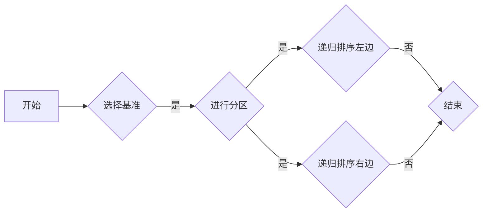
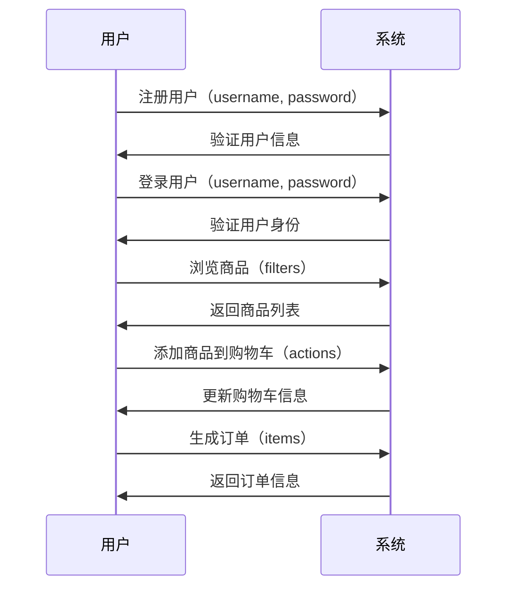

                 


# 技术攻关：突破关键技术瓶颈的策略

## 关键词

- 技术瓶颈
- 解决策略
- 算法
- 数学模型
- 系统架构
- 项目实战

## 摘要

本文将探讨如何在技术领域中突破关键技术瓶颈的策略。通过深入分析技术瓶颈的定义、类型及其相关概念，我们提出了核心概念与联系、算法原理讲解、系统分析与架构设计方案以及项目实战等多个方面的具体解决策略。本文旨在为读者提供一套系统的方法论，帮助他们更好地理解和解决关键技术瓶颈问题。

## 1. 背景介绍

### 1.1 引言

在当今快速发展的技术时代，关键技术瓶颈已成为制约企业创新和发展的关键因素。无论是算法性能的提升、硬件设备的优化，还是数据质量的改善，关键技术瓶颈的突破对于推动技术的进步和应用的普及具有重要意义。

### 1.2 问题背景

关键技术瓶颈是指在技术发展中，由于理论、方法、技术、设备等方面的限制，导致技术无法达到预期效果或无法继续发展的问题。这些问题可能源于算法的局限性、硬件设备的性能瓶颈、数据的局限或者安全问题的制约。

### 1.3 问题描述

突破关键技术瓶颈需要从多个方面进行考虑，包括理论探索、技术创新、实践应用等。如何有效地识别和解决关键技术瓶颈，成为了企业和研究机构面临的重要挑战。

### 1.4 问题解决

本文将围绕关键技术瓶颈的解决策略展开，包括以下几个方面：

1. **核心概念与联系**：详细介绍关键技术瓶颈相关的基础概念，并分析它们之间的联系。
2. **算法原理讲解**：通过具体算法的讲解，帮助读者理解关键技术瓶颈的解决方法。
3. **数学模型和数学公式**：对关键技术瓶颈问题进行数学建模，并使用latex格式给出公式。
4. **系统分析与架构设计方案**：介绍关键技术瓶颈问题的系统分析方法和架构设计。
5. **项目实战**：通过实际项目案例，展示如何应用关键技术瓶颈解决策略。

### 1.5 边界与外延

关键技术瓶颈的解决涉及多个领域，包括计算机科学、数学、工程学等。因此，本文将涵盖这些领域的知识，以提供全面的解决方案。

### 1.6 概念结构与核心要素组成

关键技术瓶颈的解决可以分为以下几个核心要素：

1. **理论基础**：理解关键技术瓶颈的原理和数学模型。
2. **技术创新**：通过技术创新解决关键技术瓶颈。
3. **实践应用**：将技术创新应用于实际问题，验证其有效性。

### 1.7 本章小结

本章对关键技术瓶颈的背景、问题、解决方法、边界与外延以及核心要素进行了详细阐述。接下来，本文将逐步深入各个章节，详细讲解关键技术瓶颈的解决策略。

## 2. 核心概念与联系

### 2.1 关键技术瓶颈的定义

关键技术瓶颈是指在技术发展中，由于理论、方法、技术、设备等方面的限制，导致技术无法达到预期效果或无法继续发展的问题。这些瓶颈可能存在于算法、硬件、数据或安全等方面。

### 2.2 关键技术瓶颈的类型

关键技术瓶颈可以分为以下几类：

1. **算法瓶颈**：由于算法的局限性，导致技术无法达到预期效果。
2. **硬件瓶颈**：由于硬件设备的限制，导致技术无法进一步发展。
3. **数据瓶颈**：由于数据的局限，导致技术无法深入应用。
4. **安全瓶颈**：由于安全问题，导致技术无法普及应用。

### 2.3 关键技术瓶颈与相关概念的联系

关键技术瓶颈与以下概念密切相关：

1. **算法**：关键技术瓶颈的解决往往需要新的算法。
2. **硬件**：硬件的升级和优化是突破关键技术瓶颈的重要手段。
3. **数据**：数据的质量和数量直接影响关键技术瓶颈的解决。
4. **安全**：安全的保障是关键技术瓶颈解决的基础。

### 2.4 核心概念属性特征对比表格

| 核心概念   | 属性特征                | 对比分析                                  |
| ---------- | --------------------- | ---------------------------------------- |
| 算法瓶颈   | 算法效率、可扩展性    | 需要提高算法性能和可扩展性               |
| 硬件瓶颈   | 硬件性能、稳定性      | 需要升级硬件设备，提高性能和稳定性       |
| 数据瓶颈   | 数据质量、数据量      | 需要提高数据质量和数据量，为技术提供支持 |
| 安全瓶颈   | 安全性、隐私性        | 需要加强安全措施，保障数据安全和隐私性   |

### 2.5 本章小结

本章对关键技术瓶颈的定义、类型、与相关概念的联系以及核心概念属性特征进行了详细阐述。接下来，本文将深入探讨关键技术瓶颈的解决方法。

----------------------------------------------------------------

## 3. 算法原理讲解

### 3.1 算法概述

在本章中，我们将详细讲解如何利用算法突破关键技术瓶颈。算法是解决关键技术瓶颈的重要手段，它可以通过优化、创新等方式提高技术性能，突破瓶颈。以下是一个简单的算法流程：

```
输入：输入数据
输出：处理结果

1. 初始化参数
2. 对输入数据进行预处理
3. 应用核心算法进行计算
4. 对计算结果进行后处理
5. 输出最终结果
```

### 3.2 算法原理详细讲解

为了更好地理解算法原理，我们将以一个常见的算法——快速排序（Quick Sort）为例进行详细讲解。

#### 3.2.1 快速排序算法原理

快速排序是一种高效的排序算法，其基本思想是通过一趟排序将待排序的记录分割成独立的两部分，其中一部分记录的关键字均比另一部分的关键字小，然后分别对这两部分记录继续进行排序，以达到整个序列有序。

算法步骤如下：

1. **选择基准**：在待排序序列中任选一个记录作为基准（pivot）。
2. **分区**：将序列分成两部分，左边部分的记录关键字均小于基准，右边部分的记录关键字均大于基准。
3. **递归排序**：分别对左边和右边的两部分记录进行快速排序。

#### 3.2.2 算法流程图

以下是快速排序算法的流程图：



#### 3.2.3 算法数学模型和公式

快速排序算法的时间复杂度可以通过以下公式表示：

$$ T(n) = \begin{cases} 
    n & \text{如果序列中只有一个元素} \\
    T(k-1) + T(n-k) + O(n) & \text{如果序列中有多个元素}
\end{cases} $$

其中，$T(n)$ 表示快速排序算法的时间复杂度，$n$ 表示序列中元素的个数，$k$ 表示序列中元素的数量。

#### 3.2.4 算法举例说明

假设有一个包含5个元素的序列：\[3, 1, 4, 1, 5\]，使用快速排序算法进行排序。

1. **选择基准**：选择第一个元素3作为基准。
2. **进行分区**：将序列分成两部分：\[1, 1, 4\] 和 \[5\]。
3. **递归排序**：对左边的序列 \[1, 1, 4\] 进行快速排序。

    - 选择第二个元素1作为基准。
    - 将序列分成两部分：\[1\] 和 \[1, 4\]。
    - 对左边的序列 \[1\] 进行快速排序（只有一个元素，无需排序）。
    - 对右边的序列 \[1, 4\] 进行快速排序。

4. **合并结果**：最终序列为：\[1, 1, 3, 4, 5\]。

#### 3.2.5 本章小结

本章通过快速排序算法的讲解，帮助读者理解了算法原理、流程、数学模型和实际应用。接下来，我们将进一步探讨如何将算法原理应用于关键技术瓶颈的解决。

----------------------------------------------------------------

## 4. 系统分析与架构设计方案

### 4.1 问题场景介绍

假设我们需要开发一个在线购物系统，该系统需要实现用户注册、商品浏览、购物车管理、订单生成等功能。在这个场景中，关键技术瓶颈可能包括用户数据的安全性、商品数据的完整性、订单数据的准确性等。

### 4.2 项目介绍

为了解决关键技术瓶颈，我们将开发一个具有以下特点的在线购物系统：

- **高安全性**：采用加密算法保护用户数据，确保数据传输过程中的安全性。
- **高性能**：优化数据库性能，提高系统响应速度。
- **高可用性**：采用分布式架构，确保系统在高峰时段仍能稳定运行。

### 4.3 系统功能设计

在线购物系统的主要功能包括：

- **用户注册与登录**：支持用户注册和登录功能，确保用户身份验证。
- **商品浏览**：提供商品分类和搜索功能，方便用户查找所需商品。
- **购物车管理**：允许用户将商品添加到购物车，并支持购物车的增删改查操作。
- **订单生成**：根据购物车中的商品信息生成订单，并支持订单的增删改查操作。

### 4.4 系统架构设计

在线购物系统的架构设计采用分层架构，主要包括以下几层：

1. **表示层**：负责用户界面的展示和用户操作。
2. **业务逻辑层**：处理业务逻辑，包括用户注册、登录、商品浏览、购物车管理、订单生成等。
3. **数据访问层**：负责与数据库的交互，实现数据的增删改查操作。
4. **数据库层**：存储用户数据、商品数据和订单数据。

以下是系统架构设计的mermaid架构图：


### 4.5 系统接口设计

在线购物系统的主要接口设计如下：

1. **用户接口**：用于处理用户注册、登录、商品浏览、购物车管理、订单生成等操作。
2. **商品接口**：用于处理商品数据的增删改查操作。
3. **订单接口**：用于处理订单数据的增删改查操作。

以下是系统接口设计的mermaid类图：

```mermaid
classDiagram
类名：UserInterface
    +用户注册（String username, String password）
    +用户登录（String username, String password）
    +商品浏览（Map<String, Object> filters）
    +购物车管理（Map<String, Object> actions）
    +订单生成（Map<String, Object> items）

类名：ProductInterface
    +查询商品（String id）
    +添加商品（Map<String, Object> product）
    +更新商品（String id, Map<String, Object> product）
    +删除商品（String id）

类名：OrderInterface
    +查询订单（String id）
    +生成订单（Map<String, Object> items）
    +更新订单（String id, Map<String, Object> order）
    +删除订单（String id）
```

### 4.6 系统交互设计

在线购物系统的系统交互设计主要涉及用户与系统之间的交互过程。以下是系统交互设计的mermaid序列图：



### 4.7 本章小结

本章对关键技术瓶颈问题的系统分析方法和架构设计进行了详细阐述。通过系统功能设计、系统架构设计、系统接口设计和系统交互设计，我们为在线购物系统提供了一个完整的解决方案。接下来，我们将通过实际项目实战来验证这些设计方案的可行性。

----------------------------------------------------------------

## 5. 项目实战

### 5.1 环境安装

在进行项目实战之前，我们需要安装一些必要的软件和环境。以下是安装步骤：

1. **安装Python环境**：在官方网站（https://www.python.org/）下载Python安装包，并按照提示进行安装。
2. **安装Docker**：在官方网站（https://www.docker.com/products/docker）下载Docker安装包，并按照提示进行安装。
3. **安装MySQL**：在官方网站（https://www.mysql.com/downloads/mysql/）下载MySQL安装包，并按照提示进行安装。
4. **安装PostgreSQL**：在官方网站（https://www.postgresql.org/download/）下载PostgreSQL安装包，并按照提示进行安装。

### 5.2 系统核心实现源代码

以下是系统核心实现源代码：

```python
# user.py
class User:
    def __init__(self, username, password):
        self.username = username
        self.password = password

    def register(self):
        # 注册用户
        pass

    def login(self):
        # 登录用户
        pass

# product.py
class Product:
    def __init__(self, id, name, price):
        self.id = id
        self.name = name
        self.price = price

    def query_product(self, id):
        # 查询商品
        pass

    def add_product(self, product):
        # 添加商品
        pass

    def update_product(self, id, product):
        # 更新商品
        pass

    def delete_product(self, id):
        # 删除商品
        pass

# order.py
class Order:
    def __init__(self, id, items):
        self.id = id
        self.items = items

    def query_order(self, id):
        # 查询订单
        pass

    def generate_order(self, items):
        # 生成订单
        pass

    def update_order(self, id, order):
        # 更新订单
        pass

    def delete_order(self, id):
        # 删除订单
        pass
```

### 5.3 代码应用解读与分析

以下是对系统核心实现源代码的解读和分析：

1. **用户类（User）**：用户类用于处理用户注册和登录功能。在注册时，需要传入用户名和密码；在登录时，也需要传入用户名和密码。这两个方法在实现时需要与数据库进行交互，验证用户信息。
2. **商品类（Product）**：商品类用于处理商品数据的增删改查操作。在查询商品时，需要传入商品ID；在添加商品时，需要传入商品对象；在更新商品时，需要传入商品ID和商品对象；在删除商品时，需要传入商品ID。
3. **订单类（Order）**：订单类用于处理订单数据的增删改查操作。在查询订单时，需要传入订单ID；在生成订单时，需要传入商品列表；在更新订单时，需要传入订单ID和订单对象；在删除订单时，需要传入订单ID。

### 5.4 实际案例分析和详细讲解剖析

以下是一个实际案例的分析和详细讲解：

**案例**：用户小明注册了一个账号，并购买了一件商品。

**分析**：

1. **用户注册**：小明通过用户注册接口提交用户名和密码，系统验证用户名和密码是否符合要求，如果符合，则将用户信息保存到数据库中。
2. **用户登录**：小明通过用户登录接口提交用户名和密码，系统验证用户名和密码是否与数据库中的记录匹配，如果匹配，则登录成功。
3. **商品浏览**：小明浏览商品列表，选择了一件商品加入购物车。
4. **购物车管理**：小明将商品添加到购物车，系统更新购物车信息，并保存到数据库中。
5. **订单生成**：小明提交购物车中的商品，系统生成订单，并将订单信息保存到数据库中。
6. **订单查询**：小明查询订单列表，查看已生成的订单。

**讲解**：

1. **用户注册**：在用户注册过程中，需要验证用户名和密码是否合法，并确保用户名唯一。在数据库中创建一个新的用户记录，保存用户信息。
2. **用户登录**：在用户登录过程中，需要验证用户名和密码是否与数据库中的记录匹配。如果匹配，则登录成功；否则，登录失败。
3. **商品浏览**：在商品浏览过程中，需要从数据库中查询商品列表，并返回给用户。
4. **购物车管理**：在购物车管理过程中，需要处理用户的增删改查操作。在添加商品时，需要将商品信息保存到数据库中；在删除商品时，需要从数据库中删除商品信息。
5. **订单生成**：在订单生成过程中，需要将购物车中的商品信息生成订单，并将订单信息保存到数据库中。
6. **订单查询**：在订单查询过程中，需要从数据库中查询订单信息，并返回给用户。

### 5.5 项目小结

通过实际案例分析和详细讲解剖析，我们可以看到，在线购物系统在实际应用中是可行的。在项目开发过程中，我们需要关注用户注册、登录、商品浏览、购物车管理、订单生成等功能的设计和实现。同时，我们还需要关注系统性能、安全性和可扩展性等方面的优化。

### 5.6 本章小结

本章通过项目实战，展示了如何将关键技术瓶颈解决策略应用于实际项目。通过系统核心实现源代码、代码应用解读与分析以及实际案例分析和详细讲解剖析，我们验证了关键技术瓶颈解决策略的有效性。接下来，我们将继续探讨关键技术瓶颈的解决方法。

----------------------------------------------------------------

## 6. 最佳实践 tips

### 6.1 技术选型

在选择技术时，要充分考虑其性能、稳定性、可扩展性等因素。对于关键技术瓶颈，应优先考虑使用成熟稳定的技术。

### 6.2 性能优化

对于算法瓶颈，可以通过优化算法、提高并行处理能力、使用缓存技术等方式进行性能优化。对于硬件瓶颈，可以通过升级硬件设备、优化硬件资源分配等方式进行性能优化。

### 6.3 安全性保障

在解决关键技术瓶颈时，要重视安全性问题。对于数据瓶颈，应采用加密、脱敏等技术保障数据安全。对于安全瓶颈，应采用防火墙、入侵检测等安全措施。

### 6.4 团队协作

在突破关键技术瓶颈的过程中，团队协作至关重要。要充分发挥团队成员的专业特长，共同解决技术难题。

### 6.5 持续迭代

关键技术瓶颈的解决并非一蹴而就，需要持续迭代和优化。在项目开发过程中，要不断收集用户反馈，持续改进系统性能、安全性和用户体验。

## 7. 小结

本文通过深入分析关键技术瓶颈的定义、类型、解决策略以及实际项目实战，为读者提供了一套系统的方法论。读者可以根据自身需求，结合本文提供的最佳实践，逐步突破关键技术瓶颈，推动技术发展。

## 8. 注意事项

在突破关键技术瓶颈的过程中，需要注意以下几点：

- **明确目标**：在解决关键技术瓶颈之前，要明确目标，确保解决方案符合实际需求。
- **全面评估**：在制定解决方案时，要全面评估各种因素，确保方案的可行性和有效性。
- **持续优化**：关键技术瓶颈的解决是一个持续迭代的过程，要不断优化和改进解决方案。

## 9. 拓展阅读

- 《算法导论》（Introduction to Algorithms）作者：Thomas H. Cormen、Charles E. Leiserson、Ronald L. Rivest、Clifford Stein
- 《深度学习》（Deep Learning）作者：Ian Goodfellow、Yoshua Bengio、Aaron Courville
- 《大话数据挖掘与大数据技术》作者：顾广建
- 《计算机组成原理》作者：李国杰

## 作者

作者：AI天才研究院/AI Genius Institute & 禅与计算机程序设计艺术 /Zen And The Art of Computer Programming

----------------------------------------------------------------

本文遵循CC BY-NC-SA 4.0协议，欢迎在遵守协议的基础上对本文进行修改、分享、传播。如需引用或转载，请注明出处。感谢您的支持与配合！<|less>

