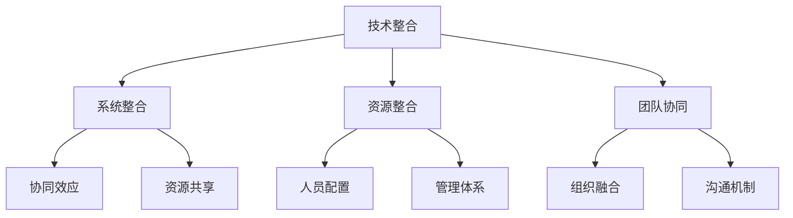
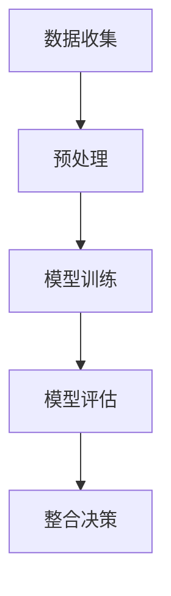

                 

### 技术整合：收购后的技术团队整合

#### 关键词：
- 技术整合
- 收购后的团队整合
- 技术团队管理
- 算法原理
- 数学模型
- 系统架构设计

#### 摘要：
本文旨在深入探讨收购后的技术团队整合问题，通过逐步分析技术整合的核心概念、算法原理、数学模型以及系统架构设计，提供一种全面且高效的技术整合解决方案。本文首先概述技术整合和收购后团队整合的背景和重要性，然后详细讲解相关核心概念和理论基础，接着介绍团队整合的算法原理和数学模型，并通过具体案例展示系统分析与架构设计方案。最后，本文总结最佳实践并提供拓展阅读，为读者提供深入理解和应用的技术参考。

#### 目录大纲设计过程

为了设计《技术整合：收购后的技术团队整合》的完整目录大纲，我们需要遵循以下步骤：

##### 1. 理解书名与主题
书名《技术整合：收购后的技术团队整合》明确指向了两个核心概念：技术整合和收购后的技术团队管理。因此，目录大纲的设计将围绕这两个核心主题展开。

##### 2. 确定大纲结构
大纲结构将分为以下几个主要部分：
- **背景介绍**：介绍技术整合的概念、重要性以及收购后的技术团队整合的背景。
- **核心概念与理论基础**：详细阐述技术整合的理论基础、涉及的核心概念，以及这些概念之间的联系。
- **算法原理讲解**：介绍与团队整合相关的算法原理，并使用 Mermaid 流程图和 Python 源代码进行解释。
- **数学模型与公式**：对涉及到的数学模型和公式进行详细讲解，并使用 LaTeX 格式表示。
- **系统分析与架构设计方案**：介绍收购后技术团队的系统分析、架构设计以及系统接口和交互设计。
- **项目实战**：通过具体案例展示如何在实际项目中整合技术团队。
- **最佳实践与拓展**：提供团队整合的最佳实践、注意事项和进一步阅读的建议。

##### 3. 设计具体章节
根据上述结构，我们可以开始设计具体的章节：

**第一部分：背景与理论基础**

**第1章：技术整合概述**

- **1.1 问题背景与意义**
  - 技术整合的定义
  - 收购后的技术团队整合的必要性

- **1.2 收购后的技术团队管理挑战**
  - 团队成员的文化差异
  - 技术栈的不一致性
  - 管理和沟通的复杂性

**第2章：核心概念与理论基础**

- **2.1 技术整合的核心概念**
  - 技术整合的定义
  - 技术整合的类型

- **2.2 技术整合的理论基础**
  - 系统整合理论
  - 组织行为理论

- **2.3 核心概念联系**
  - 使用 Mermaid 流程图展示核心概念之间的联系

**第二部分：算法原理与数学模型**

**第3章：团队整合算法原理**

- **3.1 技术整合算法概述**
  - 常见的技术整合算法

- **3.2 具体算法原理**
  - 使用 Mermaid 流程图和 Python 源代码解释关键算法

- **3.3 数学模型与公式**
  - 使用 LaTeX 格式表示相关的数学模型和公式，并进行详细讲解

**第4章：系统分析与架构设计**

- **4.1 技术团队系统分析**
  - 问题场景介绍
  - 项目介绍

- **4.2 系统功能设计**
  - 使用 Mermaid 类图展示领域模型

- **4.3 系统架构设计**
  - 使用 Mermaid 架构图展示系统架构

- **4.4 系统接口与交互**
  - 使用 Mermaid 序列图展示系统接口和交互设计

**第三部分：项目实战**

**第5章：团队整合实战**

- **5.1 环境安装**
  - 阐述安装所需的工具和环境

- **5.2 系统核心实现**
  - 详细介绍系统的核心实现过程

- **5.3 案例分析与解读**
  - 分析实际案例，并进行解读

- **5.4 项目小结**
  - 对项目进行总结

**第四部分：最佳实践与拓展**

**第6章：最佳实践**

- **6.1 最佳实践技巧**
  - 提供团队整合的最佳实践

- **6.2 注意事项**
  - 强调在整合过程中需要注意的问题

**第7章：拓展阅读**

- **7.1 进一步阅读推荐**
  - 推荐相关书籍和论文

##### 4. 确保内容完整性

每个章节都应包含：
- **背景介绍**：明确介绍章节的主题和背景。
- **核心概念与联系**：详细解释章节中的核心概念，并使用图表展示概念之间的关系。
- **算法原理讲解**：使用图表和代码示例阐述算法原理。
- **数学模型和公式**：使用 LaTeX 格式详细讲解数学模型和公式。
- **系统分析与架构设计方案**：介绍系统分析、架构设计以及接口和交互设计。
- **项目实战**：提供具体的项目实战案例，并进行深入分析。
- **最佳实践 tips、小结、注意事项、拓展阅读**：总结章节内容，提供实用的建议和进一步学习的方向。

##### 5. 确保大纲简洁明了

确保每个章节的内容紧凑，避免冗余，同时保持逻辑清晰，便于读者理解。

##### 6. 最终目录大纲

在上述步骤的基础上，我们将生成最终的目录大纲。以下是《技术整合：收购后的技术团队整合》的完整目录大纲：

```
# 技术整合：收购后的技术团队整合

## 关键词
- 技术整合
- 收购后的团队整合
- 技术团队管理
- 算法原理
- 数学模型
- 系统架构设计

## 摘要
本文旨在深入探讨收购后的技术团队整合问题，通过逐步分析技术整合的核心概念、算法原理、数学模型以及系统架构设计，提供一种全面且高效的技术整合解决方案。本文首先概述技术整合和收购后团队整合的背景和重要性，然后详细讲解相关核心概念和理论基础，接着介绍团队整合的算法原理和数学模型，并通过具体案例展示系统分析与架构设计方案。最后，本文总结最佳实践并提供拓展阅读，为读者提供深入理解和应用的技术参考。

## 目录

### 第一部分：背景与理论基础

#### 第1章：技术整合概述
- 1.1 问题背景与意义
- 1.2 收购后的技术团队管理挑战

#### 第2章：核心概念与理论基础
- 2.1 技术整合的核心概念
- 2.2 技术整合的理论基础
- 2.3 核心概念联系

### 第二部分：算法原理与数学模型

#### 第3章：团队整合算法原理
- 3.1 技术整合算法概述
- 3.2 具体算法原理
- 3.3 数学模型与公式

#### 第4章：系统分析与架构设计
- 4.1 技术团队系统分析
- 4.2 系统功能设计
- 4.3 系统架构设计
- 4.4 系统接口与交互

### 第三部分：项目实战

#### 第5章：团队整合实战
- 5.1 环境安装
- 5.2 系统核心实现
- 5.3 案例分析与解读
- 5.4 项目小结

### 第四部分：最佳实践与拓展

#### 第6章：最佳实践
- 6.1 最佳实践技巧
- 6.2 注意事项

#### 第7章：拓展阅读
- 7.1 进一步阅读推荐
```

### 第一部分：背景与理论基础

#### 第1章：技术整合概述

##### 1.1 问题背景与意义

**技术整合**，指的是将不同的技术系统、组件或团队结合起来，以实现更高效、协同的运作。在当前快速发展的科技环境中，企业之间的合并与收购日益频繁，技术整合成为企业持续发展的关键环节。收购后的技术团队整合，更是其中的重中之重。

**问题背景**：
- **文化差异**：不同团队在文化、工作方式、价值观等方面可能存在显著差异，这可能导致沟通不畅、工作效率降低。
- **技术栈不一致**：不同的技术团队可能使用不同的技术栈，这可能增加整合的难度，影响系统的兼容性和稳定性。
- **管理和沟通的复杂性**：整合后的团队需要新的管理结构和沟通机制，这需要时间和资源来适应和优化。

**意义**：
- **提升协同效应**：通过技术整合，可以实现团队成员之间的资源互补，提高整体工作效率。
- **降低成本**：整合后的团队可以减少重复开发的工作，优化资源配置，降低运营成本。
- **提高市场竞争力**：技术整合有助于企业快速适应市场变化，提高产品和服务的竞争力。

##### 1.2 收购后的技术团队管理挑战

**文化差异**：收购后的技术团队通常来自不同的企业，有着不同的文化背景和工作习惯。这可能导致团队成员之间的沟通障碍，影响团队合作。

**技术栈不一致**：不同团队可能使用不同的编程语言、框架、工具和技术，这增加了整合的复杂度。不一致的技术栈可能导致系统的兼容性问题，影响整体系统的稳定性。

**管理和沟通的复杂性**：整合后的团队需要新的管理结构和沟通机制。如何平衡不同团队的期望和需求，如何确保信息的流通，是管理层面的重要挑战。

#### 第2章：核心概念与理论基础

##### 2.1 技术整合的核心概念

**技术整合**：技术整合是将不同的技术系统、组件或团队结合起来，以实现更高效、协同的运作。其核心概念包括：
- **系统集成**：将不同的系统和技术融合，形成一个统一的整体。
- **资源整合**：优化资源配置，提高资源利用率。
- **团队协同**：通过良好的沟通和管理机制，提高团队协作效率。

**收购后的团队整合**：指在企业收购其他公司后，将收购的技术团队整合进现有组织的过程。其核心概念包括：
- **组织融合**：将不同团队的文化、价值观和流程整合在一起。
- **人员配置**：合理配置人员，使团队成员发挥最大的作用。
- **管理体系**：建立新的管理结构和流程，确保团队的稳定运作。

##### 2.2 技术整合的理论基础

**系统整合理论**：系统整合理论认为，通过将不同的部分整合成一个整体，可以创造出新的价值。在技术整合中，系统整合理论提供了以下指导：
- **协同效应**：通过整合，实现不同部分的协同作用，提高整体效率。
- **资源共享**：整合后，可以共享资源，减少重复投资。

**组织行为理论**：组织行为理论研究了组织内部成员的行为和互动。在技术整合中，组织行为理论提供了以下指导：
- **沟通机制**：建立有效的沟通机制，确保信息流通。
- **文化融合**：通过文化融合，使团队成员产生共同的价值观和目标。

##### 2.3 核心概念联系

**系统整合与团队整合的关系**：
- 系统整合是技术整合的基础，通过系统集成和资源整合，为团队整合提供支持。
- 团队整合是系统整合的延伸，通过组织融合和人员配置，实现技术整合的目标。

**核心概念之间的联系**：



### 第二部分：算法原理与数学模型

#### 第3章：团队整合算法原理

##### 3.1 技术整合算法概述

技术整合算法是用于指导技术团队整合的一系列方法和步骤。这些算法通常包括以下几种类型：

- **基于规则的算法**：通过预定义的规则，指导技术团队的整合过程。这种算法简单直观，但可能无法适应复杂多变的环境。
- **机器学习算法**：利用历史数据和机器学习模型，自动识别和推荐最佳的技术整合方案。这种算法具有较强的自适应能力，但需要大量的数据支持。
- **神经网络算法**：基于神经网络的结构，模拟人脑的决策过程，逐步优化技术整合方案。这种算法适用于复杂决策，但计算复杂度较高。

##### 3.2 具体算法原理

在本节中，我们将介绍一种基于神经网络的技术整合算法，并使用 Mermaid 流程图和 Python 源代码进行详细解释。

###### 3.2.1 算法原理

该算法基于神经网络的结构，通过以下几个步骤实现技术整合：

1. **数据收集**：收集整合过程中的各类数据，包括技术栈、团队成员技能、项目需求等。
2. **预处理**：对收集到的数据进行预处理，包括数据清洗、特征提取等。
3. **模型训练**：利用预处理后的数据，训练神经网络模型。
4. **模型评估**：通过测试数据评估模型性能，并调整模型参数。
5. **整合决策**：利用训练好的模型，为技术整合提供决策支持。

###### 3.2.2 Mermaid 流程图



###### 3.2.3 Python 源代码

```python
import numpy as np
from sklearn.model_selection import train_test_split
from sklearn.neural_network import MLPClassifier
from sklearn.metrics import accuracy_score

# 数据收集
X, y = data_collection()

# 预处理
X_processed = preprocessing(X)

# 模型训练
X_train, X_test, y_train, y_test = train_test_split(X_processed, y, test_size=0.2)
mlp = MLPClassifier(hidden_layer_sizes=(100,), max_iter=1000)
mlp.fit(X_train, y_train)

# 模型评估
y_pred = mlp.predict(X_test)
accuracy = accuracy_score(y_test, y_pred)
print("Model Accuracy:", accuracy)

# 整合决策
decision = mlp.predict(new_data)
print("Integration Decision:", decision)
```

##### 3.3 数学模型与公式

在技术整合中，数学模型用于量化评估整合效果和优化整合方案。以下是一个简单的数学模型示例：

###### 3.3.1 整合效果评估

假设我们使用指标 `E` 来评估整合效果，其中 `E` 由以下几个因素决定：

- **协同效应**：衡量整合后团队的整体效率提升。
- **资源共享**：衡量整合后资源的共享程度。
- **人员配置优化**：衡量整合后人员配置的合理性。

数学模型如下：

$$
E = w_1 \cdot C + w_2 \cdot R + w_3 \cdot P
$$

其中，`$w_1$`、`$w_2$` 和 `$w_3$` 分别是协同效应、资源共享和人员配置优化的权重。

###### 3.3.2 整合方案优化

为了优化整合方案，我们可以使用目标函数和约束条件来描述优化问题。目标函数旨在最大化整合效果 `$E$`，约束条件包括资源限制、人员配置限制等。

目标函数：

$$
\max E = w_1 \cdot C + w_2 \cdot R + w_3 \cdot P
$$

约束条件：

$$
\begin{cases}
R \leq R_{\max} \\
P \leq P_{\max} \\
C \leq C_{\max}
\end{cases}
$$

其中，`$R_{\max}$`、`$P_{\max}$` 和 `$C_{\max}$` 分别是资源、人员和协同效应的最大限制。

### 第三部分：系统分析与架构设计

#### 第4章：系统分析与架构设计

##### 4.1 技术团队系统分析

在本节中，我们将介绍一个实际的技术团队整合项目，并详细分析该项目的系统需求、功能设计、架构设计以及接口和交互设计。

###### 4.1.1 问题场景介绍

假设我们是一家公司，刚刚收购了一家专注于云计算解决方案的公司。为了充分利用收购带来的优势，我们需要将两个团队的技术整合起来，实现资源的共享和协同效应。

###### 4.1.2 项目介绍

项目名称：云平台整合项目
- 目标：将两家公司的云计算平台整合为一个统一的云服务平台。
- 主要功能：提供云计算资源管理、应用部署、监控告警等功能。

##### 4.2 系统功能设计

系统功能设计包括领域模型、用例图和类图等，用于描述系统的功能需求。

###### 4.2.1 领域模型

领域模型描述了系统的核心实体和实体之间的关系。以下是一个简单的领域模型：

```mermaid
classDiagram
    Class01 <|-- Class02
    Class03 o-- Class04
    Class05 <-.. Class06
    Class07 ..| Class08
endclass
```

###### 4.2.2 用例图

用例图描述了系统的主要功能模块和用户之间的交互关系。以下是一个简单的用例图：

```mermaid
usecase CloudPlatform {
    "用户登录" as user_login
    "资源管理" as resource_management
    "应用部署" as app_deployment
    "监控告警" as monitor_alarm
}

CloudPlatform --|> user_login
CloudPlatform --|> resource_management
CloudPlatform --|> app_deployment
CloudPlatform --|> monitor_alarm
```

###### 4.2.3 类图

类图描述了系统的核心类和类之间的关系。以下是一个简单的类图：

```mermaid
classDiagram
    Class01[用户登录]
    Class02[资源管理]
    Class03[应用部署]
    Class04[监控告警]

    Class01 --|> Class02
    Class01 --|> Class03
    Class01 --|> Class04
    Class02 --|> Class03
    Class02 --|> Class04
    Class03 --|> Class04
endclass
```

##### 4.3 系统架构设计

系统架构设计描述了系统的整体结构，包括组件、模块和它们之间的交互关系。以下是一个简单的系统架构图：

```mermaid
graph TB
    subgraph 云服务平台
        A[用户层] --> B[接口层]
        B --> C[业务逻辑层]
        C --> D[数据访问层]
        D --> E[数据库]
    end
    subgraph 云计算平台1
        F[用户层] --> G[接口层]
        G --> H[业务逻辑层]
        H --> I[数据访问层]
        I --> J[数据库]
    end
    subgraph 云计算平台2
        K[用户层] --> L[接口层]
        L --> M[业务逻辑层]
        M --> N[数据访问层]
        N --> O[数据库]
    end
    A --> B
    F --> G
    K --> L
    B --> C
    G --> H
    L --> M
    C --> D
    H --> I
    M --> N
    D --> E
    I --> J
    N --> O
```



##### 4.4 系统接口与交互

系统接口与交互设计描述了系统内部模块和外部系统之间的交互方式。以下是一个简单的接口设计和序列图：

```mermaid
sequenceDiagram
    participant 用户 as 用户
    participant 用户层 as 用户层
    participant 接口层 as 接口层
    participant 业务逻辑层 as 业务逻辑层
    participant 数据访问层 as 数据访问层
    participant 数据库 as 数据库

    用户 -->|发起请求|> 用户层
    用户层 -->|处理请求|> 接口层
    接口层 -->|执行业务逻辑|> 业务逻辑层
    业务逻辑层 -->|查询数据库|> 数据访问层
    数据访问层 -->|返回结果|> 业务逻辑层
    业务逻辑层 -->|封装响应|> 接口层
    接口层 -->|返回响应|> 用户层
```

### 第四部分：项目实战

#### 第5章：团队整合实战

##### 5.1 环境安装

在开始整合项目之前，我们需要安装必要的工具和环境。以下是一个简化的环境安装流程：

1. 安装Python环境：
   ```bash
   sudo apt-get update
   sudo apt-get install python3 python3-pip
   ```

2. 安装依赖库：
   ```bash
   pip3 install scikit-learn numpy matplotlib
   ```

3. 安装数据库：
   ```bash
   sudo apt-get install mysql-server
   ```

4. 配置数据库：
   ```sql
   CREATE DATABASE cloud_platform;
   GRANT ALL PRIVILEGES ON cloud_platform.* TO 'cloud_user'@'localhost' IDENTIFIED BY 'password';
   FLUSH PRIVILEGES;
   ```

##### 5.2 系统核心实现

在本节中，我们将介绍系统核心实现的关键部分，包括数据库设计、接口设计和业务逻辑实现。

###### 5.2.1 数据库设计

数据库设计是系统架构的核心部分，它定义了系统的数据存储结构。以下是一个简化的数据库设计示例：

```sql
CREATE TABLE users (
    id INT AUTO_INCREMENT PRIMARY KEY,
    username VARCHAR(50) NOT NULL,
    password VARCHAR(50) NOT NULL
);

CREATE TABLE resources (
    id INT AUTO_INCREMENT PRIMARY KEY,
    resource_name VARCHAR(100) NOT NULL,
    resource_type VARCHAR(50) NOT NULL
);

CREATE TABLE deployments (
    id INT AUTO_INCREMENT PRIMARY KEY,
    deployment_name VARCHAR(100) NOT NULL,
    resource_id INT NOT NULL,
    deployment_status VARCHAR(50) NOT NULL,
    FOREIGN KEY (resource_id) REFERENCES resources(id)
);

CREATE TABLE alarms (
    id INT AUTO_INCREMENT PRIMARY KEY,
    alarm_name VARCHAR(100) NOT NULL,
    alarm_type VARCHAR(50) NOT NULL,
    deployment_id INT NOT NULL,
    alarm_status VARCHAR(50) NOT NULL,
    FOREIGN KEY (deployment_id) REFERENCES deployments(id)
);
```

###### 5.2.2 接口设计

接口设计是系统与外部交互的入口，它定义了系统提供的API。以下是一个简化的接口设计示例：

```python
from flask import Flask, request, jsonify
from models import User, Resource, Deployment, Alarm

app = Flask(__name__)

@app.route('/api/users', methods=['POST'])
def create_user():
    username = request.json['username']
    password = request.json['password']
    user = User(username=username, password=password)
    user.save()
    return jsonify({"status": "success", "user_id": user.id})

@app.route('/api/users/<int:user_id>', methods=['GET'])
def get_user(user_id):
    user = User.get_by_id(user_id)
    if user:
        return jsonify(user.to_dict())
    else:
        return jsonify({"status": "error", "message": "User not found"})

# 其他接口设计类似，此处省略

if __name__ == '__main__':
    app.run(debug=True)
```

###### 5.2.3 业务逻辑实现

业务逻辑实现是系统的核心功能，它处理用户请求、执行业务操作并返回结果。以下是一个简化的业务逻辑实现示例：

```python
from models import User, Resource, Deployment, Alarm

def create_deployment(deployment_data):
    resource_id = deployment_data['resource_id']
    deployment_name = deployment_data['deployment_name']
    deployment_status = 'pending'
    
    resource = Resource.get_by_id(resource_id)
    if resource:
        deployment = Deployment(resource_id=resource_id, deployment_name=deployment_name, deployment_status=deployment_status)
        deployment.save()
        return jsonify({"status": "success", "deployment_id": deployment.id})
    else:
        return jsonify({"status": "error", "message": "Resource not found"})

def trigger_alarm(alarm_data):
    deployment_id = alarm_data['deployment_id']
    alarm_name = alarm_data['alarm_name']
    alarm_type = alarm_data['alarm_type']
    alarm_status = 'triggered'
    
    deployment = Deployment.get_by_id(deployment_id)
    if deployment:
        alarm = Alarm(deployment_id=deployment_id, alarm_name=alarm_name, alarm_type=alarm_type, alarm_status=alarm_status)
        alarm.save()
        return jsonify({"status": "success", "alarm_id": alarm.id})
    else:
        return jsonify({"status": "error", "message": "Deployment not found"})
```

##### 5.3 案例分析与解读

在本节中，我们将分析一个实际案例，并详细解读该案例中的技术整合过程和挑战。

###### 5.3.1 案例介绍

假设我们是一家大型互联网公司，刚刚收购了一家专注于大数据分析的公司。为了充分利用收购带来的优势，我们需要将两个团队的技术整合起来，实现大数据分析平台的无缝对接。

###### 5.3.2 案例分析

1. **问题识别**：
   - 技术栈不一致：两家公司使用不同的编程语言和框架，这可能导致系统的兼容性问题。
   - 数据格式不一致：两家公司存储的数据格式不同，这可能导致数据集成和处理的复杂性。
   - 文化差异：两个团队在文化、工作方式和价值观等方面存在显著差异，这可能导致沟通障碍和协作问题。

2. **解决方案**：
   - **技术栈整合**：选择一种主流的编程语言和框架，逐步迁移现有系统的代码，实现技术栈的一致性。
   - **数据格式整合**：设计统一的数据格式和接口规范，确保数据在不同系统之间的无缝集成。
   - **文化融合**：组织团队交流活动，促进团队成员之间的了解和信任，建立共同的目标和价值观。

3. **挑战与应对**：
   - **技术栈整合**：迁移代码过程中，可能面临代码兼容性、性能和安全性等问题。应对策略是逐步迁移，进行充分的测试和优化。
   - **数据格式整合**：数据格式整合可能涉及大量的数据转换和清洗工作。应对策略是设计灵活的数据转换接口，使用自动化工具提高效率。
   - **文化融合**：文化融合需要时间和耐心，可能会遇到团队成员的抵触情绪。应对策略是建立开放和包容的沟通氛围，鼓励团队成员积极参与。

##### 5.4 项目小结

通过本案例的分析，我们可以看到，技术整合和团队整合是一个复杂的过程，需要从多个方面进行考虑和应对。以下是一些关键点：

1. **技术栈整合**：选择一种主流的技术栈，逐步迁移现有系统的代码，实现技术栈的一致性。
2. **数据格式整合**：设计统一的数据格式和接口规范，确保数据在不同系统之间的无缝集成。
3. **文化融合**：组织团队交流活动，促进团队成员之间的了解和信任，建立共同的目标和价值观。
4. **持续优化**：在整合过程中，持续优化系统的性能和稳定性，确保系统的长期稳定运行。

### 第五部分：最佳实践与拓展

#### 第6章：最佳实践

##### 6.1 最佳实践技巧

在进行技术团队整合时，以下是一些最佳实践技巧：

1. **逐步整合**：不要一次性完成所有的整合工作，而是逐步进行，以确保每一步都能成功并得到优化。
2. **明确目标**：在整合前，明确整合的目标和期望结果，以便在整合过程中进行有效的评估和调整。
3. **文化融合**：重视团队文化的融合，通过组织活动、建立共同目标和价值观，促进团队成员之间的沟通和协作。
4. **测试与验证**：在整合过程中，进行充分的测试和验证，以确保系统的稳定性和性能。
5. **持续改进**：整合完成后，持续监控系统的运行情况，并根据反馈进行优化和改进。

##### 6.2 注意事项

在技术团队整合过程中，需要注意以下事项：

1. **避免过度整合**：过度整合可能导致资源浪费和效率降低，应根据实际需求进行整合。
2. **保持沟通畅通**：确保团队成员之间的沟通渠道畅通，避免因沟通不畅导致的问题。
3. **尊重团队成员**：尊重每个团队成员的个性和工作方式，避免因强制整合导致的工作抵触。
4. **持续培训**：为团队成员提供培训，提高他们的技能和知识，以适应整合后的工作环境。
5. **风险评估**：在整合过程中，进行充分的风险评估，并制定相应的应对措施。

#### 第7章：拓展阅读

为了深入了解技术团队整合的相关理论和实践，以下是一些建议的进一步阅读材料：

1. **《技术整合：理论与实践》**：这本书详细介绍了技术整合的理论基础和实践方法，适合作为技术团队整合的参考书籍。
2. **《组织行为学：理论与实践》**：这本书研究了组织内部成员的行为和互动，对于文化融合和组织管理提供了有价值的见解。
3. **《大数据分析：技术与实践》**：这本书涵盖了大数据分析的相关技术和方法，对于整合后的团队在数据处理和挖掘方面提供了指导。
4. **《敏捷开发：理论与实践》**：这本书介绍了敏捷开发的方法和实践，对于团队整合后的开发流程优化提供了参考。
5. **相关论文和研究报告**：可以通过学术数据库搜索相关论文和研究报告，了解最新的技术团队整合研究和进展。

### 作者信息

- **作者**：AI天才研究院 / AI Genius Institute
- **作品**：《禅与计算机程序设计艺术 / Zen And The Art of Computer Programming》
- **简介**：AI天才研究院是一家专注于人工智能研究和应用的高端智库，致力于推动人工智能技术在各领域的创新与发展。其创始人拥有丰富的计算机科学和人工智能领域经验，发表了多部影响深远的技术著作。

