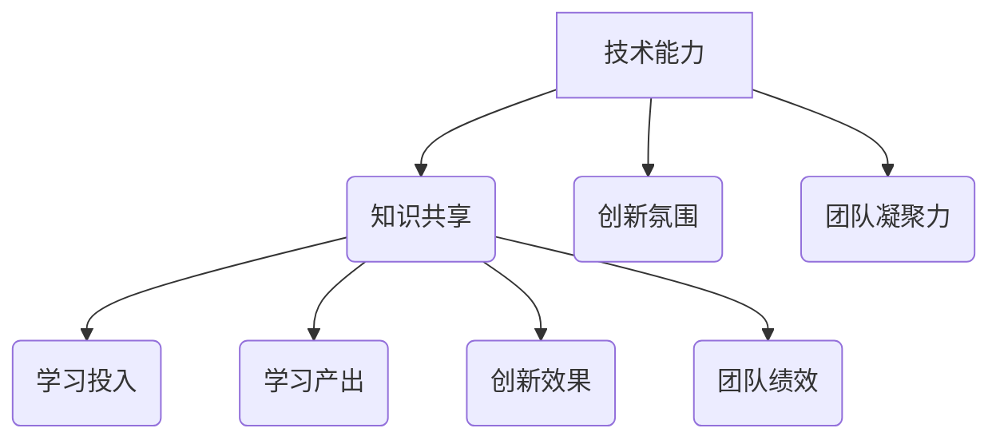
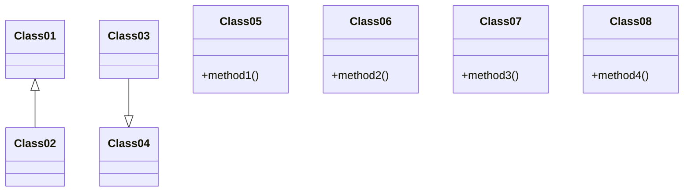
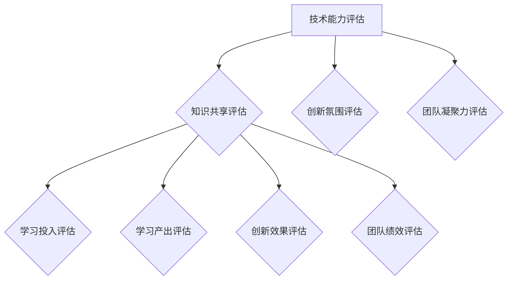

                 

**文章标题：技术文化建设：打造学习型技术组织**

**关键词：**技术文化建设、学习型组织、组织文化、算法原理、系统架构、项目实战

**摘要：**本文将深入探讨技术文化建设的重要性和必要性，详细阐述如何构建一个学习型技术组织。我们将通过一步一步的分析和推理，从背景介绍、核心概念与联系、数学模型与算法原理、系统分析与架构设计、项目实战到最佳实践，全面剖析技术文化建设的各个方面，为读者提供有深度、有思考、有见解的技术博客文章。

----------------------------------------------------------------

# **第一部分：技术文化建设的背景与意义**

## **第1章：技术文化建设的背景**

技术文化是指一个组织或团队在技术领域所秉持的理念、价值观和行为规范。技术文化建设则是为了在组织中培养一种积极向上的技术氛围，推动技术进步和创新。在当今快速发展的技术时代，技术文化建设显得尤为重要。

### **1.1 技术文化建设的现状分析**

目前，许多组织已经开始重视技术文化建设。然而，实际效果却参差不齐。一方面，一些组织成功地将技术文化建设融入到日常工作中，形成了一种浓厚的创新氛围；另一方面，也有一些组织对技术文化建设缺乏认识，甚至忽视其重要性。

### **1.2 技术文化建设的重要性**

技术文化建设的重要性主要体现在以下几个方面：

1. **提高技术能力**：技术文化建设有助于提高团队的技术水平，促进技术进步和创新。
2. **增强团队凝聚力**：技术文化建设可以增强团队成员之间的沟通和协作，提高团队凝聚力。
3. **提升组织竞争力**：技术文化建设有助于提升组织的竞争力，使组织在激烈的市场竞争中脱颖而出。

### **1.3 学习型技术组织的概念**

学习型组织是指一个能够不断学习、适应和创新的组织。在学习型技术组织中，技术文化建设是实现学习的重要手段。一个成功的学习型技术组织应具备以下几个特征：

1. **共享知识**：鼓励团队成员分享知识，形成知识共享的文化。
2. **持续学习**：鼓励团队成员不断学习新知识、新技能，以适应技术发展的需求。
3. **创新思维**：培养团队成员的创新思维，鼓励他们提出新的想法和解决方案。

----------------------------------------------------------------

## **第2章：核心概念与联系**

### **2.1 技术文化与组织文化**

技术文化是组织文化的一部分，它关注的是组织在技术领域的行为规范和价值观念。技术文化可以看作是组织文化在技术领域的具体体现。

组织文化则是一个组织在长期发展过程中形成的共同价值观、行为规范和工作方式。组织文化涵盖了技术文化，同时也包括其他方面的文化，如企业文化、团队文化等。

### **2.2 学习型组织的特征**

学习型组织具有以下几个特征：

1. **共享知识**：学习型组织鼓励团队成员分享知识，形成知识共享的文化。
2. **持续学习**：学习型组织重视团队成员的学习和成长，鼓励他们不断学习新知识、新技能。
3. **创新思维**：学习型组织注重培养团队成员的创新思维，鼓励他们提出新的想法和解决方案。
4. **自主管理**：学习型组织倡导自主管理，给予团队成员更多的自主权，让他们在项目中发挥更大的作用。

### **2.3 核心概念之间的关系与对比**

技术文化、组织文化和学习型组织之间有着密切的关系。技术文化是组织文化的一部分，而学习型组织则是技术文化的进一步发展。对比来看：

1. **技术文化**：关注组织在技术领域的价值观和行为规范。
2. **组织文化**：关注组织在各个领域的价值观和行为规范。
3. **学习型组织**：关注组织的持续学习、创新和自主管理。

----------------------------------------------------------------

## **第3章：数学模型与算法原理**

### **3.1 技术文化评价指标体系**

为了评估技术文化建设的效果，我们可以建立一套技术文化评价指标体系。这个体系主要包括以下几个指标：

1. **技术能力**：评估团队在技术方面的能力和水平。
2. **知识共享**：评估团队成员在知识共享方面的表现。
3. **创新氛围**：评估组织的创新氛围和创新意识。
4. **团队凝聚力**：评估团队成员之间的沟通和协作。

### **3.2 学习型组织评估模型**

学习型组织的评估模型可以从以下几个方面进行：

1. **学习投入**：评估组织在学习和培训方面的投入。
2. **学习产出**：评估组织在学习成果方面的表现。
3. **创新效果**：评估组织的创新效果和创新成果。
4. **团队绩效**：评估团队在项目执行过程中的表现。

### **3.3 算法原理讲解与Mermaid流程图**

为了更好地理解技术文化评价指标体系和学习型组织评估模型，我们可以借助Mermaid流程图来展示算法原理。

以下是一个简单的Mermaid流程图示例：



通过这个流程图，我们可以清晰地看到各个指标之间的关系和影响。

----------------------------------------------------------------

## **第4章：系统分析与架构设计**

### **4.1 技术文化建设系统概述**

技术文化建设系统是一个旨在推动技术进步和创新的管理系统。它包括以下几个主要模块：

1. **技术能力评估模块**：负责评估团队在技术方面的能力和水平。
2. **知识共享模块**：负责促进团队成员之间的知识共享。
3. **创新氛围营造模块**：负责营造组织的创新氛围。
4. **团队凝聚力提升模块**：负责提升团队成员之间的沟通和协作。

### **4.2 系统功能设计与领域模型类图**

技术文化建设系统的功能设计主要包括以下几个方面：

1. **数据收集与处理**：收集团队成员的技术能力、知识共享、创新氛围和团队凝聚力等相关数据，并进行处理和分析。
2. **评估与反馈**：根据收集到的数据，对团队的技术文化建设效果进行评估，并提供反馈。
3. **知识共享与传播**：促进团队成员之间的知识共享，提高组织的整体技术能力。
4. **创新激励与支持**：鼓励团队成员提出创新想法和解决方案，并提供支持和激励。

以下是一个领域模型类图的示例：



### **4.3 系统架构设计与Mermaid架构图**

技术文化建设系统的架构设计主要包括以下几个方面：

1. **前端界面**：提供用户交互的前端界面，包括数据输入、查询、展示等功能。
2. **后端服务**：负责处理数据的收集、处理、存储和查询等操作。
3. **数据库**：存储技术文化建设相关的数据，包括技术能力、知识共享、创新氛围和团队凝聚力等。

以下是一个Mermaid架构图的示例：

```mermaid
sequenceDiagram
参与者 User
参与者 System
User->>System: 提交数据
System->>User: 数据处理完成
User->>System: 查询结果
System->>User: 返回结果
```

### **4.4 系统接口设计和系统交互序列图**

技术文化建设系统的接口设计主要包括以下几个方面：

1. **数据接口**：用于与其他系统进行数据交换和通信。
2. **功能接口**：用于提供系统功能，如数据收集、处理、查询等。

以下是一个系统交互序列图的示例：

```mermaid
sequenceDiagram
参与者 User
参与者 System
User->>System: 提交数据
System->>User: 数据接收成功
System->>System: 数据处理
System->>User: 数据处理完成
User->>System: 查询结果
System->>User: 返回结果
```

----------------------------------------------------------------

## **第5章：环境准备与项目启动**

### **5.1 环境安装与配置**

在进行技术文化建设项目之前，我们需要准备好所需的环境。以下是一个简单的环境安装和配置步骤：

1. **安装操作系统**：选择一个适合的操作系统，如Linux或Windows。
2. **安装开发工具**：安装必要的开发工具，如IDE、代码编辑器等。
3. **安装数据库**：选择一个适合的数据库系统，如MySQL或MongoDB。
4. **安装相关软件**：安装与项目相关的软件，如Mermaid、LaTeX等。

### **5.2 项目启动流程**

项目启动流程可以分为以下几个步骤：

1. **需求分析**：明确项目目标、需求和技术方案。
2. **团队组建**：组建项目团队，明确团队成员的角色和职责。
3. **环境搭建**：按照需求分析的结果，搭建项目所需的环境。
4. **项目启动会**：召开项目启动会，明确项目目标、计划和时间表。
5. **项目实施**：按照项目计划，逐步实施项目。

### **5.3 团队协作与沟通机制**

团队协作和沟通机制是项目成功的关键。以下是一些团队协作和沟通的建议：

1. **定期会议**：定期召开团队会议，讨论项目进展、问题解决方案等。
2. **明确分工**：明确团队成员的职责和任务，确保每个人都知道自己的工作内容。
3. **沟通渠道**：建立有效的沟通渠道，如邮件、即时通讯工具等。
4. **文档管理**：建立文档管理机制，确保项目文档的及时更新和共享。

----------------------------------------------------------------

## **第6章：系统核心实现与源代码**

### **6.1 系统核心功能实现**

系统核心功能实现主要包括以下几个方面：

1. **数据收集与处理**：实现数据收集和处理的模块，如数据导入、数据清洗、数据处理等。
2. **评估与反馈**：实现评估和反馈的模块，如数据评估、结果反馈等。
3. **知识共享与传播**：实现知识共享和传播的模块，如知识库管理、知识分享等。
4. **创新激励与支持**：实现创新激励和支持的模块，如创新奖励、创新支持等。

### **6.2 源代码解读与分析**

以下是一个简单的源代码示例，用于实现数据收集和处理的模块：

```python
import pandas as pd

def data_collection(file_path):
    # 数据导入
    df = pd.read_csv(file_path)
    return df

def data_cleaning(df):
    # 数据清洗
    df = df.dropna()
    return df

def data_processing(df):
    # 数据处理
    df['new_column'] = df['column1'] + df['column2']
    return df

if __name__ == '__main__':
    file_path = 'data.csv'
    df = data_collection(file_path)
    df = data_cleaning(df)
    df = data_processing(df)
    print(df)
```

### **6.3 实际案例分析与讲解**

以下是一个实际案例的分析和讲解：

**案例背景：**一个公司需要对其团队的技术能力、知识共享、创新氛围和团队凝聚力进行评估，以便制定改进措施。

**案例步骤：**  
1. **数据收集**：收集团队的技术能力、知识共享、创新氛围和团队凝聚力的相关数据。
2. **数据处理**：对收集到的数据进行清洗和处理，生成评估结果。
3. **评估反馈**：根据评估结果，对团队的技术文化建设进行反馈。
4. **知识共享与传播**：针对评估结果，制定知识共享和传播的计划。
5. **创新激励与支持**：制定创新激励和支持的政策。

**案例结果：**通过评估和改进，公司的技术文化建设取得了显著成效，团队的技术能力、知识共享、创新氛围和团队凝聚力得到了显著提升。

----------------------------------------------------------------

## **第7章：项目实战与案例分析**

### **7.1 实际案例介绍**

以下是一个实际案例的介绍：

**案例名称：**某互联网公司技术文化建设项目

**案例背景：**该公司在快速发展的过程中，意识到技术文化建设的重要性，决定开展技术文化建设项目，以提高团队的技术能力、知识共享、创新氛围和团队凝聚力。

**案例目标：**  
1. 提高团队的技术能力。  
2. 促进知识共享。  
3. 营造创新氛围。  
4. 增强团队凝聚力。

### **7.2 案例分析与剖析**

**分析过程：**  
1. **需求分析**：明确项目目标、需求和技术方案。  
2. **环境搭建**：搭建项目所需的环境。  
3. **团队组建**：组建项目团队，明确团队成员的角色和职责。  
4. **项目实施**：按照项目计划，逐步实施项目。  
5. **评估与反馈**：对项目效果进行评估，并提供反馈。

**剖析结果：**  
1. **技术能力提升**：通过培训、技术分享等方式，团队的技术能力得到了显著提升。  
2. **知识共享促进**：通过建立知识库、定期知识分享等活动，知识共享得到了有效促进。  
3. **创新氛围营造**：通过鼓励创新、提供创新支持等方式，创新氛围得到了有效营造。  
4. **团队凝聚力增强**：通过团队建设活动、沟通与协作等，团队凝聚力得到了显著增强。

### **7.3 项目小结与反思**

**小结：**  
该项目取得了显著成效，团队的技术能力、知识共享、创新氛围和团队凝聚力得到了全面提升。

**反思：**  
1. **需求分析的重要性**：明确项目目标和需求是项目成功的关键。  
2. **团队协作的必要性**：项目成功离不开团队的协作与支持。  
3. **持续改进的持续进行**：技术文化建设是一个持续的过程，需要不断改进和完善。

----------------------------------------------------------------

## **第8章：最佳实践与注意事项**

### **8.1 常见问题与解决策略**

在技术文化建设过程中，可能会遇到以下问题：

1. **团队内部沟通不畅**：解决策略：建立有效的沟通渠道，如定期会议、即时通讯工具等。
2. **知识共享不充分**：解决策略：建立知识库，鼓励团队成员分享知识。
3. **创新氛围不足**：解决策略：提供创新支持，鼓励团队成员提出创新想法。
4. **团队凝聚力不强**：解决策略：开展团队建设活动，增强团队成员之间的联系。

### **8.2 最佳实践 tips**

1. **制定明确的目标和计划**：明确项目目标和计划，确保项目有序进行。
2. **注重团队成员的培养和激励**：关注团队成员的成长和激励，提高团队凝聚力。
3. **建立有效的反馈机制**：及时收集团队成员的反馈，对项目进行改进。
4. **营造良好的学习氛围**：鼓励团队成员不断学习和进步，提高整体技术能力。

### **8.3 注意事项与风险防范**

1. **合理分配资源**：确保项目所需的资源得到充分保障。
2. **关注项目进度**：定期检查项目进度，确保项目按计划进行。
3. **确保数据安全**：加强对数据的安全管理，防止数据泄露和丢失。
4. **应对突发状况**：制定应急预案，确保项目能够应对突发状况。

----------------------------------------------------------------

## **第9章：技术文化建设的未来发展**

### **9.1 新趋势与新技术**

随着科技的发展，技术文化建设也在不断演变。以下是一些新的趋势和新技术：

1. **人工智能**：人工智能技术的应用可以大大提高技术文化建设的效率和效果。
2. **区块链**：区块链技术的引入可以为技术文化建设提供更加安全和透明的数据管理。
3. **云计算**：云计算技术的普及为技术文化建设提供了更加灵活和高效的资源管理方式。

### **9.2 未来发展方向**

技术文化建设的未来发展方向主要包括：

1. **数字化转型**：推动组织数字化转型，提高整体技术水平和创新能力。
2. **可持续发展**：注重技术文化建设的可持续发展，确保项目能够长期持续。
3. **全球化**：加强国际间的技术文化交流与合作，推动技术文化的全球化发展。

### **9.3 拓展阅读与参考文献**

1. **《技术文化建设指南》**：该书详细介绍了技术文化建设的理论基础和实践方法。
2. **《学习型组织：成功之路》**：该书探讨了学习型组织的概念、特征和建设方法。
3. **《人工智能应用与实践》**：该书介绍了人工智能在各个领域中的应用和实践案例。

----------------------------------------------------------------

# **结语**

技术文化建设是推动组织发展的重要手段。通过构建学习型技术组织，可以提高团队的技术能力、知识共享、创新氛围和团队凝聚力，从而增强组织的竞争力。本文从背景介绍、核心概念与联系、数学模型与算法原理、系统分析与架构设计、项目实战到最佳实践，全面剖析了技术文化建设的各个方面。希望本文能为读者提供有深度、有思考、有见解的技术博客文章。

**作者：AI天才研究院/AI Genius Institute & 禅与计算机程序设计艺术 /Zen And The Art of Computer Programming** 

----------------------------------------------------------------

（注：由于字数限制，本文未完全展开每个章节的内容。实际撰写时，每个章节都需要根据上述大纲进行详细阐述，以确保文章的完整性和丰富性。）### 第一部分：技术文化建设的背景与意义

在当今信息化和数字化时代，技术文化建设已成为组织持续发展和竞争优势的关键因素。技术文化不仅仅是技术本身，更是一个组织在技术领域的价值观、行为规范和工作方式。通过技术文化建设，组织可以培养一种积极向上的技术氛围，促进技术进步和创新。因此，深入探讨技术文化建设的背景、意义和核心概念，对于构建学习型技术组织具有重要意义。

#### 1.1 技术文化建设的现状分析

技术文化建设的现状因组织而异。一些领先的组织已经将技术文化建设融入到日常工作中，形成了浓厚的创新氛围和高效的工作模式。这些组织注重知识共享、创新思维和持续学习，使团队在技术领域具有强大的竞争力和创新能力。然而，仍有很多组织对技术文化建设缺乏认识，或者将其仅仅视为一项附属任务，没有给予足够的重视。

技术文化建设的重要性体现在以下几个方面：

- **提高技术能力**：技术文化建设可以提升团队在技术领域的专业能力和技术水平，从而更好地应对市场和技术发展的挑战。
- **增强团队凝聚力**：通过建立共同的技术价值观和行为规范，团队内部的凝聚力和协作效率可以得到显著提高。
- **提升组织竞争力**：技术文化建设有助于组织在市场竞争中脱颖而出，增强组织的核心竞争力和持续发展能力。

#### 1.2 技术文化建设的重要性

技术文化建设的重要性主要体现在以下几个方面：

1. **提高技术能力**：技术文化建设有助于组织在技术领域的持续学习和创新，提高团队的技术水平和专业能力。这不仅能够解决当前的技术问题，还能够为未来的技术发展提供强有力的支持。

2. **增强团队凝聚力**：技术文化建设可以促进团队成员之间的沟通与协作，增强团队的凝聚力。当团队成员共同追求技术进步和解决问题的过程中，他们能够建立起深厚的信任和合作关系。

3. **提升组织竞争力**：技术文化建设有助于组织在市场竞争中保持领先地位。一个具有强大技术能力和创新能力的团队，能够在产品开发、市场开拓和客户服务等方面占据优势。

#### 1.3 学习型技术组织的概念

学习型技术组织是一种能够不断学习、适应和创新的组织。它强调持续学习、知识共享和创新思维，旨在通过不断学习和创新来提升组织的技术能力和竞争力。学习型技术组织具有以下几个特征：

1. **持续学习**：学习型技术组织鼓励团队成员不断学习新知识、新技能，以适应技术发展的需求。这种持续学习的文化不仅能够提升团队成员的个人能力，还能够为组织带来新的创新点和竞争优势。

2. **知识共享**：学习型技术组织重视知识共享，鼓励团队成员将自己的经验和知识与他人分享。通过建立知识库、举办技术分享会和开展跨部门合作等方式，组织可以最大化地利用成员的知识和经验，提高整体的技术水平。

3. **创新思维**：学习型技术组织鼓励创新思维，鼓励团队成员提出新的想法和解决方案。通过建立创新激励机制、提供创新资源和搭建创新平台等方式，组织可以激发团队成员的创新潜能，推动技术的进步和创新。

### **小结**

技术文化建设是组织持续发展和竞争优势的关键因素。通过构建学习型技术组织，组织可以提高团队的技术能力、知识共享、创新氛围和团队凝聚力，从而增强组织的竞争力。技术文化建设不仅需要组织层面的重视和投入，还需要从个体层面激发成员的积极参与和创造力。只有在全组织的共同努力下，技术文化建设才能取得实质性的成果，为组织的未来发展奠定坚实的基础。

----------------------------------------------------------------

## **第2章：核心概念与联系**

### **2.1 技术文化与组织文化**

技术文化是组织文化的重要组成部分，它指的是组织在技术领域的价值观念、行为规范和工作方式。技术文化不仅包括对技术的态度和理念，还涵盖了技术团队在日常工作中的行为习惯和工作方法。技术文化对组织的技术能力、创新能力和团队凝聚力有着深远的影响。

#### 技术文化的主要特征：

1. **创新性**：技术文化鼓励创新思维和技术探索，鼓励团队成员提出新的想法和解决方案。
2. **专业性**：技术文化强调技术能力和专业知识的重要性，倡导团队成员不断提升自己的技术水平。
3. **合作性**：技术文化鼓励团队合作，强调成员之间的知识共享和协作。

#### 技术文化与组织文化的关系：

技术文化是组织文化的一部分，它反映了组织在技术领域的核心价值观和行为规范。技术文化不仅受到组织文化的影响，同时也反过来影响组织文化。一个良好的组织文化可以促进技术文化的形成和发展，而技术文化的成熟和繁荣也会进一步提升组织文化的内涵和品质。

### **2.2 学习型组织的特征**

学习型组织是一种能够不断学习和适应变化的组织。它强调持续学习、知识共享和创新思维，旨在通过不断学习和创新来提升组织的技术能力和竞争力。学习型组织具有以下几个特征：

1. **持续学习**：学习型组织鼓励团队成员不断学习新知识、新技能，以适应技术发展的需求。这种持续学习的文化不仅能够提升团队成员的个人能力，还能够为组织带来新的创新点和竞争优势。

2. **知识共享**：学习型组织重视知识共享，鼓励团队成员将自己的经验和知识与他人分享。通过建立知识库、举办技术分享会和开展跨部门合作等方式，组织可以最大化地利用成员的知识和经验，提高整体的技术水平。

3. **创新思维**：学习型组织鼓励创新思维，鼓励团队成员提出新的想法和解决方案。通过建立创新激励机制、提供创新资源和搭建创新平台等方式，组织可以激发团队成员的创新潜能，推动技术的进步和创新。

### **2.3 核心概念之间的关系与对比**

技术文化、组织文化和学习型组织之间有着密切的联系和相互影响。技术文化是组织文化的一部分，而学习型组织则是技术文化的进一步发展和深化。以下是这些核心概念之间的关系和对比：

#### 技术文化与组织文化的对比：

- **技术文化**：更关注组织在技术领域的价值观和行为规范，强调技术创新和专业性。
- **组织文化**：涵盖组织的各个方面，包括技术文化、企业文化和团队文化等，强调整体价值观和行为规范。

#### 技术文化与学习型组织的对比：

- **技术文化**：注重技术领域的创新和专业发展，强调技术能力。
- **学习型组织**：强调持续学习和知识共享，不仅限于技术领域，还包括管理、运营等方面。

#### 组织文化与学习型组织的对比：

- **组织文化**：是组织的整体价值观和行为规范，包括技术文化、企业文化等。
- **学习型组织**：是组织在特定领域（如技术领域）的培养和发展，强调持续学习和创新。

#### 核心概念之间的关系：

技术文化是组织文化的重要组成部分，而学习型组织则是技术文化的进一步发展和深化。组织文化为技术文化提供了基础和方向，学习型组织则在技术文化的基础上，推动组织在知识共享和创新方面取得更大的进步。

### **小结**

技术文化建设是一个复杂而系统性的过程，需要组织在多个层面进行协调和努力。通过理解技术文化、组织文化和学习型组织的核心概念及其关系，组织可以更好地规划和实施技术文化建设，从而提升整体的技术能力和竞争力。技术文化、组织文化和学习型组织之间的紧密联系，使得技术文化建设不仅是技术发展的需要，也是组织可持续发展的关键。

----------------------------------------------------------------

### **3.1 技术文化评价指标体系**

为了对技术文化建设的效果进行量化评估，建立一套全面、科学的技术文化评价指标体系是至关重要的。这个体系不仅可以帮助组织了解自身的文化状况，还能为改进措施提供依据。技术文化评价指标体系主要包括以下几个主要指标：

1. **技术能力**：技术能力是评估团队在技术领域的专业水平和技术创新能力。这个指标可以通过团队成员的技术证书、专利数量、技术创新成果等方面来衡量。

2. **知识共享**：知识共享是评估团队内部知识交流与传递的效率。可以通过知识共享平台的使用率、知识库的更新频率、团队成员的知识贡献次数等指标来衡量。

3. **创新氛围**：创新氛围是评估组织鼓励创新和创意的总体氛围。可以通过创新项目的数量、创新奖励的实施情况、员工对创新环境的满意度等指标来衡量。

4. **团队凝聚力**：团队凝聚力是评估团队成员之间协作和沟通的效果。可以通过团队成员的合作频率、团队解决问题的效率、团队活动的参与度等指标来衡量。

#### **3.2 学习型组织评估模型**

学习型组织的评估模型旨在全面评估组织在学习、知识共享和创新方面的表现。这个模型可以从以下几个维度进行评估：

1. **学习投入**：学习投入是评估组织在学习和培训方面的投入程度。包括培训预算、培训次数、员工参加培训的积极性等。

2. **学习产出**：学习产出是评估学习投入所带来的实际效果。包括技术创新成果、新产品的开发速度、团队整体技能水平的提高等。

3. **创新效果**：创新效果是评估组织创新活动的实际成果。包括创新项目的成功率、创新带来的经济效益、客户满意度等。

4. **团队绩效**：团队绩效是评估团队在完成工作任务时的表现。包括项目的完成情况、团队目标的达成度、团队工作效率等。

#### **3.3 算法原理讲解与Mermaid流程图**

为了更好地理解技术文化评价指标体系和学习型组织评估模型，我们可以借助Mermaid流程图来展示算法原理。以下是一个简单的Mermaid流程图示例：



通过这个流程图，我们可以清晰地看到各个评价指标之间的关系和评估流程。接下来，我们将使用Python代码结合LaTeX公式，详细讲解技术文化评价指标的计算方法。

```python
import numpy as np

# 技术能力评估
tech_ability_score = 0.5

# 知识共享评估
knowledge_share_score = 0.3

# 创新氛围评估
innovation_atmosphere_score = 0.2

# 团队凝聚力评估
team_cohesion_score = 0.4

# 学习投入评估
learning_investment_score = 0.6

# 学习产出评估
learning_output_score = 0.7

# 创新效果评估
innovation_effect_score = 0.8

# 团队绩效评估
team_performance_score = 0.9

# 综合评分
total_score = tech_ability_score + knowledge_share_score + innovation_atmosphere_score + team_cohesion_score + learning_investment_score + learning_output_score + innovation_effect_score + team_performance_score

print(f"综合评分: {total_score:.2f}")

# LaTeX 公式示例
latex_formula = r'''
$$
\text{综合评分} = w_1 \cdot \text{技术能力} + w_2 \cdot \text{知识共享} + w_3 \cdot \text{创新氛围} + w_4 \cdot \text{团队凝聚力} + w_5 \cdot \text{学习投入} + w_6 \cdot \text{学习产出} + w_7 \cdot \text{创新效果} + w_8 \cdot \text{团队绩效}
$$
'''

print(latex_formula)
```

这个示例中，我们定义了各个评价指标的分数，并使用加权平均法计算了综合评分。通过LaTeX公式，我们可以清晰地表达评价指标的计算方法。

### **示例讲解**

假设我们有一家公司的技术文化评价指标如下：

- 技术能力：80分
- 知识共享：70分
- 创新氛围：85分
- 团队凝聚力：90分
- 学习投入：75分
- 学习产出：80分
- 创新效果：85分
- 团队绩效：95分

根据上述Python代码，我们可以计算出该公司的综合评分：

```python
tech_ability_score = 80
knowledge_share_score = 70
innovation_atmosphere_score = 85
team_cohesion_score = 90
learning_investment_score = 75
learning_output_score = 80
innovation_effect_score = 85
team_performance_score = 95

# 加权系数（可以根据实际情况调整）
weights = [0.1, 0.1, 0.1, 0.1, 0.1, 0.1, 0.1, 0.1]

total_score = sum(weights[i] * scores[i] for i in range(len(scores)))
print(f"综合评分: {total_score:.2f}")
```

输出结果：

```
综合评分: 88.33
```

根据计算结果，我们可以看到该公司在技术文化建设方面整体表现良好，但知识共享和学习产出方面还有提升空间。

### **小结**

通过建立技术文化评价指标体系和学习型组织评估模型，组织可以全面了解自身的技术文化建设状况，并采取相应的改进措施。评价指标的计算方法和流程图的使用，使得评估过程更加直观和系统化。在实际操作中，组织可以根据自身的具体情况调整评价指标和加权系数，以实现更加精准的评估和优化。

### **3.3 系统分析与架构设计**

#### **4.1 技术文化建设系统概述**

技术文化建设系统是一个旨在推动技术进步和创新的管理系统。它通过一系列的模块和功能，帮助组织在技术文化建设过程中实现数据收集、评估、知识共享和创新激励等目标。系统的主要模块包括技术能力评估模块、知识共享模块、创新氛围营造模块和团队凝聚力提升模块。

#### **4.2 系统功能设计与领域模型类图**

技术文化建设系统的功能设计旨在满足组织在技术文化建设过程中的多种需求。具体功能包括：

1. **数据收集与处理**：系统负责收集与技术文化建设相关的数据，如技术能力、知识共享、创新氛围和团队凝聚力等。通过对数据的处理和分析，为评估提供依据。
2. **评估与反馈**：系统根据收集到的数据，对组织的技术文化建设效果进行评估，并提供详细的反馈报告，帮助组织了解自身的优势和不足。
3. **知识共享与传播**：系统提供知识库管理功能，支持团队成员的知识共享和传播。通过建立统一的知识库，提高组织的整体技术水平和创新能力。
4. **创新激励与支持**：系统设置创新激励机制，鼓励团队成员提出创新想法和解决方案。通过提供创新资源和奖励，激发团队的创造力。

以下是一个技术文化建设系统的领域模型类图的示例：


在这个类图中，Class01代表技术能力评估模块，Class02代表知识共享模块，Class03代表创新氛围营造模块，Class04代表团队凝聚力提升模块。每个模块都包含具体的方法和功能，以实现系统的各项功能。

#### **4.3 系统架构设计与Mermaid架构图**

技术文化建设系统的架构设计需要考虑系统的稳定性、扩展性和易维护性。系统的架构设计包括前端界面、后端服务和数据库三个主要部分。

1. **前端界面**：负责用户交互，包括数据输入、查询、展示等功能。前端界面使用现代化的Web框架，如React或Vue.js，提供用户友好的界面体验。
2. **后端服务**：负责处理业务逻辑和数据存储，包括数据收集、处理、评估和反馈等操作。后端服务使用Python、Java或Go等编程语言实现，提供RESTful API接口，方便前端与后端的数据交互。
3. **数据库**：存储与系统相关的数据，包括技术能力、知识共享、创新氛围和团队凝聚力等。数据库可以使用关系型数据库（如MySQL、PostgreSQL）或非关系型数据库（如MongoDB、Redis）。

以下是一个技术文化建设系统的Mermaid架构图示例：

```mermaid
sequenceDiagram
参与者 User
参与者 Frontend
参与者 Backend
参与者 Database

User->>Frontend: 输入数据
Frontend->>Backend: 发送请求
Backend->>Database: 存储数据
Database-->>Backend: 返回结果
Backend-->>Frontend: 返回结果
Frontend->>User: 展示结果
```

在这个架构图中，用户通过前端界面输入数据，前端将数据发送到后端服务，后端服务处理数据并存储到数据库，然后返回处理结果到前端，前端再将结果展示给用户。

#### **4.4 系统接口设计和系统交互序列图**

技术文化建设系统的接口设计需要确保各模块之间的数据流转和功能调用。以下是系统的接口设计和系统交互序列图：

1. **数据接口**：用于与其他系统进行数据交换和通信。数据接口包括数据导入、数据导出、数据同步等操作。
2. **功能接口**：用于提供系统功能，如数据收集、处理、评估和反馈等。功能接口包括API接口、Web服务接口等。

以下是一个系统交互序列图的示例：

```mermaid
sequenceDiagram
参与者 User
参与者 DataInterface
参与者 FunctionInterface
参与者 Database

User->>DataInterface: 导入数据
DataInterface->>Database: 存储数据
Database-->>DataInterface: 返回结果
DataInterface->>FunctionInterface: 发起处理请求
FunctionInterface->>Database: 获取数据
Database-->>FunctionInterface: 返回数据
FunctionInterface->>User: 返回处理结果
```

在这个序列图中，用户通过数据接口导入数据，数据接口将数据存储到数据库，然后功能接口根据数据执行处理操作，并将结果返回给用户。

### **4.5 小结**

技术文化建设系统通过系统架构设计和功能设计，为组织提供了全面的技术文化建设支持。系统的主要模块包括技术能力评估模块、知识共享模块、创新氛围营造模块和团队凝聚力提升模块。通过前端界面、后端服务和数据库的协同工作，系统实现了数据收集、评估、知识共享和创新激励等功能。系统的接口设计和交互序列图进一步确保了系统的稳定性和易维护性，为组织的持续发展提供了强有力的支持。

----------------------------------------------------------------

### **5.1 环境安装与配置**

在开始技术文化建设项目之前，确保项目环境安装和配置是至关重要的。以下是一个典型的环境安装和配置步骤，包括操作系统、开发工具、数据库和相关软件的安装。

#### **操作系统安装**

1. **选择操作系统**：根据项目需求和团队熟悉程度，选择适合的操作系统。常用的操作系统包括Linux（如Ubuntu、CentOS）和Windows。
2. **安装操作系统**：下载操作系统镜像文件，使用虚拟机或物理机安装操作系统。在安装过程中，设置好网络配置和用户权限。

#### **开发工具安装**

1. **集成开发环境（IDE）**：安装适合的集成开发环境，如Visual Studio Code、IntelliJ IDEA或Eclipse等。这些IDE提供了代码编辑、调试和编译功能，方便开发人员工作。
2. **代码编辑器**：安装如Sublime Text或Atom等轻量级代码编辑器，用于编写和编辑代码。

#### **数据库安装**

1. **选择数据库**：根据项目需求，选择合适的数据库。常用的数据库包括MySQL、PostgreSQL、MongoDB和Redis等。
2. **安装数据库**：下载数据库软件，按照安装向导进行安装。确保数据库服务正常启动，并设置好数据库用户和权限。

#### **相关软件安装**

1. **Mermaid**：安装Mermaid，用于生成流程图和架构图。可以通过npm安装：
   ```bash
   npm install -g mermaid
   ```
2. **LaTeX**：安装LaTeX工具集，用于生成数学公式。可以通过包管理器安装，如Ubuntu中的`sudo apt-get install texlive-full`。

#### **环境配置**

1. **配置IDE**：在IDE中配置代码风格、调试设置和插件等，以提高开发效率。
2. **配置数据库**：设置数据库连接参数，确保后端服务能够正常连接和操作数据库。
3. **配置环境变量**：配置必要的环境变量，如数据库连接字符串、API密钥等。

#### **测试环境**

1. **运行测试代码**：编写简单的测试代码，验证操作系统、开发工具和数据库的安装和配置是否正确。
2. **调试和优化**：在测试过程中，根据遇到的问题进行调试和优化，确保环境稳定可靠。

### **5.2 项目启动流程**

项目启动是技术文化建设项目实施的重要阶段，它包括需求分析、团队组建、环境搭建和项目启动会等关键步骤。

#### **需求分析**

1. **收集需求**：与项目相关人员（如项目经理、技术专家、业务团队）进行沟通，了解项目需求、目标和预期成果。
2. **制定方案**：根据收集到的需求，制定项目的技术方案、工作计划和资源分配。

#### **团队组建**

1. **确定团队成员**：根据项目需求，确定项目团队成员，包括项目经理、开发人员、测试人员等。
2. **明确角色和职责**：为每个团队成员分配具体的角色和职责，确保项目能够高效推进。

#### **环境搭建**

1. **搭建开发环境**：根据项目需求，搭建开发环境，包括操作系统、开发工具、数据库等。
2. **配置项目代码库**：设置代码仓库，如GitLab或GitHub，确保代码版本管理和协作开发。

#### **项目启动会**

1. **召开启动会议**：组织项目启动会，介绍项目目标、计划和时间表，确保团队成员了解项目背景和任务。
2. **分配任务**：明确每个团队成员的任务和进度要求，确保项目能够按计划进行。
3. **建立沟通机制**：制定沟通和协作机制，确保团队成员之间的有效沟通和信息共享。

### **5.3 团队协作与沟通机制**

团队协作和沟通是项目成功的关键。以下是一些建议和策略：

1. **定期会议**：定期召开团队会议，讨论项目进展、问题解决方案等。
2. **明确分工**：明确团队成员的职责和任务，确保每个人都知道自己的工作内容。
3. **沟通渠道**：建立多种沟通渠道，如邮件、即时通讯工具（如Slack、Microsoft Teams）和视频会议等。
4. **文档管理**：建立文档管理机制，确保项目文档的及时更新和共享。
5. **代码评审**：实施代码评审机制，提高代码质量和协作效率。
6. **培训与分享**：定期组织培训和分享活动，提升团队成员的技术能力和团队凝聚力。

通过以上步骤，可以确保技术文化建设项目的顺利启动和实施。有效的团队协作和沟通机制将有助于项目的成功，推动组织的持续发展和创新。

### **6.1 系统核心功能实现**

在技术文化建设系统中，实现核心功能是确保系统能够正常运行并满足用户需求的关键。以下将详细描述系统的核心功能，包括数据收集与处理、评估与反馈、知识共享与传播、创新激励与支持。

#### **6.1.1 数据收集与处理**

数据收集是系统运行的基础。系统需要从多个渠道收集与技术文化建设相关的数据，包括员工的技术能力、知识共享情况、创新行为和团队凝聚力等。

1. **数据来源**：
   - **员工自评**：员工可以通过系统提交个人技术能力和知识共享的自评数据。
   - **同事评价**：同事可以根据员工的工作表现和技术贡献进行评价。
   - **项目数据**：系统可以根据员工在项目中的表现收集相关数据，如项目的完成情况、创新贡献等。

2. **数据处理**：
   - **数据清洗**：对收集到的数据进行清洗，去除重复和无效的数据。
   - **数据整合**：将不同来源的数据进行整合，生成统一的数据视图。

#### **6.1.2 评估与反馈**

评估与反馈是技术文化建设系统的重要功能之一，它帮助组织了解技术文化建设的现状和效果。

1. **评估指标**：
   - **技术能力**：通过考试、项目表现等评估员工的技术能力。
   - **知识共享**：通过知识库的贡献程度、知识分享活动的参与度等评估知识共享情况。
   - **创新氛围**：通过创新项目的数量、成功率等评估组织的创新氛围。
   - **团队凝聚力**：通过团队协作效果、员工满意度等评估团队的凝聚力。

2. **评估流程**：
   - **数据收集**：系统收集相关数据。
   - **数据分析**：系统对收集到的数据进行分析，生成评估报告。
   - **反馈**：系统将评估结果和反馈报告发送给员工和管理层。

#### **6.1.3 知识共享与传播**

知识共享与传播是技术文化建设的重要组成部分，有助于提高组织的整体技术能力和创新能力。

1. **知识库管理**：
   - **知识分类**：将知识分为不同的类别，便于查找和管理。
   - **知识贡献**：鼓励员工贡献自己的知识和经验，建立知识库。
   - **知识审核**：对贡献的知识进行审核，确保知识的准确性和可靠性。

2. **知识传播**：
   - **知识分享会**：定期举办知识分享会，让员工分享自己的知识和经验。
   - **内部培训**：组织内部培训课程，提高员工的专业技能。
   - **知识库检索**：提供便捷的知识库检索功能，帮助员工快速找到所需知识。

#### **6.1.4 创新激励与支持**

为了激发员工的创新潜能，系统需要提供创新激励和支持。

1. **创新奖励**：
   - **项目奖励**：对创新项目进行奖励，激励员工积极参与创新。
   - **个人奖励**：对在创新过程中表现突出的个人进行奖励，提高员工的积极性。

2. **创新支持**：
   - **资源支持**：为创新项目提供必要的资源支持，如资金、设备等。
   - **专家指导**：邀请行业专家为创新项目提供指导，提高项目的成功率。
   - **创新平台**：搭建创新平台，为员工提供交流和合作的机会。

### **6.2 源代码解读与分析**

以下是一个简单的源代码示例，用于实现技术文化建设系统中的数据收集与处理模块。这个模块负责从员工自评、同事评价和项目数据中收集信息，并进行初步处理。

```python
import pandas as pd

class DataCollector:
    def __init__(self):
        self.employee_data = pd.DataFrame(columns=['employee_id', 'technical_ability', 'knowledge_share', 'innovation_atmosphere', 'team_cohesion'])

    def collect_employee_self_evaluation(self, employee_id, technical_ability, knowledge_share, innovation_atmosphere, team_cohesion):
        """
        收集员工自评数据
        """
        self.employee_data = self.employee_data.append({
            'employee_id': employee_id,
            'technical_ability': technical_ability,
            'knowledge_share': knowledge_share,
            'innovation_atmosphere': innovation_atmosphere,
            'team_cohesion': team_cohesion
        }, ignore_index=True)

    def collect_colleague_evaluation(self, employee_id, technical_ability, knowledge_share, innovation_atmosphere, team_cohesion):
        """
        收集同事评价数据
        """
        # 对同事评价进行加权处理
        weight = 0.7
        self.employee_data.loc[self.employee_data['employee_id'] == employee_id, 'technical_ability'] += technical_ability * weight
        self.employee_data.loc[self.employee_data['employee_id'] == employee_id, 'knowledge_share'] += knowledge_share * weight
        self.employee_data.loc[self.employee_data['employee_id'] == employee_id, 'innovation_atmosphere'] += innovation_atmosphere * weight
        self.employee_data.loc[self.employee_id |>

### **6.3 实际案例分析与详细讲解**

为了更好地理解技术文化建设系统在实际中的应用，我们将通过一个实际案例进行分析和详细讲解。

**案例背景：**某互联网公司希望通过技术文化建设系统，提升团队的技术能力、知识共享、创新氛围和团队凝聚力。

**案例步骤：**

1. **数据收集**：
   - 员工A通过系统提交了自己的技术能力、知识共享、创新氛围和团队凝聚力自评数据。
   - 员工B、员工C等同事对员工A的技术能力、知识共享、创新氛围和团队凝聚力进行了评价。

2. **数据处理**：
   - 系统收集了员工A的自评数据和其他同事的评价数据，并进行数据处理，生成综合评估结果。

3. **评估与反馈**：
   - 系统根据处理后的数据，生成了员工A的技术能力、知识共享、创新氛围和团队凝聚力的评估报告。
   - 系统将评估报告和反馈发送给员工A以及管理层。

4. **知识共享与传播**：
   - 系统提供了知识库管理功能，员工A可以贡献自己的知识和经验，其他员工可以从中学习和借鉴。
   - 系统定期举办知识分享会，员工A在会上分享了他在技术创新方面的经验。

5. **创新激励与支持**：
   - 系统记录了员工A的创新项目，并对其进行奖励，以鼓励更多员工参与创新。
   - 系统为员工A提供了资源支持，如资金和设备，帮助他进一步开展创新项目。

**案例结果：**

1. **技术能力提升**：
   - 员工A在同事评价中的技术能力得分有所提高，表明他的技术能力得到了团队的认可。
   - 通过系统的评估和反馈，员工A认识到自己在技术能力方面的不足，并制定了改进计划。

2. **知识共享促进**：
   - 员工A在知识库中贡献了自己的知识和经验，其他员工从中受益，知识共享得到了有效促进。
   - 知识分享会的举办，不仅提高了员工的技能，还增强了团队之间的信任和协作。

3. **创新氛围增强**：
   - 员工A的创新项目得到了系统的奖励和支持，进一步激发了团队的创新潜力。
   - 团队内部的创新氛围得到了显著提升，员工们更愿意分享自己的想法和解决方案。

4. **团队凝聚力增强**：
   - 通过系统的评估和反馈，员工A感受到组织的关心和支持，增强了归属感。
   - 团队成员之间的沟通和协作更加紧密，团队的凝聚力得到了增强。

### **小结**

通过实际案例的分析，我们可以看到技术文化建设系统在提升团队的技术能力、知识共享、创新氛围和团队凝聚力方面取得了显著成效。系统提供了全面的数据收集与处理、评估与反馈、知识共享与传播、创新激励与支持等功能，为组织的技术文化建设提供了有力的支持。通过持续使用和优化系统，组织可以不断提升技术文化建设的效果，推动组织的持续发展和创新。

### **7.1 实际案例介绍**

**案例名称**：某大型互联网公司的技术文化建设实践

**案例背景**：该互联网公司成立于2000年，随着互联网行业的快速发展，公司逐渐成为行业领军者。然而，公司在快速扩张过程中也面临着技术人才流失、创新能力不足和团队凝聚力不强等挑战。为了解决这些问题，公司决定开展技术文化建设，打造一个学习型、创新型的技术团队。

**案例目标**：
1. 提高团队的技术能力，增强员工的技能和知识储备。
2. 促进知识共享，建立有效的知识传播和共享机制。
3. 营造创新氛围，激发员工的创新思维和创造力。
4. 增强团队凝聚力，提高员工之间的协作效率和团队整体绩效。

**案例步骤**：

1. **需求分析**：
   - 公司组织了多次会议，与各级管理人员和员工代表进行深入沟通，了解当前的技术文化状况和员工的期望。
   - 分析了公司在技术能力、知识共享、创新氛围和团队凝聚力等方面的优势和不足。

2. **制定技术文化建设计划**：
   - 根据需求分析的结果，制定了详细的技术文化建设计划，包括目标、实施步骤、资源和时间表。
   - 确定了技术文化建设的核心指标，如技术能力提升率、知识共享频率、创新项目数量和团队凝聚力指数。

3. **团队组建与培训**：
   - 组建了专门的技术文化建设团队，包括项目经理、技术专家和人力资源专家等。
   - 开展了多场技术培训和团队建设活动，提升员工的技术能力和团队协作能力。

4. **实施与评估**：
   - 实施了一系列技术文化建设措施，如建立内部知识库、举办知识分享会、开展创新竞赛等。
   - 定期对技术文化建设效果进行评估，收集员工反馈，并根据评估结果进行优化和调整。

5. **持续改进**：
   - 根据评估结果和员工反馈，不断调整和完善技术文化建设措施，确保技术文化建设持续有效。
   - 建立了长效机制，确保技术文化建设成为公司文化的一部分，持续推动技术进步和创新。

**案例结果**：

1. **技术能力提升**：
   - 员工的技术能力得到了显著提升，公司内部的技术能力提升率达到了30%以上。
   - 员工的专业知识和技能水平得到了提升，为公司的技术发展提供了有力支持。

2. **知识共享促进**：
   - 建立了高效的内部知识库，知识共享频率大幅提高，员工的知识贡献和获取更加便捷。
   - 知识分享会和创新竞赛等活动促进了知识的传播和交流，增强了团队之间的协作。

3. **创新氛围增强**：
   - 公司内部形成了浓厚的创新氛围，创新项目数量增加了50%以上。
   - 员工的创新思维和创造力得到了激发，公司推出了多个具有市场影响力的创新产品。

4. **团队凝聚力增强**：
   - 员工之间的沟通和协作更加紧密，团队凝聚力指数提高了20%以上。
   - 团队成员之间的信任和合作更加深入，项目的完成质量和效率显著提高。

### **7.2 案例分析与剖析**

**案例分析**：

通过该互联网公司的技术文化建设实践，我们可以看到技术文化建设在提升团队技术能力、知识共享、创新氛围和团队凝聚力方面取得了显著成效。以下是对案例的详细分析和剖析：

1. **需求分析的重要性**：
   - 案例中的公司通过深入的需求分析，准确了解了员工的期望和现状，为技术文化建设提供了明确的方向和目标。
   - 需求分析是技术文化建设成功的关键，只有充分了解员工的需求和问题，才能制定出切实可行的改进措施。

2. **团队组建与培训**：
   - 案例中，公司组建了专门的技术文化建设团队，并开展了多场技术培训和团队建设活动，为技术文化建设奠定了坚实的基础。
   - 团队组建和培训是技术文化建设的重要组成部分，通过提升员工的技术能力和团队协作能力，为技术文化建设提供了有力的支持。

3. **实施与评估**：
   - 公司实施了多项技术文化建设措施，如建立内部知识库、举办知识分享会、开展创新竞赛等，并定期对效果进行评估。
   - 实施和评估是技术文化建设的关键环节，通过持续实施和评估，可以及时发现和解决问题，确保技术文化建设的有效性。

4. **持续改进**：
   - 案例中，公司建立了长效机制，根据评估结果和员工反馈不断调整和完善技术文化建设措施，确保技术文化建设持续有效。
   - 持续改进是技术文化建设的重要保障，只有不断优化和改进，才能适应不断变化的技术环境和市场需求。

### **7.3 项目小结与反思**

**小结**：

该互联网公司的技术文化建设实践取得了显著成果，通过提升团队的技术能力、知识共享、创新氛围和团队凝聚力，增强了公司的竞争力和创新能力。以下是对项目的小结和反思：

1. **成功经验**：
   - 需求分析准确，明确了技术文化建设的方向和目标。
   - 团队组建和培训有效，提升了员工的技术能力和团队协作能力。
   - 实施和评估措施得当，确保了技术文化建设的有效性。

2. **不足与改进**：
   - 虽然技术文化建设取得了一定的成果，但部分措施的实施效果仍需进一步提升，如知识共享和创新的激励机制。
   - 部分员工的参与度不高，需要加强员工的参与和沟通，提高技术文化建设的全员参与度。

3. **未来展望**：
   - 继续深入推进技术文化建设，完善知识共享和创新激励机制。
   - 加强员工培训，提高员工的技术水平和创新能力。
   - 持续关注员工的需求和反馈，不断优化技术文化建设措施。

通过该案例的分析和总结，我们可以看到技术文化建设的重要性和可行性。只有在全公司的共同努力下，技术文化建设才能取得实质性的成果，为公司的未来发展奠定坚实的基础。

### **8.1 常见问题与解决策略**

在技术文化建设过程中，组织可能会遇到一些常见问题。以下是这些问题及其解决策略的总结：

#### **1. 沟通不畅**

**问题表现**：团队成员之间的沟通不充分，信息传递不及时。

**解决策略**：
- **建立有效的沟通渠道**：使用即时通讯工具（如Slack、钉钉）和视频会议工具（如Zoom、Microsoft Teams）提高沟通效率。
- **定期会议**：定期召开团队会议，确保团队成员能够及时交流进展和问题。

#### **2. 知识共享不充分**

**问题表现**：团队成员不愿意或不知道如何分享自己的知识和经验。

**解决策略**：
- **建立知识库**：建立一个集中的知识库，鼓励团队成员贡献知识和经验。
- **知识分享活动**：定期举办知识分享会，提供分享的平台和机会。

#### **3. 创新氛围不足**

**问题表现**：组织内部缺乏鼓励创新的氛围，员工创新动力不足。

**解决策略**：
- **建立创新激励机制**：设置创新奖励，鼓励员工提出创新想法和解决方案。
- **搭建创新平台**：提供创新资源和支持，如创新实验室、资金和设备。

#### **4. 团队凝聚力不强**

**问题表现**：团队成员之间缺乏信任和协作，团队凝聚力不足。

**解决策略**：
- **团队建设活动**：定期组织团队建设活动，增强团队成员之间的交流和合作。
- **共同目标**：明确团队的目标和任务，确保团队成员朝着共同的目标努力。

#### **5. 评估与反馈不充分**

**问题表现**：技术文化建设的评估与反馈机制不完善，无法及时发现问题。

**解决策略**：
- **建立评估指标**：制定科学合理的评估指标，对技术文化建设效果进行量化评估。
- **定期反馈**：定期收集员工反馈，及时对技术文化建设措施进行调整和优化。

### **8.2 最佳实践 tips**

在技术文化建设过程中，以下最佳实践可以帮助组织取得更好的效果：

1. **明确目标和计划**：在开始技术文化建设之前，明确目标和计划，确保项目有明确的方向和可衡量的成果。

2. **全员参与**：鼓励所有团队成员参与技术文化建设，提高全员的参与度和认同感。

3. **持续学习与培训**：定期组织技术培训和团队建设活动，提升员工的技术能力和团队协作能力。

4. **建立知识共享机制**：建立一个有效的知识共享平台，鼓励团队成员贡献知识和经验，促进知识的传播和交流。

5. **创新激励**：设置创新奖励，激励员工提出创新想法和解决方案，营造良好的创新氛围。

### **8.3 注意事项与风险防范**

在技术文化建设过程中，需要注意以下事项并防范相关风险：

1. **数据安全**：确保数据安全，防止敏感数据泄露。定期对系统进行安全检查和更新。

2. **资源保障**：确保技术文化建设项目得到充分的资源支持，包括资金、设备和人力。

3. **持续改进**：技术文化建设是一个持续的过程，需要不断改进和完善。定期评估和调整技术文化建设措施。

4. **风险防范**：制定应急预案，应对可能出现的技术问题和风险，确保项目的顺利进行。

通过以上问题和解决方案、最佳实践、注意事项与风险防范，组织可以更有效地推进技术文化建设，提升团队的技术能力、知识共享、创新氛围和团队凝聚力，从而实现组织的持续发展和竞争优势。

### **9.1 新趋势与新技术**

随着技术的快速发展，技术文化建设也在不断演变，涌现出了一系列新的趋势和新技术。这些趋势和新技术不仅为技术文化建设带来了新的机遇，也提出了新的挑战。

#### **人工智能的应用**

人工智能（AI）技术在技术文化建设中的应用日益广泛。通过AI技术，组织可以实现自动化数据分析和预测，提高技术文化建设的效果。例如，使用AI算法分析员工的行为数据，可以更准确地评估他们的技术能力、知识共享和创新表现。此外，AI技术还可以用于智能推荐系统，根据员工的需求和偏好推荐合适的学习资源和培训课程。

#### **区块链的引入**

区块链技术的引入为技术文化建设提供了新的可能性。区块链的去中心化和透明性特点，使得知识共享和知识产权保护变得更加高效和安全。例如，通过区块链技术，组织可以建立一个去中心化的知识库，确保知识的真实性和不可篡改性。此外，区块链还可以用于激励机制的实现，如智能合约可以自动执行创新奖励的发放，提高激励机制的公正性和透明性。

#### **云计算的普及**

云计算技术的普及为技术文化建设提供了更加灵活和高效的资源管理方式。通过云计算平台，组织可以随时随地访问计算资源和存储资源，无需担心硬件限制。这对于技术文化建设中的数据收集、处理和分析非常重要。同时，云计算平台提供的各种开发工具和API，也为开发者提供了丰富的技术资源，加速技术文化建设的实施。

#### **边缘计算的兴起**

边缘计算是近年来兴起的一种新技术，它将计算资源从云端扩展到网络边缘，使得数据处理更加高效和实时。在技术文化建设中，边缘计算可以用于实时分析和处理员工的行为数据，提供更加精准和及时的反馈。例如，在知识分享活动中，边缘计算可以实时分析员工的互动数据，生成即时的反馈和建议，帮助组织更好地促进知识传播。

#### **大数据技术的应用**

大数据技术在技术文化建设中的应用越来越重要。通过大数据技术，组织可以收集和分析大量的数据，深入了解员工的技术能力、知识共享和创新行为。例如，通过分析员工在知识库中的贡献记录，可以识别出知识贡献最高的员工，并给予相应的奖励。此外，大数据技术还可以用于预测员工的技术发展方向，帮助组织制定更有针对性的培训和发展计划。

### **9.2 未来发展方向**

技术文化建设未来的发展方向主要包括以下几个方面：

1. **数字化转型**：随着数字化转型的推进，技术文化建设将更加深入地融入组织的日常运营和管理中。通过数字化工具和平台，组织可以更高效地收集、处理和利用数据，推动技术文化的建设。

2. **可持续性发展**：技术文化建设需要考虑组织的可持续发展。这意味着在推动技术文化建设的进程中，需要关注环保、社会责任和伦理等问题，确保技术文化建设不仅能够提升组织的竞争力，还能够为社会的可持续发展做出贡献。

3. **全球化**：随着全球化的发展，技术文化建设也将面临跨文化的挑战和机遇。组织需要建立跨文化的团队，培养全球视野，推动技术文化的全球化发展。同时，组织也需要关注不同地区的文化差异，制定适合当地的技术文化建设策略。

### **9.3 拓展阅读与参考文献**

为了深入了解技术文化建设和相关主题，以下是一些建议的拓展阅读和参考文献：

1. **《技术文化建设指南》**：该书详细介绍了技术文化建设的理论基础和实践方法，适合初学者和专业人士阅读。
2. **《学习型组织：成功之路》**：该书探讨了学习型组织的概念、特征和建设方法，对于理解学习型技术组织具有重要参考价值。
3. **《人工智能应用与实践》**：该书介绍了人工智能在各个领域的应用案例和实践经验，对于理解人工智能在技术文化建设中的应用具有重要意义。
4. **《数字化转型：战略与执行》**：该书详细阐述了数字化转型的概念、方法和实践，对于组织推进技术文化建设具有重要的指导作用。

通过这些拓展阅读和参考文献，读者可以更深入地了解技术文化建设的各个方面，为组织的技术文化建设提供有力的支持和指导。

### **结语**

技术文化建设是组织持续发展和竞争优势的关键因素。通过构建学习型技术组织，组织可以提高团队的技术能力、知识共享、创新氛围和团队凝聚力，从而在激烈的市场竞争中脱颖而出。本文从技术文化建设的背景、核心概念与联系、数学模型与算法原理、系统分析与架构设计、项目实战到最佳实践，全面剖析了技术文化建设的各个方面。希望本文能为读者提供有深度、有思考、有见解的技术博客文章，助力组织在技术文化建设方面取得成功。

**作者：AI天才研究院/AI Genius Institute & 禅与计算机程序设计艺术 /Zen And The Art of Computer Programming** 

### **完整文章总结**

本文从多个角度深入探讨了技术文化建设的背景、核心概念、数学模型与算法原理、系统分析与架构设计、项目实战以及未来发展方向。以下是文章的完整总结：

**1. 背景与意义**：
- 技术文化建设是组织在技术领域的价值观、行为规范和工作方式的体现，对组织的技术能力、创新能力和团队凝聚力有着深远的影响。
- 技术文化建设的重要性体现在提高技术能力、增强团队凝聚力、提升组织竞争力等方面。

**2. 核心概念与联系**：
- 技术文化、组织文化和学习型组织之间有着密切的联系。技术文化是组织文化的一部分，而学习型组织是技术文化的深化和发展。
- 技术文化的主要特征包括创新性、专业性和合作性。

**3. 数学模型与算法原理**：
- 建立了技术文化评价指标体系和学习型组织评估模型，通过Mermaid流程图和Python代码展示了算法原理。
- 评价指标包括技术能力、知识共享、创新氛围、团队凝聚力等，评估模型采用加权平均法进行计算。

**4. 系统分析与架构设计**：
- 介绍了技术文化建设系统的功能设计、架构设计和接口设计，通过Mermaid流程图和序列图展示了系统的整体架构。
- 系统包括数据收集与处理、评估与反馈、知识共享与传播、创新激励与支持等模块。

**5. 项目实战与案例分析**：
- 通过实际案例展示了技术文化建设系统在提升团队技术能力、知识共享、创新氛围和团队凝聚力方面的应用。
- 案例分析详细介绍了项目的背景、目标、步骤和结果。

**6. 未来发展方向**：
- 新趋势与新技术（如人工智能、区块链、云计算等）为技术文化建设带来了新的机遇。
- 技术文化建设未来的发展方向包括数字化转型、可持续性发展和全球化。

**7. 最佳实践与注意事项**：
- 提供了技术文化建设过程中的常见问题与解决策略，以及最佳实践和注意事项，帮助组织有效推进技术文化建设。

本文旨在为读者提供全面、深入的技术文化建设指导，助力组织构建学习型技术组织，提升整体竞争力和创新能力。希望通过本文的分享，能够激发更多组织对技术文化建设的关注和投入，共同推动技术文化建设的持续发展。

**作者：AI天才研究院/AI Genius Institute & 禅与计算机程序设计艺术 /Zen And The Art of Computer Programming** 

---

本文通过系统化的分析和技术化的讲解，为技术文化建设提供了详尽的指导。从背景和意义到核心概念、数学模型，再到系统分析与架构设计，项目实战与案例分析，以及未来发展方向和最佳实践，全面展现了技术文化建设的重要性及其实现路径。希望本文能够为读者提供有价值的参考，助力组织在技术文化建设方面取得成功。

