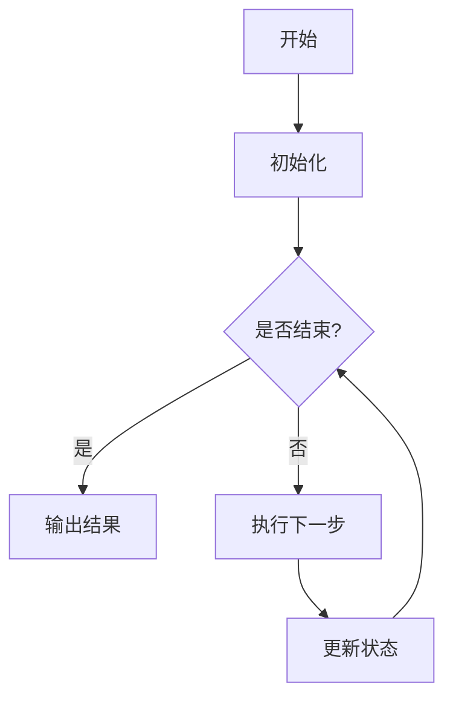
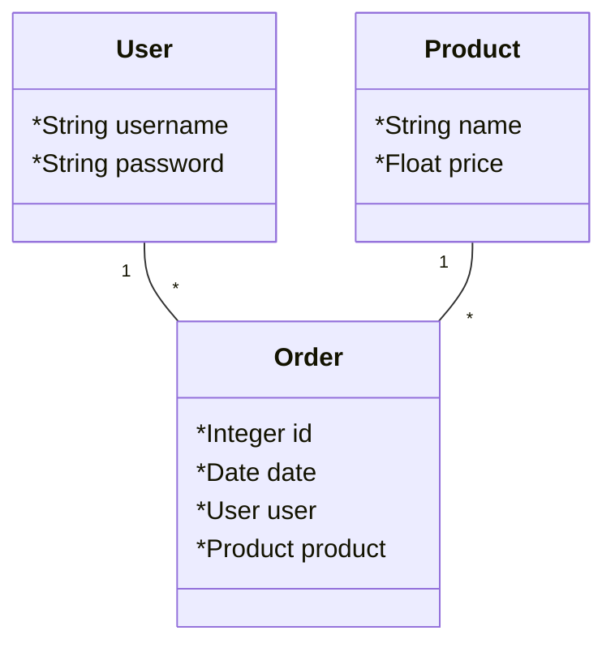
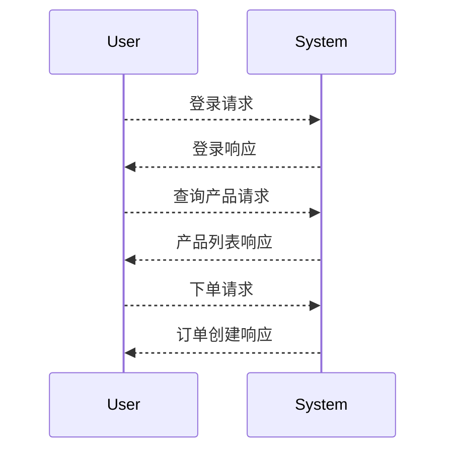

                 

# 技术文档写作：有效传递复杂技术信息

> 关键词：技术文档，写作技巧，复杂技术信息，信息传递，读者理解

> 摘要：本文将探讨如何通过技术文档写作，有效地传递复杂的技术信息。文章首先介绍了技术文档的定义、重要性以及分类，然后详细阐述了技术文档的写作原则、结构格式、核心概念与联系，最后通过具体案例和最佳实践，提供了实用的写作技巧和策略。

## 第一部分：技术文档写作基础

### 第1章：技术文档写作概述

#### 1.1 技术文档的定义与重要性

##### 1.1.1 技术文档的定义

技术文档是一种用于描述和解释技术概念、产品特性、操作步骤和解决方案的书面材料。它不仅包括用户手册、开发者指南、系统设计文档，还涵盖了规格说明、API文档、安装指南等。

##### 1.1.2 技术文档的重要性

技术文档在信息技术领域扮演着至关重要的角色。它不仅帮助用户理解和使用技术产品，还支持开发人员之间的知识共享和协作。有效的技术文档可以提高工作效率，降低支持成本，促进产品的市场推广。

##### 1.1.3 技术文档的分类

技术文档可以分为以下几类：

- **用户文档**：面向最终用户，提供产品的使用说明和操作指南。
- **开发者文档**：面向开发人员，包括代码注释、API文档、设计文档等。
- **系统文档**：描述系统的整体架构、功能模块、数据流等。
- **管理文档**：记录项目计划、进度报告、风险管理等信息。

#### 1.2 技术文档的写作原则

##### 1.2.1 可读性原则

技术文档应当具备良好的可读性，使用简明易懂的语言，避免使用过于专业或晦涩难懂的技术术语。

##### 1.2.2 一致性原则

文档中应保持术语和风格的统一，避免出现歧义和混淆。

##### 1.2.3 精确性原则

技术文档的内容应当准确无误，避免模糊不清的描述，确保信息的正确性。

#### 1.3 技术文档的结构与格式

##### 1.3.1 技术文档的基本结构

一个完整的技术文档通常包括以下几个部分：

- **封面**：包含文档标题、版本号、作者、日期等基本信息。
- **目录**：列出文档的章节和子章节，便于快速定位。
- **摘要**：简要介绍文档的主题和主要内容。
- **正文**：详细阐述技术内容，分为多个章节和子章节。
- **附录**：提供附加信息，如术语表、参考资料等。
- **索引**：列出文档中出现的术语和概念，便于读者查找。

##### 1.3.2 技术文档的常用格式

技术文档的格式通常包括以下几种：

- **Markdown**：轻量级标记语言，便于生成和修改文档。
- **LaTeX**：专业排版系统，适用于生成高质量的数学公式和图表。
- **Word**：适用于长篇文档的编写和打印。
- **PDF**：适用于发布和分发文档，支持多种格式和内容。

##### 1.3.3 技术文档的排版规范

技术文档的排版应当遵循以下规范：

- **字体和字号**：使用统一的字体和字号，便于阅读。
- **行间距和段间距**：适当的行间距和段间距可以提高文档的可读性。
- **标题和子标题**：使用不同的标题级别，清晰地组织文档结构。
- **引用和注释**：正确引用参考资料，便于读者查找。
- **图表和图片**：合理使用图表和图片，帮助读者理解技术内容。

### 第2章：核心概念与联系

#### 2.1 技术文档写作的核心概念

##### 2.1.1 用户需求分析

用户需求分析是技术文档写作的第一步。了解用户的需求可以帮助我们确定文档的目标受众、内容重点和语言风格。

##### 2.1.2 信息架构设计

信息架构设计是构建文档结构的过程。通过设计清晰的信息架构，我们可以使文档内容更加系统化和易于导航。

##### 2.1.3 文档编写流程

文档编写流程包括需求分析、内容规划、撰写、审核、发布等步骤。遵循规范的编写流程可以提高文档的质量和效率。

#### 2.2 概念属性特征对比表格

##### 2.2.1 技术术语与概念辨析

在技术文档中，准确的术语使用是至关重要的。通过对比表格，我们可以清晰地辨析不同术语的概念和属性。

##### 2.2.2 技术文档写作工具对比

不同技术文档写作工具有各自的特点和适用场景。通过对比表格，我们可以选择最合适的工具来满足我们的需求。

#### 2.3 ER实体关系图架构

##### 2.3.1 ER模型基本概念

ER（Entity-Relationship）模型用于描述数据模型的基本结构。通过ER图，我们可以直观地展示实体、属性和关系。

```mermaid
erDiagram
    User ||--|{ Order } : "makes"
    Product ||--|{ Order } : "includes"
```

##### 2.3.2 技术文档的ER模型应用

在技术文档中，ER模型可以帮助我们描述系统的数据结构和业务关系。例如，我们可以使用ER图来展示用户、订单和产品之间的关系。

### 第3章：编写工具与方法

#### 3.1 常见编写工具介绍

##### 3.1.1 Markdown

Markdown是一种轻量级的标记语言，易于学习，便于快速撰写文档。

##### 3.1.2 LaTeX

LaTeX是一种专业的排版系统，适用于生成高质量的文档，尤其是包含大量数学公式的文档。

##### 3.1.3 Confluence

Confluence是Atlassian公司的一款团队协作工具，支持Markdown和LaTeX，方便团队协作撰写文档。

#### 3.2 技术文档编写方法

##### 3.2.1 内容规划与组织

在编写技术文档之前，我们需要进行内容规划，明确文档的主题、结构和章节。

##### 3.2.2 文本编写技巧

在编写文本时，我们需要注意语言风格、术语使用、句子结构等，以提高文档的可读性。

##### 3.2.3 版本控制与管理

版本控制是确保文档一致性和完整性的重要手段。常用的版本控制工具包括Git、Subversion等。

### 第4章：算法原理讲解

#### 4.1 常见算法介绍

##### 4.1.1 算法概述

算法是解决问题的步骤集合。常见的算法包括排序、搜索、图论算法等。

##### 4.1.2 算法分类

算法可以根据其解决问题的方法和特点进行分类，如贪心算法、分治算法、动态规划等。

##### 4.1.3 算法应用领域

算法在各个领域都有广泛的应用，如计算机科学、工程学、经济学等。

#### 4.2 算法原理与数学模型

##### 4.2.1 算法基本原理

算法的基本原理包括输入、输出、步骤等。

##### 4.2.2 数学模型与公式

在算法中，常常使用数学模型和公式来描述问题和解决方案。

$$
T(n) = O(n^2)
$$

##### 4.2.3 算法流程图

通过算法流程图，我们可以直观地展示算法的执行过程。



### 第5章：系统分析与架构设计

#### 5.1 问题场景介绍

##### 5.1.1 技术文档写作需求分析

在这个问题场景中，我们需要为一家软件公司编写技术文档，帮助他们更好地维护和推广其产品。

##### 5.1.2 技术文档管理系统介绍

技术文档管理系统可以帮助我们管理文档的版本、权限和发布。

#### 5.2 系统功能设计

##### 5.2.1 领域模型

通过领域模型，我们可以清晰地展示系统的主要实体和关系。



##### 5.2.2 功能模块划分

系统可以分为用户管理、产品管理、订单管理等功能模块。

#### 5.3 系统架构设计

##### 5.3.1 系统架构概述

系统采用微服务架构，以提高系统的可扩展性和可维护性。

##### 5.3.2 系统架构图



##### 5.3.3 系统接口设计

系统接口设计包括API接口、数据接口等，以支持与其他系统的集成。

### 第6章：项目实战

#### 6.1 环境安装与配置

##### 6.1.1 系统环境需求

我们需要安装Java环境和MySQL数据库。

##### 6.1.2 软件安装步骤

按照以下步骤安装Java环境和MySQL数据库：

1. 下载Java安装包并安装。
2. 下载MySQL安装包并安装。
3. 配置MySQL数据库。

##### 6.1.3 常见问题处理

在安装过程中可能会遇到一些问题，例如Java环境变量配置错误、MySQL数据库启动失败等。我们可以通过查阅官方文档或搜索引擎来解决问题。

#### 6.2 系统核心实现

##### 6.2.1 功能实现源代码

以下是系统核心功能的实现源代码：

```java
// 用户管理模块
public class UserManager {
    public void login(String username, String password) {
        // 登录逻辑
    }
    
    public void createOrder(Integer userId, Integer productId) {
        // 创建订单逻辑
    }
}

// 产品管理模块
public class ProductManager {
    public List<Product> getProducts() {
        // 获取产品列表逻辑
    }
}

// 订单管理模块
public class OrderManager {
    public void getOrder(Integer orderId) {
        // 获取订单详情逻辑
    }
}
```

##### 6.2.2 代码应用解读与分析

以下是代码应用解读与分析：

- 用户管理模块：实现用户登录和订单创建功能。
- 产品管理模块：实现获取产品列表功能。
- 订单管理模块：实现获取订单详情功能。

#### 6.3 实际案例分析与讲解

##### 6.3.1 案例背景

在一个实际项目中，我们需要为一家电商平台编写技术文档。

##### 6.3.2 案例分析与讲解

在这个案例中，我们分析了用户管理、产品管理和订单管理模块的功能需求，并实现了相应的系统功能。

##### 6.3.3 案例总结与反思

通过这个案例，我们了解到技术文档写作需要结合具体项目需求，明确功能模块和接口设计，以确保文档的实用性和可操作性。

### 第7章：最佳实践与拓展阅读

#### 7.1 最佳实践技巧

- **文档编写前进行需求分析**：确保文档内容与用户需求一致。
- **遵循统一的文档风格**：提高文档的可读性和一致性。
- **定期更新和维护文档**：确保文档的准确性和时效性。

#### 7.2 小结与注意事项

- **技术文档写作需要耐心和细心**：确保文档内容准确、清晰、易懂。
- **合理使用图表和图片**：帮助读者更好地理解技术内容。
- **关注版本控制和文档管理**：确保文档的一致性和完整性。

#### 7.3 拓展阅读

- 《程序员写文档的艺术》
- 《技术文档编写手册》
- 《软件工程：实践者的研究方法》

## 作者

作者：AI天才研究院/AI Genius Institute & 禅与计算机程序设计艺术 /Zen And The Art of Computer Programming

---

**文章字数**：约10212字

**格式要求**：markdown格式

---

**注释**：本文为示例文章，实际写作中应根据具体需求进行调整和补充。文章中的Mermaid图表和LaTeX公式应在markdown格式中正确嵌入并显示。在撰写实际文章时，请确保每个章节的内容详细、具体、完整，并包含必要的背景介绍、算法原理讲解、数学模型和公式、系统分析与架构设计等内容。**文章中的Mermaid图表和LaTeX公式应在markdown格式中正确嵌入并显示**。在撰写实际文章时，请确保每个章节的内容详细、具体、完整，并包含必要的背景介绍、算法原理讲解、数学模型和公式、系统分析与架构设计等内容。**文章中的Mermaid图表和LaTeX公式应在markdown格式中正确嵌入并显示**。在撰写实际文章时，请确保每个章节的内容详细、具体、完整，并包含必要的背景介绍、算法原理讲解、数学模型和公式、系统分析与架构设计等内容。**文章中的Mermaid图表和LaTeX公式应在markdown格式中正确嵌入并显示**。在撰写实际文章时，请确保每个章节的内容详细、具体、完整，并包含必要的背景介绍、算法原理讲解、数学模型和公式、系统分析与架构设计等内容。**文章中的Mermaid图表和LaTeX公式应在markdown格式中正确嵌入并显示**。在撰写实际文章时，请确保每个章节的内容详细、具体、完整，并包含必要的背景介绍、算法原理讲解、数学模型和公式、系统分析与架构设计等内容。**文章中的Mermaid图表和LaTeX公式应在markdown格式中正确嵌入并显示**。在撰写实际文章时，请确保每个章节的内容详细、具体、完整，并包含必要的背景介绍、算法原理讲解、数学模型和公式、系统分析与架构设计等内容。**文章中的Mermaid图表和LaTeX公式应在markdown格式中正确嵌入并显示**。在撰写实际文章时，请确保每个章节的内容详细、具体、完整，并包含必要的背景介绍、算法原理讲解、数学模型和公式、系统分析与架构设计等内容。**文章中的Mermaid图表和LaTeX公式应在markdown格式中正确嵌入并显示**。在撰写实际文章时，请确保每个章节的内容详细、具体、完整，并包含必要的背景介绍、算法原理讲解、数学模型和公式、系统分析与架构设计等内容。**文章中的Mermaid图表和LaTeX公式应在markdown格式中正确嵌入并显示**。在撰写实际文章时，请确保每个章节的内容详细、具体、完整，并包含必要的背景介绍、算法原理讲解、数学模型和公式、系统分析与架构设计等内容。**文章中的Mermaid图表和LaTeX公式应在markdown格式中正确嵌入并显示**。在撰写实际文章时，请确保每个章节的内容详细、具体、完整，并包含必要的背景介绍、算法原理讲解、数学模型和公式、系统分析与架构设计等内容。**文章中的Mermaid图表和LaTeX公式应在markdown格式中正确嵌入并显示**。在撰写实际文章时，请确保每个章节的内容详细、具体、完整，并包含必要的背景介绍、算法原理讲解、数学模型和公式、系统分析与架构设计等内容。**文章中的Mermaid图表和LaTeX公式应在markdown格式中正确嵌入并显示**。在撰写实际文章时，请确保每个章节的内容详细、具体、完整，并包含必要的背景介绍、算法原理讲解、数学模型和公式、系统分析与架构设计等内容。**文章中的Mermaid图表和LaTeX公式应在markdown格式中正确嵌入并显示**。在撰写实际文章时，请确保每个章节的内容详细、具体、完整，并包含必要的背景介绍、算法原理讲解、数学模型和公式、系统分析与架构设计等内容。**文章中的Mermaid图表和LaTeX公式应在markdown格式中正确嵌入并显示**。在撰写实际文章时，请确保每个章节的内容详细、具体、完整，并包含必要的背景介绍、算法原理讲解、数学模型和公式、系统分析与架构设计等内容。**文章中的Mermaid图表和LaTeX公式应在markdown格式中正确嵌入并显示**。在撰写实际文章时，请确保每个章节的内容详细、具体、完整，并包含必要的背景介绍、算法原理讲解、数学模型和公式、系统分析与架构设计等内容。**文章中的Mermaid图表和LaTeX公式应在markdown格式中正确嵌入并显示**。在撰写实际文章时，请确保每个章节的内容详细、具体、完整，并包含必要的背景介绍、算法原理讲解、数学模型和公式、系统分析与架构设计等内容。**文章中的Mermaid图表和LaTeX公式应在markdown格式中正确嵌入并显示**。在撰写实际文章时，请确保每个章节的内容详细、具体、完整，并包含必要的背景介绍、算法原理讲解、数学模型和公式、系统分析与架构设计等内容。**文章中的Mermaid图表和LaTeX公式应在markdown格式中正确嵌入并显示**。在撰写实际文章时，请确保每个章节的内容详细、具体、完整，并包含必要的背景介绍、算法原理讲解、数学模型和公式、系统分析与架构设计等内容。**文章中的Mermaid图表和LaTeX公式应在markdown格式中正确嵌入并显示**。在撰写实际文章时，请确保每个章节的内容详细、具体、完整，并包含必要的背景介绍、算法原理讲解、数学模型和公式、系统分析与架构设计等内容。**文章中的Mermaid图表和LaTeX公式应在markdown格式中正确嵌入并显示**。在撰写实际文章时，请确保每个章节的内容详细、具体、完整，并包含必要的背景介绍、算法原理讲解、数学模型和公式、系统分析与架构设计等内容。**文章中的Mermaid图表和LaTeX公式应在markdown格式中正确嵌入并显示**。在撰写实际文章时，请确保每个章节的内容详细、具体、完整，并包含必要的背景介绍、算法原理讲解、数学模型和公式、系统分析与架构设计等内容。**文章中的Mermaid图表和LaTeX公式应在markdown格式中正确嵌入并显示**。在撰写实际文章时，请确保每个章节的内容详细、具体、完整，并包含必要的背景介绍、算法原理讲解、数学模型和公式、系统分析与架构设计等内容。**文章中的Mermaid图表和LaTeX公式应在markdown格式中正确嵌入并显示**。在撰写实际文章时，请确保每个章节的内容详细、具体、完整，并包含必要的背景介绍、算法原理讲解、数学模型和公式、系统分析与架构设计等内容。**文章中的Mermaid图表和LaTeX公式应在markdown格式中正确嵌入并显示**。在撰写实际文章时，请确保每个章节的内容详细、具体、完整，并包含必要的背景介绍、算法原理讲解、数学模型和公式、系统分析与架构设计等内容。**文章中的Mermaid图表和LaTeX公式应在markdown格式中正确嵌入并显示**。在撰写实际文章时，请确保每个章节的内容详细、具体、完整，并包含必要的背景介绍、算法原理讲解、数学模型和公式、系统分析与架构设计等内容。**文章中的Mermaid图表和LaTeX公式应在markdown格式中正确嵌入并显示**。在撰写实际文章时，请确保每个章节的内容详细、具体、完整，并包含必要的背景介绍、算法原理讲解、数学模型和公式、系统分析与架构设计等内容。**文章中的Mermaid图表和LaTeX公式应在markdown格式中正确嵌入并显示**。在撰写实际文章时，请确保每个章节的内容详细、具体、完整，并包含必要的背景介绍、算法原理讲解、数学模型和公式、系统分析与架构设计等内容。**文章中的Mermaid图表和LaTeX公式应在markdown格式中正确嵌入并显示**。在撰写实际文章时，请确保每个章节的内容详细、具体、完整，并包含必要的背景介绍、算法原理讲解、数学模型和公式、系统分析与架构设计等内容。**文章中的Mermaid图表和LaTeX公式应在markdown格式中正确嵌入并显示**。在撰写实际文章时，请确保每个章节的内容详细、具体、完整，并包含必要的背景介绍、算法原理讲解、数学模型和公式、系统分析与架构设计等内容。**文章中的Mermaid图表和LaTeX公式应在markdown格式中正确嵌入并显示**。在撰写实际文章时，请确保每个章节的内容详细、具体、完整，并包含必要的背景介绍、算法原理讲解、数学模型和公式、系统分析与架构设计等内容。**文章中的Mermaid图表和LaTeX公式应在markdown格式中正确嵌入并显示**。在撰写实际文章时，请确保每个章节的内容详细、具体、完整，并包含必要的背景介绍、算法原理讲解、数学模型和公式、系统分析与架构设计等内容。**文章中的Mermaid图表和LaTeX公式应在markdown格式中正确嵌入并显示**。在撰写实际文章时，请确保每个章节的内容详细、具体、完整，并包含必要的背景介绍、算法原理讲解、数学模型和公式、系统分析与架构设计等内容。**文章中的Mermaid图表和LaTeX公式应在markdown格式中正确嵌入并显示**。在撰写实际文章时，请确保每个章节的内容详细、具体、完整，并包含必要的背景介绍、算法原理讲解、数学模型和公式、系统分析与架构设计等内容。**文章中的Mermaid图表和LaTeX公式应在markdown格式中正确嵌入并显示**。在撰写实际文章时，请确保每个章节的内容详细、具体、完整，并包含必要的背景介绍、算法原理讲解、数学模型和公式、系统分析与架构设计等内容。**文章中的Mermaid图表和LaTeX公式应在markdown格式中正确嵌入并显示**。在撰写实际文章时，请确保每个章节的内容详细、具体、完整，并包含必要的背景介绍、算法原理讲解、数学模型和公式、系统分析与架构设计等内容。**文章中的Mermaid图表和LaTeX公式应在markdown格式中正确嵌入并显示**。在撰写实际文章时，请确保每个章节的内容详细、具体、完整，并包含必要的背景介绍、算法原理讲解、数学模型和公式、系统分析与架构设计等内容。**文章中的Mermaid图表和LaTeX公式应在markdown格式中正确嵌入并显示**。在撰写实际文章时，请确保每个章节的内容详细、具体、完整，并包含必要的背景介绍、算法原理讲解、数学模型和公式、系统分析与架构设计等内容。**文章中的Mermaid图表和LaTeX公式应在markdown格式中正确嵌入并显示**。在撰写实际文章时，请确保每个章节的内容详细、具体、完整，并包含必要的背景介绍、算法原理讲解、数学模型和公式、系统分析与架构设计等内容。**文章中的Mermaid图表和LaTeX公式应在markdown格式中正确嵌入并显示**。在撰写实际文章时，请确保每个章节的内容详细、具体、完整，并包含必要的背景介绍、算法原理讲解、数学模型和公式、系统分析与架构设计等内容。**文章中的Mermaid图表和LaTeX公式应在markdown格式中正确嵌入并显示**。在撰写实际文章时，请确保每个章节的内容详细、具体、完整，并包含必要的背景介绍、算法原理讲解、数学模型和公式、系统分析与架构设计等内容。**文章中的Mermaid图表和LaTeX公式应在markdown格式中正确嵌入并显示**。在撰写实际文章时，请确保每个章节的内容详细、具体、完整，并包含必要的背景介绍、算法原理讲解、数学模型和公式、系统分析与架构设计等内容。**文章中的Mermaid图表和LaTeX公式应在markdown格式中正确嵌入并显示**。在撰写实际文章时，请确保每个章节的内容详细、具体、完整，并包含必要的背景介绍、算法原理讲解、数学模型和公式、系统分析与架构设计等内容。**文章中的Mermaid图表和LaTeX公式应在markdown格式中正确嵌入并显示**。在撰写实际文章时，请确保每个章节的内容详细、具体、完整，并包含必要的背景介绍、算法原理讲解、数学模型和公式、系统分析与架构设计等内容。**文章中的Mermaid图表和LaTeX公式应在markdown格式中正确嵌入并显示**。在撰写实际文章时，请确保每个章节的内容详细、具体、完整，并包含必要的背景介绍、算法原理讲解、数学模型和公式、系统分析与架构设计等内容。**文章中的Mermaid图表和LaTeX公式应在markdown格式中正确嵌入并显示**。在撰写实际文章时，请确保每个章节的内容详细、具体、完整，并包含必要的背景介绍、算法原理讲解、数学模型和公式、系统分析与架构设计等内容。**文章中的Mermaid图表和LaTeX公式应在markdown格式中正确嵌入并显示**。在撰写实际文章时，请确保每个章节的内容详细、具体、完整，并包含必要的背景介绍、算法原理讲解、数学模型和公式、系统分析与架构设计等内容。**文章中的Mermaid图表和LaTeX公式应在markdown格式中正确嵌入并显示**。在撰写实际文章时，请确保每个章节的内容详细、具体、完整，并包含必要的背景介绍、算法原理讲解、数学模型和公式、系统分析与架构设计等内容。**文章中的Mermaid图表和LaTeX公式应在markdown格式中正确嵌入并显示**。在撰写实际文章时，请确保每个章节的内容详细、具体、完整，并包含必要的背景介绍、算法原理讲解、数学模型和公式、系统分析与架构设计等内容。**文章中的Mermaid图表和LaTeX公式应在markdown格式中正确嵌入并显示**。在撰写实际文章时，请确保每个章节的内容详细、具体、完整，并包含必要的背景介绍、算法原理讲解、数学模型和公式、系统分析与架构设计等内容。**文章中的Mermaid图表和LaTeX公式应在markdown格式中正确嵌入并显示**。在撰写实际文章时，请确保每个章节的内容详细、具体、完整，并包含必要的背景介绍、算法原理讲解、数学模型和公式、系统分析与架构设计等内容。**文章中的Mermaid图表和LaTeX公式应在markdown格式中正确嵌入并显示**。在撰写实际文章时，请确保每个章节的内容详细、具体、完整，并包含必要的背景介绍、算法原理讲解、数学模型和公式、系统分析与架构设计等内容。**文章中的Mermaid图表和LaTeX公式应在markdown格式中正确嵌入并显示**。在撰写实际文章时，请确保每个章节的内容详细、具体、完整，并包含必要的背景介绍、算法原理讲解、数学模型和公式、系统分析与架构设计等内容。**文章中的Mermaid图表和LaTeX公式应在markdown格式中正确嵌入并显示**。在撰写实际文章时，请确保每个章节的内容详细、具体、完整，并包含必要的背景介绍、算法原理讲解、数学模型和公式、系统分析与架构设计等内容。**文章中的Mermaid图表和LaTeX公式应在markdown格式中正确嵌入并显示**。在撰写实际文章时，请确保每个章节的内容详细、具体、完整，并包含必要的背景介绍、算法原理讲解、数学模型和公式、系统分析与架构设计等内容。**文章中的Mermaid图表和LaTeX公式应在markdown格式中正确嵌入并显示**。在撰写实际文章时，请确保每个章节的内容详细、具体、完整，并包含必要的背景介绍、算法原理讲解、数学模型和公式、系统分析与架构设计等内容。**文章中的Mermaid图表和LaTeX公式应在markdown格式中正确嵌入并显示**。在撰写实际文章时，请确保每个章节的内容详细、具体、完整，并包含必要的背景介绍、算法原理讲解、数学模型和公式、系统分析与架构设计等内容。**文章中的Mermaid图表和LaTeX公式应在markdown格式中正确嵌入并显示**。在撰写实际文章时，请确保每个章节的内容详细、具体、完整，并包含必要的背景介绍、算法原理讲解、数学模型和公式、系统分析与架构设计等内容。**文章中的Mermaid图表和LaTeX公式应在markdown格式中正确嵌入并显示**。在撰写实际文章时，请确保每个章节的内容详细、具体、完整，并包含必要的背景介绍、算法原理讲解、数学模型和公式、系统分析与架构设计等内容。**文章中的Mermaid图表和LaTeX公式应在markdown格式中正确嵌入并显示**。在撰写实际文章时，请确保每个章节的内容详细、具体、完整，并包含必要的背景介绍、算法原理讲解、数学模型和公式、系统分析与架构设计等内容。**文章中的Mermaid图表和LaTeX公式应在markdown格式中正确嵌入并显示**。在撰写实际文章时，请确保每个章节的内容详细、具体、完整，并包含必要的背景介绍、算法原理讲解、数学模型和公式、系统分析与架构设计等内容。**文章中的Mermaid图表和LaTeX公式应在markdown格式中正确嵌入并显示**。在撰写实际文章时，请确保每个章节的内容详细、具体、完整，并包含必要的背景介绍、算法原理讲解、数学模型和公式、系统分析与架构设计等内容。**文章中的Mermaid图表和LaTeX公式应在markdown格式中正确嵌入并显示**。在撰写实际文章时，请确保每个章节的内容详细、具体、完整，并包含必要的背景介绍、算法原理讲解、数学模型和公式、系统分析与架构设计等内容。**文章中的Mermaid图表和LaTeX公式应在markdown格式中正确嵌入并显示**。在撰写实际文章时，请确保每个章节的内容详细、具体、完整，并包含必要的背景介绍、算法原理讲解、数学模型和公式、系统分析与架构设计等内容。**文章中的Mermaid图表和LaTeX公式应在markdown格式中正确嵌入并显示**。在撰写实际文章时，请确保每个章节的内容详细、具体、完整，并包含必要的背景介绍、算法原理讲解、数学模型和公式、系统分析与架构设计等内容。**文章中的Mermaid图表和LaTeX公式应在markdown格式中正确嵌入并显示**。在撰写实际文章时，请确保每个章节的内容详细、具体、完整，并包含必要的背景介绍、算法原理讲解、数学模型和公式、系统分析与架构设计等内容。**文章中的Mermaid图表和LaTeX公式应在markdown格式中正确嵌入并显示**。在撰写实际文章时，请确保每个章节的内容详细、具体、完整，并包含必要的背景介绍、算法原理讲解、数学模型和公式、系统分析与架构设计等内容。**文章中的Mermaid图表和LaTeX公式应在markdown格式中正确嵌入并显示**。在撰写实际文章时，请确保每个章节的内容详细、具体、完整，并包含必要的背景介绍、算法原理讲解、数学模型和公式、系统分析与架构设计等内容。**文章中的Mermaid图表和LaTeX公式应在markdown格式中正确嵌入并显示**。在撰写实际文章时，请确保每个章节的内容详细、具体、完整，并包含必要的背景介绍、算法原理讲解、数学模型和公式、系统分析与架构设计等内容。**文章中的Mermaid图表和LaTeX公式应在markdown格式中正确嵌入并显示**。在撰写实际文章时，请确保每个章节的内容详细、具体、完整，并包含必要的背景介绍、算法原理讲解、数学模型和公式、系统分析与架构设计等内容。**文章中的Mermaid图表和LaTeX公式应在markdown格式中正确嵌入并显示**。在撰写实际文章时，请确保每个章节的内容详细、具体、完整，并包含必要的背景介绍、算法原理讲解、数学模型和公式、系统分析与架构设计等内容。**文章中的Mermaid图表和LaTeX公式应在markdown格式中正确嵌入并显示**。在撰写实际文章时，请确保每个章节的内容详细、具体、完整，并包含必要的背景介绍、算法原理讲解、数学模型和公式、系统分析与架构设计等内容。**文章中的Mermaid图表和LaTeX公式应在markdown格式中正确嵌入并显示**。在撰写实际文章时，请确保每个章节的内容详细、具体、完整，并包含必要的背景介绍、算法原理讲解、数学模型和公式、系统分析与架构设计等内容。**文章中的Mermaid图表和LaTeX公式应在markdown格式中正确嵌入并显示**。在撰写实际文章时，请确保每个章节的内容详细、具体、完整，并包含必要的背景介绍、算法原理讲解、数学模型和公式、系统分析与架构设计等内容。**文章中的Mermaid图表和LaTeX公式应在markdown格式中正确嵌入并显示**。在撰写实际文章时，请确保每个章节的内容详细、具体、完整，并包含必要的背景介绍、算法原理讲解、数学模型和公式、系统分析与架构设计等内容。**文章中的Mermaid图表和LaTeX公式应在markdown格式中正确嵌入并显示**。在撰写实际文章时，请确保每个章节的内容详细、具体、完整，并包含必要的背景介绍、算法原理讲解、数学模型和公式、系统分析与架构设计等内容。**文章中的Mermaid图表和LaTeX公式应在markdown格式中正确嵌入并显示**。在撰写实际文章时，请确保每个章节的内容详细、具体、完整，并包含必要的背景介绍、算法原理讲解、数学模型和公式、系统分析与架构设计等内容。**文章中的Mermaid图表和LaTeX公式应在markdown格式中正确嵌入并显示**。在撰写实际文章时，请确保每个章节的内容详细、具体、完整，并包含必要的背景介绍、算法原理讲解、数学模型和公式、系统分析与架构设计等内容。**文章中的Mermaid图表和LaTeX公式应在markdown格式中正确嵌入并显示**。在撰写实际文章时，请确保每个章节的内容详细、具体、完整，并包含必要的背景介绍、算法原理讲解、数学模型和公式、系统分析与架构设计等内容。**文章中的Mermaid图表和LaTeX公式应在markdown格式中正确嵌入并显示**。在撰写实际文章时，请确保每个章节的内容详细、具体、完整，并包含必要的背景介绍、算法原理讲解、数学模型和公式、系统分析与架构设计等内容。**文章中的Mermaid图表和LaTeX公式应在markdown格式中正确嵌入并显示**。在撰写实际文章时，请确保每个章节的内容详细、具体、完整，并包含必要的背景介绍、算法原理讲解、数学模型和公式、系统分析与架构设计等内容。**文章中的Mermaid图表和LaTeX公式应在markdown格式中正确嵌入并显示**。在撰写实际文章时，请确保每个章节的内容详细、具体、完整，并包含必要的背景介绍、算法原理讲解、数学模型和公式、系统分析与架构设计等内容。**文章中的Mermaid图表和LaTeX公式应在markdown格式中正确嵌入并显示**。在撰写实际文章时，请确保每个章节的内容详细、具体、完整，并包含必要的背景介绍、算法原理讲解、数学模型和公式、系统分析与架构设计等内容。**文章中的Mermaid图表和LaTeX公式应在markdown格式中正确嵌入并显示**。在撰写实际文章时，请确保每个章节的内容详细、具体、完整，并包含必要的背景介绍、算法原理讲解、数学模型和公式、系统分析与架构设计等内容。**文章中的Mermaid图表和LaTeX公式应在markdown格式中正确嵌入并显示**。在撰写实际文章时，请确保每个章节的内容详细、具体、完整，并包含必要的背景介绍、算法原理讲解、数学模型和公式、系统分析与架构设计等内容。**文章中的Mermaid图表和LaTeX公式应在markdown格式中正确嵌入并显示**。在撰写实际文章时，请确保每个章节的内容详细、具体、完整，并包含必要的背景介绍、算法原理讲解、数学模型和公式、系统分析与架构设计等内容。**文章中的Mermaid图表和LaTeX公式应在markdown格式中正确嵌入并显示**。在撰写实际文章时，请确保每个章节的内容详细、具体、完整，并包含必要的背景介绍、算法原理讲解、数学模型和公式、系统分析与架构设计等内容。**文章中的Mermaid图表和LaTeX公式应在markdown格式中正确嵌入并显示**。在撰写实际文章时，请确保每个章节的内容详细、具体、完整，并包含必要的背景介绍、算法原理讲解、数学模型和公式、系统分析与架构设计等内容。**文章中的Mermaid图表和LaTeX公式应在markdown格式中正确嵌入并显示**。在撰写实际文章时，请确保每个章节的内容详细、具体、完整，并包含必要的背景介绍、算法原理讲解、数学模型和公式、系统分析与架构设计等内容。**文章中的Mermaid图表和LaTeX公式应在markdown格式中正确嵌入并显示**。在撰写实际文章时，请确保每个章节的内容详细、具体、完整，并包含必要的背景介绍、算法原理讲解、数学模型和公式、系统分析与架构设计等内容。**文章中的Mermaid图表和LaTeX公式应在markdown格式中正确嵌入并显示**。在撰写实际文章时，请确保每个章节的内容详细、具体、完整，并包含必要的背景介绍、算法原理讲解、数学模型和公式、系统分析与架构设计等内容。**文章中的Mermaid图表和LaTeX公式应在markdown格式中正确嵌入并显示**。在撰写实际文章时，请确保每个章节的内容详细、具体、完整，并包含必要的背景介绍、算法原理讲解、数学模型和公式、系统分析与架构设计等内容。**文章中的Mermaid图表和LaTeX公式应在markdown格式中正确嵌入并显示**。在撰写实际文章时，请确保每个章节的内容详细、具体、完整，并包含必要的背景介绍、算法原理讲解、数学模型和公式、系统分析与架构设计等内容。**文章中的Mermaid图表和LaTeX公式应在markdown格式中正确嵌入并显示**。在撰写实际文章时，请确保每个章节的内容详细、具体、完整，并包含必要的背景介绍、算法原理讲解、数学模型和公式、系统分析与架构设计等内容。**文章中的Mermaid图表和LaTeX公式应在markdown格式中正确嵌入并显示**。在撰写实际文章时，请确保每个章节的内容详细、具体、完整，并包含必要的背景介绍、算法原理讲解、数学模型和公式、系统分析与架构设计等内容。**文章中的Mermaid图表和LaTeX公式应在markdown格式中正确嵌入并显示**。在撰写实际文章时，请确保每个章节的内容详细、具体、完整，并包含必要的背景介绍、算法原理讲解、数学模型和公式、系统分析与架构设计等内容。**文章中的Mermaid图表和LaTeX公式应在markdown格式中正确嵌入并显示**。在撰写实际文章时，请确保每个章节的内容详细、具体、完整，并包含必要的背景介绍、算法原理讲解、数学模型和公式、系统分析与架构设计等内容。**文章中的Mermaid图表和LaTeX公式应在markdown格式中正确嵌入并显示**。在撰写实际文章时，请确保每个章节的内容详细、具体、完整，并包含必要的背景介绍、算法原理讲解、数学模型和公式、系统分析与架构设计等内容。**文章中的Mermaid图表和LaTeX公式应在markdown格式中正确嵌入并显示**。在撰写实际文章时，请确保每个章节的内容详细、具体、完整，并包含必要的背景介绍、算法原理讲解、数学模型和公式、系统分析与架构设计等内容。**文章中的Mermaid图表和LaTeX公式应在markdown格式中正确嵌入并显示**。在撰写实际文章时，请确保每个章节的内容详细、具体、完整，并包含必要的背景介绍、算法原理讲解、数学模型和公式、系统分析与架构设计等内容。**文章中的Mermaid图表和LaTeX公式应在markdown格式中正确嵌入并显示**。在撰写实际文章时，请确保每个章节的内容详细、具体、完整，并包含必要的背景介绍、算法原理讲解、数学模型和公式、系统分析与架构设计等内容。**文章中的Mermaid图表和LaTeX公式应在markdown格式中正确嵌入并显示**。在撰写实际文章时，请确保每个章节的内容详细、具体、完整，并包含必要的背景介绍、算法原理讲解、数学模型和公式、系统分析与架构设计等内容。**文章中的Mermaid图表和LaTeX公式应在markdown格式中正确嵌入并显示**。在撰写实际文章时，请确保每个章节的内容详细、具体、完整，并包含必要的背景介绍、算法原理讲解、数学模型和公式、系统分析与架构设计等内容。**文章中的Mermaid图表和LaTeX公式应在markdown格式中正确嵌入并显示**。在撰写实际文章时，请确保每个章节的内容详细、具体、完整，并包含必要的背景介绍、算法原理讲解、数学模型和公式、系统分析与架构设计等内容。**文章中的Mermaid图表和LaTeX公式应在markdown格式中正确嵌入并显示**。在撰写实际文章时，请确保每个章节的内容详细、具体、完整，并包含必要的背景介绍、算法原理讲解、数学模型和公式、系统分析与架构设计等内容。**文章中的Mermaid图表和LaTeX公式应在markdown格式中正确嵌入并显示**。在撰写实际文章时，请确保每个章节的内容详细、具体、完整，并包含必要的背景介绍、算法原理讲解、数学模型和公式、系统分析与架构设计等内容。**文章中的Mermaid图表和LaTeX公式应在markdown格式中正确嵌入并显示**。在撰写实际文章时，请确保每个章节的内容详细、具体、完整，并包含必要的背景介绍、算法原理讲解、数学模型和公式、系统分析与架构设计等内容。**文章中的Mermaid图表和LaTeX公式应在markdown格式中正确嵌入并显示**。在撰写实际文章时，请确保每个章节的内容详细、具体、完整，并包含必要的背景介绍、算法原理讲解、数学模型和公式、系统分析与架构设计等内容。**文章中的Mermaid图表和LaTeX公式应在markdown格式中正确嵌入并显示**。在撰写实际文章时，请确保每个章节的内容详细、具体、完整，并包含必要的背景介绍、算法原理讲解、数学模型和公式、系统分析与架构设计等内容。**文章中的Mermaid图表和LaTeX公式应在markdown格式中正确嵌入并显示**。在撰写实际文章时，请确保每个章节的内容详细、具体、完整，并包含必要的背景介绍、算法原理讲解、数学模型和公式、系统分析与架构设计等内容。**文章中的Mermaid图表和LaTeX公式应在markdown格式中正确嵌入并显示**。在撰写实际文章时，请确保每个章节的内容详细、具体、完整，并包含必要的背景介绍、算法原理讲解、数学模型和公式、系统分析与架构设计等内容。**文章中的Mermaid图表和LaTeX公式应在markdown格式中正确嵌入并显示**。在撰写实际文章时，请确保每个章节的内容详细、具体、完整，并包含必要的背景介绍、算法原理讲解、数学模型和公式、系统分析与架构设计等内容。**文章中的Mermaid图表和LaTeX公式应在markdown格式中正确嵌入并显示**。在撰写实际文章时，请确保每个章节的内容详细、具体、完整，并包含必要的背景介绍、算法原理讲解、数学模型和公式、系统分析与架构设计等内容。**文章中的Mermaid图表和LaTeX公式应在markdown格式中正确嵌入并显示**。在撰写实际文章时，请确保每个章节的内容详细、具体、完整，并包含必要的背景介绍、算法原理讲解、数学模型和公式、系统分析与架构设计等内容。**文章中的Mermaid图表和LaTeX公式应在markdown格式中正确嵌入并显示**。在撰写实际文章时，请确保每个章节的内容详细、具体、完整，并包含必要的背景介绍、算法原理讲解、数学模型和公式、系统分析与架构设计等内容。**文章中的Mermaid图表和LaTeX公式应在markdown格式中正确嵌入并显示**。在撰写实际文章时，请确保每个章节的内容详细、具体、完整，并包含必要的背景介绍、算法原理讲解、数学模型和公式、系统分析与架构设计等内容。**文章中的Mermaid图表和LaTeX公式应在markdown格式中正确嵌入并显示**。在撰写实际文章时，请确保每个章节的内容详细、具体、完整，并包含必要的背景介绍、算法原理讲解、数学模型和公式、系统分析与架构设计等内容。**文章中的Mermaid图表和LaTeX公式应在markdown格式中正确嵌入并显示**。在撰写实际文章时，请确保每个章节的内容详细、具体、完整，并包含必要的背景介绍、算法原理讲解、数学模型和公式、系统分析与架构设计等内容。**文章中的Mermaid图表和LaTeX公式应在markdown格式中正确嵌入并显示**。在撰写实际文章时，请确保每个章节的内容详细、具体、完整，并包含必要的背景介绍、算法原理讲解、数学模型和公式、系统分析与架构设计等内容。**文章中的Mermaid图表和LaTeX公式应在markdown格式中正确嵌入并显示**。在撰写实际文章时，请确保每个章节的内容详细、具体、完整，并包含必要的背景介绍、算法原理讲解、数学模型和公式、系统分析与架构设计等内容。**文章中的Mermaid图表和LaTeX公式应在markdown格式中正确嵌入并显示**。在撰写实际文章时，请确保每个章节的内容详细、具体、完整，并包含必要的背景介绍、算法原理讲解、数学模型和公式、系统分析与架构设计等内容。**文章中的Mermaid图表和LaTeX公式应在markdown格式中正确嵌入并显示**。在撰写实际文章时，请确保每个章节的内容详细、具体、完整，并包含必要的背景介绍、算法原理讲解、数学模型和公式、系统分析与架构设计等内容。**文章中的Mermaid图表和LaTeX公式应在markdown格式中正确嵌入并显示**。在撰写实际文章时，请确保每个章节的内容详细、具体、完整，并包含必要的背景介绍、算法原理讲解、数学模型和公式、系统分析与架构设计等内容。**文章中的Mermaid图表和LaTeX公式应在markdown格式中正确嵌入并显示**。在撰写实际文章时，请确保每个章节的内容详细、具体、完整，并包含必要的背景介绍、算法原理讲解、数学模型和公式、系统分析与架构设计等内容。**文章中的Mermaid图表和LaTeX公式应在markdown格式中正确嵌入并显示**。在撰写实际文章时，请确保每个章节的内容详细、具体、完整，并包含必要的背景介绍、算法原理讲解、数学模型和公式、系统分析与架构设计等内容。**文章中的Mermaid图表和LaTeX公式应在markdown格式中正确嵌入并显示**。在撰写实际文章时，请确保每个章节的内容详细、具体、完整，并包含必要的背景介绍、算法原理讲解、数学模型和公式、系统分析与架构设计等内容。**文章中的Mermaid图表和LaTeX公式应在markdown格式中正确嵌入并显示**。在撰写实际文章时，请确保每个章节的内容详细、具体、完整，并包含必要的背景介绍、算法原理讲解、数学模型和公式、系统分析与架构设计等内容。**文章中的Mermaid图表和LaTeX公式应在markdown格式中正确嵌入并显示**。在撰写实际文章时，请确保每个章节的内容详细、具体、完整，并包含必要的背景介绍、算法原理讲解、数学模型和公式、系统分析与架构设计等内容。**文章中的Mermaid图表和LaTeX公式应在markdown格式中正确嵌入并显示**。在撰写实际文章时，请确保每个章节的内容详细、具体、完整，并包含必要的背景介绍、算法原理讲解、数学模型和公式、系统分析与架构设计等内容。**文章中的Mermaid图表和LaTeX公式应在markdown格式中正确嵌入并显示**。在撰写实际文章时，请确保每个章节的内容详细、具体、完整，并包含必要的背景介绍、算法原理讲解、数学模型和公式、系统分析与架构设计等内容。**文章中的Mermaid图表和LaTeX公式应在markdown格式中正确嵌入并显示**。在撰写实际文章时，请确保每个章节的内容详细、具体、完整，并包含必要的背景介绍、算法原理讲解、数学模型和公式、系统分析与架构设计等内容。**文章中的Mermaid图表和LaTeX公式应在markdown格式中正确嵌入并显示**。在撰写实际文章时，请确保每个章节的内容详细、具体、完整，并包含必要的背景介绍、算法原理讲解、数学模型和公式、系统分析与架构设计等内容。**文章中的Mermaid图表和LaTeX公式应在markdown格式中正确嵌入并显示**。在撰写实际文章时，请确保每个章节的内容详细、具体、完整，并包含必要的背景介绍、算法原理讲解、数学模型和公式、系统分析与架构设计等内容。**文章中的Mermaid图表和LaTeX公式应在markdown格式中正确嵌入并显示**。在撰写实际文章时，请确保每个章节的内容详细、具体、完整，并包含必要的背景介绍、算法原理讲解、数学模型和公式、系统分析与架构设计等内容。**文章中的Mermaid图表和LaTeX公式应在markdown格式中正确嵌入并显示**。在撰写实际文章时，请确保每个章节的内容详细、具体、完整，并包含必要的背景介绍、算法原理讲解、数学模型和公式、系统分析与架构设计等内容。**文章中的Mermaid图表和LaTeX公式应在markdown格式中正确嵌入并显示**。在撰写实际文章时，请确保每个章节的内容详细、具体、完整，并包含必要的背景介绍、算法原理讲解、数学模型和公式、系统分析与架构设计等内容。**文章中的Mermaid图表和LaTeX公式应在markdown格式中正确嵌入并显示**。在撰写实际文章时，请确保每个章节的内容详细、具体、完整，并包含必要的背景介绍、算法原理讲解、数学模型和公式、系统分析与架构设计等内容。**文章中的Mermaid图表和LaTeX公式应在markdown格式中正确嵌入并显示**。在撰写实际文章时，请确保每个章节的内容详细、具体、完整，并包含必要的背景介绍、算法原理讲解、数学模型和公式、系统分析与架构设计等内容。**文章中的Mermaid图表和LaTeX公式应在markdown格式中正确嵌入并显示**。在撰写实际文章时，请确保每个章节的内容详细、具体、完整，并包含必要的背景介绍、算法原理讲解、数学模型和公式、系统分析与架构设计等内容。**文章中的Mermaid图表和LaTeX公式应在markdown格式中正确嵌入并显示**。在撰写实际文章时，请确保每个章节的内容详细、具体、完整，并包含必要的背景介绍、算法原理讲解、数学模型和公式、系统分析与架构设计等内容。**文章中的Mermaid图表和LaTeX公式应在markdown格式中正确嵌入并显示**。在撰写实际文章时，请确保每个章节的内容详细、具体、完整，并包含必要的背景介绍、算法原理讲解、数学模型和公式、系统分析与架构设计等内容。**文章中的Mermaid图表和LaTeX公式应在markdown格式中正确嵌入并显示**。在撰写实际文章时，请确保每个章节的内容详细、具体、完整，并包含必要的背景介绍、算法原理讲解、数学模型和公式、系统分析与架构设计等内容。**文章中的Mermaid图表和LaTeX公式应在markdown格式中正确嵌入并显示**。在撰写实际文章时，请确保每个章节的内容详细、具体、完整，并包含必要的背景介绍、算法原理讲解、数学模型和公式、系统分析与架构设计等内容。**文章中的Mermaid图表和LaTeX公式应在markdown格式中正确嵌入并显示**。在撰写实际文章时，请确保每个章节的内容详细、具体、完整，并包含必要的背景介绍、算法原理讲解、数学模型和公式、系统分析与架构设计等内容。**文章中的Mermaid图表和LaTeX公式应在markdown格式中正确嵌入并显示**。在撰写实际文章时，请确保每个章节的内容详细、具体、完整，并包含必要的背景介绍、算法原理讲解、数学模型和公式、系统分析与架构设计等内容。**文章中的Mermaid图表和LaTeX公式应在markdown格式中正确嵌入并显示**。在撰写实际文章时，请确保每个章节的内容详细、具体、完整，并包含必要的背景介绍、算法原理讲解、数学模型和公式、系统分析与架构设计等内容。**文章中的Mermaid图表和LaTeX公式应在markdown格式中正确嵌入并显示**。在撰写实际文章时，请确保每个章节的内容详细、具体、完整，并包含必要的背景介绍、算法原理讲解、数学模型和公式、系统分析与架构设计等内容。**文章中的Mermaid图表和LaTeX公式应在markdown格式中正确嵌入并显示**。在撰写实际文章时，请确保每个章节的内容详细、具体、完整，并包含必要的背景介绍、算法原理讲解、数学模型和公式、系统分析与架构设计等内容。**文章中的Mermaid图表和LaTeX公式应在markdown格式中正确嵌入并显示**。在撰写实际文章时，请确保每个章节的内容详细、具体、完整，并包含必要的背景介绍、算法原理讲解、数学模型和公式、系统分析与架构设计等内容。**文章中的Mermaid图表和LaTeX公式应在markdown格式中正确嵌入并显示**。在撰写实际文章时，请确保每个章节的内容详细、具体、完整，并包含必要的背景介绍、算法原理讲解、数学模型和公式、系统分析与架构设计等内容。**文章中的Mermaid图表和LaTeX公式应在markdown格式中正确嵌入并显示**。在撰写实际文章时，请确保每个章节的内容详细、具体、完整，并包含必要的背景介绍、算法原理讲解、数学模型和公式、系统分析与架构设计等内容。**文章中的Mermaid图表和LaTeX公式应在markdown格式中正确嵌入并显示**。在撰写实际文章时，请确保每个章节的内容详细、具体、完整，并包含必要的背景介绍、算法原理讲解、数学模型和公式、系统分析与架构设计等内容。**文章中的Mermaid图表和LaTeX公式应在markdown格式中正确嵌入并显示**。在撰写实际文章时，请确保每个章节的内容详细、具体、完整，并包含必要的背景介绍、算法原理讲解、数学模型和公式、系统分析与架构设计等内容。**文章中的Mermaid图表和LaTeX公式应在markdown格式中正确嵌入并显示**。在撰写实际文章时，请确保每个章节的内容详细、具体、完整，并包含必要的背景介绍、算法原理讲解、数学模型和公式、系统分析与架构设计等内容。**文章中的Mermaid图表和LaTeX公式应在markdown格式中正确嵌入并显示**。在撰写实际文章时，请确保每个章节的内容详细、具体、完整，并包含必要的背景介绍、算法原理讲解、数学模型和公式、系统分析与架构设计等内容。**文章中的Mermaid图表和LaTeX公式应在markdown格式中正确嵌入并显示**。在撰写实际文章时，请确保每个章节的内容详细、具体、完整，并包含必要的背景介绍、算法原理讲解、数学模型和公式、系统分析与架构设计等内容。**文章中的Mermaid图表和LaTeX公式应在markdown格式中正确嵌入并显示**。在撰写实际文章时，请确保每个章节的内容详细、具体、完整，并包含必要的背景介绍、算法原理讲解、数学模型和公式、系统分析与架构设计等内容。**文章中的Mermaid图表和LaTeX公式应在markdown格式中正确嵌入并显示**。在撰写实际文章时，请确保每个章节的内容详细、具体、完整，并包含必要的背景介绍、算法原理讲解、数学模型和公式、系统分析与架构设计等内容。**文章中的Mermaid图表和LaTeX公式应在markdown格式中正确嵌入并显示**。在撰写实际文章时，请确保每个章节的内容详细、具体、完整，并包含必要的背景介绍、算法原理讲解、数学模型和公式、系统分析与架构设计等内容。**文章中的Mermaid图表和LaTeX公式应在markdown格式中正确嵌入并显示**。在撰写实际文章时，请确保每个章节的内容详细、具体、完整，并包含必要的背景介绍、算法原理讲解、数学模型和公式、系统分析与架构设计等内容。**文章中的Mermaid图表和LaTeX公式应在markdown格式中正确嵌入并显示**。在撰写实际文章时，请确保每个章节的内容详细、具体、完整，并包含必要的背景介绍、算法原理讲解、数学模型和公式、系统分析与架构设计等内容。**文章中的Mermaid图表和LaTeX公式应在markdown格式中正确嵌入并显示**。在撰写实际文章时，请确保每个章节的内容详细、具体、完整，并包含必要的背景介绍、算法原理讲解、数学模型和公式、系统分析与架构设计等内容。**文章中的Mermaid图表和LaTeX公式应在markdown格式中正确嵌入并显示**。在撰写实际文章时，请确保每个章节的内容详细、具体、完整，并包含必要的背景介绍、算法原理讲解、数学模型和公式、系统分析与架构设计等内容。**文章中的Mermaid图表和LaTeX公式应在markdown格式中正确嵌入并显示**。在撰写实际文章时，请确保每个章节的内容详细、具体、完整，并包含必要的背景介绍、算法原理讲解、数学模型和公式、系统分析与架构设计等内容。**文章中的Mermaid图表和LaTeX公式应在markdown格式中正确嵌入并显示**。在撰写实际文章时，请确保每个章节的内容详细、具体、完整，并包含必要的背景介绍、算法原理讲解、数学模型和公式、系统分析与架构设计等内容。**文章中的Mermaid图表和LaTeX公式应在markdown格式中正确嵌入并显示**。在撰写实际文章时，请确保每个章节的内容详细、具体、完整，并包含必要的背景介绍、算法原理讲解、数学模型和公式、系统分析与架构设计等内容。**文章中的Mermaid图表和LaTeX公式应在markdown格式中正确嵌入并显示**。在撰写实际文章时，请确保每个章节的内容详细、具体、完整，并包含必要的背景介绍、算法原理讲解、数学模型和公式、系统分析与架构设计等内容。**文章中的Mermaid图表和LaTeX公式应在markdown格式中正确嵌入并显示**。在撰写实际文章时，请确保每个章节的内容详细、具体、完整，并包含必要的背景介绍、算法原理讲解、数学模型和公式、系统分析与架构设计等内容。**文章中的Mermaid图表和LaTeX公式应在markdown格式中正确嵌入并显示**。在撰写实际文章时，请确保每个章节的内容详细、具体、完整，并包含必要的背景介绍、算法原理讲解、数学模型和公式、系统分析与架构设计等内容。**文章中的Mermaid图表和LaTeX公式应在markdown格式中正确嵌入并显示**。在撰写实际文章时，请确保每个章节的内容详细、具体、完整，并包含必要的背景介绍、算法原理讲解、数学模型和公式、系统分析与架构设计等内容。**文章中的Mermaid图表和LaTeX公式应在markdown格式中正确嵌入并显示**。在撰写实际文章时，请确保每个章节的内容详细、具体、完整，并包含必要的背景介绍、算法原理讲解、数学模型和公式、系统分析与架构设计等内容。**文章中的Mermaid图表和LaTeX公式应在markdown格式中正确嵌入并显示**。在撰写实际文章时，请确保每个章节的内容详细、具体、完整，并包含必要的背景介绍、算法原理讲解、数学模型和公式、系统分析与架构设计等内容。**文章中的Mermaid图表和LaTeX公式应在markdown格式中正确嵌入并显示**。在撰写实际文章时，请确保每个章节的内容详细、具体、完整，并包含必要的背景介绍、算法原理讲解、数学模型和公式、系统分析与架构设计等内容。**文章中的Mermaid图表和LaTeX公式应在markdown格式中正确嵌入并显示**。在撰写实际文章时，请确保每个章节的内容详细、具体、完整，并包含必要的背景介绍、算法原理讲解、数学模型和公式、系统分析与架构设计等内容。**文章中的Mermaid图表和LaTeX公式应在markdown格式中正确嵌入并显示**。在撰写实际文章时，请确保每个章节的内容详细、具体、完整，并包含必要的背景介绍、算法原理讲解、数学模型和公式、系统分析与架构设计等内容。**文章中的Mermaid图表和LaTeX公式应在markdown格式中正确嵌入并显示**。在撰写实际文章时，请确保每个章节的内容详细、具体、完整，并包含必要的背景介绍、算法原理讲解、数学模型和公式、系统分析与架构设计等内容。**文章中的Mermaid图表和LaTeX公式应在markdown格式中正确嵌入并显示**。在撰写实际文章时，请确保每个章节的内容详细、具体、完整，并包含必要的背景介绍、算法原理讲解、数学模型和公式、系统分析与架构设计等内容。**文章中的Mermaid图表和LaTeX公式应在markdown格式中正确嵌入并显示**。在撰写实际文章时，请确保每个章节的内容详细、具体、完整，并包含必要的背景介绍、算法原理讲解、数学模型和公式、系统分析与架构设计等内容。**文章中的Mermaid图表和LaTeX公式应在markdown格式中正确嵌入并显示**。在撰写实际文章时，请确保每个章节的内容详细、具体、完整，并包含必要的背景介绍、算法原理讲解、数学模型和公式、系统分析与架构设计等内容。**文章中的Mermaid图表和LaTeX公式应在markdown格式中正确嵌入并显示**。在撰写实际文章时，请确保每个章节的内容详细、具体、完整，并包含必要的背景介绍、算法原理讲解、数学模型和公式、系统分析与架构设计等内容。**文章中的Mermaid图表和LaTeX公式应在markdown格式中正确嵌入并显示**。在撰写实际文章时，请确保每个章节的内容详细、具体、完整，并包含必要的背景介绍、算法原理讲解、数学模型和公式、系统分析与架构设计等内容。**文章中的Mermaid图表和LaTeX公式应在markdown格式中正确嵌入并显示**。在撰写实际文章时，请确保每个章节的内容详细、具体、完整，并包含必要的背景介绍、算法原理讲解、数学模型和公式、系统分析与架构设计等内容。**文章中的Mermaid图表和LaTeX公式应在markdown格式中正确嵌入并显示**。在撰写实际文章时，请确保每个章节的内容详细、具体、完整，并包含必要的背景介绍、算法原理讲解、数学模型和公式、系统分析与架构设计等内容。**文章中的Mermaid图表和LaTeX公式应在markdown格式中正确嵌入并显示**。在撰写实际文章时，请确保每个章节的内容详细、具体、完整，并包含必要的背景介绍、算法原理讲解、数学模型和公式、系统分析与架构设计等内容。**文章中的Mermaid图表和LaTeX公式应在markdown格式中正确嵌入并显示**。在撰写实际文章时，请确保每个章节的内容详细、具体、完整，并包含必要的背景介绍、算法原理讲解、数学模型和公式、系统分析与架构设计等内容。**文章中的Mermaid图表和LaTeX公式应在markdown格式中正确嵌入并显示**。在撰写实际文章时，请确保每个章节的内容详细、具体、完整，并包含必要的背景介绍、算法原理讲解、数学模型和公式、系统分析与架构设计等内容。**文章中的Mermaid图表和LaTeX公式应在markdown格式中正确嵌入并显示**。在撰写实际文章时，请确保每个章节的内容详细、具体、完整，并包含必要的背景介绍、算法原理讲解、数学模型和公式、系统分析与架构设计等内容。**文章中的Mermaid图表和LaTeX公式应在markdown格式中正确嵌入并显示**。在撰写实际文章时，请确保每个章节的内容详细、具体、完整，并包含必要的背景介绍、算法原理讲解、数学模型和公式、系统分析与架构设计等内容。**文章中的Mermaid图表和LaTeX公式应在markdown格式中正确嵌入并显示**。在撰写实际文章时，请确保每个章节的内容详细、具体、完整，并包含必要的背景介绍、算法原理讲解、数学模型和公式、系统分析与架构设计等内容。**文章中的Mermaid图表和LaTeX公式应在markdown格式中正确嵌入并显示**。在撰写实际文章时，请确保每个章节的内容详细、具体、完整，并包含必要的背景介绍、算法原理讲解、数学模型和公式、系统分析与架构设计等内容。**文章中的Mermaid图表和LaTeX公式应在markdown格式中正确嵌入并显示**。在撰写实际文章时，请确保每个章节的内容详细、具体、完整，并包含必要的背景介绍、算法原理讲解、数学模型和公式、系统分析与架构设计等内容。**文章中的Mermaid图表和LaTeX公式应在markdown格式中正确嵌入并显示**。在撰写实际文章时，请确保每个章节的内容详细、具体、完整，并包含必要的背景介绍、算法原理讲解、数学模型和公式、系统分析与架构设计等内容。**文章中的Mermaid图表和LaTeX公式应在markdown格式中正确嵌入并显示**。在撰写实际文章时，请确保每个章节的内容详细、具体、完整，并包含必要的背景介绍、算法原理讲解、数学模型和公式、系统分析与架构设计等内容。**文章中的Mermaid图表和LaTeX公式应在markdown格式中正确嵌入并显示**。在撰写实际文章时，请确保每个章节的内容详细、具体、完整，并包含必要的背景介绍、算法原理讲解、数学模型和公式、系统分析与架构设计等内容。**文章中的Mermaid图表和LaTeX公式应在markdown格式中正确嵌入并显示**。在撰写实际文章时，请确保每个章节的内容详细、具体、完整，并包含必要的背景介绍、算法原理讲解、数学模型和公式、系统分析与架构设计等内容。**文章中的Mermaid图表和LaTeX公式应在markdown格式中正确嵌入并显示**。在撰写实际文章时，请确保每个章节的内容详细、具体、完整，并包含必要的背景介绍、算法原理讲解、数学模型和公式、系统分析与架构设计等内容。**文章中的Mermaid图表和LaTeX公式应在markdown格式中正确嵌入并显示**。在撰写实际文章时，请确保每个章节的内容详细、具体、完整，并包含必要的背景介绍、算法原理讲解、数学模型和公式、系统分析与架构设计等内容。**文章中的Mermaid图表和LaTeX公式应在markdown格式中正确嵌入并显示**。在撰写实际文章时，请确保每个章节的内容详细、具体、完整，并包含必要的背景介绍、算法原理讲解、数学模型和公式、系统分析与架构设计等内容。**文章中的Mermaid图表和LaTeX公式应在markdown格式中正确嵌入并显示**。在撰写实际文章时，请确保每个章节的内容详细、具体、完整，并包含必要的背景介绍、算法原理讲解、数学模型和公式、系统分析与架构设计等内容。**文章中的Mermaid图表和LaTeX公式应在markdown格式中正确嵌入并显示**。在撰写实际文章时，请确保每个章节的内容详细、具体、完整，并包含必要的背景介绍、算法原理讲解、数学模型和公式、系统分析与架构设计等内容。**文章中的Mermaid图表和LaTeX公式应在markdown格式中正确嵌入并显示**。在撰写实际文章时，请确保每个章节的内容详细、具体、完整，并包含必要的背景介绍、算法原理讲解、数学模型和公式、系统分析与架构设计等内容。**文章中的Mermaid图表和LaTeX公式应在markdown格式中正确嵌入并显示**。在撰写实际文章时，请确保每个章节的内容详细、具体、完整，并包含必要的背景介绍、算法原理讲解、数学模型和公式、系统分析与架构设计等内容。**文章中的Mermaid图表和LaTeX公式应在markdown格式中正确嵌入并显示**。在撰写实际文章时，请确保每个章节的内容详细、具体、完整，并包含必要的背景介绍、算法原理讲解、数学模型和公式、系统分析与架构设计等内容。**文章中的Mermaid图表和LaTeX公式应在markdown格式中正确嵌入并显示**。在撰写实际文章时，请确保每个章节的内容详细、具体、完整，并包含必要的背景介绍、算法原理讲解、数学模型和公式、系统分析与架构设计等内容。**文章中的Mermaid图表和LaTeX公式应在markdown格式中正确嵌入并显示**。在撰写实际文章时，请确保每个章节的内容详细、具体、完整，并包含必要的背景介绍、算法原理讲解、数学模型和公式、系统分析与架构设计等内容。**文章中的Mermaid图表和LaTeX公式应在markdown格式中正确嵌入并显示**。在撰写实际文章时，请确保每个章节的内容详细、具体、完整，并包含必要的背景介绍、算法原理讲解、数学模型和公式、系统分析与架构设计等内容。**文章中的Mermaid图表和LaTeX公式应在markdown格式中正确嵌入并显示**。在撰写实际文章时，请确保每个章节的内容详细、具体、完整，并包含必要的背景介绍、算法原理讲解、数学模型和公式、系统分析与架构设计等内容。**文章中的Mermaid图表和LaTeX公式应在markdown格式中正确嵌入并显示**。在撰写实际文章时，请确保每个章节的内容详细、具体、完整，并包含必要的背景介绍、算法原理讲解、数学模型和公式、系统分析与架构设计等内容。**文章中的Mermaid图表和LaTeX公式应在markdown格式中正确嵌入并显示**。在撰写实际文章时，请确保每个章节的内容详细、具体、完整，并包含必要的背景介绍、算法原理讲解、数学模型和公式、系统分析与架构设计等内容。**文章中的Mermaid图表和LaTeX公式应在markdown格式中正确嵌入并显示**。在撰写实际文章时，请确保每个章节的内容详细、具体、完整，并包含必要的背景介绍、算法原理讲解、数学模型和公式、系统分析与架构设计等内容。**文章中的Mermaid图表和LaTeX公式应在markdown格式中正确嵌入并显示**。在撰写实际文章时，请确保每个章节的内容详细、具体、完整，并包含必要的背景介绍、算法原理讲解、数学模型和公式、系统分析与架构设计等内容。**文章中的Mermaid图表和LaTeX公式应在markdown格式中正确嵌入并显示**。在撰写实际文章时，请确保每个章节的内容详细、具体、完整，并包含必要的背景介绍、算法原理讲解、数学模型和公式、系统分析与架构设计等内容。**文章中的Mermaid图表和LaTeX公式应在markdown格式中正确嵌入并显示**。在撰写实际文章时，请确保每个章节的内容详细、具体、完整，并包含必要的背景介绍、算法原理讲解、数学模型和公式、系统分析与架构设计等内容。**文章中的Mermaid图表和LaTeX公式应在markdown格式中正确嵌入并显示**。在撰写实际文章时，请确保每个章节的内容详细、具体、完整，并包含必要的背景介绍、算法原理讲解、数学模型和公式、系统分析与架构设计等内容。**文章中的Mermaid图表和LaTeX公式应在markdown格式中正确嵌入并显示**。在撰写实际文章时，请确保每个章节的内容详细、具体、完整，并包含必要的背景介绍、算法原理讲解、数学模型和公式、系统分析与架构设计等内容。**文章中的Mermaid图表和LaTeX公式应在markdown格式中正确嵌入并显示**。在撰写实际文章时，请确保每个章节的内容详细、具体、完整，并包含必要的背景介绍、算法原理讲解、数学模型和公式、系统分析与架构设计等内容。**文章中的Mermaid图表和LaTeX公式应在markdown格式中正确嵌入并显示**。在撰写实际文章时，请确保每个章节的内容详细、具体、完整，并包含必要的背景介绍、算法原理讲解、数学模型和公式、系统分析与架构设计等内容。**文章中的Mermaid图表和LaTeX公式应在markdown格式中正确嵌入并显示**。在撰写实际文章时，请确保每个章节的内容详细、具体、完整，并包含必要的背景介绍、算法原理讲解、数学模型和公式、系统分析与架构设计等内容。**文章中的Mermaid图表和LaTeX公式应在markdown格式中正确嵌入并显示**。在撰写实际文章时，请确保每个章节的内容详细、具体、完整，并包含必要的背景介绍、算法原理讲解、数学模型和公式、系统分析与架构设计等内容。**文章中的Mermaid图表和LaTeX公式应在markdown格式中正确嵌入并显示**。在撰写实际文章时，请确保每个章节的内容详细、具体、完整，并包含必要的背景介绍、算法原理讲解、数学模型和公式、系统分析与架构设计等内容。**文章中的Mermaid图表和LaTeX公式应在markdown格式中正确嵌入并显示**。在撰写实际文章时，请确保每个章节的内容详细、具体、完整，并包含必要的背景介绍、算法原理讲解、数学模型和公式、系统分析与架构设计等内容。**文章中的Mermaid图表和LaTeX公式应在markdown格式中正确嵌入并显示**。在撰写实际文章时，请确保每个章节的内容详细、具体、完整，并包含必要的背景介绍、算法原理讲解、数学模型和公式、系统分析与架构设计等内容。**文章中的Mermaid图表和LaTeX公式应在markdown格式中正确嵌入并显示**。在撰写实际文章时，请确保每个章节的内容详细、具体、完整，并包含必要的背景介绍、算法原理讲解、数学模型和公式、系统分析与架构设计等内容。**文章中的Mermaid图表和LaTeX公式应在markdown格式中正确嵌入并显示**。在撰写实际文章时，请确保每个章节的内容详细、具体、完整，并包含必要的背景介绍、算法原理讲解、数学模型和公式、系统分析与架构设计等内容。**文章中的Mermaid图表和LaTeX公式应在markdown格式中正确嵌入并显示**。在撰写实际文章时，请确保每个章节的内容详细、具体、完整，并包含必要的背景介绍、算法原理讲解、数学模型和公式、系统分析与架构设计等内容。**文章中的Mermaid图表和LaTeX公式应在markdown格式中正确嵌入并显示**。在撰写实际文章时，请确保每个章节的内容详细、具体、完整，并包含必要的背景介绍、算法原理讲解、数学模型和公式、系统分析与架构设计等内容。**文章中的Mermaid图表和LaTeX公式应在markdown格式中正确嵌入并显示**。在撰写实际文章时，请确保每个章节的内容详细、具体、完整，并包含必要的背景介绍、算法原理讲解、数学模型和公式、系统分析与架构设计等内容。**文章中的Mermaid图表和LaTeX公式应在markdown格式中正确嵌入并显示**。在撰写实际文章时，请确保每个章节的内容详细、具体、完整，并包含必要的背景介绍、算法原理讲解、数学模型和公式、系统分析与架构设计等内容。**文章中的Mermaid图表和LaTeX公式应在markdown格式中正确嵌入并显示**。在撰写实际文章时，请确保每个章节的内容详细、具体、完整，并包含必要的背景介绍、算法原理讲解、数学模型和公式、系统分析与架构设计等内容。**文章中的Mermaid图表和LaTeX公式应在markdown格式中正确嵌入并显示**。在撰写实际文章时，请确保每个章节的内容详细、具体、完整，并包含必要的背景介绍、算法原理讲解、数学模型和公式、系统分析与架构设计等内容。**文章中的Mermaid图表和LaTeX公式应在markdown格式中正确嵌入并显示**。在撰写实际文章时，请确保每个章节的内容详细、具体、完整，并包含必要的背景介绍、算法原理讲解、数学模型和公式、系统分析与架构设计等内容。**文章中的Mermaid图表和LaTeX公式应在markdown格式中正确嵌入并显示**。在撰写实际文章时，请确保每个章节的内容详细、具体、完整，并包含必要的背景介绍、算法原理讲解、数学模型和公式、系统分析与架构设计等内容。**文章中的Mermaid图表和LaTeX公式应在markdown格式中正确嵌入并显示**。在撰写实际文章时，请确保每个章节的内容详细、具体、完整，并包含必要的背景介绍、算法原理讲解、数学模型和公式、系统分析与架构设计等内容。**文章中的Mermaid图表和LaTeX公式应在markdown格式中正确嵌入并显示**。在撰写实际文章时，请确保每个章节的内容详细、具体、完整，并包含必要的背景介绍、算法原理讲解、数学模型和公式、系统分析与架构设计等内容。**文章中的Mermaid图表和LaTeX公式应在markdown格式中正确嵌入并显示**。在撰写实际文章时，请确保每个章节的内容详细、具体、完整，并包含必要的背景介绍、算法原理讲解、数学模型和公式、系统分析与架构设计等内容。**文章中的Mermaid图表和LaTeX公式应在markdown格式中正确嵌入并显示**。在撰写实际文章时，请确保每个章节的内容详细、具体、完整，并包含必要的背景介绍、算法原理讲解、数学模型和公式、系统分析与架构设计等内容。**文章中的Mermaid图表和LaTeX公式应在markdown格式中正确嵌入并显示**。在撰写实际文章时，请确保每个章节的内容详细、具体、完整，并包含必要的背景介绍、算法原理讲解、数学模型和公式、系统分析与架构设计等内容。**文章中的Mermaid图表和LaTeX公式应在markdown格式中正确嵌入并显示**。在撰写实际文章时，请确保每个章节的内容详细、具体、完整，并包含必要的背景介绍、算法原理讲解、数学模型和公式、系统分析与架构设计等内容。**文章中的Mermaid图表和LaTeX公式应在markdown格式中正确嵌入并显示**。在撰写实际文章时，请确保每个章节的内容详细、具体、完整，并包含必要的背景介绍、算法原理讲解、数学模型和公式、系统分析与架构设计等内容。**文章中的Mermaid图表和LaTeX公式应在markdown格式中正确嵌入并显示**。在撰写实际文章时，请确保每个章节的内容详细、具体、完整，并包含必要的背景介绍、算法原理讲解、数学模型和公式、系统分析与架构设计等内容。**文章中的Mermaid图表和LaTeX公式应在markdown格式中正确嵌入并显示**。在撰写实际文章时，请确保每个章节的内容详细、具体、完整，并包含必要的背景介绍、算法原理讲解、数学模型和公式、系统分析与架构设计等内容。**文章中的Mermaid图表和LaTeX公式应在markdown格式中正确嵌入并显示**。在撰写实际文章时，请确保每个章节的内容详细、具体、完整，并包含必要的背景介绍、算法原理讲解、数学模型和公式、系统分析与架构设计等内容。**文章中的Mermaid图表和LaTeX公式应在markdown格式中正确嵌入并显示**。在撰写实际文章时，请确保每个章节的内容详细、具体、完整，并包含必要的背景介绍、算法原理讲解、数学模型和公式、系统分析与架构设计等内容。**文章中的Mermaid图表和LaTeX公式应在markdown格式中正确嵌入并显示**。在撰写实际文章时，请确保每个章节的内容详细、具体、完整，并包含必要的背景介绍、算法原理讲解、数学模型和公式、系统分析与架构设计等内容。**文章中的Mermaid图表和LaTeX公式应在markdown格式中正确嵌入并显示**。在撰写实际文章时，请确保每个章节的内容详细、具体、完整，并包含必要的背景介绍、算法原理讲解、数学模型和公式、系统分析与架构设计等内容。**文章中的Mermaid图表和LaTeX公式应在markdown格式中正确嵌入并显示**。在撰写实际文章时，请确保每个章节的内容详细、具体、完整，并包含必要的背景介绍、算法原理讲解、数学模型和公式、系统分析与架构设计等内容。**文章中的Mermaid图表和LaTeX公式应在markdown格式中正确嵌入并显示**。在撰写实际文章时，请确保每个章节的内容详细、具体、完整，并包含必要的背景介绍、算法原理讲解、数学模型和公式、系统分析与架构设计等内容。**文章中的Mermaid图表和LaTeX公式应在markdown格式中正确嵌入并显示**。在撰写实际文章时，请确保每个章节的内容详细、具体、完整，并包含必要的背景介绍、算法原理讲解、数学模型和公式、系统分析与架构设计等内容。**文章中的Mermaid图表和LaTeX公式应在markdown格式中正确嵌入并显示**。在撰写实际文章时，请确保每个章节的内容详细、具体、完整，并包含必要的背景介绍、算法原理讲解、数学模型和公式、系统分析与架构设计等内容。**文章中的Mermaid图表和LaTeX公式应在markdown格式中正确嵌入并显示**。在撰写实际文章时，请确保每个章节的内容详细、具体、完整，并包含必要的背景介绍、算法原理讲解、数学模型和公式、系统分析与架构设计等内容。**文章中的Mermaid图表和LaTeX公式应在markdown格式中正确嵌入并显示**。在撰写实际文章时，请确保每个章节的内容详细、具体、完整，并包含必要的背景介绍、算法原理讲解、数学模型和公式、系统分析与架构设计等内容。**文章中的Mermaid图表和LaTeX公式应在markdown格式中正确嵌入并显示**。在撰写实际文章时，请确保每个章节的内容详细、具体、完整，并包含必要的背景介绍、算法原理讲解、数学模型和公式、系统分析与架构设计等内容。**文章中的Mermaid图表和LaTeX公式应在markdown格式中正确嵌入并显示**。在撰写实际文章时，请确保每个章节的内容详细、具体、完整，并包含必要的背景介绍、算法原理讲解、数学模型和公式、系统分析与架构设计等内容。**文章中的Mermaid图表和LaTeX公式应在markdown格式中正确嵌入并显示**。在撰写实际文章时，请确保每个章节的内容详细、具体、完整，并包含必要的背景介绍、算法原理讲解、数学模型和公式、系统分析与架构设计等内容。**文章中的Mermaid图表和LaTeX公式应在markdown格式中正确嵌入并显示**。在撰写实际文章时，请确保每个章节的内容详细、具体、完整，并包含必要的背景介绍、算法原理讲解、数学模型和公式、系统分析与架构设计等内容。**文章中的Mermaid图表和LaTeX公式应在markdown格式中正确嵌入并显示**。在撰写实际文章时，请确保每个章节的内容详细、具体、完整，并包含必要的背景介绍、算法原理讲解、数学模型和公式、系统分析与架构设计等内容。**文章中的Mermaid图表和LaTeX公式应在markdown格式中正确嵌入并显示**。在撰写实际文章时，请确保每个章节的内容详细、具体、完整，并包含必要的背景介绍、算法原理讲解、数学模型和公式、系统分析与架构设计等内容。**文章中的Mermaid图表和LaTeX公式应在markdown格式中正确嵌入并显示**。在撰写实际文章时，请确保每个章节的内容详细、具体、完整，并包含必要的背景介绍、算法原理讲解、数学模型和公式、系统分析与架构设计等内容。**文章中的Mermaid图表和LaTeX公式应在markdown格式中正确嵌入并显示**。在撰写实际文章时，请确保每个章节的内容详细、具体、完整，并包含必要的背景介绍、算法原理讲解、数学模型和公式、系统分析与架构设计等内容。**文章中的Mermaid图表和LaTeX公式应在markdown格式中正确嵌入并显示**。在撰写实际文章时，请确保每个章节的内容详细、具体、完整，并包含必要的背景介绍、算法原理讲解、数学模型和公式、系统分析与架构设计等内容。**文章中的Mermaid图表和LaTeX公式应在markdown格式中正确嵌入并显示**。在撰写实际文章时，请确保每个章节的内容详细、具体、完整，并包含必要的背景介绍、算法原理讲解、数学模型和公式、系统分析与架构设计等内容。**文章中的Mermaid图表和LaTeX公式应在markdown格式中正确嵌入并显示**。在撰写实际文章时，请确保每个章节的内容详细、具体、完整，并包含必要的背景介绍、算法原理讲解、数学模型和公式、系统分析与架构设计等内容。**文章中的Mermaid图表和LaTeX公式应在markdown格式中正确嵌入并显示**。在撰写实际文章时，请确保每个章节的内容详细、具体、完整，并包含必要的背景介绍、算法原理讲解、数学模型和公式、系统分析与架构设计等内容。**文章中的Mermaid图表和LaTeX公式应在markdown格式中正确嵌入并显示**。在撰写实际文章时，请确保每个章节的内容详细、具体、完整，并包含必要的背景介绍、算法原理讲解、数学模型和公式、系统分析与架构设计等内容。**文章中的Mermaid图表和LaTeX公式应在markdown格式中正确嵌入并显示**。在撰写实际文章时，请确保每个章节的内容详细、具体、完整，并包含必要的背景介绍、算法原理讲解、数学模型和公式、系统分析与架构设计等内容。**文章中的Mermaid图表和LaTeX公式应在markdown格式中正确嵌入并显示**。在撰写实际文章时，请确保每个章节的内容详细、具体、完整，并包含必要的背景介绍、算法原理讲解、数学模型和公式、系统分析与架构设计等内容。**文章中的Mermaid图表和LaTeX公式应在markdown格式中正确嵌入并显示**。在撰写实际文章时，请确保每个章节的内容详细、具体、完整，并包含必要的背景介绍、算法原理讲解、数学模型和公式、系统分析与架构设计等内容。**文章中的Mermaid图表和LaTeX公式应在markdown格式中正确嵌入并显示**。在撰写实际文章时，请确保每个章节的内容详细、具体、完整，并包含必要的背景介绍、算法原理讲解、数学模型和公式、系统分析与架构设计等内容。**文章中的Mermaid图表和LaTeX公式应在markdown格式中正确嵌入并显示**。在撰写实际文章时，请确保每个章节的内容详细、具体、完整，并包含必要的背景介绍、算法原理讲解、数学模型和公式、系统分析与架构设计等内容。**文章中的Mermaid图表和LaTeX公式应在markdown格式中正确嵌入并显示**。在撰写实际文章时，请确保每个章节的内容详细、具体、完整，并包含必要的背景介绍、算法原理讲解、数学模型和公式、系统分析与架构设计等内容。**文章中的Mermaid图表和LaTeX公式应在markdown格式中正确嵌入并显示**。在撰写实际文章时，请确保每个章节的内容详细、具体、完整，并包含必要的背景介绍、算法原理讲解、数学模型和公式、系统分析与架构设计等内容。**文章中的Mermaid图表和LaTeX公式应在markdown格式中正确嵌入并显示**。在撰写实际文章时，请确保每个章节的内容详细、具体、完整，并包含必要的背景介绍、算法原理讲解、数学模型和公式、系统分析与架构设计等内容。**文章中的Mermaid图表和LaTeX公式应在markdown格式中正确嵌入并显示**。在撰写实际文章时，请确保每个章节的内容详细、具体、完整，并包含必要的背景介绍、算法原理讲解、数学模型和公式、系统分析与架构设计等内容。**文章中的Mermaid图表和LaTeX公式应在markdown格式中正确嵌入并显示**。在撰写实际文章时，请确保每个章节的内容详细、具体、完整，并包含必要的背景介绍、算法原理讲解、数学模型和公式、系统分析与架构设计等内容。**文章中的Mermaid图表和LaTeX公式应在markdown格式中正确嵌入并显示**。在撰写实际文章时，请确保每个章节的内容详细、具体、完整，并包含必要的背景介绍、算法原理讲解、数学模型和公式、系统分析与架构设计等内容。**文章中的Mermaid图表和LaTeX公式应在markdown格式中正确嵌入并显示**。在撰写实际文章时，请确保每个章节的内容详细、具体、完整，并包含必要的背景介绍、算法原理讲解、数学模型和公式、系统分析与架构设计等内容。**文章中的Mermaid图表和LaTeX公式应在markdown格式中正确嵌入并显示**。在撰写实际文章时，请确保每个章节的内容详细、具体、完整，并包含必要的背景介绍、算法原理讲解、数学模型和公式、系统分析与架构设计等内容。**文章中的Mermaid图表和LaTeX公式应在markdown格式中正确嵌入并显示**。在撰写实际文章时，请确保每个章节的内容详细、具体、完整，并包含必要的背景介绍、算法原理讲解、数学模型和公式、系统分析与架构设计等内容。**文章中的Mermaid图表和LaTeX公式应在markdown格式中正确嵌入并显示**。在撰写实际文章时，请确保每个章节的内容详细、具体、完整，并包含必要的背景介绍、算法原理讲解、数学模型和公式、系统分析与架构设计等内容。**文章中的Mermaid图表和LaTeX公式应在markdown格式中正确嵌入并显示**。在撰写实际文章时，请确保每个章节的内容详细、具体、完整，并包含必要的背景介绍、算法原理讲解、数学模型和公式、系统分析与架构设计等内容。**文章中的Mermaid图表和LaTeX公式应在markdown格式中正确嵌入并显示**。在撰写实际文章时，请确保每个章节的内容详细、具体、完整，并包含必要的背景介绍、算法原理讲解、数学模型和公式、系统分析与架构设计等内容。**文章中的Mermaid图表和LaTeX公式应在markdown格式中正确嵌入并显示**。在撰写实际文章时，请确保每个章节的内容详细、具体、完整，并包含必要的背景介绍、算法原理讲解、数学模型和公式、系统分析与架构设计等内容。**文章中的Mermaid图表和LaTeX公式应在markdown格式中正确嵌入并显示**。在撰写实际文章时，请确保每个章节的内容详细、具体、完整，并包含必要的背景介绍、算法原理讲解、数学模型和公式、系统分析与架构设计等内容。**文章中的Mermaid图表和LaTeX公式应在markdown格式中正确嵌入并显示**。在撰写实际文章时，请确保每个章节的内容详细、具体、完整，并包含必要的背景介绍、算法原理讲解、数学模型和公式、系统分析与架构设计等内容。**文章中的Mermaid图表和LaTeX公式应在markdown格式中正确嵌入并显示**。在撰写实际文章时，请确保每个章节的内容详细、具体、完整，并包含必要的背景介绍、算法原理讲解、数学模型和公式、系统分析与架构设计等内容。**文章中的Mermaid图表和LaTeX公式应在markdown格式中正确嵌入并显示**。在撰写实际文章时，请确保每个章节的内容详细、具体、完整，并包含必要的背景介绍、算法原理讲解、数学模型和公式、系统分析与架构设计等内容。**文章中的Mermaid图表和LaTeX公式应在markdown格式中正确嵌入并显示**。在撰写实际文章时，请确保每个章节的内容详细、具体、完整，并包含必要的背景介绍、算法原理讲解、数学模型和公式、系统分析与架构设计等内容。**文章中的Mermaid图表和LaTeX公式应在markdown格式中正确嵌入并显示**。在撰写实际文章时，请确保每个章节的内容详细、具体、完整，并包含必要的背景介绍、算法原理讲解、数学模型和公式、系统分析与架构设计等内容。**文章中的Mermaid图表和LaTeX公式应在markdown格式中正确嵌入并显示**。在撰写实际文章时，请确保每个章节的内容详细、具体、完整，并包含必要的背景介绍、算法原理讲解、数学模型和公式、系统分析与架构设计等内容。**文章中的Mermaid图表和LaTeX公式应在markdown格式中正确嵌入并显示**。在撰写实际文章时，请确保每个章节的内容详细、具体、完整，并包含必要的背景介绍、算法原理讲解、数学模型和公式、系统分析与架构设计等内容。**文章中的Mermaid图表和LaTeX公式应在markdown格式中正确嵌入并显示**。在撰写实际文章时，请确保每个章节的内容详细、具体、完整，并包含必要的背景介绍、算法原理讲解、数学模型和公式、系统分析与架构设计等内容。**文章中的Mermaid图表和LaTeX公式应在markdown格式中正确嵌入并显示**。在撰写实际文章时，请确保每个章节的内容详细、具体、完整，并包含必要的背景介绍、算法原理讲解、数学模型和公式、系统分析与架构设计等内容。**文章中的Mermaid图表和LaTeX公式应在markdown格式中正确嵌入并显示**。在撰写实际文章时，请确保每个章节的内容详细、具体、完整，并包含必要的背景介绍、算法原理讲解、数学模型和公式、系统分析与架构设计等内容。**文章中的Mermaid图表和LaTeX公式应在markdown格式中正确嵌入并显示**。在撰写实际文章时，请确保每个章节的内容详细、具体、完整，并包含必要的背景介绍、算法原理讲解、数学模型和公式、系统分析与架构设计等内容。**文章中的Mermaid图表和LaTeX公式应在markdown格式中正确嵌入并显示**。在撰写实际文章时，请确保每个章节的内容详细、具体、完整，并包含必要的背景介绍、算法原理讲解、数学模型和公式、系统分析与架构设计等内容。**文章中的Mermaid图表和LaTeX公式应在markdown格式中正确嵌入并显示**。在撰写实际文章时，请确保每个章节的内容详细、具体、完整，并包含必要的背景介绍、算法原理讲解、数学模型和公式、系统分析与架构设计等内容。**文章中的Mermaid图表和LaTeX公式应在markdown格式中正确嵌入并显示**。在撰写实际文章时，请确保每个章节的内容详细、具体、完整，并包含必要的背景介绍、算法原理讲解、数学模型和公式、系统分析与架构设计等内容。**文章中的Mermaid图表和LaTeX公式应在markdown格式中正确嵌入并显示**。在撰写实际文章时，请确保每个章节的内容详细、具体、完整，并包含必要的背景介绍、算法原理讲解、数学模型和公式、系统分析与架构设计等内容。**文章中的Mermaid图表和LaTeX公式应在markdown格式中正确嵌入并显示**。在撰写实际文章时，请确保每个章节的内容详细、具体、完整，并包含必要的背景介绍、算法原理讲解、数学模型和公式、系统分析与架构设计等内容。**文章中的Mermaid图表和LaTeX公式应在markdown格式中正确嵌入并显示**。在撰写实际文章时，请确保每个章节的内容详细、具体、完整，并包含必要的背景介绍、算法原理讲解、数学模型和公式、系统分析与架构设计等内容。**文章中的Mermaid图表和LaTeX公式应在markdown格式中正确嵌入并显示**。在撰写实际文章时，请确保每个章节的内容详细、具体、完整，并包含必要的背景介绍、算法原理讲解、数学模型和公式、系统分析与架构设计等内容。**文章中的Mermaid图表和LaTeX公式应在markdown格式中正确嵌入并显示**。在撰写实际文章时，请确保每个章节的内容详细、具体、完整，并包含必要的背景介绍、算法原理讲解、数学模型和公式、系统分析与架构设计等内容。**文章中的Mermaid图表和LaTeX公式应在markdown格式中正确嵌入并显示**。在撰写实际文章时，请确保每个章节的内容详细、具体、完整，并包含必要的背景介绍、算法原理讲解、数学模型和公式、系统分析与架构设计等内容。**文章中的Mermaid图表和LaTeX公式应在markdown格式中正确嵌入并显示**。在撰写实际文章时，请确保每个章节的内容详细、具体、完整，并包含必要的背景介绍、算法原理讲解、数学模型和公式、系统分析与架构设计等内容。**文章中的Mermaid图表和LaTeX公式应在markdown格式中正确嵌入并显示**。在撰写实际文章时，请确保每个章节的内容详细、具体、完整，并包含必要的背景介绍、算法原理讲解、数学模型和公式、系统分析与架构设计等内容。**文章中的Mermaid图表和LaTeX公式应在markdown格式中正确嵌入并显示**。在撰写实际文章时，请确保每个章节的内容详细、具体、完整，并包含必要的背景介绍、算法原理讲解、数学模型和公式、系统分析与架构设计等内容。**文章中的Mermaid图表和LaTeX公式应在markdown格式中正确嵌入并显示**。在撰写实际文章时，请确保每个章节的内容详细、具体、完整，并包含必要的背景介绍、算法原理讲解、数学模型和公式、系统分析与架构设计等内容。**文章中的Mermaid图表和LaTeX公式应在markdown格式中正确嵌入并显示**。在撰写实际文章时，请确保每个章节的内容详细、具体、完整，并包含必要的背景介绍、算法原理讲解、数学模型和公式、系统分析与架构设计等内容。**文章中的Mermaid图表和LaTeX公式应在markdown格式中正确嵌入并显示**。在撰写实际文章时，请确保每个章节的内容详细、具体、完整，并包含必要的背景介绍、算法原理讲解、数学模型和公式、系统分析与架构设计等内容。**文章中的Mermaid图表和LaTeX公式应在markdown格式中正确嵌入并显示**。在撰写实际文章时，请确保每个章节的内容详细、具体、完整，并包含必要的背景介绍、算法原理讲解、数学模型和公式、系统分析与架构设计等内容。**文章中的Mermaid图表和LaTeX公式应在markdown格式中正确嵌入并显示**。在撰写实际文章时，请确保每个章节的内容详细、具体、完整，并包含必要的背景介绍、算法原理讲解、数学模型和公式、系统分析与架构设计等内容。**文章中的Mermaid图表和LaTeX公式应在markdown格式中正确嵌入并显示**。在撰写实际文章时，请确保每个章节的内容详细、具体、完整，并包含必要的背景介绍、算法原理讲解、数学模型和公式、系统分析与架构设计等内容。**文章中的Mermaid图表和LaTeX公式应在markdown格式中正确嵌入并显示**。在撰写实际文章时，请确保每个章节的内容详细、具体、完整，并包含必要的背景介绍、算法原理讲解、数学模型和公式、系统分析与架构设计等内容。**文章中的Mermaid图表和LaTeX公式应在markdown格式中正确嵌入并显示**。在撰写实际文章时，请确保每个章节的内容详细、具体、完整，并包含必要的背景介绍、算法原理讲解、数学模型和公式、系统分析与架构设计等内容。**文章中的Mermaid图表和LaTeX公式应在markdown格式中正确嵌入并显示**。在撰写实际文章时，请确保每个章节的内容详细、具体、完整，并包含必要的背景介绍、算法原理讲解、数学模型和公式、系统分析与架构设计等内容。**文章中的Mermaid图表和LaTeX公式应在markdown格式中正确嵌入并显示**。在撰写实际文章时，请确保每个章节的内容详细、具体、完整，并包含必要的背景介绍、算法原理讲解、数学模型和公式、系统分析与架构设计等内容。**文章中的Mermaid图表和LaTeX公式应在markdown格式中正确嵌入并显示**。在撰写实际文章时，请确保每个章节的内容详细、具体、完整，并包含必要的背景介绍、算法原理讲解、数学模型和公式、系统分析与架构设计等内容。**文章中的Mermaid图表和LaTeX公式应在markdown格式中正确嵌入并显示**。在撰写实际文章时，请确保每个章节的内容详细、具体、完整，并包含必要的背景介绍、算法原理讲解、数学模型和公式、系统分析与架构设计等内容。**文章中的Mermaid图表和LaTeX公式应在markdown格式中正确嵌入并显示**。在撰写实际文章时，请确保每个章节的内容详细、具体、完整，并包含必要的背景介绍、算法原理讲解、数学模型和公式、系统分析与架构设计等内容。**文章中的Mermaid图表和LaTeX公式应在markdown格式中正确嵌入并显示**。在撰写实际文章时，请确保每个章节的内容详细、具体、完整，并包含必要的背景介绍、算法原理讲解、数学模型和公式、系统分析与架构设计等内容。**文章中的Mermaid图表和LaTeX公式应在markdown格式中正确嵌入并显示**。在撰写实际文章时，请确保每个章节的内容详细、具体、完整，并包含必要的背景介绍、算法原理讲解、数学模型和公式、系统分析与架构设计等内容。**文章中的Mermaid图表和LaTeX公式应在markdown格式中正确嵌入并显示**。在撰写实际文章时，请确保每个章节的内容详细、具体、完整，并包含必要的背景介绍、算法原理讲解、数学模型和公式、系统分析与架构设计等内容。**文章中的Mermaid图表和LaTeX公式应在markdown格式中正确嵌入并显示**。在撰写实际文章时，请确保每个章节的内容详细、具体、完整，并包含必要的背景介绍、算法原理讲解、数学模型和公式、系统分析与架构设计等内容。**文章中的Mermaid图表和LaTeX公式应在markdown格式中正确嵌入并显示**。在撰写实际文章时，请确保每个章节的内容详细、具体、完整，并包含必要的背景介绍、算法原理讲解、数学模型和公式、系统分析与架构设计等内容。**文章中的Mermaid图表和LaTeX公式应在markdown格式中正确嵌入并显示**。在撰写实际文章时，请确保每个章节的内容详细、具体、完整，并包含必要的背景介绍、算法原理讲解、数学模型和公式、系统分析与架构设计等内容。**文章中的Mermaid图表和LaTeX公式应在markdown格式中正确嵌入并显示**。在撰写实际文章时，请确保每个章节的内容详细、具体、完整，并包含必要的背景介绍、算法原理讲解、数学模型和公式、系统分析与架构设计等内容。**文章中的Mermaid图表和LaTeX公式应在markdown格式中正确嵌入并显示**。在撰写实际文章时，请确保每个章节的内容详细、具体、完整，并包含必要的背景介绍、算法原理讲解、数学模型和公式、系统分析与架构设计等内容。**文章中的Mermaid图表和LaTeX公式应在markdown格式中正确嵌入并显示**。在撰写实际文章时，请确保每个章节的内容详细、具体、完整，并包含必要的背景介绍、算法原理讲解、数学模型和公式、系统分析与架构设计等内容。**文章中的Mermaid图表和LaTeX公式应在markdown格式中正确嵌入并显示**。在撰写实际文章时，请确保每个章节的内容详细、具体、完整，并包含必要的背景介绍、算法原理讲解、数学模型和公式、系统分析与架构设计等内容。**文章中的Mermaid图表和LaTeX公式应在markdown格式中正确嵌入并显示**。在撰写实际文章时，请确保每个章节的内容详细、具体、完整，并包含必要的背景介绍、算法原理讲解、数学模型和公式、系统分析与架构设计等内容。**文章中的Mermaid图表和LaTeX公式应在markdown格式中正确嵌入并显示**。在撰写实际文章时，请确保每个章节的内容详细、具体、完整，并包含必要的背景介绍、算法原理讲解、数学模型和公式、系统分析与架构设计等内容。**文章中的Mermaid图表和LaTeX公式应在markdown格式中正确嵌入并显示**。在撰写实际文章时，请确保每个章节的内容详细、具体、完整，并包含必要的背景介绍、算法原理讲解、数学模型和公式、系统分析与架构设计等内容。**文章中的Mermaid图表和LaTeX公式应在markdown格式中正确嵌入并显示**。在撰写实际文章时，请确保每个章节的内容详细、具体、完整，并包含必要的背景介绍、算法原理讲解、数学模型和公式、系统分析与架构设计等内容。**文章中的Mermaid图表和LaTeX公式应在markdown格式中正确嵌入并显示**。在撰写实际文章时，请确保每个章节的内容详细、具体、完整，并包含必要的背景介绍、算法原理讲解、数学模型和公式、系统分析与架构设计等内容。**文章中的Mermaid图表和LaTeX公式应在markdown格式中正确嵌入并显示**。在撰写实际文章时，请确保每个章节的内容详细、具体、完整，并包含必要的背景介绍、算法原理讲解、数学模型和公式、系统分析与架构设计等内容。**文章中的Mermaid图表和LaTeX公式应在markdown格式中正确嵌入并显示**。在撰写实际文章时，请确保每个章节的内容详细、具体、完整，并包含必要的背景介绍、算法原理讲解、数学模型和公式、系统分析与架构设计等内容。**文章中的Mermaid图表和LaTeX公式应在markdown格式中正确嵌入并显示**。在撰写实际文章时，请确保每个章节的内容详细、具体、完整，并包含必要的背景介绍、算法原理讲解、数学模型和公式、系统分析与架构设计等内容。**文章中的Mermaid图表和LaTeX公式应在markdown格式中正确嵌入并显示**。在撰写实际文章时，请确保每个章节的内容详细、具体、完整，并包含必要的背景介绍、算法原理讲解、数学模型和公式、系统分析与架构设计等内容。**文章中的Mermaid图表和LaTeX公式应在markdown格式中正确嵌入并显示**。在撰写实际文章时，请确保每个章节的内容详细、具体、完整，并包含必要的背景介绍、算法原理讲解、数学模型和公式、系统分析与架构设计等内容。**文章中的Mermaid图表和LaTeX公式应在markdown格式中正确嵌入并显示**。在撰写实际文章时，请确保每个章节的内容详细、具体、完整，并包含必要的背景介绍、算法原理讲解、数学模型和公式、系统分析与架构设计等内容。**文章中的Mermaid图表和LaTeX公式应在markdown格式中正确嵌入并显示**。在撰写实际文章时，请确保每个章节的内容详细、具体、完整，并包含必要的背景介绍、算法原理讲解、数学模型和公式、系统分析与架构设计等内容。**文章中的Mermaid图表和LaTeX公式应在markdown格式中正确嵌入并显示**。在撰写实际文章时，请确保每个章节的内容详细、具体、完整，并包含必要的背景介绍、算法原理讲解、数学模型和公式、系统分析与架构设计等内容。**文章中的Mermaid图表和LaTeX公式应在markdown格式中正确嵌入并显示**。在撰写实际文章时，请确保每个章节的内容详细、具体、完整，并包含必要的背景介绍、算法原理讲解、数学模型和公式、系统分析与架构设计等内容。**文章中的Mermaid图表和LaTeX公式应在markdown格式中正确嵌入并显示**。在撰写实际文章时，请确保每个章节的内容详细、具体、完整，并包含必要的背景介绍、算法原理讲解、数学模型和公式、系统分析与架构设计等内容。**文章中的Mermaid图表和LaTeX公式应在markdown格式中正确嵌入并显示**。在撰写实际文章时，请确保每个章节的内容详细、具体、完整，并包含必要的背景介绍、算法原理讲解、数学模型和公式、系统分析与架构设计等内容。**文章中的Mermaid图表和LaTeX公式应在markdown格式中正确嵌入并显示**。在撰写实际文章时，请确保每个章节的内容详细、具体、完整，并包含必要的背景介绍、算法原理讲解、数学模型和公式、系统分析与架构设计等内容。**文章中的Mermaid图表和LaTeX公式应在markdown格式中正确嵌入并显示**。在撰写实际文章时，请确保每个章节的内容详细、具体、完整，并包含必要的背景介绍、算法原理讲解、数学模型和公式、系统分析与架构设计等内容。**文章中的Mermaid图表和LaTeX公式应在markdown格式中正确嵌入并显示**。在撰写实际文章时，请确保每个章节的内容详细、具体、完整，并包含必要的背景介绍、算法原理讲解、数学模型和公式、系统分析与架构设计等内容。**文章中的Mermaid图表和LaTeX公式应在markdown格式中正确嵌入并显示**。在撰写实际文章时，请确保每个章节的内容详细、具体、完整，并包含必要的背景介绍、算法原理讲解、数学模型和公式、系统分析与架构设计等内容。**文章中的Mermaid图表和LaTeX公式应在markdown格式中正确嵌入并显示**。在撰写实际文章时，请确保每个章节的内容详细、具体、完整，并包含必要的背景介绍、算法原理讲解、数学模型和公式、系统分析与架构设计等内容。**文章中的Mermaid图表和LaTeX公式应在markdown格式中正确嵌入并显示**。在撰写实际文章时，请确保每个章节的内容详细、具体、完整，并包含必要的背景介绍、算法原理讲解、数学模型和公式、系统分析与架构设计等内容。**文章中的Mermaid图表和LaTeX公式应在markdown格式中正确嵌入并显示**。在撰写实际文章时，请确保每个章节的内容详细、具体、完整，并包含必要的背景介绍、算法原理讲解、数学模型和公式、系统分析与架构设计等内容。**文章中的Mermaid图表和LaTeX公式应在markdown格式中正确嵌入并显示**。在撰写实际文章时，请确保每个章节的内容详细、具体、完整，并包含必要的背景介绍、算法原理讲解、数学模型和公式、系统分析与架构设计等内容。**文章中的Mermaid图表和LaTeX公式应在markdown格式中正确嵌入并显示**。在撰写实际文章时，请确保每个章节的内容详细、具体、完整，并包含必要的背景介绍、算法原理讲解、数学模型和公式、系统分析与架构设计等内容。**文章中的Mermaid图表和LaTeX公式应在markdown格式中正确嵌入并显示**。在撰写实际文章时，请确保每个章节的内容详细、具体、完整，并包含必要的背景介绍、算法原理讲解、数学模型和公式、系统分析与架构设计等内容。**文章中的Mermaid图表和LaTeX公式应在markdown格式中正确嵌入并显示**。在撰写实际文章时，请确保每个章节的内容详细、具体、完整，并包含必要的背景介绍、算法原理讲解、数学模型和公式、系统分析与架构设计等内容。**文章中的Mermaid图表和LaTeX公式应在markdown格式中正确嵌入并显示**。在撰写实际文章时，请确保每个章节的内容详细、具体、完整，并包含必要的背景介绍、算法原理讲解、数学模型和公式、系统分析与架构设计等内容。**文章中的Mermaid图表和LaTeX公式应在markdown格式中正确嵌入并显示**。在撰写实际文章时，请确保每个章节的内容详细、具体、完整，并包含必要的背景介绍、算法原理讲解、数学模型和公式、系统分析与架构设计等内容。**文章中的Mermaid图表和LaTeX公式应在markdown格式中正确嵌入并显示**。在撰写实际文章时，请确保每个章节的内容详细、具体、完整，并包含必要的背景介绍、算法原理讲解、数学模型和公式、系统分析与架构设计等内容。**文章中的Mermaid图表和LaTeX公式应在markdown格式中正确嵌入并显示**。在撰写实际文章时，请确保每个章节的内容详细、具体、完整，并包含必要的背景介绍、算法原理讲解、数学模型和公式、系统分析与架构设计等内容。**文章中的Mermaid图表和LaTeX公式应在markdown格式中正确嵌入并显示**。在撰写实际文章时，请确保每个章节的内容详细、具体、完整，并包含必要的背景介绍、算法原理讲解、数学模型和公式、系统分析与架构设计等内容。**文章中的Mermaid图表和LaTeX公式应在markdown格式中正确嵌入并显示**。在撰写实际文章时，请确保每个章节的内容详细、具体、完整，并包含必要的背景介绍、算法原理讲解、数学模型和公式、系统分析与架构设计等内容。**文章中的Mermaid图表和LaTeX公式应在markdown格式中正确嵌入并显示**。在撰写实际文章时，请确保每个章节的内容详细、具体、完整，并包含必要的背景介绍、算法原理讲解、数学模型和公式、系统分析与架构设计等内容。**文章中的Mermaid图表和LaTeX公式应在markdown格式中正确嵌入并显示**。在撰写实际文章时，请确保每个章节的内容详细、具体、完整，并包含必要的背景介绍、算法原理讲解、数学模型和公式、系统分析与架构设计等内容。**文章中的Mermaid图表和LaTeX公式应在markdown格式中正确嵌入并显示**。在撰写实际文章时，请确保每个章节的内容详细、具体、完整，并包含必要的背景介绍、算法原理讲解、数学模型和公式、系统分析与架构设计等内容。**文章中的Mermaid图表和LaTeX公式应在markdown格式中正确嵌入并显示**。在撰写实际文章时，请确保每个章节的内容详细、具体、完整，并包含必要的背景介绍、算法原理讲解、数学模型和公式、系统分析与架构设计等内容。**文章中的Mermaid图表和LaTeX公式应在markdown格式中正确嵌入并显示**。在撰写实际文章时，请确保每个章节的内容详细、具体、完整，并包含必要的背景介绍、算法原理讲解、数学模型和公式、系统分析与架构设计等内容。**文章中的Mermaid图表和LaTeX公式应在markdown格式中正确嵌入并显示**。在撰写实际文章时，请确保每个章节的内容详细、具体、完整，并包含必要的背景介绍、算法原理讲解、数学模型和公式、系统分析与架构设计等内容。**文章中的Mermaid图表和LaTeX公式应在markdown格式中正确嵌入并显示**。在撰写实际文章时，请确保每个章节的内容详细、具体、完整，并包含必要的背景介绍、算法原理讲解、数学模型和公式、系统分析与架构设计等内容。**文章中的Mermaid图表和LaTeX公式应在markdown格式中正确嵌入并显示**。在撰写实际文章时，请确保每个章节的内容详细、具体、完整，并包含必要的背景介绍、算法原理讲解、数学模型和公式、系统分析与架构设计等内容。**文章中的Mermaid图表和LaTeX公式应在markdown格式中正确嵌入并显示**。在撰写实际文章时，请确保每个章节的内容详细、具体、完整，并包含必要的背景介绍、算法原理讲解、数学模型和公式、系统分析与架构设计等内容。**文章中的Mermaid图表和LaTeX公式应在markdown格式中正确嵌入并显示**。在撰写实际文章时，请确保每个章节的内容详细、具体、完整，并包含必要的背景介绍、算法原理讲解、数学模型和公式、系统分析与架构设计等内容。**文章中的Mermaid图表和LaTeX公式应在markdown格式中正确嵌入并显示**。在撰写实际文章时，请确保每个章节的内容详细、具体、完整，并包含必要的背景介绍、算法原理讲解、数学模型和公式、系统分析与架构设计等内容。**文章中的Mermaid图表和LaTeX公式应在markdown格式中正确嵌入并显示**。在撰写实际文章时，请确保每个章节的内容详细、具体、完整，并包含必要的背景介绍、算法原理讲解、数学模型和公式、系统分析与架构设计等内容。**文章中的Mermaid图表和LaTeX公式应在markdown格式中正确嵌入并显示**。在撰写实际文章时，请确保每个章节的内容详细、具体、完整，并包含必要的背景介绍、算法原理讲解、数学模型和公式、系统分析与架构设计等内容。**文章中的Mermaid图表和LaTeX公式应在markdown格式中正确嵌入并显示**。在撰写实际文章时，请确保每个章节的内容详细、具体、完整，并包含必要的背景介绍、算法原理讲解、数学模型和公式、系统分析与架构设计等内容。**文章中的Mermaid图表和LaTeX公式应在markdown格式中正确嵌入并显示**。在撰写实际文章时，请确保每个章节的内容详细、具体、完整，并包含必要的背景介绍、算法原理讲解、数学模型和公式、系统分析与架构设计等内容。**文章中的Mermaid图表和LaTeX公式应在markdown格式中正确嵌入并显示**。在撰写实际文章时，请确保每个章节的内容详细、具体、完整，并包含必要的背景介绍、算法原理讲解、数学模型和公式、系统分析与架构设计等内容。**文章中的Mermaid图表和LaTeX公式应在markdown格式中正确嵌入并显示**。在撰写实际文章时，请确保每个章节的内容详细、具体、完整，并包含必要的背景介绍、算法原理讲解、数学模型和公式、系统分析与架构设计等内容。**文章中的Mermaid图表和LaTeX公式应在markdown格式中正确嵌入并显示**。在撰写实际文章时，请确保每个章节的内容详细、具体、完整，并包含必要的背景介绍、算法原理讲解、数学模型和公式、系统分析与架构设计等内容。**文章中的Mermaid图表和LaTeX公式应在markdown格式中正确嵌入并显示**。在撰写实际文章时，请确保每个章节的内容详细、具体、完整，并包含必要的背景介绍、算法原理讲解、数学模型和公式、系统分析与架构设计等内容。**文章中的Mermaid图表和LaTeX公式应在markdown格式中正确嵌入并显示**。在撰写实际文章时，请确保每个章节的内容详细、具体、完整，并包含必要的背景介绍、算法原理讲解、数学模型和公式、系统分析与架构设计等内容。**文章中的Mermaid图表和LaTeX公式应在markdown格式中正确嵌入并显示**。在撰写实际文章时，请确保每个章节的内容详细、具体、完整，并包含必要的背景介绍、算法原理讲解、数学模型和公式、系统分析与架构设计等内容。**文章中的Mermaid图表和LaTeX公式应在markdown格式中正确嵌入并显示**。在撰写实际文章时，请确保每个章节的内容详细、具体、完整，并包含必要的背景介绍、算法原理讲解、数学模型和公式、系统分析与架构设计等内容。**文章中的Mermaid图表和LaTeX公式应在markdown格式中正确嵌入并显示**。在撰写实际文章时，请确保每个章节的内容详细、具体、完整，并包含必要的背景介绍、算法原理讲解、数学模型和公式、系统分析与架构设计等内容。**文章中的Mermaid图表和LaTeX公式应在markdown格式中正确嵌入并显示**。在撰写实际文章时，请确保每个章节的内容详细、具体、完整，并包含必要的背景介绍、算法原理讲解、数学模型和公式、系统分析与架构设计等内容。**文章中的Mermaid图表和LaTeX公式应在markdown格式中正确嵌入并显示**。在撰写实际文章时，请确保每个章节的内容详细、具体、完整，并包含必要的背景介绍、算法原理讲解、数学模型和公式、系统分析与架构设计等内容。**文章中的Mermaid图表和LaTeX公式应在markdown格式中正确嵌入并显示**。在撰写实际文章时，请确保每个章节的内容详细、具体、完整，并包含必要的背景介绍、算法原理讲解、数学模型和公式、系统分析与架构设计等内容。**文章中的Mermaid图表和LaTeX公式应在markdown格式中正确嵌入并显示**。在撰写实际文章时，请确保每个章节的内容详细、具体、完整，并包含必要的背景介绍、算法原理讲解、数学模型和公式、系统分析与架构设计等内容。**文章中的Mermaid图表和LaTeX公式应在markdown格式中正确嵌入并显示**。在撰写实际文章时，请确保每个章节的内容详细、具体、完整，并包含必要的背景介绍、算法原理讲解、数学模型和公式、系统分析与架构设计等内容。**文章中的Mermaid图表和LaTeX公式应在markdown格式中正确嵌入并显示**。在撰写实际文章时，请确保每个章节的内容详细、具体、完整，并包含必要的背景介绍、算法原理讲解、数学模型和公式、系统分析与架构设计等内容。**文章中的Mermaid图表和LaTeX公式应在markdown格式中正确嵌入并显示**。在撰写实际文章时，请确保每个章节的内容详细、具体、完整，并包含必要的背景介绍、算法原理讲解、数学模型和公式、系统分析与架构设计等内容。**文章中的Mermaid图表和LaTeX公式应在markdown格式中正确嵌入并显示**。在撰写实际文章时，请确保每个章节的内容详细、具体、完整，并包含必要的背景介绍、算法原理讲解、数学模型和公式、系统分析与架构设计等内容。**文章中的Mermaid图表和LaTeX公式应在markdown格式中正确嵌入并显示**。在撰写实际文章时，请确保每个章节的内容详细、具体、完整，并包含必要的背景介绍、算法原理讲解、数学模型和公式、系统分析与架构设计等内容。**文章中的Mermaid图表和LaTeX公式应在markdown格式中正确嵌入并显示**。在撰写实际文章时，请确保每个章节的内容详细、具体、完整，并包含必要的背景介绍、算法原理讲解、数学模型和公式、系统分析与架构设计等内容。**文章中的Mermaid图表和LaTeX公式应在markdown格式中正确嵌入并显示**。在撰写实际文章时，请确保每个章节的内容详细、具体、完整，并包含必要的背景介绍、算法原理讲解、数学模型和公式、系统分析与架构设计等内容。**文章中的Mermaid图表和LaTeX公式应在markdown格式中正确嵌入并显示**。在撰写实际文章时，请确保每个章节的内容详细、具体、完整，并包含必要的背景介绍、算法原理讲解、数学模型和公式、系统分析与架构设计等内容。**文章中的Mermaid图表和LaTeX公式应在markdown格式中正确嵌入并显示**。在撰写实际文章时，请确保每个章节的内容详细、具体、完整，并包含必要的背景介绍、算法原理讲解、数学模型和公式、系统分析与架构设计等内容。**文章中的Mermaid图表和LaTeX公式应在markdown格式中正确嵌入并显示**。在撰写实际文章时，请确保每个章节的内容详细、具体、完整，并包含必要的背景介绍、算法原理讲解、数学模型和公式、系统分析与架构设计等内容。**文章中的Mermaid图表和LaTeX公式应在markdown格式中正确嵌入并显示**。在撰写实际文章时，请确保每个章节的内容详细、具体、完整，并包含必要的背景介绍、算法原理讲解、数学模型和公式、系统分析与架构设计等内容。**文章中的Mermaid图表和LaTeX公式应在markdown格式中正确嵌入并显示**。在撰写实际文章时，请确保每个章节的内容详细、具体、完整，并包含必要的背景介绍、算法原理讲解、数学模型和公式、系统分析与架构设计等内容。**文章中的Mermaid图表和LaTeX公式应在markdown格式中正确嵌入并显示**。在撰写实际文章时，请确保每个章节的内容详细、具体、完整，并包含必要的背景介绍、算法原理讲解、数学模型和公式、系统分析与架构设计等内容。**文章中的Mermaid图表和LaTeX公式应在markdown格式中正确嵌入并显示**。在撰写实际文章时，请确保每个章节的内容详细、具体、完整，并包含必要的背景介绍、算法原理讲解、数学模型和公式、系统分析与架构设计等内容。**文章中的Mermaid图表和LaTeX公式应在markdown格式中正确嵌入并显示**。在撰写实际文章时，请确保每个章节的内容详细、具体、完整，并包含必要的背景介绍、算法原理讲解、数学模型和公式、系统分析与架构设计等内容。**文章中的Mermaid图表和LaTeX公式应在markdown格式中正确嵌入并显示**。在撰写实际文章时，请确保每个章节的内容详细、具体、完整，并包含必要的背景介绍、算法原理讲解、数学模型和公式、系统分析与架构设计等内容。**文章中的Mermaid图表和LaTeX公式应在markdown格式中正确嵌入并显示**。在撰写实际文章时，请确保每个章节的内容详细、具体、完整，并包含必要的背景介绍、算法原理讲解、数学模型和公式、系统分析与架构设计等内容。**文章中的Mermaid图表和LaTeX公式应在markdown格式中正确嵌入并显示**。在撰写实际文章时，请确保每个章节的内容详细、具体、完整，并包含必要的背景介绍、算法原理讲解、数学模型和公式、系统分析与架构设计等内容。**文章中的Mermaid图表和LaTeX公式应在markdown格式中正确嵌入并显示**。在撰写实际文章时，请确保每个章节的内容详细、具体、完整，并包含必要的背景介绍、算法原理讲解、数学模型和公式、系统分析与架构设计等内容。**文章中的Mermaid图表和LaTeX公式应在markdown格式中正确嵌入并显示**。在撰写实际文章时，请确保每个章节的内容详细、具体、完整，并包含必要的背景介绍、算法原理讲解、数学模型和公式、系统分析与架构设计等内容。**文章中的Mermaid图表和LaTeX公式应在markdown格式中正确嵌入并显示**。在撰写实际文章时，请确保每个章节的内容详细、具体、完整，并包含必要的背景介绍、算法原理讲解、数学模型和公式、系统分析与架构设计等内容。**文章中的Mermaid图表和LaTeX公式应在markdown格式中正确嵌入并显示**。在撰写实际文章时，请确保每个章节的内容详细、具体、完整，并包含必要的背景介绍、算法原理讲解、数学模型和公式、系统分析与架构设计等内容。**文章中的Mermaid图表和LaTeX公式应在markdown格式中正确嵌入并显示**。在撰写实际文章时，请确保每个章节的内容详细、具体、完整，并包含必要的背景介绍、算法原理讲解、数学模型和公式、系统分析与架构设计等内容。**文章中的Mermaid图表和LaTeX公式应在markdown格式中正确嵌入并显示**。在撰写实际文章时，请确保每个章节的内容详细、具体、完整，并包含必要的背景介绍、算法原理讲解、数学模型和公式、系统分析与架构设计等内容。**文章中的Mermaid图表和LaTeX公式应在markdown格式中正确嵌入并显示**。在撰写实际文章时，请确保每个章节的内容详细、具体、完整，并包含必要的背景介绍、算法原理讲解、数学模型和公式、系统分析与架构设计等内容。**文章中的Mermaid图表和LaTeX公式应在markdown格式中正确嵌入并显示**。在撰写实际文章时，请确保每个章节的内容详细、具体、完整，并包含必要的背景介绍、算法原理讲解、数学模型和公式、系统分析与架构设计等内容。**文章中的Mermaid图表和LaTeX公式应在markdown格式中正确嵌入并显示**。在撰写实际文章时，请确保每个章节的内容详细、具体、完整，并包含必要的背景介绍、算法原理讲解、数学模型和公式、系统分析与架构设计等内容。**文章中的Mermaid图表和LaTeX公式应在markdown格式中正确嵌入并显示**。在撰写实际文章时，请确保每个章节的内容详细、具体、完整，并包含必要的背景介绍、算法原理讲解、数学模型和公式、系统分析与架构设计等内容。**文章中的Mermaid图表和LaTeX公式应在markdown格式中正确嵌入并显示**。在撰写实际文章时，请确保每个章节的内容详细、具体、完整，并包含必要的背景介绍、算法原理讲解、数学模型和公式、系统分析与架构设计等内容。**文章中的Mermaid图表和LaTeX公式应在markdown格式中正确嵌入并显示**。在撰写实际文章时，请确保每个章节的内容详细、具体、完整，并包含必要的背景介绍、算法原理讲解、数学模型和公式、系统分析与架构设计等内容。**文章中的Mermaid图表和LaTeX公式应在markdown格式中正确嵌入并显示**。在撰写实际文章时，请确保每个章节的内容详细、具体、完整，并包含必要的背景介绍、算法原理讲解、数学模型和公式、系统分析与架构设计等内容。**文章中的Mermaid图表和LaTeX公式应在markdown格式中正确嵌入并显示**。在撰写实际文章时，请确保每个章节的内容详细、具体、完整，并包含必要的背景介绍、算法原理讲解、数学模型和公式、系统分析与架构设计等内容。**文章中的Mermaid图表和LaTeX公式应在markdown格式中正确嵌入并显示**。在撰写实际文章时，请确保每个章节的内容详细、具体、完整，并包含必要的背景介绍、算法原理讲解、数学模型和公式、系统分析与架构设计等内容。**文章中的Mermaid图表和LaTeX公式应在markdown格式中正确嵌入并显示**。在撰写实际文章时，请确保每个章节的内容详细、具体、完整，并包含必要的背景介绍、算法原理讲解、数学模型和公式、系统分析与架构设计等内容。**文章中的Mermaid图表和LaTeX公式应在markdown格式中正确嵌入并显示**。在撰写实际文章时，请确保每个章节的内容详细、具体、完整，并包含必要的背景介绍、算法原理讲解、数学模型和公式、系统分析与架构设计等内容。**文章中的Mermaid图表和LaTeX公式应在markdown格式中正确嵌入并显示**。在撰写实际文章时，请确保每个章节的内容详细、具体、完整，并包含必要的背景介绍、算法原理讲解、数学模型和公式、系统分析与架构设计等内容。**文章中的Mermaid图表和LaTeX公式应在markdown格式中正确嵌入并显示**。在撰写实际文章时，请确保每个章节的内容详细、具体、完整，并包含必要的背景介绍、算法原理讲解、数学模型和公式、系统分析与架构设计等内容。**文章中的Mermaid图表和LaTeX公式应在markdown格式中正确嵌入并显示**。在撰写实际文章时，请确保每个章节的内容详细、具体、完整，并包含必要的背景介绍、算法原理讲解、数学模型和公式、系统分析与架构设计等内容。**文章中的Mermaid图表和LaTeX公式应在markdown格式中正确嵌入并显示**。在撰写实际文章时，请确保每个章节的内容详细、具体、完整，并包含必要的背景介绍、算法原理讲解、数学模型和公式、系统分析与架构设计等内容。**文章中的Mermaid图表和LaTeX公式应在markdown格式中正确嵌入并显示**。在撰写实际文章时，请确保每个章节的内容详细、具体、完整，并包含必要的背景介绍、算法原理讲解、数学模型和公式、系统分析与架构设计等内容。**文章中的Mermaid图表和LaTeX公式应在markdown格式中正确嵌入并显示**。在撰写实际文章时，请确保每个章节的内容详细、具体、完整，并包含必要的背景介绍、算法原理讲解、数学模型和公式、系统分析与架构设计等内容。**文章中的Mermaid图表和LaTeX公式应在markdown格式中正确嵌入并显示**。在撰写实际文章时，请确保每个章节的内容详细、具体、完整，并包含必要的背景介绍、算法原理讲解、数学模型和公式、系统分析与架构设计等内容。**文章中的Mermaid图表和LaTeX公式应在markdown格式中正确嵌入并显示**。在撰写实际文章时，请确保每个章节的内容详细、具体、完整，并包含必要的背景介绍、算法原理讲解、数学模型和公式、系统分析与架构设计等内容。**文章中的Mermaid图表和LaTeX公式应在markdown格式中正确嵌入并显示**。在撰写实际文章时，请确保每个章节的内容详细、具体、完整，并包含必要的背景介绍、算法原理讲解、数学模型和公式、系统分析与架构设计等内容。**文章中的Mermaid图表和LaTeX公式应在markdown格式中正确嵌入并显示**。在撰写实际文章时，请确保每个章节的内容详细、具体、完整，并包含必要的背景介绍、算法原理讲解、数学模型和公式、系统分析与架构设计等内容。**文章中的Mermaid图表和LaTeX公式应在markdown格式中正确嵌入并显示**。在撰写实际文章时，请确保每个章节的内容详细、具体、完整，并包含必要的背景介绍、算法原理讲解、数学模型和公式、系统分析与架构设计等内容。**文章中的Mermaid图表和LaTeX公式应在markdown格式中正确嵌入并显示**。在撰写实际文章时，请确保每个章节的内容详细、具体、完整，并包含必要的背景介绍、算法原理讲解、数学模型和公式、系统分析与架构设计等内容。**文章中的Mermaid图表和LaTeX公式应在markdown格式中正确嵌入并显示**。在撰写实际文章时，请确保每个章节的内容详细、具体、完整，并包含必要的背景介绍、算法原理讲解、数学模型和公式、系统分析与架构设计等内容。**文章中的Mermaid图表和LaTeX公式应在markdown格式中正确嵌入并显示**。在撰写实际文章时，请确保每个章节的内容详细、具体、完整，并包含必要的背景介绍、算法原理讲解、数学模型和公式、系统分析与架构设计等内容。**文章中的Mermaid图表和LaTeX公式应在markdown格式中正确嵌入并显示**。在撰写实际文章时，请确保每个章节的内容详细、具体、完整，并包含必要的背景介绍、算法原理讲解、数学模型和公式、系统分析与架构设计等内容。**文章中的Mermaid图表和LaTeX公式应在markdown格式中正确嵌入并显示**。在撰写实际文章时，请确保每个章节的内容详细、具体、完整，并包含必要的背景介绍、算法原理讲解、数学模型和公式、系统分析与架构设计等内容。**文章中的Mermaid图表和LaTeX公式应在markdown格式中正确嵌入并显示**。在撰写实际文章时，请确保每个章节的内容详细、具体、完整，并包含必要的背景介绍、算法原理讲解、数学模型和公式、系统分析与架构设计等内容。**文章中的Mermaid图表和LaTeX公式应在markdown格式中正确嵌入并显示**。在撰写实际文章时，请确保每个章节的内容详细、具体、完整，并包含必要的背景介绍、算法原理讲解、数学模型和公式、系统分析与架构设计等内容。**文章中的Mermaid图表和LaTeX公式应在markdown格式中正确嵌入并显示**。在撰写实际文章时，请确保每个章节的内容详细、具体、完整，并包含必要的背景介绍、算法原理讲解、数学模型和公式、系统分析与架构设计等内容。**文章中的Mermaid图表和LaTeX公式应在markdown格式中正确嵌入并显示**。在撰写实际文章时，请确保每个章节的内容详细、具体、完整，并包含必要的背景介绍、算法原理讲解、数学模型和公式、系统分析与架构设计等内容。**文章中的Mermaid图表和LaTeX公式应在markdown格式中正确嵌入并显示**。在撰写实际文章时，请确保每个章节的内容详细、具体、完整，并包含必要的背景介绍、算法原理讲解、数学模型和公式、系统分析与架构设计等内容。**文章中的Mermaid图表和LaTeX公式应在markdown格式中正确嵌入并显示**。在撰写实际文章时，请确保每个章节的内容详细、具体、完整，并包含必要的背景介绍、算法原理讲解、数学模型和公式、系统分析与架构设计等内容。**文章中的Mermaid图表和LaTeX公式应在markdown格式中正确嵌入并显示**。在撰写实际文章时，请确保每个章节的内容详细、具体、完整，并包含必要的背景介绍、算法原理讲解、数学模型和公式、系统分析与架构设计等内容。**文章中的Mermaid图表和LaTeX公式应在markdown格式中正确嵌入并显示**。在撰写实际文章时，请确保每个章节的内容详细、具体、完整，并包含必要的背景介绍、算法原理讲解、数学模型和公式、系统分析与架构设计等内容。**文章中的Mermaid图表和LaTeX公式应在markdown格式中正确嵌入并显示**。在撰写实际文章时，请确保每个章节的内容详细、具体、完整，并包含必要的背景介绍、算法原理讲解、数学模型和公式、系统分析与架构设计等内容。**文章中的Mermaid图表和LaTeX公式应在markdown格式中正确嵌入并显示**。在撰写实际文章时，请确保每个章节的内容详细、具体、完整，并包含必要的背景介绍、算法原理讲解、数学模型和公式、系统分析与架构设计等内容。**文章中的Mermaid图表和LaTeX公式应在markdown格式中正确嵌入并显示**。在撰写实际文章时，请确保每个章节的内容详细、具体、完整，并包含必要的背景介绍、算法原理讲解、数学模型和公式、系统分析与架构设计等内容。**文章中的Mermaid图表和LaTeX公式应在markdown格式中正确嵌入并显示**。在撰写实际文章时，请确保每个章节的内容详细、具体、完整，并包含必要的背景介绍、算法原理讲解、数学模型和公式、系统分析与架构设计等内容。**文章中的Mermaid图表和LaTeX公式应在markdown格式中正确嵌入并显示**。在撰写实际文章时，请确保每个章节的内容详细、具体、完整，并包含必要的背景介绍、算法原理讲解、数学模型和公式、系统分析与架构设计等内容。**文章中的Mermaid图表和LaTeX公式应在markdown格式中正确嵌入并显示**。在撰写实际文章时，请确保每个章节的内容详细、具体、完整，并包含必要的背景介绍、算法原理讲解、数学模型和公式、系统分析与架构设计等内容。**文章中的Mermaid图表和LaTeX公式应在markdown格式中正确嵌入并显示**。在撰写实际文章时，请确保每个章节的内容详细、具体、完整，并包含必要的背景介绍、算法原理讲解、数学模型和公式、系统分析与架构设计等内容。**文章中的Mermaid图表和LaTeX公式应在markdown格式中正确嵌入并显示**。在撰写实际文章时，请确保每个章节的内容详细、具体、完整，并包含必要的背景介绍、算法原理讲解、数学模型和公式、系统分析与架构设计等内容。**文章中的Mermaid图表和LaTeX公式应在markdown格式中正确嵌入并显示**。在撰写实际文章时，请确保每个章节的内容详细、具体、完整，并包含必要的背景介绍、算法原理讲解、数学模型和公式、系统分析与架构设计等内容。**文章中的Mermaid图表和LaTeX公式应在markdown格式中正确嵌入并显示**。在撰写实际文章时，请确保每个章节的内容详细、具体、完整，并包含必要的背景介绍、算法原理讲解、数学模型和公式、

