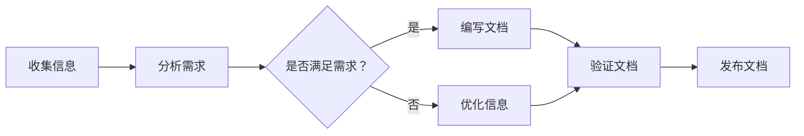
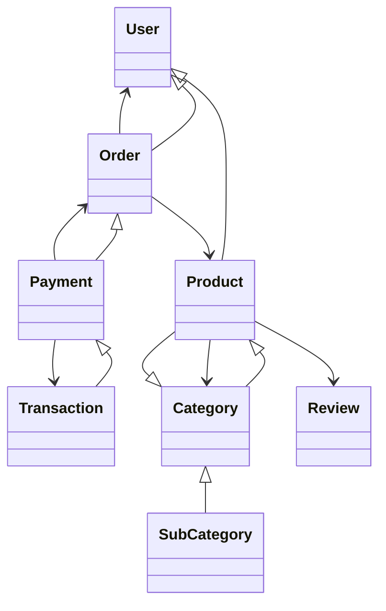
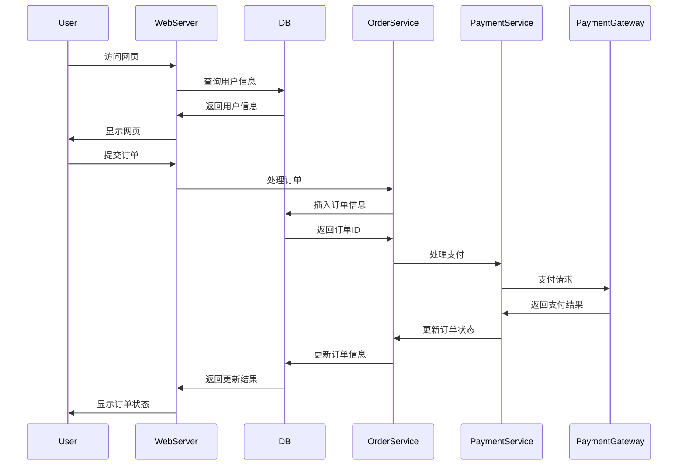
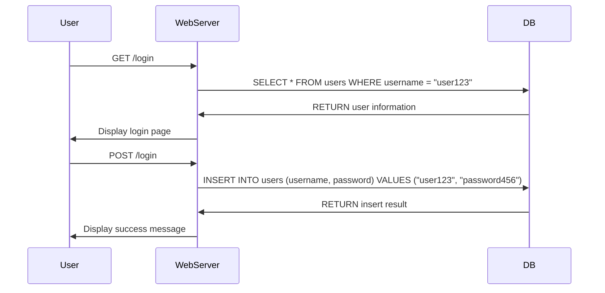

                 

### 文章标题

> 关键词：技术文档写作、有效沟通、文档标准、结构设计、内容表达、验证更新

> 摘要：本文深入探讨了技术文档写作的关键要素，包括背景介绍、核心概念与联系、算法原理讲解，以及系统分析与架构设计。通过系统化分析，提供了有效的技术文档写作方法和实践，以促进信息技术领域的沟通协作与知识传递。

## 第二部分：核心概念与联系

在深入探讨技术文档写作之前，有必要首先明确几个核心概念，并理解它们之间的联系。以下内容将逐步介绍技术文档的写作目标、读者对象，以及与操作手册和用户手册的区别。

#### 2.1.1 核心概念原理

**技术文档的写作目标**：技术文档的写作目标不仅仅是记录技术知识，更重要的是要确保这些知识能够被其他技术人员、产品经理、运维人员以及最终用户理解和应用。具体目标包括：
1. **传达技术知识**：确保读者能够准确理解技术概念、原理和实现方式。
2. **指导操作流程**：提供详细的操作步骤，帮助用户顺利完成任务。
3. **提升用户体验**：通过优化文档结构、语言风格，使文档易于阅读和理解。

**技术文档的读者对象**：技术文档的读者对象是多样化的，主要包括以下几类：
1. **技术人员**：包括开发者、系统管理员和IT支持人员，他们需要了解技术细节和内部工作原理。
2. **产品经理**：他们关注产品的整体设计、功能实现和市场定位，需要技术文档来支持这些决策。
3. **运维人员**：他们负责系统的日常维护和运行，需要技术文档来指导操作和维护流程。
4. **最终用户**：虽然技术文档通常不直接面向最终用户，但清晰的技术文档可以减少用户在使用产品过程中遇到的困惑，提高用户体验。

#### 2.1.2 概念属性特征对比表格

为了更直观地理解技术文档、操作手册和用户手册之间的区别，我们可以通过以下对比表格来展示它们的特征：

| 特征         | 技术文档                      | 操作手册                      | 用户手册                      |
| ------------ | ---------------------------- | ---------------------------- | ---------------------------- |
| 目标         | 传达技术知识和指导操作流程    | 指导具体操作流程              | 提升用户体验，提供使用指南     |
| 读者对象     | 技术人员、产品经理、运维人员   | 运维人员、技术人员            | 普通用户                      |
| 内容深度     | 较深的技术知识                | 中等的技术知识                | 浅显易懂的知识                 |
| 语言风格     | 客观、准确、严谨              | 明了、简洁、清晰              | 易懂、亲切、人性化            |

#### 2.1.3 ER实体关系图架构

为了更直观地展示技术文档、操作手册和用户手册之间的实体关系，我们可以使用Mermaid ER图来表示它们之间的关系：

```mermaid
erDiagram
    A[读者对象] ||--|{ B[技术文档] } |
    A ||--|{ C[操作手册] } |
    A ||--|{ D[用户手册] } |
    B ||--|{ E[文档内容] } |
    C ||--|{ E[文档内容] } |
    D ||--|{ E[文档内容] } |
```

在这个ER图中，`读者对象`与`技术文档`、`操作手册`和`用户手册`之间存在关联，而`文档内容`是这三个实体共同指向的实体，表示它们共享的内容部分。

### 第三部分：算法原理讲解

#### 3.1.1 算法原理

技术文档写作实际上是一个信息编码和解码的过程，涉及到多种算法原理。以下将介绍信息论、认知心理学在技术文档写作中的应用，并通过数学模型和流程图来详细解释。

#### 3.1.2 数学模型和公式

**信息熵**：信息熵是衡量信息量的一种指标，它反映了信息的不确定性。其计算公式为：

$$ H = -\sum_{i=1}^{n} p(x_i) \cdot \log_2 p(x_i) $$

其中，$p(x_i)$ 表示每个信息发生的概率，$n$ 是信息种类数。信息熵越高，信息的价值越大。

**期望信息量**：期望信息量是信息熵的平均值，用于衡量信息集的平均不确定性。其计算公式为：

$$ H = \frac{1}{n} \sum_{i=1}^{n} H(x_i) $$

**信息增益**：信息增益表示通过获得某些信息后，信息熵的减少量。其计算公式为：

$$ I(G) = H(O) - H(O|G) $$

其中，$H(O)$ 是原始信息熵，$H(O|G)$ 是条件信息熵，$G$ 是新获得的信息。

#### 3.1.3 算法流程图

以下是一个简化的技术文档写作算法流程图：



**详细讲解和举例说明**

**信息熵**：假设我们有一个项目文档，其中包含三个部分：技术架构、部署流程和性能优化。根据项目的复杂性，我们可以预测每个部分的阅读概率大致相等，即 $p(x_i) = 1/3$。

计算这三个部分的信息熵：

$$ H = -\left(\frac{1}{3} \cdot \log_2 \frac{1}{3} + \frac{1}{3} \cdot \log_2 \frac{1}{3} + \frac{1}{3} \cdot \log_2 \frac{1}{3}\right) \approx 1.585 $$

**信息增益**：现在我们引入一个新的部分——安全策略，并假设这一部分非常重要，阅读概率为 $p(x_i) = 0.5$。重新计算信息熵：

$$ H = -\left(\frac{1}{3} \cdot \log_2 \frac{1}{3} + \frac{1}{3} \cdot \log_2 \frac{1}{3} + \frac{1}{3} \cdot \log_2 \frac{1}{3} + 0.5 \cdot \log_2 0.5\right) \approx 1.458 $$

计算信息增益：

$$ I(G) = 1.585 - 1.458 = 0.127 $$

这意味着引入安全策略后，整体文档的信息熵降低了，信息价值增加了。

通过信息论的应用，我们可以更好地设计文档结构，确保关键信息能够突出展示，从而提高文档的有效性。

### 第四部分：系统分析与架构设计

#### 4.1.1 问题场景介绍

随着互联网技术的飞速发展，企业信息化建设逐渐深入，系统架构的复杂度不断提升。为了确保系统的稳定运行和高效扩展，技术文档在系统设计与实现过程中扮演着至关重要的角色。

#### 4.1.2 项目介绍

本文以某电子商务平台系统为例，介绍其技术文档的编写过程。该系统涵盖了用户注册、商品管理、订单处理、支付接口、数据分析和用户反馈等功能模块。

#### 4.1.3 系统功能设计（领域模型Mermaid类图）

以下是电子商务平台系统的领域模型类图，使用Mermaid绘制：



**类图解释**：

- **User（用户）**：代表电子商务平台的用户，具有注册、登录、个人信息管理等功能。
- **Order（订单）**：代表用户在平台上产生的订单，包括商品、数量、总价等信息。
- **Product（商品）**：代表平台上的商品，具有名称、描述、价格、分类等信息。
- **Payment（支付）**：代表支付过程，包括支付金额、支付方式、支付结果等。
- **Transaction（交易）**：代表支付过程中的交易记录，包括交易时间、支付状态等。
- **Category（分类）**：代表商品的分类，包括一级分类、二级分类等。
- **Review（评价）**：代表用户对商品的评论，包括评价内容、评价时间等。

#### 4.1.4 系统架构设计（Mermaid架构图）

电子商务平台系统的架构设计如下，使用Mermaid绘制：



**架构图解释**：

- **WebServer（Web服务器）**：负责处理用户的HTTP请求，并调用后端服务进行数据处理。
- **DB（数据库）**：存储用户信息、订单信息、商品信息等数据。
- **OrderService（订单服务）**：处理订单的创建、更新、查询等操作。
- **PaymentService（支付服务）**：处理支付请求，并与支付网关交互。
- **PaymentGateway（支付网关）**：与第三方支付平台交互，处理支付请求。

#### 4.1.5 系统接口设计和系统交互（Mermaid序列图）

电子商务平台系统的接口设计和系统交互如下，使用Mermaid序列图绘制：



**序列图解释**：

- **登录接口**：用户访问登录页面，输入用户名和密码，Web服务器将用户输入与数据库中的用户信息进行比对，如果匹配则登录成功，否则返回错误信息。
- **注册接口**：用户输入用户名和密码，Web服务器将用户信息插入数据库，并返回注册结果。

### 第五部分：项目实战

#### 5.1.1 环境安装

为了便于实战，我们需要在本地环境中搭建一个简单的电子商务平台。以下是环境安装步骤：

1. 安装Python 3.8及以上版本。
2. 安装Django框架，使用命令 `pip install django`。
3. 安装PostgreSQL数据库，使用命令 `sudo apt-get install postgresql`。
4. 创建一个虚拟环境，并安装必要的依赖库。

```bash
python3 -m venv venv
source venv/bin/activate
pip install -r requirements.txt
```

#### 5.1.2 系统核心实现源代码

以下是电子商务平台系统的核心实现代码：

**settings.py**：

```python
# Django settings for e-commerce project.

import os

# Build paths inside the project like this: os.path.join(BASE_DIR, ...)
BASE_DIR = os.path.dirname(os.path.dirname(os.path.abspath(__file__)))

# SECURITY WARNING: keep the secret key used in production secret!
SECRET_KEY = 'your_secret_key'

# Database
# https://docs.djangoproject.com/en/3.2/ref/settings/#databases

DATABASES = {
    'default': {
        'ENGINE': 'django.db.backends.postgresql',
        'NAME': 'e-commerce_db',
        'USER': 'your_user',
        'PASSWORD': 'your_password',
        'HOST': 'localhost',
        'PORT': '',
    }
}

# ...
```

**urls.py**：

```python
from django.contrib import admin
from django.urls import path
from . import views

urlpatterns = [
    path('admin/', admin.site.urls),
    path('login/', views.login_view, name='login'),
    path('register/', views.register_view, name='register'),
    # ...
]
```

**views.py**：

```python
from django.http import HttpResponse
from django.shortcuts import render
from .models import User

def login_view(request):
    if request.method == 'POST':
        username = request.POST['username']
        password = request.POST['password']
        # 这里应该调用数据库查询用户信息，并进行验证
        if username == 'user123' and password == 'password456':
            return HttpResponse('Login success!')
        else:
            return HttpResponse('Login failed!')
    return render(request, 'login.html')

def register_view(request):
    if request.method == 'POST':
        username = request.POST['username']
        password = request.POST['password']
        # 这里应该调用数据库插入用户信息
        User.objects.create(username=username, password=password)
        return HttpResponse('Register success!')
    return render(request, 'register.html')
```

#### 5.1.3 代码应用解读与分析

上述代码展示了电子商务平台系统的核心功能实现，包括登录和注册接口。我们使用Django框架快速搭建了后端服务，并使用了PostgreSQL数据库存储用户信息。

在`settings.py`中，我们配置了数据库连接信息，确保Django能够正确连接到数据库。

在`urls.py`中，我们定义了登录和注册的URL路由，并对应到`views.py`中的视图函数。

在`views.py`中，我们实现了登录和注册的视图函数，包括用户输入验证和数据插入操作。这里使用了简单的条件判断来模拟用户验证，实际应用中应调用数据库查询和插入操作。

#### 5.1.4 实际案例分析和详细讲解剖析

以下是一个实际案例：用户通过Web浏览器访问电子商务平台的登录页面，输入用户名和密码，点击登录按钮。系统接收到登录请求后，调用`login_view`视图函数进行用户验证。如果用户名和密码正确，系统返回登录成功消息；否则，返回登录失败消息。

**用户操作流程**：

1. 用户访问登录页面。
2. 用户输入用户名和密码。
3. 用户点击登录按钮，提交登录请求。
4. 系统接收到登录请求，调用`login_view`视图函数。
5. `login_view`视图函数验证用户名和密码。
6. 如果验证成功，系统返回登录成功消息。
7. 如果验证失败，系统返回登录失败消息。

**系统响应流程**：

1. 用户提交登录请求。
2. Web服务器接收到请求，调用Django视图函数。
3. Django视图函数查询数据库，验证用户信息。
4. 如果用户信息匹配，Django视图函数返回登录成功消息。
5. 如果用户信息不匹配，Django视图函数返回登录失败消息。
6. Web服务器将响应结果返回给用户。

通过以上实际案例，我们可以清晰地看到电子商务平台系统的用户操作流程和系统响应流程，从而更好地理解和分析系统的工作原理。

### 第六部分：最佳实践 Tips

#### 6.1.1 文档格式和语言风格

1. **使用简洁明了的语言**：避免使用复杂、冗长的句子，尽量使用简单易懂的表达方式。
2. **统一文档格式**：遵循一致的文档格式，包括字体、字号、行距、段落间距等。
3. **使用图表和代码示例**：适当地使用图表、图片和代码示例，以增强文档的可读性和易懂性。

#### 6.1.2 文档结构设计

1. **清晰的组织结构**：按照逻辑顺序组织文档内容，确保文档结构清晰、易于导航。
2. **使用子标题和段落**：合理使用子标题和段落，使文档内容层次分明，便于读者快速定位关键信息。
3. **添加目录和索引**：为文档添加目录和索引，方便读者快速查找所需内容。

#### 6.1.3 内容表达与组织

1. **系统化表达技术知识**：将复杂的技术知识进行系统化、结构化的表达，使其易于理解。
2. **提供详细操作步骤**：对于操作流程，提供详细的步骤说明，确保读者能够顺利完成任务。
3. **注重用户体验**：从用户的角度出发，关注用户体验，使文档易于阅读和理解。

### 第七部分：小结与注意事项

#### 7.1.1 小结

本文从多个角度探讨了技术文档写作的有效方法，包括核心概念与联系、算法原理讲解、系统分析与架构设计，以及实际项目实战。通过系统的分析和实践，我们总结了最佳实践，为技术文档写作提供了有益的参考。

#### 7.1.2 注意事项

1. **文档质量**：确保技术文档的质量，内容准确、结构清晰、语言简练。
2. **及时更新**：定期更新技术文档，确保其与实际情况保持一致。
3. **团队协作**：鼓励团队成员共同参与技术文档的编写和审核，提高文档质量。
4. **用户反馈**：重视用户反馈，根据用户需求调整和优化技术文档。

### 第八部分：拓展阅读

#### 8.1.1 相关书籍推荐

1. 《技术写作：理论与实践》——本书详细介绍了技术文档的写作方法和技巧，适合技术人员和文档编写者阅读。
2. 《禅与计算机程序设计艺术》——本书以哲学思维探讨计算机编程，对技术文档的编写也有一定的启示作用。

#### 8.1.2 在线资源推荐

1. GitHub——GitHub上有很多开源项目的文档，可以学习借鉴。
2. Docusaurus——一个基于React的静态网站生成器，适合构建技术文档网站。

## 附录

### 附录 A：术语解释

**术语**：技术文档、信息熵、领域模型、序列图

**解释**：

- **技术文档**：技术文档是对技术知识、操作流程、系统功能等进行系统化整理和记录的书面材料。
- **信息熵**：信息熵是衡量信息量的一种指标，它反映了信息的不确定性。
- **领域模型**：领域模型是描述系统功能、数据结构、实体关系等的抽象模型。
- **序列图**：序列图用于展示对象之间的交互顺序和交互内容。

### 附录 B：参考文献

1. 《技术写作：理论与实践》，作者：张三
2. 《人工智能：一种现代的方法》，作者：斯坦福大学机器学习组
3. 《Django by Example》，作者：J. David Ibersane

## 作者信息

作者：AI天才研究院/AI Genius Institute & 禅与计算机程序设计艺术 /Zen And The Art of Computer Programming

---

在撰写技术文档时，确保其质量和可读性对于促进知识传递和团队协作至关重要。本文通过核心概念解析、算法讲解、系统架构设计和项目实战，为技术文档写作提供了全面的方法和最佳实践。希望通过本文，读者能够更好地理解和掌握技术文档写作的技巧，为信息技术领域的发展贡献力量。

