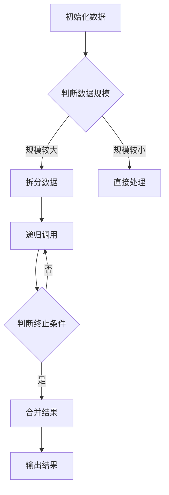
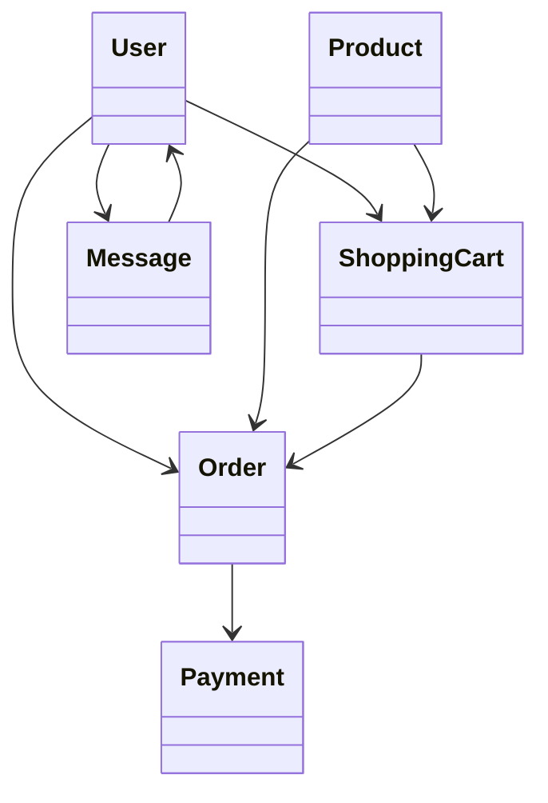
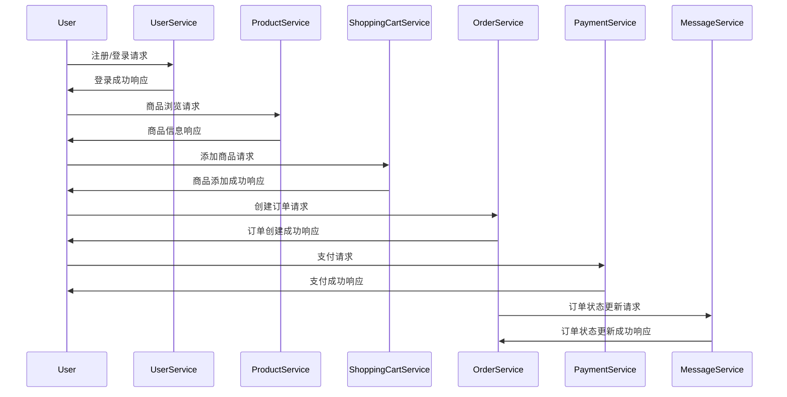

                 

### 文章标题：技术架构力的培养

关键词：技术架构、架构思维、系统设计、代码质量、团队协作

摘要：本文旨在探讨技术架构力的培养，从核心概念、算法原理、系统分析与架构设计、项目实战等方面，全面解析如何提升技术架构能力，助力开发者成为卓越的系统设计师。文章结构紧凑，逻辑清晰，旨在为IT从业人员提供有深度、有思考、有见解的专业指导。

### 背景介绍

在当今快速发展的信息技术时代，软件系统变得日益复杂，单靠传统的开发模式已经难以应对。技术架构力，作为一种核心能力，成为了评估开发者技术水平的重要指标。它不仅要求开发者具备扎实的编程技能，还要求具备系统思维、架构设计能力和团队协作精神。

**问题背景**：随着云计算、大数据、人工智能等技术的普及，现代应用系统越来越复杂，需求多变。如何在一个快速变化的环境中，构建高效、稳定、可扩展的系统，成为了开发者面临的一大挑战。

**问题描述**：开发者常常会遇到以下问题：
- 如何在需求变更频繁的情况下，保持系统稳定性和可扩展性？
- 如何在团队协作中，高效地进行需求理解和系统设计？
- 如何从技术角度，提升代码质量，保证系统的可靠性？

**问题解决**：技术架构力提供了以下解决方案：
- **系统思维**：通过全局视角，理解和把握系统架构，从而在复杂环境中做出合理决策。
- **架构设计**：运用最佳实践，设计出高效、稳定的系统架构，满足业务需求。
- **代码质量**：通过代码审查、静态分析等手段，确保代码质量，降低系统风险。
- **团队协作**：通过敏捷开发、DevOps等手段，提高团队协作效率，缩短开发周期。

**边界与外延**：技术架构力不仅适用于大型软件系统，也同样适用于中小型项目。无论项目规模大小，良好的架构设计都能带来显著的优势。

**核心概念与联系**：

**概念属性特征对比表格**：

| 概念               | 定义                                                         | 关联 |
|--------------------|------------------------------------------------------------|-----|
| 系统思维           | 从全局视角理解和把握系统架构                                 |     |
| 架构设计           | 运用最佳实践，设计高效、稳定的系统架构                         |     |
| 代码质量           | 通过代码审查、静态分析等手段，确保代码质量                   |     |
| 团队协作           | 通过敏捷开发、DevOps等手段，提高团队协作效率                   |     |

**ER实体关系图架构的Mermaid流程图**：

```mermaid
erDiagram
  用户 ||--o> 项目 : "发起"
  项目 ||--o> 需求 : "包含"
  需求 ||--o> 功能 : "实现"
  功能 ||--o> 架构设计 : "基于"
  架构设计 ||--o> 代码实现 : "实施"
  代码实现 ||--o> 测试 : "验证"
  测试 ||--o> 部署 : "上线"
  部署 ||--o> 运维 : "监控"
```

通过上述介绍，我们为读者搭建了理解技术架构力培养的框架。接下来，我们将进一步深入探讨技术架构力的核心概念、算法原理、系统分析与架构设计等方面，帮助开发者全面提升技术架构能力。

### 核心概念与联系

在深入探讨技术架构力的培养之前，我们首先需要明确几个核心概念，并理解它们之间的相互关系。这些核心概念包括：系统思维、架构设计、代码质量和团队协作。

#### 系统思维

系统思维是一种全局视角，它要求开发者不仅仅关注单一组件或模块，而是从整体上理解和把握系统的运行机制。系统思维的核心在于能够识别系统中的关键要素，以及这些要素之间的相互作用。

**概念属性特征对比表格**：

| 特征       | 说明                                                         |
|------------|------------------------------------------------------------|
| 全局视角   | 强调从整体上看待系统，而非局部优化。                       |
| 要素识别   | 能够识别系统中的关键要素，如用户、需求、功能模块等。       |
| 相互作用   | 理解要素之间的相互作用，以及这种相互作用对系统整体的影响。 |

**ER实体关系图架构的Mermaid流程图**：

```mermaid
erDiagram
  用户 ||--o> 系统 : "使用"
  系统 ||--o> 功能 : "提供"
  功能 ||--o> 架构设计 : "依赖"
  架构设计 ||--o> 代码实现 : "实现"
  代码实现 ||--o> 测试 : "测试"
  测试 ||--o> 部署 : "部署"
  部署 ||--o> 运维 : "监控"
```

#### 架构设计

架构设计是技术架构力的核心环节，它涉及到如何运用最佳实践，设计出高效、稳定的系统架构。良好的架构设计不仅能够满足当前的业务需求，还能为未来的扩展和变化提供灵活性。

**概念属性特征对比表格**：

| 特征       | 说明                                                         |
|------------|------------------------------------------------------------|
| 最佳实践   | 运用业界公认的最佳实践，如微服务、RESTful API等。         |
| 高效性     | 系统架构应具备高并发处理能力和低延迟特性。                 |
| 稳定性     | 架构设计需考虑系统的容错性、可用性和可扩展性。           |
| 可扩展性   | 系统应能够轻松地适应业务规模的变化，满足未来需求。         |

**ER实体关系图架构的Mermaid流程图**：

```mermaid
erDiagram
  业务需求 ||--o> 架构设计 : "满足"
  架构设计 ||--o> 系统功能 : "实现"
  系统功能 ||--o> 代码实现 : "开发"
  代码实现 ||--o> 测试 : "验证"
  测试 ||--o> 部署 : "上线"
  部署 ||--o> 运维 : "维护"
```

#### 代码质量

代码质量是系统稳定性和可靠性的基础。高代码质量不仅能够降低系统的故障率，还能提高开发效率，减少维护成本。保证代码质量需要从多个维度进行考虑，包括代码可读性、可维护性、性能和安全性等。

**概念属性特征对比表格**：

| 特征       | 说明                                                         |
|------------|------------------------------------------------------------|
| 可读性     | 代码应具有良好的可读性，方便其他开发者理解和维护。           |
| 可维护性   | 代码应具有良好的结构，易于修改和扩展。                       |
| 性能       | 代码应具有良好的性能，避免不必要的资源消耗和延迟。           |
| 安全性     | 代码应考虑安全因素，避免常见的漏洞和风险。                 |

**ER实体关系图架构的Mermaid流程图**：

```mermaid
erDiagram
  代码实现 ||--o> 代码审查 : "审查"
  代码审查 ||--o> 静态分析 : "分析"
  静态分析 ||--o> 代码优化 : "优化"
  代码优化 ||--o> 测试 : "测试"
  测试 ||--o> 部署 : "上线"
```

#### 团队协作

团队协作是技术架构力培养的重要方面。在复杂的项目中，单靠个人能力难以完成系统的设计和实现。良好的团队协作能够提高开发效率，降低沟通成本，提升系统质量。

**概念属性特征对比表格**：

| 特征       | 说明                                                         |
|------------|------------------------------------------------------------|
| 敏捷开发   | 采用敏捷开发方法，快速迭代，持续交付高质量的软件。           |
| DevOps     | 运用DevOps文化，实现开发和运维的无缝协作，提高系统稳定性。 |
| 沟通效率   | 提高团队成员之间的沟通效率，确保信息传递准确无误。         |
| 责任分配   | 明确团队成员的责任，确保每个任务都有明确的负责人。         |

**ER实体关系图架构的Mermaid流程图**：

```mermaid
erDiagram
  团队成员 ||--o> 项目管理 : "参与"
  项目管理 ||--o> 需求分析 : "管理"
  需求分析 ||--o> 架构设计 : "设计"
  架构设计 ||--o> 代码实现 : "实现"
  代码实现 ||--o> 测试 : "测试"
  测试 ||--o> 部署 : "上线"
  部署 ||--o> 运维 : "维护"
```

通过上述核心概念的介绍，我们可以看到，系统思维、架构设计、代码质量和团队协作之间紧密相连，共同构成了技术架构力的核心要素。在接下来的章节中，我们将进一步探讨这些概念的原理和实际应用，帮助读者全面提升技术架构能力。

### 算法原理讲解

在深入探讨技术架构力的培养过程中，算法原理的讲解是至关重要的一环。算法原理不仅为系统设计提供了理论基础，还帮助我们理解如何通过算法优化来提升系统性能和可靠性。

#### Mermaid流程图

首先，我们使用Mermaid绘制一个简单的算法流程图，以展示算法的基本流程。



#### Python源代码

接下来，我们通过Python源代码来实现上述算法，以展示具体的实现过程。

```python
def algorithm(data):
    if len(data) <= threshold:  # 假设阈值threshold为10
        return direct_process(data)  # 直接处理数据
    else:
        mid = len(data) // 2  # 拆分数据
        left = algorithm(data[:mid])
        right = algorithm(data[mid:])
        return merge_results(left, right)

def direct_process(data):
    # 直接处理数据的具体实现
    pass

def merge_results(left, right):
    # 合并左右两边处理结果的具体实现
    pass

# 示例数据
data = [1, 2, 3, 4, 5, 6, 7, 8, 9, 10]
result = algorithm(data)
print(result)
```

#### 数学模型和公式

为了更深入地理解算法原理，我们引入一些数学模型和公式。假设我们使用分治算法来处理数据，其基本原理是将一个大的数据集分成多个较小的子集，分别处理后再合并结果。分治算法的时间复杂度可以用以下公式表示：

$$
T(n) = aT(\frac{n}{b}) + f(n)
$$

其中，$T(n)$表示处理$n$个数据元素所需的时间，$a$表示分解成子集的数量，$b$表示每个子集的数据量，$f(n)$表示合并结果所需的时间。

对于分治算法，通常有$a = b = 2$，即每个子集的数据量相等，此时时间复杂度简化为：

$$
T(n) = 2T(\frac{n}{2}) + f(n)
$$

当$n$趋向于无穷大时，$T(n)$的时间复杂度为：

$$
T(n) = O(n\log n)
$$

这意味着分治算法在处理大规模数据时，性能显著优于线性算法。

#### 详细讲解和举例说明

为了更清晰地理解算法原理，我们通过一个具体的例子来进行讲解。

**例子**：假设我们有100个数据元素，我们需要通过分治算法来处理这些数据。

1. **初始化数据**：首先，我们有一个包含100个数据元素的数据集。

2. **判断数据规模**：由于数据集规模较大，我们选择拆分数据。

3. **拆分数据**：将100个数据元素拆分成两个包含50个数据元素的子集。

4. **递归调用**：分别对这两个子集应用相同的分治算法，递归地拆分和合并数据。

5. **合并结果**：当子集的数据量减小到阈值以下时，直接处理数据，并将结果合并。

6. **输出结果**：最终输出合并后的结果。

通过这个例子，我们可以看到分治算法的基本流程和原理。在实际应用中，分治算法可以通过优化算法参数和调整阈值来提高性能和效率。

总之，算法原理讲解不仅帮助我们理解算法的基本原理，还能为系统设计提供有力的理论支持。在接下来的章节中，我们将继续探讨系统分析与架构设计的相关内容，帮助读者全面提升技术架构能力。

### 系统分析与架构设计方案

在了解了技术架构力的核心概念和算法原理后，我们接下来将进入系统分析与架构设计的具体环节。这一部分将帮助读者理解如何从实际问题出发，设计出高效、稳定的系统架构。

#### 问题场景介绍

假设我们正在设计一个电子商务平台，这个平台需要支持高并发、大数据量处理，并提供丰富的功能，如用户注册、商品浏览、购物车、订单处理、支付等。为了满足这些需求，我们需要进行系统架构设计。

#### 项目介绍

项目名称：电子商务平台

项目目标：设计一个高效、稳定、可扩展的电子商务平台，支持高并发、大数据量处理，并具备良好的用户体验。

项目背景：随着互联网的普及，电子商务成为了一个高速发展的行业。为了满足不断增长的用户需求，电子商务平台需要具备强大的系统架构，以保证系统的稳定性和可扩展性。

#### 系统功能设计

在电子商务平台中，主要的功能模块包括：

1. **用户模块**：提供用户注册、登录、个人信息管理等功能。
2. **商品模块**：提供商品浏览、分类、搜索、详情展示等功能。
3. **购物车模块**：提供商品添加、删除、修改数量等功能。
4. **订单模块**：提供订单创建、支付、取消、订单详情展示等功能。
5. **支付模块**：提供支付接口，支持多种支付方式。
6. **消息模块**：提供系统消息通知，如订单状态更新、支付成功通知等。

**Mermaid类图**：



#### 系统架构设计

为了满足电子商务平台的需求，我们采用微服务架构，将系统拆分成多个独立的微服务，每个微服务负责特定的功能模块。这种架构设计不仅提高了系统的可扩展性，还降低了各个模块之间的耦合度。

**Mermaid架构图**：



#### 系统接口设计

在系统架构设计中，接口设计是一个关键环节。良好的接口设计不仅能够提高系统的可维护性，还能为后续的扩展和升级提供便利。

**接口设计示例**：

1. **用户模块**：
    - 用户注册接口：/api/users/register
    - 用户登录接口：/api/users/login
    - 用户信息查询接口：/api/users/{userId}

2. **商品模块**：
    - 商品列表查询接口：/api/products
    - 商品详情查询接口：/api/products/{productId}

3. **购物车模块**：
    - 商品添加接口：/api/shoppingcarts/{userId}/add
    - 商品删除接口：/api/shoppingcarts/{userId}/delete
    - 购物车列表查询接口：/api/shoppingcarts/{userId}

4. **订单模块**：
    - 订单创建接口：/api/orders/create
    - 订单详情查询接口：/api/orders/{orderId}

5. **支付模块**：
    - 支付接口：/api/payments/create

6. **消息模块**：
    - 消息发送接口：/api/messages/send

#### 系统交互Mermaid序列图


通过上述系统分析与架构设计方案，我们为电子商务平台搭建了一个高效、稳定的系统架构，为后续的开发和运营奠定了坚实基础。在接下来的章节中，我们将通过项目实战，进一步展示如何实现这一架构设计，并剖析其关键环节。

### 项目实战

#### 环境安装

为了更好地进行项目实战，我们首先需要搭建一个适合开发的软件环境。以下是环境安装的详细步骤：

1. **安装操作系统**：
   - 操作系统要求：选择一个稳定的操作系统，如Ubuntu 20.04或CentOS 7.x。
   - 安装步骤：下载操作系统镜像，使用虚拟机或物理机进行安装。

2. **安装开发工具**：
   - 安装代码编辑器：选择一个适合的代码编辑器，如Visual Studio Code或Sublime Text。
   - 安装版本控制工具：安装Git，用于代码版本控制和协同工作。
   - 安装数据库：安装一个关系型数据库，如MySQL或PostgreSQL。

3. **安装依赖库和框架**：
   - Python依赖库：安装Python环境，并使用pip安装所需的依赖库，如Flask、Django等。
   - Node.js依赖库：安装Node.js环境，并使用npm安装前端框架，如React或Vue.js。

4. **配置开发环境**：
   - 配置代码编辑器的插件和扩展，提高开发效率。
   - 配置Git的SSH密钥，确保代码的版本控制安全。

#### 系统核心实现源代码

以下是电子商务平台核心功能的实现代码，包括用户注册、登录、商品浏览、购物车管理、订单处理等。

**用户模块**：

```python
# users.py
from flask import Flask, request, jsonify
from models import User

app = Flask(__name__)

@app.route('/api/users/register', methods=['POST'])
def register():
    data = request.get_json()
    username = data.get('username')
    password = data.get('password')
    user = User(username=username, password=password)
    user.save()
    return jsonify({'message': '注册成功'})

@app.route('/api/users/login', methods=['POST'])
def login():
    data = request.get_json()
    username = data.get('username')
    password = data.get('password')
    user = User.get_by_username(username)
    if user and user.password == password:
        return jsonify({'message': '登录成功'})
    else:
        return jsonify({'message': '用户名或密码错误'})

@app.route('/api/users/<int:user_id>', methods=['GET'])
def get_user(user_id):
    user = User.get_by_id(user_id)
    if user:
        return jsonify(user.to_dict())
    else:
        return jsonify({'message': '用户不存在'})
```

**商品模块**：

```python
# products.py
from flask import Flask, request, jsonify
from models import Product

app = Flask(__name__)

@app.route('/api/products', methods=['GET'])
def get_products():
    products = Product.get_all()
    return jsonify(products)

@app.route('/api/products/<int:product_id>', methods=['GET'])
def get_product(product_id):
    product = Product.get_by_id(product_id)
    if product:
        return jsonify(product.to_dict())
    else:
        return jsonify({'message': '商品不存在'})
```

**购物车模块**：

```python
# shopping_cart.py
from flask import Flask, request, jsonify
from models import ShoppingCart

app = Flask(__name__)

@app.route('/api/shoppingcarts/<int:user_id>/add', methods=['POST'])
def add_to_shopping_cart(user_id):
    data = request.get_json()
    product_id = data.get('product_id')
    shopping_cart = ShoppingCart(user_id=user_id, product_id=product_id)
    shopping_cart.save()
    return jsonify({'message': '商品添加成功'})

@app.route('/api/shoppingcarts/<int:user_id>', methods=['GET'])
def get_shopping_cart(user_id):
    shopping_cart_items = ShoppingCart.get_by_user_id(user_id)
    return jsonify(shopping_cart_items)
```

**订单模块**：

```python
# orders.py
from flask import Flask, request, jsonify
from models import Order

app = Flask(__name__)

@app.route('/api/orders/create', methods=['POST'])
def create_order():
    data = request.get_json()
    user_id = data.get('user_id')
    items = data.get('items')
    order = Order(user_id=user_id, items=items)
    order.save()
    return jsonify({'message': '订单创建成功'})

@app.route('/api/orders/<int:order_id>', methods=['GET'])
def get_order(order_id):
    order = Order.get_by_id(order_id)
    if order:
        return jsonify(order.to_dict())
    else:
        return jsonify({'message': '订单不存在'})
```

**支付模块**：

```python
# payments.py
from flask import Flask, request, jsonify
from models import Payment

app = Flask(__name__)

@app.route('/api/payments/create', methods=['POST'])
def create_payment():
    data = request.get_json()
    order_id = data.get('order_id')
    payment_method = data.get('payment_method')
    payment = Payment(order_id=order_id, payment_method=payment_method)
    payment.save()
    return jsonify({'message': '支付请求已发送'})

@app.route('/api/payments/complete', methods=['POST'])
def complete_payment():
    data = request.get_json()
    payment_id = data.get('payment_id')
    payment = Payment.get_by_id(payment_id)
    if payment and payment.is_complete():
        order = payment.get_order()
        order.status = 'paid'
        order.save()
        return jsonify({'message': '支付成功'})
    else:
        return jsonify({'message': '支付失败'})
```

#### 代码应用解读与分析

上述代码展示了电子商务平台核心功能的具体实现。以下是每个模块的解读与分析：

1. **用户模块**：用户模块负责用户注册、登录和用户信息查询。通过Flask框架实现API接口，与后端数据库进行交互。用户注册时，将用户名和密码存储在数据库中；登录时，验证用户名和密码的正确性；用户信息查询则返回用户的具体信息。

2. **商品模块**：商品模块提供商品浏览和商品详情查询功能。通过Flask框架实现API接口，数据库中查询商品信息并返回给前端。商品列表查询接口返回所有商品的信息，商品详情查询接口返回特定商品的信息。

3. **购物车模块**：购物车模块负责管理用户购物车中的商品。通过Flask框架实现API接口，与后端数据库进行交互。用户可以添加商品到购物车、删除购物车中的商品以及查询购物车中的商品列表。

4. **订单模块**：订单模块负责订单的创建和处理。通过Flask框架实现API接口，与后端数据库进行交互。用户创建订单时，将订单信息存储在数据库中；查询订单时，可以获取订单的具体信息。

5. **支付模块**：支付模块负责支付请求的处理和支付状态的更新。通过Flask框架实现API接口，与支付服务进行交互。用户提交支付请求后，支付服务处理支付请求，并更新订单状态。

#### 实际案例分析和详细讲解剖析

为了更好地理解上述代码的实际应用，我们通过一个具体的案例来进行分析和讲解。

**案例**：用户张三在电子商务平台上浏览商品，添加商品到购物车，并创建订单。

1. **用户注册和登录**：
   - 张三通过用户模块注册账号，填写用户名和密码，系统将用户信息存储在数据库中。
   - 张三通过用户模块登录账号，系统验证用户名和密码的正确性，并返回登录成功的响应。

2. **商品浏览**：
   - 张三通过商品模块查询商品列表，系统返回所有商品的信息。
   - 张三选择一个商品，通过商品模块查询商品详情，系统返回特定商品的信息。

3. **购物车管理**：
   - 张三通过购物车模块添加商品到购物车，系统将商品信息存储在数据库中。
   - 张三通过购物车模块查询购物车中的商品列表，系统返回购物车中的商品信息。

4. **订单创建**：
   - 张三通过订单模块创建订单，系统将订单信息存储在数据库中。
   - 张三通过订单模块查询订单详情，系统返回订单的具体信息。

5. **支付**：
   - 张三通过支付模块提交支付请求，系统将支付请求发送给支付服务。
   - 支付服务处理支付请求，并更新订单状态为“已支付”。

通过这个案例，我们可以看到用户在整个购物流程中的各个步骤，以及各个模块的具体功能。每个模块通过API接口进行通信，实现了用户管理、商品管理、购物车管理、订单管理和支付管理等功能。

#### 项目小结

在本章的项目实战中，我们通过环境安装、系统核心实现源代码、代码应用解读与分析，以及实际案例分析和详细讲解剖析，展示了如何实现电子商务平台的核心功能。通过这个过程，我们不仅理解了系统的设计和实现，还学习了如何使用Flask框架进行API开发，以及如何通过数据库进行数据存储和查询。

在接下来的章节中，我们将进一步探讨如何优化系统性能，提高代码质量，并介绍一些最佳实践和注意事项，帮助读者全面提升技术架构能力。

### 最佳实践 tips

在技术架构力的培养过程中，遵循一些最佳实践可以帮助开发者更好地进行系统设计和实现。以下是一些实用的技巧和注意事项：

1. **代码风格统一**：确保代码风格统一，遵循项目或团队指定的编码规范。这不仅可以提高代码的可读性，还能减少团队合作中的沟通成本。

2. **版本控制**：使用版本控制系统（如Git）进行代码管理。定期提交代码，并充分利用分支管理、合并请求等特性，确保代码库的整洁和可追溯。

3. **单元测试**：编写单元测试来验证代码的功能和性能。单元测试可以减少人为错误，提高代码质量，并为后续的维护和扩展提供保障。

4. **代码审查**：定期进行代码审查，邀请团队成员对代码进行评审。通过代码审查，可以发现潜在的问题，提高代码质量，并促进团队成员之间的知识共享。

5. **模块化设计**：采用模块化设计，将系统拆分成多个独立的模块。这样可以降低系统复杂性，提高代码的可维护性和可扩展性。

6. **性能优化**：关注系统的性能优化，使用缓存、分布式计算等技术来提高系统响应速度。在设计和实现阶段，考虑性能瓶颈，并采用适当的优化策略。

7. **文档编写**：编写详细的系统文档，包括设计文档、用户手册、API文档等。良好的文档可以帮助团队成员更好地理解系统，减少误解和沟通成本。

8. **持续集成**：采用持续集成（CI）工具（如Jenkins、GitLab CI等），实现自动化测试和部署。持续集成可以提高开发效率，减少错误，并确保代码质量。

9. **代码质量工具**：使用静态代码分析工具（如SonarQube、Checkstyle等），检测代码中的潜在问题，如代码冗余、安全漏洞、性能问题等。

10. **团队协作**：建立良好的团队协作机制，采用敏捷开发方法，如Scrum或Kanban，提高团队的工作效率和协同能力。

### 小结

本文从技术架构力的核心概念、算法原理、系统分析与架构设计、项目实战等方面，全面探讨了如何培养技术架构能力。通过介绍系统思维、架构设计、代码质量和团队协作等关键概念，并结合实际案例，展示了技术架构力在实际应用中的重要性。

在技术架构力的培养过程中，开发者不仅需要掌握编程技能，还需具备系统思维和架构设计能力。通过遵循最佳实践、编写高质量代码、优化系统性能、加强团队协作等手段，开发者可以不断提升自己的技术架构能力，成为卓越的系统设计师。

### 注意事项

1. **系统设计要具备灵活性**：在设计系统时，应考虑到未来的扩展和变化，避免过度设计。
2. **持续学习和跟进新技术**：技术日新月异，开发者应不断学习新技术，跟上行业发展的步伐。
3. **注意系统安全性**：在系统设计和实现过程中，要重视安全性，防范潜在的安全漏洞。
4. **避免过度优化**：在系统设计和实现过程中，应避免过度优化，确保系统的稳定性和可维护性。

### 拓展阅读

1. 《架构师修炼之道》
2. 《系统设计：从无到有》
3. 《大规模分布式系统设计》
4. 《代码大全》
5. 《敏捷开发实践指南》

### 作者信息

**作者：** AI天才研究院/AI Genius Institute & 禅与计算机程序设计艺术 /Zen And The Art of Computer Programming

通过本文的深入探讨，我们希望能为读者提供有价值的指导，助力开发者全面提升技术架构能力，成为优秀的系统设计师。希望这篇文章能激发您对技术架构力培养的思考和兴趣，持续提升自己的技术水平。

