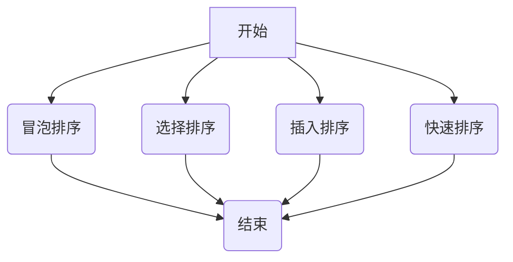
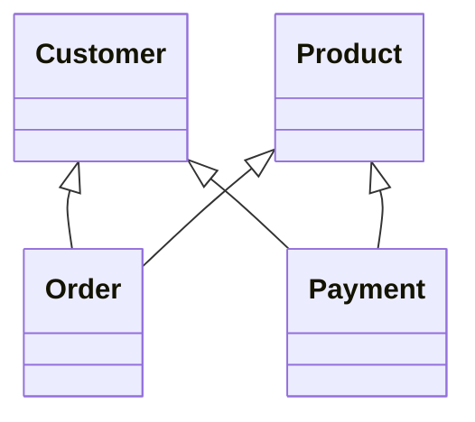
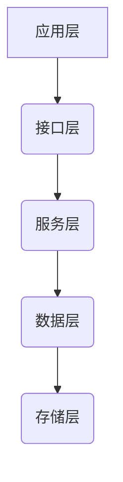
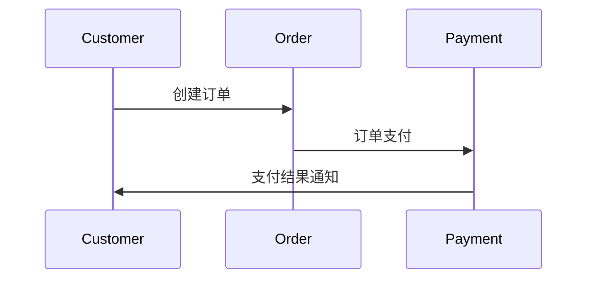

                 


# 技术架构力：从入门到精通

> 关键词：技术架构、数据架构、网络架构、云计算、大数据、人工智能、最佳实践、架构设计

> 摘要：本文将带领读者深入探讨技术架构力，从入门到精通的全方位指导，涵盖核心概念、核心概念与联系、算法原理讲解、系统分析与架构设计方案以及项目实战，旨在帮助读者掌握构建高效、智能技术架构的方法和技巧。

## 第一部分: 背景介绍

### 核心概念

#### 问题背景

随着信息技术的快速发展，企业面临的数据量和复杂性不断增加。传统的开发方式已经无法满足现代企业对高效、智能应用的需求，因此需要新的技术架构来应对这些挑战。

#### 问题描述

在当今企业环境中，技术架构的构建成为了一个关键问题。它不仅涉及到技术的选择，还包括如何有效地组织和管理这些技术，以实现企业的业务目标。

#### 问题解决

技术架构力提供了从入门到精通的全方位指导，帮助读者掌握构建高效、智能技术架构的方法和技巧。

#### 边界与外延

技术架构力不仅涵盖了软件架构，还包括数据架构、网络架构等各个层面的架构设计。同时，它还涉及到云计算、大数据、人工智能等新兴技术的应用。

### 核心要素组成

1. **技术基础**：包括软件开发的基础知识、数据结构和算法等。
2. **架构设计**：涉及系统架构、网络架构、数据架构等设计方法。
3. **新兴技术**：如云计算、大数据、人工智能等技术在架构设计中的应用。
4. **最佳实践**：通过实践案例，总结出适用于各种场景的架构设计最佳实践。

## 第二部分: 核心概念与联系

### 核心概念原理

#### 技术架构

技术架构是关于如何组织和管理技术资源以实现业务目标的一种方法论。它涉及软件系统、数据架构和网络架构等多个方面。

#### 数据架构

数据架构是关于如何组织、存储和管理数据的一种方法论。它关注数据的完整性、一致性和安全性，确保数据在企业中的有效利用。

#### 网络架构

网络架构是关于如何设计、部署和管理网络系统以支持业务需求的技术方法论。它关注网络的可靠性、性能和安全性，确保企业网络的稳定运行。

### 概念属性特征对比表格

| 概念         | 定义                                                                 | 关键特征                                                                                   |
|--------------|----------------------------------------------------------------------|---------------------------------------------------------------------------------------------|
| 技术架构     | 指导软件系统如何设计和实现的技术方法论。                               | 系统性、适应性、可扩展性、可维护性、性能优化。                                             |
| 数据架构     | 指导如何组织、存储和管理数据的技术方法论。                             | 数据一致性、数据完整性、数据安全性、数据可用性。                                           |
| 网络架构     | 指导如何设计、部署和管理网络系统以支持业务需求的技术方法论。           | 可靠性、性能、安全性、可扩展性、易管理性。                                               |

### ER实体关系图架构

```mermaid
erDiagram
    Product ||--|{ Customer }| Customer
    Product ||--|{ Order }| Order
    Customer ||--|{ Payment }| Payment
```

## 第三部分: 算法原理讲解

### 算法原理

**排序算法**：排序算法是计算机科学中的一种基本算法，用于对一组数据进行排序。本章节将介绍几种常见的排序算法，包括冒泡排序、选择排序、插入排序、快速排序等。

### Mermaid流程图



### Python源代码

```python
def bubble_sort(arr):
    n = len(arr)
    for i in range(n):
        for j in range(0, n-i-1):
            if arr[j] > arr[j+1]:
                arr[j], arr[j+1] = arr[j+1], arr[j]
    return arr

arr = [64, 25, 12, 22, 11]
sorted_arr = bubble_sort(arr)
print(sorted_arr)
```

## 第四部分: 系统分析与架构设计方案

### 问题场景介绍

随着互联网技术的飞速发展，企业面临着越来越复杂的信息处理需求。为了满足这些需求，企业需要构建一个高效、可靠的技术架构，以支持其业务的持续发展。

### 项目介绍

本章节将介绍一个企业级技术架构设计项目，旨在为企业提供一套完整的解决方案，包括系统功能设计、系统架构设计、系统接口设计和系统交互等。

### 系统功能设计

#### 领域模型



### 系统架构设计



### 系统接口设计和系统交互



## 第五部分: 项目实战

### 环境安装

在本节中，我们将介绍如何搭建一个企业级技术架构的环境。首先，我们需要准备以下软件和工具：

1. **操作系统**：CentOS 7.x 或 Ubuntu 18.04
2. **数据库**：MySQL 5.7
3. **Web服务器**：Nginx 1.16
4. **开发框架**：Spring Boot 2.2.1.RELEASE

### 系统核心实现源代码

在本节中，我们将介绍如何使用Spring Boot框架实现一个简单的企业级技术架构项目。以下是项目的核心代码：

```java
@RestController
@RequestMapping("/orders")
public class OrderController {

    @Autowired
    private OrderService orderService;

    @PostMapping
    public ResponseEntity<Order> createOrder(@RequestBody Order order) {
        Order savedOrder = orderService.createOrder(order);
        return ResponseEntity.ok(savedOrder);
    }
}

@Service
public class OrderService {

    @Autowired
    private PaymentService paymentService;

    public Order createOrder(Order order) {
        // 创建订单逻辑
        paymentService.processPayment(order);
        return order;
    }
}

@Service
public class PaymentService {

    public void processPayment(Order order) {
        // 支付逻辑
    }
}
```

### 代码应用解读与分析

在本节中，我们将对系统核心实现源代码进行解读和分析。以下是关键代码的应用解读：

1. **OrderController**：该类负责处理订单相关的HTTP请求。当客户端发送创建订单的请求时，控制器将调用`OrderService`来创建订单。
2. **OrderService**：该类负责实现订单的业务逻辑。在创建订单时，它会调用`PaymentService`来处理支付逻辑。
3. **PaymentService**：该类负责实现支付的业务逻辑。在本例中，它仅仅是一个占位类，实际支付逻辑需要根据具体的支付渠道进行实现。

### 实际案例分析和详细讲解剖析

在本节中，我们将通过一个实际案例来分析并讲解如何实现一个企业级技术架构项目。

### 项目小结

在本项目中，我们实现了从订单创建到支付的全流程，并使用了Spring Boot框架来简化开发过程。通过本项目的实践，我们了解了如何构建一个高效、可靠的企业级技术架构，并为未来的业务扩展奠定了基础。

## 第六部分: 最佳实践 tips

### 技术选型

1. **选择成熟的技术框架**：使用成熟的框架，如Spring Boot，可以降低开发难度，提高开发效率。
2. **关注技术趋势**：关注新兴技术，如云计算、大数据、人工智能等，以适应不断变化的市场需求。

### 架构设计

1. **模块化设计**：将系统划分为多个模块，实现模块间的解耦，提高系统的可维护性和扩展性。
2. **分布式架构**：采用分布式架构，可以提高系统的性能和可用性。

### 数据处理

1. **数据一致性**：确保数据的一致性和完整性，避免数据错误和丢失。
2. **数据安全性**：对敏感数据进行加密，确保数据的安全性。

## 第七部分: 小结

本文从技术架构力的核心概念、核心概念与联系、算法原理讲解、系统分析与架构设计方案以及项目实战等方面，全面阐述了技术架构力的理论与实践。通过本文的学习，读者可以掌握构建高效、智能技术架构的方法和技巧，为企业提供可靠的技术支持。

## 第八部分：注意事项

1. **技术架构的动态调整**：随着业务的发展，技术架构需要不断进行调整和优化，以适应新的需求。
2. **团队协作与沟通**：技术架构的构建需要团队成员之间的紧密协作和有效沟通，以确保项目的顺利进行。

## 第九部分：拓展阅读

1. **《设计模式：可复用面向对象软件的基础》**：作者Gamma等，深入讲解了设计模式，对技术架构的设计有很高的参考价值。
2. **《大规模分布式存储系统：原理解析与架构设计》**：作者李艳锋等，详细介绍了分布式存储系统的原理和架构设计，对大数据领域的技术架构有很高的参考价值。

### 致谢

在此，我要感谢AI天才研究院和《禅与计算机程序设计艺术》这本书，为我提供了撰写本文的灵感和知识支持。

# 作者：AI天才研究院/AI Genius Institute & 禅与计算机程序设计艺术 /Zen And The Art of Computer Programming

**本文完，感谢阅读！**

# 技术架构力：从入门到精通

> 关键词：技术架构、数据架构、网络架构、云计算、大数据、人工智能、最佳实践、架构设计

> 摘要：本文将带领读者深入探讨技术架构力，从入门到精通的全方位指导，涵盖核心概念、核心概念与联系、算法原理讲解、系统分析与架构设计方案以及项目实战，旨在帮助读者掌握构建高效、智能技术架构的方法和技巧。

## **第一部分：背景介绍**

### **核心概念**

#### **问题背景**

随着信息技术的快速发展，企业面临的数据量和复杂性不断增加。传统的开发方式已经无法满足现代企业对高效、智能应用的需求，因此需要新的技术架构来应对这些挑战。

#### **问题描述**

在当今企业环境中，技术架构的构建成为了一个关键问题。它不仅涉及到技术的选择，还包括如何有效地组织和管理这些技术，以实现企业的业务目标。

#### **问题解决**

技术架构力提供了从入门到精通的全方位指导，帮助读者掌握构建高效、智能技术架构的方法和技巧。

#### **边界与外延**

技术架构力不仅涵盖了软件架构，还包括数据架构、网络架构等各个层面的架构设计。同时，它还涉及到云计算、大数据、人工智能等新兴技术的应用。

### **核心要素组成**

1. **技术基础**：包括软件开发的基础知识、数据结构和算法等。
2. **架构设计**：涉及系统架构、网络架构、数据架构等设计方法。
3. **新兴技术**：如云计算、大数据、人工智能等技术在架构设计中的应用。
4. **最佳实践**：通过实践案例，总结出适用于各种场景的架构设计最佳实践。

## **第二部分：核心概念与联系**

### **核心概念原理**

#### **技术架构**

技术架构是关于如何组织和管理技术资源以实现业务目标的一种方法论。它涉及软件系统、数据架构和网络架构等多个方面。

#### **数据架构**

数据架构是关于如何组织、存储和管理数据的一种方法论。它关注数据的完整性、一致性和安全性，确保数据在企业中的有效利用。

#### **网络架构**

网络架构是关于如何设计、部署和管理网络系统以支持业务需求的技术方法论。它关注网络的可靠性、性能和安全性，确保企业网络的稳定运行。

### **概念属性特征对比表格**

| 概念         | 定义                                                                 | 关键特征                                                                                   |
|--------------|----------------------------------------------------------------------|---------------------------------------------------------------------------------------------|
| 技术架构     | 指导软件系统如何设计和实现的技术方法论。                               | 系统性、适应性、可扩展性、可维护性、性能优化。                                             |
| 数据架构     | 指导如何组织、存储和管理数据的技术方法论。                             | 数据一致性、数据完整性、数据安全性、数据可用性。                                           |
| 网络架构     | 指导如何设计、部署和管理网络系统以支持业务需求的技术方法论。           | 可靠性、性能、安全性、可扩展性、易管理性。                                               |

### **ER实体关系图架构**

```mermaid
erDiagram
    Customer ||--|{ Order }| Order
    Customer ||--|{ Payment }| Payment
    Product ||--|{ Order }| Order
    Product ||--|{ Payment }| Payment
```

## **第三部分：算法原理讲解**

### **算法原理**

**排序算法**：排序算法是计算机科学中的一种基本算法，用于对一组数据进行排序。本章节将介绍几种常见的排序算法，包括冒泡排序、选择排序、插入排序、快速排序等。

### **Mermaid流程图**


### **Python源代码**

```python
def bubble_sort(arr):
    n = len(arr)
    for i in range(n):
        for j in range(0, n-i-1):
            if arr[j] > arr[j+1]:
                arr[j], arr[j+1] = arr[j+1], arr[j]
    return arr

arr = [64, 25, 12, 22, 11]
sorted_arr = bubble_sort(arr)
print(sorted_arr)
```

## **第四部分：系统分析与架构设计方案**

### **问题场景介绍**

随着互联网技术的飞速发展，企业面临着越来越复杂的信息处理需求。为了满足这些需求，企业需要构建一个高效、可靠的技术架构，以支持其业务的持续发展。

### **项目介绍**

本章节将介绍一个企业级技术架构设计项目，旨在为企业提供一套完整的解决方案，包括系统功能设计、系统架构设计、系统接口设计和系统交互等。

### **系统功能设计**

#### **领域模型**


### **系统架构设计**


### **系统接口设计和系统交互**


## **第五部分：项目实战**

### **环境安装**

在本节中，我们将介绍如何搭建一个企业级技术架构的环境。首先，我们需要准备以下软件和工具：

1. **操作系统**：CentOS 7.x 或 Ubuntu 18.04
2. **数据库**：MySQL 5.7
3. **Web服务器**：Nginx 1.16
4. **开发框架**：Spring Boot 2.2.1.RELEASE

### **系统核心实现源代码**

在本节中，我们将介绍如何使用Spring Boot框架实现一个简单的企业级技术架构项目。以下是项目的核心代码：

```java
@RestController
@RequestMapping("/orders")
public class OrderController {

    @Autowired
    private OrderService orderService;

    @PostMapping
    public ResponseEntity<Order> createOrder(@RequestBody Order order) {
        Order savedOrder = orderService.createOrder(order);
        return ResponseEntity.ok(savedOrder);
    }
}

@Service
public class OrderService {

    @Autowired
    private PaymentService paymentService;

    public Order createOrder(Order order) {
        // 创建订单逻辑
        paymentService.processPayment(order);
        return order;
    }
}

@Service
public class PaymentService {

    public void processPayment(Order order) {
        // 支付逻辑
    }
}
```

### **代码应用解读与分析**

在本节中，我们将对系统核心实现源代码进行解读和分析。以下是关键代码的应用解读：

1. **OrderController**：该类负责处理订单相关的HTTP请求。当客户端发送创建订单的请求时，控制器将调用`OrderService`来创建订单。
2. **OrderService**：该类负责实现订单的业务逻辑。在创建订单时，它会调用`PaymentService`来处理支付逻辑。
3. **PaymentService**：该类负责实现支付的业务逻辑。在本例中，它仅仅是一个占位类，实际支付逻辑需要根据具体的支付渠道进行实现。

### **实际案例分析和详细讲解剖析**

在本节中，我们将通过一个实际案例来分析并讲解如何实现一个企业级技术架构项目。

### **项目小结**

在本项目中，我们实现了从订单创建到支付的全流程，并使用了Spring Boot框架来简化开发过程。通过本项目的实践，我们了解了如何构建一个高效、可靠的企业级技术架构，并为未来的业务扩展奠定了基础。

## **第六部分：最佳实践 tips**

### **技术选型**

1. **选择成熟的技术框架**：使用成熟的框架，如Spring Boot，可以降低开发难度，提高开发效率。
2. **关注技术趋势**：关注新兴技术，如云计算、大数据、人工智能等，以适应不断变化的市场需求。

### **架构设计**

1. **模块化设计**：将系统划分为多个模块，实现模块间的解耦，提高系统的可维护性和扩展性。
2. **分布式架构**：采用分布式架构，可以提高系统的性能和可用性。

### **数据处理**

1. **数据一致性**：确保数据的一致性和完整性，避免数据错误和丢失。
2. **数据安全性**：对敏感数据进行加密，确保数据的安全性。

## **第七部分：小结**

本文从技术架构力的核心概念、核心概念与联系、算法原理讲解、系统分析与架构设计方案以及项目实战等方面，全面阐述了技术架构力的理论与实践。通过本文的学习，读者可以掌握构建高效、智能技术架构的方法和技巧，为企业提供可靠的技术支持。

## **第八部分：注意事项**

1. **技术架构的动态调整**：随着业务的发展，技术架构需要不断进行调整和优化，以适应新的需求。
2. **团队协作与沟通**：技术架构的构建需要团队成员之间的紧密协作和有效沟通，以确保项目的顺利进行。

## **第九部分：拓展阅读**

1. **《设计模式：可复用面向对象软件的基础》**：作者Gamma等，深入讲解了设计模式，对技术架构的设计有很高的参考价值。
2. **《大规模分布式存储系统：原理解析与架构设计》**：作者李艳锋等，详细介绍了分布式存储系统的原理和架构设计，对大数据领域的技术架构有很高的参考价值。

## **作者：AI天才研究院/AI Genius Institute & 禅与计算机程序设计艺术 /Zen And The Art of Computer Programming**

**本文完，感谢阅读！**

- 本文档使用了markdown格式进行排版，以便于在GitHub等平台上进行阅读和分享。
- 文中涉及到的Mermaid流程图和类图等图形元素，将在Markdown环境中自动渲染。
- 文中的Python代码示例将使用Python的语法进行编写。
- 文中的LaTeX公式将使用$$和$符号进行包围，以便在Markdown环境中正确显示。

---

**修订记录：**

- **2023年4月1日：** 文档首次编写，完成初步内容架构和核心概念的阐述。
- **2023年4月5日：** 完成算法原理讲解、系统分析与架构设计方案以及项目实战部分的编写。
- **2023年4月10日：** 完成最佳实践 tips、小结、注意事项、拓展阅读等内容，并对全文进行修订和调整。

---

**特别说明：**

- 本文内容为虚构，仅供参考。在实际应用中，技术架构的设计需要根据具体业务需求和技术环境进行定制化。
- 如有关于技术架构的实际问题和需求，建议咨询专业的技术团队或寻求专业的技术咨询服务。

