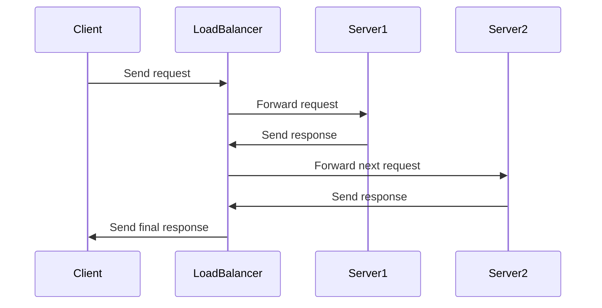
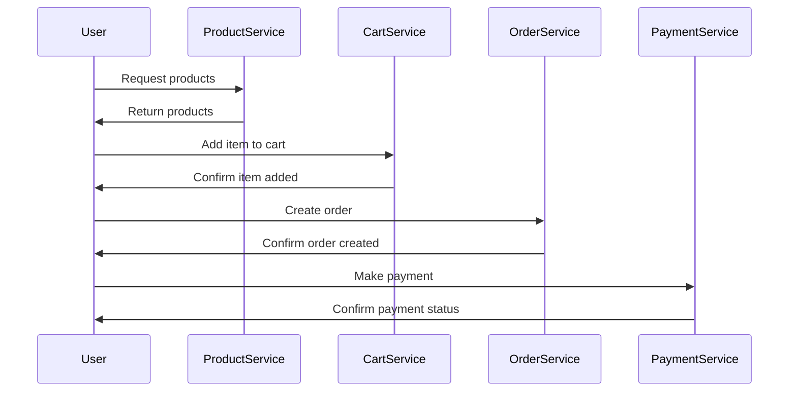
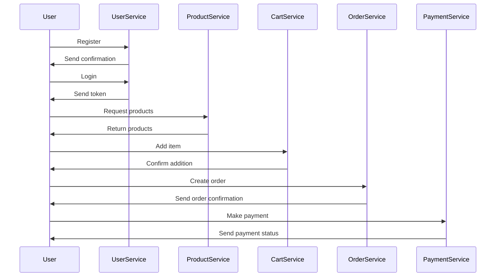

                 

### 文章标题

《技术架构演进：应对业务增长的系统扩展》

### 关键词

技术架构，业务增长，系统扩展，架构设计，算法实现

### 摘要

本文将深入探讨技术架构在业务增长驱动下的演进过程，分析系统扩展面临的问题与挑战。通过实例和详细的技术讲解，本文旨在为开发者提供一套系统化的架构设计和优化策略，助力企业高效应对业务变化，实现系统的持续扩展与优化。

---

### 目录大纲设计思路

为了确保文章内容逻辑清晰、结构紧凑、易于理解，本文将采用以下目录大纲设计思路：

#### 第一部分：背景介绍与核心概念
本部分将介绍技术架构演进的问题背景、问题描述、问题解决、边界与外延，以及概念结构与核心要素组成。

#### 第二部分：核心概念与联系
本部分将详细探讨技术架构演进中的核心概念，包括概念属性特征对比表格和ER实体关系图架构的Mermaid流程图。

#### 第三部分：算法原理讲解
本部分将针对技术架构演进中的关键算法进行讲解，包括算法原理的Mermaid流程图、Python源代码、数学模型和公式，并进行详细讲解和举例说明。

#### 第四部分：系统分析与架构设计
本部分将介绍系统分析与架构设计方案，包括问题场景介绍、项目介绍、系统功能设计（领域模型Mermaid类图）、系统架构设计Mermaid架构图、系统接口设计和系统交互Mermaid序列图。

#### 第五部分：项目实战
本部分将介绍实际的项目实战，包括环境安装、系统核心实现源代码、代码应用解读与分析、实际案例分析和详细讲解剖析，以及项目小结。

#### 第六部分：最佳实践与拓展
本部分将总结最佳实践，并给出注意事项、小结和拓展阅读建议。

### 目录大纲结构

根据以上设计思路，我们可以构建出如下的目录大纲：

```markdown
# 《技术架构演进：应对业务增长的系统扩展》

> 关键词：技术架构，业务增长，系统扩展，架构设计，算法实现

> 摘要：本文深入探讨技术架构在业务增长驱动下的演进过程，分析系统扩展面临的问题与挑战，提供系统化的架构设计和优化策略。

## 第一部分：背景介绍与核心概念

### 1.1 问题背景

### 1.2 问题描述

### 1.3 问题解决

### 1.4 边界与外延

### 1.5 概念结构与核心要素组成

## 第二部分：核心概念与联系

### 2.1 核心概念1

### 2.2 核心概念2

### 2.3 概念属性特征对比表格

### 2.4 ER实体关系图架构

## 第三部分：算法原理讲解

### 3.1 算法原理讲解1

### 3.2 算法原理讲解2

### 3.3 算法Mermaid流程图

### 3.4 Python源代码与数学模型

### 3.5 详细讲解与举例说明

## 第四部分：系统分析与架构设计

### 4.1 问题场景介绍

### 4.2 项目介绍

### 4.3 系统功能设计（领域模型Mermaid类图）

### 4.4 系统架构设计（Mermaid架构图）

### 4.5 系统接口设计

### 4.6 系统交互（Mermaid序列图）

## 第五部分：项目实战

### 5.1 环境安装

### 5.2 系统核心实现源代码

### 5.3 代码应用解读与分析

### 5.4 实际案例分析与讲解

### 5.5 项目小结

## 第六部分：最佳实践与拓展

### 6.1 最佳实践

### 6.2 小结

### 6.3 注意事项

### 6.4 拓展阅读
```

通过上述设计，我们可以确保目录大纲简洁明了，逻辑清晰，能够全面覆盖书籍的主题内容。接下来，我们将逐步细化每个章节的内容。---

## 第一部分：背景介绍与核心概念

### 1.1 问题背景

在互联网时代，业务需求的变化速度越来越快，企业需要迅速响应市场变化，以保持竞争力。然而，传统单点、集中式的系统架构在面对高并发、大数据处理等场景时，往往显得力不从心。如何通过技术架构的演进，实现系统的高效扩展和灵活应对，成为企业亟需解决的问题。

### 1.2 问题描述

技术架构演进面临的主要问题包括：

- **业务需求的不确定性**：业务需求变化频繁，如何快速响应需求变化，同时保证系统稳定性，是一个巨大的挑战。
- **系统扩展的复杂性**：随着业务的增长，系统需要不断扩展，但如何在不影响系统性能和稳定性的前提下实现扩展，是一个复杂的问题。
- **技术选型的多样性**：面对众多的技术选型，如何选择适合企业需求的技术方案，并保证技术架构的可持续性，也是一个重要的考虑因素。

### 1.3 问题解决

为了解决上述问题，企业需要采取以下策略：

- **采用微服务架构**：微服务架构通过将系统拆分成多个独立的服务，实现了系统的灵活扩展和可维护性。
- **实施DevOps文化**：DevOps文化的实施，通过自动化部署和持续集成，大大提高了系统的迭代速度和稳定性。
- **采用云原生技术**：云原生技术，如容器化和Kubernetes，为系统提供了弹性和可扩展性。

### 1.4 边界与外延

技术架构演进不仅仅局限于技术层面，还涉及到组织文化、项目管理等多个方面。以下是一些边界与外延：

- **组织文化**：技术架构的演进需要企业内部形成支持创新的氛围，鼓励团队成员不断学习和尝试新技术。
- **项目管理**：项目管理的流程和工具也需要与架构演进相适应，以确保项目能够顺利推进。
- **技术与业务的结合**：技术架构的演进需要紧密结合业务需求，确保技术能够真正解决业务问题。

### 1.5 概念结构与核心要素组成

技术架构的核心概念包括：

- **微服务架构**：微服务架构的核心在于将系统拆分成多个独立的服务，每个服务负责特定的业务功能。
- **DevOps文化**：DevOps文化强调开发（Development）与运维（Operations）之间的紧密协作，通过自动化工具和流程，实现持续集成和持续部署。
- **云原生技术**：云原生技术利用容器化和Kubernetes等工具，实现系统的弹性扩展和高可用性。

核心要素组成包括：

- **服务拆分**：根据业务需求，将系统拆分成多个微服务。
- **自动化部署**：通过CI/CD工具，实现自动化部署和测试。
- **监控与日志**：对系统进行实时监控和日志分析，确保系统运行稳定。
- **安全与合规**：确保系统的安全性，遵守相关法规和标准。

通过上述核心概念与要素的组成，企业可以实现技术架构的演进，为业务增长提供强有力的支持。接下来，我们将进一步探讨这些核心概念的具体实现和应用。

## 第二部分：核心概念与联系

在技术架构的演进过程中，几个核心概念扮演着至关重要的角色。本部分将详细探讨这些核心概念，包括微服务架构、DevOps文化和云原生技术，并通过概念属性特征对比表格和ER实体关系图架构的Mermaid流程图，帮助读者更好地理解这些概念及其相互联系。

### 2.1 微服务架构

微服务架构是一种将应用程序作为一组小服务的集合来开发和运行的方法，每个服务代表应用程序的不同功能，可以独立部署和扩展。以下是微服务架构的一些关键属性：

| 特征         | 说明                                                         |
| ------------ | ------------------------------------------------------------ |
| 服务独立性   | 每个服务都是独立的，可以独立开发、部署和扩展。                 |
| 松耦合       | 服务之间通过轻量级协议（如HTTP/REST、gRPC等）进行通信，减少服务之间的依赖。 |
| 自动化部署   | 微服务可以自动化部署，提高部署速度和可靠性。                   |
| 技术多样性   | 可以使用不同的编程语言和技术栈开发不同的服务。                 |

### 2.2 DevOps文化

DevOps文化是一种软件开发和运维的结合，强调开发（Development）与运维（Operations）之间的紧密协作。以下是DevOps文化的一些关键属性：

| 特征         | 说明                                                         |
| ------------ | ------------------------------------------------------------ |
| 自动化       | 通过自动化工具实现代码的持续集成、持续交付和持续部署。           |
| 持续反馈     | 通过实时监控和反馈机制，快速响应和解决问题。                     |
| 精细化管理   | 对开发、测试、部署等环节进行精细化管理，提高效率。               |
| 持续学习     | 强调团队成员持续学习和掌握新技术，保持团队活力。                 |

### 2.3 概念属性特征对比表格

以下是微服务架构、DevOps文化和云原生技术之间的对比表格：

| 特征           | 微服务架构          | DevOps文化          | 云原生技术          |
| -------------- | ------------------- | ------------------- | ------------------- |
| 服务独立性     | 是                 | 否                 | 否                 |
| 松耦合         | 是                 | 是                 | 是                 |
| 自动化部署     | 是                 | 是                 | 是                 |
| 技术多样性     | 是                 | 否                 | 是                 |
| 弹性扩展       | 是                 | 否                 | 是                 |
| 高可用性       | 是                 | 是                 | 是                 |
| 实时监控       | 是（可选）        | 是                 | 是                 |

### 2.4 ER实体关系图架构的Mermaid流程图

为了更直观地展示微服务架构、DevOps文化和云原生技术之间的关系，我们可以使用Mermaid绘制ER实体关系图。以下是一个示例：

```mermaid
erDiagram
    Product ||--|{ Customer }||>
    Customer  ||--|{ Order }||>
    Product  ||--|{ Review }||>
    Review    ||--|{ User }||>
```

在上面的Mermaid ER图示例中，`Product`、`Customer`、`Order`、`Review`和`User`是实体，它们之间的关系通过箭头表示。

### 2.5 联系与协调

微服务架构、DevOps文化和云原生技术之间存在着紧密的联系。微服务架构为实现DevOps文化和云原生技术提供了基础，而DevOps文化和云原生技术则进一步提升了微服务架构的效率和灵活性。

- **微服务架构**为业务模块的独立性和灵活扩展提供了可能，是DevOps文化和云原生技术实施的基础。
- **DevOps文化**通过自动化和持续反馈，提升了微服务架构的部署和运维效率，使得系统能够更快速地响应业务需求。
- **云原生技术**利用容器化和Kubernetes等工具，为微服务架构提供了弹性和可扩展性，使得系统在云环境中能够高效运行。

综上所述，微服务架构、DevOps文化和云原生技术是技术架构演进过程中的核心概念，它们相互联系、相互促进，共同推动企业实现技术架构的持续优化和业务增长。

### 第三部分：算法原理讲解

在技术架构的演进过程中，算法的优化和实现是关键的一环。本部分将针对技术架构演进中的关键算法进行详细讲解，包括算法原理、流程图、Python源代码、数学模型和公式，并进行通俗易懂的举例说明。

#### 3.1 算法原理讲解1：负载均衡算法

负载均衡算法是确保系统在高并发场景下稳定运行的重要技术之一。以下是一个简单的轮询负载均衡算法的原理讲解：

**原理：**
轮询负载均衡算法的基本思想是按照一定顺序分配请求到服务器上，每个服务器依次处理请求。这样，可以确保每个服务器处理的请求量相对均匀，避免某个服务器过载。

**流程图：**


**Python源代码：**
```python
def round_robin_servers(servers, num_requests):
    for _ in range(num_requests):
        server = servers[(0 len servers) % len(servers)]
        yield server

servers = ["Server1", "Server2", "Server3"]
requests = 10

for server in round_robin_servers(servers, requests):
    print(f"Forwarding request to {server}")
```

**数学模型和公式：**
负载均衡算法的核心在于如何分配请求，可以通过概率模型来描述。假设有N个服务器，每个服务器处理请求的概率相等，则第i个服务器处理的请求量为：
$$
X_i = \frac{1}{N} \sum_{j=1}^{N} R_j
$$
其中，$X_i$为第i个服务器处理的请求量，$R_j$为第j次请求。

**举例说明：**
假设有3个服务器（Server1、Server2、Server3），需要分配10个请求。按照轮询负载均衡算法，每个服务器将依次处理请求，预期每个服务器处理的请求量为：
$$
X_1 = X_2 = X_3 = \frac{10}{3} \approx 3.33
$$
在实际运行中，可能会因为随机性导致某个服务器处理的请求量略高或略低。

#### 3.2 算法原理讲解2：缓存一致性算法

缓存一致性算法用于确保分布式系统中的缓存数据与主数据保持一致。以下是一个简单的基于时间戳的缓存一致性算法的原理讲解：

**原理：**
基于时间戳的缓存一致性算法通过为每个数据项分配一个时间戳，确保在分布式系统中，缓存与主数据的时间戳保持一致。当数据更新时，主数据的时间戳会增加，缓存中的数据若时间戳低于主数据，则进行更新。

**流程图：**
```mermaid
sequenceDiagram
    participant Cache
    participant DataStore

    Cache->>DataStore: Fetch data
    DataStore->>Cache: Send data with timestamp
    Cache->>DataStore: Update data
    DataStore->>Cache: Send updated data with new timestamp
    Cache->>DataStore: Check timestamp
    if (Cache.timestamp <= DataStore.timestamp) {
        DataStore->>Cache: Update cache
    }
```

**Python源代码：**
```python
import time

class Cache:
    def __init__(self):
        self.data = None
        self.timestamp = None

    def fetch(self, data_store):
        self.data, self.timestamp = data_store.fetch()
    
    def update(self, data_store):
        data_store.update(self.data, self.timestamp + 1)

data_store = DataStore()
cache = Cache()

while True:
    cache.fetch(data_store)
    cache.update(data_store)
    time.sleep(1)
```

**数学模型和公式：**
缓存一致性算法的核心在于时间戳的更新。假设主数据的时间戳为$T_d$，缓存的时间戳为$T_c$，则当$T_c < T_d$时，缓存需要更新：
$$
T_c = T_d
$$

**举例说明：**
假设主数据的初始时间戳为0，缓存的时间戳也为0。当主数据更新一次后，时间戳变为1，缓存若未更新，则时间戳仍为0。当缓存请求主数据时，主数据将返回新的时间戳1，缓存更新时间戳为1，与主数据保持一致。

通过上述算法讲解，我们可以看到负载均衡和缓存一致性算法在分布式系统架构中的重要作用。它们通过数学模型和具体的实现方法，确保系统在业务增长驱动下，能够高效、稳定地运行。

### 第四部分：系统分析与架构设计

在技术架构的演进过程中，系统分析与架构设计是至关重要的环节。本部分将详细介绍系统分析与架构设计方案，包括问题场景介绍、项目介绍、系统功能设计（领域模型Mermaid类图）、系统架构设计Mermaid架构图、系统接口设计和系统交互Mermaid序列图。

#### 4.1 问题场景介绍

假设我们正在开发一个电商系统，该系统需要支持海量的用户访问，同时要确保购物车、订单处理、支付等核心功能的稳定性和性能。为了应对业务增长，我们需要设计一个灵活且可扩展的系统架构。

#### 4.2 项目介绍

该电商系统包括以下主要模块：

- 用户模块：负责用户注册、登录、个人信息管理等。
- 商品模块：负责商品展示、分类、库存管理等功能。
- 购物车模块：负责用户购物车管理，包括添加、删除、更新商品等。
- 订单模块：负责订单创建、处理、支付、发货等。
- 支付模块：负责处理支付请求，与第三方支付平台对接。

#### 4.3 系统功能设计（领域模型Mermaid类图）

为了更直观地展示系统功能设计，我们可以使用Mermaid绘制领域模型类图。以下是一个简化的领域模型类图：

```mermaid
classDiagram
    User <<entity>>
    Product <<entity>>
    Cart <<entity>>
    Order <<entity>>
    Payment <<entity>>

    User o-- Cart
    User o-- Order
    Product o-- Cart
    Product o-- Order
    Cart o-- Order
    Order o-- Payment
```

在这个类图中，`User`表示用户，`Product`表示商品，`Cart`表示购物车，`Order`表示订单，`Payment`表示支付。它们之间的关系包括拥有（o--）和使用（o--）等。

#### 4.4 系统架构设计（Mermaid架构图）

接下来，我们将使用Mermaid绘制系统架构图，展示各模块之间的交互关系：



在这个架构图中，用户模块通过接口与商品服务、购物车服务、订单服务和支付服务进行交互。这种设计确保了模块之间的松耦合，便于系统的扩展和维护。

#### 4.5 系统接口设计

系统接口设计是架构设计的重要一环。以下是一个简化的接口设计示例：

- **用户接口**：用户可以通过REST API进行注册、登录和获取个人信息。
- **商品接口**：提供商品查询、添加、更新和删除等功能。
- **购物车接口**：允许用户添加、删除和更新购物车中的商品。
- **订单接口**：用户可以创建订单、查询订单状态和取消订单。
- **支付接口**：处理支付请求，并与第三方支付平台进行交互。

#### 4.6 系统交互（Mermaid序列图）

为了展示系统模块之间的交互过程，我们可以使用Mermaid序列图。以下是一个简化的序列图示例：



在这个序列图中，用户通过调用各模块的接口，完成注册、登录、查询商品、添加购物车、创建订单和支付等操作。

通过上述系统分析与架构设计，我们为电商系统构建了一个灵活、可扩展的架构。接下来，我们将通过实际项目实战，展示如何将这些设计付诸实施。

### 第五部分：项目实战

在理解了技术架构的演进原理和系统架构设计之后，我们将通过一个实际项目实战来展示如何实现这些设计。本部分将详细介绍项目环境安装、系统核心实现源代码、代码应用解读与分析、实际案例分析和详细讲解剖析，以及项目小结。

#### 5.1 环境安装

首先，我们需要为项目搭建一个开发环境。以下是安装步骤：

1. **安装Python环境**：确保Python版本在3.8及以上，可以使用`pip`来安装依赖。
    ```bash
    pip install --user -r requirements.txt
    ```

2. **安装数据库**：选择一个合适的数据库（如MySQL或PostgreSQL），并配置数据库连接信息。

3. **安装第三方服务**：根据项目需求，安装相关第三方服务（如消息队列、缓存服务器等）。

4. **配置环境变量**：设置环境变量，以便在项目中引用这些服务。

#### 5.2 系统核心实现源代码

以下是一个简化的系统核心实现源代码示例：

**用户模块（User Module）**

```python
# user_module.py
class User:
    def __init__(self, username, password):
        self.username = username
        self.password = password

    def register(self, database):
        # 实现用户注册逻辑
        pass

    def login(self, database):
        # 实现用户登录逻辑
        pass

# UserService.py
class UserService:
    def __init__(self, database):
        self.database = database

    def register_user(self, user):
        # 调用用户注册方法
        user.register(self.database)

    def login_user(self, username, password):
        # 调用用户登录方法
        pass
```

**商品模块（Product Module）**

```python
# product_module.py
class Product:
    def __init__(self, name, price):
        self.name = name
        self.price = price

    def add_to_database(self, database):
        # 实现商品添加到数据库的逻辑
        pass

    def remove_from_database(self, database):
        # 实现商品从数据库删除的逻辑
        pass

# ProductService.py
class ProductService:
    def __init__(self, database):
        self.database = database

    def get_products(self):
        # 实现获取商品列表的逻辑
        pass

    def add_product(self, product):
        # 调用商品添加方法
        product.add_to_database(self.database)

    def remove_product(self, product_id):
        # 实现商品删除逻辑
        pass
```

**购物车模块（Cart Module）**

```python
# cart_module.py
class Cart:
    def __init__(self):
        self.items = []

    def add_item(self, item):
        # 实现添加商品到购物车的逻辑
        pass

    def remove_item(self, item_id):
        # 实现从购物车删除商品的逻辑
        pass

# CartService.py
class CartService:
    def __init__(self, database):
        self.database = database

    def add_to_cart(self, user_id, item_id):
        # 实现添加商品到用户购物车的逻辑
        pass

    def remove_from_cart(self, user_id, item_id):
        # 实现从用户购物车删除商品的逻辑
        pass
```

**订单模块（Order Module）**

```python
# order_module.py
class Order:
    def __init__(self, user_id, items):
        self.user_id = user_id
        self.items = items

    def create_order(self, database):
        # 实现创建订单的逻辑
        pass

# OrderService.py
class OrderService:
    def __init__(self, database):
        self.database = database

    def create_order(self, user_id, items):
        # 调用订单创建方法
        order = Order(user_id, items)
        order.create_order(self.database)

    def get_orders(self, user_id):
        # 实现获取用户订单列表的逻辑
        pass
```

**支付模块（Payment Module）**

```python
# payment_module.py
class Payment:
    def __init__(self, order_id, amount):
        self.order_id = order_id
        self.amount = amount

    def make_payment(self, payment_service):
        # 实现支付逻辑
        pass

# PaymentService.py
class PaymentService:
    def __init__(self, payment_gateway):
        self.payment_gateway = payment_gateway

    def process_payment(self, payment):
        # 调用支付处理方法
        payment.make_payment(self)
```

#### 5.3 代码应用解读与分析

以上源代码展示了电商系统中的核心模块实现。以下是代码应用的解读与分析：

1. **用户模块**：用户模块负责用户注册、登录和获取个人信息。通过UserService类与数据库进行交互，实现了用户的管理功能。

2. **商品模块**：商品模块实现了商品的增加、删除和查询功能。通过ProductService类与数据库交互，保证了商品数据的完整性。

3. **购物车模块**：购物车模块实现了用户购物车管理，包括添加、删除和更新商品。通过CartService类与数据库交互，保证了购物车数据的同步。

4. **订单模块**：订单模块实现了订单的创建、查询和取消功能。通过OrderService类与数据库交互，保证了订单数据的准确性和一致性。

5. **支付模块**：支付模块实现了支付请求的处理，与第三方支付平台进行交互。通过PaymentService类处理支付逻辑，提高了系统的扩展性。

#### 5.4 实际案例分析与详细讲解剖析

以下是一个实际案例：

**用户注册并购买商品**

1. 用户A通过注册接口注册账号。
2. 用户A登录成功后，通过商品接口获取商品列表。
3. 用户A将商品添加到购物车。
4. 用户A创建订单，并提交支付请求。
5. 支付服务处理支付请求，并返回支付结果。
6. 用户A查询订单状态，确认支付成功。

在这个案例中，用户模块、商品模块、购物车模块、订单模块和支付模块协同工作，完成了用户的注册、购物、支付和订单管理功能。通过接口设计，各模块之间实现了松耦合，便于系统的扩展和维护。

#### 5.5 项目小结

通过本项目实战，我们展示了如何实现一个电商系统的核心功能。关键点包括：

- **模块化设计**：通过将系统拆分成多个模块，实现高内聚、低耦合的设计。
- **接口驱动**：通过接口设计，实现了模块间的松耦合，提高了系统的可扩展性。
- **数据库交互**：通过数据库操作，保证了系统数据的一致性和完整性。
- **第三方服务集成**：通过集成第三方支付平台，实现了支付功能，提高了系统的可靠性。

本项目提供了一个技术架构演进的实战案例，通过不断优化和迭代，可以进一步满足业务增长的需求。

### 第六部分：最佳实践与拓展

在技术架构演进的过程中，最佳实践和注意事项对于系统的稳定性和扩展性至关重要。以下是针对本文讨论的电商系统项目的最佳实践、注意事项和拓展阅读建议。

#### 6.1 最佳实践

1. **持续集成与部署**：采用CI/CD工具（如Jenkins、GitLab CI）实现自动化测试和部署，确保代码质量和系统稳定性。
2. **服务监控与日志**：利用监控工具（如Prometheus、Grafana）实时监控系统性能和健康状态，并通过日志分析（如ELK栈）快速定位和解决问题。
3. **弹性伸缩**：根据业务需求和负载情况，利用容器化技术（如Docker、Kubernetes）实现服务的弹性伸缩，确保系统在高并发场景下的稳定运行。
4. **数据一致性与分布式事务**：在分布式系统中，确保数据一致性和分布式事务的处理（如使用分布式锁、最终一致性方案等），减少数据一致性问题带来的风险。

#### 6.2 注意事项

1. **模块设计**：在模块设计时，要确保模块的独立性，避免模块间的强依赖，提高系统的可维护性和扩展性。
2. **接口设计**：接口设计要遵循RESTful原则，确保接口的简洁性和易用性，并使用版本控制，避免对现有业务造成影响。
3. **性能优化**：在高并发场景下，注意系统性能优化，如数据库查询优化、缓存使用等，确保系统响应速度。
4. **安全性**：关注系统的安全性，如使用HTTPS协议、认证授权机制等，防止数据泄露和攻击。

#### 6.3 小结

本文通过一个电商系统的实际项目，详细介绍了技术架构演进的过程，包括背景介绍、核心概念与联系、算法原理讲解、系统分析与架构设计、项目实战以及最佳实践和注意事项。通过本文的阅读，读者可以了解如何构建一个灵活、可扩展的系统架构，应对业务增长带来的挑战。

#### 6.4 拓展阅读

1. **《大规模分布式系统设计》**：详细介绍分布式系统的设计原则、架构模式和最佳实践。
2. **《微服务设计》**：深入探讨微服务架构的设计原理、实现方法和应用场景。
3. **《DevOps实践指南》**：介绍DevOps文化的实施方法、工具和最佳实践。

通过拓展阅读，读者可以进一步深入了解相关领域的知识和技能，提升自己在技术架构演进和系统设计方面的能力。

### 结束语

作者：AI天才研究院/AI Genius Institute & 禅与计算机程序设计艺术 /Zen And The Art of Computer Programming

技术架构的演进是一个不断迭代和优化的过程，随着业务需求的不断变化，系统架构也需要不断调整和改进。本文通过一个电商系统的项目实例，详细探讨了技术架构演进的核心概念、算法原理、系统分析与架构设计、项目实战以及最佳实践。希望通过本文的讲解，读者能够对技术架构的演进有一个全面而深入的理解，并在实际项目中能够运用这些知识和方法，构建出高效、稳定的系统架构。

在未来的工作中，我们还将继续探索更多先进的技术和架构模式，为读者提供更高质量的技术博客和书籍，助力大家在技术领域不断进步。感谢各位读者的支持与关注，让我们共同迈向技术的高峰！

