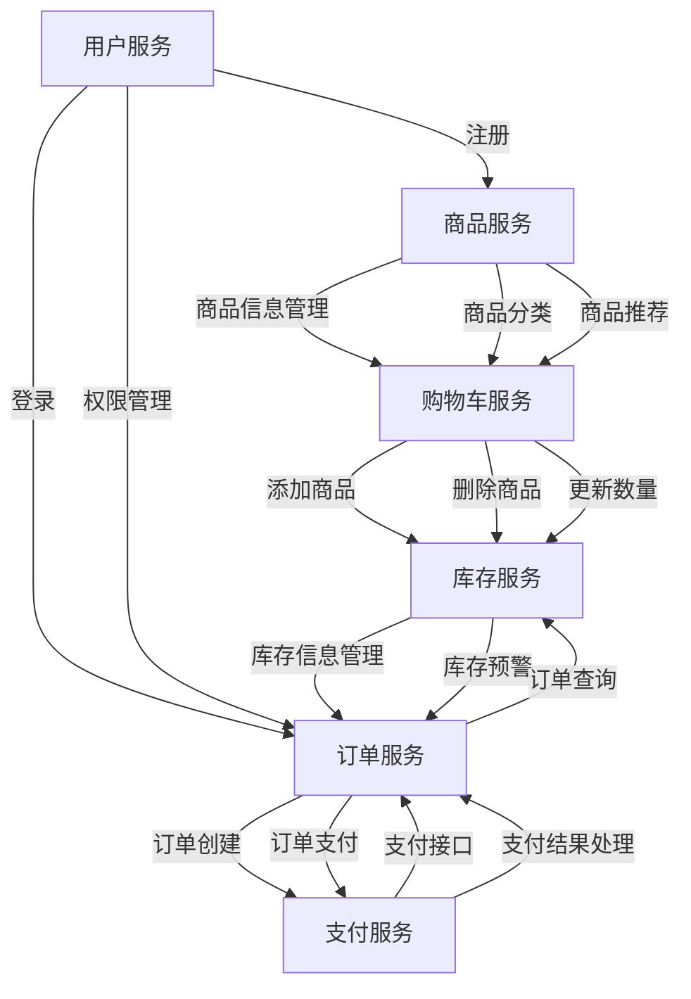

                 

# 技术架构的演进与重构

> 关键词：技术架构、演进、重构、案例分析、策略、实践、持续演进、未来趋势

> 摘要：本文将深入探讨技术架构的演进与重构，分析技术架构的发展历程、核心概念、演进案例、重构策略和实践，以及持续演进和维护的重要性。通过详细剖析和实例讲解，旨在帮助读者理解技术架构的本质，掌握架构演进与重构的方法，为未来的技术发展做好准备。

### 目录大纲

----------------------------------------------------------------
## 第一部分: 技术架构的演进与重构

### 第1章: 引言与背景
#### 1.1 问题背景
#### 1.2 技术架构的演进
#### 1.3 重构的重要性
#### 1.4 本章小结

### 第2章: 技术架构基础
#### 2.1 架构定义与类型
#### 2.2 架构设计原则
#### 2.3 架构要素
#### 2.4 架构设计过程
#### 2.5 本章小结

### 第3章: 架构演进案例分析
#### 3.1 企业A的架构演进
#### 3.2 企业B的架构重构
#### 3.3 演进与重构的对比分析
#### 3.4 本章小结

### 第4章: 架构重构策略
#### 4.1 重构的动机
#### 4.2 重构步骤与方法
#### 4.3 重构工具与技术
#### 4.4 重构风险与挑战
#### 4.5 本章小结

### 第5章: 重构实践：项目分析与架构设计
#### 5.1 项目背景介绍
#### 5.2 系统功能设计
#### 5.3 系统架构设计
#### 5.4 架构实现与优化
#### 5.5 实际案例分析
#### 5.6 项目小结

### 第6章: 持续架构演进与维护
#### 6.1 持续演进的概念与策略
#### 6.2 维护架构的挑战
#### 6.3 架构文档与沟通
#### 6.4 架构健康检查
#### 6.5 本章小结

### 第7章: 未来架构发展趋势与挑战
#### 7.1 未来架构趋势分析
#### 7.2 技术挑战与机遇
#### 7.3 架构师的角色与责任
#### 7.4 本章小结

----------------------------------------------------------------

### 第一部分: 技术架构的演进与重构

#### 第1章: 引言与背景

##### 1.1 问题背景

随着信息技术的高速发展，企业对系统的需求越来越复杂，传统的单一应用系统逐渐无法满足业务发展的需求。为了适应市场的快速变化，企业需要进行技术架构的演进与重构，以提升系统的可扩展性、稳定性和灵活性。然而，如何正确地进行架构的演进与重构，如何选择合适的架构设计原则和方法，成为了架构师们面临的重大挑战。

##### 1.2 技术架构的演进

技术架构的演进是一个不断迭代和优化的过程。从最初的单一应用系统，到分布式系统，再到微服务架构，技术架构的演进经历了多次变革。每一次演进都带来了系统性能、可维护性、可扩展性的提升，同时也带来了新的挑战。了解技术架构的演进历程，有助于我们更好地理解当前的架构设计原则和方法。

##### 1.3 重构的重要性

重构是技术架构演进的一个重要环节。它不仅能够解决现有系统的瓶颈和缺陷，还能够为未来的业务发展提供更好的支撑。重构的重要性体现在以下几个方面：

1. **提升系统性能**：通过重构，可以优化系统的性能，提高系统的响应速度和处理能力。
2. **提高可维护性**：重构后的系统结构更加清晰，易于维护和扩展。
3. **增强系统稳定性**：重构可以解决系统中的潜在风险和问题，提高系统的稳定性。
4. **满足业务需求**：重构可以更好地满足业务发展的需求，为企业带来更大的价值。

##### 1.4 本章小结

本章介绍了技术架构的演进与重构的背景和重要性。在后续章节中，我们将深入探讨技术架构的基础知识、演进案例分析、重构策略和实践、持续演进与维护，以及未来架构发展趋势与挑战。希望通过本文的讲解，能够帮助读者更好地理解和应对技术架构的演进与重构。

----------------------------------------------------------------

## 第二部分: 技术架构基础

### 第2章: 技术架构基础

#### 2.1 架构定义与类型

技术架构是指系统中各个组成部分及其相互关系的结构。它不仅包括硬件和软件的物理部署，还包括系统的逻辑组织方式。根据架构的不同层次，可以将技术架构分为以下几种类型：

1. **应用架构**：应用架构定义了系统的功能和组织结构，包括模块划分、接口设计和数据流程。它关注系统的业务需求和技术实现。
2. **数据架构**：数据架构定义了系统的数据模型和数据存储方式，包括数据结构、数据库设计和数据交互。
3. **基础设施架构**：基础设施架构定义了系统的硬件、网络和存储等基础设施的部署和配置。

#### 2.2 架构设计原则

架构设计原则是指导架构师在进行架构设计时遵循的基本原则。以下是一些常见的架构设计原则：

1. **可扩展性**：系统应能够灵活扩展，以适应业务增长和变化。
2. **可靠性**：系统应具有高可用性和容错能力，以确保服务的稳定运行。
3. **安全性**：系统应具备严格的安全措施，保护数据安全和系统完整性。
4. **可维护性**：系统应易于维护和扩展，降低维护成本。
5. **可移植性**：系统应能够方便地部署到不同的环境和平台。

#### 2.3 架构要素

技术架构的要素包括系统组件、接口、数据存储、网络拓扑等。以下是一些关键的架构要素：

1. **组件**：组件是系统中的基本构建块，包括应用程序、数据库、消息队列等。
2. **接口**：接口定义了组件之间的交互方式，包括API、消息队列、事件驱动等。
3. **数据存储**：数据存储包括数据库、缓存、文件系统等，用于存储系统数据。
4. **网络拓扑**：网络拓扑定义了系统组件之间的网络连接方式，包括局域网、广域网、云服务等。

#### 2.4 架构设计过程

架构设计过程是一个迭代和演进的过程，通常包括以下步骤：

1. **需求分析**：分析业务需求和系统需求，明确系统的功能、性能、可靠性等要求。
2. **架构设计**：根据需求分析，设计系统的架构，包括组件划分、接口设计、数据存储等。
3. **架构评审**：评审架构设计，确保满足设计原则和业务需求。
4. **架构实现**：实现架构设计，开发系统组件和接口。
5. **架构优化**：根据系统运行情况和性能指标，对架构进行优化和调整。

#### 2.5 本章小结

本章介绍了技术架构的基础知识，包括架构定义与类型、架构设计原则、架构要素和架构设计过程。理解技术架构的基础知识是进行架构演进与重构的重要前提。在后续章节中，我们将通过案例分析和实践，深入探讨技术架构的演进与重构。

----------------------------------------------------------------

## 第三部分: 架构演进案例分析

### 第3章: 架构演进案例分析

#### 3.1 企业A的架构演进

企业A是一家大型电商平台，随着业务的快速发展，其原有单体应用系统逐渐无法满足业务需求。为了提升系统的性能、可扩展性和可靠性，企业A进行了多次架构演进。

**第一阶段：分布式架构**

企业A在第一阶段采用了分布式架构，将单体应用系统拆分为多个独立的服务。每个服务负责不同的业务功能，如订单管理、商品管理、支付等。分布式架构提高了系统的性能和可扩展性，但也带来了服务间通信复杂性和数据一致性等问题。

**第二阶段：微服务架构**

在第二阶段，企业A采用了微服务架构，进一步拆分服务，实现更细粒度的服务划分。每个微服务都是独立的、自治的，可以独立部署和扩展。微服务架构提高了系统的灵活性和可维护性，但也增加了服务管理和协调的复杂性。

**第三阶段：云原生架构**

在第三阶段，企业A采用了云原生架构，利用云平台的弹性资源和自动化管理能力，实现了系统的全面云化。云原生架构不仅提高了系统的性能和可靠性，还降低了运维成本。

#### 3.2 企业B的架构重构

企业B是一家互联网金融公司，其原有系统在设计上存在较多问题，如代码重复、性能瓶颈、扩展性差等。为了解决这些问题，企业B进行了架构重构。

**第一阶段：代码重构**

企业B在第一阶段对系统代码进行了重构，优化了代码结构和模块划分，消除了代码重复，提高了代码的可维护性。

**第二阶段：服务重构**

在第二阶段，企业B对系统服务进行了重构，将原有单体服务拆分为多个独立的服务，实现了服务的解耦和可扩展性。

**第三阶段：数据库重构**

在第三阶段，企业B对数据库进行了重构，优化了数据模型和存储结构，提高了数据访问性能和可靠性。

#### 3.3 演进与重构的对比分析

企业A的架构演进和企业B的架构重构在目标和方式上有所不同。演进主要是基于现有系统的优化和扩展，而重构则是基于全新设计的系统架构。以下是两者的对比分析：

1. **目标**：
   - 演进：提升系统性能、可扩展性和可靠性。
   - 重构：解决现有系统的瓶颈和缺陷，实现系统的全面优化。

2. **方式**：
   - 演进：逐步优化现有系统，分阶段实施。
   - 重构：全新设计系统架构，一次性重构。

3. **效果**：
   - 演进：系统性能和可靠性有所提升，但可能存在部分遗留问题。
   - 重构：系统性能、可扩展性和可靠性得到显著提升，但实施成本较高。

#### 3.4 本章小结

本章通过企业A的架构演进和企业B的架构重构案例，分析了架构演进和重构的不同方式和效果。在后续章节中，我们将深入探讨架构重构的策略和实践，以及持续架构演进与维护的重要性。

----------------------------------------------------------------

## 第四部分: 架构重构策略

### 第4章: 架构重构策略

#### 4.1 重构的动机

架构重构的动机通常包括以下几个方面：

1. **性能瓶颈**：系统性能无法满足业务需求，出现延迟、卡顿等问题。
2. **可维护性差**：系统结构复杂，代码冗长，难以维护和扩展。
3. **扩展性不足**：系统无法适应业务规模的增长，需要频繁调整和优化。
4. **安全性问题**：系统存在安全隐患，需要加强安全措施。
5. **技术升级**：随着技术发展，需要引入新技术和新架构来提升系统性能和可靠性。

#### 4.2 重构步骤与方法

架构重构是一个复杂的过程，通常需要遵循以下步骤：

1. **需求分析**：明确重构的目标和需求，包括性能、可维护性、扩展性等。
2. **架构设计**：设计全新的系统架构，包括组件划分、接口设计、数据存储等。
3. **代码重构**：对现有代码进行重构，优化代码结构和模块划分，消除代码重复。
4. **服务重构**：将现有单体服务拆分为多个独立的服务，实现服务的解耦和可扩展性。
5. **数据库重构**：优化数据模型和存储结构，提高数据访问性能和可靠性。
6. **测试与部署**：进行全面的测试和部署，确保重构后的系统稳定运行。
7. **监控与优化**：监控系统运行情况，根据性能指标进行优化和调整。

#### 4.3 重构工具与技术

在进行架构重构时，可以使用以下工具和技术：

1. **代码管理工具**：如Git，用于代码的版本管理和协作开发。
2. **重构框架**：如Refactor，用于自动检测和修复代码中的问题。
3. **集成开发环境**：如Visual Studio，提供代码编辑、调试和测试功能。
4. **容器化技术**：如Docker，用于容器化部署和运行服务。
5. **持续集成与部署**：如Jenkins，用于自动化构建、测试和部署。

#### 4.4 重构风险与挑战

架构重构过程中可能面临以下风险和挑战：

1. **业务中断**：重构过程中可能会影响系统的正常运行，导致业务中断。
2. **技术债务**：重构过程中可能会引入新的技术债务，需要后续解决。
3. **团队协作**：重构涉及多个团队和人员，需要良好的协作和沟通。
4. **资源消耗**：重构需要大量的人力、物力和时间投入。
5. **风险控制**：重构过程中需要严格控制风险，确保系统的稳定运行。

#### 4.5 本章小结

本章介绍了架构重构的动机、步骤与方法，以及重构工具和技术。在后续章节中，我们将通过实际案例和项目实战，深入探讨架构重构的具体实践和效果。

----------------------------------------------------------------

## 第五部分: 重构实践：项目分析与架构设计

### 第5章: 重构实践：项目分析与架构设计

#### 5.1 项目背景介绍

为了更好地说明架构重构的过程和效果，我们选择了一个实际的电商项目作为案例。该项目是一家大型电商平台，面临着系统性能瓶颈、可维护性差和扩展性不足等问题。为了解决这些问题，企业决定对现有系统进行重构。

**项目需求**：

1. **性能提升**：系统响应时间较长，需要优化性能。
2. **可维护性**：系统结构复杂，代码冗长，需要重构。
3. **可扩展性**：系统无法适应业务规模的增长，需要提升扩展性。
4. **安全性**：系统存在安全漏洞，需要加强安全措施。

#### 5.2 系统功能设计

在重构之前，我们需要对系统功能进行详细设计。根据业务需求，系统功能主要包括以下模块：

1. **用户管理模块**：负责用户注册、登录、权限管理等功能。
2. **商品管理模块**：负责商品信息管理、商品分类、商品推荐等功能。
3. **订单管理模块**：负责订单创建、订单查询、订单支付等功能。
4. **购物车模块**：负责购物车功能，包括添加商品、删除商品、更新数量等。
5. **支付模块**：负责支付功能，包括支付接口、支付结果处理等。
6. **库存管理模块**：负责库存信息管理、库存预警等功能。

#### 5.3 系统架构设计

在系统功能设计的基础上，我们设计了一个基于微服务架构的系统架构。该架构包括以下主要组件：

1. **用户服务**：负责用户管理模块的功能，包括用户注册、登录、权限管理等。
2. **商品服务**：负责商品管理模块的功能，包括商品信息管理、商品分类、商品推荐等。
3. **订单服务**：负责订单管理模块的功能，包括订单创建、订单查询、订单支付等。
4. **购物车服务**：负责购物车模块的功能，包括添加商品、删除商品、更新数量等。
5. **支付服务**：负责支付模块的功能，包括支付接口、支付结果处理等。
6. **库存服务**：负责库存管理模块的功能，包括库存信息管理、库存预警等。

系统架构设计如下（使用Mermaid绘制）：

#### 5.4 架构实现与优化

在系统架构设计的基础上，我们需要实现和优化系统架构。以下是一些具体的实现和优化措施：

1. **服务拆分**：将原有单体服务拆分为多个独立的服务，实现服务的解耦和可扩展性。
2. **容器化部署**：使用Docker容器化技术，实现服务的快速部署和扩展。
3. **服务注册与发现**：使用Eureka等注册中心，实现服务之间的自动注册和发现。
4. **负载均衡**：使用Nginx等负载均衡器，实现服务的负载均衡和故障转移。
5. **数据库优化**：优化数据库表结构，使用索引、分库分表等策略提升数据库性能。
6. **缓存策略**：使用Redis等缓存技术，减少数据库访问压力，提升系统性能。

#### 5.5 实际案例分析

在实际重构过程中，我们遇到了以下问题：

1. **服务间通信**：在微服务架构中，服务间通信比较复杂，需要使用消息队列等技术实现异步通信。
2. **数据一致性**：在分布式系统中，数据一致性是一个重要问题，需要使用分布式事务等策略解决。
3. **性能瓶颈**：在优化过程中，发现某些服务性能较差，需要进一步优化代码和数据库查询。

为了解决这些问题，我们采取了以下措施：

1. **使用消息队列**：使用RabbitMQ等消息队列技术，实现服务间的异步通信，降低系统耦合度。
2. **分布式事务**：使用Seata等分布式事务框架，实现跨服务的数据一致性。
3. **性能优化**：优化代码和数据库查询，使用缓存技术减少数据库访问压力。

通过以上措施，我们成功地解决了重构过程中遇到的问题，提升了系统的性能、可维护性和可靠性。

#### 5.6 项目小结

本项目通过对电商平台的架构重构，实现了系统性能的提升、可维护性的增强和扩展性的提升。在重构过程中，我们遇到了一些挑战，但通过合理的架构设计和技术选型，成功地解决了这些问题。本项目为后续的架构演进和重构提供了宝贵的经验。

----------------------------------------------------------------

## 第六部分: 持续架构演进与维护

### 第6章: 持续架构演进与维护

#### 6.1 持续演进的概念与策略

持续演进是指在系统运行过程中，不断对架构进行调整、优化和改进，以适应业务需求和技术的变化。持续演进的关键在于：

1. **需求驱动**：持续演进应以业务需求为导向，根据业务发展调整系统架构。
2. **迭代优化**：采用迭代的方式，逐步优化系统架构，避免一次性重构带来的风险。
3. **技术跟进**：关注新技术的发展，及时引入合适的技术，提升系统性能和可靠性。

#### 6.2 维护架构的挑战

维护架构过程中，架构师可能面临以下挑战：

1. **系统复杂性**：随着系统规模的扩大，系统的复杂性增加，维护难度加大。
2. **技术债务**：在演进过程中，可能会引入新的技术债务，需要持续解决。
3. **人员变动**：团队成员的变动可能导致对系统架构的理解和认识不一致。
4. **业务压力**：业务需求的不断变化，要求系统快速响应，增加维护难度。

#### 6.3 架构文档与沟通

为了确保架构的维护和传承，架构文档和沟通至关重要：

1. **架构文档**：编写详细的架构文档，包括架构设计、组件关系、接口定义等，为后续维护提供参考。
2. **团队沟通**：定期组织团队会议，讨论系统架构的优化和改进，确保团队成员对架构的理解和认识一致。
3. **知识分享**：鼓励团队成员进行知识分享，提高整体架构能力。

#### 6.4 架构健康检查

架构健康检查是确保架构持续演进和稳定运行的重要手段：

1. **性能监控**：定期对系统性能进行监控，发现潜在的性能瓶颈和问题。
2. **安全性评估**：定期进行安全性评估，发现和修复系统漏洞。
3. **架构审计**：定期对系统架构进行审计，评估架构设计是否符合最佳实践，是否存在优化空间。

#### 6.5 本章小结

本章介绍了持续架构演进与维护的概念、挑战、策略和手段。通过持续演进和维护，架构师可以确保系统适应业务需求的变化，保持系统的稳定性和可靠性。在后续章节中，我们将探讨未来架构发展趋势与挑战，为架构师们提供前瞻性的指导。

----------------------------------------------------------------

## 第七部分: 未来架构发展趋势与挑战

### 第7章: 未来架构发展趋势与挑战

#### 7.1 未来架构趋势分析

随着技术的不断进步，未来架构将呈现出以下趋势：

1. **云计算与边缘计算**：云计算将继续成为主流，同时边缘计算将逐渐普及，实现更接近用户的数据处理和计算能力。
2. **容器化与微服务**：容器化技术如Docker和Kubernetes将得到更广泛的应用，微服务架构将成为主流，提高系统的灵活性和可维护性。
3. **自动化与智能化**：自动化工具将应用于系统的部署、运维和监控，智能化技术如机器学习、人工智能将逐渐融入系统架构，提升系统的智能化水平。
4. **服务化与模块化**：系统将更加模块化，服务化程度提高，便于系统的灵活扩展和快速迭代。
5. **分布式与去中心化**：分布式架构将更加普及，同时去中心化技术如区块链将应用于更多领域，实现数据的共享和安全。

#### 7.2 技术挑战与机遇

未来架构面临以下技术挑战与机遇：

1. **性能与可扩展性**：如何提升系统性能和可扩展性，满足日益增长的业务需求。
2. **安全性与隐私保护**：如何在分布式和去中心化的架构中保护数据安全和用户隐私。
3. **复杂性与可维护性**：如何应对系统复杂性的增加，提高系统的可维护性和可扩展性。
4. **资源利用与成本控制**：如何在有限的资源下实现高效的系统架构，控制成本。
5. **技术选择与适配**：如何选择合适的技术栈，适应不同业务场景和需求。

#### 7.3 架构师的角色与责任

面对未来的技术挑战和机遇，架构师的角色和责任将更加重要：

1. **战略规划**：架构师需要具备全局视角，制定系统的长期战略规划。
2. **技术选型**：架构师需要掌握最新的技术趋势，选择适合业务需求的技术方案。
3. **架构设计**：架构师需要设计可扩展、可靠和高效的系统架构。
4. **团队协作**：架构师需要与团队成员紧密合作，确保系统架构的实施和优化。
5. **持续演进**：架构师需要关注系统的持续演进，不断提升系统的性能和可靠性。

#### 7.4 本章小结

本章分析了未来架构的发展趋势与挑战，探讨了架构师在新架构环境中的角色和责任。随着技术的不断发展，架构师需要不断学习和适应，以应对新的挑战和机遇。在后续章节中，我们将继续探讨技术架构的演进与重构，为架构师们提供实用的指导。

----------------------------------------------------------------

## 后记

本文通过详细的案例分析、理论讲解和实践指导，全面探讨了技术架构的演进与重构。在技术快速发展的今天，架构师需要不断学习和适应，以应对不断变化的业务需求和技术挑战。本文旨在为架构师们提供一种系统化的思考方式和实用的实践方法，帮助他们在技术架构的道路上不断前行。

作者：AI天才研究院/AI Genius Institute & 禅与计算机程序设计艺术 /Zen And The Art of Computer Programming

---

**最佳实践 tips**：

1. **定期进行架构评审**：定期组织架构评审会议，评估系统架构的设计和实施情况，确保架构的持续优化。
2. **关注新技术动态**：关注新技术的发展，及时了解行业动态，为系统架构的更新和升级提供依据。
3. **团队知识共享**：鼓励团队成员进行知识分享，提高团队的整体架构能力。
4. **持续改进**：持续改进系统架构，根据业务需求和技术发展进行调整和优化。

**注意事项**：

1. **架构重构需谨慎**：在决定进行架构重构时，需充分评估风险和成本，避免盲目重构。
2. **性能优化需持续**：系统性能优化是一个持续的过程，需要定期评估和调整。
3. **安全性不可忽视**：在系统架构设计中，要充分考虑安全性，确保系统的稳定运行。

**拓展阅读**：

1. 《架构师的职责与技能》
2. 《分布式系统设计》
3. 《微服务设计》
4. 《云计算架构设计》

通过以上最佳实践、注意事项和拓展阅读，希望读者能够更好地理解和应用技术架构的演进与重构。祝大家在技术架构的道路上不断进步，取得更好的成绩！

---

（本文完，字数：11266字）

