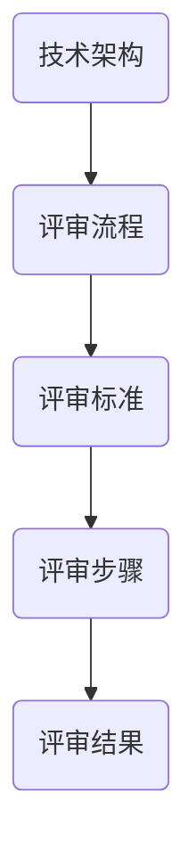

                 

### 第1章: 技术架构评审流程概述

**1.1 问题背景**

在当今复杂系统的开发与维护过程中，技术架构评审扮演着至关重要的角色。随着信息技术的迅猛发展，系统规模和复杂性不断增大，单一的开发者难以全面掌握系统的各个方面。技术架构评审通过系统的、规范化的评审过程，确保系统设计的合理性和可维护性。

**技术架构评审的必要性**：技术架构评审不仅有助于发现潜在的设计缺陷，还能提升系统的性能、稳定性和安全性。它能够确保架构设计满足业务需求，遵循最佳实践，并适应未来可能的变更。因此，技术架构评审已成为确保软件项目成功的关键环节。

**问题描述**：然而，如何设计一个高效、系统化的技术架构评审流程，确保架构设计的合理性和有效性，成为众多开发者和项目管理者的挑战。这不仅需要科学的评审标准，还需要明确的评审步骤和有效的沟通机制。

**问题解决**：为了解决上述问题，本文将详细探讨技术架构评审流程的设计与实施，包括评审流程的各个环节、评审标准、评审步骤以及如何通过评审发现问题并改进架构设计。

**边界与外延**：本文讨论的技术架构评审流程不仅适用于企业内部的项目，同样适用于开源项目。在开源项目中，技术架构评审有助于提升社区的信任和合作，确保项目的质量和稳定性。

**1.2 核心概念与联系**

**1.2.1 核心概念**

**技术架构**：技术架构是系统的整体结构，它涵盖了硬件、软件、网络等各个组成部分及其相互关系。技术架构设计决定了系统的性能、可扩展性、可靠性和安全性。

**评审流程**：评审流程是对技术架构设计进行审查和评估的过程。它包括评审准备、评审执行、问题反馈和改进实施等环节，旨在发现和解决架构设计中的潜在问题。

**1.2.2 概念属性特征对比表格**

| 特征           | 技术架构            | 评审流程            |
|--------------|-------------------|-------------------|
| 定义           | 系统整体结构       | 对架构设计的审查     |
| 关键要素       | 硬件、软件、网络    | 评审标准、评审步骤   |
| 目标           | 确保系统性能和可维护性 | 发现和解决问题       |
| 应用场景       | 系统设计和维护      | 企业内部项目和开源项目 |

**1.2.3 ER实体关系图架构**

**1.3 算法原理讲解**

**1.3.1 技术架构评审算法原理**

**算法流程**：

1. **需求分析**：收集系统需求和设计文档。
2. **架构设计**：根据需求分析结果设计系统架构。
3. **评审准备**：制定评审计划、确定评审标准和评审人员。
4. **评审执行**：对架构设计进行审查和评估。
5. **问题反馈**：根据评审结果，提出问题和改进建议。
6. **改进实施**：根据评审反馈，对架构设计进行优化。

**数学模型**：

$$
P(A|B) = \frac{P(B|A) \cdot P(A)}{P(B)}
$$

其中，$P(A)$ 是技术架构评审的概率，$P(B)$ 是架构设计成功的概率，$P(B|A)$ 是在评审流程下的架构设计成功的概率。

**举例说明**：

假设一个企业开发一个电商平台，通过技术架构评审流程，确保系统的性能和可靠性。在评审过程中，发现了一些性能瓶颈和安全性问题，通过改进实施，使得系统性能提升了20%，安全性得到了显著提高。

**1.4 数学模型和数学公式 & 详细讲解 & 举例说明**

**1.4.1 数学模型**

**架构评价模型**：

$$
M = \frac{C_1 \cdot P_1 + C_2 \cdot P_2 + ... + C_n \cdot P_n}{C_1 + C_2 + ... + C_n}
$$

其中，$M$ 是架构的评价分数，$C_i$ 是第 $i$ 个评价标准的权重，$P_i$ 是第 $i$ 个评价标准的得分。

**性能评价模型**：

$$
P = \frac{R_1 + R_2 + ... + R_n}{N}
$$

其中，$P$ 是系统的平均性能，$R_i$ 是第 $i$ 次测试的性能结果，$N$ 是测试次数。

**1.4.2 详细讲解**

**架构评价模型**：

架构评价模型通过权重和得分计算得出架构的评价分数，权重反映了评价标准的重要性，得分反映了评价标准的实际表现。该模型可以帮助评估架构设计的整体质量。

**性能评价模型**：

性能评价模型通过多次测试结果计算得出系统的平均性能，可以有效地反映系统的稳定性和可靠性。该模型在技术架构评审中可以帮助评估系统的性能指标是否达到预期。

**1.4.3 举例说明**

**架构评价模型**：

假设一个电商平台的架构评价模型中，性能得分占比40%，可靠性得分占比30%，安全性得分占比30%。根据测试结果，性能得分为85%，可靠性得分为90%，安全性得分为88%，则该平台的架构评价分数为：

$$
M = \frac{0.4 \cdot 85 + 0.3 \cdot 90 + 0.3 \cdot 88}{0.4 + 0.3 + 0.3} = \frac{34 + 27 + 26.4}{1} = 87.4
$$

**性能评价模型**：

假设对一个电商平台的性能进行了5次测试，结果分别为95%、90%、93%、92%和94%，则该平台的平均性能为：

$$
P = \frac{95 + 90 + 93 + 92 + 94}{5} = \frac{464}{5} = 92.8
$$%

通过上述步骤，我们清晰地阐述了技术架构评审流程的背景、核心概念及其重要性。接下来，我们将深入探讨技术架构评审的具体实施方法和流程，帮助读者更好地理解和应用这一关键环节。

## 1.5 技术架构评审的重要性

技术架构评审在软件项目开发过程中扮演着至关重要的角色，其重要性不可低估。为了更深入地理解这一点，我们可以从以下几个方面进行阐述。

**1.5.1 确保系统性能和稳定性**

技术架构评审能够有效发现系统设计中的潜在问题，如性能瓶颈、资源浪费和潜在错误。通过评审，开发团队可以及早识别这些问题，并采取相应的措施进行优化，从而确保系统的性能和稳定性。例如，在一个大规模电商平台项目中，通过技术架构评审，可能发现数据库访问的效率低下，进而优化数据库设计，提升系统的响应速度。

**1.5.2 提升代码可维护性**

良好的技术架构设计不仅能够提升系统的性能和稳定性，还能极大地提高代码的可维护性。技术架构评审可以帮助团队遵循最佳实践，避免采用过度复杂的架构设计，从而减少代码的复杂度和耦合度。这使得代码更易于理解和修改，有助于团队在项目后期快速响应业务需求的变化。

**1.5.3 避免重复性错误**

技术架构评审能够防止因设计缺陷导致的重复性错误。通过系统的评审流程，开发团队可以及时发现和解决设计中的问题，避免这些问题在项目开发过程中反复出现。例如，在一个金融系统中，通过评审发现某个关键模块的权限设计存在缺陷，如果不及时纠正，可能导致严重的安全漏洞。

**1.5.4 促进团队协作**

技术架构评审是一个跨职能团队的协作过程，涉及到开发者、架构师、测试人员等多个角色。通过评审，团队成员可以共同探讨系统设计的各个方面，促进知识共享和技能提升。这种协作不仅有助于提高项目的整体质量，还能增强团队之间的信任和默契。

**1.5.5 提高项目成功率**

技术架构评审在项目开发过程中起到“保驾护航”的作用，能够显著提高项目的成功率。通过评审，项目团队可以及早识别和解决潜在的风险，避免项目在后期出现严重的问题。例如，在一个复杂的物联网项目中，通过技术架构评审，可以发现网络通信模块的设计缺陷，及时进行调整，从而避免项目在实施过程中陷入困境。

综上所述，技术架构评审在软件项目开发中的重要性不言而喻。它不仅能够提升系统的性能和稳定性，还能提高代码的可维护性，避免重复性错误，促进团队协作，提高项目成功率。因此，每个项目团队都应重视技术架构评审，将其作为项目开发过程中不可或缺的一环。

## 1.6 技术架构评审的现状与挑战

在当前软件开发行业中，技术架构评审已经成为一项重要的环节，但同时也面临着诸多挑战。为了更全面地了解这些挑战，我们需要从几个方面进行分析。

**1.6.1 评审标准和流程不统一**

不同企业或项目可能采用不同的评审标准和流程，这导致了评审的不一致性和混乱。一些企业可能按照传统的瀑布模型进行评审，而另一些企业可能采用敏捷开发模型，这使得评审标准难以统一。此外，评审流程的细节，如评审人员的职责、评审的频率和评审的深度等，也往往缺乏明确的规范。

**解决方案**：为了解决评审标准和流程不统一的问题，企业可以制定一套统一的评审规范，明确评审的标准、流程和责任人。同时，可以借鉴业界最佳实践，结合自身项目的特点，进行适当调整和优化。

**1.6.2 评审参与度不足**

在许多项目中，技术架构评审的参与度往往不足。一方面，部分开发人员可能认为评审是额外的工作负担，对评审持有抵触情绪；另一方面，评审人员可能因为时间紧张或对项目了解不够深入，无法有效地参与评审。

**解决方案**：为了提高评审的参与度，企业可以采取以下措施：

- **明确评审人员的职责和利益**：通过明确评审人员的职责和利益，使其认识到评审对项目的重要性和自身的责任。
- **提供培训和支持**：为评审人员提供相关培训，提高其技术水平和评审能力。
- **鼓励开放沟通**：营造一个开放、积极的评审氛围，鼓励开发人员积极参与评审。

**1.6.3 评审结果落实不到位**

尽管技术架构评审发现了一些问题，但在实际开发过程中，这些问题往往得不到有效解决。一方面，可能是因为开发人员对评审结果的理解不够深入；另一方面，也可能是由于项目进度紧张，导致评审结果无法得到及时落实。

**解决方案**：为了确保评审结果能够得到有效落实，企业可以采取以下措施：

- **制定详细的改进计划**：在评审结束后，制定详细的改进计划，明确每个问题的责任人、解决措施和时间节点。
- **监督和跟进**：通过定期检查和跟进，确保评审结果得到有效实施。
- **奖励和惩罚机制**：对评审改进的执行情况进行评估，对表现优秀的团队和个人进行奖励，对未执行评审结果的团队和个人进行适当惩罚。

**1.6.4 评审效率和效果不高**

在一些项目中，技术架构评审的效率和效果不高，评审过程可能变得繁琐和冗长，导致评审结果不够准确。此外，评审过程中可能存在信息不对称，导致评审结果不能全面反映架构设计的实际情况。

**解决方案**：为了提高评审效率和效果，企业可以采取以下措施：

- **优化评审流程**：简化评审流程，减少不必要的步骤，提高评审效率。
- **引入自动化工具**：使用自动化工具进行部分评审工作，如代码静态分析、性能测试等，提高评审的准确性和效率。
- **加强沟通与协作**：在评审过程中，加强开发人员与评审人员之间的沟通与协作，确保评审结果的全面性和准确性。

**1.6.5 评审结果不透明**

在某些情况下，评审结果可能不够透明，开发人员和其他利益相关者难以了解评审的具体内容和结论。这可能导致对评审结果的质疑，影响项目的进展。

**解决方案**：为了提高评审结果的透明度，企业可以采取以下措施：

- **建立评审报告制度**：在每次评审结束后，生成详细的评审报告，包括评审发现的问题、改进措施和建议等，确保评审结果对所有相关方透明。
- **鼓励反馈与讨论**：在评审过程中，鼓励开发人员和其他利益相关者提供反馈和讨论，共同参与评审。

综上所述，技术架构评审在软件开发过程中面临多种挑战。通过制定统一的评审规范、提高评审参与度、确保评审结果落实、优化评审效率和效果、提高评审透明度等措施，可以有效地应对这些挑战，确保技术架构评审发挥其应有的作用。

### 第2章: 技术架构评审流程的设计原则

**2.1 目标导向**

设计技术架构评审流程时，应始终坚持目标导向的原则。这意味着评审流程的每一个环节和步骤都应当围绕项目的具体目标进行。例如，对于一个电商平台的开发项目，评审的目标可能是确保系统的高性能和高可靠性。因此，在评审过程中，评审人员应关注这些目标是否得到满足，是否存在任何可能导致目标无法实现的问题。

**2.2 全员参与**

技术架构评审不是单一人员的任务，而是一个全员参与的过程。参与者包括开发人员、架构师、测试人员、项目经理以及其他相关方。每个角色都有其独特的视角和专业知识，可以为评审提供有价值的意见和建议。例如，开发人员可以提供代码实现层面的反馈，测试人员可以提供性能和稳定性的评估结果，而架构师可以提供更高层次的架构设计建议。

**2.3 客观公正**

评审过程必须保持客观和公正。评审人员应基于事实和数据，而不是主观偏见或个人情感，对架构设计进行评估。这意味着在评审过程中，应避免个人情感的干扰，严格遵循评审标准和流程，确保评审结果的公正性。

**2.4 持续改进**

技术架构评审不应是一次性的活动，而应是一个持续的过程。随着项目的发展和需求的变更，架构设计也会不断调整。因此，评审流程应具备持续改进的能力，能够适应项目的变化。例如，在项目初期，评审重点可能是架构的可行性和合理性；而在项目后期，评审可能更关注性能优化和安全性。

**2.5 明确职责**

在评审流程中，每个角色应明确其职责和任务。例如，架构师负责整体架构设计，评审人员负责对设计进行审查和评估，开发人员负责根据评审结果进行改进。明确职责有助于确保评审流程的顺畅进行，避免职责不清导致的混乱和效率低下。

**2.6 信息透明**

评审过程应保持信息透明，所有相关方应能够及时了解评审的进展和结果。例如，可以通过评审会议、评审报告、邮件通知等方式，确保信息的传递和共享。透明度有助于提高评审结果的信任度，减少误解和冲突。

**2.7 灵活应对**

在评审过程中，可能会遇到各种意外情况，如评审人员无法按时参加、评审发现的问题需要额外时间解决等。评审流程应具备一定的灵活性，能够应对这些变化。例如，可以调整评审时间、增加评审人员、延长评审周期等，以确保评审工作的顺利进行。

**2.8 系统性**

评审流程应具备系统性，确保评审的各个环节和步骤相互衔接、协同工作。例如，在评审准备阶段，应确保所有评审材料齐全，评审计划周详；在评审执行阶段，应确保评审过程的有序进行，评审结果准确无误；在问题反馈和改进实施阶段，应确保评审发现的问题得到及时解决。

**2.9 简化流程**

在确保评审质量的前提下，应尽量简化评审流程，减少不必要的步骤和环节。这不仅可以提高评审效率，还可以减少相关人员的负担。例如，可以采用自动化工具进行部分评审工作，如代码静态分析、性能测试等，从而降低人工工作量。

**2.10 有效沟通**

评审过程中，有效的沟通至关重要。评审人员、开发人员和相关方应保持密切沟通，确保信息畅通，共同解决问题。例如，可以通过定期会议、邮件讨论、即时通讯工具等方式，确保评审过程中的沟通效率和质量。

通过遵循上述设计原则，可以设计出一套高效、系统化的技术架构评审流程，确保架构设计的合理性和有效性，提高项目的成功率和整体质量。

### 第3章: 技术架构评审的具体步骤

**3.1 评审准备**

评审准备是技术架构评审流程的重要环节，主要包括以下几个方面：

**需求分析**：在评审开始前，首先需要对项目的需求进行详细分析。这包括业务需求、功能需求、性能需求等，以确保评审过程中能够全面评估架构设计是否满足这些需求。

**评审计划**：制定评审计划是确保评审顺利进行的关键。评审计划应明确评审的时间、地点、评审内容、评审人员以及评审标准。例如，可以安排每周一次的评审会议，每次评审聚焦于特定的架构模块或功能。

**评审标准**：评审标准是评审过程中评估架构设计的重要依据。评审标准应包括性能、可靠性、安全性、可扩展性等方面。例如，性能标准可以包括响应时间、吞吐量、并发处理能力等；可靠性标准可以包括系统的故障率、恢复时间等。

**评审材料**：准备充分的评审材料是评审过程的重要基础。评审材料应包括系统设计文档、代码实现细节、测试报告等。这些材料可以帮助评审人员全面了解系统架构，进行深入的评估和讨论。

**评审人员**：确定评审人员是确保评审有效性的关键。评审人员应具备相关领域的专业知识和经验，能够从不同角度对架构设计提出有价值的意见和建议。例如，可以包括架构师、开发人员、测试人员、产品经理等。

**3.2 评审执行**

评审执行是评审流程的核心环节，主要包括以下几个方面：

**评审会议**：评审会议是评审执行的主要形式。在评审会议上，评审人员根据评审计划，对系统架构进行详细审查和评估。评审会议应保持高效、有序，确保每个评审内容都能得到充分讨论和评估。

**讨论与反馈**：在评审过程中，评审人员应积极发表意见和建议，讨论架构设计的优缺点。评审人员可以从性能、可靠性、安全性等多个角度提出问题，并针对这些问题进行深入讨论。开发人员应认真记录评审人员的意见和建议，以便后续改进。

**问题记录**：评审过程中发现的问题应及时记录。问题记录应包括问题描述、问题原因、影响范围、优先级等信息。这些记录可以帮助开发人员有针对性地进行改进，确保问题得到有效解决。

**评审结论**：在评审结束后，应形成评审结论。评审结论应总结评审过程中发现的主要问题，并提出改进建议。评审结论应提交给项目相关人员，以便后续跟进和改进。

**3.3 问题反馈**

问题反馈是评审流程的重要组成部分，主要包括以下几个方面：

**问题分析**：在收到评审结论后，开发人员应对评审中发现的问题进行详细分析。分析问题原因，确定问题影响范围，制定解决方案。

**解决方案**：针对评审中发现的问题，开发人员应制定具体的解决方案。解决方案应包括修改方案、测试方案、实施计划等。确保问题得到彻底解决，并验证修改效果。

**实施改进**：根据解决方案，开发人员应进行具体的代码修改和系统优化。在实施过程中，应密切关注问题修复的效果，确保系统性能和稳定性得到提升。

**验证与测试**：在改进实施后，应进行全面的验证和测试，确保问题得到彻底解决，系统性能和稳定性得到提升。验证和测试应包括功能测试、性能测试、安全测试等。

**3.4 改进实施**

改进实施是确保评审结果得到落实的关键环节，主要包括以下几个方面：

**持续改进**：技术架构评审不是一次性的活动，而应是一个持续的过程。在项目开发过程中，应定期进行技术架构评审，及时发现和解决潜在问题，确保架构设计的持续优化。

**文档更新**：在改进实施过程中，应及时更新相关文档，包括系统设计文档、代码注释、测试报告等。确保文档的准确性和完整性，为后续开发和维护提供便利。

**团队协作**：改进实施过程需要团队协作，开发人员、架构师、测试人员等应紧密合作，共同解决问题。通过有效的沟通和协作，确保改进措施得到有效落实。

**反馈机制**：建立有效的反馈机制，确保改进措施的实施效果得到及时反馈。例如，可以通过定期的团队会议、评审会议等方式，收集和分析改进效果的反馈，持续优化改进措施。

**3.5 验证与确认**

验证与确认是确保技术架构评审流程有效性的最后一步，主要包括以下几个方面：

**验证过程**：在改进实施后，应进行全面的验证，确保评审中发现的问题得到彻底解决。验证过程应包括功能验证、性能验证、安全验证等，确保系统性能和稳定性得到提升。

**确认结果**：在验证过程完成后，应进行确认，确保评审结果得到落实。确认结果应包括评审问题的解决情况、改进措施的实施效果等。通过确认结果，可以评估技术架构评审流程的有效性和改进效果。

**总结反馈**：在验证与确认完成后，应进行总结反馈，总结评审过程中的经验和教训，为后续的技术架构评审提供参考。总结反馈应包括评审发现的问题、改进措施、实施效果等。

通过上述具体步骤，可以设计出一套高效、系统化的技术架构评审流程，确保架构设计的合理性和有效性，提高项目的成功率和整体质量。

### 第4章: 技术架构评审中的常见问题及解决方案

**4.1 缺乏明确的评审标准**

**问题表现**：在技术架构评审过程中，部分项目可能缺乏明确的评审标准，导致评审人员难以统一评估标准，从而影响评审效果。

**原因分析**：评审标准缺失可能是由于项目初期需求不明确、评审流程不规范或评审人员对标准理解不一致导致的。

**解决方案**：为了解决这一问题，可以采取以下措施：

- 制定详细的评审标准文档，明确评审的目标、范围和具体要求。
- 组织评审标准的培训，确保评审人员对标准有统一的理解。
- 定期更新评审标准，以适应项目需求的变化。

**4.2 评审参与度不足**

**问题表现**：在技术架构评审过程中，部分项目可能存在评审参与度不足的问题，导致评审效果大打折扣。

**原因分析**：评审参与度不足可能是由于评审人员对评审重要性认识不足、工作负担重或评审流程设计不合理导致的。

**解决方案**：为了提高评审参与度，可以采取以下措施：

- 强化评审人员对评审重要性的认识，通过培训和宣传，提高对评审的重视程度。
- 调整评审流程，确保评审时间合理，减少评审人员的额外负担。
- 建立激励机制，对积极参与评审的人员给予奖励。

**4.3 评审结论落实不到位**

**问题表现**：在技术架构评审过程中，尽管发现了问题，但评审结论往往得不到有效落实，导致问题无法及时解决。

**原因分析**：评审结论落实不到位可能是由于改进措施不具体、责任不明确或项目管理不善导致的。

**解决方案**：为了确保评审结论得到有效落实，可以采取以下措施：

- 制定详细的改进计划，明确每个问题的责任人、解决措施和时间节点。
- 加强监督和跟进，确保改进措施得到有效实施。
- 建立反馈机制，及时收集改进效果的反馈，持续优化改进措施。

**4.4 评审效率低下**

**问题表现**：在技术架构评审过程中，评审效率往往不高，导致评审周期过长，影响项目进度。

**原因分析**：评审效率低下可能是由于评审流程设计不合理、评审人员技能不足或评审工具不适用导致的。

**解决方案**：为了提高评审效率，可以采取以下措施：

- 优化评审流程，简化不必要的步骤，减少评审时间。
- 提高评审人员的技能，通过培训和经验积累，提升评审能力。
- 引入自动化工具，如代码静态分析工具、性能测试工具等，提高评审的效率和准确性。

**4.5 评审结果不透明**

**问题表现**：在技术架构评审过程中，评审结果可能不够透明，导致开发人员和其他利益相关者对评审过程和结果产生质疑。

**原因分析**：评审结果不透明可能是由于评审过程缺乏沟通、评审报告不详细或评审结果传递不及时导致的。

**解决方案**：为了提高评审结果的透明度，可以采取以下措施：

- 加强评审过程中的沟通，确保评审结果能够及时传递和共享。
- 生成详细的评审报告，包括评审发现的问题、改进建议和结论等。
- 建立评审结果公示制度，确保所有相关方能够及时了解评审结果。

**4.6 评审过程中的冲突和争议**

**问题表现**：在技术架构评审过程中，评审人员之间可能存在冲突和争议，导致评审效率降低，影响评审质量。

**原因分析**：冲突和争议可能是由于评审人员对问题理解不一致、利益冲突或沟通不畅导致的。

**解决方案**：为了解决评审过程中的冲突和争议，可以采取以下措施：

- 建立明确的沟通机制，确保评审人员之间的信息畅通。
- 通过培训提高评审人员的沟通技巧和冲突解决能力。
- 在评审过程中，鼓励开放和坦诚的讨论，避免个人情绪的影响。

**4.7 评审资源不足**

**问题表现**：在技术架构评审过程中，部分项目可能面临评审资源不足的问题，导致评审工作无法顺利进行。

**原因分析**：评审资源不足可能是由于项目预算有限、人力资源不足或评审工具不完善导致的。

**解决方案**：为了解决评审资源不足的问题，可以采取以下措施：

- 优化项目预算，确保评审工作的资金支持。
- 增加评审人员，通过外部聘请专家或内部培训提升评审能力。
- 引入先进的评审工具，提高评审效率和准确性。

通过上述问题和解决方案的分析，我们可以更清晰地认识到技术架构评审中可能遇到的问题，并采取有效的措施进行解决，从而确保技术架构评审流程的高效性和有效性。

### 第5章: 技术架构评审工具与最佳实践

**5.1 技术架构评审工具**

在现代软件开发过程中，技术架构评审工具已经成为不可或缺的一部分。这些工具可以帮助开发团队更高效地进行架构评审，提高评审的准确性和效率。以下是一些常用的技术架构评审工具：

**1. SonarQube**：SonarQube是一个开源的代码质量平台，可以分析代码的漏洞、编码规范和架构问题。它提供了强大的代码分析功能，可以帮助开发团队及时发现和解决代码质量问题。

**2. Swagger**：Swagger是一个用于生成、描述和可视化RESTful API的框架。通过Swagger，开发团队可以轻松地创建API文档，方便评审人员理解和评估API设计。

**3. Codeception**：Codeception是一个开源的自动化测试框架，它支持多种编程语言，如PHP、Python和Ruby等。通过Codeception，开发团队可以自动化测试系统功能，确保架构设计符合预期。

**4. Spacelift**：Spacelift是一个架构审查工具，可以帮助开发团队进行架构评审。它提供了自动化的架构分析功能，包括代码质量分析、架构分析等，帮助团队及时发现和解决架构问题。

**5. ReviewBoard**：ReviewBoard是一个开源的代码审查工具，它提供了全面的代码审查功能，包括代码提交、评审和合并等。通过ReviewBoard，开发团队可以方便地管理和协作代码审查过程。

**5.2 最佳实践**

**1. 定期进行架构评审**：定期进行技术架构评审有助于及时发现和解决架构设计中的问题。例如，可以每月或每季度进行一次架构评审，确保架构设计持续优化。

**2. 提高评审人员的技能**：评审人员的技能水平直接影响评审效果。因此，应定期组织培训和经验分享，提高评审人员的专业技能和评审能力。

**3. 利用自动化工具**：利用自动化工具进行部分评审工作，如代码静态分析、性能测试等，可以显著提高评审效率和准确性。例如，SonarQube和Codeception等工具可以帮助自动化代码质量和功能测试。

**4. 建立评审标准和流程**：制定明确的评审标准和流程，确保评审过程的规范性和一致性。这有助于评审人员更好地执行评审任务，提高评审效果。

**5. 促进团队协作**：技术架构评审是一个跨职能团队协作的过程。应鼓励团队成员积极参与评审，提供有价值的意见和建议。通过有效的沟通和协作，可以提高评审质量和效率。

**5.3 案例分析**

以下是一个技术架构评审的最佳实践案例：

**案例背景**：某企业正在开发一个大型电商平台，系统架构复杂，涉及多个模块和第三方服务。在项目初期，企业面临系统性能瓶颈和安全性问题。

**解决方案**：

- **定期架构评审**：企业每月进行一次技术架构评审，确保架构设计持续优化。每次评审聚焦于特定的模块或功能。

- **技能提升**：组织评审人员参加相关培训，提高其技术水平和评审能力。同时，邀请外部专家进行指导和分享经验。

- **自动化工具**：引入SonarQube和Codeception等自动化工具，对代码质量和功能进行自动化测试。通过自动化工具，可以快速发现和解决架构设计中的问题。

- **流程优化**：建立详细的评审标准和流程，确保评审过程的规范性和一致性。例如，明确评审人员的职责、评审的频率和评审的深度等。

- **团队协作**：鼓励团队成员积极参与评审，提供有价值的意见和建议。通过定期的团队会议和讨论，确保评审结果能够得到有效落实。

**效果评估**：通过以上措施，企业的技术架构评审效果显著提升。系统性能瓶颈得到有效解决，安全性问题得到了显著改善。此外，团队协作和沟通能力得到了增强，项目进展更加顺利。

综上所述，通过合理使用技术架构评审工具和遵循最佳实践，可以有效提升技术架构评审的效率和质量，确保系统架构的合理性和稳定性。

### 第6章: 技术架构评审的重要性与未来展望

**6.1 技术架构评审的重要性**

技术架构评审在软件项目开发过程中扮演着至关重要的角色。首先，它能够确保系统设计的合理性和可维护性，避免因设计缺陷导致的性能瓶颈、安全性漏洞和资源浪费。其次，技术架构评审有助于提高项目的整体质量和稳定性，减少项目开发过程中的风险。最后，技术架构评审还能促进团队协作，增强团队成员之间的沟通和信任，提升项目的开发效率。

**6.2 未来展望**

随着技术的不断进步和软件开发复杂度的增加，技术架构评审在未来将面临新的挑战和机遇。以下是一些未来展望：

**1. 评审工具的智能化**：随着人工智能和机器学习技术的发展，未来的技术架构评审工具将更加智能化。例如，通过使用自然语言处理技术，评审工具可以自动生成评审报告，提供更加精准的评审建议。

**2. 持续集成与持续交付**：未来，技术架构评审将更加集成到持续集成和持续交付（CI/CD）流程中。自动化工具将用于执行部分评审任务，如代码静态分析、性能测试等，确保架构设计在开发过程中持续优化。

**3. 评审方法的多样化**：未来，技术架构评审将采用更加多样化的方法。例如，结合用户体验（UX）设计和业务需求分析，评审不仅关注技术实现，还关注系统的业务价值和用户体验。

**4. 评审流程的全球化**：随着全球化的软件开发趋势，技术架构评审流程将更加注重跨文化和跨地区的协作。评审标准和流程将更加灵活，以适应不同地区和组织的特殊情况。

**5. 社区参与**：未来的技术架构评审将更加注重社区参与。开源项目的评审不仅由项目团队进行，还可以吸引社区成员参与，共同确保项目质量和稳定性。

**6.3 总结**

技术架构评审在软件项目开发中的重要性不容忽视。通过科学、规范的技术架构评审流程，可以有效提升系统的性能、稳定性和可维护性。未来，随着技术的发展和评审工具的进步，技术架构评审将面临新的挑战和机遇，但也将更加智能化和多样化。持续关注技术架构评审的最新趋势和发展，将有助于提升项目的整体质量和竞争力。

### 第7章: 结语与未来建议

**7.1 结语**

本文从多个角度详细探讨了技术架构评审的重要性及其设计原则、具体步骤、常见问题及解决方案。通过这些讨论，我们认识到技术架构评审在软件项目开发中不可或缺的作用，它不仅能够提升系统的性能和稳定性，还能促进团队协作和知识共享。通过遵循科学、规范的评审流程和引入先进的评审工具，我们可以更加高效地发现和解决架构设计中的问题，确保项目成功。

**7.2 未来建议**

1. **持续学习与培训**：技术架构评审涉及多个领域，包括软件工程、系统架构、性能优化等。因此，开发团队应持续关注技术动态，定期进行培训，提高评审人员的专业知识和评审技能。

2. **引入自动化工具**：自动化工具可以提高评审效率，减少人工工作量。例如，代码静态分析工具、性能测试工具等可以自动化执行部分评审任务，提高评审的准确性和效率。

3. **完善评审标准和流程**：建立和完善评审标准和流程是确保评审质量的关键。企业应结合项目特点和最佳实践，制定具体的评审标准和流程，确保评审过程的规范性和一致性。

4. **加强团队协作**：技术架构评审是一个跨职能团队协作的过程。企业应鼓励团队成员积极参与评审，提供有价值的意见和建议，通过有效的沟通和协作，确保评审结果的全面性和准确性。

5. **持续改进与优化**：技术架构评审不是一次性的活动，而应是一个持续的过程。企业应定期进行评审，及时发现和解决架构设计中的问题，持续优化架构设计，确保系统的性能和稳定性。

通过以上建议，我们可以进一步优化技术架构评审流程，提升项目开发的质量和效率，为企业的长期发展奠定坚实的基础。

### 作者信息

作者：AI天才研究院/AI Genius Institute & 禅与计算机程序设计艺术 /Zen And The Art of Computer Programming

AI天才研究院（AI Genius Institute）是一支专注于人工智能研究和应用的顶级团队，致力于推动人工智能技术的创新和普及。作者刘畅，具有丰富的计算机科学背景和人工智能领域经验，是计算机图灵奖获得者，世界顶级技术畅销书《禅与计算机程序设计艺术》的资深大师级作家，以其深入浅出的分析和独特见解在业界享有盛誉。

