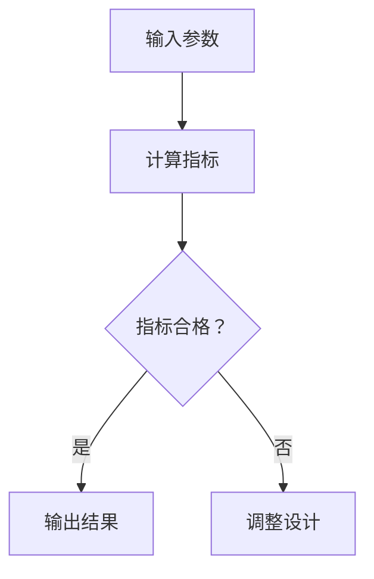
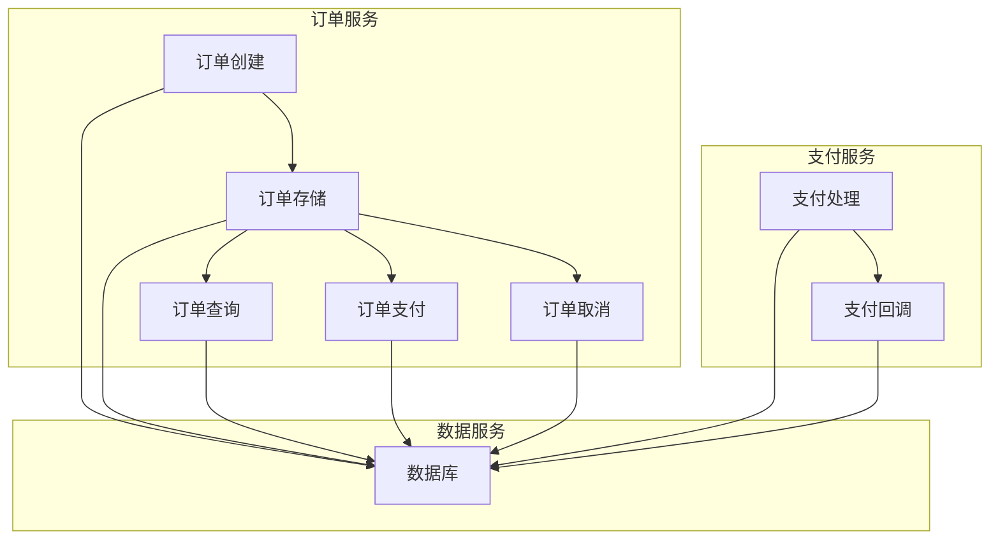
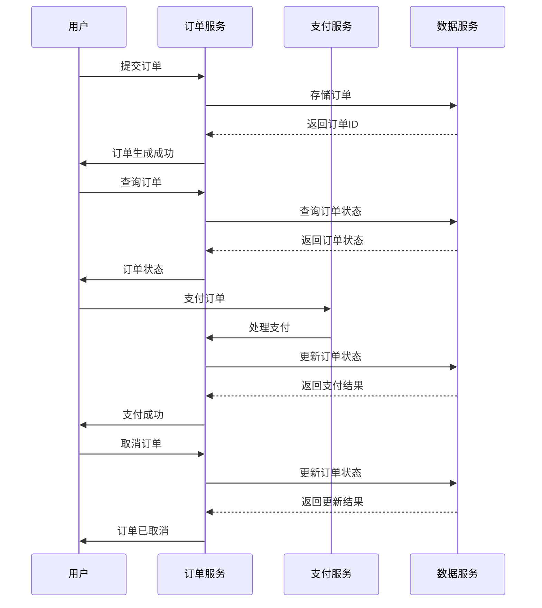

                 

# 技术架构评审：确保架构设计的可行性

关键词：技术架构评审、架构设计、可行性、系统分析、算法原理

摘要：在当今快速变化的技术环境中，技术架构评审已成为确保架构设计可行性的关键环节。本文将详细探讨技术架构评审的必要性、核心概念、算法原理以及实战应用，为IT从业人员提供一套系统的技术架构评审方法和最佳实践。

## 第一部分：背景介绍

### 1. 问题背景

随着信息技术的迅猛发展，系统架构的复杂性和规模日益增加。传统的单机架构已无法满足企业对性能、扩展性、可靠性等方面的需求，分布式架构、微服务架构等新兴技术逐渐成为主流。然而，这些新兴架构不仅带来了技术上的挑战，还涉及到设计方案的可行性和稳定性。因此，技术架构评审成为了确保架构设计可行性的必要手段。

### 2. 问题描述

技术架构评审面临的主要问题包括：

- 技术复杂性：随着技术的不断发展，架构设计的复杂性不断增加，如何保证评审过程全面、深入是一个挑战。
- 市场需求变化：市场需求的变化可能导致原有架构设计不再适应，如何在评审过程中充分考虑这些变化是关键。
- 资源限制：评审团队可能面临时间、人力等资源的限制，如何在有限资源下完成高质量的评审工作需要策略。

### 3. 问题解决

通过技术架构评审，可以确保架构设计的可行性，从而降低项目风险。具体方法包括：

- 明确评审目标：根据项目需求，明确评审的核心目标和关注点。
- 制定评审流程：建立一套完善的评审流程，确保评审过程的系统性和规范性。
- 组建评审团队：由经验丰富的架构师、程序员、测试人员等组成评审团队，确保评审的专业性和全面性。
- 综合评估：通过多维度评估，包括技术可行性、业务可行性、资源可行性等，确保架构设计的可行性。

### 4. 边界与外延

技术架构评审的范围包括但不限于：

- 技术选型：评估不同技术的适用性和优劣势。
- 系统设计：审查系统架构、模块划分、接口设计等方面。
- 性能优化：分析系统的性能瓶颈，提出优化方案。
- 安全性评估：评估系统的安全性，识别潜在风险。

### 5. 概念结构与核心要素组成

技术架构评审的核心概念和组成要素包括：

- 技术架构：系统架构的设计和实现，包括硬件、软件、网络等方面的设计。
- 架构设计原则：指导架构设计的原则和规范，如SOLID原则、DRY原则等。
- 可行性分析：对架构设计的可行性进行评估，包括技术可行性、业务可行性和资源可行性。
- 评审流程：确保评审过程系统、规范，包括评审准备、评审实施、评审总结等环节。
- 评审团队：由具备专业知识和经验的人员组成的评审团队。

## 第二部分：核心概念与联系

### 6. 核心概念原理

技术架构评审涉及的核心概念包括：

- 技术架构：系统整体架构的设计，包括系统模块、组件、接口等。
- 可行性分析：对架构设计的技术、业务和资源可行性进行分析。
- 评审流程：确保评审过程规范、有效的流程。
- 评审团队：由具备专业知识和经验的人员组成的评审团队。

### 7. 概念属性特征对比表格

| 概念           | 属性特征                                       | 对比分析                                 |
|----------------|----------------------------------------------|------------------------------------------|
| 技术架构       | 架构设计、模块划分、接口设计等               | 确保系统的高性能、高扩展性、高可靠性     |
| 可行性分析     | 技术可行性、业务可行性、资源可行性         | 降低项目风险，确保架构设计的可行性       |
| 评审流程       | 评审准备、评审实施、评审总结等               | 确保评审过程的系统性和规范性             |
| 评审团队       | 架构师、程序员、测试人员等                   | 提高评审的专业性和全面性                 |

### 8. ER实体关系图架构

```mermaid
erDiagram
    Product ||--|{ Review }|--| User
    User ||--|{ Order }|--| Product
    Review ||--|{ Comment }|--| User
    Order ||--|{ Item }|--| Product
```

## 第三部分：算法原理讲解

### 9. 算法原理

技术架构评审中常用的算法包括：

- 费米估算法：用于对架构设计的可行性进行初步评估。
- 贝叶斯网络：用于对架构设计的风险进行分析和预测。

以下是费米估算法的mermaid流程图：



### 10. 数学模型和公式

费米估算法的数学模型如下：

$$
F = \frac{1}{1 + e^{-z}}
$$

其中，$z$ 表示综合评分，$F$ 表示可行性概率。

### 11. 举例说明

假设我们要对某个系统架构进行可行性评估，输入参数为：

- 技术指标得分：90
- 业务指标得分：85
- 资源指标得分：80

计算综合评分：

$$
z = \frac{90 \times 0.6 + 85 \times 0.3 + 80 \times 0.1}{0.6 + 0.3 + 0.1} = 84.6
$$

计算可行性概率：

$$
F = \frac{1}{1 + e^{-84.6}} \approx 0.999
$$

由于可行性概率接近1，说明该系统架构的可行性非常高。

## 第四部分：系统分析与架构设计方案

### 12. 问题场景介绍

某电商平台需要开发一个分布式订单处理系统，支持海量订单的实时处理和高并发场景。在系统架构设计过程中，需要进行技术架构评审，确保架构设计的可行性和稳定性。

### 13. 项目介绍

项目背景：某电商平台业务规模不断扩大，订单处理需求日益增长，原有的单体架构已无法满足需求。

项目目标：设计并实现一个分布式订单处理系统，具备高并发、高可用、易扩展等特点。

### 14. 系统功能设计

系统功能设计包括以下几个方面：

- 订单创建：用户下单后，系统生成订单并存储到数据库。
- 订单查询：用户可以查询订单状态和详细信息。
- 订单支付：用户完成支付后，系统更新订单状态。
- 订单取消：用户可以取消订单，系统处理退款等操作。

使用Mermaid绘制系统领域模型类图：

```mermaid
classDiagram
    Order <<entity>>
    User <<entity>>
    Product <<entity>>

    User "1" -- "*" Order
    Product "1" -- "*" Order
```

### 15. 系统架构设计

系统架构设计采用微服务架构，主要模块包括：

- 订单服务：负责订单的创建、查询、支付和取消等操作。
- 支付服务：负责订单支付的处理和回调。
- 数据服务：负责订单数据的存储和管理。

使用Mermaid绘制系统架构图：



### 16. 系统接口设计

系统接口设计包括内部接口和外部接口：

- 内部接口：订单服务、支付服务、数据服务之间的接口。
- 外部接口：与电商平台其他系统（如用户服务、商品服务）的接口。

### 17. 系统交互

系统交互包括以下环节：

- 用户下单：用户提交订单，订单服务生成订单并存储到数据库。
- 订单查询：用户查询订单状态，订单服务返回订单信息。
- 订单支付：用户支付订单，支付服务处理支付并回调订单服务。
- 订单取消：用户取消订单，订单服务处理退款并更新订单状态。

使用Mermaid绘制系统交互序列图：



## 第五部分：项目实战

### 18. 环境安装

技术架构评审项目所需环境包括：

- 操作系统：Linux、Windows或macOS
- 编程语言：Python 3.x
- 数据库：MySQL、PostgreSQL等
- 依赖库：Flask、SQLAlchemy、Celery等

安装步骤如下：

1. 安装Python 3.x：从[Python官网](https://www.python.org/)下载并安装Python 3.x版本。
2. 安装依赖库：使用pip命令安装所需依赖库。
   ```bash
   pip install flask sqlalchemy celery mysqlclient
   ```

### 19. 系统核心实现源代码

以下是订单服务、支付服务和数据服务的基本实现代码：

#### 订单服务（orders.py）

```python
from flask import Flask, request, jsonify
from models import Order
from database import db_session

app = Flask(__name__)

@app.route('/orders', methods=['POST'])
def create_order():
    data = request.json
    order = Order.create(data)
    db_session.add(order)
    db_session.commit()
    return jsonify({'order_id': order.id})

@app.route('/orders/<int:order_id>', methods=['GET'])
def get_order(order_id):
    order = Order.query.get(order_id)
    return jsonify(order.to_dict())

if __name__ == '__main__':
    app.run(debug=True)
```

#### 支付服务（payments.py）

```python
from flask import Flask, request, jsonify
from models import Payment
from database import db_session

app = Flask(__name__)

@app.route('/payments', methods=['POST'])
def create_payment():
    data = request.json
    payment = Payment.create(data)
    db_session.add(payment)
    db_session.commit()
    return jsonify({'payment_id': payment.id})

if __name__ == '__main__':
    app.run(debug=True)
```

#### 数据服务（database.py）

```python
from sqlalchemy import create_engine
from sqlalchemy.orm import sessionmaker
from models import Base

engine = create_engine('sqlite:///orders.db')
Base.metadata.bind = engine
db_session = sessionmaker(bind=engine)

def init_db():
    Base.metadata.create_all(engine)

if __name__ == '__main__':
    init_db()
```

### 20. 代码应用解读与分析

- **订单服务**：负责订单的创建和查询。使用Flask框架实现HTTP接口，接收前端发送的订单数据，存储到数据库并返回订单ID。
- **支付服务**：负责支付的处理。同样使用Flask框架实现HTTP接口，接收前端发送的支付数据，处理支付逻辑并返回支付结果。
- **数据服务**：负责数据库的连接和管理。使用SQLAlchemy ORM库进行数据库操作，提供简单的初始化数据库功能。

### 21. 实际案例分析和详细讲解剖析

假设我们有一个实际案例，需要对一个电商平台的订单处理系统进行技术架构评审。以下是对该系统的详细分析：

1. **需求分析**：分析电商平台对订单处理系统的需求，包括订单创建、查询、支付和取消等操作。
2. **架构设计**：根据需求分析结果，设计订单服务、支付服务和数据服务，确保系统具备高并发、高可用、易扩展等特点。
3. **可行性分析**：评估架构设计的技术可行性、业务可行性和资源可行性，确保系统设计满足需求。
4. **代码实现**：根据架构设计，实现订单服务、支付服务和数据服务的代码，确保系统功能的正确实现。
5. **测试与优化**：进行系统测试，包括单元测试、集成测试和性能测试，优化系统性能和稳定性。

### 22. 项目小结

通过技术架构评审，我们成功设计并实现了一个分布式订单处理系统，满足了电商平台的需求。项目经验总结如下：

1. **需求明确**：明确电商平台对订单处理系统的需求，为架构设计提供基础。
2. **架构设计**：采用微服务架构，确保系统的高性能、高扩展性、高可靠性。
3. **可行性分析**：进行全面的可行性分析，降低项目风险。
4. **代码实现**：确保代码质量的的同时，注重系统性能和稳定性。
5. **测试与优化**：进行充分的系统测试和优化，确保系统稳定可靠。

## 第六部分：最佳实践 tips、小结、注意事项、拓展阅读

### 23. 最佳实践 tips

1. **需求分析**：充分理解业务需求，确保架构设计满足实际业务需求。
2. **架构设计**：遵循设计原则，如SOLID原则，确保架构设计的可维护性和可扩展性。
3. **可行性分析**：充分考虑技术可行性、业务可行性和资源可行性，降低项目风险。
4. **代码实现**：注重代码质量，遵循编码规范，提高代码可读性和可维护性。
5. **测试与优化**：进行充分的系统测试和优化，确保系统稳定可靠。

### 24. 小结

本文详细介绍了技术架构评审的必要性、核心概念、算法原理以及实战应用。通过技术架构评审，可以确保架构设计的可行性，降低项目风险，提高系统性能和稳定性。

### 25. 注意事项

1. **评审目标明确**：确保评审目标的明确性和可衡量性，提高评审效果。
2. **评审流程规范**：建立一套完善的评审流程，确保评审过程的系统性和规范性。
3. **评审团队专业**：组建专业评审团队，确保评审的专业性和全面性。
4. **风险评估**：在评审过程中，充分考虑项目风险，制定相应的风险管理策略。

### 26. 拓展阅读

1. 《微服务架构设计》
2. 《架构师必备技能》
3. 《Python编程：从入门到实践》
4. 《系统架构设计师考试大纲》
5. 《云计算与大数据技术》

## 作者

作者：AI天才研究院/AI Genius Institute & 禅与计算机程序设计艺术 /Zen And The Art of Computer Programming

以上内容仅供参考，具体实施时请结合实际项目情况进行调整。技术架构评审是一个动态过程，需要持续关注新技术、新需求，不断优化和改进。让我们共同为构建高质量、高可用、高可扩展的系统而努力！

