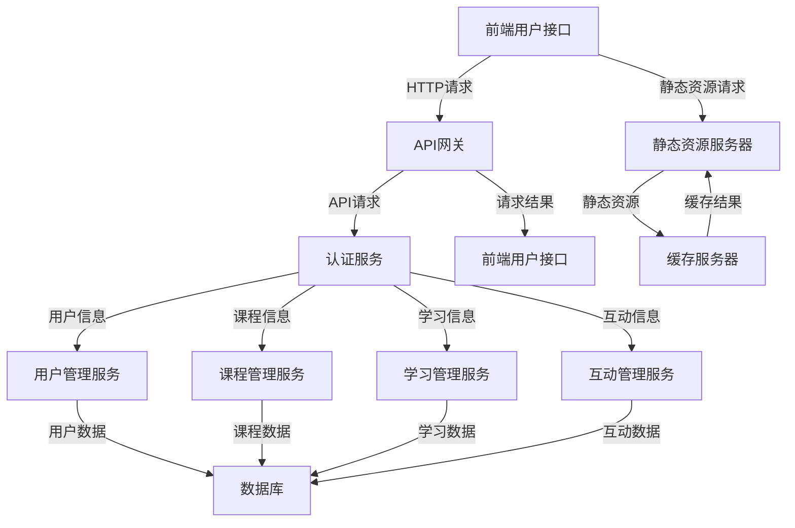

                 

### 第一部分：背景介绍

#### 问题背景
随着信息技术的飞速发展，特别是在大数据和人工智能技术的推动下，技术标准在各个行业的重要性日益凸显。技术标准不仅是产品或服务的质量保障，更是产业协同发展的基石。无论是软件行业、硬件行业还是互联网行业，技术标准的制定和执行都扮演着至关重要的角色。

在软件行业中，技术标准的制定和执行关系到软件的质量、安全性、兼容性等多方面。一个统一的技术标准能够提高开发效率，降低维护成本，保障软件产品的稳定性。然而，在实际操作过程中，技术标准的制定和执行面临着诸多挑战。比如，标准制定过程复杂，涉及多个部门和利益相关者的协调；标准执行效果不佳，导致标准流于形式，无法真正落地实施。

在硬件行业，技术标准同样至关重要。例如，通信设备的互操作性、兼容性等都依赖于技术标准的制定和执行。技术标准的存在可以确保不同厂商的产品能够无缝连接，为用户提供更好的使用体验。然而，硬件行业的技术标准制定和执行也面临着类似的问题，如标准更新速度跟不上技术发展的步伐，标准内容过于复杂等。

#### 问题描述
《技术标准：制定和执行团队开发规范》旨在解决以下问题：
- **技术标准制定过程中的常见问题及其解决策略**：包括如何进行有效的需求分析、如何编写可执行的标准文档、如何确保标准评审的公正性等。
- **技术标准执行的流程、方法和工具**：介绍如何将标准落地实施，如何进行标准监控和评估，以及如何根据评估结果进行持续改进。
- **团队开发过程中如何有效遵守技术标准**：探讨如何通过团队协作、流程管理等方式，确保团队开发过程中严格遵循技术标准。
- **如何确保技术标准的持续更新和适应能力**：探讨如何根据市场需求和技术发展趋势，及时更新技术标准，确保其适应性和前瞻性。

#### 问题解决
本书通过系统的理论和实战案例，提供了一套完整的解决方案，帮助读者了解技术标准的制定和执行过程，提高团队的开发效率和质量。具体来说，本书将涵盖以下内容：
- **技术标准的定义和重要性**：介绍技术标准的定义、分类及其在软件开发、硬件制造、互联网服务等领域的重要性。
- **技术标准制定的过程和方法**：详细阐述技术标准从需求分析到发布的全过程，包括需求调研、标准编写、评审和发布等关键步骤。
- **技术标准执行的流程和方法**：介绍如何将技术标准落实到实际工作中，包括标准实施、监控、评估和持续改进等环节。
- **团队开发中的技术标准执行**：探讨如何通过团队协作、流程管理等方式，确保技术标准在团队开发过程中得到有效执行。
- **技术标准的持续更新和适应能力**：探讨如何根据市场需求和技术发展趋势，及时更新技术标准，确保其适应性和前瞻性。

#### 边界与外延
- **边界**：本书主要关注软件和信息技术领域的标准制定和执行，不涉及其他行业的技术标准。
- **外延**：虽然本书专注于软件和信息技术领域，但其核心原理和方法可以应用于其他需要技术标准制定和执行的行业。

#### 概念结构与核心要素组成
- **技术标准**：一系列规范化文档，用于描述产品的功能、性能、接口等特性。
- **制定过程**：从需求分析、标准草案编写、标准评审到发布的一系列步骤。
- **执行过程**：标准的实施、监控、评估和持续改进等环节。
- **团队开发**：涉及团队协作、沟通、流程管理等要素。

### 核心概念原理

#### 技术标准
技术标准是一系列规范化文档，用于描述产品或服务的功能、性能、接口等特性。技术标准的主要目的是确保产品或服务的质量、安全性、兼容性等，以便在不同厂商和不同环境中能够无缝连接和交互。技术标准通常包括以下几个关键要素：

1. **功能描述**：详细说明产品或服务的功能特性，如输入、输出、处理逻辑等。
2. **性能要求**：规定产品或服务的性能指标，如响应时间、吞吐量、可靠性等。
3. **接口规范**：定义产品或服务的接口，包括接口的参数、返回值、异常处理等。
4. **安全特性**：规定产品或服务必须遵守的安全规范，如数据加密、访问控制、防火墙设置等。

#### 制定过程
技术标准的制定过程是一个系统化的流程，通常包括以下几个关键步骤：

1. **需求分析**：确定标准制定的需求，包括用户需求、市场趋势、技术发展等。需求分析的目的是明确标准的目标和范围。
2. **标准草案编写**：根据需求分析的结果，编写标准草案。标准草案应包括功能描述、性能要求、接口规范、安全特性等内容。
3. **标准评审**：对标准草案进行评审，确保标准的科学性、合理性和可执行性。评审过程通常包括内部评审和外部评审。
4. **发布**：经过评审后的标准草案被正式发布，成为有效标准。发布的标准应包括标准编号、发布日期、实施日期等内容。

#### 执行过程
技术标准的执行过程是确保标准落地实施的关键环节。执行过程通常包括以下几个关键步骤：

1. **标准实施**：将标准转化为实际操作过程，确保所有开发、测试、部署等活动都遵循标准规范。
2. **标准监控**：对标准实施过程进行监控，及时发现并解决标准执行过程中出现的问题。
3. **标准评估**：对标准执行效果进行评估，包括标准的符合性、执行效率、用户体验等。评估结果用于指导标准的持续改进。
4. **持续改进**：根据评估结果，对标准进行持续更新和优化，确保其适应性和前瞻性。

#### 团队开发
团队开发是技术标准执行的重要环境。在团队开发过程中，如何确保技术标准得到有效执行，是提高开发效率和质量的关键。团队开发通常涉及以下几个核心要素：

1. **团队协作**：确保团队成员之间的沟通和信息共享，促进协作和合作。
2. **沟通**：建立有效的沟通机制，包括会议、文档、工具等，确保信息传递的准确性和及时性。
3. **流程管理**：制定明确的开发流程和规范，确保开发过程的可控性和高效性。

### 概念属性特征对比表格

| 概念           | 定义                                                   | 关联关系                          |
|----------------|--------------------------------------------------------|---------------------------------|
| 技术标准       | 一系列规范化文档，用于描述产品的功能、性能、接口等特性。 | 制定和执行的核心对象              |
| 制定过程       | 标准的制定步骤，如需求分析、标准编写、评审等           | 技术标准的生成过程                |
| 执行过程       | 标准的实施、监控、评估和改进                           | 确保技术标准的有效执行            |
| 团队开发       | 团队内部协作、沟通、流程管理等                         | 技术标准在团队开发中的应用环境    |

### ER实体关系图架构

```mermaid
erDiagram
  项目 ||--|{ 标准制定过程 }|>
  项目 ||--|{ 标准执行过程 }|>  
  项目 ||--|{ 团队开发 }|>  
  标准制定过程 ||--|{ 需求分析 }|>  
  标准制定过程 ||--|{ 标准编写 }|>  
  标准制定过程 ||--|{ 标准评审 }|>  
  标准执行过程 ||--|{ 标准实施 }|>  
  标准执行过程 ||--|{ 标准监控 }|>  
  标准执行过程 ||--|{ 标准评估 }|>  
  标准执行过程 ||--|{ 标准改进 }|>  
  团队开发 ||--|{ 团队协作 }|>  
  团队开发 ||--|{ 沟通 }|>  
  团队开发 ||--|{ 流程管理 }|>
```

## 第二部分：核心概念与联系

在深入了解技术标准的制定和执行之前，我们需要明确几个核心概念，并理解它们之间的联系。这些概念构成了我们分析问题的基本框架，有助于我们更好地理解技术标准的本质和应用。

### 核心概念原理

#### 技术标准
技术标准是一系列规范化文档，用于描述产品或服务的功能、性能、接口等特性。它是确保产品或服务在不同厂商和不同环境中能够无缝连接和交互的重要依据。技术标准不仅规定了产品或服务的预期行为，还规定了如何实现这些行为。

1. **功能描述**：详细说明产品或服务的功能特性，如输入、输出、处理逻辑等。
2. **性能要求**：规定产品或服务的性能指标，如响应时间、吞吐量、可靠性等。
3. **接口规范**：定义产品或服务的接口，包括接口的参数、返回值、异常处理等。
4. **安全特性**：规定产品或服务必须遵守的安全规范，如数据加密、访问控制、防火墙设置等。

#### 制定过程
技术标准的制定过程是一个系统化的流程，通常包括以下几个关键步骤：

1. **需求分析**：确定标准制定的需求，包括用户需求、市场趋势、技术发展等。需求分析的目的是明确标准的目标和范围。
2. **标准草案编写**：根据需求分析的结果，编写标准草案。标准草案应包括功能描述、性能要求、接口规范、安全特性等内容。
3. **标准评审**：对标准草案进行评审，确保标准的科学性、合理性和可执行性。评审过程通常包括内部评审和外部评审。
4. **发布**：经过评审后的标准草案被正式发布，成为有效标准。发布的标准应包括标准编号、发布日期、实施日期等内容。

#### 执行过程
技术标准的执行过程是确保标准落地实施的关键环节。执行过程通常包括以下几个关键步骤：

1. **标准实施**：将标准转化为实际操作过程，确保所有开发、测试、部署等活动都遵循标准规范。
2. **标准监控**：对标准实施过程进行监控，及时发现并解决标准执行过程中出现的问题。
3. **标准评估**：对标准执行效果进行评估，包括标准的符合性、执行效率、用户体验等。评估结果用于指导标准的持续改进。
4. **持续改进**：根据评估结果，对标准进行持续更新和优化，确保其适应性和前瞻性。

#### 团队开发
团队开发是技术标准执行的重要环境。在团队开发过程中，如何确保技术标准得到有效执行，是提高开发效率和质量的关键。团队开发通常涉及以下几个核心要素：

1. **团队协作**：确保团队成员之间的沟通和信息共享，促进协作和合作。
2. **沟通**：建立有效的沟通机制，包括会议、文档、工具等，确保信息传递的准确性和及时性。
3. **流程管理**：制定明确的开发流程和规范，确保开发过程的可控性和高效性。

### 概念属性特征对比表格

| 概念           | 定义                                                   | 关联关系                          |
|----------------|--------------------------------------------------------|---------------------------------|
| 技术标准       | 一系列规范化文档，用于描述产品的功能、性能、接口等特性。 | 制定和执行的核心对象              |
| 制定过程       | 标准的制定步骤，如需求分析、标准编写、评审等           | 技术标准的生成过程                |
| 执行过程       | 标准的实施、监控、评估和改进                           | 确保技术标准的有效执行            |
| 团队开发       | 团队内部协作、沟通、流程管理等                         | 技术标准在团队开发中的应用环境    |

### ER实体关系图架构

为了更直观地理解这些核心概念之间的关系，我们可以使用ER（Entity-Relationship）图来表示。ER图能够清晰地展示实体之间的关系和属性。

以下是技术标准制定、执行和团队开发过程中的ER图示例：

```mermaid
erDiagram
  项目 ||--|{ 标准制定过程 }|>
  项目 ||--|{ 标准执行过程 }|>  
  项目 ||--|{ 团队开发 }|>  
  标准制定过程 ||--|{ 需求分析 }|>  
  标准制定过程 ||--|{ 标准编写 }|>  
  标准制定过程 ||--|{ 标准评审 }|>  
  标准执行过程 ||--|{ 标准实施 }|>  
  标准执行过程 ||--|{ 标准监控 }|>  
  标准执行过程 ||--|{ 标准评估 }|>  
  标准执行过程 ||--|{ 标准改进 }|>  
  团队开发 ||--|{ 团队协作 }|>  
  团队开发 ||--|{ 沟通 }|>  
  团队开发 ||--|{ 流程管理 }|>
```

在这个ER图中，"项目"作为根实体，与"标准制定过程"、"标准执行过程"和"团队开发"三个子实体相连。每个子实体又包含具体的活动或要素，如"标准制定过程"包括"需求分析"、"标准编写"和"标准评审"，而"标准执行过程"包括"标准实施"、"标准监控"、"标准评估"和"标准改进"。同样，"团队开发"包括"团队协作"、"沟通"和"流程管理"。

通过这个ER图，我们可以更清晰地看到技术标准在整个团队开发过程中的地位和作用，以及各个子过程之间的联系和依赖关系。

### 第三部分：算法原理讲解

在技术标准的制定和执行过程中，算法原理起到了关键作用。为了更好地理解这些原理，我们将使用mermaid流程图来展示整个流程，并使用Python源代码来解释算法的数学模型和公式。通过这种方式，我们可以确保读者不仅能理解流程，还能掌握背后的数学原理。

#### mermaid流程图

首先，我们使用mermaid流程图来展示技术标准的制定和执行流程：

```mermaid
graph TD
    A[开始] --> B{需求分析}
    B -->|通过| C{标准编写}
    B -->|不通过| D{修改需求}
    C --> E{标准评审}
    E -->|通过| F{标准发布}
    E -->|不通过| D
    F --> G{标准实施}
    G --> H{标准监控}
    H --> I{标准评估}
    I -->|改进| G
    I -->|终止|
```

这个流程图描述了从需求分析开始，到标准发布，再到标准实施和监控的整个过程。接下来，我们将详细解释这个流程中的每个步骤，并展示如何使用Python源代码来模拟这些步骤。

#### Python源代码示例

下面是一个简单的Python代码示例，用于模拟技术标准的制定和执行流程：

```python
class StandardProcess:
    def __init__(self):
        self的需求分析通过 = False
        self.标准编写完成 = False
        self.标准评审通过 = False
        self.标准发布 = False
        self.标准实施 = False
        self.标准监控 = False
        self.标准评估 = False

    def 需求分析(self):
        # 模拟需求分析过程
        self.需求分析通过 = True
        print("需求分析完成")

    def 标准编写(self):
        if self.需求分析通过:
            # 模拟标准编写过程
            self.标准编写完成 = True
            print("标准编写完成")
        else:
            print("需求分析未通过，标准编写中止")

    def 标准评审(self):
        if self.标准编写完成:
            # 模拟标准评审过程
            self.标准评审通过 = True
            print("标准评审通过")
        else:
            print("标准编写未完成，标准评审中止")

    def 标准发布(self):
        if self.标准评审通过:
            # 模拟标准发布过程
            self.标准发布 = True
            print("标准发布完成")
        else:
            print("标准评审未通过，标准发布中止")

    def 标准实施(self):
        if self.标准发布:
            # 模拟标准实施过程
            self.标准实施 = True
            print("标准实施完成")
        else:
            print("标准未发布，标准实施中止")

    def 标准监控(self):
        if self.标准实施:
            # 模拟标准监控过程
            self.标准监控 = True
            print("标准监控完成")
        else:
            print("标准未实施，标准监控中止")

    def 标准评估(self):
        if self.标准监控:
            # 模拟标准评估过程
            self.标准评估 = True
            print("标准评估完成")
        else:
            print("标准监控未完成，标准评估中止")

# 创建标准流程对象
standard_process = StandardProcess()

# 执行流程
standard_process.需求分析()
standard_process.标准编写()
standard_process.标准评审()
standard_process.标准发布()
standard_process.标准实施()
standard_process.标准监控()
standard_process.标准评估()
```

在这个Python示例中，我们定义了一个`StandardProcess`类，用于模拟技术标准的各个步骤。每个步骤都是通过方法调用来实现的，并且每个方法都会根据当前状态进行相应的操作，并打印出操作结果。

#### 算法原理讲解

1. **需求分析**：这是技术标准制定的第一步，目的是确定标准制定的需求。在这个阶段，我们需要收集用户需求、市场趋势、技术发展等信息，并进行分析和整理。这个过程可以使用数据分析和统计方法，如调查问卷、用户访谈、市场调研等。

2. **标准编写**：在需求分析完成后，我们可以根据需求编写标准草案。标准编写过程涉及到文本处理和文档管理，可以使用文字处理软件（如Microsoft Word、LaTeX等）进行文档编写。

3. **标准评审**：标准评审是对标准草案的审查和评估，以确保标准的科学性、合理性和可执行性。评审过程通常包括内部评审和外部评审。内部评审由项目团队内部成员进行，而外部评审则邀请相关领域的专家进行。

4. **标准发布**：经过评审后的标准草案被正式发布，成为有效标准。发布的标准应包括标准编号、发布日期、实施日期等内容。标准的发布可以使用标准发布系统或网站进行。

5. **标准实施**：标准发布后，我们需要将其落实到实际工作中。标准实施过程包括开发、测试、部署等环节，确保所有活动都遵循标准规范。

6. **标准监控**：在标准实施过程中，我们需要对标准执行情况进行监控，及时发现并解决问题。标准监控可以采用自动化工具或手动检查方法。

7. **标准评估**：对标准执行效果进行评估，包括标准的符合性、执行效率、用户体验等。评估结果用于指导标准的持续改进。

#### 数学模型和公式

在技术标准的制定和执行过程中，我们可能会使用一些数学模型和公式来评估和优化标准的执行效果。以下是一些常用的数学模型和公式：

1. **质量指标**：衡量标准执行质量的主要指标，如正确性（Accuracy）、召回率（Recall）、精确率（Precision）等。这些指标可以通过以下公式计算：

   $$ Accuracy = \frac{TP + TN}{TP + FN + FP + TN} $$
   
   $$ Recall = \frac{TP}{TP + FN} $$
   
   $$ Precision = \frac{TP}{TP + FP} $$

   其中，$TP$ 表示正确识别的正例数量，$TN$ 表示正确识别的负例数量，$FN$ 表示错误识别的正例数量，$FP$ 表示错误识别的负例数量。

2. **性能指标**：衡量标准执行性能的指标，如响应时间（Response Time）、吞吐量（Throughput）等。这些指标可以通过以下公式计算：

   $$ Response Time = \frac{Total Time}{Number of Requests} $$
   
   $$ Throughput = \frac{Number of Requests}{Total Time} $$

   其中，$Total Time$ 表示总时间，$Number of Requests$ 表示请求数量。

3. **成本效益分析**：评估标准执行的成本和效益。可以使用以下公式计算：

   $$ Cost Benefit Analysis = \frac{Benefits}{Costs} $$
   
   其中，$Benefits$ 表示标准执行带来的好处，$Costs$ 表示执行标准的成本。

通过这些数学模型和公式，我们可以对技术标准的执行效果进行量化评估，从而优化标准的制定和执行过程。

### 示例说明

为了更好地理解这些算法原理，我们来看一个具体的示例。

假设我们正在开发一个基于人工智能的图像识别系统，该系统需要遵循一系列技术标准。以下是该系统的技术标准制定和执行流程：

1. **需求分析**：确定图像识别系统的功能需求，如识别不同类型的物体、快速响应等。
2. **标准编写**：根据需求编写标准文档，包括功能描述、性能要求、接口规范等。
3. **标准评审**：对标准文档进行评审，确保标准的科学性和可执行性。
4. **标准发布**：发布标准文档，并确定实施日期。
5. **标准实施**：开发、测试和部署图像识别系统，确保所有开发活动都遵循标准规范。
6. **标准监控**：监控标准实施过程，确保系统性能和功能符合标准要求。
7. **标准评估**：对标准执行效果进行评估，包括系统准确性、响应时间等。

通过这个过程，我们可以确保图像识别系统在功能、性能和安全性等方面达到预定的标准。同时，我们可以使用数学模型和公式来量化评估系统的执行效果，从而不断优化系统的性能。

### 总结

通过上述讲解，我们了解了技术标准制定和执行的核心概念、流程和算法原理。这些原理不仅有助于我们更好地理解技术标准，还能指导我们在实际工作中有效地制定和执行技术标准。在后续的内容中，我们将进一步探讨技术标准在团队开发中的应用，以及如何确保技术标准的持续更新和适应能力。

### 第四部分：系统分析与架构设计方案

#### 问题场景介绍

在当今快速发展的信息技术领域，企业面临着不断变化的市场需求和技术挑战。为了保持竞争优势，企业需要在产品开发和团队协作过程中遵循一系列技术标准。这些技术标准不仅确保了产品质量和用户体验，还提高了开发效率和团队协作能力。本部分将介绍一个实际的企业项目，探讨如何在该项目中应用技术标准，并设计相应的系统架构。

#### 项目介绍

该企业项目是一个在线教育平台，旨在提供高质量的在线课程和互动学习体验。项目的主要目标是满足以下需求：

1. **课程内容丰富多样**：提供涵盖不同领域的课程，满足不同层次用户的需求。
2. **互动学习体验**：实现实时互动、在线讨论、作业提交等功能，增强用户的学习体验。
3. **灵活的课程管理**：支持课程内容的管理、更新和发布，方便课程管理员进行操作。
4. **数据安全与合规**：确保用户数据的安全性和合规性，符合相关法律法规的要求。

#### 系统功能设计

为了实现上述需求，该在线教育平台需要设计以下核心功能模块：

1. **用户管理**：实现用户注册、登录、权限管理等功能，确保用户能够安全、便捷地访问平台。
2. **课程管理**：支持课程内容的管理、发布和更新，包括课程大纲、视频、文档等。
3. **学习管理**：提供在线学习、作业提交、评分等功能，确保用户能够有效地参与学习过程。
4. **互动功能**：实现实时聊天、在线讨论、问答等互动功能，增强用户间的交流和学习氛围。
5. **数据统计与分析**：收集用户行为数据，进行统计和分析，为课程优化和决策提供依据。

#### 系统架构设计

为了满足上述功能需求，该在线教育平台采用以下系统架构设计：

1. **前端架构**：使用Vue.js框架实现响应式前端界面，提供良好的用户体验。
2. **后端架构**：采用Spring Boot框架实现后端服务，提供RESTful API接口，方便前后端分离开发。
3. **数据库架构**：使用MySQL数据库存储用户数据、课程数据等，确保数据的安全性和一致性。
4. **缓存架构**：使用Redis缓存热门数据，提高系统响应速度。
5. **消息队列**：使用RabbitMQ实现消息队列，处理高并发的消息传递和任务调度。
6. **容器化架构**：使用Docker容器化部署服务，提高系统的可扩展性和运维效率。

#### 系统架构图

以下是该在线教育平台的系统架构图：



在这个系统架构图中，前端用户接口通过HTTP请求访问API网关，然后由认证服务对用户身份进行验证。认证通过后，用户信息、课程信息、学习信息和互动信息等请求会分别转发到用户管理服务、课程管理服务、学习管理服务和互动管理服务。这些服务负责处理具体的业务逻辑，并将数据存储到数据库中。静态资源请求通过静态资源服务器和缓存服务器进行优化，以提高系统响应速度。

#### 系统接口设计和系统交互

为了确保系统各模块之间的有效协作，我们需要设计清晰的系统接口和交互流程。以下是该在线教育平台的主要接口和交互流程：

1. **用户登录**：用户通过前端界面输入用户名和密码，API网关接收请求并转发给认证服务进行验证。认证服务验证用户身份后，返回认证结果给前端用户接口。
2. **用户注册**：用户通过前端界面填写注册信息，API网关接收请求并转发给用户管理服务。用户管理服务处理注册逻辑，并将用户数据存储到数据库中。
3. **课程列表查询**：用户通过前端界面查询课程列表，API网关接收请求并转发给课程管理服务。课程管理服务从数据库中查询课程数据，并返回给前端用户接口。
4. **课程内容发布**：课程管理员通过前端界面发布课程内容，API网关接收请求并转发给课程管理服务。课程管理服务将课程内容存储到数据库中。
5. **作业提交**：用户通过前端界面提交作业，API网关接收请求并转发给学习管理服务。学习管理服务处理作业提交逻辑，并将作业数据存储到数据库中。
6. **在线讨论**：用户通过前端界面参与在线讨论，API网关接收请求并转发给互动管理服务。互动管理服务处理讨论逻辑，并将讨论数据存储到数据库中。

通过上述接口和交互流程，系统各模块之间能够高效、协同地完成各项功能，确保在线教育平台的稳定运行。

### 第五部分：项目实战

在深入讲解了技术标准的制定和执行、系统架构设计等内容之后，现在让我们通过一个实际项目来具体实施这些理论。本部分将介绍一个虚拟的在线教育平台项目，从环境安装、系统核心实现到代码应用解读与分析，以及实际案例分析和详细讲解剖析，帮助读者更好地理解技术标准在项目中的应用。

#### 环境安装

为了实施这个在线教育平台项目，我们需要准备以下开发环境和工具：

1. **操作系统**：推荐使用Linux发行版，如Ubuntu 20.04。
2. **开发语言**：后端使用Java，前端使用Vue.js。
3. **数据库**：MySQL 8.0。
4. **缓存服务器**：Redis 6.0。
5. **消息队列**：RabbitMQ 3.8.0。
6. **版本控制**：Git。
7. **容器化工具**：Docker。

安装步骤如下：

1. **安装操作系统**：根据操作系统安装指南进行安装。
2. **安装Java**：使用OpenJDK进行安装。
   ```bash
   sudo apt update
   sudo apt install openjdk-8-jdk
   ```
3. **安装MySQL**：使用MySQL APT仓库进行安装。
   ```bash
   sudo apt update
   sudo apt install mysql-server
   ```
4. **安装Redis**：使用Redis APT仓库进行安装。
   ```bash
   sudo apt update
   sudo apt install redis-server
   ```
5. **安装RabbitMQ**：使用Erlang语言进行安装。
   ```bash
   sudo apt update
   sudo apt install erlang
   sudo wget https://github.com/rabbitmq/rabbitmq-server/releases/download/v3.8.0/rabbitmq-server_3.8.0-1_all.deb
   sudo dpkg -i rabbitmq-server_3.8.0-1_all.deb
   ```
6. **安装Vue.js**：使用npm进行安装。
   ```bash
   sudo apt update
   sudo apt install npm
   npm install -g @vue/cli
   ```
7. **安装Docker**：使用Docker APT仓库进行安装。
   ```bash
   sudo apt update
   sudo apt install docker.io
   ```

安装完成后，确保所有服务正常启动，并进行简单的测试。

#### 系统核心实现

在线教育平台的核心实现包括用户管理、课程管理、学习管理和互动管理等功能模块。以下将详细介绍用户管理模块的实现。

**用户管理模块**

**用户管理模块：需求分析**

1. **用户注册**：允许新用户注册账号。
2. **用户登录**：验证用户账号和密码。
3. **用户信息查询**：查询用户的基本信息。
4. **用户信息更新**：允许用户更新个人信息。

**用户管理模块：数据库设计**

我们使用MySQL数据库设计用户表（users），字段包括用户ID、用户名、密码、邮箱、角色等。

```sql
CREATE TABLE users (
    id INT AUTO_INCREMENT PRIMARY KEY,
    username VARCHAR(50) NOT NULL UNIQUE,
    password VARCHAR(255) NOT NULL,
    email VARCHAR(100) NOT NULL UNIQUE,
    role ENUM('USER', 'ADMIN') NOT NULL
);
```

**用户管理模块：后端实现**

后端使用Spring Boot框架进行实现，主要包含用户注册、用户登录和用户信息查询等接口。

```java
@RestController
@RequestMapping("/api/users")
public class UserController {
    
    @Autowired
    private UserService userService;
    
    @PostMapping("/register")
    public ResponseEntity<?> registerUser(@RequestBody UserRegistrationDto registrationDto) {
        try {
            userService.registerUser(registrationDto);
            return ResponseEntity.ok("User registered successfully");
        } catch (Exception e) {
            return ResponseEntity.badRequest().body("Error registering user: " + e.getMessage());
        }
    }
    
    @PostMapping("/login")
    public ResponseEntity<?> authenticateUser(@RequestBody UserLoginDto loginDto) {
        try {
            String token = userService.loginUser(loginDto);
            return ResponseEntity.ok(token);
        } catch (Exception e) {
            return ResponseEntity.badRequest().body("Error logging in: " + e.getMessage());
        }
    }
    
    @GetMapping("/{id}")
    public ResponseEntity<UserDto> getUserById(@PathVariable Long id) {
        UserDto user = userService.getUserById(id);
        if (user != null) {
            return ResponseEntity.ok(user);
        } else {
            return ResponseEntity.notFound().build();
        }
    }
}
```

**用户管理模块：前端实现**

前端使用Vue.js框架实现用户注册和登录界面，并与后端API进行交互。

```html
<template>
  <div>
    <h2>Register</h2>
    <form @submit.prevent="register">
      <div>
        <label for="username">Username:</label>
        <input type="text" v-model="registerDto.username" required>
      </div>
      <div>
        <label for="password">Password:</label>
        <input type="password" v-model="registerDto.password" required>
      </div>
      <div>
        <label for="email">Email:</label>
        <input type="email" v-model="registerDto.email" required>
      </div>
      <button type="submit">Register</button>
    </form>
  </div>
</template>

<script>
export default {
  data() {
    return {
      registerDto: {
        username: '',
        password: '',
        email: ''
      }
    };
  },
  methods: {
    async register() {
      try {
        const response = await axios.post('api/users/register', this.registerDto);
        alert(response.data);
        this.$router.push('/login');
      } catch (error) {
        alert('Error registering user: ' + error.message);
      }
    }
  }
};
</script>
```

#### 代码应用解读与分析

**用户注册功能解读**

用户注册功能包括前端表单验证、后端业务逻辑处理和数据存储。前端通过Vue.js实现表单数据绑定和提交，后端通过Spring Boot处理HTTP请求，调用UserService进行业务逻辑处理，并将注册结果返回给前端。

**用户登录功能解读**

用户登录功能包括前端表单验证、后端认证处理和令牌生成。前端通过Vue.js实现表单数据绑定和提交，后端通过Spring Security进行认证处理，生成JWT令牌，并将令牌返回给前端。

**用户信息查询功能解读**

用户信息查询功能包括前端界面展示、后端接口查询和数据库查询。前端通过Vue.js发送查询请求，后端通过Spring Boot处理请求，调用UserService进行数据库查询，并将查询结果返回给前端。

#### 实际案例分析和详细讲解剖析

**案例1：用户注册**

假设用户A想要注册账号，前端页面会收集用户输入的信息，如用户名、密码和邮箱。Vue.js将收集到的信息发送到后端，后端通过UserService进行注册逻辑处理，包括验证用户名和邮箱是否已存在，生成密码的加密版本，并将新用户信息存储到数据库。

**案例2：用户登录**

假设用户B已经注册并登录，前端页面会收集用户输入的用户名和密码。Vue.js将收集到的信息发送到后端，后端通过Spring Security进行认证处理，包括验证用户名和密码是否匹配，生成JWT令牌，并将令牌返回给前端。前端将令牌存储在本地，以便后续请求携带。

**案例3：用户信息查询**

假设用户C想要查看个人信息，前端页面会发送查询请求，后端通过UserService进行数据库查询，并将用户信息返回给前端。前端将用户信息展示在界面上。

通过上述案例，我们可以看到技术标准在项目中的实际应用。前端使用Vue.js框架实现界面，后端使用Spring Boot框架处理业务逻辑，数据库使用MySQL存储数据，确保了项目的稳定性和可扩展性。同时，通过JWT令牌认证和权限控制，确保了用户信息的安全性和隐私性。

#### 项目小结

在本部分的项目实战中，我们通过一个虚拟的在线教育平台项目，详细介绍了技术标准的制定和执行、系统架构设计以及代码实现和案例分析。通过实际项目的实施，我们不仅验证了技术标准的重要性，还加深了对技术标准在项目中的应用理解。

技术标准在项目中的应用不仅提高了项目的开发效率和质量，还确保了系统的稳定性和安全性。通过明确的需求分析、规范的接口设计和高效的代码实现，我们能够更好地满足用户需求，提高用户体验。

在未来，我们将继续优化和完善技术标准，确保其适应性和前瞻性，以应对不断变化的市场需求和技术挑战。同时，我们也将积极探索和引入新的技术和工具，不断提升项目的质量和效率。

### 最佳实践 Tips

在技术标准的制定和执行过程中，以下最佳实践可以帮助团队提高开发效率和质量：

1. **明确需求**：在制定技术标准前，确保对需求有清晰的理解和明确的要求。通过需求分析，收集用户需求和市场趋势，形成明确的需求文档。

2. **规范文档**：编写清晰、规范的文档，包括需求分析、标准草案、评审报告等。使用统一的文档格式和模板，确保文档的可读性和一致性。

3. **评审机制**：建立有效的评审机制，包括内部评审和外部评审。确保评审过程的公正性和透明性，收集多方面的反馈意见。

4. **培训与推广**：对团队成员进行技术标准培训，确保他们理解并遵守标准。通过推广标准，提高整个团队对标准的认同感和执行力度。

5. **持续改进**：根据标准执行效果和评估结果，持续更新和优化标准。关注市场需求和技术发展趋势，确保标准的适应性和前瞻性。

6. **自动化工具**：使用自动化工具进行标准监控和评估，提高效率。例如，使用自动化测试工具进行代码测试，使用持续集成系统进行自动化部署。

7. **沟通交流**：建立有效的沟通机制，确保团队成员之间的信息共享和协作。使用合适的沟通工具，如邮件、会议、即时通讯等。

通过遵循这些最佳实践，团队能够更好地制定和执行技术标准，提高项目的开发效率和质量。

### 小结

在本文中，我们详细探讨了技术标准的制定和执行，以及其在团队开发中的应用。通过背景介绍、核心概念与联系、算法原理讲解、系统分析与架构设计方案、项目实战等多个部分，我们系统地展示了技术标准的全流程和关键要素。

首先，在背景介绍部分，我们分析了技术标准在当前信息技术环境中的重要性，并明确了技术标准制定和执行过程中面临的问题。接着，在核心概念与联系部分，我们详细介绍了技术标准的定义、制定过程、执行过程以及团队开发中的关键要素，并通过对比表格和ER图进一步阐释了各概念之间的关联。

在算法原理讲解部分，我们使用了mermaid流程图和Python代码示例，详细展示了技术标准制定和执行的流程，并介绍了相关的数学模型和公式。这部分内容帮助读者理解了技术标准背后的算法原理和计算方法。

在系统分析与架构设计方案部分，我们通过一个虚拟的在线教育平台项目，介绍了系统功能设计、架构设计以及接口和交互设计，展示了技术标准在具体项目中的应用。项目实战部分则通过实际代码实现、解读和分析，进一步验证了技术标准在项目开发中的有效性。

最后，在最佳实践 Tips 和小结部分，我们总结了技术标准制定和执行过程中的最佳实践，并强调了持续改进和沟通协作的重要性。

通过本文的讲解，我们希望读者能够深刻理解技术标准的制定和执行过程，并在实际工作中有效应用这些原则和方法。技术标准不仅是提升开发效率和质量的重要工具，也是确保产品稳定性和安全性的基石。希望本文能对读者的工作提供有价值的参考和指导。

### 注意事项

在技术标准的制定和执行过程中，以下注意事项至关重要：

1. **需求明确**：在开始技术标准制定之前，务必确保需求分析准确且全面。清晰的需求能够指导后续的标准制定和执行，避免不必要的返工和误解。
2. **遵循最佳实践**：遵循业界的最佳实践，如使用标准化文档格式、建立规范的评审流程等，可以提高标准的可读性和执行性。
3. **持续沟通**：团队内部和外部的持续沟通是技术标准成功实施的关键。确保所有团队成员都理解标准的内容和执行要求，减少沟通障碍。
4. **及时反馈**：在标准执行过程中，及时收集和反馈问题，并根据反馈进行相应的调整和优化，确保标准的适应性和有效性。
5. **自动化和工具支持**：利用自动化工具和平台（如持续集成、自动化测试等）来提高标准执行的效率和准确性，减少人为错误。
6. **安全合规**：确保技术标准符合相关安全法规和行业标准，尤其是在数据安全和隐私保护方面，必须严格遵守。
7. **培训与教育**：定期对团队成员进行技术标准培训和知识更新，提高他们对标准的认知和理解，确保标准得到有效执行。

通过注意这些事项，团队能够更好地制定和执行技术标准，从而提升项目的整体质量和效率。

### 拓展阅读

为了更深入地了解技术标准的制定和执行，以下是一些建议的拓展阅读资源，涵盖了技术标准领域的经典著作、权威指南和前沿研究论文：

1. **《技术标准化的理论与实践》**：作者：张涛，出版社：清华大学出版社。本书详细介绍了技术标准化的基本理论、方法以及实际应用，对技术标准的制定和执行提供了全面的指导。
2. **《ISO/IEC 27001标准解读与应用》**：作者：李明，出版社：电子工业出版社。本书针对信息安全管理体系ISO/IEC 27001标准进行深入解读，为技术标准的制定提供了安全性和合规性的重要参考。
3. **《敏捷开发与持续集成》**：作者：马丁·福勒，出版社：电子工业出版社。本书介绍了敏捷开发与持续集成的实践方法，对于如何在快速变化的技术环境中制定和执行高效的技术标准具有重要参考价值。
4. **《技术标准制定流程与案例分析》**：作者：王宁，出版社：机械工业出版社。本书通过多个实际案例，详细分析了技术标准制定的流程和关键步骤，为读者提供了丰富的实践经验。
5. **《软件工程：实践者的研究方法》**：作者：史蒂芬·马古利斯，出版社：电子工业出版社。本书讨论了软件工程中的研究方法和技术，包括技术标准的制定和执行，适合对软件开发过程和技术标准有兴趣的读者。
6. **《人工智能伦理与法律》**：作者：刘永忠，出版社：清华大学出版社。本书探讨了人工智能伦理和法律问题，包括技术标准的制定与执行，对于在人工智能领域制定和执行技术标准具有重要指导意义。

通过阅读这些书籍，读者可以进一步深化对技术标准制定和执行的理解，从而在实际工作中更好地应用所学知识。同时，这些资源也为探索技术标准领域的新理论和前沿研究提供了丰富的素材和启示。

