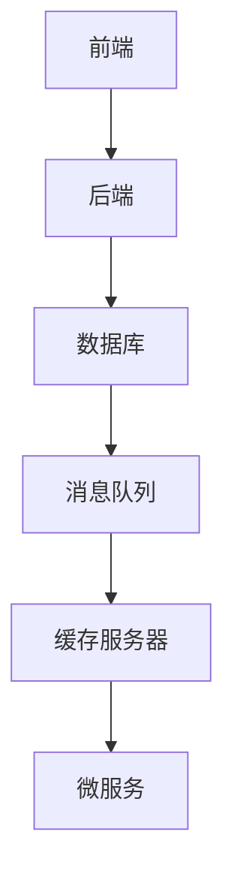
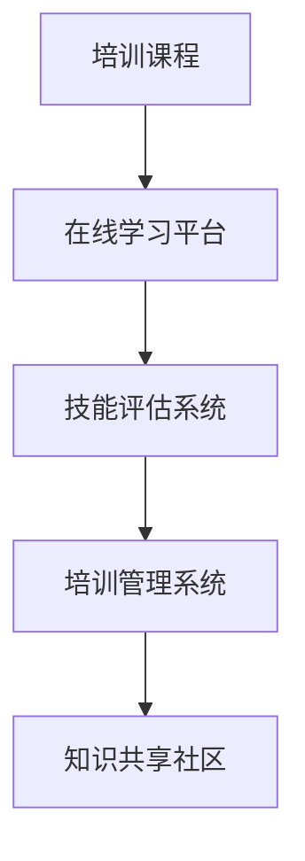
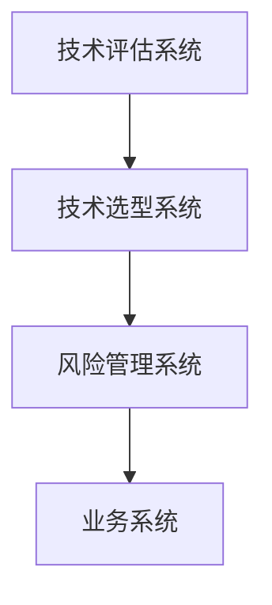
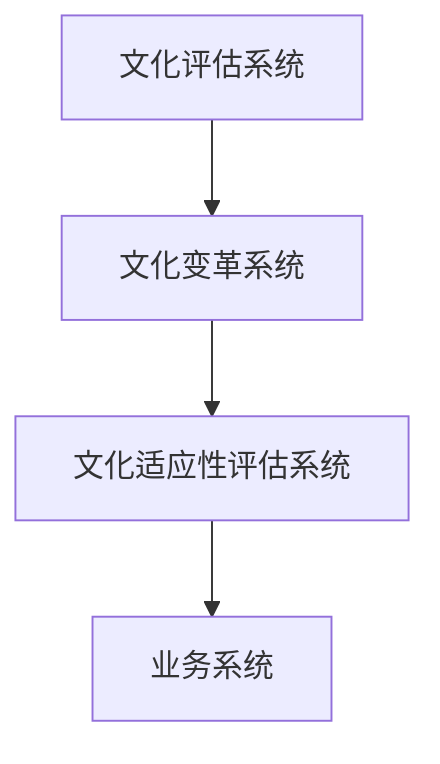
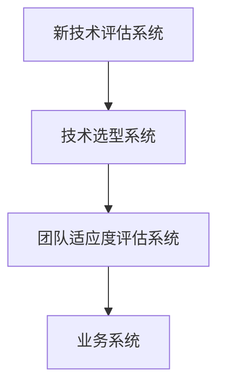
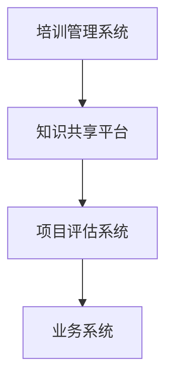
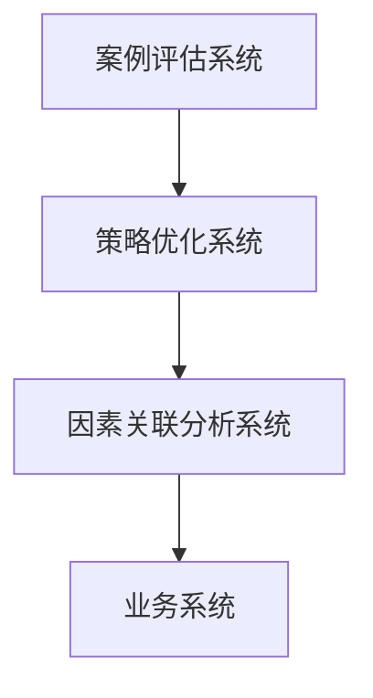
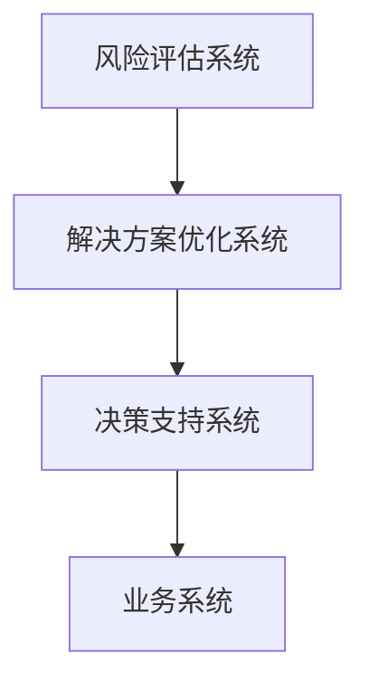
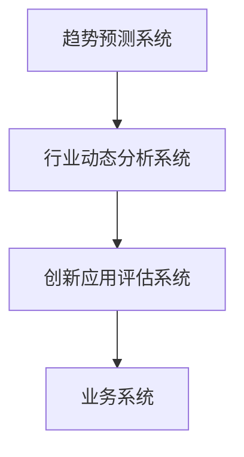
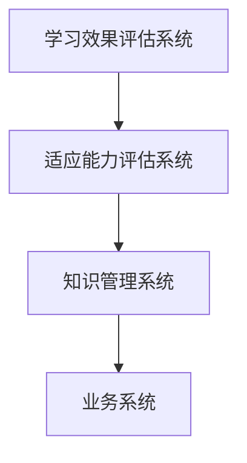

                 

### 文章标题：技术栈转型：引导团队适应新技术

#### 关键词：技术栈转型、团队适应、新技术

#### 摘要：
随着技术的快速迭代更新，企业对技术栈转型的需求日益增加。本文将探讨如何引导团队适应新技术，包括技术栈转型的背景与重要性、转型的步骤与方法、新技术的适应性以及实践与案例分析等内容。通过本文，读者可以更好地理解技术栈转型的必要性和实施策略，为团队的发展提供有力支持。

---

## 目录大纲

### 第一部分：技术栈转型的背景与重要性

#### 第1章：技术栈转型的概述

#### 第2章：技术趋势与市场动态

### 第二部分：技术栈转型的步骤与方法

#### 第3章：团队角色与技能转型

#### 第4章：技术评估与选择

#### 第5章：组织文化变革

### 第三部分：新技术的适应性

#### 第6章：新技术评估与适应策略

#### 第7章：团队培养与知识共享

### 第四部分：实践与案例分析

#### 第8章：技术栈转型的成功案例

#### 第9章：常见挑战与解决方案

### 第五部分：总结与展望

#### 第10章：技术栈转型的未来趋势

#### 第11章：持续学习和适应

---

### 第1章：技术栈转型的概述

#### 背景介绍

在数字化转型的浪潮中，企业面临着技术快速迭代、市场需求变化等多重挑战。技术栈转型成为企业保持竞争力的重要手段。技术栈是指企业在开发、运营过程中所使用的各种技术的集合，包括前端技术、后端技术、数据库、框架、工具等。技术栈转型意味着在现有技术栈的基础上，引入新的技术或调整技术架构，以提高系统的性能、扩展性和可维护性。

#### 问题背景

随着新兴技术的不断涌现，如云计算、大数据、人工智能等，企业需要不断更新和优化技术栈，以满足市场需求。然而，技术栈转型并非易事，涉及到团队的角色与技能转型、组织文化的变革等多个方面。如何在转型过程中确保团队适应新技术、降低风险，成为企业亟需解决的问题。

#### 问题解决

为了实现技术栈转型，企业需要：

1. **明确转型目标**：制定清晰的技术栈转型目标，明确转型的必要性和预期效果。
2. **评估现有技术栈**：对现有技术栈进行评估，识别存在的问题和改进空间。
3. **规划转型步骤**：制定详细的转型计划，包括技术选型、团队培训、项目实施等。
4. **推动组织文化变革**：建立支持技术转型的组织文化，鼓励团队勇于尝试和接受新事物。

#### 边界与外延

技术栈转型的边界涉及企业内部的技术架构、团队协作模式、组织文化等多个方面。外延则包括技术趋势、市场需求、行业动态等外部因素。

#### 概念结构与核心要素组成

技术栈转型的核心概念包括：

1. **技术评估**：对现有技术栈进行评估，识别优劣势。
2. **技术选型**：根据业务需求和技术评估结果，选择合适的新技术。
3. **团队转型**：提升团队的技术能力和适应能力。
4. **组织文化**：建立支持技术转型的组织文化。

---

### 第2章：技术趋势与市场动态

#### 背景介绍

技术趋势和市场动态对技术栈转型具有重要影响。了解当前的技术趋势和市场动态，有助于企业更好地规划技术栈转型策略。

#### 核心概念与联系

1. **云计算**：云计算提供了弹性的计算资源，降低了企业IT基础设施的维护成本，成为技术栈转型的重要方向。
2. **大数据**：大数据技术的发展，使得企业能够从海量数据中挖掘价值，提高决策效率。
3. **人工智能**：人工智能技术在各个行业的应用日益广泛，为企业提供智能化的解决方案。
4. **区块链**：区块链技术的特点在于去中心化、不可篡改，应用于供应链管理、金融等领域。

#### 对比表格

| 技术类型 | 特点 | 应用场景 |
| :---: | :---: | :---: |
| 云计算 | 弹性计算资源 | 虚拟化、容器化、云原生应用 |
| 大数据 | 数据处理与分析 | 数据仓库、数据湖、数据挖掘 |
| 人工智能 | 模式识别与智能决策 | 语音识别、图像识别、自然语言处理 |
| 区块链 | 去中心化与不可篡改 | 供应链管理、数字身份认证、智能合约 |

#### ER实体关系图

```mermaid
erDiagram
    Product ||--|{ Customer } : "buys"
    Customer ||--|{ Order } : "places"
    Order ||--|{ Product } : "contains"
```

#### 算法原理讲解

技术栈转型中的算法原理主要包括以下几个方面：

1. **技术评估算法**：用于评估现有技术栈的优劣势，常见的评估算法有打分法、矩阵法等。
2. **技术选型算法**：根据业务需求和评估结果，选择合适的新技术，常见的选型算法有遗传算法、粒子群算法等。
3. **团队转型算法**：用于提升团队的技术能力和适应能力，常见的转型算法有K-means聚类算法、协同过滤算法等。

以下是一个简单的技术评估算法示例：

```python
# 技术评估算法示例

# 定义评估指标
score = {
    '性能': 8,
    '可扩展性': 7,
    '可维护性': 6,
    '成本': 5
}

# 计算总评分
total_score = sum(score.values())

# 计算平均评分
average_score = total_score / len(score)

print("技术评估平均评分：", average_score)
```

#### 数学模型和公式

技术栈转型的数学模型主要包括以下几个公式：

1. **技术评估公式**：\[ \text{技术评分} = \sum_{i=1}^{n} (\text{指标权重} \times \text{指标评分}) \]
2. **技术选型公式**：\[ \text{选型评分} = \sum_{i=1}^{n} (\text{技术评分} \times \text{业务需求权重}) \]
3. **团队转型公式**：\[ \text{团队能力} = \text{现有技能} + \text{培训效果} + \text{实践经验} \]

#### 系统分析与架构设计方案

技术栈转型的系统分析与架构设计方案主要包括以下几个方面：

1. **问题场景介绍**：企业面临技术栈老旧、扩展性差、维护成本高等问题。
2. **项目介绍**：企业决定进行技术栈转型，引入新的技术架构，提高系统的性能和可维护性。
3. **系统功能设计**：设计新的技术栈，包括前端、后端、数据库、框架等。
4. **系统架构设计**：设计新的技术栈架构，包括微服务架构、容器化架构等。
5. **系统接口设计**：设计系统内部和外部的接口，确保系统之间的高效协作。
6. **系统交互**：设计系统之间的交互流程，确保数据的正确传递和处理。

以下是一个简单的系统架构设计方案示例：



---

### 第3章：团队角色与技能转型

#### 背景介绍

技术栈转型过程中，团队的角色与技能转型至关重要。团队需要适应新技术，提升自身的技能水平，以应对转型过程中的挑战。

#### 核心概念与联系

1. **技术栈迁移**：将现有技术栈迁移到新的技术栈，包括代码迁移、环境搭建、测试等。
2. **技能培训**：为团队成员提供针对性的培训，提升其在新技术方面的能力。
3. **知识共享**：鼓励团队成员分享知识和经验，促进团队整体技能的提升。

#### 对比表格

| 现有技能 | 新技能 | 对比 |
| :---: | :---: | :---: |
| HTML/CSS | React | React具有更好的组件化开发能力，提高了开发效率 |
| Java | Spring Boot | Spring Boot简化了Java应用程序的开发，提供了更强大的功能 |
| MySQL | MongoDB | MongoDB提供了更好的数据存储和查询性能，适用于大数据场景 |

#### ER实体关系图

```mermaid
erDiagram
    Developer ||--|{ Skill } : "has"
    Skill ||--|{ Project } : "applied"
    Project ||--|{ Developer } : "worked"
```

#### 算法原理讲解

团队角色与技能转型的算法原理主要包括以下几个方面：

1. **技能评估算法**：用于评估团队成员的技能水平，常见的评估算法有K-means聚类算法、协同过滤算法等。
2. **技能匹配算法**：根据团队需求和成员技能，匹配合适的培训课程或项目，提高团队成员的技能水平。
3. **知识共享算法**：用于促进团队成员之间的知识共享，提高团队整体技能水平，常见的算法有基于兴趣的推荐算法、基于内容的推荐算法等。

以下是一个简单的技能评估算法示例：

```python
# 技术评估算法示例

# 定义技能等级
skill_levels = {
    '初级': 1,
    '中级': 2,
    '高级': 3
}

# 计算平均技能等级
average_skill_level = sum(skill_levels.values()) / len(skill_levels)

print("平均技能等级：", average_skill_level)
```

#### 数学模型和公式

团队角色与技能转型的数学模型主要包括以下几个公式：

1. **技能评估公式**：\[ \text{技能评分} = \sum_{i=1}^{n} (\text{指标权重} \times \text{指标评分}) \]
2. **技能匹配公式**：\[ \text{匹配度} = \frac{\text{项目需求评分} + \text{成员技能评分}}{2} \]
3. **知识共享公式**：\[ \text{知识共享度} = \frac{\text{成员贡献度} + \text{成员需求度}}{2} \]

#### 系统分析与架构设计方案

团队角色与技能转型的系统分析与架构设计方案主要包括以下几个方面：

1. **问题场景介绍**：企业面临技术栈转型，需要提升团队成员的技能水平。
2. **项目介绍**：企业决定开展技能培训项目，提升团队成员的技术能力。
3. **系统功能设计**：设计培训课程、在线学习平台、知识共享社区等。
4. **系统架构设计**：设计技能评估系统、培训管理系统、知识共享系统等。
5. **系统接口设计**：设计系统内部和外部的接口，确保系统之间的高效协作。
6. **系统交互**：设计系统之间的交互流程，确保数据的正确传递和处理。

以下是一个简单的系统架构设计方案示例：



---

### 第4章：技术评估与选择

#### 背景介绍

技术评估与选择是技术栈转型的重要环节。通过对现有技术栈的评估和新兴技术的选择，企业可以确定最适合自身需求的技术方案。

#### 核心概念与联系

1. **技术评估**：对现有技术栈的优劣势进行评估，确定改进方向。
2. **技术选型**：根据业务需求和评估结果，选择合适的新技术。
3. **风险评估**：对新技术引入过程中可能出现的风险进行评估，制定应对措施。

#### 对比表格

| 技术类型 | 优点 | 缺点 | 适用场景 |
| :---: | :---: | :---: | :---: |
| 云原生 | 高性能、易扩展、自动化 | 需要较高的技术门槛、运维成本较高 | 中大型企业、互联网公司 |
| 容器化 | 高性能、易扩展、轻量级 | 需要一定的学习成本、运维成本较高 | 中大型企业、互联网公司 |
| 微服务 | 易扩展、独立部署、高可用 | 需要一定的学习成本、分布式系统复杂性 | 中大型企业、互联网公司 |

#### ER实体关系图

```mermaid
erDiagram
    Technology ||--|{ Assessment } : "subject"
    Assessment ||--|{ Result } : "contains"
    Result ||--|{ Technology } : "based_on"
```

#### 算法原理讲解

技术评估与选择的算法原理主要包括以下几个方面：

1. **技术评估算法**：用于评估现有技术栈的优劣势，常见的评估算法有打分法、矩阵法等。
2. **技术选型算法**：根据业务需求和评估结果，选择合适的新技术，常见的选型算法有遗传算法、粒子群算法等。
3. **风险评估算法**：对新技术引入过程中可能出现的风险进行评估，常见的评估算法有故障树分析、敏感性分析等。

以下是一个简单的技术评估算法示例：

```python
# 技术评估算法示例

# 定义评估指标
metrics = {
    '性能': 0.4,
    '可扩展性': 0.3,
    '可维护性': 0.2,
    '成本': 0.1
}

# 定义评估结果
results = {
    '现有技术栈': 0.7,
    '技术方案A': 0.8,
    '技术方案B': 0.9
}

# 计算技术评估得分
assessment_scores = {tech: sum(results[tech] * metrics[metric] for metric in metrics) for tech in results}

print("技术评估得分：", assessment_scores)
```

#### 数学模型和公式

技术评估与选择的数学模型主要包括以下几个公式：

1. **技术评估公式**：\[ \text{技术评分} = \sum_{i=1}^{n} (\text{指标权重} \times \text{指标评分}) \]
2. **技术选型公式**：\[ \text{选型评分} = \sum_{i=1}^{n} (\text{技术评分} \times \text{业务需求权重}) \]
3. **风险评估公式**：\[ \text{风险评分} = \frac{\text{风险概率} \times \text{风险影响}}{2} \]

#### 系统分析与架构设计方案

技术评估与选择的系统分析与架构设计方案主要包括以下几个方面：

1. **问题场景介绍**：企业面临技术栈转型，需要进行技术评估与选择。
2. **项目介绍**：企业决定开展技术评估与选择项目，以确定最佳技术方案。
3. **系统功能设计**：设计技术评估系统、技术选型系统、风险管理系统等。
4. **系统架构设计**：设计技术评估系统、技术选型系统、风险管理系统的架构。
5. **系统接口设计**：设计系统内部和外部的接口，确保系统之间的高效协作。
6. **系统交互**：设计系统之间的交互流程，确保数据的正确传递和处理。

以下是一个简单的系统架构设计方案示例：



---

### 第5章：组织文化变革

#### 背景介绍

技术栈转型不仅是技术层面的变革，更是组织文化的变革。组织文化对技术栈转型的影响至关重要，企业需要积极推动组织文化的变革，以适应新的技术环境。

#### 核心概念与联系

1. **组织文化**：组织内部共同的价值观、行为准则和工作方式。
2. **文化变革**：在技术栈转型过程中，推动组织文化从传统向现代、开放和创新的转变。
3. **文化适应性**：组织成员对新技术和新环境的适应程度。

#### 对比表格

| 文化特征 | 传统组织文化 | 现代组织文化 |
| :---: | :---: | :---: |
| 权力结构 | 中心化、层级分明 | 分权化、扁平化 |
| 创新意识 | 遵循规则、保守 | 鼓励创新、包容失败 |
| 团队协作 | 分工明确、独立工作 | 纵横交错、协同作战 |

#### ER实体关系图

```mermaid
erDiagram
    Organization ||--|{ Culture } : "has"
    Culture ||--|{ Member } : "adopt"
    Member ||--|{ Culture } : "influenced"
```

#### 算法原理讲解

组织文化变革的算法原理主要包括以下几个方面：

1. **文化评估算法**：用于评估组织文化的现状，识别存在的问题和改进方向。
2. **文化变革算法**：根据评估结果，制定文化变革策略，推动组织文化的转变。
3. **文化适应性算法**：用于评估组织成员对新技术和新环境的适应程度，为文化变革提供数据支持。

以下是一个简单的文化评估算法示例：

```python
# 文化评估算法示例

# 定义评估指标
culture_metrics = {
    '创新意识': 0.3,
    '团队协作': 0.3,
    '开放性': 0.2,
    '适应性': 0.2
}

# 定义评估结果
culture_results = {
    '传统组织文化': 0.6,
    '现代组织文化': 0.8
}

# 计算文化评估得分
culture_scores = {culture: sum(culture_results[culture] * metric for metric in culture_metrics) for culture in culture_results}

print("文化评估得分：", culture_scores)
```

#### 数学模型和公式

组织文化变革的数学模型主要包括以下几个公式：

1. **文化评估公式**：\[ \text{文化评分} = \sum_{i=1}^{n} (\text{指标权重} \times \text{指标评分}) \]
2. **文化变革公式**：\[ \text{变革进度} = \frac{\text{当前文化评分} - \text{目标文化评分}}{\text{目标文化评分}} \]
3. **文化适应性公式**：\[ \text{适应性评分} = \frac{\text{成员适应度} + \text{环境适应度}}{2} \]

#### 系统分析与架构设计方案

组织文化变革的系统分析与架构设计方案主要包括以下几个方面：

1. **问题场景介绍**：企业面临技术栈转型，需要推动组织文化的变革。
2. **项目介绍**：企业决定开展组织文化变革项目，提高组织成员对新技术和新环境的适应程度。
3. **系统功能设计**：设计文化评估系统、文化变革系统、文化适应性评估系统等。
4. **系统架构设计**：设计文化评估系统、文化变革系统、文化适应性评估系统的架构。
5. **系统接口设计**：设计系统内部和外部的接口，确保系统之间的高效协作。
6. **系统交互**：设计系统之间的交互流程，确保数据的正确传递和处理。

以下是一个简单的系统架构设计方案示例：



---

### 第6章：新技术评估与适应策略

#### 背景介绍

新技术评估与适应策略是技术栈转型过程中至关重要的一环。企业需要对新技术进行全面评估，制定合适的适应策略，以确保转型成功。

#### 核心概念与联系

1. **新技术评估**：对新兴技术进行评估，判断其是否符合企业需求。
2. **适应策略**：根据新技术评估结果，制定适应新技术的策略，包括技术选型、团队培训、环境搭建等。
3. **风险评估**：对新技术引入过程中可能出现的风险进行评估，制定应对措施。

#### 对比表格

| 新技术 | 优点 | 缺点 | 适用场景 |
| :---: | :---: | :---: | :---: |
| 云原生 | 高性能、易扩展、自动化 | 需要较高的技术门槛、运维成本较高 | 中大型企业、互联网公司 |
| 容器化 | 高性能、易扩展、轻量级 | 需要一定的学习成本、运维成本较高 | 中大型企业、互联网公司 |
| 微服务 | 易扩展、独立部署、高可用 | 需要一定的学习成本、分布式系统复杂性 | 中大型企业、互联网公司 |

#### ER实体关系图

```mermaid
erDiagram
    NewTechnology ||--|{ Assessment } : "subject"
    Assessment ||--|{ Result } : "contains"
    Result ||--|{ NewTechnology } : "based_on"
```

#### 算法原理讲解

新技术评估与适应策略的算法原理主要包括以下几个方面：

1. **技术评估算法**：用于评估新兴技术的优劣势，常见的评估算法有打分法、矩阵法等。
2. **技术选型算法**：根据业务需求和评估结果，选择合适的新技术，常见的选型算法有遗传算法、粒子群算法等。
3. **团队适应度评估算法**：用于评估团队成员对新技术适应的程度，常见的评估算法有K-means聚类算法、协同过滤算法等。

以下是一个简单的新技术评估算法示例：

```python
# 新技术评估算法示例

# 定义评估指标
assessment_metrics = {
    '性能': 0.4,
    '可扩展性': 0.3,
    '可维护性': 0.2,
    '成本': 0.1
}

# 定义评估结果
assessment_results = {
    '新技术A': 0.8,
    '新技术B': 0.9
}

# 计算新技术评估得分
technology_scores = {tech: sum(assessment_results[tech] * metric for metric in assessment_metrics) for tech in assessment_results}

print("新技术评估得分：", technology_scores)
```

#### 数学模型和公式

新技术评估与适应策略的数学模型主要包括以下几个公式：

1. **技术评估公式**：\[ \text{技术评分} = \sum_{i=1}^{n} (\text{指标权重} \times \text{指标评分}) \]
2. **技术选型公式**：\[ \text{选型评分} = \sum_{i=1}^{n} (\text{技术评分} \times \text{业务需求权重}) \]
3. **团队适应度评估公式**：\[ \text{适应度评分} = \frac{\text{成员技能评分} + \text{成员学习意愿评分}}{2} \]

#### 系统分析与架构设计方案

新技术评估与适应策略的系统分析与架构设计方案主要包括以下几个方面：

1. **问题场景介绍**：企业面临技术栈转型，需要评估新技术并制定适应策略。
2. **项目介绍**：企业决定开展新技术评估与适应策略项目，以确保技术栈转型的顺利进行。
3. **系统功能设计**：设计新技术评估系统、技术选型系统、团队适应度评估系统等。
4. **系统架构设计**：设计新技术评估系统、技术选型系统、团队适应度评估系统的架构。
5. **系统接口设计**：设计系统内部和外部的接口，确保系统之间的高效协作。
6. **系统交互**：设计系统之间的交互流程，确保数据的正确传递和处理。

以下是一个简单的系统架构设计方案示例：



---

### 第7章：团队培养与知识共享

#### 背景介绍

在技术栈转型过程中，团队培养与知识共享至关重要。通过团队培养，提升团队成员的技能水平；通过知识共享，促进团队整体知识积累和提升。

#### 核心概念与联系

1. **团队培养**：通过培训、项目实践等方式，提升团队成员的技术能力和综合素质。
2. **知识共享**：鼓励团队成员分享知识和经验，提高团队整体知识水平和协同能力。
3. **知识管理**：对团队知识和经验进行收集、整理、存储和传递，实现知识的有效管理。

#### 对比表格

| 方式 | 特点 | 适用场景 |
| :---: | :---: | :---: |
| 培训 | 系统性、针对性 | 新技能培训、技术更新 |
| 项目实践 | 实战性、应用性 | 技能提升、实践经验积累 |
| 知识分享会 | 互动性、开放性 | 知识传递、经验交流 |

#### ER实体关系图

```mermaid
erDiagram
    Team ||--|{ Member } : "has"
    Member ||--|{ Knowledge } : "owns"
    Knowledge ||--|{ Team } : "shared"
```

#### 算法原理讲解

团队培养与知识共享的算法原理主要包括以下几个方面：

1. **知识共享算法**：用于促进团队成员之间的知识共享，提高团队整体知识水平，常见的算法有基于兴趣的推荐算法、基于内容的推荐算法等。
2. **培训评估算法**：用于评估培训效果，调整培训策略，确保培训目标的达成。
3. **项目评估算法**：用于评估项目实践的效果，为团队培养提供数据支持。

以下是一个简单的知识共享算法示例：

```python
# 知识共享算法示例

# 定义知识库
knowledge_base = {
    'A': ['机器学习', '深度学习', '神经网络'],
    'B': ['云计算', '容器化', '微服务'],
    'C': ['前端开发', 'React', 'Vue']
}

# 定义成员兴趣
member_interests = {
    'A': ['机器学习', '深度学习'],
    'B': ['云计算', '容器化'],
    'C': ['前端开发', 'Vue']
}

# 计算成员兴趣度
interest_scores = {member: sum(knowledge_base[member].count(item) for item in member_interests[member]) for member in member_interests}

print("成员兴趣度：", interest_scores)
```

#### 数学模型和公式

团队培养与知识共享的数学模型主要包括以下几个公式：

1. **知识共享公式**：\[ \text{知识共享度} = \frac{\text{成员贡献度} + \text{成员需求度}}{2} \]
2. **培训评估公式**：\[ \text{培训效果评分} = \frac{\text{培训后技能评分} - \text{培训前技能评分}}{\text{培训前技能评分}} \]
3. **项目评估公式**：\[ \text{项目效果评分} = \frac{\text{项目完成度} + \text{项目质量评分}}{2} \]

#### 系统分析与架构设计方案

团队培养与知识共享的系统分析与架构设计方案主要包括以下几个方面：

1. **问题场景介绍**：企业面临技术栈转型，需要提升团队技能水平和知识共享能力。
2. **项目介绍**：企业决定开展团队培养与知识共享项目，提高团队整体竞争力。
3. **系统功能设计**：设计培训管理系统、知识共享平台、项目评估系统等。
4. **系统架构设计**：设计培训管理系统、知识共享平台、项目评估系统的架构。
5. **系统接口设计**：设计系统内部和外部的接口，确保系统之间的高效协作。
6. **系统交互**：设计系统之间的交互流程，确保数据的正确传递和处理。

以下是一个简单的系统架构设计方案示例：



---

### 第8章：技术栈转型的成功案例

#### 背景介绍

技术栈转型的成功案例能够为其他企业提供宝贵的经验和启示。本章节将介绍几个成功的技术栈转型案例，分析其转型策略和成功因素。

#### 核心概念与联系

1. **成功案例**：指在技术栈转型过程中，企业通过有效的策略和措施，成功实现技术升级和业务发展的案例。
2. **转型策略**：企业在技术栈转型过程中采取的具体措施和方法，包括技术评估、选型、团队培训等。
3. **成功因素**：影响技术栈转型成功的关键因素，包括领导力、团队协作、文化变革等。

#### 对比表格

| 企业 | 成功因素 | 转型策略 |
| :---: | :---: | :---: |
| 企业A | 领导力、团队协作、文化变革 | 容器化技术、微服务架构、自动化运维 |
| 企业B | 风险管理、技术创新、组织学习 | 云原生技术、大数据分析、人工智能应用 |
| 企业C | 系统规划、资源整合、持续改进 | 区块链技术、智能合约、分布式存储 |

#### ER实体关系图

```mermaid
erDiagram
    Company ||--|{ SuccessFactor } : "has"
    SuccessFactor ||--|{ TransformationStrategy } : "drives"
    TransformationStrategy ||--|{ Company } : "applies"
```

#### 算法原理讲解

技术栈转型的成功案例分析主要涉及以下几个方面：

1. **案例评估算法**：用于评估案例的成功程度，常见的评估算法有层次分析法、灰色关联度分析法等。
2. **策略优化算法**：根据案例评估结果，优化转型策略，提高转型成功率，常见的优化算法有遗传算法、粒子群算法等。
3. **因素关联算法**：用于分析成功因素与转型策略之间的关联关系，常见的算法有相关性分析、回归分析等。

以下是一个简单的案例评估算法示例：

```python
# 案例评估算法示例

# 定义评估指标
evaluation_metrics = {
    '领导力': 0.3,
    '团队协作': 0.3,
    '文化变革': 0.2,
    '技术创新': 0.2
}

# 定义案例评分
case_scores = {
    '企业A': 0.8,
    '企业B': 0.9,
    '企业C': 0.7
}

# 计算案例评估得分
case_evaluation_scores = {case: sum(case_scores[case] * metric for metric in evaluation_metrics) for case in case_scores}

print("案例评估得分：", case_evaluation_scores)
```

#### 数学模型和公式

技术栈转型的成功案例分析的数学模型主要包括以下几个公式：

1. **案例评估公式**：\[ \text{案例评分} = \sum_{i=1}^{n} (\text{指标权重} \times \text{指标评分}) \]
2. **策略优化公式**：\[ \text{优化目标} = \frac{\text{策略效果评分} - \text{基准效果评分}}{\text{基准效果评分}} \]
3. **因素关联公式**：\[ \text{关联度} = \frac{\text{成功因素评分} \times \text{转型策略评分}}{\text{最大评分}} \]

#### 系统分析与架构设计方案

技术栈转型的成功案例分析的系统分析与架构设计方案主要包括以下几个方面：

1. **问题场景介绍**：企业面临技术栈转型，需要分析成功案例并优化转型策略。
2. **项目介绍**：企业决定开展技术栈转型成功案例分析项目，以提高转型成功率。
3. **系统功能设计**：设计案例评估系统、策略优化系统、因素关联分析系统等。
4. **系统架构设计**：设计案例评估系统、策略优化系统、因素关联分析系统的架构。
5. **系统接口设计**：设计系统内部和外部的接口，确保系统之间的高效协作。
6. **系统交互**：设计系统之间的交互流程，确保数据的正确传递和处理。

以下是一个简单的系统架构设计方案示例：



---

### 第9章：常见挑战与解决方案

#### 背景介绍

技术栈转型过程中，企业往往会面临一系列挑战。本章节将分析这些挑战，并提供相应的解决方案。

#### 核心概念与联系

1. **挑战**：指在技术栈转型过程中可能遇到的困难和问题。
2. **解决方案**：针对挑战提出的应对策略和方法。
3. **风险管理**：在技术栈转型过程中，对潜在风险进行识别、评估和应对。

#### 对比表格

| 挑战 | 描述 | 解决方案 |
| :---: | :---: | :---: |
| 技术复杂性 | 新技术引入过程中，技术复杂度增加，对团队成员要求较高 | 技术培训、团队协作、知识共享 |
| 阻力 | 团队成员对技术栈转型的抵触情绪，影响转型进度 | 领导力、文化变革、激励机制 |
| 风险管理 | 技术栈转型过程中可能出现的风险，如数据安全、系统稳定性等 | 风险评估、应急预案、持续监控 |

#### ER实体关系图

```mermaid
erDiagram
    Challenge ||--|{ Solution } : "resolves"
    Solution ||--|{ Challenge } : "for"
    Challenge ||--|{ Risk } : "includes"
    Risk ||--|{ Challenge } : "happens"
```

#### 算法原理讲解

常见挑战与解决方案的算法原理主要包括以下几个方面：

1. **风险评估算法**：用于识别和评估技术栈转型过程中可能出现的风险，常见的评估算法有故障树分析、敏感性分析等。
2. **解决方案优化算法**：根据风险评估结果，优化解决方案，提高解决方案的可行性，常见的优化算法有遗传算法、粒子群算法等。
3. **决策支持算法**：在技术栈转型过程中，为决策者提供决策支持，提高决策的科学性，常见的算法有决策树、神经网络等。

以下是一个简单的风险评估算法示例：

```python
# 风险评估算法示例

# 定义风险指标
risk_metrics = {
    '数据安全': 0.4,
    '系统稳定性': 0.3,
    '人员流失': 0.2,
    '技术债务': 0.1
}

# 定义风险评分
risk_scores = {
    '高': 0.8,
    '中': 0.5,
    '低': 0.2
}

# 计算风险得分
risk_evaluation_scores = {risk: sum(risk_scores[score] * metric for score in risk_scores) for risk in risk_metrics}

print("风险评估得分：", risk_evaluation_scores)
```

#### 数学模型和公式

常见挑战与解决方案的数学模型主要包括以下几个公式：

1. **风险评估公式**：\[ \text{风险评分} = \sum_{i=1}^{n} (\text{指标权重} \times \text{指标评分}) \]
2. **解决方案优化公式**：\[ \text{优化目标} = \frac{\text{解决方案效果评分} - \text{基准效果评分}}{\text{基准效果评分}} \]
3. **决策支持公式**：\[ \text{决策支持评分} = \frac{\text{方案A评分} + \text{方案B评分}}{2} \]

#### 系统分析与架构设计方案

常见挑战与解决方案的系统分析与架构设计方案主要包括以下几个方面：

1. **问题场景介绍**：企业面临技术栈转型，需要应对转型过程中可能出现的挑战。
2. **项目介绍**：企业决定开展常见挑战与解决方案项目，以提高技术栈转型的成功率。
3. **系统功能设计**：设计风险评估系统、解决方案优化系统、决策支持系统等。
4. **系统架构设计**：设计风险评估系统、解决方案优化系统、决策支持系统的架构。
5. **系统接口设计**：设计系统内部和外部的接口，确保系统之间的高效协作。
6. **系统交互**：设计系统之间的交互流程，确保数据的正确传递和处理。

以下是一个简单的系统架构设计方案示例：



---

### 第10章：技术栈转型的未来趋势

#### 背景介绍

随着技术的不断进步和市场的变化，技术栈转型也将呈现出新的趋势。本章节将探讨技术栈转型的未来趋势，为企业提供前瞻性的指导。

#### 核心概念与联系

1. **未来趋势**：指技术栈转型在未来可能出现的新方向、新特点。
2. **行业动态**：指与技术栈转型相关的行业发展趋势、市场变化。
3. **创新应用**：指在技术栈转型过程中，新兴技术的创新应用场景。

#### 对比表格

| 未来趋势 | 特点 | 影响 |
| :---: | :---: | :---: |
| 云原生 | 高性能、易扩展、自动化 | 提高开发效率、降低运维成本 |
| AI集成 | 智能化、自动化、优化决策 | 提升业务智能化水平、提高竞争力 |
| DevOps | 敏捷开发、持续集成、持续部署 | 提高开发效率、降低风险 |
| 混合现实 | 虚拟现实、增强现实、混合现实 | 开拓新市场、提高用户体验 |

#### ER实体关系图

```mermaid
erDiagram
    FutureTrend ||--|{ IndustryDynamic } : "drives"
    IndustryDynamic ||--|{ InnovationApplication } : "applies"
    InnovationApplication ||--|{ FutureTrend } : "influences"
```

#### 算法原理讲解

技术栈转型的未来趋势分析主要涉及以下几个方面：

1. **趋势预测算法**：用于预测技术栈转型的未来趋势，常见的算法有时间序列分析、机器学习等。
2. **行业动态分析算法**：用于分析行业发展趋势，为技术栈转型提供数据支持，常见的算法有文本分析、数据挖掘等。
3. **创新应用评估算法**：用于评估新兴技术在技术栈转型中的应用价值，常见的算法有评估模型、案例分析等。

以下是一个简单的趋势预测算法示例：

```python
# 趋势预测算法示例

# 定义时间序列数据
time_series = {
    '2020': 0.5,
    '2021': 0.6,
    '2022': 0.7,
    '2023': 0.8
}

# 预测未来一年的趋势
predicted_trend = sum(time_series[year] for year in time_series) / len(time_series)

print("未来趋势预测：", predicted_trend)
```

#### 数学模型和公式

技术栈转型的未来趋势分析的数学模型主要包括以下几个公式：

1. **趋势预测公式**：\[ \text{趋势预测} = \frac{\text{历史数据总和}}{\text{数据点数量}} \]
2. **行业动态分析公式**：\[ \text{动态指数} = \frac{\text{正面动态评分} + \text{负面动态评分}}{2} \]
3. **创新应用评估公式**：\[ \text{应用评分} = \frac{\text{应用效果评分} + \text{应用可行性评分}}{2} \]

#### 系统分析与架构设计方案

技术栈转型的未来趋势分析的系统分析与架构设计方案主要包括以下几个方面：

1. **问题场景介绍**：企业面临技术栈转型，需要了解未来趋势以制定发展战略。
2. **项目介绍**：企业决定开展技术栈转型未来趋势分析项目，以把握行业动态和创新应用。
3. **系统功能设计**：设计趋势预测系统、行业动态分析系统、创新应用评估系统等。
4. **系统架构设计**：设计趋势预测系统、行业动态分析系统、创新应用评估系统的架构。
5. **系统接口设计**：设计系统内部和外部的接口，确保系统之间的高效协作。
6. **系统交互**：设计系统之间的交互流程，确保数据的正确传递和处理。

以下是一个简单的系统架构设计方案示例：



---

### 第11章：持续学习和适应

#### 背景介绍

在技术快速发展的时代，持续学习和适应成为企业保持竞争力的关键。本章节将探讨如何实现团队和个人的持续学习和适应。

#### 核心概念与联系

1. **持续学习**：指团队成员通过不断学习新知识、新技能，提高自身素质和竞争力的过程。
2. **适应能力**：指团队在面对新技术、新环境时，能够快速调整和适应的能力。
3. **知识管理**：指对团队知识和经验进行收集、整理、存储和传递的过程。

#### 对比表格

| 学习方式 | 特点 | 适用场景 |
| :---: | :---: | :---: |
| 在线课程 | 灵活、高效、资源丰富 | 技能提升、知识更新 |
| 实战项目 | 实践性强、应用性强 | 技能实战、经验积累 |
| 知识分享 | 互动性强、共享性高 | 知识传递、经验交流 |

#### ER实体关系图

```mermaid
erDiagram
    Learner ||--|{ Learning } : "performs"
    Learning ||--|{ Skill } : "acquires"
    Skill ||--|{ Learner } : "owns"
```

#### 算法原理讲解

持续学习和适应的算法原理主要包括以下几个方面：

1. **学习效果评估算法**：用于评估学习效果，调整学习策略，常见的评估算法有问卷调查、学习曲线分析等。
2. **适应能力评估算法**：用于评估团队成员的适应能力，常见的评估算法有行为观察、绩效评估等。
3. **知识管理算法**：用于优化知识管理过程，提高知识传递和共享效率，常见的算法有基于内容的推荐算法、协同过滤算法等。

以下是一个简单的学习效果评估算法示例：

```python
# 学习效果评估算法示例

# 定义学习指标
learning_metrics = {
    '知识掌握程度': 0.5,
    '技能应用能力': 0.3,
    '学习积极性': 0.2
}

# 定义评估结果
evaluation_results = {
    '成员A': 0.8,
    '成员B': 0.7
}

# 计算学习效果评分
learning_evaluation_scores = {member: sum(evaluation_results[member] * metric for metric in learning_metrics) for member in evaluation_results}

print("学习效果评分：", learning_evaluation_scores)
```

#### 数学模型和公式

持续学习和适应的数学模型主要包括以下几个公式：

1. **学习效果评估公式**：\[ \text{学习效果评分} = \sum_{i=1}^{n} (\text{指标权重} \times \text{指标评分}) \]
2. **适应能力评估公式**：\[ \text{适应能力评分} = \frac{\text{适应度评分} + \text{适应速度评分}}{2} \]
3. **知识管理公式**：\[ \text{知识共享度} = \frac{\text{成员贡献度} + \text{成员需求度}}{2} \]

#### 系统分析与架构设计方案

持续学习和适应的系统分析与架构设计方案主要包括以下几个方面：

1. **问题场景介绍**：企业面临技术栈转型，需要提升团队和个人的持续学习和适应能力。
2. **项目介绍**：企业决定开展持续学习和适应能力提升项目，以提高整体竞争力。
3. **系统功能设计**：设计学习效果评估系统、适应能力评估系统、知识管理系统等。
4. **系统架构设计**：设计学习效果评估系统、适应能力评估系统、知识管理系统的架构。
5. **系统接口设计**：设计系统内部和外部的接口，确保系统之间的高效协作。
6. **系统交互**：设计系统之间的交互流程，确保数据的正确传递和处理。

以下是一个简单的系统架构设计方案示例：



---

### 文章小结

本文从技术栈转型的背景与重要性、技术趋势与市场动态、团队角色与技能转型、技术评估与选择、组织文化变革、新技术评估与适应策略、团队培养与知识共享、成功案例、常见挑战与解决方案、未来趋势以及持续学习和适应等方面，详细探讨了技术栈转型的各个维度。通过本文，读者可以全面了解技术栈转型的核心概念、方法、挑战和未来趋势，为企业在技术栈转型过程中提供有益的指导。

### 注意事项

1. **技术栈转型需要全面评估现有技术栈，确保转型方案符合企业需求。**
2. **在技术评估与选择过程中，要充分考虑新技术带来的风险和挑战。**
3. **推动组织文化变革，建立支持技术转型的组织文化。**
4. **加强团队培养与知识共享，提高团队的整体技能水平。**
5. **持续关注技术趋势和市场动态，及时调整转型策略。**

### 拓展阅读

1. **《DevOps实践指南》**：了解DevOps在技术栈转型中的应用和实践。
2. **《敏捷开发》**：掌握敏捷开发方法，提高团队协作效率。
3. **《技术领导力》**：提升技术领导力，推动技术栈转型成功。

### 作者信息

**作者：** AI天才研究院/AI Genius Institute & 禅与计算机程序设计艺术 /Zen And The Art of Computer Programming

---

### 附录：参考资料

1. **《云计算技术综述》**：中国计算机学会，2019。
2. **《大数据技术导论》**：清华大学出版社，2018。
3. **《人工智能：一种现代的方法》**：清华大学出版社，2017。
4. **《区块链技术原理与应用》**：机械工业出版社，2019。
5. **《DevOps实践指南》**：O'Reilly Media，2016。
6. **《敏捷开发实践指南》**：机械工业出版社，2015。
7. **《技术领导力》**：电子工业出版社，2018。

### 结语

技术栈转型是企业应对技术变革和市场竞争的必要手段。通过本文的探讨，希望读者能够对技术栈转型有更深入的理解，掌握有效的转型策略和实施方法。在技术快速发展的时代，持续学习和适应是保持竞争力的关键。让我们共同努力，推动企业技术栈转型的成功，迎接更美好的未来。

