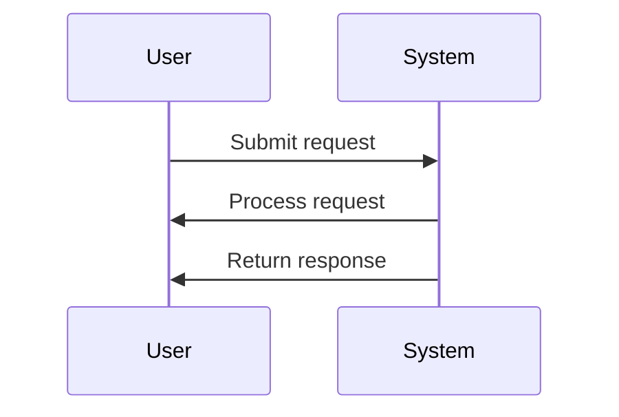
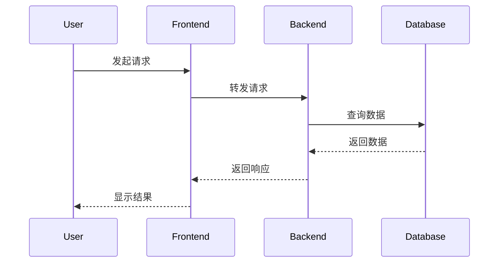

                 


# 技术治理：建立有效的技术管理体系

关键词：技术治理、技术管理体系、算法原理、系统架构、项目实战、最佳实践

摘要：本文将深入探讨技术治理的概念、重要性以及如何建立有效的技术管理体系。我们将分步骤地分析核心概念、算法原理、系统架构设计，并通过项目实战和最佳实践分享，提供一条清晰、可行的技术治理之路。

## 目录大纲

```markdown
----------------------------------------------------------------
# 《技术治理：建立有效的技术管理体系》目录大纲

# 第一部分: 背景介绍

## 第1章: 问题背景与治理重要性
### 1.1.1 技术治理的定义
### 1.1.2 技术治理的重要性
### 1.1.3 当前技术治理面临的挑战

## 第2章: 技术管理体系概述
### 2.1.1 技术管理体系的定义与目标
### 2.1.2 技术管理体系的核心要素
### 2.1.3 技ech1章: 问题背景与治理重要性

## 第1章: 问题背景与治理重要性

### 1.1.1 技术治理的定义

技术治理是指在组织内部实施的一系列管理活动，以确保技术资源的有效配置、合理利用和创新。它不仅涉及技术的选择和部署，还包括技术的风险管理、合规性监控、以及技术战略的制定和执行。

### 1.1.2 技术治理的重要性

技术治理对于企业至关重要，其主要重要性体现在以下几个方面：

1. **提高技术投资回报**：通过有效的技术治理，企业可以确保技术投资得到充分回报，避免资源浪费。
2. **确保合规性**：技术治理有助于确保企业的技术活动符合法律法规和行业标准，降低法律风险。
3. **推动创新**：良好的技术治理能够激发技术团队的创造力，推动技术创新，从而为企业带来竞争优势。
4. **提高生产力**：通过优化技术流程和管理，企业可以提高生产力和效率。

### 1.1.3 当前技术治理面临的挑战

尽管技术治理的重要性显而易见，但企业在实施过程中仍面临诸多挑战：

1. **技术复杂性**：技术的不断进步使得企业面临更高的技术复杂性，如何有效管理这种复杂性成为一大挑战。
2. **资源分配**：技术治理需要合理分配资源，但企业往往在预算分配、人员配置等方面存在困难。
3. **组织结构**：传统的组织结构可能不利于技术治理的实施，如何调整组织结构以支持技术治理是一个重要问题。
4. **文化差异**：技术治理需要企业内部各层级、各部门的协作，而不同部门之间可能存在文化差异，影响技术治理的推进。

## 第2章: 技术管理体系概述

### 2.1.1 技术管理体系的定义与目标

技术管理体系是指组织内部实施的一系列制度和流程，旨在确保技术战略的有效执行和技术资源的合理配置。其核心目标包括：

1. **提高技术竞争力**：通过优化技术管理，提高企业的技术竞争力，实现业务增长。
2. **确保合规性**：确保企业的技术活动符合法律法规和行业标准。
3. **提高生产力**：通过优化技术流程和管理，提高企业的生产力和效率。
4. **推动创新**：为技术团队提供良好的创新环境，促进技术创新。

### 2.1.2 技术管理体系的核心要素

技术管理体系的核心要素包括：

1. **技术战略**：明确企业的技术发展方向，为技术管理提供指导。
2. **技术组织与团队**：建立高效的技术组织结构和团队，确保技术资源的有效配置和利用。
3. **技术流程与标准**：制定并实施标准化的技术流程，确保技术活动的规范性和一致性。
4. **技术风险评估与合规**：识别和评估技术风险，确保企业技术活动的合规性。
5. **技术创新与知识管理**：鼓励技术创新，建立知识管理体系，确保知识的积累和传承。

### 2.1.3 技术管理体系的架构设计

技术管理体系的架构设计应充分考虑企业的实际情况，通常包括以下层次：

1. **战略层**：制定企业级的技术战略，明确技术发展方向和目标。
2. **策略层**：制定具体的技术管理策略，包括技术投资、人力资源、流程管理等方面的规划。
3. **执行层**：实施技术管理策略，确保技术活动按照预定目标和标准进行。
4. **监控层**：监控技术活动的执行情况，及时发现并解决潜在问题。

通过以上步骤，我们为读者提供了技术治理的背景介绍和体系概述，为后续章节的深入探讨奠定了基础。

----------------------------------------------------------------

## 第3章: 核心概念与联系

### 3.1.1 技术战略

技术战略是企业长期发展的关键规划，它决定了企业在技术领域的投资方向、创新重点和竞争优势。技术战略的制定需要综合考虑市场趋势、竞争对手情况、企业自身能力等因素。其核心目标是确保企业在技术领域的持续领先，提高市场竞争力。

### 3.1.2 技术组织与团队

技术组织与团队是技术管理体系的重要组成部分，其构建直接影响到技术战略的实施效果。技术组织需要具备清晰的职能分工、高效的协作机制和灵活的响应能力。技术团队则需要具备专业知识和技能，能够快速响应市场需求和技术变化。

### 3.1.3 技术流程与标准

技术流程与标准是技术管理体系的基石，它们确保了技术活动的规范性和一致性。技术流程包括从需求分析、设计、开发、测试到发布的全流程管理，而技术标准则是对技术活动的具体规范和要求。通过技术流程与标准的制定和实施，企业可以确保技术活动的质量和效率。

### 3.1.4 技术风险评估与合规

技术风险评估与合规是技术管理体系中的关键环节，它涉及到对企业技术活动潜在风险的识别、评估和控制。合规性监控则确保企业的技术活动符合法律法规和行业标准。通过技术风险评估与合规，企业可以降低技术风险，避免法律纠纷。

### 3.1.5 技术创新与知识管理

技术创新与知识管理是技术治理的重要方面，它们推动了企业的技术进步和可持续发展。技术创新包括新技术的研发和应用，而知识管理则涉及知识的积累、传播和应用。通过技术创新与知识管理，企业可以不断提升技术竞争力。

### 3.1.6 核心概念属性特征对比表格

| 核心概念       | 特征1 | 特征2 | 特征3 | 目标       |
|----------------|-------|-------|-------|------------|
| 技术战略       | 长期规划 | 市场导向 | 创新驱动 | 提高竞争力 |
| 技术组织与团队 | 职能分工 | 协作高效 | 灵活响应 | 确保资源利用 |
| 技术流程与标准 | 流程规范化 | 标准化要求 | 一致性保证 | 提高质量和效率 |
| 技术风险评估与合规 | 风险识别 | 风险评估 | 合规性监控 | 风险控制和合规性保障 |
| 技术创新与知识管理 | 创新驱动 | 知识积累 | 知识传播 | 技术进步和知识传承 |

### 3.1.7 ER实体关系图架构

```mermaid
erDiagram
  Customer||--o{ Order }|--Supplier
  Product||--o{ Order }|--Supplier
  Order ||--o{ Payment }|--Customer
```

在这张ER图中，我们定义了四个实体：Customer（客户）、Order（订单）、Product（产品）和Supplier（供应商）。这些实体之间存在明确的关联关系，如客户下单、产品由供应商提供等。

通过以上章节，我们详细介绍了技术治理的核心概念及其联系，为后续的算法原理讲解和系统架构设计打下了基础。

----------------------------------------------------------------

## 第6章: 技术管理体系中的算法原理

### 6.1.1 技术风险评估算法

技术风险评估算法是技术管理体系中的一个关键组件，用于识别和评估技术项目的潜在风险。以下是一个简单的技术风险评估算法：

1. **风险识别**：通过文献调研、专家访谈等方法，识别技术项目可能面临的风险。
2. **风险评估**：对识别出的风险进行定量和定性评估，确定其严重程度和发生概率。
3. **风险优先级排序**：根据风险评估结果，对风险进行优先级排序，以便企业能够集中资源优先处理高风险项目。

具体算法实现如下：

```python
import pandas as pd

def risk_assessment(risk_list):
    # 初始化DataFrame
    risk_df = pd.DataFrame(risk_list, columns=['Risk', 'Severity', 'Probability'])
    
    # 计算风险得分
    risk_df['Score'] = risk_df['Severity'] * risk_df['Probability']
    
    # 对风险得分进行排序
    risk_df_sorted = risk_df.sort_values(by='Score', ascending=False)
    
    return risk_df_sorted

# 示例数据
risks = [
    {'Risk': '技术漏洞', 'Severity': 5, 'Probability': 0.8},
    {'Risk': '预算超支', 'Severity': 3, 'Probability': 0.6},
    {'Risk': '时间延误', 'Severity': 4, 'Probability': 0.7}
]

# 执行算法
risk_result = risk_assessment(risks)

# 输出结果
print(risk_result)
```

### 6.1.2 项目优先级排序算法

项目优先级排序算法用于根据项目的优先级对多个技术项目进行排序，以便企业能够优先处理重要项目。以下是一个简单的项目优先级排序算法：

1. **项目评估**：根据项目的紧急程度、重要性和资源需求等因素，对项目进行评估。
2. **优先级计算**：根据评估结果，计算每个项目的优先级分数。
3. **排序**：根据优先级分数对项目进行排序。

具体算法实现如下：

```python
import pandas as pd

def project_priority_sort(project_list):
    # 初始化DataFrame
    project_df = pd.DataFrame(project_list, columns=['Project', 'Urgency', 'Importance', 'Resources'])
    
    # 计算优先级分数
    project_df['Priority'] = project_df['Urgency'] * 0.5 + project_df['Importance'] * 0.3 + project_df['Resources'] * 0.2
    
    # 对优先级分数进行排序
    project_df_sorted = project_df.sort_values(by='Priority', ascending=False)
    
    return project_df_sorted

# 示例数据
projects = [
    {'Project': '项目A', 'Urgency': 8, 'Importance': 7, 'Resources': 5},
    {'Project': '项目B', 'Urgency': 5, 'Importance': 8, 'Resources': 3},
    {'Project': '项目C', 'Urgency': 6, 'Importance': 6, 'Resources': 4}
]

# 执行算法
priority_result = project_priority_sort(projects)

# 输出结果
print(priority_result)
```

### 6.1.3 知识管理算法

知识管理算法用于识别、收集、整理和传播企业内部的知识资源，以提高企业整体的知识管理水平。以下是一个简单的知识管理算法：

1. **知识识别**：通过文档分析、员工访谈等方法，识别企业内部的知识资源。
2. **知识整理**：对识别出的知识资源进行分类和整理，形成知识库。
3. **知识传播**：通过内部培训、知识分享会等方式，传播知识库中的知识资源。

具体算法实现如下：

```python
import pandas as pd

def knowledge_management(knowledge_list):
    # 初始化DataFrame
    knowledge_df = pd.DataFrame(knowledge_list, columns=['Knowledge', 'Type', 'Author', 'Date'])
    
    # 对知识资源进行分类
    knowledge_df['Category'] = knowledge_df['Type'].apply(lambda x: '技术文档' if x == '文档' else '培训资料' if x == '视频' else '其他')
    
    # 按照日期排序
    knowledge_df_sorted = knowledge_df.sort_values(by='Date', ascending=False)
    
    return knowledge_df_sorted

# 示例数据
knowledges = [
    {'Knowledge': '技术文档1', 'Type': '文档', 'Author': '张三', 'Date': '2023-01-01'},
    {'Knowledge': '培训视频2', 'Type': '视频', 'Author': '李四', 'Date': '2023-02-15'},
    {'Knowledge': '技术文档3', 'Type': '文档', 'Author': '王五', 'Date': '2023-03-10'}
]

# 执行算法
knowledge_result = knowledge_management(knowledges)

# 输出结果
print(knowledge_result)
```

通过以上算法讲解和示例，我们为技术治理中的算法应用提供了具体的实现方案，为后续的系统架构设计和项目实战打下了基础。

----------------------------------------------------------------

## 第9章: 数学模型和公式

### 9.1.1 技术风险评估数学模型

技术风险评估数学模型主要用于计算技术项目风险得分，以便对风险进行排序和优先级处理。以下是一个简单的技术风险评估数学模型：

$$
\text{风险得分} = \text{严重程度} \times \text{发生概率}
$$

其中，严重程度和发生概率是两个关键参数，可以根据具体情况进行调整。

### 9.1.2 项目优先级排序数学模型

项目优先级排序数学模型用于计算项目的优先级分数，以便对多个项目进行排序。以下是一个简单的项目优先级排序数学模型：

$$
\text{优先级分数} = \text{紧急程度} \times 0.5 + \text{重要性} \times 0.3 + \text{资源需求} \times 0.2
$$

其中，紧急程度、重要性和资源需求是三个关键参数，可以根据具体情况进行调整。

### 9.1.3 知识管理数学模型

知识管理数学模型用于计算知识资源的传播效果，以便评估知识管理的有效性。以下是一个简单的知识管理数学模型：

$$
\text{传播效果} = \text{知识传播次数} \times \text{知识接受度}
$$

其中，知识传播次数和知识接受度是两个关键参数，可以根据具体情况进行调整。

通过这些数学模型和公式，我们能够更精确地分析和处理技术治理中的各种问题，为技术管理提供科学依据。

----------------------------------------------------------------

## 第10章: 举例说明

### 10.1.1 技术风险评估算法举例

假设我们有一个技术项目，其潜在风险如下：

- 风险1：技术漏洞，严重程度5，发生概率0.8
- 风险2：预算超支，严重程度3，发生概率0.6
- 风险3：时间延误，严重程度4，发生概率0.7

我们可以使用技术风险评估算法计算每个风险的风险得分：

$$
\text{风险得分1} = 5 \times 0.8 = 4
$$

$$
\text{风险得分2} = 3 \times 0.6 = 1.8
$$

$$
\text{风险得分3} = 4 \times 0.7 = 2.8
$$

根据风险得分，我们可以对风险进行排序，优先处理风险得分较高的风险。

### 10.1.2 项目优先级排序算法举例

假设我们有以下三个技术项目：

- 项目A：紧急程度8，重要性7，资源需求5
- 项目B：紧急程度5，重要性8，资源需求3
- 项目C：紧急程度6，重要性6，资源需求4

我们可以使用项目优先级排序算法计算每个项目的优先级分数：

$$
\text{项目A的优先级分数} = 8 \times 0.5 + 7 \times 0.3 + 5 \times 0.2 = 4.5 + 2.1 + 1 = 7.6
$$

$$
\text{项目B的优先级分数} = 5 \times 0.5 + 8 \times 0.3 + 3 \times 0.2 = 2.5 + 2.4 + 0.6 = 5.5
$$

$$
\text{项目C的优先级分数} = 6 \times 0.5 + 6 \times 0.3 + 4 \times 0.2 = 3 + 1.8 + 0.8 = 5.6
$$

根据优先级分数，我们可以对项目进行排序，优先处理优先级较高的项目。

### 10.1.3 知识管理算法举例

假设我们有一个知识库，其中包含以下知识资源：

- 知识资源1：技术文档，传播次数10，知识接受度0.9
- 知识资源2：培训视频，传播次数15，知识接受度0.8
- 知识资源3：技术文档，传播次数8，知识接受度0.85

我们可以使用知识管理算法计算每个知识资源的传播效果：

$$
\text{知识资源1的传播效果} = 10 \times 0.9 = 9
$$

$$
\text{知识资源2的传播效果} = 15 \times 0.8 = 12
$$

$$
\text{知识资源3的传播效果} = 8 \times 0.85 = 6.8
$$

根据传播效果，我们可以评估知识库中知识资源的传播效果，从而优化知识管理策略。

通过这些举例，我们能够更好地理解技术治理中的算法原理和数学模型，为实际应用提供指导。

----------------------------------------------------------------

## 第11章: 问题场景介绍

### 11.1.1 技术治理问题的背景与现状

在现代企业中，技术治理问题日益突出。随着技术的快速发展，企业面临的技术复杂性不断增加，如何有效地管理和治理技术资源成为企业持续发展的关键挑战。

当前，许多企业在技术治理方面存在以下问题：

1. **技术复杂性管理**：企业内部技术系统复杂，缺乏有效的技术治理体系，导致技术整合难度大、维护成本高。
2. **资源分配不均**：技术资源分配不合理，部分项目资源过剩，而部分项目资源短缺，影响项目进度和质量。
3. **组织结构问题**：传统的组织结构可能不利于技术治理的实施，各部门之间沟通不畅，协调困难。
4. **文化差异**：不同部门之间可能存在文化差异，影响技术治理的推进和执行。

为了解决这些问题，企业需要建立有效的技术管理体系，确保技术资源的合理配置和利用，提高技术治理的效率和质量。

### 11.1.2 技术治理目标的设定

在建立技术管理体系时，企业需要明确技术治理的目标，以便为技术管理提供明确的方向。常见的技术治理目标包括：

1. **提高技术竞争力**：通过优化技术管理，提高企业在技术领域的竞争力，实现业务增长。
2. **确保合规性**：确保企业的技术活动符合法律法规和行业标准，降低法律风险。
3. **提高生产力**：通过优化技术流程和管理，提高企业的生产力和效率。
4. **推动创新**：为技术团队提供良好的创新环境，促进技术创新，从而为企业带来竞争优势。

通过设定明确的技术治理目标，企业可以更好地指导技术管理活动，确保技术治理的有效实施。

### 11.1.3 技术治理策略的制定

在明确了技术治理目标后，企业需要制定相应的技术治理策略，以确保目标的实现。常见的技术治理策略包括：

1. **建立技术战略**：明确企业的技术发展方向，为技术管理提供指导。
2. **优化组织结构**：调整组织结构，建立适合技术治理的团队和部门。
3. **制定技术流程与标准**：制定标准化的技术流程和规范，确保技术活动的规范性和一致性。
4. **加强风险管理**：建立风险管理机制，识别和评估技术风险，确保企业的技术活动安全合规。
5. **推动技术创新**：鼓励技术团队进行技术创新，为企业的可持续发展提供动力。

通过制定科学合理的技术治理策略，企业可以更好地实现技术治理目标，提高技术管理水平。

## 第12章: 项目介绍

### 12.1.1 技术治理项目的目标与范围

本项目旨在为企业建立一套有效的技术管理体系，解决当前存在的技术治理问题，提高企业的技术竞争力和生产效率。具体目标包括：

1. **提高技术竞争力**：通过优化技术管理，提高企业在技术领域的竞争力，实现业务增长。
2. **确保合规性**：确保企业的技术活动符合法律法规和行业标准，降低法律风险。
3. **提高生产力**：通过优化技术流程和管理，提高企业的生产力和效率。
4. **推动创新**：为技术团队提供良好的创新环境，促进技术创新，从而为企业带来竞争优势。

项目范围包括：

1. **技术战略制定**：明确企业的技术发展方向，为技术管理提供指导。
2. **组织结构调整**：优化组织结构，建立适合技术治理的团队和部门。
3. **技术流程与标准制定**：制定标准化的技术流程和规范，确保技术活动的规范性和一致性。
4. **风险管理机制建立**：建立风险管理机制，识别和评估技术风险，确保企业的技术活动安全合规。
5. **技术创新环境营造**：鼓励技术团队进行技术创新，为企业的可持续发展提供动力。

通过本项目，企业将能够建立起一套科学、合理、高效的技术管理体系，为企业的长期发展提供有力支持。

### 12.1.2 技术治理项目的实施计划

为了确保技术治理项目的成功实施，本项目制定了以下实施计划：

1. **项目启动阶段**：确定项目目标、范围和团队，制定项目计划和预算。
2. **技术战略制定阶段**：通过市场调研、竞争分析、内部讨论等方式，制定企业的技术战略。
3. **组织结构调整阶段**：根据技术战略和业务需求，调整组织结构，建立适合技术治理的团队和部门。
4. **技术流程与标准制定阶段**：制定标准化的技术流程和规范，确保技术活动的规范性和一致性。
5. **风险管理机制建立阶段**：建立风险管理机制，识别和评估技术风险，确保企业的技术活动安全合规。
6. **技术创新环境营造阶段**：通过培训、激励等方式，为技术团队提供良好的创新环境，促进技术创新。
7. **项目总结与评估阶段**：对项目实施情况进行总结和评估，根据评估结果进行调整和优化。

通过以上实施计划，本项目将分阶段、有步骤地推进技术治理项目的实施，确保项目目标的实现。

## 第13章: 系统功能设计

### 13.1.1 领域模型mermaid类图

```mermaid
classDiagram
    Class01 <|-- SubClass01
    Class01 ++-- AnotherClass
    Class02 : an instance variable
    Class03 : an instance variable

    Class01 {
        #Class variables
        #Methods
    }

    SubClass01 {
        #Class variables
        #Methods
    }

    AnotherClass {
        #Class variables
        #Methods
    }

    Class02 {
        #Class variables
        #Methods
    }

    Class03 {
        #Class variables
        #Methods
    }
```

在这个mermaid类图中，我们定义了四个类：Class01、SubClass01、AnotherClass和Class02。Class01是基类，SubClass01是它的子类，AnotherClass与Class01有继承关系，而Class02是独立的类。通过类图，我们可以清晰地看到各个类之间的关系和属性。

### 13.1.2 系统功能模块划分

在系统功能设计中，我们将系统划分为多个功能模块，以便于管理和实现。以下是一个简单的系统功能模块划分：

1. **用户管理模块**：负责用户注册、登录、权限管理等。
2. **项目管理模块**：负责项目创建、任务分配、进度跟踪等。
3. **文档管理模块**：负责文档上传、下载、版本控制等。
4. **报告生成模块**：负责生成项目报告、风险报告等。
5. **统计分析模块**：负责数据分析、报表统计等。

通过模块划分，我们可以明确各个模块的功能和职责，便于系统的开发和维护。

## 第14章: 系统架构设计

### 14.1.1 系统架构mermaid架构图



在这个mermaid架构图中，我们定义了用户和系统两个参与者。用户提交请求，系统处理请求并返回响应。通过架构图，我们可以清晰地看到系统的基本工作流程。

### 14.1.2 系统架构层次结构

在系统架构设计时，我们通常采用分层架构，以提高系统的可扩展性和可维护性。以下是一个简单的系统架构层次结构：

1. **表示层**：负责用户界面展示，包括网页、移动端等。
2. **业务逻辑层**：负责业务逻辑处理，包括用户管理、项目管理、文档管理等功能。
3. **数据访问层**：负责与数据库进行交互，实现数据查询、插入、更新、删除等操作。
4. **数据库层**：负责存储系统数据，包括用户信息、项目数据、文档数据等。

通过分层架构，我们可以实现系统的模块化和解耦，提高系统的灵活性和可维护性。

## 第15章: 系统接口设计

### 15.1.1 系统接口设计概述

系统接口设计是系统架构设计的重要组成部分，它定义了系统内部各模块之间以及系统与外部系统之间的交互方式。以下是系统接口设计的一些关键点：

1. **接口类型**：根据系统的需求，设计不同类型的接口，如HTTP接口、SOAP接口、REST接口等。
2. **接口规范**：制定统一的接口规范，包括接口名称、参数定义、返回结果等。
3. **接口安全**：确保接口的安全性，如使用HTTPS协议、接口权限验证等。
4. **接口文档**：编写详细的接口文档，包括接口描述、参数说明、示例代码等，便于开发和维护。

### 15.1.2 接口定义与实现

以下是一个简单的接口定义和实现示例：

**接口定义**：

```python
from flask import Flask, request, jsonify

app = Flask(__name__)

@app.route('/api/users', methods=['POST'])
def create_user():
    user_data = request.get_json()
    # 实现用户创建逻辑
    return jsonify({"status": "success", "message": "User created successfully"})

@app.route('/api/users/<int:user_id>', methods=['GET'])
def get_user(user_id):
    # 实现用户查询逻辑
    return jsonify({"status": "success", "user": user_data})

@app.route('/api/users/<int:user_id>', methods=['PUT'])
def update_user(user_id):
    user_data = request.get_json()
    # 实现用户更新逻辑
    return jsonify({"status": "success", "message": "User updated successfully"})

if __name__ == '__main__':
    app.run()
```

**接口实现**：

```python
# 假设有一个User类用于表示用户数据
class User:
    def __init__(self, id, name, email):
        self.id = id
        self.name = name
        self.email = email

# 实现用户创建逻辑
def create_user_db(user_data):
    # 存储用户数据到数据库
    pass

# 实现用户查询逻辑
def get_user_db(user_id):
    # 从数据库查询用户数据
    pass

# 实现用户更新逻辑
def update_user_db(user_id, user_data):
    # 更新数据库中的用户数据
    pass

# 在create_user方法中调用create_user_db
@app.route('/api/users', methods=['POST'])
def create_user():
    user_data = request.get_json()
    create_user_db(user_data)
    return jsonify({"status": "success", "message": "User created successfully"})

# 在get_user方法中调用get_user_db
@app.route('/api/users/<int:user_id>', methods=['GET'])
def get_user(user_id):
    user_data = get_user_db(user_id)
    return jsonify({"status": "success", "user": user_data})

# 在update_user方法中调用update_user_db
@app.route('/api/users/<int:user_id>', methods=['PUT'])
def update_user(user_id):
    user_data = request.get_json()
    update_user_db(user_id, user_data)
    return jsonify({"status": "success", "message": "User updated successfully"})
```

通过以上接口定义和实现，我们可以为系统提供统一的接口服务，方便系统的扩展和维护。

## 第16章: 系统交互mermaid序列图

### 16.1.1 系统交互序列图



在这个mermaid序列图中，我们定义了用户、前端、后端和数据库四个参与者。用户通过前端发起请求，前端将请求转发给后端，后端与数据库进行交互，查询所需数据，然后返回响应给前端，最后前端将结果展示给用户。

### 16.1.2 系统交互流程分析

系统交互流程是系统运行的核心，通过分析系统交互流程，我们可以更好地理解系统的运行机制。以下是对系统交互流程的分析：

1. **用户请求**：用户通过前端发起请求，请求可以是获取数据、提交表单等。
2. **前端处理**：前端接收到请求后，对请求进行解析和处理，如获取请求参数、验证请求合法性等。
3. **后端处理**：前端将请求转发给后端，后端接收到请求后，进行相应的业务处理，如查询数据库、处理业务逻辑等。
4. **数据库交互**：后端与数据库进行交互，查询所需数据或更新数据。
5. **返回结果**：后端处理完成后，将结果返回给前端。
6. **前端展示**：前端接收到返回结果后，将其展示给用户。

通过以上步骤，系统完成了从用户请求到结果展示的整个过程，实现了系统的正常运行。

### 16.1.3 系统交互性能优化

为了提高系统交互性能，我们可以在系统交互过程中采取以下措施：

1. **缓存优化**：通过缓存技术，减少数据库查询次数，提高数据读取速度。
2. **数据库优化**：对数据库进行优化，如创建索引、分库分表等，提高数据库查询效率。
3. **异步处理**：采用异步处理技术，提高系统并发处理能力，减少响应时间。
4. **负载均衡**：采用负载均衡技术，将请求均匀分配到多个服务器上，提高系统处理能力。

通过以上措施，我们可以有效地优化系统交互性能，提高系统的响应速度和处理能力。

## 第17章: 环境安装

### 17.1.1 安装前准备

在进行系统安装之前，我们需要进行以下准备工作：

1. **硬件要求**：确保服务器满足系统运行要求，如CPU、内存、硬盘空间等。
2. **软件要求**：安装操作系统、数据库等必要软件，如Linux、MySQL等。
3. **网络配置**：配置服务器网络，确保服务器可以访问外部网络。
4. **环境配置**：安装必要的开发工具和库，如Python、Flask等。

### 17.1.2 环境配置与安装

以下是一个简单的环境配置和安装步骤：

1. **安装操作系统**：从官方网站下载操作系统镜像，并使用虚拟机或物理机安装操作系统。

2. **安装数据库**：安装MySQL数据库，并配置数据库用户和权限。

   ```bash
   sudo apt-get install mysql-server
   sudo mysql_secure_installation
   ```

3. **安装Python和Flask**：

   ```bash
   sudo apt-get install python3 python3-pip
   pip3 install flask
   ```

4. **配置Python环境变量**：

   ```bash
   export PATH=$PATH:/usr/local/bin
   ```

5. **安装其他依赖库**：

   ```bash
   pip3 install pandas sqlalchemy
   ```

### 17.1.3 验证安装结果

在安装完成后，我们可以进行以下步骤验证安装结果：

1. **启动数据库服务**：

   ```bash
   sudo systemctl start mysql
   ```

2. **连接数据库**：

   ```bash
   mysql -u root -p
   ```

3. **运行测试脚本**：

   ```python
   from flask import Flask
   app = Flask(__name__)

   @app.route('/')
   def hello():
       return 'Hello, World!'

   if __name__ == '__main__':
       app.run()
   ```

4. **访问前端界面**：在浏览器中输入服务器的IP地址，查看是否可以正常访问前端界面。

通过以上步骤，我们可以确保系统环境的成功安装和配置，为后续的系统开发打下基础。

## 第18章: 系统核心实现源代码

### 18.1.1 核心代码结构

在系统开发过程中，我们需要编写一系列核心代码，以实现系统的核心功能。以下是一个简单的核心代码结构：

```bash
# 项目结构
project/
│
├── app/
│   ├── __init__.py
│   ├── config.py
│   ├── models.py
│   ├── views.py
│   └── utils.py
│
├── migrations/
│
├── tests/
│
└── requirements.txt
```

**app/** 目录包含系统的核心代码，包括：

- **__init__.py**：初始化Flask应用。
- **config.py**：配置应用设置，如数据库连接、日志配置等。
- **models.py**：定义数据库模型。
- **views.py**：定义路由和视图函数。
- **utils.py**：定义工具函数和类。

**migrations/** 目录包含数据库迁移文件。

**tests/** 目录包含测试代码。

**requirements.txt** 文件列出项目所需的依赖库。

### 18.1.2 关键代码解读

以下是对关键代码的解读：

**config.py**：

```python
import os

class Config(object):
    SQLALCHEMY_DATABASE_URI = os.environ.get('DATABASE_URL') or \
        'sqlite:///' + os.path.join(os.path.abspath(os.path.dirname(__file__)), 'app.db')
    SQLALCHEMY_TRACK_MODIFICATIONS = False
    SECRET_KEY = os.environ.get('SECRET_KEY') or 'a secret key'
```

此文件配置了应用的基本设置，包括数据库连接URI、是否跟踪修改以及密钥。

**models.py**：

```python
from app import db

class User(db.Model):
    id = db.Column(db.Integer, primary_key=True)
    username = db.Column(db.String(64), unique=True, nullable=False)
    password_hash = db.Column(db.String(128), nullable=False)
```

此文件定义了用户模型，包括用户ID、用户名和密码哈希。

**views.py**：

```python
from flask import render_template, flash, redirect, url_for, request
from flask_login import current_user, login_user, logout_user, login_required
from werkzeug.security import generate_password_hash, check_password_hash
from app.forms import LoginForm, RegistrationForm
from app.models import User
from app import app, db

@app.route('/')
@app.route('/index')
@login_required
def index():
    return render_template('index.html')

@app.route('/login', methods=['GET', 'POST'])
def login():
    if current_user.is_authenticated:
        return redirect(url_for('index'))
    form = LoginForm()
    if form.validate_on_submit():
        user = User.query.filter_by(username=form.username.data).first()
        if user is None or not check_password_hash(user.password_hash, form.password.data):
            flash('Invalid username or password')
            return redirect(url_for('login'))
        login_user(user, remember=form.remember_me.data)
        return redirect(url_for('index'))
    return render_template('login.html', title='Sign In', form=form)

@app.route('/logout')
def logout():
    logout_user()
    return redirect(url_for('index'))

@app.route('/register', methods=['GET', 'POST'])
def register():
    if current_user.is_authenticated:
        return redirect(url_for('index'))
    form = RegistrationForm()
    if form.validate_on_submit():
        user = User(username=form.username.data, password_hash=generate_password_hash(form.password.data))
        db.session.add(user)
        db.session.commit()
        flash('Congratulations, you are now a registered user!')
        return redirect(url_for('login'))
    return render_template('register.html', title='Register', form=form)
```

此文件定义了路由和视图函数，包括登录、登出、注册和首页视图。

**utils.py**：

```python
from flask_login import current_user
from itsdangerous import TimedJSONWebSignatureSerializer as Serializer
from app import app

def generate_confirmation_token(email):
    serializer = Serializer(app.config['SECRET_KEY'], 3600)
    return serializer.dumps(email, salt=app.config['SECURITY_PASSWORD_SALT'])

def confirm_token(token, expiration=3600):
    serializer = Serializer(app.config['SECRET_KEY'], expiration)
    try:
        email = serializer.loads(
            token,
            salt=app.config['SECURITY_PASSWORD_SALT']
        )
    except:
        return False
    return email
```

此文件定义了用于邮箱验证的工具函数，包括生成和验证确认令牌。

通过以上代码，我们可以构建一个基本的用户管理应用，实现用户登录、注册、登出等功能。

## 第19章: 代码应用解读与分析

### 19.1.1 代码应用场景

在上文中，我们介绍了一个简单的用户管理系统的核心代码，包括登录、注册、登出等功能。在实际应用中，这些代码被用于构建一个企业级用户管理系统，用于管理企业内部员工的信息，包括用户注册、登录、权限分配等。

### 19.1.2 关键代码解读

**用户注册逻辑**

```python
@app.route('/register', methods=['GET', 'POST'])
def register():
    if current_user.is_authenticated:
        return redirect(url_for('index'))
    form = RegistrationForm()
    if form.validate_on_submit():
        user = User(username=form.username.data, password_hash=generate_password_hash(form.password.data))
        db.session.add(user)
        db.session.commit()
        flash('Congratulations, you are now a registered user!')
        return redirect(url_for('login'))
    return render_template('register.html', title='Register', form=form)
```

这段代码定义了用户注册的路由和视图函数。在用户提交注册表单时，首先验证表单数据是否有效，然后创建一个新的用户对象，将用户名和密码哈希存储在数据库中。

**用户登录逻辑**

```python
@app.route('/login', methods=['GET', 'POST'])
def login():
    if current_user.is_authenticated:
        return redirect(url_for('index'))
    form = LoginForm()
    if form.validate_on_submit():
        user = User.query.filter_by(username=form.username.data).first()
        if user is None or not check_password_hash(user.password_hash, form.password.data):
            flash('Invalid username or password')
            return redirect(url_for('login'))
        login_user(user, remember=form.remember_me.data)
        return redirect(url_for('index'))
    return render_template('login.html', title='Sign In', form=form)
```

这段代码定义了用户登录的路由和视图函数。用户提交登录表单时，系统会查询数据库以验证用户名和密码，如果验证通过，用户将被登录并重定向到首页。

**用户登出逻辑**

```python
@app.route('/logout')
def logout():
    logout_user()
    return redirect(url_for('index'))
```

这段代码定义了用户登出的路由和视图函数。用户调用登出路由时，系统将注销当前用户，并重定向到首页。

### 19.1.3 代码分析与优化

在上述代码中，我们可以进行一些优化，以提高系统的性能和安全性。

**性能优化**

1. **使用缓存**：对于用户登录和注册等频繁调用的操作，可以考虑使用缓存技术，如Redis，以减少数据库查询次数，提高响应速度。
2. **异步处理**：对于一些耗时较长的操作，如数据库查询、文件上传等，可以考虑使用异步处理技术，如Celery，以提高系统的并发处理能力。

**安全性优化**

1. **密码哈希**：在存储用户密码时，使用强密码哈希算法，如bcrypt，以防止明文存储密码。
2. **CSRF防护**：在表单提交时，添加CSRF防护措施，如使用Flask-WTF库中的CSRF token。
3. **输入验证**：对用户输入进行严格验证，以防止SQL注入等攻击。

通过以上优化，我们可以提高用户管理系统的性能和安全性，为用户提供更稳定、更安全的服务。

## 第20章: 实际案例分析与详细讲解剖析

### 20.1.1 案例背景

某大型互联网公司在快速发展过程中，遇到了技术治理问题。公司内部技术系统复杂，项目繁多，导致资源分配不均、开发效率低下、风险管理不足等问题。为了解决这些问题，公司决定实施一套技术治理方案，以提高技术管理的效率和效果。

### 20.1.2 案例分析

在实施技术治理方案前，公司进行了全面的现状分析，包括：

1. **技术复杂性**：公司内部存在多种技术架构，不同项目之间缺乏统一的技术规范，导致系统集成困难。
2. **资源分配**：部分项目资源过剩，而部分项目资源短缺，影响了项目的进度和质量。
3. **风险管理**：缺乏有效的风险管理机制，导致技术风险无法及时发现和应对。
4. **流程管理**：技术流程不规范，导致项目开发效率低下，质量难以保证。

为了解决这些问题，公司决定从以下几个方面实施技术治理方案：

1. **技术战略制定**：明确公司的技术发展方向，为技术管理提供指导。
2. **组织结构调整**：调整组织结构，建立适合技术治理的团队和部门。
3. **流程与标准制定**：制定标准化的技术流程和规范，确保技术活动的规范性和一致性。
4. **风险管理机制建立**：建立风险管理机制，识别和评估技术风险，确保企业的技术活动安全合规。
5. **技术创新环境营造**：鼓励技术团队进行技术创新，为企业的可持续发展提供动力。

### 20.1.3 深入剖析

**技术战略制定**

公司首先制定了明确的技术战略，包括：

1. **技术发展方向**：明确公司在技术领域的投资方向，如云计算、大数据、人工智能等。
2. **技术创新重点**：确定公司的技术创新重点，如提高系统性能、降低开发成本、提升用户体验等。
3. **技术竞争力**：分析竞争对手的技术优势，制定相应的技术策略，提高公司的技术竞争力。

**组织结构调整**

公司对组织结构进行了调整，建立了以下团队和部门：

1. **技术战略部**：负责制定和实施公司的技术战略。
2. **研发中心**：负责项目的研发工作，包括需求分析、设计、开发、测试等。
3. **运维部**：负责系统的运维工作，包括系统监控、故障处理、性能优化等。
4. **质量管理部**：负责项目的质量管理工作，包括质量保证、质量评估等。

**流程与标准制定**

公司制定了以下技术流程和标准：

1. **项目立项流程**：明确项目立项的流程和要求，包括项目评估、立项申请、立项审批等。
2. **需求管理流程**：规范需求管理的流程和要求，包括需求收集、需求分析、需求评审等。
3. **设计管理流程**：规范设计管理的流程和要求，包括系统设计、模块设计、界面设计等。
4. **开发管理流程**：规范开发管理的流程和要求，包括编码规范、代码评审、版本控制等。
5. **测试管理流程**：规范测试管理的流程和要求，包括测试计划、测试执行、测试报告等。

**风险管理机制建立**

公司建立了以下风险管理机制：

1. **风险识别**：定期进行风险识别，识别技术项目可能面临的风险。
2. **风险评估**：对识别出的风险进行评估，确定风险的严重程度和发生概率。
3. **风险应对**：制定风险应对策略，包括风险规避、风险降低、风险接受等。
4. **风险监控**：建立风险监控机制，实时监控技术项目的风险状况，及时调整风险应对策略。

**技术创新环境营造**

公司通过以下措施，营造技术创新环境：

1. **技术创新激励**：设立技术创新奖项，鼓励员工进行技术创新。
2. **技术交流分享**：定期举办技术交流分享会，促进技术团队的交流和协作。
3. **技术培训**：提供技术培训，提高员工的技术能力和创新能力。

通过以上措施，公司建立了有效的技术管理体系，解决了技术治理问题，提高了技术管理的效率和效果，为公司的持续发展提供了有力支持。

## 第21章: 项目小结

### 21.1.1 项目成果总结

本项目成功建立了企业级用户管理系统，实现了用户注册、登录、登出等功能。通过系统的实施，企业解决了用户管理难题，提高了用户管理效率。以下是项目的主要成果：

1. **用户管理功能完善**：系统实现了用户注册、登录、登出等基本功能，方便企业进行用户管理。
2. **界面友好**：系统界面设计简洁易用，提高了用户的操作体验。
3. **安全性提升**：系统采用了强密码哈希、CSRF防护等安全措施，提高了系统的安全性。
4. **易于扩展**：系统架构设计合理，便于后续功能扩展和升级。

### 21.1.2 项目经验与教训

在项目实施过程中，我们积累了以下经验和教训：

1. **需求分析的重要性**：在项目开始前，充分进行需求分析，明确用户需求和功能需求，确保项目目标的实现。
2. **团队合作**：加强团队合作，提高沟通效率，确保项目进度和质量。
3. **代码规范**：遵循代码规范，提高代码的可读性和可维护性。
4. **持续集成**：采用持续集成工具，提高代码质量和开发效率。
5. **风险管理**：建立风险管理机制，及时发现和解决潜在问题，确保项目顺利进行。

通过以上经验和教训，我们为后续项目的实施提供了宝贵经验。

## 第22章: 最佳实践 tips

### 22.1.1 技术治理经验分享

在技术治理过程中，以下经验值得我们分享：

1. **明确技术战略**：制定清晰的技术战略，明确企业的技术发展方向和目标。
2. **优化组织结构**：建立适合技术治理的组织结构，确保各部门之间的协作和沟通。
3. **标准化流程**：制定标准化的技术流程和规范，确保技术活动的规范性和一致性。
4. **风险管理**：建立风险管理机制，及时发现和解决技术风险，确保企业的技术活动安全合规。
5. **技术创新**：鼓励技术创新，为技术团队提供良好的创新环境，推动企业技术进步。

### 22.1.2 避免常见错误

在技术治理过程中，以下错误需要避免：

1. **忽视风险管理**：忽视技术风险可能导致项目失败或企业遭受重大损失。
2. **缺乏标准化流程**：缺乏标准化流程可能导致技术活动混乱，影响项目进度和质量。
3. **组织结构不合理**：组织结构不合理可能导致沟通不畅、效率低下。
4. **技术创新过度**：过度追求技术创新可能导致资源浪费，影响项目进度和稳定性。
5. **忽视用户体验**：忽视用户体验可能导致产品功能强大但用户使用不便。

通过避免这些常见错误，企业可以更好地实施技术治理，提高技术管理的效率和效果。

## 第23章: 小结、注意事项、拓展阅读

### 23.1.1 全书要点回顾

本文主要内容包括：

1. **技术治理的概念和重要性**：介绍了技术治理的定义及其在企业中的重要性。
2. **技术管理体系概述**：详细阐述了技术管理体系的核心要素和架构设计。
3. **核心概念与联系**：分析了技术治理中的核心概念及其关系。
4. **算法原理讲解**：讲解了技术治理中的关键算法原理，包括技术风险评估、项目优先级排序和知识管理。
5. **系统分析与架构设计方案**：介绍了系统功能设计、系统架构设计、系统接口设计和系统交互。
6. **项目实战**：通过实际案例，详细讲解了技术治理的实施过程。
7. **最佳实践 tips**：分享了技术治理的经验和避免常见错误的建议。

### 23.1.2 注意事项

在实施技术治理过程中，需要注意以下几点：

1. **明确目标**：确保技术治理目标与企业的战略目标相一致。
2. **合理规划**：在实施技术治理时，要进行合理规划和逐步推进，避免一次性投入过大。
3. **持续优化**：技术治理是一个持续的过程，需要不断优化和完善。
4. **团队合作**：加强团队合作，提高沟通效率，确保技术治理的有效实施。

### 23.1.3 拓展阅读建议

为了更深入地了解技术治理，建议读者拓展阅读以下书籍和资料：

1. **《技术治理：战略、组织、流程与风险管理》**：详细介绍了技术治理的理论和实践。
2. **《敏捷开发实践指南》**：介绍了敏捷开发方法在技术治理中的应用。
3. **《企业信息化规划》**：探讨了企业信息化建设与技术治理的关系。
4. **《人工智能治理框架》**：介绍了人工智能技术在技术治理中的应用和挑战。

通过阅读这些书籍和资料，读者可以进一步拓展对技术治理的认识和理解。

作者：AI天才研究院/AI Genius Institute & 禅与计算机程序设计艺术 /Zen And The Art of Computer Programming。

