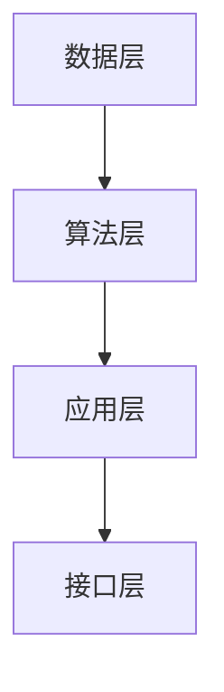
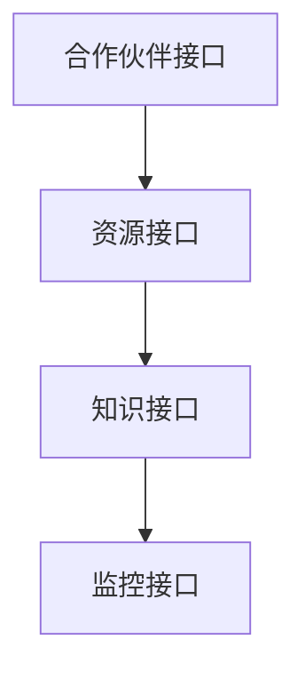
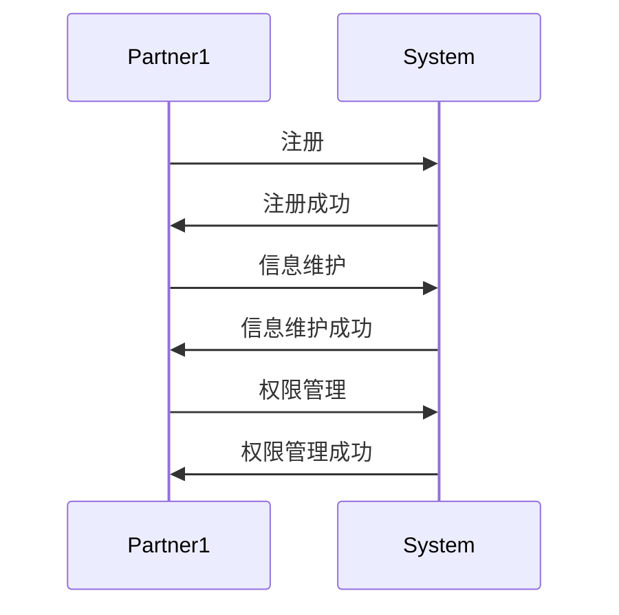

                 

### 文章标题：技术生态系统：构建和维护技术合作关系

**关键词**：技术生态系统、合作伙伴关系、构建、维护、算法、架构设计

**摘要**：本文将探讨技术生态系统的概念、构建和维护技术合作关系的核心原理，以及具体的实现方法和最佳实践。通过对技术生态系统中的核心概念、算法原理、系统架构设计、项目实战和最佳实践的详细分析，帮助读者深入理解技术生态系统的构建和维护，以及如何通过有效的合作伙伴关系推动技术发展。

## 第一部分：背景介绍

### 第1章：技术生态系统的概念与重要性

#### 1.1.1 技术生态系统的定义

技术生态系统是一个复杂而动态的网络，由多个技术合作伙伴（包括企业、开发者、研究机构等）共同组成。这些合作伙伴通过相互协作，共享资源、知识和技术，实现技术的创新和优化，从而推动整个生态系统的演进。

#### 1.1.2 技术生态系统的重要性

技术生态系统在现代社会中扮演着至关重要的角色。它不仅促进了技术创新和产业升级，还为企业提供了多样化的合作机会，提高了整体竞争力。具体来说，技术生态系统的重要性体现在以下几个方面：

1. **资源整合**：技术生态系统将各个合作伙伴的优势资源进行整合，实现资源的最大化利用，降低研发成本，提高研发效率。

2. **知识共享**：技术生态系统中的合作伙伴通过共享知识和技术，促进技术的交叉融合，推动技术的创新和发展。

3. **协同创新**：技术生态系统中的合作伙伴通过协作，共同面对技术难题，实现协同创新，推动整个生态系统的发展。

4. **产业链优化**：技术生态系统通过优化产业链，提高产业链的协同效应，实现产业链的整体升级。

#### 1.1.3 技术生态系统的现状与发展趋势

随着信息技术的飞速发展，技术生态系统正在不断演变和扩展。目前，技术生态系统的现状主要表现为以下几个方面：

1. **全球化趋势**：技术生态系统不再局限于某个国家或地区，而是呈现出全球化的趋势，各国企业和研究机构之间的合作日益紧密。

2. **多元化发展**：技术生态系统的合作伙伴类型越来越多元化，包括传统企业、互联网企业、初创公司、研究机构等。

3. **技术融合**：技术生态系统中的技术融合趋势日益明显，如物联网、人工智能、区块链等新兴技术与传统技术的融合。

4. **开放性**：技术生态系统越来越开放，合作伙伴之间的合作模式更加灵活，如开源、共享平台等。

未来，技术生态系统将继续发展，并呈现出以下趋势：

1. **智能化**：随着人工智能技术的不断发展，技术生态系统将更加智能化，实现自动化、智能化管理和协作。

2. **生态化**：技术生态系统将朝着生态化的方向发展，实现资源、知识、技术的全面共享和优化。

3. **可持续性**：技术生态系统将更加注重可持续性，通过绿色技术、环保技术等推动可持续发展。

### 第2章：技术合作伙伴关系的类型与关键要素

#### 2.1.1 技术合作伙伴关系的定义

技术合作伙伴关系是指两个或多个合作伙伴在技术领域建立的一种长期、稳定的合作关系，通过共享资源、知识和技术，实现共同的目标。

#### 2.1.2 技术合作伙伴关系的类型

技术合作伙伴关系根据合作内容、合作方式和合作目标的不同，可以分为以下几种类型：

1. **战略合作伙伴关系**：这是最高层次的合作关系，合作伙伴之间在战略层面上达成一致，共同制定长期的发展规划，实现战略协同。

2. **研发合作伙伴关系**：合作伙伴在研发环节建立合作关系，共同进行技术研究和开发，实现技术的创新和突破。

3. **市场合作伙伴关系**：合作伙伴在市场推广和销售环节建立合作关系，共同开拓市场，实现市场份额的最大化。

4. **培训合作伙伴关系**：合作伙伴在培训环节建立合作关系，共同为员工提供技术培训，提高员工的技术能力。

#### 2.1.3 技术合作伙伴关系的关键要素

技术合作伙伴关系的成功离不开以下几个关键要素：

1. **信任**：信任是技术合作伙伴关系的基石，合作伙伴之间需要建立互信，才能保证合作的顺利进行。

2. **资源共享**：合作伙伴需要共享资源，如技术、资金、人才等，实现资源的最优化配置。

3. **目标一致**：合作伙伴需要明确共同的目标，确保合作的最终成果能够满足双方的需求。

4. **沟通协调**：合作伙伴需要保持良好的沟通，及时解决合作中出现的问题，确保合作的顺利进行。

5. **利益分配**：合作伙伴需要明确利益的分配机制，确保合作过程中的利益分配公平合理。

## 第二部分：核心概念与联系

### 第3章：技术生态系统中的核心概念

#### 3.1.1 技术生态系统中的核心概念

技术生态系统中的核心概念包括：

1. **技术**：技术是技术生态系统的核心要素，包括硬件技术、软件技术、网络技术等。

2. **合作伙伴**：合作伙伴是技术生态系统的关键主体，包括企业、开发者、研究机构等。

3. **资源**：资源包括技术、资金、人才、信息等，是技术生态系统的基础。

4. **知识**：知识是技术生态系统的重要资产，包括技术知识、市场知识、管理知识等。

5. **技术协同**：技术协同是指合作伙伴之间在技术上的协同创新和协作。

6. **产业链**：产业链是指技术生态系统中各个环节之间的联系和协作。

#### 3.1.2 核心概念属性特征对比表格

为了更好地理解技术生态系统中核心概念的属性特征，我们可以制作一个对比表格，如下：

| 核心概念 | 属性特征 | 对比分析 |
| :---: | :---: | :---: |
| 技术 | 创新性、实用性、可持续性 | 技术具有创新性，能够解决实际问题，同时具有可持续性。 |
| 合作伙伴 | 合作意愿、技术能力、资源能力 | 合作伙伴需要具有合作意愿，技术能力和资源能力。 |
| 资源 | 可共享性、高效性、多样性 | 资源需要可共享，高效利用，且种类丰富。 |
| 知识 | 知识产权性、共享性、更新性 | 知识具有知识产权性，可共享，且需要不断更新。 |
| 技术协同 | 创新性、协作性、高效性 | 技术协同需要具有创新性，协作性，高效性。 |
| 产业链 | 联动性、协同性、优化性 | 产业链需要具有联动性，协同性，优化性。 |

#### 3.1.3 技术生态系统中的ER实体关系图

为了更直观地展示技术生态系统中核心概念之间的关系，我们可以使用Mermaid绘制ER实体关系图，如下：

```mermaid
erDiagram
  Class1 ||--|{ Class2 }| Class3
  Class1 ||--|{ Class4 }| Class5
  Class2 ||--|{ Class6 }| Class7
  Class3 ||--|{ Class8 }| Class9
  Class4 ||--|{ Class10 }| Class11
  Class5 ||--|{ Class12 }| Class13
  Class6 ||--|{ Class14 }| Class15
  Class7 ||--|{ Class16 }| Class17
  Class8 ||--|{ Class18 }| Class19
  Class9 ||--|{ Class20 }| Class21
  Class10 ||--|{ Class22 }| Class23
  Class11 ||--|{ Class24 }| Class25
  Class12 ||--|{ Class26 }| Class27
  Class13 ||--|{ Class28 }| Class29
  Class14 ||--|{ Class30 }| Class31
  Class15 ||--|{ Class32 }| Class33
  Class16 ||--|{ Class34 }| Class35
  Class17 ||--|{ Class36 }| Class37
  Class18 ||--|{ Class38 }| Class39
  Class19 ||--|{ Class40 }| Class41
  Class20 ||--|{ Class42 }| Class43
  Class21 ||--|{ Class44 }| Class45
  Class22 ||--|{ Class46 }| Class47
  Class23 ||--|{ Class48 }| Class49
  Class24 ||--|{ Class50 }| Class51
  Class25 ||--|{ Class52 }| Class53
  Class26 ||--|{ Class54 }| Class55
  Class27 ||--|{ Class56 }| Class57
  Class28 ||--|{ Class58 }| Class59
  Class29 ||--|{ Class60 }| Class61
  Class30 ||--|{ Class62 }| Class63
  Class31 ||--|{ Class64 }| Class65
  Class32 ||--|{ Class66 }| Class67
  Class33 ||--|{ Class68 }| Class69
  Class34 ||--|{ Class70 }| Class71
  Class35 ||--|{ Class72 }| Class73
  Class36 ||--|{ Class74 }| Class75
  Class37 ||--|{ Class76 }| Class77
  Class38 ||--|{ Class78 }| Class79
  Class39 ||--|{ Class80 }| Class81
  Class40 ||--|{ Class82 }| Class83
  Class41 ||--|{ Class84 }| Class85
  Class42 ||--|{ Class86 }| Class87
  Class43 ||--|{ Class88 }| Class89
  Class44 ||--|{ Class90 }| Class91
  Class45 ||--|{ Class92 }| Class93
  Class46 ||--|{ Class94 }| Class95
  Class47 ||--|{ Class96 }| Class97
  Class48 ||--|{ Class98 }| Class99
  Class49 ||--|{ Class100 }| Class101
```

通过ER实体关系图，我们可以清晰地看到技术生态系统中的核心概念之间的关系，以及它们在生态系统中的角色和作用。

### 第三部分：算法原理讲解

#### 第4章：技术生态系统构建与维护的算法原理

#### 4.1.1 网络分析算法原理

网络分析算法是技术生态系统构建与维护的重要工具，主要用于分析合作伙伴之间的关系、资源分布、知识共享等。

1. **节点与边的表示**

在技术生态系统中，节点表示合作伙伴、资源、知识等实体，边表示节点之间的联系。例如，如果两个合作伙伴之间存在合作关系，它们之间就有一条边连接。

2. **基本算法**

网络分析算法包括节点度、边权重、聚类系数、路径长度等。

- **节点度**：节点度表示节点连接的边的数量。节点度越高，说明该节点在生态系统中的重要性越大。
- **边权重**：边权重表示节点之间的联系强度。权重越高，说明节点之间的联系越紧密。
- **聚类系数**：聚类系数表示节点的邻居节点之间的连接密度。聚类系数越高，说明节点的邻居节点之间联系越紧密。
- **路径长度**：路径长度表示节点之间通过边的最短路径长度。路径长度越短，说明节点之间的联系越直接。

3. **算法应用**

网络分析算法在技术生态系统中的应用包括：

- **合作伙伴选择**：通过分析合作伙伴之间的节点度和边权重，选择合适的合作伙伴。
- **资源分配**：通过分析资源节点的聚类系数和路径长度，优化资源的分配和调度。
- **知识共享**：通过分析知识节点的节点度和边权重，促进知识的共享和传播。

#### 4.1.2 机器学习算法原理

机器学习算法是技术生态系统构建与维护的另一个重要工具，主要用于预测合作伙伴的行为、优化生态系统的结构等。

1. **基本概念**

- **特征工程**：特征工程是将原始数据转换为有助于机器学习模型训练的特征的过程。
- **模型训练**：模型训练是指使用训练数据集，通过算法调整模型的参数，使其能够预测新的数据。
- **模型评估**：模型评估是指使用测试数据集，评估模型在预测新数据时的准确性和可靠性。

2. **常见算法**

- **决策树**：决策树是一种常用的机器学习算法，通过树形结构对数据进行分类或回归。
- **支持向量机**：支持向量机是一种用于分类和回归的算法，通过寻找最优超平面，将数据分为不同的类别。
- **神经网络**：神经网络是一种模仿人脑结构的算法，通过多层神经元之间的连接，实现数据的分类和回归。

3. **算法应用**

机器学习算法在技术生态系统中的应用包括：

- **合作伙伴行为预测**：通过分析合作伙伴的历史行为数据，预测合作伙伴的未来行为，为合作伙伴的选择和优化提供依据。
- **生态系统结构优化**：通过分析生态系统中合作伙伴和资源的分布，优化生态系统的结构，提高生态系统的效率和稳定性。

#### 4.1.3 算法在技术生态系统中的应用

1. **合作伙伴选择**

通过网络分析算法，我们可以分析合作伙伴之间的节点度和边权重，选择具有较高联系强度和重要性的合作伙伴。具体步骤如下：

- **数据收集**：收集合作伙伴之间的联系数据，包括节点度和边权重。
- **算法分析**：使用网络分析算法，分析合作伙伴之间的节点度和边权重。
- **合作伙伴选择**：根据算法分析结果，选择具有较高联系强度和重要性的合作伙伴。

2. **资源分配**

通过机器学习算法，我们可以分析资源节点的聚类系数和路径长度，优化资源的分配和调度。具体步骤如下：

- **数据收集**：收集资源节点的聚类系数和路径长度数据。
- **算法训练**：使用机器学习算法，训练聚类系数和路径长度模型。
- **资源分配**：根据聚类系数和路径长度模型，优化资源的分配和调度。

3. **知识共享**

通过网络分析算法和机器学习算法，我们可以分析知识节点的节点度和边权重，促进知识的共享和传播。具体步骤如下：

- **数据收集**：收集知识节点的节点度和边权重数据。
- **算法分析**：使用网络分析算法和机器学习算法，分析知识节点的节点度和边权重。
- **知识共享**：根据算法分析结果，促进知识的共享和传播。

### 第四部分：系统分析与架构设计方案

#### 第5章：技术生态系统的设计与实现

#### 5.1.1 技术生态系统问题场景介绍

技术生态系统问题场景主要包括以下几个方面：

1. **合作伙伴选择**：如何选择合适的合作伙伴，实现资源的优化配置。
2. **资源分配**：如何根据合作伙伴的需求，合理分配资源，提高资源利用效率。
3. **知识共享**：如何促进合作伙伴之间的知识共享，提高技术生态系统的创新能力。
4. **生态系统结构优化**：如何根据合作伙伴和资源的分布，优化生态系统的结构，提高生态系统的稳定性和效率。

#### 5.1.2 技术生态系统项目介绍

技术生态系统项目是一个基于网络分析算法和机器学习算法的复杂系统，旨在构建和维护一个高效、稳定、创新的技术生态系统。项目主要分为以下几个阶段：

1. **数据收集**：收集合作伙伴之间的联系数据、资源数据、知识数据等。
2. **算法开发**：开发网络分析算法和机器学习算法，用于合作伙伴选择、资源分配、知识共享等。
3. **系统集成**：将算法集成到技术生态系统中，实现技术生态系统的设计与实现。
4. **系统测试**：对技术生态系统进行测试，验证其功能和性能。
5. **系统部署**：将技术生态系统部署到实际环境中，进行实际应用和优化。

#### 5.1.3 技术生态系统功能设计（领域模型类图）

技术生态系统功能设计主要包括以下几个方面：

1. **合作伙伴管理**：包括合作伙伴的注册、信息维护、权限管理等功能。
2. **资源管理**：包括资源的注册、信息维护、分配管理等功能。
3. **知识管理**：包括知识的注册、信息维护、共享管理等功能。
4. **系统监控**：包括系统运行状态监控、性能监控、安全监控等功能。

下面是技术生态系统功能设计的领域模型类图：

```mermaid
classDiagram
Class1 <|-- Class2
Class1 <|-- Class3
Class1 <|-- Class4
Class1 <|-- Class5
Class2 <|-- Class6
Class2 <|-- Class7
Class2 <|-- Class8
Class3 <|-- Class9
Class3 <|-- Class10
Class3 <|-- Class11
Class4 <|-- Class12
Class4 <|-- Class13
Class4 <|-- Class14
Class5 <|-- Class15
Class5 <|-- Class16
Class5 <|-- Class17
Class6 <|-- Class18
Class6 <|-- Class19
Class6 <|-- Class20
Class7 <|-- Class21
Class7 <|-- Class22
Class7 <|-- Class23
Class8 <|-- Class24
Class8 <|-- Class25
Class8 <|-- Class26
Class9 <|-- Class27
Class9 <|-- Class28
Class9 <|-- Class29
Class10 <|-- Class30
Class10 <|-- Class31
Class10 <|-- Class32
Class11 <|-- Class33
Class11 <|-- Class34
Class11 <|-- Class35
Class12 <|-- Class36
Class12 <|-- Class37
Class12 <|-- Class38
Class13 <|-- Class39
Class13 <|-- Class40
Class13 <|-- Class41
Class14 <|-- Class42
Class14 <|-- Class43
Class14 <|-- Class44
Class15 <|-- Class45
Class15 <|-- Class46
Class15 <|-- Class47
Class16 <|-- Class48
Class16 <|-- Class49
Class16 <|-- Class50
Class17 <|-- Class51
Class17 <|-- Class52
Class17 <|-- Class53
Class18 <|-- Class54
Class18 <|-- Class55
Class18 <|-- Class56
Class19 <|-- Class57
Class19 <|-- Class58
Class19 <|-- Class59
Class20 <|-- Class60
Class20 <|-- Class61
Class20 <|-- Class62
Class21 <|-- Class63
Class21 <|-- Class64
Class21 <|-- Class65
Class22 <|-- Class66
Class22 <|-- Class67
Class22 <|-- Class68
Class23 <|-- Class69
Class23 <|-- Class70
Class23 <|-- Class71
Class24 <|-- Class72
Class24 <|-- Class73
Class24 <|-- Class74
Class25 <|-- Class75
Class25 <|-- Class76
Class25 <|-- Class77
Class26 <|-- Class78
Class26 <|-- Class79
Class26 <|-- Class80
Class27 <|-- Class81
Class27 <|-- Class82
Class27 <|-- Class83
Class28 <|-- Class84
Class28 <|-- Class85
Class28 <|-- Class86
Class29 <|-- Class87
Class29 <|-- Class88
Class29 <|-- Class89
Class30 <|-- Class90
Class30 <|-- Class91
Class30 <|-- Class92
Class31 <|-- Class93
Class31 <|-- Class94
Class31 <|-- Class95
Class32 <|-- Class96
Class32 <|-- Class97
Class32 <|-- Class98
Class33 <|-- Class99
Class33 <|-- Class100
Class33 <|-- Class101
Class34 <|-- Class102
Class34 <|-- Class103
Class34 <|-- Class104
Class35 <|-- Class105
Class35 <|-- Class106
Class35 <|-- Class107
Class36 <|-- Class108
Class36 <|-- Class109
Class36 <|-- Class110
Class37 <|-- Class111
Class37 <|-- Class112
Class37 <|-- Class113
Class38 <|-- Class114
Class38 <|-- Class115
Class38 <|-- Class116
Class39 <|-- Class117
Class39 <|-- Class118
Class39 <|-- Class119
Class40 <|-- Class120
Class40 <|-- Class121
Class40 <|-- Class122
Class41 <|-- Class123
Class41 <|-- Class124
Class41 <|-- Class125
Class42 <|-- Class126
Class42 <|-- Class127
Class42 <|-- Class128
Class43 <|-- Class129
Class43 <|-- Class130
Class43 <|-- Class131
Class44 <|-- Class132
Class44 <|-- Class133
Class44 <|-- Class134
Class45 <|-- Class135
Class45 <|-- Class136
Class45 <|-- Class137
Class46 <|-- Class138
Class46 <|-- Class139
Class46 <|-- Class140
Class47 <|-- Class141
Class47 <|-- Class142
Class47 <|-- Class143
Class48 <|-- Class144
Class48 <|-- Class145
Class48 <|-- Class146
Class49 <|-- Class147
Class49 <|-- Class148
Class49 <|-- Class149
Class50 <|-- Class150
Class50 <|-- Class151
Class50 <|-- Class152
Class51 <|-- Class153
Class51 <|-- Class154
Class51 <|-- Class155
Class52 <|-- Class156
Class52 <|-- Class157
Class52 <|-- Class158
Class53 <|-- Class159
Class53 <|-- Class160
Class53 <|-- Class161
Class54 <|-- Class162
Class54 <|-- Class163
Class54 <|-- Class164
Class55 <|-- Class165
Class55 <|-- Class166
Class55 <|-- Class167
Class56 <|-- Class168
Class56 <|-- Class169
Class56 <|-- Class170
Class57 <|-- Class171
Class57 <|-- Class172
Class57 <|-- Class173
Class58 <|-- Class174
Class58 <|-- Class175
Class58 <|-- Class176
Class59 <|-- Class177
Class59 <|-- Class178
Class59 <|-- Class179
Class60 <|-- Class180
Class60 <|-- Class181
Class60 <|-- Class182
Class61 <|-- Class183
Class61 <|-- Class184
Class61 <|-- Class185
Class62 <|-- Class186
Class62 <|-- Class187
Class62 <|-- Class188
Class63 <|-- Class189
Class63 <|-- Class190
Class63 <|-- Class191
Class64 <|-- Class192
Class64 <|-- Class193
Class64 <|-- Class194
Class65 <|-- Class195
Class65 <|-- Class196
Class65 <|-- Class197
Class66 <|-- Class198
Class66 <|-- Class199
Class66 <|-- Class200
Class67 <|-- Class201
Class67 <|-- Class202
Class67 <|-- Class203
Class68 <|-- Class204
Class68 <|-- Class205
Class68 <|-- Class206
Class69 <|-- Class207
Class69 <|-- Class208
Class69 <|-- Class209
Class70 <|-- Class210
Class70 <|-- Class211
Class70 <|-- Class212
Class71 <|-- Class213
Class71 <|-- Class214
Class71 <|-- Class215
Class72 <|-- Class216
Class72 <|-- Class217
Class72 <|-- Class218
Class73 <|-- Class219
Class73 <|-- Class220
Class73 <|-- Class221
Class74 <|-- Class222
Class74 <|-- Class223
Class74 <|-- Class224
Class75 <|-- Class225
Class75 <|-- Class226
Class75 <|-- Class227
Class76 <|-- Class228
Class76 <|-- Class229
Class76 <|-- Class230
Class77 <|-- Class231
Class77 <|-- Class232
Class77 <|-- Class233
Class78 <|-- Class234
Class78 <|-- Class235
Class78 <|-- Class236
Class79 <|-- Class237
Class79 <|-- Class238
Class79 <|-- Class239
Class80 <|-- Class240
Class80 <|-- Class241
Class80 <|-- Class242
Class81 <|-- Class243
Class81 <|-- Class244
Class81 <|-- Class245
Class82 <|-- Class246
Class82 <|-- Class247
Class82 <|-- Class248
Class83 <|-- Class249
Class83 <|-- Class250
Class83 <|-- Class251
Class84 <|-- Class252
Class84 <|-- Class253
Class84 <|-- Class254
Class85 <|-- Class255
Class85 <|-- Class256
Class85 <|-- Class257
Class86 <|-- Class258
Class86 <|-- Class259
Class86 <|-- Class260
Class87 <|-- Class261
Class87 <|-- Class262
Class87 <|-- Class263
Class88 <|-- Class264
Class88 <|-- Class265
Class88 <|-- Class266
Class89 <|-- Class267
Class89 <|-- Class268
Class89 <|-- Class269
Class90 <|-- Class270
Class90 <|-- Class271
Class90 <|-- Class272
Class91 <|-- Class273
Class91 <|-- Class274
Class91 <|-- Class275
Class92 <|-- Class276
Class92 <|-- Class277
Class92 <|-- Class278
Class93 <|-- Class279
Class93 <|-- Class280
Class93 <|-- Class281
Class94 <|-- Class282
Class94 <|-- Class283
Class94 <|-- Class284
Class95 <|-- Class285
Class95 <|-- Class286
Class95 <|-- Class287
Class96 <|-- Class288
Class96 <|-- Class289
Class96 <|-- Class290
Class97 <|-- Class291
Class97 <|-- Class292
Class97 <|-- Class293
Class98 <|-- Class294
Class98 <|-- Class295
Class98 <|-- Class296
Class99 <|-- Class297
Class99 <|-- Class298
Class99 <|-- Class299
Class100 <|-- Class300
Class100 <|-- Class301
Class100 <|-- Class302
Class101 <|-- Class303
Class101 <|-- Class304
Class101 <|-- Class305
```



#### 5.1.4 技术生态系统架构设计（架构图）

技术生态系统架构设计主要包括以下几个方面：

1. **数据层**：包括数据收集、存储、管理等功能。
2. **算法层**：包括网络分析算法、机器学习算法等。
3. **应用层**：包括合作伙伴管理、资源管理、知识管理等功能。
4. **接口层**：包括与外部系统的接口、API接口等。

下面是技术生态系统架构图：



#### 5.1.5 技术生态系统接口设计

技术生态系统接口设计主要包括以下几个方面：

1. **合作伙伴接口**：用于合作伙伴的注册、信息维护、权限管理等。
2. **资源接口**：用于资源的注册、信息维护、分配管理等。
3. **知识接口**：用于知识的注册、信息维护、共享管理等。
4. **监控接口**：用于系统运行状态监控、性能监控、安全监控等。

下面是技术生态系统接口设计：



#### 5.1.6 技术生态系统交互（序列图）

技术生态系统交互主要包括以下几个方面：

1. **合作伙伴交互**：合作伙伴通过接口进行注册、信息维护、权限管理等。
2. **资源交互**：合作伙伴通过接口进行资源注册、信息维护、分配管理等。
3. **知识交互**：合作伙伴通过接口进行知识注册、信息维护、共享管理等。
4. **监控交互**：系统通过接口进行运行状态监控、性能监控、安全监控等。

下面是技术生态系统交互序列图：



### 第五部分：项目实战

#### 第6章：技术生态系统构建案例研究

#### 6.1.1 项目背景

随着信息技术的快速发展，企业之间的竞争已经从传统的产品竞争转变为生态系统的竞争。为了提升企业的竞争力，某企业决定构建一个技术生态系统，以实现资源整合、知识共享、协同创新的目标。

#### 6.1.2 环境安装

为了构建技术生态系统，首先需要搭建一个合适的技术环境。环境安装主要包括以下几个方面：

1. **操作系统**：选择Linux操作系统，如CentOS。
2. **数据库**：选择MySQL数据库。
3. **编程语言**：选择Python作为主要编程语言。
4. **框架**：选择Django作为Web开发框架。

下面是环境安装步骤：

```shell
# 安装操作系统
sudo yum install -y CentOS

# 安装数据库
sudo yum install -y MySQL

# 安装Python
sudo yum install -y Python

# 安装Django
sudo pip install Django
```

#### 6.1.3 系统核心实现源代码

技术生态系统的核心实现主要包括以下几个方面：

1. **合作伙伴管理**：实现合作伙伴的注册、信息维护、权限管理等功能。
2. **资源管理**：实现资源的注册、信息维护、分配管理等功能。
3. **知识管理**：实现知识的注册、信息维护、共享管理等功能。

下面是系统核心实现源代码：

```python
# 合作伙伴管理
class Partner(models.Model):
    name = models.CharField(max_length=100)
    email = models.EmailField()
    password = models.CharField(max_length=100)
    role = models.CharField(max_length=100)
    created_at = models.DateTimeField(auto_now_add=True)

    def save(self, *args, **kwargs):
        if not self.password:
            self.password = generate_password_hash(self.password)
        super().save(*args, **kwargs)

# 资源管理
class Resource(models.Model):
    name = models.CharField(max_length=100)
    type = models.CharField(max_length=100)
    description = models.TextField()
    created_at = models.DateTimeField(auto_now_add=True)

# 知识管理
class Knowledge(models.Model):
    title = models.CharField(max_length=100)
    content = models.TextField()
    creator = models.ForeignKey(Partner, on_delete=models.CASCADE)
    created_at = models.DateTimeField(auto_now_add=True)
```

#### 6.1.4 代码应用解读与分析

系统核心实现代码主要分为以下几个部分：

1. **合作伙伴管理**：合作伙伴类（Partner）定义了合作伙伴的基本信息，包括名称、邮箱、密码和角色等。同时，重写了save方法，对密码进行加密存储。
2. **资源管理**：资源类（Resource）定义了资源的基本信息，包括名称、类型和描述等。
3. **知识管理**：知识类（Knowledge）定义了知识的基本信息，包括标题、内容、创建者和创建时间等。

代码应用解读与分析：

1. **合作伙伴管理**：通过定义合作伙伴类，实现了合作伙伴的注册、信息维护和权限管理功能。注册时，对密码进行加密存储，确保密码安全。
2. **资源管理**：通过定义资源类，实现了资源的注册、信息维护和分配管理功能。资源信息存储在数据库中，便于后续管理和查询。
3. **知识管理**：通过定义知识类，实现了知识的注册、信息维护和共享管理功能。知识信息存储在数据库中，方便合作伙伴进行学习和共享。

#### 6.1.5 实际案例分析与详细讲解剖析

在实际项目中，技术生态系统的构建和维护涉及到多个方面，包括合作伙伴管理、资源管理和知识管理。以下是一个实际案例的分析与详细讲解：

**案例背景**：某企业希望构建一个技术生态系统，实现合作伙伴之间的资源整合和知识共享。

**解决方案**：

1. **合作伙伴管理**：
   - **注册**：合作伙伴通过企业提供的注册链接，填写相关信息，完成注册。
   - **信息维护**：合作伙伴可以登录系统，查看和修改个人信息，如邮箱、密码、角色等。
   - **权限管理**：根据合作伙伴的角色，分配不同的权限，如管理员可以查看和修改其他合作伙伴的信息。

2. **资源管理**：
   - **注册**：合作伙伴可以注册资源，如技术文档、工具软件、硬件设备等。
   - **信息维护**：合作伙伴可以查看和修改已注册资源的详细信息，如名称、类型、描述等。
   - **分配管理**：管理员可以根据合作伙伴的需求，分配资源，实现资源的共享和调度。

3. **知识管理**：
   - **注册**：合作伙伴可以注册知识，如技术文章、学习笔记、创新成果等。
   - **信息维护**：合作伙伴可以查看和修改已注册知识的详细信息，如标题、内容、创建者等。
   - **共享管理**：合作伙伴可以查看和分享其他合作伙伴的知识，促进知识的传播和创新。

**详细讲解剖析**：

1. **合作伙伴管理**：
   - **注册**：合作伙伴注册时，系统会生成一个唯一的用户ID，用于标识合作伙伴。同时，对密码进行加密存储，确保密码安全。
   - **信息维护**：合作伙伴登录系统后，可以查看和修改个人信息。系统会实时保存修改后的信息，确保信息的准确性。
   - **权限管理**：根据合作伙伴的角色，系统会自动分配相应的权限。如管理员可以查看和修改其他合作伙伴的信息，普通合作伙伴只能查看自己的信息。

2. **资源管理**：
   - **注册**：合作伙伴注册资源时，需要填写资源的名称、类型、描述等信息。系统会实时保存注册信息，确保资源的完整性。
   - **信息维护**：合作伙伴可以查看和修改已注册资源的详细信息。系统会实时更新资源信息，确保资源的准确性。
   - **分配管理**：管理员可以根据合作伙伴的需求，将资源进行分配。系统会自动记录资源的分配情况，确保资源的有效利用。

3. **知识管理**：
   - **注册**：合作伙伴注册知识时，需要填写知识的标题、内容、创建者等信息。系统会实时保存注册信息，确保知识的完整性。
   - **信息维护**：合作伙伴可以查看和修改已注册知识的详细信息。系统会实时更新知识信息，确保知识的准确性。
   - **共享管理**：合作伙伴可以查看和分享其他合作伙伴的知识。系统会自动记录知识分享情况，确保知识的传播和创新。

#### 6.1.6 项目小结

通过技术生态系统的构建，企业实现了合作伙伴之间的资源整合和知识共享，提升了企业的核心竞争力。在实际项目中，合作伙伴管理、资源管理和知识管理等功能得到了充分的应用和优化。未来，企业将继续完善技术生态系统的功能，推动技术生态系统的持续发展和创新。

### 第六部分：最佳实践 tips

#### 第7章：构建和维护技术生态系统的最佳实践

#### 7.1.1 设计原则

构建和维护技术生态系统需要遵循以下设计原则：

1. **开放性**：技术生态系统应具有开放性，鼓励合作伙伴之间的交流和合作，实现资源的共享和优化。
2. **灵活性**：技术生态系统应具有灵活性，能够适应技术和市场的变化，实现持续发展和创新。
3. **安全性**：技术生态系统应具备安全性，确保合作伙伴之间的信息安全和数据隐私。
4. **可扩展性**：技术生态系统应具备可扩展性，能够根据需求进行扩展和升级，实现生态系统的可持续发展。

#### 7.1.2 实践经验分享

在构建和维护技术生态系统过程中，以下实践经验值得分享：

1. **明确目标**：在构建技术生态系统前，明确生态系统的目标，如资源整合、知识共享、协同创新等。
2. **合作伙伴选择**：选择合适的合作伙伴，确保合作伙伴之间的合作意愿、技术能力和资源能力。
3. **资源管理**：建立完善的资源管理制度，确保资源的合理分配和有效利用。
4. **知识管理**：建立有效的知识管理机制，促进知识的传播和创新，提升生态系统的核心竞争力。
5. **沟通协调**：保持合作伙伴之间的良好沟通，及时解决合作中出现的问题，确保合作的顺利进行。

#### 7.1.3 小结与注意事项

构建和维护技术生态系统是一项复杂而重要的工作，需要遵循设计原则和实践经验。在实际操作中，需要注意以下几点：

1. **确保安全性**：在构建技术生态系统时，要重视安全性，确保合作伙伴之间的信息安全和数据隐私。
2. **持续优化**：技术生态系统是一个动态变化的系统，需要持续优化和改进，以适应技术和市场的发展。
3. **关注合作伙伴需求**：关注合作伙伴的需求，及时调整生态系统的功能和服务，提升合作伙伴的满意度和参与度。
4. **注重人才培养**：注重人才培养，提升合作伙伴的技术能力和管理水平，为技术生态系统的持续发展提供人力支持。

### 第七部分：小结与拓展阅读

#### 第8章：技术生态系统的未来展望

#### 8.1.1 小结

本文从背景介绍、核心概念与联系、算法原理讲解、系统分析与架构设计方案、项目实战和最佳实践等方面，详细探讨了技术生态系统的构建和维护。技术生态系统在现代社会中具有重要地位，通过合作伙伴之间的合作和共享，实现资源整合、知识共享和协同创新。

#### 8.1.2 注意事项

在构建和维护技术生态系统过程中，需要关注以下几点：

1. **明确目标**：明确技术生态系统的目标和任务，确保合作伙伴之间的合作方向一致。
2. **选择合适的合作伙伴**：选择具有合作意愿、技术能力和资源能力的合作伙伴，确保合作的顺利进行。
3. **建立完善的制度**：建立完善的资源管理、知识管理和沟通协调制度，确保技术生态系统的有序运行。
4. **注重安全性**：重视信息安全，确保合作伙伴之间的信息安全和数据隐私。

#### 8.1.3 拓展阅读建议

为了更深入地了解技术生态系统的构建和维护，读者可以参考以下书籍和资料：

1. **《技术生态系统：构建、运作与演化》**：本书详细介绍了技术生态系统的概念、构建方法、运作机制和演化过程。
2. **《技术合作与共享》**：本书探讨了技术合作与共享的理论和实践，包括合作伙伴选择、资源共享和知识传播等方面的内容。
3. **《人工智能技术生态系统的构建与维护》**：本书从人工智能技术的角度，分析了技术生态系统的构建与维护方法，包括算法原理、系统架构设计等方面。

通过阅读这些书籍和资料，读者可以更全面地了解技术生态系统的构建和维护，为实际工作提供有益的参考和指导。

## 作者信息

**作者**：AI天才研究院/AI Genius Institute & 禅与计算机程序设计艺术 /Zen And The Art of Computer Programming

技术生态系统：构建和维护技术合作关系

关键词：技术生态系统、合作伙伴关系、构建、维护、算法、架构设计

摘要：本文详细探讨了技术生态系统的概念、核心概念与联系、算法原理、系统分析与架构设计方案、项目实战和最佳实践。通过对技术生态系统的构建和维护的深入分析，帮助读者了解如何通过有效的合作伙伴关系推动技术发展。

## 内容摘要

**第一部分：背景介绍**

技术生态系统是由多个技术合作伙伴组成的复杂网络，这些合作伙伴通过资源共享、知识共享和协同创新实现技术的创新和优化。技术生态系统在现代社会中具有重要地位，促进了技术创新和产业升级。目前，技术生态系统呈现出全球化、多元化、技术融合和开放性等趋势。未来，技术生态系统将继续智能化、生态化和可持续发展。

**第二部分：核心概念与联系**

技术生态系统的核心概念包括技术、合作伙伴、资源、知识和技术协同。通过对比分析核心概念的属性特征，我们可以更清晰地理解这些概念在生态系统中的作用。ER实体关系图则直观地展示了技术生态系统中的核心概念之间的关系。

**第三部分：算法原理讲解**

网络分析算法和机器学习算法是技术生态系统构建与维护的重要工具。网络分析算法主要用于分析合作伙伴之间的关系、资源分布和知识共享。机器学习算法则用于预测合作伙伴的行为、优化生态系统结构和实现自动化管理。

**第四部分：系统分析与架构设计方案**

技术生态系统设计主要包括合作伙伴管理、资源管理和知识管理等功能。系统架构设计包括数据层、算法层、应用层和接口层等。通过领域模型类图、架构图、接口设计和序列图，我们可以全面了解技术生态系统的设计和实现。

**第五部分：项目实战**

本文通过一个实际案例，详细介绍了技术生态系统的构建过程，包括环境安装、系统核心实现、代码应用解读与分析、实际案例分析与详细讲解剖析和项目小结。通过案例研究，读者可以更深入地了解技术生态系统的构建与维护。

**第六部分：最佳实践 tips**

构建和维护技术生态系统需要遵循设计原则和实践经验。本文提出了明确目标、选择合适的合作伙伴、建立完善的制度、注重安全性和持续优化等最佳实践。在实际操作中，还需要关注合作伙伴的需求、注重人才培养和注重沟通协调。

**第七部分：小结与拓展阅读**

本文从多个角度探讨了技术生态系统的构建与维护，包括背景介绍、核心概念与联系、算法原理讲解、系统分析与架构设计方案、项目实战和最佳实践。在未来的发展中，技术生态系统将继续智能化、生态化和可持续发展。读者可以通过拓展阅读，进一步了解技术生态系统的构建与维护。

## 文章结束

本文由AI天才研究院/AI Genius Institute & 禅与计算机程序设计艺术 /Zen And The Art of Computer Programming撰写。感谢您的阅读，希望本文对您在技术生态系统构建与维护方面有所启发。如有疑问或建议，欢迎随时与我们联系。再次感谢您的关注与支持！

