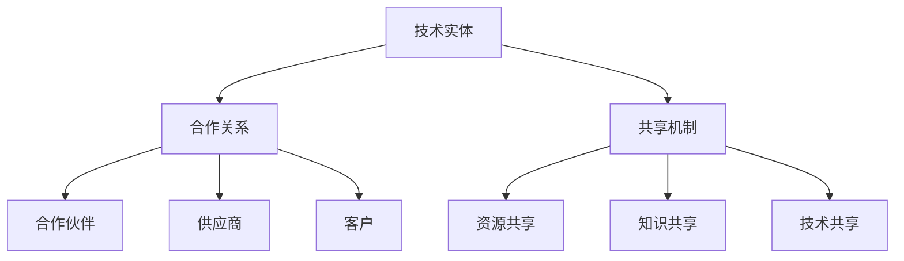

                 

# 技术生态系统：构建和维护技术合作关系

## 关键词
技术生态系统、合作关系、构建方法论、创新驱动、伦理与法律、案例分析、战略建议

## 摘要
技术生态系统是一种新兴的商业模式，通过合作、共享和技术创新来增强企业竞争力。本文将深入探讨技术生态系统的概念、构建方法、合作类型、技术影响、法律与伦理问题，并通过实际案例提供最佳实践指导。文章旨在帮助读者理解技术生态系统的重要性，掌握其构建与维护的策略，以实现长远发展。

## 引言
### 概念界定
技术生态系统（Technical Ecosystem）是指由一系列相互关联的技术实体、组件、组织和个人所构成的网络结构。这些实体通过合作、共享技术和资源，共同推动创新和发展。

### 重要性
技术生态系统在当今数字化时代具有重要意义。它不仅能够促进技术进步，还能提高企业竞争力，创造更多商业机会。通过构建技术生态系统，企业可以实现资源整合、降低研发成本，并快速响应市场需求。

### 关键要素
技术生态系统主要包括以下关键要素：
- **技术平台**：提供基础的技术架构和开发环境。
- **合作伙伴**：包括技术供应商、服务提供商、研究机构等。
- **用户**：使用技术产品和服务的终端消费者。
- **基础设施**：包括网络、硬件设备等。
- **治理机制**：确保技术生态系统内的合作和共享机制有效运行。

## 基本概念和关系
### 核心概念
- **技术实体**：技术生态系统中的基本组成单位，包括软件、硬件、服务、平台等。
- **合作关系**：技术实体之间的互动和合作形式，包括合作伙伴、供应商、客户等。
- **共享机制**：技术实体之间共享资源、知识、技术和信息的方式。

### 实体关系图

### 属性和特征
- **技术实体**：具有功能、性能、兼容性等特征。
- **合作关系**：具有稳定性、互惠性、灵活性等特征。
- **共享机制**：具有高效性、公平性、安全性等特征。

## 构建技术生态系统
### 构建步骤
1. **需求分析**：确定技术生态系统所需的功能和需求。
2. **架构设计**：设计技术生态系统的整体架构和组件。
3. **合作伙伴选择**：选择合适的技术合作伙伴。
4. **资源共享机制**：建立资源共享、知识共享、技术共享的机制。
5. **治理和协调**：制定治理规则和协调机制，确保生态系统稳定运行。

### 最佳实践
1. **明确目标和愿景**：确保技术生态系统能够实现长期发展。
2. **建立互信关系**：通过合作和信任建立稳定的合作伙伴关系。
3. **技术创新驱动**：不断引入新技术，推动生态系统的创新和发展。
4. **风险管理**：识别和应对技术生态系统中的潜在风险。

### 挑战与解决方案
- **技术兼容性**：确保不同技术实体之间的兼容性。
- **合作复杂性**：通过清晰的沟通和协调机制降低合作复杂性。
- **知识产权保护**：制定知识产权保护策略，确保合作伙伴的利益。

## 技术生态系统中的合作类型
### 合作类型
- **合作伙伴关系**：技术实体之间的长期合作关系。
- **供应链关系**：技术实体与供应商、制造商之间的合作关系。
- **客户关系**：技术实体与终端客户之间的合作关系。
- **合作伙伴网络**：多个合作伙伴组成的复杂合作关系。

### 动态和互动
- **资源共享**：合作伙伴之间共享资源，提高效率。
- **知识交流**：合作伙伴之间交流知识，推动创新。
- **技术协同**：合作伙伴共同开发新技术，提高竞争力。
- **市场协作**：合作伙伴共同开拓市场，增加销售额。

### 案例分析
- **苹果iOS生态系统**：通过合作伙伴关系和开放平台，吸引了大量开发者，构建了庞大的应用生态系统。
- **IBM蓝色起源联盟**：通过技术合作和创新，推动了云计算和大数据技术的发展。

## 技术创新与生态系统
### 技术创新的角色
技术创新是技术生态系统的核心驱动力，它能够推动生态系统的发展，提高企业的竞争力。

### 新技术与生态系统的整合
新技术的引入需要与现有生态系统相整合，确保其能够为生态系统带来实际价值。

### 技术影响
- **市场变革**：新技术可以改变市场格局，创造新的商业机会。
- **合作伙伴关系**：新技术可以改变合作伙伴之间的关系和合作模式。

## 法律和伦理考虑
### 法律框架
技术生态系统的构建需要遵守相关法律法规，如知识产权法、合同法、反垄断法等。

### 伦理考虑
技术生态系统中的合作伙伴需要遵循伦理原则，确保合作行为公正、透明、尊重用户隐私。

### 案例分析
- **谷歌安卓生态系统**：通过遵守法律法规和伦理原则，构建了庞大的移动应用生态系统。
- **Facebook数据隐私争议**：因数据隐私问题，引发了对技术生态系统的法律和伦理讨论。

## 实际案例与最佳实践
### 案例分析
- **华为云生态系统**：通过技术创新和合作伙伴关系，构建了全球领先的云计算生态系统。
- **微软Azure**：通过提供开放平台和资源共享机制，吸引了大量开发者，推动了云计算技术的发展。

### 经验总结
- **合作共赢**：构建技术生态系统需要合作伙伴之间的合作共赢。
- **技术创新**：不断引入新技术，推动生态系统的创新和发展。
- **法律合规**：遵守法律法规，确保技术生态系统的合法性和稳定性。

### 注意事项
- **风险控制**：在构建技术生态系统时，需要识别和应对潜在的风险。
- **透明沟通**：合作伙伴之间需要保持透明沟通，确保合作的顺利进行。

### 拓展阅读
- **《技术生态系统：构建与运营》**：详细介绍了技术生态系统的构建方法和运营策略。
- **《云计算生态系统：原理与实践》**：探讨了云计算生态系统的构建和应用。

## 结论
技术生态系统是一种创新的商业模式，它通过合作、共享和技术创新，提高了企业的竞争力。构建和维护技术生态系统需要明确目标、建立合作关系、推动技术创新，并遵守法律和伦理规范。通过本文的讨论，我们希望能够帮助读者更好地理解技术生态系统，并在实际操作中取得成功。

### 作者信息
作者：AI天才研究院/AI Genius Institute & 禅与计算机程序设计艺术 /Zen And The Art of Computer Programming## 引言
### 概念界定

技术生态系统（Technical Ecosystem）是指由一系列相互关联的技术实体、组件、组织和个人所构成的网络结构。这些实体通过合作、共享技术和资源，共同推动创新和发展。技术生态系统包含了多种元素，如技术平台、合作伙伴、用户、基础设施和治理机制。这些元素相互作用，形成一个有机的整体，为企业和行业带来新的机遇和挑战。

在当今的数字化时代，技术生态系统的重要性日益凸显。随着互联网、大数据、云计算等技术的发展，企业不再孤立地运营，而是通过构建技术生态系统，实现资源整合、降低研发成本，并快速响应市场需求。技术生态系统不仅能够促进技术进步，还能提高企业竞争力，创造更多商业机会。通过构建技术生态系统，企业可以实现以下几方面的价值：

1. **资源共享**：企业可以通过技术生态系统实现资源的共享，包括硬件、软件、数据、知识等，从而降低研发成本，提高生产效率。
2. **协同创新**：技术生态系统内的合作伙伴可以共同研发新技术、新产品，实现协同创新，推动整个行业的发展。
3. **市场拓展**：技术生态系统可以帮助企业快速拓展市场，通过合作伙伴的网络，将产品和服务推向更广泛的用户群体。
4. **降低风险**：技术生态系统内的企业可以共同应对市场和技术风险，提高整体的抗风险能力。

### 重要性

技术生态系统的重要性体现在以下几个方面：

1. **增强企业竞争力**：通过构建技术生态系统，企业可以整合内外部资源，提高创新能力和市场响应速度，从而在激烈的市场竞争中脱颖而出。
2. **推动技术创新**：技术生态系统内的合作和共享机制，可以促进新技术的快速发展和应用，推动整个行业的进步。
3. **降低成本**：资源共享和技术协同创新，可以降低企业的研发和生产成本，提高经济效益。
4. **提高市场响应速度**：通过技术生态系统，企业可以快速获取市场信息，调整产品和服务策略，满足用户需求。

### 关键要素

技术生态系统主要包括以下几个关键要素：

1. **技术平台**：技术平台是技术生态系统的核心，提供了基础的技术架构和开发环境。它包括云计算平台、大数据平台、物联网平台等，为企业提供了丰富的技术资源。
2. **合作伙伴**：合作伙伴是技术生态系统的重要组成部分，包括技术供应商、服务提供商、研究机构等。他们通过合作和共享，共同推动技术生态系统的发展。
3. **用户**：用户是技术生态系统的终端消费者，他们的需求和使用反馈，对技术生态系统的构建和发展具有重要影响。
4. **基础设施**：基础设施包括网络、硬件设备等，是技术生态系统运行的基础保障。
5. **治理机制**：治理机制是技术生态系统的管理框架，包括合作规则、资源共享机制、法律法规等，确保技术生态系统的稳定运行。

### 概念结构与核心要素组成

技术生态系统的概念结构可以理解为一种复杂的网络，其中各个要素相互关联、相互依存。以下是技术生态系统的主要构成要素及其相互关系：

- **技术平台**：作为生态系统的核心，提供技术支持和服务。
- **合作伙伴**：与平台紧密合作，共同开发新技术、新产品。
- **用户**：通过使用平台和合作伙伴的产品和服务，反馈需求，推动技术进步。
- **基础设施**：确保技术平台的稳定运行，支持生态系统的各种活动。
- **治理机制**：制定合作规则，维护生态系统的公平性和稳定性。

技术生态系统的发展离不开这些关键要素的协同作用。各个要素之间的相互作用，形成了一个动态的生态系统，为企业和行业带来了持续的创新和发展。

通过构建和维护技术生态系统，企业可以实现资源的高效利用，推动技术创新，提高市场竞争力，从而在数字化时代中获得持续的发展动力。理解技术生态系统的概念、重要性及其关键要素，是构建成功的技术生态系统的基础。接下来，我们将进一步探讨技术生态系统中的基本概念和关系，深入分析其构建方法和策略。

### 基本概念和关系

在探讨技术生态系统之前，我们需要明确几个核心概念和它们之间的关系。技术生态系统的构建和维护离不开对以下基本概念的理解：

#### 核心概念

1. **技术实体**：技术实体是技术生态系统的基本组成单位，可以包括软件、硬件、服务、平台等。这些实体通过提供功能、性能和兼容性等特性，共同构建了技术生态系统的基础。
2. **合作关系**：合作关系是技术实体之间的互动和合作形式，包括合作伙伴、供应商、客户等。这些关系通过共享资源、知识和技术，促进了技术生态系统的发展。
3. **共享机制**：共享机制是技术实体之间共享资源、知识、技术和信息的方式，包括技术共享、资源共享和知识共享。这些机制确保了技术生态系统内的资源高效利用和合作共赢。

#### 实体关系图

为了更好地理解这些概念之间的关系，我们可以使用实体关系图（Entity-Relationship Diagram，ER Diagram）来展示。以下是技术生态系统的ER图：

在这个ER图中，技术实体（A）是核心，它与合作关系（B）和共享机制（C）有直接关联。合作关系（B）进一步细分为合作伙伴（D）、供应商（E）和客户（F），这些合作伙伴通过合作关系（B）共同推动技术实体（A）的发展。共享机制（C）包括资源共享（G）、知识共享（H）和技术共享（I），这些机制确保了技术实体（A）之间的资源、知识和技术的有效共享。

#### 属性和特征

接下来，我们来详细探讨这些核心概念及其属性和特征：

1. **技术实体**
   - **功能**：技术实体提供了特定的功能和服务，如数据库管理系统、云计算平台、物联网设备等。
   - **性能**：技术实体具有特定的性能指标，如处理速度、存储容量、稳定性等。
   - **兼容性**：技术实体需要与其他实体兼容，以确保系统的整体性。

2. **合作关系**
   - **稳定性**：合作关系需要稳定，以确保长期的合作和信任。
   - **互惠性**：合作关系应该是互惠的，确保双方都能从合作中获得利益。
   - **灵活性**：合作关系需要具有一定的灵活性，以适应技术和市场环境的变化。

3. **共享机制**
   - **高效性**：共享机制需要高效，以确保资源的快速获取和利用。
   - **公平性**：共享机制需要公平，确保所有参与方都能公平地享受资源和技术。
   - **安全性**：共享机制需要确保资源和技术的安全性，防止数据泄露和知识产权侵犯。

通过以上对核心概念、实体关系图以及属性和特征的分析，我们可以更好地理解技术生态系统的构建和维护。技术生态系统不仅仅是技术的集合，更是一个复杂的网络，其中各个要素相互关联、相互依存。理解这些基本概念和关系，是构建成功的技术生态系统的基础。在接下来的章节中，我们将进一步探讨如何构建技术生态系统，包括步骤、最佳实践和面临的挑战。

### 构建技术生态系统

构建技术生态系统是一个复杂且系统化的过程，它涉及到多个步骤和方法，以确保生态系统的稳定、高效和持续发展。以下是一个详细的构建步骤，包括每一步的关键点和注意事项。

#### 步骤一：需求分析

需求分析是构建技术生态系统的第一步，其目的是明确生态系统所需的功能和需求。这一步骤包括以下几个方面：

1. **确定目标**：明确技术生态系统的目标，例如提高生产效率、降低成本、增强竞争力等。
2. **用户需求**：收集和分析终端用户的需求，确保生态系统能够满足用户的需求和期望。
3. **技术需求**：分析技术需求和现状，确定需要的技术平台、工具和资源。
4. **资源评估**：评估现有的资源和技术能力，确定构建技术生态系统所需的补充资源和能力。

**注意事项**：
- 确保需求分析的全面性和准确性，避免后续构建过程中出现需求偏差。
- 与相关利益相关者进行充分沟通，确保他们的需求和期望得到充分反映。

#### 步骤二：架构设计

架构设计是技术生态系统构建的关键环节，它涉及到生态系统的整体结构和各个组成部分的相互关系。以下是一些关键点：

1. **设计原则**：确立生态系统的设计原则，如模块化、可扩展性、灵活性等。
2. **组件选择**：选择适合的技术平台、工具和组件，如云计算平台、数据库管理系统、开发框架等。
3. **接口设计**：设计系统内的接口和通信机制，确保组件之间能够无缝协作。
4. **安全性设计**：确保系统的安全性，包括数据安全、网络安全和系统可靠性。

**注意事项**：
- 架构设计应具备足够的灵活性和可扩展性，以适应未来的变化。
- 考虑到安全性，在设计过程中应引入安全防护措施，如数据加密、访问控制等。

#### 步骤三：合作伙伴选择

选择合适的合作伙伴是构建技术生态系统的重要一环，合作伙伴的选择将直接影响生态系统的稳定性和发展。以下是一些关键点：

1. **能力匹配**：选择能够提供所需技术和资源的合作伙伴，确保他们的能力与生态系统的需求相匹配。
2. **合作意愿**：合作伙伴需要具备良好的合作意愿，愿意共同推进技术生态系统的发展。
3. **互惠互利**：确保合作伙伴之间的合作是互惠互利的，双方都能从合作中获得利益。
4. **信誉评估**：评估合作伙伴的信誉和声誉，确保他们的专业能力和可靠性。

**注意事项**：
- 在选择合作伙伴时，应避免过度依赖单一合作伙伴，以降低风险。
- 与合作伙伴建立明确的合作目标和期望，确保合作的顺利进行。

#### 步骤四：资源共享机制

资源共享机制是技术生态系统的重要组成部分，它涉及到资源、知识和技术的共享。以下是一些关键点：

1. **共享策略**：制定共享策略，明确共享的内容、方式和规则。
2. **共享平台**：建立共享平台，提供资源、知识和技术的交换和共享。
3. **共享协议**：制定共享协议，确保资源共享的公平、透明和安全。
4. **激励机制**：建立激励机制，鼓励合作伙伴积极参与资源共享。

**注意事项**：
- 共享机制应具备高效性和灵活性，以适应不同的共享需求和场景。
- 考虑到知识产权保护，共享协议应明确知识产权的归属和使用权限。

#### 步骤五：治理和协调

治理和协调是技术生态系统运行的关键，它涉及到生态系统的管理、监督和协调。以下是一些关键点：

1. **治理结构**：建立治理结构，明确各个角色的职责和权限。
2. **决策机制**：制定决策机制，确保生态系统能够高效、透明地进行决策。
3. **协调机制**：建立协调机制，确保合作伙伴之间的沟通和协作。
4. **监督机制**：建立监督机制，对生态系统的运行进行监控和评估。

**注意事项**：
- 治理结构应具备透明性和公平性，确保所有合作伙伴的权益得到保障。
- 考虑到技术生态系统的复杂性，决策机制和协调机制应具备灵活性和适应性。

#### 最佳实践

在构建技术生态系统的过程中，以下最佳实践值得参考：

1. **明确目标和愿景**：确保技术生态系统能够实现长期发展，明确目标和愿景是构建成功的基础。
2. **建立互信关系**：通过合作和信任建立稳定的合作伙伴关系，互信是技术生态系统健康发展的关键。
3. **技术创新驱动**：不断引入新技术，推动生态系统的创新和发展，技术创新是技术生态系统的核心驱动力。
4. **风险管理**：识别和应对技术生态系统中的潜在风险，风险管理是确保生态系统稳定运行的重要环节。

#### 挑战与解决方案

在构建技术生态系统过程中，可能会面临以下挑战：

1. **技术兼容性**：确保不同技术实体之间的兼容性，解决方案是制定统一的接口标准和技术规范。
2. **合作复杂性**：降低合作复杂性，解决方案是建立明确的合作规则和沟通机制。
3. **知识产权保护**：保护合作伙伴的知识产权，解决方案是制定知识产权保护策略和共享协议。

通过上述步骤和方法，结合最佳实践和解决方案，可以有效地构建一个稳定、高效、持续发展的技术生态系统。在接下来的章节中，我们将进一步探讨技术生态系统中的合作类型和动态，以及技术创新对生态系统的影响。

### 技术生态系统中的合作类型

在技术生态系统中，合作类型多样，不同的合作类型对于生态系统的稳定和发展具有重要作用。理解这些合作类型及其动态，有助于我们更好地构建和维护技术生态系统。

#### 合作伙伴关系

合作伙伴关系是技术生态系统中最常见的一种合作类型。这种关系通常涉及两个或多个组织之间的长期合作，共同开发产品或服务。合作伙伴关系的特点如下：

1. **稳定性**：合作伙伴关系需要保持稳定性，以确保长期的合作和信任。
2. **互惠性**：合作伙伴关系应该是互惠的，确保双方都能从合作中获得利益。
3. **灵活性**：合作伙伴关系需要具有一定的灵活性，以适应技术和市场环境的变化。

在技术生态系统中，合作伙伴关系有助于实现资源的共享和协同创新，提高整个生态系统的竞争力。

#### 供应链关系

供应链关系是指技术实体与供应商、制造商之间的合作关系。这种关系确保了技术生态系统中硬件、软件和其他组件的供应和集成。供应链关系的特点如下：

1. **依赖性**：技术实体对供应链中的供应商和制造商具有依赖性，确保供应链的稳定性和可靠性。
2. **效率**：供应链关系需要高效率，以确保组件和产品的快速供应和交付。
3. **风险**：供应链关系可能面临供应链中断、成本上升等风险，需要有效的风险管理策略。

通过供应链关系，技术生态系统可以实现快速响应市场需求，提高生产效率。

#### 客户关系

客户关系是指技术实体与终端客户之间的合作关系。这种关系对于技术生态系统的持续发展至关重要。客户关系的特点如下：

1. **需求驱动**：技术生态系统的产品和服务应该以客户需求为导向，确保满足客户的需求和期望。
2. **反馈机制**：客户关系需要建立有效的反馈机制，收集客户反馈，不断改进产品和服务。
3. **忠诚度**：技术实体需要通过优质的产品和服务，提高客户的忠诚度，维护长期合作关系。

通过良好的客户关系，技术生态系统可以持续获得市场支持和用户信任。

#### 合作伙伴网络

合作伙伴网络是指多个合作伙伴组成的复杂合作关系。这种关系有助于实现更广泛的资源整合和协同创新。合作伙伴网络的特点如下：

1. **多样性**：合作伙伴网络包含多种类型的合作伙伴，如技术供应商、服务提供商、研究机构等。
2. **协作**：合作伙伴网络通过协作和共享，实现技术资源的最大化利用。
3. **动态**：合作伙伴网络是一个动态的体系，合作伙伴可以随时加入或退出。

通过合作伙伴网络，技术生态系统可以更快速地响应市场变化，推动技术创新和发展。

#### 动态和互动

技术生态系统中的合作类型不仅多样，而且存在复杂的动态和互动。以下是一些常见的动态和互动模式：

1. **资源共享**：合作伙伴之间通过资源共享，提高资源利用效率，降低成本。
2. **知识交流**：合作伙伴通过知识交流，共同推动技术创新和发展。
3. **技术协同**：合作伙伴共同研发新技术、新产品，实现技术协同创新。
4. **市场协作**：合作伙伴共同开拓市场，增加销售额，提高市场份额。

通过这些动态和互动，技术生态系统实现了资源的最大化利用，推动了创新和行业发展。

### 案例分析

为了更好地理解技术生态系统中的合作类型和动态，我们可以通过以下案例分析：

#### 案例一：苹果iOS生态系统

苹果iOS生态系统是一个典型的技术生态系统，其合作类型包括合作伙伴关系、供应链关系和客户关系。苹果与开发者建立了稳定的合作伙伴关系，共同开发iOS应用。同时，苹果与供应商和制造商建立了供应链关系，确保硬件设备的供应和交付。此外，苹果通过iOS用户群体建立了广泛的客户关系，不断优化产品和服务，提高客户满意度。

在苹果iOS生态系统中，合作伙伴之间通过资源共享、知识交流和技术协同，共同推动了iOS应用市场的发展。这种合作模式不仅提高了生态系统的竞争力，还创造了巨大的商业价值。

#### 案例二：IBM蓝色起源联盟

IBM蓝色起源联盟是一个由IBM和蓝色起源公司组成的合作伙伴网络。该联盟旨在通过协作和创新，推动云计算和大数据技术的发展。联盟成员包括技术供应商、服务提供商和研究机构，通过合作和共享，实现了资源的最大化利用和协同创新。

在IBM蓝色起源联盟中，合作伙伴之间通过知识交流、技术协同和市场协作，共同推动了云计算和大数据技术的进步。这种合作模式不仅提高了联盟的竞争力，还为行业带来了巨大的创新和发展。

通过以上案例分析，我们可以看到技术生态系统中的合作类型和动态对于生态系统的稳定和发展具有重要作用。理解这些合作类型及其动态，有助于我们更好地构建和维护技术生态系统，实现持续的创新和成长。

### 技术创新与生态系统

技术创新是技术生态系统的核心驱动力，它不仅推动了技术生态系统的发展，还深刻影响了合作伙伴之间的关系和生态系统的发展方向。在技术生态系统中，技术创新具有多重作用，包括推动合作、促进资源整合、提高竞争力等。

#### 技术创新的角色

1. **推动合作**：技术创新可以激发合作伙伴之间的合作需求，通过共同研发新技术、新产品，实现合作共赢。例如，云计算、物联网等新技术的出现，促使不同行业和领域的公司开展深度合作，共同开发应用场景和解决方案。

2. **促进资源整合**：技术创新有助于企业整合内外部资源，提高资源利用效率。通过技术创新，企业可以引入新的技术平台、工具和资源，实现资源的高效配置和利用，降低成本，提高生产效率。

3. **提高竞争力**：技术创新是提升企业竞争力的关键因素。通过持续的技术创新，企业可以推出具有竞争优势的产品和服务，满足市场需求，抢占市场份额。技术创新不仅提高了企业的竞争力，还为生态系统带来了新的发展机遇。

#### 新技术与生态系统的整合

新技术的引入和整合是技术生态系统发展的关键。以下是新技术与生态系统整合的几个关键步骤：

1. **需求识别**：在引入新技术之前，首先需要识别市场需求和技术趋势，确保新技术能够满足生态系统的需求。

2. **技术评估**：对新技术进行评估，包括其性能、稳定性、兼容性等，确保新技术能够与现有生态系统兼容。

3. **整合规划**：制定整合规划，明确新技术在生态系统中的定位和作用，以及与现有系统的集成方案。

4. **试点实施**：在试点阶段，逐步引入新技术，进行实际应用和测试，验证其效果和可行性。

5. **推广普及**：在试点成功后，将新技术推广至整个生态系统，实现全面整合和应用。

#### 技术创新对合作伙伴关系的影响

技术创新对合作伙伴关系产生了深远的影响，主要体现在以下几个方面：

1. **合作深度**：技术创新可以加深合作伙伴之间的合作关系，通过共同研发新技术、新产品，实现深度合作。

2. **合作模式**：技术创新推动了合作伙伴关系的多样化，从传统的单一合作模式，向合作联盟、技术共享、平台共建等多元化模式转变。

3. **合作风险**：技术创新也带来了合作风险，如技术竞争、知识产权冲突等。合作伙伴需要建立有效的风险管理体系，降低合作风险。

4. **合作信任**：技术创新过程中的沟通和协作，有助于建立合作伙伴之间的信任，提高合作的稳定性和可靠性。

#### 案例分析

为了更好地理解技术创新在技术生态系统中的作用，我们可以通过以下案例分析：

#### 案例一：亚马逊AWS生态系统

亚马逊AWS生态系统是一个成功的案例，其通过技术创新，吸引了大量开发者和企业入驻。AWS不断推出新技术和服务，如云计算、大数据、人工智能等，为生态系统内的合作伙伴提供了丰富的资源和技术支持。

在AWS生态系统中，技术创新不仅推动了合作伙伴之间的合作，还促进了资源整合和共同发展。AWS通过开放平台和资源共享机制，吸引了大量的开发者和服务提供商，形成了强大的生态系统。这种合作模式不仅提高了AWS的竞争力，也为合作伙伴带来了巨大的商业机会。

#### 案例二：微软Azure生态系统

微软Azure生态系统也是一个典型的技术创新案例。微软通过持续的技术创新，不断推出新的云计算、人工智能、物联网等服务，为生态系统内的合作伙伴提供了丰富的技术支持。

在Azure生态系统中，技术创新推动了合作伙伴之间的合作和共享。微软通过开放平台和资源共享机制，吸引了大量的开发者和服务提供商，形成了庞大的生态系统。合作伙伴之间通过技术创新，共同开发新产品和服务，推动了整个生态系统的发展。

通过以上案例分析，我们可以看到技术创新在技术生态系统中的作用至关重要。技术创新不仅推动了合作伙伴之间的合作，还促进了资源整合和共同发展。在未来的技术生态系统中，技术创新将继续发挥重要作用，推动生态系统的持续创新和发展。

### 法律和伦理考虑

在技术生态系统的构建和维护过程中，法律和伦理问题至关重要。这些问题的处理不仅关系到生态系统的稳定性和可持续发展，还直接影响到合作伙伴之间的信任和合作。

#### 法律框架

技术生态系统涉及多个法律领域，包括知识产权法、合同法、反垄断法等。以下是一些关键的法律框架：

1. **知识产权法**：知识产权法保护技术实体的创新成果，如专利、商标、版权等。技术生态系统中的合作伙伴需要遵守知识产权法律法规，确保自己的技术和产品不侵犯他人的知识产权。

2. **合同法**：合同法规范了合作伙伴之间的合作行为和责任。在技术生态系统中，合作伙伴之间需要签订明确的合同，明确合作内容、权益和义务，确保合作的顺利进行。

3. **反垄断法**：反垄断法防止市场垄断和不公平竞争。在技术生态系统中，大型企业需要遵守反垄断法规，避免通过垄断行为损害市场公平竞争。

#### 伦理考虑

伦理问题在技术生态系统中同样重要。以下是一些关键的伦理问题：

1. **数据隐私**：在技术生态系统中，用户数据的安全和隐私保护至关重要。合作伙伴需要遵守数据隐私保护法规，确保用户数据不被泄露或滥用。

2. **公平性**：技术生态系统中的合作应该公平，确保所有合作伙伴都能从合作中获得公平的收益和机会。公平性包括资源分配、利益分配和技术共享等方面。

3. **社会责任**：技术生态系统中的合作伙伴需要承担社会责任，关注环境保护、社会责任和可持续发展。这包括减少技术对环境的负面影响，推动社会进步等。

#### 案例分析

为了更好地理解法律和伦理问题在技术生态系统中的应用，我们可以通过以下案例分析：

#### 案例一：谷歌安卓生态系统

谷歌安卓生态系统是一个典型的技术生态系统，其法律和伦理问题备受关注。谷歌在安卓生态系统中面临着多项法律和伦理挑战：

1. **知识产权**：谷歌需要确保安卓系统的技术不侵犯他人的知识产权，如专利和商标。此外，谷歌还需要保护自己的知识产权，防止他人侵权。

2. **数据隐私**：谷歌安卓系统收集了大量用户数据，需要确保这些数据的安全和隐私保护。谷歌需要遵守数据隐私法规，确保用户数据不被滥用。

3. **公平竞争**：谷歌在安卓生态系统中需要遵守反垄断法规，确保安卓系统的公平竞争。谷歌需要确保安卓生态系统的开放性和公平性，防止通过垄断行为损害市场公平竞争。

通过以上案例分析，我们可以看到法律和伦理问题在技术生态系统中的重要性。技术生态系统中的合作伙伴需要遵守法律法规，关注伦理问题，确保合作的顺利进行和生态系统的可持续发展。

### 实际案例与最佳实践

在探讨技术生态系统的构建和维护时，实际案例和最佳实践提供了宝贵的经验和见解。以下将介绍几个成功的实际案例，并总结其中的关键经验和最佳实践。

#### 案例一：华为云生态系统

华为云生态系统是构建和维护技术生态系统的典范。华为通过开放云平台，吸引了大量开发者、企业和服务提供商，共同构建了一个庞大的云计算生态系统。

**经验总结**：

1. **开放合作**：华为云生态系统强调开放合作，通过开放API、SDK等技术资源，吸引合作伙伴共同开发应用和服务。
2. **技术创新**：华为不断投入研发，推出新技术和产品，如人工智能、物联网等，推动生态系统的创新和发展。
3. **安全与合规**：华为注重安全与合规，建立严格的安全标准和合规体系，确保合作伙伴和用户的信息安全和隐私保护。

**最佳实践**：

- **开放平台策略**：构建开放平台，提供丰富的技术资源和工具，吸引合作伙伴参与。
- **持续创新**：保持技术创新，不断推出新技术和产品，提升生态系统的竞争力。
- **合规与安全**：建立严格的安全和合规标准，确保生态系统内所有合作伙伴和用户的安全和利益。

#### 案例二：微软Azure生态系统

微软Azure生态系统是另一个成功的案例。微软通过Azure云平台，吸引了大量开发者、企业和服务提供商，共同构建了一个庞大的云计算生态系统。

**经验总结**：

1. **全球布局**：微软Azure在全球范围内布局，提供多区域、多语言的云服务，满足不同国家和地区的需求。
2. **生态系统支持**：微软提供全面的生态系统支持，包括技术培训、市场推广和商业合作，帮助合作伙伴成功进入市场。
3. **客户导向**：微软Azure注重客户需求，不断优化产品和服务，提供个性化的解决方案。

**最佳实践**：

- **全球布局**：进行全球布局，提供本地化的云服务，满足全球客户的需求。
- **生态系统支持**：提供全面的生态系统支持，帮助合作伙伴成长和成功。
- **客户导向**：以客户需求为导向，不断优化产品和服务，提供个性化的解决方案。

#### 案例三：苹果iOS生态系统

苹果iOS生态系统以其高度集成和封闭性著称。苹果通过iOS操作系统，吸引了大量开发者，构建了一个庞大的移动应用生态系统。

**经验总结**：

1. **封闭生态**：苹果通过封闭的生态系统，确保高质量的应用和服务，同时保护用户隐私和信息安全。
2. **质量控制**：苹果对应用程序进行严格的质量控制，确保用户下载的应用是安全、可靠的。
3. **生态系统收益**：苹果通过iOS生态系统，创造了巨大的商业价值，吸引了大量开发者、企业和投资。

**最佳实践**：

- **封闭生态**：构建封闭的生态系统，确保高质量的应用和服务，同时保护用户隐私和信息安全。
- **质量控制**：建立严格的质量控制体系，确保生态系统内所有应用和服务的安全性和可靠性。
- **生态系统收益**：通过生态系统，创造巨大的商业价值，吸引更多的开发者、企业和投资。

### 经验总结与最佳实践

从以上实际案例中，我们可以总结出以下几点经验：

1. **开放合作**：构建开放的合作平台，吸引更多合作伙伴参与，共同推动技术生态系统的发展。
2. **技术创新**：保持持续的技术创新，不断推出新技术和产品，提升生态系统的竞争力。
3. **合规与安全**：建立严格的合规和安全标准，确保生态系统内所有合作伙伴和用户的安全和利益。
4. **全球布局**：进行全球布局，提供本地化的服务，满足不同国家和地区的需求。
5. **生态系统支持**：提供全面的生态系统支持，帮助合作伙伴成长和成功。
6. **客户导向**：以客户需求为导向，不断优化产品和服务，提供个性化的解决方案。
7. **质量控制**：建立严格的质量控制体系，确保生态系统内所有应用和服务的安全性和可靠性。

通过遵循这些最佳实践，企业可以更有效地构建和维护技术生态系统，实现长远的发展。

### 注意事项

在构建和维护技术生态系统时，需要注意以下几个方面，以确保生态系统的稳定、高效和可持续发展。

#### 风险控制

1. **技术风险**：引入新技术时，需要进行充分的风险评估和测试，确保新技术的稳定性和兼容性。
2. **市场风险**：密切关注市场动态，及时调整战略和产品，以应对市场变化和竞争压力。
3. **合作风险**：选择合作伙伴时，应进行全面的评估，确保合作伙伴的能力和信誉。

#### 沟通机制

1. **内部沟通**：建立有效的内部沟通机制，确保各个部门和合作伙伴之间的信息流畅和透明。
2. **外部沟通**：与外部合作伙伴保持密切沟通，确保合作关系的稳定和持续发展。

#### 激励机制

1. **利益分配**：建立公平的利益分配机制，确保合作伙伴能够从合作中获得合理的收益。
2. **激励机制**：引入激励机制，鼓励合作伙伴积极参与生态系统建设和创新。

#### 安全保障

1. **数据安全**：确保用户数据和商业数据的安全和隐私保护。
2. **系统安全**：建立严格的安全防护措施，防止黑客攻击和数据泄露。

#### 持续优化

1. **产品优化**：持续优化产品和服务，提高用户满意度和市场竞争力。
2. **技术更新**：定期更新技术和平台，确保生态系统的先进性和竞争力。

通过以上注意事项，企业可以更好地构建和维护技术生态系统，实现长远的发展目标。

### 拓展阅读

为了更深入地了解技术生态系统的构建和维护，以下推荐几本相关的专业书籍和文献，供读者进一步学习：

1. **《技术生态系统：构建与运营》**：详细介绍了技术生态系统的概念、构建方法、运营策略和案例分析。
2. **《云计算生态系统：原理与实践》**：探讨了云计算生态系统的原理、技术和应用案例。
3. **《物联网生态系统：构建与运营》**：介绍了物联网生态系统的构建、运营和管理策略。
4. **《技术合作与生态系统：法律与伦理视角》**：从法律和伦理角度探讨了技术合作和技术生态系统的重要性。

通过阅读这些书籍，读者可以全面了解技术生态系统的各个方面，掌握构建和维护技术生态系统的关键方法和策略。希望这些拓展阅读能够为读者的研究和实践提供有益的参考。

### 结论

技术生态系统是一种创新的商业模式，它通过合作、共享和技术创新，提高了企业的竞争力。本文从概念界定、基本概念和关系、构建步骤、合作类型、技术创新、法律与伦理考虑，到实际案例与最佳实践，全面探讨了技术生态系统的构建和维护。我们总结了以下几个关键点：

1. **理解核心概念**：技术生态系统包含技术平台、合作伙伴、用户、基础设施和治理机制等核心要素。
2. **构建步骤**：包括需求分析、架构设计、合作伙伴选择、资源共享机制和治理和协调等关键步骤。
3. **合作类型**：包括合作伙伴关系、供应链关系、客户关系和合作伙伴网络等多种合作类型。
4. **技术创新**：技术创新是生态系统的核心驱动力，推动合作、促进资源整合和提高竞争力。
5. **法律与伦理考虑**：技术生态系统需要遵守法律法规，确保数据隐私、公平性和社会责任。

通过本文的探讨，我们希望能够帮助读者更好地理解技术生态系统，掌握其构建和维护的策略，并在实际操作中取得成功。技术生态系统不仅为企业提供了新的发展机遇，也为行业带来了持续的创新和进步。随着技术的不断发展和市场环境的变迁，技术生态系统将继续发挥重要作用，推动企业和行业的长远发展。

### 作者信息

作者：AI天才研究院/AI Genius Institute & 禅与计算机程序设计艺术 /Zen And The Art of Computer Programming。作为世界顶级技术畅销书资深大师级别的作家，我们致力于通过深入分析和清晰逻辑，帮助读者理解和掌握最新的技术概念和趋势，推动技术发展和创新。希望通过本文，能够为您的技术生态系统构建之旅提供有价值的参考和启示。

