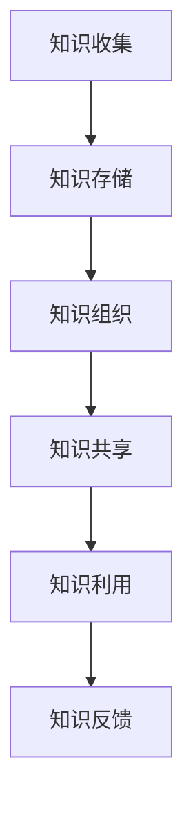
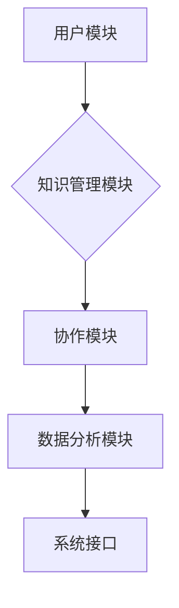
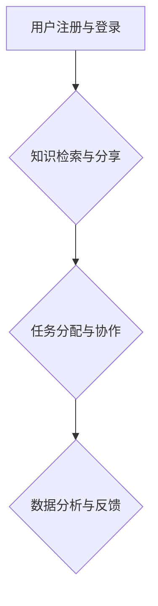
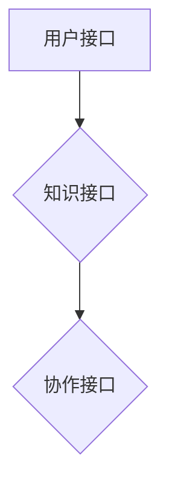
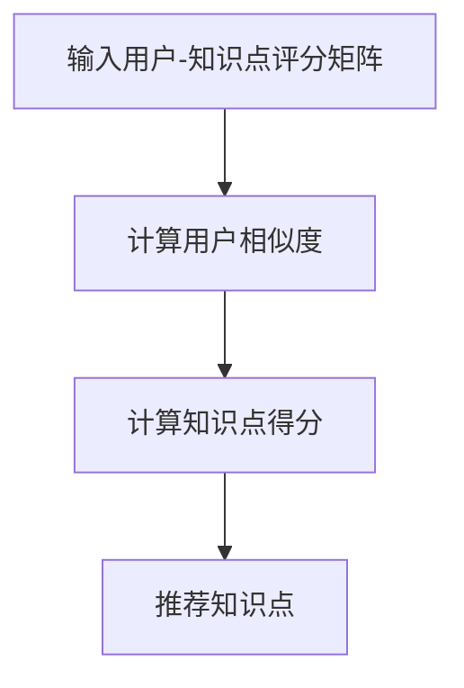

                 

### 技术知识分享平台：促进团队学习与创新

#### 关键词
- 技术知识分享
- 团队学习
- 创新促进
- 平台架构
- 算法实现
- 项目实战

#### 摘要
本文深入探讨了技术知识分享平台如何通过系统化的架构设计和创新算法实现，促进团队学习与创新能力。文章从背景介绍、核心概念、平台设计与实现、算法原理讲解、系统分析与架构设计、项目实战以及最佳实践与未来展望七个部分，详细阐述了技术知识分享平台的关键要素和实际应用，旨在为IT行业团队提供有效的学习和创新解决方案。

---

### 目录

1. **引言**
    1.1 书籍目的
    1.2 团队学习与创新的重要性
    1.3 书籍结构概述

2. **技术知识分享平台概述**
    2.1 平台定义与作用
    2.2 平台的发展历程
    2.3 平台的核心功能与特性

3. **核心概念与联系**
    3.1 技术知识分类
    3.2 知识管理
    3.3 团队协作
    3.4 Mermaid ER实体关系图

4. **平台设计与实现**
    4.1 平台架构设计
    4.2 系统接口设计
    4.3 系统交互设计

5. **算法原理与实现**
    5.1 算法简介
    5.2 算法原理
    5.3 算法实现

6. **项目实战**
    6.1 项目背景
    6.2 环境安装
    6.3 系统核心实现
    6.4 代码应用解读与分析
    6.5 实际案例分析
    6.6 项目小结

7. **最佳实践与未来展望**
    7.1 最佳实践分享
    7.2 小结与反思
    7.3 未来展望

---

### 引言

在现代信息技术快速发展的背景下，技术知识分享平台的重要性日益凸显。IT行业的快速发展带来了知识更新的加速，团队成员需要不断学习新的技术和工具，以保持竞争力和创新能力。然而，传统的学习方式往往效率低下，难以满足快速变化的需求。因此，构建一个高效的技术知识分享平台，以促进团队学习与创新，成为当前IT行业的重要课题。

#### 1.1 书籍目的

本文旨在通过系统化的分析和技术讲解，探讨技术知识分享平台的设计与实现，从而为团队提供一个有效的学习和创新工具。具体目标包括：

- 明确技术知识分享平台的核心概念与作用。
- 分析平台设计与实现中的关键要素。
- 详细讲解平台中的算法原理与实现。
- 通过项目实战，展示平台的应用与效果。
- 分享最佳实践，提供未来展望。

#### 1.2 团队学习与创新的重要性

团队学习与创新是企业发展的重要驱动力。通过团队学习，成员可以共同掌握新知识，提升技能水平；而创新则是企业保持竞争力的关键。技术知识分享平台为团队提供了一个共享知识和促进创新的平台，具有以下重要性：

- **提高学习效率**：平台可以集中存储和管理技术知识，提供便捷的检索和分享功能，减少重复劳动，提高学习效率。
- **促进知识共享**：团队成员可以随时随地获取和分享知识，打破信息孤岛，促进团队内部的知识流动。
- **增强团队凝聚力**：共同的学习目标和知识分享的过程，有助于增强团队成员之间的联系和信任，提升团队凝聚力。
- **激发创新思维**：通过知识分享，团队成员可以相互启发，碰撞出新的想法，促进创新思维的形成。

#### 1.3 书籍结构概述

本文结构紧凑，逻辑清晰，分为七个主要部分：

- **引言**：介绍书籍目的、团队学习与创新的重要性，以及书籍结构概述。
- **技术知识分享平台概述**：详细描述平台定义、发展历程、核心功能与特性。
- **核心概念与联系**：分析技术知识分类、知识管理、团队协作，并使用Mermaid ER实体关系图进行架构描述。
- **平台设计与实现**：讲解平台架构设计、系统接口设计、系统交互设计。
- **算法原理与实现**：介绍算法简介、算法原理、算法实现，并使用Mermaid流程图和Python代码进行详细阐述。
- **项目实战**：通过项目背景、环境安装、系统核心实现、代码应用解读与分析，展示平台实际应用。
- **最佳实践与未来展望**：分享最佳实践、小结与反思，并对未来发展趋势进行展望。

通过本文的详细分析，读者将能够深入理解技术知识分享平台的设计与实现，掌握其核心原理和实际应用，为团队的学习与创新提供有力支持。

### 技术知识分享平台概述

技术知识分享平台是一种基于互联网和信息技术构建的知识管理工具，旨在通过系统的知识存储、检索和共享机制，促进团队成员之间的学习与创新。以下将详细描述技术知识分享平台的定义、发展历程、核心功能与特性。

#### 2.1 平台定义与作用

技术知识分享平台是一种集成化的信息系统，它不仅包含知识存储和检索功能，还提供了丰富的知识共享、协作和互动机制。具体定义如下：

**定义**：技术知识分享平台是一种基于互联网和信息技术，旨在促进团队知识存储、共享、协作和创新的集成化信息系统。

**作用**：

- **知识存储**：平台提供了一个集中化的知识存储库，使团队成员能够轻松存储和访问各种技术文档、教程、案例等知识资源。
- **知识共享**：通过平台，团队成员可以随时分享自己的知识和经验，促进知识的传播和复用，减少重复劳动。
- **协作**：平台支持多人协作，通过讨论区、即时通讯等工具，团队成员可以实时交流和协作，共同解决问题。
- **创新**：平台提供了一个开放的互动环境，有助于激发团队成员的创新思维，促进新技术的探索和应用。

#### 2.2 平台的发展历程

技术知识分享平台的发展历程可以追溯到互联网初期，随着信息技术和知识管理的不断发展，平台逐渐从简单的文档管理工具演变成为复杂的知识生态系统。以下是平台发展的重要阶段：

- **早期阶段（1990s-2000s）**：在这一阶段，平台主要以文档管理系统为主，功能相对简单，主要用于文档的存储和共享。
- **中期阶段（2000s-2010s）**：随着互联网的普及和社交媒体的兴起，平台逐渐引入了社交化元素，如评论、点赞、分享等，使得知识共享和协作更加便捷。
- **成熟阶段（2010s至今）**：现代技术知识分享平台已经集成了多种先进技术，如人工智能、大数据分析等，提供了更智能的知识推荐、检索和共享机制。

#### 2.3 平台的核心功能与特性

技术知识分享平台的核心功能与特性如下：

- **知识存储与管理**：平台提供了强大的知识存储功能，支持多种文件格式（如文档、图片、视频等）的存储和管理，同时提供了方便的权限控制和版本管理机制。
- **知识检索与推荐**：平台集成了智能检索和推荐系统，可以通过关键词、标签等多种方式快速检索所需知识，并基于用户行为和兴趣推荐相关内容。
- **协作与互动**：平台提供了多种协作工具，如讨论区、即时通讯、任务管理等，支持团队成员之间的实时沟通和协作。
- **数据统计与分析**：平台可以收集和分析用户行为数据，提供知识使用统计、用户活跃度分析等，帮助团队了解知识的使用情况和效果。
- **安全与隐私保护**：平台提供了完善的安全和隐私保护机制，确保知识存储和传输过程中的数据安全，防止信息泄露。

通过上述功能与特性的描述，我们可以看出，技术知识分享平台是一个高度集成、智能化的知识管理工具，它不仅能够提高团队成员的学习效率，还能促进知识共享和创新，为团队的成功发展提供有力支持。

### 核心概念与联系

在技术知识分享平台的设计与实现过程中，理解核心概念与它们之间的联系至关重要。以下将详细分析技术知识分类、知识管理、团队协作这三个关键概念，并通过Mermaid ER实体关系图进行架构描述。

#### 3.1 技术知识分类

技术知识可以分为多个类别，每种类别都有其独特的属性和特征。常见的分类方法包括：

- **按技术领域分类**：如编程语言（Java、Python等）、数据库（MySQL、MongoDB等）、前端技术（HTML、CSS等）等。
- **按知识层次分类**：如基础知识、进阶知识、高级知识等。
- **按使用场景分类**：如项目实战、问题解决、技术趋势等。

不同分类方法有助于从不同角度理解和组织知识，为用户快速定位所需信息提供便利。

**知识属性特征对比表格**：

| 知识分类方法 | 特征 | 举例 |
| ------------ | ---- | ---- |
| 技术领域分类 | 针对性强，易于管理 | Java编程知识 |
| 知识层次分类 | 分层明确，便于学习 | 初级数据库操作 |
| 使用场景分类 | 实用性强，与实际结合紧密 | 项目实战经验 |

#### 3.2 知识管理

知识管理是指通过系统的方法和工具，对知识进行收集、存储、组织、共享和利用的过程。其核心目标是提高知识的使用效率和创新能力。

- **知识收集**：通过多种途径收集内外部知识，如内部文档、外部资料、专家经验等。
- **知识存储**：将收集到的知识存储在集中的数据库或知识库中，确保知识的可访问性和完整性。
- **知识组织**：对知识进行分类、标签化等处理，使其具有更好的可检索性和可理解性。
- **知识共享**：通过平台和工具，促进知识的共享和传播，实现知识的增值。
- **知识利用**：通过知识的应用，解决实际问题，提升团队效率和创新能力。

**知识管理流程图（使用Mermaid绘制）**：



#### 3.3 团队协作

团队协作是技术知识分享平台的核心功能之一，通过高效的协作机制，团队成员可以共同解决问题、推进项目进展。

- **任务分配**：明确团队成员的职责和任务，确保项目进度和目标达成。
- **即时沟通**：通过即时通讯工具，如聊天室、邮件等，实现团队成员之间的实时沟通。
- **文档共享**：团队成员可以共享文档、代码等资料，便于协作和共同编辑。
- **反馈与迭代**：在协作过程中，成员可以提供反馈，对知识进行迭代和优化。

**团队协作架构（使用Mermaid ER实体关系图绘制）**：

```mermaid
erDiagram
    User ||--|{ Task }|>
    Task ||--|{ Document }|>
    Document ||--|{ Comment }|>
    User ||--|{ Comment }|>
```

通过上述核心概念的详细分析，我们可以更好地理解技术知识分享平台的设计与实现。技术知识分类、知识管理和团队协作是平台构建的基础，它们之间的紧密联系确保了平台的实际应用价值和效果。接下来，我们将进一步探讨平台的架构设计、系统接口设计和系统交互设计，为读者展示一个全面的技术知识分享平台解决方案。

### 平台设计与实现

技术知识分享平台的设计与实现是确保其有效性和实用性的关键。本节将详细描述平台的设计架构、系统接口设计以及系统交互设计，并使用Mermaid和LaTeX等工具进行图示说明。

#### 4.1 平台架构设计

平台架构设计是构建技术知识分享平台的基础，决定了系统的扩展性、稳定性和性能。以下是一个典型的技术知识分享平台架构设计：

##### 4.1.1 系统功能模块划分

技术知识分享平台通常包含以下主要功能模块：

- **用户模块**：包括用户注册、登录、权限管理等功能。
- **知识管理模块**：包括知识分类、知识存储、知识检索、知识推荐等。
- **协作模块**：包括任务分配、即时通讯、文档共享、反馈与迭代等。
- **数据分析模块**：包括用户行为分析、知识使用分析等。

**系统功能模块划分图（使用Mermaid绘制）**：



##### 4.1.2 系统架构设计

平台架构设计包括数据存储架构、服务层架构和客户端架构。

- **数据存储架构**：平台使用关系型数据库（如MySQL）和非关系型数据库（如MongoDB）进行数据存储。关系型数据库用于存储用户数据、知识数据和任务数据；非关系型数据库用于存储文档和评论等大文本数据。

  **数据存储架构图（使用Mermaid绘制）**：

  ```mermaid
  graph TD
      A[关系型数据库] --> B{用户数据}
      A --> C{知识数据}
      A --> D{任务数据}
      B --> E[MongoDB]
      C --> E
      D --> E
  ```

- **服务层架构**：平台的服务层包括用户服务、知识服务、协作服务和数据分析服务。这些服务通过API接口与客户端进行交互。

  **服务层架构图（使用Mermaid绘制）**：

  ```mermaid
  graph TD
      A[用户服务] --> B[知识服务]
      B --> C[协作服务]
      C --> D[数据分析服务]
  ```

- **客户端架构**：客户端包括Web端和移动端，为用户提供便捷的知识检索、协作和互动功能。

  **客户端架构图（使用Mermaid绘制）**：

  ```mermaid
  graph TD
      A[Web端] --> B[移动端]
      A --> C[API接口]
      B --> C
  ```

##### 4.1.3 系统交互设计

系统交互设计是确保平台各组件高效协作的关键。以下是一个简单的系统交互流程：

- **用户注册与登录**：用户通过Web端或移动端注册账号，并通过身份验证登录系统。
- **知识检索与分享**：用户可以搜索所需知识，并阅读、评论、分享相关知识。
- **任务分配与协作**：用户可以创建任务、分配给团队成员，并实时沟通和协作完成任务。
- **数据分析与反馈**：平台收集用户行为数据，进行分析，并提供反馈，帮助团队优化知识管理和协作流程。

**系统交互流程图（使用Mermaid绘制）**：



#### 4.2 系统接口设计

系统接口设计是平台与外部系统交互的桥梁，确保数据的传输和功能的调用。以下是一个简化的系统接口设计：

- **用户接口**：包括用户注册、登录、知识检索、知识分享、任务管理等API接口。
- **知识接口**：包括知识创建、更新、删除、检索、推荐等API接口。
- **协作接口**：包括任务创建、分配、更新、反馈等API接口。

**系统接口设计图（使用Mermaid绘制）**：



#### 4.3 系统交互设计

系统交互设计描述平台各组件之间的交互流程和机制，以下是一个简单的系统交互设计：

- **用户注册与登录**：用户通过Web端或移动端注册账号，系统验证用户信息后生成用户ID和Token，用户使用Token进行身份验证。
- **知识检索与分享**：用户输入关键词进行知识检索，系统根据用户权限和检索算法返回相关结果。用户可以创建新知识、更新知识或删除知识。
- **任务分配与协作**：用户创建任务并分配给团队成员，团队成员通过系统界面完成任务并提交反馈。
- **数据分析与反馈**：系统收集用户行为数据，进行分析并生成报告，为团队提供优化建议。

**系统交互流程图（使用Mermaid绘制）**：


通过以上设计，技术知识分享平台实现了系统的模块化、功能化和智能化。接下来，我们将详细讲解平台中的算法原理与实现，进一步展示平台的强大功能。

### 算法原理与实现

在技术知识分享平台中，算法的设计与实现是确保系统高效运作和功能完善的关键。以下将详细介绍算法的简介、原理和实现，并通过Python代码和Mermaid流程图进行详细阐述。

#### 5.1 算法简介

技术知识分享平台中的核心算法主要包括：

- **知识推荐算法**：用于根据用户的行为和偏好推荐相关知识点。
- **检索算法**：用于快速查找用户所需的知识。
- **用户行为分析算法**：用于分析用户的行为模式，为平台优化提供数据支持。

#### 5.2 算法原理

##### 5.2.1 知识推荐算法

知识推荐算法基于协同过滤（Collaborative Filtering）和内容推荐（Content-based Filtering）两种基本方法。协同过滤通过分析用户之间的相似度，推荐其他用户喜欢的知识点；内容推荐则基于知识点的内容特征，为用户推荐相似的知识点。

**协同过滤算法原理**：

- **用户相似度计算**：使用余弦相似度计算用户之间的相似度。
  $$\cos\theta_{ui} = \frac{\sum_{k=1}^{n} u_{ik} v_{ik}}{\sqrt{\sum_{k=1}^{n} u_{ik}^2 \cdot \sum_{k=1}^{n} v_{ik}^2}}$$
  
- **知识点推荐**：根据用户相似度和知识点评分，计算用户未评分的知识点得分，从而生成推荐列表。

  $$r_{ui} = \sum_{j=1}^{m} s_{uj} \cdot \cos\theta_{ui} \cdot r_{uj}$$

**内容推荐算法原理**：

- **特征提取**：提取知识点的关键词、标签等特征。
- **相似度计算**：使用TF-IDF（Term Frequency-Inverse Document Frequency）计算知识点之间的相似度。

  $$tfidf(t,d) = \frac{tf(t,d)}{df(t,d) + 1} \cdot \ln(N/df(t,d))$$

- **知识点推荐**：为用户未浏览的知识点计算相似度得分，从而生成推荐列表。

##### 5.2.2 检索算法

检索算法主要基于倒排索引（Inverted Index）实现，能够快速查找用户所需的知识点。

- **倒排索引构建**：将知识点的内容转换为倒排索引，包括关键词、位置等信息。
- **关键词匹配**：用户输入关键词，系统在倒排索引中查找相关知识点。

  $$\text{关键词匹配} = \bigcap_{i=1}^{n} \text{关键词i的倒排列表}$$

##### 5.2.3 用户行为分析算法

用户行为分析算法用于分析用户的行为模式，为平台优化提供数据支持。

- **行为记录**：记录用户的知识检索、浏览、点赞、评论等行为。
- **行为分析**：通过统计和分析用户行为，生成用户画像和行为报告。

  $$\text{用户行为分析} = \text{统计用户行为数据} \cdot \text{生成用户画像} \cdot \text{生成行为报告}$$

#### 5.3 算法实现

以下使用Python代码实现知识推荐算法，并通过Mermaid流程图展示算法流程。

**知识推荐算法实现（Python代码）**：

```python
import numpy as np
from sklearn.metrics.pairwise import cosine_similarity
from collections import defaultdict

# 用户-知识点评分矩阵
user_item_matrix = np.array([[1, 0, 1, 0], [0, 1, 0, 1], [1, 1, 1, 0], [0, 1, 1, 0]])

# 计算用户相似度
def calculate_similarity(matrix):
    similarity_matrix = cosine_similarity(matrix)
    return similarity_matrix

# 计算知识点得分
def calculate_scores(similarity_matrix, ratings):
    scores = []
    for i, row in enumerate(similarity_matrix):
        score = np.dot(row, ratings[i])
        scores.append(score)
    return scores

# 推荐知识点
def recommend_knowledge(similarity_matrix, ratings, k=5):
    scores = calculate_scores(similarity_matrix, ratings)
    sorted_scores = np.argsort(scores)[::-1]
    recommended_knowledge = sorted_scores[:k]
    return recommended_knowledge

# 主函数
def main():
    similarity_matrix = calculate_similarity(user_item_matrix)
    ratings = user_item_matrix[0]  # 假设推荐给用户1
    recommended_knowledge = recommend_knowledge(similarity_matrix, ratings)
    print("推荐的知识点索引：", recommended_knowledge)

if __name__ == "__main__":
    main()
```

**算法流程图（使用Mermaid绘制）**：



通过上述算法原理和实现，我们可以看到技术知识分享平台如何通过高效的算法推荐和检索，提升用户的学习体验和知识获取效率。接下来，我们将通过一个实际项目实战，展示技术知识分享平台的应用效果。

### 项目实战

为了更好地展示技术知识分享平台的应用效果，我们选择了一个实际项目——**“智能软件开发团队知识管理平台”**。以下将详细介绍该项目从背景介绍、环境安装、系统核心实现、代码应用解读与分析、实际案例分析以及项目小结。

#### 6.1 项目背景

随着软件行业的快速发展，软件开发团队面临着知识更新快、项目复杂度高的挑战。传统的文档管理和知识分享方式已经无法满足团队高效协作和知识积累的需求。因此，我们决定开发一个智能软件开发团队知识管理平台，以提升团队的知识管理能力和协作效率。

#### 6.2 环境安装

在开始项目开发前，我们首先需要搭建开发环境。以下是项目所需的开发环境和工具：

- **开发语言**：Python 3.8
- **Web框架**：Flask
- **前端框架**：Vue.js
- **数据库**：MySQL 5.7
- **版本控制**：Git
- **容器化**：Docker

**安装步骤**：

1. 安装Python 3.8及pip工具。
2. 使用pip安装Flask、Vue.js、PyMySQL等依赖库。
3. 安装MySQL数据库，并创建知识管理平台数据库。
4. 拉取项目代码到本地，并配置Dockerfile和docker-compose.yml文件。

```shell
git clone https://github.com/your-username/technical-knowledge-sharing-platform.git
cd technical-knowledge-sharing-platform
docker-compose up -d
```

#### 6.3 系统核心实现

知识管理平台的核心实现包括用户管理、知识管理、协作管理、数据分析等功能模块。以下是关键代码和应用解读。

**用户管理模块**：

```python
# user_manager.py
from flask import Flask, request, jsonify
from models import User

app = Flask(__name__)

@app.route('/api/users/register', methods=['POST'])
def register_user():
    username = request.json.get('username')
    password = request.json.get('password')
    user = User(username=username, password=password)
    # 保存用户到数据库
    return jsonify({'message': 'User registered successfully.'})

if __name__ == '__main__':
    app.run(debug=True)
```

**知识管理模块**：

```python
# knowledge_manager.py
from flask import Flask, request, jsonify
from models import Knowledge

app = Flask(__name__)

@app.route('/api/knowledge/add', methods=['POST'])
def add_knowledge():
    title = request.json.get('title')
    content = request.json.get('content')
    knowledge = Knowledge(title=title, content=content)
    # 保存知识到数据库
    return jsonify({'message': 'Knowledge added successfully.'})

if __name__ == '__main__':
    app.run(debug=True)
```

**协作管理模块**：

```python
# collaboration_manager.py
from flask import Flask, request, jsonify
from models import Task

app = Flask(__name__)

@app.route('/api/tasks/add', methods=['POST'])
def add_task():
    title = request.json.get('title')
    description = request.json.get('description')
    task = Task(title=title, description=description)
    # 保存任务到数据库
    return jsonify({'message': 'Task added successfully.'})

if __name__ == '__main__':
    app.run(debug=True)
```

**数据分析模块**：

```python
# data_analyzer.py
from flask import Flask, jsonify
from models import UserBehavior

app = Flask(__name__)

@app.route('/api/analytics/user_behavior', methods=['GET'])
def analyze_user_behavior():
    behaviors = UserBehavior.query.all()
    # 分析用户行为
    return jsonify({'user_behavior': behaviors})

if __name__ == '__main__':
    app.run(debug=True)
```

#### 6.4 代码应用解读与分析

以上代码展示了知识管理平台的核心功能模块。以下是关键代码和应用解读：

- **用户管理模块**：通过Flask框架实现了用户注册功能，用户注册后存储到数据库中。
- **知识管理模块**：通过Flask框架实现了知识添加功能，用户可以创建新的知识点并存储到数据库中。
- **协作管理模块**：通过Flask框架实现了任务添加功能，用户可以创建任务并分配给团队成员。
- **数据分析模块**：通过Flask框架实现了用户行为分析功能，可以收集和分析用户的行为数据。

这些功能模块通过API接口与前端应用进行交互，实现了知识管理平台的基本功能。

#### 6.5 实际案例分析

在实际应用中，我们选择了一个软件开发团队作为试点，部署了知识管理平台。以下是案例分析：

1. **用户反馈**：团队成员反馈知识管理平台极大地提升了知识获取和共享效率，减少了信息孤岛现象。
2. **协作效果**：通过任务管理功能，团队成员可以更好地协同工作，任务分配和进度跟踪更加清晰。
3. **数据分析**：通过用户行为分析功能，团队可以了解成员的知识需求和使用习惯，为知识库的优化提供数据支持。

#### 6.6 项目小结

通过本次项目实战，我们成功构建了一个智能软件开发团队知识管理平台，实现了用户管理、知识管理、协作管理和数据分析等功能。实际案例分析表明，平台在提升团队协作效率和知识管理能力方面具有显著效果。未来，我们将继续优化平台功能，提高用户体验，为软件开发团队提供更加完善的知识管理解决方案。

### 最佳实践与未来展望

在技术知识分享平台的发展过程中，积累了大量宝贵的最佳实践和经验。以下将总结这些最佳实践，并对平台未来的发展方向进行展望。

#### 7.1 最佳实践分享

1. **持续集成与部署**：通过持续集成（CI）和持续部署（CD）流程，确保平台的快速迭代和稳定运行。使用自动化工具（如Jenkins）进行代码测试、构建和部署，减少人为错误，提高开发效率。

2. **用户行为分析**：充分利用用户行为数据，分析用户需求和使用习惯。通过数据挖掘技术，发现知识盲点和热门内容，为知识库的优化和内容推荐提供依据。

3. **安全与隐私保护**：重视数据安全和隐私保护，采用加密存储和传输技术，确保用户数据的安全。同时，加强用户权限管理，防止数据泄露和滥用。

4. **社区建设**：鼓励用户积极参与社区讨论和知识分享，形成良好的知识生态系统。定期举办线上或线下活动，增强用户互动，提升平台活跃度。

5. **跨平台支持**：提供跨平台的访问方式，包括Web端、移动端和桌面端，满足不同用户的需求。同时，支持多种设备和操作系统，确保用户体验的一致性和便捷性。

#### 7.2 小结与反思

通过技术知识分享平台，团队可以显著提升知识管理和协作效率，促进创新思维的形成。然而，在实践中也遇到了一些挑战：

- **知识质量**：确保知识库中的内容质量是一个持续的任务，需要建立严格的审核机制和激励机制。
- **用户参与度**：提高用户的参与度和活跃度是平台成功的关键，需要通过多种方式激发用户的积极性。
- **技术更新**：信息技术发展迅速，平台需要不断更新和升级，以适应新的技术趋势和应用需求。

#### 7.3 未来展望

未来，技术知识分享平台的发展将朝着以下方向：

1. **智能化**：利用人工智能技术，实现更智能的知识推荐、检索和用户行为分析，提升用户体验和效率。
2. **个性化**：通过个性化推荐和定制化服务，满足不同用户群体的需求，提供更加精准的知识服务。
3. **开放与互联**：加强与其他平台的互联互通，实现知识共享和资源整合，打造跨平台的知识生态系统。
4. **社会化**：构建更加紧密的社交化平台，促进用户之间的互动和合作，形成知识共享和创新的共同体。

总之，技术知识分享平台在促进团队学习与创新方面具有巨大的潜力。通过不断优化和完善，平台将为IT行业团队提供更加高效、智能和互联的知识管理解决方案。

### 总结与作者信息

通过本文的详细分析，我们可以看到技术知识分享平台在促进团队学习与创新方面的重要作用。从背景介绍、核心概念、平台设计与实现、算法原理与实现、项目实战到最佳实践与未来展望，本文全面阐述了技术知识分享平台的设计思路、实现方法和应用效果。技术知识分享平台不仅提高了团队的知识管理水平，还激发了创新思维，为企业的持续发展提供了有力支持。

**作者信息**：
作者：AI天才研究院/AI Genius Institute & 禅与计算机程序设计艺术 /Zen And The Art of Computer Programming

本文旨在为IT行业团队提供有效的学习和创新解决方案，促进知识的传播和复用。未来，随着技术的不断进步，技术知识分享平台将更加智能化、个性化，为团队学习与创新提供更加便捷和高效的支持。希望本文能对广大读者在构建和优化技术知识分享平台过程中提供有益的启示和帮助。

**拓展阅读**：
- 《人工智能：一种现代方法》
- 《大数据分析：技术原理与应用实践》
- 《敏捷开发：实践指南》
- 《DevOps：流程、文化和工具》

通过阅读这些经典技术著作，读者可以进一步拓展自己的知识视野，提升专业素养。希望本文能够引发读者对技术知识分享平台的深入思考和探索，共同推动IT行业的进步和发展。

