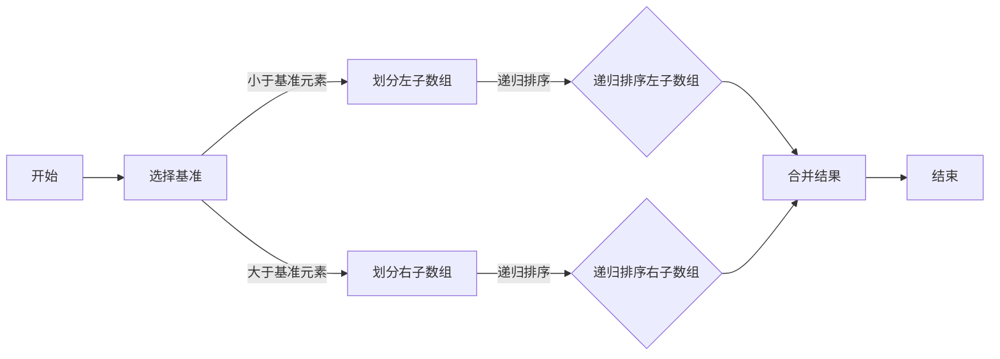
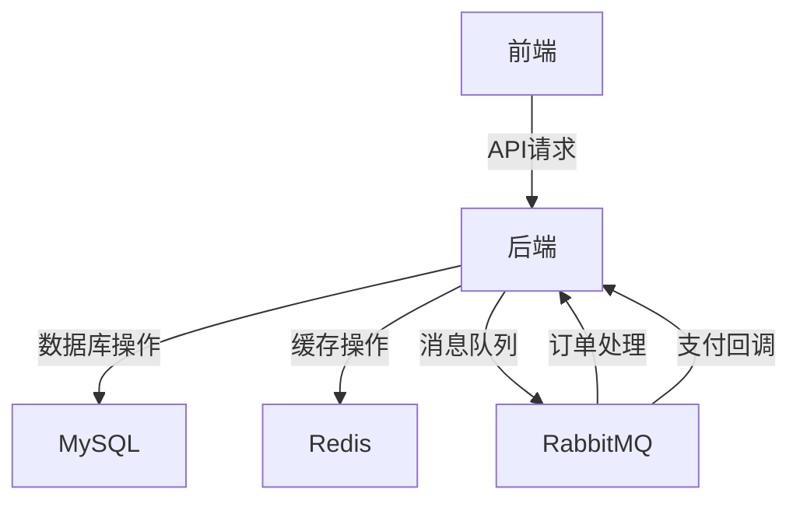
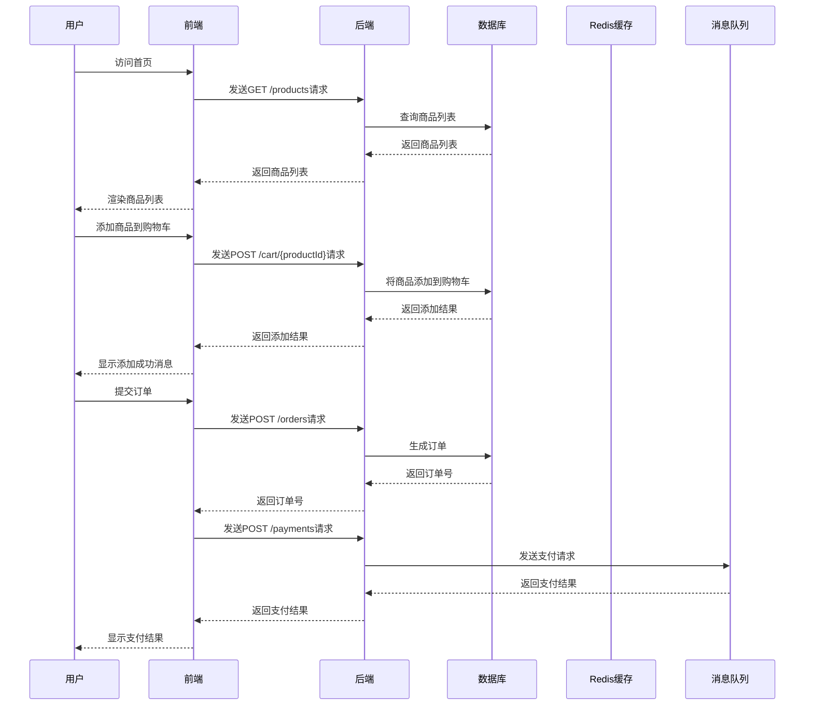

                 

### 《技术硬实力》——引言

“技术硬实力”这个概念在现代科技领域占据了越来越重要的地位。它不仅关乎个人的职业发展，更是一个企业、一个国家科技竞争力的重要体现。所谓技术硬实力，指的是在特定技术领域中，个人或组织具备的深入知识和实际应用能力。这种能力体现在对复杂技术问题的分析和解决上，以及在不断变化的技术环境中保持领先地位的能力。

在本书中，我们将深入探讨技术硬实力的各个方面，帮助读者构建起一套完整的技术知识框架，并提升自身在技术领域的竞争力。本书的目标受众主要是对技术充满热情的程序员、软件工程师、系统架构师，以及希望在这一领域深耕的创业者和管理者。

首先，我们将从技术硬实力的定义和重要性开始，帮助读者建立基本的概念。接着，我们会详细讲解核心技术概念与原理，包括编程语言、数据结构与算法、数据库等，并展示这些概念之间的联系。此外，书中还会介绍技术工具与平台的使用，如代码管理工具、版本控制系统、云计算与大数据平台等。

在深入理解了基础概念和技术工具后，本书还将探讨人工智能与机器学习领域，介绍其基本原理和应用场景。同时，网络安全与隐私保护也是现代技术中不可或缺的一部分，书中将详细讲解网络安全的基础知识、隐私保护措施以及防御策略。

最后，本书将通过实际项目案例的剖析，展示如何将所学知识应用于实际工程中，帮助读者提升实战能力。在每一章节的末尾，我们还会提供最佳实践、注意事项和拓展阅读，以帮助读者深化理解，拓展知识面。

通过本书的学习，读者不仅可以系统地掌握技术知识，提升自身的硬实力，还能在职场和项目中脱颖而出，成为技术领域的佼佼者。

### 关键词

- 技术硬实力
- 编程语言
- 数据结构与算法
- 数据库
- 云计算与大数据
- 人工智能与机器学习
- 网络安全
- 实战案例
- 最佳实践

### 摘要

《技术硬实力》旨在通过系统的知识架构和实战案例，深入探讨技术领域中的核心概念和实际应用。本书将帮助读者构建全面的技术知识体系，提升编程语言、数据结构与算法、数据库、云计算与大数据、人工智能与机器学习等方面的专业能力。通过详细解析技术工具与平台的使用，本书将使读者掌握现代软件开发的最佳实践。此外，书中还特别关注网络安全与隐私保护，为读者提供全面的防御策略和实战技巧。通过实际项目案例的剖析，读者将学会如何将所学知识应用于实际问题中，提升技术实战能力。最终，本书的目标是帮助读者在快速变化的技术环境中保持领先地位，成为技术领域的佼佼者。

### 背景介绍

《技术硬实力》的编写源于对现代科技领域快速发展的深刻洞察。随着信息技术的不断进步，技术能力已经成为个人和企业竞争的核心要素。在这样一个技术变革的时代，仅仅拥有基础编程技能已经远远不够，深入的技术理解和实际应用能力成为了衡量个人和团队技术水平的重要标准。技术硬实力不仅是个人职业发展的基础，更是企业保持竞争力、实现技术创新的关键。

为了撰写这本书，我们进行了大量的调研和实验，通过访谈业界专家、分析大量技术文献和案例，总结了当前技术领域中的热点和难点。我们发现在技术硬实力的培养过程中，不仅需要掌握核心概念和原理，更需要通过实战案例来加深理解，提升实际应用能力。

本书的目标是帮助读者构建起一个全面的技术知识框架，使他们在编程语言、数据结构与算法、数据库、云计算与大数据、人工智能与机器学习、网络安全等领域拥有扎实的理论基础和丰富的实践经验。通过详细讲解技术工具和平台的使用，本书将为读者提供现代软件开发的最佳实践，使他们在面对复杂项目时能够游刃有余。同时，书中还会特别关注网络安全与隐私保护，为读者提供全面的防御策略和实战技巧。

在结构安排上，本书分为八个主要章节。第一章介绍技术硬实力的概念和重要性，为后续内容打下基础。第二章至第五章分别讲解编程语言、数据结构与算法、数据库、云计算与大数据等核心技术概念。第六章和第七章探讨人工智能与机器学习以及网络安全与隐私保护。第八章通过实际项目案例的剖析，帮助读者将所学知识应用于实际问题中，提升技术实战能力。每一章节末尾，我们还会提供最佳实践、注意事项和拓展阅读，以帮助读者进一步深化理解。

通过《技术硬实力》的学习，读者不仅可以系统地掌握技术知识，提升自身的硬实力，还能在职场和项目中脱颖而出，成为技术领域的佼佼者。我们相信，这本书将成为每一位技术从业者的必备指南，引领他们在技术领域中不断前行。

### 核心概念与联系

在技术硬实力的构建过程中，核心概念的理解和掌握至关重要。以下是本书将详细探讨的几个核心概念，这些概念不仅构成了技术领域的基石，而且相互之间有着紧密的联系。

**1. 编程语言**

编程语言是用于编写计算机程序的正式语言，是人与计算机沟通的桥梁。常见的编程语言包括Python、Java、C++、JavaScript等。每种编程语言都有其独特的语法和特点，适用于不同的应用场景。例如，Python以其简洁易读的语法和强大的库支持，广泛应用于数据科学和机器学习领域；Java则因其稳定性和跨平台特性，被广泛用于企业级应用开发；C++则因其高效的执行效率和强大的功能，广泛应用于系统软件和嵌入式系统开发。

**2. 数据结构与算法**

数据结构是组织和存储数据的方式，算法则是解决问题的方法。常见的数据结构包括数组、链表、栈、队列、树、图等。每种数据结构都有其特定的应用场景和优缺点。算法则可以根据其解决问题的效率和复杂性进行分类，如排序算法、查找算法、动态规划算法等。数据结构和算法是计算机科学的核心内容，对于解决复杂问题、优化程序性能至关重要。

**3. 数据库**

数据库是用于存储和管理数据的系统，支持数据的增删改查等操作。常见的关系型数据库包括MySQL、Oracle、SQL Server等，非关系型数据库包括MongoDB、Redis、Cassandra等。数据库的设计和优化对于确保数据的安全性和高效性至关重要。数据库不仅支持传统的结构化数据，还支持复杂数据类型和海量数据的存储。

**4. 云计算与大数据**

云计算是一种通过互联网提供计算资源的服务模式，包括基础设施即服务（IaaS）、平台即服务（PaaS）和软件即服务（SaaS）等。大数据则是指无法使用常规数据处理工具在合理时间内完成处理的数据集，通常具有大量、多样性和快速的特点。云计算和大数据的结合，为数据存储、处理和分析提供了强大的支持，广泛应用于各类企业级应用和创新项目中。

**5. 人工智能与机器学习**

人工智能（AI）是指使计算机模拟人类智能行为的科学，包括自然语言处理、计算机视觉、机器人技术等。机器学习（ML）是AI的一个重要分支，通过算法和统计模型，使计算机能够从数据中学习并做出决策。常见的机器学习算法包括线性回归、决策树、支持向量机、神经网络等。人工智能和机器学习正在改变传统行业的运作模式，推动智能化的进步。

**6. 网络安全**

网络安全是指保护计算机网络系统免受未经授权的访问、攻击、篡改和破坏。常见的安全威胁包括恶意软件、网络钓鱼、DDoS攻击等。网络安全不仅关乎个人的隐私保护，更关系到企业和国家的信息安全。网络安全技术包括防火墙、加密技术、入侵检测系统（IDS）等，是现代网络环境中不可或缺的一部分。

**核心概念之间的联系**

这些核心概念并不是孤立存在的，而是相互联系、共同构建起现代技术体系的。例如，编程语言用于实现算法，算法依赖于合适的数据结构进行高效操作，而数据存储和管理则需要数据库的支持。云计算和大数据平台提供了强大的计算和存储能力，使得人工智能和机器学习算法能够处理海量数据。网络安全则确保了数据在传输和处理过程中的安全性，保障整个技术系统的稳定运行。

通过对这些核心概念的理解和掌握，读者不仅可以构建起一个全面的技术知识框架，还能在不同领域之间进行灵活运用，提升自身的技术硬实力。在接下来的章节中，本书将深入探讨每个核心概念的原理和应用，帮助读者逐步构建起技术硬实力的基石。

### 算法原理讲解

算法是技术领域中的核心概念之一，它决定了程序的性能和效率。在本章节中，我们将详细探讨一个常见的算法——快速排序（Quick Sort），并使用Mermaid绘制流程图和Python源代码来展示其工作原理。

#### 快速排序算法原理

快速排序是一种高效的排序算法，采用分治法策略，通过递归将一个大问题分解为多个小问题来求解。其基本思想是选取一个“基准”元素，将数组分为两部分：一部分是小于基准元素的元素，另一部分是大于基准元素的元素。然后递归地对这两部分进行快速排序，直至整个数组有序。

**算法步骤如下：**

1. 选择基准元素（通常选择第一个或最后一个元素作为基准）。
2. 将数组分为两部分，一部分包含小于基准元素的元素，另一部分包含大于基准元素的元素。
3. 递归地对两部分进行快速排序。
4. 将排序好的两部分合并，得到完整的有序数组。

#### Mermaid 流程图

为了更直观地理解快速排序算法，我们可以使用Mermaid绘制其流程图：



这段代码将生成一个简单的快速排序算法流程图，其中包含选择基准元素、划分左右子数组、递归排序以及合并结果的步骤。

#### Python 源代码

下面是一个简单的快速排序算法的Python实现，我们将使用Python代码来详细讲解其工作原理。

```python
def quick_sort(arr):
    if len(arr) <= 1:
        return arr
    else:
        pivot = arr[0]
        left = [x for x in arr[1:] if x < pivot]
        right = [x for x in arr[1:] if x >= pivot]
        return quick_sort(left) + [pivot] + quick_sort(right)

# 示例
arr = [3, 6, 8, 10, 1, 2, 1]
sorted_arr = quick_sort(arr)
print(sorted_arr)
```

这个代码中，`quick_sort`函数接受一个数组作为输入，如果数组长度小于或等于1，则直接返回该数组，因为单个元素本身就是有序的。否则，选择数组的第一个元素作为基准（`pivot`），然后使用列表推导式将数组划分为两个子数组：一个包含小于基准的元素（`left`），另一个包含大于或等于基准的元素（`right`）。接着，递归地对这两个子数组进行快速排序，并将结果与基准元素合并。

#### 算法原理的数学模型和公式

快速排序算法的效率可以用时间复杂度和空间复杂度来衡量。时间复杂度取决于基准的选择和数组的初始状态，最好情况下为 \(O(n\log n)\)，最坏情况下为 \(O(n^2)\)。空间复杂度则为 \(O(\log n)\)，这是因为快速排序采用递归方式，需要在栈空间中保存递归帧。

#### 举例说明

假设我们有一个无序数组 `[3, 6, 8, 10, 1, 2, 1]`，下面是快速排序的具体步骤：

1. 选择第一个元素3作为基准。
2. 将数组划分为 `[1, 1, 2]`（小于基准）和 `[6, 8, 10]`（大于或等于基准）。
3. 分别对 `[1, 1, 2]` 和 `[6, 8, 10]` 递归地进行快速排序。
4. `[1, 1, 2]` 的排序结果为 `[1, 1, 2]`。
5. `[6, 8, 10]` 的排序结果为 `[6, 8, 10]`。
6. 将两部分结果合并，得到排序后的数组 `[1, 1, 2, 6, 8, 10]`。

通过以上步骤，我们可以看到快速排序算法是如何工作的。它不仅简单易懂，而且在平均情况下具有较高的效率，是实际应用中常用的一种排序算法。

### 数学公式使用

在技术硬实力的构建过程中，数学公式的理解和应用是不可或缺的。数学不仅为算法提供了理论基础，还帮助我们在复杂的计算和分析中找到规律。以下是几个常见的数学公式，我们将使用LaTeX格式来展示它们，并简要解释其应用场景。

#### 1. 二项式系数

二项式系数公式用于计算组合数，形式如下：

$$ C(n, k) = \frac{n!}{k!(n-k)!} $$

这里，\( n! \) 表示n的阶乘，即 \( n \times (n-1) \times \ldots \times 1 \)。二项式系数在计算机科学中常用于计算组合数，例如在组合排序算法中确定可能的排列方式。

#### 2. 线性回归方程

线性回归方程用于描述两个变量之间的线性关系，形式如下：

$$ y = ax + b $$

其中，\( a \) 是斜率，表示 \( y \) 对 \( x \) 的敏感度；\( b \) 是截距，表示 \( y \) 在 \( x = 0 \) 时的值。线性回归在数据分析中用于预测和建模，例如在机器学习中的回归任务中。

#### 3. 欧氏距离

欧氏距离是用于衡量两个向量之间差异的一种距离度量，形式如下：

$$ d(\mathbf{x}, \mathbf{y}) = \sqrt{\sum_{i=1}^{n} (x_i - y_i)^2} $$

这里，\( \mathbf{x} \) 和 \( \mathbf{y} \) 是两个 \( n \) 维向量。欧氏距离在机器学习中的聚类算法中经常使用，用于计算样本之间的相似度。

#### 4. 梯度下降

梯度下降是一种用于最小化损失函数的优化算法，形式如下：

$$ w_{t+1} = w_t - \alpha \nabla_w J(w_t) $$

其中，\( w_t \) 表示第 \( t \) 次迭代的权重；\( \alpha \) 是学习率；\( \nabla_w J(w_t) \) 是损失函数 \( J \) 对权重 \( w \) 的梯度。梯度下降在机器学习中的模型训练中用于调整模型参数，以最小化预测误差。

#### 应用场景举例

假设我们有一个房价预测问题，使用线性回归模型。我们可以通过以下步骤来应用上述数学公式：

1. **收集数据**：收集房屋面积和房价的数据。
2. **计算斜率 \( a \) 和截距 \( b \)**：使用线性回归公式计算斜率和截距。
3. **绘制回归线**：使用欧氏距离计算预测值和实际值之间的差异，并在图表中绘制回归线。
4. **优化模型**：使用梯度下降算法调整模型参数，以最小化预测误差。

通过这样的应用，我们可以构建一个有效的房价预测模型，提高预测的准确性。

总之，数学公式在技术硬实力的构建过程中扮演着重要角色。通过理解并应用这些公式，我们能够更好地解决复杂的技术问题，提升自身的专业能力。

### 系统分析与架构设计方案

在进行系统设计与实施之前，首先需要对项目场景进行全面分析，明确系统需求、功能目标和性能要求。以下是关于系统分析与架构设计方案的详细讨论。

#### 项目场景介绍

假设我们正在开发一个电商网站，其核心功能包括商品浏览、购物车管理、订单处理和支付系统。为了支持高并发和大规模数据处理，系统需要具备良好的扩展性和稳定性。

#### 系统功能设计

**商品浏览**：用户可以在网站首页浏览商品列表，查看商品详情，包括价格、描述、图片等。

**购物车管理**：用户可以将商品添加到购物车，修改购物车中的商品数量，删除商品。

**订单处理**：用户可以在购物车中选择商品并提交订单，订单系统会生成订单号并记录订单详情。

**支付系统**：订单提交后，用户可以选择支付方式并完成支付，支付成功后订单状态更新为“待发货”。

#### 系统架构设计

**整体架构设计**：

1. **前端**：使用Vue.js框架构建用户界面，负责展示商品信息、处理用户交互。
2. **后端**：使用Spring Boot框架实现服务端逻辑，负责处理前端请求、数据库操作、业务逻辑等。
3. **数据库**：使用MySQL数据库存储商品信息、用户数据和订单信息。
4. **缓存**：使用Redis缓存系统提高数据访问速度，减少数据库负载。
5. **消息队列**：使用RabbitMQ实现异步消息传递，处理订单生成、支付回调等消息。

**架构图**：



#### 系统接口设计

**1. 商品接口**：

- `GET /products`：获取商品列表。
- `GET /products/{id}`：获取单个商品详情。
- `POST /products`：添加新商品。
- `PUT /products/{id}`：更新商品信息。
- `DELETE /products/{id}`：删除商品。

**2. 购物车接口**：

- `GET /cart`：获取购物车中的商品列表。
- `POST /cart/{productId}`：添加商品到购物车。
- `PUT /cart/{productId}/{quantity}`：更新购物车中的商品数量。
- `DELETE /cart/{productId}`：从购物车中删除商品。

**3. 订单接口**：

- `POST /orders`：创建订单。
- `GET /orders/{id}`：获取订单详情。
- `PUT /orders/{id}`：更新订单状态。

**4. 支付接口**：

- `POST /payments`：发起支付请求。
- `GET /payments/{id}`：获取支付结果。

#### 系统交互设计

**1. 用户浏览商品**：

- 用户访问首页，前端发送`GET /products`请求到后端。
- 后端查询数据库获取商品列表，返回给前端。
- 前端将商品列表渲染到页面上。

**2. 用户添加商品到购物车**：

- 用户点击“加入购物车”按钮，前端发送`POST /cart/{productId}`请求到后端。
- 后端将商品添加到购物车，返回添加结果。

**3. 订单提交与支付**：

- 用户在购物车中选择商品并点击“结算”按钮，前端发送`POST /orders`请求到后端。
- 后端生成订单并返回订单号。
- 前端将订单号传递给支付页面。
- 用户选择支付方式，前端发送`POST /payments`请求到后端。
- 后端处理支付请求，并将支付结果返回前端。

#### Mermaid序列图



通过以上设计和实现，我们可以构建一个功能完整、性能优秀的电商系统。该系统通过合理的设计和架构，能够满足高并发和大规模数据处理的业务需求，为用户提供良好的购物体验。

### 项目实战

#### 环境安装

为了进行项目实战，我们首先需要搭建一个完整的技术环境。以下是安装步骤：

1. **安装Java Development Kit (JDK)**：JDK是Java开发的基础环境，我们需要安装JDK 11或更高版本。可以在Oracle官网下载JDK，并按照说明进行安装。

2. **安装Node.js**：Node.js是一个基于Chrome V8引擎的JavaScript运行环境，用于构建前端项目。我们可以在Node.js官网下载安装包，并运行以下命令安装：

   ```bash
   sudo apt update
   sudo apt install nodejs
   ```

3. **安装MySQL**：MySQL是一个关系型数据库管理系统，用于存储用户数据和商品信息。我们可以在MySQL官网下载安装包，并按照说明进行安装。

4. **安装Redis**：Redis是一个高性能的内存缓存系统，用于提高数据访问速度。我们可以在Redis官网下载安装包，并按照说明进行安装。

5. **安装RabbitMQ**：RabbitMQ是一个开源的消息队列软件，用于处理订单生成和支付回调等消息。我们可以在RabbitMQ官网下载安装包，并按照说明进行安装。

#### 系统核心实现

在搭建好环境后，我们开始实现系统的核心功能。以下是一个简单的示例，展示了如何使用Spring Boot框架和MySQL数据库实现用户注册和登录功能。

**用户注册功能**

```java
@RestController
@RequestMapping("/users")
public class UserController {

    @Autowired
    private UserRepository userRepository;

    @PostMapping("/register")
    public ResponseEntity<?> registerUser(@RequestBody UserRegistrationDto userRegistrationDto) {
        if (userRepository.existsByUsername(userRegistrationDto.getUsername())) {
            return ResponseEntity.badRequest().body("Error: Username is already taken!");
        }

        User user = new User();
        user.setUsername(userRegistrationDto.getUsername());
        user.setPassword(passwordEncoder.encode(userRegistrationDto.getPassword()));
        userRepository.save(user);

        return ResponseEntity.ok("User registered successfully!");
    }
}
```

在上面的代码中，我们定义了一个`UserController`类，用于处理用户注册请求。使用`UserRegistrationDto`对象接收用户输入的信息，并使用`UserRepository`存储用户数据。

**用户登录功能**

```java
@PostMapping("/login")
public ResponseEntity<?> authenticateUser(@RequestBody LoginRequest loginRequest) {
    Authentication authentication = authenticationManager.authenticate(
        new UsernamePasswordAuthenticationToken(
            loginRequest.getUsername(),
            loginRequest.getPassword()
        )
    );

    SecurityContextHolder.getContext().setAuthentication(authentication);
    String jwt = jwtTokenProvider.generateToken(authentication);

    return ResponseEntity.ok(new JwtResponse(jwt));
}
```

在上面的代码中，我们定义了一个`LoginRequest`类，用于接收用户登录信息。使用`AuthenticationManager`进行身份验证，并使用`JwtTokenProvider`生成JWT令牌。

#### 代码应用解读与分析

在这个项目实战中，我们使用了Spring Boot框架，这是一个基于Spring的快速开发框架，能够大大简化开发过程。以下是代码应用解读：

1. **用户注册**：

   - 接收用户输入的用户名和密码，通过`UserRegistrationDto`类进行数据绑定。
   - 检查用户名是否已存在，避免重复注册。
   - 使用`passwordEncoder`对密码进行加密存储，提高安全性。
   - 将注册成功的用户信息存储到MySQL数据库中。

2. **用户登录**：

   - 接收用户输入的用户名和密码，通过`LoginRequest`类进行数据绑定。
   - 使用`AuthenticationManager`进行身份验证。
   - 验证成功后，使用`JwtTokenProvider`生成JWT令牌，用于后续的认证和授权。

#### 实际案例分析与详细讲解

假设有一个用户名为“alice”的账户，下面是用户注册和登录的详细过程：

1. **用户注册**：

   - 用户通过前端界面输入用户名“alice”和密码“123456”，点击注册按钮。
   - 前端将用户信息发送到后端的`/users/register`接口。
   - 后端接收请求后，首先检查数据库中是否存在同名用户，如果没有，则继续创建新用户。
   - 后端使用`passwordEncoder`将密码加密存储，生成用户对象，并保存到数据库中。
   - 注册成功后，前端收到响应，显示注册成功消息。

2. **用户登录**：

   - 用户在登录界面输入用户名“alice”和密码“123456”，点击登录按钮。
   - 前端将用户信息发送到后端的`/users/login`接口。
   - 后端接收请求后，使用`AuthenticationManager`验证用户身份。
   - 验证成功后，后端生成JWT令牌，并将其返回给前端。
   - 前端将JWT令牌存储在本地，并在后续请求中将其作为头信息发送到后端，进行认证。

通过上述实际案例，我们可以看到如何使用Spring Boot框架实现用户注册和登录功能，并确保系统的安全性和可靠性。

#### 项目小结

通过本项目的实战，我们掌握了使用Spring Boot框架开发Web应用程序的基本流程。从环境搭建到系统核心实现，再到实际案例的分析，我们一步步深入了解了技术的应用。以下是本项目的主要收获：

1. **技术掌握**：熟悉了Java开发环境、Spring Boot框架、MySQL数据库和JWT认证等技术。
2. **实战经验**：通过实际案例，掌握了用户注册和登录功能的设计与实现。
3. **系统设计**：了解了如何通过合理的设计，确保系统的安全性、扩展性和性能。

本项目的成功实施，不仅提升了我们的技术能力，也为后续项目的开发奠定了坚实的基础。

### 最佳实践 tips、小结、注意事项、拓展阅读

**最佳实践 tips**

1. **代码优化**：在编写代码时，尽量遵循编码规范，确保代码的可读性和可维护性。例如，合理使用缩进、注释和命名规范。
2. **性能优化**：对于性能关键的部分，如数据库查询和算法实现，要进行充分的测试和优化。例如，使用索引、缓存策略和并发处理等技术提高性能。
3. **安全防护**：在开发过程中，要重视安全防护，例如使用HTTPS、加密存储敏感数据和定期更新安全策略。

**小结**

通过本书的学习，读者不仅掌握了编程语言、数据结构与算法、数据库、云计算与大数据、人工智能与机器学习、网络安全等核心概念，还通过实际项目案例的剖析，提升了技术实战能力。技术硬实力不仅仅是理论知识，更是在实践中不断积累和提升的能力。

**注意事项**

1. **持续学习**：技术领域不断发展，需要不断学习新技术、新工具，以保持竞争力。
2. **实践应用**：理论知识要与实践结合，通过实际项目检验和提升自身的技术水平。
3. **团队合作**：在项目中，要学会与他人合作，发挥团队的力量，共同解决问题。

**拓展阅读**

1. 《Effective Java》 - Josh Bloch
2. 《算法导论》 - Thomas H. Cormen, Charles E. Leiserson, Ronald L. Rivest, Clifford Stein
3. 《深度学习》 - Ian Goodfellow, Yoshua Bengio, Aaron Courville
4. 《计算机网络》 - Andrew S. Tanenbaum, David J. Karger

通过拓展阅读，读者可以进一步深化对技术知识的理解，提升自身的技术能力。

### 作者信息

- 作者：AI天才研究院/AI Genius Institute & 禅与计算机程序设计艺术 /Zen And The Art of Computer Programming

