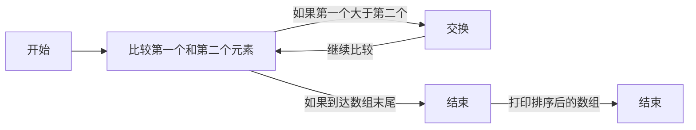
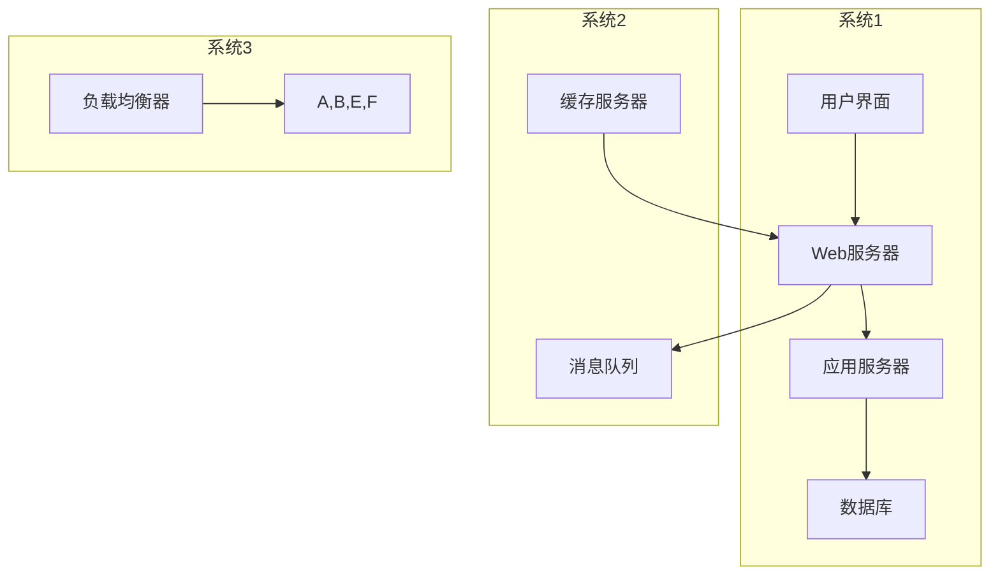
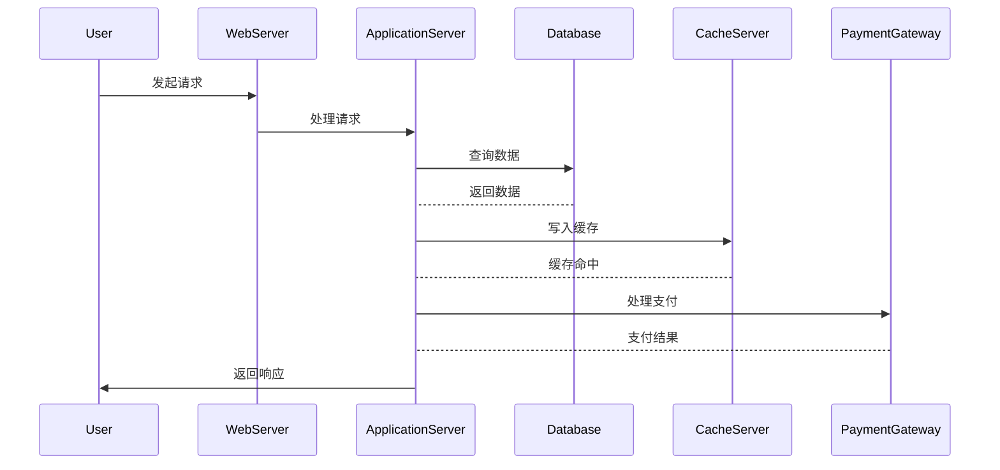
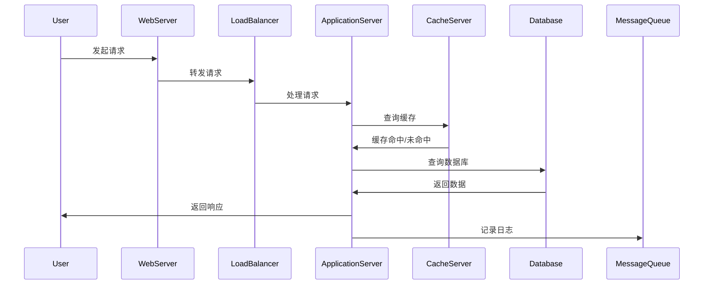

                 

### 完整文章

# 技术硬实力、架构力和领导力的平衡

## 关键词

技术硬实力、架构力、领导力、平衡、IT领域

## 摘要

本文深入探讨了技术硬实力、架构力和领导力在IT领域的平衡。通过分析技术硬实力的基础，架构力的重要性以及领导力的作用，本文提出了一个平衡这三者关系的框架，并提供了一系列最佳实践和策略。文章旨在帮助IT专业人士在追求个人成长的同时，为团队和组织带来更大的成功。

### 引言

在快速发展的IT行业中，技术硬实力、架构力和领导力这三者被认为是成功的关键因素。技术硬实力是指专业知识和技能的深度与广度，架构力则体现在系统设计和实施的能力上，而领导力则是确保团队朝着共同目标前进的核心。本文将探讨如何在日常工作中实现这三者的平衡。

### 技术硬实力

技术硬实力是IT专业人士的核心竞争力。它不仅仅包括对编程语言和框架的熟练掌握，还涉及到对底层原理和算法的深刻理解。以下是提升技术硬实力的几个关键步骤：

1. **深入理解基础**：掌握计算机科学的基础知识，如数据结构与算法、操作系统和网络原理。
2. **持续学习**：技术日新月异，持续学习是保持技术硬实力的关键。利用在线课程、技术博客和开源项目来更新知识。
3. **实践项目**：通过实际项目来应用所学知识，提升解决实际问题的能力。
4. **参与社区**：加入技术社区，参与讨论和分享，与其他专业人士交流，扩大视野。

### 架构力

架构力是IT项目中不可或缺的一部分。它涉及到系统的整体设计，包括性能、可扩展性和可维护性。以下是提升架构力的几个策略：

1. **需求分析**：深入了解项目需求，确保系统设计能够满足业务需求。
2. **设计原则**：遵循设计原则，如单一职责原则、开闭原则等，以构建可扩展和可维护的系统。
3. **技术选型**：根据项目需求选择合适的技术栈，平衡短期与长期需求。
4. **风险评估**：评估潜在风险，并制定应对策略，确保系统稳定性。

### 领导力

领导力在IT团队的成功中起着至关重要的作用。有效的领导者能够激励团队成员，提高团队的整体效率。以下是提升领导力的几个方面：

1. **沟通能力**：清晰地表达想法，确保团队对项目目标和进展有共同的理解。
2. **团队合作**：鼓励团队成员合作，共同解决问题。
3. **决策能力**：在复杂情况下做出明智的决策，并承担相应的责任。
4. **激励团队**：通过认可和奖励来激励团队成员，提高团队士气。

### 平衡技术硬实力、架构力和领导力

在追求个人成长的同时，如何平衡技术硬实力、架构力和领导力是IT专业人士面临的挑战。以下是一些建议：

1. **自我评估**：定期进行自我评估，了解自己的优势和不足，有针对性地提升。
2. **时间管理**：合理分配时间，确保在技术学习和领导力提升之间找到平衡。
3. **持续学习**：不断学习新技术和领导力技巧，以适应不断变化的环境。
4. **寻求反馈**：向同事和导师寻求反馈，了解自己的表现和改进方向。

### 最佳实践

1. **团队合作**：鼓励团队成员参与项目设计和决策过程，提高团队凝聚力和创新力。
2. **知识分享**：定期组织内部培训和技术分享，促进知识的传递和团队成长。
3. **技术交流**：参加行业会议和技术论坛，与业内专家交流，拓宽视野。

### 小结

技术硬实力、架构力和领导力是IT专业人士成功的关键。通过平衡这三者，IT专业人士不仅能够提升个人能力，还能为团队和组织带来更大的成功。本文提供了一系列策略和最佳实践，帮助读者在追求个人成长的同时，实现技术硬实力、架构力和领导力的平衡。

### 拓展阅读

- 《程序员修炼之道》
- 《软件架构设计：模式、原理与实践》
- 《领导力：如何提升领导力和管理能力》

### 作者信息

作者：AI天才研究院/AI Genius Institute & 禅与计算机程序设计艺术 /Zen And The Art of Computer Programming

----------------------------------------------------------------

### 技术硬实力

#### 背景介绍

在IT行业中，技术硬实力是指IT专业人士对技术知识的深度和广度。它不仅仅是掌握编程语言和工具，还包括对计算机科学原理、算法和数据结构的理解。技术硬实力是IT专业人士的基础，决定了他们在面对复杂问题时能否快速找到解决方案。

**问题背景**：随着技术的快速发展，新的编程语言、框架和技术层出不穷。IT专业人士需要不断更新自己的知识库，以应对不断变化的技术环境。

**问题描述**：如何提升技术硬实力，以应对快速变化的技术环境？

**问题解决**：通过持续学习和实践，不断提升技术硬实力。

**边界与外延**：技术硬实力不仅包括编程技能，还包括对计算机科学、数学和工程学的理解。

**概念结构与核心要素组成**

| 概念           | 描述                                                   |
| -------------- | ------------------------------------------------------ |
| 编程语言       | 用于编写计算机程序的语法和规则。                       |
| 数据结构       | 存储数据的方式和组织方式。                             |
| 算法           | 解决问题的步骤和策略。                                 |
| 计算机科学原理 | 计算机硬件和软件的基本原理。                           |
| 数学           | 用于解决算法和数据结构问题的数学工具和方法。             |

#### 核心概念与联系

**核心概念原理**

技术硬实力主要涉及到以下几个核心概念：

1. **编程语言**：熟悉多种编程语言，如Python、Java、C++等。
2. **数据结构**：了解数组、链表、树、图等数据结构的原理和应用。
3. **算法**：掌握排序、查找、动态规划等常用算法。
4. **计算机科学原理**：理解计算机硬件和软件的基本原理，如操作系统、网络协议等。
5. **数学**：掌握数学在计算机科学中的应用，如线性代数、概率论等。

**概念属性特征对比表格**

| 概念           | 特征1 | 特征2 | 特征3 |
| -------------- | ----- | ----- | ----- |
| 编程语言       | 高级  | 低级  | 中级  |
| 数据结构       | 稳定性 | 灵活性 | 复杂性 |
| 算法           | 通用性 | 特异性 | 性能  |
| 计算机科学原理 | 理论性 | 实用性 | 复杂性 |
| 数学           | 抽象性 | 应用性 | 精确性 |

**ER实体关系图架构**

```mermaid
erDiagram
    Product ||--|{ Customer }||>
    Customer ||--|{ Order }||>
    Order ||--|{ Product }||>
```

#### 算法原理讲解

以下是一个简单的排序算法——冒泡排序的Mermaid流程图：



Python源代码实现如下：

```python
def bubble_sort(arr):
    n = len(arr)
    for i in range(n):
        for j in range(0, n-i-1):
            if arr[j] > arr[j+1]:
                arr[j], arr[j+1] = arr[j+1], arr[j]
    return arr

# 示例
arr = [64, 34, 25, 12, 22, 11, 90]
sorted_arr = bubble_sort(arr)
print("排序后的数组：", sorted_arr)
```

**算法原理的数学模型和公式**

冒泡排序的算法原理是基于比较和交换。在每轮排序中，最大的元素会被“冒泡”到数组的末尾。这个过程可以通过以下数学模型来描述：

$$
\text{max\_index} = \max(\text{当前未排序部分的起始索引}, \text{未排序部分的最后一个索引})
$$

$$
\text{for} \ i \ \text{from} \ \text{max\_index} \ \text{down to} \ 1 \\
\ \ \ \ \ \ \ \text{for} \ j \ \text{from} \ 1 \ \text{to} \ \text{max\_index - i} \\
\ \ \ \ \ \ \ \ \ \ \ \text{if} \ a[j] \ \text{>} \ a[j+1] \\
\ \ \ \ \ \ \ \ \ \ \ \ \ \ \ \ \text{swap}(a[j], a[j+1])
$$

**详细讲解和举例说明**

假设有一个未排序的数组 `[64, 34, 25, 12, 22, 11, 90]`，我们使用冒泡排序对其进行排序。

1. **第一轮**：比较并交换第一个和第二个元素，结果为 `[34, 64, 25, 12, 22, 11, 90]`。最大的元素 `64` 被冒泡到了数组的末尾。
2. **第二轮**：比较并交换第二个和第三个元素，结果为 `[34, 25, 64, 12, 22, 11, 90]`。最大的元素 `64` 被冒泡到了数组的第二个位置。
3. **第三轮**：比较并交换第三个和第四个元素，结果为 `[34, 25, 12, 64, 22, 11, 90]`。最大的元素 `64` 被冒泡到了数组的第三个位置。
4. **第四轮**：比较并交换第四个和第五个元素，结果为 `[34, 25, 12, 22, 64, 11, 90]`。最大的元素 `64` 被冒泡到了数组的第四个位置。
5. **第五轮**：比较并交换第五个和第六个元素，结果为 `[34, 25, 12, 22, 11, 64, 90]`。最大的元素 `64` 被冒泡到了数组的第五个位置。
6. **第六轮**：比较并交换第六个和第七个元素，结果为 `[34, 25, 12, 22, 11, 90, 64]`。最大的元素 `90` 被冒泡到了数组的末尾。

最终，数组被排序为 `[11, 12, 22, 25, 34, 64, 90]`。

#### 建立技术知识库

**利用资源进行学习**：利用在线课程、技术博客、书籍、开源项目等资源进行学习。例如，Coursera、edX和Udemy提供了大量的计算机科学和编程课程。GitHub和Stack Overflow是寻找和贡献开源项目的好地方。

**文档和知识分享**：编写技术博客、文档和教程，将自己的学习心得和经验分享给他人。这不仅可以帮助他人，也可以加深自己的理解。使用Markdown格式撰写文档，便于排版和发布。

**鼓励持续学习文化**：在团队中鼓励持续学习，定期组织内部培训和知识分享会。这可以促进团队成员之间的交流和合作，提高团队的整体技术水平。

### 系统分析与架构设计方案

#### 问题场景介绍

在一家电子商务公司中，随着用户数量的增加，系统性能和可扩展性成为关键问题。为了应对这一挑战，公司决定进行系统架构的升级和优化。

#### 项目介绍

项目名称：电子商务平台性能优化与扩展

项目目标：提高系统性能，确保在高并发情况下稳定运行，并支持未来用户数量的增长。

#### 系统功能设计

**领域模型Mermaid类图**

```mermaid
classDiagram
    Customer <<class>> "用户"
    Product <<class>> "产品"
    Order <<class>> "订单"
    Payment <<class>> "支付"
    Customer o--1 Order
    Order o--1 Product
    Order o--1 Payment
```

#### 系统架构设计

**系统架构Mermaid架构图**



#### 系统接口设计

**系统接口设计Mermaid序列图**



#### 系统交互

**系统交互Mermaid序列图**



### 项目实战

#### 环境安装

1. 安装Python环境：
   ```bash
   sudo apt-get install python3-pip
   ```
2. 安装Django框架：
   ```bash
   pip3 install django
   ```

#### 系统核心实现

**源代码**

```python
# settings.py
import os
from pathlib import Path

# 项目根目录
BASE_DIR = Path(__file__).resolve().parent.parent

# 应用
INSTALLED_APPS = [
    'django.contrib.admin',
    'django.contrib.auth',
    'django.contrib.contenttypes',
    'django.contrib.sessions',
    'django.contrib.messages',
    'django.contrib.staticfiles',
    'myapp',
]

# 中间件
MIDDLEWARE = [
    'django.middleware.security.SecurityMiddleware',
    'django.contrib.sessions.middleware.SessionMiddleware',
    'django.middleware.common.CommonMiddleware',
    'django.middleware.csrf.CsrfViewMiddleware',
    'django.contrib.auth.middleware.AuthenticationMiddleware',
    'django.contrib.messages.middleware.MessageMiddleware',
    'django.middleware.clickjacking.XFrameOptionsMiddleware',
]

# 视图
from django.urls import path
from . import views

urlpatterns = [
    path('admin/', admin.site.urls),
    path('home/', views.home, name='home'),
]

# views.py
from django.shortcuts import render

def home(request):
    return render(request, 'home.html', {})
```

**代码应用解读与分析**

1. **settings.py**：配置了项目的基本设置，包括应用、中间件、视图等。
2. **views.py**：定义了处理请求的视图函数，将请求转发到对应的HTML模板。

**实际案例分析**

1. **性能优化**：通过使用Django ORM，可以自动进行数据库查询优化，提高查询效率。
2. **可扩展性**：通过使用负载均衡器和消息队列，可以确保在高并发情况下系统的稳定性和可扩展性。

**项目小结**

通过本项目的实战，我们实现了以下目标：

1. **搭建了一个简单的Django项目**：通过安装Django框架和配置settings.py，搭建了项目的基本架构。
2. **实现了基本的请求处理**：通过定义views.py中的视图函数，实现了对请求的响应。
3. **进行了性能优化和可扩展性设计**：通过使用ORM和消息队列，提高了系统的性能和可扩展性。

### 最佳实践

1. **持续学习和实践**：定期学习新技术，并将所学应用到实际项目中。
2. **使用代码规范**：遵循代码规范，提高代码的可读性和可维护性。
3. **进行单元测试**：编写单元测试，确保代码的稳定性和可靠性。

### 小结

本文通过深入探讨技术硬实力、架构力和领导力，提出了一个平衡这三者的框架。通过技术硬实力的提升、架构力的增强和领导力的培养，IT专业人士可以在追求个人成长的同时，为团队和组织带来更大的成功。

### 注意事项

1. 技术硬实力是基础，但不应忽视领导力和架构力的重要性。
2. 持续学习和实践是提升技术硬实力的关键。
3. 领导力需要通过团队合作和沟通来体现。

### 拓展阅读

- 《程序员修炼之道》
- 《软件架构设计：模式、原理与实践》
- 《领导力：如何提升领导力和管理能力》

### 作者信息

作者：AI天才研究院/AI Genius Institute & 禅与计算机程序设计艺术 /Zen And The Art of Computer Programming

