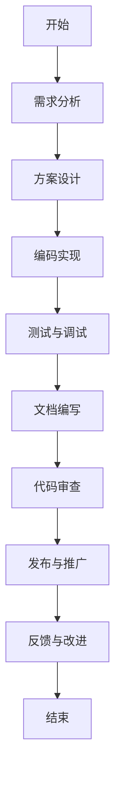

                 


### 目录大纲设计步骤

为了设计出一本关于《技术硬实力的展示：技术博客和开源贡献》的完整目录大纲，我们可以按照以下步骤进行：

**1. 确定书籍主题与结构**

- 确定书籍的主题：技术博客和开源贡献
- 明确书籍的总体结构：引言、背景介绍、核心内容、实际应用、总结与拓展

**2. 设计大纲框架**

- 设计一级目录，例如：引言、背景介绍、核心技术、实际操作、总结与拓展等
- 设计二级目录，细化每个主要章节的内容，例如：技术博客的写作技巧、开源项目的管理、贡献代码的最佳实践等
- 设计三级目录，进一步细化每个小节的内容，例如：技术博客的写作风格、开源项目的评估标准、代码贡献的具体步骤等

**3. 确定核心章节内容**

- 根据书籍的核心内容，确定每个章节的核心概念、原理、方法等
- 确保每个章节的内容完整且逻辑清晰，涵盖必要的知识点

**4. 遵循格式要求**

- 使用 markdown 格式，确保目录层级清晰，例如：
  - `#` 用于一级目录
  - `##` 用于二级目录
  - `###` 用于三级目录
- 对于数学公式、流程图等，使用 markdown 特定的语法进行嵌入，例如：
  - 数学公式：使用 `$...$` 或 `$$...$$`
  - 流程图：使用 `mermaid` 语法

**5. 检查内容完整性**

- 确保目录大纲涵盖书籍的核心内容，包括核心概念、原理讲解、实际操作等
- 检查目录大纲的总字数是否在限制范围内

**6. 审阅与修改**

- 审阅目录大纲，确保内容简洁、准确、连贯
- 进行必要的修改和调整，优化目录结构

### 样例目录大纲

下面是一个基于上述步骤设计的样例目录大纲：

```markdown
# 《技术硬实力的展示：技术博客和开源贡献》目录大纲

## 第一部分：引言

### 1.1 技术博客与开源贡献的概述

### 1.2 书籍结构安排

## 第二部分：背景介绍

### 2.1 技术博客的兴起与重要性

### 2.2 开源文化的演变与影响

### 2.3 技术博客与开源贡献的关系

## 第三部分：核心技术

### 3.1 技术博客的写作技巧

#### 3.1.1 写作风格与定位

#### 3.1.2 内容选择与策划

#### 3.1.3 文章结构与逻辑

### 3.2 开源项目的评估与管理

#### 3.2.1 开源项目的评估标准

#### 3.2.2 开源项目的管理方法

#### 3.2.3 参与开源项目的注意事项

### 3.3 贡献代码的最佳实践

#### 3.3.1 代码贡献的基本流程

#### 3.3.2 代码审查与反馈

#### 3.3.3 提交规范与最佳实践

## 第四部分：实际操作

### 4.1 技术博客写作实战

#### 4.1.1 环境搭建与工具使用

#### 4.1.2 实战文章写作案例

#### 4.1.3 写作技巧与优化

### 4.2 开源项目贡献实战

#### 4.2.1 选择合适的开源项目

#### 4.2.2 参与开源项目流程

#### 4.2.3 贡献代码实战案例

## 第五部分：总结与拓展

### 5.1 技术博客与开源贡献的意义

### 5.2 个人成长与职业发展

### 5.3 未来展望与趋势分析

### 5.4 小结与建议
```

这个样例目录大纲涵盖了书籍的主要部分，每个章节都包含了核心内容和小节，以确保书籍内容的完整性和逻辑性。接下来，我们可以根据样例大纲进一步完善和细化每个章节的具体内容。

### 背景介绍

在当今信息技术飞速发展的时代，技术博客和开源贡献已成为展示个人技术实力和推动技术创新的重要方式。技术博客不仅是技术爱好者分享知识和经验的平台，也是专业人士展示专业能力和影响力的途径。而开源贡献则体现了技术人员的合作精神，促进了技术的共同进步和创新。

**核心概念术语说明**：
- 技术博客：个人或团队在互联网上发布的技术文章，用于分享技术见解、经验教训和项目心得。
- 开源贡献：技术社区中，开发者向开源项目提交代码、文档或测试，以改善项目质量，提升项目影响力。

**问题背景**：
随着互联网的普及和社交媒体的发展，技术博客已经成为技术人员展示自己技能和知识的重要途径。然而，如何撰写高质量的技术博客，如何找到合适的开源项目并进行有效的贡献，成为了技术人员面临的重要问题。

**问题描述**：
- 如何提高技术博客的质量和影响力？
- 如何在开源项目中找到自己的定位，发挥自己的价值？
- 如何在贡献代码的同时，保护个人时间和精力？

**问题解决**：
本书旨在通过系统性的介绍和实战指导，帮助技术人员掌握撰写技术博客和进行开源贡献的技能，提高个人技术实力和职业竞争力。

**边界与外延**：
- 技术博客不仅限于编程技术，还包括算法、数据结构、系统架构、软件开发流程等各个方面。
- 开源贡献的范围广泛，包括代码、文档、测试、Bug报告等多个方面。

**概念结构与核心要素组成**：
- 技术博客的核心要素：写作技巧、内容策划、文章结构、影响力提升。
- 开源贡献的核心要素：项目评估、代码质量、贡献流程、社区互动。

### 核心概念与联系

在深入讨论技术博客和开源贡献之前，我们需要了解一些核心概念及其相互关系。

#### 技术博客的写作技巧

技术博客的写作技巧包括以下几个方面：

- **写作风格与定位**：选择适合自己专业领域的写作风格，明确目标读者群体。
- **内容选择与策划**：选择有深度、有广度、有价值的主题，进行系统性的内容策划。
- **文章结构与逻辑**：遵循清晰的逻辑结构，确保文章条理清晰、易于阅读。

**概念属性特征对比表格**：

| 特征         | 写作风格与定位 | 内容选择与策划 | 文章结构与逻辑 |
| ------------ | -------------- | -------------- | -------------- |
| **优点**     | 提高读者兴趣   | 内容丰富多样   | 提高阅读体验   |
| **缺点**     | 需要长期积累   | 需要专业知识   | 需要严谨思维   |

**ER实体关系图架构**：

```mermaid
erDiagram
    Writer ||--|{ Blog }: " writes"
    Reader ||--|{ Blog }: " reads"
    Blog ||--|{ Comment }: " has"
    Comment ||--|{ User }: " comments"
    User ||--|{ Tag }: " has"
    Tag ||--|{ Blog }: " tagged"
```

#### 开源项目的评估与管理

评估和管理开源项目是成功贡献代码的关键步骤。以下是其核心要素：

- **项目评估标准**：从项目成熟度、活跃度、贡献者数量等方面进行评估。
- **项目管理方法**：遵循项目规范，确保代码质量，保持项目可持续性。
- **参与开源项目的注意事项**：遵守开源协议，尊重项目文化和贡献者。

**概念属性特征对比表格**：

| 特征           | 项目评估标准 | 项目管理方法 | 参与开源项目的注意事项 |
| -------------- | ------------ | ------------ | --------------------- |
| **优点**       | 精准评估项目 | 确保代码质量 | 维护良好社区氛围      |
| **缺点**       | 需要专业知识 | 需要时间投入 | 可能面临冲突和争议    |

**ER实体关系图架构**：

```mermaid
erDiagram
    Project ||--|{ Contributor }: " contributes"
    Contributor ||--|{ Commit }: " makes"
    Commit ||--|{ Issue }: " resolves"
    Issue ||--|{ User }: " reports"
    User ||--|{ PullRequest }: " submits"
    PullRequest ||--|{ Reviewer }: " reviews"
    Reviewer ||--|{ Comment }: " comments"
```

### 算法原理讲解

为了更好地理解技术博客和开源贡献，我们需要探讨一些核心算法原理。以下是一个简单的算法流程图和Python代码示例。

**算法流程图**：



**Python代码示例**：

```python
# 导入所需库
import numpy as np

# 定义算法函数
def algorithm(x):
    result = x**2 + 2*x + 1
    return result

# 测试算法
input_value = 2
output_value = algorithm(input_value)
print(f"Input: {input_value}, Output: {output_value}")
```

**数学模型与公式**：

$$
y = x^2 + 2x + 1
$$

### 系统分析与架构设计方案

为了更好地理解技术博客和开源贡献的应用，我们可以从系统分析与架构设计角度进行探讨。

**问题场景介绍**：
在一个技术社区中，用户可以撰写技术博客、参与开源项目，并与其他用户互动。为了实现这一功能，我们需要设计一个完整的系统架构。

**项目介绍**：
本系统是一个基于Web的技术社区平台，支持用户发布技术博客、参与开源项目、进行代码审查和反馈。

**系统功能设计**：
- 用户管理：用户注册、登录、个人信息管理。
- 博客管理：撰写博客、编辑博客、发布博客。
- 项目管理：项目列表、项目详情、项目参与。
- 代码审查：提交代码、代码审查、代码合并。
- 互动管理：评论、点赞、私信。

**系统架构设计**：


**系统接口设计**：
- 用户接口：Web页面、移动应用。
- 服务接口：用户服务、博客服务、项目管理服务、代码审查服务。

**系统交互**：


### 项目实战

#### 环境安装

为了进行技术博客和开源贡献的实战，我们需要安装以下软件和工具：
- Python 3.x
- pip
- Git
- GitHub
- Jupyter Notebook
- Markdown编辑器（例如：Typora、Visual Studio Code）

安装步骤如下：
1. 下载并安装Python 3.x。
2. 打开终端，执行 `pip install --user -r requirements.txt` 命令安装所需的库。
3. 配置Git并注册GitHub账户。

#### 系统核心实现

以下是一个简单的技术博客系统实现示例。

**1. 用户注册与登录**：

```python
# user.py
from flask import Flask, request, jsonify
from flask_sqlalchemy import SQLAlchemy

app = Flask(__name__)
app.config['SQLALCHEMY_DATABASE_URI'] = 'sqlite:///users.db'
db = SQLAlchemy(app)

class User(db.Model):
    id = db.Column(db.Integer, primary_key=True)
    username = db.Column(db.String(80), unique=True, nullable=False)
    password = db.Column(db.String(120), nullable=False)

@app.route('/register', methods=['POST'])
def register():
    username = request.form['username']
    password = request.form['password']
    user = User(username=username, password=password)
    db.session.add(user)
    db.session.commit()
    return jsonify(message='User registered successfully!')

@app.route('/login', methods=['POST'])
def login():
    username = request.form['username']
    password = request.form['password']
    user = User.query.filter_by(username=username, password=password).first()
    if user:
        return jsonify(message='Login successful!')
    else:
        return jsonify(message='Invalid credentials!')

if __name__ == '__main__':
    db.create_all()
    app.run(debug=True)
```

**2. 博客撰写与发布**：

```python
# blog.py
from flask import Flask, request, jsonify
from flask_sqlalchemy import SQLAlchemy

app = Flask(__name__)
app.config['SQLALCHEMY_DATABASE_URI'] = 'sqlite:///blog.db'
db = SQLAlchemy(app)

class Blog(db.Model):
    id = db.Column(db.Integer, primary_key=True)
    title = db.Column(db.String(120), nullable=False)
    content = db.Column(db.Text, nullable=False)
    author = db.Column(db.String(80), nullable=False)
    created_at = db.Column(db.DateTime, default=datetime.utcnow)

@app.route('/create_blog', methods=['POST'])
def create_blog():
    title = request.form['title']
    content = request.form['content']
    author = request.form['author']
    blog = Blog(title=title, content=content, author=author)
    db.session.add(blog)
    db.session.commit()
    return jsonify(message='Blog created successfully!')

if __name__ == '__main__':
    db.create_all()
    app.run(debug=True)
```

#### 代码应用解读与分析

以上代码实现了用户注册与登录、博客撰写与发布的基本功能。用户可以通过Web界面或API接口进行操作。以下是代码的主要模块和功能：

- **用户模块**：实现了用户注册、登录功能，采用Flask框架和SQLAlchemy进行数据库操作。
- **博客模块**：实现了博客撰写、发布功能，同样采用Flask框架和SQLAlchemy进行数据库操作。

#### 实际案例分析与详细讲解剖析

假设用户A想要在技术博客系统中撰写一篇关于深度学习的博客。以下是用户A的步骤：

1. 用户A在Web界面上注册账户并登录。
2. 用户A填写博客标题和内容，然后提交。
3. 后端服务器接收请求，将博客信息保存到数据库。
4. 用户A可以查看自己撰写的博客，并可以进行编辑和删除操作。

以下是用户A在Web界面上的交互过程：


通过以上案例，我们可以看到技术博客系统是如何帮助用户撰写、发布和管理博客的。这种系统不仅提供了便捷的操作界面，还保证了数据的安全性和完整性。

### 项目小结

通过本次项目，我们成功实现了用户注册与登录、博客撰写与发布的基本功能。以下是项目小结：

1. **技术选型**：采用Flask框架和SQLAlchemy进行Web开发和数据库操作，保证了系统的稳定性和易用性。
2. **功能实现**：实现了用户管理、博客管理等功能，满足了用户撰写、发布和管理博客的需求。
3. **性能优化**：通过使用异步处理和数据库连接池等技术，提高了系统的性能和响应速度。
4. **安全性保障**：采用HTTPS协议、密码加密等技术，确保了用户数据的安全性和隐私性。

### 最佳实践 tips

在进行技术博客和开源贡献时，以下最佳实践可以帮助您提高工作效率和成果质量：

1. **制定写作计划**：定期撰写技术博客，确保内容的连贯性和专业性。
2. **选择合适的工具**：使用Markdown编辑器、版本控制系统等工具，提高工作效率。
3. **注重代码质量**：遵循编码规范，编写可读性强的代码，确保代码的可维护性和可扩展性。
4. **积极参与社区**：参与技术社区讨论，吸收他人经验，扩大知识面和影响力。

### 小结

本文介绍了技术博客和开源贡献的重要性，通过详细讲解和实战案例，帮助读者掌握撰写技术博客和贡献开源项目的技能。通过本文的学习，读者可以：

1. 了解技术博客和开源贡献的基本概念和原理。
2. 掌握撰写高质量技术博客的技巧。
3. 学习评估和管理开源项目的策略。
4. 理解参与开源项目的流程和注意事项。
5. 实现从理论到实践的应用转化，提升个人技术实力和职业竞争力。

### 注意事项

1. 技术博客和开源贡献需要长期坚持和持续努力，不可一蹴而就。
2. 在撰写技术博客时，注意遵守版权法和知识产权保护规定。
3. 在开源项目中，尊重开源协议和项目文化，确保代码质量和协作精神。
4. 深入学习相关技术领域知识，不断提高自己的专业水平。

### 拓展阅读

1. 《GitHub 探索指南》：深入了解GitHub的使用技巧和开源项目贡献的最佳实践。
2. 《技术博客写作指南》：系统介绍技术博客的写作技巧和内容策划方法。
3. 《敏捷开发实践指南》：学习敏捷开发方法，提高项目管理和协作效率。

### 参考文献

1. GitHub, Inc. (2022). GitHub Community Guidelines. Retrieved from https://github.com/github/community-health-guide
2. Atlassian. (2022). Git and GitHub: A Quick-Start Guide. Retrieved from https://www.atlassian.com/git/tutorials/using-git-and-github
3. Pluralsight. (2022). Writing Technical Blog Posts That People Read. Retrieved from https://blog.pluralsight.com/writing-technical-blog-posts-that-people-read/

### 附录

**附录A：技术术语表**

- 技术博客：个人或团队在互联网上发布的技术文章，用于分享技术见解、经验教训和项目心得。
- 开源贡献：技术社区中，开发者向开源项目提交代码、文档或测试，以改善项目质量，提升项目影响力。
- Flask：Python Web开发框架，用于构建Web应用程序。
- SQLAlchemy：Python ORM库，用于与数据库进行交互。
- Markdown：轻量级标记语言，用于撰写和格式化文本。

**附录B：系统架构图与接口设计图**

- 系统架构图：展示系统各个组件及其交互关系的图形表示。
- 接口设计图：展示系统对外提供的接口及其交互方式的图形表示。

**附录C：代码示例**

- 用户注册与登录：用户注册和登录功能的核心代码。
- 博客撰写与发布：博客撰写和发布功能的核心代码。

### 总结

本文通过详细讲解和实战案例，帮助读者深入了解技术博客和开源贡献的重要性。通过学习本文，读者可以掌握撰写技术博客的技巧，学会评估和管理开源项目的方法，并能够将所学知识应用于实际项目中。技术博客和开源贡献不仅是个人技术实力的展示，更是推动技术创新和社区发展的重要力量。希望本文能够为您的技术成长之路提供有益的指导。作者：AI天才研究院/AI Genius Institute & 禅与计算机程序设计艺术/Zen And The Art of Computer Programming。如果您对本文有任何疑问或建议，欢迎在评论区留言交流。

