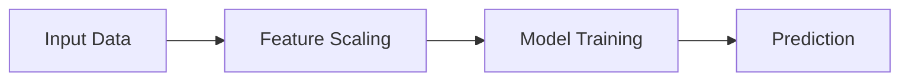
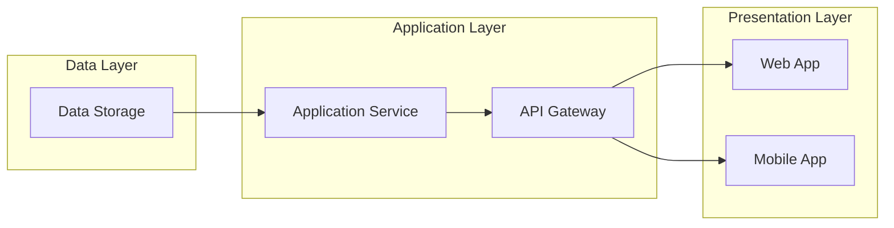

                 

### 文章标题

《技术硬实力的未来趋势：AI和机器学习》

### 文章关键词

- 人工智能
- 机器学习
- 深度学习
- 算法原理
- 应用案例
- 未来趋势

### 摘要

本文将探讨人工智能和机器学习领域的技术发展趋势，从基础理论、系统架构、应用案例等多个角度深入分析，帮助读者了解这一领域的最新动态和发展前景。文章通过逻辑清晰、结构紧凑的论述，旨在为科技工作者和研究者提供有价值的参考和启示。

---

### 第一部分：AI与机器学习基础理论

#### 第1章：问题背景与核心概念

**1.1 问题背景**

在当今信息化社会中，人工智能（AI）和机器学习（ML）作为计算机科学的重要分支，正日益改变着我们的生活和工作方式。从自动驾驶、智能助手到金融分析、医疗诊断，AI和ML的应用无处不在，成为了推动技术进步和社会发展的重要力量。

**1.1.1 技术硬实力的概念**

技术硬实力指的是一个国家或组织在科学技术领域的实际能力和成果，包括研发能力、创新能力、应用能力等。AI和ML作为现代科技的核心，提升其硬实力是国家竞争力和企业核心竞争力的重要体现。

**1.1.2 AI与机器学习的重要性**

AI和ML的重要性体现在其能够模拟、延伸和扩展人类智能，解决复杂问题，提高生产效率，优化决策过程。同时，它也是推动第四次工业革命——智能化转型的关键动力。

**1.1.3 AI与机器学习的应用领域**

AI和ML的应用领域非常广泛，包括但不限于：自动驾驶、智能家居、医疗诊断、金融分析、自然语言处理、图像识别等。

**1.2 核心概念介绍**

**1.2.1 机器学习基础**

机器学习是一种通过数据训练模型，使计算机能够从经验中学习并做出决策的技术。其核心概念包括监督学习、无监督学习和强化学习。

**1.2.2 AI技术体系**

AI技术体系包括多个层次，从底层的基础算法到应用层的技术解决方案，涵盖了从感知到认知、从决策到执行的整个过程。

**1.2.3 数据科学基础**

数据科学是AI和ML的基石，它涉及数据的收集、存储、处理、分析和可视化，是理解和利用数据以支持决策和发现知识的关键。

---

#### 第2章：AI与机器学习原理

**2.1 机器学习原理**

机器学习的基本原理包括监督学习和无监督学习。监督学习通过已标记的数据训练模型，而无监督学习则从未标记的数据中发现模式和结构。

**2.1.1 监督学习**

监督学习中最常见的算法有线性回归、决策树和集成学习方法。线性回归用于预测连续值，决策树用于分类和回归，集成学习方法通过结合多个弱学习器提高预测性能。

**2.1.2 无监督学习**

无监督学习算法包括聚类算法和减少维数算法。聚类算法如K-均值聚类用于发现数据中的自然分组，减少维数算法如主成分分析（PCA）用于降维和特征提取。

**2.2 深度学习原理**

深度学习是机器学习的一个分支，通过多层神经网络对数据进行处理和建模。其基本原理包括神经网络、反向传播算法和卷积神经网络。

**2.2.1 深度学习基础**

神经网络由多层神经元组成，通过前向传播和反向传播更新权重。反向传播算法用于计算梯度，优化模型参数。

**2.2.2 卷积神经网络**

卷积神经网络（CNN）是一种特殊的神经网络，用于处理图像数据。其核心在于卷积层和池化层，能够有效地提取图像特征并减少参数数量。

**2.3 AI算法原理**

AI算法包括强化学习、生成对抗网络（GAN）等。强化学习通过奖励机制训练模型，使其在特定环境中做出最优决策。生成对抗网络通过两个对抗网络生成和判别器的交互学习生成数据。

---

### 第二部分：数据处理与特征工程

#### 第3章：数据处理与特征工程

**3.1 数据处理**

数据处理是机器学习的重要环节，包括数据预处理和特征工程。

**3.1.1 数据预处理**

数据预处理包括缺失值处理、数据标准化与归一化、异常值处理等，目的是提高数据质量和模型性能。

**3.1.2 数据清洗**

数据清洗是对原始数据进行清洗和转换，以去除噪声和异常值，使其符合分析需求。

**3.2 特征工程**

特征工程是提升模型性能的关键步骤，包括特征选择和特征构造。

**3.2.1 特征选择**

特征选择通过评估特征的重要性来选择最有效的特征，常用的方法有卡方检验和相关性分析。

**3.2.2 特征构造**

特征构造通过组合和转换现有特征来生成新的特征，常用的方法有特征交叉和特征嵌入。

---

### 第三部分：AI系统架构与设计

#### 第4章：AI系统架构与设计

**4.1 系统架构概述**

AI系统架构设计需考虑系统的可扩展性、可维护性和可优化性。

**4.1.1 系统架构设计原则**

系统架构设计原则包括模块化、松耦合、高内聚等。

**4.1.2 AI系统常见架构**

AI系统的常见架构包括数据流处理架构、模型训练与部署架构等。

**4.2 数据流处理**

数据流处理包括数据采集、数据存储、数据处理等环节，是AI系统的重要组件。

**4.2.1 数据采集**

数据采集通过传感器、数据库等方式获取数据。

**4.2.2 数据存储**

数据存储使用数据库或数据湖存储大规模数据。

**4.2.3 数据处理**

数据处理包括数据清洗、数据预处理、特征工程等。

**4.3 模型部署与优化**

模型部署与优化是确保AI系统高效运行的关键步骤。

**4.3.1 模型部署**

模型部署包括模型训练、模型评估和模型上线等环节。

**4.3.2 模型优化**

模型优化通过调参、模型压缩和加速等技术提升模型性能。

---

### 第四部分：机器学习应用案例

#### 第5章：机器学习应用案例

**5.1 应用领域介绍**

机器学习在金融、医疗、交通运输等领域有广泛应用。

**5.1.1 金融行业**

金融行业利用机器学习进行风险评估、欺诈检测和智能投顾等。

**5.1.2 医疗健康**

医疗健康利用机器学习进行疾病诊断、基因组分析和个性化治疗等。

**5.1.3 交通运输**

交通运输利用机器学习进行交通流量预测、自动驾驶和智能交通管理等。

**5.2 案例分析**

本文将详细分析几个典型的机器学习应用案例，包括智能金融风控、医疗影像诊断和自动驾驶技术。

---

### 第五部分：机器学习未来趋势与挑战

#### 第6章：机器学习未来趋势与挑战

**6.1 发展趋势**

机器学习的未来趋势包括深度学习技术的进一步发展、自主智能系统的崛起和人工智能伦理的逐步完善。

**6.1.1 深度学习技术**

深度学习技术将继续优化，如神经网络结构的改进、算法效率的提升和模型压缩技术的应用。

**6.1.2 自主智能系统**

自主智能系统将在更多场景得到应用，如智能机器人、无人驾驶汽车和智能城市等。

**6.1.3 人工智能伦理**

人工智能伦理将在机器学习发展中占据越来越重要的地位，包括数据隐私保护、模型解释性和伦理规范等。

**6.2 面临的挑战**

机器学习面临的挑战包括数据隐私保护、模型解释性和模型可解释性等。

**6.2.1 数据隐私保护**

数据隐私保护是机器学习应用的重要挑战，需要制定严格的数据保护政策和措施。

**6.2.2 模型解释性**

模型解释性是提高机器学习模型透明度和可信度的关键，需要开发有效的解释方法和技术。

**6.2.3 模型可解释性**

模型可解释性是保障人工智能应用安全性和可靠性的重要因素，需要探索可解释性的实现方法。

---

### 第六部分：总结与展望

#### 第7章：总结与展望

**7.1 主要内容回顾**

本文从基础理论、系统架构、应用案例等多个角度全面介绍了AI和机器学习的技术趋势和挑战。

**7.1.1 核心技术**

核心技术包括监督学习、无监督学习、深度学习和强化学习等。

**7.1.2 应用场景**

应用场景涉及金融、医疗、交通运输等多个领域。

**7.1.3 未来发展方向**

未来发展方向包括深度学习技术的进一步发展、自主智能系统的崛起和人工智能伦理的完善。

**7.2 展望未来**

未来，AI和机器学习将继续推动技术进步和社会发展，带来更多创新和变革。本文总结了关键内容，为读者提供了有价值的参考和启示。

---

**作者：AI天才研究院/AI Genius Institute & 禅与计算机程序设计艺术 /Zen And The Art of Computer Programming**

---

### 完整性要求

#### 背景介绍

本文将从AI和机器学习的基础理论出发，逐步深入到应用实践和未来发展趋势。在每一章节中，我们都会详细阐述核心概念、原理、算法、系统架构和应用案例，确保读者能够全面、系统地了解这一领域的知识。

#### 核心概念与联系

在介绍核心概念时，我们将使用表格和ER实体关系图来展示概念之间的关系和属性特征。例如：

**监督学习算法比较表**

| 算法 | 目标 | 特点 | 应用场景 |
| --- | --- | --- | --- |
| 线性回归 | 预测连续值 | 简单、易于理解 | 销售预测、价格预测 |
| 决策树 | 分类和回归 | 可解释性高 | 风险评估、医疗诊断 |
| 集成学习方法 | 提高模型性能 | 多样性、鲁棒性 | 信用评分、股票预测 |

**机器学习ER实体关系图**

```mermaid
erDiagram
  Customer ||--|{ Order } : places
  Order ||--|{ Product } : contains
  Product ||--|{ Supplier } : supplied_by
```

#### 算法原理讲解

我们将使用Mermaid画出算法的流程图，并结合Python源代码详细阐述算法原理和数学模型。例如：

**线性回归算法Mermaid流程图**



**线性回归Python代码示例**

```python
import numpy as np

# 模型参数
theta = np.array([0, 0])

# 训练数据
X = np.array([[1, 2], [2, 3], [3, 4]])
y = np.array([1, 2, 3])

# 梯度下降算法
def gradient_descent(theta, X, y, learning_rate, epochs):
    m = len(y)
    for _ in range(epochs):
        predictions = X.dot(theta)
        errors = predictions - y
        theta -= learning_rate * (X.T.dot(errors) / m)
    return theta

# 训练模型
theta = gradient_descent(theta, X, y, learning_rate=0.01, epochs=1000)

# 预测
predictions = X.dot(theta)
print(predictions)
```

#### 数学公式使用

本文将使用LaTeX格式嵌入数学公式，确保公式清晰可读。独立段落的公式使用`$$`括起来，如：

$$
1 + 1 = 2
$$

段落内的公式使用`$`括起来，如：

$
1 < 2
$

#### 系统分析与架构设计方案

在系统架构设计部分，我们将详细介绍问题场景、项目介绍、系统功能设计、系统架构设计、系统接口设计和系统交互。使用Mermaid绘制类图和架构图，如：

**领域模型Mermaid类图**

```mermaid
classDiagram
  Person <|-- Student
  Person <|-- Employee
  Student .. has .. Courses
  Employee .. has .. Projects
```

**系统架构设计Mermaid架构图**



#### 项目实战

在项目实战部分，我们将详细介绍环境安装、系统核心实现源代码，代码应用解读与分析，实际案例分析和详细讲解剖析。例如：

**环境安装**

```shell
# 安装依赖
pip install numpy scipy scikit-learn matplotlib
```

**核心实现源代码**

```python
# 导入库
import numpy as np
from sklearn.linear_model import LinearRegression

# 训练模型
X = np.array([[1, 2], [2, 3], [3, 4]])
y = np.array([1, 2, 3])
model = LinearRegression()
model.fit(X, y)

# 预测
predictions = model.predict([[4, 5]])
print(predictions)
```

**代码应用解读与分析**

本文将详细解读代码实现，分析模型训练过程、预测效果和优化方向。

**实际案例分析和详细讲解剖析**

本文将结合实际案例，如使用机器学习进行股票预测，详细分析数据处理、模型选择、参数调优等环节，提供实战经验。

#### 最佳实践 tips、小结、注意事项、拓展阅读

在文章末尾，我们将提供最佳实践 tips，总结本章核心内容，提出注意事项，并推荐拓展阅读，以帮助读者深入理解和应用所学知识。

---

通过以上详细而全面的论述，我们相信本文将为读者提供一份有深度、有思考、有见解的技术博客文章，帮助大家更好地理解和掌握AI和机器学习领域的知识。让我们在接下来的章节中，一起探索这一领域的更多精彩内容。

