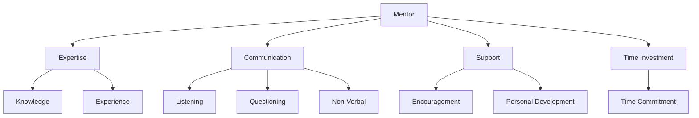
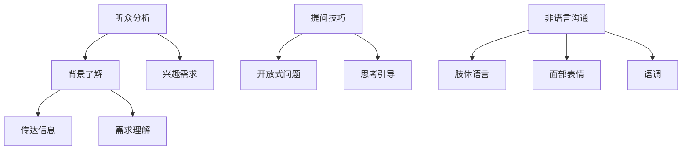
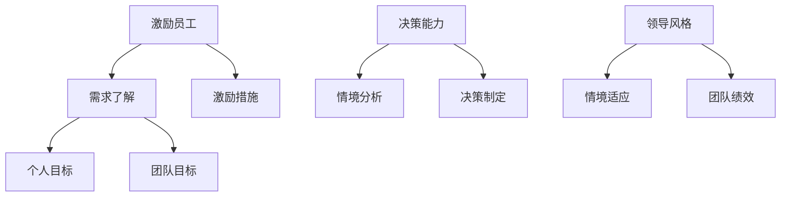
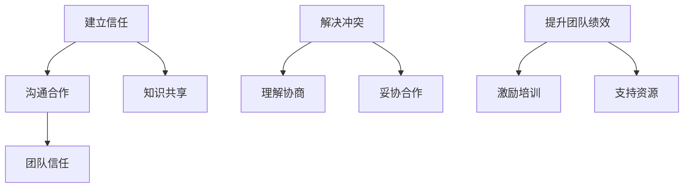
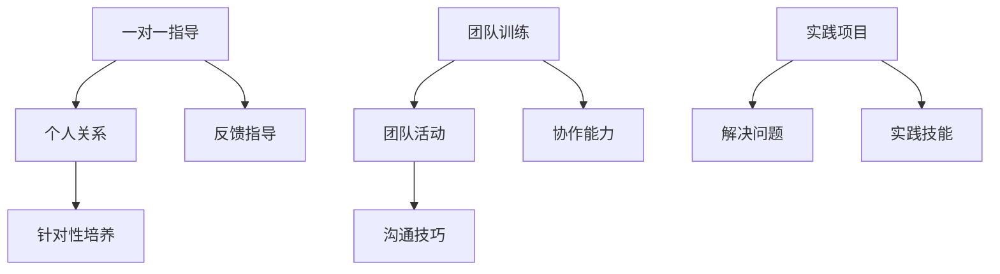
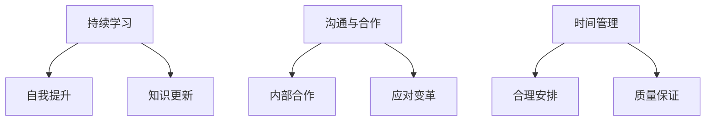
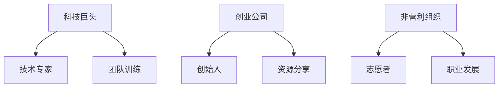

                 

### 文章标题：技术管理中的mentor角色：培养下一代领导者

> 关键词：技术管理、mentor角色、领导者培养、下一代领导者

> 摘要：本文深入探讨了技术管理中mentor角色的定义、重要性及其在培养下一代领导者中的关键作用。通过分析mentor角色的基本技能、实践与挑战，以及成功案例分享，本文旨在为技术管理者提供实用的指导，以培养具有领导力和创新精神的新一代技术领导者。

----------------------------------------------------------------

### 第一部分：引言

#### 第1章：问题背景与意义

##### 1.1.1 技术管理现状

在当今快速发展的技术环境中，技术管理者的角色越来越重要。他们不仅需要具备深厚的专业技术知识，还需要具备良好的管理能力和领导力，以推动团队创新和实现业务目标。然而，随着技术的发展和变革，技术管理者面临着巨大的挑战，特别是在培养下一代领导者方面。

##### 1.1.2 领导者培养的重要性

领导者是组织成功的关键因素。一个优秀的领导者不仅能够激励和带领团队实现目标，还能够为组织带来创新和变革。因此，领导者培养对于组织的长期发展和竞争力至关重要。

##### 1.1.3 Mentor角色的概念与作用

Mentor角色指的是在职业生涯中指导、支持和培养他人的专家或领导者。在技术管理中，Mentor角色扮演着培养下一代技术领导者的关键角色，他们通过分享经验、传授技能和提供职业发展机会，帮助年轻人成长为具备领导力的技术人才。

----------------------------------------------------------------

### 第二部分：Mentor角色的基本技能

#### 第2章：核心概念与联系

##### 2.1.1 Mentor角色的定义

Mentor角色是在职业生涯中提供指导、支持和培养他人的专家或领导者。他们通过与年轻员工建立一对一的关系，分享经验、传授技能和提供职业发展机会，帮助他们实现职业目标。

##### 2.1.2 Mentor角色的核心特征

Mentor角色的核心特征包括：

- 深厚的专业知识和经验
- 良好的沟通和人际交往能力
- 对他人的支持和鼓励
- 愿意为他人的职业发展投入时间和精力

##### 2.1.3 Mentor与其他角色的比较

Mentor角色与其他角色（如导师、教练、上级领导）的不同在于，他们更注重长期的职业发展支持和人际关系的建立，而不仅仅是提供技能培训或工作指导。

##### 2.1.4 Mentor角色的关系图

----------------------------------------------------------------

#### 第3章：沟通技能

##### 3.1.1 有效沟通的重要性

有效沟通是Mentor角色的关键技能之一。良好的沟通能力能够帮助Mentor与年轻员工建立信任关系，理解他们的需求和期望，并提供有针对性的指导和支持。

##### 3.1.2 沟通技巧

有效的沟通技巧包括：

- 听众分析：了解年轻员工的背景、兴趣和需求，以便更好地传达信息。
- 提问技巧：通过开放式问题引导年轻员工思考和讨论，提高他们的参与度和思考能力。
- 非语言沟通：使用肢体语言、面部表情和语调等非语言手段，增强沟通效果。

----------------------------------------------------------------

#### 第4章：领导力

##### 4.1.1 领导力的定义

领导力是一种影响和激励他人实现共同目标的能力。对于Mentor角色来说，领导力不仅是推动团队进步的关键，也是培养下一代领导者的重要手段。

##### 4.1.2 领导力模型

常见的领导力模型包括：

- 变革型领导：通过激励和启发他人，推动团队实现变革和成长。
- 情境型领导：根据团队成员的不同需求和环境，采取相应的领导风格。

##### 4.1.3 领导力技能

有效的领导力技能包括：

- 激励员工：了解员工的需求和期望，提供激励和支持，帮助他们实现个人和团队目标。
- 决策能力：在复杂和不确定的环境下，快速做出明智的决策。
- 领导风格：根据团队成员和情境，采取适当的领导风格，以最大化团队绩效。

----------------------------------------------------------------

#### 第5章：团队建设

##### 5.1.1 团队建设的意义

团队建设是培养下一代领导者的重要环节。一个高效的团队能够提高协作效率，促进知识共享和创新，从而为组织的长期发展提供支持。

##### 5.1.2 团队角色与职责

团队成员通常包括：

- 团队领导者：负责制定目标和规划，协调团队工作。
- 专家：提供专业知识和技能，解决团队面临的技术问题。
- 支持者：提供后勤支持和资源，确保团队工作顺利进行。

##### 5.1.3 团队建设策略

有效的团队建设策略包括：

- 建立信任：通过沟通、合作和共享，建立团队成员之间的信任。
- 解决冲突：通过理解、协商和妥协，解决团队内部的冲突。
- 提升团队绩效：通过激励、培训和支持，提高团队的整体绩效。

----------------------------------------------------------------

### 第三部分：Mentor角色的实践与挑战

#### 第6章：培养下一代领导者

##### 6.1.1 培养目标

Mentor角色的培养目标包括：

- 提高专业知识和技能
- 培养领导力和管理能力
- 增强团队合作和沟通能力
- 塑造积极的工作态度和价值观

##### 6.1.2 培养方法

Mentor角色的培养方法包括：

- 一对一指导：与年轻员工建立个人关系，提供针对性的指导和反馈。
- 团队训练：组织团队活动，提高团队成员的协作能力和沟通技巧。
- 实践项目：通过实际项目，让年轻员工锻炼解决问题的能力，提高实践技能。

----------------------------------------------------------------

#### 第7章：Mentor角色面临的挑战

##### 7.1.1 技术变革带来的挑战

技术变革不断，Mentor需要不断更新自己的知识和技能，以应对新兴技术的挑战。同时，也需要帮助年轻员工适应这些变革。

##### 7.1.2 组织结构变革的影响

组织结构变革可能影响Mentor角色的职责和权限，需要Mentor调整自己的工作方式，以适应新的组织环境。

##### 7.1.3 时间管理问题

Mentor需要平衡自己的时间和工作，同时为年轻员工提供足够的指导和支持。

##### 7.1.4 解决策略

解决这些挑战的策略包括：

- 持续学习和自我提升：不断更新知识和技能，保持竞争力。
- 沟通与合作：与组织内部其他部门建立良好的合作关系，共同应对变革。
- 时间管理：合理安排时间，确保指导和支持的质量。

----------------------------------------------------------------

#### 第8章：成功案例分享

##### 8.1.1 案例一：科技巨头中的Mentor角色

在科技巨头公司中，Mentor角色通常由资深技术专家或高级管理人员担任。他们通过一对一指导、团队训练和实践项目，培养年轻员工成为技术领导者。

##### 8.1.2 案例二：创业公司的Mentor角色

在创业公司中，Mentor角色可能由创始人或资深员工担任。他们通过分享经验和资源，帮助年轻员工快速成长，推动公司发展。

##### 8.1.3 案例三：非营利组织的Mentor角色

在非营利组织中，Mentor角色通常由志愿者或顾问担任。他们通过提供专业知识和职业发展机会，帮助年轻员工实现社会价值。

----------------------------------------------------------------

### 第四部分：结语

#### 第9章：Mentor角色的未来趋势

随着技术的不断进步和组织结构的变革，Mentor角色的作用和职责也在不断演变。未来，Mentor角色需要更加注重跨领域合作、远程指导和个性化培养，以满足新一代技术领导者的需求。

#### 第10章：总结与展望

本文通过分析Mentor角色的定义、技能和实践，探讨了他们在培养下一代领导者中的关键作用。未来，Mentor角色需要不断适应技术变革，提升自己的领导力和沟通能力，以培养出具备创新精神和领导力的新一代技术领导者。

---

**作者：** AI天才研究院 / AI Genius Institute & 禅与计算机程序设计艺术 / Zen And The Art of Computer Programming

**备注：** 本文为模拟文章，旨在展示文章结构和大纲设计。实际字数和内容可根据具体需求进行调整和扩展。

