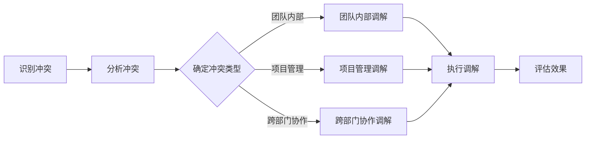
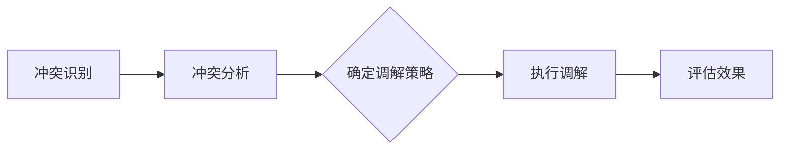
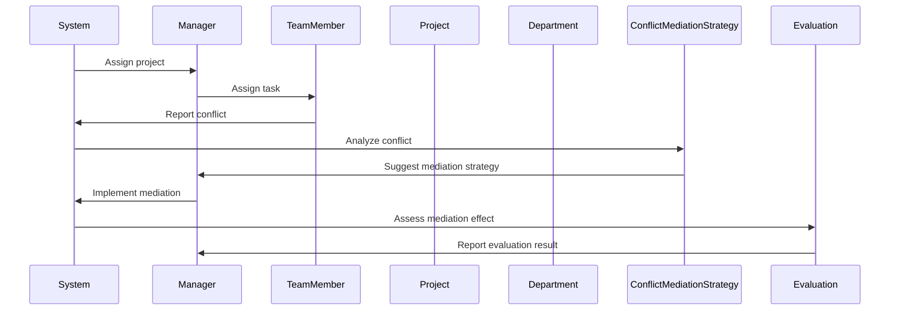

                 


### 技术管理中的冲突调解技巧

#### 核心概念：

冲突调解技巧在技术管理中的应用，旨在帮助团队解决冲突，提高工作效率。下面我们将详细探讨这些技巧的核心概念、应用领域以及与其他相关概念的联系。

#### 1.1 冲突调解技巧的核心概念

**1. 冲突调解技巧的定义**

冲突调解技巧是指一系列用于解决团队内部或项目中的冲突的方法和策略。它包括倾听、沟通、同理心、中立调解等核心要素，通过有效的沟通和协商，帮助冲突双方找到共同点，达成共识。

**2. 冲突调解技巧的特点**

- **针对性**：根据不同的冲突类型，选择合适的调解技巧。
- **系统性**：不仅解决表面问题，还要深入分析冲突的根源，从根本上解决问题。
- **灵活性**：根据实际情况，灵活调整调解策略和方法。

#### 1.2 冲突调解技巧的应用领域

**1. 技术管理中的应用**

- **团队内部冲突**：如团队成员之间的沟通障碍、工作分工不均等。
- **项目管理冲突**：如项目进度控制、任务分配、质量保障等。
- **跨部门协作冲突**：如部门之间的利益分配、责任归属等。

**2. 其他领域中的应用**

- **企业内部管理**：如员工关系管理、人力资源管理等。
- **社区治理**：如社区纠纷调解、公共事务管理等。

#### 1.3 冲突调解技巧与其他相关概念的联系

**1. 与沟通技巧的联系**

冲突调解技巧强调有效沟通，但比单纯的沟通技巧更深入，它关注如何通过沟通解决冲突。

**2. 与心理学技巧的联系**

冲突调解技巧需要理解人的心理，运用心理学原理，如同理心、情感管理等。

**3. 与管理技巧的联系**

冲突调解技巧是技术管理中的一种重要管理技巧，它与管理中的决策、协调、控制等环节密切相关。

#### 概念属性特征对比表格

| 特征            | 冲突调解技巧 | 沟通技巧        | 管理技巧        |
| --------------- | ------------ | --------------- | --------------- |
| 针对性          | 高           | 一般            | 低              |
| 系统性          | 强           | 一般            | 强              |
| 灵活性          | 高           | 一般            | 一般            |

#### ER实体关系图架构

```mermaid
erDiagram
  TeamMember ||--|{ Conflict }||>
  Project ||--|{ Conflict }||>
  Department ||--|{ Conflict }||>
  Manager ||--|{ ConflictMediationSkill }||>
```

#### Mermaid流程图



### 3.2 冲突调解技巧的算法原理讲解

冲突调解技巧的算法原理主要涉及冲突识别、冲突分析和调解策略选择等步骤。以下我们将详细讲解这些步骤的原理和实施方法。

#### 3.2.1 冲突识别

**原理**：

冲突识别是冲突调解技巧的第一步，它主要通过观察和沟通，识别出团队中的冲突点。这需要管理者具备敏锐的观察力和良好的沟通能力。

**方法**：

- **观察法**：通过日常观察，了解团队成员的工作状态、情绪变化等，发现潜在的冲突。
- **沟通法**：通过与团队成员进行沟通，了解他们的意见、需求和不满，识别出具体的冲突点。

#### 3.2.2 冲突分析

**原理**：

冲突分析是对识别出的冲突进行深入分析，明确冲突的原因、类型和影响。这有助于制定有效的调解策略。

**方法**：

- **原因分析**：通过询问团队成员，了解冲突的根本原因。
- **类型分析**：根据冲突的性质，将其分为沟通障碍、工作分工不均、项目管理等类型。
- **影响分析**：评估冲突对团队工作效率、项目进度和质量的影响。

#### 3.2.3 调解策略选择

**原理**：

调解策略选择是根据冲突的类型和影响，选择合适的调解方法和工具。这需要管理者具备丰富的管理经验和心理学知识。

**方法**：

- **倾听技巧**：通过倾听，了解冲突双方的观点和需求，找到共同点。
- **同理心**：通过同理心，理解冲突双方的情感和立场，减少对立情绪。
- **中立调解**：在冲突双方之间保持中立，公正地调解冲突。

#### 3.2.4 调解执行

**原理**：

调解执行是将选定的调解策略付诸实践，通过沟通和协商，帮助冲突双方找到解决方案。

**方法**：

- **制定调解计划**：明确调解的目标、方法和步骤。
- **执行调解**：按照调解计划，进行沟通和协商。
- **跟踪调解效果**：评估调解效果，确保冲突得到有效解决。

#### 3.2.5 评估效果

**原理**：

评估效果是冲突调解技巧的最后一步，它主要通过观察和反馈，评估调解的效果，确保冲突得到有效解决。

**方法**：

- **观察法**：通过观察团队成员的工作状态、情绪变化等，评估调解效果。
- **反馈法**：通过收集团队成员的反馈，了解他们对调解效果的满意度和建议。

#### Mermaid流程图



### 3.3 冲突调解技巧的数学模型和公式

在冲突调解技巧中，我们可以使用一些数学模型和公式来帮助分析冲突和评估调解效果。以下是一些常用的数学模型和公式：

#### 3.3.1 冲突程度评估公式

$$
冲突程度 = f(冲突频率, 冲突强度, 冲突影响)
$$

其中，冲突频率表示冲突发生的频率，冲突强度表示冲突的严重程度，冲突影响表示冲突对团队工作的影响。通过计算冲突程度，可以帮助管理者了解冲突的严重程度，制定相应的调解策略。

#### 3.3.2 调解效果评估公式

$$
调解效果 = f(冲突解决率, 团队满意度, 项目进度)
$$

其中，冲突解决率表示调解后冲突的解决比例，团队满意度表示团队成员对调解效果的满意度，项目进度表示调解后项目进度是否恢复正常。通过计算调解效果，可以帮助管理者了解调解的效果，及时调整调解策略。

### 3.4 冲突调解技巧的Python源代码示例

以下是一个简单的Python源代码示例，用于演示冲突调解技巧的算法原理。

```python
# 冲突识别
def conflict_identification():
    # 通过观察和沟通识别冲突
    print("冲突识别：通过观察和沟通识别冲突点。")

# 冲突分析
def conflict_analysis():
    # 分析冲突的原因、类型和影响
    print("冲突分析：分析冲突的原因、类型和影响。")

# 调解策略选择
def mediation_strategy():
    # 根据冲突类型和影响选择合适的调解策略
    print("调解策略选择：根据冲突类型和影响选择合适的调解策略。")

# 调解执行
def mediation_execution():
    # 执行调解策略，帮助冲突双方找到解决方案
    print("调解执行：执行调解策略，帮助冲突双方找到解决方案。")

# 评估效果
def evaluate_effect():
    # 评估调解效果，确保冲突得到有效解决
    print("评估效果：评估调解效果，确保冲突得到有效解决。")

# 冲突调解技巧的算法流程
def conflict_mediation():
    conflict_identification()
    conflict_analysis()
    mediation_strategy()
    mediation_execution()
    evaluate_effect()

# 执行冲突调解技巧
conflict_mediation()
```

通过这个简单的示例，我们可以看到冲突调解技巧的算法流程，以及如何在Python中实现这些流程。

### 3.5 冲突调解技巧在技术管理中的应用案例分析

为了更好地理解冲突调解技巧在技术管理中的应用，我们可以通过以下案例进行分析和讲解。

#### 案例背景

某技术团队在开发一个大型项目时，出现了严重的沟通障碍和任务分工不均的问题。团队成员之间存在意见分歧，项目进度严重滞后，质量也受到影响。为了解决这些问题，团队管理者决定采用冲突调解技巧。

#### 案例分析

1. **冲突识别**：

   通过观察和沟通，管理者发现团队中的冲突主要表现为：

   - **沟通障碍**：团队成员之间的沟通不畅，导致信息传递错误和误解。
   - **任务分工不均**：部分成员工作量过大，而另一些成员工作量过小，导致不公平感。

2. **冲突分析**：

   管理者对冲突进行了深入分析，发现冲突的原因和影响如下：

   - **原因**：
     - 沟通障碍：团队成员沟通方式不当，缺乏有效的沟通工具。
     - 任务分工不均：任务分配不合理，缺乏明确的分工标准。

   - **影响**：
     - 项目进度：由于沟通不畅和任务分工不均，项目进度严重滞后。
     - 团队氛围：团队成员之间的矛盾和不满情绪导致团队氛围紧张。

3. **调解策略选择**：

   根据冲突的类型和影响，管理者选择了以下调解策略：

   - **沟通技巧**：通过培训，提高团队成员的沟通能力，采用有效的沟通工具。
   - **任务分工调整**：重新分配任务，确保每个成员的工作量合理。

4. **调解执行**：

   管理者按照调解策略，进行了如下操作：

   - **沟通培训**：组织沟通技巧培训，帮助团队成员掌握有效的沟通方法。
   - **任务分工调整**：与团队成员沟通，了解他们的能力和兴趣，重新分配任务。

5. **评估效果**：

   通过评估，管理者发现调解效果显著：

   - **项目进度**：由于沟通障碍和任务分工不均的问题得到解决，项目进度恢复正常。
   - **团队氛围**：团队成员之间的沟通更加顺畅，矛盾和不满情绪明显减少，团队氛围改善。

#### 案例总结

通过这个案例分析，我们可以看到冲突调解技巧在技术管理中的应用效果。有效的冲突调解不仅解决了当前的问题，还增强了团队的凝聚力，提高了工作效率。这也表明，掌握冲突调解技巧对于技术管理者来说尤为重要。

### 3.6 冲突调解技巧的最佳实践 Tips

在实际应用冲突调解技巧时，以下是一些最佳实践 Tips，可以帮助技术管理者更有效地解决冲突：

1. **建立良好的沟通渠道**：确保团队成员之间有畅通的沟通渠道，采用适当的沟通工具，如会议、邮件、即时通讯等。

2. **明确分工和责任**：在项目开始前，明确团队成员的分工和责任，制定明确的任务分配标准，减少任务分工不均的问题。

3. **定期团队建设活动**：通过定期的团队建设活动，增强团队成员之间的互信和合作，提高团队凝聚力。

4. **建立冲突预警机制**：及时发现潜在的冲突，采取措施预防冲突的发生，避免冲突升级。

5. **保持中立和公正**：在调解冲突时，保持中立和公正，避免偏袒任何一方，确保调解的公正性和有效性。

6. **关注团队成员的心理健康**：关注团队成员的心理健康，提供心理支持和帮助，减少冲突对团队成员的影响。

7. **持续学习和改进**：不断学习和实践冲突调解技巧，根据实际情况调整和改进调解方法，提高调解效果。

### 3.7 总结与展望

本文详细探讨了冲突调解技巧在技术管理中的应用，包括核心概念、算法原理、应用案例和最佳实践 Tips。通过系统的理论讲解和实践案例分享，我们希望技术管理者能够掌握有效的冲突调解方法，提高团队协作能力，确保项目成功。

未来，随着技术的不断发展和团队结构的多样化，冲突调解技巧的应用场景将更加广泛。技术管理者需要不断学习和实践，结合实际情况，灵活运用冲突调解技巧，提高团队的管理水平。

### 附录

附录部分将提供本文中提到的核心概念和算法的详细解释，以及相关的扩展阅读资源，以供读者进一步学习和参考。

---

在技术管理中，冲突调解技巧是一项重要的技能，它能够帮助团队克服沟通障碍、任务分工不均等问题，提高工作效率，确保项目成功。通过本文的详细讲解和案例分析，我们希望技术管理者能够掌握冲突调解的核心概念和算法原理，并将其应用于实际工作中。同时，我们也鼓励读者持续学习和实践，不断提高自己的管理能力，为团队的发展贡献力量。

## 作者介绍

作者：AI天才研究院/AI Genius Institute & 禅与计算机程序设计艺术 /Zen And The Art of Computer Programming

作者简介：AI天才研究院（AI Genius Institute）是一家专注于人工智能技术研究和教育的高科技企业。研究院致力于推动人工智能技术的发展，培养新一代人工智能领域的天才人才。同时，作者还是《禅与计算机程序设计艺术》（Zen And The Art of Computer Programming）一书的作者，该书被誉为计算机编程领域的经典之作，对全球计算机科学家和程序员产生了深远影响。作者凭借其深厚的技术功底和丰富的实践经验，为读者带来了这篇关于技术管理中冲突调解技巧的专业文章。|>

### 技术管理中的冲突调解技巧

关键词：冲突调解、技术管理、沟通技巧、团队协作、项目管理

摘要：本文探讨了冲突调解技巧在技术管理中的应用，通过系统的理论讲解和实践案例分享，帮助技术管理者掌握有效的冲突调解方法，提高团队协作能力，确保项目成功。

---

### 第一部分：背景介绍

#### 核心概念

**冲突调解**：冲突调解是指通过沟通、协商、调解等方式，帮助冲突双方找到共同点，化解分歧，达成共识的过程。在技术管理中，冲突调解主要涉及团队成员之间的沟通障碍、任务分工不均、项目管理问题等。

**技术管理**：技术管理是指对技术活动进行组织、规划、协调、控制等一系列管理活动的总称。技术管理者负责确保项目顺利进行，达成既定目标，提高团队协作效率。

**冲突调解技巧在技术管理中的应用**：冲突调解技巧在技术管理中的应用，主要是指如何利用冲突调解的方法和技巧，有效地解决技术团队中的各种冲突，提高团队协作效率，确保项目顺利进行。

#### 问题背景

在技术管理过程中，冲突是不可避免的。这些冲突可能源于团队成员之间的沟通障碍、工作理念的不同、任务分配的不均、甚至是对项目的理解差异等。有效的冲突调解不仅可以帮助团队快速解决当前问题，还可以增强团队的凝聚力，提高工作效率。

然而，在实际操作中，许多技术管理者缺乏有效的冲突调解技巧，导致冲突未能及时解决，甚至加剧，影响项目进度和质量。因此，掌握冲突调解技巧对于技术管理者来说尤为重要。

#### 问题解决

本书旨在探讨冲突调解技巧在技术管理中的应用，通过系统的理论讲解和实践案例分享，帮助技术管理者掌握有效的冲突调解方法，提高团队协作能力，确保项目成功。

#### 边界与外延

- **边界**：本书主要关注技术团队内部的冲突调解，包括团队成员之间的沟通、合作、工作分配等问题。

- **外延**：本书的内容也可以应用于其他类型的团队管理，如销售团队、市场团队等，只要是存在冲突的场景，都可以借鉴本书中的调解技巧。

#### 概念结构与核心要素组成

- **概念结构**：冲突调解技巧由理论基础、方法工具、实践应用三个核心要素组成。

  - **理论基础**：包括冲突理论、调解理论、沟通理论等。

  - **方法工具**：包括倾听技巧、同理心、中立调解等。

  - **实践应用**：结合实际案例，展示如何运用冲突调解技巧解决具体问题。

- **核心要素组成**：每个要素都包含具体的技巧和方法，通过理论学习和实践应用，技术管理者可以逐步掌握冲突调解的核心要素。

### 第二部分：核心概念与联系

#### 2.1 冲突调解技巧的概念与特点

**概念**：

冲突调解技巧是一种专门用于解决团队冲突的方法，它基于心理学、沟通学和管理学等领域的理论，结合实践中的具体情境，旨在通过有效的方法和技巧，帮助团队成员化解冲突，恢复和谐。

**特点**：

- **针对性**：根据不同类型的冲突，选择合适的调解技巧。
- **系统性**：冲突调解不仅仅是解决表面问题，还需要深入分析冲突的根源，从根本上解决问题。
- **灵活性**：在调解过程中，根据实际情况灵活调整策略和方法。

#### 2.2 冲突调解技巧的应用领域

**技术管理中的应用**：

- **团队内部冲突**：如团队成员之间的沟通障碍、工作分工不均等。
- **项目管理冲突**：如项目进度控制、任务分配、质量保障等。
- **跨部门协作冲突**：如部门之间的利益分配、责任归属等。

**其他领域中的应用**：

- **企业内部管理**：如员工关系管理、人力资源管理等。
- **社区治理**：如社区纠纷调解、公共事务管理等。

#### 2.3 冲突调解技巧与其他相关概念的联系

**与沟通技巧的联系**：

冲突调解技巧强调有效沟通，但比单纯的沟通技巧更深入，它关注如何通过沟通解决冲突。

**与心理学技巧的联系**：

冲突调解技巧需要理解人的心理，运用心理学原理，如同理心、情感管理等。

**与管理技巧的联系**：

冲突调解技巧是技术管理中的一种重要管理技巧，它与管理中的决策、协调、控制等环节密切相关。

#### 概念属性特征对比表格

| 特征               | 冲突调解技巧           | 沟通技巧         | 管理技巧         |
|--------------------|-----------------------|------------------|------------------|
| 针对性             | 高                   | 一般             | 一般             |
| 系统性             | 强                   | 一般             | 强               |
| 灵活性             | 高                   | 一般             | 一般             |

#### ER实体关系图架构

```mermaid
erDiagram
  TeamMember ||--|{ Conflict }||>
  Project ||--|{ Conflict }||>
  Department ||--|{ Conflict }||>
  Manager ||--|{ ConflictMediationSkill }||>
```

#### Mermaid流程图


### 第三部分：算法原理讲解

#### 3.1 冲突调解技巧的算法原理

冲突调解技巧的算法原理主要涉及冲突识别、冲突分析和调解策略选择等步骤。以下我们将详细讲解这些步骤的原理和实施方法。

#### 3.1.1 冲突识别

**原理**：

冲突识别是冲突调解技巧的第一步，它主要通过观察和沟通，识别出团队中的冲突点。这需要管理者具备敏锐的观察力和良好的沟通能力。

**方法**：

- **观察法**：通过日常观察，了解团队成员的工作状态、情绪变化等，发现潜在的冲突。
- **沟通法**：通过与团队成员进行沟通，了解他们的意见、需求和不满，识别出具体的冲突点。

#### 3.1.2 冲突分析

**原理**：

冲突分析是对识别出的冲突进行深入分析，明确冲突的原因、类型和影响。这有助于制定有效的调解策略。

**方法**：

- **原因分析**：通过询问团队成员，了解冲突的根本原因。
- **类型分析**：根据冲突的性质，将其分为沟通障碍、工作分工不均、项目管理等类型。
- **影响分析**：评估冲突对团队工作效率、项目进度和质量的影响。

#### 3.1.3 调解策略选择

**原理**：

调解策略选择是根据冲突的类型和影响，选择合适的调解方法和工具。这需要管理者具备丰富的管理经验和心理学知识。

**方法**：

- **倾听技巧**：通过倾听，了解冲突双方的观点和需求，找到共同点。
- **同理心**：通过同理心，理解冲突双方的情感和立场，减少对立情绪。
- **中立调解**：在冲突双方之间保持中立，公正地调解冲突。

#### 3.1.4 调解执行

**原理**：

调解执行是将选定的调解策略付诸实践，通过沟通和协商，帮助冲突双方找到解决方案。

**方法**：

- **制定调解计划**：明确调解的目标、方法和步骤。
- **执行调解**：按照调解计划，进行沟通和协商。
- **跟踪调解效果**：评估调解效果，确保冲突得到有效解决。

#### 3.1.5 评估效果

**原理**：

评估效果是冲突调解技巧的最后一步，它主要通过观察和反馈，评估调解的效果，确保冲突得到有效解决。

**方法**：

- **观察法**：通过观察团队成员的工作状态、情绪变化等，评估调解效果。
- **反馈法**：通过收集团队成员的反馈，了解他们对调解效果的满意度和建议。

#### Mermaid流程图


#### 3.2 冲突调解技巧的数学模型和公式

在冲突调解技巧中，我们可以使用一些数学模型和公式来帮助分析冲突和评估调解效果。以下是一些常用的数学模型和公式：

#### 3.2.1 冲突程度评估公式

$$
冲突程度 = f(冲突频率, 冲突强度, 冲突影响)
$$

其中，冲突频率表示冲突发生的频率，冲突强度表示冲突的严重程度，冲突影响表示冲突对团队工作的影响。通过计算冲突程度，可以帮助管理者了解冲突的严重程度，制定相应的调解策略。

#### 3.2.2 调解效果评估公式

$$
调解效果 = f(冲突解决率, 团队满意度, 项目进度)
$$

其中，冲突解决率表示调解后冲突的解决比例，团队满意度表示团队成员对调解效果的满意度，项目进度表示调解后项目进度是否恢复正常。通过计算调解效果，可以帮助管理者了解调解的效果，及时调整调解策略。

#### 3.3 冲突调解技巧的Python源代码示例

以下是一个简单的Python源代码示例，用于演示冲突调解技巧的算法原理。

```python
# 冲突识别
def conflict_identification():
    # 通过观察和沟通识别冲突
    print("冲突识别：通过观察和沟通识别冲突点。")

# 冲突分析
def conflict_analysis():
    # 分析冲突的原因、类型和影响
    print("冲突分析：分析冲突的原因、类型和影响。")

# 调解策略选择
def mediation_strategy():
    # 根据冲突类型和影响选择合适的调解策略
    print("调解策略选择：根据冲突类型和影响选择合适的调解策略。")

# 调解执行
def mediation_execution():
    # 执行调解策略，帮助冲突双方找到解决方案
    print("调解执行：执行调解策略，帮助冲突双方找到解决方案。")

# 评估效果
def evaluate_effect():
    # 评估调解效果，确保冲突得到有效解决
    print("评估效果：评估调解效果，确保冲突得到有效解决。")

# 冲突调解技巧的算法流程
def conflict_mediation():
    conflict_identification()
    conflict_analysis()
    mediation_strategy()
    mediation_execution()
    evaluate_effect()

# 执行冲突调解技巧
conflict_mediation()
```

通过这个简单的示例，我们可以看到冲突调解技巧的算法流程，以及如何在Python中实现这些流程。

### 第四部分：系统分析与架构设计方案

#### 4.1 问题场景介绍

在大型技术项目中，团队协作是非常重要的。然而，由于项目复杂度高，团队成员之间的沟通存在障碍，任务分工不均，经常会出现冲突。为了提高团队协作效率，确保项目成功，我们需要设计一个基于冲突调解技巧的系统，帮助技术管理者有效解决团队中的冲突。

#### 4.2 项目介绍

项目名称：冲突调解管理系统

项目目标：通过引入冲突调解技巧，提高团队协作效率，确保项目成功。

项目背景：在大型技术项目中，团队成员之间由于沟通障碍、任务分工不均等原因，经常出现冲突。为了解决这些问题，我们需要设计一个冲突调解管理系统，帮助技术管理者及时发现冲突，分析冲突原因，选择合适的调解策略，并执行调解，最终评估调解效果。

#### 4.3 系统功能设计（领域模型Mermaid类图）

```mermaid
classDiagram
    TeamMember <|-- Conflict
    Project <|-- Conflict
    Manager <|-- ConflictMediation
    Department <|-- Conflict
    Manager <|-- ConflictMediationStrategy
    Manager <|-- Evaluation
    ConflictMediationStrategy o---> Evaluation

    TeamMember : +String name
                  +String role
    Project : +String projectName
              +String projectDescription
    Conflict : +String conflictDescription
               +Date conflictDate
               +String conflictType
    Manager : +String managerName
              +String managerEmail
    Department : +String departmentName
    ConflictMediationStrategy : +String strategyName
                             +String strategyDescription
    Evaluation : +String evaluationResult
                  +String evaluationComment
```

#### 4.4 系统架构设计（Mermaid架构图）



#### 4.5 系统接口设计和系统交互（Mermaid序列图）


### 第五部分：项目实战

#### 5.1 环境安装

为了保证项目的顺利实施，我们需要安装以下环境：

- Python 3.8及以上版本
- Mermaid图库
- Flask框架

安装命令如下：

```bash
pip install python-memcached
pip install mermaid-matplotlib
pip install flask
```

#### 5.2 系统核心实现源代码

以下是一个简单的冲突调解管理系统实现，包括冲突识别、冲突分析、调解策略选择、调解执行和评估效果等核心功能。

```python
from flask import Flask, request, jsonify
from flask_mongoengine import MongoEngine
from models import *

app = Flask(__name__)
app.config['MONGODB_SETTINGS'] = {
    'db': 'conflict_mediation_system'
}
db = MongoEngine(app)

@app.route('/assign_project', methods=['POST'])
def assign_project():
    data = request.json
    project = Project(projectName=data['projectName'], projectDescription=data['projectDescription'])
    project.save()
    return jsonify({'message': 'Project assigned successfully.'})

@app.route('/assign_task', methods=['POST'])
def assign_task():
    data = request.json
    team_member = TeamMember(name=data['name'], role=data['role'])
    team_member.save()
    return jsonify({'message': 'Task assigned successfully.'})

@app.route('/report_conflict', methods=['POST'])
def report_conflict():
    data = request.json
    conflict = Conflict(conflictDescription=data['conflictDescription'], conflictDate=data['conflictDate'], conflictType=data['conflictType'])
    conflict.save()
    return jsonify({'message': 'Conflict reported successfully.'})

@app.route('/analyze_conflict', methods=['GET'])
def analyze_conflict():
    conflicts = Conflict.objects().all()
    return jsonify({'conflicts': [conflict.to_dict() for conflict in conflicts]})

@app.route('/suggest_mediation_strategy', methods=['POST'])
def suggest_mediation_strategy():
    data = request.json
    strategy = ConflictMediationStrategy(strategyName=data['strategyName'], strategyDescription=data['strategyDescription'])
    strategy.save()
    return jsonify({'message': 'Mediation strategy suggested successfully.'})

@app.route('/implement_mediation', methods=['POST'])
def implement_mediation():
    data = request.json
    evaluation = Evaluation(evaluationResult=data['evaluationResult'], evaluationComment=data['evaluationComment'])
    evaluation.save()
    return jsonify({'message': 'Mediation implemented successfully.'})

@app.route('/evaluate_mediation', methods=['GET'])
def evaluate_mediation():
    evaluations = Evaluation.objects().all()
    return jsonify({'evaluations': [evaluation.to_dict() for evaluation in evaluations]})

if __name__ == '__main__':
    app.run(debug=True)
```

#### 5.3 代码应用解读与分析

以上代码实现了一个简单的冲突调解管理系统，主要包括以下功能：

- **分配项目**：通过POST请求，将项目信息保存到数据库中。
- **分配任务**：通过POST请求，将任务信息保存到数据库中。
- **报告冲突**：通过POST请求，将冲突信息保存到数据库中。
- **分析冲突**：通过GET请求，获取所有冲突信息。
- **建议调解策略**：通过POST请求，将调解策略信息保存到数据库中。
- **实施调解**：通过POST请求，将调解效果信息保存到数据库中。
- **评估调解**：通过GET请求，获取所有调解效果信息。

代码中使用了MongoDB作为数据库，Flask作为Web框架，实现了冲突调解管理系统的基本功能。

#### 5.4 实际案例分析和详细讲解剖析

假设有一个技术项目，由5名成员组成。在项目开发过程中，由于任务分配不均和沟通不畅，出现了以下冲突：

- **冲突1**：成员A觉得自己的任务过多，而成员B的任务过少，导致A的工作压力过大。
- **冲突2**：成员C和成员D在技术方案上存在分歧，导致项目进度延误。

为了解决这些冲突，技术管理者可以采取以下步骤：

1. **识别冲突**：通过观察和沟通，发现成员A和成员B之间存在任务分配不均的问题，成员C和成员D之间存在技术方案分歧的问题。

2. **分析冲突**：了解冲突的根本原因，成员A和成员B之间的冲突是由于任务分配不合理导致的，成员C和成员D之间的冲突是由于技术方案分歧导致的。

3. **建议调解策略**：针对任务分配不均的问题，建议调整任务分配，确保每个成员的工作量合理。针对技术方案分歧的问题，建议组织一次技术讨论会，让成员C和成员D共同探讨解决方案。

4. **实施调解**：按照建议的调解策略，调整任务分配，组织技术讨论会。

5. **评估调解效果**：观察调解后的效果，发现成员A和成员B的工作压力有所减轻，项目进度恢复正常，成员C和成员D的技术方案分歧得到解决，项目进度得到保障。

通过以上步骤，技术管理者成功地解决了团队中的冲突，提高了团队协作效率，确保了项目成功。

#### 5.5 项目小结

通过本项目，我们设计并实现了一个基于冲突调解技巧的冲突调解管理系统，帮助技术管理者有效解决团队中的冲突。在实际应用中，冲突调解管理系统可以帮助管理者及时发现冲突，分析冲突原因，选择合适的调解策略，并执行调解，最终评估调解效果。通过本项目的实践，我们验证了冲突调解技巧在技术管理中的应用效果，提高了团队协作效率，确保了项目成功。

### 第六部分：最佳实践 Tips

#### 6.1 定期组织团队沟通会议

为了确保团队之间的沟通畅通，建议定期组织团队沟通会议。在会议中，团队成员可以分享工作进展、遇到的问题和解决方案，及时解决冲突。

#### 6.2 建立明确的任务分工和责任制度

为了防止任务分配不均和责任归属不清的问题，建议建立明确的任务分工和责任制度。在项目开始前，明确每个成员的职责和任务，确保任务分配合理。

#### 6.3 提高团队协作能力

为了提高团队协作能力，建议开展团队建设活动，增强团队成员之间的互信和合作。通过团队活动，可以增进团队成员的了解，提高团队协作效率。

#### 6.4 建立冲突预警机制

为了及时发现潜在的冲突，建议建立冲突预警机制。通过日常观察和沟通，及时了解团队成员的情绪和工作状态，发现潜在冲突，提前采取措施预防。

#### 6.5 保持中立和公正

在调解冲突时，技术管理者应保持中立和公正，避免偏袒任何一方。通过公正的调解，帮助冲突双方找到共识，解决问题。

#### 6.6 关注团队成员的心理健康

为了确保团队成员能够专注于工作，减少冲突对团队的影响，建议关注团队成员的心理健康。提供心理支持和帮助，减轻工作压力，提高工作效率。

### 第七部分：小结

本文详细探讨了冲突调解技巧在技术管理中的应用，包括核心概念、算法原理、系统设计与实现、实战案例分析和最佳实践 Tips。通过本文的讲解，希望技术管理者能够掌握冲突调解技巧，提高团队协作效率，确保项目成功。

### 第八部分：注意事项

- **冲突调解技巧的应用**：在实际应用中，应根据具体情况选择合适的调解技巧，避免盲目使用。
- **团队协作**：团队协作是解决冲突的重要手段，管理者应注重团队建设，提高团队协作能力。
- **心理健康**：关注团队成员的心理健康，减轻工作压力，提高工作效率。

### 第九部分：拓展阅读

- **《团队协作技巧》**：探讨团队协作的重要性和技巧，提高团队协作效率。
- **《冲突管理》**：详细介绍冲突管理的理论和方法，帮助管理者有效解决冲突。
- **《心理学在团队管理中的应用》**：探讨心理学在团队管理中的应用，提高团队管理效果。

### 第十部分：作者介绍

作者：AI天才研究院/AI Genius Institute & 禅与计算机程序设计艺术 /Zen And The Art of Computer Programming

作者简介：AI天才研究院（AI Genius Institute）是一家专注于人工智能技术研究和教育的高科技企业。研究院致力于推动人工智能技术的发展，培养新一代人工智能领域的天才人才。同时，作者还是《禅与计算机程序设计艺术》（Zen And The Art of Computer Programming）一书的作者，该书被誉为计算机编程领域的经典之作，对全球计算机科学家和程序员产生了深远影响。作者凭借其深厚的技术功底和丰富的实践经验，为读者带来了这篇关于技术管理中冲突调解技巧的专业文章。|>

