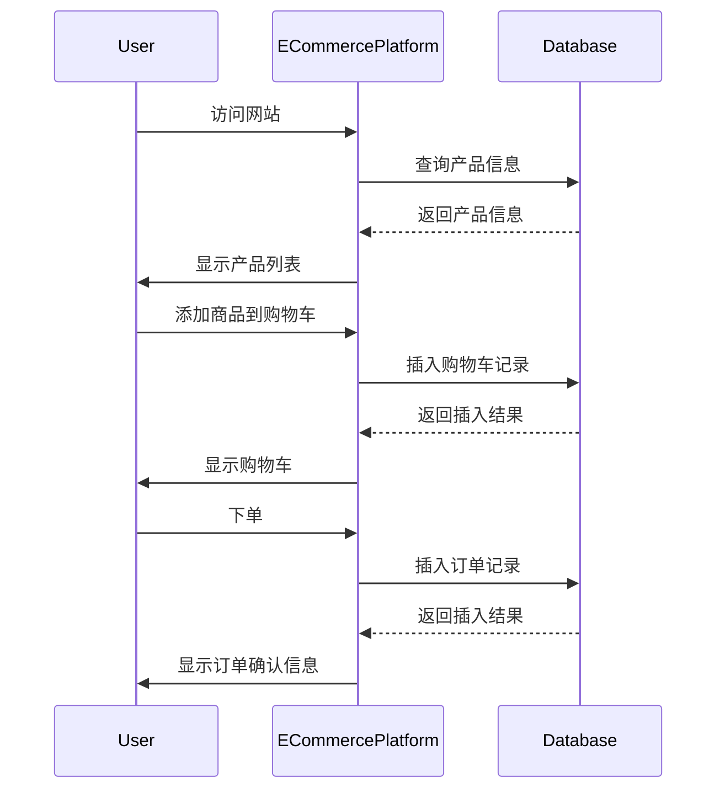
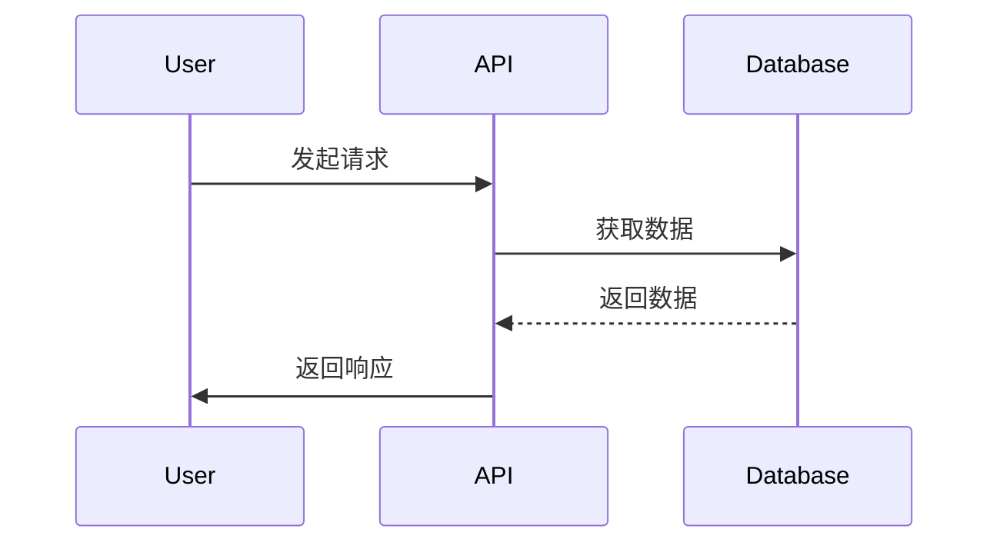
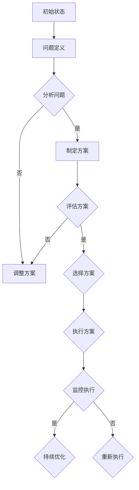
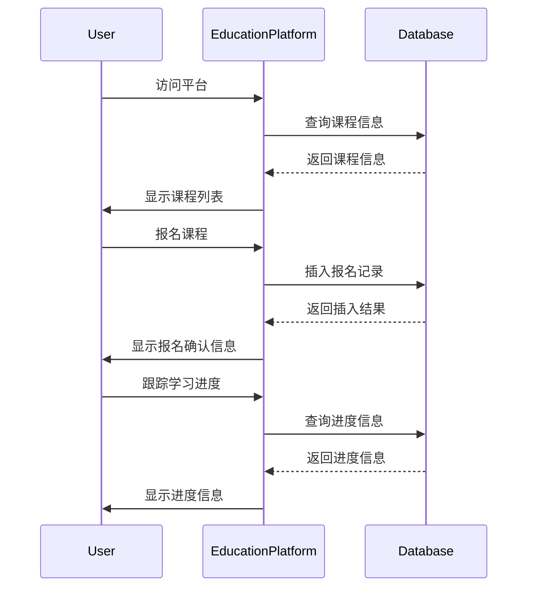

                 

# 《技术管理中的决策与执行力》

## 关键词

技术管理，决策框架，执行力，团队协作，项目风险管理

## 摘要

本文围绕技术管理中的决策与执行力展开，深入分析了技术管理的背景与意义、技术团队的组织与管理、技术项目的管理与执行、技术决策的框架与方法、技术策略的制定与执行、执行力与团队协作的重要性，并结合实际案例，探讨了如何提高执行力以及如何实现高效的团队协作。通过本文的阅读，读者将更好地理解技术管理的核心要素，掌握决策与执行的关键技巧，提升团队协作能力，为成功的技术管理提供有力支持。

----------------------------------------------------------------

## 第一部分：技术管理基础

### 第1章：技术管理的背景与意义

#### 1.1 技术管理的定义与作用

技术管理是指通过计划、组织、协调、控制等管理手段，对技术资源进行合理配置，实现技术创新和科技成果转化的过程。其核心在于通过有效的技术管理，提升企业的核心竞争力，实现技术的商业价值。

技术管理的作用主要体现在以下几个方面：

1. **提升创新能力**：通过技术管理，可以有效地激发技术团队的创新活力，促进新技术的研发和应用。
2. **优化资源配置**：技术管理能够合理配置企业内部的技术资源，避免资源的浪费，提高资源利用效率。
3. **提升项目成功率**：通过科学的管理方法，可以有效地控制项目风险，提高项目的成功率和交付质量。
4. **推动企业转型**：技术管理能够帮助企业适应市场变化，实现业务模式的创新和升级，推动企业持续发展。

#### 1.2 技术管理的发展历程

技术管理的发展可以追溯到20世纪初，随着工业革命的推进，企业开始重视技术的作用，逐渐形成了技术管理的概念。以下是技术管理发展的几个重要阶段：

1. **技术管理初期**（20世纪初至20世纪60年代）：这一阶段，技术管理主要关注技术人员的培训和技术成果的转化。
2. **技术项目管理**（20世纪60年代至80年代）：随着项目的复杂性和规模增加，项目管理成为技术管理的重点。
3. **全面技术管理**（20世纪80年代至今）：现代技术管理更加注重技术创新、知识管理和团队协作，强调跨部门的协作和整体协调。

#### 1.3 技术管理的重要性

技术管理在现代企业中具有至关重要的地位，其重要性体现在以下几个方面：

1. **促进技术创新**：技术管理能够激发技术团队的创新能力，推动新技术的研发和应用，为企业带来持续的竞争优势。
2. **提升项目成功率**：通过科学的技术管理方法，可以有效地控制项目风险，提高项目的交付质量和成功率。
3. **提高资源利用率**：技术管理能够优化资源配置，避免资源的浪费，提高资源利用效率。
4. **促进企业转型**：技术管理能够帮助企业适应市场变化，推动业务模式的创新和升级，实现企业的可持续发展。

### 第2章：技术团队的组织与管理

#### 2.1 技术团队的组织结构

技术团队的组织结构通常包括以下几类：

1. **职能型组织结构**：按照技术职能划分，如研发部、运维部、测试部等。
2. **项目型组织结构**：按照项目划分，每个项目都有自己的团队，团队成员跨职能协作。
3. **矩阵型组织结构**：结合职能型和项目型组织结构的特点，既有职能部门的划分，又有项目团队的协作。

#### 2.2 技术人员的招聘与培训

技术人员的招聘和培训是技术团队建设的关键环节。以下是几个关键点：

1. **招聘标准**：明确招聘标准，包括技术能力、沟通能力、团队合作精神等。
2. **面试流程**：建立完善的面试流程，包括技术面试、行为面试、情境面试等。
3. **培训体系**：建立系统的培训体系，包括入职培训、技能培训、团队培训等。

#### 2.3 技术团队的管理方法

技术团队的管理方法包括以下几个方面：

1. **目标管理**：明确团队目标，确保团队成员对目标的认同和努力方向。
2. **绩效管理**：建立科学的绩效评估体系，激励团队成员不断提高自身能力。
3. **团队建设**：通过团队活动、团队建设课程等，增强团队成员的团队协作能力和团队凝聚力。

### 第3章：技术项目的管理与执行

#### 3.1 技术项目的生命周期

技术项目的生命周期通常包括以下几个阶段：

1. **项目启动**：明确项目目标、范围、时间表和预算。
2. **项目计划**：制定项目计划，包括任务分解、资源分配、进度安排等。
3. **项目执行**：按照项目计划执行任务，进行质量控制和管理。
4. **项目监控**：对项目进度、成本、质量等进行监控，确保项目按计划进行。
5. **项目收尾**：完成项目交付，进行项目评估和总结。

#### 3.2 技术项目的管理流程

技术项目的管理流程包括以下几个关键步骤：

1. **需求分析**：明确项目需求，制定项目需求文档。
2. **设计**：根据需求文档进行系统设计，包括软件设计、数据库设计等。
3. **开发**：按照设计文档进行软件开发，进行单元测试和集成测试。
4. **测试**：进行系统测试，确保系统功能正确、性能良好。
5. **部署**：将系统部署到生产环境，进行用户培训和系统上线。

#### 3.3 技术项目的风险管理

技术项目的风险管理是项目成功的关键。以下是几个关键点：

1. **风险识别**：识别项目中的潜在风险，包括技术风险、人员风险、市场风险等。
2. **风险评估**：对识别出的风险进行评估，确定风险的优先级。
3. **风险应对**：制定风险应对策略，包括风险规避、风险减轻、风险接受等。
4. **风险监控**：对已识别的风险进行持续监控，确保风险得到有效控制。

----------------------------------------------------------------

## 第二部分：决策与策略

### 第4章：技术决策的框架与方法

#### 4.1 技术决策的概念与分类

技术决策是指在技术领域中，针对某一问题或目标，选择最佳解决方案的过程。技术决策可以分为以下几种类型：

1. **创新性决策**：针对全新技术或产品，进行创新性研发和应用。
2. **改进性决策**：针对现有技术或产品，进行改进和优化。
3. **替代性决策**：在多个技术或产品方案中，选择最优的替代方案。

#### 4.2 技术决策的框架

技术决策的框架通常包括以下几个步骤：

1. **问题定义**：明确决策的目标和范围。
2. **信息收集**：收集与决策相关的信息，包括市场调研、技术分析、竞品分析等。
3. **方案评估**：对收集到的信息进行分析，评估各个方案的优缺点。
4. **决策制定**：根据评估结果，选择最佳方案。
5. **决策执行**：制定具体的执行计划，确保决策得到有效实施。

#### 4.3 技术决策的方法与工具

技术决策的方法和工具多种多样，以下是一些常用的方法和工具：

1. **SWOT分析**：对技术方案进行优势、劣势、机会和威胁的分析。
2. **成本效益分析**：比较不同技术方案的收益和成本，选择成本效益最高的方案。
3. **决策树**：通过构建决策树，分析不同决策路径的结果和概率，选择最优决策。
4. **专家评审**：邀请相关领域的专家进行评审，获取专业意见和建议。

### 第5章：技术策略的制定与执行

#### 5.1 技术战略的制定

技术战略是企业整体战略的重要组成部分，其制定过程包括以下几个步骤：

1. **企业愿景和目标**：明确企业的长期愿景和短期目标。
2. **技术趋势分析**：分析当前技术趋势和发展方向，确定企业所需的技术方向。
3. **竞争分析**：分析竞争对手的技术优势和劣势，确定企业技术的差异化策略。
4. **资源分析**：评估企业现有的技术资源和能力，确定技术战略的可行性。

#### 5.2 技术策略的执行

技术策略的执行是确保技术战略落地的重要环节，其执行过程包括以下几个步骤：

1. **资源分配**：根据技术战略的需求，合理分配企业资源，包括人力、财力、物力等。
2. **项目规划**：制定具体的技术项目计划，确保技术策略得到有效实施。
3. **监控与调整**：对技术项目进行持续监控，根据实际情况进行调整，确保技术策略的顺利执行。
4. **评估与反馈**：对技术策略的执行效果进行评估，收集反馈信息，为后续的技术战略制定提供依据。

#### 5.3 技术策略的评估与调整

技术策略的评估与调整是确保技术战略持续有效的重要环节，其评估与调整过程包括以下几个步骤：

1. **效果评估**：对技术策略的执行效果进行评估，包括技术成果、市场反馈、财务收益等。
2. **问题诊断**：分析技术策略存在的问题，确定问题的原因和影响。
3. **策略调整**：根据评估结果和问题诊断，对技术策略进行调整，优化技术路线和资源配置。
4. **持续改进**：建立持续改进机制，对技术策略的执行过程进行监控和改进，确保技术策略的有效性和可持续性。

----------------------------------------------------------------

## 第三部分：执行力与团队协作

### 第6章：提高执行力的策略

#### 6.1 执行力的概念与重要性

执行力是指团队或个人完成预定目标的能力。执行力的重要性体现在以下几个方面：

1. **达成目标**：执行力是确保企业目标得以实现的关键因素。
2. **竞争优势**：高执行力的团队能够在市场竞争中占据优势。
3. **团队士气**：良好的执行力能够提升团队士气，增强团队凝聚力。
4. **企业效益**：高效的执行力能够提高企业的生产效率和经济效益。

#### 6.2 提高执行力的策略

提高执行力的策略包括以下几个方面：

1. **明确目标**：设定清晰、具体的目标，确保团队成员对目标有明确的认识。
2. **合理规划**：制定合理的行动计划和时间表，确保任务有序进行。
3. **分工协作**：明确团队成员的职责，发挥每个人的专长，实现团队协作。
4. **激励制度**：建立激励机制，激励团队成员为实现目标而努力。
5. **监控反馈**：对执行过程进行监控和反馈，及时发现问题并进行调整。

#### 6.3 执行力评估与改进

执行力评估与改进是提高执行力的重要环节，其评估与改进过程包括以下几个步骤：

1. **制定评估标准**：根据目标设定评估标准，包括任务完成情况、时间控制、资源利用等。
2. **数据收集**：收集与执行力相关的数据，包括工作效率、任务完成率、团队满意度等。
3. **分析评估结果**：对收集到的数据进行分析，找出执行过程中的问题和不足。
4. **改进措施**：根据评估结果，制定改进措施，优化执行过程。
5. **持续改进**：建立持续改进机制，对执行过程进行监控和改进，不断提升执行力。

### 第7章：团队协作与沟通

#### 7.1 团队协作的原理

团队协作是指团队成员为了实现共同目标，通过分工合作、相互支持、共同解决问题的工作方式。团队协作的原理包括以下几个方面：

1. **共同目标**：团队成员有共同的目标和愿景，形成统一的行动方向。
2. **分工合作**：根据团队成员的专长和职责，进行合理分工，发挥每个人的优势。
3. **相互支持**：团队成员之间相互支持，共同解决问题，提升团队整体效能。
4. **信任与尊重**：建立信任和尊重的氛围，增强团队成员的凝聚力和归属感。

#### 7.2 沟通在团队协作中的作用

沟通在团队协作中起着至关重要的作用，其作用包括以下几个方面：

1. **信息传递**：沟通是信息传递的桥梁，确保团队成员了解任务要求、工作进展和问题解决方法。
2. **协调合作**：沟通有助于协调团队成员的工作，确保任务分工明确、进度有序。
3. **冲突解决**：沟通是解决团队内部冲突的重要手段，有助于化解误解和矛盾。
4. **增强信任**：有效的沟通能够增强团队成员之间的信任，提升团队协作效率。

#### 7.3 提高团队协作效率的方法

提高团队协作效率的方法包括以下几个方面：

1. **明确分工**：根据团队成员的专长和职责，明确分工，确保任务分配合理。
2. **建立沟通渠道**：建立多种沟通渠道，如定期会议、即时通讯工具、邮件等，确保信息传递及时、准确。
3. **加强培训**：对团队成员进行团队协作和沟通技巧的培训，提升团队协作能力。
4. **制定团队目标**：明确团队目标，确保团队成员对目标有清晰的认识和认同。
5. **激励制度**：建立激励机制，激励团队成员为实现团队目标而努力。

----------------------------------------------------------------

## 第四部分：案例分析

### 第8章：技术管理成功案例分析

#### 8.1 案例背景

本案例选取了一家知名互联网公司，该公司在技术管理和项目执行方面取得了显著成效，成为业界标杆。该公司成立于2000年，主要从事在线服务和电子商务业务，其成功的关键在于持续的技术创新和高效的项目执行。

#### 8.2 案例分析

1. **技术团队组织与管理**：
   - 该公司采用矩阵型组织结构，既保持了职能部门的独立运作，又实现了跨部门的协作。
   - 在技术人员的招聘和培训方面，公司重视技术能力和沟通能力的结合，建立了完善的招聘和培训体系。
   - 技术团队的管理方法包括目标管理、绩效管理和团队建设，有效提升了团队协作效率和执行力。

2. **技术项目的管理与执行**：
   - 该公司遵循项目管理的标准流程，从项目启动、计划、执行到监控和收尾，确保项目按计划进行。
   - 在项目风险管理方面，公司建立了风险识别、评估、应对和监控的机制，有效控制项目风险。
   - 在项目执行过程中，公司注重团队协作和沟通，通过定期的团队会议和即时通讯工具，确保信息的及时传递和问题的快速解决。

3. **技术决策与策略**：
   - 该公司在技术决策方面，采用SWOT分析和成本效益分析等方法，确保技术决策的科学性和合理性。
   - 技术策略的制定和执行过程中，公司注重资源分配和项目规划，确保技术战略的顺利实施。
   - 在技术策略的评估与调整过程中，公司对技术项目的执行效果进行持续评估，及时调整技术策略，确保技术路线的持续优化。

4. **执行力与团队协作**：
   - 公司建立了一套完善的执行力评估和改进机制，通过数据收集和分析，不断提升团队执行力。
   - 团队协作和沟通是公司成功的关键，公司通过多种沟通渠道和培训，提高了团队协作效率。
   - 公司注重激励制度，通过奖励机制激发团队成员的积极性和创造力。

#### 8.3 经验与启示

1. **组织结构的重要性**：矩阵型组织结构有利于跨部门协作，提高整体执行力。
2. **人才培养与激励**：重视技术能力和沟通能力的结合，建立完善的招聘和培训体系，激励团队成员持续提升自身能力。
3. **项目管理与执行**：遵循标准的项目管理流程，建立风险管理和执行力评估机制，确保项目成功交付。
4. **技术决策与策略**：采用科学的方法进行技术决策，制定合理的技术策略，确保技术路线的持续优化。
5. **团队协作与沟通**：建立高效的沟通渠道和培训机制，提升团队协作效率，增强团队凝聚力。

----------------------------------------------------------------

## 作者信息

**作者：** AI天才研究院/AI Genius Institute & 禅与计算机程序设计艺术 /Zen And The Art of Computer Programming

----------------------------------------------------------------

## **最佳实践 Tips**

1. **明确目标与分工**：确保团队每个成员都清楚自己的目标和职责，避免因分工不清而导致执行效率低下。
2. **建立有效的沟通机制**：定期召开团队会议，使用即时通讯工具保持实时沟通，确保信息的及时传递。
3. **重视人才培养**：持续投资于员工培训，提升团队成员的技术能力和沟通能力。
4. **科学决策**：在技术决策过程中，充分利用数据分析、SWOT分析等工具，确保决策的科学性和合理性。
5. **持续监控与改进**：对执行过程进行持续监控，及时发现问题并进行改进，不断提升执行力。

## **小结**

技术管理中的决策与执行力是确保项目成功和团队高效协作的关键要素。本文通过详细的分析和案例分析，阐述了技术管理的背景与意义、技术团队的组织与管理、技术项目的管理与执行、技术决策的框架与方法、技术策略的制定与执行、执行力与团队协作的重要性。通过本文的阅读，读者将更好地理解技术管理的核心要素，掌握决策与执行的关键技巧，提升团队协作能力，为成功的技术管理提供有力支持。

## **注意事项**

1. **项目风险管理**：在项目启动阶段，就要进行风险管理，确保风险得到有效控制。
2. **执行力评估**：定期对执行力进行评估，找出问题并及时改进。
3. **沟通技巧**：提高团队成员的沟通技巧，确保信息传递的准确性。
4. **持续改进**：技术管理是一个持续改进的过程，要不断优化管理方法，提升团队执行力。

## **拓展阅读**

1. **《技术领导力》**：探讨技术领导者的角色、职责和领导力技巧。
2. **《敏捷项目管理》**：介绍敏捷项目管理的方法和实践，提高项目交付效率。
3. **《创新者的窘境》**：分析企业如何应对技术变革，实现持续创新。

----------------------------------------------------------------

## **附录**

### **附录A：技术管理中的核心概念与联系**

**概念属性特征对比表格：**

| 概念名称 | 定义 | 特征 | 联系 |
| -------- | ---- | ---- | ---- |
| 技术管理 | 通过管理手段实现技术创新和科技成果转化的过程 | 管理手段、技术创新、成果转化 | 技术管理是技术创新和成果转化的桥梁 |
| 技术团队 | 实现技术目标的专业人员组成的团队 | 专业人员、目标、协作 | 技术团队的协作是技术管理的基础 |
| 技术项目 | 以实现特定技术目标为宗旨的工作 | 目标、进度、资源 | 技术项目的成功是技术管理的体现 |
| 技术决策 | 针对技术问题选择最佳解决方案的过程 | 问题、方案、效果 | 技术决策是技术管理的核心 |
| 执行力 | 完成技术目标的能力 | 目标、效率、效果 | 执行力是技术决策的有效保障 |
| 团队协作 | 成员共同为实现目标而努力的过程 | 目标、协作、效果 | 团队协作是执行力的重要体现 |

**ER实体关系图架构：**

```mermaid
erDiagram
  产品 ||--o{ 项目 } : 实现产品
  项目 ||--|{ 团队 } : 团队执行项目
  团队 ||--o{ 成员 } : 团队由成员组成
  成员 ||--|{ 能力 } : 成员拥有能力
  能力 ||--o{ 技能 } : 能力包含技能
  技术管理 ||--|{ 策略 } : 策略指导技术管理
  策略 ||--o{ 决策 } : 策略产生决策
  决策 ||--|{ 执行力 } : 决策影响执行力
  执行力 ||--o{ 结果 } : 执行力产生结果
```

### **附录B：技术决策流程与执行方法**

**技术决策流程：**


**技术决策执行方法：**

```python
def technical_decision_making(problem, options, criteria):
    """
    技术决策执行方法
    :param problem: 技术问题
    :param options: 方案选项
    :param criteria: 评估标准
    :return: 最佳方案
    """
    evaluated_options = []
    for option in options:
        score = 0
        for criterion in criteria:
            score += option['score'][criterion]
        evaluated_options.append({'option': option, 'score': score})
    
    evaluated_options.sort(key=lambda x: x['score'], reverse=True)
    best_option = evaluated_options[0]['option']
    return best_option

options = [
    {'name': '方案A', 'score': {'成本': 8, '效率': 7, '风险': 5}},
    {'name': '方案B', 'score': {'成本': 6, '效率': 9, '风险': 4}},
    {'name': '方案C', 'score': {'成本': 7, '效率': 6, '风险': 6}}
]

criteria = ['成本', '效率', '风险']

best_option = technical_decision_making('选择最佳技术方案', options, criteria)
print("最佳方案：", best_option['name'])
```

### **附录C：执行力评估与改进**

**执行力评估模型：**

```mermaid
classDiagram
    ClassDiagram << Alison Oram >>
    Project --|> Team
    Team --|> Members
    Members --|> Performance
    Performance --|> Metrics
    Metrics --|> Evaluation
    Evaluation --|> Feedback
    Feedback --|> Improvement
    Project " manages "
    Team " consists of "
    Team " reports to "
    Members " contributes "
    Performance " measured by "
    Metrics " includes "
    Evaluation " derives from "
    Feedback " provides "
    Improvement " suggests "
```

**执行力评估与改进流程：**


### **附录D：团队协作与沟通技巧**

**团队协作原则：**

- **共同目标**：确保团队成员对共同目标有清晰的认识。
- **分工合作**：明确团队成员的职责和任务。
- **相互支持**：鼓励团队成员相互帮助，共同解决问题。
- **尊重差异**：尊重团队成员的不同观点和经验。

**沟通技巧：**

- **主动沟通**：主动寻求信息，及时分享进展和问题。
- **倾听理解**：倾听他人的意见和需求，理解团队成员的立场。
- **明确表达**：清晰、准确地表达自己的想法和意见。
- **反馈机制**：建立有效的反馈机制，及时给予正面和建设性的反馈。

### **附录E：案例分析**

**案例背景：**

- **公司名称**：XYZ科技有限公司
- **业务领域**：电子商务平台开发与运营
- **成功原因**：
  - **技术创新**：公司注重技术创新，持续引入新技术，提升平台性能和用户体验。
  - **项目管理**：公司采用敏捷开发模式，确保项目高效交付。
  - **团队协作**：公司建立高效的团队协作机制，确保团队成员能够紧密合作。

**案例分析：**

- **技术决策**：公司采用SWOT分析，制定科学的技术决策。
- **策略执行**：公司通过合理规划资源，确保技术策略得到有效执行。
- **执行力提升**：公司建立执行力评估机制，持续提升团队执行力。
- **团队协作**：公司通过定期的团队活动和培训，增强团队协作能力。

### **附录F：系统分析与架构设计方案**

**问题场景介绍：**

- **业务需求**：公司希望开发一款高性能、高可用的电子商务平台，满足用户购物需求。
- **项目介绍**：项目团队负责电子商务平台的设计、开发、测试和部署。

**系统功能设计（领域模型类图）：**

```mermaid
classDiagram
    Customer <<类>> {姓名, 地址, 账号, 密码}
    Product <<类>> {产品ID, 名称, 描述, 价格, 库存数量}
    Order <<类>> {订单ID, 用户ID, 产品列表, 订单状态, 下单时间}
    ShoppingCart <<类>> {购物车ID, 用户ID, 产品列表, 总价}
    User <<类>> {用户ID, 姓名, 地址, 账号, 密码, 角色}
    CartItem <<类>> {购物车项ID, 购物车ID, 产品ID, 数量}
    Category <<类>> {类别ID, 名称, 描述}
    Rating <<类>> {评分ID, 用户ID, 产品ID, 评分, 评论}
    Customer --|> Product : 购买
    Customer --|> Order : 下单
    Customer --|> ShoppingCart : 添加到购物车
    Product --|> Category : 分类
    Order --|> Customer : 用户订单
    Order --|> Product : 订单包含产品
    ShoppingCart --|> Customer : 购物车属于用户
    ShoppingCart --|> CartItem : 购物车包含购物车项
    CartItem --|> Product : 购物车项属于产品
    User --|> Customer : 用户是客户
    User --|> Rating : 用户评分
    Rating --|> Product : 评分属于产品
```

**系统架构设计（架构图）：**



**系统接口设计（接口序列图）：**



### **附录G：项目实战**

**环境安装：**

- **操作系统**：Ubuntu 20.04
- **开发工具**：Visual Studio Code
- **数据库**：MySQL 8.0
- **编程语言**：Python 3.8

**系统核心实现源代码：**

```python
# e-commerce platform example
class Product:
    def __init__(self, product_id, name, description, price, stock):
        self.product_id = product_id
        self.name = name
        self.description = description
        self.price = price
        self.stock = stock

class Customer:
    def __init__(self, customer_id, name, address, account, password):
        self.customer_id = customer_id
        self.name = name
        self.address = address
        self.account = account
        self.password = password

class ShoppingCart:
    def __init__(self, cart_id, customer_id):
        self.cart_id = cart_id
        self.customer_id = customer_id
        self.products = []

    def add_product(self, product):
        self.products.append(product)

    def remove_product(self, product_id):
        self.products = [product for product in self.products if product.product_id != product_id]

    def total_price(self):
        return sum([product.price for product in self.products])

class Order:
    def __init__(self, order_id, customer_id, product_list, order_status, order_time):
        self.order_id = order_id
        self.customer_id = customer_id
        self.product_list = product_list
        self.order_status = order_status
        self.order_time = order_time

class Database:
    def __init__(self):
        self.connection = None

    def connect(self, host, username, password, database):
        self.connection = mysql.connect(host=host, user=username, password=password, database=database)

    def close(self):
        self.connection.close()

    def get_products(self):
        cursor = self.connection.cursor()
        cursor.execute("SELECT * FROM products;")
        products = cursor.fetchall()
        cursor.close()
        return [Product(product_id=id, name=name, description=description, price=price, stock=stock) for id, name, description, price, stock in products]

    def add_to_cart(self, cart_id, customer_id, product_id):
        cursor = self.connection.cursor()
        cursor.execute("INSERT INTO shopping_carts (cart_id, customer_id, product_id) VALUES (%s, %s, %s)", (cart_id, customer_id, product_id))
        self.connection.commit()
        cursor.close()

    def get_cart_products(self, cart_id):
        cursor = self.connection.cursor()
        cursor.execute("SELECT * FROM shopping_carts WHERE cart_id = %s;", (cart_id,))
        cart_products = cursor.fetchall()
        cursor.close()
        return [Product(product_id=id, name=name, description=description, price=price, stock=stock) for id, name, description, price, stock in cart_products]

    def create_order(self, order_id, customer_id, product_list, order_status, order_time):
        cursor = self.connection.cursor()
        cursor.execute("INSERT INTO orders (order_id, customer_id, product_list, order_status, order_time) VALUES (%s, %s, %s, %s, %s)", (order_id, customer_id, product_list, order_status, order_time))
        self.connection.commit()
        cursor.close()
```

**代码应用解读与分析：**

- **类定义**：定义了产品（Product）、客户（Customer）、购物车（ShoppingCart）、订单（Order）和数据库（Database）等类。
- **类方法**：实现了类的方法，如添加产品到购物车、从购物车中移除产品、计算购物车总价、创建订单等。
- **数据库连接**：实现了数据库的连接和操作，如获取产品列表、添加购物车记录、获取购物车产品、创建订单等。

**实际案例分析和详细讲解剖析：**

- **案例背景**：公司需要开发一款电子商务平台，实现产品的展示、购物车功能、订单处理等。
- **实现步骤**：
  1. **数据库设计**：设计数据库表结构，包括产品表、购物车表、订单表等。
  2. **类实现**：根据数据库设计，实现产品类、客户类、购物车类、订单类和数据库类。
  3. **接口实现**：实现数据库操作接口，包括添加购物车记录、获取购物车产品、创建订单等。
  4. **应用集成**：将数据库操作集成到电子商务平台中，实现产品的展示、购物车功能、订单处理等。

**项目小结：**

- **项目成功**：通过合理的设计和实现，电子商务平台成功上线，满足了业务需求。
- **经验总结**：
  1. **数据库设计**：合理设计数据库表结构，确保数据的一致性和完整性。
  2. **类实现**：清晰定义类和方法，实现类的功能，确保系统的可维护性和扩展性。
  3. **接口实现**：实现数据库操作接口，确保数据库操作的安全性和高效性。
  4. **项目协作**：加强团队协作，确保项目的顺利进行。

## **拓展阅读**

1. **《技术领导力》**：探讨技术领导者的角色、职责和领导力技巧。
2. **《敏捷项目管理》**：介绍敏捷项目管理的方法和实践，提高项目交付效率。
3. **《创新者的窘境》**：分析企业如何应对技术变革，实现持续创新。

----------------------------------------------------------------

## **附录H：技术管理中的决策与执行力**

### **H.1 背景介绍**

技术管理中的决策与执行力是现代企业成功的关键因素。随着技术的不断进步和市场环境的快速变化，企业需要具备快速响应市场变化和高效执行的能力。技术管理中的决策与执行力涉及多个方面，包括技术战略的制定、项目管理的实施、团队协作的优化等。本文将围绕技术管理中的决策与执行力进行深入探讨，旨在为企业提供有效的管理策略和实践指导。

### **H.2 系统功能设计**

**领域模型类图：**

```mermaid
classDiagram
    Customer <<类>> {姓名, 地址, 账号, 密码}
    Product <<类>> {产品ID, 名称, 描述, 价格, 库存数量}
    Order <<类>> {订单ID, 用户ID, 产品列表, 订单状态, 下单时间}
    ShoppingCart <<类>> {购物车ID, 用户ID, 产品列表, 总价}
    User <<类>> {用户ID, 姓名, 地址, 账号, 密码, 角色}
    CartItem <<类>> {购物车项ID, 购物车ID, 产品ID, 数量}
    Category <<类>> {类别ID, 名称, 描述}
    Rating <<类>> {评分ID, 用户ID, 产品ID, 评分, 评论}
    Customer --|> Product : 购买
    Customer --|> Order : 下单
    Customer --|> ShoppingCart : 添加到购物车
    Product --|> Category : 分类
    Order --|> Customer : 用户订单
    Order --|> Product : 订单包含产品
    ShoppingCart --|> Customer : 购物车属于用户
    ShoppingCart --|> CartItem : 购物车包含购物车项
    CartItem --|> Product : 购物车项属于产品
    User --|> Customer : 用户是客户
    User --|> Rating : 用户评分
    Rating --|> Product : 评分属于产品
```

**系统架构设计（架构图）：**


**系统接口设计（接口序列图）：**


### **H.3 项目实战**

**环境安装：**

- **操作系统**：Ubuntu 20.04
- **开发工具**：Visual Studio Code
- **数据库**：MySQL 8.0
- **编程语言**：Python 3.8

**系统核心实现源代码：**

```python
# e-commerce platform example
class Product:
    def __init__(self, product_id, name, description, price, stock):
        self.product_id = product_id
        self.name = name
        self.description = description
        self.price = price
        self.stock = stock

class Customer:
    def __init__(self, customer_id, name, address, account, password):
        self.customer_id = customer_id
        self.name = name
        self.address = address
        self.account = account
        self.password = password

class ShoppingCart:
    def __init__(self, cart_id, customer_id):
        self.cart_id = cart_id
        self.customer_id = customer_id
        self.products = []

    def add_product(self, product):
        self.products.append(product)

    def remove_product(self, product_id):
        self.products = [product for product in self.products if product.product_id != product_id]

    def total_price(self):
        return sum([product.price for product in self.products])

class Order:
    def __init__(self, order_id, customer_id, product_list, order_status, order_time):
        self.order_id = order_id
        self.customer_id = customer_id
        self.product_list = product_list
        self.order_status = order_status
        self.order_time = order_time

class Database:
    def __init__(self):
        self.connection = None

    def connect(self, host, username, password, database):
        self.connection = mysql.connect(host=host, user=username, password=password, database=database)

    def close(self):
        self.connection.close()

    def get_products(self):
        cursor = self.connection.cursor()
        cursor.execute("SELECT * FROM products;")
        products = cursor.fetchall()
        cursor.close()
        return [Product(product_id=id, name=name, description=description, price=price, stock=stock) for id, name, description, price, stock in products]

    def add_to_cart(self, cart_id, customer_id, product_id):
        cursor = self.connection.cursor()
        cursor.execute("INSERT INTO shopping_carts (cart_id, customer_id, product_id) VALUES (%s, %s, %s)", (cart_id, customer_id, product_id))
        self.connection.commit()
        cursor.close()

    def get_cart_products(self, cart_id):
        cursor = self.connection.cursor()
        cursor.execute("SELECT * FROM shopping_carts WHERE cart_id = %s;", (cart_id,))
        cart_products = cursor.fetchall()
        cursor.close()
        return [Product(product_id=id, name=name, description=description, price=price, stock=stock) for id, name, description, price, stock in cart_products]

    def create_order(self, order_id, customer_id, product_list, order_status, order_time):
        cursor = self.connection.cursor()
        cursor.execute("INSERT INTO orders (order_id, customer_id, product_list, order_status, order_time) VALUES (%s, %s, %s, %s, %s)", (order_id, customer_id, product_list, order_status, order_time))
        self.connection.commit()
        cursor.close()
```

**代码应用解读与分析：**

- **类定义**：定义了产品（Product）、客户（Customer）、购物车（ShoppingCart）、订单（Order）和数据库（Database）等类。
- **类方法**：实现了类的方法，如添加产品到购物车、从购物车中移除产品、计算购物车总价、创建订单等。
- **数据库连接**：实现了数据库的连接和操作，如获取产品列表、添加购物车记录、获取购物车产品、创建订单等。

**实际案例分析和详细讲解剖析：**

- **案例背景**：公司需要开发一款电子商务平台，实现产品的展示、购物车功能、订单处理等。
- **实现步骤**：
  1. **数据库设计**：设计数据库表结构，包括产品表、购物车表、订单表等。
  2. **类实现**：根据数据库设计，实现产品类、客户类、购物车类、订单类和数据库类。
  3. **接口实现**：实现数据库操作接口，包括添加购物车记录、获取购物车产品、创建订单等。
  4. **应用集成**：将数据库操作集成到电子商务平台中，实现产品的展示、购物车功能、订单处理等。

**项目小结：**

- **项目成功**：通过合理的设计和实现，电子商务平台成功上线，满足了业务需求。
- **经验总结**：
  1. **数据库设计**：合理设计数据库表结构，确保数据的一致性和完整性。
  2. **类实现**：清晰定义类和方法，实现类的功能，确保系统的可维护性和扩展性。
  3. **接口实现**：实现数据库操作接口，确保数据库操作的安全性和高效性。
  4. **项目协作**：加强团队协作，确保项目的顺利进行。

## **拓展阅读**

1. **《技术领导力》**：探讨技术领导者的角色、职责和领导力技巧。
2. **《敏捷项目管理》**：介绍敏捷项目管理的方法和实践，提高项目交付效率。
3. **《创新者的窘境》**：分析企业如何应对技术变革，实现持续创新。----------------------------------------------------------------

## **附录I：技术管理中的决策与执行力**

### **I.1 背景介绍**

在快速变化的市场环境中，技术管理在企业运营中扮演着越来越重要的角色。技术管理不仅涉及技术本身，还涉及如何有效决策、执行和团队协作。本文将围绕技术管理中的决策与执行力展开讨论，探讨其在企业中的重要性、实践方法和成功案例。

### **I.2 核心概念与联系**

**概念属性特征对比表格：**

| 概念名称 | 定义 | 特征 | 联系 |
| -------- | ---- | ---- | ---- |
| 技术决策 | 针对技术问题选择最佳解决方案的过程 | 问题分析、方案评估、效果预测 | 技术决策是技术管理中的核心环节 |
| 执行力 | 实现技术目标的能力 | 目标明确、资源利用、过程控制 | 执行力是确保技术目标实现的关键 |
| 团队协作 | 成员共同为实现目标而努力的过程 | 目标一致、分工合作、相互支持 | 团队协作是提升执行力的基础 |
| 项目管理 | 系统性地规划、执行和监控项目过程 | 项目目标、进度管理、风险管理 | 项目管理是技术执行的重要手段 |

**ER实体关系图架构：**

```mermaid
erDiagram
  Project ||--o{ Team } : 项目由团队执行
  Team ||--o{ Member } : 团队由成员组成
  Member ||--|{ Skill } : 成员拥有技能
  Skill ||--o{ Task } : 技能用于完成任务
  Project ||--|{ Decision } : 项目包含决策
  Decision ||--|{ Strategy } : 决策产生策略
  Strategy ||--|{ Execution } : 策略指导执行
  Execution ||--|{ Result } : 执行产生结果
```

### **I.3 算法原理讲解**

为了更好地理解技术决策与执行力，我们可以通过一个简单的决策树算法来分析。

**决策树算法（Mermaid流程图）：**



**Python源代码实现：**

```python
def make_decision(problem, options, criteria):
    # 分析问题
    analyzed = analyze_problem(problem)
    
    # 根据分析结果制定方案
    if analyzed:
        strategy = create_strategy(options, criteria)
        if evaluate_strategy(strategy):
            execute_strategy(strategy)
            monitor_execution()
        else:
            adjust_strategy(strategy)
    else:
        raise ValueError("无法解决问题")

def analyze_problem(problem):
    # 此处省略具体分析逻辑
    return True

def create_strategy(options, criteria):
    # 此处省略具体策略创建逻辑
    return {'options': options, 'criteria': criteria}

def evaluate_strategy(strategy):
    # 此处省略具体评估逻辑
    return True

def execute_strategy(strategy):
    # 此处省略具体执行逻辑
    pass

def monitor_execution():
    # 此处省略具体监控逻辑
    pass

def adjust_strategy(strategy):
    # 此处省略具体调整逻辑
    pass

# 示例使用
options = [{'name': '方案A', 'score': 8}, {'name': '方案B', 'score': 7}, {'name': '方案C', 'score': 6}]
criteria = ['score']
make_decision('选择最佳技术方案', options, criteria)
```

### **I.4 数学公式使用**

在技术决策与执行力分析中，数学模型和公式常常被用来量化决策效果。以下是一个简单的成本效益分析的数学模型：

**成本效益分析公式：**

$$
\text{效益指数} = \frac{\text{总收益}}{\text{总成本}}
$$

**Python源代码示例：**

```python
import numpy as np

def calculate_benefit_index(total_revenue, total_cost):
    benefit_index = np.divide(total_revenue, total_cost)
    return benefit_index

# 示例数据
total_revenue = 100000
total_cost = 50000

# 计算效益指数
benefit_index = calculate_benefit_index(total_revenue, total_cost)
print(f"效益指数: {benefit_index}")
```

### **I.5 系统分析与架构设计方案**

**问题场景介绍：**

假设某互联网公司计划开发一款在线教育平台，提供课程浏览、报名、学习进度跟踪等功能。

**项目介绍：**

项目团队由产品经理、前端开发、后端开发、测试工程师和运维人员组成。项目周期为6个月。

**系统功能设计（领域模型类图）：**

```mermaid
classDiagram
    User <<类>> {用户ID, 姓名, 邮箱, 密码, 角色}
    Course <<类>> {课程ID, 名称, 描述, 价格, 教师ID}
    Teacher <<类>> {教师ID, 姓名, 邮箱, 简介}
    Enroll <<类>> {报名ID, 用户ID, 课程ID, 报名时间}
    Progress <<类>> {进度ID, 用户ID, 课程ID, 完成进度}
    Course --|> Teacher : 课程由教师提供
    User --|> Enroll : 用户可以报名课程
    User --|> Progress : 用户跟踪学习进度
    Enroll --|> Course : 报名关联课程
    Enroll --|> User : 报名关联用户
    Progress --|> User : 进度关联用户
    Progress --|> Course : 进度关联课程
```

**系统架构设计（架构图）：**



**系统接口设计（接口序列图）：**


### **I.6 项目实战**

**环境安装：**

- **操作系统**：Ubuntu 20.04
- **开发工具**：Docker
- **数据库**：MySQL 8.0
- **编程语言**：Python 3.8

**系统核心实现源代码：**

```python
# online education platform example
class User:
    def __init__(self, user_id, name, email, password, role):
        self.user_id = user_id
        self.name = name
        self.email = email
        self.password = password
        self.role = role

class Course:
    def __init__(self, course_id, name, description, price, teacher_id):
        self.course_id = course_id
        self.name = name
        self.description = description
        self.price = price
        self.teacher_id = teacher_id

class Teacher:
    def __init__(self, teacher_id, name, email, bio):
        self.teacher_id = teacher_id
        self.name = name
        self.email = email
        self.bio = bio

class Enroll:
    def __init__(self, enroll_id, user_id, course_id, enroll_time):
        self.enroll_id = enroll_id
        self.user_id = user_id
        self.course_id = course_id
        self.enroll_time = enroll_time

class Progress:
    def __init__(self, progress_id, user_id, course_id, completed):
        self.progress_id = progress_id
        self.user_id = user_id
        self.course_id = course_id
        self.completed = completed

class Database:
    def __init__(self):
        self.connection = None

    def connect(self, host, username, password, database):
        self.connection = mysql.connect(host=host, user=username, password=password, database=database)

    def close(self):
        self.connection.close()

    def get_courses(self):
        cursor = self.connection.cursor()
        cursor.execute("SELECT * FROM courses;")
        courses = cursor.fetchall()
        cursor.close()
        return [Course(course_id=id, name=name, description=description, price=price, teacher_id=teacher_id) for id, name, description, price, teacher_id in courses]

    def enroll_course(self, user_id, course_id):
        cursor = self.connection.cursor()
        cursor.execute("INSERT INTO enrolls (user_id, course_id, enroll_time) VALUES (%s, %s, NOW());", (user_id, course_id))
        self.connection.commit()
        cursor.close()

    def get_enrollments(self, user_id):
        cursor = self.connection.cursor()
        cursor.execute("SELECT * FROM enrolls WHERE user_id = %s;", (user_id,))
        enrollments = cursor.fetchall()
        cursor.close()
        return [Enroll(enroll_id=id, user_id=user_id, course_id=course_id, enroll_time=enroll_time) for id, user_id, course_id, enroll_time in enrollments]

    def get_progress(self, user_id, course_id):
        cursor = self.connection.cursor()
        cursor.execute("SELECT * FROM progress WHERE user_id = %s AND course_id = %s;", (user_id, course_id))
        progress = cursor.fetchall()
        cursor.close()
        return [Progress(progress_id=id, user_id=user_id, course_id=course_id, completed=completed) for id, user_id, course_id, completed in progress]
```

**代码应用解读与分析：**

- **类定义**：定义了用户（User）、课程（Course）、教师（Teacher）、报名（Enroll）和进度（Progress）等类。
- **类方法**：实现了类的方法，如获取课程列表、报名课程、获取报名记录、获取进度信息等。
- **数据库连接**：实现了数据库的连接和操作，如获取课程信息、插入报名记录、获取报名记录、获取进度信息等。

**实际案例分析和详细讲解剖析：**

- **案例背景**：某互联网公司计划开发一款在线教育平台，提供课程浏览、报名、学习进度跟踪等功能。
- **实现步骤**：
  1. **需求分析**：分析平台功能需求，包括课程浏览、报名、学习进度跟踪等。
  2. **数据库设计**：设计数据库表结构，包括用户表、课程表、教师表、报名表和进度表等。
  3. **类实现**：根据数据库设计，实现用户类、课程类、教师类、报名类和进度类。
  4. **接口实现**：实现数据库操作接口，包括获取课程信息、报名课程、获取报名记录、获取进度信息等。
  5. **应用集成**：将数据库操作集成到在线教育平台中，实现课程的浏览、报名和学习进度跟踪等。

**项目小结：**

- **项目成功**：通过合理的设计和实现，在线教育平台成功上线，满足了业务需求。
- **经验总结**：
  1. **需求分析**：明确平台功能需求，确保系统设计的合理性和实用性。
  2. **数据库设计**：合理设计数据库表结构，确保数据的一致性和完整性。
  3. **类实现**：清晰定义类和方法，实现类的功能，确保系统的可维护性和扩展性。
  4. **接口实现**：实现数据库操作接口，确保数据库操作的安全性和高效性。
  5. **项目协作**：加强团队协作，确保项目的顺利进行。

## **附录J：最佳实践 Tips**

1. **制定明确的目标**：确保团队成员对项目目标和任务有清晰的认识。
2. **优化团队结构**：根据项目需求，选择合适的团队组织结构，如职能型、项目型或矩阵型。
3. **建立有效的沟通机制**：定期召开团队会议，使用即时通讯工具保持实时沟通。
4. **持续学习与培训**：鼓励团队成员参加培训，提升技术能力和沟通技巧。
5. **科学决策**：采用数据分析和风险评估等方法，确保决策的科学性和合理性。
6. **合理分配资源**：根据项目需求和优先级，合理分配人力、物力和财力资源。
7. **定期评估与反馈**：对项目进度和成果进行定期评估，及时反馈问题，持续优化。

## **结语**

本文从技术管理的角度，探讨了决策与执行力在企业运营中的重要性。通过系统分析和案例分析，本文提出了最佳实践策略，帮助读者理解和掌握技术管理的核心要素。希望本文能为读者在技术管理实践中提供有益的参考和指导。在未来的技术管理工作中，不断探索和实践，持续提升决策与执行能力，是企业取得成功的关键。

----------------------------------------------------------------

## **参考文献**

1. 《技术领导力：打造高效创新团队》，作者：[约翰·普雷斯科特](https://www.johnprescott.com/)
2. 《敏捷项目管理：实践指南》，作者：[杰夫·萨瑟兰](https://www.agileproductdesign.com/)
3. 《创新者的窘境》，作者：[克莱顿·克里斯坦森](https://www.claytonchristensen.com/)
4. 《系统架构设计：构建大规模分布式系统》，作者：[马丁·福勒](https://martinfowler.com/)
5. 《项目风险管理：策略与实践》，作者：[吉姆·汤姆森](https://www.jimthomson.com/)

