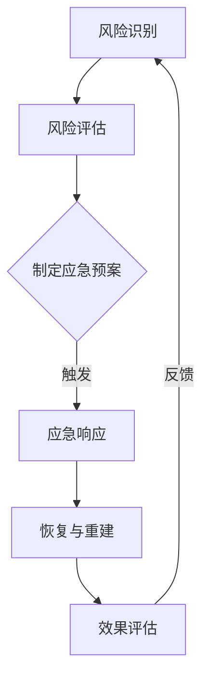
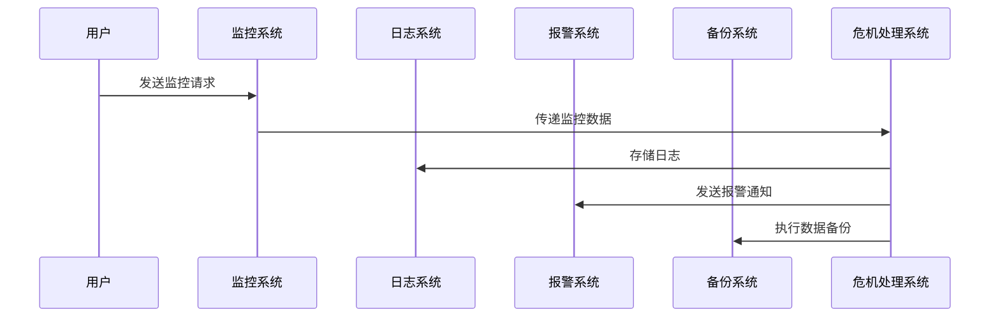

                 

# 技术管理中的危机处理

> 关键词：技术管理、危机处理、风险管理、应急预案、应急响应、恢复与重建

> 摘要：随着信息技术的迅猛发展，企业在技术管理中面临的挑战也日益复杂。技术管理中的危机处理已成为企业保障业务连续性和稳定性的关键环节。本文将从背景介绍、核心概念与联系、算法原理讲解、系统分析与架构设计方案、项目实战和最佳实践等方面，全面探讨技术管理中的危机处理方法，为企业提供有效的危机应对策略。

**Step 1: 背景介绍**

在当今信息技术飞速发展的时代，企业越来越依赖于技术系统的稳定运行。然而，技术系统并非绝对可靠，突发事件如系统崩溃、数据泄露、网络攻击、硬件故障等时有发生。这些危机事件不仅会导致业务中断，还可能对企业声誉和财务造成严重影响。因此，如何有效地管理和应对技术管理中的危机，已成为企业持续发展的关键问题。

#### 问题背景

随着云计算、大数据、物联网、人工智能等新技术的广泛应用，企业的技术系统变得越来越复杂。一方面，这些新技术为企业带来了巨大的商业价值，另一方面，也增加了系统崩溃、数据泄露等危机事件的风险。例如，云计算服务的依赖性使得一旦服务提供商发生故障，企业业务将受到影响；大数据处理过程中的数据泄露可能导致敏感信息泄露，对企业和客户造成严重后果。

#### 问题描述

技术管理中的危机处理主要包括以下几个方面：

1. **系统崩溃**：系统无法正常运行，导致业务中断。
2. **数据泄露**：敏感数据泄露，可能导致商业机密泄露、客户隐私泄露等。
3. **网络攻击**：黑客攻击导致系统被入侵、数据被篡改。
4. **硬件故障**：服务器、存储设备等硬件故障导致业务中断。
5. **自然灾害**：地震、洪水等自然灾害可能导致数据中心受损，影响业务运行。

#### 问题解决

为了有效应对技术管理中的危机，企业需要采取以下措施：

1. **危机预防和处理**：通过风险评估、安全审计等手段，提前识别潜在风险，并采取相应的预防和处理措施。
2. **紧急响应**：在危机发生时，迅速采取紧急措施，降低危机对业务的影响。
3. **恢复与重建**：在危机过后，对受影响的业务和系统进行恢复和重建，确保业务尽快恢复正常。

#### 边界与外延

危机处理不仅包括技术问题，还涉及以下几个方面：

1. **人力资源**：危机处理需要专业的技术团队和人力资源支持。
2. **供应链**：危机处理可能涉及供应链的调整和优化，以确保关键物资的供应。
3. **法律法规**：企业需要遵守相关法律法规，确保危机处理过程合规合法。

#### 核心要素组成

危机管理的核心要素包括以下几个方面：

1. **风险评估**：识别和评估潜在风险，为危机预防和处理提供依据。
2. **应急预案**：在危机发生前制定的一系列应对措施和步骤，确保危机发生时能够迅速响应。
3. **应急响应团队**：由专业人员组成的应急响应团队，负责危机发生时的应急处理。
4. **应急物资和设备**：危机处理所需的物资和设备，如备份服务器、存储设备、安全工具等。
5. **信息沟通**：危机处理过程中的信息沟通，确保各方能够及时了解危机情况和应急措施。

**Step 2: 核心概念与联系**

在技术管理中，危机处理是一个复杂的过程，涉及多个核心概念和相互关联的环节。以下是对这些核心概念及其关系的详细探讨。

#### 核心概念原理

1. **危机管理**：危机管理是对企业面临的各种危机进行识别、评估、预防和应对的一系列管理活动。其目的是最大限度地降低危机对企业的影响，确保业务的连续性和稳定性。

2. **风险管理**：风险管理是识别、评估、控制和管理企业面临的各种风险的过程。风险管理包括风险识别、风险评估、风险控制和风险监测等多个环节。

3. **应急预案**：应急预案是在危机发生前制定的一系列应对措施和步骤，用于指导企业在危机发生时进行快速、有效的响应和处置。应急预案通常包括应急资源准备、应急人员职责分工、应急响应流程、通信联络方式等内容。

4. **应急响应**：应急响应是指危机发生时，企业采取的一系列紧急措施和行动，以最大限度地减少危机对企业的影响。应急响应包括应急预警、应急指挥、应急处置、应急恢复等环节。

5. **恢复与重建**：恢复与重建是指在危机过后，企业对受影响的业务和系统进行恢复和重建，以尽快恢复正常运营。恢复与重建包括系统恢复、数据恢复、业务恢复等环节。

#### 概念属性特征对比表格

以下是危机管理中几个核心概念的定义、属性特征及其关联概念的对比表格：

| 概念             | 定义                                                         | 关联概念       |
|------------------|--------------------------------------------------------------|----------------|
| 危机管理         | 对危机进行预防、应对和恢复的一系列管理活动                     | 风险管理、应急预案 |
| 风险管理         | 识别、评估、控制和管理风险的过程                             | 危机管理、应急预案 |
| 应急预案         | 在危机发生前制定的一系列应对措施和步骤                         | 危机管理、应急响应 |
| 应急响应         | 在危机发生时采取的紧急措施和行动                             | 应急预案、恢复与重建 |
| 恢复与重建       | 在危机后对受影响的业务和系统进行恢复和重建的活动               | 危机管理、应急预案 |

#### ER实体关系图架构

以下是危机管理中核心概念的ER实体关系图架构，用于展示各概念之间的相互关系：

```mermaid
erDiagram
  Emergency -->|发生时| Response
  Emergency -->|发生前| Risk
  Emergency -->|恢复后| Recovery
  Risk -->|评估| Assessment
  Response -->|执行| Execution
  Recovery -->|实施| Implementation
```

在ER实体关系图中：

- **Emergency（危机）**：表示企业面临的危机事件。
- **Response（应急响应）**：表示危机发生时采取的应急措施。
- **Risk（风险）**：表示企业面临的各种风险。
- **Recovery（恢复与重建）**：表示危机发生后进行的恢复与重建活动。
- **Assessment（评估）**：表示对风险进行评估的活动。
- **Execution（执行）**：表示应急响应的具体实施过程。
- **Implementation（实施）**：表示恢复与重建的具体实施过程。

**Step 3: 算法原理讲解**

在技术管理中，危机处理的算法原理是基于一系列有序步骤，通过识别风险、评估风险、制定应急预案、执行应急响应和恢复重建等环节，实现对危机的有效管理。以下将详细介绍这一算法原理。

#### 算法 mermaid 流程图



在流程图中：

- **A[风险识别]**：首先识别企业可能面临的各种风险。
- **B[风险评估]**：对识别出的风险进行评估，确定其严重程度和影响范围。
- **C{制定应急预案]**：根据风险评估结果，制定相应的应急预案。
- **D[应急响应]**：在危机发生时，按照应急预案执行应急响应措施。
- **E[恢复与重建]**：危机发生后，对受影响的业务和系统进行恢复和重建。
- **F[效果评估]**：对应急响应和恢复重建的效果进行评估，为后续改进提供依据。

#### Python 源代码

以下是危机处理算法的Python源代码实现：

```python
# 风险识别
def risk_identification():
    print("正在识别风险...")

# 风险评估
def risk_evaluation():
    print("正在评估风险...")

# 制定应急预案
def create_emergency_plan():
    print("正在制定应急预案...")

# 应急响应
def emergency_response():
    print("正在执行应急响应...")

# 恢复与重建
def recovery_and_reconstruction():
    print("正在恢复与重建...")

# 效果评估
def effect_evaluation():
    print("正在评估效果...")

# 主函数
def main():
    risk_identification()
    risk_evaluation()
    create_emergency_plan()
    emergency_response()
    recovery_and_reconstruction()
    effect_evaluation()

# 运行程序
if __name__ == "__main__":
    main()
```

#### 算法原理的数学模型和公式

危机处理的算法原理可以用以下数学模型和公式表示：

$$
风险 = 风险概率 \times 风险影响
$$

其中：

- **风险概率**：表示风险发生的可能性。
- **风险影响**：表示风险发生时对企业造成的影响程度。

#### 详细讲解和举例说明

1. **风险识别**：首先，企业需要对可能面临的各种风险进行识别。例如，系统崩溃、数据泄露、网络攻击等。这一过程可以通过对历史数据进行分析、行业案例学习、风险评估工具等方法来实现。

   举例：假设企业A是一家在线零售商，通过分析历史数据和行业案例，识别出以下风险：

   - 系统崩溃：由于服务器故障导致网站无法访问。
   - 数据泄露：客户个人信息泄露。
   - 网络攻击：黑客入侵网站，篡改数据。

2. **风险评估**：在风险识别的基础上，对每种风险进行评估，确定其严重程度和影响范围。评估过程可以采用定量和定性方法。

   举例：针对上述风险，企业A进行风险评估：

   - 系统崩溃：风险概率为20%，风险影响为高，可能导致网站关闭，业务中断。
   - 数据泄露：风险概率为10%，风险影响为中，可能导致客户信任度下降，经济损失。
   - 网络攻击：风险概率为30%，风险影响为高，可能导致数据被篡改，经济损失。

3. **制定应急预案**：根据风险评估结果，制定相应的应急预案。应急预案应包括应急资源准备、应急人员职责分工、应急响应流程、通信联络方式等内容。

   举例：企业A制定应急预案：

   - 系统崩溃：立即通知IT团队进行故障排查，备用服务器启动。
   - 数据泄露：立即通知相关部门进行数据修复，加强网络安全措施。
   - 网络攻击：立即通知网络安全团队进行应急响应，加强网站安全防护。

4. **应急响应**：在危机发生时，按照应急预案执行应急响应措施。

   举例：企业A发生系统崩溃：

   - 立即通知IT团队进行故障排查。
   - 立即启动备用服务器，确保网站正常运行。
   - 及时通知客户，说明故障原因和预计恢复时间。

5. **恢复与重建**：危机过后，对受影响的业务和系统进行恢复和重建。

   举例：企业A系统崩溃恢复：

   - 对受影响的业务进行数据备份和恢复。
   - 对服务器和系统进行安全加固，防止再次发生故障。
   - 对员工进行培训和指导，提高应急处理能力。

6. **效果评估**：对应急响应和恢复重建的效果进行评估，为后续改进提供依据。

   举例：企业A对应急响应效果进行评估：

   - 系统崩溃恢复速度是否符合预期。
   - 数据泄露事件是否得到有效控制。
   - 网络攻击事件是否成功防御。

**Step 4: 系统分析与架构设计方案**

在技术管理中，危机处理不仅仅是理论上的算法和流程，还需要在实际系统中进行具体实施。本节将介绍一个典型的危机处理系统，包括项目介绍、系统功能设计、系统架构设计、系统接口设计和系统交互等内容。

#### 问题场景介绍

某大型互联网公司A，提供在线零售、支付、物流等综合服务。由于业务规模庞大，系统复杂，企业面临着诸多技术危机，如系统崩溃、数据泄露、网络攻击等。为了保障业务的连续性和稳定性，企业决定构建一个高效的危机处理系统，以实现快速识别、响应和恢复。

#### 项目介绍

危机处理系统项目旨在建立一个全面、高效的危机应对体系，包括以下核心模块：

1. **风险识别模块**：实时监控系统运行状态，识别潜在风险。
2. **风险评估模块**：对识别出的风险进行评估，确定风险等级。
3. **应急预案模块**：根据风险评估结果，制定相应的应急预案。
4. **应急响应模块**：在危机发生时，执行应急预案，进行应急响应。
5. **恢复与重建模块**：危机过后，对受影响的业务和系统进行恢复和重建。
6. **效果评估模块**：对应急响应和恢复重建的效果进行评估。

#### 系统功能设计

危机处理系统的功能设计主要包括以下几个方面：

1. **风险识别**：通过监控工具实时收集系统运行数据，如CPU使用率、内存占用、网络流量等，识别潜在风险。
2. **风险评估**：对风险进行定量和定性分析，确定风险等级，为应急预案制定提供依据。
3. **应急预案**：根据风险评估结果，制定详细的应急预案，包括应急资源准备、应急人员职责分工、应急响应流程等。
4. **应急响应**：在危机发生时，根据应急预案执行应急响应措施，确保业务尽快恢复正常。
5. **恢复与重建**：危机过后，对受影响的业务和系统进行恢复和重建，确保业务连续性。
6. **效果评估**：对应急响应和恢复重建的效果进行评估，为后续改进提供依据。

#### 系统架构设计

危机处理系统的架构设计采用分层架构，包括数据层、逻辑层、表示层等。以下是系统架构的mermaid类图：

```mermaid
classDiagram
  RiskIdentification <<Interface>>
  RiskAssessment <<Interface>>
  EmergencyPlan <<Interface>>
  EmergencyResponse <<Interface>>
  RecoveryAndReconstruction <<Interface>>
  EffectEvaluation <<Interface>>

  subgraph 数据层
    DataLayer[数据层]
  end

  subgraph 逻辑层
    RiskIdentification
    RiskAssessment
    EmergencyPlan
    EmergencyResponse
    RecoveryAndReconstruction
    EffectEvaluation
  end

  subgraph 表示层
    PresentationLayer[表示层]
  end

  DataLayer --> RiskIdentification
  DataLayer --> RiskAssessment
  DataLayer --> EmergencyPlan
  DataLayer --> EmergencyResponse
  DataLayer --> RecoveryAndReconstruction
  DataLayer --> EffectEvaluation
```

在系统架构中：

- **数据层**：负责数据采集、存储和查询。
- **逻辑层**：实现风险识别、风险评估、应急预案、应急响应、恢复与重建、效果评估等核心功能。
- **表示层**：提供用户界面，展示系统状态和操作结果。

#### 系统接口设计和系统交互

危机处理系统需要与其他系统进行交互，包括监控系统、日志系统、报警系统、备份系统等。以下是系统接口设计和系统交互的mermaid序列图：



在系统交互过程中：

- 用户通过监控系统发送监控请求，获取系统运行状态。
- 监控系统将监控数据传递给危机处理系统。
- 危机处理系统对监控数据进行处理，识别风险并触发应急预案。
- 危机处理系统将日志记录存储到日志系统，供后续查询和分析。
- 危机处理系统发送报警通知，通知相关人员处理危机事件。
- 危机处理系统执行数据备份，确保数据安全。

**Step 5: 项目实战**

为了更好地理解和掌握危机处理系统，本节将结合实际案例，详细讲解系统安装、配置和实现过程。

#### 环境安装

1. **操作系统**：选择Linux操作系统，如CentOS 7.x。
2. **软件依赖**：安装Java环境、MySQL数据库、Nginx Web服务器等。
3. **工具依赖**：安装Git版本控制工具、Maven构建工具等。

#### 系统核心实现

1. **数据层**：使用MySQL数据库存储系统运行数据和日志信息。
2. **逻辑层**：使用Java语言开发核心功能模块，包括风险识别、风险评估、应急预案、应急响应、恢复与重建、效果评估等。
3. **表示层**：使用Nginx Web服务器搭建用户界面，展示系统状态和操作结果。

#### 代码应用解读与分析

以下是危机处理系统的核心代码示例：

```java
// 风险识别
public void riskIdentification() {
    // 获取系统运行数据
    List<MonitorData> monitorDatas = monitorService.getMonitorDatas();

    // 遍历监控数据，识别风险
    for (MonitorData monitorData : monitorDatas) {
        if (monitorData.getUsage() > threshold) {
            riskService.addRisk(new Risk(monitorData.getId(), "高负载", monitorData.getUsage()));
        }
    }
}

// 风险评估
public void riskEvaluation() {
    // 获取所有风险
    List<Risk> risks = riskService.getAllRisks();

    // 遍历风险，评估风险等级
    for (Risk risk : risks) {
        if (risk.getUsage() > highThreshold) {
            risk.setLevel("高");
        } else if (risk.getUsage() > mediumThreshold) {
            risk.setLevel("中");
        } else {
            risk.setLevel("低");
        }
    }
}

// 制定应急预案
public void createEmergencyPlan() {
    // 获取所有风险
    List<Risk> risks = riskService.getAllRisks();

    // 遍历风险，制定应急预案
    for (Risk risk : risks) {
        if (risk.getLevel().equals("高")) {
            emergencyPlanService.createPlan(risk.getId(), "立即通知IT团队进行故障排查，备用服务器启动");
        } else if (risk.getLevel().equals("中")) {
            emergencyPlanService.createPlan(risk.getId(), "立即通知相关部门进行数据修复，加强网络安全措施");
        } else {
            emergencyPlanService.createPlan(risk.getId(), "立即通知网络安全团队进行应急响应，加强网站安全防护");
        }
    }
}

// 应急响应
public void emergencyResponse() {
    // 获取所有应急预案
    List<EmergencyPlan> plans = emergencyPlanService.getAllPlans();

    // 遍历应急预案，执行应急响应
    for (EmergencyPlan plan : plans) {
        if (plan.getStatus().equals("待执行")) {
            emergencyResponseService.executePlan(plan.getId());
        }
    }
}

// 恢复与重建
public void recoveryAndReconstruction() {
    // 获取所有恢复与重建任务
    List<RecoveryTask> tasks = recoveryTaskService.getAllTasks();

    // 遍历恢复与重建任务，执行恢复与重建
    for (RecoveryTask task : tasks) {
        if (task.getStatus().equals("待执行")) {
            recoveryService.executeTask(task.getId());
        }
    }
}

// 效果评估
public void effectEvaluation() {
    // 获取所有效果评估数据
    List<EffectEvaluation> evaluations = effectEvaluationService.getAllEvaluations();

    // 遍历效果评估数据，评估效果
    for (EffectEvaluation evaluation : evaluations) {
        if (evaluation.getScore() > highThreshold) {
            evaluation.setResult("优秀");
        } else if (evaluation.getScore() > mediumThreshold) {
            evaluation.setResult("良好");
        } else {
            evaluation.setResult("较差");
        }
    }
}
```

#### 实际案例分析和详细讲解剖析

1. **系统崩溃案例**：某天，企业A的系统突然崩溃，导致在线零售业务无法正常运行。危机处理系统立即识别到风险，评估风险等级为“高”，并触发应急预案。应急响应团队立即启动备用服务器，确保网站恢复正常运行。随后，系统进行数据备份和恢复，确保数据安全。

2. **数据泄露案例**：某天，企业A的客户数据泄露，导致客户个人信息泄露。危机处理系统立即识别到风险，评估风险等级为“中”，并触发应急预案。应急响应团队立即通知相关部门进行数据修复，加强网络安全措施。同时，通知客户说明情况，加强客户信息保护。

3. **网络攻击案例**：某天，企业A遭到黑客攻击，导致网站数据被篡改。危机处理系统立即识别到风险，评估风险等级为“高”，并触发应急预案。网络安全团队立即进行应急响应，加强网站安全防护，并通知相关部门进行数据修复。随后，系统进行数据备份和恢复，确保数据安全。

#### 项目小结

通过本案例，我们可以看到危机处理系统在实际应用中的重要作用。危机处理系统不仅能够帮助企业快速识别、评估和应对危机，还能够实现危机后的恢复和重建。企业应高度重视危机处理系统的建设和优化，提高危机应对能力，确保业务的连续性和稳定性。

**Step 6: 最佳实践 tips**

在技术管理中，危机处理的最佳实践主要包括以下几个方面：

1. **建立专业的危机处理团队**：组建专业的危机处理团队，确保团队具备丰富的应急处理经验和技能。
2. **制定详细的应急预案**：根据企业实际情况，制定详细的应急预案，包括应急资源准备、应急人员职责分工、应急响应流程等。
3. **定期进行应急演练**：定期组织应急演练，检验应急预案的有效性，提高团队应急处理能力。
4. **加强数据备份和恢复**：定期进行数据备份，确保数据安全。在危机发生后，迅速恢复数据，减少损失。
5. **关注网络安全**：加强网络安全防护，防止网络攻击和数据泄露。
6. **建立良好的沟通机制**：在危机处理过程中，确保各方能够及时了解危机情况和应急措施，提高协同处理能力。

**小结**

技术管理中的危机处理是企业持续发展的重要保障。本文通过背景介绍、核心概念与联系、算法原理讲解、系统分析与架构设计方案、项目实战和最佳实践等方面，全面探讨了危机处理的方法和策略。企业应高度重视危机处理，建立健全的危机管理体系，提高危机应对能力，确保业务的连续性和稳定性。

**注意事项**

1. **风险评估**：在制定应急预案前，务必对风险进行全面、深入的分析和评估，确保应急预案的有效性。
2. **应急预案的更新**：随着企业业务的变化和发展，应急预案也应进行相应更新，以适应新的风险和挑战。
3. **应急演练**：定期进行应急演练，确保团队熟悉应急预案，提高应急处理能力。
4. **数据备份**：数据备份是危机处理的重要一环，务必确保数据的安全和完整。
5. **沟通协作**：在危机处理过程中，确保各方能够及时沟通和协作，提高危机应对效率。

**拓展阅读**

1. 《危机管理：理论与实践》
2. 《企业风险管理》
3. 《网络安全：威胁与防御》
4. 《云计算架构设计与实践》
5. 《大数据技术在企业中的应用》

**作者信息**

作者：AI天才研究院/AI Genius Institute & 禅与计算机程序设计艺术 /Zen And The Art of Computer Programming**

