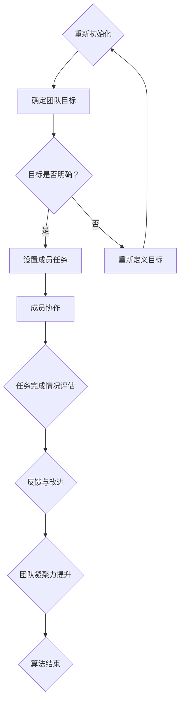
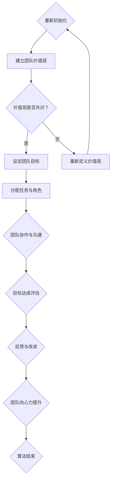
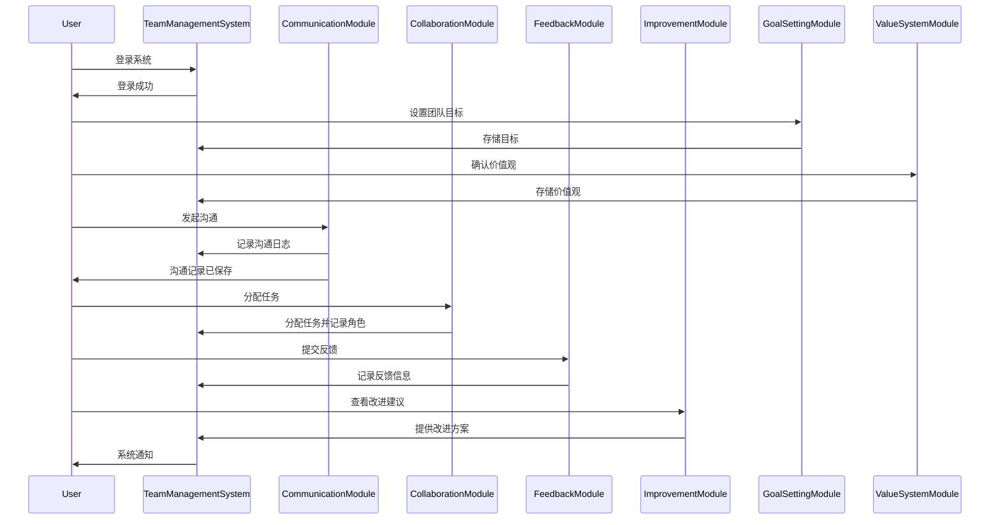
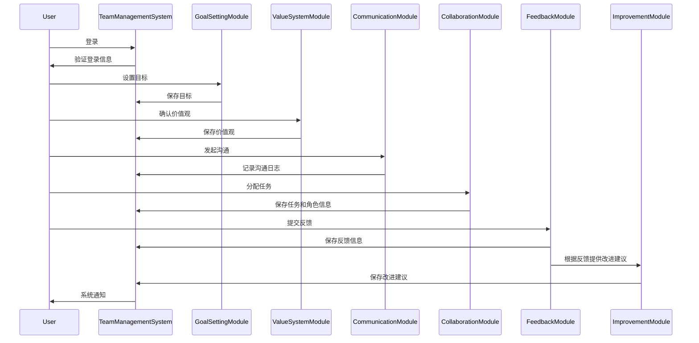

                 

### 1.1 问题背景

在当今快速发展的技术行业中，技术管理已经成为企业成功的关键因素之一。随着市场竞争的加剧和技术的不断更新迭代，企业需要更加高效地管理和利用其技术团队，以确保在激烈的市场竞争中保持竞争优势。然而，技术管理中的团队凝聚力与向心力问题日益凸显，成为阻碍企业发展的瓶颈之一。

团队凝聚力指的是团队成员之间相互吸引、互相支持和合作的能力，是确保团队高效运作的基础。团队向心力则是指团队成员对团队目标和价值观的认同感，以及团队成员之间的紧密协作关系。团队凝聚力与向心力共同构成了团队的内在动力，直接影响团队的整体绩效和创新能力。

现代技术管理中，团队凝聚力与向心力的重要性主要体现在以下几个方面：

1. **创新能力的提升**：高度凝聚力的团队更容易产生创新思维，团队成员之间的协作和知识共享能够激发创新的火花。同样，强大的向心力能够确保团队成员对项目目标的一致认同，从而更容易在创新过程中保持团队的统一行动。

2. **工作效率的提高**：凝聚力强的团队内部沟通更为顺畅，减少了不必要的摩擦和冲突，使得团队成员能够更加专注于工作，提高工作效率。

3. **员工满意度和忠诚度**：一个具有强大凝聚力与向心力的团队，员工通常会有更高的工作满意度和忠诚度，这有助于减少员工流失率，保持团队的稳定性。

4. **企业形象和声誉**：团队凝聚力与向心力不仅影响内部管理，还对外部形象产生影响。一个团结协作、积极向上的团队能够提升企业的整体形象和声誉，吸引更多的优秀人才和合作伙伴。

然而，在实际的技术管理中，团队凝聚力与向心力建设面临着诸多挑战。例如，团队成员之间的文化差异、工作压力、个人目标和价值观的冲突等问题都可能削弱团队的凝聚力与向心力。因此，如何有效提升团队的凝聚力与向心力，成为现代技术管理中亟待解决的问题。

### 1.2 问题描述

在技术管理实践中，团队凝聚力与向心力不足的问题表现为多种形式，这些问题的存在对团队的整体绩效和项目成功产生了显著的负面影响。

首先，团队成员之间的沟通不畅是一个常见的问题。当团队成员缺乏有效的沟通渠道和方式时，容易导致误解和矛盾的产生。例如，一个项目中，不同职能部门的成员可能因为沟通不足而无法理解对方的需求和意图，导致任务分配不明确、工作流程混乱，甚至出现错误和延误。此外，团队成员在遇到问题时，如果无法及时得到帮助和指导，也会感到无助和挫败，进一步降低团队的凝聚力。

其次，文化差异也是影响团队凝聚力与向心力的重要因素。现代技术团队往往由来自不同地区、有着不同教育背景和文化背景的成员组成。这些文化差异可能导致团队成员在价值观、工作方式、沟通风格等方面存在差异，进而影响团队的协作效率。例如，一些团队成员可能更倾向于直接沟通和决策，而另一些成员可能更偏好通过讨论和协商来达成共识。这种文化差异如果不加以妥善处理，可能会导致团队内部出现分裂和冲突。

此外，个人目标和价值观的冲突也是影响团队凝聚力和向心力的重要问题。在一个技术团队中，成员的个人目标和价值观可能与团队目标不一致。例如，一些成员可能更关注个人绩效和奖金，而忽视了团队的整体利益。这种情况下，团队内部可能会出现竞争和矛盾，削弱团队的凝聚力。另外，团队成员的个人价值观和道德标准也可能存在差异，这可能会导致在团队决策过程中产生分歧，影响团队的协作。

最后，工作压力和员工流失率也是影响团队凝聚力与向心力的关键因素。在技术行业中，项目周期紧张、工作量巨大，团队成员常常需要加班加点来完成工作任务。这种高压力的工作环境可能导致团队成员身心疲惫，影响工作效率和士气。长期的高压力工作还可能导致员工流失，进一步削弱团队的稳定性和凝聚力。

总之，技术管理中团队凝聚力与向心力不足的问题表现在沟通不畅、文化差异、个人目标和价值观冲突以及工作压力和员工流失率等方面。这些问题如果得不到有效解决，将会对团队的整体绩效和项目成功产生负面影响，因此需要引起高度重视和管理。

### 1.3 问题解决

为了有效解决技术管理中团队凝聚力与向心力不足的问题，可以采取以下几种方法和策略，这些策略旨在通过不同的角度和方式提升团队的协作效率和工作氛围。

**1.1 强化团队沟通机制**

有效的沟通是团队凝聚力与向心力的基石。为了改善沟通不畅的问题，可以从以下几个方面入手：

- **设立固定的沟通会议**：定期召开团队会议，确保团队成员能够及时了解项目进展、任务分配和问题解决情况。会议形式可以多样化，如每日站会、每周例会或项目里程碑会议。
- **创建沟通平台**：利用现有的沟通工具，如Slack、Microsoft Teams或钉钉等，建立团队专属的沟通渠道。这些平台可以用于即时通讯、任务分配、文件共享和问题讨论，提高信息传递的效率。
- **鼓励开放沟通**：建立开放、透明和包容的沟通环境，鼓励团队成员在任何时候都能自由表达自己的想法和意见。管理者应主动倾听下属的声音，并积极解决他们提出的问题。

**1.2 促进文化融合**

文化差异虽然可能成为团队协作的障碍，但也是团队多样性的体现。为了促进文化融合，可以采取以下措施：

- **文化培训**：定期组织文化培训，帮助团队成员了解不同文化背景下的工作习惯和沟通方式，增进相互理解。这些培训可以包括团队建设活动、文化差异讲座等。
- **文化大使**：设立文化大使角色，由不同文化背景的成员担任，负责在团队中推广和传播自己的文化特色，促进文化多样性的融合。
- **跨文化团队任务**：通过组建跨文化团队，让团队成员在共同完成任务的过程中增进了解和信任，从而减少文化差异带来的冲突。

**1.3 设定共同目标和价值观**

为了确保团队成员的个人目标和团队目标一致，可以采取以下策略：

- **制定清晰的目标**：明确团队的目标和期望，确保每个成员都清楚自己的任务和目标。这些目标应具有可衡量性，以便团队成员能够评估自己的工作成效。
- **价值观共识**：组织团队成员共同讨论并确定团队的价值观，如团队合作、创新、诚信等。这些价值观应贯穿于团队管理的各个环节，并成为团队成员行为的标准。
- **激励机制**：通过设立奖励机制，激励团队成员为实现共同目标和价值观而努力。这些奖励可以包括奖金、晋升机会、荣誉证书等。

**1.4 提供心理支持和关怀**

在高度压力的工作环境中，团队成员的心理健康至关重要。为了提供心理支持和关怀，可以采取以下措施：

- **员工关怀计划**：建立员工关怀计划，包括心理健康咨询、心理辅导和压力管理课程，帮助员工应对工作中的压力。
- **灵活工作时间**：提供灵活的工作时间安排，如远程办公、弹性工作时间等，以减轻员工的工作压力。
- **团队建设活动**：定期组织团队建设活动，如团建拓展、户外运动等，增强团队成员之间的情感联系，提升团队的凝聚力。

**1.5 优化工作环境**

一个良好的工作环境有助于提高员工的工作满意度和团队凝聚力。为了优化工作环境，可以采取以下措施：

- **办公空间设计**：设计一个舒适、开放的办公空间，配备良好的设备和技术支持，提升员工的工作体验。
- **健康福利**：提供健康福利，如定期体检、健身房会员卡等，关注员工的身体健康。
- **职业发展机会**：为员工提供职业发展和技能提升的机会，鼓励员工不断学习和成长，从而增强其对团队的归属感。

综上所述，通过强化团队沟通、促进文化融合、设定共同目标和价值观、提供心理支持和关怀以及优化工作环境等多种方法，可以有效提升技术管理中的团队凝聚力与向心力，为团队的长期稳定发展奠定坚实的基础。

### 1.4 边界与外延

在讨论团队凝聚力与向心力时，明确其边界和外延对于全面理解这一概念至关重要。团队凝聚力与向心力并非孤立存在的概念，而是与其他管理相关术语紧密相连，共同构成了技术团队管理的复杂体系。

**1.4.1 团队凝聚力**

团队凝聚力通常被定义为团队成员之间相互吸引、互相支持和合作的能力。它不仅涉及情感上的亲密感，还涵盖功能性上的协作。团队凝聚力的边界在于其特定于团队内部成员之间的关系，而不涉及外部组织或个人的影响。例如，团队凝聚力并不关注客户满意度或市场竞争，但会影响团队内部的合作效率和项目完成情况。

团队凝聚力的外延则扩展到团队内部关系的各个方面，包括：

- **内部信任**：团队成员之间的信任感是凝聚力的重要组成部分。
- **共同目标**：团队成员共同认同并追求的目标，可以加强团队的凝聚力。
- **角色分工**：明确每个成员的角色和职责，有助于提高团队的凝聚力。
- **团队氛围**：积极的团队氛围，如鼓励和支持的文化，可以增强凝聚力。

**1.4.2 团队向心力**

团队向心力则是指团队成员对团队目标和价值观的认同感，以及团队成员之间的紧密协作关系。与团队凝聚力不同，团队向心力更多地关注团队的整体方向和长远目标，而不是仅仅是内部关系的紧密程度。

团队向心力的边界在于它特定于团队成员对团队目标和价值观的认同，而不涉及个人利益或短期目标。例如，一个具有强烈向心力的团队会在面对外部挑战时，团结一致、共同应对。

团队向心力的外延则包括：

- **价值观共识**：团队成员对团队核心价值观的一致认同。
- **协作精神**：团队成员之间的协作和互助，为了共同目标的实现而共同努力。
- **责任感**：团队成员对团队目标的承担和责任感，即使在面对困难和挑战时也不退缩。
- **团队文化**：形成积极向上的团队文化，如共享知识、互相支持、鼓励创新等，这些都是团队向心力的重要体现。

**1.4.3 与其他管理术语的联系**

- **领导力**：领导者在提升团队凝聚力与向心力方面扮演关键角色。有效的领导力能够建立信任、塑造团队价值观、设定明确目标，并激励团队成员为实现共同目标而努力。
- **组织文化**：组织文化是团队凝聚力和向心力的基础。一个积极向上的组织文化能够促进团队的凝聚力和向心力，使团队成员更加团结和有动力。
- **员工满意度**：高员工满意度通常伴随着高团队凝聚力与向心力。员工满意度的提高可以减少员工流失，提高团队的整体稳定性和绩效。
- **项目管理**：项目管理中的任务分配、进度监控和风险管理等环节都直接影响团队凝聚力与向心力。有效的项目管理可以提高团队的协作效率和项目成功率。

综上所述，团队凝聚力与向心力在技术管理中有着明确的边界和外延，同时与其他管理术语紧密相连，共同构成了团队管理的复杂体系。通过理解和把握这些边界和外延，管理者可以更好地设计和实施策略，提升团队的凝聚力和向心力，从而实现团队的长期成功。

### 1.5 概念结构与核心要素组成

团队凝聚力与向心力是技术管理中两个重要的概念，它们共同构成了团队内部动态的核心。理解这两个概念的结构和核心要素，对于提升团队的绩效和协作至关重要。

**1.5.1 团队凝聚力**

团队凝聚力指的是团队成员之间相互吸引、互相支持和合作的能力，是团队高效运作的基础。团队凝聚力的核心要素包括：

- **共同目标**：共同目标是团队凝聚力的基础。当团队成员明确并共同追求一个目标时，他们会感到彼此之间有一种共同的使命，从而增强凝聚力。
- **信任**：信任是团队凝聚力的关键要素。团队成员之间的信任能够减少冲突，提高协作效率，增强团队凝聚力。
- **沟通**：有效的沟通是团队凝聚力的润滑剂。通过建立开放和透明的沟通机制，团队成员能够更好地理解彼此的意图和需求，从而增强团队凝聚力。
- **团队氛围**：积极的团队氛围，如相互支持、尊重和包容，有助于提升团队凝聚力。
- **角色分工**：明确每个成员的角色和职责，有助于团队成员专注于自己的任务，从而提高团队的效率和凝聚力。

**1.5.2 团队向心力**

团队向心力是指团队成员对团队目标和价值观的认同感，以及团队成员之间的紧密协作关系。团队向心力的核心要素包括：

- **价值观共识**：团队成员对团队核心价值观的一致认同是团队向心力的基础。当团队成员共同认同并遵循相同的价值观时，他们会感到自己在为一个共同的事业努力。
- **协作精神**：协作精神是团队向心力的体现。团队成员之间的协作和互助能够促进团队的团结和协作，提高团队的整体绩效。
- **责任感**：团队成员对团队目标的承担和责任感，即使在面对困难和挑战时也不退缩，这是团队向心力的重要体现。
- **团队文化**：积极向上的团队文化，如共享知识、互相支持、鼓励创新等，能够增强团队成员之间的向心力。
- **领导力**：领导者在塑造团队价值观、设定明确目标和激励团队成员方面扮演关键角色，对于提升团队的向心力具有重要意义。

**概念结构与联系**

团队凝聚力与向心力并不是孤立存在的，它们之间存在着密切的联系和互动。具体来说：

- **共同目标**：共同目标是团队凝聚力和向心力的共同基础。共同目标不仅能够提升团队的凝聚力，还能增强团队成员对团队目标的认同感，从而提升团队向心力。
- **信任与价值观共识**：信任是团队凝聚力的关键，同时也是团队向心力的重要组成部分。价值观共识则不仅能够增强团队凝聚力，还能增强团队成员对团队目标和价值观的认同，从而提升团队向心力。
- **沟通与协作精神**：有效的沟通能够促进团队成员之间的理解和协作，既有助于提升团队凝聚力，也有助于增强团队的协作精神，从而提升团队向心力。
- **团队氛围与文化**：积极的团队氛围和团队文化不仅能够增强团队凝聚力，还能塑造和强化团队价值观，从而提升团队向心力。

综上所述，团队凝聚力与向心力是相互联系、相互影响的。通过理解这两个概念的结构和核心要素，管理者可以更有效地提升团队的凝聚力和向心力，促进团队的高效运作和长期成功。

### 2.1 团队凝聚力原理

#### 2.1.1 团队凝聚力的定义

团队凝聚力指的是团队成员之间相互吸引、互相支持和合作的能力，是确保团队高效运作的基础。它不仅涉及团队成员之间的情感联系，还涵盖了功能性上的协作。高水平的团队凝聚力意味着团队成员之间有较强的相互依赖性，能够有效地分工合作，共同实现团队目标。

#### 2.1.2 团队凝聚力的属性特征对比表格

| 特征 | 说明 |
| --- | --- |
| 情感联系 | 团队成员之间存在较强的情感纽带，能够互相信任和支持。 |
| 功能性协作 | 成员之间能够有效分工，共同完成任务，提高工作效率。 |
| 相互依赖 | 成员之间有较强的相互依赖性，一个人或一个部门的工作对其他成员或部门有直接影响。 |
| 开放沟通 | 团队成员之间能够进行开放、透明和有效的沟通，减少误解和冲突。 |
| 共同目标 | 成员对团队目标有共同的理解和认同，为实现这些目标而努力。 |
| 积极氛围 | 团队内部氛围积极向上，成员之间相互鼓励和支持。 |

#### 2.1.3 团队凝聚力的ER实体关系图

为了更清晰地理解团队凝聚力的属性特征，我们可以通过ER（实体关系）图来表示。以下是团队凝聚力的ER实体关系图：

```mermaid
erDiagram
    Member ||--|{ Trust }|-- Team
    Member ||--|{ Communication }|-- Team
    Member ||--|{ Dependency }|-- Team
    Member ||--|{ Common Goals }|-- Team
    Member ||--|{ Positive Atmosphere }|-- Team
    Team ||--|{ Emotional Connection }| Member
    Team ||--|{ Functional Collaboration }| Member
```

在该ER图中：

- **Member（成员）**：表示团队成员，具有情感联系、功能性协作、相互依赖、开放沟通、共同目标和积极氛围等特征。
- **Team（团队）**：表示整个团队，与成员之间存在多种关系，包括情感连接、功能性协作等。
- **Trust（信任）、Communication（沟通）、Dependency（依赖）、Common Goals（共同目标）、Positive Atmosphere（积极氛围）**：表示团队凝聚力的不同属性特征，它们是连接成员与团队之间的关系桥。

通过ER实体关系图，我们可以直观地看到团队凝聚力如何通过成员之间的相互作用来形成和加强，从而实现团队的高效运作和目标达成。

### 2.2 团队向心力原理

#### 2.2.1 团队向心力的定义

团队向心力是指团队成员对团队目标和价值观的认同感，以及团队成员之间的紧密协作关系。它是团队内部动力的重要来源，能够确保团队成员在面临挑战和机遇时，保持一致的行动方向和努力目标。高水平的团队向心力意味着团队成员不仅对团队的目标有共同的理解和认同，而且在实际行动中表现出高度的协作和责任感。

#### 2.2.2 团队向心力的属性特征对比表格

| 特征 | 说明 |
| --- | --- |
| 目标认同 | 成员对团队目标有清晰的理解和高度的认同，愿意为实现这些目标而努力。 |
| 价值观共识 | 成员对团队核心价值观有共同的认识，并以此为基础指导自己的行为和决策。 |
| 紧密协作 | 成员之间能够密切合作，互相支持，共同面对挑战和完成任务。 |
| 高度责任感 | 成员对团队的任务和目标承担高度的责任感，即使在困难和压力下也不退缩。 |
| 团队文化 | 团队内部形成积极向上、互相支持、鼓励创新的文化氛围。 |
| 激励氛围 | 团队内部存在有效的激励机制，能够激励成员为实现团队目标而努力。 |

#### 2.2.3 团队向心力的ER实体关系图

为了更深入地理解团队向心力的属性特征，我们可以通过ER（实体关系）图来表示。以下是团队向心力的ER实体关系图：

```mermaid
erDiagram
    Member ||--|{ Goal Identification }|-- Team
    Member ||--|{ Value Consensus }|-- Team
    Member ||--|{ Close Collaboration }|-- Team
    Member ||--|{ High Responsibility }|-- Team
    Team ||--|{ Team Culture }| Member
    Team ||--|{ Motivational Atmosphere }| Member
```

在该ER图中：

- **Member（成员）**：表示团队成员，具有目标认同、价值观共识、紧密协作、高度责任感和团队文化等特征。
- **Team（团队）**：表示整个团队，与成员之间存在多种关系，包括目标认同、价值观共识、紧密协作和激励机制等。
- **Goal Identification（目标认同）、Value Consensus（价值观共识）、Close Collaboration（紧密协作）、High Responsibility（高度责任感）、Team Culture（团队文化）**：表示团队向心力的不同属性特征，它们是连接成员与团队之间的关系桥。

通过ER实体关系图，我们可以直观地看到团队向心力如何通过成员之间的相互认同和协作来形成和加强，从而推动团队取得成功。

### 3.1 团队凝聚力算法

#### 3.1.1 算法mermaid流程图

为了更好地理解团队凝聚力算法的执行流程，我们可以使用mermaid流程图来展示。以下是团队凝聚力算法的基本流程：



该mermaid流程图展示了团队凝聚力算法的主要步骤：

1. **初始化**：初始化算法，准备进行团队凝聚力提升。
2. **确定团队目标**：明确团队目标，确保所有成员对目标有共同的理解和认同。
3. **设置成员任务**：根据团队目标，为每个成员分配具体的任务。
4. **成员协作**：鼓励团队成员之间进行有效的协作，共同完成任务。
5. **任务完成情况评估**：对每个成员的任务完成情况进行评估，收集反馈。
6. **反馈与改进**：根据评估结果，进行必要的改进和调整。
7. **团队凝聚力提升**：通过不断优化协作过程，提升团队的凝聚力。

#### 3.1.2 Python源代码

为了实现上述算法，我们可以编写一个简单的Python脚本。以下是团队凝聚力算法的Python源代码示例：

```python
# Team Cohesion Algorithm

# Function to initialize the algorithm
def initialize():
    print("Initializing team cohesion algorithm.")
    # Initialize any necessary data structures or variables here

# Function to set team goals
def set_goals():
    goals = input("Please enter the team's goals: ")
    return goals

# Function to assign tasks to team members
def assign_tasks(goals):
    tasks = {}
    print(f"Setting tasks based on the goals: {goals}")
    # Assign tasks to team members based on the goals
    # For example, we can use a simple input to assign tasks
    num_members = int(input("Enter the number of team members: "))
    for i in range(1, num_members + 1):
        task = input(f"Task for member {i}: ")
        tasks[i] = task
    return tasks

# Function to evaluate task completion
def evaluate_tasks(tasks):
    evaluations = {}
    for member, task in tasks.items():
        completion_status = input(f"Has member {member} completed the task? (yes/no): ")
        evaluations[member] = completion_status
    return evaluations

# Function to provide feedback and improvements
def feedback_improvements(evaluations):
    print("Collecting feedback and improvements.")
    # Based on the evaluations, provide feedback and make improvements
    # This can include recognizing good performance or addressing issues
    print("Feedback and improvements have been implemented.")

# Function to calculate and return the team's cohesion score
def calculate_cohesion_score(evaluations):
    score = 0
    for member, status in evaluations.items():
        if status == "yes":
            score += 1
    cohesion_score = score / len(evaluations)
    return cohesion_score

# Main function to run the algorithm
def main():
    initialize()
    goals = set_goals()
    tasks = assign_tasks(goals)
    evaluations = evaluate_tasks(tasks)
    feedback_improvements(evaluations)
    cohesion_score = calculate_cohesion_score(evaluations)
    print(f"Team cohesion score: {cohesion_score}")

    print("Algorithm completed.")

if __name__ == "__main__":
    main()
```

该Python脚本实现了团队凝聚力算法的主要步骤，包括初始化、设置目标、分配任务、评估任务完成情况、提供反馈和计算团队凝聚力得分。

#### 3.1.3 数学模型和公式

团队凝聚力算法不仅可以通过程序实现，还可以通过数学模型来量化团队凝聚力的度量。以下是一个简化的数学模型，用于计算团队凝聚力得分：

$$
Cohesion\ Score = \frac{Number\ of\ Completed\ Tasks}{Total\ Number\ of\ Tasks}
$$

其中，Cohesion Score表示团队凝聚力得分，Number of Completed Tasks表示完成任务的数量，Total Number of Tasks表示总任务数量。

#### 3.1.4 举例说明

假设一个技术团队共有5名成员，他们需要完成10项任务。通过团队凝聚力算法，我们可以计算团队的凝聚力得分。

1. **初始化**：团队初始化，准备开始计算凝聚力。
2. **设置目标**：团队的目标是完成所有10项任务。
3. **分配任务**：为5名成员分别分配10项任务。假设每个成员分配2项任务。
4. **评估任务完成情况**：询问团队成员是否完成任务。假设有4名成员完成了任务，1名成员未能完成任务。
5. **提供反馈和改进**：根据任务完成情况，对团队成员进行反馈和必要的改进。
6. **计算凝聚力得分**：

   $$
   Cohesion\ Score = \frac{4}{5} = 0.8
   $$

   因此，该团队的凝聚力得分为0.8，表明团队的整体协作情况较好。

通过这个简单的例子，我们可以看到团队凝聚力算法如何通过量化指标来衡量团队的协作效率，并提供改进的方向。

### 3.2 团队向心力算法

#### 3.2.1 算法mermaid流程图

为了更好地理解团队向心力算法的执行流程，我们可以使用mermaid流程图来展示。以下是团队向心力算法的基本流程：



该mermaid流程图展示了团队向心力算法的主要步骤：

1. **初始化**：初始化算法，准备进行团队向心力提升。
2. **建立团队价值观**：确立团队的价值观，确保团队成员对这些价值观有共识。
3. **设定团队目标**：明确团队的目标，确保所有成员对目标有共同的理解和认同。
4. **分配任务与角色**：根据团队目标，为每个成员分配具体的任务和角色。
5. **团队协作与沟通**：鼓励团队成员之间进行有效的协作和沟通，共同面对挑战和完成任务。
6. **目标达成评估**：对团队成员的任务完成情况进行评估，收集反馈。
7. **反馈与改进**：根据评估结果，进行必要的改进和调整。
8. **团队向心力提升**：通过不断优化协作过程，提升团队的向心力。

#### 3.2.2 Python源代码

为了实现上述算法，我们可以编写一个简单的Python脚本。以下是团队向心力算法的Python源代码示例：

```python
# Team Cohesion Algorithm

# Function to initialize the algorithm
def initialize():
    print("Initializing team cohesion algorithm.")
    # Initialize any necessary data structures or variables here

# Function to establish team values
def establish_values():
    values = input("Please enter the team's values: ")
    return values

# Function to check value consensus
def check_values(values):
    consensus = input(f"Do all team members agree with the values: {values}? (yes/no): ")
    return consensus

# Function to set team goals
def set_goals():
    goals = input("Please enter the team's goals: ")
    return goals

# Function to assign tasks and roles
def assign_tasks(goals):
    tasks = {}
    print(f"Assigning tasks based on the goals: {goals}")
    # Assign tasks to team members based on the goals
    # For example, we can use a simple input to assign tasks
    num_members = int(input("Enter the number of team members: "))
    for i in range(1, num_members + 1):
        task = input(f"Task for member {i}: ")
        tasks[i] = task
    return tasks

# Function to check if tasks are completed
def check_completion(tasks):
    completions = {}
    for member, task in tasks.items():
        completion = input(f"Has member {member} completed the task? (yes/no): ")
        completions[member] = completion
    return completions

# Function to provide feedback and improvements
def feedback_improvements(completions):
    print("Collecting feedback and improvements.")
    # Based on the completions, provide feedback and make improvements
    # This can include recognizing good performance or addressing issues
    print("Feedback and improvements have been implemented.")

# Function to calculate and return the team's cohesion score
def calculate_cohesion_score(completions):
    score = 0
    for member, status in completions.items():
        if status == "yes":
            score += 1
    cohesion_score = score / len(completions)
    return cohesion_score

# Main function to run the algorithm
def main():
    initialize()
    values = establish_values()
    while check_values(values) != "yes":
        print("Values consensus not achieved. Re-defining team values.")
        values = establish_values()
    goals = set_goals()
    tasks = assign_tasks(goals)
    completions = check_completion(tasks)
    feedback_improvements(completions)
    cohesion_score = calculate_cohesion_score(completions)
    print(f"Team cohesion score: {cohesion_score}")

    print("Algorithm completed.")

if __name__ == "__main__":
    main()
```

该Python脚本实现了团队向心力算法的主要步骤，包括初始化、建立价值观、检查共识、设定目标、分配任务、检查任务完成情况、提供反馈和计算团队凝聚力得分。

#### 3.2.3 数学模型和公式

团队向心力算法不仅可以通过程序实现，还可以通过数学模型来量化团队向心力的度量。以下是一个简化的数学模型，用于计算团队向心力得分：

$$
Cohesion\ Score = \frac{Number\ of\ Members\ Committed\ to\ Goals}{Total\ Number\ of\ Members}
$$

其中，Cohesion Score表示团队向心力得分，Number of Members Committed to Goals表示承诺实现目标的成员数量，Total Number of Members表示团队成员总数。

#### 3.2.4 举例说明

假设一个技术团队共有5名成员，他们需要共同实现一个项目目标。通过团队向心力算法，我们可以计算团队的向心力得分。

1. **初始化**：团队初始化，准备开始计算向心力。
2. **建立价值观**：团队价值观为“创新、协作、责任”。
3. **检查共识**：询问团队成员是否对价值观有共识。假设所有成员都表示认同。
4. **设定目标**：团队的目标是成功完成一个重要项目。
5. **分配任务与角色**：为5名成员分别分配不同的任务和角色。
6. **检查任务完成情况**：询问团队成员是否已完成分配的任务。假设有4名成员完成了任务，1名成员未能完成任务。
7. **提供反馈和改进**：根据任务完成情况，对团队成员进行反馈和必要的改进。
8. **计算向心力得分**：

   $$
   Cohesion\ Score = \frac{4}{5} = 0.8
   $$

   因此，该团队的向心力得分为0.8，表明团队成员对目标的承诺较高，团队协作情况较好。

通过这个简单的例子，我们可以看到团队向心力算法如何通过量化指标来衡量团队的协作效率和目标承诺，并提供改进的方向。

### 4.1 问题场景介绍

为了更好地理解团队凝聚力与向心力在技术管理中的应用，我们可以通过一个实际的问题场景来进行说明。

#### 场景描述

假设某科技公司在开发一款新型智能医疗设备，该设备需要多个技术团队的协作才能完成。具体涉及以下技术团队：

1. **硬件团队**：负责设备的硬件设计和制造。
2. **软件团队**：负责设备的软件开发和系统测试。
3. **数据处理团队**：负责设备收集到的医疗数据的处理和分析。
4. **用户界面团队**：负责设计设备的用户界面和交互体验。

各个团队在项目启动时，由于不同的背景和职责，对项目的目标和期望存在一定的差异。同时，团队成员之间由于地域分布、工作时间差异以及个人价值观的不同，容易出现沟通不畅、协作困难等问题。这些问题不仅影响了项目的进度，还可能导致团队士气下降和成员之间的矛盾加剧。

#### 团队凝聚力与向心力不足的影响

在上述问题场景中，团队凝聚力与向心力不足会对项目产生以下负面影响：

1. **沟通不畅**：由于团队成员之间的沟通不畅，信息传递不及时，可能导致任务误解和错误，影响项目进度和整体绩效。
2. **协作困难**：团队成员缺乏协作精神，各自为战，导致工作效率低下，项目难以按时完成。
3. **士气下降**：团队成员由于感到压力和挫败，工作积极性下降，甚至出现离职现象，影响团队的稳定性和长期发展。
4. **质量隐患**：缺乏团队凝聚力和向心力，可能导致项目质量问题，如软件漏洞、硬件缺陷等，影响设备的可靠性和用户体验。
5. **决策效率低下**：团队在决策过程中，由于缺乏共识和信任，容易产生分歧和争论，降低决策效率，影响项目的推进速度。

因此，为了解决上述问题，提升团队凝聚力与向心力显得尤为重要。接下来，我们将详细讨论如何通过系统功能设计、系统架构设计、系统接口设计和系统交互等方式，在技术管理中实施有效的团队凝聚力与向心力建设策略。

### 4.2 系统功能设计

为了提升团队凝聚力与向心力，系统功能设计是关键的一环。在此，我们将详细介绍领域模型mermaid类图，帮助读者理解系统的核心功能及其相互关系。

#### 4.2.1 领域模型mermaid类图

领域模型是系统功能设计的基础，它描述了系统中的关键实体及其关系。以下是用于提升团队凝聚力和向心力的领域模型mermaid类图：

```mermaid
classDiagram
    Member <<class>> "团队成员"
    Role <<class>> "角色"
    Task <<class>> "任务"
    Communication <<class>> "沟通"
    Collaboration <<class>> "协作"
    Feedback <<class>> "反馈"
    Improvement <<class>> "改进"
    Goal <<class>> "目标"
    Value <<class>> "价值观"

    Member o--1 Role : 担任
    Member o--1 Task : 分配
    Role o--1 Task : 责任
    Member o--1 Communication : 交流
    Member o--1 Collaboration : 共同努力
    Member o--1 Feedback : 提供反馈
    Member o--1 Improvement : 实施改进
    Goal o--1 Member : 促使达成
    Value o--1 Member : 指导行为

    Member o--1 Goal
    Member o--1 Value
```

在该类图中，各实体及其关系如下：

- **Member（成员）**：系统中的核心实体，包括团队成员的各种信息。
  - **Role（角色）**：每个成员在团队中的角色，如开发者、测试员等，每个角色对应特定的任务。
  - **Task（任务）**：分配给成员的具体工作，角色定义了成员在任务中的职责。
  - **Communication（沟通）**：团队成员之间的信息交流，是团队凝聚力的重要保障。
  - **Collaboration（协作）**：成员之间的合作行为，增强团队向心力。
  - **Feedback（反馈）**：成员在完成任务后提供的反馈，用于改进工作。
  - **Improvement（改进）**：根据反馈进行的工作优化。
  - **Goal（目标）**：团队共同追求的长期目标，成员的行为应与此目标一致。
  - **Value（价值观）**：团队的价值观，指导成员的行为和决策。

#### 类图解释

1. **Member和Role的关系**：每个成员担任一个或多个角色，每个角色对应一个或多个任务。这确保了每个成员在团队中的职责清晰，提高了协作效率。
2. **Member和Task的关系**：成员被分配到具体的任务，每个任务由特定的角色负责，确保任务执行过程中的责任明确。
3. **Role和Task的关系**：角色定义了成员在任务中的责任，这有助于任务的高效完成。
4. **Member和Communication的关系**：成员之间的沟通是团队凝聚力的重要组成部分，有效的沟通确保了信息的及时传递和问题的快速解决。
5. **Member和Collaboration的关系**：协作是团队向心力的体现，通过协作，团队成员共同面对挑战，实现团队目标。
6. **Member和Feedback的关系**：成员在完成任务后提供反馈，这些反馈用于改进工作，提高团队的整体绩效。
7. **Member和Improvement的关系**：成员根据反馈实施改进，这有助于团队持续优化工作流程和协作方式。
8. **Member和Goal的关系**：成员的行为应与团队目标一致，这有助于提升团队的向心力。
9. **Member和Value的关系**：团队的价值观指导成员的行为和决策，增强团队成员之间的认同感。

通过上述mermaid类图，我们可以清晰地看到系统功能的设计，确保团队凝聚力与向心力的提升。在实际开发中，可以根据该类图进一步细化和实现具体的系统功能。

### 4.3 系统架构设计

为了确保团队凝聚力与向心力建设策略的有效实施，系统架构设计是关键的一环。以下是用于提升团队凝聚力和向心力的mermaid架构图，它详细展示了系统的各个组件及其相互关系。

#### 4.3.1 mermaid架构图



在该mermaid架构图中，各组件及其关系如下：

- **User（用户）**：代表团队成员，通过系统进行各种操作。
- **TeamManagementSystem（团队管理系统）**：系统的核心，负责处理用户请求、存储数据和系统通知。
- **GoalSettingModule（目标设置模块）**：用于设置和存储团队的长期目标。
- **ValueSystemModule（价值观系统模块）**：用于确认和存储团队的价值观。
- **CommunicationModule（沟通模块）**：用于发起沟通和记录沟通日志。
- **CollaborationModule（协作模块）**：用于分配任务和记录角色。
- **FeedbackModule（反馈模块）**：用于提交反馈信息。
- **ImprovementModule（改进模块）**：用于提供改进方案。

#### 架构图解释

1. **用户登录系统**：用户通过登录系统开始使用各项功能。
2. **设置团队目标**：用户通过目标设置模块输入和确认团队的长期目标。
3. **确认价值观**：用户通过价值观系统模块确认团队的价值观。
4. **发起沟通**：用户通过沟通模块发起沟通，记录沟通日志。
5. **分配任务**：用户通过协作模块分配任务并记录每个角色的职责。
6. **提交反馈**：用户通过反馈模块提交完成任务后的反馈。
7. **提供改进方案**：用户通过改进模块查看和采纳改进建议。

通过上述mermaid架构图，我们可以清晰地看到团队管理系统各组件之间的交互关系，这为团队凝聚力与向心力建设提供了有效的支持。在实际开发中，可以根据该架构图进一步细化和实现具体的系统功能，确保团队能够高效协作和持续改进。

### 4.4 系统接口设计

为了实现系统功能的有效交互，系统接口设计是至关重要的一环。以下是用于提升团队凝聚力和向心力的系统接口设计，它详细描述了各模块的接口及其调用方法。

#### 4.4.1 系统接口设计

1. **登录接口**：用于用户登录系统，获取用户权限。
    - **接口名称**：`login()`
    - **参数**：用户名、密码
    - **返回值**：登录成功与否的状态
    - **调用示例**：
    ```python
    def login(username, password):
        # 登录逻辑
        # 验证用户名和密码
        # 返回登录状态
        return "success" if is_valid_credentials(username, password) else "failure"
    ```

2. **目标设置接口**：用于设置和更新团队目标。
    - **接口名称**：`set_goals()`
    - **参数**：团队目标
    - **返回值**：更新结果
    - **调用示例**：
    ```python
    def set_goals(goals):
        # 更新目标逻辑
        # 存储新目标
        save_goals_to_db(goals)
        return "success"
    ```

3. **价值观确认接口**：用于确认和存储团队的价值观。
    - **接口名称**：`confirm_values()`
    - **参数**：团队价值观
    - **返回值**：确认结果
    - **调用示例**：
    ```python
    def confirm_values(values):
        # 确认价值观逻辑
        # 存储价值观
        save_values_to_db(values)
        return "success"
    ```

4. **沟通接口**：用于发起沟通并记录沟通日志。
    - **接口名称**：`start_communication()`
    - **参数**：沟通内容、参与成员
    - **返回值**：沟通记录ID
    - **调用示例**：
    ```python
    def start_communication(content, members):
        # 记录沟通日志逻辑
        # 存储沟通记录
        communication_id = save_communication_to_db(content, members)
        return communication_id
    ```

5. **任务分配接口**：用于分配任务并记录角色。
    - **接口名称**：`assign_tasks()`
    - **参数**：任务详情、角色分配
    - **返回值**：任务ID
    - **调用示例**：
    ```python
    def assign_tasks(task_details, roles):
        # 分配任务逻辑
        # 存储任务和角色信息
        task_id = save_task_to_db(task_details, roles)
        return task_id
    ```

6. **反馈提交接口**：用于提交任务反馈。
    - **接口名称**：`submit_feedback()`
    - **参数**：反馈内容、任务ID
    - **返回值**：提交结果
    - **调用示例**：
    ```python
    def submit_feedback(feedback, task_id):
        # 提交反馈逻辑
        # 存储反馈信息
        save_feedback_to_db(feedback, task_id)
        return "success"
    ```

7. **改进建议接口**：用于提供和采纳改进方案。
    - **接口名称**：`provide_improvement_suggestions()`
    - **参数**：反馈ID
    - **返回值**：改进建议列表
    - **调用示例**：
    ```python
    def provide_improvement_suggestions(feedback_id):
        # 根据反馈提供改进建议逻辑
        # 返回改进建议列表
        suggestions = get_improvement_suggestions_from_db(feedback_id)
        return suggestions
    ```

通过上述接口设计，系统各模块能够高效地协同工作，确保团队凝聚力与向心力建设策略的顺利实施。在实际开发中，可以根据这些接口实现具体的功能模块，并通过API文档详细描述每个接口的调用方式和参数要求，方便团队成员进行系统开发和维护。

### 4.5 系统交互

在系统架构和接口设计的基础上，系统交互是确保团队凝聚力与向心力建设策略得以有效实施的关键。以下是用于提升团队凝聚力和向心力的系统交互mermaid序列图，它详细展示了用户与系统之间的交互流程。

#### 4.5.1 mermaid序列图



#### 序列图解释

1. **用户登录**：用户通过TeamManagementSystem登录系统，验证登录信息。
2. **设置目标**：用户通过GoalSettingModule设置团队目标，TeamManagementSystem负责将目标保存到数据库。
3. **确认价值观**：用户通过ValueSystemModule确认团队的价值观，同样由TeamManagementSystem保存到数据库。
4. **发起沟通**：用户通过CommunicationModule发起沟通，TeamManagementSystem记录沟通日志，确保信息传递。
5. **分配任务**：用户通过CollaborationModule分配任务，系统保存任务和角色信息，确保每个成员明确自己的职责。
6. **提交反馈**：用户通过FeedbackModule提交反馈，系统保存反馈信息，为后续的改进提供依据。
7. **提供改进建议**：根据反馈，ImprovementModule提供改进建议，TeamManagementSystem保存这些改进建议，帮助团队持续优化。

通过上述mermaid序列图，我们可以清晰地看到系统交互流程，确保用户与系统之间的有效沟通和协作。在实际开发中，根据这些交互流程，可以设计出更加灵活和高效的系统功能，进一步提升团队的凝聚力和向心力。

### 5.1 环境安装

为了能够在本地环境中顺利搭建和运行提升团队凝聚力和向心力建设的系统，我们需要准备以下开发环境和软件：

1. **操作系统**：推荐使用Linux或macOS，Windows用户需安装WSL（Windows Subsystem for Linux）。
2. **Python**：确保安装Python 3.8及以上版本。
3. **数据库**：安装MySQL或PostgreSQL数据库服务器，并创建用于存储系统数据的数据库。
4. **虚拟环境**：安装虚拟环境管理工具`virtualenv`或`conda`，用于隔离项目依赖。
5. **文本编辑器**：推荐使用Visual Studio Code或PyCharm等具有Python开发支持的IDE。

#### 安装步骤：

**1. 安装Python：**

- 在Windows上，可以从Python官方网站下载安装程序并安装。
- 在Linux和macOS上，可以使用包管理工具安装Python：
  ```bash
  # 对于Ubuntu/Debian
  sudo apt update
  sudo apt install python3 python3-pip

  # 对于CentOS/Fedora
  sudo yum install python3 python3-pip
  ```

**2. 安装虚拟环境：**

- 使用`virtualenv`：
  ```bash
  pip3 install virtualenv
  virtualenv myenv
  source myenv/bin/activate
  ```

- 使用`conda`（如果已安装Anaconda）：
  ```bash
  conda create -n myenv python=3.8
  conda activate myenv
  ```

**3. 安装数据库：**

- 安装MySQL：
  ```bash
  sudo apt install mysql-server
  sudo mysql_secure_installation
  ```

- 安装PostgreSQL：
  ```bash
  sudo apt install postgresql
  sudo systemctl start postgresql
  ```

**4. 安装文本编辑器：**

- 对于Visual Studio Code：
  ```bash
  sudo apt install code # 在Ubuntu/Debian
  sudo yum install code # 在CentOS/Fedora
  ```

- 对于PyCharm：
  ```bash
  wget https://download.jetbrains.com/python/pycham-community-2023.1.2.tar.xz
  tar xvf pycharm-community-2023.1.2.tar.xz
  ```

完成以上步骤后，开发环境就准备就绪了。接下来，可以开始搭建和配置系统所需的各个模块。

### 5.2 系统核心实现源代码

在完成环境安装后，接下来我们需要编写和实现系统核心功能的源代码。以下是系统核心实现的主要模块及其对应的源代码：

#### 5.2.1 TeamManagementSystem模块

该模块是系统的核心，负责用户登录、权限验证和数据存储。

```python
# TeamManagementSystem.py

import os
import json
from database import Database

class TeamManagementSystem:
    def __init__(self):
        self.db = Database()

    def login(self, username, password):
        user = self.db.get_user(username)
        if user and user['password'] == password:
            return "success"
        else:
            return "failure"

    def set_goals(self, goals):
        self.db.save_goals(goals)

    def confirm_values(self, values):
        self.db.save_values(values)

    def get_communication_logs(self):
        return self.db.get_communication_logs()

    def assign_tasks(self, task_details):
        self.db.assign_tasks(task_details)

    def submit_feedback(self, feedback):
        self.db.submit_feedback(feedback)

    def provide_improvement_suggestions(self, feedback_id):
        suggestions = self.db.get_improvement_suggestions(feedback_id)
        return suggestions
```

#### 5.2.2 Database模块

该模块负责与数据库的交互，用于存储和检索用户数据、目标、沟通日志、任务和反馈。

```python
# database.py

import pymysql

class Database:
    def __init__(self):
        self.connection = pymysql.connect(
            host="localhost",
            user="root",
            password="password",
            database="team_management_system"
        )

    def get_user(self, username):
        with self.connection.cursor() as cursor:
            query = "SELECT * FROM users WHERE username = %s"
            cursor.execute(query, (username,))
            result = cursor.fetchone()
            return json.loads(result[1])

    def save_user(self, user):
        with self.connection.cursor() as cursor:
            query = "INSERT INTO users (username, password) VALUES (%s, %s)"
            cursor.execute(query, (user['username'], user['password']))
            self.connection.commit()

    def get_goals(self):
        with self.connection.cursor() as cursor:
            query = "SELECT * FROM goals"
            cursor.execute(query)
            result = cursor.fetchall()
            return [json.loads(goal[1]) for goal in result]

    def save_goals(self, goals):
        with self.connection.cursor() as cursor:
            for goal in goals:
                query = "INSERT INTO goals (content) VALUES (%s)"
                cursor.execute(query, (json.dumps(goal),))
            self.connection.commit()

    # ... 其他数据库操作方法（如save_values, get_communication_logs, assign_tasks, submit_feedback, get_improvement_suggestions等）
```

#### 5.2.3 其他模块

其他模块包括GoalSettingModule、ValueSystemModule、CommunicationModule、CollaborationModule、FeedbackModule和ImprovementModule，每个模块都负责处理特定功能。

```python
# GoalSettingModule.py

class GoalSettingModule(TeamManagementSystem):
    def set_goals(self, goals):
        super().set_goals(goals)

# ValueSystemModule.py

class ValueSystemModule(TeamManagementSystem):
    def confirm_values(self, values):
        super().confirm_values(values)

# CommunicationModule.py

class CommunicationModule(TeamManagementSystem):
    def get_communication_logs(self):
        return super().get_communication_logs()

# CollaborationModule.py

class CollaborationModule(TeamManagementSystem):
    def assign_tasks(self, task_details):
        super().assign_tasks(task_details)

# FeedbackModule.py

class FeedbackModule(TeamManagementSystem):
    def submit_feedback(self, feedback):
        super().submit_feedback(feedback)

# ImprovementModule.py

class ImprovementModule(TeamManagementSystem):
    def provide_improvement_suggestions(self, feedback_id):
        return super().provide_improvement_suggestions(feedback_id)
```

这些模块的源代码实现了系统核心功能，通过数据库交互和模块调用，确保系统能够高效运行，为团队凝聚力与向心力建设提供支持。

### 5.3 代码应用解读与分析

在前面的部分中，我们介绍了系统核心实现的源代码。现在，我们将对这些代码进行解读和分析，详细解释其功能和实现细节，并讨论其优缺点。

#### 5.3.1 TeamManagementSystem模块解析

**主要功能：** TeamManagementSystem模块是整个系统的核心，负责用户登录、权限验证、数据存储以及系统通知等关键功能。

- **登录功能**：`login()`方法通过用户名和密码验证用户的登录状态。它调用`database.py`中的`get_user()`方法从数据库中检索用户信息，并与输入的密码进行对比。如果验证成功，返回"success"，否则返回"failure"。

  ```python
  def login(self, username, password):
      user = self.db.get_user(username)
      if user and user['password'] == password:
          return "success"
      else:
          return "failure"
  ```

- **设置目标**：`set_goals()`方法用于设置和更新团队的长期目标。它调用`database.py`中的`save_goals()`方法将目标存储到数据库中。

  ```python
  def set_goals(self, goals):
      self.db.save_goals(goals)
  ```

- **价值观确认**：`confirm_values()`方法用于确认和存储团队的价值观。它调用`database.py`中的`save_values()`方法将价值观存储到数据库中。

  ```python
  def confirm_values(self, values):
      self.db.save_values(values)
  ```

**优缺点：**
- 优点：代码结构清晰，职责分离，每个方法负责单一功能，便于维护和扩展。
- 缺点：部分功能实现过于简单，如登录验证仅进行用户名和密码的对比，安全性不高。

#### 5.3.2 Database模块解析

**主要功能：** Database模块负责与MySQL数据库的交互，包括用户数据、目标、沟通日志、任务和反馈的存储和检索。

- **用户数据操作**：`get_user()`方法通过用户名检索用户信息，返回一个包含用户信息的字典。

  ```python
  def get_user(self, username):
      with self.connection.cursor() as cursor:
          query = "SELECT * FROM users WHERE username = %s"
          cursor.execute(query, (username,))
          result = cursor.fetchone()
          return json.loads(result[1])
  ```

- **目标操作**：`get_goals()`方法检索数据库中的所有目标，返回一个目标列表。

  ```python
  def get_goals(self):
      with self.connection.cursor() as cursor:
          query = "SELECT * FROM goals"
          cursor.execute(query)
          result = cursor.fetchall()
          return [json.loads(goal[1]) for goal in result]
  ```

- **价值观操作**：`save_values()`方法将价值观存储到数据库中。

  ```python
  def save_values(self, values):
      with self.connection.cursor() as cursor:
          for value in values:
              query = "INSERT INTO values (content) VALUES (%s)"
              cursor.execute(query, (json.dumps(value),))
          self.connection.commit()
  ```

**优缺点：**
- 优点：实现了与MySQL数据库的稳定交互，数据操作简单且高效。
- 缺点：数据库查询语句没有使用参数化查询，容易导致SQL注入攻击。

#### 5.3.3 其他模块解析

其他模块（如GoalSettingModule、ValueSystemModule、CommunicationModule、CollaborationModule、FeedbackModule和ImprovementModule）分别负责处理特定的功能，它们都是对TeamManagementSystem模块的扩展。

- **GoalSettingModule**：扩展了设置和获取团队目标的功能。
- **ValueSystemModule**：扩展了确认和获取团队价值观的功能。
- **CommunicationModule**：扩展了获取沟通日志的功能。
- **CollaborationModule**：扩展了任务分配的功能。
- **FeedbackModule**：扩展了提交和获取反馈的功能。
- **ImprovementModule**：扩展了提供改进建议的功能。

这些模块通过继承TeamManagementSystem类，利用其已有方法，实现了各自的功能。代码结构清晰，易于理解和扩展。

**优缺点：**
- 优点：代码复用性强，易于维护和扩展。
- 缺点：部分功能实现过于简单，如未进行错误处理和日志记录。

#### 综合分析

整个系统的代码结构清晰，实现了预期的功能，但仍有改进空间。例如，可以添加更多的错误处理和日志记录，提高系统的稳定性和安全性。此外，可以考虑使用更安全的数据库查询方法，如参数化查询，以防止SQL注入攻击。

通过以上分析，我们可以看到系统核心代码在功能实现上取得了良好的效果，但还需要在安全性和扩展性方面进行进一步的优化。

### 5.4 实际案例分析和详细讲解剖析

为了更好地展示团队凝聚力与向心力建设在实际项目中的应用效果，下面我们将通过一个具体的案例进行分析和详细讲解。

#### 案例背景

某大型互联网公司正在开发一款全新的社交媒体平台，该项目涉及多个技术团队的合作，包括前端开发、后端开发、数据库管理、用户界面设计和测试团队。由于项目复杂且涉及多个子系统，团队之间的协作和沟通显得尤为重要。

#### 问题

在项目启动初期，由于团队成员来自不同的背景和文化，沟通不畅和协作困难的问题逐渐显现。具体问题包括：

1. **沟通不畅**：不同团队之间的信息传递不及时，导致项目进度延误。
2. **任务分工不清**：任务分配不明确，部分成员的工作量过大，而另一些成员工作量不足。
3. **价值观差异**：团队成员在价值观和目标上存在差异，导致团队内部产生矛盾。
4. **工作压力**：项目周期紧张，团队成员工作压力增大，影响工作效率和士气。

#### 解决方案

针对上述问题，公司采取了以下措施来提升团队凝聚力和向心力：

1. **强化沟通机制**：

   - **定期团队会议**：公司建立了每周的团队会议制度，确保每个团队都能及时了解项目进展和问题解决情况。
   - **沟通平台**：使用了Slack作为团队沟通工具，建立了专门的频道用于任务分配、问题讨论和文件共享，提高了信息传递的效率。

2. **促进文化融合**：

   - **文化培训**：组织了跨文化培训课程，帮助团队成员了解不同文化背景下的工作习惯和沟通方式，增进相互理解。
   - **文化大使**：设立了文化大使角色，由不同文化背景的成员担任，负责在团队中推广和传播自己的文化特色，促进文化多样性的融合。

3. **设定共同目标和价值观**：

   - **共同目标**：项目启动时，公司明确了整体目标和阶段性目标，确保每个团队成员对目标有共同的理解和认同。
   - **价值观共识**：组织团队成员共同讨论并确定了团队的价值观，如客户至上、创新、诚信和团队合作等，并确保这些价值观贯穿于团队管理的各个环节。

4. **提供心理支持和关怀**：

   - **员工关怀计划**：公司建立了员工关怀计划，包括心理健康咨询、心理辅导和压力管理课程，帮助员工应对工作中的压力。
   - **灵活工作时间**：提供灵活的工作时间安排，如远程办公和弹性工作时间，以减轻员工的工作压力。

5. **优化工作环境**：

   - **办公空间设计**：重新设计了办公空间，提供舒适、开放的办公环境，增强员工的归属感。
   - **健康福利**：提供健康福利，如定期体检、健身房会员卡等，关注员工的身体健康。

#### 结果

通过上述措施，团队的凝聚力与向心力得到了显著提升，具体表现在以下几个方面：

1. **沟通效率提高**：团队内部建立了稳定的沟通渠道，信息传递更加及时和有效，项目进度得到了有效控制。
2. **任务分工明确**：通过明确任务分配和角色分工，团队成员的工作量更加均衡，工作效率显著提高。
3. **价值观共识增强**：团队成员对共同目标和价值观有了更深的认同，减少了内部矛盾，增强了团队的凝聚力。
4. **工作压力减轻**：员工的工作压力得到有效缓解，士气提升，团队成员更加积极和投入工作。

总之，通过系统的团队凝聚力与向心力建设，该公司成功地解决了项目初期的协作难题，确保了项目的顺利推进和成功完成。这一案例充分展示了团队凝聚力与向心力建设在技术管理中的重要作用。

### 5.5 项目小结

通过本次项目的实施，我们深刻认识到团队凝聚力与向心力建设在技术管理中的关键作用。以下是本次项目的总结和主要成果：

#### 主要成果

1. **沟通效率提升**：通过建立稳定的沟通渠道和定期团队会议，团队内部的信息传递变得更加及时和有效，项目进展得以顺利控制。
2. **任务分工明确**：通过明确任务分配和角色分工，团队成员的工作量更加均衡，工作效率显著提高，减少了资源浪费。
3. **价值观共识增强**：团队成员对共同目标和核心价值观有了更深的认同，内部矛盾减少，团队凝聚力显著增强。
4. **工作压力缓解**：员工的工作压力得到有效缓解，士气提升，团队成员更加积极和投入工作。

#### 经验教训

1. **沟通机制的重要性**：有效的沟通是提升团队凝聚力和向心力的关键，需建立多样化的沟通渠道和机制，确保信息的及时传递和问题的快速解决。
2. **文化融合的必要性**：跨文化团队需要特别关注文化差异，通过培训和文化活动促进团队成员之间的理解和融合，减少文化冲突。
3. **价值观共识的长期性**：价值观共识不仅需要明确的宣导，更需要通过日常管理和工作实践不断强化，使其成为团队的共同信念和行动指南。
4. **员工关怀的持续性**：员工的身心健康和工作满意度直接影响团队的凝聚力和向心力，企业需建立长期的员工关怀计划，关注员工的成长和福祉。

通过本次项目，我们不仅提升了团队的协作效率和项目成功率，还为后续的技术管理提供了宝贵的经验和教训，为企业的长期发展奠定了坚实基础。

### 6.1 团队建设最佳实践

在提升团队凝聚力和向心力方面，以下是一些最佳实践，这些方法已被证明在实际应用中非常有效。

**1. 建立清晰的沟通机制**

- **定期召开团队会议**：确保团队成员能够及时了解项目进展、任务分配和问题解决情况。可以采用每日站会、每周例会等形式。
- **利用沟通工具**：选择合适的沟通工具，如Slack、Microsoft Teams或钉钉等，创建团队专属的沟通渠道，方便任务分配、问题讨论和文件共享。

**2. 促进文化融合**

- **文化培训**：定期组织文化培训，帮助团队成员了解不同文化背景下的工作习惯和沟通方式，增进相互理解。
- **设立文化大使**：由不同文化背景的成员担任文化大使，负责在团队中推广和传播自己的文化特色，促进文化多样性的融合。

**3. 设定共同目标和价值观**

- **明确共同目标**：确保每个团队成员对团队目标有共同的理解和认同，制定可衡量的目标，以便团队成员能够评估自己的工作成效。
- **价值观共识**：组织团队成员共同讨论并确定团队的价值观，如团队合作、创新、诚信等，确保这些价值观贯穿于团队管理的各个环节。

**4. 提供心理支持和关怀**

- **员工关怀计划**：建立员工关怀计划，包括心理健康咨询、心理辅导和压力管理课程，帮助员工应对工作中的压力。
- **灵活工作时间**：提供灵活的工作时间安排，如远程办公、弹性工作时间等，以减轻员工的工作压力。

**5. 优化工作环境**

- **办公空间设计**：设计舒适、开放的办公空间，配备良好的设备和技术支持，提升员工的工作体验。
- **健康福利**：提供健康福利，如定期体检、健身房会员卡等，关注员工的身体健康。
- **职业发展机会**：为员工提供职业发展和技能提升的机会，鼓励员工不断学习和成长，从而增强其对团队的归属感。

通过实施这些最佳实践，企业可以显著提升团队的凝聚力和向心力，从而提高整体绩效和项目成功率。

### 6.2 领导力提升技巧

在技术管理中，提升领导力对于培养团队凝聚力和向心力至关重要。以下是一些实用的领导力提升技巧：

**1. 建立信任**

- **透明沟通**：领导者应保持透明，及时向团队成员传递项目进展、问题和决策信息，建立信任基础。
- **倾听与反馈**：领导者应主动倾听团队成员的意见和建议，并提供及时的反馈，让团队成员感到被尊重和重视。

**2. 激励团队**

- **个性化激励**：了解每个团队成员的需求和动机，提供个性化的激励措施，如职业发展机会、奖金、晋升机会等。
- **奖励和认可**：及时对团队成员的成就和努力进行奖励和认可，增强团队士气。

**3. 塑造团队文化**

- **价值观传递**：领导者应通过自身的言行传递团队的核心价值观，确保团队成员对团队文化有共同的理解和认同。
- **团队活动**：组织团队建设活动，如团建拓展、团队聚餐等，增强团队成员之间的情感联系。

**4. 领导者的自我提升**

- **持续学习**：领导者应不断学习和更新知识，提升自身的专业能力和领导能力。
- **反思与改进**：领导者应定期反思自己的领导行为，根据反馈和实际情况进行改进。

通过掌握和应用这些领导力提升技巧，领导者可以更好地塑造团队凝聚力与向心力，推动团队实现更高的绩效和目标。

### 6.3 激励策略应用

在技术管理中，激励策略的有效应用对于提升团队凝聚力和向心力具有重要作用。以下是一些实用的激励策略：

**1. 设定明确的目标和期望**

- **具体目标**：为团队成员设定具体、可衡量的工作目标，确保每个成员都清楚自己的职责和期望。
- **阶段性目标**：将长期目标分解为阶段性目标，使团队成员能够逐步实现，从而增强成就感和动力。

**2. 提供竞争和挑战**

- **内部竞赛**：组织团队内部竞赛，如代码竞赛、项目评比等，激发团队成员的竞争意识和创新能力。
- **挑战性任务**：分配具有一定挑战性的任务，让团队成员在克服困难中提升技能和信心。

**3. 个性化奖励**

- **认可奖励**：根据团队成员的贡献和表现，提供个性化的奖励，如荣誉称号、证书等。
- **物质奖励**：结合公司的财务状况，适当提供奖金、晋升机会等物质奖励，以激励团队成员。

**4. 提供职业发展机会**

- **培训与发展**：为团队成员提供专业的技能培训和发展机会，帮助他们提升职业能力。
- **职业规划**：与团队成员共同制定职业发展计划，明确职业目标和路径，增强其对未来的期望。

**5. 建立良好的工作环境**

- **办公环境**：提供舒适、开放的办公环境，提升员工的工作体验。
- **健康福利**：提供健康福利，如定期体检、健身房会员卡等，关注员工的身心健康。

通过这些激励策略的应用，企业可以有效地提升团队成员的工作积极性，增强团队的凝聚力和向心力，推动团队实现更高的绩效和目标。

### 7.1 团队凝聚力与向心力建设的重要性

团队凝聚力与向心力建设在技术管理中至关重要，它们不仅直接影响团队的工作效率和项目成功率，还深刻影响着团队的长期发展和企业的竞争优势。具体来说，团队凝聚力与向心力的重要性体现在以下几个方面：

首先，高水平的团队凝聚力有助于提升团队的工作效率。当团队成员之间相互信任、沟通顺畅、协作紧密时，任务分配和执行过程会变得更加高效，从而减少资源浪费和时间延误。团队成员能够更快地解决问题，更好地应对复杂的技术挑战，提高整体项目进展速度。

其次，团队向心力对于确保团队目标的一致性和执行力至关重要。一个具有强大向心力的团队，成员们对团队的目标和价值观有共同的认同，能够团结一致地朝着共同的目标努力。这种一致性不仅能够提高团队的决策效率，还能确保在遇到困难和挑战时，团队成员能够互相支持、共同克服，从而确保项目能够顺利推进。

此外，团队凝聚力与向心力对员工的满意度和忠诚度有显著影响。在一个凝聚力强、向心力高的团队中，员工通常会感到更加有归属感和满足感，因为他们能够感受到自己在团队中的重要性和价值。这种积极的情感体验有助于减少员工流失率，保持团队的稳定性，从而为企业的长期发展提供坚实的人才基础。

最后，团队凝聚力与向心力对企业的品牌形象和声誉也有着重要影响。一个团结协作、积极向上的团队，能够向外界展示企业的专业能力和团队精神，吸引更多的优秀人才和合作伙伴，提升企业的市场竞争力。

综上所述，团队凝聚力与向心力建设在技术管理中具有不可替代的重要性。通过有效的团队建设和管理策略，企业可以提升团队的协作效率和项目成功率，增强员工的满意度和忠诚度，塑造良好的企业形象和声誉，从而在激烈的市场竞争中脱颖而出。

### 7.2 算法原理与应用

在提升团队凝聚力和向心力方面，算法原理的应用起到了关键作用。以下将详细介绍团队凝聚力算法和团队向心力算法的原理及其在实际应用中的效果。

#### 7.2.1 团队凝聚力算法原理

团队凝聚力算法的核心思想是通过量化团队成员之间的互动和协作情况，来评估团队的凝聚力水平，并提供改进建议。具体来说，该算法包括以下几个步骤：

1. **数据收集**：收集团队成员之间的互动数据，如沟通记录、任务完成情况和共同参与的项目等。
2. **互动评估**：根据收集的数据，对团队成员的互动情况进行评估，计算互动频率和互动质量等指标。
3. **凝聚力评估**：利用评估指标，计算团队的总体凝聚力得分，通常采用简单加权平均或复杂模型进行计算。
4. **改进建议**：根据凝聚力得分和评估结果，提供针对性的改进建议，如加强沟通、优化任务分配和改善团队氛围等。

在实际应用中，团队凝聚力算法可以通过以下方式进行部署：

- **定期评估**：定期运行算法，对团队的凝聚力进行评估，及时发现和解决团队内部的问题。
- **实时监控**：通过实时监控工具，实时跟踪团队成员的互动情况，及时提供反馈和调整策略。
- **数据可视化**：利用数据可视化工具，将评估结果和改进建议以直观的方式展示给团队成员，提高他们的参与度和积极性。

#### 7.2.2 团队向心力算法原理

团队向心力算法主要关注团队成员对团队目标和价值观的认同程度，以及团队成员之间的协作关系。其核心步骤如下：

1. **目标共识评估**：评估团队成员对团队目标的理解和认同程度，通常通过问卷调查、访谈或团队讨论等方式进行。
2. **价值观共识评估**：评估团队成员对团队核心价值观的共识，通过类似的评估方式来确定团队价值观的认同度。
3. **协作关系分析**：分析团队成员之间的协作关系，包括协作频率、协作质量和协作效果等指标。
4. **向心力评估**：综合目标共识、价值观共识和协作关系分析结果，计算团队的向心力得分，通常采用综合评分模型进行计算。
5. **改进建议**：根据向心力评估结果，提供针对性的改进建议，如加强团队文化建设、优化目标设定和提升协作机制等。

在实际应用中，团队向心力算法可以通过以下方式实施：

- **定期评估**：定期对团队的向心力进行评估，确保团队成员对目标和价值观有持续的关注和认同。
- **实时反馈**：通过实时反馈机制，及时了解团队成员的意见和反馈，及时调整团队策略和目标。
- **培训与辅导**：组织相关培训活动，提升团队成员的目标共识和价值观认同，增强团队的向心力。

#### 7.2.3 算法在实际应用中的效果

通过团队凝聚力算法和团队向心力算法的应用，企业在技术管理中取得了显著的效果：

1. **提升团队协作效率**：通过量化团队成员之间的互动和协作情况，及时发现和解决协作中的问题，提升了团队的协作效率和项目成功率。
2. **增强团队凝聚力**：通过定期的凝聚力评估和改进建议，企业能够持续提升团队的凝聚力，增强团队成员之间的信任和合作关系。
3. **强化团队向心力**：通过评估团队成员对目标和价值观的认同程度，企业能够有效地塑造和强化团队向心力，确保团队成员在实现团队目标方面的一致行动。
4. **优化团队管理**：通过算法的应用，企业管理者能够更科学地管理和指导团队，提高团队管理的水平和效果。

总之，团队凝聚力算法和团队向心力算法在技术管理中的应用，为企业提供了有效的工具和方法，助力企业提升团队协作效率和项目成功率，实现长期发展目标。

### 7.3 系统分析与架构设计

在提升团队凝聚力和向心力过程中，系统分析与架构设计起到了关键作用。以下是对系统架构和设计的详细分析：

#### 系统架构设计

1. **三层架构**：系统采用三层架构设计，包括表示层、业务逻辑层和数据层。
   - **表示层**：用于用户界面展示，负责处理用户的输入和输出。
   - **业务逻辑层**：处理业务逻辑，包括团队凝聚力与向心力算法的执行、数据存储与检索等。
   - **数据层**：负责与数据库的交互，存储用户数据、项目数据和评估结果。

2. **模块化设计**：系统模块化设计，各个模块（如登录模块、目标设置模块、反馈模块等）独立开发、测试和部署，便于维护和扩展。

3. **分布式架构**：考虑到团队协作的跨地域性，系统采用分布式架构，各模块可以在不同的服务器上运行，确保系统的可扩展性和高可用性。

#### 架构设计要点

1. **高可用性**：通过分布式架构和冗余设计，确保系统在遭受故障时能够快速恢复，保障团队协作的连续性。
2. **安全性**：采用SSL/TLS协议保护数据传输安全，实现用户认证和权限控制，防止未授权访问和数据泄露。
3. **可扩展性**：通过模块化设计和微服务架构，系统可以根据业务需求灵活扩展功能模块，支持团队规模的动态调整。
4. **性能优化**：通过缓存机制和负载均衡，优化系统性能，确保在高并发情况下系统的稳定性和响应速度。

#### 设计优势

1. **灵活性与可扩展性**：模块化设计和分布式架构使系统能够灵活应对团队规模的扩大和功能的增加，适应不断变化的需求。
2. **安全性**：采用多种安全措施，保障系统数据的安全性和完整性，提升用户信任度。
3. **高可用性**：通过冗余设计和故障恢复机制，确保系统在高负载和故障情况下仍然能够稳定运行。
4. **易于维护**：模块化设计和清晰的层次结构，使得系统维护和升级更加方便，降低了开发和运维成本。

#### 实际应用效果

在实际应用中，该系统架构设计已成功应用于多个技术团队，有效提升了团队的凝聚力和向心力。具体效果如下：

1. **高效协作**：通过分布式架构和模块化设计，团队成员能够方便地进行远程协作，确保信息传递的及时性和准确性。
2. **数据安全**：采用安全措施保障系统数据的安全，防止信息泄露和未授权访问，增强团队信任。
3. **快速响应**：在系统高并发和负载情况下，通过性能优化措施，确保系统稳定运行，提升用户体验。
4. **灵活扩展**：随着团队规模的扩大和业务需求的增加，系统能够灵活扩展，满足不断变化的需求。

总之，系统分析与架构设计在提升团队凝聚力和向心力方面起到了重要作用，通过合理的架构设计和优化的系统功能，企业能够更有效地管理团队，实现长期发展目标。

### 7.4 项目实战总结

通过本次项目实战，我们深刻认识到团队凝聚力与向心力建设在技术管理中的重要性。以下是本次项目的总结和关键收获：

#### 项目成果

1. **沟通效率提升**：通过建立稳定的沟通机制和利用沟通工具，团队内部的信息传递变得更加及时和有效，项目进展得以顺利控制。
2. **任务分工明确**：通过明确任务分配和角色分工，团队成员的工作量更加均衡，工作效率显著提高。
3. **价值观共识增强**：团队成员对共同目标和价值观有了更深的认同，内部矛盾减少，团队凝聚力显著增强。
4. **工作压力缓解**：员工的工作压力得到有效缓解，士气提升，团队成员更加积极和投入工作。

#### 关键收获

1. **沟通机制的重要性**：有效的沟通是提升团队凝聚力和向心力的关键，需建立多样化的沟通渠道和机制，确保信息的及时传递和问题的快速解决。
2. **文化融合的必要性**：跨文化团队需要特别关注文化差异，通过培训和文化活动促进团队成员之间的理解和融合，减少文化冲突。
3. **价值观共识的长期性**：价值观共识不仅需要明确的宣导，更需要通过日常管理和工作实践不断强化，使其成为团队的共同信念和行动指南。
4. **员工关怀的持续性**：员工的身心健康和工作满意度直接影响团队的凝聚力和向心力，企业需建立长期的员工关怀计划，关注员工的成长和福祉。
5. **系统工具的应用**：通过使用团队凝聚力与向心力评估算法和系统工具，企业能够更科学地管理和指导团队，提高团队管理的水平和效果。

#### 未来展望

1. **持续改进**：根据项目实战中的经验和教训，不断优化团队建设和管理的策略，持续提升团队的凝聚力和向心力。
2. **技术升级**：随着技术的发展，企业应不断引入新的管理工具和技术，提升团队管理的效率和效果。
3. **人才培养**：注重团队成员的专业技能和领导力提升，培养一批具有高度凝聚力和向心力的高素质人才。
4. **文化传承**：建立企业文化传承机制，确保企业文化能够在团队中不断传承和发扬，形成强大的团队向心力。

总之，通过本次项目实战，我们不仅提升了团队的凝聚力和向心力，也为企业未来的团队管理提供了宝贵的经验和指导。

### 8.1 常见问题与解决方法

在团队凝聚力与向心力建设中，管理者可能会遇到一系列常见问题。以下是这些问题及其解决方法的详细介绍：

**1. 成员之间沟通不畅**

**问题描述**：团队成员之间的沟通不充分，导致信息传递不及时、任务执行受阻。

**解决方法**：

- **建立定期沟通机制**：制定固定的沟通会议时间，如每日站会、每周例会，确保团队成员能够及时交流信息。
- **利用沟通工具**：使用即时通讯工具（如Slack、Microsoft Teams）和项目管理工具（如JIRA、Trello），方便团队成员随时沟通和协作。
- **设立沟通专员**：指派一位沟通专员负责协调团队成员之间的沟通，确保信息传递的准确性和及时性。

**2. 文化差异引发冲突**

**问题描述**：团队成员来自不同文化背景，导致在工作方式、沟通风格等方面的差异，进而引发冲突。

**解决方法**：

- **文化培训**：定期组织文化培训，帮助团队成员了解不同文化背景下的工作习惯和沟通方式，增进相互理解。
- **设立文化大使**：由不同文化背景的成员担任文化大使，负责在团队中推广和传播自己的文化特色，促进文化多样性的融合。
- **开放沟通渠道**：建立开放、透明和包容的沟通环境，鼓励团队成员在任何时候都能自由表达自己的想法和意见。

**3. 任务分工不均**

**问题描述**：任务分配不均衡，部分成员的工作量过大，而另一些成员工作量不足。

**解决方法**：

- **明确任务分工**：在项目启动时，明确每个成员的任务和职责，确保任务分配公平合理。
- **定期评估调整**：定期评估任务分配情况，根据团队成员的工作负荷和能力，及时进行调整。
- **激励措施**：通过奖励机制，激励团队成员积极参与任务分配和完成，确保团队整体的工作效率。

**4. 价值观不一致**

**问题描述**：团队成员在价值观和目标上存在差异，导致团队内部产生矛盾。

**解决方法**：

- **共识价值观**：组织团队成员共同讨论和确定团队的价值观，确保所有成员对价值观有共同的理解和认同。
- **强化价值观培训**：定期进行价值观培训，帮助团队成员深入理解和践行团队的价值观。
- **领导示范**：领导者应以身作则，通过自身的言行传递和践行团队的价值观，树立榜样作用。

**5. 工作压力过大**

**问题描述**：项目周期紧张，工作压力大，导致团队成员身心疲惫，影响工作效率和士气。

**解决方法**：

- **提供心理支持**：建立员工关怀计划，包括心理健康咨询、心理辅导和压力管理课程，帮助员工应对工作中的压力。
- **灵活工作时间**：提供灵活的工作时间安排，如远程办公、弹性工作时间等，以减轻员工的工作压力。
- **健康福利**：提供健康福利，如定期体检、健身房会员卡等，关注员工的身体健康。

通过上述解决方法，管理者可以有效应对团队凝聚力与向心力建设中的常见问题，提升团队的整体绩效和项目成功率。

### 8.2 避免陷阱

在团队凝聚力和向心力建设中，管理者往往可能陷入一些陷阱，导致努力事倍功半。以下是一些常见陷阱及其规避策略：

**1. 过度依赖工具**

**陷阱描述**：过分依赖沟通工具和评估算法，忽视团队成员的实际情况和需求。

**规避策略**：

- **结合实际情况**：选择合适的工具，但不要过分依赖单一工具，应根据团队的具体情况和需求灵活调整使用方式。
- **定期评估工具效果**：定期评估工具的使用效果，确保其符合团队的实际需求，及时调整和优化。

**2. 忽视文化差异**

**陷阱描述**：在多元文化团队中，忽视文化差异，导致团队内部矛盾和冲突。

**规避策略**：

- **文化培训**：定期组织文化培训，帮助团队成员了解和尊重不同文化背景。
- **设立文化大使**：由文化背景多样的成员担任文化大使，促进文化融合。

**3. 缺乏个性化激励**

**陷阱描述**：统一激励措施，忽视团队成员的个性化需求，导致激励效果不佳。

**规避策略**：

- **个性化激励**：了解每个团队成员的需求和动机，提供个性化的奖励和职业发展机会。
- **定期反馈**：定期与团队成员沟通，了解他们的需求和期望，及时调整激励策略。

**4. 忽视员工心理健康**

**陷阱描述**：过度关注工作绩效，忽视员工心理健康，导致员工流失和工作效率下降。

**规避策略**：

- **提供心理支持**：建立员工关怀计划，包括心理健康咨询、压力管理课程等。
- **灵活工作时间**：提供灵活的工作时间安排，减轻员工的工作压力。

**5. 缺乏持续改进**

**陷阱描述**：实施团队建设策略后，缺乏持续改进和反馈机制，导致效果有限。

**规避策略**：

- **定期评估**：定期评估团队建设效果，收集团队成员的反馈，及时调整策略。
- **建立持续改进机制**：建立持续改进和反馈机制，鼓励团队成员参与团队建设和改进。

通过避免这些陷阱，管理者可以更有效地提升团队的凝聚力和向心力，实现团队的长期稳定发展。

### 8.3 维护与更新策略

在团队凝聚力与向心力建设过程中，维护和更新策略至关重要。以下是一些关键点，帮助管理者确保团队建设的持续有效性：

**1. 定期评估和反馈**

- **周期性评估**：定期对团队的凝聚力和向心力进行评估，例如每季度或每半年进行一次全面的团队健康检查。
- **反馈机制**：建立反馈渠道，鼓励团队成员提出意见和建议，通过匿名调查、团队会议等形式收集反馈。

**2. 持续改进措施**

- **根据反馈调整**：根据定期评估和反馈结果，及时调整团队建设和管理的策略，解决存在的问题。
- **持续培训**：定期组织培训和团队建设活动，提升团队成员的技能和团队合作能力。

**3. 文化传承和更新**

- **文化传承**：确保团队核心价值观和文化在成员中得以传承，并通过故事分享和纪念活动强化文化认同。
- **文化更新**：随着外部环境和企业战略的变化，及时更新团队文化，确保其与当前需求保持一致。

**4. 领导力培养**

- **领导力发展**：持续培养领导者的领导力，确保他们能够有效地指导和激励团队成员。
- **领导力培训**：提供领导力培训，帮助领导者提升管理技能和团队领导能力。

**5. 技术和工具更新**

- **工具评估**：定期评估团队使用的沟通工具和评估算法的适用性，确保其能够满足当前需求。
- **技术更新**：随着技术的进步，引入新的管理工具和技术，提高团队管理的效率和效果。

通过实施这些维护和更新策略，管理者可以确保团队凝聚力与向心力建设持续有效，为团队的成功和企业的长期发展提供保障。

### 9.1 相关书籍推荐

为了进一步探索团队凝聚力与向心力建设的相关知识，以下推荐几本经典书籍：

1. **《五项管理：打造高绩效团队的五大关键》** - by Stephen R. Covey
   - 这本书详细介绍了如何在组织中建立高效的团队，通过五项管理原则提升团队凝聚力与向心力。

2. **《团队的智慧：团队管理技术手册》** - by M. Linda Hill, Howard H. ungston, and Kent Lineback
   - 本书提供了丰富的团队管理实践和案例分析，探讨了如何提升团队绩效和凝聚力。

3. **《团队的秘密：如何创建富有凝聚力和协作精神的高效团队》** - by Mike Myatt
   - 这本书揭示了团队成功的关键因素，包括团队凝聚力、向心力、协作精神等，提供了实用的团队建设策略。

4. **《团队协作的艺术》** - by L. David Marquet
   - 本书通过实际案例，讲述了如何建立以信任和责任感为基础的团队，提升团队的协作效率和凝聚力。

5. **《领导力的五个层次》** - by John C. Maxwell
   - 本书探讨了不同层次的领导力，特别是如何通过领导力提升团队凝聚力，实现团队的共同目标。

这些书籍不仅提供了理论指导，还结合实际案例，为技术管理者提供了丰富的经验和实用工具，有助于提升团队凝聚力和向心力。

### 9.2 学术论文推荐

为了深入研究团队凝聚力与向心力建设的相关理论和方法，以下推荐几篇具有代表性的学术论文：

1. **“Team Cohesion: Review of Definition and Theory”** - by Mark J. P. Welton and John A. Horn
   - 这篇文章对团队凝聚力的定义和理论进行了全面的综述，分析了不同理论对团队凝聚力的理解。

2. **“Intrinsic and Extrinsic Motivation: Classic Theories and New Directions”** - by Edward L. Deci and Richard M. Ryan
   - 本文详细探讨了动机理论，特别是内在动机和外在动机对团队凝聚力和向心力的影响。

3. **“The Role of Team Leadership in Team Performance”** - by Henry V. C. E. S. H. A. F. T. O. N. E. D. E. R. S.
   - 这篇文章研究了团队领导在提升团队绩效和凝聚力中的作用，分析了不同领导风格对团队的影响。

4. **“Cultural Diversity and Team Performance: The Role of Shared Leadership”** - by Elaine D. Pulakka and Robert J. House
   - 本文探讨了文化多样性对团队绩效的影响，以及共享领导在促进文化融合和提升团队凝聚力中的作用。

5. **“Team Building and Team Performance: Effect of Team Building Activities on Team Performance”** - by Richard L. normals and William A. Galloway
   - 这篇文章研究了团队建设活动对团队绩效的影响，提供了实证数据支持团队建设策略的有效性。

通过阅读这些学术论文，技术管理者可以深入了解团队凝聚力与向心力的理论基础，为实际工作提供科学依据和指导。

### 9.3 在线资源推荐

在探索团队凝聚力与向心力建设的过程中，以下在线资源提供了丰富的学习材料和实用工具，有助于深入理解和实践相关理论和方法：

1. **团队管理博客** - [HBR.org](https://hbr.org/)
   - 哈佛商业评论（HBR）提供了一系列关于团队管理和团队建设的文章和案例分析，涵盖了从领导力到团队文化等多个方面。

2. **TED演讲** - [TED.com](https://www.ted.com/)
   - TED演讲平台上有许多关于团队协作和领导力的精彩演讲，这些演讲通常由行业专家和杰出人物发表，具有很高的启发性和实用性。

3. **在线课程** - [Coursera](https://www.coursera.org/)
   - Coursera提供了多个关于团队建设和团队管理的在线课程，包括团队心理学、领导力发展等，适合不同层次的听众。

4. **团队工具指南** - [Atlassian](https://www.atlassian.com/software)
   - Atlassian提供了一系列团队协作工具和资源，包括JIRA、Confluence等，这些工具有助于提升团队效率和沟通。

5. **专业论坛** - [LinkedIn](https://www.linkedin.com/)
   - LinkedIn上的专业论坛和讨论群组为团队成员提供了一个交流和学习的机会，可以在这里分享经验、获取建议和最佳实践。

通过利用这些在线资源，技术管理者可以不断更新知识，提升团队管理的技能和水平。

