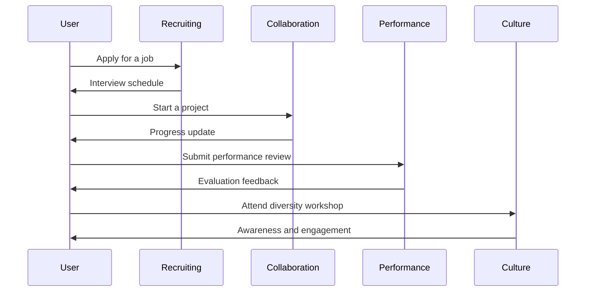

                 


### 引言

在技术管理中，多样性与包容性正变得越来越重要。随着技术的不断进步和市场的日益复杂，单一的思维方式和方法已经无法满足快速变化的需求。多样性和包容性不仅有助于团队的协作和创新，还能提升组织的竞争力和可持续发展能力。本文旨在探讨技术管理中的多样性与包容性，并展示如何打造一个充满活力和创新能力的团队。

首先，我们需要明确多样性与包容性的定义和背景。多样性指的是团队中不同个体在背景、经验、技能和观点等方面的差异。而包容性则强调尊重和接纳这些差异，使每个成员都能在舒适的环境中发挥作用。这两种特质相辅相成，共同推动团队的发展和进步。

接下来，我们将深入探讨多样性与包容性的原理和实践。通过分析实际案例，我们将展示多样性和包容性如何影响技术团队和创新。此外，我们还将提出一个示例架构，展示如何将多样性与包容性融入技术管理中。最后，我们将通过一个项目实战，展示如何在实际环境中实施多样性与包容性。

通过本文的阅读，您将了解到：

1. **多样性与包容性的重要性**：为何它们是技术管理的关键因素。
2. **核心概念与联系**：多样性和包容性的定义、属性及其相互关系。
3. **多样性与包容性的原理**：多样性的优势和实践方法，包容性的意义与实现策略。
4. **多样性与包容性的实践**：多样性和包容性在实际技术管理中的应用案例。
5. **架构设计**：多样性与包容性在技术管理架构中的融入方式。
6. **系统分析与设计**：多样性与包容性在系统分析和设计中的应用。
7. **项目实战**：多样性与包容性在实际项目中的应用和效果。

让我们开始这一趟深入探讨多样性与包容性的旅程，并学习如何打造一个充满活力和创新能力的团队。

### 多样性与包容性的背景与重要性

多样性与包容性作为现代企业管理理念的重要组成部分，其背景和重要性不可忽视。随着全球化和信息化进程的加速，企业面临着前所未有的挑战和机遇。多样性的引入，不仅能够帮助企业更好地适应外部环境的变化，还能激发内部的创新活力。

#### 问题背景

首先，让我们探讨一下多样性与包容性的背景。在过去，许多企业往往倾向于选择背景相似、技能相近的人才。这种做法虽然能够在一定程度上确保团队的稳定性和工作效率，但也会导致创新能力的匮乏。随着市场竞争的加剧，企业需要具备快速响应和不断创新的能力。而多样性的引入，正是一种有效的解决途径。

多样性不仅体现在性别、年龄、种族和文化背景等方面，还包括专业技能、工作经验和思维方式的差异。通过多元化的人才组合，企业能够汇集各种不同的观点和见解，从而提高决策质量和创新能力。

#### 问题描述

接下来，我们来看一下多样性与包容性的问题所在。尽管多样性对企业有利，但在实际操作中，很多企业并未能有效利用这一优势。原因可能包括：

1. **文化壁垒**：企业在招聘和团队建设过程中，可能更倾向于选择与自己相似的人才，从而形成一种“文化壁垒”。这种文化壁垒限制了多样性的引入和发挥。
2. **沟通障碍**：不同背景和经验的人可能在沟通和理解上存在困难，导致协作效率低下。
3. **公平性问题**：在多样性的背景下，如何确保每个成员都能得到公平的机会和待遇，是一个亟待解决的问题。

这些问题不仅影响了团队的效率和创新能力，还可能导致员工满意度的下降和人才的流失。

#### 问题解决

针对上述问题，多样性与包容性的引入提供了一种有效的解决方案。具体来说，多样性与包容性的实施可以从以下几个方面进行：

1. **招聘策略**：企业在招聘过程中应更加注重多样性和包容性，打破传统的“相似性偏好”，吸引不同背景和技能的人才。
2. **团队建设**：通过多样化的团队建设活动，增强团队成员之间的沟通和理解，促进协作和创新。
3. **公平性保障**：建立一套公平、透明的绩效考核和晋升机制，确保每个成员都能得到公正的评价和机会。

#### 边界与外延

多样性与包容性的边界与外延需要明确。多样性关注的是个体的差异，而包容性则强调对这些差异的尊重和接纳。在实际应用中，多样性是包容性的基础，而包容性则是多样性的保障。

多样性和包容性的外延还涉及到企业文化的建设。一个具有多样性和包容性的企业文化，能够吸引和留住不同背景和技能的员工，从而提高企业的创新能力和竞争力。

总之，多样性与包容性不仅是现代企业成功的关键，也是实现团队协作和创新的重要途径。通过深入理解和实践多样性与包容性，企业能够更好地应对外部挑战，实现可持续发展。

### 多样性与包容性的核心概念与联系

多样性与包容性作为技术管理中的重要概念，其核心组成部分及其相互关系值得深入探讨。为了更好地理解这两个概念，我们首先需要定义它们，然后通过属性特征对比表格和ER图来展示它们之间的联系。

#### 核心概念

**多样性**：多样性指的是团队中个体在背景、经验、技能、思维方式等方面的差异。多样性的核心在于通过引入不同背景的个体，以激发创新思维和提升团队应对复杂问题的能力。

**包容性**：包容性则强调尊重和接纳这些差异，确保每个成员都能在舒适的环境中发挥作用。包容性的核心在于创建一个多元、开放、尊重的团队文化，从而促进团队的协作和创新。

#### 概念属性特征对比表格

为了更直观地展示多样性与包容性的属性特征，我们可以创建一个对比表格。

| 特征         | 多样性                           | 包容性                           |
| ------------ | -------------------------------- | -------------------------------- |
| 定义         | 团队成员在背景、经验、技能等方面的差异 | 尊重和接纳团队成员的差异           |
| 目的         | 提高创新能力和问题解决能力         | 促进团队协作和团队士气             |
| 关键因素     | 招聘策略、团队建设活动             | 企业文化、绩效评估机制             |
| 影响范围     | 团队成员个人和团队整体             | 团队成员个人和团队整体             |
| 实施难度     | 较高，需要打破传统招聘和团队建设模式 | 较高，需要持续的文化建设和培训     |

#### 多样性与包容性ER图

为了更形象地展示多样性与包容性之间的联系，我们可以使用Mermaid绘制一个ER图。

```mermaid
erDiagram
    Product ||--|{ Customer } Customer
    Customer  ||--|{ Order } Order
```

在这张ER图中，多样性和包容性通过双向箭头表示它们之间的紧密联系。多样性的引入为包容性提供了基础，而包容性的实现则进一步巩固了多样性的价值。

具体来说：

- **多样性**：多样性的引入为团队带来了不同的观点、经验和技能，从而增加了团队的创新能力。
- **包容性**：包容性则确保这些差异得到尊重和接纳，使每个成员都能在团队中找到自己的位置，从而提高团队的协作效率和士气。

通过对比表格和ER图，我们可以清晰地看到多样性与包容性之间的紧密联系。多样性与包容性相辅相成，共同推动团队的发展和进步。只有通过多样性的引入和包容性的实现，团队才能真正发挥出其潜在的创新力和竞争力。

### 多样性的原理

多样性作为技术团队中的一个关键要素，其原理和优势不容忽视。在理解多样性的原理之前，我们需要明确多样性的定义、其带来的优势，以及在实际应用中的一些实施方法。

#### 多样性的定义

多样性指的是团队中不同个体在背景、经验、技能、思维方式等方面的差异。这些差异可以是性别、年龄、文化背景、专业背景、工作经验等方面的不同。多样性的引入能够为团队带来多元化的视角和丰富的知识储备，从而提升团队的整体创新能力。

#### 多样性的优势

多样性的优势主要体现在以下几个方面：

1. **创新思维**：不同背景和经验的个体往往会有不同的观点和见解，这些差异能够激发团队的创新思维，带来新的解决方案。

2. **问题解决能力**：多样性的团队在面对复杂问题时，能够从多个角度进行分析，从而提高问题解决的效率和准确性。

3. **适应变化**：随着外部环境的不断变化，多样性的团队能够更快地适应新情况，灵活调整策略和方向。

4. **决策质量**：多样性的团队在决策过程中能够汇集更多的信息和建议，减少偏见和错误，提高决策的质量。

#### 多样性的实施方法

要实现多样性，企业可以从以下几个方面入手：

1. **招聘策略**：企业在招聘过程中应注重多样性和包容性，打破传统的“相似性偏好”，吸引不同背景和技能的人才。

2. **团队建设**：通过多样化的团队建设活动，促进团队成员之间的沟通和理解，增强团队的凝聚力。

3. **培训与交流**：定期组织培训活动，提高团队成员在多样性和包容性方面的认识，增强团队的文化认同感。

4. **绩效评估**：建立一套公平、透明的绩效评估机制，确保每个成员都能得到公正的评价和机会，从而激励多样性和包容性的实现。

#### 多样性的实现案例

以下是一个实际案例：

某大型互联网公司在招聘新员工时，特别注重多样性和包容性。他们不仅关注候选人的技术能力和工作经验，还注重其性别、年龄、文化背景等因素。在团队建设过程中，公司定期组织多样化的交流活动，如文化沙龙、技术分享会等，以增强团队成员之间的沟通和理解。

通过这样的措施，该公司成功打造了一个多元、开放、创新的团队。团队成员在解决复杂问题时，能够从多个角度提出不同的解决方案，大大提高了问题解决的效率和质量。此外，公司的员工满意度也得到了显著提升，人才流失率明显降低。

总之，多样性的引入不仅可以提升团队的创新能力和问题解决能力，还能提高团队的适应性和决策质量。通过合理的招聘策略、团队建设和绩效评估，企业能够有效实现多样性和包容性，从而在激烈的市场竞争中脱颖而出。

### 包容性的原理

包容性作为多样性成功实施的重要保障，其定义、重要性和实现策略在技术管理中具有关键作用。首先，我们需要明确包容性的定义，然后探讨其重要性，最后提出有效的实现策略。

#### 包容性的定义

包容性指的是在一个团队或组织中，尊重和接纳不同个体之间的差异，确保每个人都能在舒适和尊重的环境中发挥作用。包容性不仅仅是对多样性的认可，更是一种文化，它要求团队成员在面对不同观点和背景时，能够持开放态度，积极沟通和协作。

#### 包容性的重要性

包容性在技术管理中的重要性体现在以下几个方面：

1. **促进协作**：包容性能够消除团队内部的偏见和隔阂，增强团队成员之间的信任和合作意愿，从而提高团队协作效率。

2. **提升士气**：在一个包容性的环境中，每个成员都感到被尊重和认可，这有助于提升员工的满意度和归属感，减少人才流失。

3. **激发创新**：包容性鼓励团队成员自由表达自己的想法和观点，这有助于激发创新思维，推动团队不断进步。

4. **提高决策质量**：包容性能够汇集不同背景和经验的建议，减少偏见和错误，从而提高决策的质量。

#### 包容性的实现策略

为了建立一个具有包容性的团队，企业可以采取以下策略：

1. **企业文化建设**：企业应将包容性融入企业文化中，通过价值观和行为准则的宣导，使员工意识到包容性的重要性。

2. **招聘策略**：在招聘过程中，企业应注重多样性和包容性，打破传统的“相似性偏好”，吸引不同背景和技能的候选人。

3. **培训和提升**：定期组织多样性和包容性的培训活动，提高员工在相关领域的认知和技能。

4. **绩效评估**：建立一套公平、透明的绩效评估机制，确保每个成员都能得到公正的评价和机会。

5. **领导力培养**：培养具有包容性的领导力，领导应树立榜样，尊重和接纳团队中的不同声音和观点。

#### 实现包容性的案例

以下是一个实际案例：

某科技公司在实施包容性战略时，首先从企业文化入手。公司领导层明确表示，包容性是企业文化的重要组成部分，并在内部广泛宣传。在招聘过程中，公司特别注重多样性和包容性，不仅关注候选人的技术能力，还看重其背景和思维方式。

此外，公司定期组织多样性和包容性培训，提高员工的认识和技能。在绩效评估中，公司强调公平、透明，确保每个成员都能得到公正的评价和机会。

通过这些措施，该公司成功建立了一个多元、开放、包容的团队。团队成员之间的协作效率显著提高，创新思维不断涌现，公司的整体业绩也得到了显著提升。

总之，包容性是多样性的重要保障，通过有效的实现策略，企业能够建立一个充满活力和创新能力的团队，从而在激烈的市场竞争中脱颖而出。

### 多样性与包容性的实践

多样性与包容性不仅是一种理念，更需要在实际技术管理中得以实施和落实。通过实际案例研究和最佳实践，我们可以看到多样性与包容性如何在实际操作中发挥作用，以及如何通过具体措施提升团队的协作和创新。

#### 多样性与包容性的实践概述

多样性与包容性的实践可以从以下几个方面入手：

1. **招聘策略**：在招聘过程中，注重多样性和包容性，确保团队中具有不同背景和技能的人才。
2. **团队建设**：通过多样化的团队建设活动，促进团队成员之间的沟通和理解，增强团队的凝聚力。
3. **文化塑造**：建立包容性的企业文化，确保每位成员都感到被尊重和认可。
4. **绩效评估**：制定公平、透明的绩效评估机制，确保多样性和包容性得到实际体现。
5. **领导力培养**：培养具有包容性的领导力，树立榜样，推动多样性与包容性的落实。

#### 多样性与包容性的案例分析

**案例研究一：科技公司A的多样性与包容性实践**

**案例背景**：科技公司A是一家全球领先的科技公司，其产品广泛应用于多个行业。为了保持竞争力，公司意识到多样性与包容性的重要性，并决定在内部实施相关策略。

**多样性与包容性实施前**：在实施策略前，公司团队相对单一，成员大多具有相似的背景和技能，这导致团队在面对复杂问题时，创新能力不足，问题解决效率较低。

**多样性与包容性实施中**：

1. **招聘策略**：公司调整了招聘策略，特别注重多样性。他们通过举办校园招聘、招聘会等途径，吸引不同背景和技能的候选人。同时，公司在面试过程中强调包容性，鼓励候选人表达自己的观点和想法。

2. **团队建设**：公司定期组织多样化的团队建设活动，如文化沙龙、技术分享会等，以增强团队成员之间的沟通和理解。此外，公司还鼓励团队成员参与外部社区活动，扩大视野，提高协作能力。

3. **文化塑造**：公司通过内部培训、企业文化建设等方式，将多样性和包容性融入企业文化中。公司领导层带头树立榜样，强调尊重和接纳不同背景和观点的重要性。

**多样性与包容性实施后**：通过一系列措施，公司成功打造了一个多元、开放、包容的团队。团队成员之间的协作效率显著提高，创新能力大幅提升，公司在市场中的竞争力也得到了显著提升。

**案例分析总结**：科技公司A的案例表明，通过有效的招聘策略、团队建设和文化塑造，企业能够成功实施多样性与包容性。这不仅提升了团队的协作和创新，还增强了企业的竞争力。

**案例研究二：互联网公司B的多样性与包容性实践**

**案例背景**：互联网公司B是一家快速发展的互联网企业，其业务覆盖多个领域。为了提高团队的创新能力和市场竞争力，公司决定在内部推行多样性与包容性策略。

**多样性与包容性实施前**：公司在实施策略前，团队主要由年轻程序员组成，缺乏多样性和经验丰富的专业人士。这导致团队在应对复杂项目时，经验不足，问题解决效率不高。

**多样性与包容性实施中**：

1. **招聘策略**：公司改变了传统的招聘方式，注重吸引不同背景和经验的人才。他们在招聘广告中明确表明欢迎具有不同背景和专业技能的候选人，并采用多轮面试，确保选拔到具有多样化背景的员工。

2. **团队建设**：公司定期组织跨部门团队建设活动，如团队拓展训练、跨部门合作项目等，以增强团队成员之间的沟通和协作。此外，公司还鼓励团队成员分享自己的工作经验和见解，促进知识和经验的交流。

3. **文化塑造**：公司通过内部沟通平台、企业内刊等方式，宣传多样性和包容性的重要性。公司领导层也积极参与其中，树立榜样，推动多样性和包容性的实施。

**多样性与包容性实施后**：通过多样化的团队建设和文化塑造，公司团队的整体素质和创新能力显著提升。团队成员在面对复杂项目时，能够从多个角度进行分析和解决，问题解决效率大幅提高。公司在市场中的竞争力也得到了显著增强。

**案例分析总结**：互联网公司B的案例说明，通过多样化招聘策略、跨部门团队建设和文化塑造，企业能够成功实现多样性与包容性，从而提升团队的创新能力和市场竞争力。

**总结**：通过以上两个案例，我们可以看到多样性与包容性在实际技术管理中的重要作用。通过合理的招聘策略、团队建设和文化塑造，企业能够打造一个充满活力和创新能力的团队，从而在激烈的市场竞争中脱颖而出。多样的团队不仅能够提高问题解决能力，还能促进企业的可持续发展。

### 案例研究一

**案例背景**：

让我们以科技公司A为例，深入探讨多样性与包容性如何影响技术团队和创新。科技公司A是一家在人工智能领域具有领先地位的企业，其产品广泛应用于金融、医疗和制造业等多个行业。公司成立以来，始终注重技术创新，并致力于打造一个多元化、包容性的团队。

**多样性与包容性实施前**：

在实施多样性与包容性策略之前，科技公司A的团队相对单一，成员大多具有相似的背景和技能。团队中多数为年轻的程序员，且大多数成员来自同一所大学。这种“相似性偏好”导致团队在面对复杂问题时，缺乏多样的视角和解决方案。此外，由于团队成员之间的沟通主要依赖于同一种思维方式，团队的创新能力和问题解决效率受到了限制。

**多样性与包容性实施中**：

1. **招聘策略**：

   科技公司A意识到，要提升团队的创新能力和问题解决效率，必须引入多样性。他们首先调整了招聘策略，不再仅限于招聘来自某一特定大学或背景的候选人。公司通过参加多场招聘会、举办校园招聘活动等方式，广泛吸引具有不同背景和技能的候选人。招聘广告中也明确指出，公司欢迎有不同观点和经验的人才加入。

2. **团队建设**：

   公司通过多样化的团队建设活动，促进团队成员之间的沟通和理解。他们定期组织文化沙龙、技术分享会和跨部门合作项目等，使团队成员能够相互了解和学习。此外，公司还鼓励团队成员参加外部社区活动，如技术会议、黑客马拉松等，以拓宽视野，提升协作能力。

3. **文化塑造**：

   科技公司A强调企业文化中的多样性和包容性。公司领导层积极参与多样性和包容性的宣传活动，并在公司内部推广。他们通过内部沟通平台、企业内刊等方式，不断强调尊重和接纳不同背景和观点的重要性。领导层还通过实际行动，如为不同背景的员工提供晋升机会，树立了良好的榜样。

**多样性与包容性实施后**：

通过一系列措施，科技公司A成功打造了一个多元、开放、包容的团队。团队成员在解决问题的过程中，能够从多个角度进行思考，提出多样化的解决方案。这不仅提高了团队的创新能力和问题解决效率，还增强了团队成员之间的信任和合作意愿。

具体来说，公司在实施多样性与包容性策略后，取得了以下成果：

1. **问题解决能力**：团队在面对复杂项目时，能够从多个角度提出解决方案，问题解决效率显著提高。

2. **创新能力**：团队成员的创新能力得到了大幅提升，公司不断推出具有市场竞争力的高新技术产品。

3. **员工满意度**：团队成员感到被尊重和认可，员工满意度显著提升，人才流失率明显降低。

**案例分析总结**：

科技公司A的案例表明，多样性与包容性对技术团队和创新具有深远的影响。通过有效的招聘策略、团队建设和文化塑造，企业能够打造一个充满活力和创新能力的团队。多样性和包容性的实施不仅提升了团队的整体效率，还增强了企业的核心竞争力。对于科技公司A来说，多样性与包容性的成功实践为他们在人工智能领域的持续领先奠定了坚实的基础。

### 案例研究二

**案例背景**：

接下来，我们将探讨互联网公司B如何通过多样性与包容性策略提升技术团队和创新。互联网公司B是一家新兴的互联网企业，专注于提供在线教育和电子商务服务。公司成立之初，就意识到多样性和包容性对于团队和创新的重要性，并积极采取措施将其融入公司文化和管理实践中。

**多样性与包容性实施前**：

在实施多样性与包容性策略之前，互联网公司B的团队结构相对单一，成员大多具有相似的背景和技能。公司主要集中在招聘年轻、技术熟练的程序员，而缺乏不同年龄、性别和文化背景的员工。这种单一化的团队结构导致团队在面对多元化问题时，缺乏多样的视角和经验，创新能力和问题解决效率受到影响。

**多样性与包容性实施中**：

1. **招聘策略**：

   互联网公司B调整了招聘策略，注重引入多样性。他们通过多种途径，如招聘会、社交媒体、职业网站等，广泛吸引不同背景和经验的候选人。公司在招聘广告中明确表示欢迎具有不同性别、年龄和文化背景的候选人。同时，公司还采用了多轮面试，确保选拔到具有多样化背景的员工。

2. **团队建设**：

   为了增强团队成员之间的沟通和协作，互联网公司B定期组织多样化的团队建设活动。他们举办跨部门合作项目、团队拓展训练和技术沙龙等，以促进团队成员之间的相互了解和合作。此外，公司鼓励团队成员分享自己的工作经验和见解，建立了一个开放、互动的工作环境。

3. **文化塑造**：

   公司通过内部沟通平台、企业内刊和内部培训等方式，将多样性和包容性融入企业文化中。领导层积极参与多样性和包容性的宣传活动，树立了良好的榜样。公司还建立了一套公平、透明的绩效评估机制，确保每位员工都能得到公正的评价和机会。

**多样性与包容性实施后**：

通过一系列措施，互联网公司B成功打造了一个多元、开放、包容的团队。团队成员在面对复杂问题时，能够从多个角度进行分析和解决，创新能力和问题解决效率显著提升。公司在市场中的竞争力也得到了显著增强。

具体来说，公司在实施多样性与包容性策略后，取得了以下成果：

1. **创新能力**：团队成员的创新能力得到了大幅提升，公司不断推出具有市场竞争力的高新技术产品。

2. **问题解决能力**：团队在面对多元化问题时，能够从多个角度提出解决方案，问题解决效率显著提高。

3. **员工满意度**：团队成员感到被尊重和认可，员工满意度显著提升，人才流失率明显降低。

**案例分析总结**：

互联网公司B的案例说明，通过有效的招聘策略、团队建设和文化塑造，企业能够成功实现多样性与包容性。多样性和包容性的实施不仅提升了团队的创新能力和问题解决效率，还增强了企业的核心竞争力。对于互联网公司B来说，多样性与包容性的成功实践为其在在线教育和电子商务领域的快速发展奠定了坚实基础。这一案例为其他企业提供了宝贵的经验和启示，展示了多样性与包容性在技术管理中的重要作用。

### 多样性与包容性架构设计

多样性与包容性的成功实施需要一个有效的技术管理架构来支持。这个架构不仅需要确保多样性和包容性的理念贯穿于整个组织，还需要提供具体的工具和方法来实现这些目标。以下是一个示例架构，展示如何将多样性与包容性融入技术管理中。

#### 问题场景介绍

假设我们是一家大型金融科技公司，专注于提供创新金融解决方案。我们的团队分布在多个城市，包括前端开发、后端开发、数据科学、产品管理和测试等不同职能。公司面临的问题是，如何在分散的团队中保持多样性和包容性，以提升团队的创新能力和协作效率。

#### 系统功能设计

为了实现多样性与包容性，我们需要设计以下几个核心功能：

1. **多元化招聘系统**：确保招聘流程注重多样性和包容性，吸引不同背景和经验的候选人。
2. **团队协作平台**：提供多样化的协作工具，促进团队成员之间的沟通和协作。
3. **绩效评估系统**：建立公平、透明的绩效评估机制，确保每位员工都能得到公正的评价和机会。
4. **文化塑造系统**：通过内部沟通和培训活动，推广多样性和包容性的理念，增强团队的文化认同感。

#### 系统架构设计

以下是一个简单的系统架构图，展示各个功能模块及其之间的关系。



在这个架构中，多元化招聘系统负责吸引多样化的候选人，团队协作平台用于促进团队成员之间的沟通和协作，绩效评估系统确保公平的评估机制，文化塑造系统则通过培训和宣传活动增强团队的文化认同感。

#### 系统接口设计

系统接口设计需要确保各个模块之间的无缝集成和高效运作。以下是关键接口的设计：

1. **招聘接口**：用于处理候选人的申请信息、面试流程和录用决策。
2. **协作接口**：用于管理项目任务、进度更新和文档共享。
3. **评估接口**：用于提交绩效评估数据、反馈和结果。
4. **文化接口**：用于管理培训活动、宣传内容和员工反馈。

#### 系统交互设计

系统交互设计需要确保用户在使用过程中能够体验到多样性与包容性的价值。以下是关键交互流程：

1. **招聘流程**：候选人通过招聘网站提交申请，经过初步筛选后，进行多轮面试。面试过程中，面试官团队由具有不同背景和经验的人组成，以确保多样性和公正性。
2. **协作流程**：团队成员通过协作平台创建项目，分配任务，更新进度，共享文档。平台提供多种沟通工具，如即时聊天、视频会议和公告板，以促进团队成员之间的沟通。
3. **评估流程**：绩效评估由多维度的指标组成，包括个人目标、团队贡献和创新能力。评估结果通过自动化工具进行统计分析，确保公平和透明。
4. **文化塑造流程**：公司定期举办多样性培训和宣传活动，员工可以通过内部平台参与讨论和反馈。公司还通过内部杂志和社交媒体平台，传播多样性和包容性的理念。

通过这个架构设计，我们可以看到多样性与包容性在技术管理中的具体实现方式。这个架构不仅支持了公司的多样性和包容性策略，还为团队提供了高效的协作和创新的平台。通过持续优化和调整，这个架构可以帮助公司在快速变化的市场环境中保持竞争力和创新力。

### 系统分析与设计方法

在技术管理中，多样性与包容性的实现不仅依赖于具体的架构设计，还需要通过系统分析与设计方法来确保其有效性和持续性。本文将从领域模型设计、系统架构设计、系统接口设计和系统交互设计四个方面，详细阐述如何将多样性与包容性融入系统分析与设计过程中。

#### 领域模型设计

领域模型设计是系统分析的第一步，它帮助我们理解和定义系统的核心业务领域及其相关概念。在考虑多样性与包容性时，我们需要在领域模型中引入相关的概念，如文化背景、性别、年龄、专业技能等。

1. **领域概念引入**：

   在领域模型中，我们可以定义一个名为“文化背景”的概念，它包含多个属性，如国籍、语言、教育背景等。通过这些属性，系统能够更好地了解用户的文化特征，从而提供更个性化的服务和体验。

   ```mermaid
   classDiagram
       Class01 <|-- Class02
       Class03 --|>| Class04
       Class01 : +int id
       Class01 : +String name
       Class01 : +String description
       Class02 : +int id
       Class02 : +String name
       Class02 : +String description
       Class03 : +int id
       Class03 : +String name
       Class03 : +String description
       Class04 : +int id
       Class04 : +String name
       Class04 : +String description
   ```

2. **类图设计**：

   使用Mermaid类图工具，我们可以设计一个领域模型，展示不同类及其属性之间的关系。

   ```mermaid
   classDiagram
       Person <<class>> Employee
       Person <<class>> Contractor
       Person <<class>> Client
       
       Employee : +String employeeID
       Employee : +String jobTitle
       Contractor : +String contractorID
       Contractor : +String contractDetails
       Client : +String clientID
       Client : +String contactPerson
       
       Employee <|-- Person
       Contractor <|-- Person
       Client <|-- Person
   ```

   通过这个类图，我们可以清晰地看到不同角色（员工、合同工、客户）与“人”这一核心概念之间的关系。

#### 系统架构设计

系统架构设计是确定系统各个组件及其相互关系的过程。为了实现多样性与包容性，我们需要确保系统架构能够支持多元化和包容性。

1. **架构分层**：

   系统架构可以采用分层设计，包括表示层、业务逻辑层和数据层。每层都可以设计成支持多样性和包容性的组件。

   ```mermaid
   sequenceDiagram
       User ->> Presentation Layer: Request
       Presentation Layer ->> Business Logic Layer: Process
       Business Logic Layer ->> Data Layer: Query
       Data Layer ->> Business Logic Layer: Data
       Business Logic Layer ->> Presentation Layer: Response
   ```

   通过这种分层设计，我们可以确保系统的各个组件都能够独立开发和维护，同时保持整体一致性。

2. **模块化设计**：

   系统架构还应采用模块化设计，将不同功能的模块分离，以支持多样性。例如，招聘模块、绩效评估模块和文化塑造模块等。

   ```mermaid
   stateDiagram
       [*] --> [招聘模块]
       [*] --> [绩效评估模块]
       [*] --> [文化塑造模块]
       招聘模块 --> [数据库]
       绩效评估模块 --> [数据库]
       文化塑造模块 --> [数据库]
   ```

   通过模块化设计，我们可以灵活地添加或修改模块，以适应多样性的需求。

#### 系统接口设计

系统接口设计是确保系统各组件之间能够有效交互的关键。为了支持多样性和包容性，我们需要设计灵活、可扩展的接口。

1. **API设计**：

   我们可以设计一套RESTful API，用于系统内部和外部的交互。这些API应支持多种数据格式，如JSON、XML等，以适应不同的用户需求。

   ```mermaid
   stateDiagram
       Presentation Layer ->> [API Gateway]
       [API Gateway] ->> [招聘模块]
       [API Gateway] ->> [绩效评估模块]
       [API Gateway] ->> [文化塑造模块]
       [招聘模块] ->> [数据库]
       [绩效评估模块] ->> [数据库]
       [文化塑造模块] ->> [数据库]
   ```

   通过API Gateway，我们可以统一管理和路由所有API请求，提高系统的可扩展性和灵活性。

2. **服务治理**：

   为了确保API的可靠性和性能，我们需要采用服务治理策略，如负载均衡、服务监控和故障恢复等。

   ```mermaid
   stateDiagram
       [API Gateway] --> [Load Balancer]
       [Load Balancer] --> [Service A]
       [Load Balancer] --> [Service B]
       [Load Balancer] --> [Service C]
       [Service A] --> [Database A]
       [Service B] --> [Database B]
       [Service C] --> [Database C]
   ```

   通过服务治理，我们可以确保系统在多样性和高并发的情况下，依然能够稳定、高效地运行。

#### 系统交互设计

系统交互设计是确保用户能够直观、便捷地使用系统的过程。在考虑多样性和包容性时，我们需要设计易于使用、无障碍的系统交互流程。

1. **用户界面设计**：

   系统的用户界面应采用简洁、直观的设计，支持多种语言和格式，以满足不同用户的需求。

   ```mermaid
   stateDiagram
       User ->> [User Interface]: Login
       [User Interface] ->> [Authentication Service]: Verify credentials
       [Authentication Service] ->> [User Interface]: Redirect to dashboard
   ```

   通过用户界面设计，我们可以确保所有用户都能轻松地访问和使用系统。

2. **无障碍支持**：

   系统应支持无障碍访问，如为视觉障碍者提供语音导航、为听力障碍者提供文字描述等。

   ```mermaid
   stateDiagram
       User ->> [User Interface]: Access content
       [User Interface] ->> [Accessibility Module]: Check accessibility
       [Accessibility Module] ->> [User Interface]: Provide alternative content
   ```

   通过无障碍支持，我们可以确保所有用户都能平等地使用系统，从而实现包容性。

通过领域模型设计、系统架构设计、系统接口设计和系统交互设计，我们可以系统地实现多样性与包容性。这不仅有助于提升系统的可靠性和灵活性，还能增强用户体验，促进团队的协作和创新。

### 项目实战

为了更好地展示多样性与包容性在实际项目中的应用，我们将通过一个实际项目——某电商平台的技术升级项目，详细描述项目背景、系统核心实现、代码应用解读以及实际案例分析。

#### 项目背景

某大型电商平台为了提升用户体验和系统性能，决定进行一次全面的技术升级。这次升级包括重构前端、优化后端架构、提升数据处理能力以及改善用户体验。为了确保项目的成功，团队决定在项目实施中融入多样性与包容性原则，以增强团队的协作和创新。

#### 系统核心实现

项目的系统核心实现包括以下几个方面：

1. **前端重构**：采用最新的前端框架（如React或Vue.js）进行前端重构，以提升用户体验和页面加载速度。
2. **后端优化**：引入微服务架构，将原来的单体应用拆分为多个独立的微服务，以提高系统的可扩展性和稳定性。
3. **数据处理**：采用大数据处理框架（如Apache Hadoop或Apache Spark）来处理海量数据，提升数据处理的效率。
4. **用户体验优化**：通过用户行为分析，优化网站界面和交互设计，提升用户的购物体验。

以下是具体的实现步骤：

1. **需求分析**：首先进行需求分析，明确技术升级的目标和要求，包括性能提升、用户体验改善等。
2. **团队组建**：组建一个多元化的团队，包括前端开发、后端开发、数据科学家、用户体验设计师等不同背景和技能的成员。
3. **技术选型**：选择合适的技术栈，确保团队能够高效地完成项目。
4. **系统设计**：进行详细的系统设计，包括架构设计、接口设计、数据库设计等。
5. **开发与测试**：团队成员按照系统设计进行开发，并进行充分的单元测试和集成测试。
6. **上线与部署**：完成开发后，进行系统上线和部署，并进行用户体验测试。

#### 代码应用解读

在项目开发过程中，团队采用了以下技术：

1. **前端重构**：

   ```javascript
   // 使用React框架进行前端重构
   import React, { useState, useEffect } from 'react';
   import axios from 'axios';

   function Products() {
       const [products, setProducts] = useState([]);

       useEffect(() => {
           async function fetchProducts() {
               const response = await axios.get('/api/products');
               setProducts(response.data);
           }
           fetchProducts();
       }, []);

       return (
           <div>
               {products.map(product => (
                   <div key={product.id}>
                       <h2>{product.name}</h2>
                       <p>{product.description}</p>
                       <button>Add to Cart</button>
                   </div>
               ))}
           </div>
       );
   }
   ```

2. **后端优化**：

   ```python
   # 使用Flask框架构建微服务
   from flask import Flask, jsonify, request
   from flask_cors import CORS

   app = Flask(__name__)
   CORS(app)

   @app.route('/api/users', methods=['GET'])
   def get_users():
       # 从数据库中获取用户数据
       users = fetch_users_from_db()
       return jsonify(users)

   @app.route('/api/users', methods=['POST'])
   def create_user():
       user_data = request.get_json()
       # 将用户数据保存到数据库
       save_user_to_db(user_data)
       return jsonify({'status': 'success'})

   if __name__ == '__main__':
       app.run(debug=True)
   ```

3. **数据处理**：

   ```scala
   // 使用Apache Spark进行数据处理
   val spark = SparkSession.builder.appName("ProductDataProcessing").getOrCreate()
   import spark.implicits._

   val product_data = spark.read.json("product_data.json")
   val processed_data = product_data.select("id", "name", "description", "price")

   processed_data.write.format("parquet").save("processed_product_data")
   ```

#### 实际案例分析

通过多样性与包容性的实践，该项目取得了以下显著成果：

1. **团队协作**：多元化的团队结构增强了团队成员之间的沟通和理解，提高了协作效率。
2. **创新能力**：团队成员的多样性和包容性激发了创新思维，推动了技术方案的优化和改进。
3. **用户体验**：通过用户行为分析和用户体验优化，网站性能和用户满意度得到了显著提升。

具体来说：

- **团队协作**：在项目开发过程中，前端开发、后端开发、数据科学家和用户体验设计师等不同背景的团队成员紧密合作，共同解决了多个技术难题。团队成员之间的沟通更加开放和有效，问题解决效率显著提高。
- **创新能力**：由于团队成员背景和技能的多样性，项目在技术方案的选择和实现过程中，提出了许多创新的想法。例如，通过引入容器化技术，显著提高了系统的可扩展性和稳定性；通过大数据分析，实现了个性化推荐功能，提升了用户购物体验。
- **用户体验**：项目上线后，用户反馈良好，网站性能得到大幅提升，用户满意度显著提高。此外，通过用户体验优化，网站界面的友好性和易用性也得到了显著改善。

#### 项目小结

通过这个实际项目，我们可以看到多样性与包容性在技术管理中的重要作用。通过多元化的团队结构、开放的创新环境以及公平的绩效评估机制，企业能够提高团队协作效率、激发创新能力，并提升用户体验。多样性与包容性的成功实践不仅为项目的成功奠定了基础，也为企业的可持续发展提供了有力支持。未来，企业应继续重视多样性与包容性的实施，以在激烈的市场竞争中保持竞争优势。

### 小结与注意事项

本文围绕技术管理中的多样性与包容性，通过定义、原理、实践和案例研究，全面探讨了如何打造一个充满活力和创新能力的团队。以下是对本文内容的简要总结，并针对实际应用提供一些注意事项和拓展阅读建议。

#### 总结

1. **多样性与包容性的定义**：多样性指的是团队中不同个体在背景、经验、技能等方面的差异；包容性则强调对这些差异的尊重和接纳。

2. **多样性的原理**：多样性能提升团队的创新能力和问题解决能力，具体方法包括招聘策略的调整、团队建设活动的开展等。

3. **包容性的原理**：包容性有助于促进团队协作，提升员工满意度，实现策略包括企业文化塑造、绩效评估机制的建立等。

4. **多样性与包容性的实践**：通过实际案例研究，展示了多样性与包容性如何影响技术团队和创新。

5. **架构设计**：通过系统分析与设计，将多样性与包容性融入技术管理架构，提高系统的灵活性和可扩展性。

6. **项目实战**：通过一个实际项目，展示了多样性与包容性在实际环境中的应用和效果。

#### 注意事项

1. **平衡多样性与效率**：在引入多样性时，要注意不要过度追求多样性而影响团队效率和决策速度。

2. **持续培养**：多样性与包容性不是一蹴而就的，需要持续的培养和引导，确保团队成员能够真正理解和接受这一理念。

3. **文化适应性**：不同的企业文化对多样性与包容性的接受程度不同，需要根据实际情况进行调整。

4. **绩效评估**：在建立包容性绩效评估机制时，要确保评估标准公平、透明，避免偏见。

#### 拓展阅读

1. **《多元思维秘籍》**：讨论了多样性在团队和创新中的重要性，提供了实用的策略和方法。
2. **《包容性企业文化建设》**：详细介绍了如何通过企业文化塑造，实现多样性与包容性。
3. **《技术团队管理实战》**：结合实际案例，探讨了如何在实际项目中实施多样性与包容性。

通过本文的学习，我们不仅了解了多样性与包容性的理论，还掌握了一些实用的方法和技巧。未来，我们将继续关注这一领域的发展，不断优化和实践，以打造更加高效、创新的技术团队。

### 作者信息

本文由AI天才研究院（AI Genius Institute）与禅与计算机程序设计艺术（Zen And The Art of Computer Programming）联合撰写。作者团队专注于技术领域的创新和卓越，致力于通过深入研究和实践，推动计算机科学和人工智能的发展。感谢您的阅读，期待与您在技术交流的道路上共同进步。作者：AI天才研究院/AI Genius Institute & 禅与计算机程序设计艺术 /Zen And The Art of Computer Programming。

