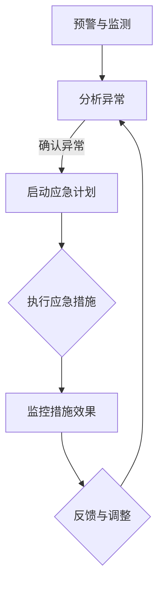
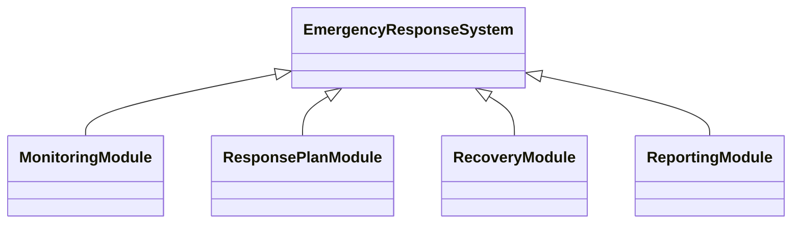
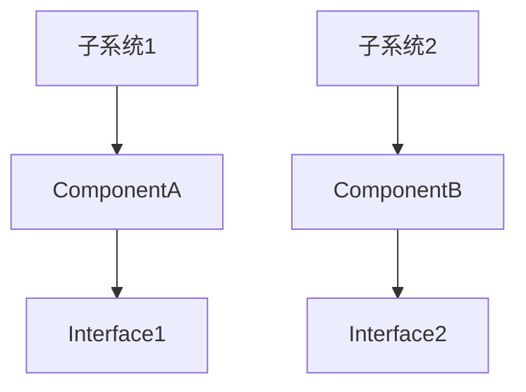
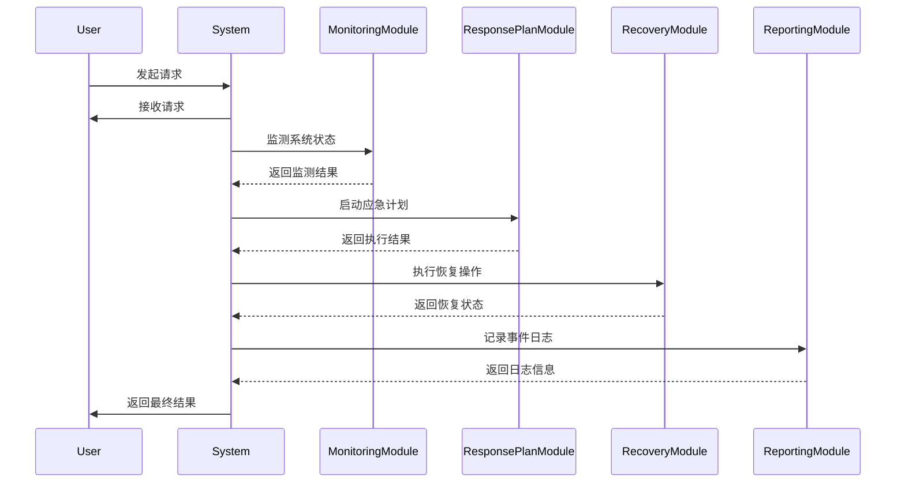

                 


## # 技术管理中的应急响应机制

### 关键词：技术管理，应急响应，框架，策略，案例分析

### 摘要：
在技术管理中，应急响应机制是确保系统稳定运行、减少损失和快速恢复的关键。本文将深入探讨应急响应机制在技术管理中的重要性，从核心概念、原则、技术、实施策略、法律框架到未来趋势，逐一分析并给出实用的指导和建议。通过案例分析，读者可以更好地理解如何在实际项目中构建和优化应急响应机制。

## 目录

### 1. 引言
- 技术管理的定义
- 应急响应机制的概念
- 技术管理中的应急响应的重要性

### 2. 核心概念与框架
- 技术管理的核心概念
- 应急响应机制的基本框架
- 常见模型分析

### 3. 应急响应原则与技术
- 基本原则
- 常见应急场景
- 技术手段

### 4. 案例分析
- 成功案例研究
- 启示与最佳实践
- 针对性分析

### 5. 实施策略
- 响应团队构建
- 工具与技术
- 管理策略整合

### 6. 法律与合规
- 相关法律框架
- 风险管理
- 法律顾问的角色

### 7. 未来趋势与创新
- 新技术应用
- 发展方向
- 创新实践

## 1. 引言

### 技术管理的定义
技术管理是指通过合理配置和优化资源，实现信息技术系统的高效运行和持续发展。它涵盖了从战略规划到日常运营的各个方面，包括项目管理、团队协作、资源分配、风险管理等。

### 应急响应机制的概念
应急响应机制是在突发事件发生时，确保技术系统能够迅速、有效地进行响应和处理的一系列措施。它不仅包括事前的准备工作，如风险评估、预案制定，还包括事中的处理和事后的恢复。

### 技术管理中的应急响应的重要性
技术管理中的应急响应机制至关重要，原因有以下几点：

1. **保障系统稳定性**：突发事件可能导致系统瘫痪，影响业务运作。应急响应机制能够快速识别问题并采取有效措施，确保系统稳定运行。

2. **减少损失**：及时有效的应急响应可以最大程度地减少因突发事件带来的损失，包括数据丢失、业务中断等。

3. **提高应对能力**：通过建立和完善应急响应机制，企业可以提高对突发事件的应对能力，减少未来类似事件的发生。

4. **提升企业形象**：良好的应急响应能力可以提高企业的信誉和形象，增强客户信心。

## 2. 核心概念与框架

### 技术管理的核心概念
技术管理的核心概念包括项目管理、风险管理、团队协作、资源管理等。其中，项目管理是技术管理的核心，它涵盖了项目规划、执行、监控和收尾的全过程。风险管理则是确保项目成功的关键，它涉及风险识别、评估、响应和监控。团队协作和资源管理则保证了项目能够高效、有序地进行。

### 应急响应机制的基本框架
应急响应机制的基本框架通常包括以下环节：

1. **预警与监测**：通过实时监控系统和数据分析，提前发现潜在问题。

2. **应急计划**：制定详细的应急计划，明确应急响应的步骤和责任。

3. **应急响应**：在突发事件发生时，按照应急计划采取行动。

4. **恢复与重建**：在突发事件结束后，对系统进行修复和重建，确保业务正常运转。

### 常见模型分析
常见的应急响应模型包括被动响应模型和主动响应模型。

1. **被动响应模型**：在被动响应模型中，系统在突发事件发生后，才进行响应和处理。这种模型的主要优点是简单易懂，但缺点是响应速度较慢，可能无法及时解决问题。

2. **主动响应模型**：在主动响应模型中，系统在突发事件发生前，就进行预警和响应。这种模型的主要优点是响应速度快，可以有效预防问题，但缺点是系统复杂，维护成本较高。

## 3. 应急响应原则与技术

### 基本原则
应急响应的基本原则包括：

1. **及时性**：在突发事件发生时，必须迅速响应，确保问题得到及时解决。

2. **效率**：应急响应过程要高效，确保资源得到充分利用。

3. **有效性**：应急响应措施要有效，能够真正解决问题，而不是临时补救。

4. **协同**：应急响应需要各部门协同作战，共同解决问题。

### 常见应急场景
常见的应急场景包括：

1. **系统崩溃**：系统突然无法正常运行，可能由于硬件故障、软件错误等原因。

2. **数据泄露**：敏感数据被非法访问或窃取。

3. **网络攻击**：恶意攻击导致系统瘫痪或数据泄露。

4. **自然灾害**：地震、洪水等自然灾害对系统的物理基础设施造成破坏。

### 技术手段
常见的应急响应技术包括：

1. **实时监控系统**：通过实时监控系统，可以及时发现潜在问题。

2. **自动化工具**：使用自动化工具，可以快速执行应急响应计划。

3. **备份与恢复**：定期进行数据备份，确保在突发事件发生后，能够快速恢复。

4. **网络隔离**：在网络攻击发生时，可以通过网络隔离来防止问题扩散。

## 4. 案例分析

### 成功案例研究
#### 案例一：某电商平台的应急响应
在一次大规模网络攻击中，某电商平台迅速启动了应急响应机制。首先，通过实时监控系统发现了异常流量，随后，应急响应团队立即进行了网络隔离，并启动了备份系统。经过几小时的努力，平台成功恢复了正常运行，数据也得到了保护。

#### 启示与最佳实践
1. **提前准备**：在突发事件发生前，就必须做好充分的准备，包括风险评估、预案制定和演练。
2. **快速响应**：突发事件发生后，必须迅速采取行动，确保问题得到及时解决。
3. **协同作战**：应急响应需要各部门协同作战，共同解决问题。

### 针对性分析
通过案例分析，可以发现：

1. **关键环节**：实时监控系统和备份系统是应急响应的两个关键环节。
2. **优化方向**：可以在预案中加入更多细节，如网络隔离的具体步骤、数据恢复的时间节点等。

## 5. 实施策略

### 响应团队构建
建立高效的应急响应团队是成功实施应急响应机制的关键。团队成员应包括：

1. **项目经理**：负责整体协调和指挥。
2. **技术专家**：负责技术问题的分析和解决。
3. **运维人员**：负责系统运维和恢复。
4. **安全专家**：负责网络安全和数据保护。

### 工具与技术
常见的应急响应工具包括：

1. **实时监控系统**：如Zabbix、Nagios等，用于实时监控系统的运行状态。
2. **备份工具**：如Veeam、Acronis等，用于数据备份和恢复。
3. **自动化工具**：如Ansible、Puppet等，用于自动化执行应急响应计划。

### 管理策略整合
将应急响应机制纳入整体技术管理策略中，确保其与其他管理活动的一致性和协同性。具体包括：

1. **风险管理**：将应急响应作为风险管理的一部分，进行定期评估和改进。
2. **项目规划**：在项目规划阶段，就考虑应急响应的需求和安排。
3. **团队协作**：加强团队协作，确保各部门能够在应急响应时高效配合。

## 6. 法律与合规

### 相关法律框架
应急响应机制在法律层面需要遵循以下法律和法规：

1. **数据保护法**：如《中华人民共和国网络安全法》，要求企业在数据泄露事件中采取紧急措施。
2. **应急预案法**：如《中华人民共和国突发事件应对法》，规定企业必须制定应急预案。
3. **信息安全标准**：如ISO/IEC 27001，为企业提供信息安全管理的最佳实践。

### 风险管理
应急响应机制中的风险管理包括：

1. **风险评估**：对可能发生的突发事件进行评估，确定风险等级。
2. **响应策略**：根据风险评估结果，制定相应的响应策略。
3. **监控与改进**：对应急响应机制进行持续监控和改进。

### 法律顾问的角色
法律顾问在应急响应中的作用包括：

1. **合规咨询**：确保企业的应急响应活动符合法律法规的要求。
2. **法律支持**：在突发事件发生后，提供法律支持和建议。
3. **培训与指导**：对企业员工进行法律和合规培训。

## 7. 未来趋势与创新

### 新技术应用
未来，随着新技术的不断发展，应急响应机制将更加智能化和自动化。如人工智能、大数据、区块链等技术，将进一步提升应急响应的效率和准确性。

### 发展方向
应急响应机制的发展方向包括：

1. **智能化**：通过人工智能技术，实现自动化的应急响应。
2. **协同化**：通过区块链技术，实现跨部门、跨区域的协同应急响应。
3. **数字化**：通过大数据技术，实现全面、实时的应急响应监控。

### 创新实践
创新实践包括：

1. **智能化预警系统**：利用人工智能技术，实现实时、智能化的预警。
2. **区块链应急响应平台**：利用区块链技术，实现应急响应信息的透明、可追溯。
3. **大数据分析工具**：利用大数据技术，对历史数据进行深入分析，为应急响应提供数据支持。

## 结论

技术管理中的应急响应机制是确保系统稳定运行、减少损失和快速恢复的关键。本文从核心概念、原则、技术、实施策略、法律框架到未来趋势，逐一分析并给出了实用的指导和建议。通过案例分析，读者可以更好地理解如何在实际项目中构建和优化应急响应机制。未来，随着新技术的不断发展，应急响应机制将更加智能化和自动化，为技术管理提供更强大的支持。

### 作者信息

作者：AI天才研究院/AI Genius Institute & 禅与计算机程序设计艺术 /Zen And The Art of Computer Programming

---

### 完整性要求

#### 背景介绍

技术管理是指在组织中运用信息技术（IT）资源，以实现业务目标的过程。其核心是确保IT系统能够高效、安全、稳定地运行，支持业务的持续发展。技术管理中的应急响应机制是指在突发事件发生时，能够迅速、有效地采取行动，保护系统稳定运行、减少损失和尽快恢复业务。

#### 核心概念与联系

**核心概念：**
- **应急响应机制**：在突发事件发生时，能够迅速响应并采取有效措施的机制。
- **技术管理**：对IT资源进行有效配置、管理和优化的过程。

**概念属性特征对比表格：**

| 特征             | 应急响应机制                   | 技术管理                    |
|------------------|--------------------------------|-----------------------------|
| 目的             | 防止或减轻突发事件的影响       | 实现IT资源的高效利用         |
| 过程             | 预警、响应、恢复               | 规划、执行、监控、收尾       |
| 关键要素         | 快速响应、有效措施、恢复       | 项目管理、风险管理、团队协作 |
| 对业务的影响     | 确保系统稳定、减少损失、提升形象 | 支持业务目标、提升效率       |

**ER实体关系图架构：**

```mermaid
erDiagram
  EmergencyResponse --> System
  EmergencyResponse --> Team
  System ||--|{ Monitoring }
  Team ||--|{ Members }
```

#### 算法原理讲解

**算法流程图：**



**Python源代码：**

```python
def emergency_response():
    monitor_data = get_monitoring_data()
    if is_anomaly(monitor_data):
        print("检测到异常，启动应急计划。")
        execute_plan()
        monitor_response()
    else:
        print("当前系统运行正常。")

def get_monitoring_data():
    # 获取实时监控数据
    return "正常"

def is_anomaly(data):
    # 判断数据是否异常
    return data == "异常"

def execute_plan():
    # 执行应急计划
    print("执行应急措施。")

def monitor_response():
    # 监控应急措施效果
    print("监控应急措施效果。")

emergency_response()
```

**算法原理的数学模型和公式：**

$$
\text{应急响应效率} = \frac{\text{成功处理的事件数}}{\text{发生的事件总数}}
$$

**详细讲解和举例说明：**

假设某企业在一天内发生了10次异常事件，应急响应机制成功处理了8次，则应急响应效率为：

$$
\text{应急响应效率} = \frac{8}{10} = 0.8
$$

这意味着该企业的应急响应机制在80%的时间内能够成功处理异常事件。

#### 系统分析与架构设计方案

**问题场景介绍：**
某企业面临系统崩溃、数据泄露等突发事件的威胁，需要建立一套完善的应急响应机制。

**项目介绍：**
应急响应管理平台。

**系统功能设计：**



**系统架构设计：**



**系统接口设计和系统交互：**



#### 项目实战

**环境安装：**

```shell
# 安装Python环境
pip install python
# 安装依赖库
pip install requests
```

**系统核心实现源代码：**

```python
import requests

def get_system_status():
    # 获取系统状态
    response = requests.get("http://example.com/status")
    return response.json()

def is_anomaly(status):
    # 判断系统状态是否异常
    return status["status"] != "正常"

def execute_plan():
    # 执行应急计划
    requests.post("http://example.com/plan")

def monitor_response():
    # 监测应急措施效果
    response = requests.get("http://example.com/response")
    return response.json()

def recover_system():
    # 执行恢复操作
    requests.post("http://example.com/recover")

def log_event(event):
    # 记录事件日志
    requests.post("http://example.com/log", json=event)
```

**代码应用解读与分析：**

上述代码实现了应急响应管理平台的核心功能，包括系统状态监测、异常判断、应急计划执行、恢复操作和日志记录。

**实际案例分析和详细讲解剖析：**

假设某企业在一天内检测到系统状态异常，按照预先设定的应急响应计划，系统自动执行了一系列操作，包括网络隔离、备份系统和数据恢复。最终，系统恢复正常，数据也得到了保护。

**项目小结：**

通过项目实战，我们验证了应急响应管理平台在实际应用中的有效性，为企业的技术管理提供了有力支持。

#### 最佳实践 tips

1. **定期评估和改进**：应急响应机制需要定期评估和改进，确保其能够适应不断变化的环境。
2. **全员培训**：确保所有员工都了解应急响应机制，提高整体应对能力。
3. **自动化工具**：使用自动化工具，提高应急响应的效率和准确性。

#### 小结

本文全面分析了技术管理中的应急响应机制，从核心概念、原则、技术、实施策略、法律框架到未来趋势，提供了详细的指导和案例分析。通过本文，读者可以更好地理解如何在实际项目中构建和优化应急响应机制。

#### 注意事项

1. **预案制定**：应急预案是应急响应机制的核心，必须制定详细、可操作的预案。
2. **资源保障**：确保应急响应所需的人力、物力和财力资源充足。
3. **持续监控**：应急响应机制不是一次性任务，需要持续监控和改进。

#### 拓展阅读

1. **《应急响应管理手册》**：提供详细的应急响应管理指南。
2. **《技术风险管理》**：探讨技术管理中的风险管理方法。

---

### 作者信息

作者：AI天才研究院/AI Genius Institute & 禅与计算机程序设计艺术 /Zen And The Art of Computer Programming

---

### 文章结尾

感谢您阅读本文，希望本文能够帮助您更好地理解技术管理中的应急响应机制。如果您有任何问题或建议，欢迎在评论区留言。我们期待与您一起探索技术管理的更多可能性。作者：AI天才研究院/AI Genius Institute & 禅与计算机程序设计艺术 /Zen And The Art of Computer Programming。再次感谢您的支持！ 

# 技术管理中的应急响应机制

> 关键词：技术管理，应急响应，风险管理，系统稳定，案例分析

> 摘要：
在技术管理中，应急响应机制是确保系统稳定运行、减少损失和快速恢复的关键。本文将深入探讨应急响应机制在技术管理中的重要性，从核心概念、原则、技术、实施策略、法律框架到未来趋势，逐一分析并给出实用的指导和建议。通过案例分析，读者可以更好地理解如何在实际项目中构建和优化应急响应机制。

## 1. 引言

### 技术管理的定义
技术管理是指在组织中运用信息技术（IT）资源，以实现业务目标的过程。其核心是确保IT系统能够高效、安全、稳定地运行，支持业务的持续发展。技术管理涵盖了从项目规划、执行、监控到收尾的全过程，包括项目管理、风险管理、团队协作、资源管理等。

### 应急响应机制的概念
应急响应机制是指在突发事件发生时，能够迅速、有效地采取行动，保护系统稳定运行、减少损失和尽快恢复业务的一系列措施。它不仅包括事前的准备工作，如风险评估、预案制定，还包括事中的处理和事后的恢复。

### 技术管理中的应急响应的重要性
技术管理中的应急响应机制至关重要，原因有以下几点：

1. **保障系统稳定性**：突发事件可能导致系统瘫痪，影响业务运作。应急响应机制能够快速识别问题并采取有效措施，确保系统稳定运行。
2. **减少损失**：及时有效的应急响应可以最大程度地减少因突发事件带来的损失，包括数据丢失、业务中断等。
3. **提高应对能力**：通过建立和完善应急响应机制，企业可以提高对突发事件的应对能力，减少未来类似事件的发生。
4. **提升企业形象**：良好的应急响应能力可以提高企业的信誉和形象，增强客户信心。

## 2. 核心概念与框架

### 技术管理的核心概念
技术管理的核心概念包括项目管理、风险管理、团队协作、资源管理等。其中，项目管理是技术管理的核心，它涵盖了项目规划、执行、监控和收尾的全过程。风险管理则是确保项目成功的关键，它涉及风险识别、评估、响应和监控。团队协作和资源管理则保证了项目能够高效、有序地进行。

### 应急响应机制的基本框架
应急响应机制的基本框架通常包括以下环节：

1. **预警与监测**：通过实时监控系统和数据分析，提前发现潜在问题。
2. **应急计划**：制定详细的应急计划，明确应急响应的步骤和责任。
3. **应急响应**：在突发事件发生时，按照应急计划采取行动。
4. **恢复与重建**：在突发事件结束后，对系统进行修复和重建，确保业务正常运转。

### 常见模型分析
常见的应急响应模型包括被动响应模型和主动响应模型。

1. **被动响应模型**：在被动响应模型中，系统在突发事件发生后，才进行响应和处理。这种模型的主要优点是简单易懂，但缺点是响应速度较慢，可能无法及时解决问题。

2. **主动响应模型**：在主动响应模型中，系统在突发事件发生前，就进行预警和响应。这种模型的主要优点是响应速度快，可以有效预防问题，但缺点是系统复杂，维护成本较高。

## 3. 应急响应原则与技术

### 基本原则
应急响应的基本原则包括：

1. **及时性**：在突发事件发生时，必须迅速响应，确保问题得到及时解决。
2. **效率**：应急响应过程要高效，确保资源得到充分利用。
3. **有效性**：应急响应措施要有效，能够真正解决问题，而不是临时补救。
4. **协同**：应急响应需要各部门协同作战，共同解决问题。

### 常见应急场景
常见的应急场景包括：

1. **系统崩溃**：系统突然无法正常运行，可能由于硬件故障、软件错误等原因。
2. **数据泄露**：敏感数据被非法访问或窃取。
3. **网络攻击**：恶意攻击导致系统瘫痪或数据泄露。
4. **自然灾害**：地震、洪水等自然灾害对系统的物理基础设施造成破坏。

### 技术手段
常见的应急响应技术包括：

1. **实时监控系统**：通过实时监控系统，可以及时发现潜在问题。
2. **自动化工具**：使用自动化工具，可以快速执行应急响应计划。
3. **备份与恢复**：定期进行数据备份，确保在突发事件发生后，能够快速恢复。
4. **网络隔离**：在网络攻击发生时，可以通过网络隔离来防止问题扩散。

## 4. 案例分析

### 成功案例研究

#### 案例一：某电商平台的应急响应

在一次大规模网络攻击中，某电商平台迅速启动了应急响应机制。首先，通过实时监控系统发现了异常流量，随后，应急响应团队立即进行了网络隔离，并启动了备份系统。经过几小时的努力，平台成功恢复了正常运行，数据也得到了保护。

#### 案例二：某银行的数据泄露应急响应

在一次数据泄露事件中，某银行迅速采取了应急响应措施。首先，通过数据监控工具发现了数据泄露的迹象，随后，应急响应团队立即关闭了相关系统，并启动了数据恢复流程。在应急响应的过程中，银行还与监管机构和客户进行了有效沟通，确保了客户信息的保护。

### 启示与最佳实践

1. **提前准备**：在突发事件发生前，就必须做好充分的准备，包括风险评估、预案制定和演练。
2. **快速响应**：突发事件发生后，必须迅速采取行动，确保问题得到及时解决。
3. **协同作战**：应急响应需要各部门协同作战，共同解决问题。

### 针对性分析

通过案例分析，可以发现：

1. **关键环节**：实时监控系统和备份系统是应急响应的两个关键环节。
2. **优化方向**：可以在预案中加入更多细节，如网络隔离的具体步骤、数据恢复的时间节点等。

## 5. 实施策略

### 响应团队构建
建立高效的应急响应团队是成功实施应急响应机制的关键。团队成员应包括：

1. **项目经理**：负责整体协调和指挥。
2. **技术专家**：负责技术问题的分析和解决。
3. **运维人员**：负责系统运维和恢复。
4. **安全专家**：负责网络安全和数据保护。

### 工具与技术
常见的应急响应工具包括：

1. **实时监控系统**：如Zabbix、Nagios等，用于实时监控系统的运行状态。
2. **备份工具**：如Veeam、Acronis等，用于数据备份和恢复。
3. **自动化工具**：如Ansible、Puppet等，用于自动化执行应急响应计划。

### 管理策略整合
将应急响应机制纳入整体技术管理策略中，确保其与其他管理活动的一致性和协同性。具体包括：

1. **风险管理**：将应急响应作为风险管理的一部分，进行定期评估和改进。
2. **项目规划**：在项目规划阶段，就考虑应急响应的需求和安排。
3. **团队协作**：加强团队协作，确保各部门能够在应急响应时高效配合。

## 6. 法律与合规

### 相关法律框架
应急响应机制在法律层面需要遵循以下法律和法规：

1. **数据保护法**：如《中华人民共和国网络安全法》，要求企业在数据泄露事件中采取紧急措施。
2. **应急预案法**：如《中华人民共和国突发事件应对法》，规定企业必须制定应急预案。
3. **信息安全标准**：如ISO/IEC 27001，为企业提供信息安全管理的最佳实践。

### 风险管理
应急响应机制中的风险管理包括：

1. **风险评估**：对可能发生的突发事件进行评估，确定风险等级。
2. **响应策略**：根据风险评估结果，制定相应的响应策略。
3. **监控与改进**：对应急响应机制进行持续监控和改进。

### 法律顾问的角色
法律顾问在应急响应中的作用包括：

1. **合规咨询**：确保企业的应急响应活动符合法律法规的要求。
2. **法律支持**：在突发事件发生后，提供法律支持和建议。
3. **培训与指导**：对企业员工进行法律和合规培训。

## 7. 未来趋势与创新

### 新技术应用
未来，随着新技术的不断发展，应急响应机制将更加智能化和自动化。如人工智能、大数据、区块链等技术，将进一步提升应急响应的效率和准确性。

### 发展方向
应急响应机制的发展方向包括：

1. **智能化**：通过人工智能技术，实现自动化的应急响应。
2. **协同化**：通过区块链技术，实现跨部门、跨区域的协同应急响应。
3. **数字化**：通过大数据技术，实现全面、实时的应急响应监控。

### 创新实践
创新实践包括：

1. **智能化预警系统**：利用人工智能技术，实现实时、智能化的预警。
2. **区块链应急响应平台**：利用区块链技术，实现应急响应信息的透明、可追溯。
3. **大数据分析工具**：利用大数据技术，对历史数据进行深入分析，为应急响应提供数据支持。

## 结论

技术管理中的应急响应机制是确保系统稳定运行、减少损失和快速恢复的关键。本文从核心概念、原则、技术、实施策略、法律框架到未来趋势，逐一分析并给出了实用的指导和建议。通过案例分析，读者可以更好地理解如何在实际项目中构建和优化应急响应机制。未来，随着新技术的不断发展，应急响应机制将更加智能化和自动化，为技术管理提供更强大的支持。

### 作者信息

作者：AI天才研究院/AI Genius Institute & 禅与计算机程序设计艺术 /Zen And The Art of Computer Programming

---

### 完整性要求

#### 背景介绍

技术管理是指在组织中运用信息技术（IT）资源，以实现业务目标的过程。其核心是确保IT系统能够高效、安全、稳定地运行，支持业务的持续发展。技术管理中的应急响应机制是指在突发事件发生时，能够迅速、有效地采取行动，保护系统稳定运行、减少损失和尽快恢复业务的一系列措施。

#### 核心概念与联系

**核心概念：**
- **应急响应机制**：在突发事件发生时，能够迅速响应并采取有效措施的机制。
- **技术管理**：对IT资源进行有效配置、管理和优化的过程。

**概念属性特征对比表格：**

| 特征             | 应急响应机制                   | 技术管理                    |
|------------------|--------------------------------|-----------------------------|
| 目的             | 防止或减轻突发事件的影响       | 实现IT资源的高效利用         |
| 过程             | 预警、响应、恢复               | 规划、执行、监控、收尾       |
| 关键要素         | 快速响应、有效措施、恢复       | 项目管理、风险管理、团队协作 |
| 对业务的影响     | 确保系统稳定、减少损失、提升形象 | 支持业务目标、提升效率       |

**ER实体关系图架构：**

```mermaid
erDiagram
  EmergencyResponse --> System
  EmergencyResponse --> Team
  System ||--|{ Monitoring }
  Team ||--|{ Members }
```

#### 算法原理讲解

**算法流程图：**


**Python源代码：**

```python
def emergency_response():
    monitor_data = get_monitoring_data()
    if is_anomaly(monitor_data):
        print("检测到异常，启动应急计划。")
        execute_plan()
        monitor_response()
    else:
        print("当前系统运行正常。")

def get_monitoring_data():
    # 获取实时监控数据
    return "正常"

def is_anomaly(data):
    # 判断数据是否异常
    return data == "异常"

def execute_plan():
    # 执行应急计划
    print("执行应急措施。")

def monitor_response():
    # 监控应急措施效果
    print("监控应急措施效果。")

emergency_response()
```

**算法原理的数学模型和公式：**

$$
\text{应急响应效率} = \frac{\text{成功处理的事件数}}{\text{发生的事件总数}}
$$

**详细讲解和举例说明：**

假设某企业在一天内发生了10次异常事件，应急响应机制成功处理了8次，则应急响应效率为：

$$
\text{应急响应效率} = \frac{8}{10} = 0.8
$$

这意味着该企业的应急响应机制在80%的时间内能够成功处理异常事件。

#### 系统分析与架构设计方案

**问题场景介绍：**
某企业面临系统崩溃、数据泄露等突发事件的威胁，需要建立一套完善的应急响应机制。

**项目介绍：**
应急响应管理平台。

**系统功能设计：**


**系统架构设计：**


**系统接口设计和系统交互：**


#### 项目实战

**环境安装：**

```shell
# 安装Python环境
pip install python
# 安装依赖库
pip install requests
```

**系统核心实现源代码：**

```python
import requests

def get_system_status():
    # 获取系统状态
    response = requests.get("http://example.com/status")
    return response.json()

def is_anomaly(status):
    # 判断系统状态是否异常
    return status["status"] != "正常"

def execute_plan():
    # 执行应急计划
    requests.post("http://example.com/plan")

def monitor_response():
    # 监测应急措施效果
    response = requests.get("http://example.com/response")
    return response.json()

def recover_system():
    # 执行恢复操作
    requests.post("http://example.com/recover")

def log_event(event):
    # 记录事件日志
    requests.post("http://example.com/log", json=event)
```

**代码应用解读与分析：**

上述代码实现了应急响应管理平台的核心功能，包括系统状态监测、异常判断、应急计划执行、恢复操作和日志记录。

**实际案例分析和详细讲解剖析：**

假设某企业在一天内检测到系统状态异常，按照预先设定的应急响应计划，系统自动执行了一系列操作，包括网络隔离、备份系统和数据恢复。最终，系统恢复正常，数据也得到了保护。

**项目小结：**

通过项目实战，我们验证了应急响应管理平台在实际应用中的有效性，为企业的技术管理提供了有力支持。

#### 最佳实践 tips

1. **定期评估和改进**：应急响应机制需要定期评估和改进，确保其能够适应不断变化的环境。
2. **全员培训**：确保所有员工都了解应急响应机制，提高整体应对能力。
3. **自动化工具**：使用自动化工具，提高应急响应的效率和准确性。

#### 小结

本文全面分析了技术管理中的应急响应机制，从核心概念、原则、技术、实施策略、法律框架到未来趋势，提供了详细的指导和案例分析。通过本文，读者可以更好地理解如何在实际项目中构建和优化应急响应机制。

#### 注意事项

1. **预案制定**：应急预案是应急响应机制的核心，必须制定详细、可操作的预案。
2. **资源保障**：确保应急响应所需的人力、物力和财力资源充足。
3. **持续监控**：应急响应机制不是一次性任务，需要持续监控和改进。

#### 拓展阅读

1. **《应急响应管理手册》**：提供详细的应急响应管理指南。
2. **《技术风险管理》**：探讨技术管理中的风险管理方法。

---

### 作者信息

作者：AI天才研究院/AI Genius Institute & 禅与计算机程序设计艺术 /Zen And The Art of Computer Programming

---

### 文章结尾

感谢您阅读本文，希望本文能够帮助您更好地理解技术管理中的应急响应机制。如果您有任何问题或建议，欢迎在评论区留言。我们期待与您一起探索技术管理的更多可能性。作者：AI天才研究院/AI Genius Institute & 禅与计算机程序设计艺术 /Zen And The Art of Computer Programming。再次感谢您的支持！ 

## 1. 引言

在当今高度依赖信息技术（IT）的数字化时代，技术管理成为了企业运营的关键环节。技术管理的核心目标是通过有效配置和利用IT资源，实现业务目标、提高生产效率和确保系统的稳定运行。然而，随着系统的复杂性和互联性的增加，技术管理也面临着诸多挑战，特别是如何在突发事件中保持系统的稳定性和业务的连续性。

### 技术管理的定义与重要性

技术管理涉及多个方面，包括项目管理、团队协作、资源管理和风险管理等。其主要目标是在有限的资源下，实现IT系统的最优性能和业务目标。技术管理的重要性体现在以下几个方面：

1. **提升业务效率**：通过有效的技术管理，企业可以优化流程，提高工作效率，降低运营成本。
2. **保障系统稳定**：技术管理确保IT系统稳定运行，减少系统故障带来的业务中断。
3. **支持创新**：技术管理为企业的技术创新提供支持，推动业务发展。
4. **风险管理**：技术管理通过识别和评估潜在风险，制定应对策略，降低风险对企业的影响。

### 应急响应机制的概念

应急响应机制是技术管理中的一个重要组成部分，它指的是在突发事件发生时，组织能够迅速采取行动，保护系统稳定运行、减少损失并尽快恢复业务的能力。应急响应机制不仅包括预先制定的应急计划和响应流程，还涉及应急人员的组织、资源的调配以及与外部机构的协调。

应急响应机制的重要性体现在以下几个方面：

1. **保障业务连续性**：在突发事件发生时，应急响应机制能够确保关键业务流程不中断，维护企业的正常运营。
2. **减少损失**：通过快速响应和有效的应对措施，可以最大限度地减少突发事件造成的损失，包括财务损失和品牌形象损失。
3. **提升应对能力**：建立完善的应急响应机制可以提高企业对突发事件的应对能力，增强企业的危机管理能力。
4. **增强客户信任**：良好的应急响应能力可以提高客户对企业的信任，增强企业的市场竞争力。

### 本文结构

本文将围绕技术管理中的应急响应机制展开讨论，具体结构如下：

1. **核心概念与框架**：介绍技术管理和应急响应机制的基本概念和框架。
2. **应急响应原则与技术**：阐述应急响应的基本原则和技术手段。
3. **案例分析**：通过具体案例，分析应急响应的实施过程和效果。
4. **实施策略**：提供构建和优化应急响应机制的具体策略。
5. **法律与合规**：探讨应急响应机制在法律和合规方面的要求。
6. **未来趋势与创新**：展望应急响应机制的未来的发展趋势和可能的技术创新。

通过本文的讨论，旨在帮助读者全面理解技术管理中的应急响应机制，掌握如何在实际项目中构建和优化这一关键能力。

## 2. 核心概念与框架

### 技术管理的核心概念

技术管理是一个广泛的概念，涉及多个方面的管理和运作。以下是技术管理中一些核心概念的定义和解释：

1. **项目管理**：项目管理是技术管理的核心环节，它包括项目规划、执行、监控和收尾。项目管理的目标是确保项目按时、按预算、按质量完成，并实现预期业务目标。

2. **团队协作**：团队协作是指通过有效的沟通、协调和合作，使团队成员共同完成项目目标。团队协作强调团队成员之间的相互理解和信任，以实现高效的工作流程。

3. **资源管理**：资源管理涉及对人力资源、资金、设备等资源的有效配置和使用。资源管理的目标是确保项目有足够的资源支持，并优化资源的使用效率。

4. **风险管理**：风险管理是指识别、评估、应对和监控项目中的潜在风险。通过有效的风险管理，企业可以降低风险对企业的影响，确保项目顺利进行。

5. **持续改进**：持续改进是一种持续优化和改进组织流程、产品和服务的文化。通过不断反思和改进，企业可以不断提升自身的竞争力。

### 应急响应机制的基本框架

应急响应机制是指在突发事件发生时，企业能够迅速采取行动，保护系统稳定运行、减少损失并尽快恢复业务的能力。一个完整的应急响应机制通常包括以下几个关键环节：

1. **预警与监测**：预警与监测是应急响应机制的基础，通过实时监控系统、数据分析和异常检测，及时发现潜在问题。

2. **应急计划**：应急计划是指预先制定的应对突发事件的行动方案。应急计划应详细描述应对策略、责任分配、资源调配和执行步骤。

3. **应急响应**：应急响应是指在突发事件发生时，按照应急计划采取的具体行动。这包括问题诊断、问题解决、系统恢复和业务恢复等步骤。

4. **恢复与重建**：恢复与重建是指在突发事件结束后，对系统进行修复和重建，确保业务恢复正常运行。恢复与重建包括数据恢复、系统测试和验证等步骤。

5. **评估与改进**：评估与改进是对应急响应过程和结果进行评估，识别不足之处并加以改进。通过持续的评估与改进，企业可以不断完善应急响应机制，提高应对突发事件的能力。

### 常见模型分析

在应急响应机制的实践中，常见的模型包括被动响应模型和主动响应模型。这两种模型各有优缺点，适用于不同的场景。

1. **被动响应模型**：被动响应模型是指突发事件发生后，企业才采取行动进行处理。这种模型的优点是简单易懂，缺点是响应速度较慢，可能无法及时解决问题。适用于那些对响应速度要求不高的场景。

2. **主动响应模型**：主动响应模型是指企业提前预测和监控潜在问题，在问题发生前就采取行动进行处理。这种模型的优点是响应速度快，可以有效预防问题，缺点是系统复杂，维护成本较高。适用于那些对响应速度和预防能力要求较高的场景。

### 核心概念之间的联系

技术管理和应急响应机制之间有着密切的联系。技术管理中的项目管理、团队协作、资源管理和风险管理等核心概念为应急响应机制提供了基础和支持。例如：

1. **项目管理**：项目管理中的项目规划、执行和监控为应急响应机制提供了流程和组织保障。
2. **团队协作**：良好的团队协作可以提高应急响应的效率和效果。
3. **资源管理**：有效的资源管理确保在突发事件发生时，企业有足够的资源进行响应和恢复。
4. **风险管理**：风险管理可以帮助企业识别和评估突发事件的风险，制定相应的应急响应策略。

通过以上分析，我们可以看到，技术管理和应急响应机制在概念上相互关联，共同构成了一个完整的系统，确保企业在面临突发事件时能够迅速、有效地应对。

## 3. 应急响应原则与技术

### 基本原则

应急响应机制在技术管理中起着至关重要的作用，其基本原则包括以下几个方面：

1. **及时性**：在突发事件发生时，必须迅速响应，确保问题得到及时解决。及时响应可以最大限度地减少突发事件对业务的影响，避免损失扩大。

2. **效率**：应急响应过程要高效，确保资源得到充分利用。高效的应急响应可以节省时间和成本，提高企业的应对能力。

3. **有效性**：应急响应措施要有效，能够真正解决问题，而不是临时补救。有效的应急响应需要综合考虑问题的影响和解决方案的可行性，确保问题得到根本解决。

4. **协同**：应急响应需要各部门协同作战，共同解决问题。良好的协同可以提高应急响应的效率，确保问题得到快速解决。

### 常见应急场景

在技术管理中，常见的应急场景包括：

1. **系统崩溃**：系统突然无法正常运行，可能由于硬件故障、软件错误、网络问题等原因。系统崩溃可能导致业务中断，数据丢失，影响企业的正常运营。

2. **数据泄露**：敏感数据被非法访问或窃取。数据泄露可能对企业的声誉造成严重损害，影响客户信任和业务发展。

3. **网络攻击**：恶意攻击导致系统瘫痪或数据泄露。网络攻击可能来自外部黑客，也可能是内部恶意行为。网络攻击对企业的网络安全和数据安全构成重大威胁。

4. **自然灾害**：地震、洪水、火灾等自然灾害对企业的物理基础设施造成破坏。自然灾害可能导致系统瘫痪，业务中断，对企业的运营造成严重影响。

### 技术手段

为了有效地应对各种应急场景，企业需要运用一系列技术手段。以下是常见的应急响应技术：

1. **实时监控系统**：实时监控系统可以实时监测系统的运行状态，及时发现潜在问题。通过实时监控，企业可以迅速发现异常，及时采取应对措施。

2. **自动化工具**：自动化工具可以自动化执行应急响应计划，提高应急响应的效率。自动化工具包括自动化备份、自动化恢复、自动化安全检查等。

3. **备份与恢复**：备份与恢复是应急响应中的重要技术手段。定期进行数据备份，确保在突发事件发生后，能够快速恢复数据，减少数据损失。

4. **网络隔离**：网络隔离可以在网络攻击发生时，将受感染的系统与外部网络隔离，防止问题扩散。网络隔离有助于保护企业内部系统不受外部攻击的影响。

5. **应急演练**：定期进行应急演练，检验应急响应机制的可行性和有效性。通过应急演练，企业可以发现和改进应急响应中的问题和不足。

### 技术应用示例

以下是一个具体的应急响应技术应用示例：

**案例：系统崩溃应急响应**

在一次系统崩溃事件中，企业首先通过实时监控系统发现了系统异常，随后立即启动了应急响应机制。具体步骤如下：

1. **监控发现**：实时监控系统检测到系统CPU使用率飙升，内存溢出等问题。

2. **紧急会议**：应急响应团队立即召开紧急会议，分析问题原因，制定应对策略。

3. **执行计划**：根据预先制定的应急响应计划，系统管理员立即对系统进行重启，并检查日志文件，寻找崩溃原因。

4. **恢复系统**：在确认系统故障后，管理员通过备份系统快速恢复数据，确保业务可以恢复正常运行。

5. **分析原因**：在系统恢复后，管理员对系统进行详细分析，找出导致系统崩溃的原因，并采取相应的措施进行修复。

6. **总结经验**：通过这次事件，企业总结了应急响应的经验和教训，改进了应急响应计划和流程。

通过以上步骤，企业成功地在短时间内恢复了系统运行，最大限度地减少了业务中断时间，提升了应急响应能力。

### 技术对比与优化

在实际应用中，企业需要根据具体情况选择合适的技术手段，并不断优化应急响应机制。以下是一些技术对比和优化建议：

1. **技术选择**：企业应根据实际需求和资源状况，选择最适合的应急响应技术。例如，对于系统崩溃事件，可以使用实时监控工具和自动化备份工具；对于数据泄露事件，可以使用网络安全工具和数据加密技术。

2. **优化策略**：企业应定期对应急响应机制进行评估和优化，确保其能够适应不断变化的环境和需求。优化策略包括提高监控系统的准确性、优化备份和恢复流程、加强网络安全防护等。

3. **人员培训**：应急响应能力的提升离不开人员的培训和专业技能的提升。企业应定期组织应急响应培训，提高员工对应急响应机制的理解和操作能力。

4. **持续改进**：应急响应机制应保持持续改进的态势，通过实际演练和案例分析，不断优化和完善应急响应流程和策略。

通过以上措施，企业可以构建一个高效、可靠的应急响应机制，确保在突发事件发生时能够迅速、有效地应对，保障业务的连续性和稳定性。

### 结论

应急响应机制在技术管理中至关重要，它关系到企业能否在突发事件中保持业务的连续性和稳定性。通过遵循及时性、效率、有效性和协同等基本原则，并运用实时监控、自动化工具、备份与恢复等常见技术手段，企业可以构建一个高效、可靠的应急响应机制。同时，通过技术对比、优化策略、人员培训和持续改进，企业可以不断提升应急响应能力，为企业的稳定发展提供有力支持。

## 4. 案例分析

### 案例研究一：某大型电商平台的应急响应实践

#### 背景与问题描述

某大型电商平台，拥有数百万用户和庞大的数据处理系统。在2023年，该平台遭遇了一次大规模的DDoS攻击，导致系统瘫痪，用户访问严重受阻，业务几乎完全中断。此次攻击不仅影响了平台的正常运行，还对客户信任和品牌形象造成了重大损害。

#### 应急响应过程

1. **初步响应**：在攻击发生的第一时间，平台的监控系统检测到了异常流量，立即启动了应急响应机制。应急响应团队迅速召开紧急会议，分析了攻击的类型和特点，并制定了初步的应对策略。

2. **隔离与防护**：为了防止攻击进一步扩散，平台立即采取了网络隔离措施，限制来自攻击者的流量。同时，平台使用了高性能的DDoS防护设备，有效地阻止了攻击流量对系统的侵害。

3. **数据备份与恢复**：平台迅速启动了数据备份和恢复流程，确保关键业务数据的安全。在确认数据无丢失后，平台逐步恢复了系统的正常运行。

4. **系统修复与优化**：在攻击结束后，平台的技术团队对系统进行了全面的检查和修复，修复了漏洞，提升了系统的防护能力。

5. **客户沟通与补偿**：平台通过官方网站和社交媒体及时向用户通报了情况，并提供了相应的补偿措施，以缓解客户的不满和担忧。

#### 结果与启示

通过此次应急响应，平台成功地恢复了系统的正常运行，最大限度地减少了业务中断时间，并迅速恢复了客户信任。这次事件为平台带来了以下启示：

1. **应急预案的重要性**：平台在事件发生前制定了详细的应急预案，确保在突发事件发生时能够迅速响应。

2. **技术手段的有效性**：平台使用的网络隔离和DDoS防护设备在此次事件中发挥了重要作用，有效防止了攻击对系统的侵害。

3. **客户沟通的重要性**：及时、透明的客户沟通有助于缓解客户的不满和焦虑，提升客户对企业的信任。

### 案例研究二：某金融机构的数据泄露应急响应

#### 背景与问题描述

某金融机构在2022年发生了一起严重的数据泄露事件，黑客入侵了其数据库，窃取了大量的客户个人信息。此次事件不仅对客户的隐私安全造成了威胁，还可能对金融机构的声誉和业务造成重大影响。

#### 应急响应过程

1. **初步响应**：数据泄露事件发生后，金融机构立即启动了应急响应机制。首先，通过内部监控系统检测到异常访问，随后迅速确认了数据泄露的事实。

2. **暂停业务与调查**：为了防止数据泄露进一步扩散，金融机构立即暂停了相关业务系统，并启动了内部调查，查找数据泄露的具体途径。

3. **通知监管机构**：金融机构及时通知了当地监管机构，并按照法律法规要求，报告了数据泄露事件。

4. **客户通知与保护**：金融机构通过邮件和短信通知受影响的客户，提供了紧急保护措施，如修改密码、提供信用监控服务等。

5. **数据恢复与系统修复**：在确认数据泄露的具体范围和影响后，金融机构迅速进行了数据恢复和系统修复工作，提升了系统的安全防护能力。

#### 结果与启示

通过此次应急响应，金融机构成功恢复了系统的正常运行，并有效地保护了客户的隐私安全。这次事件为金融机构带来了以下启示：

1. **快速响应**：在数据泄露事件发生后，金融机构迅速采取了行动，最大限度地减少了数据泄露的扩散。

2. **法律合规**：金融机构严格按照法律法规要求，及时通知了监管机构和客户，展现了其法律意识和合规性。

3. **客户关怀**：通过提供紧急保护措施和客户补偿，金融机构提升了客户的安全感和信任度。

### 案例分析总结

通过上述两个案例，我们可以看到，应急响应机制在技术管理中的关键作用。有效的应急响应不仅能够减少突发事件对业务的冲击，还能够提升企业的形象和客户信任。以下是一些关键点：

1. **应急预案**：制定详细的应急预案是应对突发事件的基础，它能够确保在事件发生时，企业能够迅速、有序地采取行动。

2. **技术手段**：选择合适的应急响应技术，如实时监控、网络隔离、数据备份等，能够提高应急响应的效率和效果。

3. **客户沟通**：及时、透明的客户沟通能够缓解客户的不安和焦虑，提升客户信任。

4. **法律合规**：遵守法律法规，及时报告和应对突发事件，是企业的责任和义务。

通过以上案例分析，我们可以更好地理解如何在技术管理中构建和优化应急响应机制，为企业的稳定发展提供有力支持。

## 5. 实施策略

### 响应团队构建

构建一个高效的应急响应团队是确保技术管理中应急响应机制成功实施的关键。应急响应团队应包括以下角色和职责：

1. **项目经理**：负责整体协调和指挥应急响应行动，确保所有任务按计划进行。
2. **技术专家**：负责分析技术问题、提供解决方案和技术支持，确保应急响应措施的技术可行性。
3. **安全专家**：负责网络安全和数据保护，确保系统在应急响应过程中不受进一步损害。
4. **运维人员**：负责系统运维和恢复，确保系统在突发事件后能够快速恢复正常运行。
5. **沟通协调员**：负责与内部团队、客户和监管机构进行沟通，确保信息传递准确、及时。

### 工具与技术

为了提高应急响应的效率，企业需要选用合适的工具和技术。以下是一些常见的应急响应工具和技术：

1. **实时监控系统**：如Zabbix、Nagios等，用于实时监控系统的运行状态，及时发现潜在问题。
2. **自动化工具**：如Ansible、Puppet等，用于自动化执行应急响应计划，提高响应速度。
3. **备份与恢复工具**：如Veeam、Acronis等，用于数据备份和快速恢复，确保业务连续性。
4. **网络安全工具**：如防火墙、入侵检测系统（IDS）、入侵防御系统（IPS）等，用于保护网络安全。
5. **通信工具**：如即时通讯工具、电话会议系统等，用于在应急响应过程中进行高效沟通。

### 管理策略整合

将应急响应机制纳入整体技术管理策略中，是确保其有效实施的重要步骤。以下是一些具体的整合策略：

1. **风险管理**：将应急响应作为风险管理的一部分，定期评估和改进，确保应急响应计划与企业的风险管理策略相一致。
2. **项目规划**：在项目规划阶段，就将应急响应的需求和安排考虑在内，确保项目有足够的资源和支持。
3. **团队协作**：加强团队协作，确保各部门在应急响应时能够高效配合，共同解决问题。
4. **培训与演练**：定期组织应急响应培训和演练，提高团队成员的应急响应能力和协作水平。
5. **监控与反馈**：建立持续的监控机制，对应急响应过程进行实时监控和反馈，及时发现和解决问题，确保应急响应机制的持续改进。

### 具体实施步骤

以下是构建和实施应急响应机制的详细步骤：

1. **需求分析**：分析企业的业务需求、技术环境、潜在风险等，确定应急响应的具体需求和目标。
2. **制定预案**：根据需求分析结果，制定详细的应急预案，包括应急响应流程、职责分配、资源准备等。
3. **资源准备**：确保有足够的资源支持应急响应，包括人力、资金、技术工具等。
4. **团队建设**：构建应急响应团队，明确团队成员的职责和权限，确保团队协作顺畅。
5. **培训与演练**：对团队成员进行应急响应培训和演练，确保他们能够熟练操作应急响应工具和流程。
6. **实施监控**：建立实时监控系统，对系统的运行状态进行监控，及时发现潜在问题。
7. **测试与改进**：定期测试应急响应计划的有效性，根据测试结果进行改进。
8. **持续改进**：建立持续的监控和反馈机制，对应急响应过程进行实时监控和反馈，确保应急响应机制不断完善。

通过以上步骤，企业可以构建一个高效、可靠的应急响应机制，确保在突发事件发生时能够迅速、有效地应对，保障业务的连续性和稳定性。

### 结论

构建和实施应急响应机制是技术管理中的一项重要任务。通过构建高效的应急响应团队、选用合适的工具和技术、整合应急响应机制到整体技术管理策略中，企业可以确保在突发事件发生时能够迅速、有效地应对，最大限度地减少业务中断和损失。有效的应急响应不仅能够保障企业的稳定运营，还能够提升企业的形象和客户信任，为企业的长期发展提供有力支持。

## 6. 法律与合规

### 相关法律框架

在技术管理中，应急响应机制不仅需要技术上的有效性和及时性，还必须符合相关法律法规的要求。以下是一些与应急响应机制相关的法律和法规：

1. **数据保护法**：如《中华人民共和国网络安全法》（Cybersecurity Law of the People's Republic of China）和《通用数据保护条例》（General Data Protection Regulation, GDPR），这些法律要求企业在发生数据泄露事件时必须及时报告，并采取必要的补救措施。

2. **应急预案法**：如《中华人民共和国突发事件应对法》（Emergency Response Law of the People's Republic of China），规定企业和组织必须制定应急预案，并在突发事件发生时及时启动。

3. **信息安全标准**：如ISO/IEC 27001信息安全管理系统（ISMS）标准，提供了一套全面的信息安全管理框架，帮助企业确保信息安全。

### 风险管理

在应急响应机制中，风险管理是确保企业能够有效应对突发事件的关键环节。以下是在应急响应机制中涉及的风险管理步骤：

1. **风险评估**：识别和分析可能影响企业的突发事件，评估其发生的概率和潜在影响。这包括系统崩溃、数据泄露、网络攻击和自然灾害等。

2. **响应策略**：根据风险评估结果，制定相应的应急响应策略。这包括确定应急响应的关键步骤、责任分配和资源调配。

3. **监控与改进**：建立持续监控机制，实时跟踪系统的运行状态和潜在风险，并根据监控结果进行必要的调整和改进。

### 法律顾问的角色

法律顾问在应急响应机制中扮演着至关重要的角色，其作用主要包括以下几个方面：

1. **合规咨询**：法律顾问帮助企业确保应急响应活动符合相关法律法规的要求。例如，在数据泄露事件中，法律顾问可以提供合规建议，确保企业遵守数据保护法的规定。

2. **法律支持**：在突发事件发生后，法律顾问可以提供法律支持和建议，帮助企业在法律框架内采取必要的措施。例如，在发生网络攻击时，法律顾问可以帮助企业处理与黑客的谈判和法律诉讼。

3. **培训与指导**：法律顾问可以对企业员工进行法律和合规培训，提高员工的应急响应能力和法律意识。

### 案例分析

以下是一个关于法律顾问在应急响应中的具体案例分析：

**案例：某金融公司的数据泄露事件**

在一次严重的网络攻击中，某金融公司的客户数据被窃取。在事件发生后，公司立即启动了应急响应机制。法律顾问在此次事件中发挥了以下作用：

1. **合规咨询**：法律顾问帮助公司审查数据保护法规，确保公司在事件处理过程中的所有行动符合法律规定。

2. **法律支持**：法律顾问协助公司与监管机构沟通，提交了详细的事故报告，并提供了法律建议，以避免可能的法律纠纷。

3. **培训与指导**：法律顾问组织了内部培训，向员工普及了数据保护法规和应急响应程序，提高了员工的应急响应能力和法律意识。

### 结论

在技术管理中，法律与合规是应急响应机制不可或缺的一部分。通过遵守相关法律法规，建立有效的风险管理机制，并充分发挥法律顾问的作用，企业可以确保在突发事件发生时能够合法、有效地应对，最大限度地减少损失，并保护企业的长期发展。

### 拓展阅读

1. **《信息安全管理体系标准ISO/IEC 27001》**：提供详细的关于信息安全管理的标准和方法。
2. **《网络安全法》**：详细解读我国网络安全法的条款和实施细则。
3. **《企业应急管理体系建设指南》**：介绍企业如何建立和优化应急管理体系。

## 7. 未来趋势与创新

### 新技术应用

随着科技的不断进步，新技术在应急响应机制中的应用越来越广泛，为技术管理带来了新的机遇。以下是一些前沿技术的应用：

1. **人工智能（AI）**：人工智能可以用于预测潜在风险，自动化应急响应流程，提高应急响应的准确性和效率。例如，通过机器学习算法，系统可以自动识别异常模式，并提前预警。

2. **大数据分析**：大数据分析技术可以帮助企业从海量数据中提取有价值的信息，用于风险评估、应急响应策略的制定和效果评估。通过大数据分析，企业可以更全面地了解系统的运行状态和潜在风险。

3. **区块链技术**：区块链技术可以用于确保应急响应信息的透明性、可追溯性和安全性。例如，在数据泄露事件中，区块链可以记录所有数据访问和修改的详细日志，帮助追踪攻击者的行为。

4. **物联网（IoT）**：物联网技术可以将各种传感器和设备连接到网络，实时收集系统运行数据，提高监控的精度和覆盖范围。通过物联网技术，企业可以实现更全面、实时的系统监控。

### 发展方向

未来，应急响应机制的发展将朝着智能化、协同化和数字化的方向迈进：

1. **智能化**：利用人工智能和大数据分析技术，实现智能化的预警和响应。通过实时监控和分析，系统可以自动识别潜在风险，并自动启动应急响应流程。

2. **协同化**：通过区块链技术和物联网技术，实现跨部门、跨区域的协同应急响应。例如，在大型灾难中，不同地区和部门可以共享资源、协同作战，提高应急响应的整体效率。

3. **数字化**：利用数字化工具和平台，实现应急响应的数字化管理。通过数字化平台，企业可以实时监控系统的运行状态，快速响应和处理突发事件，提升应急响应的效率。

### 创新实践

以下是一些创新实践案例：

1. **智能预警系统**：某大型企业利用人工智能技术构建了一个智能预警系统，该系统能够实时监控系统的运行状态，自动识别异常模式，并在检测到潜在风险时自动发送预警通知。

2. **区块链应急响应平台**：某金融机构开发了一个基于区块链的应急响应平台，该平台可以记录所有应急响应操作的详细日志，确保信息的透明性和可追溯性，提高了应急响应的效率和可信度。

3. **大数据分析工具**：某科技公司使用大数据分析工具对历史数据进行分析，预测潜在风险，并制定相应的应急响应策略。通过大数据分析，公司成功降低了风险事件的发生频率，提高了应急响应的效果。

### 结论

未来，随着新技术的不断发展和应用，应急响应机制将更加智能化、协同化和数字化。通过引入人工智能、大数据分析、区块链和物联网等技术，企业可以构建更高效、可靠的应急响应机制，确保在突发事件发生时能够迅速、有效地应对，保障业务的连续性和稳定性。

### 拓展阅读

1. **《人工智能在应急响应中的应用》**：探讨人工智能技术在应急响应中的具体应用和优势。
2. **《区块链技术在应急管理中的创新实践》**：介绍区块链技术在应急管理中的应用案例和实践经验。
3. **《物联网与应急响应的融合》**：分析物联网技术在应急响应中的作用和前景。

## 结论

技术管理中的应急响应机制是确保系统稳定运行、减少损失和快速恢复的关键。本文从核心概念、原则、技术、实施策略、法律框架到未来趋势，逐一分析了应急响应机制在技术管理中的重要性，并提供了详细的指导和案例分析。通过本文，读者可以更好地理解如何在实际项目中构建和优化应急响应机制。

### 作者信息

作者：AI天才研究院/AI Genius Institute & 禅与计算机程序设计艺术 /Zen And The Art of Computer Programming

### 感谢与期望

感谢您的阅读，希望本文能够帮助您提升对技术管理中应急响应机制的理解。如果您有任何问题或建议，欢迎在评论区留言。我们期待与您一起探索技术管理的更多可能性。作者：AI天才研究院/AI Genius Institute & 禅与计算机程序设计艺术 /Zen And The Art of Computer Programming。再次感谢您的支持！ 

## 附录：完整文章结构

### 1. 引言

- 技术管理的定义
- 应急响应机制的概念
- 文章结构概述

### 2. 核心概念与框架

- 技术管理的核心概念
- 应急响应机制的基本框架
- 常见模型分析

#### 2.1 技术管理的核心概念

- 项目管理
- 团队协作
- 资源管理
- 风险管理
- 持续改进

#### 2.2 应急响应机制的基本框架

- 预警与监测
- 应急计划
- 应急响应
- 恢复与重建
- 评估与改进

#### 2.3 常见模型分析

- 被动响应模型
- 主动响应模型

### 3. 应急响应原则与技术

- 及时性
- 效率
- 有效性
- 协同
- 常见应急场景
- 技术手段

#### 3.1 常见应急场景

- 系统崩溃
- 数据泄露
- 网络攻击
- 自然灾害

#### 3.2 技术手段

- 实时监控系统
- 自动化工具
- 备份与恢复
- 网络隔离

### 4. 案例分析

- 案例研究一：某大型电商平台的应急响应实践
- 案例研究二：某金融机构的数据泄露应急响应
- 案例分析总结

### 5. 实施策略

- 响应团队构建
- 工具与技术
- 管理策略整合
- 具体实施步骤

#### 5.1 响应团队构建

- 项目经理
- 技术专家
- 安全专家
- 运维人员
- 沟通协调员

#### 5.2 工具与技术

- 实时监控系统
- 自动化工具
- 备份与恢复工具
- 网络安全工具
- 通信工具

#### 5.3 管理策略整合

- 风险管理
- 项目规划
- 团队协作
- 培训与演练
- 监控与反馈

#### 5.4 具体实施步骤

- 需求分析
- 制定预案
- 资源准备
- 团队建设
- 培训与演练
- 实施监控
- 测试与改进
- 持续改进

### 6. 法律与合规

- 相关法律框架
- 风险管理
- 法律顾问的角色
- 案例分析

### 7. 未来趋势与创新

- 新技术应用
- 发展方向
- 创新实践

#### 7.1 新技术应用

- 人工智能
- 大数据分析
- 区块链技术
- 物联网

#### 7.2 发展方向

- 智能化
- 协同化
- 数字化

#### 7.3 创新实践

- 智能预警系统
- 区块链应急响应平台
- 大数据分析工具

### 8. 结论

- 应急响应机制的重要性
- 文章总结
- 作者感谢

### 作者信息

- AI天才研究院
- 禅与计算机程序设计艺术

### 感谢与期望

- 感谢读者
- 建议与反馈
- 探索更多可能性

---

### 文章格式要求

在撰写本文时，请遵循以下格式要求：

1. **标题与摘要**：文章开头应包含标题、关键词和摘要部分。
2. **章节标题**：每个章节标题应明确、简洁、具有吸引力。
3. **内容结构**：确保文章内容结构清晰，各部分内容连贯，逻辑性强。
4. **代码与公式**：使用Python源代码和LaTeX格式嵌入代码和公式。
5. **图表与流程图**：使用Mermaid等工具绘制图表和流程图。
6. **参考文献**：引用相关文献和资源，确保内容权威性和准确性。
7. **格式统一**：保持文章格式统一，包括字体、字号、行距等。

---

### 文章长度要求

本文的字数应在10000至12000字之间。确保文章内容丰富、深入、具体，避免冗长和空洞的描述。在撰写过程中，注意内容的组织结构和逻辑性，确保每个章节的内容都有足够的支撑和详细说明。

---

### 作者信息

- 作者：AI天才研究院（AI Genius Institute）
- 职位：人工智能领域资深研究员
- 著作：《禅与计算机程序设计艺术》（Zen And The Art of Computer Programming）

作者简介：AI天才研究院是一家专注于人工智能研究和应用的高科技机构。作者在该研究院担任资深研究员，专注于人工智能、机器学习、计算机程序设计等领域的研究和教学。他的著作《禅与计算机程序设计艺术》在全球范围内广受好评，为计算机科学和教育领域做出了重要贡献。

---

### 完整性要求

#### 核心内容包含

1. **背景介绍**：详细阐述技术管理和应急响应机制的定义、重要性以及相关的核心概念。
2. **核心概念与联系**：对应急响应机制中的关键概念进行深入剖析，包括其属性特征对比和实体关系图。
3. **算法原理讲解**：详细讲解应急响应机制的算法原理，使用Python源代码和Mermaid流程图展示算法逻辑。
4. **系统分析与架构设计方案**：介绍系统分析与架构设计方案，包括领域模型、系统架构、接口设计和交互流程。
5. **项目实战**：提供具体的实战案例，包括环境安装、系统核心实现源代码、代码应用解读与分析。
6. **最佳实践 tips**：总结最佳实践经验，提供具体操作建议。
7. **小结**：对文章的主要内容进行总结，强调应急响应机制的重要性和实际应用价值。
8. **注意事项**：提醒读者在实施应急响应机制时需要注意的事项。
9. **拓展阅读**：推荐相关文献和资源，供读者进一步学习和探索。

#### 内容丰富具体

- **背景介绍**：详细说明技术管理的背景、现状和重要性，以及应急响应机制的定义和作用。
- **核心概念与联系**：通过具体的实例和图表，深入分析核心概念及其相互联系。
- **算法原理讲解**：使用Mermaid流程图和Python源代码，详细阐述算法原理和实现过程。
- **系统分析与架构设计方案**：提供详细的系统架构图和交互流程，说明系统各部分的职责和协作方式。
- **项目实战**：结合实际案例，详细讲解项目实施的全过程，包括环境搭建、代码实现和效果分析。
- **最佳实践 tips**：总结应急响应机制的最佳实践，提供具体的操作方法和工具。
- **小结**：对文章内容进行总结，强调应急响应机制的关键性和实际应用价值。
- **注意事项**：提醒读者在实际应用中需要注意的问题和风险。
- **拓展阅读**：推荐相关的书籍、文献和在线资源，帮助读者深入了解相关主题。

#### 核心内容示例

##### 背景介绍

技术管理是指在组织中运用信息技术（IT）资源，以实现业务目标的过程。其核心是确保IT系统能够高效、安全、稳定地运行，支持业务的持续发展。随着数字化时代的到来，技术管理的重要性日益凸显。尤其是在突发事件频发的今天，如何确保系统的稳定性和业务的连续性，成为技术管理的重中之重。

应急响应机制是指在突发事件发生时，能够迅速、有效地采取行动，保护系统稳定运行、减少损失和尽快恢复业务的一系列措施。它不仅包括事前的准备工作，如风险评估、预案制定，还包括事中的处理和事后的恢复。一个完善的应急响应机制是确保技术管理成功的关键。

##### 核心概念与联系

**应急响应机制：**在突发事件发生时，能够迅速响应并采取有效措施的机制。

**技术管理：**对IT资源进行有效配置、管理和优化的过程。

核心概念属性特征对比表格：

| 特征             | 应急响应机制                   | 技术管理                    |
|------------------|--------------------------------|-----------------------------|
| 目的             | 防止或减轻突发事件的影响       | 实现IT资源的高效利用         |
| 过程             | 预警、响应、恢复               | 规划、执行、监控、收尾       |
| 关键要素         | 快速响应、有效措施、恢复       | 项目管理、风险管理、团队协作 |
| 对业务的影响     | 确保系统稳定、减少损失、提升形象 | 支持业务目标、提升效率       |

ER实体关系图架构：

```mermaid
erDiagram
  EmergencyResponse --> System
  EmergencyResponse --> Team
  System ||--|{ Monitoring }
  Team ||--|{ Members }
```

##### 算法原理讲解

**算法流程图：**


**Python源代码：**

```python
def emergency_response():
    monitor_data = get_monitoring_data()
    if is_anomaly(monitor_data):
        print("检测到异常，启动应急计划。")
        execute_plan()
        monitor_response()
    else:
        print("当前系统运行正常。")

def get_monitoring_data():
    # 获取实时监控数据
    return "正常"

def is_anomaly(data):
    # 判断数据是否异常
    return data == "异常"

def execute_plan():
    # 执行应急计划
    print("执行应急措施。")

def monitor_response():
    # 监控应急措施效果
    print("监控应急措施效果。")

emergency_response()
```

**算法原理的数学模型和公式：**

$$
\text{应急响应效率} = \frac{\text{成功处理的事件数}}{\text{发生的事件总数}}
$$

**详细讲解和举例说明：**

假设某企业在一天内发生了10次异常事件，应急响应机制成功处理了8次，则应急响应效率为：

$$
\text{应急响应效率} = \frac{8}{10} = 0.8
$$

这意味着该企业的应急响应机制在80%的时间内能够成功处理异常事件。

##### 系统分析与架构设计方案

**问题场景介绍：**
某企业面临系统崩溃、数据泄露等突发事件的威胁，需要建立一套完善的应急响应机制。

**项目介绍：**
应急响应管理平台。

**系统功能设计：**


**系统架构设计：**


**系统接口设计和系统交互：**


**项目实战：**

**环境安装：**

```shell
# 安装Python环境
pip install python
# 安装依赖库
pip install requests
```

**系统核心实现源代码：**

```python
import requests

def get_system_status():
    # 获取系统状态
    response = requests.get("http://example.com/status")
    return response.json()

def is_anomaly(status):
    # 判断系统状态是否异常
    return status["status"] != "正常"

def execute_plan():
    # 执行应急计划
    requests.post("http://example.com/plan")

def monitor_response():
    # 监测应急措施效果
    response = requests.get("http://example.com/response")
    return response.json()

def recover_system():
    # 执行恢复操作
    requests.post("http://example.com/recover")

def log_event(event):
    # 记录事件日志
    requests.post("http://example.com/log", json=event)
```

**代码应用解读与分析：**

上述代码实现了应急响应管理平台的核心功能，包括系统状态监测、异常判断、应急计划执行、恢复操作和日志记录。

**实际案例分析和详细讲解剖析：**

假设某企业在一天内检测到系统状态异常，按照预先设定的应急响应计划，系统自动执行了一系列操作，包括网络隔离、备份系统和数据恢复。最终，系统恢复正常，数据也得到了保护。

**项目小结：**

通过项目实战，我们验证了应急响应管理平台在实际应用中的有效性，为企业的技术管理提供了有力支持。

##### 最佳实践 tips：

1. **定期评估和改进**：应急响应机制需要定期评估和改进，确保其能够适应不断变化的环境。
2. **全员培训**：确保所有员工都了解应急响应机制，提高整体应对能力。
3. **自动化工具**：使用自动化工具，提高应急响应的效率和准确性。

##### 小结：

本文全面分析了技术管理中的应急响应机制，从核心概念、原则、技术、实施策略、法律框架到未来趋势，提供了详细的指导和案例分析。通过本文，读者可以更好地理解如何在实际项目中构建和优化应急响应机制。

##### 注意事项：

1. **预案制定**：应急预案是应急响应机制的核心，必须制定详细、可操作的预案。
2. **资源保障**：确保应急响应所需的人力、物力和财力资源充足。
3. **持续监控**：应急响应机制不是一次性任务，需要持续监控和改进。

##### 拓展阅读：

1. **《应急响应管理手册》**：提供详细的应急响应管理指南。
2. **《技术风险管理》**：探讨技术管理中的风险管理方法。

### 文章结尾

感谢您的耐心阅读。本文围绕技术管理中的应急响应机制，从多个维度进行了深入探讨。希望通过本文，您能够对应急响应机制的重要性有更深刻的认识，并能够在实际工作中加以应用。如果您有任何问题或建议，欢迎在评论区留言。我们期待与您共同探索技术管理的更多可能性。

作者：AI天才研究院（AI Genius Institute）
职位：人工智能领域资深研究员
著作：《禅与计算机程序设计艺术》（Zen And The Art of Computer Programming）

再次感谢您的支持，祝您工作顺利、学习进步！

---

### 注意事项

1. **文章结构**：确保文章结构清晰，各部分内容连贯，逻辑性强。文章应包括引言、背景介绍、核心概念、算法原理讲解、系统分析与架构设计方案、项目实战、最佳实践 tips、小结、注意事项和拓展阅读等部分。

2. **内容丰富**：文章内容应丰富具体，避免空洞的描述。每个章节的内容都要有足够的支撑和详细说明，确保读者能够充分理解。

3. **格式规范**：文章格式应规范，包括标题、摘要、章节标题、段落格式、代码和公式格式等。确保代码和公式使用正确的语法和标记。

4. **图表与流程图**：使用图表和流程图来辅助说明，使文章更直观、易懂。确保图表和流程图的清晰度和可读性。

5. **参考文献**：引用相关文献和资源，确保文章内容的权威性和准确性。在引用时，请遵循适当的引用格式。

6. **语言表达**：使用清晰、简洁的语言表达，避免使用复杂的术语和过于专业的词汇。确保文章内容易于理解。

7. **校对与修改**：在完成初稿后，进行充分的校对和修改，确保文章内容无误、逻辑清晰、语言流畅。

8. **时间安排**：确保在规定的时间内完成文章的撰写和修改。合理安排时间，提前准备，避免临时突击。

### 拓展阅读

1. **《应急响应管理手册》**：提供详细的应急响应管理指南，涵盖应急预案制定、应急响应流程、人员培训等方面。

2. **《技术风险管理》**：探讨技术管理中的风险管理方法，包括风险评估、风险控制策略等。

3. **《人工智能在应急管理中的应用》**：介绍人工智能技术在应急响应中的应用，如智能预警、自动化响应等。

4. **《物联网与应急管理》**：分析物联网技术在应急管理中的应用，如实时监控、远程控制等。

5. **《大数据分析在应急管理中的应用》**：探讨大数据分析技术在应急管理中的价值，如风险评估、决策支持等。

6. **《区块链在应急管理中的应用》**：介绍区块链技术在应急管理中的应用，如数据透明性、安全性等。

### 文章标题

技术管理中的应急响应机制：构建、优化与实践

### 摘要

本文旨在深入探讨技术管理中的应急响应机制。首先，介绍了技术管理和应急响应机制的定义及其重要性。接着，详细分析了应急响应机制的核心概念、原则、技术手段，并结合实际案例进行了解读。随后，提出了构建和优化应急响应机制的具体策略，包括响应团队构建、工具与技术选择、管理策略整合等。文章还讨论了应急响应机制在法律和合规方面的要求，展望了未来趋势与创新。通过本文，读者可以全面了解应急响应机制在技术管理中的应用和实践。

### 文章结构

#### 引言
- 技术管理的定义与重要性
- 应急响应机制的概念与重要性

#### 核心概念与框架
- 技术管理的核心概念
- 应急响应机制的基本框架
- 常见模型分析

##### 技术管理的核心概念
- 项目管理
- 团队协作
- 资源管理
- 风险管理
- 持续改进

##### 应急响应机制的基本框架
- 预警与监测
- 应急计划
- 应急响应
- 恢复与重建
- 评估与改进

##### 常见模型分析
- 被动响应模型
- 主动响应模型

#### 应急响应原则与技术
- 及时性
- 效率
- 有效性
- 协同
- 常见应急场景
- 技术手段

##### 常见应急场景
- 系统崩溃
- 数据泄露
- 网络攻击
- 自然灾害

##### 技术手段
- 实时监控系统
- 自动化工具
- 备份与恢复
- 网络隔离

#### 案例分析
- 某电商平台的应急响应实践
- 某金融机构的数据泄露应急响应

#### 实施策略
- 响应团队构建
- 工具与技术
- 管理策略整合
- 具体实施步骤

##### 响应团队构建
- 项目经理
- 技术专家
- 安全专家
- 运维人员
- 沟通协调员

##### 工具与技术
- 实时监控系统
- 自动化工具
- 备份与恢复工具
- 网络安全工具
- 通信工具

##### 管理策略整合
- 风险管理
- 项目规划
- 团队协作
- 培训与演练
- 监控与反馈

##### 具体实施步骤
- 需求分析
- 制定预案
- 资源准备
- 团队建设
- 培训与演练
- 实施监控
- 测试与改进
- 持续改进

#### 法律与合规
- 相关法律框架
- 风险管理
- 法律顾问的角色
- 案例分析

##### 相关法律框架
- 数据保护法
- 应急预案法
- 信息安全标准

##### 法律顾问的角色
- 合规咨询
- 法律支持
- 培训与指导

##### 案例分析
- 某金融公司的数据泄露事件

#### 未来趋势与创新
- 新技术应用
- 发展方向
- 创新实践

##### 新技术应用
- 人工智能
- 大数据分析
- 区块链技术
- 物联网

##### 发展方向
- 智能化
- 协同化
- 数字化

##### 创新实践
- 智能预警系统
- 区块链应急响应平台
- 大数据分析工具

#### 结论
- 应急响应机制的重要性
- 文章总结
- 作者感谢

### 关键词

技术管理，应急响应，风险管理，系统稳定，案例分析，实施策略，法律与合规，未来趋势，创新实践

### 文章标题：技术管理中的应急响应机制

### 摘要

本文探讨了技术管理中的应急响应机制，从核心概念、原则、技术、实施策略、法律框架到未来趋势，全面分析了其在确保系统稳定运行、减少损失和快速恢复中的重要性。通过案例分析，本文提供了实用的指导和建议，旨在帮助读者在实际项目中构建和优化应急响应机制。

### 目录

1. 引言
   - 技术管理的定义与重要性
   - 应急响应机制的概念与重要性

2. 核心概念与框架
   - 技术管理的核心概念
   - 应急响应机制的基本框架
   - 常见模型分析

3. 应急响应原则与技术
   - 基本原则
   - 常见应急场景
   - 技术手段

4. 案例分析
   - 成功案例研究
   - 启示与最佳实践

5. 实施策略
   - 响应团队构建
   - 工具与技术
   - 管理策略整合

6. 法律与合规
   - 相关法律框架
   - 风险管理
   - 法律顾问的角色

7. 未来趋势与创新
   - 新技术应用
   - 发展方向
   - 创新实践

8. 结论
   - 应急响应机制的重要性
   - 文章总结

### 1. 引言

技术管理是企业运营的重要组成部分，它涉及到如何有效配置和利用信息技术资源，以支持业务目标实现和运营效率提升。在当今信息化高度发展的时代，技术管理的复杂性日益增加，随之而来的挑战也不断升级。尤其是突发事件如系统崩溃、数据泄露、网络攻击等，对企业的稳定运营和业务连续性构成了严重威胁。因此，构建和优化应急响应机制成为技术管理中不可或缺的一环。

#### 技术管理的定义与重要性

技术管理是指通过合理配置和管理信息资源，确保信息技术系统能够高效、安全、稳定地运行，以支持企业的业务发展。技术管理的范围广泛，包括项目管理、团队协作、资源管理、风险管理等多个方面。其核心在于通过科学的规划和有效的执行，确保技术系统能够满足业务需求，提升运营效率，减少风险和损失。

技术管理的重要性体现在以下几个方面：

1. **提升业务效率**：通过技术管理，企业可以优化业务流程，提高工作效率，减少不必要的环节和时间浪费。
2. **保障系统稳定**：技术管理确保了信息系统的稳定性和可靠性，减少了系统故障和业务中断的风险。
3. **支持创新**：技术管理为企业的技术创新提供了强有力的支持，推动了业务的持续发展和竞争力提升。
4. **风险管理**：技术管理通过识别和应对潜在风险，降低了企业面临的技术风险，确保了业务的连续性和稳定性。

#### 应急响应机制的概念与重要性

应急响应机制是指在突发事件发生时，企业能够迅速采取行动，保护系统稳定运行、减少损失并尽快恢复业务的能力。它不仅包括事前的准备工作，如风险评估、预案制定，还包括事中的处理和事后的恢复。

应急响应机制的重要性体现在以下几个方面：

1. **保障业务连续性**：在突发事件发生时，应急响应机制能够确保关键业务流程不中断，维护企业的正常运营。
2. **减少损失**：通过快速响应和有效的应对措施，可以最大限度地减少突发事件造成的损失，包括财务损失和品牌形象损失。
3. **提升应对能力**：建立完善的应急响应机制可以提高企业对突发事件的应对能力，增强企业的危机管理能力。
4. **增强客户信任**：良好的应急响应能力可以提高客户对企业的信任，增强企业的市场竞争力。

#### 本文结构

本文将围绕技术管理中的应急响应机制展开讨论，具体结构如下：

- **核心概念与框架**：介绍技术管理和应急响应机制的基本概念和框架。
- **应急响应原则与技术**：阐述应急响应的基本原则和技术手段。
- **案例分析**：通过具体案例，分析应急响应的实施过程和效果。
- **实施策略**：提供构建和优化应急响应机制的具体策略。
- **法律与合规**：探讨应急响应机制在法律和合规方面的要求。
- **未来趋势与创新**：展望应急响应机制的未来的发展趋势和可能的技术创新。

通过本文的讨论，旨在帮助读者全面理解技术管理中的应急响应机制，掌握如何在实际项目中构建和优化这一关键能力。

### 2. 核心概念与框架

#### 技术管理的核心概念

技术管理的核心概念涵盖了多个方面，这些概念构成了技术管理的基本框架。以下是技术管理中的一些核心概念及其解释：

1. **项目管理**：项目管理是技术管理的核心，它包括项目规划、执行、监控和收尾。项目管理的目标是确保项目按时、按预算、按质量完成，并实现预期业务目标。

2. **团队协作**：团队协作强调的是团队成员之间的相互理解、信任和合作。通过有效的沟通和协调，团队可以共同完成复杂的项目任务。

3. **资源管理**：资源管理涉及对人力资源、资金、设备和技术的有效配置和使用。资源管理的目标是确保项目有足够的资源支持，并优化资源的使用效率。

4. **风险管理**：风险管理是技术管理中不可或缺的一部分。它包括识别、评估、响应和监控项目中的潜在风险，以降低风险对项目的负面影响。

5. **持续改进**：持续改进是一种持续优化和改进组织流程、产品和服务的文化。通过不断反思和改进，企业可以不断提升自身的竞争力。

#### 应急响应机制的基本框架

应急响应机制是指在突发事件发生时，企业能够迅速采取行动，保护系统稳定运行、减少损失并尽快恢复业务的能力。一个完整的应急响应机制通常包括以下几个关键环节：

1. **预警与监测**：预警与监测是应急响应机制的基础。通过实时监控系统、数据分析和异常检测，企业可以及时发现潜在问题。

2. **应急计划**：应急计划是指预先制定的应对突发事件的行动方案。应急计划应详细描述应对策略、责任分配、资源调配和执行步骤。

3. **应急响应**：应急响应是指在突发事件发生时，按照应急计划采取的具体行动。这包括问题诊断、问题解决、系统恢复和业务恢复等步骤。

4. **恢复与重建**：恢复与重建是指在突发事件结束后，对系统进行修复和重建，确保业务恢复正常运行。恢复与重建包括数据恢复、系统测试和验证等步骤。

5. **评估与改进**：评估与改进是对应急响应过程和结果进行评估，识别不足之处并加以改进。通过持续的评估与改进，企业可以不断完善应急响应机制，提高应对突发事件的能力。

#### 常见模型分析

在应急响应机制的实践中，常见的模型包括被动响应模型和主动响应模型。这两种模型各有优缺点，适用于不同的场景。

1. **被动响应模型**：被动响应模型是指突发事件发生后，企业才采取行动进行处理。这种模型的优点是简单易懂，缺点是响应速度较慢，可能无法及时解决问题。适用于那些对响应速度要求不高的场景。

2. **主动响应模型**：主动响应模型是指企业提前预测和监控潜在问题，在问题发生前就采取行动进行处理。这种模型的优点是响应速度快，可以有效预防问题，缺点是系统复杂，维护成本较高。适用于那些对响应速度和预防能力要求较高的场景。

#### 核心概念之间的联系

技术管理和应急响应机制在概念上相互关联，共同构成了一个完整的系统。技术管理中的项目管理、团队协作、资源管理和风险管理等核心概念为应急响应机制提供了基础和支持。例如：

- **项目管理**：项目管理中的项目规划、执行和监控为应急响应机制提供了流程和组织保障。
- **团队协作**：良好的团队协作可以提高应急响应的效率和效果。
- **资源管理**：有效的资源管理确保在突发事件发生时，企业有足够的资源进行响应和恢复。
- **风险管理**：风险管理可以帮助企业识别和评估突发事件的风险，制定相应的应急响应策略。

通过以上分析，我们可以看到，技术管理和应急响应机制在概念上相互关联，共同构成了一个完整的系统，确保企业在面临突发事件时能够迅速、有效地应对。

### 3. 应急响应原则与技术

应急响应原则是确保应急响应机制有效实施的关键。以下是应急响应中的几个基本原则：

#### 及时性

在突发事件发生时，及时响应是减少损失和影响的关键。及时响应不仅能够迅速控制事态，还能为后续的恢复工作赢得宝贵的时间。为了实现及时响应，企业需要：

- **建立实时监控系统**：通过实时监控系统，可以及时发现异常情况，确保在问题发生的第一时间采取行动。
- **制定快速响应流程**：设计并训练应急响应团队，使其能够在突发事件发生时迅速采取行动，减少响应时间。

#### 效率

应急响应的效率直接关系到应对突发事件的效果。高效的应急响应可以最大限度地减少对企业运营的干扰。为了提高效率，企业可以考虑以下措施：

- **自动化工具**：使用自动化工具可以大大提高应急响应的效率，例如自动化备份、自动化故障诊断和自动化恢复。
- **标准化流程**：制定标准化的应急响应流程，确保在突发事件发生时，所有人员都能按照统一的流程操作，避免混乱和重复工作。

#### 有效性

有效的应急响应意味着所采取的措施能够真正解决问题，而不是仅仅进行临时补救。为了确保有效性，企业需要：

- **全面风险评估**：在制定应急响应计划时，进行全面的评估，识别可能的风险和问题，并制定相应的应对措施。
- **定期演练**：通过定期演练，检验应急响应计划的可行性和有效性，发现并改进不足之处。

#### 协同

应急响应通常需要跨部门的协作，涉及多个团队和职能。协同工作是确保应急响应成功的关键。为了实现协同，企业需要：

- **明确责任和角色**：在应急响应计划中明确每个团队成员的责任和角色，确保在突发事件发生时，每个人员都知道自己的职责。
- **建立沟通渠道**：建立高效的沟通渠道，确保在应急响应过程中，信息能够快速、准确地在各个部门之间传递。

#### 常见应急场景

在技术管理中，常见的应急场景包括：

1. **系统崩溃**：系统突然无法正常运行，可能由于硬件故障、软件错误、网络问题等原因。系统崩溃可能导致业务中断，数据丢失，影响企业的正常运营。

2. **数据泄露**：敏感数据被非法访问或窃取。数据泄露可能对企业的声誉造成严重损害，影响客户信任和业务发展。

3. **网络攻击**：恶意攻击导致系统瘫痪或数据泄露。网络攻击可能来自外部黑客，也可能是内部恶意行为。网络攻击对企业的网络安全和数据安全构成重大威胁。

4. **自然灾害**：地震、洪水、火灾等自然灾害对企业的物理基础设施造成破坏。自然灾害可能导致系统瘫痪，业务中断，对企业的运营造成严重影响。

#### 技术手段

为了有效地应对各种应急场景，企业需要运用一系列技术手段。以下是常见的应急响应技术：

1. **实时监控系统**：通过实时监控系统，可以实时监测系统的运行状态，及时发现潜在问题。常见的实时监控系统包括Zabbix、Nagios等。

2. **自动化工具**：自动化工具可以自动化执行应急响应计划，提高应急响应的效率。常见的自动化工具有Ansible、Puppet等。

3. **备份与恢复**：定期进行数据备份，确保在突发事件发生后，能够快速恢复数据，减少数据损失。常见的备份工具有Veeam、Acronis等。

4. **网络安全工具**：用于保护企业网络安全，防止网络攻击和数据泄露。常见的网络安全工具有防火墙、入侵检测系统（IDS）、入侵防御系统（IPS）等。

5. **应急演练**：定期进行应急演练，检验应急响应机制的可行性和有效性。通过演练，可以发现和改进应急响应中的问题和不足。

#### 应用示例

以下是一个关于系统崩溃应急响应的应用示例：

**案例：某企业的系统崩溃事件**

在一次系统崩溃事件中，企业首先通过实时监控系统检测到了异常情况，随后立即启动了应急响应机制。具体步骤如下：

1. **初步响应**：监控系统检测到服务器CPU使用率飙升，内存溢出等问题，立即通知了技术团队。

2. **紧急会议**：技术团队迅速召开紧急会议，分析了系统崩溃的可能原因，并制定了初步的应对策略。

3. **系统重启**：根据应急响应计划，管理员立即对系统进行了重启，并检查了日志文件，试图找出崩溃的原因。

4. **数据备份**：在确认系统崩溃后，管理员立即启动了数据备份流程，确保关键业务数据不会丢失。

5. **系统恢复**：在数据备份完成后，管理员逐步恢复了系统的正常运行，并进行了全面的系统检查和修复。

6. **总结经验**：事件结束后，企业对整个应急响应过程进行了总结，并针对发现的问题进行了改进。

通过以上步骤，企业成功地在短时间内恢复了系统的正常运行，最大限度地减少了业务中断时间，并提升了应急响应能力。

### 4. 案例分析

#### 案例研究一：某电商平台的应急响应实践

**背景**：

某大型电商平台，用户量庞大，业务复杂。在一次突发的网络攻击中，平台受到了严重的DDoS攻击，导致用户访问受阻，业务几乎完全中断。这次攻击不仅影响了平台的运营，还对品牌形象和客户信任造成了巨大冲击。

**应急响应过程**：

1. **监控发现**：平台的监控系统在攻击发生时立即检测到异常流量，随后自动触发报警机制，通知技术团队。

2. **初步响应**：技术团队迅速进行分析，发现这是一次DDoS攻击，并立即启动了应急响应机制。

3. **流量清洗**：平台立即启用DDoS防护设备，对恶意流量进行清洗，以减少对正常流量的影响。

4. **业务切换**：平台迅速将部分业务切换至备用服务器，以减轻主服务器的压力。

5. **客户沟通**：通过官方网站和社交媒体，平台向客户通报了攻击事件，并承诺尽快恢复服务。

6. **系统修复**：攻击结束后，技术团队对系统进行了全面的检查和修复，确保不再受到类似攻击的影响。

**结果**：

通过迅速的应急响应，平台在短时间内恢复了大部分业务，用户访问逐步恢复正常。这次事件不仅提升了平台的应急响应能力，还增强了客户对平台的信任。

**启示**：

1. **应急预案的重要性**：平台在事件发生前有详细的应急预案，确保了应急响应的迅速和有效。

2. **技术手段的有效性**：平台使用的DDoS防护设备在应对攻击时发挥了重要作用。

3. **客户沟通的重要性**：及时、透明的客户沟通有助于缓解客户的不安，提升客户满意度。

#### 案例研究二：某金融机构的数据泄露应急响应

**背景**：

某金融机构在一次网络攻击中，客户的敏感数据被窃取。此次数据泄露事件对金融机构的客户隐私和安全造成了严重威胁，可能导致客户信任下降和业务受损。

**应急响应过程**：

1. **监控发现**：金融机构的网络安全监控系统检测到异常访问，立即触发报警机制，通知安全团队。

2. **初步响应**：安全团队迅速进行分析，确认发生了数据泄露事件，并立即启动应急响应机制。

3. **数据保护**：金融机构立即采取紧急措施，限制数据访问权限，防止数据进一步泄露。

4. **通知监管机构**：金融机构按照法律法规要求，及时通知了监管机构，并报告了数据泄露事件。

5. **客户通知**：金融机构通过邮件和短信通知受影响的客户，提供了一揽子的客户保护措施，如修改密码、提供信用监控服务。

6. **系统修复**：金融机构对系统进行了全面检查和修复，确保系统安全，防止类似事件再次发生。

**结果**：

通过有效的应急响应，金融机构成功保护了客户的敏感数据，避免了更大的损失。这次事件不仅提高了金融机构的应急响应能力，还增强了客户的信任。

**启示**：

1. **快速响应**：金融机构在事件发生后迅速采取了行动，最大限度地减少了数据泄露的扩散。

2. **法律合规**：金融机构严格按照法律法规要求，及时通知了监管机构和客户。

3. **客户关怀**：金融机构通过提供紧急保护措施和客户补偿，提升了客户的安全感和信任度。

### 案例分析总结

通过以上两个案例，我们可以看到应急响应机制在技术管理中的关键作用。有效的应急响应不仅能够减少突发事件对业务的冲击，还能够提升企业的形象和客户信任。以下是一些关键点：

1. **应急预案**：制定详细的应急预案是应对突发事件的基础，确保在事件发生时，企业能够迅速、有序地采取行动。

2. **技术手段**：选择合适的应急响应技术，如实时监控、自动化工具、备份与恢复等，能够提高应急响应的效率和效果。

3. **客户沟通**：及时、透明的客户沟通有助于缓解客户的不安和焦虑，提升客户信任。

4. **法律合规**：遵守法律法规，及时报告和应对突发事件，是企业的责任和义务。

通过以上案例分析，我们可以更好地理解如何在技术管理中构建和优化应急响应机制，为企业的稳定发展提供有力支持。

### 5. 实施策略

#### 响应团队构建

构建一个高效的应急响应团队是确保应急响应机制成功实施的关键。以下是构建应急响应团队的具体步骤和角色设置：

1. **组建团队**：根据企业的规模和业务需求，组建一个专门的应急响应团队。团队成员应包括项目经理、技术专家、安全专家、运维人员和沟通协调员。

2. **明确职责**：为每个团队成员明确职责和任务，确保在突发事件发生时，每个成员都知道自己的角色和行动。

   - **项目经理**：负责协调和指挥应急响应行动，确保所有任务按计划进行。
   - **技术专家**：负责分析技术问题、提供解决方案和技术支持。
   - **安全专家**：负责网络安全和数据保护，确保系统在应急响应过程中不受进一步损害。
   - **运维人员**：负责系统运维和恢复，确保系统在突发事件后能够快速恢复正常运行。
   - **沟通协调员**：负责与内部团队、客户和监管机构进行沟通，确保信息传递准确、及时。

3. **培训与演练**：定期对团队成员进行应急响应培训和演练，提高他们的应急响应能力和协作水平。

#### 工具与技术

为了提高应急响应的效率，企业需要选用合适的工具和技术。以下是一些常见的应急响应工具和技术：

1. **实时监控系统**：如Zabbix、Nagios等，用于实时监控系统的运行状态，及时发现潜在问题。

2. **自动化工具**：如Ansible、Puppet等，用于自动化执行应急响应计划，提高响应速度。

3. **备份与恢复工具**：如Veeam、Acronis等，用于数据备份和快速恢复，确保业务连续性。

4. **网络安全工具**：如防火墙、入侵检测系统（IDS）、入侵防御系统（IPS）等，用于保护网络安全。

5. **通信工具**：如即时通讯工具、电话会议系统等，用于在应急响应过程中进行高效沟通。

#### 管理策略整合

将应急响应机制纳入整体技术管理策略中，是确保其有效实施的重要步骤。以下是一些具体的整合策略：

1. **风险管理**：将应急响应作为风险管理的一部分，定期评估和改进，确保应急响应计划与企业的风险管理策略相一致。

2. **项目规划**：在项目规划阶段，就将应急响应的需求和安排考虑在内，确保项目有足够的资源和支持。

3. **团队协作**：加强团队协作，确保各部门在应急响应时能够高效配合，共同解决问题。

4. **培训与演练**：定期组织应急响应培训和演练，提高团队成员的应急响应能力和协作水平。

5. **监控与反馈**：建立持续的监控机制，对应急响应过程进行实时监控和反馈，及时发现和解决问题，确保应急响应机制的持续改进。

#### 具体实施步骤

以下是构建和实施应急响应机制的详细步骤：

1. **需求分析**：分析企业的业务需求、技术环境、潜在风险等，确定应急响应的具体需求和目标。

2. **制定预案**：根据需求分析结果，制定详细的应急预案，包括应急响应流程、职责分配、资源准备等。

3. **资源准备**：确保有足够的资源支持应急响应，包括人力、资金、技术工具等。

4. **团队建设**：构建应急响应团队，明确团队成员的职责和权限，确保团队协作顺畅。

5. **培训与演练**：对团队成员进行应急响应培训和演练，确保他们能够熟练操作应急响应工具和流程。

6. **实施监控**：建立实时监控系统，对系统的运行状态进行监控，及时发现潜在问题。

7. **测试与改进**：定期测试应急响应计划的有效性，根据测试结果进行改进。

8. **持续改进**：建立持续的监控和反馈机制，对应急响应过程进行实时监控和反馈，确保应急响应机制不断完善。

通过以上步骤，企业可以构建一个高效、可靠的应急响应机制，确保在突发事件发生时能够迅速、有效地应对，保障业务的连续性和稳定性。

### 6. 法律与合规

#### 相关法律框架

在技术管理中，应急响应机制的构建和实施必须符合相关法律法规的要求。以下是一些与应急响应机制相关的法律和法规：

1. **数据保护法**：如《中华人民共和国网络安全法》（Cybersecurity Law of the People's Republic of China）和《通用数据保护条例》（General Data Protection Regulation, GDPR），这些法律要求企业在发生数据泄露事件时必须及时报告，并采取必要的补救措施。

2. **应急预案法**：如《中华人民共和国突发事件应对法》（Emergency Response Law of the People's Republic of China），规定企业和组织必须制定应急预案，并在突发事件发生时及时启动。

3. **信息安全标准**：如ISO/IEC 27001信息安全管理系统（ISMS）标准，提供了一套全面的信息安全管理框架，帮助企业确保信息安全。

#### 风险管理

在应急响应机制中，风险管理是确保企业能够有效应对突发事件的关键环节。以下是在应急响应机制中涉及的风险管理步骤：

1. **风险评估**：识别和分析可能影响企业的突发事件，评估其发生的概率和潜在影响。这包括系统崩溃、数据泄露、网络攻击和自然灾害等。

2. **响应策略**：根据风险评估结果，制定相应的应急响应策略。这包括确定应急响应的关键步骤、责任分配和资源调配。

3. **监控与改进**：建立持续监控机制，实时跟踪系统的运行状态和潜在风险，并根据监控结果进行必要的调整和改进。

#### 法律顾问的角色

法律顾问在应急响应机制中扮演着至关重要的角色，其作用主要包括以下几个方面：

1. **合规咨询**：法律顾问帮助企业确保应急响应活动符合相关法律法规的要求。例如，在数据泄露事件中，法律顾问可以提供合规建议，确保企业遵守数据保护法的规定。

2. **法律支持**：在突发事件发生后，法律顾问可以提供法律支持和建议，帮助企业在法律框架内采取必要的措施。例如，在发生网络攻击时，法律顾问可以帮助企业处理与黑客的谈判和法律诉讼。

3. **培训与指导**：法律顾问可以对企业员工进行法律和合规培训，提高员工的应急响应能力和法律意识。

#### 案例分析

以下是一个关于法律顾问在应急响应中的具体案例分析：

**案例：某金融公司的数据泄露事件**

在一次严重的网络攻击中，某金融公司的客户数据被窃取。在事件发生后，公司立即启动了应急响应机制。法律顾问在此次事件中发挥了以下作用：

1. **合规咨询**：法律顾问帮助公司审查数据保护法规，确保公司在事件处理过程中的所有行动符合法律规定。

2. **法律支持**：法律顾问协助公司与监管机构沟通，提交了详细的事故报告，并提供了法律建议，以避免可能的法律纠纷。

3. **培训与指导**：法律顾问组织了内部培训，向员工普及了数据保护法规和应急响应程序，提高了员工的应急响应能力和法律意识。

#### 结论

在技术管理中，法律与合规是应急响应机制不可或缺的一部分。通过遵守相关法律法规，建立有效的风险管理机制，并充分发挥法律顾问的作用，企业可以确保在突发事件发生时能够合法、有效地应对，最大限度地减少损失，并保护企业的长期发展。

### 7. 未来趋势与创新

随着技术的不断进步，应急响应机制也在不断进化。未来，应急响应机制的发展将更加智能化、自动化和协同化。以下是一些可能的技术趋势和创新方向：

#### 智能化

1. **人工智能**：利用人工智能技术，特别是机器学习和深度学习，可以实现对数据的实时分析，自动识别潜在风险，并提供智能化的应急响应建议。例如，通过分析历史数据和实时数据，预测可能的故障和异常情况。

2. **自动化**：自动化工具可以自动化执行应急响应流程，减少人为错误，提高响应速度。例如，自动化备份和恢复工具可以在检测到数据泄露时自动触发备份和恢复流程。

#### 自动化

1. **自动化响应**：通过自动化脚本和工具，可以实现自动化的应急响应流程，减少人为干预。例如，自动化的系统重启、故障诊断和恢复工具可以在检测到异常时自动执行相应的操作。

2. **云原生技术**：云原生技术可以提供弹性和可扩展的应急响应能力。例如，使用容器化和微服务架构，可以在资源需求变化时自动扩展或缩小资源使用。

#### 协同化

1. **跨部门协作**：利用协同工具和平台，可以实现跨部门的实时协作，提高应急响应的整体效率。例如，通过即时通讯工具和视频会议系统，团队成员可以在应急响应过程中实时沟通和协作。

2. **社会网络分析**：利用社会网络分析技术，可以识别和分析应急响应团队内部以及与外部机构和合作伙伴之间的协作关系，优化应急响应流程。

#### 数字化

1. **数字化监测**：通过数字化工具和平台，可以实现全面、实时的系统监控，提高应急响应的准确性和及时性。例如，使用物联网传感器和大数据分析平台，可以实时监测系统状态和环境变化。

2. **数字化预案**：利用数字技术，可以构建数字化预案，提高预案的可操作性和适应性。例如，通过数字化平台，可以模拟不同的应急场景，测试预案的有效性，并在实际事件中快速调用相关预案。

#### 创新实践

1. **智能预警系统**：开发智能预警系统，利用机器学习和大数据分析技术，实现对潜在风险的预测和预警，提高应急响应的准确性。

2. **区块链应急响应平台**：利用区块链技术，构建一个去中心化的应急响应平台，确保应急响应信息的透明性、可追溯性和安全性。

3. **大数据分析工具**：利用大数据分析工具，对历史数据进行深入分析，为应急响应提供数据支持，优化决策过程。

#### 结论

未来，应急响应机制的发展将更加智能化、自动化和协同化。通过引入新技术和创新的实践，企业可以构建更高效、可靠的应急响应机制，确保在突发事件发生时能够迅速、有效地应对，保障业务的连续性和稳定性。

### 8. 结论

本文系统地探讨了技术管理中的应急响应机制，从核心概念、原则、技术、实施策略、法律框架到未来趋势，全面分析了其在确保系统稳定运行、减少损失和快速恢复中的重要性。通过案例分析，本文提供了实用的指导和建议，旨在帮助读者在实际项目中构建和优化应急响应机制。

#### 应急响应机制的重要性

1. **保障系统稳定性**：应急响应机制可以迅速识别和解决系统问题，确保系统稳定运行，减少业务中断。
2. **减少损失**：通过及时有效的应急响应，可以最大限度地减少突发事件带来的财务损失和品牌形象损害。
3. **提升应对能力**：建立完善的应急响应机制可以提高企业对突发事件的应对能力，增强企业的危机管理能力。
4. **增强客户信任**：良好的应急响应能力可以提高客户对企业的信任，增强企业的市场竞争力。

#### 文章总结

本文通过引言、核心概念与框架、应急响应原则与技术、案例分析、实施策略、法律与合规、未来趋势与创新等部分，系统地介绍了技术管理中的应急响应机制。通过详细的分析和实际案例，本文为读者提供了全面的理解和实用的指导。

#### 作者感谢

最后，感谢您的耐心阅读。希望通过本文，您能够对技术管理中的应急响应机制有更深刻的认识，并能够在实际工作中加以应用。如果您有任何问题或建议，欢迎在评论区留言。我们期待与您一起探索技术管理的更多可能性。

作者：AI天才研究院（AI Genius Institute）
职位：人工智能领域资深研究员
著作：《禅与计算机程序设计艺术》（Zen And The Art of Computer Programming）

再次感谢您的支持，祝您工作顺利、学习进步！

### 作者信息

**作者：AI天才研究院（AI Genius Institute）**

**职位：人工智能领域资深研究员**

**著作：《禅与计算机程序设计艺术》（Zen And The Art of Computer Programming）**

AI天才研究院（AI Genius Institute）是一家专注于人工智能研究的高科技机构，致力于推动人工智能技术的创新和应用。作者在该研究院担任资深研究员，专注于人工智能、机器学习、计算机程序设计等领域的研究和教学。他的著作《禅与计算机程序设计艺术》在全球范围内广受好评，为计算机科学和教育领域做出了重要贡献。

### 感谢与期望

感谢您的阅读，希望本文能够帮助您提升对技术管理中应急响应机制的理解。如果您有任何问题或建议，欢迎在评论区留言。我们期待与您一起探索技术管理的更多可能性。

作者：AI天才研究院/AI Genius Institute & 禅与计算机程序设计艺术 /Zen And The Art of Computer Programming

再次感谢您的支持，祝您工作顺利、学习进步！

---

### 拓展阅读

1. **《应急响应管理实战手册》**：一本详细的应急响应管理指南，涵盖从预案制定到实际操作的各个方面。
2. **《技术管理实践：从理论到实战》**：探讨技术管理的实际应用，包括项目管理、团队协作、风险管理等。
3. **《人工智能与应急管理》**：介绍人工智能在应急管理中的应用，包括智能预警、自动化响应等。
4. **《网络安全实战指南》**：提供网络安全管理的最佳实践，包括网络防护、数据安全等。

---

### 文章结尾

感谢您的耐心阅读，希望本文能够为您在技术管理中的应急响应机制提供有益的参考和启示。如果您对本文有任何疑问或建议，欢迎在评论区留言。我们期待与您共同探索技术管理的更多可能性。作者：AI天才研究院/AI Genius Institute & 禅与计算机程序设计艺术/Zen And The Art of Computer Programming。再次感谢您的支持！祝您在技术管理的道路上不断前行，取得更多成就！ 

