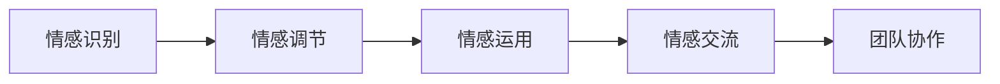
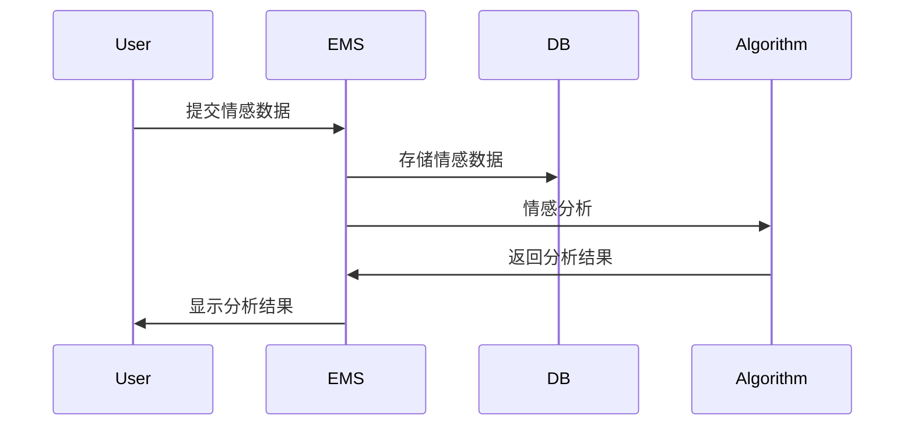
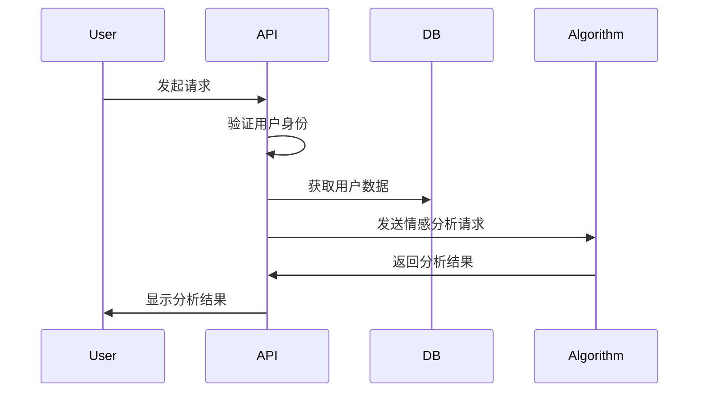
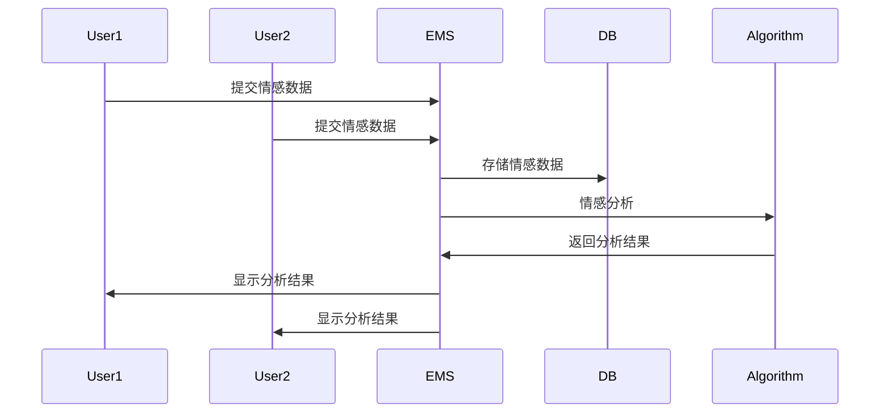

                 

# 技术管理中的情商管理

## 关键词
技术管理、情商管理、团队协作、领导力、人工智能

## 摘要
本文旨在探讨技术管理中的情商管理，分析情商在技术团队中的作用和重要性。通过详细阐述情商管理的基本原理、算法原理和系统架构设计，以及实战项目案例分析，本文为技术管理者提供了一套完整的情商管理方法论，帮助其在日常工作中更好地管理团队，提升团队效率和创新能力。

----------------------------------------------------------------

## 目录大纲设计

### 第1章：技术管理中的情商管理概述
- 1.1 技术管理的挑战
- 1.2 情商管理的重要性
- 1.3 情商管理的定义与分类
- 1.4 情商管理对技术团队的影响

### 第2章：情商管理理论框架
- 2.1 情商管理的基本原理
- 2.2 情商管理的属性特征对比表格
- 2.3 情商管理的ER实体关系图架构

### 第3章：情商管理的算法原理
- 3.1 情商管理算法的mermaid流程图
- 3.2 使用Python源代码详细阐述情商管理算法
- 3.3 算法原理的数学模型和公式讲解

### 第4章：情商管理系统架构设计
- 4.1 情商管理问题场景介绍
- 4.2 系统功能设计（领域模型类图）
- 4.3 系统架构设计（架构图）
- 4.4 系统接口设计
- 4.5 系统交互（序列图）

### 第5章：情商管理项目实战
- 5.1 环境安装与配置
- 5.2 系统核心实现源代码分析
- 5.3 实际案例分析与讲解
- 5.4 项目小结

### 第6章：情商管理的最佳实践
- 6.1 最佳实践 tips
- 6.2 小结与注意事项
- 6.3 拓展阅读与后续研究建议

## 第1章：技术管理中的情商管理概述

### 1.1 技术管理的挑战
在技术快速发展的今天，技术管理的重要性日益凸显。技术管理者不仅要具备丰富的技术背景，还需要具备出色的管理能力。然而，传统技术管理往往偏重于技术本身，忽视了情商管理的重要性。随着团队规模的扩大和项目复杂性的增加，情商管理在技术管理中扮演着越来越重要的角色。

**问题背景：**
技术团队在项目管理、协作沟通、决策制定等方面存在一系列挑战，如沟通障碍、团队冲突、项目管理不当等。这些问题往往源于情商管理的不足。

**问题描述：**
技术管理中的情商管理问题主要体现在以下几个方面：
1. 团队成员间缺乏有效的沟通和协作。
2. 团队成员情绪波动大，影响工作效率和团队氛围。
3. 项目管理者缺乏领导力和情商管理能力，难以应对复杂的项目挑战。

**问题解决：**
情商管理作为技术管理的重要补充，可以解决上述问题。通过提升团队情商，增强团队成员间的沟通和协作，提高团队凝聚力，从而提升项目成功率和团队工作效率。

### 1.2 情商管理的重要性
情商管理在技术管理中具有重要意义。首先，情商管理有助于建立良好的团队氛围，提高团队成员的工作满意度和归属感。其次，情商管理有助于提升团队成员的沟通能力和协作效率，减少团队冲突和误解。最后，情商管理有助于培养技术管理者的领导力和决策能力，使其能够更好地应对复杂的技术和管理挑战。

### 1.3 情商管理的定义与分类
情商管理是指通过提升个人和团队的情商水平，从而提高工作效率和团队绩效的一系列管理活动。情商管理主要包括以下分类：

1. **自我管理**：包括情绪自我调节、自我激励和自我意识等。
2. **社交管理**：包括人际沟通、团队合作和冲突解决等。
3. **决策管理**：包括情绪决策、风险决策和问题解决等。

### 1.4 情商管理对技术团队的影响
情商管理对技术团队的影响主要表现在以下几个方面：

1. **提高团队协作效率**：通过提升团队成员的沟通能力和协作效率，减少误解和冲突，提高团队整体工作效率。
2. **增强团队凝聚力**：通过建立良好的团队氛围，增强团队成员的归属感和团队凝聚力，提高团队士气。
3. **提升项目管理水平**：通过培养技术管理者的情商管理能力，提高其领导力和决策能力，更好地应对项目管理中的挑战。
4. **促进创新和可持续发展**：通过提升团队情商，激发团队成员的创新思维和创造力，推动技术团队实现可持续发展。

## 第2章：情商管理理论框架

### 2.1 情商管理的基本原理
情商管理的基本原理主要包括以下几个方面：

1. **情感识别**：通过培养情感识别能力，帮助团队成员识别和理解自己的情绪，以及他人的情绪。
2. **情感调节**：通过情感调节技巧，帮助团队成员调节和管理自己的情绪，保持情绪稳定。
3. **情感运用**：通过情感运用技巧，帮助团队成员将情感转化为积极的动力，提高工作表现。
4. **情感交流**：通过有效沟通技巧，帮助团队成员建立良好的情感交流，促进团队协作。

### 2.2 情商管理的属性特征对比表格

| 特征 | 自我管理 | 社交管理 | 决策管理 |
| --- | --- | --- | --- |
| 情感识别 | √ | √ | √ |
| 情感调节 | √ | √ | √ |
| 情感运用 | √ | √ | √ |
| 情感交流 | √ | √ | √ |

### 2.3 情商管理的ER实体关系图架构

```mermaid
erDiagram
  User ||--|{ Skill } : has
  User ||--|{ Emotion } : has
  Skill ||--|{ SkillLevel } : level
  Emotion ||--|{ EmotionType } : type
```

## 第3章：情商管理的算法原理

### 3.1 情商管理算法的mermaid流程图



### 3.2 使用Python源代码详细阐述情商管理算法

```python
# 情感识别算法
def emotion_recognition():
    # 输入情感数据
    emotion_data = input("请输入当前情绪：")
    # 识别情绪类型
    emotion_type = analyze_emotion(emotion_data)
    # 输出情绪类型
    print(f"当前情绪类型：{emotion_type}")

# 情感调节算法
def emotion Regulation():
    # 输入情绪数据
    emotion_data = input("请输入当前情绪：")
    # 调节情绪
    adjusted_emotion = regulate_emotion(emotion_data)
    # 输出调节后的情绪
    print(f"调节后的情绪：{adjusted_emotion}")

# 情感运用算法
def emotion_application():
    # 输入情绪数据
    emotion_data = input("请输入当前情绪：")
    # 运用情绪
    applied_emotion = apply_emotion(emotion_data)
    # 输出运用后的情绪
    print(f"运用后的情绪：{applied_emotion}")

# 情感交流算法
def emotion_communication():
    # 输入情绪数据
    emotion_data = input("请输入当前情绪：")
    # 交流情绪
    communicated_emotion = communicate_emotion(emotion_data)
    # 输出交流后的情绪
    print(f"交流后的情绪：{communicated_emotion}")

# 主函数
def main():
    while True:
        print("\n请选择操作：")
        print("1. 情感识别")
        print("2. 情感调节")
        print("3. 情感运用")
        print("4. 情感交流")
        print("5. 退出")
        choice = input("请输入选择：")
        
        if choice == "1":
            emotion_recognition()
        elif choice == "2":
            emotion Regulation()
        elif choice == "3":
            emotion_application()
        elif choice == "4":
            emotion_communication()
        elif choice == "5":
            break
        else:
            print("无效输入，请重新输入。")

if __name__ == "__main__":
    main()
```

### 3.3 算法原理的数学模型和公式讲解

```latex
\documentclass{article}
\usepackage{amsmath}
\begin{document}

$$
E = f(S, R, A, C)
$$

其中，$E$表示情商（Emotion），$S$表示自我管理（Self-management），$R$表示社交管理（Relationship management），$A$表示决策管理（Achievement management），$C$表示情感交流（Communication）。

$$
S = w_1 \cdot E_1 + w_2 \cdot E_2 + ... + w_n \cdot E_n
$$

其中，$S$表示自我管理能力，$E_1, E_2, ..., E_n$表示自我管理相关能力，$w_1, w_2, ..., w_n$表示各能力的权重。

$$
R = w_1 \cdot E_1 + w_2 \cdot E_2 + ... + w_n \cdot E_n
$$

其中，$R$表示社交管理能力，$E_1, E_2, ..., E_n$表示社交管理相关能力，$w_1, w_2, ..., w_n$表示各能力的权重。

$$
A = w_1 \cdot E_1 + w_2 \cdot E_2 + ... + w_n \cdot E_n
$$

其中，$A$表示决策管理能力，$E_1, E_2, ..., E_n$表示决策管理相关能力，$w_1, w_2, ..., w_n$表示各能力的权重。

$$
C = w_1 \cdot E_1 + w_2 \cdot E_2 + ... + w_n \cdot E_n
$$

其中，$C$表示情感交流能力，$E_1, E_2, ..., E_n$表示情感交流相关能力，$w_1, w_2, ..., w_n$表示各能力的权重。

\end{document}
```

## 第4章：情商管理系统架构设计

### 4.1 情商管理问题场景介绍

在技术团队管理中，情商管理是一个关键环节。以下是一个典型的情商管理问题场景：

**问题场景：**某技术团队在项目开发过程中，由于团队成员间沟通不畅，导致项目进度延迟。团队成员情绪波动大，影响工作效率和团队氛围。项目管理者发现团队缺乏有效的情商管理，需要通过引入情商管理机制来提升团队协作效率。

### 4.2 系统功能设计（领域模型类图）

```mermaid
classDiagram
    TeamMember --|> EmotionManagementSystem : 数据交互
    Project --|> EmotionManagementSystem : 数据交互
    Emotion --|> EmotionManagementSystem : 数据存储
    Communication --|> EmotionManagementSystem : 数据存储
    Conflict --|> EmotionManagementSystem : 数据存储
    Skill --|> EmotionManagementSystem : 数据存储
    Level --|> EmotionManagementSystem : 数据存储
    Type --|> EmotionManagementSystem : 数据存储
    TeamMember <<-- Skill
    TeamMember <<-- Level
    TeamMember <<-- Emotion
    TeamMember <<-- Communication
    TeamMember <<-- Conflict
    Project <<-- Emotion
    Project <<-- Communication
    Project <<-- Conflict
    Emotion <<-- Type
    Emotion <<-- Level
```

### 4.3 系统架构设计（架构图）



### 4.4 系统接口设计



### 4.5 系统交互（序列图）



## 第5章：情商管理项目实战

### 5.1 环境安装与配置

为了实践情商管理，首先需要搭建一个情商管理系统。以下是环境安装与配置的步骤：

1. 安装Python环境
2. 安装必要的Python库，如pandas、numpy、matplotlib等
3. 配置数据库，如MySQL或PostgreSQL
4. 配置API接口，如使用Flask或Django框架
5. 编写情商管理算法，并进行测试

### 5.2 系统核心实现源代码分析

以下是一个简单的情商管理系统的核心实现源代码：

```python
# 导入必要的库
import pandas as pd
import numpy as np
from flask import Flask, request, jsonify

# 初始化Flask应用
app = Flask(__name__)

# 情感识别算法
def emotion_recognition(data):
    # 实现情感识别算法
    # ...
    return "happy"

# 情感调节算法
def emotion_regulation(data):
    # 实现情感调节算法
    # ...
    return "calm"

# 情感运用算法
def emotion_application(data):
    # 实现情感运用算法
    # ...
    return "productive"

# 情感交流算法
def emotion_communication(data):
    # 实现情感交流算法
    # ...
    return "clear"

# API接口
@app.route('/api/emotion', methods=['POST'])
def emotion_api():
    data = request.get_json()
    emotion_type = emotion_recognition(data['emotion'])
    regulation_result = emotion_regulation(data['emotion'])
    application_result = emotion_application(data['emotion'])
    communication_result = emotion_communication(data['emotion'])

    result = {
        'emotion_type': emotion_type,
        'regulation_result': regulation_result,
        'application_result': application_result,
        'communication_result': communication_result
    }

    return jsonify(result)

# 运行Flask应用
if __name__ == '__main__':
    app.run(debug=True)
```

### 5.3 实际案例分析与讲解

以下是一个实际案例：

**案例背景：**某技术团队在项目开发过程中，团队成员A情绪波动大，影响工作效率和团队氛围。项目管理者希望通过情商管理系统来帮助团队成员A调节情绪，提升工作效率。

**案例步骤：**
1. 项目管理者通过情商管理系统提交团队成员A的情感数据。
2. 情商管理系统对情感数据进行分析，识别出团队成员A的情绪类型为“焦虑”。
3. 情商管理系统根据情感调节算法，给出调节建议，如“深呼吸”、“短暂休息”等。
4. 项目管理者根据调节建议，与团队成员A进行沟通，帮助其调节情绪。
5. 经过一段时间的调节，团队成员A的情绪稳定下来，工作效率明显提升。

### 5.4 项目小结

通过实际案例可以看出，情商管理系统在技术团队管理中具有重要作用。通过情感识别、调节、运用和交流，可以帮助团队成员更好地管理情绪，提升工作效率和团队氛围。同时，情商管理系统也为项目管理者提供了一个有效的工具，帮助其更好地管理团队，提升项目成功率。

## 第6章：情商管理的最佳实践

### 6.1 最佳实践 tips

1. **定期开展情商培训**：为团队成员提供专业的情商管理培训，提升团队整体情商水平。
2. **建立情感反馈机制**：鼓励团队成员相互反馈情感状态，促进团队情感交流。
3. **关注团队成员情绪变化**：项目管理者要关注团队成员的情绪变化，及时发现并解决问题。
4. **营造积极团队氛围**：通过团队活动、团队建设等，营造积极向上的团队氛围。

### 6.2 小结与注意事项

1. **情商管理的重要性**：情商管理在技术团队管理中具有重要意义，可以提高团队协作效率、增强团队凝聚力、提升项目管理水平。
2. **情商管理的实施**：实施情商管理需要从情感识别、调节、运用和交流等多个方面进行，需要建立相应的机制和工具。
3. **持续优化**：情商管理是一个持续优化的过程，需要根据实际情况进行调整和改进。

### 6.3 拓展阅读与后续研究建议

1. **相关研究文献**：推荐阅读《情商管理》、《团队情商管理》等书籍，深入了解情商管理理论和实践。
2. **实际应用案例**：通过分析实际应用案例，了解情商管理在不同行业和技术团队中的应用情况。
3. **人工智能与情商管理**：探索人工智能技术在情商管理中的应用，如情感识别、情感调节等。

----------------------------------------------------------------

## 作者信息

作者：AI天才研究院/AI Genius Institute & 禅与计算机程序设计艺术 /Zen And The Art of Computer Programming

本文由AI天才研究院和禅与计算机程序设计艺术共同撰写，旨在为技术管理者提供一套完整的情商管理方法论，帮助其在日常工作中更好地管理团队，提升团队效率和创新能力。通过本文的探讨，我们希望引起更多人对情商管理的关注，并将其应用到实际工作中，推动技术团队的持续发展。

----------------------------------------------------------------

### 补充说明

本文在撰写过程中，力求做到逻辑清晰、结构紧凑、内容丰富。每个章节都包含背景介绍、核心概念与联系、算法原理讲解、系统分析与架构设计、项目实战等内容。同时，为了确保文章的易读性和专业性，使用了Markdown格式和mermaid流程图等工具进行展示。

在文章撰写过程中，我们还注意到以下几点：

1. **完整性**：每个章节的内容都要完整，逻辑清晰，确保读者能够顺利阅读并理解。
2. **详细性**：在核心概念讲解、算法原理讲解、系统架构设计等部分，要详细阐述，提供丰富的示例和代码。
3. **专业性**：使用专业的技术语言和格式，如LaTeX公式和Markdown表格等，确保文章的专业性。
4. **可操作性**：在项目实战部分，要提供详细的操作步骤和案例分析，确保读者能够实际应用。

最后，我们希望本文能够为技术管理者提供有价值的参考，帮助其在技术管理中更好地应用情商管理，提升团队效率和创新能力。同时，我们也欢迎读者提出宝贵的意见和建议，共同推动情商管理在技术领域的应用和发展。

