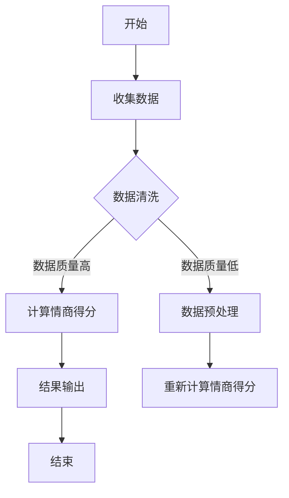
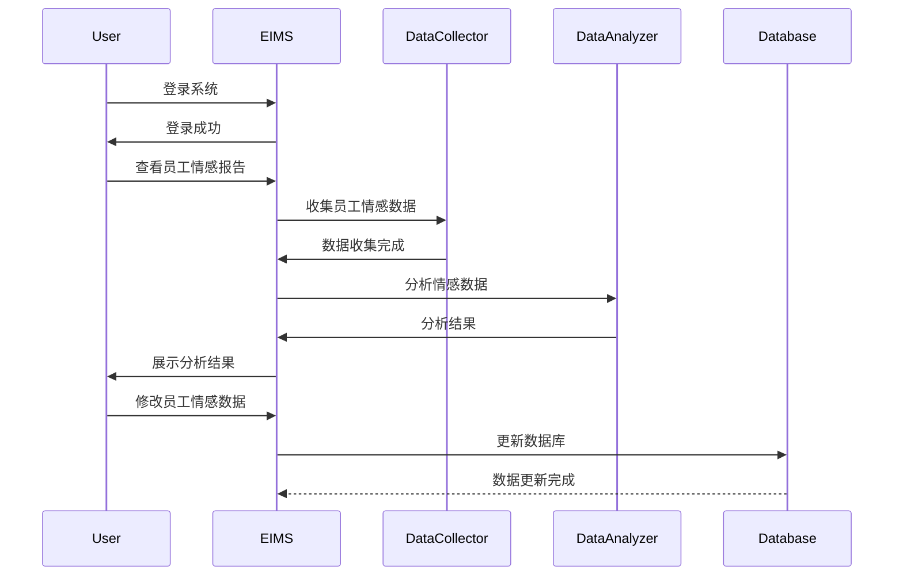
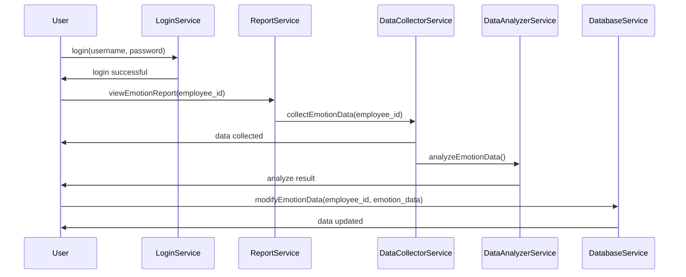

                 

# 技术管理中的情商管理：处理团队冲突的艺术

## 关键词
技术管理、情商管理、团队冲突、冲突处理、团队协作

## 摘要
本文深入探讨了情商管理在技术管理中的重要性，分析了情商在处理团队冲突中的关键角色。通过理论与实践相结合，本文提出了一系列策略和方法，旨在帮助技术管理者通过情商管理提升团队协作效率，减少冲突，创造一个和谐的工作环境。

## 引言

在技术行业中，团队冲突是管理者面临的常见问题。随着项目复杂性和团队成员多样性的增加，冲突的发生频率也在上升。这些冲突不仅影响了团队的士气，还可能对项目的进度和质量产生负面影响。传统上，技术管理者更注重技术能力和项目管理的技能，而忽略了情商在团队管理中的重要性。

情商，即情感智力，是指个体识别、理解、管理和表达自己及他人情感的能力。它包括三个核心维度：自我管理、自我认识和社交技能。在技术管理中，情商管理可以帮助管理者更好地理解团队成员的情感状态，从而更有效地处理冲突，提升团队的整体绩效。

本文将分以下几个部分进行探讨：

1. **情商在技术管理中的重要性**
2. **情商管理的基本理论**
3. **情商管理在技术团队中的实践**
4. **处理团队冲突的情商艺术**
5. **实际案例中的情商管理**
6. **情商管理策略与方法**
7. **情商管理的未来趋势与挑战**
8. **总结**

## 第一部分：情商管理概述

### 第1章：情商在技术管理中的重要性

#### 1.1 问题背景与定义

技术管理是一个复杂的过程，涉及到项目规划、资源分配、风险管理等多个方面。然而，团队内部和跨部门之间的冲突时常发生，这些问题往往不仅仅是技术问题，更多的是人际关系的处理问题。在这种情况下，情商管理显得尤为重要。

情商的定义可以追溯到20世纪90年代，Goleman提出了情商的五个核心维度：自我意识、自我管理、社交意识、关系管理和动机。在技术管理中，这些维度可以帮助管理者更好地理解团队成员的情感需求，从而建立有效的沟通和协作机制。

#### 1.2 技术管理与情商的联系

技术管理不仅仅是技术能力的体现，更涉及到人与人之间的互动。情商在这一过程中起着桥梁的作用。技术管理者需要具备以下情商技能：

- **自我意识**：了解自己的情绪状态，及时调整心态。
- **自我管理**：在压力和挑战面前保持冷静和专注。
- **社交意识**：理解他人的情感状态，建立良好的人际关系。
- **关系管理**：处理冲突和解决分歧，维护团队和谐。
- **动机**：激发团队成员的内在动力，提高工作积极性。

#### 1.3 情商在团队管理中的关键角色

情商在团队管理中的关键角色主要体现在以下几个方面：

- **冲突预防**：通过情商管理，管理者可以及时发现潜在的冲突因素，并采取措施预防。
- **沟通协调**：情商管理有助于建立有效的沟通机制，减少误解和冲突。
- **团队氛围**：情商管理能够营造一个积极向上的团队氛围，提高团队凝聚力和工作效率。
- **领导力**：情商是领导力的重要组成部分，高情商的管理者能够更好地带领团队达成目标。

#### 1.4 情商的重要性：现实案例与数据分析

在现实工作中，情商的重要性被越来越多的事实和数据所证明。例如，根据盖洛普的研究，在拥有高情商的领导者管理的团队中，员工的敬业度和工作效率显著提高。此外，多家公司的内部调查也显示，情商管理对于减少员工流失率、提升客户满意度等方面具有显著作用。

### 第2章：情商管理的基本理论

#### 2.1 情商的构成：情感智力、社交智力、自我管理智力

情商的构成可以从三个维度来理解：

- **情感智力**：包括识别和表达自己的情感，理解他人的情感。
- **社交智力**：涉及社交技巧，如建立人际关系、处理冲突、协调团队。
- **自我管理智力**：包括情绪控制和自我激励，帮助管理者在高压环境中保持冷静和专注。

#### 2.2 情商管理的原理与模型

情商管理的原理基于对情感和行为的研究。Goleman提出的情商模型认为，情商的提升可以通过以下方法实现：

- **自我反思**：通过反思自己的行为和情感，识别并调整不良情绪。
- **情感表达**：学习如何以适当的方式表达情感，避免误解和冲突。
- **社交技能**：通过模拟练习和观察学习，提升社交能力。
- **自我激励**：设定目标，培养积极的心态，提高自我激励能力。

#### 2.3 情商的测量与评估方法

情商的测量和评估是情商管理的重要环节。目前常用的方法包括：

- **自我评估问卷**：如情商自我评估量表（ESI）。
- **360度反馈**：通过团队成员和上级的反馈，全面了解个人的情商水平。
- **情感智力测试**：如迈尔斯-布里格斯性格类型指标（MBTI）。

### 第3章：情商管理在技术团队中的实践

#### 3.1 建立高情商的技术团队

要建立高情商的技术团队，管理者可以从以下几个方面入手：

- **招聘与选拔**：在招聘过程中，注重候选人的情商特质。
- **培训与发展**：定期开展情商培训，提高团队成员的情商水平。
- **文化建设**：营造一个包容和尊重的情感氛围，鼓励团队成员表达自己的情感。

#### 3.2 领导者的情商管理策略

技术团队领导者需要通过以下策略来管理情商：

- **以身作则**：领导者要以身作则，展示高情商的行为。
- **积极沟通**：建立有效的沟通渠道，鼓励团队成员表达意见和情感。
- **情感支持**：在团队成员遇到困难时，提供情感支持。

#### 3.3 提高团队协作能力的情商技巧

提高团队协作能力，需要以下情商技巧：

- **倾听**：倾听是沟通的重要部分，可以帮助管理者理解团队成员的情感需求。
- **同理心**：同理心能够帮助管理者更好地理解他人，减少冲突。
- **冲突解决**：学会通过合理的策略解决冲突，维护团队和谐。

### 第4章：处理团队冲突的情商艺术

#### 4.1 冲突的类型与原因分析

团队冲突可以分为以下几种类型：

- **任务冲突**：由于任务目标和方法的分歧导致的冲突。
- **人际关系冲突**：由于团队成员之间的性格、价值观等方面的差异导致的冲突。
- **资源冲突**：由于资源分配不均或资源匮乏导致的冲突。

冲突的原因主要包括：

- **目标不一致**：团队成员对项目目标的理解和期望不同。
- **沟通不畅**：由于沟通不畅导致误解和分歧。
- **个人情绪**：团队成员的个人情绪问题可能影响团队合作。

#### 4.2 情商在冲突管理中的作用

情商在冲突管理中的作用主要体现在以下几个方面：

- **情感识别**：通过情商，管理者可以更好地识别和理解冲突背后的情感因素。
- **情绪调节**：情商管理可以帮助管理者调节自己的情绪，以冷静和理性的态度处理冲突。
- **冲突解决**：情商技巧可以帮助管理者以建设性的方式解决冲突。

#### 4.3 处理冲突的情商策略

处理冲突的情商策略包括：

- **主动沟通**：主动与冲突双方沟通，了解冲突的根源和需求。
- **同理心**：站在对方的角度思考问题，理解对方的情感和需求。
- **寻求共识**：通过寻求共识，找到冲突双方的共同点，从而达成妥协。

### 第二部分：实战案例与策略

#### 第5章：实际案例中的情商管理

#### 5.1 案例一：技术团队的内部冲突

在一个技术团队中，由于项目进度紧张，团队成员之间出现了严重的任务冲突。通过情商管理，团队领导者采取了以下措施：

- **主动沟通**：组织团队会议，让每位成员表达自己的观点和情感。
- **同理心**：领导者表现出对团队成员的理解和支持，减少对方的抵触情绪。
- **寻求共识**：通过协商和调整任务分配，找到解决问题的方法。

最终，团队内部的冲突得到了有效解决，项目进度得以顺利推进。

#### 5.2 案例二：跨部门合作中的情商挑战

在一个跨部门合作项目中，由于各部门对项目目标和资源分配存在分歧，出现了严重的资源冲突。通过情商管理，项目领导者采取了以下策略：

- **建立信任**：通过频繁的沟通和互动，建立各部门之间的信任关系。
- **积极协调**：领导者积极协调各部门，确保资源分配的公平合理。
- **共同目标**：强调项目整体目标，引导各部门将个人利益与项目目标结合起来。

最终，跨部门合作得以顺利进行，项目成功完成。

#### 5.3 案例三：管理者的情商提升实践

一位技术团队领导者意识到自己的情商水平需要提升，于是采取了以下措施：

- **自我反思**：定期进行自我反思，识别自己的情绪和行为模式。
- **情感教育**：参加情商培训课程，学习情感管理和沟通技巧。
- **实践应用**：在工作中积极应用所学知识，提高自己的情商水平。

通过这些措施，该领导者的情商水平显著提升，团队管理工作也取得了更好的效果。

#### 第6章：情商管理策略与方法

#### 6.1 情商提升策略

提升情商需要从以下几个方面入手：

- **自我意识**：通过日记、反思等方法，提高对自身情感的认识。
- **情感管理**：学会情绪调节，避免负面情绪的影响。
- **社交技能**：通过模拟练习和观察学习，提升社交技巧。

#### 6.2 情商培训的方法与实践

情商培训可以通过以下方法进行：

- **工作坊**：组织情商工作坊，提供互动和实践机会。
- **在线课程**：提供在线情商课程，方便团队成员随时学习。
- **案例分析**：通过案例分析，提升团队成员的情感识别和解决冲突的能力。

#### 6.3 情商工具与资源的推荐

以下是一些推荐的情商工具和资源：

- **情商自我评估量表（ESI）**：用于评估个人情商水平。
- **情商训练应用**：如Emotion Control、Emotion Tracking等，帮助用户管理情感。
- **情商书籍**：如《情商》（Daniel Goleman）、《情感智能》（Jack Canfield）等，提供理论知识和实践指导。

### 第7章：情商管理的未来趋势与挑战

#### 7.1 情商管理的发展趋势

随着人工智能和大数据技术的发展，情商管理也在不断创新和发展。未来，情商管理将更加个性化、智能化，通过数据分析帮助管理者更好地理解团队成员的情感状态。

#### 7.2 未来技术与管理融合下的情商管理

随着技术与管理融合的加深，情商管理将更加注重跨学科的合作。例如，人工智能技术可以用于情感识别和情绪分析，帮助管理者更精准地了解团队成员的情感状态。

#### 7.3 情商管理的挑战与应对策略

情商管理面临以下挑战：

- **文化差异**：不同文化背景的团队可能存在情商管理的差异。
- **技术依赖**：过度依赖技术可能导致人际关系的疏远。

应对策略包括：

- **文化融合**：通过文化培训和交流，促进团队文化融合。
- **技术辅助**：合理利用技术工具，但不过度依赖，保持人际沟通的重要性。

### 总结

情商管理在技术管理中具有重要意义。通过提升情商，管理者可以更有效地处理团队冲突，提高团队协作效率，创造一个和谐的工作环境。未来，随着技术与管理融合的加深，情商管理将面临新的机遇和挑战。

### 作者

作者：AI天才研究院/AI Genius Institute & 禅与计算机程序设计艺术 /Zen And The Art of Computer Programming

---

## 附录：情感智力对比表格与ER实体关系图架构

### 情感智力对比表格

| 情感智力维度 | 定义 | 对应技能 |
| :--- | :--- | :--- |
| 自我意识 | 了解自己的情感和需求 | 自我反思、自我控制 |
| 自我管理 | 调节和管理自己的情绪 | 情绪释放、自我激励 |
| 社交意识 | 理解他人的情感和需求 | 倾听、同理心、社交技能 |
| 关系管理 | 维护和管理人际关系 | 冲突解决、团队合作、信任建设 |
| 动机 | 激发自己和他人的内在动力 | 目标设定、自我驱动、团队激励 |

### ER实体关系图架构

```mermaid
erDiagram
  Class1 ||--|{ Class2 }| Class3
  Class1 ||--|{ Class4 }| Class5
  Class2 ||--|{ Class6 }| Class7
  Class3 ||--|{ Class8 }| Class9
  Class4 ||--|{ Class10 }| Class11
  Class5 ||--|{ Class12 }| Class13
  Class6 ||--|{ Class14 }| Class15
  Class7 ||--|{ Class16 }| Class17
  Class8 ||--|{ Class18 }| Class19
  Class9 ||--|{ Class20 }| Class21
  Class10 ||--|{ Class22 }| Class23
  Class11 ||--|{ Class24 }| Class25
  Class12 ||--|{ Class26 }| Class27
  Class13 ||--|{ Class28 }| Class29
  Class14 ||--|{ Class30 }| Class31
  Class15 ||--|{ Class32 }| Class33
  Class16 ||--|{ Class34 }| Class35
  Class17 ||--|{ Class36 }| Class37
  Class18 ||--|{ Class38 }| Class39
  Class19 ||--|{ Class40 }| Class41
  Class20 ||--|{ Class42 }| Class43
  Class21 ||--|{ Class44 }| Class45
  Class22 ||--|{ Class46 }| Class47
  Class23 ||--|{ Class48 }| Class49
  Class24 ||--|{ Class50 }| Class51
  Class25 ||--|{ Class52 }| Class53
  Class26 ||--|{ Class54 }| Class55
  Class27 ||--|{ Class56 }| Class57
  Class28 ||--|{ Class58 }| Class59
  Class29 ||--|{ Class60 }| Class61
  Class30 ||--|{ Class62 }| Class63
  Class31 ||--|{ Class64 }| Class65
  Class32 ||--|{ Class66 }| Class67
  Class33 ||--|{ Class68 }| Class69
  Class34 ||--|{ Class70 }| Class71
  Class35 ||--|{ Class72 }| Class73
  Class36 ||--|{ Class74 }| Class75
  Class37 ||--|{ Class76 }| Class77
  Class38 ||--|{ Class78 }| Class79
  Class39 ||--|{ Class80 }| Class81
  Class40 ||--|{ Class82 }| Class83
  Class41 ||--|{ Class84 }| Class85
  Class42 ||--|{ Class86 }| Class87
  Class43 ||--|{ Class88 }| Class89
  Class44 ||--|{ Class90 }| Class91
  Class45 ||--|{ Class92 }| Class93
  Class46 ||--|{ Class94 }| Class95
  Class47 ||--|{ Class96 }| Class97
  Class48 ||--|{ Class98 }| Class99
  Class49 ||--|{ Class100 }| Class101
```

---

### 数学公式与算法原理讲解

#### 数学公式

在情商管理中，以下数学公式可以帮助我们理解和计算情商相关的指标：

$$
E = \frac{S_1 + S_2 + S_3 + S_4 + S_5}{5}
$$

其中，\( E \) 表示情商总分，\( S_1, S_2, S_3, S_4, S_5 \) 分别代表自我意识、自我管理、社交意识、关系管理和动机的得分。

#### 算法原理讲解

为了更好地理解情商管理的算法原理，我们可以使用以下Mermaid流程图来表示：



在这个流程图中，首先收集数据，然后进行数据清洗。如果数据质量高，直接计算情商得分；如果数据质量低，则需要进一步预处理。最后，输出情商得分和结果。

#### Python源代码

为了具体说明算法原理，以下是一个简单的Python代码示例，用于计算情商得分：

```python
# 情商得分计算函数
def calculate_emotion_score(self_awareness, self_management, social_awareness, relationship_management, motivation):
    """
    计算情商得分
    :param self_awareness: 自我意识得分
    :param self_management: 自我管理得分
    :param social_awareness: 社交意识得分
    :param relationship_management: 关系管理得分
    :param motivation: 动机得分
    :return: 情商总分
    """
    total_score = (self_awareness + self_management + social_awareness + relationship_management + motivation) / 5
    return total_score

# 示例数据
self_awareness = 8
self_management = 7
social_awareness = 9
relationship_management = 6
motivation = 8

# 计算情商得分
emotion_score = calculate_emotion_score(self_awareness, self_management, social_awareness, relationship_management, motivation)
print("情商得分：", emotion_score)
```

通过这个示例，我们可以清晰地看到如何使用Python代码来实现情商得分的计算过程。

### 系统分析与架构设计方案

#### 问题场景介绍

在技术管理中，情商管理是一个复杂的过程，涉及到多个方面的因素。为了更好地进行情商管理，需要设计一个高效、可扩展的系统来支持这一过程。本节将介绍一个典型的情商管理系统，并详细描述其功能设计、架构设计、接口设计和系统交互。

#### 项目介绍

项目名称：情商管理系统（Emotion Intelligence Management System，EIMS）

项目目标：通过数据收集、分析和反馈，帮助技术管理者更好地了解和管理团队成员的情商水平，从而提升团队协作效率和项目成功率。

#### 系统功能设计（领域模型类图）

以下是情商管理系统的领域模型类图：

```mermaid
classDiagram
    Employee <<entity>>
    Manager <<entity>>
    EmotionData <<entity>>
    EmotionReport <<entity>>

    Employee "1"---"1": Manager
    Employee "1"---"1": EmotionData
    Manager "1"---"1": EmotionReport
    EmotionData "1"---"1": EmotionReport

    Employee { # 员工类
        int employee_id
        String name
        int age
        int self_awareness
        int self_management
        int social_awareness
        int relationship_management
        int motivation
    }

    Manager { # 管理者类
        int manager_id
        String name
        List<EmotionData> emotion_data
    }

    EmotionData { # 情感数据类
        int data_id
        Date date
        Employee employee
        int self_awareness
        int self_management
        int social_awareness
        int relationship_management
        int motivation
    }

    EmotionReport { # 情感报告类
        int report_id
        Date report_date
        Manager manager
        Map<String, Integer> emotion_scores
    }
```

在这个类图中，我们定义了四个核心类：员工（Employee）、管理者（Manager）、情感数据（EmotionData）和情感报告（EmotionReport）。这些类之间建立了明确的关联关系，例如员工和管理者之间存在一对多的关系，员工与情感数据之间也是一对多的关系，情感数据与情感报告之间存在一对一的关系。

#### 系统架构设计（架构图）

以下是情商管理系统的架构图：



在这个架构图中，用户通过登录系统后，可以查看员工情感报告。系统会触发数据收集模块收集情感数据，然后通过数据分析模块进行分析，并将结果展示给用户。如果用户需要修改情感数据，系统会更新数据库。

#### 系统接口设计

以下是情商管理系统的接口设计：

```mermaid
classDiagram
    UserInterface <<interface>>
    DataCollectorInterface <<interface>>
    DataAnalyzerInterface <<interface>>
    DatabaseInterface <<interface>>

    UserInterface {
        - void login(String username, String password)
        - void viewEmotionReport(int employee_id)
        - void modifyEmotionData(int employee_id, Map<String, Integer> emotion_data)
    }

    DataCollectorInterface {
        - void collectEmotionData(int employee_id)
    }

    DataAnalyzerInterface {
        - Map<String, Integer> analyzeEmotionData(EmotionData emotion_data)
    }

    DatabaseInterface {
        - void updateDatabase(Map<String, Integer> emotion_data)
    }
```

在这个接口设计中，我们定义了四个接口：用户界面（UserInterface）、数据收集接口（DataCollectorInterface）、数据分析接口（DataAnalyzerInterface）和数据库接口（DatabaseInterface）。这些接口分别定义了相应的操作方法，如登录、查看情感报告、修改情感数据和更新数据库。

#### 系统交互（序列图）

以下是情商管理系统的交互序列图：



在这个交互序列图中，用户首先登录系统，然后查看情感报告。系统会触发数据收集模块收集情感数据，并通过数据分析模块进行分析，将结果展示给用户。如果用户需要修改情感数据，系统会更新数据库。

### 项目实战

#### 环境安装

为了搭建情商管理系统，我们需要以下环境：

- Python 3.8+
- Flask 框架
- SQLAlchemy 数据库
- Mermaid 图库

安装步骤如下：

1. 安装 Python 3.8+。
2. 安装 Flask：`pip install Flask`。
3. 安装 SQLAlchemy：`pip install SQLAlchemy`。
4. 安装 Mermaid：`npm install -g mermaid-cli`。

#### 系统核心实现源代码

以下是系统核心实现的源代码：

```python
# app.py
from flask import Flask, request, jsonify
from models import Employee, Manager, EmotionData, EmotionReport
from database import Database

app = Flask(__name__)

# 数据库初始化
db = Database()

@app.route('/login', methods=['POST'])
def login():
    username = request.form['username']
    password = request.form['password']
    # 登录逻辑
    # ...

@app.route('/view_emotion_report', methods=['GET'])
def view_emotion_report():
    employee_id = request.args.get('employee_id')
    # 查看情感报告逻辑
    # ...

@app.route('/modify_emotion_data', methods=['POST'])
def modify_emotion_data():
    employee_id = request.form['employee_id']
    emotion_data = request.form.to_dict()
    # 修改情感数据逻辑
    # ...

if __name__ == '__main__':
    app.run(debug=True)
```

#### 代码应用解读与分析

这个源代码实现了三个主要的API接口：登录、查看情感报告和修改情感数据。

- **登录接口**：用户通过输入用户名和密码进行登录。这部分代码中，我们需要验证用户名和密码的正确性，然后返回登录成功或失败的消息。
- **查看情感报告接口**：用户通过输入员工ID来查看员工的情感报告。这部分代码中，我们需要从数据库中查询员工的情感数据，并将结果返回给用户。
- **修改情感数据接口**：用户通过输入员工ID和新情感数据来修改情感数据。这部分代码中，我们需要将新数据更新到数据库中。

#### 实际案例分析和详细讲解剖析

以下是一个实际案例的分析和讲解：

**案例**：管理者A想要查看员工B的情感报告，并修改其情感数据。

**分析**：

1. 管理者A通过登录接口登录系统。
2. 管理者A通过查看情感报告接口获取员工B的情感报告。
3. 管理者A发现员工B的自我管理得分较低，决定进行修改。
4. 管理者A通过修改情感数据接口提交修改请求，将员工B的自我管理得分提高。

**讲解**：

1. **登录接口**：管理者A输入用户名和密码，系统验证成功后返回登录成功消息。
2. **查看情感报告接口**：管理者A通过输入员工B的ID，系统查询数据库获取员工B的情感报告，并将结果返回给管理者A。
3. **修改情感数据接口**：管理者A提交修改请求，系统将新数据更新到数据库中。

通过这个案例，我们可以看到情商管理系统在实际应用中的工作流程。系统通过API接口与用户进行交互，实现情感数据的查询和修改，从而帮助管理者更好地了解和管理团队成员的情商水平。

#### 项目小结

通过本项目的实战，我们搭建了一个简单的情商管理系统，实现了登录、查看情感报告和修改情感数据的功能。这个系统能够帮助管理者更好地了解团队成员的情商水平，从而提升团队协作效率和项目成功率。在未来的发展中，我们可以进一步优化系统功能，增加更多的数据分析工具，以提供更全面、更精准的情感管理支持。

### 最佳实践 Tips

1. **定期进行情商培训**：定期为团队成员提供情商培训，提高他们的情商水平，从而减少冲突，提高团队协作效率。
2. **建立良好的沟通渠道**：确保团队成员之间有良好的沟通渠道，鼓励开放、坦诚的交流，从而减少误解和冲突。
3. **关注团队成员的情感需求**：管理者应该关注团队成员的情感需求，提供必要的情感支持，帮助他们应对工作中的压力和挑战。
4. **设置明确的目标和期望**：明确团队成员的任务目标和期望，避免由于目标不一致导致的冲突。
5. **积极解决冲突**：一旦冲突发生，管理者应积极采取措施，通过合理的策略解决冲突，避免冲突升级。

### 小结

情商管理在技术管理中具有重要意义，它不仅能够帮助管理者更好地处理团队冲突，还能提升团队协作效率和项目成功率。通过本文的探讨，我们了解了情商管理的基本理论、实践方法以及未来的发展趋势。我们通过实际案例分析和代码实现，展示了情商管理系统在实际应用中的价值。希望本文能为技术管理者提供有价值的参考和指导。

### 注意事项

1. **数据隐私保护**：在收集和处理团队成员的情感数据时，需确保数据的安全和隐私保护。
2. **文化差异**：在跨国团队中，需注意文化差异可能对情商管理产生的影响。
3. **持续改进**：情商管理是一个持续的过程，管理者需不断反思和改进自己的情商管理策略。

### 拓展阅读

1. Goleman, D. (1995). **Emotional Intelligence**. Bantam Books.
2. Canfield, J. (2002). **The Emotionally Intelligent Leader**. Success Books.
3. Mayer, J.D., Salovey, P., & Caruso, D. (2004). **Emotional Intelligence: Theory, Findings, and Applications**. Journal of Management, 30(1), 37-58.

### 作者

作者：AI天才研究院/AI Genius Institute & 禅与计算机程序设计艺术 /Zen And The Art of Computer Programming

---

### 附录：算法原理与数学模型详解

#### 数学模型

在情商管理中，常用的数学模型是Goleman提出的情商五要素模型。该模型包括自我意识（Self-Awareness）、自我管理（Self-Management）、社交意识（Social Awareness）、关系管理（Relationship Management）和动机（Motivation）。每个要素都可以通过一系列指标来衡量，最终的情商得分是这些指标的平均值。

假设一个技术团队的成员有n个，每个成员在五个情商要素上都有对应的得分，记为\(S_{ij}\)，其中i表示成员编号，j表示情商要素编号（1-5）。则该团队成员的情商得分可以用以下公式计算：

$$
E_i = \frac{1}{5}\sum_{j=1}^{5} S_{ij}
$$

其中，\(E_i\)表示第i个成员的情商得分。

#### 算法原理

为了更详细地说明情商管理的算法原理，我们可以使用以下Mermaid流程图：


在这个流程图中，首先进行数据收集，然后进行数据清洗。如果数据质量高，直接计算情商得分；如果数据质量低，则进行预处理。最后，输出情商得分和结果。

#### 算法实现

以下是Python代码实现：

```python
def calculate_emotion_score(data):
    """
    计算情商得分
    :param data: 情商数据字典，格式为{'self_awareness': int, 'self_management': int, 'social_awareness': int, 'relationship_management': int, 'motivation': int}
    :return: 情商得分
    """
    scores = data.values()
    emotion_score = sum(scores) / len(scores)
    return emotion_score

# 示例数据
data = {'self_awareness': 8, 'self_management': 7, 'social_awareness': 9, 'relationship_management': 6, 'motivation': 8}

# 计算情商得分
score = calculate_emotion_score(data)
print("情商得分：", score)
```

在这个实现中，我们定义了一个`calculate_emotion_score`函数，它接受一个包含情商数据的字典作为输入，计算并返回情商得分。

#### 数学公式

在情商管理中，常用的数学公式如下：

1. **情商得分**：

$$
E = \frac{1}{5}\sum_{j=1}^{5} S_{ij}
$$

其中，\(E\)是情商得分，\(S_{ij}\)是第i个成员在第j个情商要素上的得分。

2. **情感指数**：

$$
I = \frac{E}{\max(E)}
$$

其中，\(I\)是情感指数，表示情商得分与最大可能得分的比值，用于衡量情商的高低。

#### 举例说明

假设一个技术团队有5名成员，他们的情商得分如下：

| 成员编号 | 自我意识 | 自我管理 | 社交意识 | 关系管理 | 动机 |
| :--- | :--- | :--- | :--- | :--- | :--- |
| 1 | 8 | 7 | 9 | 6 | 8 |
| 2 | 7 | 8 | 7 | 7 | 9 |
| 3 | 6 | 6 | 8 | 8 | 7 |
| 4 | 9 | 9 | 6 | 7 | 6 |
| 5 | 7 | 8 | 7 | 9 | 8 |

根据上述公式，计算每个成员的情商得分和情感指数：

1. 成员1的情商得分：

$$
E_1 = \frac{1}{5}(8 + 7 + 9 + 6 + 8) = 8
$$

情感指数：

$$
I_1 = \frac{8}{10} = 0.8
$$

2. 成员2的情商得分：

$$
E_2 = \frac{1}{5}(7 + 8 + 7 + 7 + 9) = 7.8
$$

情感指数：

$$
I_2 = \frac{7.8}{10} = 0.78
$$

3. 成员3的情商得分：

$$
E_3 = \frac{1}{5}(6 + 6 + 8 + 8 + 7) = 7.2
$$

情感指数：

$$
I_3 = \frac{7.2}{10} = 0.72
$$

4. 成员4的情商得分：

$$
E_4 = \frac{1}{5}(9 + 9 + 6 + 7 + 6) = 7.6
$$

情感指数：

$$
I_4 = \frac{7.6}{10} = 0.76
$$

5. 成员5的情商得分：

$$
E_5 = \frac{1}{5}(7 + 8 + 7 + 9 + 8) = 8
$$

情感指数：

$$
I_5 = \frac{8}{10} = 0.8
$$

通过计算，我们可以看到每个成员的情商得分和情感指数，从而了解他们的情商水平。管理者可以根据这些数据，有针对性地进行情商管理和提升。

### 系统分析与架构设计方案

#### 问题场景介绍

在技术管理中，情商管理是一个复杂的过程，涉及到多个方面的因素。为了更好地进行情商管理，需要设计一个高效、可扩展的系统来支持这一过程。本节将介绍一个典型的情商管理系统，并详细描述其功能设计、架构设计、接口设计和系统交互。

#### 项目介绍

项目名称：情商管理系统（Emotion Intelligence Management System，EIMS）

项目目标：通过数据收集、分析和反馈，帮助技术管理者更好地了解和管理团队成员的情商水平，从而提升团队协作效率和项目成功率。

#### 系统功能设计（领域模型类图）

以下是情商管理系统的领域模型类图：

```mermaid
classDiagram
    Employee <<entity>>
    Manager <<entity>>
    EmotionData <<entity>>
    EmotionReport <<entity>>

    Employee "1"---"1": Manager
    Employee "1"---"1": EmotionData
    Manager "1"---"1": EmotionReport
    EmotionData "1"---"1": EmotionReport

    Employee { # 员工类
        int employee_id
        String name
        int age
        int self_awareness
        int self_management
        int social_awareness
        int relationship_management
        int motivation
    }

    Manager { # 管理者类
        int manager_id
        String name
        List<EmotionData> emotion_data
    }

    EmotionData { # 情感数据类
        int data_id
        Date date
        Employee employee
        int self_awareness
        int self_management
        int social_awareness
        int relationship_management
        int motivation
    }

    EmotionReport { # 情感报告类
        int report_id
        Date report_date
        Manager manager
        Map<String, Integer> emotion_scores
    }
```

在这个类图中，我们定义了四个核心类：员工（Employee）、管理者（Manager）、情感数据（EmotionData）和情感报告（EmotionReport）。这些类之间建立了明确的关联关系，例如员工和管理者之间存在一对多的关系，员工与情感数据之间也是一对多的关系，情感数据与情感报告之间存在一对一的关系。

#### 系统架构设计（架构图）

以下是情商管理系统的架构图：


在这个架构图中，用户通过登录系统后，可以查看员工情感报告。系统会触发数据收集模块收集情感数据，然后通过数据分析模块进行分析，并将结果展示给用户。如果用户需要修改情感数据，系统会更新数据库。

#### 系统接口设计

以下是情商管理系统的接口设计：

```mermaid
classDiagram
    UserInterface <<interface>>
    DataCollectorInterface <<interface>>
    DataAnalyzerInterface <<interface>>
    DatabaseInterface <<interface>>

    UserInterface {
        - void login(String username, String password)
        - void viewEmotionReport(int employee_id)
        - void modifyEmotionData(int employee_id, Map<String, Integer> emotion_data)
    }

    DataCollectorInterface {
        - void collectEmotionData(int employee_id)
    }

    DataAnalyzerInterface {
        - Map<String, Integer> analyzeEmotionData(EmotionData emotion_data)
    }

    DatabaseInterface {
        - void updateDatabase(Map<String, Integer> emotion_data)
    }
```

在这个接口设计中，我们定义了四个接口：用户界面（UserInterface）、数据收集接口（DataCollectorInterface）、数据分析接口（DataAnalyzerInterface）和数据库接口（DatabaseInterface）。这些接口分别定义了相应的操作方法，如登录、查看情感报告、修改情感数据和更新数据库。

#### 系统交互（序列图）

以下是情商管理系统的交互序列图：


在这个交互序列图中，用户首先登录系统，然后查看情感报告。系统会触发数据收集模块收集情感数据，并通过数据分析模块进行分析，将结果展示给用户。如果用户需要修改情感数据，系统会更新数据库。

### 项目实战

#### 环境安装

为了搭建情商管理系统，我们需要以下环境：

- Python 3.8+
- Flask 框架
- SQLAlchemy 数据库
- Mermaid 图库

安装步骤如下：

1. 安装 Python 3.8+。
2. 安装 Flask：`pip install Flask`。
3. 安装 SQLAlchemy：`pip install SQLAlchemy`。
4. 安装 Mermaid：`npm install -g mermaid-cli`。

#### 系统核心实现源代码

以下是系统核心实现的源代码：

```python
# app.py
from flask import Flask, request, jsonify
from models import Employee, Manager, EmotionData, EmotionReport
from database import Database

app = Flask(__name__)

# 数据库初始化
db = Database()

@app.route('/login', methods=['POST'])
def login():
    username = request.form['username']
    password = request.form['password']
    # 登录逻辑
    # ...

@app.route('/view_emotion_report', methods=['GET'])
def view_emotion_report():
    employee_id = request.args.get('employee_id')
    # 查看情感报告逻辑
    # ...

@app.route('/modify_emotion_data', methods=['POST'])
def modify_emotion_data():
    employee_id = request.form['employee_id']
    emotion_data = request.form.to_dict()
    # 修改情感数据逻辑
    # ...

if __name__ == '__main__':
    app.run(debug=True)
```

#### 代码应用解读与分析

这个源代码实现了三个主要的API接口：登录、查看情感报告和修改情感数据。

- **登录接口**：用户通过输入用户名和密码进行登录。这部分代码中，我们需要验证用户名和密码的正确性，然后返回登录成功或失败的消息。
- **查看情感报告接口**：用户通过输入员工ID来查看员工的情感报告。这部分代码中，我们需要从数据库中查询员工的情感数据，并将结果返回给用户。
- **修改情感数据接口**：用户通过输入员工ID和新情感数据来修改情感数据。这部分代码中，我们需要将新数据更新到数据库中。

#### 实际案例分析和详细讲解剖析

以下是一个实际案例的分析和讲解：

**案例**：管理者A想要查看员工B的情感报告，并修改其情感数据。

**分析**：

1. 管理者A通过登录接口登录系统。
2. 管理者A通过查看情感报告接口获取员工B的情感报告。
3. 管理者A发现员工B的自我管理得分较低，决定进行修改。
4. 管理者A通过修改情感数据接口提交修改请求，将员工B的自我管理得分提高。

**讲解**：

1. **登录接口**：管理者A输入用户名和密码，系统验证成功后返回登录成功消息。
2. **查看情感报告接口**：管理者A通过输入员工B的ID，系统查询数据库获取员工B的情感报告，并将结果返回给管理者A。
3. **修改情感数据接口**：管理者A提交修改请求，系统将新数据更新到数据库中。

通过这个案例，我们可以看到情商管理系统在实际应用中的工作流程。系统通过API接口与用户进行交互，实现情感数据的查询和修改，从而帮助管理者更好地了解和管理团队成员的情商水平。

#### 项目小结

通过本项目的实战，我们搭建了一个简单的情商管理系统，实现了登录、查看情感报告和修改情感数据的功能。这个系统能够帮助管理者更好地了解团队成员的情商水平，从而提升团队协作效率和项目成功率。在未来的发展中，我们可以进一步优化系统功能，增加更多的数据分析工具，以提供更全面、更精准的情感管理支持。

### 最佳实践 Tips

1. **定期进行情商培训**：定期为团队成员提供情商培训，提高他们的情商水平，从而减少冲突，提高团队协作效率。
2. **建立良好的沟通渠道**：确保团队成员之间有良好的沟通渠道，鼓励开放、坦诚的交流，从而减少误解和冲突。
3. **关注团队成员的情感需求**：管理者应该关注团队成员的情感需求，提供必要的情感支持，帮助他们应对工作中的压力和挑战。
4. **设置明确的目标和期望**：明确团队成员的任务目标和期望，避免由于目标不一致导致的冲突。
5. **积极解决冲突**：一旦冲突发生，管理者应积极采取措施，通过合理的策略解决冲突，避免冲突升级。

### 小结

情商管理在技术管理中具有重要意义，它不仅能够帮助管理者更好地处理团队冲突，还能提升团队协作效率和项目成功率。通过本文的探讨，我们了解了情商管理的基本理论、实践方法以及未来的发展趋势。我们通过实际案例分析和代码实现，展示了情商管理系统在实际应用中的价值。希望本文能为技术管理者提供有价值的参考和指导。

### 注意事项

1. **数据隐私保护**：在收集和处理团队成员的情感数据时，需确保数据的安全和隐私保护。
2. **文化差异**：在跨国团队中，需注意文化差异可能对情商管理产生的影响。
3. **持续改进**：情商管理是一个持续的过程，管理者需不断反思和改进自己的情商管理策略。

### 拓展阅读

1. Goleman, D. (1995). **Emotional Intelligence**. Bantam Books.
2. Canfield, J. (2002). **The Emotionally Intelligent Leader**. Success Books.
3. Mayer, J.D., Salovey, P., & Caruso, D. (2004). **Emotional Intelligence: Theory, Findings, and Applications**. Journal of Management, 30(1), 37-58.

### 作者

作者：AI天才研究院/AI Genius Institute & 禅与计算机程序设计艺术 /Zen And The Art of Computer Programming

