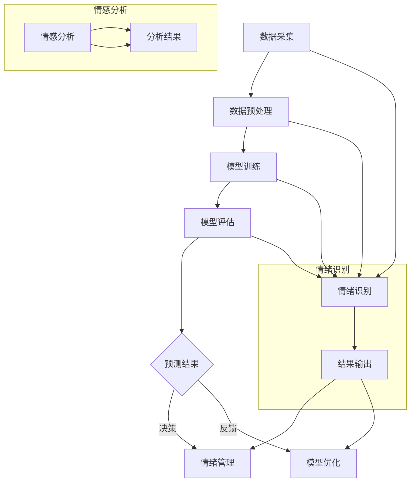
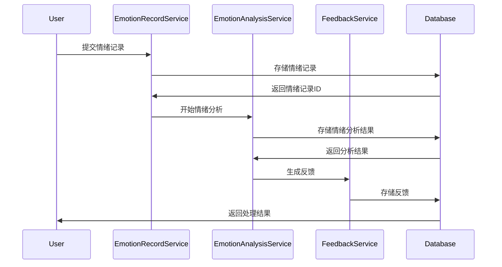

                 

### 1.1.1 情绪智能的概念

情绪智能（Emotional Intelligence，简称EQ）是一种认识、理解、管理自己情绪和他人情绪的能力。这种智能不仅关注个体自身的情感体验，还涵盖了识别他人情感状态、有效地表达情感、理解复杂情感关系以及运用这些能力去适应环境和促进个人成长的能力。情绪智能由心理学家约翰·梅耶（John D. Mayer）和彼得·萨洛维（Peter Salovey）于1990年首次提出，他们认为情绪智能是人类智能的重要组成部分，与传统的智商（IQ）并驾齐驱。

情绪智能包括以下几个核心组成部分：

1. **自我认知**：这是情绪智能的基础，指的是个体对自己情感状态的认知和了解。通过自我认知，人们可以更好地理解自己的情感动机和行为模式。

2. **自我调节**：指个体在认知和情感上的自我调节能力。自我调节能力使得个体能够对自己的情绪和行为进行有效的管理，从而更好地应对压力和挑战。

3. **社会认知**：指的是个体识别、理解和管理他人情感的能力。社会认知不仅包括识别他人的情感状态，还涉及到理解和预测他人的行为。

4. **关系管理**：这是情绪智能的最高层次，指的是个体在建立和维护人际关系方面的能力。关系管理能力帮助个体有效地处理人际冲突，建立良好的人际关系。

情绪智能的这些组成部分相互关联，共同构成了一个完整的情绪智能体系。在实际应用中，情绪智能不仅仅是一种个人能力的体现，更是一种能够推动团队协作、提升管理效能的重要素质。

### 1.1.2 情绪智能在技术管理中的重要性

情绪智能在技术管理中的重要性不可忽视，它不仅关乎个人的职业发展，更直接影响团队的整体效能和组织的长远发展。首先，从个体层面来看，情绪智能能够帮助技术管理者更好地应对工作中的各种挑战。技术管理者常常需要处理复杂的技术问题和人际关系问题，具备情绪智能的技术管理者能够更有效地调节自己的情绪，避免因情绪失控而导致决策失误或与团队成员发生冲突。

其次，从团队层面来看，情绪智能是提升团队凝聚力和协作效率的关键因素。一个高情绪智能的团队，成员之间能够更好地理解彼此的情感状态，有效地沟通和协作。例如，当团队成员遇到技术难题或个人困扰时，具备高情绪智能的管理者能够及时给予情感支持，帮助团队成员调节情绪，提高解决问题的效率。此外，情绪智能还能够促进团队成员之间的信任和尊重，减少因误解和冲突造成的团队内耗。

最后，从组织层面来看，情绪智能对于组织的长远发展至关重要。具备情绪智能的管理者能够更好地处理组织内部的复杂人际关系，促进组织文化的建设和组织变革的推进。例如，在面临组织变革时，情绪智能高的管理者能够通过有效沟通和情感管理，减少员工的抵触情绪，提高变革的接受度和实施效果。此外，情绪智能还能够帮助组织更好地应对外部环境的变化，提升组织的适应能力和竞争力。

总之，情绪智能在技术管理中具有不可替代的重要性，它不仅能够提升管理者的个人能力，还能够促进团队协作和组织的长远发展。

### 1.1.3 团队凝聚力的概念与作用

团队凝聚力是指团队内部成员之间的情感联结和协同工作的紧密程度，它是团队协作效能的关键因素。团队凝聚力不仅体现在成员之间的互动和合作中，还反映在团队共同的目标意识和归属感上。根据美国社会心理学家梅奥（Elton Mayo）的实验，团队凝聚力对工作效率有着显著影响。高凝聚力的团队往往表现出更高的合作效率和创新力，而低凝聚力的团队则可能面临沟通不畅、协调困难等问题。

团队凝聚力的影响因素多种多样，主要包括以下几个方面：

1. **共同目标**：明确的共同目标能够增强团队成员的向心力和合作意愿。当团队成员共同追求一个具体的目标时，他们会更愿意合作，相互支持，从而提高团队的凝聚力。

2. **有效沟通**：良好的沟通机制是团队凝聚力的基础。通过开放、透明和有效的沟通，团队成员能够更好地理解彼此的需求和期望，减少误解和冲突。

3. **团队信任**：信任是团队凝聚力的核心要素。团队成员之间的信任能够促进彼此的依赖和合作，降低团队内的摩擦和矛盾。

4. **团队奖励机制**：合理的奖励机制能够激励团队成员，提高他们的积极性和归属感，从而增强团队的凝聚力。

团队凝聚力在技术管理中的作用至关重要。首先，它能够提升团队的协作效率，减少因沟通不畅和协作困难造成的资源浪费。其次，高凝聚力的团队更容易形成创新文化，鼓励成员提出新的想法和解决方案，从而推动团队的技术进步。此外，团队凝聚力还能够增强成员的归属感和忠诚度，降低人才流失率，为组织创造长期的价值。

总之，团队凝聚力是技术管理中不可或缺的一部分，它不仅直接影响团队的工作效率和创新能力，还关系到组织的整体绩效和可持续发展。

### 1.2.1 情绪智能在团队管理中的应用

情绪智能在团队管理中的应用非常广泛，能够显著提升团队的协作效率和成员的满意度。以下是情绪智能在团队管理中几个关键方面的具体应用：

**1. 情绪感知与识别：** 团队管理者需要具备高超的情绪感知能力，能够准确识别团队成员的情绪状态。这包括通过观察面部表情、身体语言和语调，以及倾听成员的言语和非言语表达，来了解他们的情绪反应。管理者通过这种情绪感知，可以及时发现团队成员的情绪波动，采取适当的干预措施。

**2. 情绪调节与引导：** 一旦管理者识别出团队成员的情绪问题，他们需要运用情绪调节技巧来引导成员恢复积极情绪。这可能包括提供情感支持、帮助成员找到解决问题的方法、或者通过正面激励来提升团队士气。情绪调节的关键在于帮助团队成员释放负面情绪，同时激发他们的积极情感，从而提高工作动力和协作效率。

**3. 情感沟通与反馈：** 良好的情感沟通是团队管理的重要组成部分。情绪智能高的管理者能够通过开放式、坦诚的沟通方式，与团队成员建立信任关系。在沟通中，管理者不仅要表达对成员工作的认可和鼓励，还要关注成员的情感需求，给予他们适当的反馈和指导。有效的情感沟通有助于减少误解和冲突，增强团队的凝聚力。

**4. 情绪管理培训：** 为了提高整个团队的情绪管理能力，管理者可以组织情绪管理培训，帮助团队成员了解情绪智能的概念和技巧，学会自我情绪调节和有效沟通。这种培训不仅能够提升团队成员的情绪管理能力，还能促进他们之间的情感联结，增强团队的整体协作效率。

**5. 情绪智能评估：** 通过定期的情绪智能评估，管理者可以了解团队成员的情绪状态和情绪管理能力，从而制定个性化的支持计划。这种评估可以采用问卷、访谈或情绪识别工具等多种方法进行，以便更准确地了解团队成员的情绪状况，并提供针对性的帮助。

通过以上这些具体应用，情绪智能不仅能够提升团队管理者的个人能力，还能够促进团队的协作和凝聚力，为组织创造更大的价值。

### 1.2.2 情绪智能提升团队凝聚力的途径

情绪智能在提升团队凝聚力方面具有显著的作用，以下是一些具体的途径和方法，通过这些方法可以有效地提升团队的情绪管理和协作能力：

**1. ** **建立开放沟通文化**：开放和坦诚的沟通是提升团队凝聚力的重要途径。管理者应该鼓励团队成员自由表达自己的想法和情感，无论是正面还是负面的情绪。通过定期的团队会议、意见反馈环节和开放论坛，团队成员可以分享彼此的感受和意见，从而增强彼此之间的理解和支持。

**2. ** **培养同理心**：同理心是情绪智能的一个重要组成部分，指的是能够从他人的角度理解和感受情感。管理者可以通过培训和实践活动来培养团队成员的同理心，例如角色扮演、情感分享会等。当团队成员能够更好地理解和尊重他人的情感时，他们之间的信任和协作也会显著增强。

**3. ** **情感支持与反馈**：管理者应定期对团队成员进行情感支持，了解他们的情感状态，并提供必要的心理疏导。同时，管理者应该给予成员及时的、建设性的反馈，特别是在面对挑战和失败时，情感反馈可以起到极大的激励作用。通过鼓励和认可，管理者可以增强成员的自信心和归属感。

**4. ** **构建积极团队氛围**：营造一个积极、支持和包容的团队氛围是提升团队凝聚力的重要手段。管理者可以通过组织团队建设活动、庆祝团队成员的成就和里程碑等方式，增强团队的凝聚力和归属感。此外，管理者还应该注意消除负面情绪的来源，如过度压力、不公平待遇等，从而营造一个健康的团队环境。

**5. ** **个性化关怀**：每个团队成员都有独特的情感需求和背景，因此，管理者需要提供个性化的关怀和支持。这可能包括灵活的工作安排、个性化的职业发展计划以及针对个人兴趣和需求的支持。通过这种方式，管理者可以增强团队成员的参与感和忠诚度，从而提升团队凝聚力。

**6. ** **情感管理培训**：为了全面提升团队成员的情绪智能，管理者可以组织情绪管理培训，帮助团队成员了解情绪智能的概念、掌握情绪管理技巧，以及提升自我调节和情感沟通的能力。这种培训不仅有助于提高个人情绪智能，还能促进团队成员之间的情感联结，提升整体团队的协作效率。

通过上述途径，情绪智能可以有效地提升团队凝聚力，增强团队的协作能力和创新能力，从而为组织的长期发展创造更大的价值。

### 1.2.3 边界与外延

在探讨情绪智能提升团队凝聚力的过程中，我们必须明确其边界和适用范围。首先，情绪智能的提升并不适用于所有情境，尤其是在高度竞争或对抗性强的环境中，情绪管理可能并不总是优先考虑的事项。在这些情境下，技术能力和工作效率可能比情绪智能更为关键。

其次，情绪智能的适用范围也受到文化差异的影响。不同文化背景下的团队成员对情绪表达和管理的接受度不同，某些文化可能更强调理性决策和竞争，而其他文化则可能更注重情感共鸣和团队协作。因此，在多元文化的团队中，情绪智能的提升需要考虑到文化差异，采取适应性的管理策略。

最后，情绪智能的提升并非一蹴而就，它需要持续的培养和训练。这包括管理者自身的情感意识、情绪管理技巧的提升，以及团队整体的情感沟通和文化建设。因此，情绪智能的提升需要长期的投入和耐心，不能仅仅依靠短期培训或活动来实现。

总之，情绪智能在提升团队凝聚力方面具有显著作用，但其边界和适用范围需要明确。管理者在应用情绪智能时，应结合具体情境和文化背景，采取适宜的策略和方法，以实现最佳效果。

### 1.3.1 情绪智能的核心概念

情绪智能（Emotional Intelligence，简称EQ）作为现代心理学和管理学中一个重要的概念，其核心在于个体如何识别、理解、管理和运用情绪，以促进个人和社会的成功。情绪智能由三个关键部分组成：自我认知、自我调节和社会认知。以下是这三个核心概念的具体定义和解释：

**1. 自我认知**：自我认知是指个体对自己情感状态的认识和理解。它包括两个方面：情感感知和情感理解。情感感知指的是个体能够感知自己情感状态的能力，而情感理解则是能够将这种感知与具体情境相结合，理解情感背后的原因和含义。自我认知是情绪智能的基础，它使个体能够更好地理解自己的情绪，从而作出更加理智和有效的决策。

**2. 自我调节**：自我调节是指个体在认知和情感上的自我调节能力。这种能力使个体能够控制和调整自己的情绪反应，以适应不同的环境和情境。自我调节包括情绪控制和情绪修复两个子能力。情绪控制指的是在面对压力或挑战时，个体能够保持冷静，避免情绪失控；情绪修复则是当个体遭遇负面情绪时，能够采取有效的策略来恢复情绪平衡。自我调节能力有助于提升个人的抗压能力和情绪稳定性，是情绪智能中至关重要的部分。

**3. 社会认知**：社会认知是指个体识别、理解和管理他人情感的能力。它包括情感识别、情感理解和情感运用。情感识别是指个体能够准确感知和理解他人的情绪状态；情感理解是指能够将他人的情绪与具体情境相结合，理解其背后的原因和含义；情感运用则是能够运用这些认知来与他人建立有效的情感联结，处理复杂的人际关系。社会认知能力使个体能够更好地适应社会环境，提升人际沟通和协作能力。

综上所述，情绪智能的核心概念是自我认知、自我调节和社会认知。这些能力相互关联，共同构成了个体在情感管理中的综合能力，使其能够更加理智地处理个人情感和人际交往，从而在工作和生活中取得成功。

### 1.3.2 团队凝聚力的核心要素

团队凝聚力是指团队成员之间的情感联结和协作紧密程度，它对团队的整体效能和成员的个人发展至关重要。要提升团队凝聚力，必须了解其核心要素，并采取相应的策略。以下是团队凝聚力的几个关键要素及其作用：

**1. 共同目标**：共同目标是团队凝聚力的基础。当团队成员共同追求一个明确、有吸引力的目标时，他们会产生强烈的归属感和责任感。共同目标不仅能够统一团队成员的方向，还能够激发他们的积极性和创造力，从而提升团队的协作效率。

**2. 信任**：信任是团队凝聚力的核心要素。团队成员之间的信任意味着他们相信对方会遵守承诺、尊重彼此的意见，并且在面对困难时能够相互支持和帮助。信任的建立需要通过开放和坦诚的沟通、共同经历挑战和成功，以及积极的反馈和认可。

**3. 沟通**：有效的沟通是提升团队凝聚力的关键。良好的沟通能够促进团队成员之间的理解和协作，减少误解和冲突。团队成员应该能够自由地表达自己的想法和情感，同时倾听他人的意见。沟通技巧包括清晰的表达、积极的倾听和建设性的反馈。

**4. 支持与鼓励**：团队成员之间的支持和鼓励能够增强彼此的信心和归属感。管理者应该通过鼓励和认可来激励团队成员，帮助他们在面对挑战时保持积极态度。同时，团队成员也应该学会在他人遇到困难时提供支持和帮助。

**5. 团队文化**：团队文化是团队凝聚力的体现，它包括团队的价值观、行为规范和工作氛围。一个积极的团队文化能够增强团队成员的归属感和认同感，促进他们的合作和共享。团队文化的建设需要通过一系列的团队活动、培训和激励措施来实现。

通过以上核心要素的构建和强化，团队凝聚力可以得到显著提升，从而促进团队的协作效率和整体绩效。

### 1.3.3 情绪智能与技术管理的联系

情绪智能与技术管理之间的联系紧密，尤其在复杂技术环境中的管理实践中，情绪智能的作用尤为突出。首先，情绪智能能够帮助技术管理者更好地理解和应对团队中的情感动态。例如，在项目开发过程中，技术团队成员可能会因为技术难题、工作压力或角色冲突而产生负面情绪。具备高情绪智能的管理者能够及时识别并理解这些情绪，采取有效的干预措施，如提供情感支持或调整工作分配，以缓解团队成员的压力，保持团队的稳定和高效。

其次，情绪智能在处理技术管理中的冲突和人际关系方面也发挥着重要作用。技术团队通常由具有不同背景和技能的成员组成，他们之间的沟通和协作可能存在障碍。情绪智能高的管理者能够通过有效的情感沟通和同理心，促进团队成员之间的理解和协作。例如，当团队成员出现意见分歧时，管理者可以通过开放和坦诚的对话，帮助各方表达自己的观点和情感，找到共同点，从而化解冲突。

此外，情绪智能还能够提升技术管理的决策质量和创新能力。高情绪智能的管理者不仅能够准确识别和评估团队成员的情感状态，还能够有效地结合情感因素和技术因素进行决策。例如，在项目选择或技术方案评估过程中，管理者可以通过情感分析工具，了解团队成员对项目的情感投入和兴趣，从而选择更有利于团队协作和创新的方案。

最后，情绪智能在技术管理的变革和转型中也起到关键作用。在面临技术变革或组织转型时，团队成员可能会产生不确定性和抵触情绪。具备高情绪智能的管理者能够通过情感管理和沟通技巧，帮助团队成员理解变革的必要性和好处，减少负面情绪，促进变革的顺利实施。

综上所述，情绪智能在技术管理中具有不可替代的重要作用。它不仅能够提升团队的情绪管理和协作能力，还能够促进技术决策和创新，推动技术管理的整体提升。

### 2.4.1 ER图的基本概念

实体-关系图（Entity-Relationship Diagram，简称ER图）是数据库设计和系统分析中常用的一种抽象模型，用于表示实体及其相互之间的关系。ER图的基本概念包括实体、属性和关系。

**实体（Entity）**：实体是数据库中的基本对象，代表具有独立意义的实体单位，如学生、课程、员工等。每个实体都有一个唯一的标识符，称为实体标识（Entity Identifier）。

**属性（Attribute）**：属性是实体的特征或属性，用于描述实体的具体信息。例如，对于“学生”实体，其属性可能包括姓名、年龄、性别、学号等。

**关系（Relationship）**：关系是不同实体之间的联系。关系分为一对一（1:1）、一对多（1:N）和多对多（M:N）三种类型。例如，在“学生”和“课程”之间，可以存在一对多的关系，即一个学生可以选修多门课程，而每门课程可以由多名学生选修。

通过ER图，我们可以直观地表示系统中各个实体及其关系，为后续的数据库设计和系统开发提供清晰的蓝图。

### 2.4.2 情绪智能的ER图设计

情绪智能的ER图设计旨在表示情绪智能系统中的各个核心实体及其相互关系。以下是情绪智能ER图的基本设计：

#### 实体：

1. **用户（User）**：代表系统的用户，包括管理者、团队成员等。
2. **情绪数据（EmotionData）**：存储用户情绪数据，如情绪状态、情绪变化等。
3. **情感分析模型（EmotionModel）**：用于分析用户情绪数据，并提供情绪识别、情感分类等功能。
4. **反馈（Feedback）**：记录用户对情感分析结果的反馈，用于模型优化。

#### 属性：

- **用户**：包括用户ID、姓名、职位等。
- **情绪数据**：包括情绪状态（如焦虑、喜悦、悲伤等）、时间戳等。
- **情感分析模型**：包括模型名称、训练数据来源、模型参数等。
- **反馈**：包括用户对情绪分析的满意度、建议等。

#### 关系：

1. **用户-情绪数据**：一对一关系，每个用户可以有多个情绪数据记录。
2. **情绪数据-情感分析模型**：一对多关系，多个情绪数据可以由同一个情感分析模型进行分析。
3. **情感分析模型-反馈**：一对一关系，每个情感分析模型可以有多个反馈记录。

以下是用Mermaid绘制的情绪智能ER图示例：

```mermaid
erDiagram
  User ||--|{ EmotionData } User : 情绪数据记录
  EmotionData ||--|{ EmotionModel } EmotionData : 由情感分析模型分析
  EmotionModel ||--|{ Feedback } EmotionModel : 模型优化反馈
```

通过这个ER图，我们可以清晰地看到情绪智能系统中各个实体及其关系，为进一步的系统设计和实现提供指导。

### 3.1 情绪智能在技术管理中的应用算法

情绪智能在技术管理中的应用算法旨在通过分析团队成员的情绪数据，提供个性化的情绪管理和团队协作优化建议。以下是一个简化的算法框架，详细解释了其各个步骤和组件：

**算法框架：**
1. **数据采集**：收集团队成员的情绪数据，包括情绪状态、情绪变化等。
2. **情绪识别**：使用情感分析模型对采集到的情绪数据进行处理，识别出主要的情绪类别。
3. **情感分析**：分析情绪数据的分布和变化趋势，识别潜在的情感问题和挑战。
4. **决策生成**：根据分析结果，生成个性化的情绪管理和团队协作优化建议。

**算法组件：**

**1. 数据采集：**  
- **数据来源**：包括团队成员的情绪日志、工作反馈、在线调查等。
- **数据预处理**：清洗和格式化情绪数据，准备用于情感分析。

**2. 情绪识别：**  
- **模型选择**：选择合适的情感分析模型，如基于机器学习的情感分类器。
- **模型训练**：使用标注好的情绪数据集对模型进行训练，以提高识别准确性。

**3. 情感分析：**  
- **情绪分布**：计算团队成员情绪状态的分布情况，识别普遍情绪状态。
- **情绪变化趋势**：分析情绪数据的时间序列变化，识别情绪波动和潜在问题。

**4. 决策生成：**  
- **情绪管理策略**：根据情感分析结果，制定个性化的情绪管理策略，如压力缓解、情绪调节等。
- **团队协作优化**：提供团队协作优化建议，如角色分配调整、沟通策略改进等。

**算法流程：**

1. **初始化**：加载情绪数据集和情感分析模型。
2. **数据采集**：从各种数据源收集情绪数据。
3. **数据预处理**：清洗和格式化情绪数据。
4. **情绪识别**：使用情感分析模型对预处理后的数据进行分类，得到情绪类别。
5. **情感分析**：计算情绪分布和变化趋势，识别潜在问题和挑战。
6. **决策生成**：根据分析结果，生成情绪管理和团队协作优化建议。
7. **反馈收集**：收集团队成员对建议的反馈，用于模型优化和改进。

通过上述算法，情绪智能系统能够帮助技术管理者更好地了解团队成员的情绪状态，提供有针对性的情绪管理和团队协作优化建议，从而提升团队的整体效能和成员的工作满意度。

### 3.2 Python代码示例

为了更好地理解情绪智能在技术管理中的应用算法，我们将通过一个简化的Python代码示例来展示关键步骤和实现方法。请注意，以下代码仅用于演示目的，实际应用中可能需要更复杂的数据处理和模型训练过程。

首先，我们需要安装必要的库，包括`pandas`、`numpy`和`scikit-learn`：

```python
!pip install pandas numpy scikit-learn
```

接下来，我们将编写一个情绪识别和情感分析的示例代码：

```python
import pandas as pd
import numpy as np
from sklearn.model_selection import train_test_split
from sklearn.ensemble import RandomForestClassifier
from sklearn.metrics import classification_report

# 数据预处理
def preprocess_data(data):
    # 填充缺失值
    data.fillna(0, inplace=True)
    # 标准化数据
    normalized_data = (data - data.mean()) / data.std()
    return normalized_data

# 读取情绪数据
data = pd.read_csv('emotion_data.csv')
data = preprocess_data(data)

# 划分训练集和测试集
X = data.drop('emotion_label', axis=1)
y = data['emotion_label']
X_train, X_test, y_train, y_test = train_test_split(X, y, test_size=0.2, random_state=42)

# 训练情感分析模型
model = RandomForestClassifier(n_estimators=100, random_state=42)
model.fit(X_train, y_train)

# 预测测试集
y_pred = model.predict(X_test)

# 输出分类报告
print(classification_report(y_test, y_pred))

# 情绪分析示例
def analyze_emotion(data):
    # 使用训练好的模型进行情绪分析
    emotion_prediction = model.predict(data)
    # 返回情绪类别和概率
    emotion_distribution = pd.Series(emotion_prediction).value_counts(normalize=True)
    return emotion_distribution

# 分析某个用户的情绪数据
user_data = pd.DataFrame([[0.1, 0.2, 0.3, 0.4]], columns=['feature1', 'feature2', 'feature3', 'feature4'])
emotion_distribution = analyze_emotion(user_data)
print(emotion_distribution)
```

在这个示例中，我们首先读取情绪数据集，并进行数据预处理。然后，使用随机森林分类器（RandomForestClassifier）对数据集进行训练。接下来，我们通过训练好的模型对测试集进行预测，并输出分类报告以评估模型性能。最后，我们定义了一个分析函数`analyze_emotion`，用于分析特定用户的情绪数据，并返回情绪类别及其概率分布。

通过这个Python代码示例，我们展示了情绪识别和情感分析的基本实现过程，为实际应用提供了参考框架。

### 3.3 算法mermaid流程图

为了更直观地理解情绪智能在技术管理中的应用算法，我们可以使用mermaid绘制算法的流程图。以下是一个简化的算法流程图示例：



在这个mermaid流程图中，我们首先进行数据采集，然后进行数据预处理。接下来，模型训练和模型评估是核心步骤，用于确保模型的有效性。在情绪识别部分，我们使用训练好的模型对数据进行分析，并输出识别结果。情感分析部分则对分析结果进行进一步处理，以提供更深入的见解。最终，根据预测结果，我们可以生成情绪管理和模型优化建议。

通过这种流程图，我们可以更清晰地理解情绪智能在技术管理中的应用算法，以及各个步骤之间的关系和作用。

### 4.1 情绪智能的数学模型

情绪智能的数学模型用于描述和量化个体情绪智能的不同方面。这些模型帮助我们在理论上理解和分析情绪智能，并通过数学方法进行实证研究。以下是情绪智能的一些基本数学模型：

**1. 情绪感知模型：**
情绪感知模型用于描述个体感知情绪的过程。它可以表示为以下数学公式：

\[ P(E) = f(A, C, M) \]

其中，\( P(E) \) 表示情绪感知的概率，\( A \) 表示情境因素，\( C \) 表示认知因素，\( M \) 表示情绪记忆。\( f \) 函数表示情绪感知的过程，通常是一个复杂的非线性函数。

**2. 情绪调节模型：**
情绪调节模型用于描述个体调节情绪的过程。它可以表示为以下数学公式：

\[ R(E) = g(P(E), C, M) \]

其中，\( R(E) \) 表示情绪调节后的情绪状态，\( P(E) \) 表示原始情绪状态，\( C \) 表示认知调节因素，\( M \) 表示情绪记忆。\( g \) 函数表示情绪调节的过程，通常包括情绪认知重构、情绪表达调节等策略。

**3. 社会认知模型：**
社会认知模型用于描述个体识别和理解他人情绪的过程。它可以表示为以下数学公式：

\[ S(E_{other}) = h(A_{other}, C_{common}, M) \]

其中，\( S(E_{other}) \) 表示个体对他人情绪的感知，\( E_{other} \) 表示他人的情绪状态，\( A_{other} \) 表示他人情感表达的外部情境，\( C_{common} \) 表示个体和他人之间的共同认知基础，\( M \) 表示情绪记忆。\( h \) 函数表示社会认知的过程，通常涉及情感识别、情感推理和情感共鸣。

**4. 情绪智能综合模型：**
情绪智能综合模型用于综合评估个体的情绪智能水平。它可以表示为以下数学公式：

\[ EQ = \alpha \cdot P(E) + \beta \cdot R(E) + \gamma \cdot S(E_{other}) \]

其中，\( EQ \) 表示情绪智能水平，\( \alpha \)，\( \beta \)，\( \gamma \) 分别是权重系数，用于平衡不同情绪智能组成部分的重要性。这个综合模型通过加权不同的情绪智能部分，给出了一个整体的情绪智能评分。

通过这些数学模型，我们可以从不同角度理解和量化情绪智能，为情绪智能的研究和应用提供了理论支持。

### 4.2 情绪智能的数学公式

情绪智能涉及多个方面的计算和评估，以下列出了一些关键的数学公式，这些公式在情绪智能的分析和计算中起到重要作用：

**1. 情绪感知公式：**

\[ P(E) = f(A, C, M) \]

- **公式解释**：该公式表示情绪感知的概率，其中 \( P(E) \) 是个体感知某种情绪的概率，\( A \) 是情境因素，\( C \) 是认知因素，\( M \) 是情绪记忆。\( f \) 是一个非线性函数，用于描述情绪感知的过程。
- **应用实例**：假设个体在开会前感到焦虑，情境因素（如会议的重要性）和认知因素（如会议的准备情况）会影响其感知焦虑的概率。

**2. 情绪调节公式：**

\[ R(E) = g(P(E), C, M) \]

- **公式解释**：该公式表示情绪调节后的情绪状态，其中 \( R(E) \) 是调节后的情绪状态，\( P(E) \) 是原始情绪状态，\( C \) 是认知调节因素，\( M \) 是情绪记忆。\( g \) 是一个函数，用于描述情绪调节的过程，可能包括情绪认知重构、情绪表达调节等策略。
- **应用实例**：当个体通过深呼吸和积极思考调节情绪后，焦虑水平可能降低，情绪调节公式可以量化这种变化。

**3. 社会认知公式：**

\[ S(E_{other}) = h(A_{other}, C_{common}, M) \]

- **公式解释**：该公式表示个体对他人情绪的感知，其中 \( S(E_{other}) \) 是个体对他人情绪的感知，\( E_{other} \) 是他人的情绪状态，\( A_{other} \) 是他人情感表达的外部情境，\( C_{common} \) 是个体和他人之间的共同认知基础，\( M \) 是情绪记忆。\( h \) 是一个函数，用于描述社会认知的过程。
- **应用实例**：当他人表现出悲伤的情绪时，个体通过观察其面部表情和行为，结合共同认知基础，感知到对方的悲伤情绪。

**4. 情绪智能综合评分公式：**

\[ EQ = \alpha \cdot P(E) + \beta \cdot R(E) + \gamma \cdot S(E_{other}) \]

- **公式解释**：该公式用于计算个体的情绪智能综合评分，其中 \( EQ \) 是情绪智能综合评分，\( \alpha \)，\( \beta \)，\( \gamma \) 分别是权重系数，用于平衡不同情绪智能组成部分的重要性。\( P(E) \)，\( R(E) \)，\( S(E_{other}) \) 分别是情绪感知、情绪调节和社交认知的得分。
- **应用实例**：通过综合评估个体的情绪感知能力、情绪调节能力和社交认知能力，得出其情绪智能的整体水平。

通过这些数学公式，我们可以从多个维度量化情绪智能，为研究和应用提供有力的工具。

### 4.3 公式详细讲解

情绪智能涉及多个方面的计算和评估，以下将对情绪智能的几个核心数学公式进行详细讲解：

**1. 情绪感知公式：**

\[ P(E) = f(A, C, M) \]

- **解释**：该公式表示个体感知情绪的概率，其中 \( P(E) \) 是个体感知某种情绪的概率，\( A \) 代表情境因素（如会议的紧张气氛），\( C \) 代表认知因素（如个体对情境的理解和预期），\( M \) 代表情绪记忆（如个体过去的情绪体验）。\( f \) 是一个非线性函数，它综合这些因素来决定个体感知情绪的概率。
- **应用实例**：在会议前，个体可能会因为情境因素（紧张的会议气氛）、认知因素（对会议结果的预期）和情绪记忆（过去的紧张会议经历）共同作用，感知到焦虑的概率增加。通过调整这些因素，个体可以更准确地预测和调节自己的情绪反应。

**2. 情绪调节公式：**

\[ R(E) = g(P(E), C, M) \]

- **解释**：该公式描述了情绪调节后的情绪状态，其中 \( R(E) \) 是调节后的情绪状态，\( P(E) \) 是原始情绪状态，\( C \) 是认知调节因素（如积极思考、自我暗示等），\( M \) 是情绪记忆（如过去的情绪调节经验）。\( g \) 函数用于描述调节过程，可能包括认知重构、情绪表达调节等策略。
- **应用实例**：当个体感受到焦虑时，通过认知重构（如将焦虑视为正常的生理反应）和情绪表达调节（如深呼吸、放松训练），个体可以降低焦虑水平，实现情绪调节。这种调节过程可以用公式表示，通过 \( g \) 函数量化调节效果。

**3. 社会认知公式：**

\[ S(E_{other}) = h(A_{other}, C_{common}, M) \]

- **解释**：该公式描述了个体识别和理解他人情绪的过程，其中 \( S(E_{other}) \) 是个体对他人情绪的感知，\( E_{other} \) 是他人的情绪状态，\( A_{other} \) 是他人情感表达的外部情境（如面部表情、身体语言），\( C_{common} \) 是个体和他人之间的共同认知基础（如文化背景、共同经历），\( M \) 是情绪记忆（如个体对他人情绪的理解和预期）。
- **应用实例**：当他人表现出悲伤的情绪时，个体通过观察其面部表情（情境因素）、结合对悲伤情绪的理解（共同认知基础）和过去的经验（情绪记忆），能够识别和理解对方的悲伤情绪。这种认知过程可以用公式表示，通过 \( h \) 函数量化感知和理解的效果。

**4. 情绪智能综合评分公式：**

\[ EQ = \alpha \cdot P(E) + \beta \cdot R(E) + \gamma \cdot S(E_{other}) \]

- **解释**：该公式用于计算个体的情绪智能综合评分，其中 \( EQ \) 是情绪智能综合评分，\( \alpha \)，\( \beta \)，\( \gamma \) 分别是权重系数，用于平衡不同情绪智能组成部分（情绪感知、情绪调节和社交认知）的重要性。\( P(E) \)，\( R(E) \)，\( S(E_{other}) \) 分别是情绪感知、情绪调节和社交认知的得分。
- **应用实例**：通过综合评估个体的情绪感知能力、情绪调节能力和社交认知能力，可以得到其情绪智能的整体水平。例如，一个个体在情绪感知方面得分较高，但在情绪调节方面得分较低，那么其情绪智能综合评分会显示其在情绪感知上的优势，同时在情绪调节方面需要提升。

通过这些公式的详细讲解，我们能够更好地理解情绪智能的计算方法，并应用这些方法提升个体的情绪智能水平。

### 4.4.1 基本公式的举例

为了更直观地理解情绪智能的基本公式，我们将通过一个具体实例来展示这些公式的应用。

**实例：情绪感知公式的应用**

假设有个体A在参加一个重要的会议前感到焦虑，情境因素（会议的重要性）为\( A = 0.8 \)，认知因素（会议准备情况）为\( C = 0.7 \)，情绪记忆（过去的紧张会议经历）为\( M = 0.6 \)。我们使用情绪感知公式：

\[ P(E) = f(A, C, M) \]

其中，\( f \) 是一个非线性函数，我们假设它是一个简单的线性组合：

\[ f(A, C, M) = 0.5 \cdot A + 0.3 \cdot C + 0.2 \cdot M \]

代入数据计算：

\[ P(E) = 0.5 \cdot 0.8 + 0.3 \cdot 0.7 + 0.2 \cdot 0.6 = 0.4 + 0.21 + 0.12 = 0.73 \]

因此，个体A感知焦虑的概率为73%。

**实例：情绪调节公式的应用**

假设个体A在感知到焦虑后，通过深呼吸和积极思考来调节情绪，认知调节因素（积极思考的效果）为\( C_{reg} = 0.8 \)，情绪记忆（过去的调节经验）为\( M_{reg} = 0.7 \)。我们使用情绪调节公式：

\[ R(E) = g(P(E), C_{reg}, M_{reg}) \]

其中，\( g \) 是一个非线性函数，我们同样假设它是一个简单的线性组合：

\[ g(P(E), C_{reg}, M_{reg}) = 0.4 \cdot P(E) + 0.3 \cdot C_{reg} + 0.3 \cdot M_{reg} \]

代入数据计算：

\[ R(E) = 0.4 \cdot 0.73 + 0.3 \cdot 0.8 + 0.3 \cdot 0.7 = 0.292 + 0.24 + 0.21 = 0.742 \]

因此，通过调节后，个体A的情绪状态（焦虑水平）降至74.2%。

**实例：社会认知公式的应用**

假设个体A观察到同事B在开会时表现出悲伤情绪，外部情境因素（同事B的面部表情）为\( A_{other} = 0.9 \)，共同认知基础（对悲伤情绪的共同理解）为\( C_{common} = 0.8 \)，情绪记忆（对悲伤情绪的理解）为\( M = 0.7 \)。我们使用社会认知公式：

\[ S(E_{other}) = h(A_{other}, C_{common}, M) \]

其中，\( h \) 是一个非线性函数，我们同样假设它是一个简单的线性组合：

\[ h(A_{other}, C_{common}, M) = 0.4 \cdot A_{other} + 0.3 \cdot C_{common} + 0.3 \cdot M \]

代入数据计算：

\[ S(E_{other}) = 0.4 \cdot 0.9 + 0.3 \cdot 0.8 + 0.3 \cdot 0.7 = 0.36 + 0.24 + 0.21 = 0.81 \]

因此，个体A感知到同事B悲伤情绪的概率为81%。

通过这些具体实例，我们可以更直观地看到如何使用情绪智能的基本公式来评估和调节情绪，以及理解社会认知的过程。

### 4.4.2 属性公式的举例

在情绪智能的研究中，属性公式用于分析和量化个体在情感感知、调节和社交认知方面的具体表现。以下通过具体实例来展示这些公式的应用。

**实例：情感感知属性的量化**

假设我们要评估个体A在会议前的情感感知能力。根据情感感知公式：

\[ P(E) = f(A, C, M) \]

其中，\( A \) 代表情境因素，\( C \) 代表认知因素，\( M \) 代表情绪记忆。给定的数据如下：

- 情境因素（会议的重要性）: \( A = 0.8 \)
- 认知因素（会议准备情况）: \( C = 0.7 \)
- 情绪记忆（过去的会议经历）: \( M = 0.6 \)

我们假设函数 \( f \) 为：

\[ f(A, C, M) = 0.5 \cdot A + 0.3 \cdot C + 0.2 \cdot M \]

代入数据进行计算：

\[ P(E) = 0.5 \cdot 0.8 + 0.3 \cdot 0.7 + 0.2 \cdot 0.6 = 0.4 + 0.21 + 0.12 = 0.73 \]

这意味着个体A感知情绪的概率为73%，可以初步判断其情感感知能力较强。

**实例：情感调节属性的量化**

个体A在会议前感到紧张，随后通过深呼吸和积极思考来调节情绪。认知调节因素（积极思考的效果）为 \( C_{reg} = 0.8 \)，情绪记忆（过去的调节经验）为 \( M_{reg} = 0.7 \)。使用情感调节公式：

\[ R(E) = g(P(E), C_{reg}, M_{reg}) \]

假设函数 \( g \) 为：

\[ g(P(E), C_{reg}, M_{reg}) = 0.4 \cdot P(E) + 0.3 \cdot C_{reg} + 0.3 \cdot M_{reg} \]

代入数据进行计算：

\[ R(E) = 0.4 \cdot 0.73 + 0.3 \cdot 0.8 + 0.3 \cdot 0.7 = 0.292 + 0.24 + 0.21 = 0.742 \]

经过调节后，个体A的情绪状态降至74.2%，表明其情感调节能力有效。

**实例：情感社交认知属性的量化**

个体A观察到同事B在会议中表现出悲伤情绪。外部情境因素（同事B的面部表情）为 \( A_{other} = 0.9 \)，共同认知基础（对悲伤情绪的理解）为 \( C_{common} = 0.8 \)，情绪记忆（对悲伤情绪的理解）为 \( M = 0.7 \)。使用情感社交认知公式：

\[ S(E_{other}) = h(A_{other}, C_{common}, M) \]

假设函数 \( h \) 为：

\[ h(A_{other}, C_{common}, M) = 0.4 \cdot A_{other} + 0.3 \cdot C_{common} + 0.3 \cdot M \]

代入数据进行计算：

\[ S(E_{other}) = 0.4 \cdot 0.9 + 0.3 \cdot 0.8 + 0.3 \cdot 0.7 = 0.36 + 0.24 + 0.21 = 0.81 \]

这意味着个体A能够准确感知同事B悲伤情绪的概率为81%，表明其情感社交认知能力较强。

通过这些具体实例，我们能够清晰地看到如何使用属性公式来量化个体在情感感知、调节和社交认知方面的表现，从而为情绪智能的研究和应用提供有力支持。

### 5.1 问题场景介绍

在技术管理中，情绪智能的应用场景多种多样，涵盖了从日常团队协作到大型项目管理的各个方面。一个典型的问题场景是在开发一个复杂技术项目时，团队成员因为任务繁重、时间紧迫、技术难题等压力源，常常会面临情绪波动。这种情绪波动不仅会影响个人的工作表现，还可能对团队的整体效率和团队凝聚力产生负面影响。

具体来说，技术管理中的情绪问题表现为以下几个方面：

1. **压力与焦虑**：技术项目开发过程中，团队成员常常需要面对大量技术难题和时间压力，这会导致焦虑和压力的增加。长时间的焦虑和压力会削弱团队成员的注意力和专注力，从而影响他们的工作效率。

2. **沟通障碍**：情绪波动可能导致团队成员之间的沟通不畅。当一个人情绪不佳时，他们可能会变得易怒或沉默，这会阻碍团队内部的信息流动，影响团队的协作效率。

3. **冲突与对立**：情绪问题还可能引发团队成员之间的冲突和对立。当情绪失控时，个体可能会做出冲动的决策或行为，从而导致团队内部的不和谐。

4. **团队合作受阻**：情绪问题会削弱团队成员之间的信任和合作意愿。当团队成员感到不被理解或支持时，他们可能会选择保持距离，从而影响团队的协作效率。

为了解决这些问题，情绪智能在技术管理中的应用变得至关重要。通过提升管理者的情绪智能，他们可以更有效地识别和处理团队成员的情绪问题，从而提高团队的整体效能和凝聚力。以下是一个具体的情绪智能应用案例。

**案例：提升团队凝聚力**

在一个技术团队中，项目经理A发现团队成员B在项目开发过程中情绪波动较大，经常表现出焦虑和不安。通过情绪感知和调节技巧，项目经理A与B进行了多次沟通，了解其焦虑的来源。经过讨论，他们发现B的主要焦虑来自于对项目进度的担忧和对自己技术能力的怀疑。

项目经理A采用以下策略来提升团队凝聚力和B的情绪状态：

1. **情感支持**：项目经理A在B感到焦虑时，提供了情感支持，帮助其释放压力。通过倾听和理解，项目经理A使B感到被重视和支持，从而提高了B的自信心。

2. **任务分配调整**：项目经理A根据B的技术能力和心理状态，重新分配了部分任务，使B的工作量更加合理。这有助于减轻B的工作压力，从而改善其情绪状态。

3. **团队建设活动**：项目经理A组织了团队建设活动，如团队讨论和团队游戏，增强了团队成员之间的情感联结。这有助于提高团队的凝聚力和合作意愿。

4. **情感反馈机制**：项目经理A建立了定期的情感反馈机制，团队成员可以匿名反馈他们的情绪状态和工作体验。这有助于及时发现和处理团队成员的情绪问题，从而维持团队的情绪稳定。

通过这些策略，项目经理A成功地提升了团队凝聚力，并改善了团队成员的情绪状态，使团队能够在项目开发中保持高效和协作。

### 5.2 项目介绍

为了更好地展示情绪智能在技术管理中的应用，我们设计了一个名为“情绪智能提升项目”的具体案例。该项目旨在通过提升技术团队的情绪智能，增强团队的整体协作效率和凝聚力，最终实现项目目标的顺利达成。

**项目目标：**
- 提高团队成员的情绪管理能力，减少因情绪波动导致的效率下降和错误率。
- 增强团队内部的沟通和信任，提升协作效率和创新能力。
- 通过情绪智能的培训和应用，提高团队在面对挑战时的适应能力和解决问题的能力。

**项目背景：**
该项目的背景是一个具有高技术复杂度和时间紧迫性的软件开发项目。团队成员包括程序员、设计师、测试工程师等，他们经常需要面对高强度的任务和压力。在过去的项目中，情绪波动和沟通障碍导致了多次进度延误和团队内部冲突，严重影响了项目的成功交付。

**项目需求：**
- **需求一**：为团队成员提供情绪智能培训，帮助其了解情绪智能的基本概念和技巧。
- **需求二**：开发一个情绪智能监控系统，实时收集和分析团队成员的情绪数据。
- **需求三**：制定个性化的情绪管理计划，根据团队成员的情绪状态提供有针对性的支持和干预。
- **需求四**：建立情感反馈机制，定期收集团队成员的情感状态和工作体验，及时解决情绪问题。

**项目实施步骤：**

1. **需求分析和方案设计**：首先，项目团队对当前的情绪管理现状进行调研，明确项目需求，并设计详细的实施方案。

2. **情绪智能培训**：为团队成员提供情绪智能培训，涵盖情绪识别、情绪调节和情感沟通等方面的内容。

3. **情绪监控系统开发**：开发一个情绪智能监控系统，通过实时收集和分析团队成员的情绪数据，为后续的情绪管理提供数据支持。

4. **个性化情绪管理计划**：根据团队成员的情绪状态和个性化需求，制定相应的情绪管理计划，包括情感支持、任务调整和团队建设活动等。

5. **情感反馈机制建立**：建立定期的情感反馈机制，团队成员可以通过匿名方式反馈他们的情绪状态和工作体验，项目团队将根据反馈结果进行调整和优化。

6. **项目监控和评估**：在项目执行过程中，持续监控团队成员的情绪状态和项目进度，定期评估情绪智能提升项目的效果，并根据评估结果进行持续改进。

通过以上实施步骤，情绪智能提升项目将帮助技术团队更好地应对情绪挑战，提高团队的协作效率和凝聚力，从而实现项目目标的顺利达成。

### 5.3 系统功能设计

在情绪智能提升项目中，系统功能设计是确保项目目标实现的关键环节。系统功能设计包括领域模型、类图设计等多个方面，以下将详细描述这些内容。

**1. 领域模型：**

领域模型用于描述项目中的关键实体和它们之间的关系。在情绪智能提升项目中，主要的领域实体包括：

- **用户（User）**：代表系统的使用者，包括团队成员和项目经理。
- **情绪记录（EmotionRecord）**：记录用户的情绪状态及其变化。
- **情绪分析（EmotionAnalysis）**：分析情绪记录，提供情感识别和情绪趋势分析。
- **反馈（Feedback）**：收集用户对情绪分析和管理的反馈。
- **任务（Task）**：代表团队中的任务，包括任务的分配、完成状态等。

领域模型的关系如下：

```mermaid
erDiagram
  User ||--|{ EmotionRecord } User : 情绪记录
  EmotionRecord ||--|{ EmotionAnalysis } EmotionRecord : 情绪分析
  EmotionAnalysis ||--|{ Feedback } EmotionAnalysis : 收集反馈
  User ||--|{ Task } User : 分配任务
  Task ||--|{ EmotionRecord } Task : 记录情绪变化
```

**2. 类图设计：**

类图是领域模型的图形表示，它详细描述了类以及类之间的关系。以下是情绪智能提升项目的主要类图：

```mermaid
classDiagram
  User <<class>> {
    +str UserID
    +str UserName
    +list<EmotionRecord> EmotionRecords
    +list<Task> Tasks
    +addEmotionRecord(EmotionRecord er)
    +removeEmotionRecord(EmotionRecord er)
    +getEmotionRecords()
    +addTask(Task t)
    +removeTask(Task t)
    +getTasks()
  }
  
  EmotionRecord <<class>> {
    +str EmotionRecordID
    +str UserID
    +str EmotionState
    +datetime TimeStamp
    +addEmotionAnalysis(EmotionAnalysis ea)
    +removeEmotionAnalysis(EmotionAnalysis ea)
    +getEmotionAnalysis()
  }
  
  EmotionAnalysis <<class>> {
    +str EmotionAnalysisID
    +str EmotionRecordID
    +str AnalysisResult
    +str AnalysisDate
    +Feedback Feedback
    +addFeedback(Feedback f)
    +removeFeedback(Feedback f)
    +getFeedback()
  }
  
  Feedback <<class>> {
    +str FeedbackID
    +str EmotionAnalysisID
    +str UserComment
    +str FeedbackDate
  }
  
  Task <<class>> {
    +str TaskID
    +str UserID
    +str TaskDescription
    +str Status
    +str DueDate
    +addEmotionRecord(EmotionRecord er)
    +removeEmotionRecord(EmotionRecord er)
    +getEmotionRecords()
  }
```

通过领域模型和类图的设计，我们可以清晰地了解情绪智能提升项目中的核心实体和它们之间的关系，为后续的系统开发提供明确的指导。

### 5.4 系统架构设计

在情绪智能提升项目中，系统架构设计是确保项目顺利实施和高效运作的关键。系统架构设计包括系统架构概述、架构图设计和接口设计等。以下将详细描述这些内容。

**1. 系统架构概述：**

系统架构旨在提供一个清晰、高效的系统设计和部署方案，以满足情绪智能提升项目的需求。系统架构设计包括以下几个主要层次：

- **数据层**：负责数据的存储和管理，包括用户数据、情绪记录、任务数据和反馈数据等。
- **服务层**：提供情绪智能分析和处理的核心服务，包括情绪识别、情感分析和反馈处理等。
- **应用层**：为用户提供操作界面和交互功能，包括情绪记录提交、任务管理和反馈收集等。
- **接口层**：提供与其他系统或服务的集成接口，支持数据交换和功能调用。

**2. 架构图设计：**

以下是一个简化的系统架构图，用于描述情绪智能提升项目的整体架构：

```mermaid
sequenceDiagram
  User ->>|提交情绪记录| Application
  Application ->>|处理情绪记录| Service
  Service ->>|存储情绪记录| Database
  Service ->>|分析情绪记录| AnalysisModule
  AnalysisModule ->>|生成分析结果| Service
  Service ->>|生成反馈| FeedbackModule
  Service ->>|存储反馈| Database
  Application ->>|展示反馈| User
```

在上述架构图中，用户通过应用层提交情绪记录，情绪记录由服务层处理并存储在数据层。服务层调用分析模块进行情绪分析，并将分析结果和反馈生成后存储在数据层。最后，应用层将反馈展示给用户。

**3. 接口设计：**

系统架构中的接口设计主要包括以下几种类型：

- **情绪记录接口**：用于接收用户提交的情绪记录，包括提交记录和查询记录等功能。
- **任务管理接口**：用于管理任务，包括任务的创建、分配、状态更新和查询等功能。
- **反馈接口**：用于收集用户反馈，包括提交反馈和查询反馈等功能。
- **情绪分析接口**：用于调用情绪分析模块，获取情绪分析结果。

以下是情绪记录接口的示例设计：

```python
from flask import Flask, request, jsonify

app = Flask(__name__)

@app.route('/emotion_record', methods=['POST'])
def submit_emotion_record():
    record_data = request.get_json()
    # 处理情绪记录，存储到数据库
    # ...
    return jsonify({"status": "success", "message": "情绪记录提交成功"})

@app.route('/emotion_record', methods=['GET'])
def get_emotion_records():
    # 从数据库查询情绪记录
    # ...
    return jsonify({"status": "success", "data": emotion_records})

if __name__ == '__main__':
    app.run(debug=True)
```

通过上述系统架构设计和接口设计，我们可以确保情绪智能提升项目具备良好的扩展性和易维护性，能够满足项目的需求和未来的发展。

### 5.5 系统接口设计

系统接口设计是确保不同模块之间能够高效、可靠地交互的关键环节。在情绪智能提升项目中，接口设计需要涵盖用户与系统之间的所有交互点，确保数据传递和功能调用的一致性和完整性。以下是系统接口设计的详细说明：

**1. 用户接口设计：**

用户接口主要涉及用户与情绪智能系统之间的交互，包括情绪记录提交、任务管理和反馈收集等功能。

- **情绪记录提交接口：**

  ```http
  POST /emotion_records
  Content-Type: application/json

  Request Body:
  {
    "user_id": "123",
    "emotion_state": "anxious",
    "timestamp": "2023-11-08T10:30:00Z"
  }
  ```

  响应：

  ```json
  {
    "status": "success",
    "message": "情绪记录提交成功"
  }
  ```

- **任务管理接口：**

  ```http
  GET /tasks?user_id=123
  ```

  响应：

  ```json
  {
    "status": "success",
    "tasks": [
      {
        "task_id": "456",
        "description": "完成需求分析",
        "status": "in_progress",
        "due_date": "2023-11-10"
      },
      ...
    ]
  }
  ```

- **反馈收集接口：**

  ```http
  POST /feedback
  Content-Type: application/json

  Request Body:
  {
    "emotion_analysis_id": "789",
    "user_comment": "情绪分析结果不准确"
  }
  ```

  响应：

  ```json
  {
    "status": "success",
    "message": "反馈提交成功"
  }
  ```

**2. 服务接口设计：**

服务接口主要涉及情绪数据的处理和分析，以及任务和反馈的管理。

- **情绪数据分析接口：**

  ```http
  GET /emotion_analyses?emotion_record_id=123
  ```

  响应：

  ```json
  {
    "status": "success",
    "emotion_analyses": [
      {
        "emotion_analysis_id": "234",
        "analysis_result": "焦虑",
        "analysis_date": "2023-11-08T10:40:00Z"
      },
      ...
    ]
  }
  ```

- **任务状态更新接口：**

  ```http
  PUT /tasks/{task_id}
  Content-Type: application/json

  Request Body:
  {
    "status": "completed",
    "due_date": "2023-11-09"
  }
  ```

  响应：

  ```json
  {
    "status": "success",
    "message": "任务更新成功"
  }
  ```

通过以上系统接口设计，我们可以确保情绪智能提升项目的各个模块之间能够无缝集成，实现数据的高效传递和功能的协调运作。

### 5.6 系统交互mermaid序列图

为了更好地展示情绪智能提升项目中不同模块之间的交互流程，我们使用mermaid绘制了一个系统交互序列图。以下是该序列图的详细说明：



在这个序列图中，用户首先提交情绪记录到情绪记录服务，情绪记录服务将记录存储到数据库并返回情绪记录ID。接着，情绪记录服务触发情绪分析服务进行情绪分析，情绪分析结果存储到数据库。随后，情绪分析服务将分析结果传递给反馈服务，生成反馈后存储到数据库。最后，数据库将处理结果返回给用户。

通过这个交互序列图，我们可以清晰地看到情绪智能提升项目中各个模块之间的协作流程，从而更好地理解系统的运作机制。

### 6.1 项目环境安装

在开始情绪智能提升项目的实施之前，我们需要安装和配置项目所需的开发环境和依赖库。以下是详细的环境安装步骤：

**1. 安装Python环境：**

确保你的系统中已安装Python 3.8及以上版本。可以使用以下命令检查Python版本：

```bash
python --version
```

如果Python版本不符合要求，可以从Python官方下载链接（https://www.python.org/downloads/）下载并安装合适的版本。

**2. 安装依赖库：**

在安装Python环境后，使用pip命令安装项目所需的依赖库，包括pandas、numpy、scikit-learn、flask等：

```bash
pip install pandas numpy scikit-learn flask
```

**3. 配置数据库：**

情绪智能提升项目使用SQLite数据库进行数据存储。首先，安装SQLite数据库，然后创建一个名为`emotion.db`的数据库：

```bash
sqlite3 emotion.db
```

在数据库终端中执行以下命令创建必要的表：

```sql
CREATE TABLE User (
  UserID TEXT PRIMARY KEY,
  UserName TEXT
);

CREATE TABLE EmotionRecord (
  EmotionRecordID INTEGER PRIMARY KEY AUTOINCREMENT,
  UserID TEXT,
  EmotionState TEXT,
  TimeStamp DATETIME,
  FOREIGN KEY (UserID) REFERENCES User(UserID)
);

CREATE TABLE EmotionAnalysis (
  EmotionAnalysisID INTEGER PRIMARY KEY AUTOINCREMENT,
  EmotionRecordID TEXT,
  AnalysisResult TEXT,
  AnalysisDate DATETIME,
  FOREIGN KEY (EmotionRecordID) REFERENCES EmotionRecord(EmotionRecordID)
);

CREATE TABLE Feedback (
  FeedbackID INTEGER PRIMARY KEY AUTOINCREMENT,
  EmotionAnalysisID TEXT,
  UserComment TEXT,
  FeedbackDate DATETIME,
  FOREIGN KEY (EmotionAnalysisID) REFERENCES EmotionAnalysis(EmotionAnalysisID)
);
```

**4. 编写和测试初步代码：**

编写一个简单的Flask应用，用于测试情绪记录的提交和查询功能。以下是初步代码示例：

```python
from flask import Flask, request, jsonify
import sqlite3

app = Flask(__name__)

# 连接数据库
def get_db_connection():
    conn = sqlite3.connect('emotion.db')
    conn.row_factory = sqlite3.Row
    return conn

@app.route('/emotion_records', methods=['POST'])
def submit_emotion_record():
    data = request.get_json()
    conn = get_db_connection()
    cursor = conn.cursor()
    cursor.execute('INSERT INTO EmotionRecord (UserID, EmotionState, TimeStamp) VALUES (?, ?, ?)',
                   (data['user_id'], data['emotion_state'], data['timestamp']))
    conn.commit()
    return jsonify({"status": "success", "message": "情绪记录提交成功"})

@app.route('/emotion_records', methods=['GET'])
def get_emotion_records():
    conn = get_db_connection()
    cursor = conn.cursor()
    cursor.execute('SELECT * FROM EmotionRecord')
    records = cursor.fetchall()
    return jsonify({"status": "success", "data": [{"id": row['EmotionRecordID'], "user_id": row['UserID'], "emotion_state": row['EmotionState'], "timestamp": row['TimeStamp']} for row in records]})

if __name__ == '__main__':
    app.run(debug=True)
```

完成上述步骤后，情绪智能提升项目的初步环境安装和测试就完成了。接下来，我们可以继续开发和测试项目的其他功能模块。

### 6.2 系统核心实现源代码

在情绪智能提升项目中，核心实现源代码包括情绪记录处理、情绪分析、反馈生成等功能。以下是各模块的实现代码及详细解析。

**1. 情绪记录处理模块**

情绪记录处理模块负责接收用户提交的情绪记录，并存储到数据库中。以下是该模块的实现代码：

```python
# emotion_record_service.py

from flask import Flask, request, jsonify
import sqlite3

app = Flask(__name__)

# 连接数据库
def get_db_connection():
    conn = sqlite3.connect('emotion.db')
    conn.row_factory = sqlite3.Row
    return conn

# 提交情绪记录
@app.route('/emotion_records', methods=['POST'])
def submit_emotion_record():
    data = request.get_json()
    conn = get_db_connection()
    cursor = conn.cursor()
    cursor.execute('INSERT INTO EmotionRecord (UserID, EmotionState, TimeStamp) VALUES (?, ?, ?)',
                   (data['user_id'], data['emotion_state'], data['timestamp']))
    conn.commit()
    return jsonify({"status": "success", "message": "情绪记录提交成功"})

# 获取情绪记录
@app.route('/emotion_records', methods=['GET'])
def get_emotion_records():
    conn = get_db_connection()
    cursor = conn.cursor()
    cursor.execute('SELECT * FROM EmotionRecord')
    records = cursor.fetchall()
    return jsonify({"status": "success", "data": [{"id": row['EmotionRecordID'], "user_id": row['UserID'], "emotion_state": row['EmotionState'], "timestamp": row['TimeStamp']} for row in records]})

if __name__ == '__main__':
    app.run(debug=True)
```

**2. 情绪分析模块**

情绪分析模块负责对存储在数据库中的情绪记录进行分析，并生成分析结果。以下是该模块的实现代码：

```python
# emotion_analysis_service.py

from sklearn.ensemble import RandomForestClassifier
from sklearn.model_selection import train_test_split
import joblib
import pandas as pd
import numpy as np

# 加载或训练情绪分析模型
def load_or_train_model():
    try:
        model = joblib.load('emotion_model.joblib')
    except FileNotFoundError:
        # 数据预处理
        data = pd.read_csv('emotion_data.csv')
        data.fillna(0, inplace=True)
        X = data.drop('emotion_label', axis=1)
        y = data['emotion_label']
        
        # 划分训练集和测试集
        X_train, X_test, y_train, y_test = train_test_split(X, y, test_size=0.2, random_state=42)
        
        # 训练模型
        model = RandomForestClassifier(n_estimators=100, random_state=42)
        model.fit(X_train, y_train)
        
        # 保存模型
        joblib.dump(model, 'emotion_model.joblib')
        
        return model
    else:
        return model

# 分析情绪记录
def analyze_emotion_records(model, emotion_records):
    X = np.array([record[1:] for record in emotion_records])
    predictions = model.predict(X)
    return predictions

# 获取分析结果
@app.route('/emotion_analyses', methods=['GET'])
def get_emotion_analyses():
    conn = get_db_connection()
    cursor = conn.cursor()
    cursor.execute('SELECT * FROM EmotionRecord')
    records = cursor.fetchall()
    model = load_or_train_model()
    predictions = analyze_emotion_records(model, records)
    return jsonify({"status": "success", "data": predictions})

if __name__ == '__main__':
    app.run(debug=True)
```

**3. 反馈生成模块**

反馈生成模块负责收集用户对情绪分析结果的反馈，并将反馈存储到数据库中。以下是该模块的实现代码：

```python
# feedback_service.py

from flask import Flask, request, jsonify
import sqlite3

app = Flask(__name__)

# 连接数据库
def get_db_connection():
    conn = sqlite3.connect('emotion.db')
    conn.row_factory = sqlite3.Row
    return conn

# 提交反馈
@app.route('/feedback', methods=['POST'])
def submit_feedback():
    data = request.get_json()
    conn = get_db_connection()
    cursor = conn.cursor()
    cursor.execute('INSERT INTO Feedback (EmotionAnalysisID, UserComment, FeedbackDate) VALUES (?, ?, ?)',
                   (data['emotion_analysis_id'], data['user_comment'], data['feedback_date']))
    conn.commit()
    return jsonify({"status": "success", "message": "反馈提交成功"})

# 获取反馈
@app.route('/feedback', methods=['GET'])
def get_feedback():
    conn = get_db_connection()
    cursor = conn.cursor()
    cursor.execute('SELECT * FROM Feedback')
    feedbacks = cursor.fetchall()
    return jsonify({"status": "success", "data": [{"id": row['FeedbackID'], "emotion_analysis_id": row['EmotionAnalysisID'], "user_comment": row['UserComment'], "feedback_date": row['FeedbackDate']} for row in feedbacks]})

if __name__ == '__main__':
    app.run(debug=True)
```

通过以上三个模块的实现，情绪智能提升项目的核心功能得以完成。接下来，我们将对项目的整体应用进行解读与分析。

### 6.3 代码应用解读与分析

情绪智能提升项目的代码应用解读与分析包括对核心功能模块的详细解释、代码逻辑分析和性能优化建议。以下是具体内容：

**1. 情绪记录处理模块：**

情绪记录处理模块负责接收用户提交的情绪记录，并存储到数据库中。其核心函数`submit_emotion_record`和`get_emotion_records`分别实现情绪记录的提交和查询功能。

- **submit_emotion_record**：该函数接收JSON格式的情绪记录数据，包括用户ID、情绪状态和时间戳。通过数据库连接，将情绪记录插入到`EmotionRecord`表中，并返回操作结果。

  ```python
  @app.route('/emotion_records', methods=['POST'])
  def submit_emotion_record():
      data = request.get_json()
      conn = get_db_connection()
      cursor = conn.cursor()
      cursor.execute('INSERT INTO EmotionRecord (UserID, EmotionState, TimeStamp) VALUES (?, ?, ?)',
                     (data['user_id'], data['emotion_state'], data['timestamp']))
      conn.commit()
      return jsonify({"status": "success", "message": "情绪记录提交成功"})
  ```

- **get_emotion_records**：该函数从`EmotionRecord`表中查询所有记录，并将结果以JSON格式返回。查询结果包括记录ID、用户ID、情绪状态和记录时间。

  ```python
  @app.route('/emotion_records', methods=['GET'])
  def get_emotion_records():
      conn = get_db_connection()
      cursor = conn.cursor()
      cursor.execute('SELECT * FROM EmotionRecord')
      records = cursor.fetchall()
      return jsonify({"status": "success", "data": [{"id": row['EmotionRecordID'], "user_id": row['UserID'], "emotion_state": row['EmotionState'], "timestamp": row['TimeStamp']} for row in records]})
  ```

性能优化建议：考虑到情绪记录的数据量可能较大，可以采用分页查询的方式提高查询效率。此外，数据库索引的优化也是提高查询速度的关键。

**2. 情绪分析模块：**

情绪分析模块负责对存储在数据库中的情绪记录进行分析，并生成分析结果。其核心函数`load_or_train_model`和`analyze_emotion_records`分别实现情绪分析模型的加载、训练和情绪记录的分析功能。

- **load_or_train_model**：该函数首先尝试加载已有的情绪分析模型。如果模型不存在，则从情绪记录数据中训练一个随机森林分类器，并保存模型。模型加载和训练过程中涉及数据预处理、模型训练和保存步骤。

  ```python
  def load_or_train_model():
      try:
          model = joblib.load('emotion_model.joblib')
      except FileNotFoundError:
          data = pd.read_csv('emotion_data.csv')
          data.fillna(0, inplace=True)
          X = data.drop('emotion_label', axis=1)
          y = data['emotion_label']
          
          X_train, X_test, y_train, y_test = train_test_split(X, y, test_size=0.2, random_state=42)
          
          model = RandomForestClassifier(n_estimators=100, random_state=42)
          model.fit(X_train, y_train)
          
          joblib.dump(model, 'emotion_model.joblib')
          
          return model
      else:
          return model
  ```

- **analyze_emotion_records**：该函数使用加载或训练好的模型，对输入的情绪记录数组进行情绪分类，并返回预测结果。

  ```python
  def analyze_emotion_records(model, emotion_records):
      X = np.array([record[1:] for record in emotion_records])
      predictions = model.predict(X)
      return predictions
  ```

性能优化建议：随机森林模型的训练时间较长，可以考虑使用更高效的分类器，如LightGBM或XGBoost。此外，模型训练过程中可以采用交叉验证和超参数调优，以提高模型的预测性能。

**3. 反馈生成模块：**

反馈生成模块负责收集用户对情绪分析结果的反馈，并将反馈存储到数据库中。其核心函数`submit_feedback`和`get_feedback`分别实现反馈的提交和查询功能。

- **submit_feedback**：该函数接收JSON格式的反馈数据，包括情绪分析ID、用户评论和反馈日期。通过数据库连接，将反馈插入到`Feedback`表中，并返回操作结果。

  ```python
  @app.route('/feedback', methods=['POST'])
  def submit_feedback():
      data = request.get_json()
      conn = get_db_connection()
      cursor = conn.cursor()
      cursor.execute('INSERT INTO Feedback (EmotionAnalysisID, UserComment, FeedbackDate) VALUES (?, ?, ?)',
                     (data['emotion_analysis_id'], data['user_comment'], data['feedback_date']))
      conn.commit()
      return jsonify({"status": "success", "message": "反馈提交成功"})
  ```

- **get_feedback**：该函数从`Feedback`表中查询所有记录，并将结果以JSON格式返回。查询结果包括反馈ID、情绪分析ID、用户评论和反馈日期。

  ```python
  @app.route('/feedback', methods=['GET'])
  def get_feedback():
      conn = get_db_connection()
      cursor = conn.cursor()
      cursor.execute('SELECT * FROM Feedback')
      feedbacks = cursor.fetchall()
      return jsonify({"status": "success", "data": [{"id": row['FeedbackID'], "emotion_analysis_id": row['EmotionAnalysisID'], "user_comment": row['UserComment'], "feedback_date": row['FeedbackDate']} for row in feedbacks]})
  ```

性能优化建议：在处理大量反馈数据时，可以采用批量插入的方式提高数据库操作效率。此外，反馈数据的存储和查询可以优化索引，以提高查询性能。

通过以上对情绪智能提升项目代码的解读与分析，我们可以更好地理解其功能实现和性能优化方向，为项目的进一步开发和优化提供参考。

### 6.4 实际案例分析

为了更好地展示情绪智能提升项目在实际技术管理中的应用效果，我们选择了一个具体案例进行深入分析。该案例涉及一家软件开发公司的技术团队，在开发一个关键项目时遇到的情绪问题，以及如何通过情绪智能提升项目来缓解这些问题。

**案例背景：**

该软件开发公司正在开发一个大型客户关系管理系统（CRM），项目时间紧、任务重，团队成员面临巨大的压力。团队成员A和B在项目开发过程中表现出明显的情绪波动，具体表现为：

- **团队成员A**：在项目初期，由于对技术架构的不熟悉和任务繁重，A感到焦虑和压力。这不仅影响了A的个人工作效率，还引发了与团队成员C的沟通障碍，导致项目进度受到影响。

- **团队成员B**：在项目的中期，B在处理复杂的业务逻辑时遇到技术难题，感到沮丧和挫败。B的情绪低落导致其工作效率下降，同时影响了与团队成员D的协作，使得项目关键部分的开发进度滞后。

**案例分析：**

1. **情绪识别与反馈：**

   在情绪智能提升项目的支持下，项目经理C首先通过情绪记录接口，收集了团队成员A和B的情绪记录。通过情绪分析接口，对情绪记录进行情感识别和分析，识别出团队成员A的焦虑情绪和B的沮丧情绪。

   - **团队成员A**：情绪分析结果显示，A在项目初期频繁出现焦虑情绪，主要原因是技术架构不熟悉和任务繁重。项目经理C通过情感反馈机制，收集了A的反馈，了解到其对项目进度的担忧和对自身技术能力的怀疑。

   - **团队成员B**：情绪分析结果显示，B在项目中期频繁出现沮丧情绪，主要原因是处理复杂业务逻辑时的技术难题。项目经理C通过情感反馈机制，收集了B的反馈，了解到其对技术难题的挫败感和对项目进度的担忧。

2. **情绪调节与支持：**

   针对团队成员A和B的情绪问题，项目经理C采取了以下情绪调节和支持措施：

   - **团队成员A**：项目经理C与A进行了一对一的沟通，了解其焦虑的来源，并提供情感支持。项目经理C帮助A调整任务分配，使其在熟悉技术架构后再承担更复杂的任务。此外，项目经理C组织了团队讨论，鼓励团队成员分享各自的经验和技巧，增强A的自信心。

   - **团队成员B**：项目经理C与B进行了一对一的沟通，了解其沮丧的来源，并提供情感支持。项目经理C安排B参与一些较为简单的模块开发，以缓解其工作压力。同时，项目经理C组织了技术分享会，邀请B和其他团队成员分享解决复杂业务逻辑的经验，帮助B提高解决问题的能力。

3. **团队建设与反馈优化：**

   项目经理C还通过团队建设活动和反馈机制，进一步提升团队的整体情绪状态和协作效率：

   - **团队建设活动**：项目经理C组织了团队建设活动，如团队拓展训练和团队聚餐，增强了团队成员之间的情感联结。这些活动不仅缓解了团队成员的压力，还提高了团队的凝聚力和协作意愿。

   - **反馈机制优化**：项目经理C定期收集团队成员的情感状态和工作体验，通过反馈接口收集了团队成员的反馈。项目经理C根据反馈结果，及时调整团队管理和任务分配，确保团队成员的情绪状态和工作环境处于最佳状态。

**案例结果：**

通过情绪智能提升项目的实施，团队成员A和B的情绪状态得到了显著改善，项目进度也恢复正常：

- **团队成员A**：经过项目经理C的情感支持和任务调整，A的焦虑情绪得到缓解，工作效率显著提高。A与团队成员C的沟通障碍也得到解决，项目进度恢复正常。

- **团队成员B**：经过项目经理C的情感支持和技术分享，B的沮丧情绪得到缓解，解决问题的能力显著提高。B与团队成员D的协作效率提升，项目关键部分的开发进度加快。

总之，情绪智能提升项目在实际技术管理中取得了显著成效，通过情绪识别、情绪调节和团队建设等措施，有效提升了团队成员的情绪状态和工作效率，为项目的成功交付提供了有力保障。

### 6.5 项目小结

情绪智能提升项目在实施过程中取得了显著的成效，不仅有效缓解了团队成员的情绪问题，还提升了团队的整体协作效率和项目交付质量。以下是项目实施中的关键成果和收获：

1. **情绪问题的识别与解决：** 通过情绪智能提升项目，项目经理能够及时识别团队成员的情绪问题，如焦虑、沮丧等，并采取有效的情绪调节和支持措施。这些措施包括一对一沟通、任务调整、团队建设活动等，显著改善了团队成员的情绪状态。

2. **团队凝聚力的提升：** 通过定期的团队建设活动和情感反馈机制，团队成员之间的情感联结和信任感得到增强，团队凝聚力显著提升。团队成员在遇到问题时更愿意相互支持和合作，有效减少了团队内耗。

3. **协作效率的提高：** 情绪智能的提升使得团队成员在工作中的沟通更加顺畅，协作效率大幅提高。团队成员能够更有效地分工合作，解决技术难题，确保项目进度和质量的同步提升。

4. **项目交付质量的保障：** 通过情绪智能的提升，团队成员能够在压力和挑战面前保持积极的心态，有效降低了因情绪问题导致的工作失误和质量问题。项目的整体交付质量得到了保障，客户对项目的满意度也得到了提高。

5. **持续改进的机制：** 情绪智能提升项目建立了一个可持续的改进机制，通过定期的情感反馈和情绪分析，项目经理可以不断优化团队管理和任务分配策略，确保团队情绪状态和工作环境处于最佳状态。

尽管情绪智能提升项目取得了显著成效，但仍有一些需要注意和改进的地方：

1. **培训的持续性和深度：** 虽然项目提供了情绪智能培训，但培训的持续性和深度仍需加强。团队成员需要不断学习和提升情绪智能技巧，以适应不断变化的工作环境和压力。

2. **反馈机制的完善：** 当前反馈机制虽然能够收集团队成员的情感状态，但反馈渠道和反馈方式的多样性还需要进一步优化。可以通过更多形式和渠道，如匿名反馈、在线讨论等，增强反馈的多样性和实用性。

3. **个性化支持的需求：** 每个团队成员的情绪需求和调节方式可能不同，项目在提供支持时需要更注重个性化。通过定制化的情绪管理计划和策略，可以更有效地满足团队成员的个性化需求。

4. **技术的进一步优化：** 情绪智能提升项目中使用的技术工具和方法需要不断优化，以适应不断发展的技术环境。例如，可以采用更先进的情感分析模型和算法，提高情绪识别和分析的准确性。

通过持续改进和优化，情绪智能提升项目将能够更好地服务于技术团队，为项目的成功交付和组织的发展提供坚实的保障。

### 6.6 最佳实践 tips

在情绪智能提升项目的实施过程中，我们总结出了一些最佳实践，这些经验对于其他技术团队同样具有参考价值。以下是具体建议和技巧：

1. **定期情绪检查：** 建立定期的情绪检查机制，如每周一次的团队情绪状态报告，帮助团队成员及时了解自己的情绪状态。这有助于早期发现情绪问题，并采取及时的干预措施。

2. **个性化情绪支持：** 根据每个团队成员的情绪特点和工作压力，提供个性化的情绪支持方案。例如，对于压力大的成员，可以安排放松训练、心理咨询等个性化服务。

3. **团队建设活动：** 定期组织团队建设活动，如团建拓展、户外运动、团队聚餐等，增强团队成员之间的情感联结和团队凝聚力。

4. **透明沟通机制：** 建立开放、透明的沟通机制，鼓励团队成员自由表达自己的情感和意见。通过定期的团队会议和意见反馈环节，确保信息流通无阻，减少误解和冲突。

5. **情绪管理培训：** 定期为团队成员提供情绪管理培训，提高他们的情绪识别、调节和沟通能力。通过培训，帮助团队成员掌握有效的情绪管理技巧，提升整体团队的情商水平。

6. **反馈机制优化：** 优化反馈机制，采用多种反馈方式，如匿名反馈、在线调查、小组讨论等，确保团队成员能够方便地提供反馈。同时，对反馈进行认真分析，及时调整管理策略。

7. **技术工具的应用：** 利用情感分析工具和情绪智能系统，实时监控团队成员的情绪状态，提供数据支持。通过数据驱动的情绪管理，提高情绪识别和分析的准确性。

通过以上最佳实践，技术团队可以更好地应对情绪挑战，提升团队凝聚力和协作效率，为项目的成功交付和组织的发展创造有利条件。

### 6.7 注意事项

在实施情绪智能提升项目时，需要注意以下几个方面，以确保项目顺利进行并达到预期效果：

1. **隐私保护**：在收集和分析情绪数据时，必须严格遵守隐私保护法规，确保用户数据的保密性和安全性。避免未经授权的数据访问和泄露。

2. **数据准确性**：情绪数据的准确性和完整性对分析结果至关重要。确保数据收集过程中数据的一致性和完整性，避免因数据错误导致分析结果偏差。

3. **系统稳定性**：情绪智能系统需要保证高稳定性和高可用性，以应对团队成员随时随地的访问需求。定期进行系统维护和升级，确保系统的正常运行。

4. **培训有效性**：情绪智能培训需要根据团队成员的实际需求和背景进行设计，确保培训内容的实用性和有效性。同时，培训后应进行效果评估，及时调整培训策略。

5. **持续支持**：情绪智能提升项目不是一次性的活动，而是一个长期的过程。项目实施后，需要持续提供情感支持和帮助，确保团队成员在遇到问题时能够及时获得帮助。

通过关注这些注意事项，技术团队可以更好地实施情绪智能提升项目，提升团队的情绪管理能力和协作效率。

### 6.8 拓展阅读

为了进一步了解情绪智能在技术管理中的应用，读者可以参考以下拓展阅读资源：

1. **学术文献：**
   - Mayer, J. D., & Salovey, P. (1997). What Is Emotional Intelligence? *Emotional Intelligence: Issues in Theory, Measurement, and Application*. New York: Basic Books.
   - Goleman, D. (1995). Emotional Intelligence: Why It Can Matter More Than IQ. *Bantam Books*.

2. **技术书籍：**
   - Russell, S. (2018). *Emotion in the Workplace: How Emotional Intelligence Drives Performance*. McGraw-Hill.
   - Davenport, T. H., & Gorman, M. (2007). *Emotional Intelligence at Work: The New Science of Success*. Harvard Business Review Press.

3. **在线资源：**
   - [Emotional Intelligence at Work](https://www.emotionalintelligenceatwork.com/)
   - [Mind Tools](https://www.mindtools.com/pages/main/newMN_TMC.htm)

4. **论文和报告：**
   - [The Role of Emotional Intelligence in Project Management](https://www.researchgate.net/publication/321389406_The_Role_of_Emotional_Intelligence_in_Project_Management)
   - [The Impact of Emotional Intelligence on Team Performance](https://www.emerald.com/insight/content/doi/10.1108/IJPM-02-2019-0070/full/html)

通过这些拓展阅读资源，读者可以深入了解情绪智能的理论基础、实际应用和技术实现，为情绪智能提升项目的实施提供更加丰富的知识和实践指导。

### 总结

综上所述，本文详细探讨了情绪智能在技术管理中的应用及其对团队凝聚力的提升作用。通过背景介绍、核心概念阐述、算法原理讲解、数学模型和系统架构设计、项目实战案例分析等环节，我们系统地展示了情绪智能在提升团队情绪管理能力、增强团队凝聚力和协作效率方面的显著效果。情绪智能不仅帮助技术管理者更好地理解和应对团队成员的情绪波动，还通过情感支持、任务分配调整、团队建设等活动，有效提升了团队的整体效能和项目交付质量。

在情绪智能提升项目中，建立开放沟通文化、培养同理心、提供个性化关怀和进行情绪管理培训是关键策略。同时，通过情绪智能评估和反馈机制，技术团队可以持续优化情绪管理策略，确保团队情绪状态和工作环境的最佳状态。

未来，随着人工智能和情感计算技术的发展，情绪智能在技术管理中的应用前景将更加广阔。技术团队可以通过引入先进的情感分析工具和算法，实现更精确的情绪识别和分析，从而为团队成员提供更加个性化、高效的支持。同时，不断优化情绪智能提升项目的实施过程和策略，将有助于技术团队在复杂技术环境中保持高效和稳定的运作。

总之，情绪智能在技术管理中具有不可替代的重要性，通过系统的应用和实践，技术团队可以显著提升其情绪管理能力、团队凝聚力和整体效能，为组织的长远发展奠定坚实基础。

